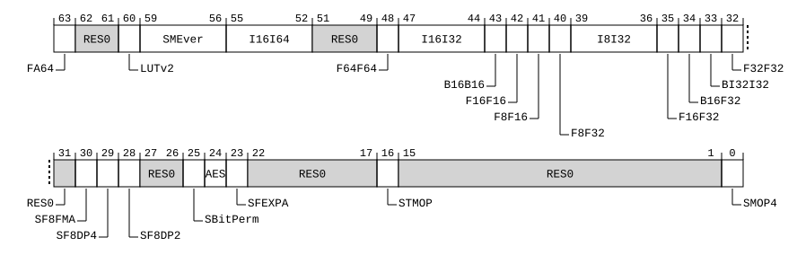

# ​D24.2.95 ID_AA64SMFR0_EL1, SME Feature ID Register 0

Source: <https://developer.arm.com/documentation/ddi0487/mc/-Part-D-The-AArch64-System-Level-Architecture/-Chapter-D24-AArch64-System-Register-Descriptions/-D24-2-General-system-control-registers/-D24-2-95-ID-AA64SMFR0-EL1--SME-Feature-ID-Register-0>

##### D24.2.95 ID\_AA64SMFR0\_EL1, SME Feature ID Register 0

The ID\_AA64SMFR0\_EL1 characteristics are:

Purpose
:   Provides information about the implemented features of the AArch64 Scalable Matrix Extension.

    The fields in this register do not follow the standard ID scheme. See [Alternative ID scheme used for ID\_AA64SMFR0\_EL1 and ID\_AA64FPFR0\_EL1](/documentation/ddi0487/mc/-Part-D-The-AArch64-System-Level-Architecture/-Chapter-D24-AArch64-System-Register-Descriptions/-D24-1-About-the-AArch64-System-registers/-D24-1-3-Principles-of-the-ID-scheme-for-fields-in-ID-registers?lang=en#babcegghg6).

Configuration
:   > #### Note
    >
    > Prior to the introduction of the features described by this register, this register was unnamed and reserved, RES0 from EL1, EL2, and EL3.

Attributes
:   ID\_AA64SMFR0\_EL1 is a 64-bit register.

###### Field descriptions



FA64, bit [63]
:   Indicates support at each Exception Level for execution of the full AArch64 Advanced SIMD and SVE instruction sets when the PE is in Streaming SVE mode.

    The value of this field is an IMPLEMENTATION DEFINED choice of:

<table>
 <colgroup>
  <col/>
  <col/>
 </colgroup>
 <thead>
  <tr>
   <th>
    <strong>
     FA64
    </strong>
   </th>
   <th>
    <strong>
     Meaning
    </strong>
   </th>
  </tr>
 </thead>
 <tbody>
  <tr>
   <td>
    <p>
     <code>
      0b0
     </code>
    </p>
   </td>
   <td>
    <p>
     Only those AArch64 instructions defined as being legal can be executed in streaming SVE mode.
    </p>
   </td>
  </tr>
  <tr>
   <td>
    <p>
     <code>
      0b1
     </code>
    </p>
   </td>
   <td>
    <p>
     All implemented AArch64 instructions are legal for execution in Streaming SVE mode, when enabled by
     <a class="document-topic" document-topic-path="/ddi0487/mc/-Part-D-The-AArch64-System-Level-Architecture/-Chapter-D24-AArch64-System-Register-Descriptions/-D24-2-General-system-control-registers/-D24-2-183-SMCR-EL1--SME-Control-Register--EL1-?lang=en#reg_aarch64_smcr_el1" href="/documentation/ddi0487/mc/-Part-D-The-AArch64-System-Level-Architecture/-Chapter-D24-AArch64-System-Register-Descriptions/-D24-2-General-system-control-registers/-D24-2-183-SMCR-EL1--SME-Control-Register--EL1-?lang=en#reg_aarch64_smcr_el1">
      SMCR_EL1
     </a>
     .FA64,
     <a class="document-topic" document-topic-path="/ddi0487/mc/-Part-D-The-AArch64-System-Level-Architecture/-Chapter-D24-AArch64-System-Register-Descriptions/-D24-2-General-system-control-registers/-D24-2-184-SMCR-EL2--SME-Control-Register--EL2-?lang=en#reg_aarch64_smcr_el2" href="/documentation/ddi0487/mc/-Part-D-The-AArch64-System-Level-Architecture/-Chapter-D24-AArch64-System-Register-Descriptions/-D24-2-General-system-control-registers/-D24-2-184-SMCR-EL2--SME-Control-Register--EL2-?lang=en#reg_aarch64_smcr_el2">
      SMCR_EL2
     </a>
     .FA64, and
     <a class="document-topic" document-topic-path="/ddi0487/mc/-Part-D-The-AArch64-System-Level-Architecture/-Chapter-D24-AArch64-System-Register-Descriptions/-D24-2-General-system-control-registers/-D24-2-185-SMCR-EL3--SME-Control-Register--EL3-?lang=en#reg_aarch64_smcr_el3" href="/documentation/ddi0487/mc/-Part-D-The-AArch64-System-Level-Architecture/-Chapter-D24-AArch64-System-Register-Descriptions/-D24-2-General-system-control-registers/-D24-2-185-SMCR-EL3--SME-Control-Register--EL3-?lang=en#reg_aarch64_smcr_el3">
      SMCR_EL3
     </a>
     .FA64.
    </p>
   </td>
  </tr>
 </tbody>
</table>

    [FEAT\_SME\_FA64](/documentation/ddi0487/mc/-Part-A-Arm-Architecture-Introduction-and-Overview/-Chapter-A2-A-profile-Architecture-Extensions/-A2-3-Armv9-A-architecture-extensions/-A2-3-3-The-Armv9-2-architecture-extension?lang=en#feat_feat_sme_fa64) implements the functionality identified by the value 1.

    Access to this field is RO.

Bits [62:61]
:   Reserved, RES0.

LUTv2, bit [60]
:   Indicates support for the following additional variants of SME2 lookup table `LUTI4` and `MOVT` instructions:

    - A `LUTI4` instruction with 8-bit result elements, two consecutively numbered source vectors, and four consecutively numbered destination vectors.
    - If [FEAT\_SME2p1](/documentation/ddi0487/mc/-Part-A-Arm-Architecture-Introduction-and-Overview/-Chapter-A2-A-profile-Architecture-Extensions/-A2-3-Armv9-A-architecture-extensions/-A2-3-5-The-Armv9-4-architecture-extension?lang=en#feat_feat_sme2p1) is implemented, a `LUTI4` instruction with 8-bit result elements, two consecutively numbered source vectors, and four destination vectors with strided register numbering.
    - A `MOVT` instruction that copies a single Z source vector to ZT0.

    The value of this field is an IMPLEMENTATION DEFINED choice of:

<table>
 <colgroup>
  <col/>
  <col/>
 </colgroup>
 <thead>
  <tr>
   <th>
    <strong>
     LUTv2
    </strong>
   </th>
   <th>
    <strong>
     Meaning
    </strong>
   </th>
  </tr>
 </thead>
 <tbody>
  <tr>
   <td>
    <p>
     <code>
      0b0
     </code>
    </p>
   </td>
   <td>
    <p>
     The specified instructions are not implemented by this control.
    </p>
   </td>
  </tr>
  <tr>
   <td>
    <p>
     <code>
      0b1
     </code>
    </p>
   </td>
   <td>
    <p>
     The specified instructions are implemented.
    </p>
   </td>
  </tr>
 </tbody>
</table>

    All other values are reserved.

    [FEAT\_SME\_LUTv2](/documentation/ddi0487/mc/-Part-A-Arm-Architecture-Introduction-and-Overview/-Chapter-A2-A-profile-Architecture-Extensions/-A2-3-Armv9-A-architecture-extensions/-A2-3-6-The-Armv9-5-architecture-extension?lang=en#feat_feat_sme_lutv2) implements the functionality identified by the value 1.

    Access to this field is RO.

SMEver, bits [59:56]
:   When FEAT\_SME is implemented:
    :   Indicates support for SME instructions.

        The value of this field is an IMPLEMENTATION DEFINED choice of:

<table>
 <colgroup>
  <col/>
  <col/>
 </colgroup>
 <thead>
  <tr>
   <th>
    <strong>
     SMEver
    </strong>
   </th>
   <th>
    <strong>
     Meaning
    </strong>
   </th>
  </tr>
 </thead>
 <tbody>
  <tr>
   <td>
    <p>
     <code>
      0b0000
     </code>
    </p>
   </td>
   <td>
    <p>
     The mandatory SME instructions are implemented.
    </p>
   </td>
  </tr>
  <tr>
   <td>
    <p>
     <code>
      0b0001
     </code>
    </p>
   </td>
   <td>
    <p>
     As
     <code>
      0b0000
     </code>
     , and adds the mandatory SME2 instructions.
    </p>
   </td>
  </tr>
  <tr>
   <td>
    <p>
     <code>
      0b0010
     </code>
    </p>
   </td>
   <td>
    <p>
     As
     <code>
      0b0001
     </code>
     , and adds the mandatory SME2.1 instructions.
    </p>
   </td>
  </tr>
  <tr>
   <td>
    <p>
     <code>
      0b0011
     </code>
    </p>
   </td>
   <td>
    <p>
     As
     <code>
      0b0010
     </code>
     , and adds the mandatory SME2.2 instructions.
    </p>
   </td>
  </tr>
 </tbody>
</table>

        All other values are reserved.

        [FEAT\_SME2](/documentation/ddi0487/mc/-Part-A-Arm-Architecture-Introduction-and-Overview/-Chapter-A2-A-profile-Architecture-Extensions/-A2-3-Armv9-A-architecture-extensions/-A2-3-4-The-Armv9-3-architecture-extension?lang=en#feat_feat_sme2) implements the functionality identified by the value `0b0001`.

        [FEAT\_SME2p1](/documentation/ddi0487/mc/-Part-A-Arm-Architecture-Introduction-and-Overview/-Chapter-A2-A-profile-Architecture-Extensions/-A2-3-Armv9-A-architecture-extensions/-A2-3-5-The-Armv9-4-architecture-extension?lang=en#feat_feat_sme2p1) implements the functionality identified by the value `0b0010`.

        From Armv9.4, the value `0b0001` is not permitted.

        [FEAT\_SME2p2](/documentation/ddi0487/mc/-Part-A-Arm-Architecture-Introduction-and-Overview/-Chapter-A2-A-profile-Architecture-Extensions/-A2-3-Armv9-A-architecture-extensions/-A2-3-7-The-Armv9-6-architecture-extension?lang=en#feat_feat_sme2p2) implements the functionality identified by `0b0011`.

        From Armv9.6, the values `0b0000` and `0b0010` are not permitted.

        Access to this field is RO.

    Otherwise:
    :   Reserved, RES0.

I16I64, bits [55:52]
:   Indicates support for the following SME instructions that accumulate into 64-bit integer elements in the ZA array:

    - The variants of the `ADDHA`, `ADDVA`, `SMOPA`, `SMOPS`, `SUMOPA`, `SUMOPS`, `UMOPA`, `UMOPS`, `USMOPA`, and `USMOPS` instructions that accumulate into 64-bit integer tiles.
    - When [FEAT\_SME2](/documentation/ddi0487/mc/-Part-A-Arm-Architecture-Introduction-and-Overview/-Chapter-A2-A-profile-Architecture-Extensions/-A2-3-Armv9-A-architecture-extensions/-A2-3-4-The-Armv9-3-architecture-extension?lang=en#feat_feat_sme2) is implemented, the variants of the `ADD`, `ADDA`, `SDOT`, `SMLALL`, `SMLSLL`, `SUB`, `SUBA`, `SVDOT`, `UDOT`, `UMLALL`, `UMLSLL`, and `UVDOT` instructions that accumulate into 64-bit integer elements in ZA array vectors.

    The value of this field is an IMPLEMENTATION DEFINED choice of:

<table>
 <colgroup>
  <col/>
  <col/>
 </colgroup>
 <thead>
  <tr>
   <th>
    <strong>
     I16I64
    </strong>
   </th>
   <th>
    <strong>
     Meaning
    </strong>
   </th>
  </tr>
 </thead>
 <tbody>
  <tr>
   <td>
    <p>
     <code>
      0b0000
     </code>
    </p>
   </td>
   <td>
    <p>
     The specified instructions are not implemented by this control.
    </p>
   </td>
  </tr>
  <tr>
   <td>
    <p>
     <code>
      0b1111
     </code>
    </p>
   </td>
   <td>
    <p>
     The specified instructions are implemented.
    </p>
   </td>
  </tr>
 </tbody>
</table>

    All other values are reserved.

    [FEAT\_SME\_I16I64](/documentation/ddi0487/mc/-Part-A-Arm-Architecture-Introduction-and-Overview/-Chapter-A2-A-profile-Architecture-Extensions/-A2-3-Armv9-A-architecture-extensions/-A2-3-3-The-Armv9-2-architecture-extension?lang=en#feat_feat_sme_i16i64) implements the functionality identified by the value `0b1111`.

    Access to this field is RO.

Bits [51:49]
:   Reserved, RES0.

F64F64, bit [48]
:   Indicates support for the following SME instructions that accumulate into double-precision floating-point elements in the ZA array:

    - The variants of the `FMOPA` and `FMOPS` instructions that accumulate into double-precision tiles.
    - When [FEAT\_SME2](/documentation/ddi0487/mc/-Part-A-Arm-Architecture-Introduction-and-Overview/-Chapter-A2-A-profile-Architecture-Extensions/-A2-3-Armv9-A-architecture-extensions/-A2-3-4-The-Armv9-3-architecture-extension?lang=en#feat_feat_sme2) is implemented, the variants of the `FADD`, `FMLA`, `FMLS`, and `FSUB` instructions that accumulate into double-precision elements in ZA array vectors.

    The value of this field is an IMPLEMENTATION DEFINED choice of:

<table>
 <colgroup>
  <col/>
  <col/>
 </colgroup>
 <thead>
  <tr>
   <th>
    <strong>
     F64F64
    </strong>
   </th>
   <th>
    <strong>
     Meaning
    </strong>
   </th>
  </tr>
 </thead>
 <tbody>
  <tr>
   <td>
    <p>
     <code>
      0b0
     </code>
    </p>
   </td>
   <td>
    <p>
     The specified instructions are not implemented by this control.
    </p>
   </td>
  </tr>
  <tr>
   <td>
    <p>
     <code>
      0b1
     </code>
    </p>
   </td>
   <td>
    <p>
     The specified instructions are implemented .
    </p>
   </td>
  </tr>
 </tbody>
</table>

    [FEAT\_SME\_F64F64](/documentation/ddi0487/mc/-Part-A-Arm-Architecture-Introduction-and-Overview/-Chapter-A2-A-profile-Architecture-Extensions/-A2-3-Armv9-A-architecture-extensions/-A2-3-3-The-Armv9-2-architecture-extension?lang=en#feat_feat_sme_f64f64) implements the functionality identified by the value 1.

    Access to this field is RO.

I16I32, bits [47:44]
:   When FEAT\_SME2 is implemented:
    :   Indicates support for SME2 `SMOPA` (2-way), `SMOPS` (2-way), `UMOPA` (2-way), and `UMOPS` (2-way) instructions that accumulate 16-bit outer products into 32-bit integer tiles.

        The value of this field is an IMPLEMENTATION DEFINED choice of:

<table>
 <colgroup>
  <col/>
  <col/>
 </colgroup>
 <thead>
  <tr>
   <th>
    <strong>
     I16I32
    </strong>
   </th>
   <th>
    <strong>
     Meaning
    </strong>
   </th>
  </tr>
 </thead>
 <tbody>
  <tr>
   <td>
    <p>
     <code>
      0b0000
     </code>
    </p>
   </td>
   <td>
    <p>
     The specified instructions are not implemented by this control.
    </p>
   </td>
  </tr>
  <tr>
   <td>
    <p>
     <code>
      0b0101
     </code>
    </p>
   </td>
   <td>
    <p>
     The specified instructions are implemented.
    </p>
   </td>
  </tr>
 </tbody>
</table>

        All other values are reserved.

        If [FEAT\_SME2](/documentation/ddi0487/mc/-Part-A-Arm-Architecture-Introduction-and-Overview/-Chapter-A2-A-profile-Architecture-Extensions/-A2-3-Armv9-A-architecture-extensions/-A2-3-4-The-Armv9-3-architecture-extension?lang=en#feat_feat_sme2) is implemented, the value `0b0000` is not permitted.

        Access to this field is RO.

    Otherwise:
    :   Reserved, RES0.

B16B16, bit [43]
:   Indicates support for the SME ZA-targeting non-widening BFloat16 `BFADD`, `BFMLA`, `BFMLS`, `BFMOPA`, `BFMOPS`, and `BFSUB` instructions with BFloat16 operands and results.

    The value of this field is an IMPLEMENTATION DEFINED choice of:

<table>
 <colgroup>
  <col/>
  <col/>
 </colgroup>
 <thead>
  <tr>
   <th>
    <strong>
     B16B16
    </strong>
   </th>
   <th>
    <strong>
     Meaning
    </strong>
   </th>
  </tr>
 </thead>
 <tbody>
  <tr>
   <td>
    <p>
     <code>
      0b0
     </code>
    </p>
   </td>
   <td>
    <p>
     The specified instructions are not implemented by this control.
    </p>
   </td>
  </tr>
  <tr>
   <td>
    <p>
     <code>
      0b1
     </code>
    </p>
   </td>
   <td>
    <p>
     The specified instructions are implemented.
    </p>
   </td>
  </tr>
 </tbody>
</table>

    [FEAT\_SME\_B16B16](/documentation/ddi0487/mc/-Part-A-Arm-Architecture-Introduction-and-Overview/-Chapter-A2-A-profile-Architecture-Extensions/-A2-3-Armv9-A-architecture-extensions/-A2-3-5-The-Armv9-4-architecture-extension?lang=en#feat_feat_sme_b16b16) implements the functionality identified by the value 1.

    Access to this field is RO.

F16F16, bit [42]
:   Indicates support for the following SME2 half-precision floating-point instructions:

    - `FMOPA` and `FMOPS` instructions that accumulate half-precision outer-products into half-precision tiles.
    - Multi-vector `FADD`, `FMLA`, `FMLS`, and `FSUB` instructions with half-precision operands and results.
    - Multi-vector `FCVT` and `FCVTL` instructions that convert half-precision inputs to single-precision results.

    The value of this field is an IMPLEMENTATION DEFINED choice of:

<table>
 <colgroup>
  <col/>
  <col/>
 </colgroup>
 <thead>
  <tr>
   <th>
    <strong>
     F16F16
    </strong>
   </th>
   <th>
    <strong>
     Meaning
    </strong>
   </th>
  </tr>
 </thead>
 <tbody>
  <tr>
   <td>
    <p>
     <code>
      0b0
     </code>
    </p>
   </td>
   <td>
    <p>
     The specified instructions are not implemented by this control.
    </p>
   </td>
  </tr>
  <tr>
   <td>
    <p>
     <code>
      0b1
     </code>
    </p>
   </td>
   <td>
    <p>
     The specified instructions are implemented.
    </p>
   </td>
  </tr>
 </tbody>
</table>

    [FEAT\_SME\_F16F16](/documentation/ddi0487/mc/-Part-A-Arm-Architecture-Introduction-and-Overview/-Chapter-A2-A-profile-Architecture-Extensions/-A2-3-Armv9-A-architecture-extensions/-A2-3-5-The-Armv9-4-architecture-extension?lang=en#feat_feat_sme_f16f16) implements the functionality identified by the value 1.

    Access to this field is RO.

F8F16, bit [41]
:   Indicates support for the following SME2 instructions:

    - The ZA-targeting FP8 instructions `FDOT` (2-way), `FMLAL`, `FMOPA` (2-way), and `FVDOT` that accumulate into half-precision floating-point elements.
    - ZA-targeting non-widening half-precision `FADD` and `FSUB` instructions.

    The value of this field is an IMPLEMENTATION DEFINED choice of:

<table>
 <colgroup>
  <col/>
  <col/>
 </colgroup>
 <thead>
  <tr>
   <th>
    <strong>
     F8F16
    </strong>
   </th>
   <th>
    <strong>
     Meaning
    </strong>
   </th>
  </tr>
 </thead>
 <tbody>
  <tr>
   <td>
    <p>
     <code>
      0b0
     </code>
    </p>
   </td>
   <td>
    <p>
     The specified instructions are not implemented by this control.
    </p>
   </td>
  </tr>
  <tr>
   <td>
    <p>
     <code>
      0b1
     </code>
    </p>
   </td>
   <td>
    <p>
     The specified instructions are implemented.
    </p>
   </td>
  </tr>
 </tbody>
</table>

    [FEAT\_SME\_F8F16](/documentation/ddi0487/mc/-Part-A-Arm-Architecture-Introduction-and-Overview/-Chapter-A2-A-profile-Architecture-Extensions/-A2-3-Armv9-A-architecture-extensions/-A2-3-6-The-Armv9-5-architecture-extension?lang=en#feat_feat_sme_f8f16) implements the functionality identified by the value 1.

    Access to this field is RO.

F8F32, bit [40]
:   Indicates support for the SME2 ZA-targeting FP8 `FDOT` (4-way), `FMLALL`, `FMOPA` (4-way), `FVDOTB`, and `FVDOTT` instructions that accumulate into single-precision floating-point elements.

    The value of this field is an IMPLEMENTATION DEFINED choice of:

<table>
 <colgroup>
  <col/>
  <col/>
 </colgroup>
 <thead>
  <tr>
   <th>
    <strong>
     F8F32
    </strong>
   </th>
   <th>
    <strong>
     Meaning
    </strong>
   </th>
  </tr>
 </thead>
 <tbody>
  <tr>
   <td>
    <p>
     <code>
      0b0
     </code>
    </p>
   </td>
   <td>
    <p>
     The specified instructions are not implemented by this control.
    </p>
   </td>
  </tr>
  <tr>
   <td>
    <p>
     <code>
      0b1
     </code>
    </p>
   </td>
   <td>
    <p>
     The specified instructions are implemented.
    </p>
   </td>
  </tr>
 </tbody>
</table>

    [FEAT\_SME\_F8F32](/documentation/ddi0487/mc/-Part-A-Arm-Architecture-Introduction-and-Overview/-Chapter-A2-A-profile-Architecture-Extensions/-A2-3-Armv9-A-architecture-extensions/-A2-3-6-The-Armv9-5-architecture-extension?lang=en#feat_feat_sme_f8f32) implements the functionality identified by the value 1.

    Access to this field is RO.

I8I32, bits [39:36]
:   When FEAT\_SME is implemented:
    :   Indicates support for SME `SMOPA`, `SMOPS`, `SUMOPA`, `SUMOPS`, `UMOPA`, `UMOPS`, `USMOPA`, and `USMOPS` instructions that accumulate 8-bit outer products into 32-bit tiles

        The value of this field is an IMPLEMENTATION DEFINED choice of:

<table>
 <colgroup>
  <col/>
  <col/>
 </colgroup>
 <thead>
  <tr>
   <th>
    <strong>
     I8I32
    </strong>
   </th>
   <th>
    <strong>
     Meaning
    </strong>
   </th>
  </tr>
 </thead>
 <tbody>
  <tr>
   <td>
    <p>
     <code>
      0b0000
     </code>
    </p>
   </td>
   <td>
    <p>
     The specified instructions are not implemented by this control.
    </p>
   </td>
  </tr>
  <tr>
   <td>
    <p>
     <code>
      0b1111
     </code>
    </p>
   </td>
   <td>
    <p>
     The specified instructions are implemented.
    </p>
   </td>
  </tr>
 </tbody>
</table>

        All other values are reserved.

        If [FEAT\_SME](/documentation/ddi0487/mc/-Part-A-Arm-Architecture-Introduction-and-Overview/-Chapter-A2-A-profile-Architecture-Extensions/-A2-3-Armv9-A-architecture-extensions/-A2-3-3-The-Armv9-2-architecture-extension?lang=en#feat_feat_sme) is implemented, the value `0b0000` is not permitted.

        Access to this field is RO.

    Otherwise:
    :   Reserved, RES0.

F16F32, bit [35]
:   When FEAT\_SME is implemented:
    :   Indicates support for SME `FMOPA` and `FMOPS` instructions that accumulate half-precision floating-point outer products into single-precision floating-point tiles.

        The value of this field is an IMPLEMENTATION DEFINED choice of:

<table>
 <colgroup>
  <col/>
  <col/>
 </colgroup>
 <thead>
  <tr>
   <th>
    <strong>
     F16F32
    </strong>
   </th>
   <th>
    <strong>
     Meaning
    </strong>
   </th>
  </tr>
 </thead>
 <tbody>
  <tr>
   <td>
    <p>
     <code>
      0b0
     </code>
    </p>
   </td>
   <td>
    <p>
     The specified instructions are not implemented by this control.
    </p>
   </td>
  </tr>
  <tr>
   <td>
    <p>
     <code>
      0b1
     </code>
    </p>
   </td>
   <td>
    <p>
     The specified instructions are implemented.
    </p>
   </td>
  </tr>
 </tbody>
</table>

        If [FEAT\_SME](/documentation/ddi0487/mc/-Part-A-Arm-Architecture-Introduction-and-Overview/-Chapter-A2-A-profile-Architecture-Extensions/-A2-3-Armv9-A-architecture-extensions/-A2-3-3-The-Armv9-2-architecture-extension?lang=en#feat_feat_sme) is implemented, the value 0 is not permitted.

        Access to this field is RO.

    Otherwise:
    :   Reserved, RES0.

B16F32, bit [34]
:   When FEAT\_SME is implemented:
    :   Indicates support for SME `BFMOPA` and `BFMOPS` instructions that accumulate BFloat16 outer products into single-precision floating-point tiles.

        The value of this field is an IMPLEMENTATION DEFINED choice of:

<table>
 <colgroup>
  <col/>
  <col/>
 </colgroup>
 <thead>
  <tr>
   <th>
    <strong>
     B16F32
    </strong>
   </th>
   <th>
    <strong>
     Meaning
    </strong>
   </th>
  </tr>
 </thead>
 <tbody>
  <tr>
   <td>
    <p>
     <code>
      0b0
     </code>
    </p>
   </td>
   <td>
    <p>
     The specified instructions are not implemented by this control.
    </p>
   </td>
  </tr>
  <tr>
   <td>
    <p>
     <code>
      0b1
     </code>
    </p>
   </td>
   <td>
    <p>
     The specified instructions are implemented.
    </p>
   </td>
  </tr>
 </tbody>
</table>

        If [FEAT\_SME](/documentation/ddi0487/mc/-Part-A-Arm-Architecture-Introduction-and-Overview/-Chapter-A2-A-profile-Architecture-Extensions/-A2-3-Armv9-A-architecture-extensions/-A2-3-3-The-Armv9-2-architecture-extension?lang=en#feat_feat_sme) is implemented, the value 0 is not permitted.

        Access to this field is RO.

    Otherwise:
    :   Reserved, RES0.

BI32I32, bit [33]
:   When FEAT\_SME2 is implemented:
    :   Indicates support for SME `BMOPA` and `BMOPS` instructions that accumulate thirty-two 1-bit binary outer products into 32-bit integer tiles.

        The value of this field is an IMPLEMENTATION DEFINED choice of:

<table>
 <colgroup>
  <col/>
  <col/>
 </colgroup>
 <thead>
  <tr>
   <th>
    <strong>
     BI32I32
    </strong>
   </th>
   <th>
    <strong>
     Meaning
    </strong>
   </th>
  </tr>
 </thead>
 <tbody>
  <tr>
   <td>
    <p>
     <code>
      0b0
     </code>
    </p>
   </td>
   <td>
    <p>
     The specified instructions are not implemented by this control.
    </p>
   </td>
  </tr>
  <tr>
   <td>
    <p>
     <code>
      0b1
     </code>
    </p>
   </td>
   <td>
    <p>
     The specified instructions are implemented.
    </p>
   </td>
  </tr>
 </tbody>
</table>

        If [FEAT\_SME2](/documentation/ddi0487/mc/-Part-A-Arm-Architecture-Introduction-and-Overview/-Chapter-A2-A-profile-Architecture-Extensions/-A2-3-Armv9-A-architecture-extensions/-A2-3-4-The-Armv9-3-architecture-extension?lang=en#feat_feat_sme2) is implemented, the value 0 is not permitted.

        Access to this field is RO.

    Otherwise:
    :   Reserved, RES0.

F32F32, bit [32]
:   When FEAT\_SME is implemented:
    :   Indicates support for SME `FMOPA` and `FMOPS` instructions that accumulate single-precision floating-point outer products into single-precision floating-point tiles.

        The value of this field is an IMPLEMENTATION DEFINED choice of:

<table>
 <colgroup>
  <col/>
  <col/>
 </colgroup>
 <thead>
  <tr>
   <th>
    <strong>
     F32F32
    </strong>
   </th>
   <th>
    <strong>
     Meaning
    </strong>
   </th>
  </tr>
 </thead>
 <tbody>
  <tr>
   <td>
    <p>
     <code>
      0b0
     </code>
    </p>
   </td>
   <td>
    <p>
     The specified instructions are not implemented by this control.
    </p>
   </td>
  </tr>
  <tr>
   <td>
    <p>
     <code>
      0b1
     </code>
    </p>
   </td>
   <td>
    <p>
     The specified instructions are implemented.
    </p>
   </td>
  </tr>
 </tbody>
</table>

        If [FEAT\_SME](/documentation/ddi0487/mc/-Part-A-Arm-Architecture-Introduction-and-Overview/-Chapter-A2-A-profile-Architecture-Extensions/-A2-3-Armv9-A-architecture-extensions/-A2-3-3-The-Armv9-2-architecture-extension?lang=en#feat_feat_sme) is implemented, the value 0 is not permitted.

        Access to this field is RO.

    Otherwise:
    :   Reserved, RES0.

Bit [31]
:   Reserved, RES0.

SF8FMA, bit [30]
:   Indicates support for the SVE2 FP8 to single-precision and half-precision multiply-accumulate `FMLALB`, `FMLALT`, `FMLALLBB`, `FMLALLBT`, `FMLALLTB`, and `FMLALLTT` instructions when the PE is in Streaming SVE mode.

    The value of this field is an IMPLEMENTATION DEFINED choice of:

<table>
 <colgroup>
  <col/>
  <col/>
 </colgroup>
 <thead>
  <tr>
   <th>
    <strong>
     SF8FMA
    </strong>
   </th>
   <th>
    <strong>
     Meaning
    </strong>
   </th>
  </tr>
 </thead>
 <tbody>
  <tr>
   <td>
    <p>
     <code>
      0b0
     </code>
    </p>
   </td>
   <td>
    <p>
     This control has no effect on Streaming SVE mode behavior.
    </p>
   </td>
  </tr>
  <tr>
   <td>
    <p>
     <code>
      0b1
     </code>
    </p>
   </td>
   <td>
    <p>
     The specified instructions are supported in Streaming SVE mode.
    </p>
   </td>
  </tr>
 </tbody>
</table>

    > #### Note
    >
    > Other features may support some of the specified instructions in Non-streaming SVE mode.

    If [FEAT\_SME2](/documentation/ddi0487/mc/-Part-A-Arm-Architecture-Introduction-and-Overview/-Chapter-A2-A-profile-Architecture-Extensions/-A2-3-Armv9-A-architecture-extensions/-A2-3-4-The-Armv9-3-architecture-extension?lang=en#feat_feat_sme2) and [FEAT\_FP8FMA](/documentation/ddi0487/mc/-Part-A-Arm-Architecture-Introduction-and-Overview/-Chapter-A2-A-profile-Architecture-Extensions/-A2-3-Armv9-A-architecture-extensions/-A2-3-6-The-Armv9-5-architecture-extension?lang=en#feat_feat_fp8fma) are implemented, the value 0 is not permitted.

    [FEAT\_SSVE\_FP8FMA](/documentation/ddi0487/mc/-Part-A-Arm-Architecture-Introduction-and-Overview/-Chapter-A2-A-profile-Architecture-Extensions/-A2-3-Armv9-A-architecture-extensions/-A2-3-6-The-Armv9-5-architecture-extension?lang=en#feat_feat_ssve_fp8fma) implements the functionality identified by the value 1.

    Access to this field is RO.

SF8DP4, bit [29]
:   Indicates support for the SVE2 FP8 to single-precision 4-way dot product `FDOT` (4-way) instructions when the PE is in Streaming SVE mode.

    The value of this field is an IMPLEMENTATION DEFINED choice of:

<table>
 <colgroup>
  <col/>
  <col/>
 </colgroup>
 <thead>
  <tr>
   <th>
    <strong>
     SF8DP4
    </strong>
   </th>
   <th>
    <strong>
     Meaning
    </strong>
   </th>
  </tr>
 </thead>
 <tbody>
  <tr>
   <td>
    <p>
     <code>
      0b0
     </code>
    </p>
   </td>
   <td>
    <p>
     This control has no effect on Streaming SVE mode behavior.
    </p>
   </td>
  </tr>
  <tr>
   <td>
    <p>
     <code>
      0b1
     </code>
    </p>
   </td>
   <td>
    <p>
     The specified instructions are supported in Streaming SVE mode.
    </p>
   </td>
  </tr>
 </tbody>
</table>

    > #### Note
    >
    > Other features may support some of the specified instructions in Non-streaming SVE mode.

    If [FEAT\_SME2](/documentation/ddi0487/mc/-Part-A-Arm-Architecture-Introduction-and-Overview/-Chapter-A2-A-profile-Architecture-Extensions/-A2-3-Armv9-A-architecture-extensions/-A2-3-4-The-Armv9-3-architecture-extension?lang=en#feat_feat_sme2) and [FEAT\_FP8DOT4](/documentation/ddi0487/mc/-Part-A-Arm-Architecture-Introduction-and-Overview/-Chapter-A2-A-profile-Architecture-Extensions/-A2-3-Armv9-A-architecture-extensions/-A2-3-6-The-Armv9-5-architecture-extension?lang=en#feat_feat_fp8dot4) are implemented, the value 0 is not permitted.

    [FEAT\_SSVE\_FP8DOT4](/documentation/ddi0487/mc/-Part-A-Arm-Architecture-Introduction-and-Overview/-Chapter-A2-A-profile-Architecture-Extensions/-A2-3-Armv9-A-architecture-extensions/-A2-3-6-The-Armv9-5-architecture-extension?lang=en#feat_feat_ssve_fp8dot4) implements the functionality identified by the value 1.

    Access to this field is RO.

SF8DP2, bit [28]
:   Indicates support for the SVE2 FP8 to half-precision 2-way dot product `FDOT` (2-way) instructions when the PE is in Streaming SVE mode.

    The value of this field is an IMPLEMENTATION DEFINED choice of:

<table>
 <colgroup>
  <col/>
  <col/>
 </colgroup>
 <thead>
  <tr>
   <th>
    <strong>
     SF8DP2
    </strong>
   </th>
   <th>
    <strong>
     Meaning
    </strong>
   </th>
  </tr>
 </thead>
 <tbody>
  <tr>
   <td>
    <p>
     <code>
      0b0
     </code>
    </p>
   </td>
   <td>
    <p>
     This control has no effect on Streaming SVE mode behavior.
    </p>
   </td>
  </tr>
  <tr>
   <td>
    <p>
     <code>
      0b1
     </code>
    </p>
   </td>
   <td>
    <p>
     The specified instructions are supported in Streaming SVE mode.
    </p>
   </td>
  </tr>
 </tbody>
</table>

    > #### Note
    >
    > Other features may support some of the specified instructions in Non-streaming SVE mode.

    If [FEAT\_SME2](/documentation/ddi0487/mc/-Part-A-Arm-Architecture-Introduction-and-Overview/-Chapter-A2-A-profile-Architecture-Extensions/-A2-3-Armv9-A-architecture-extensions/-A2-3-4-The-Armv9-3-architecture-extension?lang=en#feat_feat_sme2) and [FEAT\_FP8DOT2](/documentation/ddi0487/mc/-Part-A-Arm-Architecture-Introduction-and-Overview/-Chapter-A2-A-profile-Architecture-Extensions/-A2-3-Armv9-A-architecture-extensions/-A2-3-6-The-Armv9-5-architecture-extension?lang=en#feat_feat_fp8dot2) are implemented, the value 0 is not permitted.

    [FEAT\_SSVE\_FP8DOT2](/documentation/ddi0487/mc/-Part-A-Arm-Architecture-Introduction-and-Overview/-Chapter-A2-A-profile-Architecture-Extensions/-A2-3-Armv9-A-architecture-extensions/-A2-3-6-The-Armv9-5-architecture-extension?lang=en#feat_feat_ssve_fp8dot2) implements the functionality identified by the value 1.

    Access to this field is RO.

Bits [27:26]
:   Reserved, RES0.

SBitPerm, bit [25]
:   Indicates support for the SVE bit permute instructions identified as implemented by [ID\_AA64ZFR0\_EL1](/documentation/ddi0487/mc/-Part-D-The-AArch64-System-Level-Architecture/-Chapter-D24-AArch64-System-Register-Descriptions/-D24-2-General-system-control-registers/-D24-2-96-ID-AA64ZFR0-EL1--SVE-Feature-ID-Register-0?lang=en#reg_aarch64_id_aa64zfr0_el1).BitPerm, when the PE is in Streaming SVE mode.

    The value of this field is an IMPLEMENTATION DEFINED choice of:

<table>
 <colgroup>
  <col/>
  <col/>
 </colgroup>
 <thead>
  <tr>
   <th>
    <strong>
     SBitPerm
    </strong>
   </th>
   <th>
    <strong>
     Meaning
    </strong>
   </th>
  </tr>
 </thead>
 <tbody>
  <tr>
   <td>
    <p>
     <code>
      0b0
     </code>
    </p>
   </td>
   <td>
    <p>
     This control has no effect on Streaming SVE mode behavior.
    </p>
   </td>
  </tr>
  <tr>
   <td>
    <p>
     <code>
      0b1
     </code>
    </p>
   </td>
   <td>
    <p>
     The specified instructions are implemented when the PE is in Streaming SVE mode.
    </p>
   </td>
  </tr>
 </tbody>
</table>

    > #### Note
    >
    > Other features may support some of the specified instructions in Non-streaming SVE mode.

    [FEAT\_SSVE\_BitPerm](/documentation/ddi0487/mc/-Part-A-Arm-Architecture-Introduction-and-Overview/-Chapter-A2-A-profile-Architecture-Extensions/-A2-3-Armv9-A-architecture-extensions/-A2-3-7-The-Armv9-6-architecture-extension?lang=en#feat_feat_ssve_bitperm) implements the functionality identified by the value 1.

    Access to this field is RO.

AES, bit [24]
:   Indicates support for the SVE AES and 128-bit polynomial multiply long instructions identified as implemented by [ID\_AA64ZFR0\_EL1](/documentation/ddi0487/mc/-Part-D-The-AArch64-System-Level-Architecture/-Chapter-D24-AArch64-System-Register-Descriptions/-D24-2-General-system-control-registers/-D24-2-96-ID-AA64ZFR0-EL1--SVE-Feature-ID-Register-0?lang=en#reg_aarch64_id_aa64zfr0_el1).AES, when the PE is in Streaming SVE mode.

    The value of this field is an IMPLEMENTATION DEFINED choice of:

<table>
 <colgroup>
  <col/>
  <col/>
 </colgroup>
 <thead>
  <tr>
   <th>
    <strong>
     AES
    </strong>
   </th>
   <th>
    <strong>
     Meaning
    </strong>
   </th>
  </tr>
 </thead>
 <tbody>
  <tr>
   <td>
    <p>
     <code>
      0b0
     </code>
    </p>
   </td>
   <td>
    <p>
     This control has no effect on Streaming SVE mode behavior.
    </p>
   </td>
  </tr>
  <tr>
   <td>
    <p>
     <code>
      0b1
     </code>
    </p>
   </td>
   <td>
    <p>
     The specified instructions are supported when the PE is in Streaming SVE mode.
    </p>
   </td>
  </tr>
 </tbody>
</table>

    > #### Note
    >
    > Other features may support some of the specified instructions in Non-streaming SVE mode.

    [FEAT\_SSVE\_AES](/documentation/ddi0487/mc/-Part-A-Arm-Architecture-Introduction-and-Overview/-Chapter-A2-A-profile-Architecture-Extensions/-A2-3-Armv9-A-architecture-extensions/-A2-3-7-The-Armv9-6-architecture-extension?lang=en#feat_feat_ssve_aes) implements the functionality identified by the value 1.

    Access to this field is RO.

SFEXPA, bit [23]
:   Indicates support for the SVE `FEXPA` instruction when the PE is in Streaming SVE mode.

    The value of this field is an IMPLEMENTATION DEFINED choice of:

<table>
 <colgroup>
  <col/>
  <col/>
 </colgroup>
 <thead>
  <tr>
   <th>
    <strong>
     SFEXPA
    </strong>
   </th>
   <th>
    <strong>
     Meaning
    </strong>
   </th>
  </tr>
 </thead>
 <tbody>
  <tr>
   <td>
    <p>
     <code>
      0b0
     </code>
    </p>
   </td>
   <td>
    <p>
     This control has no effect on Streaming SVE mode behavior.
    </p>
   </td>
  </tr>
  <tr>
   <td>
    <p>
     <code>
      0b1
     </code>
    </p>
   </td>
   <td>
    <p>
     The specified instruction is supported when the PE is in Streaming SVE mode.
    </p>
   </td>
  </tr>
 </tbody>
</table>

    > #### Note
    >
    > Other features may support some of the specified instructions in Non-streaming SVE mode.

    [FEAT\_SSVE\_FEXPA](/documentation/ddi0487/mc/-Part-A-Arm-Architecture-Introduction-and-Overview/-Chapter-A2-A-profile-Architecture-Extensions/-A2-3-Armv9-A-architecture-extensions/-A2-3-7-The-Armv9-6-architecture-extension?lang=en#feat_feat_ssve_fexpa) implements the functionality identified by the value 1.

    Access to this field is RO.

Bits [22:17]
:   Reserved, RES0.

STMOP, bit [16]
:   Indicates support for the following SME Structured sparsity outer product instructions:

    - `BFTMOPA` (non-widening), if [FEAT\_SME\_B16B16](/documentation/ddi0487/mc/-Part-A-Arm-Architecture-Introduction-and-Overview/-Chapter-A2-A-profile-Architecture-Extensions/-A2-3-Armv9-A-architecture-extensions/-A2-3-5-The-Armv9-4-architecture-extension?lang=en#feat_feat_sme_b16b16) is implemented.
    - `BFTMOPA` (widening, BF16 to FP32).
    - `FTMOPA` (non-widening, FP16), if [FEAT\_SME\_F16F16](/documentation/ddi0487/mc/-Part-A-Arm-Architecture-Introduction-and-Overview/-Chapter-A2-A-profile-Architecture-Extensions/-A2-3-Armv9-A-architecture-extensions/-A2-3-5-The-Armv9-4-architecture-extension?lang=en#feat_feat_sme_f16f16) is implemented.
    - `FTMOPA` (non-widening, FP32).
    - `FTMOPA` (widening, 2-way, FP16 to FP32).
    - `FTMOPA` (widening, 2-way, FP8 to FP16), if [FEAT\_SME\_F8F16](/documentation/ddi0487/mc/-Part-A-Arm-Architecture-Introduction-and-Overview/-Chapter-A2-A-profile-Architecture-Extensions/-A2-3-Armv9-A-architecture-extensions/-A2-3-6-The-Armv9-5-architecture-extension?lang=en#feat_feat_sme_f8f16) is implemented.
    - `FTMOPA` (widening, 4-way, FP8 to FP32) if [FEAT\_SME\_F8F32](/documentation/ddi0487/mc/-Part-A-Arm-Architecture-Introduction-and-Overview/-Chapter-A2-A-profile-Architecture-Extensions/-A2-3-Armv9-A-architecture-extensions/-A2-3-6-The-Armv9-5-architecture-extension?lang=en#feat_feat_sme_f8f32) is implemented.
    - `STMOPA`, `SUTMOPA`, `USTMOPA`, `UTMOPA` (4-way, Int8 to Int32). `STMOPA`, `UTMOPA` (2-way, Int16 to Int32).

    The value of this field is an IMPLEMENTATION DEFINED choice of:

<table>
 <colgroup>
  <col/>
  <col/>
 </colgroup>
 <thead>
  <tr>
   <th>
    <strong>
     STMOP
    </strong>
   </th>
   <th>
    <strong>
     Meaning
    </strong>
   </th>
  </tr>
 </thead>
 <tbody>
  <tr>
   <td>
    <p>
     <code>
      0b0
     </code>
    </p>
   </td>
   <td>
    <p>
     The specified instructions are not implemented by this control.
    </p>
   </td>
  </tr>
  <tr>
   <td>
    <p>
     <code>
      0b1
     </code>
    </p>
   </td>
   <td>
    <p>
     The specified instructions are implemented.
    </p>
   </td>
  </tr>
 </tbody>
</table>

    [FEAT\_SME\_TMOP](/documentation/ddi0487/mc/-Part-A-Arm-Architecture-Introduction-and-Overview/-Chapter-A2-A-profile-Architecture-Extensions/-A2-3-Armv9-A-architecture-extensions/-A2-3-7-The-Armv9-6-architecture-extension?lang=en#feat_feat_sme_tmop) implements the functionality identified by the value 1.

    Access to this field is RO.

Bits [15:1]
:   Reserved, RES0.

SMOP4, bit [0]
:   Indicates support for the following SME Quarter-tile outer product instructions:

    - `BFMOP4A`, `BFMOP4S` (non-widening, BF16), if [FEAT\_SME\_B16B16](/documentation/ddi0487/mc/-Part-A-Arm-Architecture-Introduction-and-Overview/-Chapter-A2-A-profile-Architecture-Extensions/-A2-3-Armv9-A-architecture-extensions/-A2-3-5-The-Armv9-4-architecture-extension?lang=en#feat_feat_sme_b16b16) is implemented.
    - `BFMOP4A`, `BFMOP4S` (widening, 2-way, BF16 to FP32).
    - `FMOP4A`, `FMOP4S` (non-widening, FP16), if [FEAT\_SME\_F16F16](/documentation/ddi0487/mc/-Part-A-Arm-Architecture-Introduction-and-Overview/-Chapter-A2-A-profile-Architecture-Extensions/-A2-3-Armv9-A-architecture-extensions/-A2-3-5-The-Armv9-4-architecture-extension?lang=en#feat_feat_sme_f16f16) is implemented.
    - `FMOP4A`, `FMOP4S` (non-widening, FP32).
    - `FMOP4A`, `FMOP4S` (non-widening, FP64), if [FEAT\_SME\_F64F64](/documentation/ddi0487/mc/-Part-A-Arm-Architecture-Introduction-and-Overview/-Chapter-A2-A-profile-Architecture-Extensions/-A2-3-Armv9-A-architecture-extensions/-A2-3-3-The-Armv9-2-architecture-extension?lang=en#feat_feat_sme_f64f64) is implemented.
    - `FMOP4A`, `FMOP4S` (widening, 2-way, FP16 to FP32).
    - `FMOP4A`(widening, 2-way, FP8 to FP16), if [FEAT\_SME\_F8F16](/documentation/ddi0487/mc/-Part-A-Arm-Architecture-Introduction-and-Overview/-Chapter-A2-A-profile-Architecture-Extensions/-A2-3-Armv9-A-architecture-extensions/-A2-3-6-The-Armv9-5-architecture-extension?lang=en#feat_feat_sme_f8f16) is implemented.
    - `FMOP4A`(widening, 4-way, FP8 to FP32) instruction, if [FEAT\_SME\_F8F32](/documentation/ddi0487/mc/-Part-A-Arm-Architecture-Introduction-and-Overview/-Chapter-A2-A-profile-Architecture-Extensions/-A2-3-Armv9-A-architecture-extensions/-A2-3-6-The-Armv9-5-architecture-extension?lang=en#feat_feat_sme_f8f32) is implemented.
    - `SMOP4A`, `SMOP4S`, `SUMOP4A`, `SUMOP4S`, `UMOP4A`, `UMOP4S`, `USMOP4A`, `USMOP4S` (4-way, Int8 to Int32).
    - `SMOP4A`, `SMOP4S`, `SUMOP4A`, `SUMOP4S`, `UMOP4A`, `UMOP4S`, `USMOP4A`, `USMOP4S` (4-way, Int16 to Int64), if [FEAT\_SME\_I16I64](/documentation/ddi0487/mc/-Part-A-Arm-Architecture-Introduction-and-Overview/-Chapter-A2-A-profile-Architecture-Extensions/-A2-3-Armv9-A-architecture-extensions/-A2-3-3-The-Armv9-2-architecture-extension?lang=en#feat_feat_sme_i16i64) is implemented.
    - `SMOP4A`, `SMOP4S`, `UMOP4A`, `UMOP4S` (2-way, Int16 to Int32).

    The value of this field is an IMPLEMENTATION DEFINED choice of:

<table>
 <colgroup>
  <col/>
  <col/>
 </colgroup>
 <thead>
  <tr>
   <th>
    <strong>
     SMOP4
    </strong>
   </th>
   <th>
    <strong>
     Meaning
    </strong>
   </th>
  </tr>
 </thead>
 <tbody>
  <tr>
   <td>
    <p>
     <code>
      0b0
     </code>
    </p>
   </td>
   <td>
    <p>
     The specified instructions are not implemented by this control.
    </p>
   </td>
  </tr>
  <tr>
   <td>
    <p>
     <code>
      0b1
     </code>
    </p>
   </td>
   <td>
    <p>
     The specified instructions are implemented.
    </p>
   </td>
  </tr>
 </tbody>
</table>

    [FEAT\_SME\_MOP4](/documentation/ddi0487/mc/-Part-A-Arm-Architecture-Introduction-and-Overview/-Chapter-A2-A-profile-Architecture-Extensions/-A2-3-Armv9-A-architecture-extensions/-A2-3-7-The-Armv9-6-architecture-extension?lang=en#feat_feat_sme_mop4) implements the functionality identified by the value 1.

    Access to this field is RO.

###### Accessing ID\_AA64SMFR0\_EL1

This register is read-only and can be accessed from EL1 and higher.

This register is only accessible from the AArch64 state.

Accesses to this register use the following encodings in the System register encoding space:

###### `MRS <Xt>, ID_AA64SMFR0_EL1`

<table>
 <colgroup>
  <col/>
  <col/>
  <col/>
  <col/>
  <col/>
 </colgroup>
 <thead>
  <tr>
   <th>
    <strong>
     op0
    </strong>
   </th>
   <th>
    <strong>
     op1
    </strong>
   </th>
   <th>
    <strong>
     CRn
    </strong>
   </th>
   <th>
    <strong>
     CRm
    </strong>
   </th>
   <th>
    <strong>
     op2
    </strong>
   </th>
  </tr>
 </thead>
 <tbody>
  <tr>
   <td>
    <p>
     <code>
      0b11
     </code>
    </p>
   </td>
   <td>
    <p>
     <code>
      0b000
     </code>
    </p>
   </td>
   <td>
    <p>
     <code>
      0b0000
     </code>
    </p>
   </td>
   <td>
    <p>
     <code>
      0b0100
     </code>
    </p>
   </td>
   <td>
    <p>
     <code>
      0b101
     </code>
    </p>
   </td>
  </tr>
 </tbody>
</table>

```
if HaveEL(EL3) && !(EffectivelyAtEL0InHost() || EffectivelyAtEL0NotInHost() || PSTATE.EL == EL3) && EL3SDDUndefPriority() && IsFeatureImplemented(FEAT_IDTE3) && SCR_EL3().TID3 == '1' then
    Undefined();
elsif PSTATE.EL == EL0 then
    if IsFeatureImplemented(FEAT_IDST) then
        AArch64_SystemAccessTraptoEL1orEL2(0x18);
    else
        Undefined();
    end;
elsif PSTATE.EL == EL1 then
    if EL2Enabled() && (IsFeatureImplemented(FEAT_FGT) || !IsZero(ID_AA64SMFR0_EL1()) || ImpDefBool("ID_AA64SMFR0_EL1 trapped by HCR_EL2.TID3")) && HCR_EL2().TID3 == '1' then
        AArch64_SystemAccessTrap(EL2, 0x18);
    elsif HaveEL(EL3) && IsFeatureImplemented(FEAT_IDTE3) && SCR_EL3().TID3 == '1' then
        if EL3SDDUndef() then
            Undefined();
        else
            AArch64_SystemAccessTrap(EL3, 0x18);
        end;
    else
        X{64}(t) = ID_AA64SMFR0_EL1();
    end;
elsif PSTATE.EL == EL2 then
    if HaveEL(EL3) && IsFeatureImplemented(FEAT_IDTE3) && SCR_EL3().TID3 == '1' then
        if EL3SDDUndef() then
            Undefined();
        else
            AArch64_SystemAccessTrap(EL3, 0x18);
        end;
    else
        X{64}(t) = ID_AA64SMFR0_EL1();
    end;
elsif PSTATE.EL == EL3 then
    X{64}(t) = ID_AA64SMFR0_EL1();
end;
```
