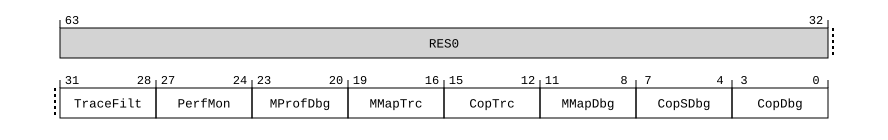

# ​D24.2.98 ID_DFR0_EL1, AArch32 Debug Feature Register 0

Source: <https://developer.arm.com/documentation/ddi0487/mc/-Part-D-The-AArch64-System-Level-Architecture/-Chapter-D24-AArch64-System-Register-Descriptions/-D24-2-General-system-control-registers/-D24-2-98-ID-DFR0-EL1--AArch32-Debug-Feature-Register-0>

##### D24.2.98 ID\_DFR0\_EL1, AArch32 Debug Feature Register 0

The ID\_DFR0\_EL1 characteristics are:

Purpose
:   Provides top-level information about the debug system in AArch32 state.

    Must be interpreted with the Main ID Register, [MIDR\_EL1](/documentation/ddi0487/mc/-Part-D-The-AArch64-System-Level-Architecture/-Chapter-D24-AArch64-System-Register-Descriptions/-D24-2-General-system-control-registers/-D24-2-136-MIDR-EL1--Main-ID-Register?lang=en#reg_aarch64_midr_el1).

    For general information about the interpretation of the ID registers see [‘Principles of the ID scheme for fields in ID registers’](/documentation/ddi0487/mc/-Part-D-The-AArch64-System-Level-Architecture/-Chapter-D24-AArch64-System-Register-Descriptions/-D24-1-About-the-AArch64-System-registers/-D24-1-3-Principles-of-the-ID-scheme-for-fields-in-ID-registers?lang=en#babfafhi).

Configuration
:   AArch64 System register ID\_DFR0\_EL1 bits [31:0] are architecturally mapped to AArch32 System register [ID\_DFR0](/documentation/ddi0487/mc/-Part-G-The-AArch32-System-Level-Architecture/-Chapter-G8-AArch32-System-Register-Descriptions/-G8-2-General-system-control-registers/-G8-2-84-ID-DFR0--Debug-Feature-Register-0?lang=en#reg_aarch32_id_dfr0)[31:0].

    This register is present only when FEAT\_AA64 is implemented. Otherwise, direct accesses to ID\_DFR0\_EL1 are UNDEFINED.

Attributes
:   ID\_DFR0\_EL1 is a 64-bit register.

###### Field descriptions

When FEAT\_AA32 is implemented:
:   

Bits [63:32]
:   Reserved, RES0.

TraceFilt, bits [31:28]
:   Armv8.4 Self-hosted Trace Extension version.

    The value of this field is an IMPLEMENTATION DEFINED choice of:

<table>
 <colgroup>
  <col/>
  <col/>
 </colgroup>
 <thead>
  <tr>
   <th>
    <strong>
     TraceFilt
    </strong>
   </th>
   <th>
    <strong>
     Meaning
    </strong>
   </th>
  </tr>
 </thead>
 <tbody>
  <tr>
   <td>
    <p>
     <code>
      0b0000
     </code>
    </p>
   </td>
   <td>
    <p>
     Armv8.4 Self-hosted Trace Extension not implemented.
    </p>
   </td>
  </tr>
  <tr>
   <td>
    <p>
     <code>
      0b0001
     </code>
    </p>
   </td>
   <td>
    <p>
     Armv8.4 Self-hosted Trace Extension implemented.
    </p>
   </td>
  </tr>
 </tbody>
</table>

    All other values are reserved.

    [FEAT\_TRF](/documentation/ddi0487/mc/-Part-A-Arm-Architecture-Introduction-and-Overview/-Chapter-A2-A-profile-Architecture-Extensions/-A2-2-Armv8-A-architecture-extensions/-A2-2-5-The-Armv8-4-architecture-extension?lang=en#feat_feat_trf) implements the functionality identified by the value `0b0001`.

    From Armv8.4, if [FEAT\_ETMv4](/documentation/ddi0487/mc/-Part-A-Arm-Architecture-Introduction-and-Overview/-Chapter-A2-A-profile-Architecture-Extensions/-A2-2-Armv8-A-architecture-extensions/-A2-2-1-The-Armv8-0-architecture-extension?lang=en#feat_feat_etmv4) is implemented, the value `0b0000` is not permitted.

    If [FEAT\_ETE](/documentation/ddi0487/mc/-Part-A-Arm-Architecture-Introduction-and-Overview/-Chapter-A2-A-profile-Architecture-Extensions/-A2-3-Armv9-A-architecture-extensions/-A2-3-1-The-Armv9-0-architecture-extension?lang=en#feat_feat_ete) is implemented, the value `0b0000` is not permitted.

    Access to this field is RO.

PerfMon, bits [27:24]
:   Performance Monitors Extension version.

    This field does not follow the standard ID scheme, but uses the alternative ID scheme described in [‘Alternative ID scheme used for the Performance Monitors Extension version’](/documentation/ddi0487/mc/-Part-D-The-AArch64-System-Level-Architecture/-Chapter-D24-AArch64-System-Register-Descriptions/-D24-1-About-the-AArch64-System-registers/-D24-1-3-Principles-of-the-ID-scheme-for-fields-in-ID-registers?lang=en#babdfeid)

    The value of this field is an IMPLEMENTATION DEFINED choice of:

<table>
 <colgroup>
  <col/>
  <col/>
 </colgroup>
 <thead>
  <tr>
   <th>
    <strong>
     PerfMon
    </strong>
   </th>
   <th>
    <strong>
     Meaning
    </strong>
   </th>
  </tr>
 </thead>
 <tbody>
  <tr>
   <td>
    <p>
     <code>
      0b0000
     </code>
    </p>
   </td>
   <td>
    <p>
     Performance Monitors Extension not implemented.
    </p>
   </td>
  </tr>
  <tr>
   <td>
    <p>
     <code>
      0b0001
     </code>
    </p>
   </td>
   <td>
    <p>
     Performance Monitors Extension, PMUv1 implemented.
    </p>
   </td>
  </tr>
  <tr>
   <td>
    <p>
     <code>
      0b0010
     </code>
    </p>
   </td>
   <td>
    <p>
     Performance Monitors Extension, PMUv2 implemented.
    </p>
   </td>
  </tr>
  <tr>
   <td>
    <p>
     <code>
      0b0011
     </code>
    </p>
   </td>
   <td>
    <p>
     Performance Monitors Extension, PMUv3 implemented.
    </p>
   </td>
  </tr>
  <tr>
   <td>
    <p>
     <code>
      0b0100
     </code>
    </p>
   </td>
   <td>
    <p>
     PMUv3 for Armv8.1. As
     <code>
      0b0011
     </code>
     , and adds support for:
    </p>
    <ul>
     <li>
      <p>
       Extended 16-bit
       <a class="document-topic" document-topic-path="/ddi0487/mc/-Part-G-The-AArch32-System-Level-Architecture/-Chapter-G8-AArch32-System-Register-Descriptions/-G8-4-Performance-Monitors-registers/-G8-4-11-PMEVTYPER-n---Performance-Monitors-Event-Type-Registers--n---0---30?lang=en#reg_aarch32_pmevtypern" href="/documentation/ddi0487/mc/-Part-G-The-AArch32-System-Level-Architecture/-Chapter-G8-AArch32-System-Register-Descriptions/-G8-4-Performance-Monitors-registers/-G8-4-11-PMEVTYPER-n---Performance-Monitors-Event-Type-Registers--n---0---30?lang=en#reg_aarch32_pmevtypern">
        PMEVTYPER&lt;n&gt;
       </a>
       .evtCount field.
      </p>
     </li>
     <li>
      <p>
       If EL2 is implemented, the
       <a class="document-topic" document-topic-path="/ddi0487/mc/-Part-G-The-AArch32-System-Level-Architecture/-Chapter-G8-AArch32-System-Register-Descriptions/-G8-3-Debug-System-registers/-G8-3-32-HDCR--Hyp-Debug-Control-Register?lang=en#reg_aarch32_hdcr" href="/documentation/ddi0487/mc/-Part-G-The-AArch32-System-Level-Architecture/-Chapter-G8-AArch32-System-Register-Descriptions/-G8-3-Debug-System-registers/-G8-3-32-HDCR--Hyp-Debug-Control-Register?lang=en#reg_aarch32_hdcr">
        HDCR
       </a>
       .HPMD control.
      </p>
     </li>
    </ul>
   </td>
  </tr>
  <tr>
   <td>
    <p>
     <code>
      0b0101
     </code>
    </p>
   </td>
   <td>
    <p>
     PMUv3 for Armv8.4. As
     <code>
      0b0100
     </code>
     , and adds support for the
     <a class="document-topic" document-topic-path="/ddi0487/mc/-Part-G-The-AArch32-System-Level-Architecture/-Chapter-G8-AArch32-System-Register-Descriptions/-G8-3-Debug-System-registers/-G8-3-34-PMMIR--Performance-Monitors-Machine-Identification-Register?lang=en#reg_aarch32_pmmir" href="/documentation/ddi0487/mc/-Part-G-The-AArch32-System-Level-Architecture/-Chapter-G8-AArch32-System-Register-Descriptions/-G8-3-Debug-System-registers/-G8-3-34-PMMIR--Performance-Monitors-Machine-Identification-Register?lang=en#reg_aarch32_pmmir">
      PMMIR
     </a>
     register.
    </p>
   </td>
  </tr>
  <tr>
   <td>
    <p>
     <code>
      0b0110
     </code>
    </p>
   </td>
   <td>
    <p>
     PMUv3 for Armv8.5. As
     <code>
      0b0101
     </code>
     , and adds support for:
    </p>
    <ul>
     <li>
      <p>
       64-bit event counters.
      </p>
     </li>
     <li>
      <p>
       If EL2 is implemented, the
       <a class="document-topic" document-topic-path="/ddi0487/mc/-Part-G-The-AArch32-System-Level-Architecture/-Chapter-G8-AArch32-System-Register-Descriptions/-G8-3-Debug-System-registers/-G8-3-32-HDCR--Hyp-Debug-Control-Register?lang=en#reg_aarch32_hdcr" href="/documentation/ddi0487/mc/-Part-G-The-AArch32-System-Level-Architecture/-Chapter-G8-AArch32-System-Register-Descriptions/-G8-3-Debug-System-registers/-G8-3-32-HDCR--Hyp-Debug-Control-Register?lang=en#reg_aarch32_hdcr">
        HDCR
       </a>
       .HCCD control.
      </p>
     </li>
     <li>
      <p>
       If EL3 is implemented, the
       <a class="document-topic" document-topic-path="/ddi0487/mc/-Part-D-The-AArch64-System-Level-Architecture/-Chapter-D24-AArch64-System-Register-Descriptions/-D24-3-Debug-System-registers/-D24-3-18-MDCR-EL3--Monitor-Debug-Configuration-Register--EL3-?lang=en#reg_aarch64_mdcr_el3" href="/documentation/ddi0487/mc/-Part-D-The-AArch64-System-Level-Architecture/-Chapter-D24-AArch64-System-Register-Descriptions/-D24-3-Debug-System-registers/-D24-3-18-MDCR-EL3--Monitor-Debug-Configuration-Register--EL3-?lang=en#reg_aarch64_mdcr_el3">
        MDCR_EL3
       </a>
       .SCCD control.
      </p>
     </li>
    </ul>
   </td>
  </tr>
  <tr>
   <td>
    <p>
     <code>
      0b0111
     </code>
    </p>
   </td>
   <td>
    <p>
     PMUv3 for Armv8.7. As
     <code>
      0b0110
     </code>
     , and adds support for:
    </p>
    <ul>
     <li>
      <p>
       The
       <a class="document-topic" document-topic-path="/ddi0487/mc/-Part-G-The-AArch32-System-Level-Architecture/-Chapter-G8-AArch32-System-Register-Descriptions/-G8-4-Performance-Monitors-registers/-G8-4-9-PMCR--Performance-Monitors-Control-Register?lang=en#reg_aarch32_pmcr" href="/documentation/ddi0487/mc/-Part-G-The-AArch32-System-Level-Architecture/-Chapter-G8-AArch32-System-Register-Descriptions/-G8-4-Performance-Monitors-registers/-G8-4-9-PMCR--Performance-Monitors-Control-Register?lang=en#reg_aarch32_pmcr">
        PMCR
       </a>
       .FZO and, if EL2 is implemented,
       <a class="document-topic" document-topic-path="/ddi0487/mc/-Part-G-The-AArch32-System-Level-Architecture/-Chapter-G8-AArch32-System-Register-Descriptions/-G8-3-Debug-System-registers/-G8-3-32-HDCR--Hyp-Debug-Control-Register?lang=en#reg_aarch32_hdcr" href="/documentation/ddi0487/mc/-Part-G-The-AArch32-System-Level-Architecture/-Chapter-G8-AArch32-System-Register-Descriptions/-G8-3-Debug-System-registers/-G8-3-32-HDCR--Hyp-Debug-Control-Register?lang=en#reg_aarch32_hdcr">
        HDCR
       </a>
       .HPMFZO controls.
      </p>
     </li>
     <li>
      <p>
       If EL3 is implemented, the
       <a class="document-topic" document-topic-path="/ddi0487/mc/-Part-D-The-AArch64-System-Level-Architecture/-Chapter-D24-AArch64-System-Register-Descriptions/-D24-3-Debug-System-registers/-D24-3-18-MDCR-EL3--Monitor-Debug-Configuration-Register--EL3-?lang=en#reg_aarch64_mdcr_el3" href="/documentation/ddi0487/mc/-Part-D-The-AArch64-System-Level-Architecture/-Chapter-D24-AArch64-System-Register-Descriptions/-D24-3-Debug-System-registers/-D24-3-18-MDCR-EL3--Monitor-Debug-Configuration-Register--EL3-?lang=en#reg_aarch64_mdcr_el3">
        MDCR_EL3
       </a>
       .{MPMX,MCCD} controls.
      </p>
     </li>
    </ul>
   </td>
  </tr>
  <tr>
   <td>
    <p>
     <code>
      0b1000
     </code>
    </p>
   </td>
   <td>
    <p>
     PMUv3 for Armv8.8. As
     <code>
      0b0111
     </code>
     , and:
    </p>
    <ul>
     <li>
      <p>
       Extends the Common event number space to include
       <code>
        0x0040
       </code>
       to
       <code>
        0x00BF
       </code>
       and
       <code>
        0x4040
       </code>
       to
       <code>
        0x40BF
       </code>
       .
      </p>
     </li>
     <li>
      <p>
       Removes the
       <small>
        CONSTRAINED UNPREDICTABLE
       </small>
       behaviors if a reserved or unimplemented PMU event number is selected.
      </p>
     </li>
    </ul>
   </td>
  </tr>
  <tr>
   <td>
    <p>
     <code>
      0b1001
     </code>
    </p>
   </td>
   <td>
    <p>
     PMUv3 for Armv8.9. As
     <code>
      0b1000
     </code>
     , and:
    </p>
    <ul>
     <li>
      <p>
       Updates the definitions of existing PMU events.
      </p>
     </li>
     <li>
      <p>
       Adds support for the
       <a class="document-topic" document-topic-path="/ddi0487/mc/-Part-H-External-Debug/-Chapter-H9-External-Debug-Register-Descriptions/-H9-2-External-debug-registers/-H9-2-28-EDECR--External-Debug-Execution-Control-Register?lang=en#reg_ext_edecr" href="/documentation/ddi0487/mc/-Part-H-External-Debug/-Chapter-H9-External-Debug-Register-Descriptions/-H9-2-External-debug-registers/-H9-2-28-EDECR--External-Debug-Execution-Control-Register?lang=en#reg_ext_edecr">
        EDECR
       </a>
       .PME control.
      </p>
     </li>
    </ul>
   </td>
  </tr>
  <tr>
   <td>
    <p>
     <code>
      0b1111
     </code>
    </p>
   </td>
   <td>
    <p>
     <small>
      IMPLEMENTATION DEFINED
     </small>
     form of performance monitors supported, PMUv3 not supported. Arm does not recommend this value for new implementations.
    </p>
   </td>
  </tr>
 </tbody>
</table>

    All other values are reserved.

    [FEAT\_PMUv3](/documentation/ddi0487/mc/-Part-A-Arm-Architecture-Introduction-and-Overview/-Chapter-A2-A-profile-Architecture-Extensions/-A2-2-Armv8-A-architecture-extensions/-A2-2-1-The-Armv8-0-architecture-extension?lang=en#feat_feat_pmuv3) implements the functionality identified by the value `0b0011`.

    [FEAT\_PMUv3p1](/documentation/ddi0487/mc/-Part-A-Arm-Architecture-Introduction-and-Overview/-Chapter-A2-A-profile-Architecture-Extensions/-A2-2-Armv8-A-architecture-extensions/-A2-2-2-The-Armv8-1-architecture-extension?lang=en#feat_feat_pmuv3p1) implements the functionality identified by the value `0b0100`.

    [FEAT\_PMUv3p4](/documentation/ddi0487/mc/-Part-A-Arm-Architecture-Introduction-and-Overview/-Chapter-A2-A-profile-Architecture-Extensions/-A2-2-Armv8-A-architecture-extensions/-A2-2-5-The-Armv8-4-architecture-extension?lang=en#feat_feat_pmuv3p4) implements the functionality identified by the value `0b0101`.

    [FEAT\_PMUv3p5](/documentation/ddi0487/mc/-Part-A-Arm-Architecture-Introduction-and-Overview/-Chapter-A2-A-profile-Architecture-Extensions/-A2-2-Armv8-A-architecture-extensions/-A2-2-6-The-Armv8-5-architecture-extension?lang=en#feat_feat_pmuv3p5) implements the functionality identified by the value `0b0110`.

    [FEAT\_PMUv3p7](/documentation/ddi0487/mc/-Part-A-Arm-Architecture-Introduction-and-Overview/-Chapter-A2-A-profile-Architecture-Extensions/-A2-2-Armv8-A-architecture-extensions/-A2-2-8-The-Armv8-7-architecture-extension?lang=en#feat_feat_pmuv3p7) implements the functionality identified by the value `0b0111`.

    [FEAT\_PMUv3p8](/documentation/ddi0487/mc/-Part-A-Arm-Architecture-Introduction-and-Overview/-Chapter-A2-A-profile-Architecture-Extensions/-A2-2-Armv8-A-architecture-extensions/-A2-2-9-The-Armv8-8-architecture-extension?lang=en#feat_feat_pmuv3p8) implements the functionality identified by the value `0b1000`.

    [FEAT\_PMUv3p9](/documentation/ddi0487/mc/-Part-A-Arm-Architecture-Introduction-and-Overview/-Chapter-A2-A-profile-Architecture-Extensions/-A2-2-Armv8-A-architecture-extensions/-A2-2-10-The-Armv8-9-architecture-extension?lang=en#feat_feat_pmuv3p9) implements the functionality identified by the value `0b1001`.

    In any Armv8 implementation, the values `0b0001` and `0b0010` are not permitted.

    From Armv8.1, if [FEAT\_PMUv3](/documentation/ddi0487/mc/-Part-A-Arm-Architecture-Introduction-and-Overview/-Chapter-A2-A-profile-Architecture-Extensions/-A2-2-Armv8-A-architecture-extensions/-A2-2-1-The-Armv8-0-architecture-extension?lang=en#feat_feat_pmuv3) is implemented, the value `0b0011` is not permitted.

    From Armv8.4, if [FEAT\_PMUv3](/documentation/ddi0487/mc/-Part-A-Arm-Architecture-Introduction-and-Overview/-Chapter-A2-A-profile-Architecture-Extensions/-A2-2-Armv8-A-architecture-extensions/-A2-2-1-The-Armv8-0-architecture-extension?lang=en#feat_feat_pmuv3) is implemented, the value `0b0100` is not permitted.

    From Armv8.5, if [FEAT\_PMUv3](/documentation/ddi0487/mc/-Part-A-Arm-Architecture-Introduction-and-Overview/-Chapter-A2-A-profile-Architecture-Extensions/-A2-2-Armv8-A-architecture-extensions/-A2-2-1-The-Armv8-0-architecture-extension?lang=en#feat_feat_pmuv3) is implemented, the value `0b0101` is not permitted.

    From Armv8.7, if [FEAT\_PMUv3](/documentation/ddi0487/mc/-Part-A-Arm-Architecture-Introduction-and-Overview/-Chapter-A2-A-profile-Architecture-Extensions/-A2-2-Armv8-A-architecture-extensions/-A2-2-1-The-Armv8-0-architecture-extension?lang=en#feat_feat_pmuv3) is implemented, the value `0b0110` is not permitted.

    From Armv8.8, if [FEAT\_PMUv3](/documentation/ddi0487/mc/-Part-A-Arm-Architecture-Introduction-and-Overview/-Chapter-A2-A-profile-Architecture-Extensions/-A2-2-Armv8-A-architecture-extensions/-A2-2-1-The-Armv8-0-architecture-extension?lang=en#feat_feat_pmuv3) is implemented, the value `0b0111` is not permitted.

    From Armv8.9, if [FEAT\_PMUv3](/documentation/ddi0487/mc/-Part-A-Arm-Architecture-Introduction-and-Overview/-Chapter-A2-A-profile-Architecture-Extensions/-A2-2-Armv8-A-architecture-extensions/-A2-2-1-The-Armv8-0-architecture-extension?lang=en#feat_feat_pmuv3) is implemented, the value `0b1000` is not permitted.

    Access to this field is RO.

MProfDbg, bits [23:20]
:   M-profile Debug. Support for memory-mapped debug model for M-profile processors.

    The value of this field is an IMPLEMENTATION DEFINED choice of:

<table>
 <colgroup>
  <col/>
  <col/>
 </colgroup>
 <thead>
  <tr>
   <th>
    <strong>
     MProfDbg
    </strong>
   </th>
   <th>
    <strong>
     Meaning
    </strong>
   </th>
  </tr>
 </thead>
 <tbody>
  <tr>
   <td>
    <p>
     <code>
      0b0000
     </code>
    </p>
   </td>
   <td>
    <p>
     Not supported.
    </p>
   </td>
  </tr>
  <tr>
   <td>
    <p>
     <code>
      0b0001
     </code>
    </p>
   </td>
   <td>
    <p>
     Support for M-profile Debug architecture, with memory-mapped access.
    </p>
   </td>
  </tr>
 </tbody>
</table>

    All other values are reserved.

    In Armv8-A, the only permitted value is `0b0000`.

    Access to this field is RO.

MMapTrc, bits [19:16]
:   Memory-mapped Trace. Support for memory-mapped trace model.

    The value of this field is an IMPLEMENTATION DEFINED choice of:

<table>
 <colgroup>
  <col/>
  <col/>
 </colgroup>
 <thead>
  <tr>
   <th>
    <strong>
     MMapTrc
    </strong>
   </th>
   <th>
    <strong>
     Meaning
    </strong>
   </th>
  </tr>
 </thead>
 <tbody>
  <tr>
   <td>
    <p>
     <code>
      0b0000
     </code>
    </p>
   </td>
   <td>
    <p>
     Not supported.
    </p>
   </td>
  </tr>
  <tr>
   <td>
    <p>
     <code>
      0b0001
     </code>
    </p>
   </td>
   <td>
    <p>
     Support for Arm trace architecture, with memory-mapped access.
    </p>
   </td>
  </tr>
 </tbody>
</table>

    All other values are reserved.

    In Armv8-A, the permitted values are `0b0000` and `0b0001`.

    For more information, see the Arm® Embedded Trace Macrocell Architecture Specification, ETMv4 (ARM IHI 0064).

    Access to this field is RO.

CopTrc, bits [15:12]
:   Support for System registers-based trace model, using registers in the coproc == `0b1110` encoding space.

    The value of this field is an IMPLEMENTATION DEFINED choice of:

<table>
 <colgroup>
  <col/>
  <col/>
 </colgroup>
 <thead>
  <tr>
   <th>
    <strong>
     CopTrc
    </strong>
   </th>
   <th>
    <strong>
     Meaning
    </strong>
   </th>
  </tr>
 </thead>
 <tbody>
  <tr>
   <td>
    <p>
     <code>
      0b0000
     </code>
    </p>
   </td>
   <td>
    <p>
     Not supported.
    </p>
   </td>
  </tr>
  <tr>
   <td>
    <p>
     <code>
      0b0001
     </code>
    </p>
   </td>
   <td>
    <p>
     Support for Arm trace architecture, with System registers access.
    </p>
   </td>
  </tr>
 </tbody>
</table>

    All other values are reserved.

    In Armv8-A, the permitted values are `0b0000` and `0b0001`.

    For more information, see the Arm® Embedded Trace Macrocell Architecture Specification, ETMv4 (ARM IHI 0064).

    Access to this field is RO.

MMapDbg, bits [11:8]
:   Memory-mapped Debug. Support for Armv7 memory-mapped debug model for A and R-profile processors.

    The value of this field is an IMPLEMENTATION DEFINED choice of:

<table>
 <colgroup>
  <col/>
  <col/>
 </colgroup>
 <thead>
  <tr>
   <th>
    <strong>
     MMapDbg
    </strong>
   </th>
   <th>
    <strong>
     Meaning
    </strong>
   </th>
  </tr>
 </thead>
 <tbody>
  <tr>
   <td>
    <p>
     <code>
      0b0000
     </code>
    </p>
   </td>
   <td>
    <p>
     Not supported.
    </p>
   </td>
  </tr>
  <tr>
   <td>
    <p>
     <code>
      0b0100
     </code>
    </p>
   </td>
   <td>
    <p>
     Support for Armv7, v7 Debug architecture, with memory-mapped access.
    </p>
   </td>
  </tr>
  <tr>
   <td>
    <p>
     <code>
      0b0101
     </code>
    </p>
   </td>
   <td>
    <p>
     Support for Armv7, v7.1 Debug architecture, with memory-mapped access.
    </p>
   </td>
  </tr>
 </tbody>
</table>

    All other values are reserved.

    In Armv8-A, the only permitted value is `0b0000`.

    The optional memory map defined by Armv8 is not compatible with Armv7.

    Access to this field is RO.

CopSDbg, bits [7:4]
:   Support for a System registers-based Secure debug model, using registers in the coproc = `0b1110` encoding space, for an A-profile processor that includes EL3.

    If EL3 is not implemented and the implemented Security state is Non-secure state, this field is RES0. Otherwise, this field reads the same as bits [3:0].

    This field has an IMPLEMENTATION DEFINED value.

    Access to this field is RO.

CopDbg, bits [3:0]
:   Debug architecture version. Indicates presence of Armv8 debug architecture.

    The value of this field is an IMPLEMENTATION DEFINED choice of:

<table>
 <colgroup>
  <col/>
  <col/>
 </colgroup>
 <thead>
  <tr>
   <th>
    <strong>
     CopDbg
    </strong>
   </th>
   <th>
    <strong>
     Meaning
    </strong>
   </th>
  </tr>
 </thead>
 <tbody>
  <tr>
   <td>
    <p>
     <code>
      0b0000
     </code>
    </p>
   </td>
   <td>
    <p>
     Not supported.
    </p>
   </td>
  </tr>
  <tr>
   <td>
    <p>
     <code>
      0b0010
     </code>
    </p>
   </td>
   <td>
    <p>
     Armv6, v6 Debug architecture, with System registers access.
    </p>
   </td>
  </tr>
  <tr>
   <td>
    <p>
     <code>
      0b0011
     </code>
    </p>
   </td>
   <td>
    <p>
     Armv6, v6.1 Debug architecture, with System registers access.
    </p>
   </td>
  </tr>
  <tr>
   <td>
    <p>
     <code>
      0b0100
     </code>
    </p>
   </td>
   <td>
    <p>
     Armv7, v7 Debug architecture, with System registers access.
    </p>
   </td>
  </tr>
  <tr>
   <td>
    <p>
     <code>
      0b0101
     </code>
    </p>
   </td>
   <td>
    <p>
     Armv7, v7.1 Debug architecture, with System registers access.
    </p>
   </td>
  </tr>
  <tr>
   <td>
    <p>
     <code>
      0b0110
     </code>
    </p>
   </td>
   <td>
    <p>
     Armv8 debug architecture.
    </p>
   </td>
  </tr>
  <tr>
   <td>
    <p>
     <code>
      0b0111
     </code>
    </p>
   </td>
   <td>
    <p>
     Armv8.1 debug architecture,
     <a class="document-topic" document-topic-path="/ddi0487/mc/-Part-A-Arm-Architecture-Introduction-and-Overview/-Chapter-A2-A-profile-Architecture-Extensions/-A2-2-Armv8-A-architecture-extensions/-A2-2-2-The-Armv8-1-architecture-extension?lang=en#feat_feat_debugv8p1" href="/documentation/ddi0487/mc/-Part-A-Arm-Architecture-Introduction-and-Overview/-Chapter-A2-A-profile-Architecture-Extensions/-A2-2-Armv8-A-architecture-extensions/-A2-2-2-The-Armv8-1-architecture-extension?lang=en#feat_feat_debugv8p1">
      FEAT_Debugv8p1
     </a>
     .
    </p>
   </td>
  </tr>
  <tr>
   <td>
    <p>
     <code>
      0b1000
     </code>
    </p>
   </td>
   <td>
    <p>
     Armv8.2 debug architecture,
     <a class="document-topic" document-topic-path="/ddi0487/mc/-Part-A-Arm-Architecture-Introduction-and-Overview/-Chapter-A2-A-profile-Architecture-Extensions/-A2-2-Armv8-A-architecture-extensions/-A2-2-3-The-Armv8-2-architecture-extension?lang=en#feat_feat_debugv8p2" href="/documentation/ddi0487/mc/-Part-A-Arm-Architecture-Introduction-and-Overview/-Chapter-A2-A-profile-Architecture-Extensions/-A2-2-Armv8-A-architecture-extensions/-A2-2-3-The-Armv8-2-architecture-extension?lang=en#feat_feat_debugv8p2">
      FEAT_Debugv8p2
     </a>
     .
    </p>
   </td>
  </tr>
  <tr>
   <td>
    <p>
     <code>
      0b1001
     </code>
    </p>
   </td>
   <td>
    <p>
     Armv8.4 debug architecture,
     <a class="document-topic" document-topic-path="/ddi0487/mc/-Part-A-Arm-Architecture-Introduction-and-Overview/-Chapter-A2-A-profile-Architecture-Extensions/-A2-2-Armv8-A-architecture-extensions/-A2-2-5-The-Armv8-4-architecture-extension?lang=en#feat_feat_debugv8p4" href="/documentation/ddi0487/mc/-Part-A-Arm-Architecture-Introduction-and-Overview/-Chapter-A2-A-profile-Architecture-Extensions/-A2-2-Armv8-A-architecture-extensions/-A2-2-5-The-Armv8-4-architecture-extension?lang=en#feat_feat_debugv8p4">
      FEAT_Debugv8p4
     </a>
     .
    </p>
   </td>
  </tr>
  <tr>
   <td>
    <p>
     <code>
      0b1010
     </code>
    </p>
   </td>
   <td>
    <p>
     Armv8.8 debug architecture,
     <a class="document-topic" document-topic-path="/ddi0487/mc/-Part-A-Arm-Architecture-Introduction-and-Overview/-Chapter-A2-A-profile-Architecture-Extensions/-A2-2-Armv8-A-architecture-extensions/-A2-2-9-The-Armv8-8-architecture-extension?lang=en#feat_feat_debugv8p8" href="/documentation/ddi0487/mc/-Part-A-Arm-Architecture-Introduction-and-Overview/-Chapter-A2-A-profile-Architecture-Extensions/-A2-2-Armv8-A-architecture-extensions/-A2-2-9-The-Armv8-8-architecture-extension?lang=en#feat_feat_debugv8p8">
      FEAT_Debugv8p8
     </a>
     .
    </p>
   </td>
  </tr>
  <tr>
   <td>
    <p>
     <code>
      0b1011
     </code>
    </p>
   </td>
   <td>
    <p>
     Armv8.9 debug architecture,
     <a class="document-topic" document-topic-path="/ddi0487/mc/-Part-A-Arm-Architecture-Introduction-and-Overview/-Chapter-A2-A-profile-Architecture-Extensions/-A2-2-Armv8-A-architecture-extensions/-A2-2-10-The-Armv8-9-architecture-extension?lang=en#feat_feat_debugv8p9" href="/documentation/ddi0487/mc/-Part-A-Arm-Architecture-Introduction-and-Overview/-Chapter-A2-A-profile-Architecture-Extensions/-A2-2-Armv8-A-architecture-extensions/-A2-2-10-The-Armv8-9-architecture-extension?lang=en#feat_feat_debugv8p9">
      FEAT_Debugv8p9
     </a>
     .
    </p>
   </td>
  </tr>
 </tbody>
</table>

    All other values are reserved.

    The values `0b0000`, `0b0010`, `0b0011`, `0b0100`, and `0b0101` are not permitted in Armv8.

    [FEAT\_Debugv8p1](/documentation/ddi0487/mc/-Part-A-Arm-Architecture-Introduction-and-Overview/-Chapter-A2-A-profile-Architecture-Extensions/-A2-2-Armv8-A-architecture-extensions/-A2-2-2-The-Armv8-1-architecture-extension?lang=en#feat_feat_debugv8p1) implements the functionality identified by the value `0b0111`.

    [FEAT\_Debugv8p2](/documentation/ddi0487/mc/-Part-A-Arm-Architecture-Introduction-and-Overview/-Chapter-A2-A-profile-Architecture-Extensions/-A2-2-Armv8-A-architecture-extensions/-A2-2-3-The-Armv8-2-architecture-extension?lang=en#feat_feat_debugv8p2) implements the functionality identified by the value `0b1000`.

    [FEAT\_Debugv8p4](/documentation/ddi0487/mc/-Part-A-Arm-Architecture-Introduction-and-Overview/-Chapter-A2-A-profile-Architecture-Extensions/-A2-2-Armv8-A-architecture-extensions/-A2-2-5-The-Armv8-4-architecture-extension?lang=en#feat_feat_debugv8p4) implements the functionality identified by the value `0b1001`.

    [FEAT\_Debugv8p8](/documentation/ddi0487/mc/-Part-A-Arm-Architecture-Introduction-and-Overview/-Chapter-A2-A-profile-Architecture-Extensions/-A2-2-Armv8-A-architecture-extensions/-A2-2-9-The-Armv8-8-architecture-extension?lang=en#feat_feat_debugv8p8) implements the functionality identified by the value `0b1010`.

    [FEAT\_Debugv8p9](/documentation/ddi0487/mc/-Part-A-Arm-Architecture-Introduction-and-Overview/-Chapter-A2-A-profile-Architecture-Extensions/-A2-2-Armv8-A-architecture-extensions/-A2-2-10-The-Armv8-9-architecture-extension?lang=en#feat_feat_debugv8p9) implements the functionality identified by the value `0b1011`.

    From Armv8.1, when [FEAT\_Debugv8p1](/documentation/ddi0487/mc/-Part-A-Arm-Architecture-Introduction-and-Overview/-Chapter-A2-A-profile-Architecture-Extensions/-A2-2-Armv8-A-architecture-extensions/-A2-2-2-The-Armv8-1-architecture-extension?lang=en#feat_feat_debugv8p1) is implemented the value `0b0110` is not permitted.

    From Armv8.2, the values `0b0110` and `0b0111` are not permitted.

    From Armv8.4, the value `0b1000` is not permitted.

    From Armv8.8, the value `0b1001` is not permitted.

    From Armv8.9, the value `0b1010` is not permitted.

    Access to this field is RO.

Otherwise:
:   

Bits [63:0]
:   Reserved, UNKNOWN.

###### Accessing ID\_DFR0\_EL1

Accesses to this register use the following encodings in the System register encoding space:

###### `MRS <Xt>, ID_DFR0_EL1`

<table>
 <colgroup>
  <col/>
  <col/>
  <col/>
  <col/>
  <col/>
 </colgroup>
 <thead>
  <tr>
   <th>
    <strong>
     op0
    </strong>
   </th>
   <th>
    <strong>
     op1
    </strong>
   </th>
   <th>
    <strong>
     CRn
    </strong>
   </th>
   <th>
    <strong>
     CRm
    </strong>
   </th>
   <th>
    <strong>
     op2
    </strong>
   </th>
  </tr>
 </thead>
 <tbody>
  <tr>
   <td>
    <p>
     <code>
      0b11
     </code>
    </p>
   </td>
   <td>
    <p>
     <code>
      0b000
     </code>
    </p>
   </td>
   <td>
    <p>
     <code>
      0b0000
     </code>
    </p>
   </td>
   <td>
    <p>
     <code>
      0b0001
     </code>
    </p>
   </td>
   <td>
    <p>
     <code>
      0b010
     </code>
    </p>
   </td>
  </tr>
 </tbody>
</table>

```
if !IsFeatureImplemented(FEAT_AA64) then
    UnimplementedIDRegister();
elsif HaveEL(EL3) && !(EffectivelyAtEL0InHost() || EffectivelyAtEL0NotInHost() || PSTATE.EL == EL3) && EL3SDDUndefPriority() && IsFeatureImplemented(FEAT_IDTE3) && SCR_EL3().TID3 == '1' then
    Undefined();
elsif PSTATE.EL == EL0 then
    if IsFeatureImplemented(FEAT_IDST) then
        AArch64_SystemAccessTraptoEL1orEL2(0x18);
    else
        Undefined();
    end;
elsif PSTATE.EL == EL1 then
    if EL2Enabled() && HCR_EL2().TID3 == '1' then
        AArch64_SystemAccessTrap(EL2, 0x18);
    elsif HaveEL(EL3) && IsFeatureImplemented(FEAT_IDTE3) && SCR_EL3().TID3 == '1' then
        if EL3SDDUndef() then
            Undefined();
        else
            AArch64_SystemAccessTrap(EL3, 0x18);
        end;
    else
        X{64}(t) = ID_DFR0_EL1();
    end;
elsif PSTATE.EL == EL2 then
    if HaveEL(EL3) && IsFeatureImplemented(FEAT_IDTE3) && SCR_EL3().TID3 == '1' then
        if EL3SDDUndef() then
            Undefined();
        else
            AArch64_SystemAccessTrap(EL3, 0x18);
        end;
    else
        X{64}(t) = ID_DFR0_EL1();
    end;
elsif PSTATE.EL == EL3 then
    X{64}(t) = ID_DFR0_EL1();
end;
```
