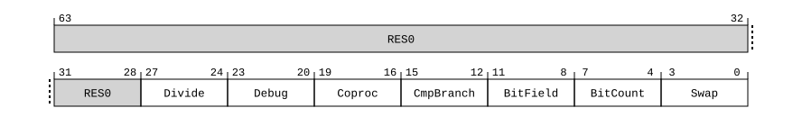

# ​D24.2.100 ID_ISAR0_EL1, AArch32 Instruction Set Attribute Register 0

Source: <https://developer.arm.com/documentation/ddi0487/mc/-Part-D-The-AArch64-System-Level-Architecture/-Chapter-D24-AArch64-System-Register-Descriptions/-D24-2-General-system-control-registers/-D24-2-100-ID-ISAR0-EL1--AArch32-Instruction-Set-Attribute-Register-0>

##### D24.2.100 ID\_ISAR0\_EL1, AArch32 Instruction Set Attribute Register 0

The ID\_ISAR0\_EL1 characteristics are:

Purpose
:   Provides information about the instruction sets implemented by the PE in AArch32 state.

    Must be interpreted with [ID\_ISAR1\_EL1](/documentation/ddi0487/mc/-Part-D-The-AArch64-System-Level-Architecture/-Chapter-D24-AArch64-System-Register-Descriptions/-D24-2-General-system-control-registers/-D24-2-101-ID-ISAR1-EL1--AArch32-Instruction-Set-Attribute-Register-1?lang=en#reg_aarch64_id_isar1_el1), [ID\_ISAR2\_EL1](/documentation/ddi0487/mc/-Part-D-The-AArch64-System-Level-Architecture/-Chapter-D24-AArch64-System-Register-Descriptions/-D24-2-General-system-control-registers/-D24-2-102-ID-ISAR2-EL1--AArch32-Instruction-Set-Attribute-Register-2?lang=en#reg_aarch64_id_isar2_el1), [ID\_ISAR3\_EL1](/documentation/ddi0487/mc/-Part-D-The-AArch64-System-Level-Architecture/-Chapter-D24-AArch64-System-Register-Descriptions/-D24-2-General-system-control-registers/-D24-2-103-ID-ISAR3-EL1--AArch32-Instruction-Set-Attribute-Register-3?lang=en#reg_aarch64_id_isar3_el1), [ID\_ISAR4\_EL1](/documentation/ddi0487/mc/-Part-D-The-AArch64-System-Level-Architecture/-Chapter-D24-AArch64-System-Register-Descriptions/-D24-2-General-system-control-registers/-D24-2-104-ID-ISAR4-EL1--AArch32-Instruction-Set-Attribute-Register-4?lang=en#reg_aarch64_id_isar4_el1), and [ID\_ISAR5\_EL1](/documentation/ddi0487/mc/-Part-D-The-AArch64-System-Level-Architecture/-Chapter-D24-AArch64-System-Register-Descriptions/-D24-2-General-system-control-registers/-D24-2-105-ID-ISAR5-EL1--AArch32-Instruction-Set-Attribute-Register-5?lang=en#reg_aarch64_id_isar5_el1).

    For general information about the interpretation of the ID registers see [‘Principles of the ID scheme for fields in ID registers’](/documentation/ddi0487/mc/-Part-D-The-AArch64-System-Level-Architecture/-Chapter-D24-AArch64-System-Register-Descriptions/-D24-1-About-the-AArch64-System-registers/-D24-1-3-Principles-of-the-ID-scheme-for-fields-in-ID-registers?lang=en#babfafhi).

Configuration
:   AArch64 System register ID\_ISAR0\_EL1 bits [31:0] are architecturally mapped to AArch32 System register [ID\_ISAR0](/documentation/ddi0487/mc/-Part-G-The-AArch32-System-Level-Architecture/-Chapter-G8-AArch32-System-Register-Descriptions/-G8-2-General-system-control-registers/-G8-2-86-ID-ISAR0--Instruction-Set-Attribute-Register-0?lang=en#reg_aarch32_id_isar0)[31:0].

    This register is present only when FEAT\_AA64 is implemented. Otherwise, direct accesses to ID\_ISAR0\_EL1 are UNDEFINED.

Attributes
:   ID\_ISAR0\_EL1 is a 64-bit register.

###### Field descriptions

When FEAT\_AA32 is implemented:
:   

Bits [63:28]
:   Reserved, RES0.

Divide, bits [27:24]
:   Indicates the implemented Divide instructions.

    The value of this field is an IMPLEMENTATION DEFINED choice of:

<table>
 <colgroup>
  <col/>
  <col/>
 </colgroup>
 <thead>
  <tr>
   <th>
    <strong>
     Divide
    </strong>
   </th>
   <th>
    <strong>
     Meaning
    </strong>
   </th>
  </tr>
 </thead>
 <tbody>
  <tr>
   <td>
    <p>
     <code>
      0b0000
     </code>
    </p>
   </td>
   <td>
    <p>
     None implemented.
    </p>
   </td>
  </tr>
  <tr>
   <td>
    <p>
     <code>
      0b0001
     </code>
    </p>
   </td>
   <td>
    <p>
     Adds
     <code>
      SDIV
     </code>
     and
     <code>
      UDIV
     </code>
     in the T32 instruction set.
    </p>
   </td>
  </tr>
  <tr>
   <td>
    <p>
     <code>
      0b0010
     </code>
    </p>
   </td>
   <td>
    <p>
     As for
     <code>
      0b0001
     </code>
     , and adds
     <code>
      SDIV
     </code>
     and
     <code>
      UDIV
     </code>
     in the A32 instruction set.
    </p>
   </td>
  </tr>
 </tbody>
</table>

    All other values are reserved.

    In Armv8-A, the only permitted value is `0b0010`.

    Access to this field is RO.

Debug, bits [23:20]
:   Indicates the implemented Debug instructions.

    The value of this field is an IMPLEMENTATION DEFINED choice of:

<table>
 <colgroup>
  <col/>
  <col/>
 </colgroup>
 <thead>
  <tr>
   <th>
    <strong>
     Debug
    </strong>
   </th>
   <th>
    <strong>
     Meaning
    </strong>
   </th>
  </tr>
 </thead>
 <tbody>
  <tr>
   <td>
    <p>
     <code>
      0b0000
     </code>
    </p>
   </td>
   <td>
    <p>
     None implemented.
    </p>
   </td>
  </tr>
  <tr>
   <td>
    <p>
     <code>
      0b0001
     </code>
    </p>
   </td>
   <td>
    <p>
     Adds
     <code>
      BKPT
     </code>
     .
    </p>
   </td>
  </tr>
 </tbody>
</table>

    All other values are reserved.

    In Armv8-A, the only permitted value is `0b0001`.

    Access to this field is RO.

Coproc, bits [19:16]
:   Indicates the implemented System register access instructions.

    The value of this field is an IMPLEMENTATION DEFINED choice of:

<table>
 <colgroup>
  <col/>
  <col/>
 </colgroup>
 <thead>
  <tr>
   <th>
    <strong>
     Coproc
    </strong>
   </th>
   <th>
    <strong>
     Meaning
    </strong>
   </th>
  </tr>
 </thead>
 <tbody>
  <tr>
   <td>
    <p>
     <code>
      0b0000
     </code>
    </p>
   </td>
   <td>
    <p>
     None implemented, except for instructions separately attributed by the architecture to provide access to AArch32 System registers and System instructions.
    </p>
   </td>
  </tr>
  <tr>
   <td>
    <p>
     <code>
      0b0001
     </code>
    </p>
   </td>
   <td>
    <p>
     Adds generic
     <code>
      CDP
     </code>
     ,
     <code>
      LDC
     </code>
     ,
     <code>
      MCR
     </code>
     ,
     <code>
      MRC
     </code>
     , and
     <code>
      STC
     </code>
     .
    </p>
   </td>
  </tr>
  <tr>
   <td>
    <p>
     <code>
      0b0010
     </code>
    </p>
   </td>
   <td>
    <p>
     As for
     <code>
      0b0001
     </code>
     , and adds generic
     <code>
      CDP2
     </code>
     ,
     <code>
      LDC2
     </code>
     ,
     <code>
      MCR2
     </code>
     ,
     <code>
      MRC2
     </code>
     , and
     <code>
      STC2
     </code>
     .
    </p>
   </td>
  </tr>
  <tr>
   <td>
    <p>
     <code>
      0b0011
     </code>
    </p>
   </td>
   <td>
    <p>
     As for
     <code>
      0b0010
     </code>
     , and adds generic
     <code>
      MCRR
     </code>
     and
     <code>
      MRRC
     </code>
     .
    </p>
   </td>
  </tr>
  <tr>
   <td>
    <p>
     <code>
      0b0100
     </code>
    </p>
   </td>
   <td>
    <p>
     As for
     <code>
      0b0011
     </code>
     , and adds generic
     <code>
      MCRR2
     </code>
     and
     <code>
      MRRC2
     </code>
     .
    </p>
   </td>
  </tr>
 </tbody>
</table>

    All other values are reserved.

    In Armv8-A, the only permitted value is `0b0000`.

    Access to this field is RO.

CmpBranch, bits [15:12]
:   Indicates the implemented combined Compare and Branch instructions in the T32 instruction set.

    The value of this field is an IMPLEMENTATION DEFINED choice of:

<table>
 <colgroup>
  <col/>
  <col/>
 </colgroup>
 <thead>
  <tr>
   <th>
    <strong>
     CmpBranch
    </strong>
   </th>
   <th>
    <strong>
     Meaning
    </strong>
   </th>
  </tr>
 </thead>
 <tbody>
  <tr>
   <td>
    <p>
     <code>
      0b0000
     </code>
    </p>
   </td>
   <td>
    <p>
     None implemented.
    </p>
   </td>
  </tr>
  <tr>
   <td>
    <p>
     <code>
      0b0001
     </code>
    </p>
   </td>
   <td>
    <p>
     Adds
     <code>
      CBNZ
     </code>
     and
     <code>
      CBZ
     </code>
     .
    </p>
   </td>
  </tr>
 </tbody>
</table>

    All other values are reserved.

    In Armv8-A, the only permitted value is `0b0001`.

    Access to this field is RO.

BitField, bits [11:8]
:   Indicates support for the following BitField instructions `BFC`, `BFI`, `SBFX`, and `UBFX`.

    The value of this field is an IMPLEMENTATION DEFINED choice of:

<table>
 <colgroup>
  <col/>
  <col/>
 </colgroup>
 <thead>
  <tr>
   <th>
    <strong>
     BitField
    </strong>
   </th>
   <th>
    <strong>
     Meaning
    </strong>
   </th>
  </tr>
 </thead>
 <tbody>
  <tr>
   <td>
    <p>
     <code>
      0b0000
     </code>
    </p>
   </td>
   <td>
    <p>
     The specified instructions are not implemented.
    </p>
   </td>
  </tr>
  <tr>
   <td>
    <p>
     <code>
      0b0001
     </code>
    </p>
   </td>
   <td>
    <p>
     The specified instructions are implemented.
    </p>
   </td>
  </tr>
 </tbody>
</table>

    All other values are reserved.

    In Armv8-A, the only permitted value is `0b0001`.

    Access to this field is RO.

BitCount, bits [7:4]
:   Indicates the implemented Bit Counting instructions.

    The value of this field is an IMPLEMENTATION DEFINED choice of:

<table>
 <colgroup>
  <col/>
  <col/>
 </colgroup>
 <thead>
  <tr>
   <th>
    <strong>
     BitCount
    </strong>
   </th>
   <th>
    <strong>
     Meaning
    </strong>
   </th>
  </tr>
 </thead>
 <tbody>
  <tr>
   <td>
    <p>
     <code>
      0b0000
     </code>
    </p>
   </td>
   <td>
    <p>
     None implemented.
    </p>
   </td>
  </tr>
  <tr>
   <td>
    <p>
     <code>
      0b0001
     </code>
    </p>
   </td>
   <td>
    <p>
     Adds
     <code>
      CLZ
     </code>
     .
    </p>
   </td>
  </tr>
 </tbody>
</table>

    All other values are reserved.

    In Armv8-A, the only permitted value is `0b0001`.

    Access to this field is RO.

Swap, bits [3:0]
:   Indicates the implemented Swap instructions in the A32 instruction set.

    The value of this field is an IMPLEMENTATION DEFINED choice of:

<table>
 <colgroup>
  <col/>
  <col/>
 </colgroup>
 <thead>
  <tr>
   <th>
    <strong>
     Swap
    </strong>
   </th>
   <th>
    <strong>
     Meaning
    </strong>
   </th>
  </tr>
 </thead>
 <tbody>
  <tr>
   <td>
    <p>
     <code>
      0b0000
     </code>
    </p>
   </td>
   <td>
    <p>
     None implemented.
    </p>
   </td>
  </tr>
  <tr>
   <td>
    <p>
     <code>
      0b0001
     </code>
    </p>
   </td>
   <td>
    <p>
     Adds
     <code>
      SWP
     </code>
     and
     <code>
      SWPB
     </code>
     .
    </p>
   </td>
  </tr>
 </tbody>
</table>

    All other values are reserved.

    In Armv8-A, the only permitted value is `0b0000`.

    Access to this field is RO.

Otherwise:
:   

Bits [63:0]
:   Reserved, UNKNOWN.

###### Accessing ID\_ISAR0\_EL1

Accesses to this register use the following encodings in the System register encoding space:

###### `MRS <Xt>, ID_ISAR0_EL1`

<table>
 <colgroup>
  <col/>
  <col/>
  <col/>
  <col/>
  <col/>
 </colgroup>
 <thead>
  <tr>
   <th>
    <strong>
     op0
    </strong>
   </th>
   <th>
    <strong>
     op1
    </strong>
   </th>
   <th>
    <strong>
     CRn
    </strong>
   </th>
   <th>
    <strong>
     CRm
    </strong>
   </th>
   <th>
    <strong>
     op2
    </strong>
   </th>
  </tr>
 </thead>
 <tbody>
  <tr>
   <td>
    <p>
     <code>
      0b11
     </code>
    </p>
   </td>
   <td>
    <p>
     <code>
      0b000
     </code>
    </p>
   </td>
   <td>
    <p>
     <code>
      0b0000
     </code>
    </p>
   </td>
   <td>
    <p>
     <code>
      0b0010
     </code>
    </p>
   </td>
   <td>
    <p>
     <code>
      0b000
     </code>
    </p>
   </td>
  </tr>
 </tbody>
</table>

```
if !IsFeatureImplemented(FEAT_AA64) then
    UnimplementedIDRegister();
elsif HaveEL(EL3) && !(EffectivelyAtEL0InHost() || EffectivelyAtEL0NotInHost() || PSTATE.EL == EL3) && EL3SDDUndefPriority() && IsFeatureImplemented(FEAT_IDTE3) && SCR_EL3().TID3 == '1' then
    Undefined();
elsif PSTATE.EL == EL0 then
    if IsFeatureImplemented(FEAT_IDST) then
        AArch64_SystemAccessTraptoEL1orEL2(0x18);
    else
        Undefined();
    end;
elsif PSTATE.EL == EL1 then
    if EL2Enabled() && HCR_EL2().TID3 == '1' then
        AArch64_SystemAccessTrap(EL2, 0x18);
    elsif HaveEL(EL3) && IsFeatureImplemented(FEAT_IDTE3) && SCR_EL3().TID3 == '1' then
        if EL3SDDUndef() then
            Undefined();
        else
            AArch64_SystemAccessTrap(EL3, 0x18);
        end;
    else
        X{64}(t) = ID_ISAR0_EL1();
    end;
elsif PSTATE.EL == EL2 then
    if HaveEL(EL3) && IsFeatureImplemented(FEAT_IDTE3) && SCR_EL3().TID3 == '1' then
        if EL3SDDUndef() then
            Undefined();
        else
            AArch64_SystemAccessTrap(EL3, 0x18);
        end;
    else
        X{64}(t) = ID_ISAR0_EL1();
    end;
elsif PSTATE.EL == EL3 then
    X{64}(t) = ID_ISAR0_EL1();
end;
```
