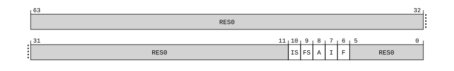

# ​D24.2.117 ISR_EL1, Interrupt Status Register

Source: <https://developer.arm.com/documentation/ddi0487/mc/-Part-D-The-AArch64-System-Level-Architecture/-Chapter-D24-AArch64-System-Register-Descriptions/-D24-2-General-system-control-registers/-D24-2-117-ISR-EL1--Interrupt-Status-Register>

##### D24.2.117 ISR\_EL1, Interrupt Status Register

The ISR\_EL1 characteristics are:

Purpose
:   Shows the pending status of IRQ and FIQ interrupts and SError exceptions.

    When FEAT\_NMI is implemented, also shows whether a pending IRQ or FIQ interrupt has Superpriority.

Configuration
:   AArch64 System register ISR\_EL1 bits [31:0] are architecturally mapped to AArch32 System register [ISR](/documentation/ddi0487/mc/-Part-G-The-AArch32-System-Level-Architecture/-Chapter-G8-AArch32-System-Register-Descriptions/-G8-2-General-system-control-registers/-G8-2-104-ISR--Interrupt-Status-Register?lang=en#reg_aarch32_isr)[31:0].

    This register is present only when FEAT\_AA64 is implemented. Otherwise, direct accesses to ISR\_EL1 are UNDEFINED.

Attributes
:   ISR\_EL1 is a 64-bit register.

###### Field descriptions



Bits [63:11]
:   Reserved, RES0.

IS, bit [10]
:   When FEAT\_NMI is implemented:
    :   IRQ with Superpriority pending bit. Indicates whether an IRQ interrupt with Superpriority is pending.

<table>
 <colgroup>
  <col/>
  <col/>
 </colgroup>
 <thead>
  <tr>
   <th>
    <strong>
     IS
    </strong>
   </th>
   <th>
    <strong>
     Meaning
    </strong>
   </th>
  </tr>
 </thead>
 <tbody>
  <tr>
   <td>
    <p>
     <code>
      0b0
     </code>
    </p>
   </td>
   <td>
    <p>
     No pending IRQ with Superpriority.
    </p>
   </td>
  </tr>
  <tr>
   <td>
    <p>
     <code>
      0b1
     </code>
    </p>
   </td>
   <td>
    <p>
     An IRQ interrupt with Superpriority is pending.
    </p>
   </td>
  </tr>
 </tbody>
</table>

        If all of the following apply, then this field shows the pending status of virtual IRQ interrupts with Superpriority:

        - EL2 is implemented and enabled in the current Security state.
        - [HCR\_EL2](/documentation/ddi0487/mc/-Part-D-The-AArch64-System-Level-Architecture/-Chapter-D24-AArch64-System-Register-Descriptions/-D24-2-General-system-control-registers/-D24-2-61-HCR-EL2--Hypervisor-Configuration-Register?lang=en#reg_aarch64_hcr_el2).IMO is 1.
        - The PE is executing at EL1.

        Otherwise, this field shows the pending status of physical IRQ interrupts with Superpriority.

    Otherwise:
    :   Reserved, RES0.

FS, bit [9]
:   When FEAT\_NMI is implemented:
    :   FIQ with Superpriority pending bit. Indicates whether an FIQ interrupt with Superpriority is pending.

<table>
 <colgroup>
  <col/>
  <col/>
 </colgroup>
 <thead>
  <tr>
   <th>
    <strong>
     FS
    </strong>
   </th>
   <th>
    <strong>
     Meaning
    </strong>
   </th>
  </tr>
 </thead>
 <tbody>
  <tr>
   <td>
    <p>
     <code>
      0b0
     </code>
    </p>
   </td>
   <td>
    <p>
     No pending FIQ with Superpriority.
    </p>
   </td>
  </tr>
  <tr>
   <td>
    <p>
     <code>
      0b1
     </code>
    </p>
   </td>
   <td>
    <p>
     An FIQ interrupt with Superpriority is pending.
    </p>
   </td>
  </tr>
 </tbody>
</table>

        If all of the following apply, then this field shows the pending status of virtual FIQ interrupts with Superpriority:

        - EL2 is implemented and enabled in the current Security state.
        - [HCR\_EL2](/documentation/ddi0487/mc/-Part-D-The-AArch64-System-Level-Architecture/-Chapter-D24-AArch64-System-Register-Descriptions/-D24-2-General-system-control-registers/-D24-2-61-HCR-EL2--Hypervisor-Configuration-Register?lang=en#reg_aarch64_hcr_el2).FMO is 1.
        - The PE is executing at EL1.

        Otherwise, this field shows the pending status of physical FIQ interrupts with Superpriority.

    Otherwise:
    :   Reserved, RES0.

A, bit [8]
:   SError exception pending bit. Indicates whether an SError exception is pending.

<table>
 <colgroup>
  <col/>
  <col/>
 </colgroup>
 <thead>
  <tr>
   <th>
    <strong>
     A
    </strong>
   </th>
   <th>
    <strong>
     Meaning
    </strong>
   </th>
  </tr>
 </thead>
 <tbody>
  <tr>
   <td>
    <p>
     <code>
      0b0
     </code>
    </p>
   </td>
   <td>
    <p>
     No pending SError.
    </p>
   </td>
  </tr>
  <tr>
   <td>
    <p>
     <code>
      0b1
     </code>
    </p>
   </td>
   <td>
    <p>
     An SError exception is pending.
    </p>
   </td>
  </tr>
 </tbody>
</table>

    If all of the following apply, then this field shows the pending status of virtual SError exceptions:

    - EL2 is implemented and enabled in the current Security state.
    - Any of the following apply:
      - [HCR\_EL2](/documentation/ddi0487/mc/-Part-D-The-AArch64-System-Level-Architecture/-Chapter-D24-AArch64-System-Register-Descriptions/-D24-2-General-system-control-registers/-D24-2-61-HCR-EL2--Hypervisor-Configuration-Register?lang=en#reg_aarch64_hcr_el2).AMO is 1.
      - [FEAT\_DoubleFault2](/documentation/ddi0487/mc/-Part-A-Arm-Architecture-Introduction-and-Overview/-Chapter-A2-A-profile-Architecture-Extensions/-A2-2-Armv8-A-architecture-extensions/-A2-2-10-The-Armv8-9-architecture-extension?lang=en#feat_feat_doublefault2) is implemented and the Effective value of [HCRX\_EL2](/documentation/ddi0487/mc/-Part-D-The-AArch64-System-Level-Architecture/-Chapter-D24-AArch64-System-Register-Descriptions/-D24-2-General-system-control-registers/-D24-2-62-HCRX-EL2--Extended-Hypervisor-Configuration-Register?lang=en#reg_aarch64_hcrx_el2).TMEA is 1.
    - The PE is executing at EL1.

    Otherwise, if all of the following apply, then this field shows the pending status of delegated SError exceptions:

    - [FEAT\_E3DSE](/documentation/ddi0487/mc/-Part-A-Arm-Architecture-Introduction-and-Overview/-Chapter-A2-A-profile-Architecture-Extensions/-A2-3-Armv9-A-architecture-extensions/-A2-3-6-The-Armv9-5-architecture-extension?lang=en#feat_feat_e3dse) is implemented.
    - [SCR\_EL3](/documentation/ddi0487/mc/-Part-D-The-AArch64-System-Level-Architecture/-Chapter-D24-AArch64-System-Register-Descriptions/-D24-2-General-system-control-registers/-D24-2-168-SCR-EL3--Secure-Configuration-Register?lang=en#reg_aarch64_scr_el3).EnDSE is 1.
    - The PE is executing at EL2 or EL1.

    Otherwise, this field shows the pending status of physical SError exceptions.

    If the physical SError exception is edge-triggered, this field is cleared to zero when the physical SError exception is taken.

I, bit [7]
:   IRQ pending bit. Indicates whether an IRQ interrupt is pending.

<table>
 <colgroup>
  <col/>
  <col/>
 </colgroup>
 <thead>
  <tr>
   <th>
    <strong>
     I
    </strong>
   </th>
   <th>
    <strong>
     Meaning
    </strong>
   </th>
  </tr>
 </thead>
 <tbody>
  <tr>
   <td>
    <p>
     <code>
      0b0
     </code>
    </p>
   </td>
   <td>
    <p>
     No pending IRQ.
    </p>
   </td>
  </tr>
  <tr>
   <td>
    <p>
     <code>
      0b1
     </code>
    </p>
   </td>
   <td>
    <p>
     An IRQ interrupt is pending.
    </p>
   </td>
  </tr>
 </tbody>
</table>

    If all of the following apply, then this field shows the pending status of virtual IRQ interrupts:

    - EL2 is implemented and enabled in the current Security state.
    - [HCR\_EL2](/documentation/ddi0487/mc/-Part-D-The-AArch64-System-Level-Architecture/-Chapter-D24-AArch64-System-Register-Descriptions/-D24-2-General-system-control-registers/-D24-2-61-HCR-EL2--Hypervisor-Configuration-Register?lang=en#reg_aarch64_hcr_el2).IMO is 1.
    - The PE is executing at EL1.

    Otherwise, this field shows the pending status of physical IRQ interrupts.

    > #### Note
    >
    > This bit indicates the presence of a pending IRQ interrupt regardless of whether the interrupt has Superpriority.

F, bit [6]
:   FIQ pending bit. Indicates whether an FIQ interrupt is pending.

<table>
 <colgroup>
  <col/>
  <col/>
 </colgroup>
 <thead>
  <tr>
   <th>
    <strong>
     F
    </strong>
   </th>
   <th>
    <strong>
     Meaning
    </strong>
   </th>
  </tr>
 </thead>
 <tbody>
  <tr>
   <td>
    <p>
     <code>
      0b0
     </code>
    </p>
   </td>
   <td>
    <p>
     No pending FIQ.
    </p>
   </td>
  </tr>
  <tr>
   <td>
    <p>
     <code>
      0b1
     </code>
    </p>
   </td>
   <td>
    <p>
     An FIQ interrupt is pending.
    </p>
   </td>
  </tr>
 </tbody>
</table>

    If all of the following apply, then this field shows the pending status of virtual FIQ interrupts:

    - EL2 is implemented and enabled in the current Security state.
    - [HCR\_EL2](/documentation/ddi0487/mc/-Part-D-The-AArch64-System-Level-Architecture/-Chapter-D24-AArch64-System-Register-Descriptions/-D24-2-General-system-control-registers/-D24-2-61-HCR-EL2--Hypervisor-Configuration-Register?lang=en#reg_aarch64_hcr_el2).FMO is 1.
    - The PE is executing at EL1.

    Otherwise, this field shows the pending status of physical FIQ interrupts.

    > #### Note
    >
    > This bit indicates the presence of a pending FIQ interrupt regardless of whether the interrupt has Superpriority.

Bits [5:0]
:   Reserved, RES0.

###### Accessing ISR\_EL1

Accesses to this register use the following encodings in the System register encoding space:

###### `MRS <Xt>, ISR_EL1`

<table>
 <colgroup>
  <col/>
  <col/>
  <col/>
  <col/>
  <col/>
 </colgroup>
 <thead>
  <tr>
   <th>
    <strong>
     op0
    </strong>
   </th>
   <th>
    <strong>
     op1
    </strong>
   </th>
   <th>
    <strong>
     CRn
    </strong>
   </th>
   <th>
    <strong>
     CRm
    </strong>
   </th>
   <th>
    <strong>
     op2
    </strong>
   </th>
  </tr>
 </thead>
 <tbody>
  <tr>
   <td>
    <p>
     <code>
      0b11
     </code>
    </p>
   </td>
   <td>
    <p>
     <code>
      0b000
     </code>
    </p>
   </td>
   <td>
    <p>
     <code>
      0b1100
     </code>
    </p>
   </td>
   <td>
    <p>
     <code>
      0b0001
     </code>
    </p>
   </td>
   <td>
    <p>
     <code>
      0b000
     </code>
    </p>
   </td>
  </tr>
 </tbody>
</table>

```
if !IsFeatureImplemented(FEAT_AA64) then
    Undefined();
elsif PSTATE.EL == EL0 then
    Undefined();
elsif PSTATE.EL == EL1 then
    if EL2Enabled() && IsFeatureImplemented(FEAT_FGT) && (!HaveEL(EL3) || SCR_EL3().FGTEn == '1') && HFGRTR_EL2().ISR_EL1 == '1' then
        AArch64_SystemAccessTrap(EL2, 0x18);
    else
        X{64}(t) = ISR_EL1();
    end;
elsif PSTATE.EL == EL2 then
    X{64}(t) = ISR_EL1();
elsif PSTATE.EL == EL3 then
    X{64}(t) = ISR_EL1();
end;
```
