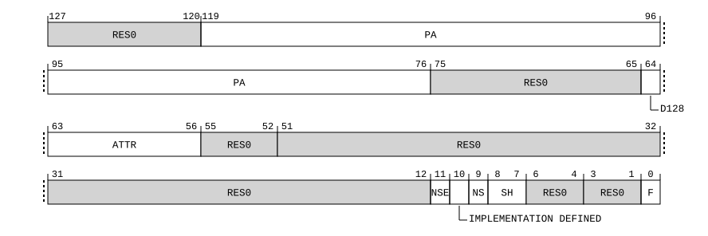
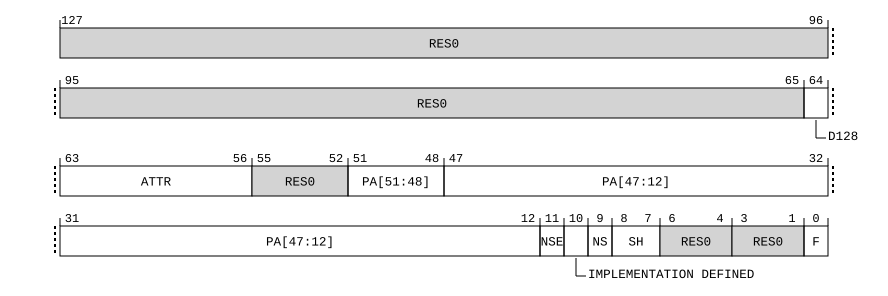
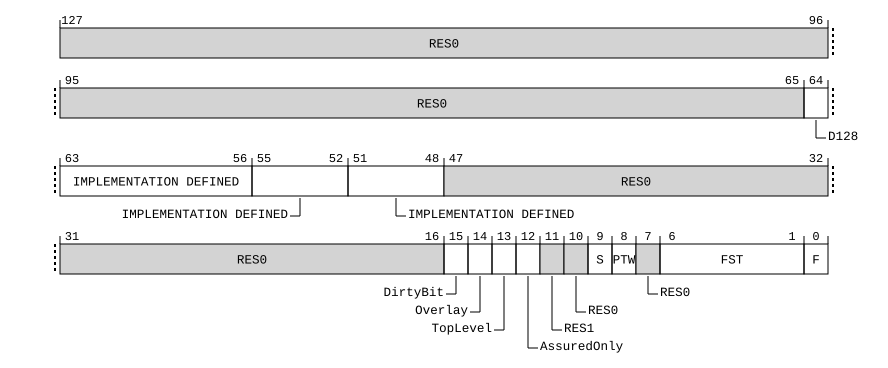

# ​D24.2.141 PAR_EL1, Physical Address Register

Source: <https://developer.arm.com/documentation/ddi0487/mc/-Part-D-The-AArch64-System-Level-Architecture/-Chapter-D24-AArch64-System-Register-Descriptions/-D24-2-General-system-control-registers/-D24-2-141-PAR-EL1--Physical-Address-Register>

##### D24.2.141 PAR\_EL1, Physical Address Register

The PAR\_EL1 characteristics are:

Purpose
:   Returns the output address (OA) from an Address translation instruction that executed successfully, or fault information if the instruction did not execute successfully.

Configuration
:   AArch64 System register PAR\_EL1 is a 128-bit register that can also be accessed as a 64-bit value. If it is accessed as a 64-bit register, accesses read and write bits [63:0] and do not modify bits [127:64].

    Single stage AT Instructions (ATS1\*) report their result using the 128-bit format of PAR\_EL1 if the translation system that they target uses VMSAv9-128.

    ATS12\* Instructions report their result using the 128-bit format PAR\_EL1 if either of the following is true:

    - if stage 2 translations are enabled and the stage 2 translation system uses VMSAv9-128.
    - if stage 2 translations are disabled and the stage 1 translation system uses VMSAv9-128.

    Otherwise, 64-bit format of PAR\_EL1 is used.

    AArch64 System register PAR\_EL1 bits [63:0] are architecturally mapped to AArch32 System register [PAR](/documentation/ddi0487/mc/-Part-G-The-AArch32-System-Level-Architecture/-Chapter-G8-AArch32-System-Register-Descriptions/-G8-2-General-system-control-registers/-G8-2-121-PAR--Physical-Address-Register?lang=en#reg_aarch32_par)[63:0].

    This register is present only when FEAT\_AA64 is implemented. Otherwise, direct accesses to PAR\_EL1 are UNDEFINED.

Attributes
:   PAR\_EL1 is a:

    - 128-bit register when FEAT\_D128 is implemented, GetPAR\_EL1\_D128() == ‘1’, and GetPAR\_EL1\_F() == ‘0’.
    - 128-bit register when FEAT\_D128 is implemented, GetPAR\_EL1\_D128() == ‘1’, and GetPAR\_EL1\_F() == ‘1’.
    - 128-bit register when FEAT\_D128 is implemented, GetPAR\_EL1\_D128() == ‘0’, and GetPAR\_EL1\_F() == ‘0’.
    - 128-bit register when FEAT\_D128 is implemented, GetPAR\_EL1\_D128() == ‘0’, and GetPAR\_EL1\_F() == ‘1’.
    - 64-bit register when FEAT\_D128 is not implemented and GetPAR\_EL1\_F() == ‘0’.
    - 64-bit register when FEAT\_D128 is not implemented and GetPAR\_EL1\_F() == ‘1’.

###### Field descriptions

When FEAT\_D128 is implemented, GetPAR\_EL1\_D128() == '1', and GetPAR\_EL1\_F() == '0':
:   

    This section describes the register value returned by the successful execution of an Address translation instruction. Software might subsequently write a different value to the register, and that write does not affect the operation of the PE.

    On a successful conversion, the PAR\_EL1 can return a value that indicates the resulting attributes, rather than the values that appear in the Translation table descriptors. More precisely:

    - The PAR\_EL1.{ATTR, SH} fields are permitted to report the resulting attributes, as determined by any permitted implementation choices and any applicable configuration bits, instead of reporting the values that appear in the Translation table descriptors.
    - See the PAR\_EL1.NS bit description for constraints on the value it returns.

Bits [127:120]
:   Reserved, RES0.

PA, bits [119:76]
:   Output address. The output address (OA) corresponding to the supplied input address. This field returns address bits[55:12].

    The reset behavior of this field is:

    - On a Warm reset, this field resets to an architecturally UNKNOWN value.

Bits [75:65]
:   Reserved, RES0.

D128, bit [64]
:   Indicates if the PAR\_EL1 uses the 128-bit format.

<table>
 <colgroup>
  <col/>
  <col/>
 </colgroup>
 <thead>
  <tr>
   <th>
    <strong>
     D128
    </strong>
   </th>
   <th>
    <strong>
     Meaning
    </strong>
   </th>
  </tr>
 </thead>
 <tbody>
  <tr>
   <td>
    <p>
     <code>
      0b1
     </code>
    </p>
   </td>
   <td>
    <p>
     PAR_EL1 uses the 128-bit format. PAR_EL1[127:0] holds valid data.
    </p>
   </td>
  </tr>
 </tbody>
</table>

    The reset behavior of this field is:

    - On a Warm reset, this field resets to an architecturally UNKNOWN value.

ATTR, bits [63:56]
:   Memory attributes for the returned output address. This field uses the same encoding as the Attr<n> fields in [MAIR\_EL1](/documentation/ddi0487/mc/-Part-D-The-AArch64-System-Level-Architecture/-Chapter-D24-AArch64-System-Register-Descriptions/-D24-2-General-system-control-registers/-D24-2-126-MAIR-EL1--Memory-Attribute-Indirection-Register--EL1-?lang=en#reg_aarch64_mair_el1), [MAIR\_EL2](/documentation/ddi0487/mc/-Part-D-The-AArch64-System-Level-Architecture/-Chapter-D24-AArch64-System-Register-Descriptions/-D24-2-General-system-control-registers/-D24-2-127-MAIR-EL2--Memory-Attribute-Indirection-Register--EL2-?lang=en#reg_aarch64_mair_el2), and [MAIR\_EL3](/documentation/ddi0487/mc/-Part-D-The-AArch64-System-Level-Architecture/-Chapter-D24-AArch64-System-Register-Descriptions/-D24-2-General-system-control-registers/-D24-2-128-MAIR-EL3--Memory-Attribute-Indirection-Register--EL3-?lang=en#reg_aarch64_mair_el3).

    If FEAT\_MTE\_PERM is implemented and the instruction performed a stage 2 translation, the following additional encoding is defined:

<table>
 <colgroup>
  <col/>
  <col/>
 </colgroup>
 <thead>
  <tr>
   <th>
    ATTR
   </th>
   <th>
    Meaning
   </th>
  </tr>
 </thead>
 <tbody>
  <tr>
   <td>
    <code>
     0b11100000
    </code>
   </td>
   <td>
    Tagged NoTagAccess Normal Inner Write-Back, Outer Write-Back, Read-Allocate, Write-Allocate Non-transient memory.
   </td>
  </tr>
 </tbody>
</table>

    > #### Note
    >
    > This encoding in MAIR\_ELx is Reserved.

    The value returned in this field can be the resulting attribute that is actually implemented by the implementation, as determined by any permitted implementation choices and any applicable configuration bits, instead of the value that appears in the Translation table descriptor.

    > #### Note
    >
    > The attributes presented are consistent with the stages of translation applied in the address translation instruction. If the instruction performed a stage 1 translation only, the attributes are from the stage 1 translation. If the instruction performed a stage 1 and stage 2 translation, the attributes are from the combined stage 1 and stage 2 translation.

    The reset behavior of this field is:

    - On a Warm reset, this field resets to an architecturally UNKNOWN value.

Bits [55:52, 6:4]
:   Reserved, RES0.

Bits [51:12]
:   Reserved, RES0.

NSE, bit [11]
:   When FEAT\_RME is implemented:
    :   Reports the NSE attribute for a translation table descriptor from the EL3 translation regime.

        For a description of the values derived by evaluating NS and NSE together, see PAR\_EL1.NS.

        For a result from a Secure, Non-secure, or Realm translation regime, this bit is unknown.

        The reset behavior of this field is:

        - On a Warm reset, this field resets to an architecturally UNKNOWN value.

    Otherwise:
    :   Reserved, RES1.

IMPLEMENTATION DEFINED, bit [10]
:   IMPLEMENTATION DEFINED.

    The reset behavior of this field is:

    - On a Warm reset, this field resets to an architecturally UNKNOWN value.

NS, bit [9]
:   When FEAT\_RME is implemented:
    :   Non-secure. The NS attribute for a translation table entry from a Secure translation regime, a Realm translation regime, and the EL3 translation regime.

        For a result from an EL3 translation regime, NS and NSE are evaluated together to report the physical address space:

<table>
 <colgroup>
  <col/>
  <col/>
  <col/>
 </colgroup>
 <thead>
  <tr>
   <th>
    NSE
   </th>
   <th>
    NS
   </th>
   <th>
    Meaning
   </th>
  </tr>
 </thead>
 <tbody>
  <tr>
   <td>
    <code>
     0b0
    </code>
   </td>
   <td>
    <code>
     0b0
    </code>
   </td>
   <td>
    When Secure state is implemented, Secure. Otherwise reserved.
   </td>
  </tr>
  <tr>
   <td>
    <code>
     0b0
    </code>
   </td>
   <td>
    <code>
     0b1
    </code>
   </td>
   <td>
    Non-secure.
   </td>
  </tr>
  <tr>
   <td>
    <code>
     0b1
    </code>
   </td>
   <td>
    <code>
     0b0
    </code>
   </td>
   <td>
    Root.
   </td>
  </tr>
  <tr>
   <td>
    <code>
     0b1
    </code>
   </td>
   <td>
    <code>
     0b1
    </code>
   </td>
   <td>
    Realm.
   </td>
  </tr>
 </tbody>
</table>

        For a result from a Secure translation regime, when [SCR\_EL3](/documentation/ddi0487/mc/-Part-D-The-AArch64-System-Level-Architecture/-Chapter-D24-AArch64-System-Register-Descriptions/-D24-2-General-system-control-registers/-D24-2-168-SCR-EL3--Secure-Configuration-Register?lang=en#reg_aarch64_scr_el3).EEL2 is 1, this bit distinguishes between the Secure and Non-secure intermediate physical address space of the translation for the instructions:

        - In AArch64 state: [AT S1E1R](/documentation/ddi0487/mc/-Part-C-The-AArch64-Instruction-Set/-Chapter-C5-The-A64-System-Instruction-Class/-C5-4-A64-System-instructions-for-address-translation/-C5-4-8-AT-S1E1R--Address-Translate-Stage-1-EL1-Read?lang=en#reg_aarch64_at_s1e1r), [AT S1E1W](/documentation/ddi0487/mc/-Part-C-The-AArch64-Instruction-Set/-Chapter-C5-The-A64-System-Instruction-Class/-C5-4-A64-System-instructions-for-address-translation/-C5-4-10-AT-S1E1W--Address-Translate-Stage-1-EL1-Write?lang=en#reg_aarch64_at_s1e1w), [AT S1E1RP](/documentation/ddi0487/mc/-Part-C-The-AArch64-Instruction-Set/-Chapter-C5-The-A64-System-Instruction-Class/-C5-4-A64-System-instructions-for-address-translation/-C5-4-9-AT-S1E1RP--Address-Translate-Stage-1-EL1-Read-PAN?lang=en#reg_aarch64_at_s1e1rp), [AT S1E1WP](/documentation/ddi0487/mc/-Part-C-The-AArch64-Instruction-Set/-Chapter-C5-The-A64-System-Instruction-Class/-C5-4-A64-System-instructions-for-address-translation/-C5-4-11-AT-S1E1WP--Address-Translate-Stage-1-EL1-Write-PAN?lang=en#reg_aarch64_at_s1e1wp), [AT S1E0R](/documentation/ddi0487/mc/-Part-C-The-AArch64-Instruction-Set/-Chapter-C5-The-A64-System-Instruction-Class/-C5-4-A64-System-instructions-for-address-translation/-C5-4-5-AT-S1E0R--Address-Translate-Stage-1-EL0-Read?lang=en#reg_aarch64_at_s1e0r), and [AT S1E0W](/documentation/ddi0487/mc/-Part-C-The-AArch64-Instruction-Set/-Chapter-C5-The-A64-System-Instruction-Class/-C5-4-A64-System-instructions-for-address-translation/-C5-4-6-AT-S1E0W--Address-Translate-Stage-1-EL0-Write?lang=en#reg_aarch64_at_s1e0w).
        - In AArch32 state: [ATS1CPR](/documentation/ddi0487/mc/-Part-G-The-AArch32-System-Level-Architecture/-Chapter-G8-AArch32-System-Register-Descriptions/-G8-2-General-system-control-registers/-G8-2-13-ATS1CPR--Address-Translate-Stage-1-Current-state-PL1-Read?lang=en#reg_aarch32_ats1cpr), [ATS1CPW](/documentation/ddi0487/mc/-Part-G-The-AArch32-System-Level-Architecture/-Chapter-G8-AArch32-System-Register-Descriptions/-G8-2-General-system-control-registers/-G8-2-15-ATS1CPW--Address-Translate-Stage-1-Current-state-PL1-Write?lang=en#reg_aarch32_ats1cpw), [ATS1CPRP](/documentation/ddi0487/mc/-Part-G-The-AArch32-System-Level-Architecture/-Chapter-G8-AArch32-System-Register-Descriptions/-G8-2-General-system-control-registers/-G8-2-14-ATS1CPRP--Address-Translate-Stage-1-Current-state-PL1-Read-PAN?lang=en#reg_aarch32_ats1cprp), [ATS1CPWP](/documentation/ddi0487/mc/-Part-G-The-AArch32-System-Level-Architecture/-Chapter-G8-AArch32-System-Register-Descriptions/-G8-2-General-system-control-registers/-G8-2-16-ATS1CPWP--Address-Translate-Stage-1-Current-state-PL1-Write-PAN?lang=en#reg_aarch32_ats1cpwp), [ATS1CUR](/documentation/ddi0487/mc/-Part-G-The-AArch32-System-Level-Architecture/-Chapter-G8-AArch32-System-Register-Descriptions/-G8-2-General-system-control-registers/-G8-2-17-ATS1CUR--Address-Translate-Stage-1-Current-state-Unprivileged-Read?lang=en#reg_aarch32_ats1cur), and [ATS1CUW](/documentation/ddi0487/mc/-Part-G-The-AArch32-System-Level-Architecture/-Chapter-G8-AArch32-System-Register-Descriptions/-G8-2-General-system-control-registers/-G8-2-18-ATS1CUW--Address-Translate-Stage-1-Current-state-Unprivileged-Write?lang=en#reg_aarch32_ats1cuw).

        Otherwise, this bit reflects the Security state of the physical address space of the translation. This means it reflects the effect of the NSTable bits of earlier levels of the translation table walk if those NSTable bits have an effect on the translation.

        For a result from a Non-secure translation regime, this bit is UNKNOWN.

        For a result from an S1E1 or S1E0 operation on the Realm EL1&0 translation regime, this bit is UNKNOWN.

        The reset behavior of this field is:

        - On a Warm reset, this field resets to an architecturally UNKNOWN value.

    Otherwise:
    :   Non-secure. The NS attribute for a translation table entry from a Secure translation regime.

        For a result from a Secure translation regime, when [SCR\_EL3](/documentation/ddi0487/mc/-Part-D-The-AArch64-System-Level-Architecture/-Chapter-D24-AArch64-System-Register-Descriptions/-D24-2-General-system-control-registers/-D24-2-168-SCR-EL3--Secure-Configuration-Register?lang=en#reg_aarch64_scr_el3).EEL2 is 1, this bit distinguishes between the Secure and Non-secure intermediate physical address space of the translation for the instructions:

        - In AArch64 state: [AT S1E1R](/documentation/ddi0487/mc/-Part-C-The-AArch64-Instruction-Set/-Chapter-C5-The-A64-System-Instruction-Class/-C5-4-A64-System-instructions-for-address-translation/-C5-4-8-AT-S1E1R--Address-Translate-Stage-1-EL1-Read?lang=en#reg_aarch64_at_s1e1r), [AT S1E1W](/documentation/ddi0487/mc/-Part-C-The-AArch64-Instruction-Set/-Chapter-C5-The-A64-System-Instruction-Class/-C5-4-A64-System-instructions-for-address-translation/-C5-4-10-AT-S1E1W--Address-Translate-Stage-1-EL1-Write?lang=en#reg_aarch64_at_s1e1w), [AT S1E1RP](/documentation/ddi0487/mc/-Part-C-The-AArch64-Instruction-Set/-Chapter-C5-The-A64-System-Instruction-Class/-C5-4-A64-System-instructions-for-address-translation/-C5-4-9-AT-S1E1RP--Address-Translate-Stage-1-EL1-Read-PAN?lang=en#reg_aarch64_at_s1e1rp), [AT S1E1WP](/documentation/ddi0487/mc/-Part-C-The-AArch64-Instruction-Set/-Chapter-C5-The-A64-System-Instruction-Class/-C5-4-A64-System-instructions-for-address-translation/-C5-4-11-AT-S1E1WP--Address-Translate-Stage-1-EL1-Write-PAN?lang=en#reg_aarch64_at_s1e1wp), [AT S1E0R](/documentation/ddi0487/mc/-Part-C-The-AArch64-Instruction-Set/-Chapter-C5-The-A64-System-Instruction-Class/-C5-4-A64-System-instructions-for-address-translation/-C5-4-5-AT-S1E0R--Address-Translate-Stage-1-EL0-Read?lang=en#reg_aarch64_at_s1e0r), and [AT S1E0W](/documentation/ddi0487/mc/-Part-C-The-AArch64-Instruction-Set/-Chapter-C5-The-A64-System-Instruction-Class/-C5-4-A64-System-instructions-for-address-translation/-C5-4-6-AT-S1E0W--Address-Translate-Stage-1-EL0-Write?lang=en#reg_aarch64_at_s1e0w).
        - In AArch32 state: [ATS1CPR](/documentation/ddi0487/mc/-Part-G-The-AArch32-System-Level-Architecture/-Chapter-G8-AArch32-System-Register-Descriptions/-G8-2-General-system-control-registers/-G8-2-13-ATS1CPR--Address-Translate-Stage-1-Current-state-PL1-Read?lang=en#reg_aarch32_ats1cpr), [ATS1CPW](/documentation/ddi0487/mc/-Part-G-The-AArch32-System-Level-Architecture/-Chapter-G8-AArch32-System-Register-Descriptions/-G8-2-General-system-control-registers/-G8-2-15-ATS1CPW--Address-Translate-Stage-1-Current-state-PL1-Write?lang=en#reg_aarch32_ats1cpw), [ATS1CPRP](/documentation/ddi0487/mc/-Part-G-The-AArch32-System-Level-Architecture/-Chapter-G8-AArch32-System-Register-Descriptions/-G8-2-General-system-control-registers/-G8-2-14-ATS1CPRP--Address-Translate-Stage-1-Current-state-PL1-Read-PAN?lang=en#reg_aarch32_ats1cprp), [ATS1CPWP](/documentation/ddi0487/mc/-Part-G-The-AArch32-System-Level-Architecture/-Chapter-G8-AArch32-System-Register-Descriptions/-G8-2-General-system-control-registers/-G8-2-16-ATS1CPWP--Address-Translate-Stage-1-Current-state-PL1-Write-PAN?lang=en#reg_aarch32_ats1cpwp), [ATS1CUR](/documentation/ddi0487/mc/-Part-G-The-AArch32-System-Level-Architecture/-Chapter-G8-AArch32-System-Register-Descriptions/-G8-2-General-system-control-registers/-G8-2-17-ATS1CUR--Address-Translate-Stage-1-Current-state-Unprivileged-Read?lang=en#reg_aarch32_ats1cur), and [ATS1CUW](/documentation/ddi0487/mc/-Part-G-The-AArch32-System-Level-Architecture/-Chapter-G8-AArch32-System-Register-Descriptions/-G8-2-General-system-control-registers/-G8-2-18-ATS1CUW--Address-Translate-Stage-1-Current-state-Unprivileged-Write?lang=en#reg_aarch32_ats1cuw).

        Otherwise, this bit reflects the Security state of the physical address space of the translation. This means it reflects the effect of the NSTable bits of earlier levels of the translation table walk if those NSTable bits have an effect on the translation.

        For a result from a Non-secure translation regime, this bit is UNKNOWN.

        The reset behavior of this field is:

        - On a Warm reset, this field resets to an architecturally UNKNOWN value.

SH, bits [8:7]
:   Shareability attribute, for the returned output address.

<table>
 <colgroup>
  <col/>
  <col/>
 </colgroup>
 <thead>
  <tr>
   <th>
    <strong>
     SH
    </strong>
   </th>
   <th>
    <strong>
     Meaning
    </strong>
   </th>
  </tr>
 </thead>
 <tbody>
  <tr>
   <td>
    <p>
     <code>
      0b00
     </code>
    </p>
   </td>
   <td>
    <p>
     Non-shareable.
    </p>
   </td>
  </tr>
  <tr>
   <td>
    <p>
     <code>
      0b10
     </code>
    </p>
   </td>
   <td>
    <p>
     Outer Shareable.
    </p>
   </td>
  </tr>
  <tr>
   <td>
    <p>
     <code>
      0b11
     </code>
    </p>
   </td>
   <td>
    <p>
     Inner Shareable.
    </p>
   </td>
  </tr>
 </tbody>
</table>

    The value `0b01` is reserved.

    > #### Note
    >
    > This field returns the value `0b10` for:
    >
    > - Any type of Device memory.
    > - Normal memory with both Inner Non-cacheable and Outer Non-cacheable attributes.

    The value returned in this field can be the resulting attribute, as determined by any permitted implementation choices and any applicable configuration bits, instead of the value that appears in the Translation table descriptor.

    The reset behavior of this field is:

    - On a Warm reset, this field resets to an architecturally UNKNOWN value.

Bits [3:1]
:   Reserved, RES0.

F, bit [0]
:   Indicates whether the instruction performed a successful address translation.

<table>
 <colgroup>
  <col/>
  <col/>
 </colgroup>
 <thead>
  <tr>
   <th>
    <strong>
     F
    </strong>
   </th>
   <th>
    <strong>
     Meaning
    </strong>
   </th>
  </tr>
 </thead>
 <tbody>
  <tr>
   <td>
    <p>
     <code>
      0b0
     </code>
    </p>
   </td>
   <td>
    <p>
     Address translation completed successfully.
    </p>
   </td>
  </tr>
 </tbody>
</table>

    The reset behavior of this field is:

    - On a Warm reset, this field resets to an architecturally UNKNOWN value.

When FEAT\_D128 is implemented, GetPAR\_EL1\_D128() == '1', and GetPAR\_EL1\_F() == '1':
:   

    This section describes the register value returned by a fault on the execution of an Address translation instruction. Software might subsequently write a different value to the register, and that write does not affect the operation of the PE.

Bits [127:65]
:   Reserved, RES0.

D128, bit [64]
:   Indicates if the PAR\_EL1 uses the 128-bit format.

<table>
 <colgroup>
  <col/>
  <col/>
 </colgroup>
 <thead>
  <tr>
   <th>
    <strong>
     D128
    </strong>
   </th>
   <th>
    <strong>
     Meaning
    </strong>
   </th>
  </tr>
 </thead>
 <tbody>
  <tr>
   <td>
    <p>
     <code>
      0b1
     </code>
    </p>
   </td>
   <td>
    <p>
     PAR_EL1 uses the 128-bit format. PAR_EL1[127:0] holds valid data.
    </p>
   </td>
  </tr>
 </tbody>
</table>

    The reset behavior of this field is:

    - On a Warm reset, this field resets to an architecturally UNKNOWN value.

IMPLEMENTATION DEFINED, bits [63:56]
:   IMPLEMENTATION DEFINED.

    The reset behavior of this field is:

    - On a Warm reset, this field resets to an architecturally UNKNOWN value.

IMPLEMENTATION DEFINED, bits [55:52]
:   IMPLEMENTATION DEFINED.

    The reset behavior of this field is:

    - On a Warm reset, this field resets to an architecturally UNKNOWN value.

IMPLEMENTATION DEFINED, bits [51:48]
:   IMPLEMENTATION DEFINED.

    The reset behavior of this field is:

    - On a Warm reset, this field resets to an architecturally UNKNOWN value.

Bits [47:16]
:   Reserved, RES0.

DirtyBit, bit [15]
:   When FEAT\_S1PIE is implemented or FEAT\_S2PIE is implemented:
    :   DirtyBit flag.

        If PAR\_EL1.FST indicates a Permission fault for a stage of translation that is using Indirect Permissions, and dirty state is managed by software, then this field holds information about the fault.

<table>
 <colgroup>
  <col/>
  <col/>
 </colgroup>
 <thead>
  <tr>
   <th>
    <strong>
     DirtyBit
    </strong>
   </th>
   <th>
    <strong>
     Meaning
    </strong>
   </th>
  </tr>
 </thead>
 <tbody>
  <tr>
   <td>
    <p>
     <code>
      0b0
     </code>
    </p>
   </td>
   <td>
    <p>
     The Permission Fault is not due to dirty state.
    </p>
   </td>
  </tr>
  <tr>
   <td>
    <p>
     <code>
      0b1
     </code>
    </p>
   </td>
   <td>
    <p>
     The Permission Fault is due to dirty state.
    </p>
   </td>
  </tr>
 </tbody>
</table>

        For any other fault or Access, this field is RES0.

        > #### Note
        >
        > At stage 1, dirty state is indicated by the nDirty bit in Block and Page descriptors. At stage 2, dirty state is indicated by the Dirty bit in Block and Page descriptors.

        The reset behavior of this field is:

        - On a Warm reset, this field resets to an architecturally UNKNOWN value.

    Otherwise:
    :   Reserved, RES0.

Overlay, bit [14]
:   When FEAT\_S1POE is implemented or FEAT\_S2POE is implemented:
    :   Overlay flag.

        If PAR\_EL1.FST indicates a Permission fault for a stage of translation, then this field holds information about the fault.

<table>
 <colgroup>
  <col/>
  <col/>
 </colgroup>
 <thead>
  <tr>
   <th>
    <strong>
     Overlay
    </strong>
   </th>
   <th>
    <strong>
     Meaning
    </strong>
   </th>
  </tr>
 </thead>
 <tbody>
  <tr>
   <td>
    <p>
     <code>
      0b0
     </code>
    </p>
   </td>
   <td>
    <p>
     The Data Abort is not due to Overlay Permissions.
    </p>
   </td>
  </tr>
  <tr>
   <td>
    <p>
     <code>
      0b1
     </code>
    </p>
   </td>
   <td>
    <p>
     The Data Abort is due to Overlay Permissions.
    </p>
   </td>
  </tr>
 </tbody>
</table>

        For any other fault, this field is RES0.

        The reset behavior of this field is:

        - On a Warm reset, this field resets to an architecturally UNKNOWN value.

    Otherwise:
    :   Reserved, RES0.

TopLevel, bit [13]
:   When FEAT\_THE is implemented:
    :   Fault due to TopLevel. Indicates if the fault was due to TopLevel.

<table>
 <colgroup>
  <col/>
  <col/>
 </colgroup>
 <thead>
  <tr>
   <th>
    <strong>
     TopLevel
    </strong>
   </th>
   <th>
    <strong>
     Meaning
    </strong>
   </th>
  </tr>
 </thead>
 <tbody>
  <tr>
   <td>
    <p>
     <code>
      0b0
     </code>
    </p>
   </td>
   <td>
    <p>
     Fault is not due to TopLevel.
    </p>
   </td>
  </tr>
  <tr>
   <td>
    <p>
     <code>
      0b1
     </code>
    </p>
   </td>
   <td>
    <p>
     Fault is due to TopLevel.
    </p>
   </td>
  </tr>
 </tbody>
</table>

        For any other fault, this field is RES0.

        The reset behavior of this field is:

        - On a Warm reset, this field resets to an architecturally UNKNOWN value.

    Otherwise:
    :   Reserved, RES0.

AssuredOnly, bit [12]
:   When FEAT\_THE is implemented:
    :   AssuredOnly flag.

        If PAR\_EL1.S indicates a stage 2 fault, then this field holds information about the fault.

<table>
 <colgroup>
  <col/>
  <col/>
 </colgroup>
 <thead>
  <tr>
   <th>
    <strong>
     AssuredOnly
    </strong>
   </th>
   <th>
    <strong>
     Meaning
    </strong>
   </th>
  </tr>
 </thead>
 <tbody>
  <tr>
   <td>
    <p>
     <code>
      0b0
     </code>
    </p>
   </td>
   <td>
    <p>
     The Data Abort is not due to AssuredOnly.
    </p>
   </td>
  </tr>
  <tr>
   <td>
    <p>
     <code>
      0b1
     </code>
    </p>
   </td>
   <td>
    <p>
     The Data Abort is due to AssuredOnly.
    </p>
   </td>
  </tr>
 </tbody>
</table>

        For any other fault, this field is RES0.

        The reset behavior of this field is:

        - On a Warm reset, this field resets to an architecturally UNKNOWN value.

    Otherwise:
    :   Reserved, RES0.

Bit [11]
:   Reserved, RES1.

Bit [10]
:   Reserved, RES0.

S, bit [9]
:   Indicates the translation stage at which the translation aborted:

<table>
 <colgroup>
  <col/>
  <col/>
 </colgroup>
 <thead>
  <tr>
   <th>
    <strong>
     S
    </strong>
   </th>
   <th>
    <strong>
     Meaning
    </strong>
   </th>
  </tr>
 </thead>
 <tbody>
  <tr>
   <td>
    <p>
     <code>
      0b0
     </code>
    </p>
   </td>
   <td>
    <p>
     Translation aborted because of a fault in the stage 1 translation.
    </p>
   </td>
  </tr>
  <tr>
   <td>
    <p>
     <code>
      0b1
     </code>
    </p>
   </td>
   <td>
    <p>
     Translation aborted because of a fault in the stage 2 translation.
    </p>
   </td>
  </tr>
 </tbody>
</table>

    The reset behavior of this field is:

    - On a Warm reset, this field resets to an architecturally UNKNOWN value.

PTW, bit [8]
:   If this bit is set to 1, it indicates the translation aborted because of a stage 2 fault during a stage 1 translation table walk.

    The reset behavior of this field is:

    - On a Warm reset, this field resets to an architecturally UNKNOWN value.

Bit [7]
:   Reserved, RES0.

FST, bits [6:1]
:   Fault status code, as shown in the Data Abort ESR encoding.

<table>
 <colgroup>
  <col/>
  <col/>
  <col/>
 </colgroup>
 <thead>
  <tr>
   <th>
    <strong>
     FST
    </strong>
   </th>
   <th>
    <strong>
     Meaning
    </strong>
   </th>
   <th>
    <strong>
     Applies when
    </strong>
   </th>
  </tr>
 </thead>
 <tbody>
  <tr>
   <td>
    <p>
     <code>
      0b000000
     </code>
    </p>
   </td>
   <td>
    <p>
     Address size fault, level 0 of translation or translation table base register.
    </p>
   </td>
   <td>
   </td>
  </tr>
  <tr>
   <td>
    <p>
     <code>
      0b000001
     </code>
    </p>
   </td>
   <td>
    <p>
     Address size fault, level 1.
    </p>
   </td>
   <td>
   </td>
  </tr>
  <tr>
   <td>
    <p>
     <code>
      0b000010
     </code>
    </p>
   </td>
   <td>
    <p>
     Address size fault, level 2.
    </p>
   </td>
   <td>
   </td>
  </tr>
  <tr>
   <td>
    <p>
     <code>
      0b000011
     </code>
    </p>
   </td>
   <td>
    <p>
     Address size fault, level 3.
    </p>
   </td>
   <td>
   </td>
  </tr>
  <tr>
   <td>
    <p>
     <code>
      0b000100
     </code>
    </p>
   </td>
   <td>
    <p>
     Translation fault, level 0.
    </p>
   </td>
   <td>
   </td>
  </tr>
  <tr>
   <td>
    <p>
     <code>
      0b000101
     </code>
    </p>
   </td>
   <td>
    <p>
     Translation fault, level 1.
    </p>
   </td>
   <td>
   </td>
  </tr>
  <tr>
   <td>
    <p>
     <code>
      0b000110
     </code>
    </p>
   </td>
   <td>
    <p>
     Translation fault, level 2.
    </p>
   </td>
   <td>
   </td>
  </tr>
  <tr>
   <td>
    <p>
     <code>
      0b000111
     </code>
    </p>
   </td>
   <td>
    <p>
     Translation fault, level 3.
    </p>
   </td>
   <td>
   </td>
  </tr>
  <tr>
   <td>
    <p>
     <code>
      0b001001
     </code>
    </p>
   </td>
   <td>
    <p>
     Access flag fault, level 1.
    </p>
   </td>
   <td>
   </td>
  </tr>
  <tr>
   <td>
    <p>
     <code>
      0b001010
     </code>
    </p>
   </td>
   <td>
    <p>
     Access flag fault, level 2.
    </p>
   </td>
   <td>
   </td>
  </tr>
  <tr>
   <td>
    <p>
     <code>
      0b001011
     </code>
    </p>
   </td>
   <td>
    <p>
     Access flag fault, level 3.
    </p>
   </td>
   <td>
   </td>
  </tr>
  <tr>
   <td>
    <p>
     <code>
      0b001000
     </code>
    </p>
   </td>
   <td>
    <p>
     Access flag fault, level 0.
    </p>
   </td>
   <td>
    <p>
     FEAT_LPA2 is implemented
    </p>
   </td>
  </tr>
  <tr>
   <td>
    <p>
     <code>
      0b001100
     </code>
    </p>
   </td>
   <td>
    <p>
     Permission fault, level 0.
    </p>
   </td>
   <td>
    <p>
     FEAT_LPA2 is implemented
    </p>
   </td>
  </tr>
  <tr>
   <td>
    <p>
     <code>
      0b001101
     </code>
    </p>
   </td>
   <td>
    <p>
     Permission fault, level 1.
    </p>
   </td>
   <td>
   </td>
  </tr>
  <tr>
   <td>
    <p>
     <code>
      0b001110
     </code>
    </p>
   </td>
   <td>
    <p>
     Permission fault, level 2.
    </p>
   </td>
   <td>
   </td>
  </tr>
  <tr>
   <td>
    <p>
     <code>
      0b001111
     </code>
    </p>
   </td>
   <td>
    <p>
     Permission fault, level 3.
    </p>
   </td>
   <td>
   </td>
  </tr>
  <tr>
   <td>
    <p>
     <code>
      0b011011
     </code>
    </p>
   </td>
   <td>
    <p>
     Synchronous parity or ECC error on memory access on translation table walk or hardware update of translation table, level -1.
    </p>
   </td>
   <td>
    <p>
     FEAT_LPA2 is implemented and FEAT_RAS is not implemented
    </p>
   </td>
  </tr>
  <tr>
   <td>
    <p>
     <code>
      0b011100
     </code>
    </p>
   </td>
   <td>
    <p>
     Synchronous parity or ECC error on memory access on translation table walk or hardware update of translation table, level 0.
    </p>
   </td>
   <td>
    <p>
     FEAT_RAS is not implemented
    </p>
   </td>
  </tr>
  <tr>
   <td>
    <p>
     <code>
      0b011101
     </code>
    </p>
   </td>
   <td>
    <p>
     Synchronous parity or ECC error on memory access on translation table walk or hardware update of translation table, level 1.
    </p>
   </td>
   <td>
    <p>
     FEAT_RAS is not implemented
    </p>
   </td>
  </tr>
  <tr>
   <td>
    <p>
     <code>
      0b011110
     </code>
    </p>
   </td>
   <td>
    <p>
     Synchronous parity or ECC error on memory access on translation table walk or hardware update of translation table, level 2.
    </p>
   </td>
   <td>
    <p>
     FEAT_RAS is not implemented
    </p>
   </td>
  </tr>
  <tr>
   <td>
    <p>
     <code>
      0b011111
     </code>
    </p>
   </td>
   <td>
    <p>
     Synchronous parity or ECC error on memory access on translation table walk or hardware update of translation table, level 3.
    </p>
   </td>
   <td>
    <p>
     FEAT_RAS is not implemented
    </p>
   </td>
  </tr>
  <tr>
   <td>
    <p>
     <code>
      0b100010
     </code>
    </p>
   </td>
   <td>
    <p>
     Granule Protection Fault on translation table walk or hardware update of translation table, level -2.
    </p>
   </td>
   <td>
    <p>
     FEAT_D128 is implemented and FEAT_RME is implemented
    </p>
   </td>
  </tr>
  <tr>
   <td>
    <p>
     <code>
      0b100011
     </code>
    </p>
   </td>
   <td>
    <p>
     Granule Protection Fault on translation table walk or hardware update of translation table, level -1.
    </p>
   </td>
   <td>
    <p>
     FEAT_RME is implemented and FEAT_LPA2 is implemented
    </p>
   </td>
  </tr>
  <tr>
   <td>
    <p>
     <code>
      0b100100
     </code>
    </p>
   </td>
   <td>
    <p>
     Granule Protection Fault on translation table walk or hardware update of translation table, level 0.
    </p>
   </td>
   <td>
    <p>
     FEAT_RME is implemented
    </p>
   </td>
  </tr>
  <tr>
   <td>
    <p>
     <code>
      0b100101
     </code>
    </p>
   </td>
   <td>
    <p>
     Granule Protection Fault on translation table walk or hardware update of translation table, level 1.
    </p>
   </td>
   <td>
    <p>
     FEAT_RME is implemented
    </p>
   </td>
  </tr>
  <tr>
   <td>
    <p>
     <code>
      0b100110
     </code>
    </p>
   </td>
   <td>
    <p>
     Granule Protection Fault on translation table walk or hardware update of translation table, level 2.
    </p>
   </td>
   <td>
    <p>
     FEAT_RME is implemented
    </p>
   </td>
  </tr>
  <tr>
   <td>
    <p>
     <code>
      0b100111
     </code>
    </p>
   </td>
   <td>
    <p>
     Granule Protection Fault on translation table walk or hardware update of translation table, level 3.
    </p>
   </td>
   <td>
    <p>
     FEAT_RME is implemented
    </p>
   </td>
  </tr>
  <tr>
   <td>
    <p>
     <code>
      0b101000
     </code>
    </p>
   </td>
   <td>
    <p>
     Granule Protection Fault, not on translation table walk or hardware update of translation table.
    </p>
   </td>
   <td>
    <p>
     FEAT_RME is implemented
    </p>
   </td>
  </tr>
  <tr>
   <td>
    <p>
     <code>
      0b101001
     </code>
    </p>
   </td>
   <td>
    <p>
     Address size fault, level -1.
    </p>
   </td>
   <td>
    <p>
     FEAT_LPA2 is implemented
    </p>
   </td>
  </tr>
  <tr>
   <td>
    <p>
     <code>
      0b101010
     </code>
    </p>
   </td>
   <td>
    <p>
     Translation fault, level -2.
    </p>
   </td>
   <td>
    <p>
     FEAT_D128 is implemented
    </p>
   </td>
  </tr>
  <tr>
   <td>
    <p>
     <code>
      0b101011
     </code>
    </p>
   </td>
   <td>
    <p>
     Translation fault, level -1.
    </p>
   </td>
   <td>
    <p>
     FEAT_LPA2 is implemented
    </p>
   </td>
  </tr>
  <tr>
   <td>
    <p>
     <code>
      0b101100
     </code>
    </p>
   </td>
   <td>
    <p>
     Address Size fault, level -2.
    </p>
   </td>
   <td>
    <p>
     FEAT_D128 is implemented
    </p>
   </td>
  </tr>
  <tr>
   <td>
    <p>
     <code>
      0b110000
     </code>
    </p>
   </td>
   <td>
    <p>
     TLB conflict abort.
    </p>
   </td>
   <td>
   </td>
  </tr>
  <tr>
   <td>
    <p>
     <code>
      0b110001
     </code>
    </p>
   </td>
   <td>
    <p>
     Unsupported atomic hardware update fault.
    </p>
   </td>
   <td>
    <p>
     FEAT_HAF is implemented
    </p>
   </td>
  </tr>
  <tr>
   <td>
    <p>
     <code>
      0b111101
     </code>
    </p>
   </td>
   <td>
    <p>
     Section Domain fault, from an AArch32 stage 1 EL1&amp;0 translation regime using Short-descriptor translation table format.
    </p>
   </td>
   <td>
    <p>
     FEAT_AA32EL1 is implemented
    </p>
   </td>
  </tr>
  <tr>
   <td>
    <p>
     <code>
      0b111110
     </code>
    </p>
   </td>
   <td>
    <p>
     Page Domain fault, from an AArch32 stage 1 EL1&amp;0 translation regime using Short-descriptor translation table format.
    </p>
   </td>
   <td>
    <p>
     FEAT_AA32EL1 is implemented
    </p>
   </td>
  </tr>
 </tbody>
</table>

    > #### Note
    >
    > The encodings for FST do not include Synchronous External abort on translation table walk or hardware update of translation table, because these MMU faults are reported as a Data Abort exception instead of being recorded in PAR\_EL1. See [Exceptions to reporting the fault in PAR\_EL1](/documentation/ddi0487/mc/-Part-D-The-AArch64-System-Level-Architecture/-Chapter-D8-The-AArch64-Virtual-Memory-System-Architecture/-D8-15-Memory-aborts/-D8-15-2-MMU-faults-generated-by-address-translation-instructions?lang=en#mdsec_exceptions_to_reporting_the_fault_in_par_el1).

    The reset behavior of this field is:

    - On a Warm reset, this field resets to an architecturally UNKNOWN value.

F, bit [0]
:   Indicates whether the instruction performed a successful address translation.

<table>
 <colgroup>
  <col/>
  <col/>
 </colgroup>
 <thead>
  <tr>
   <th>
    <strong>
     F
    </strong>
   </th>
   <th>
    <strong>
     Meaning
    </strong>
   </th>
  </tr>
 </thead>
 <tbody>
  <tr>
   <td>
    <p>
     <code>
      0b1
     </code>
    </p>
   </td>
   <td>
    <p>
     Address translation aborted.
    </p>
   </td>
  </tr>
 </tbody>
</table>

    The reset behavior of this field is:

    - On a Warm reset, this field resets to an architecturally UNKNOWN value.

When FEAT\_D128 is implemented, GetPAR\_EL1\_D128() == '0', and GetPAR\_EL1\_F() == '0':
:   

    This section describes the register value returned by the successful execution of an Address translation instruction. Software might subsequently write a different value to the register, and that write does not affect the operation of the PE.

    On a successful conversion, the PAR\_EL1 can return a value that indicates the resulting attributes, rather than the values that appear in the Translation table descriptors. More precisely:

    - The PAR\_EL1.{ATTR, SH} fields are permitted to report the resulting attributes, as determined by any permitted implementation choices and any applicable configuration bits, instead of reporting the values that appear in the Translation table descriptors.
    - See the PAR\_EL1.NS bit description for constraints on the value it returns.

Bits [127:65]
:   Reserved, RES0.

D128, bit [64]
:   Indicates if the PAR\_EL1 uses the 128-bit format.

<table>
 <colgroup>
  <col/>
  <col/>
 </colgroup>
 <thead>
  <tr>
   <th>
    <strong>
     D128
    </strong>
   </th>
   <th>
    <strong>
     Meaning
    </strong>
   </th>
  </tr>
 </thead>
 <tbody>
  <tr>
   <td>
    <p>
     <code>
      0b0
     </code>
    </p>
   </td>
   <td>
    <p>
     PAR_EL1 uses the 64-bit format. PAR_EL1[63:0] holds valid data.
    </p>
   </td>
  </tr>
 </tbody>
</table>

    The reset behavior of this field is:

    - On a Warm reset, this field resets to an architecturally UNKNOWN value.

ATTR, bits [63:56]
:   Memory attributes for the returned output address. This field uses the same encoding as the Attr<n> fields in [MAIR\_EL1](/documentation/ddi0487/mc/-Part-D-The-AArch64-System-Level-Architecture/-Chapter-D24-AArch64-System-Register-Descriptions/-D24-2-General-system-control-registers/-D24-2-126-MAIR-EL1--Memory-Attribute-Indirection-Register--EL1-?lang=en#reg_aarch64_mair_el1), [MAIR\_EL2](/documentation/ddi0487/mc/-Part-D-The-AArch64-System-Level-Architecture/-Chapter-D24-AArch64-System-Register-Descriptions/-D24-2-General-system-control-registers/-D24-2-127-MAIR-EL2--Memory-Attribute-Indirection-Register--EL2-?lang=en#reg_aarch64_mair_el2), and [MAIR\_EL3](/documentation/ddi0487/mc/-Part-D-The-AArch64-System-Level-Architecture/-Chapter-D24-AArch64-System-Register-Descriptions/-D24-2-General-system-control-registers/-D24-2-128-MAIR-EL3--Memory-Attribute-Indirection-Register--EL3-?lang=en#reg_aarch64_mair_el3).

    If FEAT\_MTE\_PERM is implemented and the instruction performed a stage 2 translation, the following additional encoding is defined:

<table>
 <colgroup>
  <col/>
  <col/>
 </colgroup>
 <thead>
  <tr>
   <th>
    ATTR
   </th>
   <th>
    Meaning
   </th>
  </tr>
 </thead>
 <tbody>
  <tr>
   <td>
    <code>
     0b11100000
    </code>
   </td>
   <td>
    Tagged NoTagAccess Normal Inner Write-Back, Outer Write-Back, Read-Allocate, Write-Allocate Non-transient memory.
   </td>
  </tr>
 </tbody>
</table>

    > #### Note
    >
    > This encoding in MAIR\_ELx is Reserved.

    The value returned in this field can be the resulting attribute that is actually implemented by the implementation, as determined by any permitted implementation choices and any applicable configuration bits, instead of the value that appears in the Translation table descriptor.

    > #### Note
    >
    > The attributes presented are consistent with the stages of translation applied in the address translation instruction. If the instruction performed a stage 1 translation only, the attributes are from the stage 1 translation. If the instruction performed a stage 1 and stage 2 translation, the attributes are from the combined stage 1 and stage 2 translation.

    The reset behavior of this field is:

    - On a Warm reset, this field resets to an architecturally UNKNOWN value.

Bits [55:52, 6:4]
:   Reserved, RES0.

PA[51:48], bits [51:48]
:   When FEAT\_LPA is implemented:
    :   Extension to PA[47:12]. For more information, see PA[47:12].

        The reset behavior of this field is:

        - On a Warm reset, this field resets to an architecturally UNKNOWN value.

    Otherwise:
    :   Reserved, RES0.

PA[47:12], bits [47:12]
:   Output address. The output address (OA) corresponding to the supplied input address. This field returns address bits[47:12].

    When [FEAT\_LPA](/documentation/ddi0487/mc/-Part-A-Arm-Architecture-Introduction-and-Overview/-Chapter-A2-A-profile-Architecture-Extensions/-A2-2-Armv8-A-architecture-extensions/-A2-2-3-The-Armv8-2-architecture-extension?lang=en#feat_feat_lpa) is implemented and 52-bit addresses are in use, PA[51:48] forms the upper part of the address value. Otherwise, when 52-bit addresses are not in use, PA[51:48] is RES0.

    For implementations with fewer than 48 physical address bits, the corresponding upper bits in this field are RES0.

    The reset behavior of this field is:

    - On a Warm reset, this field resets to an architecturally UNKNOWN value.

NSE, bit [11]
:   When FEAT\_RME is implemented:
    :   Reports the NSE attribute for a translation table entry from the EL3 translation regime.

        For a description of the values derived by evaluating NS and NSE together, see PAR\_EL1.NS.

        For a result from a Secure, Non-secure, or Realm translation regime, this bit is UNKNOWN.

        The reset behavior of this field is:

        - On a Warm reset, this field resets to an architecturally UNKNOWN value.

    Otherwise:
    :   Reserved, RES1.

IMPLEMENTATION DEFINED, bit [10]
:   IMPLEMENTATION DEFINED.

    The reset behavior of this field is:

    - On a Warm reset, this field resets to an architecturally UNKNOWN value.

NS, bit [9]
:   When FEAT\_RME is implemented:
    :   Non-secure. The NS attribute for a translation table entry from a Secure translation regime, a Realm translation regime, and the EL3 translation regime.

        For a result from an EL3 translation regime, NS and NSE are evaluated together to report the physical address space:

<table>
 <colgroup>
  <col/>
  <col/>
  <col/>
 </colgroup>
 <thead>
  <tr>
   <th>
    NSE
   </th>
   <th>
    NS
   </th>
   <th>
    Meaning
   </th>
  </tr>
 </thead>
 <tbody>
  <tr>
   <td>
    <code>
     0b0
    </code>
   </td>
   <td>
    <code>
     0b0
    </code>
   </td>
   <td>
    When Secure state is implemented, Secure. Otherwise reserved.
   </td>
  </tr>
  <tr>
   <td>
    <code>
     0b0
    </code>
   </td>
   <td>
    <code>
     0b1
    </code>
   </td>
   <td>
    Non-secure.
   </td>
  </tr>
  <tr>
   <td>
    <code>
     0b1
    </code>
   </td>
   <td>
    <code>
     0b0
    </code>
   </td>
   <td>
    Root.
   </td>
  </tr>
  <tr>
   <td>
    <code>
     0b1
    </code>
   </td>
   <td>
    <code>
     0b1
    </code>
   </td>
   <td>
    Realm.
   </td>
  </tr>
 </tbody>
</table>

        For a result from a Secure translation regime, when [SCR\_EL3](/documentation/ddi0487/mc/-Part-D-The-AArch64-System-Level-Architecture/-Chapter-D24-AArch64-System-Register-Descriptions/-D24-2-General-system-control-registers/-D24-2-168-SCR-EL3--Secure-Configuration-Register?lang=en#reg_aarch64_scr_el3).EEL2 is 1, this bit distinguishes between the Secure and Non-secure intermediate physical address space of the translation for the instructions:

        - In AArch64 state: [AT S1E1R](/documentation/ddi0487/mc/-Part-C-The-AArch64-Instruction-Set/-Chapter-C5-The-A64-System-Instruction-Class/-C5-4-A64-System-instructions-for-address-translation/-C5-4-8-AT-S1E1R--Address-Translate-Stage-1-EL1-Read?lang=en#reg_aarch64_at_s1e1r), [AT S1E1W](/documentation/ddi0487/mc/-Part-C-The-AArch64-Instruction-Set/-Chapter-C5-The-A64-System-Instruction-Class/-C5-4-A64-System-instructions-for-address-translation/-C5-4-10-AT-S1E1W--Address-Translate-Stage-1-EL1-Write?lang=en#reg_aarch64_at_s1e1w), [AT S1E1RP](/documentation/ddi0487/mc/-Part-C-The-AArch64-Instruction-Set/-Chapter-C5-The-A64-System-Instruction-Class/-C5-4-A64-System-instructions-for-address-translation/-C5-4-9-AT-S1E1RP--Address-Translate-Stage-1-EL1-Read-PAN?lang=en#reg_aarch64_at_s1e1rp), [AT S1E1WP](/documentation/ddi0487/mc/-Part-C-The-AArch64-Instruction-Set/-Chapter-C5-The-A64-System-Instruction-Class/-C5-4-A64-System-instructions-for-address-translation/-C5-4-11-AT-S1E1WP--Address-Translate-Stage-1-EL1-Write-PAN?lang=en#reg_aarch64_at_s1e1wp), [AT S1E0R](/documentation/ddi0487/mc/-Part-C-The-AArch64-Instruction-Set/-Chapter-C5-The-A64-System-Instruction-Class/-C5-4-A64-System-instructions-for-address-translation/-C5-4-5-AT-S1E0R--Address-Translate-Stage-1-EL0-Read?lang=en#reg_aarch64_at_s1e0r), and [AT S1E0W](/documentation/ddi0487/mc/-Part-C-The-AArch64-Instruction-Set/-Chapter-C5-The-A64-System-Instruction-Class/-C5-4-A64-System-instructions-for-address-translation/-C5-4-6-AT-S1E0W--Address-Translate-Stage-1-EL0-Write?lang=en#reg_aarch64_at_s1e0w).
        - In AArch32 state: [ATS1CPR](/documentation/ddi0487/mc/-Part-G-The-AArch32-System-Level-Architecture/-Chapter-G8-AArch32-System-Register-Descriptions/-G8-2-General-system-control-registers/-G8-2-13-ATS1CPR--Address-Translate-Stage-1-Current-state-PL1-Read?lang=en#reg_aarch32_ats1cpr), [ATS1CPW](/documentation/ddi0487/mc/-Part-G-The-AArch32-System-Level-Architecture/-Chapter-G8-AArch32-System-Register-Descriptions/-G8-2-General-system-control-registers/-G8-2-15-ATS1CPW--Address-Translate-Stage-1-Current-state-PL1-Write?lang=en#reg_aarch32_ats1cpw), [ATS1CPRP](/documentation/ddi0487/mc/-Part-G-The-AArch32-System-Level-Architecture/-Chapter-G8-AArch32-System-Register-Descriptions/-G8-2-General-system-control-registers/-G8-2-14-ATS1CPRP--Address-Translate-Stage-1-Current-state-PL1-Read-PAN?lang=en#reg_aarch32_ats1cprp), [ATS1CPWP](/documentation/ddi0487/mc/-Part-G-The-AArch32-System-Level-Architecture/-Chapter-G8-AArch32-System-Register-Descriptions/-G8-2-General-system-control-registers/-G8-2-16-ATS1CPWP--Address-Translate-Stage-1-Current-state-PL1-Write-PAN?lang=en#reg_aarch32_ats1cpwp), [ATS1CUR](/documentation/ddi0487/mc/-Part-G-The-AArch32-System-Level-Architecture/-Chapter-G8-AArch32-System-Register-Descriptions/-G8-2-General-system-control-registers/-G8-2-17-ATS1CUR--Address-Translate-Stage-1-Current-state-Unprivileged-Read?lang=en#reg_aarch32_ats1cur), and [ATS1CUW](/documentation/ddi0487/mc/-Part-G-The-AArch32-System-Level-Architecture/-Chapter-G8-AArch32-System-Register-Descriptions/-G8-2-General-system-control-registers/-G8-2-18-ATS1CUW--Address-Translate-Stage-1-Current-state-Unprivileged-Write?lang=en#reg_aarch32_ats1cuw).

        Otherwise, this bit reflects the Security state of the physical address space of the translation. This means it reflects the effect of the NSTable bits of earlier levels of the translation table walk if those NSTable bits have an effect on the translation.

        For a result from a Non-secure translation regime, this bit is UNKNOWN.

        For a result from an S1E1 or S1E0 operation on the Realm EL1&0 translation regime, this bit is UNKNOWN.

        The reset behavior of this field is:

        - On a Warm reset, this field resets to an architecturally UNKNOWN value.

    Otherwise:
    :   Non-secure. The NS attribute for a translation table entry from a Secure translation regime.

        For a result from a Secure translation regime, when [SCR\_EL3](/documentation/ddi0487/mc/-Part-D-The-AArch64-System-Level-Architecture/-Chapter-D24-AArch64-System-Register-Descriptions/-D24-2-General-system-control-registers/-D24-2-168-SCR-EL3--Secure-Configuration-Register?lang=en#reg_aarch64_scr_el3).EEL2 is 1, this bit distinguishes between the Secure and Non-secure intermediate physical address space of the translation for the instructions:

        - In AArch64 state: [AT S1E1R](/documentation/ddi0487/mc/-Part-C-The-AArch64-Instruction-Set/-Chapter-C5-The-A64-System-Instruction-Class/-C5-4-A64-System-instructions-for-address-translation/-C5-4-8-AT-S1E1R--Address-Translate-Stage-1-EL1-Read?lang=en#reg_aarch64_at_s1e1r), [AT S1E1W](/documentation/ddi0487/mc/-Part-C-The-AArch64-Instruction-Set/-Chapter-C5-The-A64-System-Instruction-Class/-C5-4-A64-System-instructions-for-address-translation/-C5-4-10-AT-S1E1W--Address-Translate-Stage-1-EL1-Write?lang=en#reg_aarch64_at_s1e1w), [AT S1E1RP](/documentation/ddi0487/mc/-Part-C-The-AArch64-Instruction-Set/-Chapter-C5-The-A64-System-Instruction-Class/-C5-4-A64-System-instructions-for-address-translation/-C5-4-9-AT-S1E1RP--Address-Translate-Stage-1-EL1-Read-PAN?lang=en#reg_aarch64_at_s1e1rp), [AT S1E1WP](/documentation/ddi0487/mc/-Part-C-The-AArch64-Instruction-Set/-Chapter-C5-The-A64-System-Instruction-Class/-C5-4-A64-System-instructions-for-address-translation/-C5-4-11-AT-S1E1WP--Address-Translate-Stage-1-EL1-Write-PAN?lang=en#reg_aarch64_at_s1e1wp), [AT S1E0R](/documentation/ddi0487/mc/-Part-C-The-AArch64-Instruction-Set/-Chapter-C5-The-A64-System-Instruction-Class/-C5-4-A64-System-instructions-for-address-translation/-C5-4-5-AT-S1E0R--Address-Translate-Stage-1-EL0-Read?lang=en#reg_aarch64_at_s1e0r), and [AT S1E0W](/documentation/ddi0487/mc/-Part-C-The-AArch64-Instruction-Set/-Chapter-C5-The-A64-System-Instruction-Class/-C5-4-A64-System-instructions-for-address-translation/-C5-4-6-AT-S1E0W--Address-Translate-Stage-1-EL0-Write?lang=en#reg_aarch64_at_s1e0w).
        - In AArch32 state: [ATS1CPR](/documentation/ddi0487/mc/-Part-G-The-AArch32-System-Level-Architecture/-Chapter-G8-AArch32-System-Register-Descriptions/-G8-2-General-system-control-registers/-G8-2-13-ATS1CPR--Address-Translate-Stage-1-Current-state-PL1-Read?lang=en#reg_aarch32_ats1cpr), [ATS1CPW](/documentation/ddi0487/mc/-Part-G-The-AArch32-System-Level-Architecture/-Chapter-G8-AArch32-System-Register-Descriptions/-G8-2-General-system-control-registers/-G8-2-15-ATS1CPW--Address-Translate-Stage-1-Current-state-PL1-Write?lang=en#reg_aarch32_ats1cpw), [ATS1CPRP](/documentation/ddi0487/mc/-Part-G-The-AArch32-System-Level-Architecture/-Chapter-G8-AArch32-System-Register-Descriptions/-G8-2-General-system-control-registers/-G8-2-14-ATS1CPRP--Address-Translate-Stage-1-Current-state-PL1-Read-PAN?lang=en#reg_aarch32_ats1cprp), [ATS1CPWP](/documentation/ddi0487/mc/-Part-G-The-AArch32-System-Level-Architecture/-Chapter-G8-AArch32-System-Register-Descriptions/-G8-2-General-system-control-registers/-G8-2-16-ATS1CPWP--Address-Translate-Stage-1-Current-state-PL1-Write-PAN?lang=en#reg_aarch32_ats1cpwp), [ATS1CUR](/documentation/ddi0487/mc/-Part-G-The-AArch32-System-Level-Architecture/-Chapter-G8-AArch32-System-Register-Descriptions/-G8-2-General-system-control-registers/-G8-2-17-ATS1CUR--Address-Translate-Stage-1-Current-state-Unprivileged-Read?lang=en#reg_aarch32_ats1cur), and [ATS1CUW](/documentation/ddi0487/mc/-Part-G-The-AArch32-System-Level-Architecture/-Chapter-G8-AArch32-System-Register-Descriptions/-G8-2-General-system-control-registers/-G8-2-18-ATS1CUW--Address-Translate-Stage-1-Current-state-Unprivileged-Write?lang=en#reg_aarch32_ats1cuw).

        Otherwise, this bit reflects the Security state of the physical address space of the translation. This means it reflects the effect of the NSTable bits of earlier levels of the translation table walk if those NSTable bits have an effect on the translation.

        For a result from a Non-secure translation regime, this bit is UNKNOWN.

        The reset behavior of this field is:

        - On a Warm reset, this field resets to an architecturally UNKNOWN value.

SH, bits [8:7]
:   Shareability attribute, for the returned output address.

<table>
 <colgroup>
  <col/>
  <col/>
 </colgroup>
 <thead>
  <tr>
   <th>
    <strong>
     SH
    </strong>
   </th>
   <th>
    <strong>
     Meaning
    </strong>
   </th>
  </tr>
 </thead>
 <tbody>
  <tr>
   <td>
    <p>
     <code>
      0b00
     </code>
    </p>
   </td>
   <td>
    <p>
     Non-shareable.
    </p>
   </td>
  </tr>
  <tr>
   <td>
    <p>
     <code>
      0b10
     </code>
    </p>
   </td>
   <td>
    <p>
     Outer Shareable.
    </p>
   </td>
  </tr>
  <tr>
   <td>
    <p>
     <code>
      0b11
     </code>
    </p>
   </td>
   <td>
    <p>
     Inner Shareable.
    </p>
   </td>
  </tr>
 </tbody>
</table>

    The value `0b01` is reserved.

    > #### Note
    >
    > This field returns the value `0b10` for:
    >
    > - Any type of Device memory.
    > - Normal memory with both Inner Non-cacheable and Outer Non-cacheable attributes.

    The value returned in this field can be the resulting attribute, as determined by any permitted implementation choices and any applicable configuration bits, instead of the value that appears in the Translation table descriptor.

    The reset behavior of this field is:

    - On a Warm reset, this field resets to an architecturally UNKNOWN value.

Bits [3:1]
:   Reserved, RES0.

F, bit [0]
:   Indicates whether the instruction performed a successful address translation.

<table>
 <colgroup>
  <col/>
  <col/>
 </colgroup>
 <thead>
  <tr>
   <th>
    <strong>
     F
    </strong>
   </th>
   <th>
    <strong>
     Meaning
    </strong>
   </th>
  </tr>
 </thead>
 <tbody>
  <tr>
   <td>
    <p>
     <code>
      0b0
     </code>
    </p>
   </td>
   <td>
    <p>
     Address translation completed successfully.
    </p>
   </td>
  </tr>
 </tbody>
</table>

    The reset behavior of this field is:

    - On a Warm reset, this field resets to an architecturally UNKNOWN value.

When FEAT\_D128 is implemented, GetPAR\_EL1\_D128() == '0', and GetPAR\_EL1\_F() == '1':
:   

    This section describes the register value returned by a fault on the execution of an Address translation instruction. Software might subsequently write a different value to the register, and that write does not affect the operation of the PE.

Bits [127:65]
:   Reserved, RES0.

D128, bit [64]
:   Indicates if the PAR\_EL1 uses the 128-bit format.

<table>
 <colgroup>
  <col/>
  <col/>
 </colgroup>
 <thead>
  <tr>
   <th>
    <strong>
     D128
    </strong>
   </th>
   <th>
    <strong>
     Meaning
    </strong>
   </th>
  </tr>
 </thead>
 <tbody>
  <tr>
   <td>
    <p>
     <code>
      0b0
     </code>
    </p>
   </td>
   <td>
    <p>
     PAR_EL1 uses the 64-bit format. PAR_EL1[63:0] holds valid data.
    </p>
   </td>
  </tr>
 </tbody>
</table>

    The reset behavior of this field is:

    - On a Warm reset, this field resets to an architecturally UNKNOWN value.

IMPLEMENTATION DEFINED, bits [63:56]
:   IMPLEMENTATION DEFINED.

    The reset behavior of this field is:

    - On a Warm reset, this field resets to an architecturally UNKNOWN value.

IMPLEMENTATION DEFINED, bits [55:52]
:   IMPLEMENTATION DEFINED.

    The reset behavior of this field is:

    - On a Warm reset, this field resets to an architecturally UNKNOWN value.

IMPLEMENTATION DEFINED, bits [51:48]
:   IMPLEMENTATION DEFINED.

    The reset behavior of this field is:

    - On a Warm reset, this field resets to an architecturally UNKNOWN value.

Bits [47:16]
:   Reserved, RES0.

DirtyBit, bit [15]
:   When FEAT\_S1PIE is implemented or FEAT\_S2PIE is implemented:
    :   DirtyBit flag.

        If PAR\_EL1.FST indicates a Permission fault for a stage of translation that is using Indirect Permissions, and dirty state is managed by software, then this field holds information about the fault.

<table>
 <colgroup>
  <col/>
  <col/>
 </colgroup>
 <thead>
  <tr>
   <th>
    <strong>
     DirtyBit
    </strong>
   </th>
   <th>
    <strong>
     Meaning
    </strong>
   </th>
  </tr>
 </thead>
 <tbody>
  <tr>
   <td>
    <p>
     <code>
      0b0
     </code>
    </p>
   </td>
   <td>
    <p>
     The Permission Fault is not due to nDirty State or Dirty State.
    </p>
   </td>
  </tr>
  <tr>
   <td>
    <p>
     <code>
      0b1
     </code>
    </p>
   </td>
   <td>
    <p>
     The Permission Fault is due to nDirty State or Dirty State.
    </p>
   </td>
  </tr>
 </tbody>
</table>

        For any other fault or Access, this field is RES0.

        The reset behavior of this field is:

        - On a Warm reset, this field resets to an architecturally UNKNOWN value.

    Otherwise:
    :   Reserved, RES0.

Overlay, bit [14]
:   When FEAT\_S1POE is implemented or FEAT\_S2POE is implemented:
    :   Overlay flag.

        If PAR\_EL1.FST indicates a Permission fault for a stage of translation, then this field holds information about the fault.

<table>
 <colgroup>
  <col/>
  <col/>
 </colgroup>
 <thead>
  <tr>
   <th>
    <strong>
     Overlay
    </strong>
   </th>
   <th>
    <strong>
     Meaning
    </strong>
   </th>
  </tr>
 </thead>
 <tbody>
  <tr>
   <td>
    <p>
     <code>
      0b0
     </code>
    </p>
   </td>
   <td>
    <p>
     The Data Abort is not due to Overlay Permissions.
    </p>
   </td>
  </tr>
  <tr>
   <td>
    <p>
     <code>
      0b1
     </code>
    </p>
   </td>
   <td>
    <p>
     The Data Abort is due to Overlay Permissions.
    </p>
   </td>
  </tr>
 </tbody>
</table>

        For any other fault, this field is RES0.

        The reset behavior of this field is:

        - On a Warm reset, this field resets to an architecturally UNKNOWN value.

    Otherwise:
    :   Reserved, RES0.

TopLevel, bit [13]
:   When FEAT\_THE is implemented:
    :   Fault due to TopLevel. Indicates if the fault was due to TopLevel.

<table>
 <colgroup>
  <col/>
  <col/>
 </colgroup>
 <thead>
  <tr>
   <th>
    <strong>
     TopLevel
    </strong>
   </th>
   <th>
    <strong>
     Meaning
    </strong>
   </th>
  </tr>
 </thead>
 <tbody>
  <tr>
   <td>
    <p>
     <code>
      0b0
     </code>
    </p>
   </td>
   <td>
    <p>
     Fault is not due to TopLevel.
    </p>
   </td>
  </tr>
  <tr>
   <td>
    <p>
     <code>
      0b1
     </code>
    </p>
   </td>
   <td>
    <p>
     Fault is due to TopLevel.
    </p>
   </td>
  </tr>
 </tbody>
</table>

        For any other fault, this field is RES0.

        The reset behavior of this field is:

        - On a Warm reset, this field resets to an architecturally UNKNOWN value.

    Otherwise:
    :   Reserved, RES0.

AssuredOnly, bit [12]
:   When FEAT\_THE is implemented:
    :   AssuredOnly flag.

        If PAR\_EL1.S indicates a stage 2 fault, then this field holds information about the fault.

<table>
 <colgroup>
  <col/>
  <col/>
 </colgroup>
 <thead>
  <tr>
   <th>
    <strong>
     AssuredOnly
    </strong>
   </th>
   <th>
    <strong>
     Meaning
    </strong>
   </th>
  </tr>
 </thead>
 <tbody>
  <tr>
   <td>
    <p>
     <code>
      0b0
     </code>
    </p>
   </td>
   <td>
    <p>
     The Data Abort is not due to AssuredOnly.
    </p>
   </td>
  </tr>
  <tr>
   <td>
    <p>
     <code>
      0b1
     </code>
    </p>
   </td>
   <td>
    <p>
     The Data Abort is due to AssuredOnly.
    </p>
   </td>
  </tr>
 </tbody>
</table>

        For any other fault, this field is RES0.

        The reset behavior of this field is:

        - On a Warm reset, this field resets to an architecturally UNKNOWN value.

    Otherwise:
    :   Reserved, RES0.

Bit [11]
:   Reserved, RES1.

Bit [10]
:   Reserved, RES0.

S, bit [9]
:   Indicates the translation stage at which the translation aborted:

<table>
 <colgroup>
  <col/>
  <col/>
 </colgroup>
 <thead>
  <tr>
   <th>
    <strong>
     S
    </strong>
   </th>
   <th>
    <strong>
     Meaning
    </strong>
   </th>
  </tr>
 </thead>
 <tbody>
  <tr>
   <td>
    <p>
     <code>
      0b0
     </code>
    </p>
   </td>
   <td>
    <p>
     Translation aborted because of a fault in the stage 1 translation.
    </p>
   </td>
  </tr>
  <tr>
   <td>
    <p>
     <code>
      0b1
     </code>
    </p>
   </td>
   <td>
    <p>
     Translation aborted because of a fault in the stage 2 translation.
    </p>
   </td>
  </tr>
 </tbody>
</table>

    The reset behavior of this field is:

    - On a Warm reset, this field resets to an architecturally UNKNOWN value.

PTW, bit [8]
:   If this bit is set to 1, it indicates the translation aborted because of a stage 2 fault during a stage 1 translation table walk.

    The reset behavior of this field is:

    - On a Warm reset, this field resets to an architecturally UNKNOWN value.

Bit [7]
:   Reserved, RES0.

FST, bits [6:1]
:   Fault status code, as shown in the Data Abort exception ESR encoding.

<table>
 <colgroup>
  <col/>
  <col/>
  <col/>
 </colgroup>
 <thead>
  <tr>
   <th>
    <strong>
     FST
    </strong>
   </th>
   <th>
    <strong>
     Meaning
    </strong>
   </th>
   <th>
    <strong>
     Applies when
    </strong>
   </th>
  </tr>
 </thead>
 <tbody>
  <tr>
   <td>
    <p>
     <code>
      0b000000
     </code>
    </p>
   </td>
   <td>
    <p>
     Address size fault, level 0 of translation or translation table base register.
    </p>
   </td>
   <td>
   </td>
  </tr>
  <tr>
   <td>
    <p>
     <code>
      0b000001
     </code>
    </p>
   </td>
   <td>
    <p>
     Address size fault, level 1.
    </p>
   </td>
   <td>
   </td>
  </tr>
  <tr>
   <td>
    <p>
     <code>
      0b000010
     </code>
    </p>
   </td>
   <td>
    <p>
     Address size fault, level 2.
    </p>
   </td>
   <td>
   </td>
  </tr>
  <tr>
   <td>
    <p>
     <code>
      0b000011
     </code>
    </p>
   </td>
   <td>
    <p>
     Address size fault, level 3.
    </p>
   </td>
   <td>
   </td>
  </tr>
  <tr>
   <td>
    <p>
     <code>
      0b000100
     </code>
    </p>
   </td>
   <td>
    <p>
     Translation fault, level 0.
    </p>
   </td>
   <td>
   </td>
  </tr>
  <tr>
   <td>
    <p>
     <code>
      0b000101
     </code>
    </p>
   </td>
   <td>
    <p>
     Translation fault, level 1.
    </p>
   </td>
   <td>
   </td>
  </tr>
  <tr>
   <td>
    <p>
     <code>
      0b000110
     </code>
    </p>
   </td>
   <td>
    <p>
     Translation fault, level 2.
    </p>
   </td>
   <td>
   </td>
  </tr>
  <tr>
   <td>
    <p>
     <code>
      0b000111
     </code>
    </p>
   </td>
   <td>
    <p>
     Translation fault, level 3.
    </p>
   </td>
   <td>
   </td>
  </tr>
  <tr>
   <td>
    <p>
     <code>
      0b001001
     </code>
    </p>
   </td>
   <td>
    <p>
     Access flag fault, level 1.
    </p>
   </td>
   <td>
   </td>
  </tr>
  <tr>
   <td>
    <p>
     <code>
      0b001010
     </code>
    </p>
   </td>
   <td>
    <p>
     Access flag fault, level 2.
    </p>
   </td>
   <td>
   </td>
  </tr>
  <tr>
   <td>
    <p>
     <code>
      0b001011
     </code>
    </p>
   </td>
   <td>
    <p>
     Access flag fault, level 3.
    </p>
   </td>
   <td>
   </td>
  </tr>
  <tr>
   <td>
    <p>
     <code>
      0b001000
     </code>
    </p>
   </td>
   <td>
    <p>
     Access flag fault, level 0.
    </p>
   </td>
   <td>
    <p>
     FEAT_LPA2 is implemented
    </p>
   </td>
  </tr>
  <tr>
   <td>
    <p>
     <code>
      0b001100
     </code>
    </p>
   </td>
   <td>
    <p>
     Permission fault, level 0.
    </p>
   </td>
   <td>
    <p>
     FEAT_LPA2 is implemented
    </p>
   </td>
  </tr>
  <tr>
   <td>
    <p>
     <code>
      0b001101
     </code>
    </p>
   </td>
   <td>
    <p>
     Permission fault, level 1.
    </p>
   </td>
   <td>
   </td>
  </tr>
  <tr>
   <td>
    <p>
     <code>
      0b001110
     </code>
    </p>
   </td>
   <td>
    <p>
     Permission fault, level 2.
    </p>
   </td>
   <td>
   </td>
  </tr>
  <tr>
   <td>
    <p>
     <code>
      0b001111
     </code>
    </p>
   </td>
   <td>
    <p>
     Permission fault, level 3.
    </p>
   </td>
   <td>
   </td>
  </tr>
  <tr>
   <td>
    <p>
     <code>
      0b011011
     </code>
    </p>
   </td>
   <td>
    <p>
     Synchronous parity or ECC error on memory access on translation table walk or hardware update of translation table, level -1.
    </p>
   </td>
   <td>
    <p>
     FEAT_LPA2 is implemented and FEAT_RAS is not implemented
    </p>
   </td>
  </tr>
  <tr>
   <td>
    <p>
     <code>
      0b011100
     </code>
    </p>
   </td>
   <td>
    <p>
     Synchronous parity or ECC error on memory access on translation table walk or hardware update of translation table, level 0.
    </p>
   </td>
   <td>
    <p>
     FEAT_RAS is not implemented
    </p>
   </td>
  </tr>
  <tr>
   <td>
    <p>
     <code>
      0b011101
     </code>
    </p>
   </td>
   <td>
    <p>
     Synchronous parity or ECC error on memory access on translation table walk or hardware update of translation table, level 1.
    </p>
   </td>
   <td>
    <p>
     FEAT_RAS is not implemented
    </p>
   </td>
  </tr>
  <tr>
   <td>
    <p>
     <code>
      0b011110
     </code>
    </p>
   </td>
   <td>
    <p>
     Synchronous parity or ECC error on memory access on translation table walk or hardware update of translation table, level 2.
    </p>
   </td>
   <td>
    <p>
     FEAT_RAS is not implemented
    </p>
   </td>
  </tr>
  <tr>
   <td>
    <p>
     <code>
      0b011111
     </code>
    </p>
   </td>
   <td>
    <p>
     Synchronous parity or ECC error on memory access on translation table walk or hardware update of translation table, level 3.
    </p>
   </td>
   <td>
    <p>
     FEAT_RAS is not implemented
    </p>
   </td>
  </tr>
  <tr>
   <td>
    <p>
     <code>
      0b100010
     </code>
    </p>
   </td>
   <td>
    <p>
     Granule Protection Fault on translation table walk or hardware update of translation table, level -2.
    </p>
   </td>
   <td>
    <p>
     FEAT_D128 is implemented and FEAT_RME is implemented
    </p>
   </td>
  </tr>
  <tr>
   <td>
    <p>
     <code>
      0b100011
     </code>
    </p>
   </td>
   <td>
    <p>
     Granule Protection Fault on translation table walk or hardware update of translation table, level -1.
    </p>
   </td>
   <td>
    <p>
     FEAT_RME is implemented and FEAT_LPA2 is implemented
    </p>
   </td>
  </tr>
  <tr>
   <td>
    <p>
     <code>
      0b100100
     </code>
    </p>
   </td>
   <td>
    <p>
     Granule Protection Fault on translation table walk or hardware update of translation table, level 0.
    </p>
   </td>
   <td>
    <p>
     FEAT_RME is implemented
    </p>
   </td>
  </tr>
  <tr>
   <td>
    <p>
     <code>
      0b100101
     </code>
    </p>
   </td>
   <td>
    <p>
     Granule Protection Fault on translation table walk or hardware update of translation table, level 1.
    </p>
   </td>
   <td>
    <p>
     FEAT_RME is implemented
    </p>
   </td>
  </tr>
  <tr>
   <td>
    <p>
     <code>
      0b100110
     </code>
    </p>
   </td>
   <td>
    <p>
     Granule Protection Fault on translation table walk or hardware update of translation table, level 2.
    </p>
   </td>
   <td>
    <p>
     FEAT_RME is implemented
    </p>
   </td>
  </tr>
  <tr>
   <td>
    <p>
     <code>
      0b100111
     </code>
    </p>
   </td>
   <td>
    <p>
     Granule Protection Fault on translation table walk or hardware update of translation table, level 3.
    </p>
   </td>
   <td>
    <p>
     FEAT_RME is implemented
    </p>
   </td>
  </tr>
  <tr>
   <td>
    <p>
     <code>
      0b101000
     </code>
    </p>
   </td>
   <td>
    <p>
     Granule Protection Fault, not on translation table walk or hardware update of translation table.
    </p>
   </td>
   <td>
    <p>
     FEAT_RME is implemented
    </p>
   </td>
  </tr>
  <tr>
   <td>
    <p>
     <code>
      0b101001
     </code>
    </p>
   </td>
   <td>
    <p>
     Address size fault, level -1.
    </p>
   </td>
   <td>
    <p>
     FEAT_LPA2 is implemented
    </p>
   </td>
  </tr>
  <tr>
   <td>
    <p>
     <code>
      0b101010
     </code>
    </p>
   </td>
   <td>
    <p>
     Translation fault, level -2.
    </p>
   </td>
   <td>
    <p>
     FEAT_D128 is implemented
    </p>
   </td>
  </tr>
  <tr>
   <td>
    <p>
     <code>
      0b101011
     </code>
    </p>
   </td>
   <td>
    <p>
     Translation fault, level -1.
    </p>
   </td>
   <td>
    <p>
     FEAT_LPA2 is implemented
    </p>
   </td>
  </tr>
  <tr>
   <td>
    <p>
     <code>
      0b101100
     </code>
    </p>
   </td>
   <td>
    <p>
     Address Size fault, level -2.
    </p>
   </td>
   <td>
    <p>
     FEAT_D128 is implemented
    </p>
   </td>
  </tr>
  <tr>
   <td>
    <p>
     <code>
      0b110000
     </code>
    </p>
   </td>
   <td>
    <p>
     TLB conflict abort.
    </p>
   </td>
   <td>
   </td>
  </tr>
  <tr>
   <td>
    <p>
     <code>
      0b110001
     </code>
    </p>
   </td>
   <td>
    <p>
     Unsupported atomic hardware update fault.
    </p>
   </td>
   <td>
    <p>
     FEAT_HAF is implemented
    </p>
   </td>
  </tr>
  <tr>
   <td>
    <p>
     <code>
      0b111101
     </code>
    </p>
   </td>
   <td>
    <p>
     Section Domain fault, from an AArch32 stage 1 EL1&amp;0 translation regime using Short-descriptor translation table format.
    </p>
   </td>
   <td>
    <p>
     FEAT_AA32EL1 is implemented
    </p>
   </td>
  </tr>
  <tr>
   <td>
    <p>
     <code>
      0b111110
     </code>
    </p>
   </td>
   <td>
    <p>
     Page Domain fault, from an AArch32 stage 1 EL1&amp;0 translation regime using Short-descriptor translation table format.
    </p>
   </td>
   <td>
    <p>
     FEAT_AA32EL1 is implemented
    </p>
   </td>
  </tr>
 </tbody>
</table>

    > #### Note
    >
    > The encodings for FST do not include Synchronous External abort on translation table walk or hardware update of translation table, because these MMU faults are reported as a Data Abort exception instead of being recorded in PAR\_EL1. See [Exceptions to reporting the fault in PAR\_EL1](/documentation/ddi0487/mc/-Part-D-The-AArch64-System-Level-Architecture/-Chapter-D8-The-AArch64-Virtual-Memory-System-Architecture/-D8-15-Memory-aborts/-D8-15-2-MMU-faults-generated-by-address-translation-instructions?lang=en#mdsec_exceptions_to_reporting_the_fault_in_par_el1).

    The reset behavior of this field is:

    - On a Warm reset, this field resets to an architecturally UNKNOWN value.

F, bit [0]
:   Indicates whether the instruction performed a successful address translation.

<table>
 <colgroup>
  <col/>
  <col/>
 </colgroup>
 <thead>
  <tr>
   <th>
    <strong>
     F
    </strong>
   </th>
   <th>
    <strong>
     Meaning
    </strong>
   </th>
  </tr>
 </thead>
 <tbody>
  <tr>
   <td>
    <p>
     <code>
      0b1
     </code>
    </p>
   </td>
   <td>
    <p>
     Address translation aborted.
    </p>
   </td>
  </tr>
 </tbody>
</table>

    The reset behavior of this field is:

    - On a Warm reset, this field resets to an architecturally UNKNOWN value.

When FEAT\_D128 is not implemented and GetPAR\_EL1\_F() == '0':
:   

    This section describes the register value returned by the successful execution of an Address translation instruction. Software might subsequently write a different value to the register, and that write does not affect the operation of the PE.

    On a successful conversion, the PAR\_EL1 can return a value that indicates the resulting attributes, rather than the values that appear in the Translation table descriptors. More precisely:

    - The PAR\_EL1.{ATTR, SH} fields are permitted to report the resulting attributes, as determined by any permitted implementation choices and any applicable configuration bits, instead of reporting the values that appear in the Translation table descriptors.
    - See the PAR\_EL1.NS bit description for constraints on the value it returns.

ATTR, bits [63:56]
:   Memory attributes for the returned output address. This field uses the same encoding as the Attr<n> fields in [MAIR\_EL1](/documentation/ddi0487/mc/-Part-D-The-AArch64-System-Level-Architecture/-Chapter-D24-AArch64-System-Register-Descriptions/-D24-2-General-system-control-registers/-D24-2-126-MAIR-EL1--Memory-Attribute-Indirection-Register--EL1-?lang=en#reg_aarch64_mair_el1), [MAIR\_EL2](/documentation/ddi0487/mc/-Part-D-The-AArch64-System-Level-Architecture/-Chapter-D24-AArch64-System-Register-Descriptions/-D24-2-General-system-control-registers/-D24-2-127-MAIR-EL2--Memory-Attribute-Indirection-Register--EL2-?lang=en#reg_aarch64_mair_el2), and [MAIR\_EL3](/documentation/ddi0487/mc/-Part-D-The-AArch64-System-Level-Architecture/-Chapter-D24-AArch64-System-Register-Descriptions/-D24-2-General-system-control-registers/-D24-2-128-MAIR-EL3--Memory-Attribute-Indirection-Register--EL3-?lang=en#reg_aarch64_mair_el3).

    If FEAT\_MTE\_PERM is implemented and the instruction performed a stage 2 translation, the following additional encoding is defined:

<table>
 <colgroup>
  <col/>
  <col/>
 </colgroup>
 <thead>
  <tr>
   <th>
    ATTR
   </th>
   <th>
    Meaning
   </th>
  </tr>
 </thead>
 <tbody>
  <tr>
   <td>
    <code>
     0b11100000
    </code>
   </td>
   <td>
    Tagged NoTagAccess Normal Inner Write-Back, Outer Write-Back, Read-Allocate, Write-Allocate Non-transient memory.
   </td>
  </tr>
 </tbody>
</table>

    > #### Note
    >
    > This encoding in MAIR\_ELx is Reserved.

    The value returned in this field can be the resulting attribute that is actually implemented by the implementation, as determined by any permitted implementation choices and any applicable configuration bits, instead of the value that appears in the Translation table descriptor.

    > #### Note
    >
    > The attributes presented are consistent with the stages of translation applied in the address translation instruction. If the instruction performed a stage 1 translation only, the attributes are from the stage 1 translation. If the instruction performed a stage 1 and stage 2 translation, the attributes are from the combined stage 1 and stage 2 translation.

    The reset behavior of this field is:

    - On a Warm reset, this field resets to an architecturally UNKNOWN value.

Bits [55:52, 6:4]
:   Reserved, RES0.

PA[51:48], bits [51:48]
:   When FEAT\_LPA is implemented:
    :   Extension to PA[47:12]. For more information, see PA[47:12].

        The reset behavior of this field is:

        - On a Warm reset, this field resets to an architecturally UNKNOWN value.

    Otherwise:
    :   Reserved, RES0.

PA[47:12], bits [47:12]
:   Output address. The output address (OA) corresponding to the supplied input address. This field returns address bits[47:12].

    When [FEAT\_LPA](/documentation/ddi0487/mc/-Part-A-Arm-Architecture-Introduction-and-Overview/-Chapter-A2-A-profile-Architecture-Extensions/-A2-2-Armv8-A-architecture-extensions/-A2-2-3-The-Armv8-2-architecture-extension?lang=en#feat_feat_lpa) is implemented and 52-bit addresses are in use, PA[51:48] forms the upper part of the address value. Otherwise, when 52-bit addresses are not in use, PA[51:48] is RES0.

    For implementations with fewer than 48 physical address bits, the corresponding upper bits in this field are RES0.

    The reset behavior of this field is:

    - On a Warm reset, this field resets to an architecturally UNKNOWN value.

NSE, bit [11]
:   When FEAT\_RME is implemented:
    :   Reports the NSE attribute for a translation table entry from the EL3 translation regime.

        For a description of the values derived by evaluating NS and NSE together, see PAR\_EL1.NS.

        For a result from a Secure, Non-secure, or Realm translation regime, this bit is UNKNOWN.

        The reset behavior of this field is:

        - On a Warm reset, this field resets to an architecturally UNKNOWN value.

    Otherwise:
    :   Reserved, RES1.

IMPLEMENTATION DEFINED, bit [10]
:   IMPLEMENTATION DEFINED.

    The reset behavior of this field is:

    - On a Warm reset, this field resets to an architecturally UNKNOWN value.

NS, bit [9]
:   When FEAT\_RME is implemented:
    :   Non-secure. The NS attribute for a translation table entry from a Secure translation regime, a Realm translation regime, and the EL3 translation regime.

        For a result from an EL3 translation regime, NS and NSE are evaluated together to report the physical address space:

<table>
 <colgroup>
  <col/>
  <col/>
  <col/>
 </colgroup>
 <thead>
  <tr>
   <th>
    NSE
   </th>
   <th>
    NS
   </th>
   <th>
    Meaning
   </th>
  </tr>
 </thead>
 <tbody>
  <tr>
   <td>
    <code>
     0b0
    </code>
   </td>
   <td>
    <code>
     0b0
    </code>
   </td>
   <td>
    When Secure state is implemented, Secure. Otherwise reserved.
   </td>
  </tr>
  <tr>
   <td>
    <code>
     0b0
    </code>
   </td>
   <td>
    <code>
     0b1
    </code>
   </td>
   <td>
    Non-secure.
   </td>
  </tr>
  <tr>
   <td>
    <code>
     0b1
    </code>
   </td>
   <td>
    <code>
     0b0
    </code>
   </td>
   <td>
    Root.
   </td>
  </tr>
  <tr>
   <td>
    <code>
     0b1
    </code>
   </td>
   <td>
    <code>
     0b1
    </code>
   </td>
   <td>
    Realm.
   </td>
  </tr>
 </tbody>
</table>

        For a result from a Secure translation regime, when [SCR\_EL3](/documentation/ddi0487/mc/-Part-D-The-AArch64-System-Level-Architecture/-Chapter-D24-AArch64-System-Register-Descriptions/-D24-2-General-system-control-registers/-D24-2-168-SCR-EL3--Secure-Configuration-Register?lang=en#reg_aarch64_scr_el3).EEL2 is 1, this bit distinguishes between the Secure and Non-secure intermediate physical address space of the translation for the instructions:

        - In AArch64 state: [AT S1E1R](/documentation/ddi0487/mc/-Part-C-The-AArch64-Instruction-Set/-Chapter-C5-The-A64-System-Instruction-Class/-C5-4-A64-System-instructions-for-address-translation/-C5-4-8-AT-S1E1R--Address-Translate-Stage-1-EL1-Read?lang=en#reg_aarch64_at_s1e1r), [AT S1E1W](/documentation/ddi0487/mc/-Part-C-The-AArch64-Instruction-Set/-Chapter-C5-The-A64-System-Instruction-Class/-C5-4-A64-System-instructions-for-address-translation/-C5-4-10-AT-S1E1W--Address-Translate-Stage-1-EL1-Write?lang=en#reg_aarch64_at_s1e1w), [AT S1E1RP](/documentation/ddi0487/mc/-Part-C-The-AArch64-Instruction-Set/-Chapter-C5-The-A64-System-Instruction-Class/-C5-4-A64-System-instructions-for-address-translation/-C5-4-9-AT-S1E1RP--Address-Translate-Stage-1-EL1-Read-PAN?lang=en#reg_aarch64_at_s1e1rp), [AT S1E1WP](/documentation/ddi0487/mc/-Part-C-The-AArch64-Instruction-Set/-Chapter-C5-The-A64-System-Instruction-Class/-C5-4-A64-System-instructions-for-address-translation/-C5-4-11-AT-S1E1WP--Address-Translate-Stage-1-EL1-Write-PAN?lang=en#reg_aarch64_at_s1e1wp), [AT S1E0R](/documentation/ddi0487/mc/-Part-C-The-AArch64-Instruction-Set/-Chapter-C5-The-A64-System-Instruction-Class/-C5-4-A64-System-instructions-for-address-translation/-C5-4-5-AT-S1E0R--Address-Translate-Stage-1-EL0-Read?lang=en#reg_aarch64_at_s1e0r), and [AT S1E0W](/documentation/ddi0487/mc/-Part-C-The-AArch64-Instruction-Set/-Chapter-C5-The-A64-System-Instruction-Class/-C5-4-A64-System-instructions-for-address-translation/-C5-4-6-AT-S1E0W--Address-Translate-Stage-1-EL0-Write?lang=en#reg_aarch64_at_s1e0w).
        - In AArch32 state: [ATS1CPR](/documentation/ddi0487/mc/-Part-G-The-AArch32-System-Level-Architecture/-Chapter-G8-AArch32-System-Register-Descriptions/-G8-2-General-system-control-registers/-G8-2-13-ATS1CPR--Address-Translate-Stage-1-Current-state-PL1-Read?lang=en#reg_aarch32_ats1cpr), [ATS1CPW](/documentation/ddi0487/mc/-Part-G-The-AArch32-System-Level-Architecture/-Chapter-G8-AArch32-System-Register-Descriptions/-G8-2-General-system-control-registers/-G8-2-15-ATS1CPW--Address-Translate-Stage-1-Current-state-PL1-Write?lang=en#reg_aarch32_ats1cpw), [ATS1CPRP](/documentation/ddi0487/mc/-Part-G-The-AArch32-System-Level-Architecture/-Chapter-G8-AArch32-System-Register-Descriptions/-G8-2-General-system-control-registers/-G8-2-14-ATS1CPRP--Address-Translate-Stage-1-Current-state-PL1-Read-PAN?lang=en#reg_aarch32_ats1cprp), [ATS1CPWP](/documentation/ddi0487/mc/-Part-G-The-AArch32-System-Level-Architecture/-Chapter-G8-AArch32-System-Register-Descriptions/-G8-2-General-system-control-registers/-G8-2-16-ATS1CPWP--Address-Translate-Stage-1-Current-state-PL1-Write-PAN?lang=en#reg_aarch32_ats1cpwp), [ATS1CUR](/documentation/ddi0487/mc/-Part-G-The-AArch32-System-Level-Architecture/-Chapter-G8-AArch32-System-Register-Descriptions/-G8-2-General-system-control-registers/-G8-2-17-ATS1CUR--Address-Translate-Stage-1-Current-state-Unprivileged-Read?lang=en#reg_aarch32_ats1cur), and [ATS1CUW](/documentation/ddi0487/mc/-Part-G-The-AArch32-System-Level-Architecture/-Chapter-G8-AArch32-System-Register-Descriptions/-G8-2-General-system-control-registers/-G8-2-18-ATS1CUW--Address-Translate-Stage-1-Current-state-Unprivileged-Write?lang=en#reg_aarch32_ats1cuw).

        Otherwise, this bit reflects the Security state of the physical address space of the translation. This means it reflects the effect of the NSTable bits of earlier levels of the translation table walk if those NSTable bits have an effect on the translation.

        For a result from a Non-secure translation regime, this bit is UNKNOWN.

        For a result from an S1E1 or S1E0 operation on the Realm EL1&0 translation regime, this bit is UNKNOWN.

        The reset behavior of this field is:

        - On a Warm reset, this field resets to an architecturally UNKNOWN value.

    Otherwise:
    :   Non-secure. The NS attribute for a translation table entry from a Secure translation regime.

        For a result from a Secure translation regime, when [SCR\_EL3](/documentation/ddi0487/mc/-Part-D-The-AArch64-System-Level-Architecture/-Chapter-D24-AArch64-System-Register-Descriptions/-D24-2-General-system-control-registers/-D24-2-168-SCR-EL3--Secure-Configuration-Register?lang=en#reg_aarch64_scr_el3).EEL2 is 1, this bit distinguishes between the Secure and Non-secure intermediate physical address space of the translation for the instructions:

        - In AArch64 state: [AT S1E1R](/documentation/ddi0487/mc/-Part-C-The-AArch64-Instruction-Set/-Chapter-C5-The-A64-System-Instruction-Class/-C5-4-A64-System-instructions-for-address-translation/-C5-4-8-AT-S1E1R--Address-Translate-Stage-1-EL1-Read?lang=en#reg_aarch64_at_s1e1r), [AT S1E1W](/documentation/ddi0487/mc/-Part-C-The-AArch64-Instruction-Set/-Chapter-C5-The-A64-System-Instruction-Class/-C5-4-A64-System-instructions-for-address-translation/-C5-4-10-AT-S1E1W--Address-Translate-Stage-1-EL1-Write?lang=en#reg_aarch64_at_s1e1w), [AT S1E1RP](/documentation/ddi0487/mc/-Part-C-The-AArch64-Instruction-Set/-Chapter-C5-The-A64-System-Instruction-Class/-C5-4-A64-System-instructions-for-address-translation/-C5-4-9-AT-S1E1RP--Address-Translate-Stage-1-EL1-Read-PAN?lang=en#reg_aarch64_at_s1e1rp), [AT S1E1WP](/documentation/ddi0487/mc/-Part-C-The-AArch64-Instruction-Set/-Chapter-C5-The-A64-System-Instruction-Class/-C5-4-A64-System-instructions-for-address-translation/-C5-4-11-AT-S1E1WP--Address-Translate-Stage-1-EL1-Write-PAN?lang=en#reg_aarch64_at_s1e1wp), [AT S1E0R](/documentation/ddi0487/mc/-Part-C-The-AArch64-Instruction-Set/-Chapter-C5-The-A64-System-Instruction-Class/-C5-4-A64-System-instructions-for-address-translation/-C5-4-5-AT-S1E0R--Address-Translate-Stage-1-EL0-Read?lang=en#reg_aarch64_at_s1e0r), and [AT S1E0W](/documentation/ddi0487/mc/-Part-C-The-AArch64-Instruction-Set/-Chapter-C5-The-A64-System-Instruction-Class/-C5-4-A64-System-instructions-for-address-translation/-C5-4-6-AT-S1E0W--Address-Translate-Stage-1-EL0-Write?lang=en#reg_aarch64_at_s1e0w).
        - In AArch32 state: [ATS1CPR](/documentation/ddi0487/mc/-Part-G-The-AArch32-System-Level-Architecture/-Chapter-G8-AArch32-System-Register-Descriptions/-G8-2-General-system-control-registers/-G8-2-13-ATS1CPR--Address-Translate-Stage-1-Current-state-PL1-Read?lang=en#reg_aarch32_ats1cpr), [ATS1CPW](/documentation/ddi0487/mc/-Part-G-The-AArch32-System-Level-Architecture/-Chapter-G8-AArch32-System-Register-Descriptions/-G8-2-General-system-control-registers/-G8-2-15-ATS1CPW--Address-Translate-Stage-1-Current-state-PL1-Write?lang=en#reg_aarch32_ats1cpw), [ATS1CPRP](/documentation/ddi0487/mc/-Part-G-The-AArch32-System-Level-Architecture/-Chapter-G8-AArch32-System-Register-Descriptions/-G8-2-General-system-control-registers/-G8-2-14-ATS1CPRP--Address-Translate-Stage-1-Current-state-PL1-Read-PAN?lang=en#reg_aarch32_ats1cprp), [ATS1CPWP](/documentation/ddi0487/mc/-Part-G-The-AArch32-System-Level-Architecture/-Chapter-G8-AArch32-System-Register-Descriptions/-G8-2-General-system-control-registers/-G8-2-16-ATS1CPWP--Address-Translate-Stage-1-Current-state-PL1-Write-PAN?lang=en#reg_aarch32_ats1cpwp), [ATS1CUR](/documentation/ddi0487/mc/-Part-G-The-AArch32-System-Level-Architecture/-Chapter-G8-AArch32-System-Register-Descriptions/-G8-2-General-system-control-registers/-G8-2-17-ATS1CUR--Address-Translate-Stage-1-Current-state-Unprivileged-Read?lang=en#reg_aarch32_ats1cur), and [ATS1CUW](/documentation/ddi0487/mc/-Part-G-The-AArch32-System-Level-Architecture/-Chapter-G8-AArch32-System-Register-Descriptions/-G8-2-General-system-control-registers/-G8-2-18-ATS1CUW--Address-Translate-Stage-1-Current-state-Unprivileged-Write?lang=en#reg_aarch32_ats1cuw).

        Otherwise, this bit reflects the Security state of the physical address space of the translation. This means it reflects the effect of the NSTable bits of earlier levels of the translation table walk if those NSTable bits have an effect on the translation.

        For a result from a Non-secure translation regime, this bit is UNKNOWN.

        The reset behavior of this field is:

        - On a Warm reset, this field resets to an architecturally UNKNOWN value.

SH, bits [8:7]
:   Shareability attribute, for the returned output address.

<table>
 <colgroup>
  <col/>
  <col/>
 </colgroup>
 <thead>
  <tr>
   <th>
    <strong>
     SH
    </strong>
   </th>
   <th>
    <strong>
     Meaning
    </strong>
   </th>
  </tr>
 </thead>
 <tbody>
  <tr>
   <td>
    <p>
     <code>
      0b00
     </code>
    </p>
   </td>
   <td>
    <p>
     Non-shareable.
    </p>
   </td>
  </tr>
  <tr>
   <td>
    <p>
     <code>
      0b10
     </code>
    </p>
   </td>
   <td>
    <p>
     Outer Shareable.
    </p>
   </td>
  </tr>
  <tr>
   <td>
    <p>
     <code>
      0b11
     </code>
    </p>
   </td>
   <td>
    <p>
     Inner Shareable.
    </p>
   </td>
  </tr>
 </tbody>
</table>

    The value `0b01` is reserved.

    > #### Note
    >
    > This field returns the value `0b10` for:
    >
    > - Any type of Device memory.
    > - Normal memory with both Inner Non-cacheable and Outer Non-cacheable attributes.

    The value returned in this field can be the resulting attribute, as determined by any permitted implementation choices and any applicable configuration bits, instead of the value that appears in the Translation table descriptor.

    The reset behavior of this field is:

    - On a Warm reset, this field resets to an architecturally UNKNOWN value.

Bits [3:1]
:   Reserved, RES0.

F, bit [0]
:   Indicates whether the instruction performed a successful address translation.

<table>
 <colgroup>
  <col/>
  <col/>
 </colgroup>
 <thead>
  <tr>
   <th>
    <strong>
     F
    </strong>
   </th>
   <th>
    <strong>
     Meaning
    </strong>
   </th>
  </tr>
 </thead>
 <tbody>
  <tr>
   <td>
    <p>
     <code>
      0b0
     </code>
    </p>
   </td>
   <td>
    <p>
     Address translation completed successfully.
    </p>
   </td>
  </tr>
 </tbody>
</table>

    The reset behavior of this field is:

    - On a Warm reset, this field resets to an architecturally UNKNOWN value.

When FEAT\_D128 is not implemented and GetPAR\_EL1\_F() == '1':
:   

    This section describes the register value returned by a fault on the execution of an Address translation instruction. Software might subsequently write a different value to the register, and that write does not affect the operation of the PE.

IMPLEMENTATION DEFINED, bits [63:56]
:   IMPLEMENTATION DEFINED.

    The reset behavior of this field is:

    - On a Warm reset, this field resets to an architecturally UNKNOWN value.

IMPLEMENTATION DEFINED, bits [55:52]
:   IMPLEMENTATION DEFINED.

    The reset behavior of this field is:

    - On a Warm reset, this field resets to an architecturally UNKNOWN value.

IMPLEMENTATION DEFINED, bits [51:48]
:   IMPLEMENTATION DEFINED.

    The reset behavior of this field is:

    - On a Warm reset, this field resets to an architecturally UNKNOWN value.

Bits [47:16]
:   Reserved, RES0.

DirtyBit, bit [15]
:   When FEAT\_S1PIE is implemented or FEAT\_S2PIE is implemented:
    :   DirtyBit flag.

        If PAR\_EL1.FST indicates a Permission fault for a stage of translation that is using Indirect Permissions, and dirty state is managed by software, then this field holds information about the fault.

<table>
 <colgroup>
  <col/>
  <col/>
 </colgroup>
 <thead>
  <tr>
   <th>
    <strong>
     DirtyBit
    </strong>
   </th>
   <th>
    <strong>
     Meaning
    </strong>
   </th>
  </tr>
 </thead>
 <tbody>
  <tr>
   <td>
    <p>
     <code>
      0b0
     </code>
    </p>
   </td>
   <td>
    <p>
     The Permission Fault is not due to nDirty State or Dirty State.
    </p>
   </td>
  </tr>
  <tr>
   <td>
    <p>
     <code>
      0b1
     </code>
    </p>
   </td>
   <td>
    <p>
     The Permission Fault is due to nDirty State or Dirty State.
    </p>
   </td>
  </tr>
 </tbody>
</table>

        For any other fault or Access, this field is RES0.

        The reset behavior of this field is:

        - On a Warm reset, this field resets to an architecturally UNKNOWN value.

    Otherwise:
    :   Reserved, RES0.

Overlay, bit [14]
:   When FEAT\_S1POE is implemented or FEAT\_S2POE is implemented:
    :   Overlay flag.

        If PAR\_EL1.FST indicates a Permission fault for a stage of translation, then this field holds information about the fault.

<table>
 <colgroup>
  <col/>
  <col/>
 </colgroup>
 <thead>
  <tr>
   <th>
    <strong>
     Overlay
    </strong>
   </th>
   <th>
    <strong>
     Meaning
    </strong>
   </th>
  </tr>
 </thead>
 <tbody>
  <tr>
   <td>
    <p>
     <code>
      0b0
     </code>
    </p>
   </td>
   <td>
    <p>
     The Data Abort is not due to Overlay Permissions.
    </p>
   </td>
  </tr>
  <tr>
   <td>
    <p>
     <code>
      0b1
     </code>
    </p>
   </td>
   <td>
    <p>
     The Data Abort is due to Overlay Permissions.
    </p>
   </td>
  </tr>
 </tbody>
</table>

        For any other fault, this field is RES0.

        The reset behavior of this field is:

        - On a Warm reset, this field resets to an architecturally UNKNOWN value.

    Otherwise:
    :   Reserved, RES0.

TopLevel, bit [13]
:   When FEAT\_THE is implemented:
    :   Fault due to TopLevel. Indicates if the fault was due to TopLevel.

<table>
 <colgroup>
  <col/>
  <col/>
 </colgroup>
 <thead>
  <tr>
   <th>
    <strong>
     TopLevel
    </strong>
   </th>
   <th>
    <strong>
     Meaning
    </strong>
   </th>
  </tr>
 </thead>
 <tbody>
  <tr>
   <td>
    <p>
     <code>
      0b0
     </code>
    </p>
   </td>
   <td>
    <p>
     Fault is not due to TopLevel.
    </p>
   </td>
  </tr>
  <tr>
   <td>
    <p>
     <code>
      0b1
     </code>
    </p>
   </td>
   <td>
    <p>
     Fault is due to TopLevel.
    </p>
   </td>
  </tr>
 </tbody>
</table>

        For any other fault, this field is RES0.

        The reset behavior of this field is:

        - On a Warm reset, this field resets to an architecturally UNKNOWN value.

    Otherwise:
    :   Reserved, RES0.

AssuredOnly, bit [12]
:   When FEAT\_THE is implemented:
    :   AssuredOnly flag.

        If PAR\_EL1.S indicates a stage 2 fault, then this field holds information about the fault.

<table>
 <colgroup>
  <col/>
  <col/>
 </colgroup>
 <thead>
  <tr>
   <th>
    <strong>
     AssuredOnly
    </strong>
   </th>
   <th>
    <strong>
     Meaning
    </strong>
   </th>
  </tr>
 </thead>
 <tbody>
  <tr>
   <td>
    <p>
     <code>
      0b0
     </code>
    </p>
   </td>
   <td>
    <p>
     The Data Abort is not due to AssuredOnly.
    </p>
   </td>
  </tr>
  <tr>
   <td>
    <p>
     <code>
      0b1
     </code>
    </p>
   </td>
   <td>
    <p>
     The Data Abort is due to AssuredOnly.
    </p>
   </td>
  </tr>
 </tbody>
</table>

        For any other fault, this field is RES0.

        The reset behavior of this field is:

        - On a Warm reset, this field resets to an architecturally UNKNOWN value.

    Otherwise:
    :   Reserved, RES0.

Bit [11]
:   Reserved, RES1.

Bit [10]
:   Reserved, RES0.

S, bit [9]
:   Indicates the translation stage at which the translation aborted:

<table>
 <colgroup>
  <col/>
  <col/>
 </colgroup>
 <thead>
  <tr>
   <th>
    <strong>
     S
    </strong>
   </th>
   <th>
    <strong>
     Meaning
    </strong>
   </th>
  </tr>
 </thead>
 <tbody>
  <tr>
   <td>
    <p>
     <code>
      0b0
     </code>
    </p>
   </td>
   <td>
    <p>
     Translation aborted because of a fault in the stage 1 translation.
    </p>
   </td>
  </tr>
  <tr>
   <td>
    <p>
     <code>
      0b1
     </code>
    </p>
   </td>
   <td>
    <p>
     Translation aborted because of a fault in the stage 2 translation.
    </p>
   </td>
  </tr>
 </tbody>
</table>

    The reset behavior of this field is:

    - On a Warm reset, this field resets to an architecturally UNKNOWN value.

PTW, bit [8]
:   If this bit is set to 1, it indicates the translation aborted because of a stage 2 fault during a stage 1 translation table walk.

    The reset behavior of this field is:

    - On a Warm reset, this field resets to an architecturally UNKNOWN value.

Bit [7]
:   Reserved, RES0.

FST, bits [6:1]
:   Fault status code, as shown in the Data Abort exception ESR encoding.

<table>
 <colgroup>
  <col/>
  <col/>
  <col/>
 </colgroup>
 <thead>
  <tr>
   <th>
    <strong>
     FST
    </strong>
   </th>
   <th>
    <strong>
     Meaning
    </strong>
   </th>
   <th>
    <strong>
     Applies when
    </strong>
   </th>
  </tr>
 </thead>
 <tbody>
  <tr>
   <td>
    <p>
     <code>
      0b000000
     </code>
    </p>
   </td>
   <td>
    <p>
     Address size fault, level 0 of translation or translation table base register.
    </p>
   </td>
   <td>
   </td>
  </tr>
  <tr>
   <td>
    <p>
     <code>
      0b000001
     </code>
    </p>
   </td>
   <td>
    <p>
     Address size fault, level 1.
    </p>
   </td>
   <td>
   </td>
  </tr>
  <tr>
   <td>
    <p>
     <code>
      0b000010
     </code>
    </p>
   </td>
   <td>
    <p>
     Address size fault, level 2.
    </p>
   </td>
   <td>
   </td>
  </tr>
  <tr>
   <td>
    <p>
     <code>
      0b000011
     </code>
    </p>
   </td>
   <td>
    <p>
     Address size fault, level 3.
    </p>
   </td>
   <td>
   </td>
  </tr>
  <tr>
   <td>
    <p>
     <code>
      0b000100
     </code>
    </p>
   </td>
   <td>
    <p>
     Translation fault, level 0.
    </p>
   </td>
   <td>
   </td>
  </tr>
  <tr>
   <td>
    <p>
     <code>
      0b000101
     </code>
    </p>
   </td>
   <td>
    <p>
     Translation fault, level 1.
    </p>
   </td>
   <td>
   </td>
  </tr>
  <tr>
   <td>
    <p>
     <code>
      0b000110
     </code>
    </p>
   </td>
   <td>
    <p>
     Translation fault, level 2.
    </p>
   </td>
   <td>
   </td>
  </tr>
  <tr>
   <td>
    <p>
     <code>
      0b000111
     </code>
    </p>
   </td>
   <td>
    <p>
     Translation fault, level 3.
    </p>
   </td>
   <td>
   </td>
  </tr>
  <tr>
   <td>
    <p>
     <code>
      0b001001
     </code>
    </p>
   </td>
   <td>
    <p>
     Access flag fault, level 1.
    </p>
   </td>
   <td>
   </td>
  </tr>
  <tr>
   <td>
    <p>
     <code>
      0b001010
     </code>
    </p>
   </td>
   <td>
    <p>
     Access flag fault, level 2.
    </p>
   </td>
   <td>
   </td>
  </tr>
  <tr>
   <td>
    <p>
     <code>
      0b001011
     </code>
    </p>
   </td>
   <td>
    <p>
     Access flag fault, level 3.
    </p>
   </td>
   <td>
   </td>
  </tr>
  <tr>
   <td>
    <p>
     <code>
      0b001000
     </code>
    </p>
   </td>
   <td>
    <p>
     Access flag fault, level 0.
    </p>
   </td>
   <td>
    <p>
     FEAT_LPA2 is implemented
    </p>
   </td>
  </tr>
  <tr>
   <td>
    <p>
     <code>
      0b001100
     </code>
    </p>
   </td>
   <td>
    <p>
     Permission fault, level 0.
    </p>
   </td>
   <td>
    <p>
     FEAT_LPA2 is implemented
    </p>
   </td>
  </tr>
  <tr>
   <td>
    <p>
     <code>
      0b001101
     </code>
    </p>
   </td>
   <td>
    <p>
     Permission fault, level 1.
    </p>
   </td>
   <td>
   </td>
  </tr>
  <tr>
   <td>
    <p>
     <code>
      0b001110
     </code>
    </p>
   </td>
   <td>
    <p>
     Permission fault, level 2.
    </p>
   </td>
   <td>
   </td>
  </tr>
  <tr>
   <td>
    <p>
     <code>
      0b001111
     </code>
    </p>
   </td>
   <td>
    <p>
     Permission fault, level 3.
    </p>
   </td>
   <td>
   </td>
  </tr>
  <tr>
   <td>
    <p>
     <code>
      0b011011
     </code>
    </p>
   </td>
   <td>
    <p>
     Synchronous parity or ECC error on memory access on translation table walk or hardware update of translation table, level -1.
    </p>
   </td>
   <td>
    <p>
     FEAT_LPA2 is implemented and FEAT_RAS is not implemented
    </p>
   </td>
  </tr>
  <tr>
   <td>
    <p>
     <code>
      0b011100
     </code>
    </p>
   </td>
   <td>
    <p>
     Synchronous parity or ECC error on memory access on translation table walk or hardware update of translation table, level 0.
    </p>
   </td>
   <td>
    <p>
     FEAT_RAS is not implemented
    </p>
   </td>
  </tr>
  <tr>
   <td>
    <p>
     <code>
      0b011101
     </code>
    </p>
   </td>
   <td>
    <p>
     Synchronous parity or ECC error on memory access on translation table walk or hardware update of translation table, level 1.
    </p>
   </td>
   <td>
    <p>
     FEAT_RAS is not implemented
    </p>
   </td>
  </tr>
  <tr>
   <td>
    <p>
     <code>
      0b011110
     </code>
    </p>
   </td>
   <td>
    <p>
     Synchronous parity or ECC error on memory access on translation table walk or hardware update of translation table, level 2.
    </p>
   </td>
   <td>
    <p>
     FEAT_RAS is not implemented
    </p>
   </td>
  </tr>
  <tr>
   <td>
    <p>
     <code>
      0b011111
     </code>
    </p>
   </td>
   <td>
    <p>
     Synchronous parity or ECC error on memory access on translation table walk or hardware update of translation table, level 3.
    </p>
   </td>
   <td>
    <p>
     FEAT_RAS is not implemented
    </p>
   </td>
  </tr>
  <tr>
   <td>
    <p>
     <code>
      0b100010
     </code>
    </p>
   </td>
   <td>
    <p>
     Granule Protection Fault on translation table walk or hardware update of translation table, level -2.
    </p>
   </td>
   <td>
    <p>
     FEAT_D128 is implemented and FEAT_RME is implemented
    </p>
   </td>
  </tr>
  <tr>
   <td>
    <p>
     <code>
      0b100011
     </code>
    </p>
   </td>
   <td>
    <p>
     Granule Protection Fault on translation table walk or hardware update of translation table, level -1.
    </p>
   </td>
   <td>
    <p>
     FEAT_RME is implemented and FEAT_LPA2 is implemented
    </p>
   </td>
  </tr>
  <tr>
   <td>
    <p>
     <code>
      0b100100
     </code>
    </p>
   </td>
   <td>
    <p>
     Granule Protection Fault on translation table walk or hardware update of translation table, level 0.
    </p>
   </td>
   <td>
    <p>
     FEAT_RME is implemented
    </p>
   </td>
  </tr>
  <tr>
   <td>
    <p>
     <code>
      0b100101
     </code>
    </p>
   </td>
   <td>
    <p>
     Granule Protection Fault on translation table walk or hardware update of translation table, level 1.
    </p>
   </td>
   <td>
    <p>
     FEAT_RME is implemented
    </p>
   </td>
  </tr>
  <tr>
   <td>
    <p>
     <code>
      0b100110
     </code>
    </p>
   </td>
   <td>
    <p>
     Granule Protection Fault on translation table walk or hardware update of translation table, level 2.
    </p>
   </td>
   <td>
    <p>
     FEAT_RME is implemented
    </p>
   </td>
  </tr>
  <tr>
   <td>
    <p>
     <code>
      0b100111
     </code>
    </p>
   </td>
   <td>
    <p>
     Granule Protection Fault on translation table walk or hardware update of translation table, level 3.
    </p>
   </td>
   <td>
    <p>
     FEAT_RME is implemented
    </p>
   </td>
  </tr>
  <tr>
   <td>
    <p>
     <code>
      0b101000
     </code>
    </p>
   </td>
   <td>
    <p>
     Granule Protection Fault, not on translation table walk or hardware update of translation table.
    </p>
   </td>
   <td>
    <p>
     FEAT_RME is implemented
    </p>
   </td>
  </tr>
  <tr>
   <td>
    <p>
     <code>
      0b101001
     </code>
    </p>
   </td>
   <td>
    <p>
     Address size fault, level -1.
    </p>
   </td>
   <td>
    <p>
     FEAT_LPA2 is implemented
    </p>
   </td>
  </tr>
  <tr>
   <td>
    <p>
     <code>
      0b101010
     </code>
    </p>
   </td>
   <td>
    <p>
     Translation fault, level -2.
    </p>
   </td>
   <td>
    <p>
     FEAT_D128 is implemented
    </p>
   </td>
  </tr>
  <tr>
   <td>
    <p>
     <code>
      0b101011
     </code>
    </p>
   </td>
   <td>
    <p>
     Translation fault, level -1.
    </p>
   </td>
   <td>
    <p>
     FEAT_LPA2 is implemented
    </p>
   </td>
  </tr>
  <tr>
   <td>
    <p>
     <code>
      0b101100
     </code>
    </p>
   </td>
   <td>
    <p>
     Address Size fault, level -2.
    </p>
   </td>
   <td>
    <p>
     FEAT_D128 is implemented
    </p>
   </td>
  </tr>
  <tr>
   <td>
    <p>
     <code>
      0b110000
     </code>
    </p>
   </td>
   <td>
    <p>
     TLB conflict abort.
    </p>
   </td>
   <td>
   </td>
  </tr>
  <tr>
   <td>
    <p>
     <code>
      0b110001
     </code>
    </p>
   </td>
   <td>
    <p>
     Unsupported atomic hardware update fault.
    </p>
   </td>
   <td>
    <p>
     FEAT_HAF is implemented
    </p>
   </td>
  </tr>
  <tr>
   <td>
    <p>
     <code>
      0b111101
     </code>
    </p>
   </td>
   <td>
    <p>
     Section Domain fault, from an AArch32 stage 1 EL1&amp;0 translation regime using Short-descriptor translation table format.
    </p>
   </td>
   <td>
    <p>
     FEAT_AA32EL1 is implemented
    </p>
   </td>
  </tr>
  <tr>
   <td>
    <p>
     <code>
      0b111110
     </code>
    </p>
   </td>
   <td>
    <p>
     Page Domain fault, from an AArch32 stage 1 EL1&amp;0 translation regime using Short-descriptor translation table format.
    </p>
   </td>
   <td>
    <p>
     FEAT_AA32EL1 is implemented
    </p>
   </td>
  </tr>
 </tbody>
</table>

    > #### Note
    >
    > The encodings for FST do not include Synchronous External abort on translation table walk or hardware update of translation table, because these MMU faults are reported as a Data Abort exception instead of being recorded in PAR\_EL1. See [Exceptions to reporting the fault in PAR\_EL1](/documentation/ddi0487/mc/-Part-D-The-AArch64-System-Level-Architecture/-Chapter-D8-The-AArch64-Virtual-Memory-System-Architecture/-D8-15-Memory-aborts/-D8-15-2-MMU-faults-generated-by-address-translation-instructions?lang=en#mdsec_exceptions_to_reporting_the_fault_in_par_el1).

    The reset behavior of this field is:

    - On a Warm reset, this field resets to an architecturally UNKNOWN value.

F, bit [0]
:   Indicates whether the instruction performed a successful address translation.

<table>
 <colgroup>
  <col/>
  <col/>
 </colgroup>
 <thead>
  <tr>
   <th>
    <strong>
     F
    </strong>
   </th>
   <th>
    <strong>
     Meaning
    </strong>
   </th>
  </tr>
 </thead>
 <tbody>
  <tr>
   <td>
    <p>
     <code>
      0b1
     </code>
    </p>
   </td>
   <td>
    <p>
     Address translation aborted.
    </p>
   </td>
  </tr>
 </tbody>
</table>

    The reset behavior of this field is:

    - On a Warm reset, this field resets to an architecturally UNKNOWN value.

###### Accessing PAR\_EL1

Accesses to this register use the following encodings in the System register encoding space:

###### `MRS <Xt>, PAR_EL1`

<table>
 <colgroup>
  <col/>
  <col/>
  <col/>
  <col/>
  <col/>
 </colgroup>
 <thead>
  <tr>
   <th>
    <strong>
     op0
    </strong>
   </th>
   <th>
    <strong>
     op1
    </strong>
   </th>
   <th>
    <strong>
     CRn
    </strong>
   </th>
   <th>
    <strong>
     CRm
    </strong>
   </th>
   <th>
    <strong>
     op2
    </strong>
   </th>
  </tr>
 </thead>
 <tbody>
  <tr>
   <td>
    <p>
     <code>
      0b11
     </code>
    </p>
   </td>
   <td>
    <p>
     <code>
      0b000
     </code>
    </p>
   </td>
   <td>
    <p>
     <code>
      0b0111
     </code>
    </p>
   </td>
   <td>
    <p>
     <code>
      0b0100
     </code>
    </p>
   </td>
   <td>
    <p>
     <code>
      0b000
     </code>
    </p>
   </td>
  </tr>
 </tbody>
</table>

```
if !IsFeatureImplemented(FEAT_AA64) then
    Undefined();
elsif PSTATE.EL == EL0 then
    Undefined();
elsif PSTATE.EL == EL1 then
    if EL2Enabled() && IsFeatureImplemented(FEAT_FGT) && (!HaveEL(EL3) || SCR_EL3().FGTEn == '1') && HFGRTR_EL2().PAR_EL1 == '1' then
        AArch64_SystemAccessTrap(EL2, 0x18);
    else
        X{64}(t) = PAR_EL1()[63:0];
    end;
elsif PSTATE.EL == EL2 then
    X{64}(t) = PAR_EL1()[63:0];
elsif PSTATE.EL == EL3 then
    X{64}(t) = PAR_EL1()[63:0];
end;
```

###### `MSR PAR_EL1, <Xt>`

<table>
 <colgroup>
  <col/>
  <col/>
  <col/>
  <col/>
  <col/>
 </colgroup>
 <thead>
  <tr>
   <th>
    <strong>
     op0
    </strong>
   </th>
   <th>
    <strong>
     op1
    </strong>
   </th>
   <th>
    <strong>
     CRn
    </strong>
   </th>
   <th>
    <strong>
     CRm
    </strong>
   </th>
   <th>
    <strong>
     op2
    </strong>
   </th>
  </tr>
 </thead>
 <tbody>
  <tr>
   <td>
    <p>
     <code>
      0b11
     </code>
    </p>
   </td>
   <td>
    <p>
     <code>
      0b000
     </code>
    </p>
   </td>
   <td>
    <p>
     <code>
      0b0111
     </code>
    </p>
   </td>
   <td>
    <p>
     <code>
      0b0100
     </code>
    </p>
   </td>
   <td>
    <p>
     <code>
      0b000
     </code>
    </p>
   </td>
  </tr>
 </tbody>
</table>

```
if !IsFeatureImplemented(FEAT_AA64) then
    Undefined();
elsif PSTATE.EL == EL0 then
    Undefined();
elsif PSTATE.EL == EL1 then
    if EL2Enabled() && IsFeatureImplemented(FEAT_FGT) && (!HaveEL(EL3) || SCR_EL3().FGTEn == '1') && HFGWTR_EL2().PAR_EL1 == '1' then
        AArch64_SystemAccessTrap(EL2, 0x18);
    else
        PAR_EL1()[63:0] = X{64}(t);
    end;
elsif PSTATE.EL == EL2 then
    PAR_EL1()[63:0] = X{64}(t);
elsif PSTATE.EL == EL3 then
    PAR_EL1()[63:0] = X{64}(t);
end;
```

`When FEAT_D128 is implemented MRRS <Xt>, <Xt+1>, PAR_EL1`
:

<table>
 <colgroup>
  <col/>
  <col/>
  <col/>
  <col/>
  <col/>
 </colgroup>
 <thead>
  <tr>
   <th>
    <strong>
     op0
    </strong>
   </th>
   <th>
    <strong>
     op1
    </strong>
   </th>
   <th>
    <strong>
     CRn
    </strong>
   </th>
   <th>
    <strong>
     CRm
    </strong>
   </th>
   <th>
    <strong>
     op2
    </strong>
   </th>
  </tr>
 </thead>
 <tbody>
  <tr>
   <td>
    <p>
     <code>
      0b11
     </code>
    </p>
   </td>
   <td>
    <p>
     <code>
      0b000
     </code>
    </p>
   </td>
   <td>
    <p>
     <code>
      0b0111
     </code>
    </p>
   </td>
   <td>
    <p>
     <code>
      0b0100
     </code>
    </p>
   </td>
   <td>
    <p>
     <code>
      0b000
     </code>
    </p>
   </td>
  </tr>
 </tbody>
</table>

    ```
    if !IsFeatureImplemented(FEAT_AA64) then
        Undefined();
    elsif HaveEL(EL3) && !(EffectivelyAtEL0InHost() || EffectivelyAtEL0NotInHost() || PSTATE.EL == EL3) && EL3SDDUndefPriority() && SCR_EL3().D128En == '0' then
        Undefined();
    elsif PSTATE.EL == EL0 then
        Undefined();
    elsif PSTATE.EL == EL1 then
        if EL2Enabled() && IsFeatureImplemented(FEAT_FGT) && (!HaveEL(EL3) || SCR_EL3().FGTEn == '1') && HFGRTR_EL2().PAR_EL1 == '1' then
            AArch64_SystemAccessTrap(EL2, 0x14);
        elsif EL2Enabled() && (!IsHCRXEL2Enabled() || HCRX_EL2().D128En == '0') then
            AArch64_SystemAccessTrap(EL2, 0x14);
        elsif HaveEL(EL3) && SCR_EL3().D128En == '0' then
            if EL3SDDUndef() then
                Undefined();
            else
                AArch64_SystemAccessTrap(EL3, 0x14);
            end;
        else
            X{128}(t, t2) = PAR_EL1()[127:0];
        end;
    elsif PSTATE.EL == EL2 then
        if HaveEL(EL3) && SCR_EL3().D128En == '0' then
            if EL3SDDUndef() then
                Undefined();
            else
                AArch64_SystemAccessTrap(EL3, 0x14);
            end;
        else
            X{128}(t, t2) = PAR_EL1()[127:0];
        end;
    elsif PSTATE.EL == EL3 then
        X{128}(t, t2) = PAR_EL1()[127:0];
    end;
    ```

`When FEAT_D128 is implemented MSRR PAR_EL1, <Xt>, <Xt+1>`
:

<table>
 <colgroup>
  <col/>
  <col/>
  <col/>
  <col/>
  <col/>
 </colgroup>
 <thead>
  <tr>
   <th>
    <strong>
     op0
    </strong>
   </th>
   <th>
    <strong>
     op1
    </strong>
   </th>
   <th>
    <strong>
     CRn
    </strong>
   </th>
   <th>
    <strong>
     CRm
    </strong>
   </th>
   <th>
    <strong>
     op2
    </strong>
   </th>
  </tr>
 </thead>
 <tbody>
  <tr>
   <td>
    <p>
     <code>
      0b11
     </code>
    </p>
   </td>
   <td>
    <p>
     <code>
      0b000
     </code>
    </p>
   </td>
   <td>
    <p>
     <code>
      0b0111
     </code>
    </p>
   </td>
   <td>
    <p>
     <code>
      0b0100
     </code>
    </p>
   </td>
   <td>
    <p>
     <code>
      0b000
     </code>
    </p>
   </td>
  </tr>
 </tbody>
</table>

    ```
    if !IsFeatureImplemented(FEAT_AA64) then
        Undefined();
    elsif HaveEL(EL3) && !(EffectivelyAtEL0InHost() || EffectivelyAtEL0NotInHost() || PSTATE.EL == EL3) && EL3SDDUndefPriority() && SCR_EL3().D128En == '0' then
        Undefined();
    elsif PSTATE.EL == EL0 then
        Undefined();
    elsif PSTATE.EL == EL1 then
        if EL2Enabled() && IsFeatureImplemented(FEAT_FGT) && (!HaveEL(EL3) || SCR_EL3().FGTEn == '1') && HFGWTR_EL2().PAR_EL1 == '1' then
            AArch64_SystemAccessTrap(EL2, 0x14);
        elsif EL2Enabled() && (!IsHCRXEL2Enabled() || HCRX_EL2().D128En == '0') then
            AArch64_SystemAccessTrap(EL2, 0x14);
        elsif HaveEL(EL3) && SCR_EL3().D128En == '0' then
            if EL3SDDUndef() then
                Undefined();
            else
                AArch64_SystemAccessTrap(EL3, 0x14);
            end;
        else
            PAR_EL1()[127:0] = X{128}(t, t2);
        end;
    elsif PSTATE.EL == EL2 then
        if HaveEL(EL3) && SCR_EL3().D128En == '0' then
            if EL3SDDUndef() then
                Undefined();
            else
                AArch64_SystemAccessTrap(EL3, 0x14);
            end;
        else
            PAR_EL1()[127:0] = X{128}(t, t2);
        end;
    elsif PSTATE.EL == EL3 then
        PAR_EL1()[127:0] = X{128}(t, t2);
    end;
    ```
