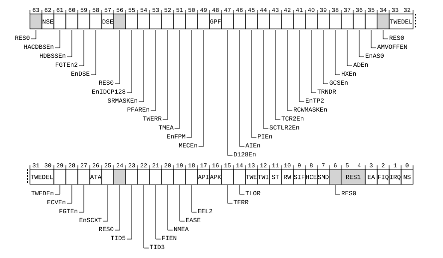

# ​D24.2.168 SCR_EL3, Secure Configuration Register

Source: <https://developer.arm.com/documentation/ddi0487/mc/-Part-D-The-AArch64-System-Level-Architecture/-Chapter-D24-AArch64-System-Register-Descriptions/-D24-2-General-system-control-registers/-D24-2-168-SCR-EL3--Secure-Configuration-Register>

##### D24.2.168 SCR\_EL3, Secure Configuration Register

The SCR\_EL3 characteristics are:

Purpose
:   Defines the configuration of the current Security state. It specifies:

    - The Security state of EL0, EL1, and EL2. The Security state is Secure, Non-secure, or Realm.
    - The Execution state at lower Exception levels.
    - Whether IRQ, FIQ, SError exceptions, and External abort exceptions are taken to EL3.
    - Whether various operations are trapped to EL3.

Configuration
:   This register is present only when EL3 is implemented and FEAT\_AA64 is implemented. Otherwise, direct accesses to SCR\_EL3 are UNDEFINED.

Attributes
:   SCR\_EL3 is a 64-bit register.

###### Field descriptions



Bit [63]
:   Reserved, RES0.

NSE, bit [62]
:   When FEAT\_RME is implemented:
    :   This field, evaluated with SCR\_EL3.NS, selects the Security state of EL2 and lower Exception levels.

        For a description of the values derived by evaluating NS and NSE together, see SCR\_EL3.NS.

        The reset behavior of this field is:

        - On a Warm reset, this field resets to an architecturally UNKNOWN value.

    Otherwise:
    :   The Effective value of this bit is 0.

        Access to this field is RES0.

HACDBSEn, bit [61]
:   When FEAT\_HACDBS is implemented:
    :   Enables access to the [HACDBSBR\_EL2](/documentation/ddi0487/mc/-Part-D-The-AArch64-System-Level-Architecture/-Chapter-D24-AArch64-System-Register-Descriptions/-D24-2-General-system-control-registers/-D24-2-57-HACDBSBR-EL2--Hardware-Accelerator-for-Cleaning-Dirty-State-Base-Register?lang=en#reg_aarch64_hacdbsbr_el2) and [HACDBSCONS\_EL2](/documentation/ddi0487/mc/-Part-D-The-AArch64-System-Level-Architecture/-Chapter-D24-AArch64-System-Register-Descriptions/-D24-2-General-system-control-registers/-D24-2-58-HACDBSCONS-EL2--Hardware-Accelerator-for-Cleaning-Dirty-State-Consumer-Register?lang=en#reg_aarch64_hacdbscons_el2) registers at EL2.

<table>
 <colgroup>
  <col/>
  <col/>
 </colgroup>
 <thead>
  <tr>
   <th>
    <strong>
     HACDBSEn
    </strong>
   </th>
   <th>
    <strong>
     Meaning
    </strong>
   </th>
  </tr>
 </thead>
 <tbody>
  <tr>
   <td>
    <p>
     <code>
      0b0
     </code>
    </p>
   </td>
   <td>
    <p>
     EL2 accesses to the specified registers are trapped to EL3.
    </p>
   </td>
  </tr>
  <tr>
   <td>
    <p>
     <code>
      0b1
     </code>
    </p>
   </td>
   <td>
    <p>
     This control does not cause any instructions to be trapped.
    </p>
   </td>
  </tr>
 </tbody>
</table>

        Traps are reported using EC syndrome value `0x18`.

        The reset behavior of this field is:

        - On a Warm reset, this field resets to an architecturally UNKNOWN value.

    Otherwise:
    :   Reserved, RES0.

HDBSSEn, bit [60]
:   When FEAT\_HDBSS is implemented:
    :   Enables access to [HDBSSBR\_EL2](/documentation/ddi0487/mc/-Part-D-The-AArch64-System-Level-Architecture/-Chapter-D24-AArch64-System-Register-Descriptions/-D24-2-General-system-control-registers/-D24-2-63-HDBSSBR-EL2--Hardware-Dirty-State-Tracking-Structure-Base-Register?lang=en#reg_aarch64_hdbssbr_el2) and [HDBSSPROD\_EL2](/documentation/ddi0487/mc/-Part-D-The-AArch64-System-Level-Architecture/-Chapter-D24-AArch64-System-Register-Descriptions/-D24-2-General-system-control-registers/-D24-2-64-HDBSSPROD-EL2--Hardware-Dirty-State-Tracking-Structure-Producer-Register?lang=en#reg_aarch64_hdbssprod_el2) registers at EL2.

<table>
 <colgroup>
  <col/>
  <col/>
 </colgroup>
 <thead>
  <tr>
   <th>
    <strong>
     HDBSSEn
    </strong>
   </th>
   <th>
    <strong>
     Meaning
    </strong>
   </th>
  </tr>
 </thead>
 <tbody>
  <tr>
   <td>
    <p>
     <code>
      0b0
     </code>
    </p>
   </td>
   <td>
    <p>
     EL2 accesses to the specified registers are trapped to EL3.
    </p>
   </td>
  </tr>
  <tr>
   <td>
    <p>
     <code>
      0b1
     </code>
    </p>
   </td>
   <td>
    <p>
     This control does not cause any instructions to be trapped.
    </p>
   </td>
  </tr>
 </tbody>
</table>

        Traps are reported using EC syndrome value `0x18`.

        The reset behavior of this field is:

        - On a Warm reset, this field resets to an architecturally UNKNOWN value.

    Otherwise:
    :   Reserved, RES0.

FGTEn2, bit [59]
:   When FEAT\_FGT2 is implemented:
    :   Fine-Grained Traps Enable 2.

        When EL2 is implemented, enables the traps to EL2 controlled by [HDFGRTR2\_EL2](/documentation/ddi0487/mc/-Part-D-The-AArch64-System-Level-Architecture/-Chapter-D24-AArch64-System-Register-Descriptions/-D24-2-General-system-control-registers/-D24-2-65-HDFGRTR2-EL2--Hypervisor-Debug-Fine-Grained-Read-Trap-Register-2?lang=en#reg_aarch64_hdfgrtr2_el2), [HDFGWTR2\_EL2](/documentation/ddi0487/mc/-Part-D-The-AArch64-System-Level-Architecture/-Chapter-D24-AArch64-System-Register-Descriptions/-D24-2-General-system-control-registers/-D24-2-67-HDFGWTR2-EL2--Hypervisor-Debug-Fine-Grained-Write-Trap-Register-2?lang=en#reg_aarch64_hdfgwtr2_el2), [HFGITR2\_EL2](/documentation/ddi0487/mc/-Part-D-The-AArch64-System-Level-Architecture/-Chapter-D24-AArch64-System-Register-Descriptions/-D24-2-General-system-control-registers/-D24-2-69-HFGITR2-EL2--Hypervisor-Fine-Grained-Instruction-Trap-Register-2?lang=en#reg_aarch64_hfgitr2_el2), [HFGRTR2\_EL2](/documentation/ddi0487/mc/-Part-D-The-AArch64-System-Level-Architecture/-Chapter-D24-AArch64-System-Register-Descriptions/-D24-2-General-system-control-registers/-D24-2-71-HFGRTR2-EL2--Hypervisor-Fine-Grained-Read-Trap-Register-2?lang=en#reg_aarch64_hfgrtr2_el2), and [HFGWTR2\_EL2](/documentation/ddi0487/mc/-Part-D-The-AArch64-System-Level-Architecture/-Chapter-D24-AArch64-System-Register-Descriptions/-D24-2-General-system-control-registers/-D24-2-73-HFGWTR2-EL2--Hypervisor-Fine-Grained-Write-Trap-Register-2?lang=en#reg_aarch64_hfgwtr2_el2), and controls access to those registers.

<table>
 <colgroup>
  <col/>
  <col/>
 </colgroup>
 <thead>
  <tr>
   <th>
    <strong>
     FGTEn2
    </strong>
   </th>
   <th>
    <strong>
     Meaning
    </strong>
   </th>
  </tr>
 </thead>
 <tbody>
  <tr>
   <td>
    <p>
     <code>
      0b0
     </code>
    </p>
   </td>
   <td>
    <p>
     EL2 accesses to the specified registers are trapped to EL3. The values in these registers are treated as 0.
    </p>
   </td>
  </tr>
  <tr>
   <td>
    <p>
     <code>
      0b1
     </code>
    </p>
   </td>
   <td>
    <p>
     EL2 accesses to the specified registers are not trapped to EL3 by this mechanism.
    </p>
   </td>
  </tr>
 </tbody>
</table>

        Traps caused by accesses to the fine-grained trap registers are reported using EC syndrome value `0x18` and its associated ISS.

        The reset behavior of this field is:

        - On a Warm reset, this field resets to an architecturally UNKNOWN value.

    Otherwise:
    :   Reserved, RES0.

EnDSE, bit [58]
:   When FEAT\_E3DSE is implemented:
    :   Enable for delegated SError exceptions pended by SCR\_EL3.DSE.

<table>
 <colgroup>
  <col/>
  <col/>
 </colgroup>
 <thead>
  <tr>
   <th>
    <strong>
     EnDSE
    </strong>
   </th>
   <th>
    <strong>
     Meaning
    </strong>
   </th>
  </tr>
 </thead>
 <tbody>
  <tr>
   <td>
    <p>
     <code>
      0b0
     </code>
    </p>
   </td>
   <td>
    <p>
     Delegated SError exceptions pended by SCR_EL3.DSE are disabled.
    </p>
   </td>
  </tr>
  <tr>
   <td>
    <p>
     <code>
      0b1
     </code>
    </p>
   </td>
   <td>
    <p>
     Delegated SError exceptions pended by SCR_EL3.DSE are enabled.
    </p>
   </td>
  </tr>
 </tbody>
</table>

        This field is ignored by the PE and treated as zero if SCR\_EL3.EA is 0 and the Effective value of SCR\_EL3.TMEA is 0.

        The reset behavior of this field is:

        - On a Warm reset, this field resets to an architecturally UNKNOWN value.

    Otherwise:
    :   Reserved, RES0.

DSE, bit [57]
:   When FEAT\_E3DSE is implemented:
    :   Delegated SError exception for EL2, EL1, and EL0.

<table>
 <colgroup>
  <col/>
  <col/>
 </colgroup>
 <thead>
  <tr>
   <th>
    <strong>
     DSE
    </strong>
   </th>
   <th>
    <strong>
     Meaning
    </strong>
   </th>
  </tr>
 </thead>
 <tbody>
  <tr>
   <td>
    <p>
     <code>
      0b0
     </code>
    </p>
   </td>
   <td>
    <p>
     This mechanism is not making a delegated SError exception pending.
    </p>
   </td>
  </tr>
  <tr>
   <td>
    <p>
     <code>
      0b1
     </code>
    </p>
   </td>
   <td>
    <p>
     A delegated SError exception for EL2, EL1, and EL0 is pending because of this mechanism.
    </p>
   </td>
  </tr>
 </tbody>
</table>

        When EL2 is implemented and enabled in the current Security state, delegated SError exceptions pended by this field are affected by [HCR\_EL2](/documentation/ddi0487/mc/-Part-D-The-AArch64-System-Level-Architecture/-Chapter-D24-AArch64-System-Register-Descriptions/-D24-2-General-system-control-registers/-D24-2-61-HCR-EL2--Hypervisor-Configuration-Register?lang=en#reg_aarch64_hcr_el2).AMO and [HCRX\_EL2](/documentation/ddi0487/mc/-Part-D-The-AArch64-System-Level-Architecture/-Chapter-D24-AArch64-System-Register-Descriptions/-D24-2-General-system-control-registers/-D24-2-62-HCRX-EL2--Extended-Hypervisor-Configuration-Register?lang=en#reg_aarch64_hcrx_el2).TMEA.

        Virtual SError exceptions pended by [HCR\_EL2](/documentation/ddi0487/mc/-Part-D-The-AArch64-System-Level-Architecture/-Chapter-D24-AArch64-System-Register-Descriptions/-D24-2-General-system-control-registers/-D24-2-61-HCR-EL2--Hypervisor-Configuration-Register?lang=en#reg_aarch64_hcr_el2).VSE have priority over delegated SError exceptions pended by this field.

        This field is ignored by the PE and treated as zero when SCR\_EL3.EnDSE == 0

        The reset behavior of this field is:

        - On a Warm reset, this field resets to an architecturally UNKNOWN value.

    Otherwise:
    :   Reserved, RES0.

Bit [56]
:   Reserved, RES0.

EnIDCP128, bit [55]
:   When FEAT\_SYSREG128 is implemented:
    :   Enables access to IMPLEMENTATION DEFINED 128-bit System registers.

<table>
 <colgroup>
  <col/>
  <col/>
 </colgroup>
 <thead>
  <tr>
   <th>
    <strong>
     EnIDCP128
    </strong>
   </th>
   <th>
    <strong>
     Meaning
    </strong>
   </th>
  </tr>
 </thead>
 <tbody>
  <tr>
   <td>
    <p>
     <code>
      0b0
     </code>
    </p>
   </td>
   <td>
    <p>
     Accesses at EL2, EL1, EL0 to
     <small>
      IMPLEMENTATION DEFINED
     </small>
     128-bit System registers are trapped to EL3 using EC syndrome value
     <code>
      0x14
     </code>
     , unless the access generates a higher priority exception.
    </p>
    <p>
     Disables the functionality of the 128-bit
     <small>
      IMPLEMENTATION DEFINED
     </small>
     System registers that are accessible at EL3.
    </p>
   </td>
  </tr>
  <tr>
   <td>
    <p>
     <code>
      0b1
     </code>
    </p>
   </td>
   <td>
    <p>
     No accesses are trapped by this control.
    </p>
   </td>
  </tr>
 </tbody>
</table>

        The reset behavior of this field is:

        - On a Warm reset, this field resets to an architecturally UNKNOWN value.

    Otherwise:
    :   Reserved, RES0.

SRMASKEn, bit [54]
:   When FEAT\_SRMASK is implemented:
    :   Enables access to the following MASK registers:

        - [CPACRMASK\_EL1](/documentation/ddi0487/mc/-Part-D-The-AArch64-System-Level-Architecture/-Chapter-D24-AArch64-System-Register-Descriptions/-D24-2-General-system-control-registers/-D24-2-36-CPACRMASK-EL1--Architectural-Feature-Access-Control-Masking-Register?lang=en#reg_aarch64_cpacrmask_el1), and CPACRMASK\_EL12.
        - [SCTLRMASK\_EL1](/documentation/ddi0487/mc/-Part-D-The-AArch64-System-Level-Architecture/-Chapter-D24-AArch64-System-Register-Descriptions/-D24-2-General-system-control-registers/-D24-2-177-SCTLRMASK-EL1--System-Control-Masking-Register--EL1-?lang=en#reg_aarch64_sctlrmask_el1), and SCTLRMASK\_EL12.
        - [SCTLR2MASK\_EL1](/documentation/ddi0487/mc/-Part-D-The-AArch64-System-Level-Architecture/-Chapter-D24-AArch64-System-Register-Descriptions/-D24-2-General-system-control-registers/-D24-2-172-SCTLR2MASK-EL1--Extended-System-Control-Masking-Register--EL1-?lang=en#reg_aarch64_sctlr2mask_el1), and SCTLR2MASK\_EL12.
        - [TCRMASK\_EL1](/documentation/ddi0487/mc/-Part-D-The-AArch64-System-Level-Architecture/-Chapter-D24-AArch64-System-Register-Descriptions/-D24-2-General-system-control-registers/-D24-2-196-TCRMASK-EL1--Translation-Control-Masking-Register--EL1-?lang=en#reg_aarch64_tcrmask_el1), and TCRMASK\_EL12.
        - [TCR2MASK\_EL1](/documentation/ddi0487/mc/-Part-D-The-AArch64-System-Level-Architecture/-Chapter-D24-AArch64-System-Register-Descriptions/-D24-2-General-system-control-registers/-D24-2-191-TCR2MASK-EL1--Extended-Translation-Control-Masking-Register--EL1-?lang=en#reg_aarch64_tcr2mask_el1), and TCR2MASK\_EL12.
        - [ACTLRMASK\_EL1](/documentation/ddi0487/mc/-Part-D-The-AArch64-System-Level-Architecture/-Chapter-D24-AArch64-System-Register-Descriptions/-D24-2-General-system-control-registers/-D24-2-5-ACTLRMASK-EL1--Auxiliary-Control-Masking-Register--EL1-?lang=en#reg_aarch64_actlrmask_el1) and ACTLRMASK\_EL12, if they are implemented.
        - [CPTRMASK\_EL2](/documentation/ddi0487/mc/-Part-D-The-AArch64-System-Level-Architecture/-Chapter-D24-AArch64-System-Register-Descriptions/-D24-2-General-system-control-registers/-D24-2-39-CPTRMASK-EL2--Architectural-Feature-Trap-Masking-Register?lang=en#reg_aarch64_cptrmask_el2).
        - [SCTLRMASK\_EL2](/documentation/ddi0487/mc/-Part-D-The-AArch64-System-Level-Architecture/-Chapter-D24-AArch64-System-Register-Descriptions/-D24-2-General-system-control-registers/-D24-2-178-SCTLRMASK-EL2--System-Control-Masking-Register--EL2-?lang=en#reg_aarch64_sctlrmask_el2).
        - [SCTLR2MASK\_EL2](/documentation/ddi0487/mc/-Part-D-The-AArch64-System-Level-Architecture/-Chapter-D24-AArch64-System-Register-Descriptions/-D24-2-General-system-control-registers/-D24-2-173-SCTLR2MASK-EL2--Extended-System-Control-Masking-Register--EL2-?lang=en#reg_aarch64_sctlr2mask_el2).
        - [TCRMASK\_EL2](/documentation/ddi0487/mc/-Part-D-The-AArch64-System-Level-Architecture/-Chapter-D24-AArch64-System-Register-Descriptions/-D24-2-General-system-control-registers/-D24-2-197-TCRMASK-EL2--Translation-Control-Masking-Register--EL2-?lang=en#reg_aarch64_tcrmask_el2).
        - [TCR2MASK\_EL2](/documentation/ddi0487/mc/-Part-D-The-AArch64-System-Level-Architecture/-Chapter-D24-AArch64-System-Register-Descriptions/-D24-2-General-system-control-registers/-D24-2-192-TCR2MASK-EL2--Extended-Translation-Control-Masking-Register--EL2-?lang=en#reg_aarch64_tcr2mask_el2).
        - [ACTLRMASK\_EL2](/documentation/ddi0487/mc/-Part-D-The-AArch64-System-Level-Architecture/-Chapter-D24-AArch64-System-Register-Descriptions/-D24-2-General-system-control-registers/-D24-2-6-ACTLRMASK-EL2--Auxiliary-Control-Masking-Register--EL2-?lang=en#reg_aarch64_actlrmask_el2), if it is implemented.

<table>
 <colgroup>
  <col/>
  <col/>
 </colgroup>
 <thead>
  <tr>
   <th>
    <strong>
     SRMASKEn
    </strong>
   </th>
   <th>
    <strong>
     Meaning
    </strong>
   </th>
  </tr>
 </thead>
 <tbody>
  <tr>
   <td>
    <p>
     <code>
      0b0
     </code>
    </p>
   </td>
   <td>
    <p>
     EL2 accesses to the specified registers are trapped to EL3. EL1 accesses to the specified EL1 registers are trapped to EL3.
    </p>
    <p>
     The values in the registers are treated as 0.
    </p>
   </td>
  </tr>
  <tr>
   <td>
    <p>
     <code>
      0b1
     </code>
    </p>
   </td>
   <td>
    <p>
     No accesses are trapped by this control.
    </p>
   </td>
  </tr>
 </tbody>
</table>

        Traps are reported using EC syndrome value `0x18`.

        Traps generated by this control have a lower priority than traps generated by the [HCRX\_EL2](/documentation/ddi0487/mc/-Part-D-The-AArch64-System-Level-Architecture/-Chapter-D24-AArch64-System-Register-Descriptions/-D24-2-General-system-control-registers/-D24-2-62-HCRX-EL2--Extended-Hypervisor-Configuration-Register?lang=en#reg_aarch64_hcrx_el2).SRMASKEn, [HFGRTR2\_EL2](/documentation/ddi0487/mc/-Part-D-The-AArch64-System-Level-Architecture/-Chapter-D24-AArch64-System-Register-Descriptions/-D24-2-General-system-control-registers/-D24-2-71-HFGRTR2-EL2--Hypervisor-Fine-Grained-Read-Trap-Register-2?lang=en#reg_aarch64_hfgrtr2_el2) and [HFGWTR2\_EL2](/documentation/ddi0487/mc/-Part-D-The-AArch64-System-Level-Architecture/-Chapter-D24-AArch64-System-Register-Descriptions/-D24-2-General-system-control-registers/-D24-2-73-HFGWTR2-EL2--Hypervisor-Fine-Grained-Write-Trap-Register-2?lang=en#reg_aarch64_hfgwtr2_el2) controls.

        The reset behavior of this field is:

        - On a Warm reset, this field resets to an architecturally UNKNOWN value.

    Otherwise:
    :   Reserved, RES0.

PFAREn, bit [53]
:   When FEAT\_PFAR is implemented:
    :   Enable access to Physical Fault Address Registers. When disabled, accesses to Physical Fault Address Registers generate a trap to EL3.

<table>
 <colgroup>
  <col/>
  <col/>
 </colgroup>
 <thead>
  <tr>
   <th>
    <strong>
     PFAREn
    </strong>
   </th>
   <th>
    <strong>
     Meaning
    </strong>
   </th>
  </tr>
 </thead>
 <tbody>
  <tr>
   <td>
    <p>
     <code>
      0b0
     </code>
    </p>
   </td>
   <td>
    <p>
     Accesses of the specified Physical Fault Address Registers at EL2 and EL1 are trapped to EL3, unless the instruction generates a higher priority exception.
    </p>
   </td>
  </tr>
  <tr>
   <td>
    <p>
     <code>
      0b1
     </code>
    </p>
   </td>
   <td>
    <p>
     This control does not cause any instructions to be trapped.
    </p>
   </td>
  </tr>
 </tbody>
</table>

        In AArch64 state, the instructions affected by this control are: `MRS` and `MSR` accesses to [PFAR\_EL1](/documentation/ddi0487/mc/-Part-D-The-AArch64-System-Level-Architecture/-Chapter-D24-AArch64-System-Register-Descriptions/-D24-2-General-system-control-registers/-D24-2-142-PFAR-EL1--Physical-Fault-Address-Register--EL1-?lang=en#reg_aarch64_pfar_el1), [PFAR\_EL2](/documentation/ddi0487/mc/-Part-D-The-AArch64-System-Level-Architecture/-Chapter-D24-AArch64-System-Register-Descriptions/-D24-2-General-system-control-registers/-D24-2-143-PFAR-EL2--Physical-Fault-Address-Register--EL2-?lang=en#reg_aarch64_pfar_el2), and PFAR\_EL12.

        Unless the instruction generates a higher priority exception, trapped instructions generate an exception to EL3.

        Trapped instructions are reported using EC syndrome value `0x18`.

        The reset behavior of this field is:

        - On a Warm reset, this field resets to an architecturally UNKNOWN value.

    Otherwise:
    :   Reserved, RES0.

TWERR, bit [52]
:   When FEAT\_RASv2 is implemented:
    :   Trap writes of Error Record registers. Enables a trap to EL3 on writes of Error Record registers.

<table>
 <colgroup>
  <col/>
  <col/>
 </colgroup>
 <thead>
  <tr>
   <th>
    <strong>
     TWERR
    </strong>
   </th>
   <th>
    <strong>
     Meaning
    </strong>
   </th>
  </tr>
 </thead>
 <tbody>
  <tr>
   <td>
    <p>
     <code>
      0b0
     </code>
    </p>
   </td>
   <td>
    <p>
     This control does not cause any instructions to be trapped.
    </p>
   </td>
  </tr>
  <tr>
   <td>
    <p>
     <code>
      0b1
     </code>
    </p>
   </td>
   <td>
    <p>
     Writes of the specified Error Record registers at EL2 and EL1 are trapped to EL3, unless the instruction generates a higher priority exception.
    </p>
   </td>
  </tr>
 </tbody>
</table>

        In AArch64 state, the instructions affected by this control are: `MSR` accesses to [ERRSELR\_EL1](/documentation/ddi0487/mc/-Part-D-The-AArch64-System-Level-Architecture/-Chapter-D24-AArch64-System-Register-Descriptions/-D24-9-RAS-registers/-D24-9-3-ERRSELR-EL1--Error-Record-Select-Register?lang=en#reg_aarch64_errselr_el1), [ERXADDR\_EL1](/documentation/ddi0487/mc/-Part-D-The-AArch64-System-Level-Architecture/-Chapter-D24-AArch64-System-Register-Descriptions/-D24-9-RAS-registers/-D24-9-4-ERXADDR-EL1--Selected-Error-Record-Address-Register?lang=en#reg_aarch64_erxaddr_el1), [ERXCTLR\_EL1](/documentation/ddi0487/mc/-Part-D-The-AArch64-System-Level-Architecture/-Chapter-D24-AArch64-System-Register-Descriptions/-D24-9-RAS-registers/-D24-9-5-ERXCTLR-EL1--Selected-Error-Record-Control-Register?lang=en#reg_aarch64_erxctlr_el1), [ERXMISC0\_EL1](/documentation/ddi0487/mc/-Part-D-The-AArch64-System-Level-Architecture/-Chapter-D24-AArch64-System-Register-Descriptions/-D24-9-RAS-registers/-D24-9-8-ERXMISC0-EL1--Selected-Error-Record-Miscellaneous-Register-0?lang=en#reg_aarch64_erxmisc0_el1), [ERXMISC1\_EL1](/documentation/ddi0487/mc/-Part-D-The-AArch64-System-Level-Architecture/-Chapter-D24-AArch64-System-Register-Descriptions/-D24-9-RAS-registers/-D24-9-9-ERXMISC1-EL1--Selected-Error-Record-Miscellaneous-Register-1?lang=en#reg_aarch64_erxmisc1_el1), [ERXMISC2\_EL1](/documentation/ddi0487/mc/-Part-D-The-AArch64-System-Level-Architecture/-Chapter-D24-AArch64-System-Register-Descriptions/-D24-9-RAS-registers/-D24-9-10-ERXMISC2-EL1--Selected-Error-Record-Miscellaneous-Register-2?lang=en#reg_aarch64_erxmisc2_el1), [ERXMISC3\_EL1](/documentation/ddi0487/mc/-Part-D-The-AArch64-System-Level-Architecture/-Chapter-D24-AArch64-System-Register-Descriptions/-D24-9-RAS-registers/-D24-9-11-ERXMISC3-EL1--Selected-Error-Record-Miscellaneous-Register-3?lang=en#reg_aarch64_erxmisc3_el1), and [ERXSTATUS\_EL1](/documentation/ddi0487/mc/-Part-D-The-AArch64-System-Level-Architecture/-Chapter-D24-AArch64-System-Register-Descriptions/-D24-9-RAS-registers/-D24-9-15-ERXSTATUS-EL1--Selected-Error-Record-Primary-Status-Register?lang=en#reg_aarch64_erxstatus_el1).

        In AArch32 state, the instructions affected by this control are: `MCR` accesses to [ERRSELR](/documentation/ddi0487/mc/-Part-G-The-AArch32-System-Level-Architecture/-Chapter-G8-AArch32-System-Register-Descriptions/-G8-6-RAS-registers/-G8-6-3-ERRSELR--Error-Record-Select-Register?lang=en#reg_aarch32_errselr), [ERXADDR](/documentation/ddi0487/mc/-Part-G-The-AArch32-System-Level-Architecture/-Chapter-G8-AArch32-System-Register-Descriptions/-G8-6-RAS-registers/-G8-6-4-ERXADDR--Selected-Error-Record-Address-Register?lang=en#reg_aarch32_erxaddr), [ERXADDR2](/documentation/ddi0487/mc/-Part-G-The-AArch32-System-Level-Architecture/-Chapter-G8-AArch32-System-Register-Descriptions/-G8-6-RAS-registers/-G8-6-5-ERXADDR2--Selected-Error-Record-Address-Register-2?lang=en#reg_aarch32_erxaddr2), [ERXCTLR](/documentation/ddi0487/mc/-Part-G-The-AArch32-System-Level-Architecture/-Chapter-G8-AArch32-System-Register-Descriptions/-G8-6-RAS-registers/-G8-6-6-ERXCTLR--Selected-Error-Record-Control-Register?lang=en#reg_aarch32_erxctlr), [ERXCTLR2](/documentation/ddi0487/mc/-Part-G-The-AArch32-System-Level-Architecture/-Chapter-G8-AArch32-System-Register-Descriptions/-G8-6-RAS-registers/-G8-6-7-ERXCTLR2--Selected-Error-Record-Control-Register-2?lang=en#reg_aarch32_erxctlr2), [ERXMISC0](/documentation/ddi0487/mc/-Part-G-The-AArch32-System-Level-Architecture/-Chapter-G8-AArch32-System-Register-Descriptions/-G8-6-RAS-registers/-G8-6-10-ERXMISC0--Selected-Error-Record-Miscellaneous-Register-0?lang=en#reg_aarch32_erxmisc0), [ERXMISC1](/documentation/ddi0487/mc/-Part-G-The-AArch32-System-Level-Architecture/-Chapter-G8-AArch32-System-Register-Descriptions/-G8-6-RAS-registers/-G8-6-11-ERXMISC1--Selected-Error-Record-Miscellaneous-Register-1?lang=en#reg_aarch32_erxmisc1), [ERXMISC2](/documentation/ddi0487/mc/-Part-G-The-AArch32-System-Level-Architecture/-Chapter-G8-AArch32-System-Register-Descriptions/-G8-6-RAS-registers/-G8-6-12-ERXMISC2--Selected-Error-Record-Miscellaneous-Register-2?lang=en#reg_aarch32_erxmisc2), [ERXMISC3](/documentation/ddi0487/mc/-Part-G-The-AArch32-System-Level-Architecture/-Chapter-G8-AArch32-System-Register-Descriptions/-G8-6-RAS-registers/-G8-6-13-ERXMISC3--Selected-Error-Record-Miscellaneous-Register-3?lang=en#reg_aarch32_erxmisc3), [ERXMISC4](/documentation/ddi0487/mc/-Part-G-The-AArch32-System-Level-Architecture/-Chapter-G8-AArch32-System-Register-Descriptions/-G8-6-RAS-registers/-G8-6-14-ERXMISC4--Selected-Error-Record-Miscellaneous-Register-4?lang=en#reg_aarch32_erxmisc4), [ERXMISC5](/documentation/ddi0487/mc/-Part-G-The-AArch32-System-Level-Architecture/-Chapter-G8-AArch32-System-Register-Descriptions/-G8-6-RAS-registers/-G8-6-15-ERXMISC5--Selected-Error-Record-Miscellaneous-Register-5?lang=en#reg_aarch32_erxmisc5), [ERXMISC6](/documentation/ddi0487/mc/-Part-G-The-AArch32-System-Level-Architecture/-Chapter-G8-AArch32-System-Register-Descriptions/-G8-6-RAS-registers/-G8-6-16-ERXMISC6--Selected-Error-Record-Miscellaneous-Register-6?lang=en#reg_aarch32_erxmisc6), [ERXMISC7](/documentation/ddi0487/mc/-Part-G-The-AArch32-System-Level-Architecture/-Chapter-G8-AArch32-System-Register-Descriptions/-G8-6-RAS-registers/-G8-6-17-ERXMISC7--Selected-Error-Record-Miscellaneous-Register-7?lang=en#reg_aarch32_erxmisc7), and [ERXSTATUS](/documentation/ddi0487/mc/-Part-G-The-AArch32-System-Level-Architecture/-Chapter-G8-AArch32-System-Register-Descriptions/-G8-6-RAS-registers/-G8-6-18-ERXSTATUS--Selected-Error-Record-Primary-Status-Register?lang=en#reg_aarch32_erxstatus).

        Unless the instruction generates a higher priority exception, trapped instructions generate an exception to EL3.

        Trapped AArch64 instructions are reported using EC syndrome value `0x18`.

        Trapped AArch32 instructions are reported using EC syndrome value `0x03`.

        Accessing this field has the following behavior:

        - This field is permitted to be RES0 if all of the following are true:
          - [ERRSELR\_EL1](/documentation/ddi0487/mc/-Part-D-The-AArch64-System-Level-Architecture/-Chapter-D24-AArch64-System-Register-Descriptions/-D24-9-RAS-registers/-D24-9-3-ERRSELR-EL1--Error-Record-Select-Register?lang=en#reg_aarch64_errselr_el1) and all ERX\* registers are implemented as UNDEFINED or RAZ/WI.
          - [ERRIDR\_EL1](/documentation/ddi0487/mc/-Part-D-The-AArch64-System-Level-Architecture/-Chapter-D24-AArch64-System-Register-Descriptions/-D24-9-RAS-registers/-D24-9-2-ERRIDR-EL1--Error-Record-ID-Register?lang=en#reg_aarch64_erridr_el1).NUM is zero.

        The reset behavior of this field is:

        - On a Warm reset, this field resets to an architecturally UNKNOWN value.

    Otherwise:
    :   Reserved, RES0.

TMEA, bit [51]
:   When FEAT\_DoubleFault2 is implemented:
    :   Trap Masked External Aborts. Controls whether a masked error exception at a lower Exception level is taken to EL3.

<table>
 <colgroup>
  <col/>
  <col/>
 </colgroup>
 <thead>
  <tr>
   <th>
    <strong>
     TMEA
    </strong>
   </th>
   <th>
    <strong>
     Meaning
    </strong>
   </th>
  </tr>
 </thead>
 <tbody>
  <tr>
   <td>
    <p>
     <code>
      0b0
     </code>
    </p>
   </td>
   <td>
    <p>
     Synchronous External abort exceptions and SError exceptions at EL2, EL1, and EL0 are unaffected by this mechanism. That is, these exceptions are not taken to EL3 unless routed to EL3 by another control.
    </p>
   </td>
  </tr>
  <tr>
   <td>
    <p>
     <code>
      0b1
     </code>
    </p>
   </td>
   <td>
    <p>
     When executing at Exception levels below EL3, all of the following apply:
    </p>
    <ul>
     <li>
      <p>
       When PSTATE.A is 1, synchronous External abort exceptions are taken to EL3, unless they are taken from EL1 or EL0 and routed to EL2 by another control.
      </p>
     </li>
     <li>
      <p>
       Masked physical SError exceptions are taken to EL3, unless they are taken from EL1 or EL0 and routed to EL2 by another control.
      </p>
     </li>
    </ul>
   </td>
  </tr>
 </tbody>
</table>

        This field has no effect on the routing of virtual or delegated SError exceptions.

        The reset behavior of this field is:

        - On a Warm reset, this field resets to an architecturally UNKNOWN value.

    Otherwise:
    :   Reserved, RES0.

EnFPM, bit [50]
:   When FEAT\_FPMR is implemented:
    :   Enables direct and indirect accesses to [FPMR](/documentation/ddi0487/mc/-Part-C-The-AArch64-Instruction-Set/-Chapter-C5-The-A64-System-Instruction-Class/-C5-2-Special-purpose-registers/-C5-2-9-FPMR--Floating-point-Mode-Register?lang=en#reg_aarch64_fpmr) from EL2, EL1, and EL0.

        When accesses to [FPMR](/documentation/ddi0487/mc/-Part-C-The-AArch64-Instruction-Set/-Chapter-C5-The-A64-System-Instruction-Class/-C5-2-Special-purpose-registers/-C5-2-9-FPMR--Floating-point-Mode-Register?lang=en#reg_aarch64_fpmr) are disabled by this control:

        - Direct accesses to [FPMR](/documentation/ddi0487/mc/-Part-C-The-AArch64-Instruction-Set/-Chapter-C5-The-A64-System-Instruction-Class/-C5-2-Special-purpose-registers/-C5-2-9-FPMR--Floating-point-Mode-Register?lang=en#reg_aarch64_fpmr) from EL2, EL1, and EL0 are trapped to EL3 and reported with EC syndrome value `0x18`.
        - Execution of FP8 data-processing instructions that indirectly access [FPMR](/documentation/ddi0487/mc/-Part-C-The-AArch64-Instruction-Set/-Chapter-C5-The-A64-System-Instruction-Class/-C5-2-Special-purpose-registers/-C5-2-9-FPMR--Floating-point-Mode-Register?lang=en#reg_aarch64_fpmr) is UNDEFINED at EL2, EL1 and EL0.

<table>
 <colgroup>
  <col/>
  <col/>
 </colgroup>
 <thead>
  <tr>
   <th>
    <strong>
     EnFPM
    </strong>
   </th>
   <th>
    <strong>
     Meaning
    </strong>
   </th>
  </tr>
 </thead>
 <tbody>
  <tr>
   <td>
    <p>
     <code>
      0b0
     </code>
    </p>
   </td>
   <td>
    <p>
     Direct and indirect accesses to
     <a class="document-topic" document-topic-path="/ddi0487/mc/-Part-C-The-AArch64-Instruction-Set/-Chapter-C5-The-A64-System-Instruction-Class/-C5-2-Special-purpose-registers/-C5-2-9-FPMR--Floating-point-Mode-Register?lang=en#reg_aarch64_fpmr" href="/documentation/ddi0487/mc/-Part-C-The-AArch64-Instruction-Set/-Chapter-C5-The-A64-System-Instruction-Class/-C5-2-Special-purpose-registers/-C5-2-9-FPMR--Floating-point-Mode-Register?lang=en#reg_aarch64_fpmr">
      FPMR
     </a>
     are disabled at EL2, EL1 and EL0.
    </p>
   </td>
  </tr>
  <tr>
   <td>
    <p>
     <code>
      0b1
     </code>
    </p>
   </td>
   <td>
    <p>
     This control does not cause any instructions to be trapped.
    </p>
   </td>
  </tr>
 </tbody>
</table>

        Traps are not taken if there is a higher priority exception generated by the access.

        If EL3 is not implemented, the Effective value of this field is 1.

        The reset behavior of this field is:

        - On a Warm reset, this field resets to an architecturally UNKNOWN value.

    Otherwise:
    :   Reserved, RES0.

MECEn, bit [49]
:   When FEAT\_MEC is implemented:
    :   Enables access to the following EL2 MECID registers, from EL2:

        - [MECID\_P0\_EL2](/documentation/ddi0487/mc/-Part-D-The-AArch64-System-Level-Architecture/-Chapter-D24-AArch64-System-Register-Descriptions/-D24-2-General-system-control-registers/-D24-2-131-MECID-P0-EL2--Primary-MECID-for-EL2-and-EL2-0-translation-regimes?lang=en#reg_aarch64_mecid_p0_el2).
        - [MECID\_A0\_EL2](/documentation/ddi0487/mc/-Part-D-The-AArch64-System-Level-Architecture/-Chapter-D24-AArch64-System-Register-Descriptions/-D24-2-General-system-control-registers/-D24-2-129-MECID-A0-EL2--Alternate-MECID-for-EL2-and-EL2-0-translation-regimes?lang=en#reg_aarch64_mecid_a0_el2)
        - [MECID\_P1\_EL2](/documentation/ddi0487/mc/-Part-D-The-AArch64-System-Level-Architecture/-Chapter-D24-AArch64-System-Register-Descriptions/-D24-2-General-system-control-registers/-D24-2-132-MECID-P1-EL2--Primary-MECID-for-EL2-0-translation-regimes?lang=en#reg_aarch64_mecid_p1_el2)
        - [MECID\_A1\_EL2](/documentation/ddi0487/mc/-Part-D-The-AArch64-System-Level-Architecture/-Chapter-D24-AArch64-System-Register-Descriptions/-D24-2-General-system-control-registers/-D24-2-130-MECID-A1-EL2--Alternate-MECID-for-EL2-0-translation-regimes-?lang=en#reg_aarch64_mecid_a1_el2)
        - [VMECID\_P\_EL2](/documentation/ddi0487/mc/-Part-D-The-AArch64-System-Level-Architecture/-Chapter-D24-AArch64-System-Register-Descriptions/-D24-2-General-system-control-registers/-D24-2-217-VMECID-P-EL2--Primary-MECID-for-EL1-0-stage-2-translation-regime?lang=en#reg_aarch64_vmecid_p_el2)
        - [VMECID\_A\_EL2](/documentation/ddi0487/mc/-Part-D-The-AArch64-System-Level-Architecture/-Chapter-D24-AArch64-System-Register-Descriptions/-D24-2-General-system-control-registers/-D24-2-216-VMECID-A-EL2--Alternate-MECID-for-EL1-0-stage-2-translation-regime?lang=en#reg_aarch64_vmecid_a_el2)

        Accesses to these registers are trapped and reported using EC syndrome value `0x18`.

<table>
 <colgroup>
  <col/>
  <col/>
 </colgroup>
 <thead>
  <tr>
   <th>
    <strong>
     MECEn
    </strong>
   </th>
   <th>
    <strong>
     Meaning
    </strong>
   </th>
  </tr>
 </thead>
 <tbody>
  <tr>
   <td>
    <p>
     <code>
      0b0
     </code>
    </p>
   </td>
   <td>
    <p>
     EL2 accesses to any of the specified registers are trapped to EL3. The values of the specified registers are treated as 0 for all purposes other than direct reads or writes to the register from EL3.
    </p>
   </td>
  </tr>
  <tr>
   <td>
    <p>
     <code>
      0b1
     </code>
    </p>
   </td>
   <td>
    <p>
     This control does not cause any instructions to be trapped.
    </p>
   </td>
  </tr>
 </tbody>
</table>

        The reset behavior of this field is:

        - On a Warm reset, this field resets to an architecturally UNKNOWN value.

    Otherwise:
    :   Reserved, RES0.

GPF, bit [48]
:   When FEAT\_RME is implemented:
    :   Controls the reporting of Granule protection faults at EL0, EL1 and EL2.

<table>
 <colgroup>
  <col/>
  <col/>
 </colgroup>
 <thead>
  <tr>
   <th>
    <strong>
     GPF
    </strong>
   </th>
   <th>
    <strong>
     Meaning
    </strong>
   </th>
  </tr>
 </thead>
 <tbody>
  <tr>
   <td>
    <p>
     <code>
      0b0
     </code>
    </p>
   </td>
   <td>
    <p>
     This control does not cause exceptions to be routed from EL0, EL1 or EL2 to EL3.
    </p>
   </td>
  </tr>
  <tr>
   <td>
    <p>
     <code>
      0b1
     </code>
    </p>
   </td>
   <td>
    <p>
     GPFs at EL0, EL1 and EL2 are routed to EL3 and reported as Granule Protection Check exceptions.
    </p>
   </td>
  </tr>
 </tbody>
</table>

        The reset behavior of this field is:

        - On a Warm reset, this field resets to an architecturally UNKNOWN value.

    Otherwise:
    :   Reserved, RES0.

D128En, bit [47]
:   When FEAT\_D128 is implemented:
    :   128-bit System Register trap control. Enables access to 128-bit System Registers using `MRRS`, `MSRR` instructions.

        MRRS and MSRR accesses from EL1 and EL2 using AArch64 to the following registers are trapped and reported using EC syndrome value `0x14`:

        - [TTBR0\_EL1](/documentation/ddi0487/mc/-Part-D-The-AArch64-System-Level-Architecture/-Chapter-D24-AArch64-System-Register-Descriptions/-D24-2-General-system-control-registers/-D24-2-208-TTBR0-EL1--Translation-Table-Base-Register-0--EL1-?lang=en#reg_aarch64_ttbr0_el1).
        - [TTBR1\_EL1](/documentation/ddi0487/mc/-Part-D-The-AArch64-System-Level-Architecture/-Chapter-D24-AArch64-System-Register-Descriptions/-D24-2-General-system-control-registers/-D24-2-211-TTBR1-EL1--Translation-Table-Base-Register-1--EL1-?lang=en#reg_aarch64_ttbr1_el1).
        - [RCWMASK\_EL1](/documentation/ddi0487/mc/-Part-D-The-AArch64-System-Level-Architecture/-Chapter-D24-AArch64-System-Register-Descriptions/-D24-2-General-system-control-registers/-D24-2-153-RCWMASK-EL1--Read-Check-Write-Instruction-Mask--EL1-?lang=en#reg_aarch64_rcwmask_el1), [RCWSMASK\_EL1](/documentation/ddi0487/mc/-Part-D-The-AArch64-System-Level-Architecture/-Chapter-D24-AArch64-System-Register-Descriptions/-D24-2-General-system-control-registers/-D24-2-154-RCWSMASK-EL1--Software-Read-Check-Write-Instruction-Mask--EL1-?lang=en#reg_aarch64_rcwsmask_el1).
        - [PAR\_EL1](/documentation/ddi0487/mc/-Part-D-The-AArch64-System-Level-Architecture/-Chapter-D24-AArch64-System-Register-Descriptions/-D24-2-General-system-control-registers/-D24-2-141-PAR-EL1--Physical-Address-Register?lang=en#reg_aarch64_par_el1).

        MRRS and MSRR accesses from EL2 using AArch64 to the following registers are trapped and reported using EC syndrome value `0x14`:

        - [TTBR1\_EL2](/documentation/ddi0487/mc/-Part-D-The-AArch64-System-Level-Architecture/-Chapter-D24-AArch64-System-Register-Descriptions/-D24-2-General-system-control-registers/-D24-2-212-TTBR1-EL2--Translation-Table-Base-Register-1--EL2-?lang=en#reg_aarch64_ttbr1_el2) and accesses using the register name TTBR1\_EL12.
        - [TTBR0\_EL2](/documentation/ddi0487/mc/-Part-D-The-AArch64-System-Level-Architecture/-Chapter-D24-AArch64-System-Register-Descriptions/-D24-2-General-system-control-registers/-D24-2-209-TTBR0-EL2--Translation-Table-Base-Register-0--EL2-?lang=en#reg_aarch64_ttbr0_el2) and accesses using the register name TTBR0\_EL12.
        - [VTTBR\_EL2](/documentation/ddi0487/mc/-Part-D-The-AArch64-System-Level-Architecture/-Chapter-D24-AArch64-System-Register-Descriptions/-D24-2-General-system-control-registers/-D24-2-224-VTTBR-EL2--Virtualization-Translation-Table-Base-Register?lang=en#reg_aarch64_vttbr_el2).

<table>
 <colgroup>
  <col/>
  <col/>
 </colgroup>
 <thead>
  <tr>
   <th>
    <strong>
     D128En
    </strong>
   </th>
   <th>
    <strong>
     Meaning
    </strong>
   </th>
  </tr>
 </thead>
 <tbody>
  <tr>
   <td>
    <p>
     <code>
      0b0
     </code>
    </p>
   </td>
   <td>
    <p>
     EL1 and EL2 accesses to the specified registers are disabled, and trapped to EL3.
    </p>
   </td>
  </tr>
  <tr>
   <td>
    <p>
     <code>
      0b1
     </code>
    </p>
   </td>
   <td>
    <p>
     This control does not cause any instructions to be trapped.
    </p>
   </td>
  </tr>
 </tbody>
</table>

        Traps are not taken if there is a higher priority exception generated by the access.

        The reset behavior of this field is:

        - On a Warm reset, this field resets to an architecturally UNKNOWN value.

    Otherwise:
    :   Reserved, RES0.

AIEn, bit [46]
:   When FEAT\_AIE is implemented:
    :   MAIR2\_ELx, AMAIR2\_ELx Register access trap control.

        Accesses from EL1 and EL2 using AArch64 to the following registers are trapped and reported using EC syndrome value `0x18`:

        - [AMAIR2\_EL1](/documentation/ddi0487/mc/-Part-D-The-AArch64-System-Level-Architecture/-Chapter-D24-AArch64-System-Register-Descriptions/-D24-2-General-system-control-registers/-D24-2-14-AMAIR2-EL1--Extended-Auxiliary-Memory-Attribute-Indirection-Register--EL1-?lang=en#reg_aarch64_amair2_el1).
        - [MAIR2\_EL1](/documentation/ddi0487/mc/-Part-D-The-AArch64-System-Level-Architecture/-Chapter-D24-AArch64-System-Register-Descriptions/-D24-2-General-system-control-registers/-D24-2-123-MAIR2-EL1--Extended-Memory-Attribute-Indirection-Register--EL1-?lang=en#reg_aarch64_mair2_el1).

        Accesses from EL2 using AArch64 to the following registers are trapped and reported using EC syndrome value `0x18`:

        - [AMAIR2\_EL2](/documentation/ddi0487/mc/-Part-D-The-AArch64-System-Level-Architecture/-Chapter-D24-AArch64-System-Register-Descriptions/-D24-2-General-system-control-registers/-D24-2-15-AMAIR2-EL2--Extended-Auxiliary-Memory-Attribute-Indirection-Register--EL2-?lang=en#reg_aarch64_amair2_el2) and accesses using the register name AMAIR2\_EL12.
        - [MAIR2\_EL2](/documentation/ddi0487/mc/-Part-D-The-AArch64-System-Level-Architecture/-Chapter-D24-AArch64-System-Register-Descriptions/-D24-2-General-system-control-registers/-D24-2-124-MAIR2-EL2--Extended-Memory-Attribute-Indirection-Register--EL2-?lang=en#reg_aarch64_mair2_el2) and accesses using the register name MAIR2\_EL12.

<table>
 <colgroup>
  <col/>
  <col/>
 </colgroup>
 <thead>
  <tr>
   <th>
    <strong>
     AIEn
    </strong>
   </th>
   <th>
    <strong>
     Meaning
    </strong>
   </th>
  </tr>
 </thead>
 <tbody>
  <tr>
   <td>
    <p>
     <code>
      0b0
     </code>
    </p>
   </td>
   <td>
    <p>
     EL1 and EL2 accesses to the specified registers are disabled, and trapped to EL3. The values in these registers are treated as 0.
    </p>
   </td>
  </tr>
  <tr>
   <td>
    <p>
     <code>
      0b1
     </code>
    </p>
   </td>
   <td>
    <p>
     This control does not cause any instructions to be trapped.
    </p>
   </td>
  </tr>
 </tbody>
</table>

        Traps are not taken if there is a higher priority exception generated by the access.

        The reset behavior of this field is:

        - On a Warm reset, this field resets to an architecturally UNKNOWN value.

    Otherwise:
    :   Reserved, RES0.

PIEn, bit [45]
:   When FEAT\_S1PIE is implemented, or FEAT\_S2PIE is implemented, or FEAT\_S1POE is implemented, or FEAT\_S2POE is implemented:
    :   Permission Indirection, Overlay Register access trap control. Enables access to Permission Indirection and Overlay registers.

        Accesses from EL0, EL1 and EL2 using AArch64 to the following registers are trapped and reported using EC syndrome value `0x18`:

        - [POR\_EL0](/documentation/ddi0487/mc/-Part-D-The-AArch64-System-Level-Architecture/-Chapter-D24-AArch64-System-Register-Descriptions/-D24-2-General-system-control-registers/-D24-2-149-POR-EL0--Permission-Overlay-Register-0--EL0-?lang=en#reg_aarch64_por_el0).

        Accesses from EL1 and EL2 using AArch64 to the following registers are trapped and reported using EC syndrome value `0x18`:

        - [PIRE0\_EL1](/documentation/ddi0487/mc/-Part-D-The-AArch64-System-Level-Architecture/-Chapter-D24-AArch64-System-Register-Descriptions/-D24-2-General-system-control-registers/-D24-2-147-PIRE0-EL1--Permission-Indirection-Register-0--EL1-?lang=en#reg_aarch64_pire0_el1).
        - [PIR\_EL1](/documentation/ddi0487/mc/-Part-D-The-AArch64-System-Level-Architecture/-Chapter-D24-AArch64-System-Register-Descriptions/-D24-2-General-system-control-registers/-D24-2-144-PIR-EL1--Permission-Indirection-Register-1--EL1-?lang=en#reg_aarch64_pir_el1).
        - [POR\_EL1](/documentation/ddi0487/mc/-Part-D-The-AArch64-System-Level-Architecture/-Chapter-D24-AArch64-System-Register-Descriptions/-D24-2-General-system-control-registers/-D24-2-150-POR-EL1--Permission-Overlay-Register-1--EL1-?lang=en#reg_aarch64_por_el1).
        - [S2POR\_EL1](/documentation/ddi0487/mc/-Part-D-The-AArch64-System-Level-Architecture/-Chapter-D24-AArch64-System-Register-Descriptions/-D24-2-General-system-control-registers/-D24-2-166-S2POR-EL1--Stage-2-Permission-Overlay-Register--EL1-?lang=en#reg_aarch64_s2por_el1).

        Accesses from EL2 using AArch64 to the following registers are trapped and reported using EC syndrome value `0x18`:

        - [PIRE0\_EL2](/documentation/ddi0487/mc/-Part-D-The-AArch64-System-Level-Architecture/-Chapter-D24-AArch64-System-Register-Descriptions/-D24-2-General-system-control-registers/-D24-2-148-PIRE0-EL2--Permission-Indirection-Register-0--EL2-?lang=en#reg_aarch64_pire0_el2) and accesses using the register name PIRE0\_EL12.
        - [PIR\_EL2](/documentation/ddi0487/mc/-Part-D-The-AArch64-System-Level-Architecture/-Chapter-D24-AArch64-System-Register-Descriptions/-D24-2-General-system-control-registers/-D24-2-145-PIR-EL2--Permission-Indirection-Register-2--EL2-?lang=en#reg_aarch64_pir_el2) and accesses using the register name PIR\_EL12.
        - [POR\_EL2](/documentation/ddi0487/mc/-Part-D-The-AArch64-System-Level-Architecture/-Chapter-D24-AArch64-System-Register-Descriptions/-D24-2-General-system-control-registers/-D24-2-151-POR-EL2--Permission-Overlay-Register-2--EL2-?lang=en#reg_aarch64_por_el2) and accesses using the register name POR\_EL12.
        - [S2PIR\_EL2](/documentation/ddi0487/mc/-Part-D-The-AArch64-System-Level-Architecture/-Chapter-D24-AArch64-System-Register-Descriptions/-D24-2-General-system-control-registers/-D24-2-165-S2PIR-EL2--Stage-2-Permission-Indirection-Register--EL2-?lang=en#reg_aarch64_s2pir_el2).

<table>
 <colgroup>
  <col/>
  <col/>
 </colgroup>
 <thead>
  <tr>
   <th>
    <strong>
     PIEn
    </strong>
   </th>
   <th>
    <strong>
     Meaning
    </strong>
   </th>
  </tr>
 </thead>
 <tbody>
  <tr>
   <td>
    <p>
     <code>
      0b0
     </code>
    </p>
   </td>
   <td>
    <p>
     EL0, EL1 and EL2 accesses to the specified registers are disabled, and trapped to EL3.
    </p>
   </td>
  </tr>
  <tr>
   <td>
    <p>
     <code>
      0b1
     </code>
    </p>
   </td>
   <td>
    <p>
     This control does not cause any instructions to be trapped.
    </p>
   </td>
  </tr>
 </tbody>
</table>

        If this field is 0, it is IMPLEMENTATION SPECIFIC whether the values of the named registers are treated as zero.

        Traps are not taken if there is a higher priority exception generated by the access.

        The reset behavior of this field is:

        - On a Warm reset, this field resets to an architecturally UNKNOWN value.

    Otherwise:
    :   Reserved, RES0.

SCTLR2En, bit [44]
:   When FEAT\_SCTLR2 is implemented:
    :   SCTLR2\_ELx register trap control. Enables access to [SCTLR2\_EL1](/documentation/ddi0487/mc/-Part-D-The-AArch64-System-Level-Architecture/-Chapter-D24-AArch64-System-Register-Descriptions/-D24-2-General-system-control-registers/-D24-2-169-SCTLR2-EL1--System-Control-Register--EL1-?lang=en#reg_aarch64_sctlr2_el1) and [SCTLR2\_EL2](/documentation/ddi0487/mc/-Part-D-The-AArch64-System-Level-Architecture/-Chapter-D24-AArch64-System-Register-Descriptions/-D24-2-General-system-control-registers/-D24-2-170-SCTLR2-EL2--System-Control-Register--EL2-?lang=en#reg_aarch64_sctlr2_el2) registers.

<table>
 <colgroup>
  <col/>
  <col/>
 </colgroup>
 <thead>
  <tr>
   <th>
    <strong>
     SCTLR2En
    </strong>
   </th>
   <th>
    <strong>
     Meaning
    </strong>
   </th>
  </tr>
 </thead>
 <tbody>
  <tr>
   <td>
    <p>
     <code>
      0b0
     </code>
    </p>
   </td>
   <td>
    <p>
     EL1 and EL2 accesses to
     <a class="document-topic" document-topic-path="/ddi0487/mc/-Part-D-The-AArch64-System-Level-Architecture/-Chapter-D24-AArch64-System-Register-Descriptions/-D24-2-General-system-control-registers/-D24-2-169-SCTLR2-EL1--System-Control-Register--EL1-?lang=en#reg_aarch64_sctlr2_el1" href="/documentation/ddi0487/mc/-Part-D-The-AArch64-System-Level-Architecture/-Chapter-D24-AArch64-System-Register-Descriptions/-D24-2-General-system-control-registers/-D24-2-169-SCTLR2-EL1--System-Control-Register--EL1-?lang=en#reg_aarch64_sctlr2_el1">
      SCTLR2_EL1
     </a>
     and
     <a class="document-topic" document-topic-path="/ddi0487/mc/-Part-D-The-AArch64-System-Level-Architecture/-Chapter-D24-AArch64-System-Register-Descriptions/-D24-2-General-system-control-registers/-D24-2-170-SCTLR2-EL2--System-Control-Register--EL2-?lang=en#reg_aarch64_sctlr2_el2" href="/documentation/ddi0487/mc/-Part-D-The-AArch64-System-Level-Architecture/-Chapter-D24-AArch64-System-Register-Descriptions/-D24-2-General-system-control-registers/-D24-2-170-SCTLR2-EL2--System-Control-Register--EL2-?lang=en#reg_aarch64_sctlr2_el2">
      SCTLR2_EL2
     </a>
     registers are disabled, and trapped to EL3. The values in these registers are treated as 0.
    </p>
   </td>
  </tr>
  <tr>
   <td>
    <p>
     <code>
      0b1
     </code>
    </p>
   </td>
   <td>
    <p>
     This control does not cause any instructions to be trapped.
    </p>
   </td>
  </tr>
 </tbody>
</table>

        Traps are reported using EC syndrome value `0x18`.

        Traps are not taken if there is a higher priority exception generated by the access.

        The reset behavior of this field is:

        - On a Warm reset, this field resets to an architecturally UNKNOWN value.

    Otherwise:
    :   Reserved, RES0.

TCR2En, bit [43]
:   When FEAT\_TCR2 is implemented:
    :   TCR2\_ELx register trap control. Enables access to [TCR2\_EL1](/documentation/ddi0487/mc/-Part-D-The-AArch64-System-Level-Architecture/-Chapter-D24-AArch64-System-Register-Descriptions/-D24-2-General-system-control-registers/-D24-2-189-TCR2-EL1--Extended-Translation-Control-Register--EL1-?lang=en#reg_aarch64_tcr2_el1) and [TCR2\_EL2](/documentation/ddi0487/mc/-Part-D-The-AArch64-System-Level-Architecture/-Chapter-D24-AArch64-System-Register-Descriptions/-D24-2-General-system-control-registers/-D24-2-190-TCR2-EL2--Extended-Translation-Control-Register--EL2-?lang=en#reg_aarch64_tcr2_el2) registers.

<table>
 <colgroup>
  <col/>
  <col/>
 </colgroup>
 <thead>
  <tr>
   <th>
    <strong>
     TCR2En
    </strong>
   </th>
   <th>
    <strong>
     Meaning
    </strong>
   </th>
  </tr>
 </thead>
 <tbody>
  <tr>
   <td>
    <p>
     <code>
      0b0
     </code>
    </p>
   </td>
   <td>
    <p>
     EL1 and EL2 accesses to
     <a class="document-topic" document-topic-path="/ddi0487/mc/-Part-D-The-AArch64-System-Level-Architecture/-Chapter-D24-AArch64-System-Register-Descriptions/-D24-2-General-system-control-registers/-D24-2-189-TCR2-EL1--Extended-Translation-Control-Register--EL1-?lang=en#reg_aarch64_tcr2_el1" href="/documentation/ddi0487/mc/-Part-D-The-AArch64-System-Level-Architecture/-Chapter-D24-AArch64-System-Register-Descriptions/-D24-2-General-system-control-registers/-D24-2-189-TCR2-EL1--Extended-Translation-Control-Register--EL1-?lang=en#reg_aarch64_tcr2_el1">
      TCR2_EL1
     </a>
     and
     <a class="document-topic" document-topic-path="/ddi0487/mc/-Part-D-The-AArch64-System-Level-Architecture/-Chapter-D24-AArch64-System-Register-Descriptions/-D24-2-General-system-control-registers/-D24-2-190-TCR2-EL2--Extended-Translation-Control-Register--EL2-?lang=en#reg_aarch64_tcr2_el2" href="/documentation/ddi0487/mc/-Part-D-The-AArch64-System-Level-Architecture/-Chapter-D24-AArch64-System-Register-Descriptions/-D24-2-General-system-control-registers/-D24-2-190-TCR2-EL2--Extended-Translation-Control-Register--EL2-?lang=en#reg_aarch64_tcr2_el2">
      TCR2_EL2
     </a>
     registers are disabled, and trapped to EL3. The values in these registers are treated as 0.
    </p>
   </td>
  </tr>
  <tr>
   <td>
    <p>
     <code>
      0b1
     </code>
    </p>
   </td>
   <td>
    <p>
     This control does not cause any instructions to be trapped.
    </p>
   </td>
  </tr>
 </tbody>
</table>

        Traps are reported using EC syndrome value `0x18`.

        Traps are not taken if there is a higher priority exception generated by the access.

        The reset behavior of this field is:

        - On a Warm reset, this field resets to an architecturally UNKNOWN value.

    Otherwise:
    :   Reserved, RES0.

RCWMASKEn, bit [42]
:   When FEAT\_THE is implemented:
    :   RCW and RCWS Mask register trap control. Enables access to [RCWMASK\_EL1](/documentation/ddi0487/mc/-Part-D-The-AArch64-System-Level-Architecture/-Chapter-D24-AArch64-System-Register-Descriptions/-D24-2-General-system-control-registers/-D24-2-153-RCWMASK-EL1--Read-Check-Write-Instruction-Mask--EL1-?lang=en#reg_aarch64_rcwmask_el1), [RCWSMASK\_EL1](/documentation/ddi0487/mc/-Part-D-The-AArch64-System-Level-Architecture/-Chapter-D24-AArch64-System-Register-Descriptions/-D24-2-General-system-control-registers/-D24-2-154-RCWSMASK-EL1--Software-Read-Check-Write-Instruction-Mask--EL1-?lang=en#reg_aarch64_rcwsmask_el1).

<table>
 <colgroup>
  <col/>
  <col/>
 </colgroup>
 <thead>
  <tr>
   <th>
    <strong>
     RCWMASKEn
    </strong>
   </th>
   <th>
    <strong>
     Meaning
    </strong>
   </th>
  </tr>
 </thead>
 <tbody>
  <tr>
   <td>
    <p>
     <code>
      0b0
     </code>
    </p>
   </td>
   <td>
    <p>
     EL1 and EL2 accesses to
     <a class="document-topic" document-topic-path="/ddi0487/mc/-Part-D-The-AArch64-System-Level-Architecture/-Chapter-D24-AArch64-System-Register-Descriptions/-D24-2-General-system-control-registers/-D24-2-153-RCWMASK-EL1--Read-Check-Write-Instruction-Mask--EL1-?lang=en#reg_aarch64_rcwmask_el1" href="/documentation/ddi0487/mc/-Part-D-The-AArch64-System-Level-Architecture/-Chapter-D24-AArch64-System-Register-Descriptions/-D24-2-General-system-control-registers/-D24-2-153-RCWMASK-EL1--Read-Check-Write-Instruction-Mask--EL1-?lang=en#reg_aarch64_rcwmask_el1">
      RCWMASK_EL1
     </a>
     and
     <a class="document-topic" document-topic-path="/ddi0487/mc/-Part-D-The-AArch64-System-Level-Architecture/-Chapter-D24-AArch64-System-Register-Descriptions/-D24-2-General-system-control-registers/-D24-2-154-RCWSMASK-EL1--Software-Read-Check-Write-Instruction-Mask--EL1-?lang=en#reg_aarch64_rcwsmask_el1" href="/documentation/ddi0487/mc/-Part-D-The-AArch64-System-Level-Architecture/-Chapter-D24-AArch64-System-Register-Descriptions/-D24-2-General-system-control-registers/-D24-2-154-RCWSMASK-EL1--Software-Read-Check-Write-Instruction-Mask--EL1-?lang=en#reg_aarch64_rcwsmask_el1">
      RCWSMASK_EL1
     </a>
     registers are disabled, and trapped to EL3.
    </p>
   </td>
  </tr>
  <tr>
   <td>
    <p>
     <code>
      0b1
     </code>
    </p>
   </td>
   <td>
    <p>
     This control does not cause any instructions to be trapped.
    </p>
   </td>
  </tr>
 </tbody>
</table>

        Traps for `MRS`, `MSR` access are reported using EC syndrome value `0x18`.

        Traps for `MRRS`, `MSRR` access are reported using EC syndrome value `0x14`.

        Traps are not taken if there is a higher priority exception generated by the access.

        The reset behavior of this field is:

        - On a Warm reset, this field resets to an architecturally UNKNOWN value.

    Otherwise:
    :   Reserved, RES0.

EnTP2, bit [41]
:   When FEAT\_SME is implemented:
    :   Traps instructions executed at EL2, EL1, and EL0 that access [TPIDR2\_EL0](/documentation/ddi0487/mc/-Part-D-The-AArch64-System-Level-Architecture/-Chapter-D24-AArch64-System-Register-Descriptions/-D24-2-General-system-control-registers/-D24-2-202-TPIDR2-EL0--EL0-Read-Write-Software-Thread-ID-Register-2?lang=en#reg_aarch64_tpidr2_el0) to EL3. The exception is reported using EC syndrome value `0x18`.

<table>
 <colgroup>
  <col/>
  <col/>
 </colgroup>
 <thead>
  <tr>
   <th>
    <strong>
     EnTP2
    </strong>
   </th>
   <th>
    <strong>
     Meaning
    </strong>
   </th>
  </tr>
 </thead>
 <tbody>
  <tr>
   <td>
    <p>
     <code>
      0b0
     </code>
    </p>
   </td>
   <td>
    <p>
     This control causes execution of these instructions at EL2, EL1, and EL0 to be trapped.
    </p>
   </td>
  </tr>
  <tr>
   <td>
    <p>
     <code>
      0b1
     </code>
    </p>
   </td>
   <td>
    <p>
     This control does not cause execution of any instructions to be trapped.
    </p>
   </td>
  </tr>
 </tbody>
</table>

        The reset behavior of this field is:

        - On a Warm reset, this field resets to an architecturally UNKNOWN value.

    Otherwise:
    :   Reserved, RES0.

TRNDR, bit [40]
:   When FEAT\_RNG\_TRAP is implemented:
    :   Controls trapping of reads of [RNDR](/documentation/ddi0487/mc/-Part-D-The-AArch64-System-Level-Architecture/-Chapter-D24-AArch64-System-Register-Descriptions/-D24-2-General-system-control-registers/-D24-2-160-RNDR--Random-Number?lang=en#reg_aarch64_rndr) and [RNDRRS](/documentation/ddi0487/mc/-Part-D-The-AArch64-System-Level-Architecture/-Chapter-D24-AArch64-System-Register-Descriptions/-D24-2-General-system-control-registers/-D24-2-161-RNDRRS--Random-Number-Full-Entropy?lang=en#reg_aarch64_rndrrs). The exception is reported using EC syndrome value `0x18`.

<table>
 <colgroup>
  <col/>
  <col/>
 </colgroup>
 <thead>
  <tr>
   <th>
    <strong>
     TRNDR
    </strong>
   </th>
   <th>
    <strong>
     Meaning
    </strong>
   </th>
  </tr>
 </thead>
 <tbody>
  <tr>
   <td>
    <p>
     <code>
      0b0
     </code>
    </p>
   </td>
   <td>
    <p>
     This control does not cause
     <a class="document-topic" document-topic-path="/ddi0487/mc/-Part-D-The-AArch64-System-Level-Architecture/-Chapter-D24-AArch64-System-Register-Descriptions/-D24-2-General-system-control-registers/-D24-2-160-RNDR--Random-Number?lang=en#reg_aarch64_rndr" href="/documentation/ddi0487/mc/-Part-D-The-AArch64-System-Level-Architecture/-Chapter-D24-AArch64-System-Register-Descriptions/-D24-2-General-system-control-registers/-D24-2-160-RNDR--Random-Number?lang=en#reg_aarch64_rndr">
      RNDR
     </a>
     and
     <a class="document-topic" document-topic-path="/ddi0487/mc/-Part-D-The-AArch64-System-Level-Architecture/-Chapter-D24-AArch64-System-Register-Descriptions/-D24-2-General-system-control-registers/-D24-2-161-RNDRRS--Random-Number-Full-Entropy?lang=en#reg_aarch64_rndrrs" href="/documentation/ddi0487/mc/-Part-D-The-AArch64-System-Level-Architecture/-Chapter-D24-AArch64-System-Register-Descriptions/-D24-2-General-system-control-registers/-D24-2-161-RNDRRS--Random-Number-Full-Entropy?lang=en#reg_aarch64_rndrrs">
      RNDRRS
     </a>
     to be trapped.
    </p>
    <p>
     When FEAT_RNG is implemented:
    </p>
    <ul>
     <li>
      <a class="document-topic" document-topic-path="/ddi0487/mc/-Part-D-The-AArch64-System-Level-Architecture/-Chapter-D24-AArch64-System-Register-Descriptions/-D24-2-General-system-control-registers/-D24-2-83-ID-AA64ISAR0-EL1--AArch64-Instruction-Set-Attribute-Register-0?lang=en#reg_aarch64_id_aa64isar0_el1" href="/documentation/ddi0487/mc/-Part-D-The-AArch64-System-Level-Architecture/-Chapter-D24-AArch64-System-Register-Descriptions/-D24-2-General-system-control-registers/-D24-2-83-ID-AA64ISAR0-EL1--AArch64-Instruction-Set-Attribute-Register-0?lang=en#reg_aarch64_id_aa64isar0_el1">
       ID_AA64ISAR0_EL1
      </a>
      .RNDR returns the value
      <code>
       0b0001
      </code>
      .
     </li>
    </ul>
    <p>
     When FEAT_RNG is not implemented:
    </p>
    <ul>
     <li>
      <p>
       <a class="document-topic" document-topic-path="/ddi0487/mc/-Part-D-The-AArch64-System-Level-Architecture/-Chapter-D24-AArch64-System-Register-Descriptions/-D24-2-General-system-control-registers/-D24-2-83-ID-AA64ISAR0-EL1--AArch64-Instruction-Set-Attribute-Register-0?lang=en#reg_aarch64_id_aa64isar0_el1" href="/documentation/ddi0487/mc/-Part-D-The-AArch64-System-Level-Architecture/-Chapter-D24-AArch64-System-Register-Descriptions/-D24-2-General-system-control-registers/-D24-2-83-ID-AA64ISAR0-EL1--AArch64-Instruction-Set-Attribute-Register-0?lang=en#reg_aarch64_id_aa64isar0_el1">
        ID_AA64ISAR0_EL1
       </a>
       .RNDR returns the value
       <code>
        0b0000
       </code>
       .
      </p>
     </li>
     <li>
      <p>
       MRS reads of
       <a class="document-topic" document-topic-path="/ddi0487/mc/-Part-D-The-AArch64-System-Level-Architecture/-Chapter-D24-AArch64-System-Register-Descriptions/-D24-2-General-system-control-registers/-D24-2-160-RNDR--Random-Number?lang=en#reg_aarch64_rndr" href="/documentation/ddi0487/mc/-Part-D-The-AArch64-System-Level-Architecture/-Chapter-D24-AArch64-System-Register-Descriptions/-D24-2-General-system-control-registers/-D24-2-160-RNDR--Random-Number?lang=en#reg_aarch64_rndr">
        RNDR
       </a>
       and
       <a class="document-topic" document-topic-path="/ddi0487/mc/-Part-D-The-AArch64-System-Level-Architecture/-Chapter-D24-AArch64-System-Register-Descriptions/-D24-2-General-system-control-registers/-D24-2-161-RNDRRS--Random-Number-Full-Entropy?lang=en#reg_aarch64_rndrrs" href="/documentation/ddi0487/mc/-Part-D-The-AArch64-System-Level-Architecture/-Chapter-D24-AArch64-System-Register-Descriptions/-D24-2-General-system-control-registers/-D24-2-161-RNDRRS--Random-Number-Full-Entropy?lang=en#reg_aarch64_rndrrs">
        RNDRRS
       </a>
       are
       <small>
        UNDEFINED
       </small>
       .
      </p>
     </li>
    </ul>
   </td>
  </tr>
  <tr>
   <td>
    <p>
     <code>
      0b1
     </code>
    </p>
   </td>
   <td>
    <p>
     <a class="document-topic" document-topic-path="/ddi0487/mc/-Part-D-The-AArch64-System-Level-Architecture/-Chapter-D24-AArch64-System-Register-Descriptions/-D24-2-General-system-control-registers/-D24-2-83-ID-AA64ISAR0-EL1--AArch64-Instruction-Set-Attribute-Register-0?lang=en#reg_aarch64_id_aa64isar0_el1" href="/documentation/ddi0487/mc/-Part-D-The-AArch64-System-Level-Architecture/-Chapter-D24-AArch64-System-Register-Descriptions/-D24-2-General-system-control-registers/-D24-2-83-ID-AA64ISAR0-EL1--AArch64-Instruction-Set-Attribute-Register-0?lang=en#reg_aarch64_id_aa64isar0_el1">
      ID_AA64ISAR0_EL1
     </a>
     .RNDR returns the value
     <code>
      0b0001
     </code>
     .
    </p>
    <p>
     Any attempt to read
     <a class="document-topic" document-topic-path="/ddi0487/mc/-Part-D-The-AArch64-System-Level-Architecture/-Chapter-D24-AArch64-System-Register-Descriptions/-D24-2-General-system-control-registers/-D24-2-160-RNDR--Random-Number?lang=en#reg_aarch64_rndr" href="/documentation/ddi0487/mc/-Part-D-The-AArch64-System-Level-Architecture/-Chapter-D24-AArch64-System-Register-Descriptions/-D24-2-General-system-control-registers/-D24-2-160-RNDR--Random-Number?lang=en#reg_aarch64_rndr">
      RNDR
     </a>
     or
     <a class="document-topic" document-topic-path="/ddi0487/mc/-Part-D-The-AArch64-System-Level-Architecture/-Chapter-D24-AArch64-System-Register-Descriptions/-D24-2-General-system-control-registers/-D24-2-161-RNDRRS--Random-Number-Full-Entropy?lang=en#reg_aarch64_rndrrs" href="/documentation/ddi0487/mc/-Part-D-The-AArch64-System-Level-Architecture/-Chapter-D24-AArch64-System-Register-Descriptions/-D24-2-General-system-control-registers/-D24-2-161-RNDRRS--Random-Number-Full-Entropy?lang=en#reg_aarch64_rndrrs">
      RNDRRS
     </a>
     is trapped to EL3.
    </p>
   </td>
  </tr>
 </tbody>
</table>

        When FEAT\_RNG is not implemented, Arm recommends that SCR\_EL3.TRNDR is initialized before entering Exception levels below EL3 and not subsequently changed.

        The reset behavior of this field is:

        - On a Warm reset, this field resets to `'0'`.

    Otherwise:
    :   Reserved, RES0.

GCSEn, bit [39]
:   When FEAT\_GCS is implemented:
    :   Guarded Control Stack enable. Controls access to the Guarded Control Stack registers from EL2, EL1, and EL0, and controls whether the Guarded Control Stack is enabled.

        The Guarded Control Stack registers trapped by this mechanism are:

        - [GCSCRE0\_EL1](/documentation/ddi0487/mc/-Part-D-The-AArch64-System-Level-Architecture/-Chapter-D24-AArch64-System-Register-Descriptions/-D24-11-Guarded-Control-Stack-registers/-D24-11-4-GCSCRE0-EL1--Guarded-Control-Stack-Control-Register--EL0-?lang=en#reg_aarch64_gcscre0_el1).
        - [GCSCR\_EL1](/documentation/ddi0487/mc/-Part-D-The-AArch64-System-Level-Architecture/-Chapter-D24-AArch64-System-Register-Descriptions/-D24-11-Guarded-Control-Stack-registers/-D24-11-1-GCSCR-EL1--Guarded-Control-Stack-Control-Register--EL1-?lang=en#reg_aarch64_gcscr_el1).
        - [GCSCR\_EL2](/documentation/ddi0487/mc/-Part-D-The-AArch64-System-Level-Architecture/-Chapter-D24-AArch64-System-Register-Descriptions/-D24-11-Guarded-Control-Stack-registers/-D24-11-2-GCSCR-EL2--Guarded-Control-Stack-Control-Register--EL2-?lang=en#reg_aarch64_gcscr_el2).
        - GCSCR\_EL12.
        - [GCSPR\_EL0](/documentation/ddi0487/mc/-Part-D-The-AArch64-System-Level-Architecture/-Chapter-D24-AArch64-System-Register-Descriptions/-D24-11-Guarded-Control-Stack-registers/-D24-11-5-GCSPR-EL0--Guarded-Control-Stack-Pointer-Register--EL0-?lang=en#reg_aarch64_gcspr_el0).
        - [GCSPR\_EL1](/documentation/ddi0487/mc/-Part-D-The-AArch64-System-Level-Architecture/-Chapter-D24-AArch64-System-Register-Descriptions/-D24-11-Guarded-Control-Stack-registers/-D24-11-6-GCSPR-EL1--Guarded-Control-Stack-Pointer-Register--EL1-?lang=en#reg_aarch64_gcspr_el1).
        - [GCSPR\_EL2](/documentation/ddi0487/mc/-Part-D-The-AArch64-System-Level-Architecture/-Chapter-D24-AArch64-System-Register-Descriptions/-D24-11-Guarded-Control-Stack-registers/-D24-11-7-GCSPR-EL2--Guarded-Control-Stack-Pointer-Register--EL2-?lang=en#reg_aarch64_gcspr_el2).
        - GCSPR\_EL12.

<table>
 <colgroup>
  <col/>
  <col/>
 </colgroup>
 <thead>
  <tr>
   <th>
    <strong>
     GCSEn
    </strong>
   </th>
   <th>
    <strong>
     Meaning
    </strong>
   </th>
  </tr>
 </thead>
 <tbody>
  <tr>
   <td>
    <p>
     <code>
      0b0
     </code>
    </p>
   </td>
   <td>
    <p>
     Trap read and write accesses to all Guarded Control Stack registers to EL3. All Guarded Control Stack behavior is disabled at EL2, EL1, and EL0.
    </p>
   </td>
  </tr>
  <tr>
   <td>
    <p>
     <code>
      0b1
     </code>
    </p>
   </td>
   <td>
    <p>
     This control does not cause any instructions to be trapped, and does not disable Guarded Control Stack behavior at EL2, EL1, or EL0.
    </p>
   </td>
  </tr>
 </tbody>
</table>

        Traps are reported using EC syndrome value `0x18`.

        Traps are not taken if there is a higher priority exception generated by the access.

        The reset behavior of this field is:

        - On a Warm reset, this field resets to an architecturally UNKNOWN value.

    Otherwise:
    :   Reserved, RES0.

HXEn, bit [38]
:   When FEAT\_HCX is implemented:
    :   Enables access to the [HCRX\_EL2](/documentation/ddi0487/mc/-Part-D-The-AArch64-System-Level-Architecture/-Chapter-D24-AArch64-System-Register-Descriptions/-D24-2-General-system-control-registers/-D24-2-62-HCRX-EL2--Extended-Hypervisor-Configuration-Register?lang=en#reg_aarch64_hcrx_el2) register at EL2 from EL3.

<table>
 <colgroup>
  <col/>
  <col/>
 </colgroup>
 <thead>
  <tr>
   <th>
    <strong>
     HXEn
    </strong>
   </th>
   <th>
    <strong>
     Meaning
    </strong>
   </th>
  </tr>
 </thead>
 <tbody>
  <tr>
   <td>
    <p>
     <code>
      0b0
     </code>
    </p>
   </td>
   <td>
    <p>
     Accesses at EL2 to
     <a class="document-topic" document-topic-path="/ddi0487/mc/-Part-D-The-AArch64-System-Level-Architecture/-Chapter-D24-AArch64-System-Register-Descriptions/-D24-2-General-system-control-registers/-D24-2-62-HCRX-EL2--Extended-Hypervisor-Configuration-Register?lang=en#reg_aarch64_hcrx_el2" href="/documentation/ddi0487/mc/-Part-D-The-AArch64-System-Level-Architecture/-Chapter-D24-AArch64-System-Register-Descriptions/-D24-2-General-system-control-registers/-D24-2-62-HCRX-EL2--Extended-Hypervisor-Configuration-Register?lang=en#reg_aarch64_hcrx_el2">
      HCRX_EL2
     </a>
     are trapped to EL3.
    </p>
   </td>
  </tr>
  <tr>
   <td>
    <p>
     <code>
      0b1
     </code>
    </p>
   </td>
   <td>
    <p>
     This control does not cause any instructions to be trapped.
    </p>
   </td>
  </tr>
 </tbody>
</table>

        When EL3 is not implemented, the Effective value of this field is 1.

        The reset behavior of this field is:

        - On a Warm reset, this field resets to an architecturally UNKNOWN value.

    Otherwise:
    :   Reserved, RES0.

ADEn, bit [37]
:   When FEAT\_LS64\_ACCDATA is implemented:
    :   Enables access to the [ACCDATA\_EL1](/documentation/ddi0487/mc/-Part-D-The-AArch64-System-Level-Architecture/-Chapter-D24-AArch64-System-Register-Descriptions/-D24-2-General-system-control-registers/-D24-2-1-ACCDATA-EL1--Accelerator-Data?lang=en#reg_aarch64_accdata_el1) register at EL1 and EL2.

<table>
 <colgroup>
  <col/>
  <col/>
 </colgroup>
 <thead>
  <tr>
   <th>
    <strong>
     ADEn
    </strong>
   </th>
   <th>
    <strong>
     Meaning
    </strong>
   </th>
  </tr>
 </thead>
 <tbody>
  <tr>
   <td>
    <p>
     <code>
      0b0
     </code>
    </p>
   </td>
   <td>
    <p>
     Accesses to
     <a class="document-topic" document-topic-path="/ddi0487/mc/-Part-D-The-AArch64-System-Level-Architecture/-Chapter-D24-AArch64-System-Register-Descriptions/-D24-2-General-system-control-registers/-D24-2-1-ACCDATA-EL1--Accelerator-Data?lang=en#reg_aarch64_accdata_el1" href="/documentation/ddi0487/mc/-Part-D-The-AArch64-System-Level-Architecture/-Chapter-D24-AArch64-System-Register-Descriptions/-D24-2-General-system-control-registers/-D24-2-1-ACCDATA-EL1--Accelerator-Data?lang=en#reg_aarch64_accdata_el1">
      ACCDATA_EL1
     </a>
     at EL1 and EL2 are trapped to EL3, unless the accesses are trapped to EL2 by the EL2 fine-grained trap.
    </p>
   </td>
  </tr>
  <tr>
   <td>
    <p>
     <code>
      0b1
     </code>
    </p>
   </td>
   <td>
    <p>
     This control does not cause accesses to
     <a class="document-topic" document-topic-path="/ddi0487/mc/-Part-D-The-AArch64-System-Level-Architecture/-Chapter-D24-AArch64-System-Register-Descriptions/-D24-2-General-system-control-registers/-D24-2-1-ACCDATA-EL1--Accelerator-Data?lang=en#reg_aarch64_accdata_el1" href="/documentation/ddi0487/mc/-Part-D-The-AArch64-System-Level-Architecture/-Chapter-D24-AArch64-System-Register-Descriptions/-D24-2-General-system-control-registers/-D24-2-1-ACCDATA-EL1--Accelerator-Data?lang=en#reg_aarch64_accdata_el1">
      ACCDATA_EL1
     </a>
     to be trapped.
    </p>
   </td>
  </tr>
 </tbody>
</table>

        If the [HFGWTR\_EL2](/documentation/ddi0487/mc/-Part-D-The-AArch64-System-Level-Architecture/-Chapter-D24-AArch64-System-Register-Descriptions/-D24-2-General-system-control-registers/-D24-2-74-HFGWTR-EL2--Hypervisor-Fine-Grained-Write-Trap-Register?lang=en#reg_aarch64_hfgwtr_el2).nACCDATA\_EL1 or [HFGRTR\_EL2](/documentation/ddi0487/mc/-Part-D-The-AArch64-System-Level-Architecture/-Chapter-D24-AArch64-System-Register-Descriptions/-D24-2-General-system-control-registers/-D24-2-72-HFGRTR-EL2--Hypervisor-Fine-Grained-Read-Trap-Register?lang=en#reg_aarch64_hfgrtr_el2).nACCDATA\_EL1 traps are enabled, they take priority over this trap.

        The reset behavior of this field is:

        - On a Warm reset, this field resets to an architecturally UNKNOWN value.

    Otherwise:
    :   Reserved, RES0.

EnAS0, bit [36]
:   When FEAT\_LS64\_ACCDATA is implemented:
    :   Traps execution of an ST64BV0 instruction at EL0, EL1, or EL2 to EL3.

<table>
 <colgroup>
  <col/>
  <col/>
 </colgroup>
 <thead>
  <tr>
   <th>
    <strong>
     EnAS0
    </strong>
   </th>
   <th>
    <strong>
     Meaning
    </strong>
   </th>
  </tr>
 </thead>
 <tbody>
  <tr>
   <td>
    <p>
     <code>
      0b0
     </code>
    </p>
   </td>
   <td>
    <p>
     EL0 execution of an ST64BV0 instruction is trapped to EL3, unless it is trapped to EL1 by
     <a class="document-topic" document-topic-path="/ddi0487/mc/-Part-D-The-AArch64-System-Level-Architecture/-Chapter-D24-AArch64-System-Register-Descriptions/-D24-2-General-system-control-registers/-D24-2-174-SCTLR-EL1--System-Control-Register--EL1-?lang=en#reg_aarch64_sctlr_el1" href="/documentation/ddi0487/mc/-Part-D-The-AArch64-System-Level-Architecture/-Chapter-D24-AArch64-System-Register-Descriptions/-D24-2-General-system-control-registers/-D24-2-174-SCTLR-EL1--System-Control-Register--EL1-?lang=en#reg_aarch64_sctlr_el1">
      SCTLR_EL1
     </a>
     .EnAS0, or to EL2 by either
     <a class="document-topic" document-topic-path="/ddi0487/mc/-Part-D-The-AArch64-System-Level-Architecture/-Chapter-D24-AArch64-System-Register-Descriptions/-D24-2-General-system-control-registers/-D24-2-62-HCRX-EL2--Extended-Hypervisor-Configuration-Register?lang=en#reg_aarch64_hcrx_el2" href="/documentation/ddi0487/mc/-Part-D-The-AArch64-System-Level-Architecture/-Chapter-D24-AArch64-System-Register-Descriptions/-D24-2-General-system-control-registers/-D24-2-62-HCRX-EL2--Extended-Hypervisor-Configuration-Register?lang=en#reg_aarch64_hcrx_el2">
      HCRX_EL2
     </a>
     .EnAS0 or
     <a class="document-topic" document-topic-path="/ddi0487/mc/-Part-D-The-AArch64-System-Level-Architecture/-Chapter-D24-AArch64-System-Register-Descriptions/-D24-2-General-system-control-registers/-D24-2-175-SCTLR-EL2--System-Control-Register--EL2-?lang=en#reg_aarch64_sctlr_el2" href="/documentation/ddi0487/mc/-Part-D-The-AArch64-System-Level-Architecture/-Chapter-D24-AArch64-System-Register-Descriptions/-D24-2-General-system-control-registers/-D24-2-175-SCTLR-EL2--System-Control-Register--EL2-?lang=en#reg_aarch64_sctlr_el2">
      SCTLR_EL2
     </a>
     .EnAS0.
    </p>
    <p>
     EL1 execution of an ST64BV0 instruction is trapped to EL3, unless it is trapped to EL2 by
     <a class="document-topic" document-topic-path="/ddi0487/mc/-Part-D-The-AArch64-System-Level-Architecture/-Chapter-D24-AArch64-System-Register-Descriptions/-D24-2-General-system-control-registers/-D24-2-62-HCRX-EL2--Extended-Hypervisor-Configuration-Register?lang=en#reg_aarch64_hcrx_el2" href="/documentation/ddi0487/mc/-Part-D-The-AArch64-System-Level-Architecture/-Chapter-D24-AArch64-System-Register-Descriptions/-D24-2-General-system-control-registers/-D24-2-62-HCRX-EL2--Extended-Hypervisor-Configuration-Register?lang=en#reg_aarch64_hcrx_el2">
      HCRX_EL2
     </a>
     .EnAS0.
    </p>
    <p>
     EL2 execution of an ST64BV0 instruction is trapped to EL3.
    </p>
   </td>
  </tr>
  <tr>
   <td>
    <p>
     <code>
      0b1
     </code>
    </p>
   </td>
   <td>
    <p>
     This control does not cause any instructions to be trapped.
    </p>
   </td>
  </tr>
 </tbody>
</table>

        A trap of an ST64BV0 instruction is reported using EC syndrome value `0x0A`, with an ISS code of `0x0000001`.

        The reset behavior of this field is:

        - On a Warm reset, this field resets to an architecturally UNKNOWN value.

    Otherwise:
    :   Reserved, RES0.

AMVOFFEN, bit [35]
:   When FEAT\_AMUv1p1 is implemented:
    :   Activity Monitors Virtual Offsets Enable.

<table>
 <colgroup>
  <col/>
  <col/>
 </colgroup>
 <thead>
  <tr>
   <th>
    <strong>
     AMVOFFEN
    </strong>
   </th>
   <th>
    <strong>
     Meaning
    </strong>
   </th>
  </tr>
 </thead>
 <tbody>
  <tr>
   <td>
    <p>
     <code>
      0b0
     </code>
    </p>
   </td>
   <td>
    <p>
     Accesses to
     <a class="document-topic" document-topic-path="/ddi0487/mc/-Part-D-The-AArch64-System-Level-Architecture/-Chapter-D24-AArch64-System-Register-Descriptions/-D24-6-Activity-Monitors-registers/-D24-6-11-AMEVCNTVOFF0-n--EL2--Activity-Monitors-Event-Counter-Virtual-Offset-Registers-0--n---0---15?lang=en#reg_aarch64_amevcntvoff0n_el2" href="/documentation/ddi0487/mc/-Part-D-The-AArch64-System-Level-Architecture/-Chapter-D24-AArch64-System-Register-Descriptions/-D24-6-Activity-Monitors-registers/-D24-6-11-AMEVCNTVOFF0-n--EL2--Activity-Monitors-Event-Counter-Virtual-Offset-Registers-0--n---0---15?lang=en#reg_aarch64_amevcntvoff0n_el2">
      AMEVCNTVOFF0&lt;n&gt;_EL2
     </a>
     and
     <a class="document-topic" document-topic-path="/ddi0487/mc/-Part-D-The-AArch64-System-Level-Architecture/-Chapter-D24-AArch64-System-Register-Descriptions/-D24-6-Activity-Monitors-registers/-D24-6-12-AMEVCNTVOFF1-n--EL2--Activity-Monitors-Event-Counter-Virtual-Offset-Registers-1--n---0---15?lang=en#reg_aarch64_amevcntvoff1n_el2" href="/documentation/ddi0487/mc/-Part-D-The-AArch64-System-Level-Architecture/-Chapter-D24-AArch64-System-Register-Descriptions/-D24-6-Activity-Monitors-registers/-D24-6-12-AMEVCNTVOFF1-n--EL2--Activity-Monitors-Event-Counter-Virtual-Offset-Registers-1--n---0---15?lang=en#reg_aarch64_amevcntvoff1n_el2">
      AMEVCNTVOFF1&lt;n&gt;_EL2
     </a>
     at EL2 are trapped to EL3. Indirect reads of the virtual offset registers are zero.
    </p>
   </td>
  </tr>
  <tr>
   <td>
    <p>
     <code>
      0b1
     </code>
    </p>
   </td>
   <td>
    <p>
     Accesses to
     <a class="document-topic" document-topic-path="/ddi0487/mc/-Part-D-The-AArch64-System-Level-Architecture/-Chapter-D24-AArch64-System-Register-Descriptions/-D24-6-Activity-Monitors-registers/-D24-6-11-AMEVCNTVOFF0-n--EL2--Activity-Monitors-Event-Counter-Virtual-Offset-Registers-0--n---0---15?lang=en#reg_aarch64_amevcntvoff0n_el2" href="/documentation/ddi0487/mc/-Part-D-The-AArch64-System-Level-Architecture/-Chapter-D24-AArch64-System-Register-Descriptions/-D24-6-Activity-Monitors-registers/-D24-6-11-AMEVCNTVOFF0-n--EL2--Activity-Monitors-Event-Counter-Virtual-Offset-Registers-0--n---0---15?lang=en#reg_aarch64_amevcntvoff0n_el2">
      AMEVCNTVOFF0&lt;n&gt;_EL2
     </a>
     and
     <a class="document-topic" document-topic-path="/ddi0487/mc/-Part-D-The-AArch64-System-Level-Architecture/-Chapter-D24-AArch64-System-Register-Descriptions/-D24-6-Activity-Monitors-registers/-D24-6-12-AMEVCNTVOFF1-n--EL2--Activity-Monitors-Event-Counter-Virtual-Offset-Registers-1--n---0---15?lang=en#reg_aarch64_amevcntvoff1n_el2" href="/documentation/ddi0487/mc/-Part-D-The-AArch64-System-Level-Architecture/-Chapter-D24-AArch64-System-Register-Descriptions/-D24-6-Activity-Monitors-registers/-D24-6-12-AMEVCNTVOFF1-n--EL2--Activity-Monitors-Event-Counter-Virtual-Offset-Registers-1--n---0---15?lang=en#reg_aarch64_amevcntvoff1n_el2">
      AMEVCNTVOFF1&lt;n&gt;_EL2
     </a>
     are not affected by this field.
    </p>
   </td>
  </tr>
 </tbody>
</table>

        The reset behavior of this field is:

        - On a Warm reset, this field resets to an architecturally UNKNOWN value.

    Otherwise:
    :   Reserved, RES0.

Bit [34]
:   Reserved, RES0.

TWEDEL, bits [33:30]
:   When FEAT\_TWED is implemented:
    :   TWE Delay. A 4-bit unsigned number that, when SCR\_EL3.TWEDEn is 1, encodes the minimum delay in taking a trap of WFE\* caused by SCR\_EL3.TWE as 2(TWEDEL + 8) cycles.

        The reset behavior of this field is:

        - On a Warm reset, this field resets to an architecturally UNKNOWN value.

    Otherwise:
    :   Reserved, RES0.

TWEDEn, bit [29]
:   When FEAT\_TWED is implemented:
    :   TWE Delay Enable. Enables a configurable delayed trap of the WFE\* instruction caused by SCR\_EL3.TWE.

        Traps are reported using EC syndrome value `0x01`.

<table>
 <colgroup>
  <col/>
  <col/>
 </colgroup>
 <thead>
  <tr>
   <th>
    <strong>
     TWEDEn
    </strong>
   </th>
   <th>
    <strong>
     Meaning
    </strong>
   </th>
  </tr>
 </thead>
 <tbody>
  <tr>
   <td>
    <p>
     <code>
      0b0
     </code>
    </p>
   </td>
   <td>
    <p>
     The delay for taking the trap is
     <small>
      IMPLEMENTATION DEFINED
     </small>
     .
    </p>
   </td>
  </tr>
  <tr>
   <td>
    <p>
     <code>
      0b1
     </code>
    </p>
   </td>
   <td>
    <p>
     The delay for taking the trap is at least the number of cycles defined in SCR_EL3.TWEDEL.
    </p>
   </td>
  </tr>
 </tbody>
</table>

        The reset behavior of this field is:

        - On a Warm reset, this field resets to an architecturally UNKNOWN value.

    Otherwise:
    :   Reserved, RES0.

ECVEn, bit [28]
:   When FEAT\_ECV\_POFF is implemented:
    :   ECV Enable. Enables access to the [CNTPOFF\_EL2](/documentation/ddi0487/mc/-Part-D-The-AArch64-System-Level-Architecture/-Chapter-D24-AArch64-System-Register-Descriptions/-D24-10-Generic-Timer-registers/-D24-10-18-CNTPOFF-EL2--Counter-timer-Physical-Offset-Register?lang=en#reg_aarch64_cntpoff_el2) register.

<table>
 <colgroup>
  <col/>
  <col/>
 </colgroup>
 <thead>
  <tr>
   <th>
    <strong>
     ECVEn
    </strong>
   </th>
   <th>
    <strong>
     Meaning
    </strong>
   </th>
  </tr>
 </thead>
 <tbody>
  <tr>
   <td>
    <p>
     <code>
      0b0
     </code>
    </p>
   </td>
   <td>
    <p>
     EL2 accesses to
     <a class="document-topic" document-topic-path="/ddi0487/mc/-Part-D-The-AArch64-System-Level-Architecture/-Chapter-D24-AArch64-System-Register-Descriptions/-D24-10-Generic-Timer-registers/-D24-10-18-CNTPOFF-EL2--Counter-timer-Physical-Offset-Register?lang=en#reg_aarch64_cntpoff_el2" href="/documentation/ddi0487/mc/-Part-D-The-AArch64-System-Level-Architecture/-Chapter-D24-AArch64-System-Register-Descriptions/-D24-10-Generic-Timer-registers/-D24-10-18-CNTPOFF-EL2--Counter-timer-Physical-Offset-Register?lang=en#reg_aarch64_cntpoff_el2">
      CNTPOFF_EL2
     </a>
     are trapped to EL3, and the value of
     <a class="document-topic" document-topic-path="/ddi0487/mc/-Part-D-The-AArch64-System-Level-Architecture/-Chapter-D24-AArch64-System-Register-Descriptions/-D24-10-Generic-Timer-registers/-D24-10-18-CNTPOFF-EL2--Counter-timer-Physical-Offset-Register?lang=en#reg_aarch64_cntpoff_el2" href="/documentation/ddi0487/mc/-Part-D-The-AArch64-System-Level-Architecture/-Chapter-D24-AArch64-System-Register-Descriptions/-D24-10-Generic-Timer-registers/-D24-10-18-CNTPOFF-EL2--Counter-timer-Physical-Offset-Register?lang=en#reg_aarch64_cntpoff_el2">
      CNTPOFF_EL2
     </a>
     is treated as 0 for all purposes other than direct reads or writes to the register from EL3.
    </p>
   </td>
  </tr>
  <tr>
   <td>
    <p>
     <code>
      0b1
     </code>
    </p>
   </td>
   <td>
    <p>
     EL2 accesses to
     <a class="document-topic" document-topic-path="/ddi0487/mc/-Part-D-The-AArch64-System-Level-Architecture/-Chapter-D24-AArch64-System-Register-Descriptions/-D24-10-Generic-Timer-registers/-D24-10-18-CNTPOFF-EL2--Counter-timer-Physical-Offset-Register?lang=en#reg_aarch64_cntpoff_el2" href="/documentation/ddi0487/mc/-Part-D-The-AArch64-System-Level-Architecture/-Chapter-D24-AArch64-System-Register-Descriptions/-D24-10-Generic-Timer-registers/-D24-10-18-CNTPOFF-EL2--Counter-timer-Physical-Offset-Register?lang=en#reg_aarch64_cntpoff_el2">
      CNTPOFF_EL2
     </a>
     are not trapped to EL3 by this mechanism.
    </p>
   </td>
  </tr>
 </tbody>
</table>

        When [FEAT\_ECV\_POFF](/documentation/ddi0487/mc/-Part-A-Arm-Architecture-Introduction-and-Overview/-Chapter-A2-A-profile-Architecture-Extensions/-A2-2-Armv8-A-architecture-extensions/-A2-2-7-The-Armv8-6-architecture-extension?lang=en#feat_feat_ecv_poff) is not implemented, the Effective value of this field is 0.

        The reset behavior of this field is:

        - On a Warm reset, this field resets to an architecturally UNKNOWN value.

    Otherwise:
    :   Reserved, RES0.

FGTEn, bit [27]
:   When FEAT\_FGT is implemented:
    :   Fine-Grained Traps Enable. When EL2 is implemented, enables the traps to EL2 controlled by [HAFGRTR\_EL2](/documentation/ddi0487/mc/-Part-D-The-AArch64-System-Level-Architecture/-Chapter-D24-AArch64-System-Register-Descriptions/-D24-2-General-system-control-registers/-D24-2-60-HAFGRTR-EL2--Hypervisor-Activity-Monitors-Fine-Grained-Read-Trap-Register?lang=en#reg_aarch64_hafgrtr_el2), [HDFGRTR\_EL2](/documentation/ddi0487/mc/-Part-D-The-AArch64-System-Level-Architecture/-Chapter-D24-AArch64-System-Register-Descriptions/-D24-2-General-system-control-registers/-D24-2-66-HDFGRTR-EL2--Hypervisor-Debug-Fine-Grained-Read-Trap-Register?lang=en#reg_aarch64_hdfgrtr_el2), [HDFGWTR\_EL2](/documentation/ddi0487/mc/-Part-D-The-AArch64-System-Level-Architecture/-Chapter-D24-AArch64-System-Register-Descriptions/-D24-2-General-system-control-registers/-D24-2-68-HDFGWTR-EL2--Hypervisor-Debug-Fine-Grained-Write-Trap-Register?lang=en#reg_aarch64_hdfgwtr_el2), [HFGRTR\_EL2](/documentation/ddi0487/mc/-Part-D-The-AArch64-System-Level-Architecture/-Chapter-D24-AArch64-System-Register-Descriptions/-D24-2-General-system-control-registers/-D24-2-72-HFGRTR-EL2--Hypervisor-Fine-Grained-Read-Trap-Register?lang=en#reg_aarch64_hfgrtr_el2), [HFGITR\_EL2](/documentation/ddi0487/mc/-Part-D-The-AArch64-System-Level-Architecture/-Chapter-D24-AArch64-System-Register-Descriptions/-D24-2-General-system-control-registers/-D24-2-70-HFGITR-EL2--Hypervisor-Fine-Grained-Instruction-Trap-Register?lang=en#reg_aarch64_hfgitr_el2), and [HFGWTR\_EL2](/documentation/ddi0487/mc/-Part-D-The-AArch64-System-Level-Architecture/-Chapter-D24-AArch64-System-Register-Descriptions/-D24-2-General-system-control-registers/-D24-2-74-HFGWTR-EL2--Hypervisor-Fine-Grained-Write-Trap-Register?lang=en#reg_aarch64_hfgwtr_el2), and controls access to those registers.

        > #### Note
        >
        > If EL2 is not implemented but EL3 is implemented, [FEAT\_FGT](/documentation/ddi0487/mc/-Part-A-Arm-Architecture-Introduction-and-Overview/-Chapter-A2-A-profile-Architecture-Extensions/-A2-2-Armv8-A-architecture-extensions/-A2-2-7-The-Armv8-6-architecture-extension?lang=en#feat_feat_fgt) implements the [MDCR\_EL3](/documentation/ddi0487/mc/-Part-D-The-AArch64-System-Level-Architecture/-Chapter-D24-AArch64-System-Register-Descriptions/-D24-3-Debug-System-registers/-D24-3-18-MDCR-EL3--Monitor-Debug-Configuration-Register--EL3-?lang=en#reg_aarch64_mdcr_el3).TDCC traps.

<table>
 <colgroup>
  <col/>
  <col/>
 </colgroup>
 <thead>
  <tr>
   <th>
    <strong>
     FGTEn
    </strong>
   </th>
   <th>
    <strong>
     Meaning
    </strong>
   </th>
  </tr>
 </thead>
 <tbody>
  <tr>
   <td>
    <p>
     <code>
      0b0
     </code>
    </p>
   </td>
   <td>
    <p>
     EL2 accesses to
     <a class="document-topic" document-topic-path="/ddi0487/mc/-Part-D-The-AArch64-System-Level-Architecture/-Chapter-D24-AArch64-System-Register-Descriptions/-D24-2-General-system-control-registers/-D24-2-60-HAFGRTR-EL2--Hypervisor-Activity-Monitors-Fine-Grained-Read-Trap-Register?lang=en#reg_aarch64_hafgrtr_el2" href="/documentation/ddi0487/mc/-Part-D-The-AArch64-System-Level-Architecture/-Chapter-D24-AArch64-System-Register-Descriptions/-D24-2-General-system-control-registers/-D24-2-60-HAFGRTR-EL2--Hypervisor-Activity-Monitors-Fine-Grained-Read-Trap-Register?lang=en#reg_aarch64_hafgrtr_el2">
      HAFGRTR_EL2
     </a>
     ,
     <a class="document-topic" document-topic-path="/ddi0487/mc/-Part-D-The-AArch64-System-Level-Architecture/-Chapter-D24-AArch64-System-Register-Descriptions/-D24-2-General-system-control-registers/-D24-2-66-HDFGRTR-EL2--Hypervisor-Debug-Fine-Grained-Read-Trap-Register?lang=en#reg_aarch64_hdfgrtr_el2" href="/documentation/ddi0487/mc/-Part-D-The-AArch64-System-Level-Architecture/-Chapter-D24-AArch64-System-Register-Descriptions/-D24-2-General-system-control-registers/-D24-2-66-HDFGRTR-EL2--Hypervisor-Debug-Fine-Grained-Read-Trap-Register?lang=en#reg_aarch64_hdfgrtr_el2">
      HDFGRTR_EL2
     </a>
     ,
     <a class="document-topic" document-topic-path="/ddi0487/mc/-Part-D-The-AArch64-System-Level-Architecture/-Chapter-D24-AArch64-System-Register-Descriptions/-D24-2-General-system-control-registers/-D24-2-68-HDFGWTR-EL2--Hypervisor-Debug-Fine-Grained-Write-Trap-Register?lang=en#reg_aarch64_hdfgwtr_el2" href="/documentation/ddi0487/mc/-Part-D-The-AArch64-System-Level-Architecture/-Chapter-D24-AArch64-System-Register-Descriptions/-D24-2-General-system-control-registers/-D24-2-68-HDFGWTR-EL2--Hypervisor-Debug-Fine-Grained-Write-Trap-Register?lang=en#reg_aarch64_hdfgwtr_el2">
      HDFGWTR_EL2
     </a>
     ,
     <a class="document-topic" document-topic-path="/ddi0487/mc/-Part-D-The-AArch64-System-Level-Architecture/-Chapter-D24-AArch64-System-Register-Descriptions/-D24-2-General-system-control-registers/-D24-2-72-HFGRTR-EL2--Hypervisor-Fine-Grained-Read-Trap-Register?lang=en#reg_aarch64_hfgrtr_el2" href="/documentation/ddi0487/mc/-Part-D-The-AArch64-System-Level-Architecture/-Chapter-D24-AArch64-System-Register-Descriptions/-D24-2-General-system-control-registers/-D24-2-72-HFGRTR-EL2--Hypervisor-Fine-Grained-Read-Trap-Register?lang=en#reg_aarch64_hfgrtr_el2">
      HFGRTR_EL2
     </a>
     ,
     <a class="document-topic" document-topic-path="/ddi0487/mc/-Part-D-The-AArch64-System-Level-Architecture/-Chapter-D24-AArch64-System-Register-Descriptions/-D24-2-General-system-control-registers/-D24-2-70-HFGITR-EL2--Hypervisor-Fine-Grained-Instruction-Trap-Register?lang=en#reg_aarch64_hfgitr_el2" href="/documentation/ddi0487/mc/-Part-D-The-AArch64-System-Level-Architecture/-Chapter-D24-AArch64-System-Register-Descriptions/-D24-2-General-system-control-registers/-D24-2-70-HFGITR-EL2--Hypervisor-Fine-Grained-Instruction-Trap-Register?lang=en#reg_aarch64_hfgitr_el2">
      HFGITR_EL2
     </a>
     and
     <a class="document-topic" document-topic-path="/ddi0487/mc/-Part-D-The-AArch64-System-Level-Architecture/-Chapter-D24-AArch64-System-Register-Descriptions/-D24-2-General-system-control-registers/-D24-2-74-HFGWTR-EL2--Hypervisor-Fine-Grained-Write-Trap-Register?lang=en#reg_aarch64_hfgwtr_el2" href="/documentation/ddi0487/mc/-Part-D-The-AArch64-System-Level-Architecture/-Chapter-D24-AArch64-System-Register-Descriptions/-D24-2-General-system-control-registers/-D24-2-74-HFGWTR-EL2--Hypervisor-Fine-Grained-Write-Trap-Register?lang=en#reg_aarch64_hfgwtr_el2">
      HFGWTR_EL2
     </a>
     registers are trapped to EL3, and the traps to EL2 controlled by those registers are disabled.
    </p>
   </td>
  </tr>
  <tr>
   <td>
    <p>
     <code>
      0b1
     </code>
    </p>
   </td>
   <td>
    <p>
     EL2 accesses to
     <a class="document-topic" document-topic-path="/ddi0487/mc/-Part-D-The-AArch64-System-Level-Architecture/-Chapter-D24-AArch64-System-Register-Descriptions/-D24-2-General-system-control-registers/-D24-2-60-HAFGRTR-EL2--Hypervisor-Activity-Monitors-Fine-Grained-Read-Trap-Register?lang=en#reg_aarch64_hafgrtr_el2" href="/documentation/ddi0487/mc/-Part-D-The-AArch64-System-Level-Architecture/-Chapter-D24-AArch64-System-Register-Descriptions/-D24-2-General-system-control-registers/-D24-2-60-HAFGRTR-EL2--Hypervisor-Activity-Monitors-Fine-Grained-Read-Trap-Register?lang=en#reg_aarch64_hafgrtr_el2">
      HAFGRTR_EL2
     </a>
     ,
     <a class="document-topic" document-topic-path="/ddi0487/mc/-Part-D-The-AArch64-System-Level-Architecture/-Chapter-D24-AArch64-System-Register-Descriptions/-D24-2-General-system-control-registers/-D24-2-66-HDFGRTR-EL2--Hypervisor-Debug-Fine-Grained-Read-Trap-Register?lang=en#reg_aarch64_hdfgrtr_el2" href="/documentation/ddi0487/mc/-Part-D-The-AArch64-System-Level-Architecture/-Chapter-D24-AArch64-System-Register-Descriptions/-D24-2-General-system-control-registers/-D24-2-66-HDFGRTR-EL2--Hypervisor-Debug-Fine-Grained-Read-Trap-Register?lang=en#reg_aarch64_hdfgrtr_el2">
      HDFGRTR_EL2
     </a>
     ,
     <a class="document-topic" document-topic-path="/ddi0487/mc/-Part-D-The-AArch64-System-Level-Architecture/-Chapter-D24-AArch64-System-Register-Descriptions/-D24-2-General-system-control-registers/-D24-2-68-HDFGWTR-EL2--Hypervisor-Debug-Fine-Grained-Write-Trap-Register?lang=en#reg_aarch64_hdfgwtr_el2" href="/documentation/ddi0487/mc/-Part-D-The-AArch64-System-Level-Architecture/-Chapter-D24-AArch64-System-Register-Descriptions/-D24-2-General-system-control-registers/-D24-2-68-HDFGWTR-EL2--Hypervisor-Debug-Fine-Grained-Write-Trap-Register?lang=en#reg_aarch64_hdfgwtr_el2">
      HDFGWTR_EL2
     </a>
     ,
     <a class="document-topic" document-topic-path="/ddi0487/mc/-Part-D-The-AArch64-System-Level-Architecture/-Chapter-D24-AArch64-System-Register-Descriptions/-D24-2-General-system-control-registers/-D24-2-72-HFGRTR-EL2--Hypervisor-Fine-Grained-Read-Trap-Register?lang=en#reg_aarch64_hfgrtr_el2" href="/documentation/ddi0487/mc/-Part-D-The-AArch64-System-Level-Architecture/-Chapter-D24-AArch64-System-Register-Descriptions/-D24-2-General-system-control-registers/-D24-2-72-HFGRTR-EL2--Hypervisor-Fine-Grained-Read-Trap-Register?lang=en#reg_aarch64_hfgrtr_el2">
      HFGRTR_EL2
     </a>
     ,
     <a class="document-topic" document-topic-path="/ddi0487/mc/-Part-D-The-AArch64-System-Level-Architecture/-Chapter-D24-AArch64-System-Register-Descriptions/-D24-2-General-system-control-registers/-D24-2-70-HFGITR-EL2--Hypervisor-Fine-Grained-Instruction-Trap-Register?lang=en#reg_aarch64_hfgitr_el2" href="/documentation/ddi0487/mc/-Part-D-The-AArch64-System-Level-Architecture/-Chapter-D24-AArch64-System-Register-Descriptions/-D24-2-General-system-control-registers/-D24-2-70-HFGITR-EL2--Hypervisor-Fine-Grained-Instruction-Trap-Register?lang=en#reg_aarch64_hfgitr_el2">
      HFGITR_EL2
     </a>
     and
     <a class="document-topic" document-topic-path="/ddi0487/mc/-Part-D-The-AArch64-System-Level-Architecture/-Chapter-D24-AArch64-System-Register-Descriptions/-D24-2-General-system-control-registers/-D24-2-74-HFGWTR-EL2--Hypervisor-Fine-Grained-Write-Trap-Register?lang=en#reg_aarch64_hfgwtr_el2" href="/documentation/ddi0487/mc/-Part-D-The-AArch64-System-Level-Architecture/-Chapter-D24-AArch64-System-Register-Descriptions/-D24-2-General-system-control-registers/-D24-2-74-HFGWTR-EL2--Hypervisor-Fine-Grained-Write-Trap-Register?lang=en#reg_aarch64_hfgwtr_el2">
      HFGWTR_EL2
     </a>
     registers are not trapped to EL3 by this mechanism.
    </p>
   </td>
  </tr>
 </tbody>
</table>

        Traps caused by accesses to the fine-grained trap registers are reported using EC syndrome value `0x18` and its associated ISS.

        The reset behavior of this field is:

        - On a Warm reset, this field resets to an architecturally UNKNOWN value.

    Otherwise:
    :   Reserved, RES0.

ATA, bit [26]
:   When FEAT\_MTE2 is implemented:
    :   Memory tagging enable override:

        - Overrides enabling of Memory tagging at EL2, EL1 and EL0.
        - If disabled by this control and not trapped to EL2, accesses to the following registers at EL1 and EL2 are trapped to EL3 and reported using EC syndrome value `0x18`:
          - [GCR\_EL1](/documentation/ddi0487/mc/-Part-D-The-AArch64-System-Level-Architecture/-Chapter-D24-AArch64-System-Register-Descriptions/-D24-2-General-system-control-registers/-D24-2-52-GCR-EL1--Tag-Control-Register-?lang=en#reg_aarch64_gcr_el1).
          - [RGSR\_EL1](/documentation/ddi0487/mc/-Part-C-The-AArch64-Instruction-Set/-Chapter-C5-The-A64-System-Instruction-Class/-C5-2-Special-purpose-registers/-C5-2-14-RGSR-EL1--Random-Allocation-Tag-Seed-Register-?lang=en#reg_aarch64_rgsr_el1).
          - [TFSRE0\_EL1](/documentation/ddi0487/mc/-Part-D-The-AArch64-System-Level-Architecture/-Chapter-D24-AArch64-System-Register-Descriptions/-D24-2-General-system-control-registers/-D24-2-201-TFSRE0-EL1--Tag-Fault-Status-Register--EL0--?lang=en#reg_aarch64_tfsre0_el1).
          - [TFSR\_EL1](/documentation/ddi0487/mc/-Part-D-The-AArch64-System-Level-Architecture/-Chapter-D24-AArch64-System-Register-Descriptions/-D24-2-General-system-control-registers/-D24-2-198-TFSR-EL1--Tag-Fault-Status-Register--EL1-?lang=en#reg_aarch64_tfsr_el1).
          - [TFSR\_EL2](/documentation/ddi0487/mc/-Part-D-The-AArch64-System-Level-Architecture/-Chapter-D24-AArch64-System-Register-Descriptions/-D24-2-General-system-control-registers/-D24-2-199-TFSR-EL2--Tag-Fault-Status-Register--EL2-?lang=en#reg_aarch64_tfsr_el2).
          - Accesses with the register name TFSR\_EL12 that are not UNDEFINED.

<table>
 <colgroup>
  <col/>
  <col/>
 </colgroup>
 <thead>
  <tr>
   <th>
    <strong>
     ATA
    </strong>
   </th>
   <th>
    <strong>
     Meaning
    </strong>
   </th>
  </tr>
 </thead>
 <tbody>
  <tr>
   <td>
    <p>
     <code>
      0b0
     </code>
    </p>
   </td>
   <td>
    <p>
     Disables the use of Memory tagging at EL2, EL1 and EL0.
    </p>
    <p>
     The specified registers are trapped to EL3 unless trapped to a lower Exception level.
    </p>
   </td>
  </tr>
  <tr>
   <td>
    <p>
     <code>
      0b1
     </code>
    </p>
   </td>
   <td>
    <p>
     This field does not disable the use of Memory tagging at EL2, EL1 and EL0.
    </p>
    <p>
     The field does not trap the specified registers to EL3.
    </p>
   </td>
  </tr>
 </tbody>
</table>

        When EL3 is not implemented, the Effective value of this field is 1.

        The reset behavior of this field is:

        - On a Warm reset, this field resets to an architecturally UNKNOWN value.

    Otherwise:
    :   Reserved, RES0.

EnSCXT, bit [25]
:   When FEAT\_CSV2\_2 is implemented or FEAT\_CSV2\_1p2 is implemented:
    :   Enables access to the [SCXTNUM\_EL2](/documentation/ddi0487/mc/-Part-D-The-AArch64-System-Level-Architecture/-Chapter-D24-AArch64-System-Register-Descriptions/-D24-2-General-system-control-registers/-D24-2-181-SCXTNUM-EL2--EL2-Read-Write-Software-Context-Number?lang=en#reg_aarch64_scxtnum_el2), [SCXTNUM\_EL1](/documentation/ddi0487/mc/-Part-D-The-AArch64-System-Level-Architecture/-Chapter-D24-AArch64-System-Register-Descriptions/-D24-2-General-system-control-registers/-D24-2-180-SCXTNUM-EL1--EL1-Read-Write-Software-Context-Number?lang=en#reg_aarch64_scxtnum_el1), and [SCXTNUM\_EL0](/documentation/ddi0487/mc/-Part-D-The-AArch64-System-Level-Architecture/-Chapter-D24-AArch64-System-Register-Descriptions/-D24-2-General-system-control-registers/-D24-2-179-SCXTNUM-EL0--EL0-Read-Write-Software-Context-Number?lang=en#reg_aarch64_scxtnum_el0) registers.

<table>
 <colgroup>
  <col/>
  <col/>
 </colgroup>
 <thead>
  <tr>
   <th>
    <strong>
     EnSCXT
    </strong>
   </th>
   <th>
    <strong>
     Meaning
    </strong>
   </th>
  </tr>
 </thead>
 <tbody>
  <tr>
   <td>
    <p>
     <code>
      0b0
     </code>
    </p>
   </td>
   <td>
    <p>
     Accesses at EL0, EL1 and EL2 to
     <a class="document-topic" document-topic-path="/ddi0487/mc/-Part-D-The-AArch64-System-Level-Architecture/-Chapter-D24-AArch64-System-Register-Descriptions/-D24-2-General-system-control-registers/-D24-2-179-SCXTNUM-EL0--EL0-Read-Write-Software-Context-Number?lang=en#reg_aarch64_scxtnum_el0" href="/documentation/ddi0487/mc/-Part-D-The-AArch64-System-Level-Architecture/-Chapter-D24-AArch64-System-Register-Descriptions/-D24-2-General-system-control-registers/-D24-2-179-SCXTNUM-EL0--EL0-Read-Write-Software-Context-Number?lang=en#reg_aarch64_scxtnum_el0">
      SCXTNUM_EL0
     </a>
     ,
     <a class="document-topic" document-topic-path="/ddi0487/mc/-Part-D-The-AArch64-System-Level-Architecture/-Chapter-D24-AArch64-System-Register-Descriptions/-D24-2-General-system-control-registers/-D24-2-180-SCXTNUM-EL1--EL1-Read-Write-Software-Context-Number?lang=en#reg_aarch64_scxtnum_el1" href="/documentation/ddi0487/mc/-Part-D-The-AArch64-System-Level-Architecture/-Chapter-D24-AArch64-System-Register-Descriptions/-D24-2-General-system-control-registers/-D24-2-180-SCXTNUM-EL1--EL1-Read-Write-Software-Context-Number?lang=en#reg_aarch64_scxtnum_el1">
      SCXTNUM_EL1
     </a>
     , or
     <a class="document-topic" document-topic-path="/ddi0487/mc/-Part-D-The-AArch64-System-Level-Architecture/-Chapter-D24-AArch64-System-Register-Descriptions/-D24-2-General-system-control-registers/-D24-2-181-SCXTNUM-EL2--EL2-Read-Write-Software-Context-Number?lang=en#reg_aarch64_scxtnum_el2" href="/documentation/ddi0487/mc/-Part-D-The-AArch64-System-Level-Architecture/-Chapter-D24-AArch64-System-Register-Descriptions/-D24-2-General-system-control-registers/-D24-2-181-SCXTNUM-EL2--EL2-Read-Write-Software-Context-Number?lang=en#reg_aarch64_scxtnum_el2">
      SCXTNUM_EL2
     </a>
     registers are trapped to EL3 if they are not trapped by a higher priority exception, and the values of these registers are treated as 0.
    </p>
   </td>
  </tr>
  <tr>
   <td>
    <p>
     <code>
      0b1
     </code>
    </p>
   </td>
   <td>
    <p>
     This control does not cause any accesses to be trapped, or register values to be treated as 0.
    </p>
   </td>
  </tr>
 </tbody>
</table>

        The reset behavior of this field is:

        - On a Warm reset, this field resets to an architecturally UNKNOWN value.

    Otherwise:
    :   Reserved, RES0.

Bit [24]
:   Reserved, RES0.

TID5, bit [23]
:   When FEAT\_IDTE3 is implemented and FEAT\_MTE2 is implemented:
    :   Trap ID group 5. EL2 and EL1 reads of the group 5 ID register [GMID\_EL1](/documentation/ddi0487/mc/-Part-D-The-AArch64-System-Level-Architecture/-Chapter-D24-AArch64-System-Register-Descriptions/-D24-2-General-system-control-registers/-D24-2-53-GMID-EL1--Multiple-tag-transfer-ID-Register?lang=en#reg_aarch64_gmid_el1) are trapped to EL3, reported using EC syndrome value `0x18`, unless the instruction generates a higher priority exception.

<table>
 <colgroup>
  <col/>
  <col/>
 </colgroup>
 <thead>
  <tr>
   <th>
    <strong>
     TID5
    </strong>
   </th>
   <th>
    <strong>
     Meaning
    </strong>
   </th>
  </tr>
 </thead>
 <tbody>
  <tr>
   <td>
    <p>
     <code>
      0b0
     </code>
    </p>
   </td>
   <td>
    <p>
     This control does not cause any instructions to be trapped.
    </p>
   </td>
  </tr>
  <tr>
   <td>
    <p>
     <code>
      0b1
     </code>
    </p>
   </td>
   <td>
    <p>
     The specified EL2 accesses to ID group 5 registers are trapped to EL3. When EL2 is not enabled in the current Security state, or when
     <a class="document-topic" document-topic-path="/ddi0487/mc/-Part-D-The-AArch64-System-Level-Architecture/-Chapter-D24-AArch64-System-Register-Descriptions/-D24-2-General-system-control-registers/-D24-2-61-HCR-EL2--Hypervisor-Configuration-Register?lang=en#reg_aarch64_hcr_el2" href="/documentation/ddi0487/mc/-Part-D-The-AArch64-System-Level-Architecture/-Chapter-D24-AArch64-System-Register-Descriptions/-D24-2-General-system-control-registers/-D24-2-61-HCR-EL2--Hypervisor-Configuration-Register?lang=en#reg_aarch64_hcr_el2">
      HCR_EL2
     </a>
     .TID5 is 0, EL1 read accesses to the specified registers are trapped to EL3.
    </p>
   </td>
  </tr>
 </tbody>
</table>

        The reset behavior of this field is:

        - On a Warm reset, this field resets to an architecturally UNKNOWN value.

    Otherwise:
    :   Reserved, RES0.

TID3, bit [22]
:   When FEAT\_IDTE3 is implemented:
    :   Trap ID group 3. EL2 and EL1 reads of the following group 3 registers are trapped to EL3, reported using EC syndrome value `0x18`, unless the instruction generates a higher priority exception:

        - [ID\_PFR0\_EL1](/documentation/ddi0487/mc/-Part-D-The-AArch64-System-Level-Architecture/-Chapter-D24-AArch64-System-Register-Descriptions/-D24-2-General-system-control-registers/-D24-2-113-ID-PFR0-EL1--AArch32-Processor-Feature-Register-0?lang=en#reg_aarch64_id_pfr0_el1), [ID\_PFR1\_EL1](/documentation/ddi0487/mc/-Part-D-The-AArch64-System-Level-Architecture/-Chapter-D24-AArch64-System-Register-Descriptions/-D24-2-General-system-control-registers/-D24-2-114-ID-PFR1-EL1--AArch32-Processor-Feature-Register-1?lang=en#reg_aarch64_id_pfr1_el1), [ID\_DFR0\_EL1](/documentation/ddi0487/mc/-Part-D-The-AArch64-System-Level-Architecture/-Chapter-D24-AArch64-System-Register-Descriptions/-D24-2-General-system-control-registers/-D24-2-98-ID-DFR0-EL1--AArch32-Debug-Feature-Register-0?lang=en#reg_aarch64_id_dfr0_el1), [ID\_AFR0\_EL1](/documentation/ddi0487/mc/-Part-D-The-AArch64-System-Level-Architecture/-Chapter-D24-AArch64-System-Register-Descriptions/-D24-2-General-system-control-registers/-D24-2-97-ID-AFR0-EL1--AArch32-Auxiliary-Feature-Register-0?lang=en#reg_aarch64_id_afr0_el1), [ID\_MMFR0\_EL1](/documentation/ddi0487/mc/-Part-D-The-AArch64-System-Level-Architecture/-Chapter-D24-AArch64-System-Register-Descriptions/-D24-2-General-system-control-registers/-D24-2-107-ID-MMFR0-EL1--AArch32-Memory-Model-Feature-Register-0?lang=en#reg_aarch64_id_mmfr0_el1), [ID\_MMFR1\_EL1](/documentation/ddi0487/mc/-Part-D-The-AArch64-System-Level-Architecture/-Chapter-D24-AArch64-System-Register-Descriptions/-D24-2-General-system-control-registers/-D24-2-108-ID-MMFR1-EL1--AArch32-Memory-Model-Feature-Register-1?lang=en#reg_aarch64_id_mmfr1_el1), [ID\_MMFR2\_EL1](/documentation/ddi0487/mc/-Part-D-The-AArch64-System-Level-Architecture/-Chapter-D24-AArch64-System-Register-Descriptions/-D24-2-General-system-control-registers/-D24-2-109-ID-MMFR2-EL1--AArch32-Memory-Model-Feature-Register-2?lang=en#reg_aarch64_id_mmfr2_el1), [ID\_MMFR3\_EL1](/documentation/ddi0487/mc/-Part-D-The-AArch64-System-Level-Architecture/-Chapter-D24-AArch64-System-Register-Descriptions/-D24-2-General-system-control-registers/-D24-2-110-ID-MMFR3-EL1--AArch32-Memory-Model-Feature-Register-3?lang=en#reg_aarch64_id_mmfr3_el1), [ID\_ISAR0\_EL1](/documentation/ddi0487/mc/-Part-D-The-AArch64-System-Level-Architecture/-Chapter-D24-AArch64-System-Register-Descriptions/-D24-2-General-system-control-registers/-D24-2-100-ID-ISAR0-EL1--AArch32-Instruction-Set-Attribute-Register-0?lang=en#reg_aarch64_id_isar0_el1), [ID\_ISAR1\_EL1](/documentation/ddi0487/mc/-Part-D-The-AArch64-System-Level-Architecture/-Chapter-D24-AArch64-System-Register-Descriptions/-D24-2-General-system-control-registers/-D24-2-101-ID-ISAR1-EL1--AArch32-Instruction-Set-Attribute-Register-1?lang=en#reg_aarch64_id_isar1_el1), [ID\_ISAR2\_EL1](/documentation/ddi0487/mc/-Part-D-The-AArch64-System-Level-Architecture/-Chapter-D24-AArch64-System-Register-Descriptions/-D24-2-General-system-control-registers/-D24-2-102-ID-ISAR2-EL1--AArch32-Instruction-Set-Attribute-Register-2?lang=en#reg_aarch64_id_isar2_el1), [ID\_ISAR3\_EL1](/documentation/ddi0487/mc/-Part-D-The-AArch64-System-Level-Architecture/-Chapter-D24-AArch64-System-Register-Descriptions/-D24-2-General-system-control-registers/-D24-2-103-ID-ISAR3-EL1--AArch32-Instruction-Set-Attribute-Register-3?lang=en#reg_aarch64_id_isar3_el1), [ID\_ISAR4\_EL1](/documentation/ddi0487/mc/-Part-D-The-AArch64-System-Level-Architecture/-Chapter-D24-AArch64-System-Register-Descriptions/-D24-2-General-system-control-registers/-D24-2-104-ID-ISAR4-EL1--AArch32-Instruction-Set-Attribute-Register-4?lang=en#reg_aarch64_id_isar4_el1), [ID\_ISAR5\_EL1](/documentation/ddi0487/mc/-Part-D-The-AArch64-System-Level-Architecture/-Chapter-D24-AArch64-System-Register-Descriptions/-D24-2-General-system-control-registers/-D24-2-105-ID-ISAR5-EL1--AArch32-Instruction-Set-Attribute-Register-5?lang=en#reg_aarch64_id_isar5_el1), [MVFR0\_EL1](/documentation/ddi0487/mc/-Part-D-The-AArch64-System-Level-Architecture/-Chapter-D24-AArch64-System-Register-Descriptions/-D24-2-General-system-control-registers/-D24-2-138-MVFR0-EL1--AArch32-Media-and-VFP-Feature-Register-0?lang=en#reg_aarch64_mvfr0_el1), [MVFR1\_EL1](/documentation/ddi0487/mc/-Part-D-The-AArch64-System-Level-Architecture/-Chapter-D24-AArch64-System-Register-Descriptions/-D24-2-General-system-control-registers/-D24-2-139-MVFR1-EL1--AArch32-Media-and-VFP-Feature-Register-1?lang=en#reg_aarch64_mvfr1_el1), and [MVFR2\_EL1](/documentation/ddi0487/mc/-Part-D-The-AArch64-System-Level-Architecture/-Chapter-D24-AArch64-System-Register-Descriptions/-D24-2-General-system-control-registers/-D24-2-140-MVFR2-EL1--AArch32-Media-and-VFP-Feature-Register-2?lang=en#reg_aarch64_mvfr2_el1).
        - [ID\_AA64PFR0\_EL1](/documentation/ddi0487/mc/-Part-D-The-AArch64-System-Level-Architecture/-Chapter-D24-AArch64-System-Register-Descriptions/-D24-2-General-system-control-registers/-D24-2-92-ID-AA64PFR0-EL1--AArch64-Processor-Feature-Register-0?lang=en#reg_aarch64_id_aa64pfr0_el1), [ID\_AA64PFR1\_EL1](/documentation/ddi0487/mc/-Part-D-The-AArch64-System-Level-Architecture/-Chapter-D24-AArch64-System-Register-Descriptions/-D24-2-General-system-control-registers/-D24-2-93-ID-AA64PFR1-EL1--AArch64-Processor-Feature-Register-1?lang=en#reg_aarch64_id_aa64pfr1_el1), [ID\_AA64DFR0\_EL1](/documentation/ddi0487/mc/-Part-D-The-AArch64-System-Level-Architecture/-Chapter-D24-AArch64-System-Register-Descriptions/-D24-2-General-system-control-registers/-D24-2-79-ID-AA64DFR0-EL1--AArch64-Debug-Feature-Register-0?lang=en#reg_aarch64_id_aa64dfr0_el1), [ID\_AA64DFR1\_EL1](/documentation/ddi0487/mc/-Part-D-The-AArch64-System-Level-Architecture/-Chapter-D24-AArch64-System-Register-Descriptions/-D24-2-General-system-control-registers/-D24-2-80-ID-AA64DFR1-EL1--AArch64-Debug-Feature-Register-1?lang=en#reg_aarch64_id_aa64dfr1_el1), [ID\_AA64ISAR0\_EL1](/documentation/ddi0487/mc/-Part-D-The-AArch64-System-Level-Architecture/-Chapter-D24-AArch64-System-Register-Descriptions/-D24-2-General-system-control-registers/-D24-2-83-ID-AA64ISAR0-EL1--AArch64-Instruction-Set-Attribute-Register-0?lang=en#reg_aarch64_id_aa64isar0_el1), [ID\_AA64ISAR1\_EL1](/documentation/ddi0487/mc/-Part-D-The-AArch64-System-Level-Architecture/-Chapter-D24-AArch64-System-Register-Descriptions/-D24-2-General-system-control-registers/-D24-2-84-ID-AA64ISAR1-EL1--AArch64-Instruction-Set-Attribute-Register-1?lang=en#reg_aarch64_id_aa64isar1_el1), [ID\_AA64MMFR0\_EL1](/documentation/ddi0487/mc/-Part-D-The-AArch64-System-Level-Architecture/-Chapter-D24-AArch64-System-Register-Descriptions/-D24-2-General-system-control-registers/-D24-2-87-ID-AA64MMFR0-EL1--AArch64-Memory-Model-Feature-Register-0?lang=en#reg_aarch64_id_aa64mmfr0_el1), [ID\_AA64MMFR1\_EL1](/documentation/ddi0487/mc/-Part-D-The-AArch64-System-Level-Architecture/-Chapter-D24-AArch64-System-Register-Descriptions/-D24-2-General-system-control-registers/-D24-2-88-ID-AA64MMFR1-EL1--AArch64-Memory-Model-Feature-Register-1?lang=en#reg_aarch64_id_aa64mmfr1_el1), [ID\_AA64AFR0\_EL1](/documentation/ddi0487/mc/-Part-D-The-AArch64-System-Level-Architecture/-Chapter-D24-AArch64-System-Register-Descriptions/-D24-2-General-system-control-registers/-D24-2-77-ID-AA64AFR0-EL1--AArch64-Auxiliary-Feature-Register-0?lang=en#reg_aarch64_id_aa64afr0_el1), and [ID\_AA64AFR1\_EL1](/documentation/ddi0487/mc/-Part-D-The-AArch64-System-Level-Architecture/-Chapter-D24-AArch64-System-Register-Descriptions/-D24-2-General-system-control-registers/-D24-2-78-ID-AA64AFR1-EL1--AArch64-Auxiliary-Feature-Register-1?lang=en#reg_aarch64_id_aa64afr1_el1).
        - [ID\_PFR2\_EL1](/documentation/ddi0487/mc/-Part-D-The-AArch64-System-Level-Architecture/-Chapter-D24-AArch64-System-Register-Descriptions/-D24-2-General-system-control-registers/-D24-2-115-ID-PFR2-EL1--AArch32-Processor-Feature-Register-2?lang=en#reg_aarch64_id_pfr2_el1), and [ID\_MMFR4\_EL1](/documentation/ddi0487/mc/-Part-D-The-AArch64-System-Level-Architecture/-Chapter-D24-AArch64-System-Register-Descriptions/-D24-2-General-system-control-registers/-D24-2-111-ID-MMFR4-EL1--AArch32-Memory-Model-Feature-Register-4?lang=en#reg_aarch64_id_mmfr4_el1).
        - [ID\_MMFR5\_EL1](/documentation/ddi0487/mc/-Part-D-The-AArch64-System-Level-Architecture/-Chapter-D24-AArch64-System-Register-Descriptions/-D24-2-General-system-control-registers/-D24-2-112-ID-MMFR5-EL1--AArch32-Memory-Model-Feature-Register-5?lang=en#reg_aarch64_id_mmfr5_el1).
        - [ID\_AA64MMFR3\_EL1](/documentation/ddi0487/mc/-Part-D-The-AArch64-System-Level-Architecture/-Chapter-D24-AArch64-System-Register-Descriptions/-D24-2-General-system-control-registers/-D24-2-90-ID-AA64MMFR3-EL1--AArch64-Memory-Model-Feature-Register-3?lang=en#reg_aarch64_id_aa64mmfr3_el1).
        - [ID\_AA64MMFR4\_EL1](/documentation/ddi0487/mc/-Part-D-The-AArch64-System-Level-Architecture/-Chapter-D24-AArch64-System-Register-Descriptions/-D24-2-General-system-control-registers/-D24-2-91-ID-AA64MMFR4-EL1--AArch64-Memory-Model-Feature-Register-4?lang=en#reg_aarch64_id_aa64mmfr4_el1).
        - [ID\_AA64PFR2\_EL1](/documentation/ddi0487/mc/-Part-D-The-AArch64-System-Level-Architecture/-Chapter-D24-AArch64-System-Register-Descriptions/-D24-2-General-system-control-registers/-D24-2-94-ID-AA64PFR2-EL1--AArch64-Processor-Feature-Register-2?lang=en#reg_aarch64_id_aa64pfr2_el1).
        - [ID\_AA64MMFR2\_EL1](/documentation/ddi0487/mc/-Part-D-The-AArch64-System-Level-Architecture/-Chapter-D24-AArch64-System-Register-Descriptions/-D24-2-General-system-control-registers/-D24-2-89-ID-AA64MMFR2-EL1--AArch64-Memory-Model-Feature-Register-2?lang=en#reg_aarch64_id_aa64mmfr2_el1) and [ID\_ISAR6\_EL1](/documentation/ddi0487/mc/-Part-D-The-AArch64-System-Level-Architecture/-Chapter-D24-AArch64-System-Register-Descriptions/-D24-2-General-system-control-registers/-D24-2-106-ID-ISAR6-EL1--AArch32-Instruction-Set-Attribute-Register-6?lang=en#reg_aarch64_id_isar6_el1).
        - [ID\_DFR1\_EL1](/documentation/ddi0487/mc/-Part-D-The-AArch64-System-Level-Architecture/-Chapter-D24-AArch64-System-Register-Descriptions/-D24-2-General-system-control-registers/-D24-2-99-ID-DFR1-EL1--AArch32-Debug-Feature-Register-1?lang=en#reg_aarch64_id_dfr1_el1).
        - [ID\_AA64DFR2\_EL1](/documentation/ddi0487/mc/-Part-D-The-AArch64-System-Level-Architecture/-Chapter-D24-AArch64-System-Register-Descriptions/-D24-2-General-system-control-registers/-D24-2-81-ID-AA64DFR2-EL1--AArch64-Debug-Feature-Register-2?lang=en#reg_aarch64_id_aa64dfr2_el1).
        - [ID\_AA64ZFR0\_EL1](/documentation/ddi0487/mc/-Part-D-The-AArch64-System-Level-Architecture/-Chapter-D24-AArch64-System-Register-Descriptions/-D24-2-General-system-control-registers/-D24-2-96-ID-AA64ZFR0-EL1--SVE-Feature-ID-Register-0?lang=en#reg_aarch64_id_aa64zfr0_el1).
        - [ID\_AA64SMFR0\_EL1](/documentation/ddi0487/mc/-Part-D-The-AArch64-System-Level-Architecture/-Chapter-D24-AArch64-System-Register-Descriptions/-D24-2-General-system-control-registers/-D24-2-95-ID-AA64SMFR0-EL1--SME-Feature-ID-Register-0?lang=en#reg_aarch64_id_aa64smfr0_el1).
        - [ID\_AA64FPFR0\_EL1](/documentation/ddi0487/mc/-Part-D-The-AArch64-System-Level-Architecture/-Chapter-D24-AArch64-System-Register-Descriptions/-D24-2-General-system-control-registers/-D24-2-82-ID-AA64FPFR0-EL1--AArch64-Floating-point-Feature-Register-0?lang=en#reg_aarch64_id_aa64fpfr0_el1).
        - [ID\_AA64ISAR2\_EL1](/documentation/ddi0487/mc/-Part-D-The-AArch64-System-Level-Architecture/-Chapter-D24-AArch64-System-Register-Descriptions/-D24-2-General-system-control-registers/-D24-2-85-ID-AA64ISAR2-EL1--AArch64-Instruction-Set-Attribute-Register-2?lang=en#reg_aarch64_id_aa64isar2_el1).
        - [ID\_AA64ISAR3\_EL1](/documentation/ddi0487/mc/-Part-D-The-AArch64-System-Level-Architecture/-Chapter-D24-AArch64-System-Register-Descriptions/-D24-2-General-system-control-registers/-D24-2-86-ID-AA64ISAR3-EL1--AArch64-Instruction-Set-Attribute-Register-3?lang=en#reg_aarch64_id_aa64isar3_el1).
        - This field traps all MRS accesses to registers in the following range that are not already mentioned in this field description: op0 == 3, op1 == 0, CRn == 0, CRm == {2-7}, op2 == {0-7}.

<table>
 <colgroup>
  <col/>
  <col/>
 </colgroup>
 <thead>
  <tr>
   <th>
    <strong>
     TID3
    </strong>
   </th>
   <th>
    <strong>
     Meaning
    </strong>
   </th>
  </tr>
 </thead>
 <tbody>
  <tr>
   <td>
    <p>
     <code>
      0b0
     </code>
    </p>
   </td>
   <td>
    <p>
     This control does not cause any instructions to be trapped.
    </p>
   </td>
  </tr>
  <tr>
   <td>
    <p>
     <code>
      0b1
     </code>
    </p>
   </td>
   <td>
    <p>
     The specified EL2 read accesses to ID group 3 registers are trapped to EL3. When EL2 is not enabled in the current Security state, or when
     <a class="document-topic" document-topic-path="/ddi0487/mc/-Part-D-The-AArch64-System-Level-Architecture/-Chapter-D24-AArch64-System-Register-Descriptions/-D24-2-General-system-control-registers/-D24-2-61-HCR-EL2--Hypervisor-Configuration-Register?lang=en#reg_aarch64_hcr_el2" href="/documentation/ddi0487/mc/-Part-D-The-AArch64-System-Level-Architecture/-Chapter-D24-AArch64-System-Register-Descriptions/-D24-2-General-system-control-registers/-D24-2-61-HCR-EL2--Hypervisor-Configuration-Register?lang=en#reg_aarch64_hcr_el2">
      HCR_EL2
     </a>
     .TID3 is 0, EL1 read accesses to the specified registers are trapped to EL3.
    </p>
   </td>
  </tr>
 </tbody>
</table>

        The reset behavior of this field is:

        - On a Warm reset, this field resets to an architecturally UNKNOWN value.

    Otherwise:
    :   Reserved, RES0.

FIEN, bit [21]
:   When FEAT\_RASv1p1 is implemented:
    :   Fault Injection enable. Trap accesses to the registers [ERXPFGCDN\_EL1](/documentation/ddi0487/mc/-Part-D-The-AArch64-System-Level-Architecture/-Chapter-D24-AArch64-System-Register-Descriptions/-D24-9-RAS-registers/-D24-9-12-ERXPFGCDN-EL1--Selected-Pseudo-fault-Generation-Countdown-Register?lang=en#reg_aarch64_erxpfgcdn_el1), [ERXPFGCTL\_EL1](/documentation/ddi0487/mc/-Part-D-The-AArch64-System-Level-Architecture/-Chapter-D24-AArch64-System-Register-Descriptions/-D24-9-RAS-registers/-D24-9-13-ERXPFGCTL-EL1--Selected-Pseudo-fault-Generation-Control-Register?lang=en#reg_aarch64_erxpfgctl_el1), and [ERXPFGF\_EL1](/documentation/ddi0487/mc/-Part-D-The-AArch64-System-Level-Architecture/-Chapter-D24-AArch64-System-Register-Descriptions/-D24-9-RAS-registers/-D24-9-14-ERXPFGF-EL1--Selected-Pseudo-fault-Generation-Feature-Register?lang=en#reg_aarch64_erxpfgf_el1) from EL1 and EL2 to EL3, reported using EC syndrome value `0x18`.

<table>
 <colgroup>
  <col/>
  <col/>
 </colgroup>
 <thead>
  <tr>
   <th>
    <strong>
     FIEN
    </strong>
   </th>
   <th>
    <strong>
     Meaning
    </strong>
   </th>
  </tr>
 </thead>
 <tbody>
  <tr>
   <td>
    <p>
     <code>
      0b0
     </code>
    </p>
   </td>
   <td>
    <p>
     Accesses to the specified registers from EL1 and EL2 generate a Trap exception to EL3.
    </p>
   </td>
  </tr>
  <tr>
   <td>
    <p>
     <code>
      0b1
     </code>
    </p>
   </td>
   <td>
    <p>
     This control does not cause any instructions to be trapped.
    </p>
   </td>
  </tr>
 </tbody>
</table>

        If EL3 is not implemented, the Effective value of SCR\_EL3.FIEN is 1.

        If [ERRIDR\_EL1](/documentation/ddi0487/mc/-Part-D-The-AArch64-System-Level-Architecture/-Chapter-D24-AArch64-System-Register-Descriptions/-D24-9-RAS-registers/-D24-9-2-ERRIDR-EL1--Error-Record-ID-Register?lang=en#reg_aarch64_erridr_el1).NUM is zero, meaning no error records are implemented, or no error record accessible using System registers is owned by a node that implements the RAS Common Fault Injection Model Extension, then this bit might be RES0.

        The reset behavior of this field is:

        - On a Warm reset, this field resets to an architecturally UNKNOWN value.

    Otherwise:
    :   Reserved, RES0.

NMEA, bit [20]
:   When FEAT\_DoubleFault is implemented:
    :   Non-maskable External Aborts. Controls whether PSTATE.A masks SError exceptions at EL3.

<table>
 <colgroup>
  <col/>
  <col/>
 </colgroup>
 <thead>
  <tr>
   <th>
    <strong>
     NMEA
    </strong>
   </th>
   <th>
    <strong>
     Meaning
    </strong>
   </th>
  </tr>
 </thead>
 <tbody>
  <tr>
   <td>
    <p>
     <code>
      0b0
     </code>
    </p>
   </td>
   <td>
    <p>
     SError exceptions are not taken at EL3 if PSTATE.A == 1.
    </p>
   </td>
  </tr>
  <tr>
   <td>
    <p>
     <code>
      0b1
     </code>
    </p>
   </td>
   <td>
    <p>
     SError exceptions are taken at EL3 regardless of the value of PSTATE.A.
    </p>
   </td>
  </tr>
 </tbody>
</table>

        This field is ignored by the PE and treated as zero when all of the following are true:

        - [FEAT\_DoubleFault2](/documentation/ddi0487/mc/-Part-A-Arm-Architecture-Introduction-and-Overview/-Chapter-A2-A-profile-Architecture-Extensions/-A2-2-Armv8-A-architecture-extensions/-A2-2-10-The-Armv8-9-architecture-extension?lang=en#feat_feat_doublefault2) is not implemented.
        - SCR\_EL3.EA is 0.

        The reset behavior of this field is:

        - On a Warm reset, this field resets to `'0'`.

    Otherwise:
    :   Reserved, RES0.

EASE, bit [19]
:   When FEAT\_DoubleFault is implemented:
    :   External aborts to SError exception vector.

<table>
 <colgroup>
  <col/>
  <col/>
 </colgroup>
 <thead>
  <tr>
   <th>
    <strong>
     EASE
    </strong>
   </th>
   <th>
    <strong>
     Meaning
    </strong>
   </th>
  </tr>
 </thead>
 <tbody>
  <tr>
   <td>
    <p>
     <code>
      0b0
     </code>
    </p>
   </td>
   <td>
    <p>
     Synchronous External abort exceptions taken to EL3 are taken to the appropriate synchronous exception vector offset from
     <a class="document-topic" document-topic-path="/ddi0487/mc/-Part-D-The-AArch64-System-Level-Architecture/-Chapter-D24-AArch64-System-Register-Descriptions/-D24-2-General-system-control-registers/-D24-2-215-VBAR-EL3--Vector-Base-Address-Register--EL3-?lang=en#reg_aarch64_vbar_el3" href="/documentation/ddi0487/mc/-Part-D-The-AArch64-System-Level-Architecture/-Chapter-D24-AArch64-System-Register-Descriptions/-D24-2-General-system-control-registers/-D24-2-215-VBAR-EL3--Vector-Base-Address-Register--EL3-?lang=en#reg_aarch64_vbar_el3">
      VBAR_EL3
     </a>
     .
    </p>
   </td>
  </tr>
  <tr>
   <td>
    <p>
     <code>
      0b1
     </code>
    </p>
   </td>
   <td>
    <p>
     Synchronous External abort exceptions taken to EL3 are taken to the appropriate SError exception vector offset from
     <a class="document-topic" document-topic-path="/ddi0487/mc/-Part-D-The-AArch64-System-Level-Architecture/-Chapter-D24-AArch64-System-Register-Descriptions/-D24-2-General-system-control-registers/-D24-2-215-VBAR-EL3--Vector-Base-Address-Register--EL3-?lang=en#reg_aarch64_vbar_el3" href="/documentation/ddi0487/mc/-Part-D-The-AArch64-System-Level-Architecture/-Chapter-D24-AArch64-System-Register-Descriptions/-D24-2-General-system-control-registers/-D24-2-215-VBAR-EL3--Vector-Base-Address-Register--EL3-?lang=en#reg_aarch64_vbar_el3">
      VBAR_EL3
     </a>
     .
    </p>
   </td>
  </tr>
 </tbody>
</table>

        The reset behavior of this field is:

        - On a Warm reset, this field resets to `'0'`.

    Otherwise:
    :   Reserved, RES0.

EEL2, bit [18]
:   When FEAT\_SEL2 is implemented:
    :   Secure EL2 Enable.

<table>
 <colgroup>
  <col/>
  <col/>
 </colgroup>
 <thead>
  <tr>
   <th>
    <strong>
     EEL2
    </strong>
   </th>
   <th>
    <strong>
     Meaning
    </strong>
   </th>
  </tr>
 </thead>
 <tbody>
  <tr>
   <td>
    <p>
     <code>
      0b0
     </code>
    </p>
   </td>
   <td>
    <p>
     All behaviors associated with Secure EL2 are disabled. All registers, including timer registers, defined by
     <a class="document-topic" document-topic-path="/ddi0487/mc/-Part-A-Arm-Architecture-Introduction-and-Overview/-Chapter-A2-A-profile-Architecture-Extensions/-A2-2-Armv8-A-architecture-extensions/-A2-2-5-The-Armv8-4-architecture-extension?lang=en#feat_feat_sel2" href="/documentation/ddi0487/mc/-Part-A-Arm-Architecture-Introduction-and-Overview/-Chapter-A2-A-profile-Architecture-Extensions/-A2-2-Armv8-A-architecture-extensions/-A2-2-5-The-Armv8-4-architecture-extension?lang=en#feat_feat_sel2">
      FEAT_SEL2
     </a>
     are
     <small>
      UNDEFINED
     </small>
     , and those timers are disabled.
    </p>
   </td>
  </tr>
  <tr>
   <td>
    <p>
     <code>
      0b1
     </code>
    </p>
   </td>
   <td>
    <p>
     All behaviors associated with Secure EL2 are enabled.
    </p>
   </td>
  </tr>
 </tbody>
</table>

        When the value of this bit is 1, then:

        - When SCR\_EL3.NS == 0, the SCR\_EL3.RW bit is treated as 1 for all purposes other than reading or writing the register.
        - If Secure EL1 is using AArch32, then any of the following operations, executed in Secure EL1, is trapped to Secure EL2, using EC syndrome value `0x03` :
          - A read or write of the [SCR](/documentation/ddi0487/mc/-Part-G-The-AArch32-System-Level-Architecture/-Chapter-G8-AArch32-System-Register-Descriptions/-G8-2-General-system-control-registers/-G8-2-126-SCR--Secure-Configuration-Register?lang=en#reg_aarch32_scr).
          - A read or write of the [NSACR](/documentation/ddi0487/mc/-Part-G-The-AArch32-System-Level-Architecture/-Chapter-G8-AArch32-System-Register-Descriptions/-G8-2-General-system-control-registers/-G8-2-120-NSACR--Non-Secure-Access-Control-Register?lang=en#reg_aarch32_nsacr).
          - A read or write of the [MVBAR](/documentation/ddi0487/mc/-Part-G-The-AArch32-System-Level-Architecture/-Chapter-G8-AArch32-System-Register-Descriptions/-G8-2-General-system-control-registers/-G8-2-115-MVBAR--Monitor-Vector-Base-Address-Register?lang=en#reg_aarch32_mvbar).
          - A read or write of the [SDCR](/documentation/ddi0487/mc/-Part-G-The-AArch32-System-Level-Architecture/-Chapter-G8-AArch32-System-Register-Descriptions/-G8-3-Debug-System-registers/-G8-3-35-SDCR--Secure-Debug-Control-Register?lang=en#reg_aarch32_sdcr).
          - Execution of an ATS12NSO\*\* instruction.
        - If Secure EL1 is using AArch32, then any of the following operations, executed in Secure EL1, is trapped to Secure EL2 using EC syndrome value `0x00` :
          - Execution of an SRS instruction that uses R13\_mon.
          - Execution of an MRS (Banked register) or MSR (Banked register) instruction that would access [SPSR\_mon](/documentation/ddi0487/mc/-Part-G-The-AArch32-System-Level-Architecture/-Chapter-G8-AArch32-System-Register-Descriptions/-G8-2-General-system-control-registers/-G8-2-133-SPSR-mon--Saved-Program-Status-Register--Monitor-mode-?lang=en#reg_aarch32_spsr_mon), R13\_mon, or R14\_mon.

        > #### Note
        >
        > If the Effective value of SCR\_EL3.EEL2 is 0, then these operations executed in Secure EL1 using AArch32 are trapped to EL3.

        A Secure only implementation that does not implement EL3 but implements EL2, behaves as if SCR\_EL3.EEL2 == 1.

        This bit is permitted to be cached in a TLB.

        The reset behavior of this field is:

        - On a Warm reset, this field resets to an architecturally UNKNOWN value.

    Otherwise:
    :   Reserved, RES0.

API, bit [17]
:   When FEAT\_PAuth is implemented:
    :   Controls the use of the following instructions related to Pointer Authentication.

        - PACGA.
        - AUTDA, AUTDB, AUTDZA, AUTDZB, AUTIA, AUTIA1716, AUTIASP, AUTIAZ, AUTIB, AUTIB1716, AUTIBSP, AUTIBZ, AUTIZA, AUTIZB, PACDA, PACDB, PACDZA, PACDZB, PACIA, PACIA1716, PACIASP, PACIAZ, PACIB, PACIB1716, PACIBSP, PACIBZ, PACIZA, PACIZB, RETAA, RETAB, BRAA, BRAB, BLRAA, BLRAB, BRAAZ, BRABZ, BLRAAZ, BLRABZ, ERETAA, ERETAB, LDRAA and LDRAB, when any of the following are true:
          - In EL0, when the Effective value of [HCR\_EL2](/documentation/ddi0487/mc/-Part-D-The-AArch64-System-Level-Architecture/-Chapter-D24-AArch64-System-Register-Descriptions/-D24-2-General-system-control-registers/-D24-2-61-HCR-EL2--Hypervisor-Configuration-Register?lang=en#reg_aarch64_hcr_el2).{E2H, TGE} is not {1, 1}, and the associated [SCTLR\_EL1](/documentation/ddi0487/mc/-Part-D-The-AArch64-System-Level-Architecture/-Chapter-D24-AArch64-System-Register-Descriptions/-D24-2-General-system-control-registers/-D24-2-174-SCTLR-EL1--System-Control-Register--EL1-?lang=en#reg_aarch64_sctlr_el1).En<N><M> == 1.
          - In EL0, when the Effective value of [HCR\_EL2](/documentation/ddi0487/mc/-Part-D-The-AArch64-System-Level-Architecture/-Chapter-D24-AArch64-System-Register-Descriptions/-D24-2-General-system-control-registers/-D24-2-61-HCR-EL2--Hypervisor-Configuration-Register?lang=en#reg_aarch64_hcr_el2).{E2H, TGE} is {1, 1}, and the associated [SCTLR\_EL2](/documentation/ddi0487/mc/-Part-D-The-AArch64-System-Level-Architecture/-Chapter-D24-AArch64-System-Register-Descriptions/-D24-2-General-system-control-registers/-D24-2-175-SCTLR-EL2--System-Control-Register--EL2-?lang=en#reg_aarch64_sctlr_el2).En<N><M> == 1.
          - In EL1, when the associated [SCTLR\_EL1](/documentation/ddi0487/mc/-Part-D-The-AArch64-System-Level-Architecture/-Chapter-D24-AArch64-System-Register-Descriptions/-D24-2-General-system-control-registers/-D24-2-174-SCTLR-EL1--System-Control-Register--EL1-?lang=en#reg_aarch64_sctlr_el1).En<N><M> == 1.
          - In EL2, when the associated [SCTLR\_EL2](/documentation/ddi0487/mc/-Part-D-The-AArch64-System-Level-Architecture/-Chapter-D24-AArch64-System-Register-Descriptions/-D24-2-General-system-control-registers/-D24-2-175-SCTLR-EL2--System-Control-Register--EL2-?lang=en#reg_aarch64_sctlr_el2).En<N><M> == 1.
        - When [FEAT\_PAuth\_LR](/documentation/ddi0487/mc/-Part-A-Arm-Architecture-Introduction-and-Overview/-Chapter-A2-A-profile-Architecture-Extensions/-A2-3-Armv9-A-architecture-extensions/-A2-3-6-The-Armv9-5-architecture-extension?lang=en#feat_feat_pauth_lr) is implemented, AUTIASPPC, AUTIASPPCR, AUTIA171615, AUTIBSPPC, AUTIBSPPCR, AUTIB171615, PACIASPPC, PACNBIASPPC, PACIA171615, PACIBSPPC, PACNBIBSPPC, PACIB171615, RETAASPPC, RETAASPPCR, RETABSPPC, RETABSPPCR, when any of the following are true:
          - In EL0, when the Effective value of [HCR\_EL2](/documentation/ddi0487/mc/-Part-D-The-AArch64-System-Level-Architecture/-Chapter-D24-AArch64-System-Register-Descriptions/-D24-2-General-system-control-registers/-D24-2-61-HCR-EL2--Hypervisor-Configuration-Register?lang=en#reg_aarch64_hcr_el2).{E2H, TGE} is not {1, 1}, and the associated [SCTLR\_EL1](/documentation/ddi0487/mc/-Part-D-The-AArch64-System-Level-Architecture/-Chapter-D24-AArch64-System-Register-Descriptions/-D24-2-General-system-control-registers/-D24-2-174-SCTLR-EL1--System-Control-Register--EL1-?lang=en#reg_aarch64_sctlr_el1).En<N><M> == 1.
          - In EL0, when the Effective value of [HCR\_EL2](/documentation/ddi0487/mc/-Part-D-The-AArch64-System-Level-Architecture/-Chapter-D24-AArch64-System-Register-Descriptions/-D24-2-General-system-control-registers/-D24-2-61-HCR-EL2--Hypervisor-Configuration-Register?lang=en#reg_aarch64_hcr_el2).{E2H, TGE} is {1, 1}, and the associated [SCTLR\_EL2](/documentation/ddi0487/mc/-Part-D-The-AArch64-System-Level-Architecture/-Chapter-D24-AArch64-System-Register-Descriptions/-D24-2-General-system-control-registers/-D24-2-175-SCTLR-EL2--System-Control-Register--EL2-?lang=en#reg_aarch64_sctlr_el2).En<N><M> == 1.
          - In EL1, when the associated [SCTLR\_EL1](/documentation/ddi0487/mc/-Part-D-The-AArch64-System-Level-Architecture/-Chapter-D24-AArch64-System-Register-Descriptions/-D24-2-General-system-control-registers/-D24-2-174-SCTLR-EL1--System-Control-Register--EL1-?lang=en#reg_aarch64_sctlr_el1).En<N><M> == 1.
          - In EL2, when the associated [SCTLR\_EL2](/documentation/ddi0487/mc/-Part-D-The-AArch64-System-Level-Architecture/-Chapter-D24-AArch64-System-Register-Descriptions/-D24-2-General-system-control-registers/-D24-2-175-SCTLR-EL2--System-Control-Register--EL2-?lang=en#reg_aarch64_sctlr_el2).En<N><M> == 1.

<table>
 <colgroup>
  <col/>
  <col/>
 </colgroup>
 <thead>
  <tr>
   <th>
    <strong>
     API
    </strong>
   </th>
   <th>
    <strong>
     Meaning
    </strong>
   </th>
  </tr>
 </thead>
 <tbody>
  <tr>
   <td>
    <p>
     <code>
      0b0
     </code>
    </p>
   </td>
   <td>
    <p>
     The specified instructions are trapped to EL3, when the instructions are enabled, unless they are trapped to EL2 as a result of the higher priority
     <a class="document-topic" document-topic-path="/ddi0487/mc/-Part-D-The-AArch64-System-Level-Architecture/-Chapter-D24-AArch64-System-Register-Descriptions/-D24-2-General-system-control-registers/-D24-2-61-HCR-EL2--Hypervisor-Configuration-Register?lang=en#reg_aarch64_hcr_el2" href="/documentation/ddi0487/mc/-Part-D-The-AArch64-System-Level-Architecture/-Chapter-D24-AArch64-System-Register-Descriptions/-D24-2-General-system-control-registers/-D24-2-61-HCR-EL2--Hypervisor-Configuration-Register?lang=en#reg_aarch64_hcr_el2">
      HCR_EL2
     </a>
     .API trap.
    </p>
   </td>
  </tr>
  <tr>
   <td>
    <p>
     <code>
      0b1
     </code>
    </p>
   </td>
   <td>
    <p>
     This control does not cause any instructions to be trapped.
    </p>
   </td>
  </tr>
 </tbody>
</table>

        Traps are reported using EC syndrome value `0x09`.

        An instruction is trapped only if Pointer Authentication is enabled for that instruction, for more information, see [‘PAC generation and verification keys’](/documentation/ddi0487/mc/-Part-D-The-AArch64-System-Level-Architecture/-Chapter-D8-The-AArch64-Virtual-Memory-System-Architecture/-D8-10-Pointer-authentication/-D8-10-2-PAC-generation-and-verification-keys?lang=en#mdsec_pac_generation_and_verification_keys).

        > #### Note
        >
        > If [FEAT\_PAuth](/documentation/ddi0487/mc/-Part-A-Arm-Architecture-Introduction-and-Overview/-Chapter-A2-A-profile-Architecture-Extensions/-A2-2-Armv8-A-architecture-extensions/-A2-2-4-The-Armv8-3-architecture-extension?lang=en#feat_feat_pauth) is implemented but EL3 is not implemented, the system behaves as if this bit is 1.

        The reset behavior of this field is:

        - On a Warm reset, this field resets to an architecturally UNKNOWN value.

    Otherwise:
    :   Reserved, RES0.

APK, bit [16]
:   When FEAT\_PAuth is implemented:
    :   Trap registers holding “key” values for Pointer Authentication. Traps accesses to the following registers, using EC syndrome value `0x18`, from EL1 or EL2 to EL3 unless they are trapped to EL2 as a result of the HCR\_EL2.APK bit or other traps:

        - [APIAKeyLo\_EL1](/documentation/ddi0487/mc/-Part-D-The-AArch64-System-Level-Architecture/-Chapter-D24-AArch64-System-Register-Descriptions/-D24-2-General-system-control-registers/-D24-2-27-APIAKeyLo-EL1--Pointer-Authentication-Key-A-for-Instruction--bits-63-0--?lang=en#reg_aarch64_apiakeylo_el1), [APIAKeyHi\_EL1](/documentation/ddi0487/mc/-Part-D-The-AArch64-System-Level-Architecture/-Chapter-D24-AArch64-System-Register-Descriptions/-D24-2-General-system-control-registers/-D24-2-26-APIAKeyHi-EL1--Pointer-Authentication-Key-A-for-Instruction--bits-127-64--?lang=en#reg_aarch64_apiakeyhi_el1), [APIBKeyLo\_EL1](/documentation/ddi0487/mc/-Part-D-The-AArch64-System-Level-Architecture/-Chapter-D24-AArch64-System-Register-Descriptions/-D24-2-General-system-control-registers/-D24-2-29-APIBKeyLo-EL1--Pointer-Authentication-Key-B-for-Instruction--bits-63-0--?lang=en#reg_aarch64_apibkeylo_el1), [APIBKeyHi\_EL1](/documentation/ddi0487/mc/-Part-D-The-AArch64-System-Level-Architecture/-Chapter-D24-AArch64-System-Register-Descriptions/-D24-2-General-system-control-registers/-D24-2-28-APIBKeyHi-EL1--Pointer-Authentication-Key-B-for-Instruction--bits-127-64--?lang=en#reg_aarch64_apibkeyhi_el1).
        - [APDAKeyLo\_EL1](/documentation/ddi0487/mc/-Part-D-The-AArch64-System-Level-Architecture/-Chapter-D24-AArch64-System-Register-Descriptions/-D24-2-General-system-control-registers/-D24-2-21-APDAKeyLo-EL1--Pointer-Authentication-Key-A-for-Data--bits-63-0--?lang=en#reg_aarch64_apdakeylo_el1), [APDAKeyHi\_EL1](/documentation/ddi0487/mc/-Part-D-The-AArch64-System-Level-Architecture/-Chapter-D24-AArch64-System-Register-Descriptions/-D24-2-General-system-control-registers/-D24-2-20-APDAKeyHi-EL1--Pointer-Authentication-Key-A-for-Data--bits-127-64--?lang=en#reg_aarch64_apdakeyhi_el1), [APDBKeyLo\_EL1](/documentation/ddi0487/mc/-Part-D-The-AArch64-System-Level-Architecture/-Chapter-D24-AArch64-System-Register-Descriptions/-D24-2-General-system-control-registers/-D24-2-23-APDBKeyLo-EL1--Pointer-Authentication-Key-B-for-Data--bits-63-0--?lang=en#reg_aarch64_apdbkeylo_el1), [APDBKeyHi\_EL1](/documentation/ddi0487/mc/-Part-D-The-AArch64-System-Level-Architecture/-Chapter-D24-AArch64-System-Register-Descriptions/-D24-2-General-system-control-registers/-D24-2-22-APDBKeyHi-EL1--Pointer-Authentication-Key-B-for-Data--bits-127-64--?lang=en#reg_aarch64_apdbkeyhi_el1).
        - [APGAKeyLo\_EL1](/documentation/ddi0487/mc/-Part-D-The-AArch64-System-Level-Architecture/-Chapter-D24-AArch64-System-Register-Descriptions/-D24-2-General-system-control-registers/-D24-2-25-APGAKeyLo-EL1--Pointer-Authentication-Key-A-for-Code--bits-63-0--?lang=en#reg_aarch64_apgakeylo_el1), and [APGAKeyHi\_EL1](/documentation/ddi0487/mc/-Part-D-The-AArch64-System-Level-Architecture/-Chapter-D24-AArch64-System-Register-Descriptions/-D24-2-General-system-control-registers/-D24-2-24-APGAKeyHi-EL1--Pointer-Authentication-Key-A-for-Code--bits-127-64--?lang=en#reg_aarch64_apgakeyhi_el1).

<table>
 <colgroup>
  <col/>
  <col/>
 </colgroup>
 <thead>
  <tr>
   <th>
    <strong>
     APK
    </strong>
   </th>
   <th>
    <strong>
     Meaning
    </strong>
   </th>
  </tr>
 </thead>
 <tbody>
  <tr>
   <td>
    <p>
     <code>
      0b0
     </code>
    </p>
   </td>
   <td>
    <p>
     Access to the registers holding &ldquo;key&rdquo; values for pointer authentication from EL1 or EL2 are trapped to EL3 unless they are trapped to EL2 as a result of the
     <a class="document-topic" document-topic-path="/ddi0487/mc/-Part-D-The-AArch64-System-Level-Architecture/-Chapter-D24-AArch64-System-Register-Descriptions/-D24-2-General-system-control-registers/-D24-2-61-HCR-EL2--Hypervisor-Configuration-Register?lang=en#reg_aarch64_hcr_el2" href="/documentation/ddi0487/mc/-Part-D-The-AArch64-System-Level-Architecture/-Chapter-D24-AArch64-System-Register-Descriptions/-D24-2-General-system-control-registers/-D24-2-61-HCR-EL2--Hypervisor-Configuration-Register?lang=en#reg_aarch64_hcr_el2">
      HCR_EL2
     </a>
     .APK bit or other traps.
    </p>
   </td>
  </tr>
  <tr>
   <td>
    <p>
     <code>
      0b1
     </code>
    </p>
   </td>
   <td>
    <p>
     This control does not cause any instructions to be trapped.
    </p>
   </td>
  </tr>
 </tbody>
</table>

        For more information, see [‘PAC generation and verification keys’](/documentation/ddi0487/mc/-Part-D-The-AArch64-System-Level-Architecture/-Chapter-D8-The-AArch64-Virtual-Memory-System-Architecture/-D8-10-Pointer-authentication/-D8-10-2-PAC-generation-and-verification-keys?lang=en#mdsec_pac_generation_and_verification_keys).

        > #### Note
        >
        > If [FEAT\_PAuth](/documentation/ddi0487/mc/-Part-A-Arm-Architecture-Introduction-and-Overview/-Chapter-A2-A-profile-Architecture-Extensions/-A2-2-Armv8-A-architecture-extensions/-A2-2-4-The-Armv8-3-architecture-extension?lang=en#feat_feat_pauth) is implemented but EL3 is not implemented, the system behaves as if this bit is 1.

        The reset behavior of this field is:

        - On a Warm reset, this field resets to an architecturally UNKNOWN value.

    Otherwise:
    :   Reserved, RES0.

TERR, bit [15]
:   When FEAT\_RAS is implemented:
    :   Trap accesses of Error Record registers. Enables a trap to EL3 on accesses of Error Record registers.

<table>
 <colgroup>
  <col/>
  <col/>
 </colgroup>
 <thead>
  <tr>
   <th>
    <strong>
     TERR
    </strong>
   </th>
   <th>
    <strong>
     Meaning
    </strong>
   </th>
  </tr>
 </thead>
 <tbody>
  <tr>
   <td>
    <p>
     <code>
      0b0
     </code>
    </p>
   </td>
   <td>
    <p>
     This control does not cause any instructions to be trapped.
    </p>
   </td>
  </tr>
  <tr>
   <td>
    <p>
     <code>
      0b1
     </code>
    </p>
   </td>
   <td>
    <p>
     Accesses of the specified Error Record registers at EL2 and EL1 are trapped to EL3, unless the instruction generates a higher priority exception.
    </p>
   </td>
  </tr>
 </tbody>
</table>

        In AArch64 state, the instructions affected by this control are:

        - `MRS` and `MSR` accesses to [ERRSELR\_EL1](/documentation/ddi0487/mc/-Part-D-The-AArch64-System-Level-Architecture/-Chapter-D24-AArch64-System-Register-Descriptions/-D24-9-RAS-registers/-D24-9-3-ERRSELR-EL1--Error-Record-Select-Register?lang=en#reg_aarch64_errselr_el1), [ERXADDR\_EL1](/documentation/ddi0487/mc/-Part-D-The-AArch64-System-Level-Architecture/-Chapter-D24-AArch64-System-Register-Descriptions/-D24-9-RAS-registers/-D24-9-4-ERXADDR-EL1--Selected-Error-Record-Address-Register?lang=en#reg_aarch64_erxaddr_el1), [ERXCTLR\_EL1](/documentation/ddi0487/mc/-Part-D-The-AArch64-System-Level-Architecture/-Chapter-D24-AArch64-System-Register-Descriptions/-D24-9-RAS-registers/-D24-9-5-ERXCTLR-EL1--Selected-Error-Record-Control-Register?lang=en#reg_aarch64_erxctlr_el1), [ERXMISC0\_EL1](/documentation/ddi0487/mc/-Part-D-The-AArch64-System-Level-Architecture/-Chapter-D24-AArch64-System-Register-Descriptions/-D24-9-RAS-registers/-D24-9-8-ERXMISC0-EL1--Selected-Error-Record-Miscellaneous-Register-0?lang=en#reg_aarch64_erxmisc0_el1), [ERXMISC1\_EL1](/documentation/ddi0487/mc/-Part-D-The-AArch64-System-Level-Architecture/-Chapter-D24-AArch64-System-Register-Descriptions/-D24-9-RAS-registers/-D24-9-9-ERXMISC1-EL1--Selected-Error-Record-Miscellaneous-Register-1?lang=en#reg_aarch64_erxmisc1_el1), and [ERXSTATUS\_EL1](/documentation/ddi0487/mc/-Part-D-The-AArch64-System-Level-Architecture/-Chapter-D24-AArch64-System-Register-Descriptions/-D24-9-RAS-registers/-D24-9-15-ERXSTATUS-EL1--Selected-Error-Record-Primary-Status-Register?lang=en#reg_aarch64_erxstatus_el1).
        - `MRS` accesses to [ERRIDR\_EL1](/documentation/ddi0487/mc/-Part-D-The-AArch64-System-Level-Architecture/-Chapter-D24-AArch64-System-Register-Descriptions/-D24-9-RAS-registers/-D24-9-2-ERRIDR-EL1--Error-Record-ID-Register?lang=en#reg_aarch64_erridr_el1) and [ERXFR\_EL1](/documentation/ddi0487/mc/-Part-D-The-AArch64-System-Level-Architecture/-Chapter-D24-AArch64-System-Register-Descriptions/-D24-9-RAS-registers/-D24-9-6-ERXFR-EL1--Selected-Error-Record-Feature-Register?lang=en#reg_aarch64_erxfr_el1).
        - If [FEAT\_RASv1p1](/documentation/ddi0487/mc/-Part-A-Arm-Architecture-Introduction-and-Overview/-Chapter-A2-A-profile-Architecture-Extensions/-A2-2-Armv8-A-architecture-extensions/-A2-2-5-The-Armv8-4-architecture-extension?lang=en#feat_feat_rasv1p1) is implemented, `MRS` and `MSR` accesses to [ERXMISC2\_EL1](/documentation/ddi0487/mc/-Part-D-The-AArch64-System-Level-Architecture/-Chapter-D24-AArch64-System-Register-Descriptions/-D24-9-RAS-registers/-D24-9-10-ERXMISC2-EL1--Selected-Error-Record-Miscellaneous-Register-2?lang=en#reg_aarch64_erxmisc2_el1) and [ERXMISC3\_EL1](/documentation/ddi0487/mc/-Part-D-The-AArch64-System-Level-Architecture/-Chapter-D24-AArch64-System-Register-Descriptions/-D24-9-RAS-registers/-D24-9-11-ERXMISC3-EL1--Selected-Error-Record-Miscellaneous-Register-3?lang=en#reg_aarch64_erxmisc3_el1).
        - If [FEAT\_RASv2](/documentation/ddi0487/mc/-Part-A-Arm-Architecture-Introduction-and-Overview/-Chapter-A2-A-profile-Architecture-Extensions/-A2-2-Armv8-A-architecture-extensions/-A2-2-10-The-Armv8-9-architecture-extension?lang=en#feat_feat_rasv2) is implemented, `MRS` accesses to [ERXGSR\_EL1](/documentation/ddi0487/mc/-Part-D-The-AArch64-System-Level-Architecture/-Chapter-D24-AArch64-System-Register-Descriptions/-D24-9-RAS-registers/-D24-9-7-ERXGSR-EL1--Selected-Error-Record-Group-Status-Register?lang=en#reg_aarch64_erxgsr_el1).

        In AArch32 state, the instructions affected by this control are:

        - `MRC` and `MCR` accesses to [ERRSELR](/documentation/ddi0487/mc/-Part-G-The-AArch32-System-Level-Architecture/-Chapter-G8-AArch32-System-Register-Descriptions/-G8-6-RAS-registers/-G8-6-3-ERRSELR--Error-Record-Select-Register?lang=en#reg_aarch32_errselr), [ERXADDR](/documentation/ddi0487/mc/-Part-G-The-AArch32-System-Level-Architecture/-Chapter-G8-AArch32-System-Register-Descriptions/-G8-6-RAS-registers/-G8-6-4-ERXADDR--Selected-Error-Record-Address-Register?lang=en#reg_aarch32_erxaddr), [ERXADDR2](/documentation/ddi0487/mc/-Part-G-The-AArch32-System-Level-Architecture/-Chapter-G8-AArch32-System-Register-Descriptions/-G8-6-RAS-registers/-G8-6-5-ERXADDR2--Selected-Error-Record-Address-Register-2?lang=en#reg_aarch32_erxaddr2), [ERXCTLR](/documentation/ddi0487/mc/-Part-G-The-AArch32-System-Level-Architecture/-Chapter-G8-AArch32-System-Register-Descriptions/-G8-6-RAS-registers/-G8-6-6-ERXCTLR--Selected-Error-Record-Control-Register?lang=en#reg_aarch32_erxctlr), [ERXCTLR2](/documentation/ddi0487/mc/-Part-G-The-AArch32-System-Level-Architecture/-Chapter-G8-AArch32-System-Register-Descriptions/-G8-6-RAS-registers/-G8-6-7-ERXCTLR2--Selected-Error-Record-Control-Register-2?lang=en#reg_aarch32_erxctlr2), [ERXMISC0](/documentation/ddi0487/mc/-Part-G-The-AArch32-System-Level-Architecture/-Chapter-G8-AArch32-System-Register-Descriptions/-G8-6-RAS-registers/-G8-6-10-ERXMISC0--Selected-Error-Record-Miscellaneous-Register-0?lang=en#reg_aarch32_erxmisc0), [ERXMISC1](/documentation/ddi0487/mc/-Part-G-The-AArch32-System-Level-Architecture/-Chapter-G8-AArch32-System-Register-Descriptions/-G8-6-RAS-registers/-G8-6-11-ERXMISC1--Selected-Error-Record-Miscellaneous-Register-1?lang=en#reg_aarch32_erxmisc1), [ERXMISC2](/documentation/ddi0487/mc/-Part-G-The-AArch32-System-Level-Architecture/-Chapter-G8-AArch32-System-Register-Descriptions/-G8-6-RAS-registers/-G8-6-12-ERXMISC2--Selected-Error-Record-Miscellaneous-Register-2?lang=en#reg_aarch32_erxmisc2), [ERXMISC3](/documentation/ddi0487/mc/-Part-G-The-AArch32-System-Level-Architecture/-Chapter-G8-AArch32-System-Register-Descriptions/-G8-6-RAS-registers/-G8-6-13-ERXMISC3--Selected-Error-Record-Miscellaneous-Register-3?lang=en#reg_aarch32_erxmisc3), and [ERXSTATUS](/documentation/ddi0487/mc/-Part-G-The-AArch32-System-Level-Architecture/-Chapter-G8-AArch32-System-Register-Descriptions/-G8-6-RAS-registers/-G8-6-18-ERXSTATUS--Selected-Error-Record-Primary-Status-Register?lang=en#reg_aarch32_erxstatus).
        - `MRC` accesses to [ERRIDR](/documentation/ddi0487/mc/-Part-G-The-AArch32-System-Level-Architecture/-Chapter-G8-AArch32-System-Register-Descriptions/-G8-6-RAS-registers/-G8-6-2-ERRIDR--Error-Record-ID-Register?lang=en#reg_aarch32_erridr), [ERXFR](/documentation/ddi0487/mc/-Part-G-The-AArch32-System-Level-Architecture/-Chapter-G8-AArch32-System-Register-Descriptions/-G8-6-RAS-registers/-G8-6-8-ERXFR--Selected-Error-Record-Feature-Register?lang=en#reg_aarch32_erxfr), and [ERXFR2](/documentation/ddi0487/mc/-Part-G-The-AArch32-System-Level-Architecture/-Chapter-G8-AArch32-System-Register-Descriptions/-G8-6-RAS-registers/-G8-6-9-ERXFR2--Selected-Error-Record-Feature-Register-2?lang=en#reg_aarch32_erxfr2).
        - If [FEAT\_RASv1p1](/documentation/ddi0487/mc/-Part-A-Arm-Architecture-Introduction-and-Overview/-Chapter-A2-A-profile-Architecture-Extensions/-A2-2-Armv8-A-architecture-extensions/-A2-2-5-The-Armv8-4-architecture-extension?lang=en#feat_feat_rasv1p1) is implemented, `MRC` and `MCR` accesses to [ERXMISC4](/documentation/ddi0487/mc/-Part-G-The-AArch32-System-Level-Architecture/-Chapter-G8-AArch32-System-Register-Descriptions/-G8-6-RAS-registers/-G8-6-14-ERXMISC4--Selected-Error-Record-Miscellaneous-Register-4?lang=en#reg_aarch32_erxmisc4), [ERXMISC5](/documentation/ddi0487/mc/-Part-G-The-AArch32-System-Level-Architecture/-Chapter-G8-AArch32-System-Register-Descriptions/-G8-6-RAS-registers/-G8-6-15-ERXMISC5--Selected-Error-Record-Miscellaneous-Register-5?lang=en#reg_aarch32_erxmisc5), [ERXMISC6](/documentation/ddi0487/mc/-Part-G-The-AArch32-System-Level-Architecture/-Chapter-G8-AArch32-System-Register-Descriptions/-G8-6-RAS-registers/-G8-6-16-ERXMISC6--Selected-Error-Record-Miscellaneous-Register-6?lang=en#reg_aarch32_erxmisc6), and [ERXMISC7](/documentation/ddi0487/mc/-Part-G-The-AArch32-System-Level-Architecture/-Chapter-G8-AArch32-System-Register-Descriptions/-G8-6-RAS-registers/-G8-6-17-ERXMISC7--Selected-Error-Record-Miscellaneous-Register-7?lang=en#reg_aarch32_erxmisc7).

        Unless the instruction generates a higher priority exception, trapped instructions generate an exception to EL3.

        Trapped AArch64 instructions are reported using EC syndrome value `0x18`.

        Trapped AArch32 instructions are reported using EC syndrome value `0x03`.

        Accessing this field has the following behavior:

        - This field is permitted to be RES0 if all of the following are true:
          - [ERRSELR\_EL1](/documentation/ddi0487/mc/-Part-D-The-AArch64-System-Level-Architecture/-Chapter-D24-AArch64-System-Register-Descriptions/-D24-9-RAS-registers/-D24-9-3-ERRSELR-EL1--Error-Record-Select-Register?lang=en#reg_aarch64_errselr_el1) and all ERX\* registers are implemented as UNDEFINED or RAZ/WI.
          - [ERRIDR\_EL1](/documentation/ddi0487/mc/-Part-D-The-AArch64-System-Level-Architecture/-Chapter-D24-AArch64-System-Register-Descriptions/-D24-9-RAS-registers/-D24-9-2-ERRIDR-EL1--Error-Record-ID-Register?lang=en#reg_aarch64_erridr_el1).NUM is zero.

        The reset behavior of this field is:

        - On a Warm reset, this field resets to an architecturally UNKNOWN value.

    Otherwise:
    :   Reserved, RES0.

TLOR, bit [14]
:   When FEAT\_LOR is implemented:
    :   Trap LOR registers. Traps Non-secure and Realm accesses to the [LORSA\_EL1](/documentation/ddi0487/mc/-Part-D-The-AArch64-System-Level-Architecture/-Chapter-D24-AArch64-System-Register-Descriptions/-D24-2-General-system-control-registers/-D24-2-122-LORSA-EL1--LORegion-Start-Address--EL1-?lang=en#reg_aarch64_lorsa_el1), [LOREA\_EL1](/documentation/ddi0487/mc/-Part-D-The-AArch64-System-Level-Architecture/-Chapter-D24-AArch64-System-Register-Descriptions/-D24-2-General-system-control-registers/-D24-2-119-LOREA-EL1--LORegion-End-Address--EL1-?lang=en#reg_aarch64_lorea_el1), [LORN\_EL1](/documentation/ddi0487/mc/-Part-D-The-AArch64-System-Level-Architecture/-Chapter-D24-AArch64-System-Register-Descriptions/-D24-2-General-system-control-registers/-D24-2-121-LORN-EL1--LORegion-Number--EL1-?lang=en#reg_aarch64_lorn_el1), [LORC\_EL1](/documentation/ddi0487/mc/-Part-D-The-AArch64-System-Level-Architecture/-Chapter-D24-AArch64-System-Register-Descriptions/-D24-2-General-system-control-registers/-D24-2-118-LORC-EL1--LORegion-Control--EL1-?lang=en#reg_aarch64_lorc_el1), and [LORID\_EL1](/documentation/ddi0487/mc/-Part-D-The-AArch64-System-Level-Architecture/-Chapter-D24-AArch64-System-Register-Descriptions/-D24-2-General-system-control-registers/-D24-2-120-LORID-EL1--LORegionID--EL1-?lang=en#reg_aarch64_lorid_el1) registers from EL1 and EL2 to EL3, unless the access has been trapped to EL2.

<table>
 <colgroup>
  <col/>
  <col/>
 </colgroup>
 <thead>
  <tr>
   <th>
    <strong>
     TLOR
    </strong>
   </th>
   <th>
    <strong>
     Meaning
    </strong>
   </th>
  </tr>
 </thead>
 <tbody>
  <tr>
   <td>
    <p>
     <code>
      0b0
     </code>
    </p>
   </td>
   <td>
    <p>
     This control does not cause any instructions to be trapped.
    </p>
   </td>
  </tr>
  <tr>
   <td>
    <p>
     <code>
      0b1
     </code>
    </p>
   </td>
   <td>
    <p>
     Non-secure and Realm EL1 and EL2 accesses to the LOR registers that are not
     <small>
      UNDEFINED
     </small>
     are trapped to EL3, unless it is trapped by
     <a class="document-topic" document-topic-path="/ddi0487/mc/-Part-D-The-AArch64-System-Level-Architecture/-Chapter-D24-AArch64-System-Register-Descriptions/-D24-2-General-system-control-registers/-D24-2-61-HCR-EL2--Hypervisor-Configuration-Register?lang=en#reg_aarch64_hcr_el2" href="/documentation/ddi0487/mc/-Part-D-The-AArch64-System-Level-Architecture/-Chapter-D24-AArch64-System-Register-Descriptions/-D24-2-General-system-control-registers/-D24-2-61-HCR-EL2--Hypervisor-Configuration-Register?lang=en#reg_aarch64_hcr_el2">
      HCR_EL2
     </a>
     .TLOR.
    </p>
   </td>
  </tr>
 </tbody>
</table>

        The reset behavior of this field is:

        - On a Warm reset, this field resets to an architecturally UNKNOWN value.

    Otherwise:
    :   Reserved, RES0.

TWE, bit [13]
:   Traps EL2, EL1, and EL0 execution of WFE instructions to EL3, from any Security state and both Execution states, reported using EC syndrome value `0x01`.

    When [FEAT\_WFxT](/documentation/ddi0487/mc/-Part-A-Arm-Architecture-Introduction-and-Overview/-Chapter-A2-A-profile-Architecture-Extensions/-A2-2-Armv8-A-architecture-extensions/-A2-2-8-The-Armv8-7-architecture-extension?lang=en#feat_feat_wfxt) is implemented, this trap also applies to the WFET instruction.

<table>
 <colgroup>
  <col/>
  <col/>
 </colgroup>
 <thead>
  <tr>
   <th>
    <strong>
     TWE
    </strong>
   </th>
   <th>
    <strong>
     Meaning
    </strong>
   </th>
  </tr>
 </thead>
 <tbody>
  <tr>
   <td>
    <p>
     <code>
      0b0
     </code>
    </p>
   </td>
   <td>
    <p>
     This control does not cause any instructions to be trapped.
    </p>
   </td>
  </tr>
  <tr>
   <td>
    <p>
     <code>
      0b1
     </code>
    </p>
   </td>
   <td>
    <p>
     Any attempt to execute a WFE instruction at any Exception level lower than EL3 is trapped to EL3, if the instruction would otherwise have caused the PE to enter a low-power state and it is not trapped by
     <a class="document-topic" document-topic-path="/ddi0487/mc/-Part-G-The-AArch32-System-Level-Architecture/-Chapter-G8-AArch32-System-Register-Descriptions/-G8-2-General-system-control-registers/-G8-2-127-SCTLR--System-Control-Register?lang=en#reg_aarch32_sctlr" href="/documentation/ddi0487/mc/-Part-G-The-AArch32-System-Level-Architecture/-Chapter-G8-AArch32-System-Register-Descriptions/-G8-2-General-system-control-registers/-G8-2-127-SCTLR--System-Control-Register?lang=en#reg_aarch32_sctlr">
      SCTLR
     </a>
     .nTWE,
     <a class="document-topic" document-topic-path="/ddi0487/mc/-Part-G-The-AArch32-System-Level-Architecture/-Chapter-G8-AArch32-System-Register-Descriptions/-G8-2-General-system-control-registers/-G8-2-65-HCR--Hyp-Configuration-Register?lang=en#reg_aarch32_hcr" href="/documentation/ddi0487/mc/-Part-G-The-AArch32-System-Level-Architecture/-Chapter-G8-AArch32-System-Register-Descriptions/-G8-2-General-system-control-registers/-G8-2-65-HCR--Hyp-Configuration-Register?lang=en#reg_aarch32_hcr">
      HCR
     </a>
     .TWE,
     <a class="document-topic" document-topic-path="/ddi0487/mc/-Part-D-The-AArch64-System-Level-Architecture/-Chapter-D24-AArch64-System-Register-Descriptions/-D24-2-General-system-control-registers/-D24-2-174-SCTLR-EL1--System-Control-Register--EL1-?lang=en#reg_aarch64_sctlr_el1" href="/documentation/ddi0487/mc/-Part-D-The-AArch64-System-Level-Architecture/-Chapter-D24-AArch64-System-Register-Descriptions/-D24-2-General-system-control-registers/-D24-2-174-SCTLR-EL1--System-Control-Register--EL1-?lang=en#reg_aarch64_sctlr_el1">
      SCTLR_EL1
     </a>
     .nTWE,
     <a class="document-topic" document-topic-path="/ddi0487/mc/-Part-D-The-AArch64-System-Level-Architecture/-Chapter-D24-AArch64-System-Register-Descriptions/-D24-2-General-system-control-registers/-D24-2-175-SCTLR-EL2--System-Control-Register--EL2-?lang=en#reg_aarch64_sctlr_el2" href="/documentation/ddi0487/mc/-Part-D-The-AArch64-System-Level-Architecture/-Chapter-D24-AArch64-System-Register-Descriptions/-D24-2-General-system-control-registers/-D24-2-175-SCTLR-EL2--System-Control-Register--EL2-?lang=en#reg_aarch64_sctlr_el2">
      SCTLR_EL2
     </a>
     .nTWE, or
     <a class="document-topic" document-topic-path="/ddi0487/mc/-Part-D-The-AArch64-System-Level-Architecture/-Chapter-D24-AArch64-System-Register-Descriptions/-D24-2-General-system-control-registers/-D24-2-61-HCR-EL2--Hypervisor-Configuration-Register?lang=en#reg_aarch64_hcr_el2" href="/documentation/ddi0487/mc/-Part-D-The-AArch64-System-Level-Architecture/-Chapter-D24-AArch64-System-Register-Descriptions/-D24-2-General-system-control-registers/-D24-2-61-HCR-EL2--Hypervisor-Configuration-Register?lang=en#reg_aarch64_hcr_el2">
      HCR_EL2
     </a>
     .TWE.
    </p>
   </td>
  </tr>
 </tbody>
</table>

    In AArch32 state, the attempted execution of a conditional WFE instruction is only trapped if the instruction passes its condition code check.

    > #### Note
    >
    > Since a WFE or WFI can complete at any time, even without a Wakeup event, the traps on WFE of WFI are not guaranteed to be taken, even if the WFE or WFI is executed when there is no Wakeup event. The only guarantee is that if the instruction does not complete in finite time in the absence of a Wakeup event, the trap will be taken.

    For more information about when WFE instructions can cause the PE to enter a low-power state, see [‘Wait for Event mechanism and Send event’](/documentation/ddi0487/mc/-Part-D-The-AArch64-System-Level-Architecture/-Chapter-D1-The-AArch64-System-Level-Programmers--Model/-D1-7-Mechanisms-for-entering-a-low-power-state/-D1-7-1-Wait-for-Event?lang=en#beijhbbd).

    The reset behavior of this field is:

    - On a Warm reset, this field resets to an architecturally UNKNOWN value.

TWI, bit [12]
:   Traps EL2, EL1, and EL0 execution of WFI instructions to EL3, from any Security state and both Execution states, reported using EC syndrome value `0x01`.

    When [FEAT\_WFxT](/documentation/ddi0487/mc/-Part-A-Arm-Architecture-Introduction-and-Overview/-Chapter-A2-A-profile-Architecture-Extensions/-A2-2-Armv8-A-architecture-extensions/-A2-2-8-The-Armv8-7-architecture-extension?lang=en#feat_feat_wfxt) is implemented, this trap also applies to the WFIT instruction.

<table>
 <colgroup>
  <col/>
  <col/>
 </colgroup>
 <thead>
  <tr>
   <th>
    <strong>
     TWI
    </strong>
   </th>
   <th>
    <strong>
     Meaning
    </strong>
   </th>
  </tr>
 </thead>
 <tbody>
  <tr>
   <td>
    <p>
     <code>
      0b0
     </code>
    </p>
   </td>
   <td>
    <p>
     This control does not cause any instructions to be trapped.
    </p>
   </td>
  </tr>
  <tr>
   <td>
    <p>
     <code>
      0b1
     </code>
    </p>
   </td>
   <td>
    <p>
     Any attempt to execute a WFI instruction at any Exception level lower than EL3 is trapped to EL3, if the instruction would otherwise have caused the PE to enter a low-power state and it is not trapped by
     <a class="document-topic" document-topic-path="/ddi0487/mc/-Part-G-The-AArch32-System-Level-Architecture/-Chapter-G8-AArch32-System-Register-Descriptions/-G8-2-General-system-control-registers/-G8-2-127-SCTLR--System-Control-Register?lang=en#reg_aarch32_sctlr" href="/documentation/ddi0487/mc/-Part-G-The-AArch32-System-Level-Architecture/-Chapter-G8-AArch32-System-Register-Descriptions/-G8-2-General-system-control-registers/-G8-2-127-SCTLR--System-Control-Register?lang=en#reg_aarch32_sctlr">
      SCTLR
     </a>
     .nTWI,
     <a class="document-topic" document-topic-path="/ddi0487/mc/-Part-G-The-AArch32-System-Level-Architecture/-Chapter-G8-AArch32-System-Register-Descriptions/-G8-2-General-system-control-registers/-G8-2-65-HCR--Hyp-Configuration-Register?lang=en#reg_aarch32_hcr" href="/documentation/ddi0487/mc/-Part-G-The-AArch32-System-Level-Architecture/-Chapter-G8-AArch32-System-Register-Descriptions/-G8-2-General-system-control-registers/-G8-2-65-HCR--Hyp-Configuration-Register?lang=en#reg_aarch32_hcr">
      HCR
     </a>
     .TWI,
     <a class="document-topic" document-topic-path="/ddi0487/mc/-Part-D-The-AArch64-System-Level-Architecture/-Chapter-D24-AArch64-System-Register-Descriptions/-D24-2-General-system-control-registers/-D24-2-174-SCTLR-EL1--System-Control-Register--EL1-?lang=en#reg_aarch64_sctlr_el1" href="/documentation/ddi0487/mc/-Part-D-The-AArch64-System-Level-Architecture/-Chapter-D24-AArch64-System-Register-Descriptions/-D24-2-General-system-control-registers/-D24-2-174-SCTLR-EL1--System-Control-Register--EL1-?lang=en#reg_aarch64_sctlr_el1">
      SCTLR_EL1
     </a>
     .nTWI,
     <a class="document-topic" document-topic-path="/ddi0487/mc/-Part-D-The-AArch64-System-Level-Architecture/-Chapter-D24-AArch64-System-Register-Descriptions/-D24-2-General-system-control-registers/-D24-2-175-SCTLR-EL2--System-Control-Register--EL2-?lang=en#reg_aarch64_sctlr_el2" href="/documentation/ddi0487/mc/-Part-D-The-AArch64-System-Level-Architecture/-Chapter-D24-AArch64-System-Register-Descriptions/-D24-2-General-system-control-registers/-D24-2-175-SCTLR-EL2--System-Control-Register--EL2-?lang=en#reg_aarch64_sctlr_el2">
      SCTLR_EL2
     </a>
     .nTWI, or
     <a class="document-topic" document-topic-path="/ddi0487/mc/-Part-D-The-AArch64-System-Level-Architecture/-Chapter-D24-AArch64-System-Register-Descriptions/-D24-2-General-system-control-registers/-D24-2-61-HCR-EL2--Hypervisor-Configuration-Register?lang=en#reg_aarch64_hcr_el2" href="/documentation/ddi0487/mc/-Part-D-The-AArch64-System-Level-Architecture/-Chapter-D24-AArch64-System-Register-Descriptions/-D24-2-General-system-control-registers/-D24-2-61-HCR-EL2--Hypervisor-Configuration-Register?lang=en#reg_aarch64_hcr_el2">
      HCR_EL2
     </a>
     .TWI.
    </p>
   </td>
  </tr>
 </tbody>
</table>

    In AArch32 state, the attempted execution of a conditional WFI instruction is only trapped if the instruction passes its condition code check.

    > #### Note
    >
    > Since a WFE or WFI can complete at any time, even without a Wakeup event, the traps on WFE of WFI are not guaranteed to be taken, even if the WFE or WFI is executed when there is no Wakeup event. The only guarantee is that if the instruction does not complete in finite time in the absence of a Wakeup event, the trap will be taken.

    For more information about when WFI instructions can cause the PE to enter a low-power state, see [‘Wait for Interrupt’](/documentation/ddi0487/mc/-Part-D-The-AArch64-System-Level-Architecture/-Chapter-D1-The-AArch64-System-Level-Programmers--Model/-D1-7-Mechanisms-for-entering-a-low-power-state/-D1-7-2-Wait-for-Interrupt-mechanism?lang=en#beijbejd).

    The reset behavior of this field is:

    - On a Warm reset, this field resets to an architecturally UNKNOWN value.

ST, bit [11]
:   Traps Secure EL1 accesses to the Counter-timer Physical Secure timer registers to EL3, from AArch64 state only, reported using EC syndrome value `0x18`.

<table>
 <colgroup>
  <col/>
  <col/>
 </colgroup>
 <thead>
  <tr>
   <th>
    <strong>
     ST
    </strong>
   </th>
   <th>
    <strong>
     Meaning
    </strong>
   </th>
  </tr>
 </thead>
 <tbody>
  <tr>
   <td>
    <p>
     <code>
      0b0
     </code>
    </p>
   </td>
   <td>
    <p>
     Secure EL1 using AArch64 accesses to the
     <a class="document-topic" document-topic-path="/ddi0487/mc/-Part-D-The-AArch64-System-Level-Architecture/-Chapter-D24-AArch64-System-Register-Descriptions/-D24-10-Generic-Timer-registers/-D24-10-21-CNTPS-TVAL-EL1--Counter-timer-Physical-Secure-Timer-TimerValue-Register?lang=en#reg_aarch64_cntps_tval_el1" href="/documentation/ddi0487/mc/-Part-D-The-AArch64-System-Level-Architecture/-Chapter-D24-AArch64-System-Register-Descriptions/-D24-10-Generic-Timer-registers/-D24-10-21-CNTPS-TVAL-EL1--Counter-timer-Physical-Secure-Timer-TimerValue-Register?lang=en#reg_aarch64_cntps_tval_el1">
      CNTPS_TVAL_EL1
     </a>
     ,
     <a class="document-topic" document-topic-path="/ddi0487/mc/-Part-D-The-AArch64-System-Level-Architecture/-Chapter-D24-AArch64-System-Register-Descriptions/-D24-10-Generic-Timer-registers/-D24-10-19-CNTPS-CTL-EL1--Counter-timer-Physical-Secure-Timer-Control-Register?lang=en#reg_aarch64_cntps_ctl_el1" href="/documentation/ddi0487/mc/-Part-D-The-AArch64-System-Level-Architecture/-Chapter-D24-AArch64-System-Register-Descriptions/-D24-10-Generic-Timer-registers/-D24-10-19-CNTPS-CTL-EL1--Counter-timer-Physical-Secure-Timer-Control-Register?lang=en#reg_aarch64_cntps_ctl_el1">
      CNTPS_CTL_EL1
     </a>
     , and
     <a class="document-topic" document-topic-path="/ddi0487/mc/-Part-D-The-AArch64-System-Level-Architecture/-Chapter-D24-AArch64-System-Register-Descriptions/-D24-10-Generic-Timer-registers/-D24-10-20-CNTPS-CVAL-EL1--Counter-timer-Physical-Secure-Timer-CompareValue-Register?lang=en#reg_aarch64_cntps_cval_el1" href="/documentation/ddi0487/mc/-Part-D-The-AArch64-System-Level-Architecture/-Chapter-D24-AArch64-System-Register-Descriptions/-D24-10-Generic-Timer-registers/-D24-10-20-CNTPS-CVAL-EL1--Counter-timer-Physical-Secure-Timer-CompareValue-Register?lang=en#reg_aarch64_cntps_cval_el1">
      CNTPS_CVAL_EL1
     </a>
     are trapped to EL3 when Secure EL2 is disabled. If Secure EL2 is enabled, the behavior is as if the value of this field was 1.
    </p>
   </td>
  </tr>
  <tr>
   <td>
    <p>
     <code>
      0b1
     </code>
    </p>
   </td>
   <td>
    <p>
     This control does not cause any instructions to be trapped.
    </p>
   </td>
  </tr>
 </tbody>
</table>

    > #### Note
    >
    > Accesses to the Counter-timer Physical Secure timer registers are always enabled at EL3. These registers are not accessible at EL0.

    When [FEAT\_RME](/documentation/ddi0487/mc/-Part-A-Arm-Architecture-Introduction-and-Overview/-Chapter-A2-A-profile-Architecture-Extensions/-A2-3-Armv9-A-architecture-extensions/-A2-3-3-The-Armv9-2-architecture-extension?lang=en#feat_feat_rme) is implemented and Secure state is not implemented, this bit is RES0.

    The reset behavior of this field is:

    - On a Warm reset, this field resets to an architecturally UNKNOWN value.

RW, bit [10]
:   When FEAT\_AA32EL1 is implemented:
    :   Execution state control for lower Exception levels.

<table>
 <colgroup>
  <col/>
  <col/>
 </colgroup>
 <thead>
  <tr>
   <th>
    <strong>
     RW
    </strong>
   </th>
   <th>
    <strong>
     Meaning
    </strong>
   </th>
  </tr>
 </thead>
 <tbody>
  <tr>
   <td>
    <p>
     <code>
      0b0
     </code>
    </p>
   </td>
   <td>
    <p>
     All lower Exception levels are using AArch32.
    </p>
   </td>
  </tr>
  <tr>
   <td>
    <p>
     <code>
      0b1
     </code>
    </p>
   </td>
   <td>
    <p>
     The next lower Exception level is using AArch64:
    </p>
    <ul>
     <li>
      <p>
       If EL2 is implemented and enabled in the Security state determined by SCR_EL3.{NSE,NS}, then EL2 is using AArch64 and EL2 controls the Execution state for EL1.
      </p>
     </li>
     <li>
      <p>
       If EL2 is not implemented or EL2 is disabled in the Security state determined by SCR_EL3.{NSE,NS}, then EL1 is using AArch64.
      </p>
     </li>
    </ul>
    <p>
     When executing at EL0, if the next higher Exception level is using AArch64, then the Execution state is determined by PSTATE.nRW. Otherwise, EL0 uses AArch32.
    </p>
   </td>
  </tr>
 </tbody>
</table>

        If any of the following apply, then the Effective value of this bit is 1:

        - EL2 is implemented and does not support AArch32, and SCR\_EL3.NS is 1.
        - The Effective value of SCR\_EL3.{EEL2,NS} is {1,0}.

        This bit is permitted to be cached in a TLB.

        The reset behavior of this field is:

        - On a Warm reset, this field resets to an architecturally UNKNOWN value.

    Otherwise:
    :   Reserved, RAO/WI.

SIF, bit [9]
:   Secure instruction fetch. When the PE is in Secure state, this bit disables instruction execution from memory marked in the first stage of translation as being Non-secure.

<table>
 <colgroup>
  <col/>
  <col/>
 </colgroup>
 <thead>
  <tr>
   <th>
    <strong>
     SIF
    </strong>
   </th>
   <th>
    <strong>
     Meaning
    </strong>
   </th>
  </tr>
 </thead>
 <tbody>
  <tr>
   <td>
    <p>
     <code>
      0b0
     </code>
    </p>
   </td>
   <td>
    <p>
     Secure state instruction execution from memory marked in the first stage of translation as being Non-secure is permitted.
    </p>
   </td>
  </tr>
  <tr>
   <td>
    <p>
     <code>
      0b1
     </code>
    </p>
   </td>
   <td>
    <p>
     Secure state instruction execution from memory marked in the first stage of translation as being Non-secure is not permitted.
    </p>
   </td>
  </tr>
 </tbody>
</table>

    When [FEAT\_RME](/documentation/ddi0487/mc/-Part-A-Arm-Architecture-Introduction-and-Overview/-Chapter-A2-A-profile-Architecture-Extensions/-A2-3-Armv9-A-architecture-extensions/-A2-3-3-The-Armv9-2-architecture-extension?lang=en#feat_feat_rme) is implemented and Secure state is not implemented, this bit is RES0.

    When [FEAT\_PAN3](/documentation/ddi0487/mc/-Part-A-Arm-Architecture-Introduction-and-Overview/-Chapter-A2-A-profile-Architecture-Extensions/-A2-2-Armv8-A-architecture-extensions/-A2-2-8-The-Armv8-7-architecture-extension?lang=en#feat_feat_pan3) is implemented, it is IMPLEMENTATION DEFINED whether SCR\_EL3.SIF is also used to determine instruction access permission for the purpose of PAN.

    This bit is permitted to be cached in a TLB.

    The reset behavior of this field is:

    - On a Warm reset, this field resets to an architecturally UNKNOWN value.

HCE, bit [8]
:   Hypervisor Call instruction enable. Enables HVC instructions at EL3 and, if EL2 is enabled in the current Security state, at EL2 and EL1, in both Execution states, reported using EC syndrome value `0x00`.

<table>
 <colgroup>
  <col/>
  <col/>
 </colgroup>
 <thead>
  <tr>
   <th>
    <strong>
     HCE
    </strong>
   </th>
   <th>
    <strong>
     Meaning
    </strong>
   </th>
  </tr>
 </thead>
 <tbody>
  <tr>
   <td>
    <p>
     <code>
      0b0
     </code>
    </p>
   </td>
   <td>
    <p>
     HVC instructions are
     <small>
      UNDEFINED
     </small>
     .
    </p>
   </td>
  </tr>
  <tr>
   <td>
    <p>
     <code>
      0b1
     </code>
    </p>
   </td>
   <td>
    <p>
     HVC instructions are enabled at EL3, EL2, and EL1.
    </p>
   </td>
  </tr>
 </tbody>
</table>

    > #### Note
    >
    > HVC instructions are always UNDEFINED at EL0 and, if Secure EL2 is disabled, at Secure EL1. Any resulting exception is taken from the current Exception level to the current Exception level.

    If EL2 is not implemented, this bit is RES0.

    The reset behavior of this field is:

    - On a Warm reset, this field resets to an architecturally UNKNOWN value.

SMD, bit [7]
:   Secure Monitor Call disable. Disables `SMC` instructions at EL1 and above, from any Security state and both Execution states, reported using EC syndrome value `0x00`.

<table>
 <colgroup>
  <col/>
  <col/>
 </colgroup>
 <thead>
  <tr>
   <th>
    <strong>
     SMD
    </strong>
   </th>
   <th>
    <strong>
     Meaning
    </strong>
   </th>
  </tr>
 </thead>
 <tbody>
  <tr>
   <td>
    <p>
     <code>
      0b0
     </code>
    </p>
   </td>
   <td>
    <p>
     <code>
      SMC
     </code>
     instructions are enabled at EL3, EL2 and EL1.
    </p>
   </td>
  </tr>
  <tr>
   <td>
    <p>
     <code>
      0b1
     </code>
    </p>
   </td>
   <td>
    <p>
     <code>
      SMC
     </code>
     instructions are
     <small>
      UNDEFINED
     </small>
     .
    </p>
   </td>
  </tr>
 </tbody>
</table>

    > #### Note
    >
    > `SMC` instructions are always UNDEFINED at EL0. Any resulting exception is taken from the current Exception level to the current Exception level.
    >
    > If [HCR\_EL2](/documentation/ddi0487/mc/-Part-D-The-AArch64-System-Level-Architecture/-Chapter-D24-AArch64-System-Register-Descriptions/-D24-2-General-system-control-registers/-D24-2-61-HCR-EL2--Hypervisor-Configuration-Register?lang=en#reg_aarch64_hcr_el2).TSC or [HCR](/documentation/ddi0487/mc/-Part-G-The-AArch32-System-Level-Architecture/-Chapter-G8-AArch32-System-Register-Descriptions/-G8-2-General-system-control-registers/-G8-2-65-HCR--Hyp-Configuration-Register?lang=en#reg_aarch32_hcr).TSC traps attempted EL1 execution of `SMC` instructions to EL2, that trap has priority over this disable.

    The reset behavior of this field is:

    - On a Warm reset, this field resets to an architecturally UNKNOWN value.

Bit [6]
:   Reserved, RES0.

Bits [5:4]
:   Reserved, RES1.

EA, bit [3]
:   External Abort and SError exception routing.

<table>
 <colgroup>
  <col/>
  <col/>
 </colgroup>
 <thead>
  <tr>
   <th>
    <strong>
     EA
    </strong>
   </th>
   <th>
    <strong>
     Meaning
    </strong>
   </th>
  </tr>
 </thead>
 <tbody>
  <tr>
   <td>
    <p>
     <code>
      0b0
     </code>
    </p>
   </td>
   <td>
    <p>
     When executing at Exception levels below EL3, External aborts and SError exceptions are not taken to EL3.
    </p>
    <p>
     In addition, when executing at EL3:
    </p>
    <ul>
     <li>
      <p>
       SError exceptions are not taken.
      </p>
     </li>
     <li>
      <p>
       External aborts are taken to EL3.
      </p>
     </li>
    </ul>
   </td>
  </tr>
  <tr>
   <td>
    <p>
     <code>
      0b1
     </code>
    </p>
   </td>
   <td>
    <p>
     When executing at any Exception level, External aborts and SError exceptions are taken to EL3.
    </p>
   </td>
  </tr>
 </tbody>
</table>

    This field has no effect on the routing of virtual or delegated SError exceptions.

    For more information, see [‘Asynchronous exception routing’](/documentation/ddi0487/mc/-Part-D-The-AArch64-System-Level-Architecture/-Chapter-D1-The-AArch64-System-Level-Programmers--Model/-D1-4-Exceptions/-D1-4-6-Asynchronous-exception-types?lang=en#beidhdhf).

    The reset behavior of this field is:

    - On a Warm reset, this field resets to an architecturally UNKNOWN value.

FIQ, bit [2]
:   Physical FIQ Routing.

<table>
 <colgroup>
  <col/>
  <col/>
 </colgroup>
 <thead>
  <tr>
   <th>
    <strong>
     FIQ
    </strong>
   </th>
   <th>
    <strong>
     Meaning
    </strong>
   </th>
  </tr>
 </thead>
 <tbody>
  <tr>
   <td>
    <p>
     <code>
      0b0
     </code>
    </p>
   </td>
   <td>
    <p>
     When executing at Exception levels below EL3, physical FIQ interrupts are not taken to EL3.
    </p>
    <p>
     When executing at EL3, physical FIQ interrupts are not taken.
    </p>
   </td>
  </tr>
  <tr>
   <td>
    <p>
     <code>
      0b1
     </code>
    </p>
   </td>
   <td>
    <p>
     When executing at any Exception level, physical FIQ interrupts are taken to EL3.
    </p>
   </td>
  </tr>
 </tbody>
</table>

    For more information, see [‘Asynchronous exception routing’](/documentation/ddi0487/mc/-Part-D-The-AArch64-System-Level-Architecture/-Chapter-D1-The-AArch64-System-Level-Programmers--Model/-D1-4-Exceptions/-D1-4-6-Asynchronous-exception-types?lang=en#beidhdhf).

    The reset behavior of this field is:

    - On a Warm reset, this field resets to an architecturally UNKNOWN value.

IRQ, bit [1]
:   Physical IRQ Routing.

<table>
 <colgroup>
  <col/>
  <col/>
 </colgroup>
 <thead>
  <tr>
   <th>
    <strong>
     IRQ
    </strong>
   </th>
   <th>
    <strong>
     Meaning
    </strong>
   </th>
  </tr>
 </thead>
 <tbody>
  <tr>
   <td>
    <p>
     <code>
      0b0
     </code>
    </p>
   </td>
   <td>
    <p>
     When executing at Exception levels below EL3, physical IRQ interrupts are not taken to EL3.
    </p>
    <p>
     When executing at EL3, physical IRQ interrupts are not taken.
    </p>
   </td>
  </tr>
  <tr>
   <td>
    <p>
     <code>
      0b1
     </code>
    </p>
   </td>
   <td>
    <p>
     When executing at any Exception level, physical IRQ interrupts are taken to EL3.
    </p>
   </td>
  </tr>
 </tbody>
</table>

    For more information, see [‘Asynchronous exception routing’](/documentation/ddi0487/mc/-Part-D-The-AArch64-System-Level-Architecture/-Chapter-D1-The-AArch64-System-Level-Programmers--Model/-D1-4-Exceptions/-D1-4-6-Asynchronous-exception-types?lang=en#beidhdhf).

    The reset behavior of this field is:

    - On a Warm reset, this field resets to an architecturally UNKNOWN value.

NS, bit [0]
:   When FEAT\_RME is implemented:
    :   Non-secure bit. This field is used in combination with SCR\_EL3.NSE to select the Security state of EL2 and lower Exception levels.

<table>
 <colgroup>
  <col/>
  <col/>
  <col/>
 </colgroup>
 <thead>
  <tr>
   <th>
    NSE
   </th>
   <th>
    NS
   </th>
   <th>
    Meaning
   </th>
  </tr>
 </thead>
 <tbody>
  <tr>
   <td>
    <code>
     0b0
    </code>
   </td>
   <td>
    <code>
     0b0
    </code>
   </td>
   <td>
    Secure.
   </td>
  </tr>
  <tr>
   <td>
    <code>
     0b0
    </code>
   </td>
   <td>
    <code>
     0b1
    </code>
   </td>
   <td>
    Non-secure.
   </td>
  </tr>
  <tr>
   <td>
    <code>
     0b1
    </code>
   </td>
   <td>
    <code>
     0b0
    </code>
   </td>
   <td>
    Reserved.
   </td>
  </tr>
  <tr>
   <td>
    <code>
     0b1
    </code>
   </td>
   <td>
    <code>
     0b1
    </code>
   </td>
   <td>
    Realm.
   </td>
  </tr>
 </tbody>
</table>

        When Secure state is not implemented, SCR\_EL3.NS is RES1 and its Effective value is 1.

        The reset behavior of this field is:

        - On a Warm reset, this field resets to an architecturally UNKNOWN value.

    Otherwise:
    :   Non-secure bit.

<table>
 <colgroup>
  <col/>
  <col/>
 </colgroup>
 <thead>
  <tr>
   <th>
    <strong>
     NS
    </strong>
   </th>
   <th>
    <strong>
     Meaning
    </strong>
   </th>
  </tr>
 </thead>
 <tbody>
  <tr>
   <td>
    <p>
     <code>
      0b0
     </code>
    </p>
   </td>
   <td>
    <p>
     Indicates that EL0 and EL1 are in Secure state.
    </p>
    <p>
     When
     <a class="document-topic" document-topic-path="/ddi0487/mc/-Part-A-Arm-Architecture-Introduction-and-Overview/-Chapter-A2-A-profile-Architecture-Extensions/-A2-2-Armv8-A-architecture-extensions/-A2-2-5-The-Armv8-4-architecture-extension?lang=en#feat_feat_sel2" href="/documentation/ddi0487/mc/-Part-A-Arm-Architecture-Introduction-and-Overview/-Chapter-A2-A-profile-Architecture-Extensions/-A2-2-Armv8-A-architecture-extensions/-A2-2-5-The-Armv8-4-architecture-extension?lang=en#feat_feat_sel2">
      FEAT_SEL2
     </a>
     is implemented and SCR_EL3.EEL2 == 1, then EL2 is using AArch64 and in Secure state.
    </p>
   </td>
  </tr>
  <tr>
   <td>
    <p>
     <code>
      0b1
     </code>
    </p>
   </td>
   <td>
    <p>
     Indicates that Exception levels lower than EL3 are in Non-secure state, so memory accesses from those Exception levels cannot access Secure memory.
    </p>
   </td>
  </tr>
 </tbody>
</table>

        The reset behavior of this field is:

        - On a Warm reset, this field resets to an architecturally UNKNOWN value.

###### Accessing SCR\_EL3

Accesses to this register use the following encodings in the System register encoding space:

###### `MRS <Xt>, SCR_EL3`

<table>
 <colgroup>
  <col/>
  <col/>
  <col/>
  <col/>
  <col/>
 </colgroup>
 <thead>
  <tr>
   <th>
    <strong>
     op0
    </strong>
   </th>
   <th>
    <strong>
     op1
    </strong>
   </th>
   <th>
    <strong>
     CRn
    </strong>
   </th>
   <th>
    <strong>
     CRm
    </strong>
   </th>
   <th>
    <strong>
     op2
    </strong>
   </th>
  </tr>
 </thead>
 <tbody>
  <tr>
   <td>
    <p>
     <code>
      0b11
     </code>
    </p>
   </td>
   <td>
    <p>
     <code>
      0b110
     </code>
    </p>
   </td>
   <td>
    <p>
     <code>
      0b0001
     </code>
    </p>
   </td>
   <td>
    <p>
     <code>
      0b0001
     </code>
    </p>
   </td>
   <td>
    <p>
     <code>
      0b000
     </code>
    </p>
   </td>
  </tr>
 </tbody>
</table>

```
if !(HaveEL(EL3) && IsFeatureImplemented(FEAT_AA64)) then
    Undefined();
elsif PSTATE.EL == EL0 then
    Undefined();
elsif PSTATE.EL == EL1 then
    Undefined();
elsif PSTATE.EL == EL2 then
    Undefined();
elsif PSTATE.EL == EL3 then
    X{64}(t) = SCR_EL3();
end;
```

###### `MSR SCR_EL3, <Xt>`

<table>
 <colgroup>
  <col/>
  <col/>
  <col/>
  <col/>
  <col/>
 </colgroup>
 <thead>
  <tr>
   <th>
    <strong>
     op0
    </strong>
   </th>
   <th>
    <strong>
     op1
    </strong>
   </th>
   <th>
    <strong>
     CRn
    </strong>
   </th>
   <th>
    <strong>
     CRm
    </strong>
   </th>
   <th>
    <strong>
     op2
    </strong>
   </th>
  </tr>
 </thead>
 <tbody>
  <tr>
   <td>
    <p>
     <code>
      0b11
     </code>
    </p>
   </td>
   <td>
    <p>
     <code>
      0b110
     </code>
    </p>
   </td>
   <td>
    <p>
     <code>
      0b0001
     </code>
    </p>
   </td>
   <td>
    <p>
     <code>
      0b0001
     </code>
    </p>
   </td>
   <td>
    <p>
     <code>
      0b000
     </code>
    </p>
   </td>
  </tr>
 </tbody>
</table>

```
if !(HaveEL(EL3) && IsFeatureImplemented(FEAT_AA64)) then
    Undefined();
elsif PSTATE.EL == EL0 then
    Undefined();
elsif PSTATE.EL == EL1 then
    Undefined();
elsif PSTATE.EL == EL2 then
    Undefined();
elsif PSTATE.EL == EL3 then
    SCR_EL3() = X{64}(t);
end;
```
