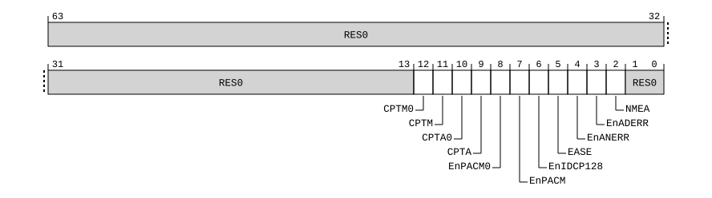

# ​D24.2.169 SCTLR2_EL1, System Control Register (EL1)

Source: <https://developer.arm.com/documentation/ddi0487/mc/-Part-D-The-AArch64-System-Level-Architecture/-Chapter-D24-AArch64-System-Register-Descriptions/-D24-2-General-system-control-registers/-D24-2-169-SCTLR2-EL1--System-Control-Register--EL1->

##### D24.2.169 SCTLR2\_EL1, System Control Register (EL1)

The SCTLR2\_EL1 characteristics are:

Purpose
:   Provides top-level control of the system, including its memory system, at EL1 and EL0.

Configuration
:   This register is present only when FEAT\_SCTLR2 is implemented and FEAT\_AA64 is implemented. Otherwise, direct accesses to SCTLR2\_EL1 are UNDEFINED.

Attributes
:   SCTLR2\_EL1 is a 64-bit register.

###### Field descriptions



Bits [63:13]
:   Reserved, RES0.

CPTM0, bit [12]
:   When FEAT\_CPA2 is implemented:
    :   This field controls unprivileged Checked Pointer Arithmetic for Multiplication.

<table>
 <colgroup>
  <col/>
  <col/>
 </colgroup>
 <thead>
  <tr>
   <th>
    <strong>
     CPTM0
    </strong>
   </th>
   <th>
    <strong>
     Meaning
    </strong>
   </th>
  </tr>
 </thead>
 <tbody>
  <tr>
   <td>
    <p>
     <code>
      0b0
     </code>
    </p>
   </td>
   <td>
    <p>
     Pointer Arithmetic for Multiplication is not checked.
    </p>
   </td>
  </tr>
  <tr>
   <td>
    <p>
     <code>
      0b1
     </code>
    </p>
   </td>
   <td>
    <p>
     Pointer Arithmetic for Multiplication is checked.
    </p>
   </td>
  </tr>
 </tbody>
</table>

        When the Effective value of [HCR\_EL2](/documentation/ddi0487/mc/-Part-D-The-AArch64-System-Level-Architecture/-Chapter-D24-AArch64-System-Register-Descriptions/-D24-2-General-system-control-registers/-D24-2-61-HCR-EL2--Hypervisor-Configuration-Register?lang=en#reg_aarch64_hcr_el2).{E2H, TGE} is {1, 1}, this bit has no effect on execution.

        This field is ignored by the PE and treated as zero when any of the following are true:

        - EL3 is implemented and [SCR\_EL3](/documentation/ddi0487/mc/-Part-D-The-AArch64-System-Level-Architecture/-Chapter-D24-AArch64-System-Register-Descriptions/-D24-2-General-system-control-registers/-D24-2-168-SCR-EL3--Secure-Configuration-Register?lang=en#reg_aarch64_scr_el3).SCTLR2En == 0.
        - EL2 is implemented and enabled in the current Security state and the Effective value of [HCRX\_EL2](/documentation/ddi0487/mc/-Part-D-The-AArch64-System-Level-Architecture/-Chapter-D24-AArch64-System-Register-Descriptions/-D24-2-General-system-control-registers/-D24-2-62-HCRX-EL2--Extended-Hypervisor-Configuration-Register?lang=en#reg_aarch64_hcrx_el2).SCTLR2En is 0.

        If the Effective value of SCTLR2\_EL1.CPTA0 is 0, then the Effective value of this field is 0.

        The reset behavior of this field is:

        - On a Warm reset:
          - When the highest implemented Exception level is EL1, this field resets to `'0'`.
          - Otherwise, this field resets to an architecturally UNKNOWN value.

        When FEAT\_SRMASK is implemented, EL1 is the current Exception level, IsSystemRegisterMaskingEnabled(EL1), and SCTLR2MASK\_EL1.CPTM0 == ‘1’, access to this field is RO.

    Otherwise:
    :   Reserved, RES0.

CPTM, bit [11]
:   When FEAT\_CPA2 is implemented:
    :   This field controls Checked Pointer Arithmetic for Multiplication at EL1.

<table>
 <colgroup>
  <col/>
  <col/>
 </colgroup>
 <thead>
  <tr>
   <th>
    <strong>
     CPTM
    </strong>
   </th>
   <th>
    <strong>
     Meaning
    </strong>
   </th>
  </tr>
 </thead>
 <tbody>
  <tr>
   <td>
    <p>
     <code>
      0b0
     </code>
    </p>
   </td>
   <td>
    <p>
     Pointer Arithmetic for Multiplication is not checked.
    </p>
   </td>
  </tr>
  <tr>
   <td>
    <p>
     <code>
      0b1
     </code>
    </p>
   </td>
   <td>
    <p>
     Pointer Arithmetic for Multiplication is checked.
    </p>
   </td>
  </tr>
 </tbody>
</table>

        This field is ignored by the PE and treated as zero when any of the following are true:

        - EL3 is implemented and [SCR\_EL3](/documentation/ddi0487/mc/-Part-D-The-AArch64-System-Level-Architecture/-Chapter-D24-AArch64-System-Register-Descriptions/-D24-2-General-system-control-registers/-D24-2-168-SCR-EL3--Secure-Configuration-Register?lang=en#reg_aarch64_scr_el3).SCTLR2En == 0.
        - EL2 is implemented and enabled in the current Security state and the Effective value of [HCRX\_EL2](/documentation/ddi0487/mc/-Part-D-The-AArch64-System-Level-Architecture/-Chapter-D24-AArch64-System-Register-Descriptions/-D24-2-General-system-control-registers/-D24-2-62-HCRX-EL2--Extended-Hypervisor-Configuration-Register?lang=en#reg_aarch64_hcrx_el2).SCTLR2En is 0.

        If the Effective value of SCTLR2\_EL1.CPTA is 0, then the Effective value of this field is 0.

        The reset behavior of this field is:

        - On a Warm reset:
          - When the highest implemented Exception level is EL1, this field resets to `'0'`.
          - Otherwise, this field resets to an architecturally UNKNOWN value.

        When FEAT\_SRMASK is implemented, EL1 is the current Exception level, IsSystemRegisterMaskingEnabled(EL1), and SCTLR2MASK\_EL1.CPTM == ‘1’, access to this field is RO.

    Otherwise:
    :   Reserved, RES0.

CPTA0, bit [10]
:   When FEAT\_CPA2 is implemented:
    :   This field controls unprivileged Checked Pointer Arithmetic for Addition.

<table>
 <colgroup>
  <col/>
  <col/>
 </colgroup>
 <thead>
  <tr>
   <th>
    <strong>
     CPTA0
    </strong>
   </th>
   <th>
    <strong>
     Meaning
    </strong>
   </th>
  </tr>
 </thead>
 <tbody>
  <tr>
   <td>
    <p>
     <code>
      0b0
     </code>
    </p>
   </td>
   <td>
    <p>
     Pointer Arithmetic for Addition is not checked.
    </p>
   </td>
  </tr>
  <tr>
   <td>
    <p>
     <code>
      0b1
     </code>
    </p>
   </td>
   <td>
    <p>
     Pointer Arithmetic for Addition is checked.
    </p>
   </td>
  </tr>
 </tbody>
</table>

        When the Effective value of [HCR\_EL2](/documentation/ddi0487/mc/-Part-D-The-AArch64-System-Level-Architecture/-Chapter-D24-AArch64-System-Register-Descriptions/-D24-2-General-system-control-registers/-D24-2-61-HCR-EL2--Hypervisor-Configuration-Register?lang=en#reg_aarch64_hcr_el2).{E2H, TGE} is {1, 1}, this bit has no effect on execution.

        This field is ignored by the PE and treated as zero when any of the following are true:

        - EL3 is implemented and [SCR\_EL3](/documentation/ddi0487/mc/-Part-D-The-AArch64-System-Level-Architecture/-Chapter-D24-AArch64-System-Register-Descriptions/-D24-2-General-system-control-registers/-D24-2-168-SCR-EL3--Secure-Configuration-Register?lang=en#reg_aarch64_scr_el3).SCTLR2En == 0.
        - EL2 is implemented and enabled in the current Security state and the Effective value of [HCRX\_EL2](/documentation/ddi0487/mc/-Part-D-The-AArch64-System-Level-Architecture/-Chapter-D24-AArch64-System-Register-Descriptions/-D24-2-General-system-control-registers/-D24-2-62-HCRX-EL2--Extended-Hypervisor-Configuration-Register?lang=en#reg_aarch64_hcrx_el2).SCTLR2En is 0.

        The reset behavior of this field is:

        - On a Warm reset:
          - When the highest implemented Exception level is EL1, this field resets to `'0'`.
          - Otherwise, this field resets to an architecturally UNKNOWN value.

        When FEAT\_SRMASK is implemented, EL1 is the current Exception level, IsSystemRegisterMaskingEnabled(EL1), and SCTLR2MASK\_EL1.CPTA0 == ‘1’, access to this field is RO.

    Otherwise:
    :   Reserved, RES0.

CPTA, bit [9]
:   When FEAT\_CPA2 is implemented:
    :   This field controls Checked Pointer Arithmetic for Addition at EL1.

<table>
 <colgroup>
  <col/>
  <col/>
 </colgroup>
 <thead>
  <tr>
   <th>
    <strong>
     CPTA
    </strong>
   </th>
   <th>
    <strong>
     Meaning
    </strong>
   </th>
  </tr>
 </thead>
 <tbody>
  <tr>
   <td>
    <p>
     <code>
      0b0
     </code>
    </p>
   </td>
   <td>
    <p>
     Pointer Arithmetic for Addition is not checked.
    </p>
   </td>
  </tr>
  <tr>
   <td>
    <p>
     <code>
      0b1
     </code>
    </p>
   </td>
   <td>
    <p>
     Pointer Arithmetic for Addition is checked.
    </p>
   </td>
  </tr>
 </tbody>
</table>

        This field is ignored by the PE and treated as zero when any of the following are true:

        - EL3 is implemented and [SCR\_EL3](/documentation/ddi0487/mc/-Part-D-The-AArch64-System-Level-Architecture/-Chapter-D24-AArch64-System-Register-Descriptions/-D24-2-General-system-control-registers/-D24-2-168-SCR-EL3--Secure-Configuration-Register?lang=en#reg_aarch64_scr_el3).SCTLR2En == 0.
        - EL2 is implemented and enabled in the current Security state and the Effective value of [HCRX\_EL2](/documentation/ddi0487/mc/-Part-D-The-AArch64-System-Level-Architecture/-Chapter-D24-AArch64-System-Register-Descriptions/-D24-2-General-system-control-registers/-D24-2-62-HCRX-EL2--Extended-Hypervisor-Configuration-Register?lang=en#reg_aarch64_hcrx_el2).SCTLR2En is 0.

        The reset behavior of this field is:

        - On a Warm reset:
          - When the highest implemented Exception level is EL1, this field resets to `'0'`.
          - Otherwise, this field resets to an architecturally UNKNOWN value.

        When FEAT\_SRMASK is implemented, EL1 is the current Exception level, IsSystemRegisterMaskingEnabled(EL1), and SCTLR2MASK\_EL1.CPTA == ‘1’, access to this field is RO.

    Otherwise:
    :   Reserved, RES0.

EnPACM0, bit [8]
:   When FEAT\_PAuth\_LR is implemented:
    :   PACM Enable at EL0. Controls the effect of a PACM instruction at EL0.

<table>
 <colgroup>
  <col/>
  <col/>
 </colgroup>
 <thead>
  <tr>
   <th>
    <strong>
     EnPACM0
    </strong>
   </th>
   <th>
    <strong>
     Meaning
    </strong>
   </th>
  </tr>
 </thead>
 <tbody>
  <tr>
   <td>
    <p>
     <code>
      0b0
     </code>
    </p>
   </td>
   <td>
    <p>
     The effects of PACM are disabled at EL0.
    </p>
   </td>
  </tr>
  <tr>
   <td>
    <p>
     <code>
      0b1
     </code>
    </p>
   </td>
   <td>
    <p>
     A PACM instruction at EL0 causes PSTATE.PACM to be set to 1.
    </p>
   </td>
  </tr>
 </tbody>
</table>

        When the Effective value of [HCR\_EL2](/documentation/ddi0487/mc/-Part-D-The-AArch64-System-Level-Architecture/-Chapter-D24-AArch64-System-Register-Descriptions/-D24-2-General-system-control-registers/-D24-2-61-HCR-EL2--Hypervisor-Configuration-Register?lang=en#reg_aarch64_hcr_el2).{E2H, TGE} is {1, 1}, this bit has no effect on execution at EL0.

        This field is ignored by the PE and treated as zero when any of the following are true:

        - EL3 is implemented and [SCR\_EL3](/documentation/ddi0487/mc/-Part-D-The-AArch64-System-Level-Architecture/-Chapter-D24-AArch64-System-Register-Descriptions/-D24-2-General-system-control-registers/-D24-2-168-SCR-EL3--Secure-Configuration-Register?lang=en#reg_aarch64_scr_el3).SCTLR2En == 0.
        - EL2 is implemented and enabled in the current Security state and the Effective value of [HCRX\_EL2](/documentation/ddi0487/mc/-Part-D-The-AArch64-System-Level-Architecture/-Chapter-D24-AArch64-System-Register-Descriptions/-D24-2-General-system-control-registers/-D24-2-62-HCRX-EL2--Extended-Hypervisor-Configuration-Register?lang=en#reg_aarch64_hcrx_el2).SCTLR2En is 0.
        - EL2 is implemented and enabled in the current Security state and the Effective value of [HCRX\_EL2](/documentation/ddi0487/mc/-Part-D-The-AArch64-System-Level-Architecture/-Chapter-D24-AArch64-System-Register-Descriptions/-D24-2-General-system-control-registers/-D24-2-62-HCRX-EL2--Extended-Hypervisor-Configuration-Register?lang=en#reg_aarch64_hcrx_el2).PACMEn == 0.

        The reset behavior of this field is:

        - On a Warm reset:
          - When the highest implemented Exception level is EL1, this field resets to `'0'`.
          - Otherwise, this field resets to an architecturally UNKNOWN value.

        When FEAT\_SRMASK is implemented, EL1 is the current Exception level, IsSystemRegisterMaskingEnabled(EL1), and SCTLR2MASK\_EL1.EnPACM0 == ‘1’, access to this field is RO.

    Otherwise:
    :   Reserved, RES0.

EnPACM, bit [7]
:   When FEAT\_PAuth\_LR is implemented:
    :   PACM Enable at EL1. Controls the effect of a PACM instruction at EL1.

<table>
 <colgroup>
  <col/>
  <col/>
 </colgroup>
 <thead>
  <tr>
   <th>
    <strong>
     EnPACM
    </strong>
   </th>
   <th>
    <strong>
     Meaning
    </strong>
   </th>
  </tr>
 </thead>
 <tbody>
  <tr>
   <td>
    <p>
     <code>
      0b0
     </code>
    </p>
   </td>
   <td>
    <p>
     The effects of PACM are disabled at EL1.
    </p>
   </td>
  </tr>
  <tr>
   <td>
    <p>
     <code>
      0b1
     </code>
    </p>
   </td>
   <td>
    <p>
     A PACM instruction at EL1 causes PSTATE.PACM to be set to 1.
    </p>
   </td>
  </tr>
 </tbody>
</table>

        This field is ignored by the PE and treated as zero when any of the following are true:

        - EL3 is implemented and [SCR\_EL3](/documentation/ddi0487/mc/-Part-D-The-AArch64-System-Level-Architecture/-Chapter-D24-AArch64-System-Register-Descriptions/-D24-2-General-system-control-registers/-D24-2-168-SCR-EL3--Secure-Configuration-Register?lang=en#reg_aarch64_scr_el3).SCTLR2En == 0.
        - EL2 is implemented and enabled in the current Security state and the Effective value of [HCRX\_EL2](/documentation/ddi0487/mc/-Part-D-The-AArch64-System-Level-Architecture/-Chapter-D24-AArch64-System-Register-Descriptions/-D24-2-General-system-control-registers/-D24-2-62-HCRX-EL2--Extended-Hypervisor-Configuration-Register?lang=en#reg_aarch64_hcrx_el2).SCTLR2En is 0.
        - EL2 is implemented and enabled in the current Security state and the Effective value of [HCRX\_EL2](/documentation/ddi0487/mc/-Part-D-The-AArch64-System-Level-Architecture/-Chapter-D24-AArch64-System-Register-Descriptions/-D24-2-General-system-control-registers/-D24-2-62-HCRX-EL2--Extended-Hypervisor-Configuration-Register?lang=en#reg_aarch64_hcrx_el2).PACMEn == 0.

        The reset behavior of this field is:

        - On a Warm reset:
          - When the highest implemented Exception level is EL1, this field resets to `'0'`.
          - Otherwise, this field resets to an architecturally UNKNOWN value.

        When FEAT\_SRMASK is implemented, EL1 is the current Exception level, IsSystemRegisterMaskingEnabled(EL1), and SCTLR2MASK\_EL1.EnPACM == ‘1’, access to this field is RO.

    Otherwise:
    :   Reserved, RES0.

EnIDCP128, bit [6]
:   When FEAT\_SYSREG128 is implemented:
    :   Enables access to IMPLEMENTATION DEFINED 128-bit System registers.

<table>
 <colgroup>
  <col/>
  <col/>
 </colgroup>
 <thead>
  <tr>
   <th>
    <strong>
     EnIDCP128
    </strong>
   </th>
   <th>
    <strong>
     Meaning
    </strong>
   </th>
  </tr>
 </thead>
 <tbody>
  <tr>
   <td>
    <p>
     <code>
      0b0
     </code>
    </p>
   </td>
   <td>
    <p>
     Accesses at EL0 to
     <small>
      IMPLEMENTATION DEFINED
     </small>
     128-bit System registers are trapped to EL1 using an ESR_EL1.EC value of
     <code>
      0x14
     </code>
     , unless the access generates a higher priority exception.
    </p>
    <p>
     Disables the functionality of the 128-bit
     <small>
      IMPLEMENTATION DEFINED
     </small>
     System registers that are accessible at EL1.
    </p>
   </td>
  </tr>
  <tr>
   <td>
    <p>
     <code>
      0b1
     </code>
    </p>
   </td>
   <td>
    <p>
     No accesses are trapped by this control.
    </p>
   </td>
  </tr>
 </tbody>
</table>

        This field is ignored by the PE and treated as zero when any of the following are true:

        - EL3 is implemented and [SCR\_EL3](/documentation/ddi0487/mc/-Part-D-The-AArch64-System-Level-Architecture/-Chapter-D24-AArch64-System-Register-Descriptions/-D24-2-General-system-control-registers/-D24-2-168-SCR-EL3--Secure-Configuration-Register?lang=en#reg_aarch64_scr_el3).SCTLR2En == 0.
        - EL2 is implemented and enabled in the current Security state and the Effective value of [HCRX\_EL2](/documentation/ddi0487/mc/-Part-D-The-AArch64-System-Level-Architecture/-Chapter-D24-AArch64-System-Register-Descriptions/-D24-2-General-system-control-registers/-D24-2-62-HCRX-EL2--Extended-Hypervisor-Configuration-Register?lang=en#reg_aarch64_hcrx_el2).SCTLR2En is 0.

        The reset behavior of this field is:

        - On a Warm reset:
          - When the highest implemented Exception level is EL1, this field resets to `'0'`.
          - Otherwise, this field resets to an architecturally UNKNOWN value.

        When FEAT\_SRMASK is implemented, EL1 is the current Exception level, IsSystemRegisterMaskingEnabled(EL1), and SCTLR2MASK\_EL1.EnIDCP128 == ‘1’, access to this field is RO.

    Otherwise:
    :   Reserved, RES0.

EASE, bit [5]
:   When FEAT\_DoubleFault2 is implemented:
    :   External Aborts to SError exception vector.

<table>
 <colgroup>
  <col/>
  <col/>
 </colgroup>
 <thead>
  <tr>
   <th>
    <strong>
     EASE
    </strong>
   </th>
   <th>
    <strong>
     Meaning
    </strong>
   </th>
  </tr>
 </thead>
 <tbody>
  <tr>
   <td>
    <p>
     <code>
      0b0
     </code>
    </p>
   </td>
   <td>
    <p>
     Synchronous External abort exceptions taken to EL1 are taken to the appropriate synchronous exception vector offset from
     <a class="document-topic" document-topic-path="/ddi0487/mc/-Part-D-The-AArch64-System-Level-Architecture/-Chapter-D24-AArch64-System-Register-Descriptions/-D24-2-General-system-control-registers/-D24-2-213-VBAR-EL1--Vector-Base-Address-Register--EL1-?lang=en#reg_aarch64_vbar_el1" href="/documentation/ddi0487/mc/-Part-D-The-AArch64-System-Level-Architecture/-Chapter-D24-AArch64-System-Register-Descriptions/-D24-2-General-system-control-registers/-D24-2-213-VBAR-EL1--Vector-Base-Address-Register--EL1-?lang=en#reg_aarch64_vbar_el1">
      VBAR_EL1
     </a>
     .
    </p>
   </td>
  </tr>
  <tr>
   <td>
    <p>
     <code>
      0b1
     </code>
    </p>
   </td>
   <td>
    <p>
     Synchronous External abort exceptions taken to EL1 are taken to the appropriate SError exception vector offset from
     <a class="document-topic" document-topic-path="/ddi0487/mc/-Part-D-The-AArch64-System-Level-Architecture/-Chapter-D24-AArch64-System-Register-Descriptions/-D24-2-General-system-control-registers/-D24-2-213-VBAR-EL1--Vector-Base-Address-Register--EL1-?lang=en#reg_aarch64_vbar_el1" href="/documentation/ddi0487/mc/-Part-D-The-AArch64-System-Level-Architecture/-Chapter-D24-AArch64-System-Register-Descriptions/-D24-2-General-system-control-registers/-D24-2-213-VBAR-EL1--Vector-Base-Address-Register--EL1-?lang=en#reg_aarch64_vbar_el1">
      VBAR_EL1
     </a>
     .
    </p>
   </td>
  </tr>
 </tbody>
</table>

        This field is ignored by the PE and treated as zero when any of the following are true:

        - EL3 is implemented and [SCR\_EL3](/documentation/ddi0487/mc/-Part-D-The-AArch64-System-Level-Architecture/-Chapter-D24-AArch64-System-Register-Descriptions/-D24-2-General-system-control-registers/-D24-2-168-SCR-EL3--Secure-Configuration-Register?lang=en#reg_aarch64_scr_el3).SCTLR2En == 0.
        - EL2 is implemented and enabled in the current Security state and the Effective value of [HCRX\_EL2](/documentation/ddi0487/mc/-Part-D-The-AArch64-System-Level-Architecture/-Chapter-D24-AArch64-System-Register-Descriptions/-D24-2-General-system-control-registers/-D24-2-62-HCRX-EL2--Extended-Hypervisor-Configuration-Register?lang=en#reg_aarch64_hcrx_el2).SCTLR2En is 0.

        The reset behavior of this field is:

        - On a Warm reset:
          - When the highest implemented Exception level is EL1, this field resets to `'0'`.
          - Otherwise, this field resets to an architecturally UNKNOWN value.

        When FEAT\_SRMASK is implemented, EL1 is the current Exception level, IsSystemRegisterMaskingEnabled(EL1), and SCTLR2MASK\_EL1.EASE == ‘1’, access to this field is RO.

    Otherwise:
    :   Reserved, RES0.

EnANERR, bit [4]
:   When FEAT\_ANERR is implemented:
    :   Enable Asynchronous Normal Read Error.

<table>
 <colgroup>
  <col/>
  <col/>
 </colgroup>
 <thead>
  <tr>
   <th>
    <strong>
     EnANERR
    </strong>
   </th>
   <th>
    <strong>
     Meaning
    </strong>
   </th>
  </tr>
 </thead>
 <tbody>
  <tr>
   <td>
    <p>
     <code>
      0b0
     </code>
    </p>
   </td>
   <td>
    <p>
     External aborts on Normal memory reads generate synchronous Data Abort exceptions in the EL1&amp;0 translation regime.
    </p>
   </td>
  </tr>
  <tr>
   <td>
    <p>
     <code>
      0b1
     </code>
    </p>
   </td>
   <td>
    <p>
     External aborts on Normal memory reads generate synchronous Data Abort or asynchronous SError exceptions in the EL1&amp;0 translation regime.
    </p>
   </td>
  </tr>
 </tbody>
</table>

        Implementation-specific exceptions to applications of this field are described in [‘Taking error exceptions’](/documentation/ddi0487/mc/-Part-D-The-AArch64-System-Level-Architecture/-Chapter-D20-RAS-PE-Architecture/-D20-4-Taking-error-exceptions?lang=en#mdsec_taking_error_exceptions).

        Setting this field to 0 does not guarantee that the PE is able to take a synchronous Data Abort exception for an External abort on a Normal memory read in every case. There might be implementation-specific circumstances when an error on a load cannot be taken synchronously. These circumstances should be rare enough that treating such occurrences as fatal does not cause a significant increase in failure rate.

        If [FEAT\_SVE](/documentation/ddi0487/mc/-Part-A-Arm-Architecture-Introduction-and-Overview/-Chapter-A2-A-profile-Architecture-Extensions/-A2-2-Armv8-A-architecture-extensions/-A2-2-3-The-Armv8-2-architecture-extension?lang=en#feat_feat_sve) is implemented, SCTLR2\_EL1.EnANERR is 0, and the access generating the External abort is due to any Active element of an SVE Non-fault vector load instruction or an Active element that is not the First active element of an SVE First-fault vector load instruction, then no exception is generated and the External abort is reported in the FFR.

        Setting this field to 0 might have a performance impact for Normal memory reads.

        This field is ignored by the PE and treated as zero when any of the following are true:

        - EL3 is implemented and [SCR\_EL3](/documentation/ddi0487/mc/-Part-D-The-AArch64-System-Level-Architecture/-Chapter-D24-AArch64-System-Register-Descriptions/-D24-2-General-system-control-registers/-D24-2-168-SCR-EL3--Secure-Configuration-Register?lang=en#reg_aarch64_scr_el3).SCTLR2En == 0.
        - EL2 is implemented and enabled in the current Security state and the Effective value of [HCRX\_EL2](/documentation/ddi0487/mc/-Part-D-The-AArch64-System-Level-Architecture/-Chapter-D24-AArch64-System-Register-Descriptions/-D24-2-General-system-control-registers/-D24-2-62-HCRX-EL2--Extended-Hypervisor-Configuration-Register?lang=en#reg_aarch64_hcrx_el2).SCTLR2En is 0.
        - EL2 is implemented and enabled in the current Security state and the Effective value of [HCRX\_EL2](/documentation/ddi0487/mc/-Part-D-The-AArch64-System-Level-Architecture/-Chapter-D24-AArch64-System-Register-Descriptions/-D24-2-General-system-control-registers/-D24-2-62-HCRX-EL2--Extended-Hypervisor-Configuration-Register?lang=en#reg_aarch64_hcrx_el2).EnSNERR is 1.

        Otherwise, this field is ignored by the PE and treated as one when all of the following are true:

        - [FEAT\_ADERR](/documentation/ddi0487/mc/-Part-A-Arm-Architecture-Introduction-and-Overview/-Chapter-A2-A-profile-Architecture-Extensions/-A2-2-Armv8-A-architecture-extensions/-A2-2-10-The-Armv8-9-architecture-extension?lang=en#feat_feat_aderr) is implemented.
        - [ID\_AA64MMFR3\_EL1](/documentation/ddi0487/mc/-Part-D-The-AArch64-System-Level-Architecture/-Chapter-D24-AArch64-System-Register-Descriptions/-D24-2-General-system-control-registers/-D24-2-90-ID-AA64MMFR3-EL1--AArch64-Memory-Model-Feature-Register-3?lang=en#reg_aarch64_id_aa64mmfr3_el1).ANERR reads as `0b0010`.
        - SCTLR2\_EL1.EnADERR is 1.

        The reset behavior of this field is:

        - On a Warm reset:
          - When the highest implemented Exception level is EL1, this field resets to `'0'`.
          - Otherwise, this field resets to an architecturally UNKNOWN value.

        When FEAT\_SRMASK is implemented, EL1 is the current Exception level, IsSystemRegisterMaskingEnabled(EL1), and SCTLR2MASK\_EL1.EnANERR == ‘1’, access to this field is RO.

    Otherwise:
    :   Reserved, RES0.

EnADERR, bit [3]
:   When FEAT\_ADERR is implemented:
    :   Enable Asynchronous Device Read Error.

<table>
 <colgroup>
  <col/>
  <col/>
 </colgroup>
 <thead>
  <tr>
   <th>
    <strong>
     EnADERR
    </strong>
   </th>
   <th>
    <strong>
     Meaning
    </strong>
   </th>
  </tr>
 </thead>
 <tbody>
  <tr>
   <td>
    <p>
     <code>
      0b0
     </code>
    </p>
   </td>
   <td>
    <p>
     External aborts on Device memory reads generate synchronous Data Abort exceptions in the EL1&amp;0 translation regime.
    </p>
   </td>
  </tr>
  <tr>
   <td>
    <p>
     <code>
      0b1
     </code>
    </p>
   </td>
   <td>
    <p>
     External aborts on Device memory reads generate synchronous Data Abort or asynchronous SError exceptions in the EL1&amp;0 translation regime.
    </p>
   </td>
  </tr>
 </tbody>
</table>

        Implementation-specific exceptions to applications of this field are described in [‘Taking error exceptions’](/documentation/ddi0487/mc/-Part-D-The-AArch64-System-Level-Architecture/-Chapter-D20-RAS-PE-Architecture/-D20-4-Taking-error-exceptions?lang=en#mdsec_taking_error_exceptions).

        Setting this field to 0 does not guarantee that the PE is able to take a synchronous Data Abort exception for an External abort on a Device memory read in every case. There might be implementation-specific circumstances when an error on a load cannot be taken synchronously. These circumstances should be rare enough that treating such occurrences as fatal does not cause a significant increase in failure rate.

        If [FEAT\_SVE](/documentation/ddi0487/mc/-Part-A-Arm-Architecture-Introduction-and-Overview/-Chapter-A2-A-profile-Architecture-Extensions/-A2-2-Armv8-A-architecture-extensions/-A2-2-3-The-Armv8-2-architecture-extension?lang=en#feat_feat_sve) is implemented, SCTLR2\_EL1.EnADERR is 0, and the access generating the External abort is due to any Active element of an SVE Non-fault vector load instruction or an Active element that is not the First active element of an SVE First-fault vector load instruction, then no exception is generated and the External abort is reported in the FFR.

        Setting this field to 0 might have a performance impact for Device memory reads.

        This field is ignored by the PE and treated as zero when any of the following are true:

        - EL3 is implemented and [SCR\_EL3](/documentation/ddi0487/mc/-Part-D-The-AArch64-System-Level-Architecture/-Chapter-D24-AArch64-System-Register-Descriptions/-D24-2-General-system-control-registers/-D24-2-168-SCR-EL3--Secure-Configuration-Register?lang=en#reg_aarch64_scr_el3).SCTLR2En == 0.
        - EL2 is implemented and enabled in the current Security state and the Effective value of [HCRX\_EL2](/documentation/ddi0487/mc/-Part-D-The-AArch64-System-Level-Architecture/-Chapter-D24-AArch64-System-Register-Descriptions/-D24-2-General-system-control-registers/-D24-2-62-HCRX-EL2--Extended-Hypervisor-Configuration-Register?lang=en#reg_aarch64_hcrx_el2).SCTLR2En is 0.
        - EL2 is implemented and enabled in the current Security state and the Effective value of [HCRX\_EL2](/documentation/ddi0487/mc/-Part-D-The-AArch64-System-Level-Architecture/-Chapter-D24-AArch64-System-Register-Descriptions/-D24-2-General-system-control-registers/-D24-2-62-HCRX-EL2--Extended-Hypervisor-Configuration-Register?lang=en#reg_aarch64_hcrx_el2).EnSDERR is 1.

        Otherwise, this field is ignored by the PE and treated as one when all of the following are true:

        - [FEAT\_ANERR](/documentation/ddi0487/mc/-Part-A-Arm-Architecture-Introduction-and-Overview/-Chapter-A2-A-profile-Architecture-Extensions/-A2-2-Armv8-A-architecture-extensions/-A2-2-10-The-Armv8-9-architecture-extension?lang=en#feat_feat_anerr) is implemented.
        - [ID\_AA64MMFR3\_EL1](/documentation/ddi0487/mc/-Part-D-The-AArch64-System-Level-Architecture/-Chapter-D24-AArch64-System-Register-Descriptions/-D24-2-General-system-control-registers/-D24-2-90-ID-AA64MMFR3-EL1--AArch64-Memory-Model-Feature-Register-3?lang=en#reg_aarch64_id_aa64mmfr3_el1).ADERR reads as `0b0010`.
        - SCTLR2\_EL1.EnANERR is 1.

        The reset behavior of this field is:

        - On a Warm reset:
          - When the highest implemented Exception level is EL1, this field resets to `'0'`.
          - Otherwise, this field resets to an architecturally UNKNOWN value.

        When FEAT\_SRMASK is implemented, EL1 is the current Exception level, IsSystemRegisterMaskingEnabled(EL1), and SCTLR2MASK\_EL1.EnADERR == ‘1’, access to this field is RO.

    Otherwise:
    :   Reserved, RES0.

NMEA, bit [2]
:   When FEAT\_DoubleFault2 is implemented:
    :   Non-maskable External Aborts. Controls whether PSTATE.A masks physical SError exceptions at EL1.

<table>
 <colgroup>
  <col/>
  <col/>
 </colgroup>
 <thead>
  <tr>
   <th>
    <strong>
     NMEA
    </strong>
   </th>
   <th>
    <strong>
     Meaning
    </strong>
   </th>
  </tr>
 </thead>
 <tbody>
  <tr>
   <td>
    <p>
     <code>
      0b0
     </code>
    </p>
   </td>
   <td>
    <p>
     Physical SError exceptions are not taken at EL1 if PSTATE.A == 1, unless routed to a higher Exception level.
    </p>
   </td>
  </tr>
  <tr>
   <td>
    <p>
     <code>
      0b1
     </code>
    </p>
   </td>
   <td>
    <p>
     Physical SError exceptions are taken at EL1 regardless of the value of PSTATE.A, unless routed to a higher Exception level.
    </p>
   </td>
  </tr>
 </tbody>
</table>

        This field has no effect on the masking of virtual and delegated SError interrupts.

        This field is ignored by the PE and treated as zero when any of the following are true:

        - EL3 is implemented and [SCR\_EL3](/documentation/ddi0487/mc/-Part-D-The-AArch64-System-Level-Architecture/-Chapter-D24-AArch64-System-Register-Descriptions/-D24-2-General-system-control-registers/-D24-2-168-SCR-EL3--Secure-Configuration-Register?lang=en#reg_aarch64_scr_el3).SCTLR2En == 0.
        - EL2 is implemented and enabled in the current Security state and the Effective value of [HCRX\_EL2](/documentation/ddi0487/mc/-Part-D-The-AArch64-System-Level-Architecture/-Chapter-D24-AArch64-System-Register-Descriptions/-D24-2-General-system-control-registers/-D24-2-62-HCRX-EL2--Extended-Hypervisor-Configuration-Register?lang=en#reg_aarch64_hcrx_el2).SCTLR2En is 0.

        The reset behavior of this field is:

        - On a Warm reset:
          - When the highest implemented Exception level is EL1, this field resets to `'0'`.
          - Otherwise, this field resets to an architecturally UNKNOWN value.

        When FEAT\_SRMASK is implemented, EL1 is the current Exception level, IsSystemRegisterMaskingEnabled(EL1), and SCTLR2MASK\_EL1.NMEA == ‘1’, access to this field is RO.

    Otherwise:
    :   Reserved, RES0.

Bits [1:0]
:   Reserved, RES0.

###### Accessing SCTLR2\_EL1

When the Effective value of [HCR\_EL2](/documentation/ddi0487/mc/-Part-D-The-AArch64-System-Level-Architecture/-Chapter-D24-AArch64-System-Register-Descriptions/-D24-2-General-system-control-registers/-D24-2-61-HCR-EL2--Hypervisor-Configuration-Register?lang=en#reg_aarch64_hcr_el2).E2H is 1, without explicit synchronization, accesses from EL3 using the accessor name `SCTLR2_EL1` or `SCTLR2_EL12` are not guaranteed to be ordered with respect to accesses using the other accessor name.

If FEAT\_SRMASK is implemented, accesses to SCTLR2\_EL1 are masked by [SCTLR2MASK\_EL1](/documentation/ddi0487/mc/-Part-D-The-AArch64-System-Level-Architecture/-Chapter-D24-AArch64-System-Register-Descriptions/-D24-2-General-system-control-registers/-D24-2-172-SCTLR2MASK-EL1--Extended-System-Control-Masking-Register--EL1-?lang=en#reg_aarch64_sctlr2mask_el1).

Accesses to this register use the following encodings in the System register encoding space:

###### `MRS <Xt>, SCTLR2_EL1`

<table>
 <colgroup>
  <col/>
  <col/>
  <col/>
  <col/>
  <col/>
 </colgroup>
 <thead>
  <tr>
   <th>
    <strong>
     op0
    </strong>
   </th>
   <th>
    <strong>
     op1
    </strong>
   </th>
   <th>
    <strong>
     CRn
    </strong>
   </th>
   <th>
    <strong>
     CRm
    </strong>
   </th>
   <th>
    <strong>
     op2
    </strong>
   </th>
  </tr>
 </thead>
 <tbody>
  <tr>
   <td>
    <p>
     <code>
      0b11
     </code>
    </p>
   </td>
   <td>
    <p>
     <code>
      0b000
     </code>
    </p>
   </td>
   <td>
    <p>
     <code>
      0b0001
     </code>
    </p>
   </td>
   <td>
    <p>
     <code>
      0b0000
     </code>
    </p>
   </td>
   <td>
    <p>
     <code>
      0b011
     </code>
    </p>
   </td>
  </tr>
 </tbody>
</table>

```
if !(IsFeatureImplemented(FEAT_SCTLR2) && IsFeatureImplemented(FEAT_AA64)) then
    Undefined();
elsif HaveEL(EL3) && !(EffectivelyAtEL0InHost() || EffectivelyAtEL0NotInHost() || PSTATE.EL == EL3) && EL3SDDUndefPriority() && SCR_EL3().SCTLR2En == '0' then
    Undefined();
elsif PSTATE.EL == EL0 then
    Undefined();
elsif PSTATE.EL == EL1 then
    if EL2Enabled() && HCR_EL2().TRVM == '1' then
        AArch64_SystemAccessTrap(EL2, 0x18);
    elsif EL2Enabled() && IsFeatureImplemented(FEAT_FGT) && (!HaveEL(EL3) || SCR_EL3().FGTEn == '1') && HFGRTR_EL2().SCTLR_EL1 == '1' then
        AArch64_SystemAccessTrap(EL2, 0x18);
    elsif EL2Enabled() && (!IsHCRXEL2Enabled() || HCRX_EL2().SCTLR2En == '0') then
        AArch64_SystemAccessTrap(EL2, 0x18);
    elsif HaveEL(EL3) && SCR_EL3().SCTLR2En == '0' then
        if EL3SDDUndef() then
            Undefined();
        else
            AArch64_SystemAccessTrap(EL3, 0x18);
        end;
    elsif EffectiveHCR_EL2_NVx() IN {'111'} then
        X{64}(t) = NVMem(0x278);
    else
        X{64}(t) = SCTLR2_EL1();
    end;
elsif PSTATE.EL == EL2 then
    if HaveEL(EL3) && SCR_EL3().SCTLR2En == '0' then
        if EL3SDDUndef() then
            Undefined();
        else
            AArch64_SystemAccessTrap(EL3, 0x18);
        end;
    elsif ELIsInHost(EL2) then
        X{64}(t) = SCTLR2_EL2();
    else
        X{64}(t) = SCTLR2_EL1();
    end;
elsif PSTATE.EL == EL3 then
    X{64}(t) = SCTLR2_EL1();
end;
```

###### `MSR SCTLR2_EL1, <Xt>`

<table>
 <colgroup>
  <col/>
  <col/>
  <col/>
  <col/>
  <col/>
 </colgroup>
 <thead>
  <tr>
   <th>
    <strong>
     op0
    </strong>
   </th>
   <th>
    <strong>
     op1
    </strong>
   </th>
   <th>
    <strong>
     CRn
    </strong>
   </th>
   <th>
    <strong>
     CRm
    </strong>
   </th>
   <th>
    <strong>
     op2
    </strong>
   </th>
  </tr>
 </thead>
 <tbody>
  <tr>
   <td>
    <p>
     <code>
      0b11
     </code>
    </p>
   </td>
   <td>
    <p>
     <code>
      0b000
     </code>
    </p>
   </td>
   <td>
    <p>
     <code>
      0b0001
     </code>
    </p>
   </td>
   <td>
    <p>
     <code>
      0b0000
     </code>
    </p>
   </td>
   <td>
    <p>
     <code>
      0b011
     </code>
    </p>
   </td>
  </tr>
 </tbody>
</table>

```
if !(IsFeatureImplemented(FEAT_SCTLR2) && IsFeatureImplemented(FEAT_AA64)) then
    Undefined();
elsif HaveEL(EL3) && !(EffectivelyAtEL0InHost() || EffectivelyAtEL0NotInHost() || PSTATE.EL == EL3) && EL3SDDUndefPriority() && SCR_EL3().SCTLR2En == '0' then
    Undefined();
elsif PSTATE.EL == EL0 then
    Undefined();
elsif PSTATE.EL == EL1 then
    if EL2Enabled() && HCR_EL2().TVM == '1' then
        AArch64_SystemAccessTrap(EL2, 0x18);
    elsif EL2Enabled() && IsFeatureImplemented(FEAT_FGT) && (!HaveEL(EL3) || SCR_EL3().FGTEn == '1') && HFGWTR_EL2().SCTLR_EL1 == '1' then
        AArch64_SystemAccessTrap(EL2, 0x18);
    elsif EL2Enabled() && (!IsHCRXEL2Enabled() || HCRX_EL2().SCTLR2En == '0') then
        AArch64_SystemAccessTrap(EL2, 0x18);
    elsif HaveEL(EL3) && SCR_EL3().SCTLR2En == '0' then
        if EL3SDDUndef() then
            Undefined();
        else
            AArch64_SystemAccessTrap(EL3, 0x18);
        end;
    elsif EffectiveHCR_EL2_NVx() IN {'111'} then
        NVMem(0x278) = X{64}(t);
    else
        SCTLR2_EL1() = X{64}(t);
    end;
elsif PSTATE.EL == EL2 then
    if HaveEL(EL3) && SCR_EL3().SCTLR2En == '0' then
        if EL3SDDUndef() then
            Undefined();
        else
            AArch64_SystemAccessTrap(EL3, 0x18);
        end;
    elsif ELIsInHost(EL2) then
        SCTLR2_EL2() = X{64}(t);
    else
        SCTLR2_EL1() = X{64}(t);
    end;
elsif PSTATE.EL == EL3 then
    SCTLR2_EL1() = X{64}(t);
end;
```

`When FEAT_VHE is implemented MRS <Xt>, SCTLR2_EL12`
:

<table>
 <colgroup>
  <col/>
  <col/>
  <col/>
  <col/>
  <col/>
 </colgroup>
 <thead>
  <tr>
   <th>
    <strong>
     op0
    </strong>
   </th>
   <th>
    <strong>
     op1
    </strong>
   </th>
   <th>
    <strong>
     CRn
    </strong>
   </th>
   <th>
    <strong>
     CRm
    </strong>
   </th>
   <th>
    <strong>
     op2
    </strong>
   </th>
  </tr>
 </thead>
 <tbody>
  <tr>
   <td>
    <p>
     <code>
      0b11
     </code>
    </p>
   </td>
   <td>
    <p>
     <code>
      0b101
     </code>
    </p>
   </td>
   <td>
    <p>
     <code>
      0b0001
     </code>
    </p>
   </td>
   <td>
    <p>
     <code>
      0b0000
     </code>
    </p>
   </td>
   <td>
    <p>
     <code>
      0b011
     </code>
    </p>
   </td>
  </tr>
 </tbody>
</table>

    ```
    if !(IsFeatureImplemented(FEAT_SCTLR2) && IsFeatureImplemented(FEAT_AA64)) then
        Undefined();
    elsif HaveEL(EL3) && PSTATE.EL == EL2 && EL3SDDUndefPriority() && SCR_EL3().SCTLR2En == '0' then
        Undefined();
    elsif PSTATE.EL == EL0 then
        Undefined();
    elsif PSTATE.EL == EL1 then
        if EffectiveHCR_EL2_NVx() == '101' then
            X{64}(t) = NVMem(0x278);
        elsif EffectiveHCR_EL2_NVx() IN {'xx1'} then
            AArch64_SystemAccessTrap(EL2, 0x18);
        else
            Undefined();
        end;
    elsif PSTATE.EL == EL2 then
        if ELIsInHost(EL2) then
            if HaveEL(EL3) && SCR_EL3().SCTLR2En == '0' then
                if EL3SDDUndef() then
                    Undefined();
                else
                    AArch64_SystemAccessTrap(EL3, 0x18);
                end;
            else
                X{64}(t) = SCTLR2_EL1();
            end;
        else
            Undefined();
        end;
    elsif PSTATE.EL == EL3 then
        if ELIsInHost(EL2) then
            X{64}(t) = SCTLR2_EL1();
        else
            Undefined();
        end;
    end;
    ```

`When FEAT_VHE is implemented MSR SCTLR2_EL12, <Xt>`
:

<table>
 <colgroup>
  <col/>
  <col/>
  <col/>
  <col/>
  <col/>
 </colgroup>
 <thead>
  <tr>
   <th>
    <strong>
     op0
    </strong>
   </th>
   <th>
    <strong>
     op1
    </strong>
   </th>
   <th>
    <strong>
     CRn
    </strong>
   </th>
   <th>
    <strong>
     CRm
    </strong>
   </th>
   <th>
    <strong>
     op2
    </strong>
   </th>
  </tr>
 </thead>
 <tbody>
  <tr>
   <td>
    <p>
     <code>
      0b11
     </code>
    </p>
   </td>
   <td>
    <p>
     <code>
      0b101
     </code>
    </p>
   </td>
   <td>
    <p>
     <code>
      0b0001
     </code>
    </p>
   </td>
   <td>
    <p>
     <code>
      0b0000
     </code>
    </p>
   </td>
   <td>
    <p>
     <code>
      0b011
     </code>
    </p>
   </td>
  </tr>
 </tbody>
</table>

    ```
    if !(IsFeatureImplemented(FEAT_SCTLR2) && IsFeatureImplemented(FEAT_AA64)) then
        Undefined();
    elsif HaveEL(EL3) && PSTATE.EL == EL2 && EL3SDDUndefPriority() && SCR_EL3().SCTLR2En == '0' then
        Undefined();
    elsif PSTATE.EL == EL0 then
        Undefined();
    elsif PSTATE.EL == EL1 then
        if EffectiveHCR_EL2_NVx() == '101' then
            NVMem(0x278) = X{64}(t);
        elsif EffectiveHCR_EL2_NVx() IN {'xx1'} then
            AArch64_SystemAccessTrap(EL2, 0x18);
        else
            Undefined();
        end;
    elsif PSTATE.EL == EL2 then
        if ELIsInHost(EL2) then
            if HaveEL(EL3) && SCR_EL3().SCTLR2En == '0' then
                if EL3SDDUndef() then
                    Undefined();
                else
                    AArch64_SystemAccessTrap(EL3, 0x18);
                end;
            else
                SCTLR2_EL1() = X{64}(t);
            end;
        else
            Undefined();
        end;
    elsif PSTATE.EL == EL3 then
        if ELIsInHost(EL2) then
            SCTLR2_EL1() = X{64}(t);
        else
            Undefined();
        end;
    end;
    ```

`When FEAT_SRMASK is implemented MRS <Xt>, SCTLR2ALIAS_EL1`
:

<table>
 <colgroup>
  <col/>
  <col/>
  <col/>
  <col/>
  <col/>
 </colgroup>
 <thead>
  <tr>
   <th>
    <strong>
     op0
    </strong>
   </th>
   <th>
    <strong>
     op1
    </strong>
   </th>
   <th>
    <strong>
     CRn
    </strong>
   </th>
   <th>
    <strong>
     CRm
    </strong>
   </th>
   <th>
    <strong>
     op2
    </strong>
   </th>
  </tr>
 </thead>
 <tbody>
  <tr>
   <td>
    <p>
     <code>
      0b11
     </code>
    </p>
   </td>
   <td>
    <p>
     <code>
      0b000
     </code>
    </p>
   </td>
   <td>
    <p>
     <code>
      0b0001
     </code>
    </p>
   </td>
   <td>
    <p>
     <code>
      0b0100
     </code>
    </p>
   </td>
   <td>
    <p>
     <code>
      0b111
     </code>
    </p>
   </td>
  </tr>
 </tbody>
</table>

    ```
    if !(IsFeatureImplemented(FEAT_SCTLR2) && IsFeatureImplemented(FEAT_AA64)) then
        Undefined();
    elsif HaveEL(EL3) && !(EffectivelyAtEL0InHost() || EffectivelyAtEL0NotInHost() || PSTATE.EL == EL3) && EL3SDDUndefPriority() && SCR_EL3().SCTLR2En == '0' then
        Undefined();
    elsif PSTATE.EL == EL0 then
        Undefined();
    elsif PSTATE.EL == EL1 then
        if EL2Enabled() && HCR_EL2().TRVM == '1' then
            AArch64_SystemAccessTrap(EL2, 0x18);
        elsif EL2Enabled() && IsFeatureImplemented(FEAT_FGT2) && ((HaveEL(EL3) && SCR_EL3().FGTEn2 == '0') || HFGRTR2_EL2().nSCTLR2ALIAS_EL1 == '0') then
            AArch64_SystemAccessTrap(EL2, 0x18);
        elsif EL2Enabled() && (!IsHCRXEL2Enabled() || HCRX_EL2().SCTLR2En == '0') then
            AArch64_SystemAccessTrap(EL2, 0x18);
        elsif HaveEL(EL3) && SCR_EL3().SCTLR2En == '0' then
            if EL3SDDUndef() then
                Undefined();
            else
                AArch64_SystemAccessTrap(EL3, 0x18);
            end;
        elsif EffectiveHCR_EL2_NVx() IN {'111'} then
            X{64}(t) = NVMem(0x278);
        else
            X{64}(t) = SCTLR2_EL1();
        end;
    elsif PSTATE.EL == EL2 then
        if HaveEL(EL3) && SCR_EL3().SCTLR2En == '0' then
            if EL3SDDUndef() then
                Undefined();
            else
                AArch64_SystemAccessTrap(EL3, 0x18);
            end;
        elsif ELIsInHost(EL2) then
            X{64}(t) = SCTLR2_EL2();
        else
            X{64}(t) = SCTLR2_EL1();
        end;
    elsif PSTATE.EL == EL3 then
        X{64}(t) = SCTLR2_EL1();
    end;
    ```

`When FEAT_SRMASK is implemented MSR SCTLR2ALIAS_EL1, <Xt>`
:

<table>
 <colgroup>
  <col/>
  <col/>
  <col/>
  <col/>
  <col/>
 </colgroup>
 <thead>
  <tr>
   <th>
    <strong>
     op0
    </strong>
   </th>
   <th>
    <strong>
     op1
    </strong>
   </th>
   <th>
    <strong>
     CRn
    </strong>
   </th>
   <th>
    <strong>
     CRm
    </strong>
   </th>
   <th>
    <strong>
     op2
    </strong>
   </th>
  </tr>
 </thead>
 <tbody>
  <tr>
   <td>
    <p>
     <code>
      0b11
     </code>
    </p>
   </td>
   <td>
    <p>
     <code>
      0b000
     </code>
    </p>
   </td>
   <td>
    <p>
     <code>
      0b0001
     </code>
    </p>
   </td>
   <td>
    <p>
     <code>
      0b0100
     </code>
    </p>
   </td>
   <td>
    <p>
     <code>
      0b111
     </code>
    </p>
   </td>
  </tr>
 </tbody>
</table>

    ```
    if !(IsFeatureImplemented(FEAT_SCTLR2) && IsFeatureImplemented(FEAT_AA64)) then
        Undefined();
    elsif HaveEL(EL3) && !(EffectivelyAtEL0InHost() || EffectivelyAtEL0NotInHost() || PSTATE.EL == EL3) && EL3SDDUndefPriority() && SCR_EL3().SCTLR2En == '0' then
        Undefined();
    elsif PSTATE.EL == EL0 then
        Undefined();
    elsif PSTATE.EL == EL1 then
        if EL2Enabled() && HCR_EL2().TVM == '1' then
            AArch64_SystemAccessTrap(EL2, 0x18);
        elsif EL2Enabled() && IsFeatureImplemented(FEAT_FGT2) && ((HaveEL(EL3) && SCR_EL3().FGTEn2 == '0') || HFGWTR2_EL2().nSCTLR2ALIAS_EL1 == '0') then
            AArch64_SystemAccessTrap(EL2, 0x18);
        elsif EL2Enabled() && (!IsHCRXEL2Enabled() || HCRX_EL2().SCTLR2En == '0') then
            AArch64_SystemAccessTrap(EL2, 0x18);
        elsif HaveEL(EL3) && SCR_EL3().SCTLR2En == '0' then
            if EL3SDDUndef() then
                Undefined();
            else
                AArch64_SystemAccessTrap(EL3, 0x18);
            end;
        elsif EffectiveHCR_EL2_NVx() IN {'111'} then
            NVMem(0x278) = X{64}(t);
        else
            SCTLR2_EL1() = X{64}(t);
        end;
    elsif PSTATE.EL == EL2 then
        if HaveEL(EL3) && SCR_EL3().SCTLR2En == '0' then
            if EL3SDDUndef() then
                Undefined();
            else
                AArch64_SystemAccessTrap(EL3, 0x18);
            end;
        elsif ELIsInHost(EL2) then
            SCTLR2_EL2() = X{64}(t);
        else
            SCTLR2_EL1() = X{64}(t);
        end;
    elsif PSTATE.EL == EL3 then
        SCTLR2_EL1() = X{64}(t);
    end;
    ```
