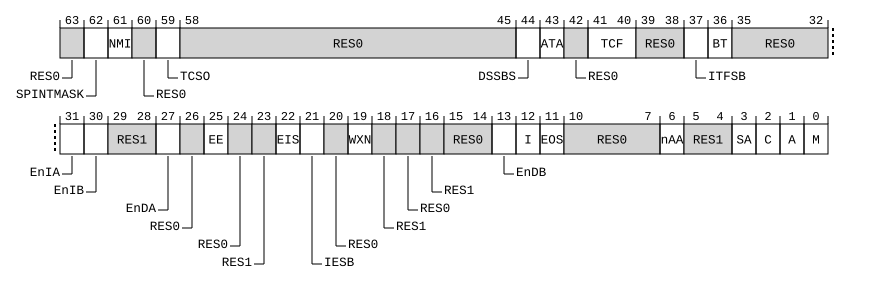

# ​D24.2.176 SCTLR_EL3, System Control Register (EL3)

Source: <https://developer.arm.com/documentation/ddi0487/mc/-Part-D-The-AArch64-System-Level-Architecture/-Chapter-D24-AArch64-System-Register-Descriptions/-D24-2-General-system-control-registers/-D24-2-176-SCTLR-EL3--System-Control-Register--EL3->

##### D24.2.176 SCTLR\_EL3, System Control Register (EL3)

The SCTLR\_EL3 characteristics are:

Purpose
:   Provides top-level control of the system, including its memory system, at EL3.

Configuration
:   This register is present only when EL3 is implemented and FEAT\_AA64 is implemented. Otherwise, direct accesses to SCTLR\_EL3 are UNDEFINED.

Attributes
:   SCTLR\_EL3 is a 64-bit register.

###### Field descriptions



Bit [63]
:   Reserved, RES0.

SPINTMASK, bit [62]
:   When FEAT\_NMI is implemented:
    :   SP Interrupt Mask enable. When SCTLR\_EL3.NMI is 1, controls whether PSTATE.SP acts as an interrupt mask, and controls the value of PSTATE.ALLINT on taking an exception to EL3.

<table>
 <colgroup>
  <col/>
  <col/>
 </colgroup>
 <thead>
  <tr>
   <th>
    <strong>
     SPINTMASK
    </strong>
   </th>
   <th>
    <strong>
     Meaning
    </strong>
   </th>
  </tr>
 </thead>
 <tbody>
  <tr>
   <td>
    <p>
     <code>
      0b0
     </code>
    </p>
   </td>
   <td>
    <p>
     Does not cause PSTATE.SP to mask interrupts.
    </p>
    <p>
     PSTATE.ALLINT is set to 1 on taking an exception to EL3.
    </p>
   </td>
  </tr>
  <tr>
   <td>
    <p>
     <code>
      0b1
     </code>
    </p>
   </td>
   <td>
    <p>
     When PSTATE.SP is 1 and execution is at EL3, an IRQ or FIQ interrupt that is targeted to EL3 is masked regardless of any indication of Superpriority.
    </p>
    <p>
     PSTATE.ALLINT is set to 0 on taking an exception to EL3.
    </p>
   </td>
  </tr>
 </tbody>
</table>

        The reset behavior of this field is:

        - On a Warm reset, this field resets to an architecturally UNKNOWN value.

    Otherwise:
    :   Reserved, RES0.

NMI, bit [61]
:   When FEAT\_NMI is implemented:
    :   Non-maskable Interrupt enable.

<table>
 <colgroup>
  <col/>
  <col/>
 </colgroup>
 <thead>
  <tr>
   <th>
    <strong>
     NMI
    </strong>
   </th>
   <th>
    <strong>
     Meaning
    </strong>
   </th>
  </tr>
 </thead>
 <tbody>
  <tr>
   <td>
    <p>
     <code>
      0b0
     </code>
    </p>
   </td>
   <td>
    <p>
     This control does not affect interrupt masking behavior.
    </p>
   </td>
  </tr>
  <tr>
   <td>
    <p>
     <code>
      0b1
     </code>
    </p>
   </td>
   <td>
    <p>
     This control enables all of the following:
    </p>
    <ul>
     <li>
      <p>
       The use of the PSTATE.ALLINT interrupt mask.
      </p>
     </li>
     <li>
      <p>
       IRQ and FIQ interrupts to have Superpriority as an additional attribute.
      </p>
     </li>
     <li>
      <p>
       PSTATE.SP to be used as an interrupt mask.
      </p>
     </li>
    </ul>
   </td>
  </tr>
 </tbody>
</table>

        The reset behavior of this field is:

        - On a Warm reset:
          - When the highest implemented Exception level is EL3, this field resets to `'0'`.

    Otherwise:
    :   Reserved, RES0.

Bit [60]
:   Reserved, RES0.

TCSO, bit [59]
:   When FEAT\_MTE\_STORE\_ONLY is implemented:
    :   Tag Checking Store Only.

<table>
 <colgroup>
  <col/>
  <col/>
 </colgroup>
 <thead>
  <tr>
   <th>
    <strong>
     TCSO
    </strong>
   </th>
   <th>
    <strong>
     Meaning
    </strong>
   </th>
  </tr>
 </thead>
 <tbody>
  <tr>
   <td>
    <p>
     <code>
      0b0
     </code>
    </p>
   </td>
   <td>
    <p>
     This field has no effect on Tag checking.
    </p>
   </td>
  </tr>
  <tr>
   <td>
    <p>
     <code>
      0b1
     </code>
    </p>
   </td>
   <td>
    <p>
     Explicit Memory Read Effects generated by instructions executed at EL3 are Tag Unchecked.
    </p>
   </td>
  </tr>
 </tbody>
</table>

        The reset behavior of this field is:

        - On a Warm reset, this field resets to an architecturally UNKNOWN value.

    Otherwise:
    :   Reserved, RES0.

Bits [58:45]
:   Reserved, RES0.

DSSBS, bit [44]
:   When FEAT\_SSBS is implemented:
    :   Default PSTATE.SSBS value on Exception Entry.

<table>
 <colgroup>
  <col/>
  <col/>
 </colgroup>
 <thead>
  <tr>
   <th>
    <strong>
     DSSBS
    </strong>
   </th>
   <th>
    <strong>
     Meaning
    </strong>
   </th>
  </tr>
 </thead>
 <tbody>
  <tr>
   <td>
    <p>
     <code>
      0b0
     </code>
    </p>
   </td>
   <td>
    <p>
     PSTATE.SSBS is set to 0 on an exception to EL3.
    </p>
   </td>
  </tr>
  <tr>
   <td>
    <p>
     <code>
      0b1
     </code>
    </p>
   </td>
   <td>
    <p>
     PSTATE.SSBS is set to 1 on an exception to EL3.
    </p>
   </td>
  </tr>
 </tbody>
</table>

        The reset behavior of this field is:

        - On a Warm reset, this field resets to an IMPLEMENTATION DEFINED value.

    Otherwise:
    :   Reserved, RES0.

ATA, bit [43]
:   When FEAT\_MTE2 is implemented:
    :   Allocation Tag Access at EL3.

        Controls use of Memory tagging at EL3.

<table>
 <colgroup>
  <col/>
  <col/>
 </colgroup>
 <thead>
  <tr>
   <th>
    <strong>
     ATA
    </strong>
   </th>
   <th>
    <strong>
     Meaning
    </strong>
   </th>
  </tr>
 </thead>
 <tbody>
  <tr>
   <td>
    <p>
     <code>
      0b0
     </code>
    </p>
   </td>
   <td>
    <p>
     Use of Memory tagging is disabled at EL3.
    </p>
   </td>
  </tr>
  <tr>
   <td>
    <p>
     <code>
      0b1
     </code>
    </p>
   </td>
   <td>
    <p>
     Use of Memory tagging is enabled at EL3.
    </p>
   </td>
  </tr>
 </tbody>
</table>

        The reset behavior of this field is:

        - On a Warm reset, this field resets to an architecturally UNKNOWN value.

    Otherwise:
    :   Reserved, RES0.

Bit [42]
:   Reserved, RES0.

TCF, bits [41:40]
:   When FEAT\_MTE2 is implemented:
    :   Tag Check Fault at EL3. Controls the effect of Tag Check Faults due to Loads and Stores at EL3.

<table>
 <colgroup>
  <col/>
  <col/>
  <col/>
 </colgroup>
 <thead>
  <tr>
   <th>
    <strong>
     TCF
    </strong>
   </th>
   <th>
    <strong>
     Meaning
    </strong>
   </th>
   <th>
    <strong>
     Applies when
    </strong>
   </th>
  </tr>
 </thead>
 <tbody>
  <tr>
   <td>
    <p>
     <code>
      0b00
     </code>
    </p>
   </td>
   <td>
    <p>
     Tag Check Faults have no effect on the PE.
    </p>
   </td>
   <td>
   </td>
  </tr>
  <tr>
   <td>
    <p>
     <code>
      0b01
     </code>
    </p>
   </td>
   <td>
    <p>
     Tag Check Faults cause a synchronous exception.
    </p>
   </td>
   <td>
   </td>
  </tr>
  <tr>
   <td>
    <p>
     <code>
      0b10
     </code>
    </p>
   </td>
   <td>
    <p>
     Tag Check Faults are asynchronously accumulated.
    </p>
   </td>
   <td>
   </td>
  </tr>
  <tr>
   <td>
    <p>
     <code>
      0b11
     </code>
    </p>
   </td>
   <td>
    <p>
     Tag Check Faults cause a synchronous exception on reads, and are asynchronously accumulated on writes.
    </p>
   </td>
   <td>
    <p>
     FEAT_MTE_ASYM_FAULT is implemented
    </p>
   </td>
  </tr>
 </tbody>
</table>

        If FEAT\_MTE3 is not implemented, the value `0b11` is reserved.

        The reset behavior of this field is:

        - On a Warm reset, this field resets to an architecturally UNKNOWN value.

    Otherwise:
    :   Reserved, RES0.

Bits [39:38]
:   Reserved, RES0.

ITFSB, bit [37]
:   When FEAT\_MTE\_ASYNC is implemented:
    :   When synchronous exceptions are not being generated by Tag Check Faults, this field controls whether on exception entry into EL3, all Tag Check Faults due to instructions executed before exception entry, that are reported asynchronously, are synchronized into [TFSRE0\_EL1](/documentation/ddi0487/mc/-Part-D-The-AArch64-System-Level-Architecture/-Chapter-D24-AArch64-System-Register-Descriptions/-D24-2-General-system-control-registers/-D24-2-201-TFSRE0-EL1--Tag-Fault-Status-Register--EL0--?lang=en#reg_aarch64_tfsre0_el1) and [TFSR\_ELx](/documentation/ddi0487/mc/-Part-K-Appendixes/-Appendix-K14-Registers-Index/-K14-1-Introduction-and-register-disambiguation/-K14-1-2-Register-name-disambiguation-by-Exception-level?lang=en#tfsr_elx) registers.

<table>
 <colgroup>
  <col/>
  <col/>
 </colgroup>
 <thead>
  <tr>
   <th>
    <strong>
     ITFSB
    </strong>
   </th>
   <th>
    <strong>
     Meaning
    </strong>
   </th>
  </tr>
 </thead>
 <tbody>
  <tr>
   <td>
    <p>
     <code>
      0b0
     </code>
    </p>
   </td>
   <td>
    <p>
     Tag Check Faults are not synchronized on entry to EL3.
    </p>
   </td>
  </tr>
  <tr>
   <td>
    <p>
     <code>
      0b1
     </code>
    </p>
   </td>
   <td>
    <p>
     Tag Check Faults are synchronized on entry to EL3.
    </p>
   </td>
  </tr>
 </tbody>
</table>

        The reset behavior of this field is:

        - On a Warm reset, this field resets to an architecturally UNKNOWN value.

    Otherwise:
    :   Reserved, RES0.

BT, bit [36]
:   When FEAT\_BTI is implemented:
    :   Indicates the Branch Type compatibility of the implicit BTI behavior for the following instructions at EL3:

        - `PACIASP`.
        - `PACIBSP`.
        - If [FEAT\_PAuth\_LR](/documentation/ddi0487/mc/-Part-A-Arm-Architecture-Introduction-and-Overview/-Chapter-A2-A-profile-Architecture-Extensions/-A2-3-Armv9-A-architecture-extensions/-A2-3-6-The-Armv9-5-architecture-extension?lang=en#feat_feat_pauth_lr) is implemented, `PACIASPPC`.
        - If [FEAT\_PAuth\_LR](/documentation/ddi0487/mc/-Part-A-Arm-Architecture-Introduction-and-Overview/-Chapter-A2-A-profile-Architecture-Extensions/-A2-3-Armv9-A-architecture-extensions/-A2-3-6-The-Armv9-5-architecture-extension?lang=en#feat_feat_pauth_lr) is implemented, `PACIBSPPC`.

<table>
 <colgroup>
  <col/>
  <col/>
 </colgroup>
 <thead>
  <tr>
   <th>
    <strong>
     BT
    </strong>
   </th>
   <th>
    <strong>
     Meaning
    </strong>
   </th>
  </tr>
 </thead>
 <tbody>
  <tr>
   <td>
    <p>
     <code>
      0b0
     </code>
    </p>
   </td>
   <td>
    <p>
     When the PE is executing at EL3, when the specified instructions have an implicit BTI behavior, they are compatible with the same BTYPE values as BTI.jc.
    </p>
   </td>
  </tr>
  <tr>
   <td>
    <p>
     <code>
      0b1
     </code>
    </p>
   </td>
   <td>
    <p>
     When the PE is executing at EL3, when the specified instructions have an implicit BTI behavior, they are compatible with the same BTYPE values as BTI.c.
    </p>
   </td>
  </tr>
 </tbody>
</table>

        The reset behavior of this field is:

        - On a Warm reset, this field resets to an architecturally UNKNOWN value.

    Otherwise:
    :   Reserved, RES0.

Bits [35:32]
:   Reserved, RES0.

EnIA, bit [31]
:   When FEAT\_PAuth is implemented:
    :   Controls enabling of pointer authentication of instruction addresses, using the APIAKey\_EL1 key, in the EL3 translation regime.

        Possible values of this bit are:

<table>
 <colgroup>
  <col/>
  <col/>
 </colgroup>
 <thead>
  <tr>
   <th>
    <strong>
     EnIA
    </strong>
   </th>
   <th>
    <strong>
     Meaning
    </strong>
   </th>
  </tr>
 </thead>
 <tbody>
  <tr>
   <td>
    <p>
     <code>
      0b0
     </code>
    </p>
   </td>
   <td>
    <p>
     Pointer authentication of instruction addresses, using the APIAKey_EL1 key, is not enabled.
    </p>
   </td>
  </tr>
  <tr>
   <td>
    <p>
     <code>
      0b1
     </code>
    </p>
   </td>
   <td>
    <p>
     Pointer authentication of instruction addresses, using the APIAKey_EL1 key, is enabled.
    </p>
   </td>
  </tr>
 </tbody>
</table>

        > #### Note
        >
        > This field controls the behavior of the `AddPACIA()` and `AuthIA()` pseudocode functions. Specifically, when the field is 1, `AddPACIA()` returns a copy of a pointer to which a pointer authentication code has been added, and `AuthIA()` returns an authenticated copy of a pointer. When the field is 0, both of these functions are NOP.

        The reset behavior of this field is:

        - On a Warm reset, this field resets to an architecturally UNKNOWN value.

    Otherwise:
    :   Reserved, RES0.

EnIB, bit [30]
:   When FEAT\_PAuth is implemented:
    :   Controls enabling of pointer authentication of instruction addresses, using the APIBKey\_EL1 key, in the EL3 translation regime.

        Possible values of this bit are:

<table>
 <colgroup>
  <col/>
  <col/>
 </colgroup>
 <thead>
  <tr>
   <th>
    <strong>
     EnIB
    </strong>
   </th>
   <th>
    <strong>
     Meaning
    </strong>
   </th>
  </tr>
 </thead>
 <tbody>
  <tr>
   <td>
    <p>
     <code>
      0b0
     </code>
    </p>
   </td>
   <td>
    <p>
     Pointer authentication of instruction addresses, using the APIBKey_EL1 key, is not enabled.
    </p>
   </td>
  </tr>
  <tr>
   <td>
    <p>
     <code>
      0b1
     </code>
    </p>
   </td>
   <td>
    <p>
     Pointer authentication of instruction addresses, using the APIBKey_EL1 key, is enabled.
    </p>
   </td>
  </tr>
 </tbody>
</table>

        > #### Note
        >
        > This field controls the behavior of the `AddPACIB()` and `AuthIB()` pseudocode functions. Specifically, when the field is 1, `AddPACIB()` returns a copy of a pointer to which a pointer authentication code has been added, and `AuthIB()` returns an authenticated copy of a pointer. When the field is 0, both of these functions are NOP.

        The reset behavior of this field is:

        - On a Warm reset, this field resets to an architecturally UNKNOWN value.

    Otherwise:
    :   Reserved, RES0.

Bits [29:28]
:   Reserved, RES1.

EnDA, bit [27]
:   When FEAT\_PAuth is implemented:
    :   Controls enabling of pointer authentication of instruction addresses, using the APDAKey\_EL1 key, in the EL3 translation regime.

<table>
 <colgroup>
  <col/>
  <col/>
 </colgroup>
 <thead>
  <tr>
   <th>
    <strong>
     EnDA
    </strong>
   </th>
   <th>
    <strong>
     Meaning
    </strong>
   </th>
  </tr>
 </thead>
 <tbody>
  <tr>
   <td>
    <p>
     <code>
      0b0
     </code>
    </p>
   </td>
   <td>
    <p>
     Pointer authentication of data addresses, using the APDAKey_EL1 key, is not enabled.
    </p>
   </td>
  </tr>
  <tr>
   <td>
    <p>
     <code>
      0b1
     </code>
    </p>
   </td>
   <td>
    <p>
     Pointer authentication of data addresses, using the APDAKey_EL1 key, is enabled.
    </p>
   </td>
  </tr>
 </tbody>
</table>

        > #### Note
        >
        > This field controls the behavior of the `AddPACDA()` and `AuthDA()` pseudocode functions. Specifically, when the field is 1, `AddPACDA()` returns a copy of a pointer to which a pointer authentication code has been added, and `AuthDA()` returns an authenticated copy of a pointer. When the field is 0, both of these functions are NOP.

        The reset behavior of this field is:

        - On a Warm reset, this field resets to an architecturally UNKNOWN value.

    Otherwise:
    :   Reserved, RES0.

Bit [26]
:   Reserved, RES0.

EE, bit [25]
:   When FEAT\_MixedEnd is implemented:
    :   Endianness of data accesses at EL3, and stage 1 translation table walks in the EL3 translation regime.

<table>
 <colgroup>
  <col/>
  <col/>
 </colgroup>
 <thead>
  <tr>
   <th>
    <strong>
     EE
    </strong>
   </th>
   <th>
    <strong>
     Meaning
    </strong>
   </th>
  </tr>
 </thead>
 <tbody>
  <tr>
   <td>
    <p>
     <code>
      0b0
     </code>
    </p>
   </td>
   <td>
    <p>
     Explicit data accesses at EL3, and stage 1 translation table walks in the EL3 translation regime are little-endian.
    </p>
   </td>
  </tr>
  <tr>
   <td>
    <p>
     <code>
      0b1
     </code>
    </p>
   </td>
   <td>
    <p>
     Explicit data accesses at EL3, and stage 1 translation table walks in the EL3 translation regime are big-endian.
    </p>
   </td>
  </tr>
 </tbody>
</table>

        The EE bit is permitted to be cached in a TLB.

        The reset behavior of this field is:

        - On a Warm reset, this field resets to an IMPLEMENTATION DEFINED value.

    When FEAT\_BigEnd is implemented:
    :   Explicit data accesses at EL1, and stage 1 translation table walks in the EL1&0 translation regime are big-endian.

        Reserved, RES1.

    Otherwise:
    :   Explicit data accesses at EL1, and stage 1 translation table walks in the EL1&0 translation regime are little-endian.

        Reserved, RES0.

Bit [24]
:   Reserved, RES0.

Bit [23]
:   Reserved, RES1.

EIS, bit [22]
:   When FEAT\_ExS is implemented:
    :   Exception Entry is a context synchronization event.

<table>
 <colgroup>
  <col/>
  <col/>
 </colgroup>
 <thead>
  <tr>
   <th>
    <strong>
     EIS
    </strong>
   </th>
   <th>
    <strong>
     Meaning
    </strong>
   </th>
  </tr>
 </thead>
 <tbody>
  <tr>
   <td>
    <p>
     <code>
      0b0
     </code>
    </p>
   </td>
   <td>
    <p>
     The taking of an exception to EL3 is not a context synchronization event.
    </p>
   </td>
  </tr>
  <tr>
   <td>
    <p>
     <code>
      0b1
     </code>
    </p>
   </td>
   <td>
    <p>
     The taking of an exception to EL3 is a context synchronization event.
    </p>
   </td>
  </tr>
 </tbody>
</table>

        If SCTLR\_EL3.EIS is set to 0:

        - Indirect writes to [ESR\_EL3](/documentation/ddi0487/mc/-Part-D-The-AArch64-System-Level-Architecture/-Chapter-D24-AArch64-System-Register-Descriptions/-D24-2-General-system-control-registers/-D24-2-46-ESR-EL3--Exception-Syndrome-Register--EL3-?lang=en#reg_aarch64_esr_el3), [FAR\_EL3](/documentation/ddi0487/mc/-Part-D-The-AArch64-System-Level-Architecture/-Chapter-D24-AArch64-System-Register-Descriptions/-D24-2-General-system-control-registers/-D24-2-49-FAR-EL3--Fault-Address-Register--EL3-?lang=en#reg_aarch64_far_el3), [SPSR\_EL3](/documentation/ddi0487/mc/-Part-C-The-AArch64-Instruction-Set/-Chapter-C5-The-A64-System-Instruction-Class/-C5-2-Special-purpose-registers/-C5-2-23-SPSR-EL3--Saved-Program-Status-Register--EL3-?lang=en#reg_aarch64_spsr_el3), [ELR\_EL3](/documentation/ddi0487/mc/-Part-C-The-AArch64-Instruction-Set/-Chapter-C5-The-A64-System-Instruction-Class/-C5-2-Special-purpose-registers/-C5-2-7-ELR-EL3--Exception-Link-Register--EL3-?lang=en#reg_aarch64_elr_el3) are synchronized on exception entry to EL3, so that a direct read of the register after exception entry sees the indirectly written value caused by the exception entry.
        - Memory transactions, including instruction fetches, from an Exception level always use the translation resources associated with that translation regime.
        - Exception Catch debug events are synchronous debug events.
        - DCPS\* and DRPS instructions are context synchronization events.
        - Some exception entries reported are not considered IFBEs per the memory model.

        The following are not affected by the value of SCTLR\_EL3.EIS:

        - Changes to the PSTATE information on entry to EL3.
        - Behavior of accessing the banked copies of the stack pointer using the SP register name for loads, stores and data processing instructions.
        - The memory model requirement for exception entry to generate an Instruction Fetch Barrier Effect for some exception entries. See [Basic definitions](/documentation/ddi0487/mc/-Part-B-The-AArch64-Application-Level-Architecture/-Chapter-B2-The-AArch64-Application-Level-Memory-Model/-B2-3-Ordering-requirements-defined-by-the-formal-concurrency-model/-B2-3-1-Basic-definitions?lang=en#beiciieg) for the list of exception entries.
        - Exit from Debug state.

        The reset behavior of this field is:

        - On a Warm reset, this field resets to an architecturally UNKNOWN value.

    Otherwise:
    :   Reserved, RES1.

IESB, bit [21]
:   When FEAT\_IESB is implemented:
    :   Implicit Error Synchronization event enable.

<table>
 <colgroup>
  <col/>
  <col/>
 </colgroup>
 <thead>
  <tr>
   <th>
    <strong>
     IESB
    </strong>
   </th>
   <th>
    <strong>
     Meaning
    </strong>
   </th>
  </tr>
 </thead>
 <tbody>
  <tr>
   <td>
    <p>
     <code>
      0b0
     </code>
    </p>
   </td>
   <td>
    <p>
     Disabled.
    </p>
   </td>
  </tr>
  <tr>
   <td>
    <p>
     <code>
      0b1
     </code>
    </p>
   </td>
   <td>
    <p>
     An implicit error synchronization event is added:
    </p>
    <ul>
     <li>
      <p>
       At each exception taken to EL3.
      </p>
     </li>
     <li>
      <p>
       Before the operational pseudocode of each Exception Return instruction executed at EL3.
      </p>
     </li>
    </ul>
   </td>
  </tr>
 </tbody>
</table>

        The value of this field is ignored in Debug state and treated as zero.

        When [FEAT\_DoubleFault](/documentation/ddi0487/mc/-Part-A-Arm-Architecture-Introduction-and-Overview/-Chapter-A2-A-profile-Architecture-Extensions/-A2-2-Armv8-A-architecture-extensions/-A2-2-5-The-Armv8-4-architecture-extension?lang=en#feat_feat_doublefault) is implemented, the PE is in Non-debug state, and the Effective value of [SCR\_EL3](/documentation/ddi0487/mc/-Part-D-The-AArch64-System-Level-Architecture/-Chapter-D24-AArch64-System-Register-Descriptions/-D24-2-General-system-control-registers/-D24-2-168-SCR-EL3--Secure-Configuration-Register?lang=en#reg_aarch64_scr_el3).NMEA is 1, this field is ignored and its Effective value is 1.

        The reset behavior of this field is:

        - On a Warm reset, this field resets to an architecturally UNKNOWN value.

    Otherwise:
    :   Reserved, RES0.

Bit [20]
:   Reserved, RES0.

WXN, bit [19]
:   Write permission implies XN (Execute-never). For the EL3 translation regime, this bit can force all memory regions that are writable to be treated as XN.

<table>
 <colgroup>
  <col/>
  <col/>
 </colgroup>
 <thead>
  <tr>
   <th>
    <strong>
     WXN
    </strong>
   </th>
   <th>
    <strong>
     Meaning
    </strong>
   </th>
  </tr>
 </thead>
 <tbody>
  <tr>
   <td>
    <p>
     <code>
      0b0
     </code>
    </p>
   </td>
   <td>
    <p>
     This control has no effect on memory access permissions.
    </p>
   </td>
  </tr>
  <tr>
   <td>
    <p>
     <code>
      0b1
     </code>
    </p>
   </td>
   <td>
    <p>
     Any region that is writable in the EL3 translation regime is forced to XN for accesses from software executing at EL3.
    </p>
   </td>
  </tr>
 </tbody>
</table>

    This bit applies only when SCTLR\_EL3.M bit is set.

    The WXN bit is permitted to be cached in a TLB.

    This field is RES0 if [TCR\_EL3](/documentation/ddi0487/mc/-Part-D-The-AArch64-System-Level-Architecture/-Chapter-D24-AArch64-System-Register-Descriptions/-D24-2-General-system-control-registers/-D24-2-195-TCR-EL3--Translation-Control-Register--EL3-?lang=en#reg_aarch64_tcr_el3).PIE is 1.

    The reset behavior of this field is:

    - On a Warm reset, this field resets to an architecturally UNKNOWN value.

Bit [18]
:   Reserved, RES1.

Bit [17]
:   Reserved, RES0.

Bit [16]
:   Reserved, RES1.

Bits [15:14]
:   Reserved, RES0.

EnDB, bit [13]
:   When FEAT\_PAuth is implemented:
    :   Controls enabling of pointer authentication of instruction addresses, using the APDBKey\_EL1 key, in the EL3 translation regime.

<table>
 <colgroup>
  <col/>
  <col/>
 </colgroup>
 <thead>
  <tr>
   <th>
    <strong>
     EnDB
    </strong>
   </th>
   <th>
    <strong>
     Meaning
    </strong>
   </th>
  </tr>
 </thead>
 <tbody>
  <tr>
   <td>
    <p>
     <code>
      0b0
     </code>
    </p>
   </td>
   <td>
    <p>
     Pointer authentication of data addresses, using the APDBKey_EL1 key, is not enabled.
    </p>
   </td>
  </tr>
  <tr>
   <td>
    <p>
     <code>
      0b1
     </code>
    </p>
   </td>
   <td>
    <p>
     Pointer authentication of data addresses, using the APDBKey_EL1 key, is enabled.
    </p>
   </td>
  </tr>
 </tbody>
</table>

        > #### Note
        >
        > This field controls the behavior of the `AddPACDB()` and `AuthDB()` pseudocode functions. Specifically, when the field is 1, `AddPACDB()` returns a copy of a pointer to which a pointer authentication code has been added, and `AuthDB()` returns an authenticated copy of a pointer. When the field is 0, both of these functions are NOP.

        The reset behavior of this field is:

        - On a Warm reset, this field resets to an architecturally UNKNOWN value.

    Otherwise:
    :   Reserved, RES0.

I, bit [12]
:   Instruction access Cacheability control, for accesses at EL3:

<table>
 <colgroup>
  <col/>
  <col/>
 </colgroup>
 <thead>
  <tr>
   <th>
    <strong>
     I
    </strong>
   </th>
   <th>
    <strong>
     Meaning
    </strong>
   </th>
  </tr>
 </thead>
 <tbody>
  <tr>
   <td>
    <p>
     <code>
      0b0
     </code>
    </p>
   </td>
   <td>
    <p>
     All instruction access to Normal memory from EL3 are Non-cacheable for all levels of instruction and unified cache.
    </p>
    <p>
     If the value of SCTLR_EL3.M is 0, instruction accesses from stage 1 of the EL3 translation regime are to Normal, Outer Shareable, Inner Non-cacheable, Outer Non-cacheable memory.
    </p>
   </td>
  </tr>
  <tr>
   <td>
    <p>
     <code>
      0b1
     </code>
    </p>
   </td>
   <td>
    <p>
     This control has no effect on the Cacheability of instruction access to Normal memory from EL3.
    </p>
    <p>
     If the value of SCTLR_EL3.M is 0, instruction accesses from stage 1 of the EL3 translation regime are to Normal, Outer Shareable, Inner Write-Through, Outer Write-Through memory.
    </p>
   </td>
  </tr>
 </tbody>
</table>

    This bit has no effect on the EL1&0, EL2, or EL2&0 translation regimes.

    The reset behavior of this field is:

    - On a Warm reset:
      - When the highest implemented Exception level is EL3, this field resets to `'0'`.

EOS, bit [11]
:   When FEAT\_ExS is implemented:
    :   Exception Exit is a context synchronization event.

<table>
 <colgroup>
  <col/>
  <col/>
 </colgroup>
 <thead>
  <tr>
   <th>
    <strong>
     EOS
    </strong>
   </th>
   <th>
    <strong>
     Meaning
    </strong>
   </th>
  </tr>
 </thead>
 <tbody>
  <tr>
   <td>
    <p>
     <code>
      0b0
     </code>
    </p>
   </td>
   <td>
    <p>
     An exception return from EL3 is not a context synchronization event
    </p>
   </td>
  </tr>
  <tr>
   <td>
    <p>
     <code>
      0b1
     </code>
    </p>
   </td>
   <td>
    <p>
     An exception return from EL3 is a context synchronization event
    </p>
   </td>
  </tr>
 </tbody>
</table>

        If SCTLR\_EL3.EOS is set to 0:

        - Memory transactions, including instruction fetches, from an Exception level always use the translation resources associated with that translation regime.
        - Exception Catch debug events are synchronous debug events.
        - DCPS\* and DRPS instructions are context synchronization events.

        The following are not affected by the value of SCTLR\_EL3.EOS:

        - The indirect write of the PSTATE and PC values from [SPSR\_EL3](/documentation/ddi0487/mc/-Part-C-The-AArch64-Instruction-Set/-Chapter-C5-The-A64-System-Instruction-Class/-C5-2-Special-purpose-registers/-C5-2-23-SPSR-EL3--Saved-Program-Status-Register--EL3-?lang=en#reg_aarch64_spsr_el3) and [ELR\_EL3](/documentation/ddi0487/mc/-Part-C-The-AArch64-Instruction-Set/-Chapter-C5-The-A64-System-Instruction-Class/-C5-2-Special-purpose-registers/-C5-2-7-ELR-EL3--Exception-Link-Register--EL3-?lang=en#reg_aarch64_elr_el3) on exception return is synchronized.
        - If the PE enters Debug state before the first instruction after an Exception return from EL3 to Non-secure state, any pending Halting debug event completes execution.
        - The GIC behavior that allocates interrupts to FIQ or IRQ changes simultaneously with leaving the EL3 Exception level.
        - Behavior of accessing the banked copies of the stack pointer using the SP register name for loads, stores and data processing instructions.
        - Exit from Debug state.

        The reset behavior of this field is:

        - On a Warm reset, this field resets to an architecturally UNKNOWN value.

    Otherwise:
    :   Reserved, RES1.

Bits [10:7]
:   Reserved, RES0.

nAA, bit [6]
:   When FEAT\_LSE2 is implemented:
    :   Non-aligned access. This bit controls generation of Alignment faults at EL3 under certain conditions.

        The following instructions generate an Alignment fault if all bytes being accessed are not within a single naturally aligned 16-byte quantity, for access:

        - LDAPR, LDAPRH, LDAPUR, LDAPURH, LDAPURSH, LDAPURSW, LDAR, LDARH, LDLAR, LDLARH.
        - STLLR, STLLRH, STLR, STLRH, STLUR, and STLURH.
        - If [FEAT\_LRCPC3](/documentation/ddi0487/mc/-Part-A-Arm-Architecture-Introduction-and-Overview/-Chapter-A2-A-profile-Architecture-Extensions/-A2-2-Armv8-A-architecture-extensions/-A2-2-10-The-Armv8-9-architecture-extension?lang=en#feat_feat_lrcpc3) is implemented, the post index versions of LDAPR and the pre index versions of STLR.
        - If [FEAT\_LRCPC3](/documentation/ddi0487/mc/-Part-A-Arm-Architecture-Introduction-and-Overview/-Chapter-A2-A-profile-Architecture-Extensions/-A2-2-Armv8-A-architecture-extensions/-A2-2-10-The-Armv8-9-architecture-extension?lang=en#feat_feat_lrcpc3) and Advanced SIMD and floating-point instructions are implemented, LDAPUR (SIMD&FP), LDAP1 (SIMD&FP), STLUR (SIMD&FP), and STL1 (SIMD&FP).

        If [FEAT\_LRCPC3](/documentation/ddi0487/mc/-Part-A-Arm-Architecture-Introduction-and-Overview/-Chapter-A2-A-profile-Architecture-Extensions/-A2-2-Armv8-A-architecture-extensions/-A2-2-10-The-Armv8-9-architecture-extension?lang=en#feat_feat_lrcpc3) is implemented, the following instructions generate an Alignment fault if all bytes being accessed for a single register are not within a single naturally aligned 16-byte quantity, for access:

        - LDIAPP, STILP.

<table>
 <colgroup>
  <col/>
  <col/>
 </colgroup>
 <thead>
  <tr>
   <th>
    <strong>
     nAA
    </strong>
   </th>
   <th>
    <strong>
     Meaning
    </strong>
   </th>
  </tr>
 </thead>
 <tbody>
  <tr>
   <td>
    <p>
     <code>
      0b0
     </code>
    </p>
   </td>
   <td>
    <p>
     Unaligned accesses by the specified instructions generate an Alignment fault.
    </p>
   </td>
  </tr>
  <tr>
   <td>
    <p>
     <code>
      0b1
     </code>
    </p>
   </td>
   <td>
    <p>
     Unaligned accesses by the specified instructions do not generate an Alignment fault.
    </p>
   </td>
  </tr>
 </tbody>
</table>

        The reset behavior of this field is:

        - On a Warm reset, this field resets to an architecturally UNKNOWN value.

    Otherwise:
    :   Reserved, RES0.

Bits [5:4]
:   Reserved, RES1.

SA, bit [3]
:   SP Alignment check enable. When set to 1, if a load or store instruction executed at EL3 uses the SP as the base address and the SP is not aligned to a 16-byte boundary, then a SP alignment fault exception is generated. For more information, see [‘SP alignment checking’](/documentation/ddi0487/mc/-Part-D-The-AArch64-System-Level-Architecture/-Chapter-D1-The-AArch64-System-Level-Programmers--Model/-D1-4-Exceptions/-D1-4-10-Program-Counter-and-stack-pointer-alignment?lang=en#mdsec_sp_alignment_checking).

    The reset behavior of this field is:

    - On a Warm reset, this field resets to an architecturally UNKNOWN value.

C, bit [2]
:   Cacheability control, for data accesses.

<table>
 <colgroup>
  <col/>
  <col/>
 </colgroup>
 <thead>
  <tr>
   <th>
    <strong>
     C
    </strong>
   </th>
   <th>
    <strong>
     Meaning
    </strong>
   </th>
  </tr>
 </thead>
 <tbody>
  <tr>
   <td>
    <p>
     <code>
      0b0
     </code>
    </p>
   </td>
   <td>
    <p>
     All data access to Normal memory from EL3, and all Normal memory accesses to the EL3 translation tables, are Non-cacheable for all levels of data and unified cache.
    </p>
   </td>
  </tr>
  <tr>
   <td>
    <p>
     <code>
      0b1
     </code>
    </p>
   </td>
   <td>
    <p>
     This control has no effect on the Cacheability of:
    </p>
    <ul>
     <li>
      <p>
       Data access to Normal memory from EL3.
      </p>
     </li>
     <li>
      <p>
       Normal memory accesses to the EL3 translation tables.
      </p>
     </li>
    </ul>
   </td>
  </tr>
 </tbody>
</table>

    This bit has no effect on the EL1&0, EL2, or EL2&0 translation regimes.

    The reset behavior of this field is:

    - On a Warm reset:
      - When the highest implemented Exception level is EL3, this field resets to `'0'`.

A, bit [1]
:   Alignment check enable. This is the enable bit for Alignment fault checking at EL3.

<table>
 <colgroup>
  <col/>
  <col/>
 </colgroup>
 <thead>
  <tr>
   <th>
    <strong>
     A
    </strong>
   </th>
   <th>
    <strong>
     Meaning
    </strong>
   </th>
  </tr>
 </thead>
 <tbody>
  <tr>
   <td>
    <p>
     <code>
      0b0
     </code>
    </p>
   </td>
   <td>
    <p>
     Alignment fault checking is disabled when executing at EL3.
    </p>
    <p>
     Alignment checks on some instructions are not disabled by this control. For more information, see
     <a class="document-topic" document-topic-path="/ddi0487/mc/-Part-B-The-AArch64-Application-Level-Architecture/-Chapter-B2-The-AArch64-Application-Level-Memory-Model/-B2-8-Alignment-support/-B2-8-2-Alignment-of-data-accesses?lang=en#chdffegj" href="/documentation/ddi0487/mc/-Part-B-The-AArch64-Application-Level-Architecture/-Chapter-B2-The-AArch64-Application-Level-Memory-Model/-B2-8-Alignment-support/-B2-8-2-Alignment-of-data-accesses?lang=en#chdffegj">
      &lsquo;Alignment of data accesses&rsquo;
     </a>
     .
    </p>
   </td>
  </tr>
  <tr>
   <td>
    <p>
     <code>
      0b1
     </code>
    </p>
   </td>
   <td>
    <p>
     Alignment fault checking is enabled when executing at EL3.
    </p>
    <p>
     All instructions that load or store one or more registers have an alignment check that the address being accessed is aligned to the size of the data element(s) being accessed. If this check fails it causes an Alignment fault, which is taken as a Data Abort exception.
    </p>
   </td>
  </tr>
 </tbody>
</table>

    The reset behavior of this field is:

    - On a Warm reset, this field resets to an architecturally UNKNOWN value.

M, bit [0]
:   MMU enable for EL3 stage 1 address translation. Possible values of this bit are:

<table>
 <colgroup>
  <col/>
  <col/>
 </colgroup>
 <thead>
  <tr>
   <th>
    <strong>
     M
    </strong>
   </th>
   <th>
    <strong>
     Meaning
    </strong>
   </th>
  </tr>
 </thead>
 <tbody>
  <tr>
   <td>
    <p>
     <code>
      0b0
     </code>
    </p>
   </td>
   <td>
    <p>
     EL3 stage 1 address translation disabled.
    </p>
    <p>
     See the SCTLR_EL3.I field for the behavior of instruction accesses to Normal memory.
    </p>
   </td>
  </tr>
  <tr>
   <td>
    <p>
     <code>
      0b1
     </code>
    </p>
   </td>
   <td>
    <p>
     EL3 stage 1 address translation enabled.
    </p>
   </td>
  </tr>
 </tbody>
</table>

    The reset behavior of this field is:

    - On a Warm reset:
      - When the highest implemented Exception level is EL3, this field resets to `'0'`.

###### Accessing SCTLR\_EL3

Accesses to this register use the following encodings in the System register encoding space:

###### `MRS <Xt>, SCTLR_EL3`

<table>
 <colgroup>
  <col/>
  <col/>
  <col/>
  <col/>
  <col/>
 </colgroup>
 <thead>
  <tr>
   <th>
    <strong>
     op0
    </strong>
   </th>
   <th>
    <strong>
     op1
    </strong>
   </th>
   <th>
    <strong>
     CRn
    </strong>
   </th>
   <th>
    <strong>
     CRm
    </strong>
   </th>
   <th>
    <strong>
     op2
    </strong>
   </th>
  </tr>
 </thead>
 <tbody>
  <tr>
   <td>
    <p>
     <code>
      0b11
     </code>
    </p>
   </td>
   <td>
    <p>
     <code>
      0b110
     </code>
    </p>
   </td>
   <td>
    <p>
     <code>
      0b0001
     </code>
    </p>
   </td>
   <td>
    <p>
     <code>
      0b0000
     </code>
    </p>
   </td>
   <td>
    <p>
     <code>
      0b000
     </code>
    </p>
   </td>
  </tr>
 </tbody>
</table>

```
if !(HaveEL(EL3) && IsFeatureImplemented(FEAT_AA64)) then
    Undefined();
elsif PSTATE.EL == EL0 then
    Undefined();
elsif PSTATE.EL == EL1 then
    Undefined();
elsif PSTATE.EL == EL2 then
    Undefined();
elsif PSTATE.EL == EL3 then
    X{64}(t) = SCTLR_EL3();
end;
```

###### `MSR SCTLR_EL3, <Xt>`

<table>
 <colgroup>
  <col/>
  <col/>
  <col/>
  <col/>
  <col/>
 </colgroup>
 <thead>
  <tr>
   <th>
    <strong>
     op0
    </strong>
   </th>
   <th>
    <strong>
     op1
    </strong>
   </th>
   <th>
    <strong>
     CRn
    </strong>
   </th>
   <th>
    <strong>
     CRm
    </strong>
   </th>
   <th>
    <strong>
     op2
    </strong>
   </th>
  </tr>
 </thead>
 <tbody>
  <tr>
   <td>
    <p>
     <code>
      0b11
     </code>
    </p>
   </td>
   <td>
    <p>
     <code>
      0b110
     </code>
    </p>
   </td>
   <td>
    <p>
     <code>
      0b0001
     </code>
    </p>
   </td>
   <td>
    <p>
     <code>
      0b0000
     </code>
    </p>
   </td>
   <td>
    <p>
     <code>
      0b000
     </code>
    </p>
   </td>
  </tr>
 </tbody>
</table>

```
if !(HaveEL(EL3) && IsFeatureImplemented(FEAT_AA64)) then
    Undefined();
elsif PSTATE.EL == EL0 then
    Undefined();
elsif PSTATE.EL == EL1 then
    Undefined();
elsif PSTATE.EL == EL2 then
    Undefined();
elsif PSTATE.EL == EL3 then
    if IsFeatureImplemented(FEAT_FGWTE3) && FGWTE3_EL3().SCTLR_EL3 == '1' then
        AArch64_SystemAccessTrap(EL3, 0x18);
    else
        SCTLR_EL3() = X{64}(t);
    end;
end;
```
