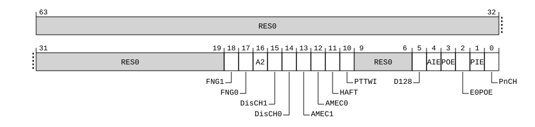

# ​D24.2.190 TCR2_EL2, Extended Translation Control Register (EL2)

Source: <https://developer.arm.com/documentation/ddi0487/mc/-Part-D-The-AArch64-System-Level-Architecture/-Chapter-D24-AArch64-System-Register-Descriptions/-D24-2-General-system-control-registers/-D24-2-190-TCR2-EL2--Extended-Translation-Control-Register--EL2->

##### D24.2.190 TCR2\_EL2, Extended Translation Control Register (EL2)

The TCR2\_EL2 characteristics are:

Purpose
:   The control register for stage 1 of the EL2&0 translation regime.

Configuration
:   If EL2 is not implemented, this register is RES0 from EL3.

    This register is present only when FEAT\_TCR2 is implemented and FEAT\_AA64 is implemented. Otherwise, direct accesses to TCR2\_EL2 are UNDEFINED.

Attributes
:   TCR2\_EL2 is a 64-bit register.

###### Field descriptions

When EffectiveHCR\_EL2\_E2H() == '0':
:   

    Unless stated otherwise, all the bits in TCR2\_EL2 are permitted to be cached in a TLB.

Bits [63:13]
:   Reserved, RES0.

AMEC0, bit [12]
:   When FEAT\_MEC is implemented:
    :   This field controls the enabling of the Alternate MECID translations for the EL2 translation regime.

        TCR2\_EL2.AMEC0 is provided to enable the safe update of [MECID\_A0\_EL2](/documentation/ddi0487/mc/-Part-D-The-AArch64-System-Level-Architecture/-Chapter-D24-AArch64-System-Register-Descriptions/-D24-2-General-system-control-registers/-D24-2-129-MECID-A0-EL2--Alternate-MECID-for-EL2-and-EL2-0-translation-regimes?lang=en#reg_aarch64_mecid_a0_el2), by disabling access and speculation to AMEC==1 Block or Page descriptors during the update.

<table>
 <colgroup>
  <col/>
  <col/>
 </colgroup>
 <thead>
  <tr>
   <th>
    <strong>
     AMEC0
    </strong>
   </th>
   <th>
    <strong>
     Meaning
    </strong>
   </th>
  </tr>
 </thead>
 <tbody>
  <tr>
   <td>
    <p>
     <code>
      0b0
     </code>
    </p>
   </td>
   <td>
    <p>
     Use of a Block or Page descriptor containing AMEC == 1 generates a Translation fault.
    </p>
   </td>
  </tr>
  <tr>
   <td>
    <p>
     <code>
      0b1
     </code>
    </p>
   </td>
   <td>
    <p>
     Accesses translated by a Block or Page descriptor containing AMEC == 1 are associated with the MECID configured in
     <a class="document-topic" document-topic-path="/ddi0487/mc/-Part-D-The-AArch64-System-Level-Architecture/-Chapter-D24-AArch64-System-Register-Descriptions/-D24-2-General-system-control-registers/-D24-2-129-MECID-A0-EL2--Alternate-MECID-for-EL2-and-EL2-0-translation-regimes?lang=en#reg_aarch64_mecid_a0_el2" href="/documentation/ddi0487/mc/-Part-D-The-AArch64-System-Level-Architecture/-Chapter-D24-AArch64-System-Register-Descriptions/-D24-2-General-system-control-registers/-D24-2-129-MECID-A0-EL2--Alternate-MECID-for-EL2-and-EL2-0-translation-regimes?lang=en#reg_aarch64_mecid_a0_el2">
      MECID_A0_EL2
     </a>
     .
    </p>
   </td>
  </tr>
 </tbody>
</table>

        This bit is permitted to be cached in a TLB only if it is 1.

        When EL3 is implemented and [SCR\_EL3](/documentation/ddi0487/mc/-Part-D-The-AArch64-System-Level-Architecture/-Chapter-D24-AArch64-System-Register-Descriptions/-D24-2-General-system-control-registers/-D24-2-168-SCR-EL3--Secure-Configuration-Register?lang=en#reg_aarch64_scr_el3).TCR2En == 0, this field is ignored by the PE and treated as zero.

        When [SCTLR2\_EL2](/documentation/ddi0487/mc/-Part-D-The-AArch64-System-Level-Architecture/-Chapter-D24-AArch64-System-Register-Descriptions/-D24-2-General-system-control-registers/-D24-2-170-SCTLR2-EL2--System-Control-Register--EL2-?lang=en#reg_aarch64_sctlr2_el2).EMEC is 0, this field is ignored by the PE and the bit position of AMEC is RES0 in Block and Page descriptors.

        The reset behavior of this field is:

        - On a Warm reset, this field resets to an architecturally UNKNOWN value.

        Accessing this field has the following behavior:

        - When IsCurrentSecurityState(SS\_Secure), access to this field is RES0.
        - When IsCurrentSecurityState(SS\_NonSecure), access to this field is RES0.

    Otherwise:
    :   Reserved, RES0.

HAFT, bit [11]
:   When FEAT\_HAFT is implemented:
    :   Hardware managed Access Flag for Table descriptors.

        Enables the Hardware managed Access Flag for Table descriptors.

<table>
 <colgroup>
  <col/>
  <col/>
 </colgroup>
 <thead>
  <tr>
   <th>
    <strong>
     HAFT
    </strong>
   </th>
   <th>
    <strong>
     Meaning
    </strong>
   </th>
  </tr>
 </thead>
 <tbody>
  <tr>
   <td>
    <p>
     <code>
      0b0
     </code>
    </p>
   </td>
   <td>
    <p>
     Hardware managed Access Flag for Table descriptors is disabled.
    </p>
   </td>
  </tr>
  <tr>
   <td>
    <p>
     <code>
      0b1
     </code>
    </p>
   </td>
   <td>
    <p>
     Hardware managed Access Flag for Table descriptors is enabled.
    </p>
   </td>
  </tr>
 </tbody>
</table>

        When EL3 is implemented and [SCR\_EL3](/documentation/ddi0487/mc/-Part-D-The-AArch64-System-Level-Architecture/-Chapter-D24-AArch64-System-Register-Descriptions/-D24-2-General-system-control-registers/-D24-2-168-SCR-EL3--Secure-Configuration-Register?lang=en#reg_aarch64_scr_el3).TCR2En == 0, this field is ignored by the PE and treated as zero.

        The reset behavior of this field is:

        - On a Warm reset:
          - When the highest implemented Exception level is EL2, this field resets to `'0'`.
          - Otherwise, this field resets to an architecturally UNKNOWN value.

    Otherwise:
    :   Reserved, RES0.

PTTWI, bit [10]
:   When FEAT\_THE is implemented:
    :   Permit Translation table walk Incoherence.

        Permits RCWS instructions to generate writes that have the Reduced Coherence property.

<table>
 <colgroup>
  <col/>
  <col/>
 </colgroup>
 <thead>
  <tr>
   <th>
    <strong>
     PTTWI
    </strong>
   </th>
   <th>
    <strong>
     Meaning
    </strong>
   </th>
  </tr>
 </thead>
 <tbody>
  <tr>
   <td>
    <p>
     <code>
      0b0
     </code>
    </p>
   </td>
   <td>
    <p>
     Write accesses generated by RCWS at EL2 or EL2&amp;0 do not have the Reduced Coherence property.
    </p>
   </td>
  </tr>
  <tr>
   <td>
    <p>
     <code>
      0b1
     </code>
    </p>
   </td>
   <td>
    <p>
     Write accesses generated by RCWS at EL2 or EL2&amp;0 have the Reduced Coherence property.
    </p>
   </td>
  </tr>
 </tbody>
</table>

        This bit is permitted to be implemented as a read-only bit with a fixed value of 0.

        When EL3 is implemented and [SCR\_EL3](/documentation/ddi0487/mc/-Part-D-The-AArch64-System-Level-Architecture/-Chapter-D24-AArch64-System-Register-Descriptions/-D24-2-General-system-control-registers/-D24-2-168-SCR-EL3--Secure-Configuration-Register?lang=en#reg_aarch64_scr_el3).TCR2En == 0, this field is ignored by the PE and treated as zero.

        The reset behavior of this field is:

        - On a Warm reset:
          - When the highest implemented Exception level is EL2, this field resets to `'0'`.
          - Otherwise, this field resets to an architecturally UNKNOWN value.

    Otherwise:
    :   Reserved, RES0.

Bits [9:5]
:   Reserved, RES0.

AIE, bit [4]
:   When FEAT\_AIE is implemented:
    :   Enable Attribute Indexing Extension.

<table>
 <colgroup>
  <col/>
  <col/>
 </colgroup>
 <thead>
  <tr>
   <th>
    <strong>
     AIE
    </strong>
   </th>
   <th>
    <strong>
     Meaning
    </strong>
   </th>
  </tr>
 </thead>
 <tbody>
  <tr>
   <td>
    <p>
     <code>
      0b0
     </code>
    </p>
   </td>
   <td>
    <p>
     Attribute Indexing Extension Disabled.
    </p>
   </td>
  </tr>
  <tr>
   <td>
    <p>
     <code>
      0b1
     </code>
    </p>
   </td>
   <td>
    <p>
     Attribute Indexing Extension Enabled.
    </p>
   </td>
  </tr>
 </tbody>
</table>

        When EL3 is implemented and [SCR\_EL3](/documentation/ddi0487/mc/-Part-D-The-AArch64-System-Level-Architecture/-Chapter-D24-AArch64-System-Register-Descriptions/-D24-2-General-system-control-registers/-D24-2-168-SCR-EL3--Secure-Configuration-Register?lang=en#reg_aarch64_scr_el3).TCR2En == 0, this field is ignored by the PE and treated as zero.

        The reset behavior of this field is:

        - On a Warm reset:
          - When the highest implemented Exception level is EL2, this field resets to `'0'`.
          - Otherwise, this field resets to an architecturally UNKNOWN value.

    Otherwise:
    :   Reserved, RES0.

POE, bit [3]
:   When FEAT\_S1POE is implemented:
    :   Enables Permission Overlay for EL2 accesses.

<table>
 <colgroup>
  <col/>
  <col/>
 </colgroup>
 <thead>
  <tr>
   <th>
    <strong>
     POE
    </strong>
   </th>
   <th>
    <strong>
     Meaning
    </strong>
   </th>
  </tr>
 </thead>
 <tbody>
  <tr>
   <td>
    <p>
     <code>
      0b0
     </code>
    </p>
   </td>
   <td>
    <p>
     Permission overlay disabled for EL2 access in stage 1 of EL2 translation regime.
    </p>
   </td>
  </tr>
  <tr>
   <td>
    <p>
     <code>
      0b1
     </code>
    </p>
   </td>
   <td>
    <p>
     Permission overlay enabled for EL2 access in stage 1 of EL2 translation regime.
    </p>
   </td>
  </tr>
 </tbody>
</table>

        This bit is not permitted to be cached in a TLB.

        When EL3 is implemented and [SCR\_EL3](/documentation/ddi0487/mc/-Part-D-The-AArch64-System-Level-Architecture/-Chapter-D24-AArch64-System-Register-Descriptions/-D24-2-General-system-control-registers/-D24-2-168-SCR-EL3--Secure-Configuration-Register?lang=en#reg_aarch64_scr_el3).TCR2En == 0, this field is ignored by the PE and treated as zero.

        The reset behavior of this field is:

        - On a Warm reset:
          - When the highest implemented Exception level is EL2, this field resets to `'0'`.
          - Otherwise, this field resets to an architecturally UNKNOWN value.

    Otherwise:
    :   Reserved, RES0.

Bit [2]
:   Reserved, RES0.

PIE, bit [1]
:   When FEAT\_S1PIE is implemented:
    :   Enables usage of Indirect Permission Scheme.

<table>
 <colgroup>
  <col/>
  <col/>
 </colgroup>
 <thead>
  <tr>
   <th>
    <strong>
     PIE
    </strong>
   </th>
   <th>
    <strong>
     Meaning
    </strong>
   </th>
  </tr>
 </thead>
 <tbody>
  <tr>
   <td>
    <p>
     <code>
      0b0
     </code>
    </p>
   </td>
   <td>
    <p>
     Direct permission model.
    </p>
   </td>
  </tr>
  <tr>
   <td>
    <p>
     <code>
      0b1
     </code>
    </p>
   </td>
   <td>
    <p>
     Indirect permission model.
    </p>
   </td>
  </tr>
 </tbody>
</table>

        When EL3 is implemented and [SCR\_EL3](/documentation/ddi0487/mc/-Part-D-The-AArch64-System-Level-Architecture/-Chapter-D24-AArch64-System-Register-Descriptions/-D24-2-General-system-control-registers/-D24-2-168-SCR-EL3--Secure-Configuration-Register?lang=en#reg_aarch64_scr_el3).TCR2En == 0, this field is ignored by the PE and treated as zero.

        The reset behavior of this field is:

        - On a Warm reset:
          - When the highest implemented Exception level is EL2, this field resets to `'0'`.
          - Otherwise, this field resets to an architecturally UNKNOWN value.

    Otherwise:
    :   Reserved, RES0.

PnCH, bit [0]
:   When FEAT\_THE is implemented:
    :   Protected attribute enable. Enables use of bit[52] of stage 1 translation table entries as the Protected bit, for translations using TTBR0\_EL2 when HCR\_EL2.E2H is 0.

<table>
 <colgroup>
  <col/>
  <col/>
 </colgroup>
 <thead>
  <tr>
   <th>
    <strong>
     PnCH
    </strong>
   </th>
   <th>
    <strong>
     Meaning
    </strong>
   </th>
  </tr>
 </thead>
 <tbody>
  <tr>
   <td>
    <p>
     <code>
      0b0
     </code>
    </p>
   </td>
   <td>
    <p>
     For translations using TTBRn_EL2, bit[52] of each stage 1 translation table entry is not the Protected bit.
    </p>
   </td>
  </tr>
  <tr>
   <td>
    <p>
     <code>
      0b1
     </code>
    </p>
   </td>
   <td>
    <p>
     For translations using TTBR0_EL2, bit[52] of each stage 1 translation table entry is the Protected bit.
    </p>
   </td>
  </tr>
 </tbody>
</table>

        If bit[52] is used as the Protected bit, it is not used as the Contiguous bit.

        This field is RES0 when TCR2\_EL2.D128 is 1.

        When EL3 is implemented and [SCR\_EL3](/documentation/ddi0487/mc/-Part-D-The-AArch64-System-Level-Architecture/-Chapter-D24-AArch64-System-Register-Descriptions/-D24-2-General-system-control-registers/-D24-2-168-SCR-EL3--Secure-Configuration-Register?lang=en#reg_aarch64_scr_el3).TCR2En == 0, this field is ignored by the PE and treated as zero.

        The reset behavior of this field is:

        - On a Warm reset:
          - When the highest implemented Exception level is EL2, this field resets to `'0'`.
          - Otherwise, this field resets to an architecturally UNKNOWN value.

    Otherwise:
    :   Reserved, RES0.

When EffectiveHCR\_EL2\_E2H() == '1':
:   

    Unless stated otherwise, all the bits in TCR2\_EL2 are permitted to be cached in a TLB.

Bits [63:19]
:   Reserved, RES0.

FNG1, bit [18]
:   When FEAT\_ASID2 is implemented:
    :   Force non-global translations for [TTBR1\_EL2](/documentation/ddi0487/mc/-Part-D-The-AArch64-System-Level-Architecture/-Chapter-D24-AArch64-System-Register-Descriptions/-D24-2-General-system-control-registers/-D24-2-212-TTBR1-EL2--Translation-Table-Base-Register-1--EL2-?lang=en#reg_aarch64_ttbr1_el2).

<table>
 <colgroup>
  <col/>
  <col/>
 </colgroup>
 <thead>
  <tr>
   <th>
    <strong>
     FNG1
    </strong>
   </th>
   <th>
    <strong>
     Meaning
    </strong>
   </th>
  </tr>
 </thead>
 <tbody>
  <tr>
   <td>
    <p>
     <code>
      0b0
     </code>
    </p>
   </td>
   <td>
    <p>
     This bit has no effect on the interpretation of the nG bit.
    </p>
   </td>
  </tr>
  <tr>
   <td>
    <p>
     <code>
      0b1
     </code>
    </p>
   </td>
   <td>
    <p>
     Translations are treated as non-global regardless of the value of the nG bit.
    </p>
   </td>
  </tr>
 </tbody>
</table>

        This bit is permitted to be cached in a TLB.

        When EL3 is implemented and [SCR\_EL3](/documentation/ddi0487/mc/-Part-D-The-AArch64-System-Level-Architecture/-Chapter-D24-AArch64-System-Register-Descriptions/-D24-2-General-system-control-registers/-D24-2-168-SCR-EL3--Secure-Configuration-Register?lang=en#reg_aarch64_scr_el3).TCR2En == 0, this field is ignored by the PE and treated as zero.

        The reset behavior of this field is:

        - On a Warm reset, this field resets to an architecturally UNKNOWN value.

        When FEAT\_SRMASK is implemented, EL2 is the current Exception level, IsSystemRegisterMaskingEnabled(EL2), and TCR2MASK\_EL2.FNG1 == ‘1’, access to this field is RO.

    Otherwise:
    :   Reserved, RES0.

FNG0, bit [17]
:   When FEAT\_ASID2 is implemented:
    :   Force non-global translations for [TTBR0\_EL2](/documentation/ddi0487/mc/-Part-D-The-AArch64-System-Level-Architecture/-Chapter-D24-AArch64-System-Register-Descriptions/-D24-2-General-system-control-registers/-D24-2-209-TTBR0-EL2--Translation-Table-Base-Register-0--EL2-?lang=en#reg_aarch64_ttbr0_el2).

<table>
 <colgroup>
  <col/>
  <col/>
 </colgroup>
 <thead>
  <tr>
   <th>
    <strong>
     FNG0
    </strong>
   </th>
   <th>
    <strong>
     Meaning
    </strong>
   </th>
  </tr>
 </thead>
 <tbody>
  <tr>
   <td>
    <p>
     <code>
      0b0
     </code>
    </p>
   </td>
   <td>
    <p>
     This bit has no effect on the interpretation of the nG bit.
    </p>
   </td>
  </tr>
  <tr>
   <td>
    <p>
     <code>
      0b1
     </code>
    </p>
   </td>
   <td>
    <p>
     Translations are treated as non-global regardless of the value of the nG bit.
    </p>
   </td>
  </tr>
 </tbody>
</table>

        This bit is permitted to be cached in a TLB.

        When EL3 is implemented and [SCR\_EL3](/documentation/ddi0487/mc/-Part-D-The-AArch64-System-Level-Architecture/-Chapter-D24-AArch64-System-Register-Descriptions/-D24-2-General-system-control-registers/-D24-2-168-SCR-EL3--Secure-Configuration-Register?lang=en#reg_aarch64_scr_el3).TCR2En == 0, this field is ignored by the PE and treated as zero.

        The reset behavior of this field is:

        - On a Warm reset, this field resets to an architecturally UNKNOWN value.

        When FEAT\_SRMASK is implemented, EL2 is the current Exception level, IsSystemRegisterMaskingEnabled(EL2), and TCR2MASK\_EL2.FNG0 == ‘1’, access to this field is RO.

    Otherwise:
    :   Reserved, RES0.

A2, bit [16]
:   When FEAT\_ASID2 is implemented:
    :   Enable use of two ASIDs.

<table>
 <colgroup>
  <col/>
  <col/>
 </colgroup>
 <thead>
  <tr>
   <th>
    <strong>
     A2
    </strong>
   </th>
   <th>
    <strong>
     Meaning
    </strong>
   </th>
  </tr>
 </thead>
 <tbody>
  <tr>
   <td>
    <p>
     <code>
      0b0
     </code>
    </p>
   </td>
   <td>
    <p>
     Use of two ASIDs is disabled.
    </p>
   </td>
  </tr>
  <tr>
   <td>
    <p>
     <code>
      0b1
     </code>
    </p>
   </td>
   <td>
    <p>
     Use of two ASIDs is enabled.
    </p>
   </td>
  </tr>
 </tbody>
</table>

        This bit is permitted to be cached in a TLB.

        When EL3 is implemented and [SCR\_EL3](/documentation/ddi0487/mc/-Part-D-The-AArch64-System-Level-Architecture/-Chapter-D24-AArch64-System-Register-Descriptions/-D24-2-General-system-control-registers/-D24-2-168-SCR-EL3--Secure-Configuration-Register?lang=en#reg_aarch64_scr_el3).TCR2En == 0, this field is ignored by the PE and treated as zero.

        The reset behavior of this field is:

        - On a Warm reset, this field resets to an architecturally UNKNOWN value.

        When FEAT\_SRMASK is implemented, EL2 is the current Exception level, IsSystemRegisterMaskingEnabled(EL2), and TCR2MASK\_EL2.A2 == ‘1’, access to this field is RO.

    Otherwise:
    :   Reserved, RES0.

DisCH1, bit [15]
:   When FEAT\_D128 is implemented and TCR2\_EL2.D128 == '1':
    :   Disable the Contiguous bit for the Start Table for [TTBR1\_EL2](/documentation/ddi0487/mc/-Part-D-The-AArch64-System-Level-Architecture/-Chapter-D24-AArch64-System-Register-Descriptions/-D24-2-General-system-control-registers/-D24-2-212-TTBR1-EL2--Translation-Table-Base-Register-1--EL2-?lang=en#reg_aarch64_ttbr1_el2).

<table>
 <colgroup>
  <col/>
  <col/>
 </colgroup>
 <thead>
  <tr>
   <th>
    <strong>
     DisCH1
    </strong>
   </th>
   <th>
    <strong>
     Meaning
    </strong>
   </th>
  </tr>
 </thead>
 <tbody>
  <tr>
   <td>
    <p>
     <code>
      0b0
     </code>
    </p>
   </td>
   <td>
    <p>
     The Contiguous bit of Block or Page descriptors of the Start Table for
     <a class="document-topic" document-topic-path="/ddi0487/mc/-Part-D-The-AArch64-System-Level-Architecture/-Chapter-D24-AArch64-System-Register-Descriptions/-D24-2-General-system-control-registers/-D24-2-212-TTBR1-EL2--Translation-Table-Base-Register-1--EL2-?lang=en#reg_aarch64_ttbr1_el2" href="/documentation/ddi0487/mc/-Part-D-The-AArch64-System-Level-Architecture/-Chapter-D24-AArch64-System-Register-Descriptions/-D24-2-General-system-control-registers/-D24-2-212-TTBR1-EL2--Translation-Table-Base-Register-1--EL2-?lang=en#reg_aarch64_ttbr1_el2">
      TTBR1_EL2
     </a>
     is not affected by this field.
    </p>
   </td>
  </tr>
  <tr>
   <td>
    <p>
     <code>
      0b1
     </code>
    </p>
   </td>
   <td>
    <p>
     The Contiguous bit of Block or Page descriptors of the Start Table for
     <a class="document-topic" document-topic-path="/ddi0487/mc/-Part-D-The-AArch64-System-Level-Architecture/-Chapter-D24-AArch64-System-Register-Descriptions/-D24-2-General-system-control-registers/-D24-2-212-TTBR1-EL2--Translation-Table-Base-Register-1--EL2-?lang=en#reg_aarch64_ttbr1_el2" href="/documentation/ddi0487/mc/-Part-D-The-AArch64-System-Level-Architecture/-Chapter-D24-AArch64-System-Register-Descriptions/-D24-2-General-system-control-registers/-D24-2-212-TTBR1-EL2--Translation-Table-Base-Register-1--EL2-?lang=en#reg_aarch64_ttbr1_el2">
      TTBR1_EL2
     </a>
     is treated as 0.
    </p>
   </td>
  </tr>
 </tbody>
</table>

        When EL3 is implemented and [SCR\_EL3](/documentation/ddi0487/mc/-Part-D-The-AArch64-System-Level-Architecture/-Chapter-D24-AArch64-System-Register-Descriptions/-D24-2-General-system-control-registers/-D24-2-168-SCR-EL3--Secure-Configuration-Register?lang=en#reg_aarch64_scr_el3).TCR2En == 0, this field is ignored by the PE and treated as zero.

        The reset behavior of this field is:

        - On a Warm reset, this field resets to an architecturally UNKNOWN value.

        When FEAT\_SRMASK is implemented, EL2 is the current Exception level, IsSystemRegisterMaskingEnabled(EL2), and TCR2MASK\_EL2.DisCH1 == ‘1’, access to this field is RO.

    Otherwise:
    :   Reserved, RES0.

DisCH0, bit [14]
:   When FEAT\_D128 is implemented and TCR2\_EL2.D128 == '1':
    :   Disable the Contiguous bit for the Start Table for [TTBR0\_EL2](/documentation/ddi0487/mc/-Part-D-The-AArch64-System-Level-Architecture/-Chapter-D24-AArch64-System-Register-Descriptions/-D24-2-General-system-control-registers/-D24-2-209-TTBR0-EL2--Translation-Table-Base-Register-0--EL2-?lang=en#reg_aarch64_ttbr0_el2).

<table>
 <colgroup>
  <col/>
  <col/>
 </colgroup>
 <thead>
  <tr>
   <th>
    <strong>
     DisCH0
    </strong>
   </th>
   <th>
    <strong>
     Meaning
    </strong>
   </th>
  </tr>
 </thead>
 <tbody>
  <tr>
   <td>
    <p>
     <code>
      0b0
     </code>
    </p>
   </td>
   <td>
    <p>
     The Contiguous bit of Block or Page descriptors of the Start Table for
     <a class="document-topic" document-topic-path="/ddi0487/mc/-Part-D-The-AArch64-System-Level-Architecture/-Chapter-D24-AArch64-System-Register-Descriptions/-D24-2-General-system-control-registers/-D24-2-209-TTBR0-EL2--Translation-Table-Base-Register-0--EL2-?lang=en#reg_aarch64_ttbr0_el2" href="/documentation/ddi0487/mc/-Part-D-The-AArch64-System-Level-Architecture/-Chapter-D24-AArch64-System-Register-Descriptions/-D24-2-General-system-control-registers/-D24-2-209-TTBR0-EL2--Translation-Table-Base-Register-0--EL2-?lang=en#reg_aarch64_ttbr0_el2">
      TTBR0_EL2
     </a>
     is not affected by this field.
    </p>
   </td>
  </tr>
  <tr>
   <td>
    <p>
     <code>
      0b1
     </code>
    </p>
   </td>
   <td>
    <p>
     The Contiguous bit of Block or Page descriptors of the Start Table for
     <a class="document-topic" document-topic-path="/ddi0487/mc/-Part-D-The-AArch64-System-Level-Architecture/-Chapter-D24-AArch64-System-Register-Descriptions/-D24-2-General-system-control-registers/-D24-2-209-TTBR0-EL2--Translation-Table-Base-Register-0--EL2-?lang=en#reg_aarch64_ttbr0_el2" href="/documentation/ddi0487/mc/-Part-D-The-AArch64-System-Level-Architecture/-Chapter-D24-AArch64-System-Register-Descriptions/-D24-2-General-system-control-registers/-D24-2-209-TTBR0-EL2--Translation-Table-Base-Register-0--EL2-?lang=en#reg_aarch64_ttbr0_el2">
      TTBR0_EL2
     </a>
     is treated as 0.
    </p>
   </td>
  </tr>
 </tbody>
</table>

        When EL3 is implemented and [SCR\_EL3](/documentation/ddi0487/mc/-Part-D-The-AArch64-System-Level-Architecture/-Chapter-D24-AArch64-System-Register-Descriptions/-D24-2-General-system-control-registers/-D24-2-168-SCR-EL3--Secure-Configuration-Register?lang=en#reg_aarch64_scr_el3).TCR2En == 0, this field is ignored by the PE and treated as zero.

        The reset behavior of this field is:

        - On a Warm reset, this field resets to an architecturally UNKNOWN value.

        When FEAT\_SRMASK is implemented, EL2 is the current Exception level, IsSystemRegisterMaskingEnabled(EL2), and TCR2MASK\_EL2.DisCH0 == ‘1’, access to this field is RO.

    Otherwise:
    :   Reserved, RES0.

AMEC1, bit [13]
:   When FEAT\_MEC is implemented:
    :   This field controls the enabling of the Alternate MECID translations for accesses in the [TTBR1\_EL2](/documentation/ddi0487/mc/-Part-D-The-AArch64-System-Level-Architecture/-Chapter-D24-AArch64-System-Register-Descriptions/-D24-2-General-system-control-registers/-D24-2-212-TTBR1-EL2--Translation-Table-Base-Register-1--EL2-?lang=en#reg_aarch64_ttbr1_el2) half of the VA range, for the EL2&0 translation regime.

        TCR2\_EL2.AMEC1 is provided to enable the safe update of [MECID\_A1\_EL2](/documentation/ddi0487/mc/-Part-D-The-AArch64-System-Level-Architecture/-Chapter-D24-AArch64-System-Register-Descriptions/-D24-2-General-system-control-registers/-D24-2-130-MECID-A1-EL2--Alternate-MECID-for-EL2-0-translation-regimes-?lang=en#reg_aarch64_mecid_a1_el2), by disabling access and speculation to AMEC == 1 Block or Page descriptors during the update.

<table>
 <colgroup>
  <col/>
  <col/>
 </colgroup>
 <thead>
  <tr>
   <th>
    <strong>
     AMEC1
    </strong>
   </th>
   <th>
    <strong>
     Meaning
    </strong>
   </th>
  </tr>
 </thead>
 <tbody>
  <tr>
   <td>
    <p>
     <code>
      0b0
     </code>
    </p>
   </td>
   <td>
    <p>
     Use of a Block or Page descriptor containing AMEC == 1 generates a Translation fault.
    </p>
   </td>
  </tr>
  <tr>
   <td>
    <p>
     <code>
      0b1
     </code>
    </p>
   </td>
   <td>
    <p>
     Accesses translated by a Block or Page descriptor containing AMEC == 1 are associated with the MECID configured in
     <a class="document-topic" document-topic-path="/ddi0487/mc/-Part-D-The-AArch64-System-Level-Architecture/-Chapter-D24-AArch64-System-Register-Descriptions/-D24-2-General-system-control-registers/-D24-2-130-MECID-A1-EL2--Alternate-MECID-for-EL2-0-translation-regimes-?lang=en#reg_aarch64_mecid_a1_el2" href="/documentation/ddi0487/mc/-Part-D-The-AArch64-System-Level-Architecture/-Chapter-D24-AArch64-System-Register-Descriptions/-D24-2-General-system-control-registers/-D24-2-130-MECID-A1-EL2--Alternate-MECID-for-EL2-0-translation-regimes-?lang=en#reg_aarch64_mecid_a1_el2">
      MECID_A1_EL2
     </a>
     .
    </p>
   </td>
  </tr>
 </tbody>
</table>

        This bit is permitted to be cached in a TLB only if it is 1.

        When EL3 is implemented and [SCR\_EL3](/documentation/ddi0487/mc/-Part-D-The-AArch64-System-Level-Architecture/-Chapter-D24-AArch64-System-Register-Descriptions/-D24-2-General-system-control-registers/-D24-2-168-SCR-EL3--Secure-Configuration-Register?lang=en#reg_aarch64_scr_el3).TCR2En == 0, this field is ignored by the PE and treated as zero.

        When [SCTLR2\_EL2](/documentation/ddi0487/mc/-Part-D-The-AArch64-System-Level-Architecture/-Chapter-D24-AArch64-System-Register-Descriptions/-D24-2-General-system-control-registers/-D24-2-170-SCTLR2-EL2--System-Control-Register--EL2-?lang=en#reg_aarch64_sctlr2_el2).EMEC is 0, this field is ignored by the PE and the bit position of AMEC is RES0 in Block and Page descriptors.

        The reset behavior of this field is:

        - On a Warm reset, this field resets to an architecturally UNKNOWN value.

        Accessing this field has the following behavior:

        - When IsCurrentSecurityState(SS\_Secure), access to this field is RES0.
        - When IsCurrentSecurityState(SS\_NonSecure), access to this field is RES0.
        - Access to this field is RO if all of the following are true:
          - FEAT\_SRMASK is implemented
          - EL2 is the current Exception level
          - IsSystemRegisterMaskingEnabled(EL2)
          - TCR2MASK\_EL2.AMEC1 == ‘1’

    Otherwise:
    :   Reserved, RES0.

AMEC0, bit [12]
:   When FEAT\_MEC is implemented:
    :   This field controls the enabling of the Alternate MECID translations for accesses in the [TTBR0\_EL2](/documentation/ddi0487/mc/-Part-D-The-AArch64-System-Level-Architecture/-Chapter-D24-AArch64-System-Register-Descriptions/-D24-2-General-system-control-registers/-D24-2-209-TTBR0-EL2--Translation-Table-Base-Register-0--EL2-?lang=en#reg_aarch64_ttbr0_el2) half of the VA range, for the EL2&0 translation regime.

        TCR2\_EL2.AMEC0 is provided to enable the safe update of [MECID\_A0\_EL2](/documentation/ddi0487/mc/-Part-D-The-AArch64-System-Level-Architecture/-Chapter-D24-AArch64-System-Register-Descriptions/-D24-2-General-system-control-registers/-D24-2-129-MECID-A0-EL2--Alternate-MECID-for-EL2-and-EL2-0-translation-regimes?lang=en#reg_aarch64_mecid_a0_el2), by disabling access and speculation to AMEC==1 Block or Page descriptors during the update.

<table>
 <colgroup>
  <col/>
  <col/>
 </colgroup>
 <thead>
  <tr>
   <th>
    <strong>
     AMEC0
    </strong>
   </th>
   <th>
    <strong>
     Meaning
    </strong>
   </th>
  </tr>
 </thead>
 <tbody>
  <tr>
   <td>
    <p>
     <code>
      0b0
     </code>
    </p>
   </td>
   <td>
    <p>
     Use of a Block or Page descriptor containing AMEC == 1 generates a Translation fault.
    </p>
   </td>
  </tr>
  <tr>
   <td>
    <p>
     <code>
      0b1
     </code>
    </p>
   </td>
   <td>
    <p>
     Accesses translated by a Block or Page descriptor containing AMEC == 1 are associated with the MECID configured in
     <a class="document-topic" document-topic-path="/ddi0487/mc/-Part-D-The-AArch64-System-Level-Architecture/-Chapter-D24-AArch64-System-Register-Descriptions/-D24-2-General-system-control-registers/-D24-2-129-MECID-A0-EL2--Alternate-MECID-for-EL2-and-EL2-0-translation-regimes?lang=en#reg_aarch64_mecid_a0_el2" href="/documentation/ddi0487/mc/-Part-D-The-AArch64-System-Level-Architecture/-Chapter-D24-AArch64-System-Register-Descriptions/-D24-2-General-system-control-registers/-D24-2-129-MECID-A0-EL2--Alternate-MECID-for-EL2-and-EL2-0-translation-regimes?lang=en#reg_aarch64_mecid_a0_el2">
      MECID_A0_EL2
     </a>
     .
    </p>
   </td>
  </tr>
 </tbody>
</table>

        This bit is permitted to be cached in a TLB only if it is 1.

        When EL3 is implemented and [SCR\_EL3](/documentation/ddi0487/mc/-Part-D-The-AArch64-System-Level-Architecture/-Chapter-D24-AArch64-System-Register-Descriptions/-D24-2-General-system-control-registers/-D24-2-168-SCR-EL3--Secure-Configuration-Register?lang=en#reg_aarch64_scr_el3).TCR2En == 0, this field is ignored by the PE and treated as zero.

        When [SCTLR2\_EL2](/documentation/ddi0487/mc/-Part-D-The-AArch64-System-Level-Architecture/-Chapter-D24-AArch64-System-Register-Descriptions/-D24-2-General-system-control-registers/-D24-2-170-SCTLR2-EL2--System-Control-Register--EL2-?lang=en#reg_aarch64_sctlr2_el2).EMEC is 0, this field is ignored by the PE and the bit position of AMEC is RES0 in Block and Page descriptors.

        The reset behavior of this field is:

        - On a Warm reset, this field resets to an architecturally UNKNOWN value.

        Accessing this field has the following behavior:

        - When IsCurrentSecurityState(SS\_Secure), access to this field is RES0.
        - When IsCurrentSecurityState(SS\_NonSecure), access to this field is RES0.
        - Access to this field is RO if all of the following are true:
          - FEAT\_SRMASK is implemented
          - EL2 is the current Exception level
          - IsSystemRegisterMaskingEnabled(EL2)
          - TCR2MASK\_EL2.AMEC0 == ‘1’

    Otherwise:
    :   Reserved, RES0.

HAFT, bit [11]
:   When FEAT\_HAFT is implemented:
    :   Hardware managed Access Flag for Table descriptors.

        Enables the Hardware managed Access Flag for Table descriptors.

<table>
 <colgroup>
  <col/>
  <col/>
 </colgroup>
 <thead>
  <tr>
   <th>
    <strong>
     HAFT
    </strong>
   </th>
   <th>
    <strong>
     Meaning
    </strong>
   </th>
  </tr>
 </thead>
 <tbody>
  <tr>
   <td>
    <p>
     <code>
      0b0
     </code>
    </p>
   </td>
   <td>
    <p>
     Hardware managed Access Flag for Table descriptors is disabled.
    </p>
   </td>
  </tr>
  <tr>
   <td>
    <p>
     <code>
      0b1
     </code>
    </p>
   </td>
   <td>
    <p>
     Hardware managed Access Flag for Table descriptors is enabled.
    </p>
   </td>
  </tr>
 </tbody>
</table>

        When EL3 is implemented and [SCR\_EL3](/documentation/ddi0487/mc/-Part-D-The-AArch64-System-Level-Architecture/-Chapter-D24-AArch64-System-Register-Descriptions/-D24-2-General-system-control-registers/-D24-2-168-SCR-EL3--Secure-Configuration-Register?lang=en#reg_aarch64_scr_el3).TCR2En == 0, this field is ignored by the PE and treated as zero.

        The reset behavior of this field is:

        - On a Warm reset:
          - When the highest implemented Exception level is EL2, this field resets to `'0'`.
          - Otherwise, this field resets to an architecturally UNKNOWN value.

        When FEAT\_SRMASK is implemented, EL2 is the current Exception level, IsSystemRegisterMaskingEnabled(EL2), and TCR2MASK\_EL2.HAFT == ‘1’, access to this field is RO.

    Otherwise:
    :   Reserved, RES0.

PTTWI, bit [10]
:   When FEAT\_THE is implemented:
    :   Permit Translation table walk Incoherence.

        Permits RCWS instructions to generate writes that have the Reduced Coherence property.

<table>
 <colgroup>
  <col/>
  <col/>
 </colgroup>
 <thead>
  <tr>
   <th>
    <strong>
     PTTWI
    </strong>
   </th>
   <th>
    <strong>
     Meaning
    </strong>
   </th>
  </tr>
 </thead>
 <tbody>
  <tr>
   <td>
    <p>
     <code>
      0b0
     </code>
    </p>
   </td>
   <td>
    <p>
     Write accesses generated by RCWS do not have the Reduced Coherence property.
    </p>
   </td>
  </tr>
  <tr>
   <td>
    <p>
     <code>
      0b1
     </code>
    </p>
   </td>
   <td>
    <p>
     Write accesses generated by RCWS have the Reduced Coherence property.
    </p>
   </td>
  </tr>
 </tbody>
</table>

        This bit is permitted to be implemented as a read-only bit with a fixed value of 0.

        When EL3 is implemented and [SCR\_EL3](/documentation/ddi0487/mc/-Part-D-The-AArch64-System-Level-Architecture/-Chapter-D24-AArch64-System-Register-Descriptions/-D24-2-General-system-control-registers/-D24-2-168-SCR-EL3--Secure-Configuration-Register?lang=en#reg_aarch64_scr_el3).TCR2En == 0, this field is ignored by the PE and treated as zero.

        The reset behavior of this field is:

        - On a Warm reset:
          - When the highest implemented Exception level is EL2, this field resets to `'0'`.
          - Otherwise, this field resets to an architecturally UNKNOWN value.

        When FEAT\_SRMASK is implemented, EL2 is the current Exception level, IsSystemRegisterMaskingEnabled(EL2), and TCR2MASK\_EL2.PTTWI == ‘1’, access to this field is RO.

    Otherwise:
    :   Reserved, RES0.

Bits [9:6]
:   Reserved, RES0.

D128, bit [5]
:   When FEAT\_D128 is implemented:
    :   Enables VMSAv9-128 translation system.

<table>
 <colgroup>
  <col/>
  <col/>
 </colgroup>
 <thead>
  <tr>
   <th>
    <strong>
     D128
    </strong>
   </th>
   <th>
    <strong>
     Meaning
    </strong>
   </th>
  </tr>
 </thead>
 <tbody>
  <tr>
   <td>
    <p>
     <code>
      0b0
     </code>
    </p>
   </td>
   <td>
    <p>
     Translation system follows VMSAv8-64 translation process.
    </p>
   </td>
  </tr>
  <tr>
   <td>
    <p>
     <code>
      0b1
     </code>
    </p>
   </td>
   <td>
    <p>
     Translation system follows VMSAv9-128 translation process.
    </p>
   </td>
  </tr>
 </tbody>
</table>

        When EL3 is implemented and [SCR\_EL3](/documentation/ddi0487/mc/-Part-D-The-AArch64-System-Level-Architecture/-Chapter-D24-AArch64-System-Register-Descriptions/-D24-2-General-system-control-registers/-D24-2-168-SCR-EL3--Secure-Configuration-Register?lang=en#reg_aarch64_scr_el3).TCR2En == 0, this field is ignored by the PE and treated as zero.

        The reset behavior of this field is:

        - On a Warm reset:
          - When the highest implemented Exception level is EL2, this field resets to `'0'`.
          - Otherwise, this field resets to an architecturally UNKNOWN value.

        When FEAT\_SRMASK is implemented, EL2 is the current Exception level, IsSystemRegisterMaskingEnabled(EL2), and TCR2MASK\_EL2.D128 == ‘1’, access to this field is RO.

    Otherwise:
    :   Reserved, RES0.

AIE, bit [4]
:   When FEAT\_AIE is implemented:
    :   Enable Attribute Indexing Extension.

<table>
 <colgroup>
  <col/>
  <col/>
 </colgroup>
 <thead>
  <tr>
   <th>
    <strong>
     AIE
    </strong>
   </th>
   <th>
    <strong>
     Meaning
    </strong>
   </th>
  </tr>
 </thead>
 <tbody>
  <tr>
   <td>
    <p>
     <code>
      0b0
     </code>
    </p>
   </td>
   <td>
    <p>
     Attribute Indexing Extension Disabled.
    </p>
   </td>
  </tr>
  <tr>
   <td>
    <p>
     <code>
      0b1
     </code>
    </p>
   </td>
   <td>
    <p>
     Attribute Indexing Extension Enabled.
    </p>
   </td>
  </tr>
 </tbody>
</table>

        This field is RES1 when TCR2\_EL2.D128 is 1.

        When EL3 is implemented and [SCR\_EL3](/documentation/ddi0487/mc/-Part-D-The-AArch64-System-Level-Architecture/-Chapter-D24-AArch64-System-Register-Descriptions/-D24-2-General-system-control-registers/-D24-2-168-SCR-EL3--Secure-Configuration-Register?lang=en#reg_aarch64_scr_el3).TCR2En == 0, this field is ignored by the PE and treated as zero.

        The reset behavior of this field is:

        - On a Warm reset:
          - When the highest implemented Exception level is EL2, this field resets to `'0'`.
          - Otherwise, this field resets to an architecturally UNKNOWN value.

        When FEAT\_SRMASK is implemented, EL2 is the current Exception level, IsSystemRegisterMaskingEnabled(EL2), and TCR2MASK\_EL2.AIE == ‘1’, access to this field is RO.

    Otherwise:
    :   Reserved, RES0.

POE, bit [3]
:   When FEAT\_S1POE is implemented:
    :   Enables Permission Overlay for privileged accesses from EL2&0 translation regime.

<table>
 <colgroup>
  <col/>
  <col/>
 </colgroup>
 <thead>
  <tr>
   <th>
    <strong>
     POE
    </strong>
   </th>
   <th>
    <strong>
     Meaning
    </strong>
   </th>
  </tr>
 </thead>
 <tbody>
  <tr>
   <td>
    <p>
     <code>
      0b0
     </code>
    </p>
   </td>
   <td>
    <p>
     Permission overlay disabled for EL2 access in stage 1 of EL2&amp;0 translation regime.
    </p>
   </td>
  </tr>
  <tr>
   <td>
    <p>
     <code>
      0b1
     </code>
    </p>
   </td>
   <td>
    <p>
     Permission overlay enabled for EL2 access in stage 1 of EL2&amp;0 translation regime.
    </p>
   </td>
  </tr>
 </tbody>
</table>

        This bit is not permitted to be cached in a TLB.

        When EL3 is implemented and [SCR\_EL3](/documentation/ddi0487/mc/-Part-D-The-AArch64-System-Level-Architecture/-Chapter-D24-AArch64-System-Register-Descriptions/-D24-2-General-system-control-registers/-D24-2-168-SCR-EL3--Secure-Configuration-Register?lang=en#reg_aarch64_scr_el3).TCR2En == 0, this field is ignored by the PE and treated as zero.

        The reset behavior of this field is:

        - On a Warm reset:
          - When the highest implemented Exception level is EL2, this field resets to `'0'`.
          - Otherwise, this field resets to an architecturally UNKNOWN value.

        When FEAT\_SRMASK is implemented, EL2 is the current Exception level, IsSystemRegisterMaskingEnabled(EL2), and TCR2MASK\_EL2.POE == ‘1’, access to this field is RO.

    Otherwise:
    :   Reserved, RES0.

E0POE, bit [2]
:   When FEAT\_S1POE is implemented:
    :   Enables Permission Overlay for unprivileged accesses from EL2&0 translation regime.

<table>
 <colgroup>
  <col/>
  <col/>
 </colgroup>
 <thead>
  <tr>
   <th>
    <strong>
     E0POE
    </strong>
   </th>
   <th>
    <strong>
     Meaning
    </strong>
   </th>
  </tr>
 </thead>
 <tbody>
  <tr>
   <td>
    <p>
     <code>
      0b0
     </code>
    </p>
   </td>
   <td>
    <p>
     Permission overlay disabled for EL0 access in stage 1 of EL2&amp;0 translation regime.
    </p>
   </td>
  </tr>
  <tr>
   <td>
    <p>
     <code>
      0b1
     </code>
    </p>
   </td>
   <td>
    <p>
     Permission overlay enabled for EL0 access in stage 1 of EL2&amp;0 translation regime.
    </p>
   </td>
  </tr>
 </tbody>
</table>

        This bit is not permitted to be cached in a TLB.

        When EL3 is implemented and [SCR\_EL3](/documentation/ddi0487/mc/-Part-D-The-AArch64-System-Level-Architecture/-Chapter-D24-AArch64-System-Register-Descriptions/-D24-2-General-system-control-registers/-D24-2-168-SCR-EL3--Secure-Configuration-Register?lang=en#reg_aarch64_scr_el3).TCR2En == 0, this field is ignored by the PE and treated as zero.

        The reset behavior of this field is:

        - On a Warm reset:
          - When the highest implemented Exception level is EL2, this field resets to `'0'`.
          - Otherwise, this field resets to an architecturally UNKNOWN value.

        When FEAT\_SRMASK is implemented, EL2 is the current Exception level, IsSystemRegisterMaskingEnabled(EL2), and TCR2MASK\_EL2.E0POE == ‘1’, access to this field is RO.

    Otherwise:
    :   Reserved, RES0.

PIE, bit [1]
:   When FEAT\_S1PIE is implemented:
    :   Enables usage of Indirect Permission Scheme.

<table>
 <colgroup>
  <col/>
  <col/>
 </colgroup>
 <thead>
  <tr>
   <th>
    <strong>
     PIE
    </strong>
   </th>
   <th>
    <strong>
     Meaning
    </strong>
   </th>
  </tr>
 </thead>
 <tbody>
  <tr>
   <td>
    <p>
     <code>
      0b0
     </code>
    </p>
   </td>
   <td>
    <p>
     Direct permission model.
    </p>
   </td>
  </tr>
  <tr>
   <td>
    <p>
     <code>
      0b1
     </code>
    </p>
   </td>
   <td>
    <p>
     Indirect permission model.
    </p>
   </td>
  </tr>
 </tbody>
</table>

        This field is RES1 when TCR2\_EL2.D128 is 1.

        When EL3 is implemented and [SCR\_EL3](/documentation/ddi0487/mc/-Part-D-The-AArch64-System-Level-Architecture/-Chapter-D24-AArch64-System-Register-Descriptions/-D24-2-General-system-control-registers/-D24-2-168-SCR-EL3--Secure-Configuration-Register?lang=en#reg_aarch64_scr_el3).TCR2En == 0, this field is ignored by the PE and treated as zero.

        The reset behavior of this field is:

        - On a Warm reset:
          - When the highest implemented Exception level is EL2, this field resets to `'0'`.
          - Otherwise, this field resets to an architecturally UNKNOWN value.

        When FEAT\_SRMASK is implemented, EL2 is the current Exception level, IsSystemRegisterMaskingEnabled(EL2), and TCR2MASK\_EL2.PIE == ‘1’, access to this field is RO.

    Otherwise:
    :   Reserved, RES0.

PnCH, bit [0]
:   When FEAT\_THE is implemented:
    :   Protected attribute enable. Enables use of bit[52] of stage 1 translation table entries as the Protected bit, for translations using TTBRn\_EL2 when HCR\_EL2.E2H is 1.

<table>
 <colgroup>
  <col/>
  <col/>
 </colgroup>
 <thead>
  <tr>
   <th>
    <strong>
     PnCH
    </strong>
   </th>
   <th>
    <strong>
     Meaning
    </strong>
   </th>
  </tr>
 </thead>
 <tbody>
  <tr>
   <td>
    <p>
     <code>
      0b0
     </code>
    </p>
   </td>
   <td>
    <p>
     For translations using TTBRn_EL2, bit[52] of each stage 1 translation table entry is not the Protected bit.
    </p>
   </td>
  </tr>
  <tr>
   <td>
    <p>
     <code>
      0b1
     </code>
    </p>
   </td>
   <td>
    <p>
     For translations using TTBR0_EL2, bit[52] of each stage 1 translation table entry is the Protected bit.
    </p>
   </td>
  </tr>
 </tbody>
</table>

        If bit[52] is used as the Protected bit, it is not used as the Contiguous bit.

        This field is RES0 when TCR2\_EL2.D128 is 1.

        When EL3 is implemented and [SCR\_EL3](/documentation/ddi0487/mc/-Part-D-The-AArch64-System-Level-Architecture/-Chapter-D24-AArch64-System-Register-Descriptions/-D24-2-General-system-control-registers/-D24-2-168-SCR-EL3--Secure-Configuration-Register?lang=en#reg_aarch64_scr_el3).TCR2En == 0, this field is ignored by the PE and treated as zero.

        The reset behavior of this field is:

        - On a Warm reset:
          - When the highest implemented Exception level is EL2, this field resets to `'0'`.
          - Otherwise, this field resets to an architecturally UNKNOWN value.

        When FEAT\_SRMASK is implemented, EL2 is the current Exception level, IsSystemRegisterMaskingEnabled(EL2), and TCR2MASK\_EL2.PnCH == ‘1’, access to this field is RO.

    Otherwise:
    :   Reserved, RES0.

###### Accessing TCR2\_EL2

When the Effective value of [HCR\_EL2](/documentation/ddi0487/mc/-Part-D-The-AArch64-System-Level-Architecture/-Chapter-D24-AArch64-System-Register-Descriptions/-D24-2-General-system-control-registers/-D24-2-61-HCR-EL2--Hypervisor-Configuration-Register?lang=en#reg_aarch64_hcr_el2).E2H is 1, without explicit synchronization, accesses from EL2 using the accessor name `TCR2_EL2` or `TCR2_EL1` are not guaranteed to be ordered with respect to accesses using the other accessor name.

If FEAT\_SRMASK is implemented, accesses to TCR2\_EL2 are masked by [TCR2MASK\_EL2](/documentation/ddi0487/mc/-Part-D-The-AArch64-System-Level-Architecture/-Chapter-D24-AArch64-System-Register-Descriptions/-D24-2-General-system-control-registers/-D24-2-192-TCR2MASK-EL2--Extended-Translation-Control-Masking-Register--EL2-?lang=en#reg_aarch64_tcr2mask_el2).

Accesses to this register use the following encodings in the System register encoding space:

###### `MSR TCR2_EL2, <Xt>`

<table>
 <colgroup>
  <col/>
  <col/>
  <col/>
  <col/>
  <col/>
 </colgroup>
 <thead>
  <tr>
   <th>
    <strong>
     op0
    </strong>
   </th>
   <th>
    <strong>
     op1
    </strong>
   </th>
   <th>
    <strong>
     CRn
    </strong>
   </th>
   <th>
    <strong>
     CRm
    </strong>
   </th>
   <th>
    <strong>
     op2
    </strong>
   </th>
  </tr>
 </thead>
 <tbody>
  <tr>
   <td>
    <p>
     <code>
      0b11
     </code>
    </p>
   </td>
   <td>
    <p>
     <code>
      0b100
     </code>
    </p>
   </td>
   <td>
    <p>
     <code>
      0b0010
     </code>
    </p>
   </td>
   <td>
    <p>
     <code>
      0b0000
     </code>
    </p>
   </td>
   <td>
    <p>
     <code>
      0b011
     </code>
    </p>
   </td>
  </tr>
 </tbody>
</table>

```
if !(IsFeatureImplemented(FEAT_TCR2) && IsFeatureImplemented(FEAT_AA64)) then
    Undefined();
elsif HaveEL(EL3) && PSTATE.EL == EL2 && EL3SDDUndefPriority() && SCR_EL3().TCR2En == '0' then
    Undefined();
elsif PSTATE.EL == EL0 then
    Undefined();
elsif PSTATE.EL == EL1 then
    if EffectiveHCR_EL2_NVx() IN {'xx1'} then
        AArch64_SystemAccessTrap(EL2, 0x18);
    else
        Undefined();
    end;
elsif PSTATE.EL == EL2 then
    if HaveEL(EL3) && SCR_EL3().TCR2En == '0' then
        if EL3SDDUndef() then
            Undefined();
        else
            AArch64_SystemAccessTrap(EL3, 0x18);
        end;
    else
        TCR2_EL2() = X{64}(t);
    end;
elsif PSTATE.EL == EL3 then
    TCR2_EL2() = X{64}(t);
end;
```

###### `MRS <Xt>, TCR2_EL1`

<table>
 <colgroup>
  <col/>
  <col/>
  <col/>
  <col/>
  <col/>
 </colgroup>
 <thead>
  <tr>
   <th>
    <strong>
     op0
    </strong>
   </th>
   <th>
    <strong>
     op1
    </strong>
   </th>
   <th>
    <strong>
     CRn
    </strong>
   </th>
   <th>
    <strong>
     CRm
    </strong>
   </th>
   <th>
    <strong>
     op2
    </strong>
   </th>
  </tr>
 </thead>
 <tbody>
  <tr>
   <td>
    <p>
     <code>
      0b11
     </code>
    </p>
   </td>
   <td>
    <p>
     <code>
      0b000
     </code>
    </p>
   </td>
   <td>
    <p>
     <code>
      0b0010
     </code>
    </p>
   </td>
   <td>
    <p>
     <code>
      0b0000
     </code>
    </p>
   </td>
   <td>
    <p>
     <code>
      0b011
     </code>
    </p>
   </td>
  </tr>
 </tbody>
</table>

```
if !(IsFeatureImplemented(FEAT_TCR2) && IsFeatureImplemented(FEAT_AA64)) then
    Undefined();
elsif HaveEL(EL3) && !(EffectivelyAtEL0InHost() || EffectivelyAtEL0NotInHost() || PSTATE.EL == EL3) && EL3SDDUndefPriority() && SCR_EL3().TCR2En == '0' then
    Undefined();
elsif PSTATE.EL == EL0 then
    Undefined();
elsif PSTATE.EL == EL1 then
    if EL2Enabled() && HCR_EL2().TRVM == '1' then
        AArch64_SystemAccessTrap(EL2, 0x18);
    elsif EL2Enabled() && IsFeatureImplemented(FEAT_FGT) && (!HaveEL(EL3) || SCR_EL3().FGTEn == '1') && HFGRTR_EL2().TCR_EL1 == '1' then
        AArch64_SystemAccessTrap(EL2, 0x18);
    elsif EL2Enabled() && (!IsHCRXEL2Enabled() || HCRX_EL2().TCR2En == '0') then
        AArch64_SystemAccessTrap(EL2, 0x18);
    elsif HaveEL(EL3) && SCR_EL3().TCR2En == '0' then
        if EL3SDDUndef() then
            Undefined();
        else
            AArch64_SystemAccessTrap(EL3, 0x18);
        end;
    elsif EffectiveHCR_EL2_NVx() IN {'111'} then
        X{64}(t) = NVMem(0x270);
    else
        X{64}(t) = TCR2_EL1();
    end;
elsif PSTATE.EL == EL2 then
    if HaveEL(EL3) && SCR_EL3().TCR2En == '0' then
        if EL3SDDUndef() then
            Undefined();
        else
            AArch64_SystemAccessTrap(EL3, 0x18);
        end;
    elsif ELIsInHost(EL2) then
        X{64}(t) = TCR2_EL2();
    else
        X{64}(t) = TCR2_EL1();
    end;
elsif PSTATE.EL == EL3 then
    X{64}(t) = TCR2_EL1();
end;
```

###### `MSR TCR2_EL1, <Xt>`

<table>
 <colgroup>
  <col/>
  <col/>
  <col/>
  <col/>
  <col/>
 </colgroup>
 <thead>
  <tr>
   <th>
    <strong>
     op0
    </strong>
   </th>
   <th>
    <strong>
     op1
    </strong>
   </th>
   <th>
    <strong>
     CRn
    </strong>
   </th>
   <th>
    <strong>
     CRm
    </strong>
   </th>
   <th>
    <strong>
     op2
    </strong>
   </th>
  </tr>
 </thead>
 <tbody>
  <tr>
   <td>
    <p>
     <code>
      0b11
     </code>
    </p>
   </td>
   <td>
    <p>
     <code>
      0b000
     </code>
    </p>
   </td>
   <td>
    <p>
     <code>
      0b0010
     </code>
    </p>
   </td>
   <td>
    <p>
     <code>
      0b0000
     </code>
    </p>
   </td>
   <td>
    <p>
     <code>
      0b011
     </code>
    </p>
   </td>
  </tr>
 </tbody>
</table>

```
if !(IsFeatureImplemented(FEAT_TCR2) && IsFeatureImplemented(FEAT_AA64)) then
    Undefined();
elsif HaveEL(EL3) && !(EffectivelyAtEL0InHost() || EffectivelyAtEL0NotInHost() || PSTATE.EL == EL3) && EL3SDDUndefPriority() && SCR_EL3().TCR2En == '0' then
    Undefined();
elsif PSTATE.EL == EL0 then
    Undefined();
elsif PSTATE.EL == EL1 then
    if EL2Enabled() && HCR_EL2().TVM == '1' then
        AArch64_SystemAccessTrap(EL2, 0x18);
    elsif EL2Enabled() && IsFeatureImplemented(FEAT_FGT) && (!HaveEL(EL3) || SCR_EL3().FGTEn == '1') && HFGWTR_EL2().TCR_EL1 == '1' then
        AArch64_SystemAccessTrap(EL2, 0x18);
    elsif EL2Enabled() && (!IsHCRXEL2Enabled() || HCRX_EL2().TCR2En == '0') then
        AArch64_SystemAccessTrap(EL2, 0x18);
    elsif HaveEL(EL3) && SCR_EL3().TCR2En == '0' then
        if EL3SDDUndef() then
            Undefined();
        else
            AArch64_SystemAccessTrap(EL3, 0x18);
        end;
    elsif EffectiveHCR_EL2_NVx() IN {'111'} then
        NVMem(0x270) = X{64}(t);
    else
        TCR2_EL1() = X{64}(t);
    end;
elsif PSTATE.EL == EL2 then
    if HaveEL(EL3) && SCR_EL3().TCR2En == '0' then
        if EL3SDDUndef() then
            Undefined();
        else
            AArch64_SystemAccessTrap(EL3, 0x18);
        end;
    elsif ELIsInHost(EL2) then
        TCR2_EL2() = X{64}(t);
    else
        TCR2_EL1() = X{64}(t);
    end;
elsif PSTATE.EL == EL3 then
    TCR2_EL1() = X{64}(t);
end;
```

`When FEAT_VHE is implemented MRS <Xt>, TCR2_EL2`
:

<table>
 <colgroup>
  <col/>
  <col/>
  <col/>
  <col/>
  <col/>
 </colgroup>
 <thead>
  <tr>
   <th>
    <strong>
     op0
    </strong>
   </th>
   <th>
    <strong>
     op1
    </strong>
   </th>
   <th>
    <strong>
     CRn
    </strong>
   </th>
   <th>
    <strong>
     CRm
    </strong>
   </th>
   <th>
    <strong>
     op2
    </strong>
   </th>
  </tr>
 </thead>
 <tbody>
  <tr>
   <td>
    <p>
     <code>
      0b11
     </code>
    </p>
   </td>
   <td>
    <p>
     <code>
      0b100
     </code>
    </p>
   </td>
   <td>
    <p>
     <code>
      0b0010
     </code>
    </p>
   </td>
   <td>
    <p>
     <code>
      0b0000
     </code>
    </p>
   </td>
   <td>
    <p>
     <code>
      0b011
     </code>
    </p>
   </td>
  </tr>
 </tbody>
</table>

    ```
    if !(IsFeatureImplemented(FEAT_TCR2) && IsFeatureImplemented(FEAT_AA64)) then
        Undefined();
    elsif HaveEL(EL3) && PSTATE.EL == EL2 && EL3SDDUndefPriority() && SCR_EL3().TCR2En == '0' then
        Undefined();
    elsif PSTATE.EL == EL0 then
        Undefined();
    elsif PSTATE.EL == EL1 then
        if EffectiveHCR_EL2_NVx() IN {'xx1'} then
            AArch64_SystemAccessTrap(EL2, 0x18);
        else
            Undefined();
        end;
    elsif PSTATE.EL == EL2 then
        if HaveEL(EL3) && SCR_EL3().TCR2En == '0' then
            if EL3SDDUndef() then
                Undefined();
            else
                AArch64_SystemAccessTrap(EL3, 0x18);
            end;
        else
            X{64}(t) = TCR2_EL2();
        end;
    elsif PSTATE.EL == EL3 then
        X{64}(t) = TCR2_EL2();
    end;
    ```
