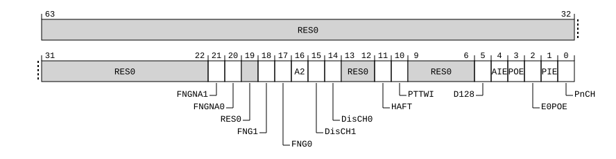

# ​D24.2.191 TCR2MASK_EL1, Extended Translation Control Masking Register (EL1)

Source: <https://developer.arm.com/documentation/ddi0487/mc/-Part-D-The-AArch64-System-Level-Architecture/-Chapter-D24-AArch64-System-Register-Descriptions/-D24-2-General-system-control-registers/-D24-2-191-TCR2MASK-EL1--Extended-Translation-Control-Masking-Register--EL1->

##### D24.2.191 TCR2MASK\_EL1, Extended Translation Control Masking Register (EL1)

The TCR2MASK\_EL1 characteristics are:

Purpose
:   Mask register to prevent updates of fields in [TCR2\_EL1](/documentation/ddi0487/mc/-Part-D-The-AArch64-System-Level-Architecture/-Chapter-D24-AArch64-System-Register-Descriptions/-D24-2-General-system-control-registers/-D24-2-189-TCR2-EL1--Extended-Translation-Control-Register--EL1-?lang=en#reg_aarch64_tcr2_el1) on writes to [TCR2\_EL1](/documentation/ddi0487/mc/-Part-D-The-AArch64-System-Level-Architecture/-Chapter-D24-AArch64-System-Register-Descriptions/-D24-2-General-system-control-registers/-D24-2-189-TCR2-EL1--Extended-Translation-Control-Register--EL1-?lang=en#reg_aarch64_tcr2_el1) or TCR2ALIAS\_EL1.

Configuration
:   This register is present only when FEAT\_SRMASK is implemented and FEAT\_AA64 is implemented. Otherwise, direct accesses to TCR2MASK\_EL1 are UNDEFINED.

Attributes
:   TCR2MASK\_EL1 is a 64-bit register.

###### Field descriptions



Bits [63:22]
:   Reserved, RES0.

FNGNA1, bit [21]
:   When FEAT\_THE is implemented:
    :   Mask bit for FNGNA1.

<table>
 <colgroup>
  <col/>
  <col/>
 </colgroup>
 <thead>
  <tr>
   <th>
    <strong>
     FNGNA1
    </strong>
   </th>
   <th>
    <strong>
     Meaning
    </strong>
   </th>
  </tr>
 </thead>
 <tbody>
  <tr>
   <td>
    <p>
     <code>
      0b0
     </code>
    </p>
   </td>
   <td>
    <p>
     <a class="document-topic" document-topic-path="/ddi0487/mc/-Part-D-The-AArch64-System-Level-Architecture/-Chapter-D24-AArch64-System-Register-Descriptions/-D24-2-General-system-control-registers/-D24-2-189-TCR2-EL1--Extended-Translation-Control-Register--EL1-?lang=en#reg_aarch64_tcr2_el1" href="/documentation/ddi0487/mc/-Part-D-The-AArch64-System-Level-Architecture/-Chapter-D24-AArch64-System-Register-Descriptions/-D24-2-General-system-control-registers/-D24-2-189-TCR2-EL1--Extended-Translation-Control-Register--EL1-?lang=en#reg_aarch64_tcr2_el1">
      TCR2_EL1
     </a>
     .FNGNA1 is writable.
    </p>
   </td>
  </tr>
  <tr>
   <td>
    <p>
     <code>
      0b1
     </code>
    </p>
   </td>
   <td>
    <p>
     <a class="document-topic" document-topic-path="/ddi0487/mc/-Part-D-The-AArch64-System-Level-Architecture/-Chapter-D24-AArch64-System-Register-Descriptions/-D24-2-General-system-control-registers/-D24-2-189-TCR2-EL1--Extended-Translation-Control-Register--EL1-?lang=en#reg_aarch64_tcr2_el1" href="/documentation/ddi0487/mc/-Part-D-The-AArch64-System-Level-Architecture/-Chapter-D24-AArch64-System-Register-Descriptions/-D24-2-General-system-control-registers/-D24-2-189-TCR2-EL1--Extended-Translation-Control-Register--EL1-?lang=en#reg_aarch64_tcr2_el1">
      TCR2_EL1
     </a>
     .FNGNA1 is not writable.
    </p>
   </td>
  </tr>
 </tbody>
</table>

        The reset behavior of this field is:

        - On a Warm reset:
          - When the highest implemented Exception level is EL1, this field resets to `'0'`.
          - Otherwise, this field resets to an architecturally UNKNOWN value.

    Otherwise:
    :   Reserved, RES0.

FNGNA0, bit [20]
:   When FEAT\_THE is implemented:
    :   Mask bit for FNGNA0.

<table>
 <colgroup>
  <col/>
  <col/>
 </colgroup>
 <thead>
  <tr>
   <th>
    <strong>
     FNGNA0
    </strong>
   </th>
   <th>
    <strong>
     Meaning
    </strong>
   </th>
  </tr>
 </thead>
 <tbody>
  <tr>
   <td>
    <p>
     <code>
      0b0
     </code>
    </p>
   </td>
   <td>
    <p>
     <a class="document-topic" document-topic-path="/ddi0487/mc/-Part-D-The-AArch64-System-Level-Architecture/-Chapter-D24-AArch64-System-Register-Descriptions/-D24-2-General-system-control-registers/-D24-2-189-TCR2-EL1--Extended-Translation-Control-Register--EL1-?lang=en#reg_aarch64_tcr2_el1" href="/documentation/ddi0487/mc/-Part-D-The-AArch64-System-Level-Architecture/-Chapter-D24-AArch64-System-Register-Descriptions/-D24-2-General-system-control-registers/-D24-2-189-TCR2-EL1--Extended-Translation-Control-Register--EL1-?lang=en#reg_aarch64_tcr2_el1">
      TCR2_EL1
     </a>
     .FNGNA0 is writable.
    </p>
   </td>
  </tr>
  <tr>
   <td>
    <p>
     <code>
      0b1
     </code>
    </p>
   </td>
   <td>
    <p>
     <a class="document-topic" document-topic-path="/ddi0487/mc/-Part-D-The-AArch64-System-Level-Architecture/-Chapter-D24-AArch64-System-Register-Descriptions/-D24-2-General-system-control-registers/-D24-2-189-TCR2-EL1--Extended-Translation-Control-Register--EL1-?lang=en#reg_aarch64_tcr2_el1" href="/documentation/ddi0487/mc/-Part-D-The-AArch64-System-Level-Architecture/-Chapter-D24-AArch64-System-Register-Descriptions/-D24-2-General-system-control-registers/-D24-2-189-TCR2-EL1--Extended-Translation-Control-Register--EL1-?lang=en#reg_aarch64_tcr2_el1">
      TCR2_EL1
     </a>
     .FNGNA0 is not writable.
    </p>
   </td>
  </tr>
 </tbody>
</table>

        The reset behavior of this field is:

        - On a Warm reset:
          - When the highest implemented Exception level is EL1, this field resets to `'0'`.
          - Otherwise, this field resets to an architecturally UNKNOWN value.

    Otherwise:
    :   Reserved, RES0.

Bit [19]
:   Reserved, RES0.

FNG1, bit [18]
:   When FEAT\_ASID2 is implemented:
    :   Mask bit for FNG1.

<table>
 <colgroup>
  <col/>
  <col/>
 </colgroup>
 <thead>
  <tr>
   <th>
    <strong>
     FNG1
    </strong>
   </th>
   <th>
    <strong>
     Meaning
    </strong>
   </th>
  </tr>
 </thead>
 <tbody>
  <tr>
   <td>
    <p>
     <code>
      0b0
     </code>
    </p>
   </td>
   <td>
    <p>
     <a class="document-topic" document-topic-path="/ddi0487/mc/-Part-D-The-AArch64-System-Level-Architecture/-Chapter-D24-AArch64-System-Register-Descriptions/-D24-2-General-system-control-registers/-D24-2-189-TCR2-EL1--Extended-Translation-Control-Register--EL1-?lang=en#reg_aarch64_tcr2_el1" href="/documentation/ddi0487/mc/-Part-D-The-AArch64-System-Level-Architecture/-Chapter-D24-AArch64-System-Register-Descriptions/-D24-2-General-system-control-registers/-D24-2-189-TCR2-EL1--Extended-Translation-Control-Register--EL1-?lang=en#reg_aarch64_tcr2_el1">
      TCR2_EL1
     </a>
     .FNG1 is writable.
    </p>
   </td>
  </tr>
  <tr>
   <td>
    <p>
     <code>
      0b1
     </code>
    </p>
   </td>
   <td>
    <p>
     <a class="document-topic" document-topic-path="/ddi0487/mc/-Part-D-The-AArch64-System-Level-Architecture/-Chapter-D24-AArch64-System-Register-Descriptions/-D24-2-General-system-control-registers/-D24-2-189-TCR2-EL1--Extended-Translation-Control-Register--EL1-?lang=en#reg_aarch64_tcr2_el1" href="/documentation/ddi0487/mc/-Part-D-The-AArch64-System-Level-Architecture/-Chapter-D24-AArch64-System-Register-Descriptions/-D24-2-General-system-control-registers/-D24-2-189-TCR2-EL1--Extended-Translation-Control-Register--EL1-?lang=en#reg_aarch64_tcr2_el1">
      TCR2_EL1
     </a>
     .FNG1 is not writable.
    </p>
   </td>
  </tr>
 </tbody>
</table>

        The reset behavior of this field is:

        - On a Warm reset:
          - When the highest implemented Exception level is EL1, this field resets to `'0'`.
          - Otherwise, this field resets to an architecturally UNKNOWN value.

    Otherwise:
    :   Reserved, RES0.

FNG0, bit [17]
:   When FEAT\_ASID2 is implemented:
    :   Mask bit for FNG0.

<table>
 <colgroup>
  <col/>
  <col/>
 </colgroup>
 <thead>
  <tr>
   <th>
    <strong>
     FNG0
    </strong>
   </th>
   <th>
    <strong>
     Meaning
    </strong>
   </th>
  </tr>
 </thead>
 <tbody>
  <tr>
   <td>
    <p>
     <code>
      0b0
     </code>
    </p>
   </td>
   <td>
    <p>
     <a class="document-topic" document-topic-path="/ddi0487/mc/-Part-D-The-AArch64-System-Level-Architecture/-Chapter-D24-AArch64-System-Register-Descriptions/-D24-2-General-system-control-registers/-D24-2-189-TCR2-EL1--Extended-Translation-Control-Register--EL1-?lang=en#reg_aarch64_tcr2_el1" href="/documentation/ddi0487/mc/-Part-D-The-AArch64-System-Level-Architecture/-Chapter-D24-AArch64-System-Register-Descriptions/-D24-2-General-system-control-registers/-D24-2-189-TCR2-EL1--Extended-Translation-Control-Register--EL1-?lang=en#reg_aarch64_tcr2_el1">
      TCR2_EL1
     </a>
     .FNG0 is writable.
    </p>
   </td>
  </tr>
  <tr>
   <td>
    <p>
     <code>
      0b1
     </code>
    </p>
   </td>
   <td>
    <p>
     <a class="document-topic" document-topic-path="/ddi0487/mc/-Part-D-The-AArch64-System-Level-Architecture/-Chapter-D24-AArch64-System-Register-Descriptions/-D24-2-General-system-control-registers/-D24-2-189-TCR2-EL1--Extended-Translation-Control-Register--EL1-?lang=en#reg_aarch64_tcr2_el1" href="/documentation/ddi0487/mc/-Part-D-The-AArch64-System-Level-Architecture/-Chapter-D24-AArch64-System-Register-Descriptions/-D24-2-General-system-control-registers/-D24-2-189-TCR2-EL1--Extended-Translation-Control-Register--EL1-?lang=en#reg_aarch64_tcr2_el1">
      TCR2_EL1
     </a>
     .FNG0 is not writable.
    </p>
   </td>
  </tr>
 </tbody>
</table>

        The reset behavior of this field is:

        - On a Warm reset:
          - When the highest implemented Exception level is EL1, this field resets to `'0'`.
          - Otherwise, this field resets to an architecturally UNKNOWN value.

    Otherwise:
    :   Reserved, RES0.

A2, bit [16]
:   When FEAT\_ASID2 is implemented:
    :   Mask bit for A2.

<table>
 <colgroup>
  <col/>
  <col/>
 </colgroup>
 <thead>
  <tr>
   <th>
    <strong>
     A2
    </strong>
   </th>
   <th>
    <strong>
     Meaning
    </strong>
   </th>
  </tr>
 </thead>
 <tbody>
  <tr>
   <td>
    <p>
     <code>
      0b0
     </code>
    </p>
   </td>
   <td>
    <p>
     <a class="document-topic" document-topic-path="/ddi0487/mc/-Part-D-The-AArch64-System-Level-Architecture/-Chapter-D24-AArch64-System-Register-Descriptions/-D24-2-General-system-control-registers/-D24-2-189-TCR2-EL1--Extended-Translation-Control-Register--EL1-?lang=en#reg_aarch64_tcr2_el1" href="/documentation/ddi0487/mc/-Part-D-The-AArch64-System-Level-Architecture/-Chapter-D24-AArch64-System-Register-Descriptions/-D24-2-General-system-control-registers/-D24-2-189-TCR2-EL1--Extended-Translation-Control-Register--EL1-?lang=en#reg_aarch64_tcr2_el1">
      TCR2_EL1
     </a>
     .A2 is writable.
    </p>
   </td>
  </tr>
  <tr>
   <td>
    <p>
     <code>
      0b1
     </code>
    </p>
   </td>
   <td>
    <p>
     <a class="document-topic" document-topic-path="/ddi0487/mc/-Part-D-The-AArch64-System-Level-Architecture/-Chapter-D24-AArch64-System-Register-Descriptions/-D24-2-General-system-control-registers/-D24-2-189-TCR2-EL1--Extended-Translation-Control-Register--EL1-?lang=en#reg_aarch64_tcr2_el1" href="/documentation/ddi0487/mc/-Part-D-The-AArch64-System-Level-Architecture/-Chapter-D24-AArch64-System-Register-Descriptions/-D24-2-General-system-control-registers/-D24-2-189-TCR2-EL1--Extended-Translation-Control-Register--EL1-?lang=en#reg_aarch64_tcr2_el1">
      TCR2_EL1
     </a>
     .A2 is not writable.
    </p>
   </td>
  </tr>
 </tbody>
</table>

        The reset behavior of this field is:

        - On a Warm reset:
          - When the highest implemented Exception level is EL1, this field resets to `'0'`.
          - Otherwise, this field resets to an architecturally UNKNOWN value.

    Otherwise:
    :   Reserved, RES0.

DisCH1, bit [15]
:   When FEAT\_D128 is implemented:
    :   Mask bit for DisCH1.

<table>
 <colgroup>
  <col/>
  <col/>
 </colgroup>
 <thead>
  <tr>
   <th>
    <strong>
     DisCH1
    </strong>
   </th>
   <th>
    <strong>
     Meaning
    </strong>
   </th>
  </tr>
 </thead>
 <tbody>
  <tr>
   <td>
    <p>
     <code>
      0b0
     </code>
    </p>
   </td>
   <td>
    <p>
     <a class="document-topic" document-topic-path="/ddi0487/mc/-Part-D-The-AArch64-System-Level-Architecture/-Chapter-D24-AArch64-System-Register-Descriptions/-D24-2-General-system-control-registers/-D24-2-189-TCR2-EL1--Extended-Translation-Control-Register--EL1-?lang=en#reg_aarch64_tcr2_el1" href="/documentation/ddi0487/mc/-Part-D-The-AArch64-System-Level-Architecture/-Chapter-D24-AArch64-System-Register-Descriptions/-D24-2-General-system-control-registers/-D24-2-189-TCR2-EL1--Extended-Translation-Control-Register--EL1-?lang=en#reg_aarch64_tcr2_el1">
      TCR2_EL1
     </a>
     .DisCH1 is writable.
    </p>
   </td>
  </tr>
  <tr>
   <td>
    <p>
     <code>
      0b1
     </code>
    </p>
   </td>
   <td>
    <p>
     <a class="document-topic" document-topic-path="/ddi0487/mc/-Part-D-The-AArch64-System-Level-Architecture/-Chapter-D24-AArch64-System-Register-Descriptions/-D24-2-General-system-control-registers/-D24-2-189-TCR2-EL1--Extended-Translation-Control-Register--EL1-?lang=en#reg_aarch64_tcr2_el1" href="/documentation/ddi0487/mc/-Part-D-The-AArch64-System-Level-Architecture/-Chapter-D24-AArch64-System-Register-Descriptions/-D24-2-General-system-control-registers/-D24-2-189-TCR2-EL1--Extended-Translation-Control-Register--EL1-?lang=en#reg_aarch64_tcr2_el1">
      TCR2_EL1
     </a>
     .DisCH1 is not writable.
    </p>
   </td>
  </tr>
 </tbody>
</table>

        The reset behavior of this field is:

        - On a Warm reset:
          - When the highest implemented Exception level is EL1, this field resets to `'0'`.
          - Otherwise, this field resets to an architecturally UNKNOWN value.

    Otherwise:
    :   Reserved, RES0.

DisCH0, bit [14]
:   When FEAT\_D128 is implemented:
    :   Mask bit for DisCH0.

<table>
 <colgroup>
  <col/>
  <col/>
 </colgroup>
 <thead>
  <tr>
   <th>
    <strong>
     DisCH0
    </strong>
   </th>
   <th>
    <strong>
     Meaning
    </strong>
   </th>
  </tr>
 </thead>
 <tbody>
  <tr>
   <td>
    <p>
     <code>
      0b0
     </code>
    </p>
   </td>
   <td>
    <p>
     <a class="document-topic" document-topic-path="/ddi0487/mc/-Part-D-The-AArch64-System-Level-Architecture/-Chapter-D24-AArch64-System-Register-Descriptions/-D24-2-General-system-control-registers/-D24-2-189-TCR2-EL1--Extended-Translation-Control-Register--EL1-?lang=en#reg_aarch64_tcr2_el1" href="/documentation/ddi0487/mc/-Part-D-The-AArch64-System-Level-Architecture/-Chapter-D24-AArch64-System-Register-Descriptions/-D24-2-General-system-control-registers/-D24-2-189-TCR2-EL1--Extended-Translation-Control-Register--EL1-?lang=en#reg_aarch64_tcr2_el1">
      TCR2_EL1
     </a>
     .DisCH0 is writable.
    </p>
   </td>
  </tr>
  <tr>
   <td>
    <p>
     <code>
      0b1
     </code>
    </p>
   </td>
   <td>
    <p>
     <a class="document-topic" document-topic-path="/ddi0487/mc/-Part-D-The-AArch64-System-Level-Architecture/-Chapter-D24-AArch64-System-Register-Descriptions/-D24-2-General-system-control-registers/-D24-2-189-TCR2-EL1--Extended-Translation-Control-Register--EL1-?lang=en#reg_aarch64_tcr2_el1" href="/documentation/ddi0487/mc/-Part-D-The-AArch64-System-Level-Architecture/-Chapter-D24-AArch64-System-Register-Descriptions/-D24-2-General-system-control-registers/-D24-2-189-TCR2-EL1--Extended-Translation-Control-Register--EL1-?lang=en#reg_aarch64_tcr2_el1">
      TCR2_EL1
     </a>
     .DisCH0 is not writable.
    </p>
   </td>
  </tr>
 </tbody>
</table>

        The reset behavior of this field is:

        - On a Warm reset:
          - When the highest implemented Exception level is EL1, this field resets to `'0'`.
          - Otherwise, this field resets to an architecturally UNKNOWN value.

    Otherwise:
    :   Reserved, RES0.

Bits [13:12]
:   Reserved, RES0.

HAFT, bit [11]
:   When FEAT\_HAFT is implemented:
    :   Mask bit for HAFT.

<table>
 <colgroup>
  <col/>
  <col/>
 </colgroup>
 <thead>
  <tr>
   <th>
    <strong>
     HAFT
    </strong>
   </th>
   <th>
    <strong>
     Meaning
    </strong>
   </th>
  </tr>
 </thead>
 <tbody>
  <tr>
   <td>
    <p>
     <code>
      0b0
     </code>
    </p>
   </td>
   <td>
    <p>
     <a class="document-topic" document-topic-path="/ddi0487/mc/-Part-D-The-AArch64-System-Level-Architecture/-Chapter-D24-AArch64-System-Register-Descriptions/-D24-2-General-system-control-registers/-D24-2-189-TCR2-EL1--Extended-Translation-Control-Register--EL1-?lang=en#reg_aarch64_tcr2_el1" href="/documentation/ddi0487/mc/-Part-D-The-AArch64-System-Level-Architecture/-Chapter-D24-AArch64-System-Register-Descriptions/-D24-2-General-system-control-registers/-D24-2-189-TCR2-EL1--Extended-Translation-Control-Register--EL1-?lang=en#reg_aarch64_tcr2_el1">
      TCR2_EL1
     </a>
     .HAFT is writable.
    </p>
   </td>
  </tr>
  <tr>
   <td>
    <p>
     <code>
      0b1
     </code>
    </p>
   </td>
   <td>
    <p>
     <a class="document-topic" document-topic-path="/ddi0487/mc/-Part-D-The-AArch64-System-Level-Architecture/-Chapter-D24-AArch64-System-Register-Descriptions/-D24-2-General-system-control-registers/-D24-2-189-TCR2-EL1--Extended-Translation-Control-Register--EL1-?lang=en#reg_aarch64_tcr2_el1" href="/documentation/ddi0487/mc/-Part-D-The-AArch64-System-Level-Architecture/-Chapter-D24-AArch64-System-Register-Descriptions/-D24-2-General-system-control-registers/-D24-2-189-TCR2-EL1--Extended-Translation-Control-Register--EL1-?lang=en#reg_aarch64_tcr2_el1">
      TCR2_EL1
     </a>
     .HAFT is not writable.
    </p>
   </td>
  </tr>
 </tbody>
</table>

        The reset behavior of this field is:

        - On a Warm reset:
          - When the highest implemented Exception level is EL1, this field resets to `'0'`.
          - Otherwise, this field resets to an architecturally UNKNOWN value.

    Otherwise:
    :   Reserved, RES0.

PTTWI, bit [10]
:   When FEAT\_THE is implemented:
    :   Mask bit for PTTWI.

<table>
 <colgroup>
  <col/>
  <col/>
 </colgroup>
 <thead>
  <tr>
   <th>
    <strong>
     PTTWI
    </strong>
   </th>
   <th>
    <strong>
     Meaning
    </strong>
   </th>
  </tr>
 </thead>
 <tbody>
  <tr>
   <td>
    <p>
     <code>
      0b0
     </code>
    </p>
   </td>
   <td>
    <p>
     <a class="document-topic" document-topic-path="/ddi0487/mc/-Part-D-The-AArch64-System-Level-Architecture/-Chapter-D24-AArch64-System-Register-Descriptions/-D24-2-General-system-control-registers/-D24-2-189-TCR2-EL1--Extended-Translation-Control-Register--EL1-?lang=en#reg_aarch64_tcr2_el1" href="/documentation/ddi0487/mc/-Part-D-The-AArch64-System-Level-Architecture/-Chapter-D24-AArch64-System-Register-Descriptions/-D24-2-General-system-control-registers/-D24-2-189-TCR2-EL1--Extended-Translation-Control-Register--EL1-?lang=en#reg_aarch64_tcr2_el1">
      TCR2_EL1
     </a>
     .PTTWI is writable.
    </p>
   </td>
  </tr>
  <tr>
   <td>
    <p>
     <code>
      0b1
     </code>
    </p>
   </td>
   <td>
    <p>
     <a class="document-topic" document-topic-path="/ddi0487/mc/-Part-D-The-AArch64-System-Level-Architecture/-Chapter-D24-AArch64-System-Register-Descriptions/-D24-2-General-system-control-registers/-D24-2-189-TCR2-EL1--Extended-Translation-Control-Register--EL1-?lang=en#reg_aarch64_tcr2_el1" href="/documentation/ddi0487/mc/-Part-D-The-AArch64-System-Level-Architecture/-Chapter-D24-AArch64-System-Register-Descriptions/-D24-2-General-system-control-registers/-D24-2-189-TCR2-EL1--Extended-Translation-Control-Register--EL1-?lang=en#reg_aarch64_tcr2_el1">
      TCR2_EL1
     </a>
     .PTTWI is not writable.
    </p>
   </td>
  </tr>
 </tbody>
</table>

        The reset behavior of this field is:

        - On a Warm reset:
          - When the highest implemented Exception level is EL1, this field resets to `'0'`.
          - Otherwise, this field resets to an architecturally UNKNOWN value.

    Otherwise:
    :   Reserved, RES0.

Bits [9:6]
:   Reserved, RES0.

D128, bit [5]
:   When FEAT\_D128 is implemented:
    :   Mask bit for D128.

<table>
 <colgroup>
  <col/>
  <col/>
 </colgroup>
 <thead>
  <tr>
   <th>
    <strong>
     D128
    </strong>
   </th>
   <th>
    <strong>
     Meaning
    </strong>
   </th>
  </tr>
 </thead>
 <tbody>
  <tr>
   <td>
    <p>
     <code>
      0b0
     </code>
    </p>
   </td>
   <td>
    <p>
     <a class="document-topic" document-topic-path="/ddi0487/mc/-Part-D-The-AArch64-System-Level-Architecture/-Chapter-D24-AArch64-System-Register-Descriptions/-D24-2-General-system-control-registers/-D24-2-189-TCR2-EL1--Extended-Translation-Control-Register--EL1-?lang=en#reg_aarch64_tcr2_el1" href="/documentation/ddi0487/mc/-Part-D-The-AArch64-System-Level-Architecture/-Chapter-D24-AArch64-System-Register-Descriptions/-D24-2-General-system-control-registers/-D24-2-189-TCR2-EL1--Extended-Translation-Control-Register--EL1-?lang=en#reg_aarch64_tcr2_el1">
      TCR2_EL1
     </a>
     .D128 is writable.
    </p>
   </td>
  </tr>
  <tr>
   <td>
    <p>
     <code>
      0b1
     </code>
    </p>
   </td>
   <td>
    <p>
     <a class="document-topic" document-topic-path="/ddi0487/mc/-Part-D-The-AArch64-System-Level-Architecture/-Chapter-D24-AArch64-System-Register-Descriptions/-D24-2-General-system-control-registers/-D24-2-189-TCR2-EL1--Extended-Translation-Control-Register--EL1-?lang=en#reg_aarch64_tcr2_el1" href="/documentation/ddi0487/mc/-Part-D-The-AArch64-System-Level-Architecture/-Chapter-D24-AArch64-System-Register-Descriptions/-D24-2-General-system-control-registers/-D24-2-189-TCR2-EL1--Extended-Translation-Control-Register--EL1-?lang=en#reg_aarch64_tcr2_el1">
      TCR2_EL1
     </a>
     .D128 is not writable.
    </p>
   </td>
  </tr>
 </tbody>
</table>

        The reset behavior of this field is:

        - On a Warm reset:
          - When the highest implemented Exception level is EL1, this field resets to `'0'`.
          - Otherwise, this field resets to an architecturally UNKNOWN value.

    Otherwise:
    :   Reserved, RES0.

AIE, bit [4]
:   When FEAT\_AIE is implemented:
    :   Mask bit for AIE.

<table>
 <colgroup>
  <col/>
  <col/>
 </colgroup>
 <thead>
  <tr>
   <th>
    <strong>
     AIE
    </strong>
   </th>
   <th>
    <strong>
     Meaning
    </strong>
   </th>
  </tr>
 </thead>
 <tbody>
  <tr>
   <td>
    <p>
     <code>
      0b0
     </code>
    </p>
   </td>
   <td>
    <p>
     <a class="document-topic" document-topic-path="/ddi0487/mc/-Part-D-The-AArch64-System-Level-Architecture/-Chapter-D24-AArch64-System-Register-Descriptions/-D24-2-General-system-control-registers/-D24-2-189-TCR2-EL1--Extended-Translation-Control-Register--EL1-?lang=en#reg_aarch64_tcr2_el1" href="/documentation/ddi0487/mc/-Part-D-The-AArch64-System-Level-Architecture/-Chapter-D24-AArch64-System-Register-Descriptions/-D24-2-General-system-control-registers/-D24-2-189-TCR2-EL1--Extended-Translation-Control-Register--EL1-?lang=en#reg_aarch64_tcr2_el1">
      TCR2_EL1
     </a>
     .AIE is writable.
    </p>
   </td>
  </tr>
  <tr>
   <td>
    <p>
     <code>
      0b1
     </code>
    </p>
   </td>
   <td>
    <p>
     <a class="document-topic" document-topic-path="/ddi0487/mc/-Part-D-The-AArch64-System-Level-Architecture/-Chapter-D24-AArch64-System-Register-Descriptions/-D24-2-General-system-control-registers/-D24-2-189-TCR2-EL1--Extended-Translation-Control-Register--EL1-?lang=en#reg_aarch64_tcr2_el1" href="/documentation/ddi0487/mc/-Part-D-The-AArch64-System-Level-Architecture/-Chapter-D24-AArch64-System-Register-Descriptions/-D24-2-General-system-control-registers/-D24-2-189-TCR2-EL1--Extended-Translation-Control-Register--EL1-?lang=en#reg_aarch64_tcr2_el1">
      TCR2_EL1
     </a>
     .AIE is not writable.
    </p>
   </td>
  </tr>
 </tbody>
</table>

        The reset behavior of this field is:

        - On a Warm reset:
          - When the highest implemented Exception level is EL1, this field resets to `'0'`.
          - Otherwise, this field resets to an architecturally UNKNOWN value.

    Otherwise:
    :   Reserved, RES0.

POE, bit [3]
:   When FEAT\_S1POE is implemented:
    :   Mask bit for POE.

<table>
 <colgroup>
  <col/>
  <col/>
 </colgroup>
 <thead>
  <tr>
   <th>
    <strong>
     POE
    </strong>
   </th>
   <th>
    <strong>
     Meaning
    </strong>
   </th>
  </tr>
 </thead>
 <tbody>
  <tr>
   <td>
    <p>
     <code>
      0b0
     </code>
    </p>
   </td>
   <td>
    <p>
     <a class="document-topic" document-topic-path="/ddi0487/mc/-Part-D-The-AArch64-System-Level-Architecture/-Chapter-D24-AArch64-System-Register-Descriptions/-D24-2-General-system-control-registers/-D24-2-189-TCR2-EL1--Extended-Translation-Control-Register--EL1-?lang=en#reg_aarch64_tcr2_el1" href="/documentation/ddi0487/mc/-Part-D-The-AArch64-System-Level-Architecture/-Chapter-D24-AArch64-System-Register-Descriptions/-D24-2-General-system-control-registers/-D24-2-189-TCR2-EL1--Extended-Translation-Control-Register--EL1-?lang=en#reg_aarch64_tcr2_el1">
      TCR2_EL1
     </a>
     .POE is writable.
    </p>
   </td>
  </tr>
  <tr>
   <td>
    <p>
     <code>
      0b1
     </code>
    </p>
   </td>
   <td>
    <p>
     <a class="document-topic" document-topic-path="/ddi0487/mc/-Part-D-The-AArch64-System-Level-Architecture/-Chapter-D24-AArch64-System-Register-Descriptions/-D24-2-General-system-control-registers/-D24-2-189-TCR2-EL1--Extended-Translation-Control-Register--EL1-?lang=en#reg_aarch64_tcr2_el1" href="/documentation/ddi0487/mc/-Part-D-The-AArch64-System-Level-Architecture/-Chapter-D24-AArch64-System-Register-Descriptions/-D24-2-General-system-control-registers/-D24-2-189-TCR2-EL1--Extended-Translation-Control-Register--EL1-?lang=en#reg_aarch64_tcr2_el1">
      TCR2_EL1
     </a>
     .POE is not writable.
    </p>
   </td>
  </tr>
 </tbody>
</table>

        The reset behavior of this field is:

        - On a Warm reset:
          - When the highest implemented Exception level is EL1, this field resets to `'0'`.
          - Otherwise, this field resets to an architecturally UNKNOWN value.

    Otherwise:
    :   Reserved, RES0.

E0POE, bit [2]
:   When FEAT\_S1POE is implemented:
    :   Mask bit for E0POE.

<table>
 <colgroup>
  <col/>
  <col/>
 </colgroup>
 <thead>
  <tr>
   <th>
    <strong>
     E0POE
    </strong>
   </th>
   <th>
    <strong>
     Meaning
    </strong>
   </th>
  </tr>
 </thead>
 <tbody>
  <tr>
   <td>
    <p>
     <code>
      0b0
     </code>
    </p>
   </td>
   <td>
    <p>
     <a class="document-topic" document-topic-path="/ddi0487/mc/-Part-D-The-AArch64-System-Level-Architecture/-Chapter-D24-AArch64-System-Register-Descriptions/-D24-2-General-system-control-registers/-D24-2-189-TCR2-EL1--Extended-Translation-Control-Register--EL1-?lang=en#reg_aarch64_tcr2_el1" href="/documentation/ddi0487/mc/-Part-D-The-AArch64-System-Level-Architecture/-Chapter-D24-AArch64-System-Register-Descriptions/-D24-2-General-system-control-registers/-D24-2-189-TCR2-EL1--Extended-Translation-Control-Register--EL1-?lang=en#reg_aarch64_tcr2_el1">
      TCR2_EL1
     </a>
     .E0POE is writable.
    </p>
   </td>
  </tr>
  <tr>
   <td>
    <p>
     <code>
      0b1
     </code>
    </p>
   </td>
   <td>
    <p>
     <a class="document-topic" document-topic-path="/ddi0487/mc/-Part-D-The-AArch64-System-Level-Architecture/-Chapter-D24-AArch64-System-Register-Descriptions/-D24-2-General-system-control-registers/-D24-2-189-TCR2-EL1--Extended-Translation-Control-Register--EL1-?lang=en#reg_aarch64_tcr2_el1" href="/documentation/ddi0487/mc/-Part-D-The-AArch64-System-Level-Architecture/-Chapter-D24-AArch64-System-Register-Descriptions/-D24-2-General-system-control-registers/-D24-2-189-TCR2-EL1--Extended-Translation-Control-Register--EL1-?lang=en#reg_aarch64_tcr2_el1">
      TCR2_EL1
     </a>
     .E0POE is not writable.
    </p>
   </td>
  </tr>
 </tbody>
</table>

        The reset behavior of this field is:

        - On a Warm reset:
          - When the highest implemented Exception level is EL1, this field resets to `'0'`.
          - Otherwise, this field resets to an architecturally UNKNOWN value.

    Otherwise:
    :   Reserved, RES0.

PIE, bit [1]
:   When FEAT\_S1PIE is implemented:
    :   Mask bit for PIE.

<table>
 <colgroup>
  <col/>
  <col/>
 </colgroup>
 <thead>
  <tr>
   <th>
    <strong>
     PIE
    </strong>
   </th>
   <th>
    <strong>
     Meaning
    </strong>
   </th>
  </tr>
 </thead>
 <tbody>
  <tr>
   <td>
    <p>
     <code>
      0b0
     </code>
    </p>
   </td>
   <td>
    <p>
     <a class="document-topic" document-topic-path="/ddi0487/mc/-Part-D-The-AArch64-System-Level-Architecture/-Chapter-D24-AArch64-System-Register-Descriptions/-D24-2-General-system-control-registers/-D24-2-189-TCR2-EL1--Extended-Translation-Control-Register--EL1-?lang=en#reg_aarch64_tcr2_el1" href="/documentation/ddi0487/mc/-Part-D-The-AArch64-System-Level-Architecture/-Chapter-D24-AArch64-System-Register-Descriptions/-D24-2-General-system-control-registers/-D24-2-189-TCR2-EL1--Extended-Translation-Control-Register--EL1-?lang=en#reg_aarch64_tcr2_el1">
      TCR2_EL1
     </a>
     .PIE is writable.
    </p>
   </td>
  </tr>
  <tr>
   <td>
    <p>
     <code>
      0b1
     </code>
    </p>
   </td>
   <td>
    <p>
     <a class="document-topic" document-topic-path="/ddi0487/mc/-Part-D-The-AArch64-System-Level-Architecture/-Chapter-D24-AArch64-System-Register-Descriptions/-D24-2-General-system-control-registers/-D24-2-189-TCR2-EL1--Extended-Translation-Control-Register--EL1-?lang=en#reg_aarch64_tcr2_el1" href="/documentation/ddi0487/mc/-Part-D-The-AArch64-System-Level-Architecture/-Chapter-D24-AArch64-System-Register-Descriptions/-D24-2-General-system-control-registers/-D24-2-189-TCR2-EL1--Extended-Translation-Control-Register--EL1-?lang=en#reg_aarch64_tcr2_el1">
      TCR2_EL1
     </a>
     .PIE is not writable.
    </p>
   </td>
  </tr>
 </tbody>
</table>

        The reset behavior of this field is:

        - On a Warm reset:
          - When the highest implemented Exception level is EL1, this field resets to `'0'`.
          - Otherwise, this field resets to an architecturally UNKNOWN value.

    Otherwise:
    :   Reserved, RES0.

PnCH, bit [0]
:   When FEAT\_THE is implemented:
    :   Mask bit for PnCH.

<table>
 <colgroup>
  <col/>
  <col/>
 </colgroup>
 <thead>
  <tr>
   <th>
    <strong>
     PnCH
    </strong>
   </th>
   <th>
    <strong>
     Meaning
    </strong>
   </th>
  </tr>
 </thead>
 <tbody>
  <tr>
   <td>
    <p>
     <code>
      0b0
     </code>
    </p>
   </td>
   <td>
    <p>
     <a class="document-topic" document-topic-path="/ddi0487/mc/-Part-D-The-AArch64-System-Level-Architecture/-Chapter-D24-AArch64-System-Register-Descriptions/-D24-2-General-system-control-registers/-D24-2-189-TCR2-EL1--Extended-Translation-Control-Register--EL1-?lang=en#reg_aarch64_tcr2_el1" href="/documentation/ddi0487/mc/-Part-D-The-AArch64-System-Level-Architecture/-Chapter-D24-AArch64-System-Register-Descriptions/-D24-2-General-system-control-registers/-D24-2-189-TCR2-EL1--Extended-Translation-Control-Register--EL1-?lang=en#reg_aarch64_tcr2_el1">
      TCR2_EL1
     </a>
     .PnCH is writable.
    </p>
   </td>
  </tr>
  <tr>
   <td>
    <p>
     <code>
      0b1
     </code>
    </p>
   </td>
   <td>
    <p>
     <a class="document-topic" document-topic-path="/ddi0487/mc/-Part-D-The-AArch64-System-Level-Architecture/-Chapter-D24-AArch64-System-Register-Descriptions/-D24-2-General-system-control-registers/-D24-2-189-TCR2-EL1--Extended-Translation-Control-Register--EL1-?lang=en#reg_aarch64_tcr2_el1" href="/documentation/ddi0487/mc/-Part-D-The-AArch64-System-Level-Architecture/-Chapter-D24-AArch64-System-Register-Descriptions/-D24-2-General-system-control-registers/-D24-2-189-TCR2-EL1--Extended-Translation-Control-Register--EL1-?lang=en#reg_aarch64_tcr2_el1">
      TCR2_EL1
     </a>
     .PnCH is not writable.
    </p>
   </td>
  </tr>
 </tbody>
</table>

        The reset behavior of this field is:

        - On a Warm reset:
          - When the highest implemented Exception level is EL1, this field resets to `'0'`.
          - Otherwise, this field resets to an architecturally UNKNOWN value.

    Otherwise:
    :   Reserved, RES0.

###### Accessing TCR2MASK\_EL1

When the Effective value of [HCR\_EL2](/documentation/ddi0487/mc/-Part-D-The-AArch64-System-Level-Architecture/-Chapter-D24-AArch64-System-Register-Descriptions/-D24-2-General-system-control-registers/-D24-2-61-HCR-EL2--Hypervisor-Configuration-Register?lang=en#reg_aarch64_hcr_el2).E2H is 1, without explicit synchronization, accesses from EL3 using the accessor name `TCR2MASK_EL1` or `TCR2MASK_EL12` are not guaranteed to be ordered with respect to accesses using the other accessor name.

Accesses to this register use the following encodings in the System register encoding space:

###### `MRS <Xt>, TCR2MASK_EL1`

<table>
 <colgroup>
  <col/>
  <col/>
  <col/>
  <col/>
  <col/>
 </colgroup>
 <thead>
  <tr>
   <th>
    <strong>
     op0
    </strong>
   </th>
   <th>
    <strong>
     op1
    </strong>
   </th>
   <th>
    <strong>
     CRn
    </strong>
   </th>
   <th>
    <strong>
     CRm
    </strong>
   </th>
   <th>
    <strong>
     op2
    </strong>
   </th>
  </tr>
 </thead>
 <tbody>
  <tr>
   <td>
    <p>
     <code>
      0b11
     </code>
    </p>
   </td>
   <td>
    <p>
     <code>
      0b000
     </code>
    </p>
   </td>
   <td>
    <p>
     <code>
      0b0010
     </code>
    </p>
   </td>
   <td>
    <p>
     <code>
      0b0111
     </code>
    </p>
   </td>
   <td>
    <p>
     <code>
      0b011
     </code>
    </p>
   </td>
  </tr>
 </tbody>
</table>

```
if !(IsFeatureImplemented(FEAT_SRMASK) && IsFeatureImplemented(FEAT_AA64)) then
    Undefined();
elsif HaveEL(EL3) && !(EffectivelyAtEL0InHost() || EffectivelyAtEL0NotInHost() || PSTATE.EL == EL3) && EL3SDDUndefPriority() && SCR_EL3().SRMASKEn == '0' then
    Undefined();
elsif PSTATE.EL == EL0 then
    Undefined();
elsif PSTATE.EL == EL1 then
    if EL2Enabled() && IsFeatureImplemented(FEAT_FGT2) && ((HaveEL(EL3) && SCR_EL3().FGTEn2 == '0') || HFGRTR2_EL2().nTCR2MASK_EL1 == '0') then
        AArch64_SystemAccessTrap(EL2, 0x18);
    elsif EL2Enabled() && (!IsHCRXEL2Enabled() || HCRX_EL2().SRMASKEn == '0') then
        AArch64_SystemAccessTrap(EL2, 0x18);
    elsif HaveEL(EL3) && SCR_EL3().SRMASKEn == '0' then
        if EL3SDDUndef() then
            Undefined();
        else
            AArch64_SystemAccessTrap(EL3, 0x18);
        end;
    elsif EffectiveHCR_EL2_NVx() IN {'111'} then
        X{64}(t) = NVMem(0x338);
    else
        X{64}(t) = TCR2MASK_EL1();
    end;
elsif PSTATE.EL == EL2 then
    if HaveEL(EL3) && SCR_EL3().SRMASKEn == '0' then
        if EL3SDDUndef() then
            Undefined();
        else
            AArch64_SystemAccessTrap(EL3, 0x18);
        end;
    elsif ELIsInHost(EL2) then
        X{64}(t) = TCR2MASK_EL2();
    else
        X{64}(t) = TCR2MASK_EL1();
    end;
elsif PSTATE.EL == EL3 then
    X{64}(t) = TCR2MASK_EL1();
end;
```

###### `MSR TCR2MASK_EL1, <Xt>`

<table>
 <colgroup>
  <col/>
  <col/>
  <col/>
  <col/>
  <col/>
 </colgroup>
 <thead>
  <tr>
   <th>
    <strong>
     op0
    </strong>
   </th>
   <th>
    <strong>
     op1
    </strong>
   </th>
   <th>
    <strong>
     CRn
    </strong>
   </th>
   <th>
    <strong>
     CRm
    </strong>
   </th>
   <th>
    <strong>
     op2
    </strong>
   </th>
  </tr>
 </thead>
 <tbody>
  <tr>
   <td>
    <p>
     <code>
      0b11
     </code>
    </p>
   </td>
   <td>
    <p>
     <code>
      0b000
     </code>
    </p>
   </td>
   <td>
    <p>
     <code>
      0b0010
     </code>
    </p>
   </td>
   <td>
    <p>
     <code>
      0b0111
     </code>
    </p>
   </td>
   <td>
    <p>
     <code>
      0b011
     </code>
    </p>
   </td>
  </tr>
 </tbody>
</table>

```
if !(IsFeatureImplemented(FEAT_SRMASK) && IsFeatureImplemented(FEAT_AA64)) then
    Undefined();
elsif HaveEL(EL3) && !(EffectivelyAtEL0InHost() || EffectivelyAtEL0NotInHost() || PSTATE.EL == EL3) && EL3SDDUndefPriority() && SCR_EL3().SRMASKEn == '0' then
    Undefined();
elsif PSTATE.EL == EL0 then
    Undefined();
elsif PSTATE.EL == EL1 then
    if EL2Enabled() && IsFeatureImplemented(FEAT_FGT2) && ((HaveEL(EL3) && SCR_EL3().FGTEn2 == '0') || HFGWTR2_EL2().nTCR2MASK_EL1 == '0') then
        AArch64_SystemAccessTrap(EL2, 0x18);
    elsif EL2Enabled() && (!IsHCRXEL2Enabled() || HCRX_EL2().SRMASKEn == '0') then
        AArch64_SystemAccessTrap(EL2, 0x18);
    elsif HaveEL(EL3) && SCR_EL3().SRMASKEn == '0' then
        if EL3SDDUndef() then
            Undefined();
        else
            AArch64_SystemAccessTrap(EL3, 0x18);
        end;
    elsif EffectiveHCR_EL2_NVx() IN {'111'} then
        NVMem(0x338) = X{64}(t);
    elsif !IsZero(TCR2MASK_EL1()) then
        Undefined();
    else
        TCR2MASK_EL1() = X{64}(t);
    end;
elsif PSTATE.EL == EL2 then
    if HaveEL(EL3) && SCR_EL3().SRMASKEn == '0' then
        if EL3SDDUndef() then
            Undefined();
        else
            AArch64_SystemAccessTrap(EL3, 0x18);
        end;
    elsif ELIsInHost(EL2) then
        if !IsZero(TCR2MASK_EL2()) then
            Undefined();
        else
            TCR2MASK_EL2() = X{64}(t);
        end;
    else
        TCR2MASK_EL1() = X{64}(t);
    end;
elsif PSTATE.EL == EL3 then
    TCR2MASK_EL1() = X{64}(t);
end;
```

`When FEAT_VHE is implemented MRS <Xt>, TCR2MASK_EL12`
:

<table>
 <colgroup>
  <col/>
  <col/>
  <col/>
  <col/>
  <col/>
 </colgroup>
 <thead>
  <tr>
   <th>
    <strong>
     op0
    </strong>
   </th>
   <th>
    <strong>
     op1
    </strong>
   </th>
   <th>
    <strong>
     CRn
    </strong>
   </th>
   <th>
    <strong>
     CRm
    </strong>
   </th>
   <th>
    <strong>
     op2
    </strong>
   </th>
  </tr>
 </thead>
 <tbody>
  <tr>
   <td>
    <p>
     <code>
      0b11
     </code>
    </p>
   </td>
   <td>
    <p>
     <code>
      0b101
     </code>
    </p>
   </td>
   <td>
    <p>
     <code>
      0b0010
     </code>
    </p>
   </td>
   <td>
    <p>
     <code>
      0b0111
     </code>
    </p>
   </td>
   <td>
    <p>
     <code>
      0b011
     </code>
    </p>
   </td>
  </tr>
 </tbody>
</table>

    ```
    if !(IsFeatureImplemented(FEAT_SRMASK) && IsFeatureImplemented(FEAT_AA64)) then
        Undefined();
    elsif HaveEL(EL3) && PSTATE.EL == EL2 && EL3SDDUndefPriority() && SCR_EL3().SRMASKEn == '0' then
        Undefined();
    elsif PSTATE.EL == EL0 then
        Undefined();
    elsif PSTATE.EL == EL1 then
        if EffectiveHCR_EL2_NVx() == '101' then
            X{64}(t) = NVMem(0x338);
        elsif EffectiveHCR_EL2_NVx() IN {'xx1'} then
            AArch64_SystemAccessTrap(EL2, 0x18);
        else
            Undefined();
        end;
    elsif PSTATE.EL == EL2 then
        if ELIsInHost(EL2) then
            if HaveEL(EL3) && SCR_EL3().SRMASKEn == '0' then
                if EL3SDDUndef() then
                    Undefined();
                else
                    AArch64_SystemAccessTrap(EL3, 0x18);
                end;
            else
                X{64}(t) = TCR2MASK_EL1();
            end;
        else
            Undefined();
        end;
    elsif PSTATE.EL == EL3 then
        if ELIsInHost(EL2) then
            X{64}(t) = TCR2MASK_EL1();
        else
            Undefined();
        end;
    end;
    ```

`When FEAT_VHE is implemented MSR TCR2MASK_EL12, <Xt>`
:

<table>
 <colgroup>
  <col/>
  <col/>
  <col/>
  <col/>
  <col/>
 </colgroup>
 <thead>
  <tr>
   <th>
    <strong>
     op0
    </strong>
   </th>
   <th>
    <strong>
     op1
    </strong>
   </th>
   <th>
    <strong>
     CRn
    </strong>
   </th>
   <th>
    <strong>
     CRm
    </strong>
   </th>
   <th>
    <strong>
     op2
    </strong>
   </th>
  </tr>
 </thead>
 <tbody>
  <tr>
   <td>
    <p>
     <code>
      0b11
     </code>
    </p>
   </td>
   <td>
    <p>
     <code>
      0b101
     </code>
    </p>
   </td>
   <td>
    <p>
     <code>
      0b0010
     </code>
    </p>
   </td>
   <td>
    <p>
     <code>
      0b0111
     </code>
    </p>
   </td>
   <td>
    <p>
     <code>
      0b011
     </code>
    </p>
   </td>
  </tr>
 </tbody>
</table>

    ```
    if !(IsFeatureImplemented(FEAT_SRMASK) && IsFeatureImplemented(FEAT_AA64)) then
        Undefined();
    elsif HaveEL(EL3) && PSTATE.EL == EL2 && EL3SDDUndefPriority() && SCR_EL3().SRMASKEn == '0' then
        Undefined();
    elsif PSTATE.EL == EL0 then
        Undefined();
    elsif PSTATE.EL == EL1 then
        if EffectiveHCR_EL2_NVx() == '101' then
            NVMem(0x338) = X{64}(t);
        elsif EffectiveHCR_EL2_NVx() IN {'xx1'} then
            AArch64_SystemAccessTrap(EL2, 0x18);
        else
            Undefined();
        end;
    elsif PSTATE.EL == EL2 then
        if ELIsInHost(EL2) then
            if HaveEL(EL3) && SCR_EL3().SRMASKEn == '0' then
                if EL3SDDUndef() then
                    Undefined();
                else
                    AArch64_SystemAccessTrap(EL3, 0x18);
                end;
            else
                TCR2MASK_EL1() = X{64}(t);
            end;
        else
            Undefined();
        end;
    elsif PSTATE.EL == EL3 then
        if ELIsInHost(EL2) then
            TCR2MASK_EL1() = X{64}(t);
        else
            Undefined();
        end;
    end;
    ```
