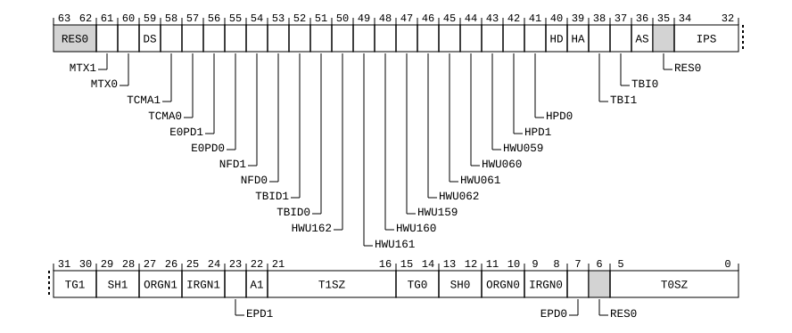

# ​D24.2.193 TCR_EL1, Translation Control Register (EL1)

Source: <https://developer.arm.com/documentation/ddi0487/mc/-Part-D-The-AArch64-System-Level-Architecture/-Chapter-D24-AArch64-System-Register-Descriptions/-D24-2-General-system-control-registers/-D24-2-193-TCR-EL1--Translation-Control-Register--EL1->

##### D24.2.193 TCR\_EL1, Translation Control Register (EL1)

The TCR\_EL1 characteristics are:

Purpose
:   The control register for stage 1 of the EL1&0 translation regime.

Configuration
:   AArch64 System register TCR\_EL1 bits [31:0] are architecturally mapped to AArch32 System register [TTBCR](/documentation/ddi0487/mc/-Part-G-The-AArch32-System-Level-Architecture/-Chapter-G8-AArch32-System-Register-Descriptions/-G8-2-General-system-control-registers/-G8-2-165-TTBCR--Translation-Table-Base-Control-Register?lang=en#reg_aarch32_ttbcr)[31:0].

    AArch64 System register TCR\_EL1 bits [63:32] are architecturally mapped to AArch32 System register [TTBCR2](/documentation/ddi0487/mc/-Part-G-The-AArch32-System-Level-Architecture/-Chapter-G8-AArch32-System-Register-Descriptions/-G8-2-General-system-control-registers/-G8-2-166-TTBCR2--Translation-Table-Base-Control-Register-2?lang=en#reg_aarch32_ttbcr2)[31:0].

    This register is present only when FEAT\_AA64 is implemented. Otherwise, direct accesses to TCR\_EL1 are UNDEFINED.

Attributes
:   TCR\_EL1 is a 64-bit register.

###### Field descriptions



Any of the bits in TCR\_EL1, other than the EPDx bits when they have the value 1, and the A1 bit are permitted to be cached in a TLB.

Bits [63:62]
:   Reserved, RES0.

MTX1, bit [61]
:   When FEAT\_MTE\_NO\_ADDRESS\_TAGS is implemented or FEAT\_MTE\_CANONICAL\_TAGS is implemented:
    :   Extended memory tag checking.

        This field controls address generation and Canonical tagging when EL0 and EL1 are using AArch64 where the data address would be translated by tables pointed to by [TTBR1\_EL1](/documentation/ddi0487/mc/-Part-D-The-AArch64-System-Level-Architecture/-Chapter-D24-AArch64-System-Register-Descriptions/-D24-2-General-system-control-registers/-D24-2-211-TTBR1-EL1--Translation-Table-Base-Register-1--EL1-?lang=en#reg_aarch64_ttbr1_el1).

        This control has an effect regardless of whether stage 1 of the EL1&0 translation regime is enabled or not.

<table>
 <colgroup>
  <col/>
  <col/>
 </colgroup>
 <thead>
  <tr>
   <th>
    <strong>
     MTX1
    </strong>
   </th>
   <th>
    <strong>
     Meaning
    </strong>
   </th>
  </tr>
 </thead>
 <tbody>
  <tr>
   <td>
    <p>
     <code>
      0b0
     </code>
    </p>
   </td>
   <td>
    <p>
     Canonical tagging is disabled.
    </p>
    <p>
     This control has no effect on address generation.
    </p>
   </td>
  </tr>
  <tr>
   <td>
    <p>
     <code>
      0b1
     </code>
    </p>
   </td>
   <td>
    <p>
     Canonical tagging is enabled.
    </p>
    <p>
     Bits[59:56] of a 64-bit VA hold a Logical Address Tag, and all of the following apply:
    </p>
    <ul>
     <li>
      <p>
       Bits[59:56] are treated as
       <code>
        0b1111
       </code>
       when checking if the address is out of range.
      </p>
     </li>
     <li>
      <p>
       If FEAT_PAuth is implemented, bits[59:56] are not part of the PAC field.
      </p>
     </li>
     <li>
      <p>
       A Canonical Tag Check operation is performed on Tag Checked memory accesses to a Canonically Tagged memory location.
      </p>
     </li>
    </ul>
   </td>
  </tr>
 </tbody>
</table>

        For more information see [Logical address tagging](/documentation/ddi0487/mc/-Part-D-The-AArch64-System-Level-Architecture/-Chapter-D8-The-AArch64-Virtual-Memory-System-Architecture/-D8-9-Logical-Address-Tagging?lang=en#mdsec_mte_tagging) and [Memory region tagging types](/documentation/ddi0487/mc/-Part-D-The-AArch64-System-Level-Architecture/-Chapter-D10-The-Memory-Tagging-Extension/-D10-3-Memory-region-tagging-types?lang=en#mdsec_tagged_memory).

        The reset behavior of this field is:

        - On a Warm reset, this field resets to an architecturally UNKNOWN value.

        When FEAT\_SRMASK is implemented, EL1 is the current Exception level, IsSystemRegisterMaskingEnabled(EL1), and TCRMASK\_EL1.MTX1 == ‘1’, access to this field is RO.

    Otherwise:
    :   Reserved, RES0.

MTX0, bit [60]
:   When FEAT\_MTE\_NO\_ADDRESS\_TAGS is implemented or FEAT\_MTE\_CANONICAL\_TAGS is implemented:
    :   Extended memory tag checking.

        This field controls address generation and Canonical tagging when EL0 and EL1 are using AArch64 where the data address would be translated by tables pointed to by [TTBR0\_EL1](/documentation/ddi0487/mc/-Part-D-The-AArch64-System-Level-Architecture/-Chapter-D24-AArch64-System-Register-Descriptions/-D24-2-General-system-control-registers/-D24-2-208-TTBR0-EL1--Translation-Table-Base-Register-0--EL1-?lang=en#reg_aarch64_ttbr0_el1).

        This control has an effect regardless of whether stage 1 of the EL1&0 translation regime is enabled or not.

<table>
 <colgroup>
  <col/>
  <col/>
 </colgroup>
 <thead>
  <tr>
   <th>
    <strong>
     MTX0
    </strong>
   </th>
   <th>
    <strong>
     Meaning
    </strong>
   </th>
  </tr>
 </thead>
 <tbody>
  <tr>
   <td>
    <p>
     <code>
      0b0
     </code>
    </p>
   </td>
   <td>
    <p>
     Canonical tagging is disabled.
    </p>
    <p>
     This control has no effect on address generation.
    </p>
   </td>
  </tr>
  <tr>
   <td>
    <p>
     <code>
      0b1
     </code>
    </p>
   </td>
   <td>
    <p>
     Canonical tagging is enabled.
    </p>
    <p>
     Bits[59:56] of a 64-bit VA hold a Logical Address Tag, and all of the following apply:
    </p>
    <ul>
     <li>
      <p>
       Bits[59:56] are treated as
       <code>
        0b0000
       </code>
       when checking if the address is out of range.
      </p>
     </li>
     <li>
      <p>
       If FEAT_PAuth is implemented, bits[59:56] are not part of the PAC field.
      </p>
     </li>
     <li>
      <p>
       A Canonical Tag Check operation is performed on Tag Checked memory accesses to a Canonically Tagged memory location.
      </p>
     </li>
    </ul>
   </td>
  </tr>
 </tbody>
</table>

        For more information see [Logical address tagging](/documentation/ddi0487/mc/-Part-D-The-AArch64-System-Level-Architecture/-Chapter-D8-The-AArch64-Virtual-Memory-System-Architecture/-D8-9-Logical-Address-Tagging?lang=en#mdsec_mte_tagging) and [Memory region tagging types](/documentation/ddi0487/mc/-Part-D-The-AArch64-System-Level-Architecture/-Chapter-D10-The-Memory-Tagging-Extension/-D10-3-Memory-region-tagging-types?lang=en#mdsec_tagged_memory).

        The reset behavior of this field is:

        - On a Warm reset, this field resets to an architecturally UNKNOWN value.

        When FEAT\_SRMASK is implemented, EL1 is the current Exception level, IsSystemRegisterMaskingEnabled(EL1), and TCRMASK\_EL1.MTX0 == ‘1’, access to this field is RO.

    Otherwise:
    :   Reserved, RES0.

DS, bit [59]
:   When FEAT\_LPA2 is implemented and (FEAT\_D128 is not implemented or TCR2\_EL1.D128 == '0'):
    :   This field affects:

        - Whether a 52-bit output address can be described by the translation tables of the 4KB or 16KB translation granules.
        - The minimum value of TCR\_EL1.{T0SZ,T1SZ}.
        - How and where shareability for Block and Page descriptors are encoded.

<table>
 <colgroup>
  <col/>
  <col/>
 </colgroup>
 <thead>
  <tr>
   <th>
    <strong>
     DS
    </strong>
   </th>
   <th>
    <strong>
     Meaning
    </strong>
   </th>
  </tr>
 </thead>
 <tbody>
  <tr>
   <td>
    <p>
     <code>
      0b0
     </code>
    </p>
   </td>
   <td>
    <p>
     Bits[49:48] of translation descriptors are
     <small>
      RES0
     </small>
     .
    </p>
    <p>
     Bits[9:8] in Block and Page descriptors encode shareability information in the SH[1:0] field. Bits[9:8] in Table descriptors are ignored by hardware.
    </p>
    <p>
     The minimum value of the TCR_EL1.{T0SZ, T1SZ} fields is 16. Any memory access using a smaller value generates a stage 1 level 0 translation table fault.
    </p>
    <p>
     Output address[51:48] is
     <code>
      0b0000
     </code>
     .
    </p>
   </td>
  </tr>
  <tr>
   <td>
    <p>
     <code>
      0b1
     </code>
    </p>
   </td>
   <td>
    <p>
     Bits[49:48] of translation descriptors hold output address[49:48].
    </p>
    <p>
     Bits[9:8] of Translation table descriptors hold output address[51:50].
    </p>
    <p>
     The shareability information of Block and Page descriptors for cacheable locations is determined by:
    </p>
    <ul>
     <li>
      <p>
       TCR_EL1.SH0 if the VA is translated using tables pointed to by
       <a class="document-topic" document-topic-path="/ddi0487/mc/-Part-D-The-AArch64-System-Level-Architecture/-Chapter-D24-AArch64-System-Register-Descriptions/-D24-2-General-system-control-registers/-D24-2-208-TTBR0-EL1--Translation-Table-Base-Register-0--EL1-?lang=en#reg_aarch64_ttbr0_el1" href="/documentation/ddi0487/mc/-Part-D-The-AArch64-System-Level-Architecture/-Chapter-D24-AArch64-System-Register-Descriptions/-D24-2-General-system-control-registers/-D24-2-208-TTBR0-EL1--Translation-Table-Base-Register-0--EL1-?lang=en#reg_aarch64_ttbr0_el1">
        TTBR0_EL1
       </a>
       .
      </p>
     </li>
     <li>
      <p>
       TCR_EL1.SH1 if the VA is translated using tables pointed to by
       <a class="document-topic" document-topic-path="/ddi0487/mc/-Part-D-The-AArch64-System-Level-Architecture/-Chapter-D24-AArch64-System-Register-Descriptions/-D24-2-General-system-control-registers/-D24-2-211-TTBR1-EL1--Translation-Table-Base-Register-1--EL1-?lang=en#reg_aarch64_ttbr1_el1" href="/documentation/ddi0487/mc/-Part-D-The-AArch64-System-Level-Architecture/-Chapter-D24-AArch64-System-Register-Descriptions/-D24-2-General-system-control-registers/-D24-2-211-TTBR1-EL1--Translation-Table-Base-Register-1--EL1-?lang=en#reg_aarch64_ttbr1_el1">
        TTBR1_EL1
       </a>
       .
      </p>
     </li>
    </ul>
    <p>
     The minimum value of the TCR_EL1.{T0SZ, T1SZ} fields is 12. Any memory access using a smaller value generates a stage 1 level 0 translation table fault.
    </p>
    <p>
     All calculations of the stage 1 base address are modified for tables of fewer than 8 entries so that the table is aligned to 64 bytes.
    </p>
    <p>
     Bits[5:2] of
     <a class="document-topic" document-topic-path="/ddi0487/mc/-Part-D-The-AArch64-System-Level-Architecture/-Chapter-D24-AArch64-System-Register-Descriptions/-D24-2-General-system-control-registers/-D24-2-208-TTBR0-EL1--Translation-Table-Base-Register-0--EL1-?lang=en#reg_aarch64_ttbr0_el1" href="/documentation/ddi0487/mc/-Part-D-The-AArch64-System-Level-Architecture/-Chapter-D24-AArch64-System-Register-Descriptions/-D24-2-General-system-control-registers/-D24-2-208-TTBR0-EL1--Translation-Table-Base-Register-0--EL1-?lang=en#reg_aarch64_ttbr0_el1">
      TTBR0_EL1
     </a>
     or
     <a class="document-topic" document-topic-path="/ddi0487/mc/-Part-D-The-AArch64-System-Level-Architecture/-Chapter-D24-AArch64-System-Register-Descriptions/-D24-2-General-system-control-registers/-D24-2-211-TTBR1-EL1--Translation-Table-Base-Register-1--EL1-?lang=en#reg_aarch64_ttbr1_el1" href="/documentation/ddi0487/mc/-Part-D-The-AArch64-System-Level-Architecture/-Chapter-D24-AArch64-System-Register-Descriptions/-D24-2-General-system-control-registers/-D24-2-211-TTBR1-EL1--Translation-Table-Base-Register-1--EL1-?lang=en#reg_aarch64_ttbr1_el1">
      TTBR1_EL1
     </a>
     are used to hold bits[51:48] of the output address in all cases.
    </p>
    <blockquote title="Note info">
     <h4>
      Note
     </h4>
     <p>
      As
      <a class="document-topic" document-topic-path="/ddi0487/mc/-Part-A-Arm-Architecture-Introduction-and-Overview/-Chapter-A2-A-profile-Architecture-Extensions/-A2-2-Armv8-A-architecture-extensions/-A2-2-3-The-Armv8-2-architecture-extension?lang=en#feat_feat_lva" href="/documentation/ddi0487/mc/-Part-A-Arm-Architecture-Introduction-and-Overview/-Chapter-A2-A-profile-Architecture-Extensions/-A2-2-Armv8-A-architecture-extensions/-A2-2-3-The-Armv8-2-architecture-extension?lang=en#feat_feat_lva">
       FEAT_LVA
      </a>
      must be implemented if TCR_EL1.DS == 1, the minimum value of the TCR_EL1.{T0SZ, T1SZ} fields is 12, as determined by that extension.
     </p>
    </blockquote>
    <p>
     For the TLBI Range instructions affecting VA, the format of the argument is changed so that bits[36:0] hold BaseADDR[52:16]. For the 4KB translation granule, bits[15:12] of BaseADDR are treated as
     <code>
      0b0000
     </code>
     . For the 16KB translation granule, bits[15:14] of BaseADDR are treated as
     <code>
      0b00
     </code>
     .
    </p>
    <blockquote title="Note info">
     <h4>
      Note
     </h4>
     <p>
      This forces alignment of the ranges used by the TLBI range instructions.
     </p>
    </blockquote>
   </td>
  </tr>
 </tbody>
</table>

        This field is RES0 for a 64KB translation granule.

        The reset behavior of this field is:

        - On a Warm reset, this field resets to an architecturally UNKNOWN value.

        When FEAT\_SRMASK is implemented, EL1 is the current Exception level, IsSystemRegisterMaskingEnabled(EL1), and TCRMASK\_EL1.DS == ‘1’, access to this field is RO.

    Otherwise:
    :   The Effective value of this bit is 0.

        Access to this field is RES0.

TCMA1, bit [58]
:   When FEAT\_MTE2 is implemented:
    :   Controls the generation of Unchecked accesses at EL1, and at EL0 if the Effective value of [HCR\_EL2](/documentation/ddi0487/mc/-Part-D-The-AArch64-System-Level-Architecture/-Chapter-D24-AArch64-System-Register-Descriptions/-D24-2-General-system-control-registers/-D24-2-61-HCR-EL2--Hypervisor-Configuration-Register?lang=en#reg_aarch64_hcr_el2).{E2H, TGE} is not {1, 1}, when address[59:55] = `0b11111`. It has an effect whether the EL1&0 translation regime is enabled or not.

<table>
 <colgroup>
  <col/>
  <col/>
 </colgroup>
 <thead>
  <tr>
   <th>
    <strong>
     TCMA1
    </strong>
   </th>
   <th>
    <strong>
     Meaning
    </strong>
   </th>
  </tr>
 </thead>
 <tbody>
  <tr>
   <td>
    <p>
     <code>
      0b0
     </code>
    </p>
   </td>
   <td>
    <p>
     This control has no effect on the generation of Unchecked accesses at EL1 or EL0.
    </p>
   </td>
  </tr>
  <tr>
   <td>
    <p>
     <code>
      0b1
     </code>
    </p>
   </td>
   <td>
    <p>
     All accesses at EL1 and EL0 are Unchecked.
    </p>
   </td>
  </tr>
 </tbody>
</table>

        > #### Note
        >
        > Software may change this control bit on a context switch.

        The reset behavior of this field is:

        - On a Warm reset, this field resets to an architecturally UNKNOWN value.

        When FEAT\_SRMASK is implemented, EL1 is the current Exception level, IsSystemRegisterMaskingEnabled(EL1), and TCRMASK\_EL1.TCMA1 == ‘1’, access to this field is RO.

    Otherwise:
    :   Reserved, RES0.

TCMA0, bit [57]
:   When FEAT\_MTE2 is implemented:
    :   Controls the generation of Unchecked accesses at EL1, and at EL0 if the Effective value of [HCR\_EL2](/documentation/ddi0487/mc/-Part-D-The-AArch64-System-Level-Architecture/-Chapter-D24-AArch64-System-Register-Descriptions/-D24-2-General-system-control-registers/-D24-2-61-HCR-EL2--Hypervisor-Configuration-Register?lang=en#reg_aarch64_hcr_el2).{E2H, TGE} is not {1, 1}, when address[59:55] = `0b00000`. It has an effect whether the EL1&0 translation regime is enabled or not.

<table>
 <colgroup>
  <col/>
  <col/>
 </colgroup>
 <thead>
  <tr>
   <th>
    <strong>
     TCMA0
    </strong>
   </th>
   <th>
    <strong>
     Meaning
    </strong>
   </th>
  </tr>
 </thead>
 <tbody>
  <tr>
   <td>
    <p>
     <code>
      0b0
     </code>
    </p>
   </td>
   <td>
    <p>
     This control has no effect on the generation of Unchecked accesses at EL1 or EL0.
    </p>
   </td>
  </tr>
  <tr>
   <td>
    <p>
     <code>
      0b1
     </code>
    </p>
   </td>
   <td>
    <p>
     All accesses at EL1 and EL0 are Unchecked.
    </p>
   </td>
  </tr>
 </tbody>
</table>

        > #### Note
        >
        > Software may change this control bit on a context switch.

        The reset behavior of this field is:

        - On a Warm reset, this field resets to an architecturally UNKNOWN value.

        When FEAT\_SRMASK is implemented, EL1 is the current Exception level, IsSystemRegisterMaskingEnabled(EL1), and TCRMASK\_EL1.TCMA0 == ‘1’, access to this field is RO.

    Otherwise:
    :   Reserved, RES0.

E0PD1, bit [56]
:   When FEAT\_E0PD is implemented:
    :   Faulting control for unprivileged access to any address translated by [TTBR1\_EL1](/documentation/ddi0487/mc/-Part-D-The-AArch64-System-Level-Architecture/-Chapter-D24-AArch64-System-Register-Descriptions/-D24-2-General-system-control-registers/-D24-2-211-TTBR1-EL1--Translation-Table-Base-Register-1--EL1-?lang=en#reg_aarch64_ttbr1_el1).

<table>
 <colgroup>
  <col/>
  <col/>
 </colgroup>
 <thead>
  <tr>
   <th>
    <strong>
     E0PD1
    </strong>
   </th>
   <th>
    <strong>
     Meaning
    </strong>
   </th>
  </tr>
 </thead>
 <tbody>
  <tr>
   <td>
    <p>
     <code>
      0b0
     </code>
    </p>
   </td>
   <td>
    <p>
     Unprivileged access to any address translated by
     <a class="document-topic" document-topic-path="/ddi0487/mc/-Part-D-The-AArch64-System-Level-Architecture/-Chapter-D24-AArch64-System-Register-Descriptions/-D24-2-General-system-control-registers/-D24-2-211-TTBR1-EL1--Translation-Table-Base-Register-1--EL1-?lang=en#reg_aarch64_ttbr1_el1" href="/documentation/ddi0487/mc/-Part-D-The-AArch64-System-Level-Architecture/-Chapter-D24-AArch64-System-Register-Descriptions/-D24-2-General-system-control-registers/-D24-2-211-TTBR1-EL1--Translation-Table-Base-Register-1--EL1-?lang=en#reg_aarch64_ttbr1_el1">
      TTBR1_EL1
     </a>
     will not generate a fault by this mechanism.
    </p>
   </td>
  </tr>
  <tr>
   <td>
    <p>
     <code>
      0b1
     </code>
    </p>
   </td>
   <td>
    <p>
     Unprivileged access to any address translated by
     <a class="document-topic" document-topic-path="/ddi0487/mc/-Part-D-The-AArch64-System-Level-Architecture/-Chapter-D24-AArch64-System-Register-Descriptions/-D24-2-General-system-control-registers/-D24-2-211-TTBR1-EL1--Translation-Table-Base-Register-1--EL1-?lang=en#reg_aarch64_ttbr1_el1" href="/documentation/ddi0487/mc/-Part-D-The-AArch64-System-Level-Architecture/-Chapter-D24-AArch64-System-Register-Descriptions/-D24-2-General-system-control-registers/-D24-2-211-TTBR1-EL1--Translation-Table-Base-Register-1--EL1-?lang=en#reg_aarch64_ttbr1_el1">
      TTBR1_EL1
     </a>
     will generate a level 0 Translation fault.
    </p>
   </td>
  </tr>
 </tbody>
</table>

        Level 0 Translation faults generated as a result of this field are not counted as TLB misses for performance monitoring. The fault should take the same time to generate, whether the address is present in the TLB or not, to mitigate attacks that use fault timing.

        The reset behavior of this field is:

        - On a Warm reset, this field resets to an architecturally UNKNOWN value.

        When FEAT\_SRMASK is implemented, EL1 is the current Exception level, IsSystemRegisterMaskingEnabled(EL1), and TCRMASK\_EL1.E0PD1 == ‘1’, access to this field is RO.

    Otherwise:
    :   Reserved, RES0.

E0PD0, bit [55]
:   When FEAT\_E0PD is implemented:
    :   Faulting control for unprivileged access to any address translated by [TTBR0\_EL1](/documentation/ddi0487/mc/-Part-D-The-AArch64-System-Level-Architecture/-Chapter-D24-AArch64-System-Register-Descriptions/-D24-2-General-system-control-registers/-D24-2-208-TTBR0-EL1--Translation-Table-Base-Register-0--EL1-?lang=en#reg_aarch64_ttbr0_el1).

<table>
 <colgroup>
  <col/>
  <col/>
 </colgroup>
 <thead>
  <tr>
   <th>
    <strong>
     E0PD0
    </strong>
   </th>
   <th>
    <strong>
     Meaning
    </strong>
   </th>
  </tr>
 </thead>
 <tbody>
  <tr>
   <td>
    <p>
     <code>
      0b0
     </code>
    </p>
   </td>
   <td>
    <p>
     Unprivileged access to any address translated by
     <a class="document-topic" document-topic-path="/ddi0487/mc/-Part-D-The-AArch64-System-Level-Architecture/-Chapter-D24-AArch64-System-Register-Descriptions/-D24-2-General-system-control-registers/-D24-2-208-TTBR0-EL1--Translation-Table-Base-Register-0--EL1-?lang=en#reg_aarch64_ttbr0_el1" href="/documentation/ddi0487/mc/-Part-D-The-AArch64-System-Level-Architecture/-Chapter-D24-AArch64-System-Register-Descriptions/-D24-2-General-system-control-registers/-D24-2-208-TTBR0-EL1--Translation-Table-Base-Register-0--EL1-?lang=en#reg_aarch64_ttbr0_el1">
      TTBR0_EL1
     </a>
     will not generate a fault by this mechanism.
    </p>
   </td>
  </tr>
  <tr>
   <td>
    <p>
     <code>
      0b1
     </code>
    </p>
   </td>
   <td>
    <p>
     Unprivileged access to any address translated by
     <a class="document-topic" document-topic-path="/ddi0487/mc/-Part-D-The-AArch64-System-Level-Architecture/-Chapter-D24-AArch64-System-Register-Descriptions/-D24-2-General-system-control-registers/-D24-2-208-TTBR0-EL1--Translation-Table-Base-Register-0--EL1-?lang=en#reg_aarch64_ttbr0_el1" href="/documentation/ddi0487/mc/-Part-D-The-AArch64-System-Level-Architecture/-Chapter-D24-AArch64-System-Register-Descriptions/-D24-2-General-system-control-registers/-D24-2-208-TTBR0-EL1--Translation-Table-Base-Register-0--EL1-?lang=en#reg_aarch64_ttbr0_el1">
      TTBR0_EL1
     </a>
     will generate a level 0 Translation fault.
    </p>
   </td>
  </tr>
 </tbody>
</table>

        Level 0 Translation faults generated as a result of this field are not counted as TLB misses for performance monitoring. The fault should take the same time to generate, whether the address is present in the TLB or not, to mitigate attacks that use fault timing.

        The reset behavior of this field is:

        - On a Warm reset, this field resets to an architecturally UNKNOWN value.

        When FEAT\_SRMASK is implemented, EL1 is the current Exception level, IsSystemRegisterMaskingEnabled(EL1), and TCRMASK\_EL1.E0PD0 == ‘1’, access to this field is RO.

    Otherwise:
    :   Reserved, RES0.

NFD1, bit [54]
:   When FEAT\_SVE is implemented:
    :   Non-Fault translation timing Disable when using [TTBR1\_EL1](/documentation/ddi0487/mc/-Part-D-The-AArch64-System-Level-Architecture/-Chapter-D24-AArch64-System-Register-Descriptions/-D24-2-General-system-control-registers/-D24-2-211-TTBR1-EL1--Translation-Table-Base-Register-1--EL1-?lang=en#reg_aarch64_ttbr1_el1).

        Controls how a TLB miss is reported in response to a non-fault unprivileged access for a virtual address that is translated using [TTBR1\_EL1](/documentation/ddi0487/mc/-Part-D-The-AArch64-System-Level-Architecture/-Chapter-D24-AArch64-System-Register-Descriptions/-D24-2-General-system-control-registers/-D24-2-211-TTBR1-EL1--Translation-Table-Base-Register-1--EL1-?lang=en#reg_aarch64_ttbr1_el1).

        If SVE is implemented, the affected access types include:

        - All accesses due to an SVE non-fault contiguous load instruction.
        - Accesses due to an SVE first-fault gather load instruction that are not for the First active element. Accesses due to an SVE first-fault contiguous load instruction are not affected.
        - Accesses due to prefetch instructions might be affected, but the effect is not architecturally visible.

<table>
 <colgroup>
  <col/>
  <col/>
 </colgroup>
 <thead>
  <tr>
   <th>
    <strong>
     NFD1
    </strong>
   </th>
   <th>
    <strong>
     Meaning
    </strong>
   </th>
  </tr>
 </thead>
 <tbody>
  <tr>
   <td>
    <p>
     <code>
      0b0
     </code>
    </p>
   </td>
   <td>
    <p>
     Does not affect the handling of a TLB miss on accesses translated using
     <a class="document-topic" document-topic-path="/ddi0487/mc/-Part-D-The-AArch64-System-Level-Architecture/-Chapter-D24-AArch64-System-Register-Descriptions/-D24-2-General-system-control-registers/-D24-2-211-TTBR1-EL1--Translation-Table-Base-Register-1--EL1-?lang=en#reg_aarch64_ttbr1_el1" href="/documentation/ddi0487/mc/-Part-D-The-AArch64-System-Level-Architecture/-Chapter-D24-AArch64-System-Register-Descriptions/-D24-2-General-system-control-registers/-D24-2-211-TTBR1-EL1--Translation-Table-Base-Register-1--EL1-?lang=en#reg_aarch64_ttbr1_el1">
      TTBR1_EL1
     </a>
     .
    </p>
   </td>
  </tr>
  <tr>
   <td>
    <p>
     <code>
      0b1
     </code>
    </p>
   </td>
   <td>
    <p>
     A TLB miss on a virtual address that is translated using
     <a class="document-topic" document-topic-path="/ddi0487/mc/-Part-D-The-AArch64-System-Level-Architecture/-Chapter-D24-AArch64-System-Register-Descriptions/-D24-2-General-system-control-registers/-D24-2-211-TTBR1-EL1--Translation-Table-Base-Register-1--EL1-?lang=en#reg_aarch64_ttbr1_el1" href="/documentation/ddi0487/mc/-Part-D-The-AArch64-System-Level-Architecture/-Chapter-D24-AArch64-System-Register-Descriptions/-D24-2-General-system-control-registers/-D24-2-211-TTBR1-EL1--Translation-Table-Base-Register-1--EL1-?lang=en#reg_aarch64_ttbr1_el1">
      TTBR1_EL1
     </a>
     due to the specified access types causes the access to fail without taking an exception. The amount of time that the failure takes to be handled should not predictively leak whether it was caused by a TLB miss or a Permission fault, to mitigate attacks that use fault timing.
    </p>
   </td>
  </tr>
 </tbody>
</table>

        The reset behavior of this field is:

        - On a Warm reset, this field resets to an architecturally UNKNOWN value.

        When FEAT\_SRMASK is implemented, EL1 is the current Exception level, IsSystemRegisterMaskingEnabled(EL1), and TCRMASK\_EL1.NFD1 == ‘1’, access to this field is RO.

    Otherwise:
    :   Reserved, RES0.

NFD0, bit [53]
:   When FEAT\_SVE is implemented:
    :   Non-Fault translation timing Disable when using [TTBR0\_EL1](/documentation/ddi0487/mc/-Part-D-The-AArch64-System-Level-Architecture/-Chapter-D24-AArch64-System-Register-Descriptions/-D24-2-General-system-control-registers/-D24-2-208-TTBR0-EL1--Translation-Table-Base-Register-0--EL1-?lang=en#reg_aarch64_ttbr0_el1).

        Controls how a TLB miss is reported in response to a non-fault unprivileged access for a virtual address that is translated using [TTBR0\_EL1](/documentation/ddi0487/mc/-Part-D-The-AArch64-System-Level-Architecture/-Chapter-D24-AArch64-System-Register-Descriptions/-D24-2-General-system-control-registers/-D24-2-208-TTBR0-EL1--Translation-Table-Base-Register-0--EL1-?lang=en#reg_aarch64_ttbr0_el1).

        If SVE is implemented, the affected access types include:

        - All accesses due to an SVE non-fault contiguous load instruction.
        - Accesses due to an SVE first-fault gather load instruction that are not for the First active element. Accesses due to an SVE first-fault contiguous load instruction are not affected.
        - Accesses due to prefetch instructions might be affected, but the effect is not architecturally visible.

<table>
 <colgroup>
  <col/>
  <col/>
 </colgroup>
 <thead>
  <tr>
   <th>
    <strong>
     NFD0
    </strong>
   </th>
   <th>
    <strong>
     Meaning
    </strong>
   </th>
  </tr>
 </thead>
 <tbody>
  <tr>
   <td>
    <p>
     <code>
      0b0
     </code>
    </p>
   </td>
   <td>
    <p>
     Does not affect the handling of a TLB miss on accesses translated using
     <a class="document-topic" document-topic-path="/ddi0487/mc/-Part-D-The-AArch64-System-Level-Architecture/-Chapter-D24-AArch64-System-Register-Descriptions/-D24-2-General-system-control-registers/-D24-2-208-TTBR0-EL1--Translation-Table-Base-Register-0--EL1-?lang=en#reg_aarch64_ttbr0_el1" href="/documentation/ddi0487/mc/-Part-D-The-AArch64-System-Level-Architecture/-Chapter-D24-AArch64-System-Register-Descriptions/-D24-2-General-system-control-registers/-D24-2-208-TTBR0-EL1--Translation-Table-Base-Register-0--EL1-?lang=en#reg_aarch64_ttbr0_el1">
      TTBR0_EL1
     </a>
     .
    </p>
   </td>
  </tr>
  <tr>
   <td>
    <p>
     <code>
      0b1
     </code>
    </p>
   </td>
   <td>
    <p>
     A TLB miss on a virtual address that is translated using
     <a class="document-topic" document-topic-path="/ddi0487/mc/-Part-D-The-AArch64-System-Level-Architecture/-Chapter-D24-AArch64-System-Register-Descriptions/-D24-2-General-system-control-registers/-D24-2-208-TTBR0-EL1--Translation-Table-Base-Register-0--EL1-?lang=en#reg_aarch64_ttbr0_el1" href="/documentation/ddi0487/mc/-Part-D-The-AArch64-System-Level-Architecture/-Chapter-D24-AArch64-System-Register-Descriptions/-D24-2-General-system-control-registers/-D24-2-208-TTBR0-EL1--Translation-Table-Base-Register-0--EL1-?lang=en#reg_aarch64_ttbr0_el1">
      TTBR0_EL1
     </a>
     due to the specified access types causes the access to fail without taking an exception. The amount of time that the failure takes to be handled should not predictively leak whether it was caused by a TLB miss or a Permission fault, to mitigate attacks that use fault timing.
    </p>
   </td>
  </tr>
 </tbody>
</table>

        The reset behavior of this field is:

        - On a Warm reset, this field resets to an architecturally UNKNOWN value.

        When FEAT\_SRMASK is implemented, EL1 is the current Exception level, IsSystemRegisterMaskingEnabled(EL1), and TCRMASK\_EL1.NFD0 == ‘1’, access to this field is RO.

    Otherwise:
    :   Reserved, RES0.

TBID1, bit [52]
:   When FEAT\_PAuth is implemented:
    :   Controls the use of the top byte of instruction addresses for address matching.

        For the purpose of this field, all cache maintenance and address translation instructions that perform address translation are treated as data accesses.

        For more information, see [‘Address tagging’](/documentation/ddi0487/mc/-Part-D-The-AArch64-System-Level-Architecture/-Chapter-D8-The-AArch64-Virtual-Memory-System-Architecture/-D8-8-Address-tagging?lang=en#mdsec_address_tagging).

<table>
 <colgroup>
  <col/>
  <col/>
 </colgroup>
 <thead>
  <tr>
   <th>
    <strong>
     TBID1
    </strong>
   </th>
   <th>
    <strong>
     Meaning
    </strong>
   </th>
  </tr>
 </thead>
 <tbody>
  <tr>
   <td>
    <p>
     <code>
      0b0
     </code>
    </p>
   </td>
   <td>
    <p>
     TCR_EL1.TBI1 applies to Instruction and Data accesses.
    </p>
   </td>
  </tr>
  <tr>
   <td>
    <p>
     <code>
      0b1
     </code>
    </p>
   </td>
   <td>
    <p>
     TCR_EL1.TBI1 applies to Data accesses only.
    </p>
   </td>
  </tr>
 </tbody>
</table>

        This affects addresses where the address would be translated by tables pointed to by [TTBR1\_EL1](/documentation/ddi0487/mc/-Part-D-The-AArch64-System-Level-Architecture/-Chapter-D24-AArch64-System-Register-Descriptions/-D24-2-General-system-control-registers/-D24-2-211-TTBR1-EL1--Translation-Table-Base-Register-1--EL1-?lang=en#reg_aarch64_ttbr1_el1). It has an effect whether the EL1&0 translation regime is enabled or not.

        The reset behavior of this field is:

        - On a Warm reset, this field resets to an architecturally UNKNOWN value.

        When FEAT\_SRMASK is implemented, EL1 is the current Exception level, IsSystemRegisterMaskingEnabled(EL1), and TCRMASK\_EL1.TBID1 == ‘1’, access to this field is RO.

    Otherwise:
    :   Reserved, RES0.

TBID0, bit [51]
:   When FEAT\_PAuth is implemented:
    :   Controls the use of the top byte of instruction addresses for address matching.

        For the purpose of this field, all cache maintenance and address translation instructions that perform address translation are treated as data accesses.

        For more information, see [‘Address tagging’](/documentation/ddi0487/mc/-Part-D-The-AArch64-System-Level-Architecture/-Chapter-D8-The-AArch64-Virtual-Memory-System-Architecture/-D8-8-Address-tagging?lang=en#mdsec_address_tagging).

<table>
 <colgroup>
  <col/>
  <col/>
 </colgroup>
 <thead>
  <tr>
   <th>
    <strong>
     TBID0
    </strong>
   </th>
   <th>
    <strong>
     Meaning
    </strong>
   </th>
  </tr>
 </thead>
 <tbody>
  <tr>
   <td>
    <p>
     <code>
      0b0
     </code>
    </p>
   </td>
   <td>
    <p>
     TCR_EL1.TBI0 applies to Instruction and Data accesses.
    </p>
   </td>
  </tr>
  <tr>
   <td>
    <p>
     <code>
      0b1
     </code>
    </p>
   </td>
   <td>
    <p>
     TCR_EL1.TBI0 applies to Data accesses only.
    </p>
   </td>
  </tr>
 </tbody>
</table>

        This affects addresses where the address would be translated by tables pointed to by [TTBR0\_EL1](/documentation/ddi0487/mc/-Part-D-The-AArch64-System-Level-Architecture/-Chapter-D24-AArch64-System-Register-Descriptions/-D24-2-General-system-control-registers/-D24-2-208-TTBR0-EL1--Translation-Table-Base-Register-0--EL1-?lang=en#reg_aarch64_ttbr0_el1). It has an effect whether the EL1&0 translation regime is enabled or not.

        The reset behavior of this field is:

        - On a Warm reset, this field resets to an architecturally UNKNOWN value.

        When FEAT\_SRMASK is implemented, EL1 is the current Exception level, IsSystemRegisterMaskingEnabled(EL1), and TCRMASK\_EL1.TBID0 == ‘1’, access to this field is RO.

    Otherwise:
    :   Reserved, RES0.

HWU162, bit [50]
:   When FEAT\_HPDS2 is implemented:
    :   Hardware Use. Indicates IMPLEMENTATION DEFINED hardware use of bit[62] of the stage 1 translation table Block or Page entry for translations using [TTBR1\_EL1](/documentation/ddi0487/mc/-Part-D-The-AArch64-System-Level-Architecture/-Chapter-D24-AArch64-System-Register-Descriptions/-D24-2-General-system-control-registers/-D24-2-211-TTBR1-EL1--Translation-Table-Base-Register-1--EL1-?lang=en#reg_aarch64_ttbr1_el1).

<table>
 <colgroup>
  <col/>
  <col/>
 </colgroup>
 <thead>
  <tr>
   <th>
    <strong>
     HWU162
    </strong>
   </th>
   <th>
    <strong>
     Meaning
    </strong>
   </th>
  </tr>
 </thead>
 <tbody>
  <tr>
   <td>
    <p>
     <code>
      0b0
     </code>
    </p>
   </td>
   <td>
    <p>
     For translations using
     <a class="document-topic" document-topic-path="/ddi0487/mc/-Part-D-The-AArch64-System-Level-Architecture/-Chapter-D24-AArch64-System-Register-Descriptions/-D24-2-General-system-control-registers/-D24-2-211-TTBR1-EL1--Translation-Table-Base-Register-1--EL1-?lang=en#reg_aarch64_ttbr1_el1" href="/documentation/ddi0487/mc/-Part-D-The-AArch64-System-Level-Architecture/-Chapter-D24-AArch64-System-Register-Descriptions/-D24-2-General-system-control-registers/-D24-2-211-TTBR1-EL1--Translation-Table-Base-Register-1--EL1-?lang=en#reg_aarch64_ttbr1_el1">
      TTBR1_EL1
     </a>
     , bit[62] of each stage 1 translation table Block or Page entry cannot be used by hardware for an
     <small>
      IMPLEMENTATION DEFINED
     </small>
     purpose.
    </p>
   </td>
  </tr>
  <tr>
   <td>
    <p>
     <code>
      0b1
     </code>
    </p>
   </td>
   <td>
    <p>
     For translations using
     <a class="document-topic" document-topic-path="/ddi0487/mc/-Part-D-The-AArch64-System-Level-Architecture/-Chapter-D24-AArch64-System-Register-Descriptions/-D24-2-General-system-control-registers/-D24-2-211-TTBR1-EL1--Translation-Table-Base-Register-1--EL1-?lang=en#reg_aarch64_ttbr1_el1" href="/documentation/ddi0487/mc/-Part-D-The-AArch64-System-Level-Architecture/-Chapter-D24-AArch64-System-Register-Descriptions/-D24-2-General-system-control-registers/-D24-2-211-TTBR1-EL1--Translation-Table-Base-Register-1--EL1-?lang=en#reg_aarch64_ttbr1_el1">
      TTBR1_EL1
     </a>
     , bit[62] of each stage 1 translation table Block or Page entry can be used by hardware for an
     <small>
      IMPLEMENTATION DEFINED
     </small>
     purpose if the value of TCR_EL1.HPD1 is 1.
    </p>
   </td>
  </tr>
 </tbody>
</table>

        The Effective value of this field is 0 if the value of TCR\_EL1.HPD1 is 0.

        The reset behavior of this field is:

        - On a Warm reset, this field resets to an architecturally UNKNOWN value.

        When FEAT\_SRMASK is implemented, EL1 is the current Exception level, IsSystemRegisterMaskingEnabled(EL1), and TCRMASK\_EL1.HWU162 == ‘1’, access to this field is RO.

    Otherwise:
    :   Reserved, RES0.

HWU161, bit [49]
:   When FEAT\_HPDS2 is implemented:
    :   Hardware Use. Indicates IMPLEMENTATION DEFINED hardware use of bit[61] of the stage 1 translation table Block or Page entry for translations using [TTBR1\_EL1](/documentation/ddi0487/mc/-Part-D-The-AArch64-System-Level-Architecture/-Chapter-D24-AArch64-System-Register-Descriptions/-D24-2-General-system-control-registers/-D24-2-211-TTBR1-EL1--Translation-Table-Base-Register-1--EL1-?lang=en#reg_aarch64_ttbr1_el1).

<table>
 <colgroup>
  <col/>
  <col/>
 </colgroup>
 <thead>
  <tr>
   <th>
    <strong>
     HWU161
    </strong>
   </th>
   <th>
    <strong>
     Meaning
    </strong>
   </th>
  </tr>
 </thead>
 <tbody>
  <tr>
   <td>
    <p>
     <code>
      0b0
     </code>
    </p>
   </td>
   <td>
    <p>
     For translations using
     <a class="document-topic" document-topic-path="/ddi0487/mc/-Part-D-The-AArch64-System-Level-Architecture/-Chapter-D24-AArch64-System-Register-Descriptions/-D24-2-General-system-control-registers/-D24-2-211-TTBR1-EL1--Translation-Table-Base-Register-1--EL1-?lang=en#reg_aarch64_ttbr1_el1" href="/documentation/ddi0487/mc/-Part-D-The-AArch64-System-Level-Architecture/-Chapter-D24-AArch64-System-Register-Descriptions/-D24-2-General-system-control-registers/-D24-2-211-TTBR1-EL1--Translation-Table-Base-Register-1--EL1-?lang=en#reg_aarch64_ttbr1_el1">
      TTBR1_EL1
     </a>
     , bit[61] of each stage 1 translation table Block or Page entry cannot be used by hardware for an
     <small>
      IMPLEMENTATION DEFINED
     </small>
     purpose.
    </p>
   </td>
  </tr>
  <tr>
   <td>
    <p>
     <code>
      0b1
     </code>
    </p>
   </td>
   <td>
    <p>
     For translations using
     <a class="document-topic" document-topic-path="/ddi0487/mc/-Part-D-The-AArch64-System-Level-Architecture/-Chapter-D24-AArch64-System-Register-Descriptions/-D24-2-General-system-control-registers/-D24-2-211-TTBR1-EL1--Translation-Table-Base-Register-1--EL1-?lang=en#reg_aarch64_ttbr1_el1" href="/documentation/ddi0487/mc/-Part-D-The-AArch64-System-Level-Architecture/-Chapter-D24-AArch64-System-Register-Descriptions/-D24-2-General-system-control-registers/-D24-2-211-TTBR1-EL1--Translation-Table-Base-Register-1--EL1-?lang=en#reg_aarch64_ttbr1_el1">
      TTBR1_EL1
     </a>
     , bit[61] of each stage 1 translation table Block or Page entry can be used by hardware for an
     <small>
      IMPLEMENTATION DEFINED
     </small>
     purpose if the value of TCR_EL1.HPD1 is 1.
    </p>
   </td>
  </tr>
 </tbody>
</table>

        The Effective value of this field is 0 if the value of TCR\_EL1.HPD1 is 0.

        The reset behavior of this field is:

        - On a Warm reset, this field resets to an architecturally UNKNOWN value.

        When FEAT\_SRMASK is implemented, EL1 is the current Exception level, IsSystemRegisterMaskingEnabled(EL1), and TCRMASK\_EL1.HWU161 == ‘1’, access to this field is RO.

    Otherwise:
    :   Reserved, RES0.

HWU160, bit [48]
:   When FEAT\_HPDS2 is implemented:
    :   Hardware Use. Indicates IMPLEMENTATION DEFINED hardware use of bit[60] of the stage 1 translation table Block or Page entry for translations using [TTBR1\_EL1](/documentation/ddi0487/mc/-Part-D-The-AArch64-System-Level-Architecture/-Chapter-D24-AArch64-System-Register-Descriptions/-D24-2-General-system-control-registers/-D24-2-211-TTBR1-EL1--Translation-Table-Base-Register-1--EL1-?lang=en#reg_aarch64_ttbr1_el1).

<table>
 <colgroup>
  <col/>
  <col/>
 </colgroup>
 <thead>
  <tr>
   <th>
    <strong>
     HWU160
    </strong>
   </th>
   <th>
    <strong>
     Meaning
    </strong>
   </th>
  </tr>
 </thead>
 <tbody>
  <tr>
   <td>
    <p>
     <code>
      0b0
     </code>
    </p>
   </td>
   <td>
    <p>
     For translations using
     <a class="document-topic" document-topic-path="/ddi0487/mc/-Part-D-The-AArch64-System-Level-Architecture/-Chapter-D24-AArch64-System-Register-Descriptions/-D24-2-General-system-control-registers/-D24-2-211-TTBR1-EL1--Translation-Table-Base-Register-1--EL1-?lang=en#reg_aarch64_ttbr1_el1" href="/documentation/ddi0487/mc/-Part-D-The-AArch64-System-Level-Architecture/-Chapter-D24-AArch64-System-Register-Descriptions/-D24-2-General-system-control-registers/-D24-2-211-TTBR1-EL1--Translation-Table-Base-Register-1--EL1-?lang=en#reg_aarch64_ttbr1_el1">
      TTBR1_EL1
     </a>
     , bit[60] of each stage 1 translation table Block or Page entry cannot be used by hardware for an
     <small>
      IMPLEMENTATION DEFINED
     </small>
     purpose.
    </p>
   </td>
  </tr>
  <tr>
   <td>
    <p>
     <code>
      0b1
     </code>
    </p>
   </td>
   <td>
    <p>
     For translations using
     <a class="document-topic" document-topic-path="/ddi0487/mc/-Part-D-The-AArch64-System-Level-Architecture/-Chapter-D24-AArch64-System-Register-Descriptions/-D24-2-General-system-control-registers/-D24-2-211-TTBR1-EL1--Translation-Table-Base-Register-1--EL1-?lang=en#reg_aarch64_ttbr1_el1" href="/documentation/ddi0487/mc/-Part-D-The-AArch64-System-Level-Architecture/-Chapter-D24-AArch64-System-Register-Descriptions/-D24-2-General-system-control-registers/-D24-2-211-TTBR1-EL1--Translation-Table-Base-Register-1--EL1-?lang=en#reg_aarch64_ttbr1_el1">
      TTBR1_EL1
     </a>
     , bit[60] of each stage 1 translation table Block or Page entry can be used by hardware for an
     <small>
      IMPLEMENTATION DEFINED
     </small>
     purpose if the value of TCR_EL1.HPD1 is 1.
    </p>
   </td>
  </tr>
 </tbody>
</table>

        The Effective value of this field is 0 if the value of TCR\_EL1.HPD1 is 0.

        The reset behavior of this field is:

        - On a Warm reset, this field resets to an architecturally UNKNOWN value.

        When FEAT\_SRMASK is implemented, EL1 is the current Exception level, IsSystemRegisterMaskingEnabled(EL1), and TCRMASK\_EL1.HWU160 == ‘1’, access to this field is RO.

    Otherwise:
    :   Reserved, RES0.

HWU159, bit [47]
:   When FEAT\_HPDS2 is implemented:
    :   Hardware Use. Indicates IMPLEMENTATION DEFINED hardware use of bit[59] of the stage 1 translation table Block or Page entry for translations using [TTBR1\_EL1](/documentation/ddi0487/mc/-Part-D-The-AArch64-System-Level-Architecture/-Chapter-D24-AArch64-System-Register-Descriptions/-D24-2-General-system-control-registers/-D24-2-211-TTBR1-EL1--Translation-Table-Base-Register-1--EL1-?lang=en#reg_aarch64_ttbr1_el1).

<table>
 <colgroup>
  <col/>
  <col/>
 </colgroup>
 <thead>
  <tr>
   <th>
    <strong>
     HWU159
    </strong>
   </th>
   <th>
    <strong>
     Meaning
    </strong>
   </th>
  </tr>
 </thead>
 <tbody>
  <tr>
   <td>
    <p>
     <code>
      0b0
     </code>
    </p>
   </td>
   <td>
    <p>
     For translations using
     <a class="document-topic" document-topic-path="/ddi0487/mc/-Part-D-The-AArch64-System-Level-Architecture/-Chapter-D24-AArch64-System-Register-Descriptions/-D24-2-General-system-control-registers/-D24-2-211-TTBR1-EL1--Translation-Table-Base-Register-1--EL1-?lang=en#reg_aarch64_ttbr1_el1" href="/documentation/ddi0487/mc/-Part-D-The-AArch64-System-Level-Architecture/-Chapter-D24-AArch64-System-Register-Descriptions/-D24-2-General-system-control-registers/-D24-2-211-TTBR1-EL1--Translation-Table-Base-Register-1--EL1-?lang=en#reg_aarch64_ttbr1_el1">
      TTBR1_EL1
     </a>
     , bit[59] of each stage 1 translation table Block or Page entry cannot be used by hardware for an
     <small>
      IMPLEMENTATION DEFINED
     </small>
     purpose.
    </p>
   </td>
  </tr>
  <tr>
   <td>
    <p>
     <code>
      0b1
     </code>
    </p>
   </td>
   <td>
    <p>
     For translations using
     <a class="document-topic" document-topic-path="/ddi0487/mc/-Part-D-The-AArch64-System-Level-Architecture/-Chapter-D24-AArch64-System-Register-Descriptions/-D24-2-General-system-control-registers/-D24-2-211-TTBR1-EL1--Translation-Table-Base-Register-1--EL1-?lang=en#reg_aarch64_ttbr1_el1" href="/documentation/ddi0487/mc/-Part-D-The-AArch64-System-Level-Architecture/-Chapter-D24-AArch64-System-Register-Descriptions/-D24-2-General-system-control-registers/-D24-2-211-TTBR1-EL1--Translation-Table-Base-Register-1--EL1-?lang=en#reg_aarch64_ttbr1_el1">
      TTBR1_EL1
     </a>
     , bit[59] of each stage 1 translation table Block or Page entry can be used by hardware for an
     <small>
      IMPLEMENTATION DEFINED
     </small>
     purpose if the value of TCR_EL1.HPD1 is 1.
    </p>
   </td>
  </tr>
 </tbody>
</table>

        The Effective value of this field is 0 if the value of TCR\_EL1.HPD1 is 0.

        The reset behavior of this field is:

        - On a Warm reset, this field resets to an architecturally UNKNOWN value.

        When FEAT\_SRMASK is implemented, EL1 is the current Exception level, IsSystemRegisterMaskingEnabled(EL1), and TCRMASK\_EL1.HWU159 == ‘1’, access to this field is RO.

    Otherwise:
    :   Reserved, RES0.

HWU062, bit [46]
:   When FEAT\_HPDS2 is implemented:
    :   Hardware Use. Indicates IMPLEMENTATION DEFINED hardware use of bit[62] of the stage 1 translation table Block or Page entry for translations using [TTBR0\_EL1](/documentation/ddi0487/mc/-Part-D-The-AArch64-System-Level-Architecture/-Chapter-D24-AArch64-System-Register-Descriptions/-D24-2-General-system-control-registers/-D24-2-208-TTBR0-EL1--Translation-Table-Base-Register-0--EL1-?lang=en#reg_aarch64_ttbr0_el1).

<table>
 <colgroup>
  <col/>
  <col/>
 </colgroup>
 <thead>
  <tr>
   <th>
    <strong>
     HWU062
    </strong>
   </th>
   <th>
    <strong>
     Meaning
    </strong>
   </th>
  </tr>
 </thead>
 <tbody>
  <tr>
   <td>
    <p>
     <code>
      0b0
     </code>
    </p>
   </td>
   <td>
    <p>
     For translations using
     <a class="document-topic" document-topic-path="/ddi0487/mc/-Part-D-The-AArch64-System-Level-Architecture/-Chapter-D24-AArch64-System-Register-Descriptions/-D24-2-General-system-control-registers/-D24-2-208-TTBR0-EL1--Translation-Table-Base-Register-0--EL1-?lang=en#reg_aarch64_ttbr0_el1" href="/documentation/ddi0487/mc/-Part-D-The-AArch64-System-Level-Architecture/-Chapter-D24-AArch64-System-Register-Descriptions/-D24-2-General-system-control-registers/-D24-2-208-TTBR0-EL1--Translation-Table-Base-Register-0--EL1-?lang=en#reg_aarch64_ttbr0_el1">
      TTBR0_EL1
     </a>
     , bit[62] of each stage 1 translation table Block or Page entry cannot be used by hardware for an
     <small>
      IMPLEMENTATION DEFINED
     </small>
     purpose.
    </p>
   </td>
  </tr>
  <tr>
   <td>
    <p>
     <code>
      0b1
     </code>
    </p>
   </td>
   <td>
    <p>
     For translations using
     <a class="document-topic" document-topic-path="/ddi0487/mc/-Part-D-The-AArch64-System-Level-Architecture/-Chapter-D24-AArch64-System-Register-Descriptions/-D24-2-General-system-control-registers/-D24-2-208-TTBR0-EL1--Translation-Table-Base-Register-0--EL1-?lang=en#reg_aarch64_ttbr0_el1" href="/documentation/ddi0487/mc/-Part-D-The-AArch64-System-Level-Architecture/-Chapter-D24-AArch64-System-Register-Descriptions/-D24-2-General-system-control-registers/-D24-2-208-TTBR0-EL1--Translation-Table-Base-Register-0--EL1-?lang=en#reg_aarch64_ttbr0_el1">
      TTBR0_EL1
     </a>
     , bit[62] of each stage 1 translation table Block or Page entry can be used by hardware for an
     <small>
      IMPLEMENTATION DEFINED
     </small>
     purpose if the value of TCR_EL1.HPD0 is 1.
    </p>
   </td>
  </tr>
 </tbody>
</table>

        The Effective value of this field is 0 if the value of TCR\_EL1.HPD0 is 0.

        The reset behavior of this field is:

        - On a Warm reset, this field resets to an architecturally UNKNOWN value.

        When FEAT\_SRMASK is implemented, EL1 is the current Exception level, IsSystemRegisterMaskingEnabled(EL1), and TCRMASK\_EL1.HWU062 == ‘1’, access to this field is RO.

    Otherwise:
    :   Reserved, RES0.

HWU061, bit [45]
:   When FEAT\_HPDS2 is implemented:
    :   Hardware Use. Indicates IMPLEMENTATION DEFINED hardware use of bit[61] of the stage 1 translation table Block or Page entry for translations using [TTBR0\_EL1](/documentation/ddi0487/mc/-Part-D-The-AArch64-System-Level-Architecture/-Chapter-D24-AArch64-System-Register-Descriptions/-D24-2-General-system-control-registers/-D24-2-208-TTBR0-EL1--Translation-Table-Base-Register-0--EL1-?lang=en#reg_aarch64_ttbr0_el1).

<table>
 <colgroup>
  <col/>
  <col/>
 </colgroup>
 <thead>
  <tr>
   <th>
    <strong>
     HWU061
    </strong>
   </th>
   <th>
    <strong>
     Meaning
    </strong>
   </th>
  </tr>
 </thead>
 <tbody>
  <tr>
   <td>
    <p>
     <code>
      0b0
     </code>
    </p>
   </td>
   <td>
    <p>
     For translations using
     <a class="document-topic" document-topic-path="/ddi0487/mc/-Part-D-The-AArch64-System-Level-Architecture/-Chapter-D24-AArch64-System-Register-Descriptions/-D24-2-General-system-control-registers/-D24-2-208-TTBR0-EL1--Translation-Table-Base-Register-0--EL1-?lang=en#reg_aarch64_ttbr0_el1" href="/documentation/ddi0487/mc/-Part-D-The-AArch64-System-Level-Architecture/-Chapter-D24-AArch64-System-Register-Descriptions/-D24-2-General-system-control-registers/-D24-2-208-TTBR0-EL1--Translation-Table-Base-Register-0--EL1-?lang=en#reg_aarch64_ttbr0_el1">
      TTBR0_EL1
     </a>
     , bit[61] of each stage 1 translation table Block or Page entry cannot be used by hardware for an
     <small>
      IMPLEMENTATION DEFINED
     </small>
     purpose.
    </p>
   </td>
  </tr>
  <tr>
   <td>
    <p>
     <code>
      0b1
     </code>
    </p>
   </td>
   <td>
    <p>
     For translations using
     <a class="document-topic" document-topic-path="/ddi0487/mc/-Part-D-The-AArch64-System-Level-Architecture/-Chapter-D24-AArch64-System-Register-Descriptions/-D24-2-General-system-control-registers/-D24-2-208-TTBR0-EL1--Translation-Table-Base-Register-0--EL1-?lang=en#reg_aarch64_ttbr0_el1" href="/documentation/ddi0487/mc/-Part-D-The-AArch64-System-Level-Architecture/-Chapter-D24-AArch64-System-Register-Descriptions/-D24-2-General-system-control-registers/-D24-2-208-TTBR0-EL1--Translation-Table-Base-Register-0--EL1-?lang=en#reg_aarch64_ttbr0_el1">
      TTBR0_EL1
     </a>
     , bit[61] of each stage 1 translation table Block or Page entry can be used by hardware for an
     <small>
      IMPLEMENTATION DEFINED
     </small>
     purpose if the value of TCR_EL1.HPD0 is 1.
    </p>
   </td>
  </tr>
 </tbody>
</table>

        The Effective value of this field is 0 if the value of TCR\_EL1.HPD0 is 0.

        The reset behavior of this field is:

        - On a Warm reset, this field resets to an architecturally UNKNOWN value.

        When FEAT\_SRMASK is implemented, EL1 is the current Exception level, IsSystemRegisterMaskingEnabled(EL1), and TCRMASK\_EL1.HWU061 == ‘1’, access to this field is RO.

    Otherwise:
    :   Reserved, RES0.

HWU060, bit [44]
:   When FEAT\_HPDS2 is implemented:
    :   Hardware Use. Indicates IMPLEMENTATION DEFINED hardware use of bit[60] of the stage 1 translation table Block or Page entry for translations using [TTBR0\_EL1](/documentation/ddi0487/mc/-Part-D-The-AArch64-System-Level-Architecture/-Chapter-D24-AArch64-System-Register-Descriptions/-D24-2-General-system-control-registers/-D24-2-208-TTBR0-EL1--Translation-Table-Base-Register-0--EL1-?lang=en#reg_aarch64_ttbr0_el1).

<table>
 <colgroup>
  <col/>
  <col/>
 </colgroup>
 <thead>
  <tr>
   <th>
    <strong>
     HWU060
    </strong>
   </th>
   <th>
    <strong>
     Meaning
    </strong>
   </th>
  </tr>
 </thead>
 <tbody>
  <tr>
   <td>
    <p>
     <code>
      0b0
     </code>
    </p>
   </td>
   <td>
    <p>
     For translations using
     <a class="document-topic" document-topic-path="/ddi0487/mc/-Part-D-The-AArch64-System-Level-Architecture/-Chapter-D24-AArch64-System-Register-Descriptions/-D24-2-General-system-control-registers/-D24-2-208-TTBR0-EL1--Translation-Table-Base-Register-0--EL1-?lang=en#reg_aarch64_ttbr0_el1" href="/documentation/ddi0487/mc/-Part-D-The-AArch64-System-Level-Architecture/-Chapter-D24-AArch64-System-Register-Descriptions/-D24-2-General-system-control-registers/-D24-2-208-TTBR0-EL1--Translation-Table-Base-Register-0--EL1-?lang=en#reg_aarch64_ttbr0_el1">
      TTBR0_EL1
     </a>
     , bit[60] of each stage 1 translation table Block or Page entry cannot be used by hardware for an
     <small>
      IMPLEMENTATION DEFINED
     </small>
     purpose.
    </p>
   </td>
  </tr>
  <tr>
   <td>
    <p>
     <code>
      0b1
     </code>
    </p>
   </td>
   <td>
    <p>
     For translations using
     <a class="document-topic" document-topic-path="/ddi0487/mc/-Part-D-The-AArch64-System-Level-Architecture/-Chapter-D24-AArch64-System-Register-Descriptions/-D24-2-General-system-control-registers/-D24-2-208-TTBR0-EL1--Translation-Table-Base-Register-0--EL1-?lang=en#reg_aarch64_ttbr0_el1" href="/documentation/ddi0487/mc/-Part-D-The-AArch64-System-Level-Architecture/-Chapter-D24-AArch64-System-Register-Descriptions/-D24-2-General-system-control-registers/-D24-2-208-TTBR0-EL1--Translation-Table-Base-Register-0--EL1-?lang=en#reg_aarch64_ttbr0_el1">
      TTBR0_EL1
     </a>
     , bit[60] of each stage 1 translation table Block or Page entry can be used by hardware for an
     <small>
      IMPLEMENTATION DEFINED
     </small>
     purpose if the value of TCR_EL1.HPD0 is 1.
    </p>
   </td>
  </tr>
 </tbody>
</table>

        The Effective value of this field is 0 if the value of TCR\_EL1.HPD0 is 0.

        The reset behavior of this field is:

        - On a Warm reset, this field resets to an architecturally UNKNOWN value.

        When FEAT\_SRMASK is implemented, EL1 is the current Exception level, IsSystemRegisterMaskingEnabled(EL1), and TCRMASK\_EL1.HWU060 == ‘1’, access to this field is RO.

    Otherwise:
    :   Reserved, RES0.

HWU059, bit [43]
:   When FEAT\_HPDS2 is implemented:
    :   Hardware Use. Indicates IMPLEMENTATION DEFINED hardware use of bit[59] of the stage 1 translation table Block or Page entry for translations using [TTBR0\_EL1](/documentation/ddi0487/mc/-Part-D-The-AArch64-System-Level-Architecture/-Chapter-D24-AArch64-System-Register-Descriptions/-D24-2-General-system-control-registers/-D24-2-208-TTBR0-EL1--Translation-Table-Base-Register-0--EL1-?lang=en#reg_aarch64_ttbr0_el1).

<table>
 <colgroup>
  <col/>
  <col/>
 </colgroup>
 <thead>
  <tr>
   <th>
    <strong>
     HWU059
    </strong>
   </th>
   <th>
    <strong>
     Meaning
    </strong>
   </th>
  </tr>
 </thead>
 <tbody>
  <tr>
   <td>
    <p>
     <code>
      0b0
     </code>
    </p>
   </td>
   <td>
    <p>
     For translations using
     <a class="document-topic" document-topic-path="/ddi0487/mc/-Part-D-The-AArch64-System-Level-Architecture/-Chapter-D24-AArch64-System-Register-Descriptions/-D24-2-General-system-control-registers/-D24-2-208-TTBR0-EL1--Translation-Table-Base-Register-0--EL1-?lang=en#reg_aarch64_ttbr0_el1" href="/documentation/ddi0487/mc/-Part-D-The-AArch64-System-Level-Architecture/-Chapter-D24-AArch64-System-Register-Descriptions/-D24-2-General-system-control-registers/-D24-2-208-TTBR0-EL1--Translation-Table-Base-Register-0--EL1-?lang=en#reg_aarch64_ttbr0_el1">
      TTBR0_EL1
     </a>
     , bit[59] of each stage 1 translation table Block or Page entry cannot be used by hardware for an
     <small>
      IMPLEMENTATION DEFINED
     </small>
     purpose.
    </p>
   </td>
  </tr>
  <tr>
   <td>
    <p>
     <code>
      0b1
     </code>
    </p>
   </td>
   <td>
    <p>
     For translations using
     <a class="document-topic" document-topic-path="/ddi0487/mc/-Part-D-The-AArch64-System-Level-Architecture/-Chapter-D24-AArch64-System-Register-Descriptions/-D24-2-General-system-control-registers/-D24-2-208-TTBR0-EL1--Translation-Table-Base-Register-0--EL1-?lang=en#reg_aarch64_ttbr0_el1" href="/documentation/ddi0487/mc/-Part-D-The-AArch64-System-Level-Architecture/-Chapter-D24-AArch64-System-Register-Descriptions/-D24-2-General-system-control-registers/-D24-2-208-TTBR0-EL1--Translation-Table-Base-Register-0--EL1-?lang=en#reg_aarch64_ttbr0_el1">
      TTBR0_EL1
     </a>
     , bit[59] of each stage 1 translation table Block or Page entry can be used by hardware for an
     <small>
      IMPLEMENTATION DEFINED
     </small>
     purpose if the value of TCR_EL1.HPD0 is 1.
    </p>
   </td>
  </tr>
 </tbody>
</table>

        The Effective value of this field is 0 if the value of TCR\_EL1.HPD0 is 0.

        The reset behavior of this field is:

        - On a Warm reset, this field resets to an architecturally UNKNOWN value.

        When FEAT\_SRMASK is implemented, EL1 is the current Exception level, IsSystemRegisterMaskingEnabled(EL1), and TCRMASK\_EL1.HWU059 == ‘1’, access to this field is RO.

    Otherwise:
    :   Reserved, RES0.

HPD1, bit [42]
:   When FEAT\_HPDS is implemented:
    :   Hierarchical Permission Disables. This affects the hierarchical control bits, APTable, PXNTable, and UXNTable, except NSTable, in the translation tables pointed to by [TTBR1\_EL1](/documentation/ddi0487/mc/-Part-D-The-AArch64-System-Level-Architecture/-Chapter-D24-AArch64-System-Register-Descriptions/-D24-2-General-system-control-registers/-D24-2-211-TTBR1-EL1--Translation-Table-Base-Register-1--EL1-?lang=en#reg_aarch64_ttbr1_el1).

<table>
 <colgroup>
  <col/>
  <col/>
 </colgroup>
 <thead>
  <tr>
   <th>
    <strong>
     HPD1
    </strong>
   </th>
   <th>
    <strong>
     Meaning
    </strong>
   </th>
  </tr>
 </thead>
 <tbody>
  <tr>
   <td>
    <p>
     <code>
      0b0
     </code>
    </p>
   </td>
   <td>
    <p>
     Hierarchical permissions are enabled.
    </p>
   </td>
  </tr>
  <tr>
   <td>
    <p>
     <code>
      0b1
     </code>
    </p>
   </td>
   <td>
    <p>
     Hierarchical permissions are disabled.
    </p>
   </td>
  </tr>
 </tbody>
</table>

        When disabled, the permissions are treated as if the bits are zero.

        The reset behavior of this field is:

        - On a Warm reset, this field resets to an architecturally UNKNOWN value.

        When FEAT\_SRMASK is implemented, EL1 is the current Exception level, IsSystemRegisterMaskingEnabled(EL1), and TCRMASK\_EL1.HPD1 == ‘1’, access to this field is RO.

    Otherwise:
    :   Reserved, RES0.

HPD0, bit [41]
:   When FEAT\_HPDS is implemented:
    :   Hierarchical Permission Disables. This affects the hierarchical control bits, APTable, PXNTable, and UXNTable, except NSTable, in the translation tables pointed to by [TTBR0\_EL1](/documentation/ddi0487/mc/-Part-D-The-AArch64-System-Level-Architecture/-Chapter-D24-AArch64-System-Register-Descriptions/-D24-2-General-system-control-registers/-D24-2-208-TTBR0-EL1--Translation-Table-Base-Register-0--EL1-?lang=en#reg_aarch64_ttbr0_el1).

<table>
 <colgroup>
  <col/>
  <col/>
 </colgroup>
 <thead>
  <tr>
   <th>
    <strong>
     HPD0
    </strong>
   </th>
   <th>
    <strong>
     Meaning
    </strong>
   </th>
  </tr>
 </thead>
 <tbody>
  <tr>
   <td>
    <p>
     <code>
      0b0
     </code>
    </p>
   </td>
   <td>
    <p>
     Hierarchical permissions are enabled.
    </p>
   </td>
  </tr>
  <tr>
   <td>
    <p>
     <code>
      0b1
     </code>
    </p>
   </td>
   <td>
    <p>
     Hierarchical permissions are disabled.
    </p>
   </td>
  </tr>
 </tbody>
</table>

        When disabled, the permissions are treated as if the bits are zero.

        The reset behavior of this field is:

        - On a Warm reset, this field resets to an architecturally UNKNOWN value.

        When FEAT\_SRMASK is implemented, EL1 is the current Exception level, IsSystemRegisterMaskingEnabled(EL1), and TCRMASK\_EL1.HPD0 == ‘1’, access to this field is RO.

    Otherwise:
    :   Reserved, RES0.

HD, bit [40]
:   When FEAT\_HAFDBS is implemented:
    :   Hardware management of dirty state in stage 1 translations from EL0 and EL1.

<table>
 <colgroup>
  <col/>
  <col/>
 </colgroup>
 <thead>
  <tr>
   <th>
    <strong>
     HD
    </strong>
   </th>
   <th>
    <strong>
     Meaning
    </strong>
   </th>
  </tr>
 </thead>
 <tbody>
  <tr>
   <td>
    <p>
     <code>
      0b0
     </code>
    </p>
   </td>
   <td>
    <p>
     Stage 1 hardware management of dirty state disabled.
    </p>
   </td>
  </tr>
  <tr>
   <td>
    <p>
     <code>
      0b1
     </code>
    </p>
   </td>
   <td>
    <p>
     Stage 1 hardware management of dirty state enabled.
    </p>
   </td>
  </tr>
 </tbody>
</table>

        When the [Effective value](/documentation/ddi0487/mc/-Part-K-Appendixes/Glossary?lang=en#effective_value) of TCR\_EL1.HA is 0, this field behaves as 0 for all purposes other than a direct read of the value of this field.

        The reset behavior of this field is:

        - On a Warm reset, this field resets to an architecturally UNKNOWN value.

        When FEAT\_SRMASK is implemented, EL1 is the current Exception level, IsSystemRegisterMaskingEnabled(EL1), and TCRMASK\_EL1.HD == ‘1’, access to this field is RO.

    Otherwise:
    :   Reserved, RES0.

HA, bit [39]
:   When FEAT\_HAF is implemented:
    :   Hardware Access flag update in stage 1 translations from EL0 and EL1.

<table>
 <colgroup>
  <col/>
  <col/>
 </colgroup>
 <thead>
  <tr>
   <th>
    <strong>
     HA
    </strong>
   </th>
   <th>
    <strong>
     Meaning
    </strong>
   </th>
  </tr>
 </thead>
 <tbody>
  <tr>
   <td>
    <p>
     <code>
      0b0
     </code>
    </p>
   </td>
   <td>
    <p>
     Stage 1 Access flag update disabled.
    </p>
   </td>
  </tr>
  <tr>
   <td>
    <p>
     <code>
      0b1
     </code>
    </p>
   </td>
   <td>
    <p>
     Stage 1 Access flag update enabled.
    </p>
   </td>
  </tr>
 </tbody>
</table>

        The reset behavior of this field is:

        - On a Warm reset, this field resets to an architecturally UNKNOWN value.

        When FEAT\_SRMASK is implemented, EL1 is the current Exception level, IsSystemRegisterMaskingEnabled(EL1), and TCRMASK\_EL1.HA == ‘1’, access to this field is RO.

    Otherwise:
    :   Reserved, RES0.

TBI1, bit [38]
:   Top Byte ignored. Indicates whether the top byte of an address is used for address match for the [TTBR1\_EL1](/documentation/ddi0487/mc/-Part-D-The-AArch64-System-Level-Architecture/-Chapter-D24-AArch64-System-Register-Descriptions/-D24-2-General-system-control-registers/-D24-2-211-TTBR1-EL1--Translation-Table-Base-Register-1--EL1-?lang=en#reg_aarch64_ttbr1_el1) region, or ignored and used for tagged addresses.

<table>
 <colgroup>
  <col/>
  <col/>
 </colgroup>
 <thead>
  <tr>
   <th>
    <strong>
     TBI1
    </strong>
   </th>
   <th>
    <strong>
     Meaning
    </strong>
   </th>
  </tr>
 </thead>
 <tbody>
  <tr>
   <td>
    <p>
     <code>
      0b0
     </code>
    </p>
   </td>
   <td>
    <p>
     Top Byte used in the address calculation.
    </p>
   </td>
  </tr>
  <tr>
   <td>
    <p>
     <code>
      0b1
     </code>
    </p>
   </td>
   <td>
    <p>
     Top Byte ignored in the address calculation.
    </p>
   </td>
  </tr>
 </tbody>
</table>

    This affects addresses generated at EL0 and EL1 using AArch64 where the address would be translated by tables pointed to by [TTBR1\_EL1](/documentation/ddi0487/mc/-Part-D-The-AArch64-System-Level-Architecture/-Chapter-D24-AArch64-System-Register-Descriptions/-D24-2-General-system-control-registers/-D24-2-211-TTBR1-EL1--Translation-Table-Base-Register-1--EL1-?lang=en#reg_aarch64_ttbr1_el1). It has an effect whether the EL1&0 translation regime is enabled or not.

    If [FEAT\_PAuth](/documentation/ddi0487/mc/-Part-A-Arm-Architecture-Introduction-and-Overview/-Chapter-A2-A-profile-Architecture-Extensions/-A2-2-Armv8-A-architecture-extensions/-A2-2-4-The-Armv8-3-architecture-extension?lang=en#feat_feat_pauth) is implemented and TCR\_EL1.TBID1 is 1, then this field only applies to Data accesses.

    Otherwise, if the value of TBI1 is 1 and bit [55] of the target address to be stored to the PC is 1, then bits[63:56] of that target address are also set to 1 before the address is stored in the PC, in the following cases:

    - A branch or procedure return within EL1 or EL0.
    - An exception taken to EL1.
    - An exception return to EL1 or EL0.

    The reset behavior of this field is:

    - On a Warm reset, this field resets to an architecturally UNKNOWN value.

    When FEAT\_SRMASK is implemented, EL1 is the current Exception level, IsSystemRegisterMaskingEnabled(EL1), and TCRMASK\_EL1.TBI1 == ‘1’, access to this field is RO.

TBI0, bit [37]
:   Top Byte ignored. Indicates whether the top byte of an address is used for address match for the [TTBR0\_EL1](/documentation/ddi0487/mc/-Part-D-The-AArch64-System-Level-Architecture/-Chapter-D24-AArch64-System-Register-Descriptions/-D24-2-General-system-control-registers/-D24-2-208-TTBR0-EL1--Translation-Table-Base-Register-0--EL1-?lang=en#reg_aarch64_ttbr0_el1) region, or ignored and used for tagged addresses.

<table>
 <colgroup>
  <col/>
  <col/>
 </colgroup>
 <thead>
  <tr>
   <th>
    <strong>
     TBI0
    </strong>
   </th>
   <th>
    <strong>
     Meaning
    </strong>
   </th>
  </tr>
 </thead>
 <tbody>
  <tr>
   <td>
    <p>
     <code>
      0b0
     </code>
    </p>
   </td>
   <td>
    <p>
     Top Byte used in the address calculation.
    </p>
   </td>
  </tr>
  <tr>
   <td>
    <p>
     <code>
      0b1
     </code>
    </p>
   </td>
   <td>
    <p>
     Top Byte ignored in the address calculation.
    </p>
   </td>
  </tr>
 </tbody>
</table>

    This affects addresses generated at EL0 and EL1 using AArch64 where the address would be translated by tables pointed to by [TTBR0\_EL1](/documentation/ddi0487/mc/-Part-D-The-AArch64-System-Level-Architecture/-Chapter-D24-AArch64-System-Register-Descriptions/-D24-2-General-system-control-registers/-D24-2-208-TTBR0-EL1--Translation-Table-Base-Register-0--EL1-?lang=en#reg_aarch64_ttbr0_el1). It has an effect whether the EL1&0 translation regime is enabled or not.

    If [FEAT\_PAuth](/documentation/ddi0487/mc/-Part-A-Arm-Architecture-Introduction-and-Overview/-Chapter-A2-A-profile-Architecture-Extensions/-A2-2-Armv8-A-architecture-extensions/-A2-2-4-The-Armv8-3-architecture-extension?lang=en#feat_feat_pauth) is implemented and TCR\_EL1.TBID0 is 1, then this field only applies to Data accesses.

    Otherwise, if the value of TBI0 is 1 and bit [55] of the target address to be stored to the PC is 0, then bits[63:56] of that target address are also set to 0 before the address is stored in the PC, in the following cases:

    - A branch or procedure return within EL1 or EL0.
    - An exception taken to EL1.
    - An exception return to EL1 or EL0.

    The reset behavior of this field is:

    - On a Warm reset, this field resets to an architecturally UNKNOWN value.

    When FEAT\_SRMASK is implemented, EL1 is the current Exception level, IsSystemRegisterMaskingEnabled(EL1), and TCRMASK\_EL1.TBI0 == ‘1’, access to this field is RO.

AS, bit [36]
:   ASID Size.

<table>
 <colgroup>
  <col/>
  <col/>
 </colgroup>
 <thead>
  <tr>
   <th>
    <strong>
     AS
    </strong>
   </th>
   <th>
    <strong>
     Meaning
    </strong>
   </th>
  </tr>
 </thead>
 <tbody>
  <tr>
   <td>
    <p>
     <code>
      0b0
     </code>
    </p>
   </td>
   <td>
    <p>
     8 bit - the upper 8 bits of
     <a class="document-topic" document-topic-path="/ddi0487/mc/-Part-D-The-AArch64-System-Level-Architecture/-Chapter-D24-AArch64-System-Register-Descriptions/-D24-2-General-system-control-registers/-D24-2-208-TTBR0-EL1--Translation-Table-Base-Register-0--EL1-?lang=en#reg_aarch64_ttbr0_el1" href="/documentation/ddi0487/mc/-Part-D-The-AArch64-System-Level-Architecture/-Chapter-D24-AArch64-System-Register-Descriptions/-D24-2-General-system-control-registers/-D24-2-208-TTBR0-EL1--Translation-Table-Base-Register-0--EL1-?lang=en#reg_aarch64_ttbr0_el1">
      TTBR0_EL1
     </a>
     and
     <a class="document-topic" document-topic-path="/ddi0487/mc/-Part-D-The-AArch64-System-Level-Architecture/-Chapter-D24-AArch64-System-Register-Descriptions/-D24-2-General-system-control-registers/-D24-2-211-TTBR1-EL1--Translation-Table-Base-Register-1--EL1-?lang=en#reg_aarch64_ttbr1_el1" href="/documentation/ddi0487/mc/-Part-D-The-AArch64-System-Level-Architecture/-Chapter-D24-AArch64-System-Register-Descriptions/-D24-2-General-system-control-registers/-D24-2-211-TTBR1-EL1--Translation-Table-Base-Register-1--EL1-?lang=en#reg_aarch64_ttbr1_el1">
      TTBR1_EL1
     </a>
     are ignored by hardware for every purpose except reading back the register, and are treated as if they are all zeros for when used for allocation and matching entries in the TLB.
    </p>
   </td>
  </tr>
  <tr>
   <td>
    <p>
     <code>
      0b1
     </code>
    </p>
   </td>
   <td>
    <p>
     16 bit - the upper 16 bits of
     <a class="document-topic" document-topic-path="/ddi0487/mc/-Part-D-The-AArch64-System-Level-Architecture/-Chapter-D24-AArch64-System-Register-Descriptions/-D24-2-General-system-control-registers/-D24-2-208-TTBR0-EL1--Translation-Table-Base-Register-0--EL1-?lang=en#reg_aarch64_ttbr0_el1" href="/documentation/ddi0487/mc/-Part-D-The-AArch64-System-Level-Architecture/-Chapter-D24-AArch64-System-Register-Descriptions/-D24-2-General-system-control-registers/-D24-2-208-TTBR0-EL1--Translation-Table-Base-Register-0--EL1-?lang=en#reg_aarch64_ttbr0_el1">
      TTBR0_EL1
     </a>
     and
     <a class="document-topic" document-topic-path="/ddi0487/mc/-Part-D-The-AArch64-System-Level-Architecture/-Chapter-D24-AArch64-System-Register-Descriptions/-D24-2-General-system-control-registers/-D24-2-211-TTBR1-EL1--Translation-Table-Base-Register-1--EL1-?lang=en#reg_aarch64_ttbr1_el1" href="/documentation/ddi0487/mc/-Part-D-The-AArch64-System-Level-Architecture/-Chapter-D24-AArch64-System-Register-Descriptions/-D24-2-General-system-control-registers/-D24-2-211-TTBR1-EL1--Translation-Table-Base-Register-1--EL1-?lang=en#reg_aarch64_ttbr1_el1">
      TTBR1_EL1
     </a>
     are used for allocation and matching in the TLB.
    </p>
   </td>
  </tr>
 </tbody>
</table>

    If the implementation has only 8 bits of ASID, this field is RES0.

    The reset behavior of this field is:

    - On a Warm reset, this field resets to an architecturally UNKNOWN value.

    When FEAT\_SRMASK is implemented, EL1 is the current Exception level, IsSystemRegisterMaskingEnabled(EL1), and TCRMASK\_EL1.AS == ‘1’, access to this field is RO.

Bit [35]
:   Reserved, RES0.

IPS, bits [34:32]
:   Intermediate Physical Address Size.

<table>
 <colgroup>
  <col/>
  <col/>
 </colgroup>
 <thead>
  <tr>
   <th>
    <strong>
     IPS
    </strong>
   </th>
   <th>
    <strong>
     Meaning
    </strong>
   </th>
  </tr>
 </thead>
 <tbody>
  <tr>
   <td>
    <p>
     <code>
      0b000
     </code>
    </p>
   </td>
   <td>
    <p>
     32 bits, 4GB.
    </p>
   </td>
  </tr>
  <tr>
   <td>
    <p>
     <code>
      0b001
     </code>
    </p>
   </td>
   <td>
    <p>
     36 bits, 64GB.
    </p>
   </td>
  </tr>
  <tr>
   <td>
    <p>
     <code>
      0b010
     </code>
    </p>
   </td>
   <td>
    <p>
     40 bits, 1TB.
    </p>
   </td>
  </tr>
  <tr>
   <td>
    <p>
     <code>
      0b011
     </code>
    </p>
   </td>
   <td>
    <p>
     42 bits, 4TB.
    </p>
   </td>
  </tr>
  <tr>
   <td>
    <p>
     <code>
      0b100
     </code>
    </p>
   </td>
   <td>
    <p>
     44 bits, 16TB.
    </p>
   </td>
  </tr>
  <tr>
   <td>
    <p>
     <code>
      0b101
     </code>
    </p>
   </td>
   <td>
    <p>
     48 bits, 256TB.
    </p>
   </td>
  </tr>
  <tr>
   <td>
    <p>
     <code>
      0b110
     </code>
    </p>
   </td>
   <td>
    <p>
     52 bits, 4PB.
    </p>
   </td>
  </tr>
  <tr>
   <td>
    <p>
     <code>
      0b111
     </code>
    </p>
   </td>
   <td>
    <p>
     56 bits, 64PB.
    </p>
   </td>
  </tr>
 </tbody>
</table>

    The values `0b110` and `0b111` represent different output address sizes depending on implementation choices and translation configuration.

    The following table captures the output address size represented by the value `0b110`:

<table>
 <colgroup>
  <col/>
  <col/>
  <col/>
  <col/>
  <col/>
 </colgroup>
 <thead>
  <tr>
   <th>
    Descriptor Format
   </th>
   <th>
    ID_AA64MMFR0_EL1.PARange
   </th>
   <th>
    Translation Granule
   </th>
   <th>
    DS
    <sup>
     1
    </sup>
   </th>
   <th>
    Represented OA size
   </th>
  </tr>
 </thead>
 <tbody>
  <tr>
   <td>
    Any
   </td>
   <td>
    <code>
     0b0101
    </code>
   </td>
   <td>
    Any
   </td>
   <td>
    Any
   </td>
   <td>
    48 bits, 256TB
   </td>
  </tr>
  <tr>
   <td>
    VMSAv8-64
   </td>
   <td>
    <code>
     0b011x
    </code>
   </td>
   <td>
    4KB or 16KB
   </td>
   <td>
    0
   </td>
   <td>
    48 bits, 256TB
   </td>
  </tr>
  <tr>
   <td>
    VMSAv8-64
   </td>
   <td>
    <code>
     0b011x
    </code>
   </td>
   <td>
    4KB or 16KB
   </td>
   <td>
    1
   </td>
   <td>
    52 bits, 4PB
   </td>
  </tr>
  <tr>
   <td>
    VMSAv8-64
   </td>
   <td>
    <code>
     0b011x
    </code>
   </td>
   <td>
    64KB
   </td>
   <td>
    N/A
   </td>
   <td>
    52 bits, 4PB
   </td>
  </tr>
  <tr>
   <td>
    VMSAv9-128
   </td>
   <td>
    <code>
     0b011x
    </code>
   </td>
   <td>
    Any
   </td>
   <td>
    N/A
   </td>
   <td>
    52 bits, 4PB
   </td>
  </tr>
 </tbody>
</table>

    1 This column represents the value of [TCR\_EL1](/documentation/ddi0487/mc/-Part-D-The-AArch64-System-Level-Architecture/-Chapter-D24-AArch64-System-Register-Descriptions/-D24-2-General-system-control-registers/-D24-2-193-TCR-EL1--Translation-Control-Register--EL1-?lang=en#reg_aarch64_tcr_el1).DS.

    The following table captures the output address size represented by the value `0b111`:

<table>
 <colgroup>
  <col/>
  <col/>
  <col/>
  <col/>
 </colgroup>
 <thead>
  <tr>
   <th>
    Descriptor Format
   </th>
   <th>
    ID_AA64MMFR0_EL1.PARange
   </th>
   <th>
    Translation Granule
   </th>
   <th>
    Represented OA size
   </th>
  </tr>
 </thead>
 <tbody>
  <tr>
   <td>
    Any
   </td>
   <td>
    <code>
     0b0110
    </code>
   </td>
   <td>
    Any
   </td>
   <td>
    OA size represented by
    <code>
     0b110
    </code>
   </td>
  </tr>
  <tr>
   <td>
    VMSAv8-64
   </td>
   <td>
    <code>
     0b0111
    </code>
   </td>
   <td>
    Any
   </td>
   <td>
    OA size represented by
    <code>
     0b110
    </code>
   </td>
  </tr>
  <tr>
   <td>
    VMSAv9-128
   </td>
   <td>
    <code>
     0b0111
    </code>
   </td>
   <td>
    Any
   </td>
   <td>
    56 bits, 64PB
   </td>
  </tr>
 </tbody>
</table>

    If 52-bit PA is supported, and the translation table descriptors cannot express an OA larger than 48-bits, then bits[51:48] of every translation table base address are treated as `0b0000` for the stage of translation controlled by [TCR\_EL1](/documentation/ddi0487/mc/-Part-D-The-AArch64-System-Level-Architecture/-Chapter-D24-AArch64-System-Register-Descriptions/-D24-2-General-system-control-registers/-D24-2-193-TCR-EL1--Translation-Control-Register--EL1-?lang=en#reg_aarch64_tcr_el1).

    If 56-bit PA is supported, and the translation table descriptors cannot express an OA larger than 52-bits, then bits[55:52] of every translation table base address are treated as `0b0000` for the stage of translation controlled by [TCR\_EL1](/documentation/ddi0487/mc/-Part-D-The-AArch64-System-Level-Architecture/-Chapter-D24-AArch64-System-Register-Descriptions/-D24-2-General-system-control-registers/-D24-2-193-TCR-EL1--Translation-Control-Register--EL1-?lang=en#reg_aarch64_tcr_el1).

    If the output address size represented by this field is larger than the supported PA size expressed in [ID\_AA64MMFR0\_EL1](/documentation/ddi0487/mc/-Part-D-The-AArch64-System-Level-Architecture/-Chapter-D24-AArch64-System-Register-Descriptions/-D24-2-General-system-control-registers/-D24-2-87-ID-AA64MMFR0-EL1--AArch64-Memory-Model-Feature-Register-0?lang=en#reg_aarch64_id_aa64mmfr0_el1).PARange, then the output address size is treated as being the same as the supported PA size. Arm strongly recommends that software avoids configuring this field to a value representing an output address size larger than the supported PA size.

    The reset behavior of this field is:

    - On a Warm reset, this field resets to an architecturally UNKNOWN value.

    When FEAT\_SRMASK is implemented, EL1 is the current Exception level, IsSystemRegisterMaskingEnabled(EL1), and TCRMASK\_EL1.IPS == ‘1’, access to this field is RO.

TG1, bits [31:30]
:   Granule size for the [TTBR1\_EL1](/documentation/ddi0487/mc/-Part-D-The-AArch64-System-Level-Architecture/-Chapter-D24-AArch64-System-Register-Descriptions/-D24-2-General-system-control-registers/-D24-2-211-TTBR1-EL1--Translation-Table-Base-Register-1--EL1-?lang=en#reg_aarch64_ttbr1_el1).

<table>
 <colgroup>
  <col/>
  <col/>
 </colgroup>
 <thead>
  <tr>
   <th>
    <strong>
     TG1
    </strong>
   </th>
   <th>
    <strong>
     Meaning
    </strong>
   </th>
  </tr>
 </thead>
 <tbody>
  <tr>
   <td>
    <p>
     <code>
      0b01
     </code>
    </p>
   </td>
   <td>
    <p>
     16KB.
    </p>
   </td>
  </tr>
  <tr>
   <td>
    <p>
     <code>
      0b10
     </code>
    </p>
   </td>
   <td>
    <p>
     4KB.
    </p>
   </td>
  </tr>
  <tr>
   <td>
    <p>
     <code>
      0b11
     </code>
    </p>
   </td>
   <td>
    <p>
     64KB.
    </p>
   </td>
  </tr>
 </tbody>
</table>

    Other values are reserved.

    If the value is programmed to either a reserved value or a size that has not been implemented, then the hardware will treat the field as if it has been programmed to an IMPLEMENTATION DEFINED choice of the sizes that has been implemented for all purposes other than the value read back from this register.

    It is IMPLEMENTATION DEFINED whether the value read back is the value programmed or the value that corresponds to the size chosen.

    The reset behavior of this field is:

    - On a Warm reset, this field resets to an architecturally UNKNOWN value.

    When FEAT\_SRMASK is implemented, EL1 is the current Exception level, IsSystemRegisterMaskingEnabled(EL1), and TCRMASK\_EL1.TG1 == ‘1’, access to this field is RO.

SH1, bits [29:28]
:   Shareability attribute for memory associated with translation table walks using [TTBR1\_EL1](/documentation/ddi0487/mc/-Part-D-The-AArch64-System-Level-Architecture/-Chapter-D24-AArch64-System-Register-Descriptions/-D24-2-General-system-control-registers/-D24-2-211-TTBR1-EL1--Translation-Table-Base-Register-1--EL1-?lang=en#reg_aarch64_ttbr1_el1).

<table>
 <colgroup>
  <col/>
  <col/>
 </colgroup>
 <thead>
  <tr>
   <th>
    <strong>
     SH1
    </strong>
   </th>
   <th>
    <strong>
     Meaning
    </strong>
   </th>
  </tr>
 </thead>
 <tbody>
  <tr>
   <td>
    <p>
     <code>
      0b00
     </code>
    </p>
   </td>
   <td>
    <p>
     Non-shareable.
    </p>
   </td>
  </tr>
  <tr>
   <td>
    <p>
     <code>
      0b10
     </code>
    </p>
   </td>
   <td>
    <p>
     Outer Shareable.
    </p>
   </td>
  </tr>
  <tr>
   <td>
    <p>
     <code>
      0b11
     </code>
    </p>
   </td>
   <td>
    <p>
     Inner Shareable.
    </p>
   </td>
  </tr>
 </tbody>
</table>

    Other values are reserved. The effect of programming this field to a Reserved value is that behavior is CONSTRAINED UNPREDICTABLE.

    The reset behavior of this field is:

    - On a Warm reset, this field resets to an architecturally UNKNOWN value.

    When FEAT\_SRMASK is implemented, EL1 is the current Exception level, IsSystemRegisterMaskingEnabled(EL1), and TCRMASK\_EL1.SH1 == ‘1’, access to this field is RO.

ORGN1, bits [27:26]
:   Outer Cacheability attribute for memory associated with translation table walks using [TTBR1\_EL1](/documentation/ddi0487/mc/-Part-D-The-AArch64-System-Level-Architecture/-Chapter-D24-AArch64-System-Register-Descriptions/-D24-2-General-system-control-registers/-D24-2-211-TTBR1-EL1--Translation-Table-Base-Register-1--EL1-?lang=en#reg_aarch64_ttbr1_el1).

<table>
 <colgroup>
  <col/>
  <col/>
 </colgroup>
 <thead>
  <tr>
   <th>
    <strong>
     ORGN1
    </strong>
   </th>
   <th>
    <strong>
     Meaning
    </strong>
   </th>
  </tr>
 </thead>
 <tbody>
  <tr>
   <td>
    <p>
     <code>
      0b00
     </code>
    </p>
   </td>
   <td>
    <p>
     Normal memory, Outer Non-cacheable.
    </p>
   </td>
  </tr>
  <tr>
   <td>
    <p>
     <code>
      0b01
     </code>
    </p>
   </td>
   <td>
    <p>
     Normal memory, Outer Write-Back Read-Allocate Write-Allocate Cacheable.
    </p>
   </td>
  </tr>
  <tr>
   <td>
    <p>
     <code>
      0b10
     </code>
    </p>
   </td>
   <td>
    <p>
     Normal memory, Outer Write-Through Read-Allocate No Write-Allocate Cacheable.
    </p>
   </td>
  </tr>
  <tr>
   <td>
    <p>
     <code>
      0b11
     </code>
    </p>
   </td>
   <td>
    <p>
     Normal memory, Outer Write-Back Read-Allocate No Write-Allocate Cacheable.
    </p>
   </td>
  </tr>
 </tbody>
</table>

    The reset behavior of this field is:

    - On a Warm reset, this field resets to an architecturally UNKNOWN value.

    When FEAT\_SRMASK is implemented, EL1 is the current Exception level, IsSystemRegisterMaskingEnabled(EL1), and TCRMASK\_EL1.ORGN1 == ‘1’, access to this field is RO.

IRGN1, bits [25:24]
:   Inner Cacheability attribute for memory associated with translation table walks using [TTBR1\_EL1](/documentation/ddi0487/mc/-Part-D-The-AArch64-System-Level-Architecture/-Chapter-D24-AArch64-System-Register-Descriptions/-D24-2-General-system-control-registers/-D24-2-211-TTBR1-EL1--Translation-Table-Base-Register-1--EL1-?lang=en#reg_aarch64_ttbr1_el1).

<table>
 <colgroup>
  <col/>
  <col/>
 </colgroup>
 <thead>
  <tr>
   <th>
    <strong>
     IRGN1
    </strong>
   </th>
   <th>
    <strong>
     Meaning
    </strong>
   </th>
  </tr>
 </thead>
 <tbody>
  <tr>
   <td>
    <p>
     <code>
      0b00
     </code>
    </p>
   </td>
   <td>
    <p>
     Normal memory, Inner Non-cacheable.
    </p>
   </td>
  </tr>
  <tr>
   <td>
    <p>
     <code>
      0b01
     </code>
    </p>
   </td>
   <td>
    <p>
     Normal memory, Inner Write-Back Read-Allocate Write-Allocate Cacheable.
    </p>
   </td>
  </tr>
  <tr>
   <td>
    <p>
     <code>
      0b10
     </code>
    </p>
   </td>
   <td>
    <p>
     Normal memory, Inner Write-Through Read-Allocate No Write-Allocate Cacheable.
    </p>
   </td>
  </tr>
  <tr>
   <td>
    <p>
     <code>
      0b11
     </code>
    </p>
   </td>
   <td>
    <p>
     Normal memory, Inner Write-Back Read-Allocate No Write-Allocate Cacheable.
    </p>
   </td>
  </tr>
 </tbody>
</table>

    The reset behavior of this field is:

    - On a Warm reset, this field resets to an architecturally UNKNOWN value.

    When FEAT\_SRMASK is implemented, EL1 is the current Exception level, IsSystemRegisterMaskingEnabled(EL1), and TCRMASK\_EL1.IRGN1 == ‘1’, access to this field is RO.

EPD1, bit [23]
:   Translation table walk disable for translations using [TTBR1\_EL1](/documentation/ddi0487/mc/-Part-D-The-AArch64-System-Level-Architecture/-Chapter-D24-AArch64-System-Register-Descriptions/-D24-2-General-system-control-registers/-D24-2-211-TTBR1-EL1--Translation-Table-Base-Register-1--EL1-?lang=en#reg_aarch64_ttbr1_el1). This bit controls whether a translation table walk is performed on a TLB miss, for an address that is translated using [TTBR1\_EL1](/documentation/ddi0487/mc/-Part-D-The-AArch64-System-Level-Architecture/-Chapter-D24-AArch64-System-Register-Descriptions/-D24-2-General-system-control-registers/-D24-2-211-TTBR1-EL1--Translation-Table-Base-Register-1--EL1-?lang=en#reg_aarch64_ttbr1_el1). The encoding of this bit is:

<table>
 <colgroup>
  <col/>
  <col/>
 </colgroup>
 <thead>
  <tr>
   <th>
    <strong>
     EPD1
    </strong>
   </th>
   <th>
    <strong>
     Meaning
    </strong>
   </th>
  </tr>
 </thead>
 <tbody>
  <tr>
   <td>
    <p>
     <code>
      0b0
     </code>
    </p>
   </td>
   <td>
    <p>
     Perform translation table walks using
     <a class="document-topic" document-topic-path="/ddi0487/mc/-Part-D-The-AArch64-System-Level-Architecture/-Chapter-D24-AArch64-System-Register-Descriptions/-D24-2-General-system-control-registers/-D24-2-211-TTBR1-EL1--Translation-Table-Base-Register-1--EL1-?lang=en#reg_aarch64_ttbr1_el1" href="/documentation/ddi0487/mc/-Part-D-The-AArch64-System-Level-Architecture/-Chapter-D24-AArch64-System-Register-Descriptions/-D24-2-General-system-control-registers/-D24-2-211-TTBR1-EL1--Translation-Table-Base-Register-1--EL1-?lang=en#reg_aarch64_ttbr1_el1">
      TTBR1_EL1
     </a>
     .
    </p>
   </td>
  </tr>
  <tr>
   <td>
    <p>
     <code>
      0b1
     </code>
    </p>
   </td>
   <td>
    <p>
     A TLB miss on an address that is translated using
     <a class="document-topic" document-topic-path="/ddi0487/mc/-Part-D-The-AArch64-System-Level-Architecture/-Chapter-D24-AArch64-System-Register-Descriptions/-D24-2-General-system-control-registers/-D24-2-211-TTBR1-EL1--Translation-Table-Base-Register-1--EL1-?lang=en#reg_aarch64_ttbr1_el1" href="/documentation/ddi0487/mc/-Part-D-The-AArch64-System-Level-Architecture/-Chapter-D24-AArch64-System-Register-Descriptions/-D24-2-General-system-control-registers/-D24-2-211-TTBR1-EL1--Translation-Table-Base-Register-1--EL1-?lang=en#reg_aarch64_ttbr1_el1">
      TTBR1_EL1
     </a>
     generates a Translation fault. No translation table walk is performed.
    </p>
   </td>
  </tr>
 </tbody>
</table>

    The reset behavior of this field is:

    - On a Warm reset, this field resets to an architecturally UNKNOWN value.

    When FEAT\_SRMASK is implemented, EL1 is the current Exception level, IsSystemRegisterMaskingEnabled(EL1), and TCRMASK\_EL1.EPD1 == ‘1’, access to this field is RO.

A1, bit [22]
:   Selects whether [TTBR0\_EL1](/documentation/ddi0487/mc/-Part-D-The-AArch64-System-Level-Architecture/-Chapter-D24-AArch64-System-Register-Descriptions/-D24-2-General-system-control-registers/-D24-2-208-TTBR0-EL1--Translation-Table-Base-Register-0--EL1-?lang=en#reg_aarch64_ttbr0_el1) or [TTBR1\_EL1](/documentation/ddi0487/mc/-Part-D-The-AArch64-System-Level-Architecture/-Chapter-D24-AArch64-System-Register-Descriptions/-D24-2-General-system-control-registers/-D24-2-211-TTBR1-EL1--Translation-Table-Base-Register-1--EL1-?lang=en#reg_aarch64_ttbr1_el1) defines the ASID. The encoding of this bit is:

<table>
 <colgroup>
  <col/>
  <col/>
 </colgroup>
 <thead>
  <tr>
   <th>
    <strong>
     A1
    </strong>
   </th>
   <th>
    <strong>
     Meaning
    </strong>
   </th>
  </tr>
 </thead>
 <tbody>
  <tr>
   <td>
    <p>
     <code>
      0b0
     </code>
    </p>
   </td>
   <td>
    <p>
     <a class="document-topic" document-topic-path="/ddi0487/mc/-Part-D-The-AArch64-System-Level-Architecture/-Chapter-D24-AArch64-System-Register-Descriptions/-D24-2-General-system-control-registers/-D24-2-208-TTBR0-EL1--Translation-Table-Base-Register-0--EL1-?lang=en#reg_aarch64_ttbr0_el1" href="/documentation/ddi0487/mc/-Part-D-The-AArch64-System-Level-Architecture/-Chapter-D24-AArch64-System-Register-Descriptions/-D24-2-General-system-control-registers/-D24-2-208-TTBR0-EL1--Translation-Table-Base-Register-0--EL1-?lang=en#reg_aarch64_ttbr0_el1">
      TTBR0_EL1
     </a>
     .ASID defines the ASID.
    </p>
   </td>
  </tr>
  <tr>
   <td>
    <p>
     <code>
      0b1
     </code>
    </p>
   </td>
   <td>
    <p>
     <a class="document-topic" document-topic-path="/ddi0487/mc/-Part-D-The-AArch64-System-Level-Architecture/-Chapter-D24-AArch64-System-Register-Descriptions/-D24-2-General-system-control-registers/-D24-2-211-TTBR1-EL1--Translation-Table-Base-Register-1--EL1-?lang=en#reg_aarch64_ttbr1_el1" href="/documentation/ddi0487/mc/-Part-D-The-AArch64-System-Level-Architecture/-Chapter-D24-AArch64-System-Register-Descriptions/-D24-2-General-system-control-registers/-D24-2-211-TTBR1-EL1--Translation-Table-Base-Register-1--EL1-?lang=en#reg_aarch64_ttbr1_el1">
      TTBR1_EL1
     </a>
     .ASID defines the ASID.
    </p>
   </td>
  </tr>
 </tbody>
</table>

    The reset behavior of this field is:

    - On a Warm reset, this field resets to an architecturally UNKNOWN value.

    When FEAT\_SRMASK is implemented, EL1 is the current Exception level, IsSystemRegisterMaskingEnabled(EL1), and TCRMASK\_EL1.A1 == ‘1’, access to this field is RO.

T1SZ, bits [21:16]
:   The size offset of the memory region addressed by [TTBR1\_EL1](/documentation/ddi0487/mc/-Part-D-The-AArch64-System-Level-Architecture/-Chapter-D24-AArch64-System-Register-Descriptions/-D24-2-General-system-control-registers/-D24-2-211-TTBR1-EL1--Translation-Table-Base-Register-1--EL1-?lang=en#reg_aarch64_ttbr1_el1). The region size is 2(64-T1SZ) bytes.

    The maximum and minimum possible values for T1SZ depend on the level of translation table and the memory translation granule size, as described in the AArch64 Virtual Memory System Architecture chapter. It has an effect on computation of PAC whether the EL1&0 translation regime is enabled or not.

    > #### Note
    >
    > For the 4KB translation granule, if [FEAT\_LPA2](/documentation/ddi0487/mc/-Part-A-Arm-Architecture-Introduction-and-Overview/-Chapter-A2-A-profile-Architecture-Extensions/-A2-2-Armv8-A-architecture-extensions/-A2-2-8-The-Armv8-7-architecture-extension?lang=en#feat_feat_lpa2) is implemented, TCR\_EL1.DS is 1, and this field is less than 16, the translation table walk begins with a level -1 initial lookup.
    >
    > For the 16KB translation granule, if [FEAT\_LPA2](/documentation/ddi0487/mc/-Part-A-Arm-Architecture-Introduction-and-Overview/-Chapter-A2-A-profile-Architecture-Extensions/-A2-2-Armv8-A-architecture-extensions/-A2-2-8-The-Armv8-7-architecture-extension?lang=en#feat_feat_lpa2) is implemented, TCR\_EL1.DS is 1, and this field is less than 17, the translation table walk begins with a level 0 initial lookup.

    The reset behavior of this field is:

    - On a Warm reset, this field resets to an architecturally UNKNOWN value.

    When FEAT\_SRMASK is implemented, EL1 is the current Exception level, IsSystemRegisterMaskingEnabled(EL1), and TCRMASK\_EL1.T1SZ == ‘1’, access to this field is RO.

TG0, bits [15:14]
:   Granule size for the [TTBR0\_EL1](/documentation/ddi0487/mc/-Part-D-The-AArch64-System-Level-Architecture/-Chapter-D24-AArch64-System-Register-Descriptions/-D24-2-General-system-control-registers/-D24-2-208-TTBR0-EL1--Translation-Table-Base-Register-0--EL1-?lang=en#reg_aarch64_ttbr0_el1).

<table>
 <colgroup>
  <col/>
  <col/>
 </colgroup>
 <thead>
  <tr>
   <th>
    <strong>
     TG0
    </strong>
   </th>
   <th>
    <strong>
     Meaning
    </strong>
   </th>
  </tr>
 </thead>
 <tbody>
  <tr>
   <td>
    <p>
     <code>
      0b00
     </code>
    </p>
   </td>
   <td>
    <p>
     4KB
    </p>
   </td>
  </tr>
  <tr>
   <td>
    <p>
     <code>
      0b01
     </code>
    </p>
   </td>
   <td>
    <p>
     64KB
    </p>
   </td>
  </tr>
  <tr>
   <td>
    <p>
     <code>
      0b10
     </code>
    </p>
   </td>
   <td>
    <p>
     16KB
    </p>
   </td>
  </tr>
 </tbody>
</table>

    Other values are reserved.

    If the value is programmed to either a reserved value or a size that has not been implemented, then the hardware will treat the field as if it has been programmed to an IMPLEMENTATION DEFINED choice of the sizes that has been implemented for all purposes other than the value read back from this register.

    It is IMPLEMENTATION DEFINED whether the value read back is the value programmed or the value that corresponds to the size chosen.

    The reset behavior of this field is:

    - On a Warm reset, this field resets to an architecturally UNKNOWN value.

    When FEAT\_SRMASK is implemented, EL1 is the current Exception level, IsSystemRegisterMaskingEnabled(EL1), and TCRMASK\_EL1.TG0 == ‘1’, access to this field is RO.

SH0, bits [13:12]
:   Shareability attribute for memory associated with translation table walks using [TTBR0\_EL1](/documentation/ddi0487/mc/-Part-D-The-AArch64-System-Level-Architecture/-Chapter-D24-AArch64-System-Register-Descriptions/-D24-2-General-system-control-registers/-D24-2-208-TTBR0-EL1--Translation-Table-Base-Register-0--EL1-?lang=en#reg_aarch64_ttbr0_el1).

<table>
 <colgroup>
  <col/>
  <col/>
 </colgroup>
 <thead>
  <tr>
   <th>
    <strong>
     SH0
    </strong>
   </th>
   <th>
    <strong>
     Meaning
    </strong>
   </th>
  </tr>
 </thead>
 <tbody>
  <tr>
   <td>
    <p>
     <code>
      0b00
     </code>
    </p>
   </td>
   <td>
    <p>
     Non-shareable
    </p>
   </td>
  </tr>
  <tr>
   <td>
    <p>
     <code>
      0b10
     </code>
    </p>
   </td>
   <td>
    <p>
     Outer Shareable
    </p>
   </td>
  </tr>
  <tr>
   <td>
    <p>
     <code>
      0b11
     </code>
    </p>
   </td>
   <td>
    <p>
     Inner Shareable
    </p>
   </td>
  </tr>
 </tbody>
</table>

    Other values are reserved. The effect of programming this field to a Reserved value is that behavior is CONSTRAINED UNPREDICTABLE.

    The reset behavior of this field is:

    - On a Warm reset, this field resets to an architecturally UNKNOWN value.

    When FEAT\_SRMASK is implemented, EL1 is the current Exception level, IsSystemRegisterMaskingEnabled(EL1), and TCRMASK\_EL1.SH0 == ‘1’, access to this field is RO.

ORGN0, bits [11:10]
:   Outer Cacheability attribute for memory associated with translation table walks using [TTBR0\_EL1](/documentation/ddi0487/mc/-Part-D-The-AArch64-System-Level-Architecture/-Chapter-D24-AArch64-System-Register-Descriptions/-D24-2-General-system-control-registers/-D24-2-208-TTBR0-EL1--Translation-Table-Base-Register-0--EL1-?lang=en#reg_aarch64_ttbr0_el1).

<table>
 <colgroup>
  <col/>
  <col/>
 </colgroup>
 <thead>
  <tr>
   <th>
    <strong>
     ORGN0
    </strong>
   </th>
   <th>
    <strong>
     Meaning
    </strong>
   </th>
  </tr>
 </thead>
 <tbody>
  <tr>
   <td>
    <p>
     <code>
      0b00
     </code>
    </p>
   </td>
   <td>
    <p>
     Normal memory, Outer Non-cacheable.
    </p>
   </td>
  </tr>
  <tr>
   <td>
    <p>
     <code>
      0b01
     </code>
    </p>
   </td>
   <td>
    <p>
     Normal memory, Outer Write-Back Read-Allocate Write-Allocate Cacheable.
    </p>
   </td>
  </tr>
  <tr>
   <td>
    <p>
     <code>
      0b10
     </code>
    </p>
   </td>
   <td>
    <p>
     Normal memory, Outer Write-Through Read-Allocate No Write-Allocate Cacheable.
    </p>
   </td>
  </tr>
  <tr>
   <td>
    <p>
     <code>
      0b11
     </code>
    </p>
   </td>
   <td>
    <p>
     Normal memory, Outer Write-Back Read-Allocate No Write-Allocate Cacheable.
    </p>
   </td>
  </tr>
 </tbody>
</table>

    The reset behavior of this field is:

    - On a Warm reset, this field resets to an architecturally UNKNOWN value.

    When FEAT\_SRMASK is implemented, EL1 is the current Exception level, IsSystemRegisterMaskingEnabled(EL1), and TCRMASK\_EL1.ORGN0 == ‘1’, access to this field is RO.

IRGN0, bits [9:8]
:   Inner Cacheability attribute for memory associated with translation table walks using [TTBR0\_EL1](/documentation/ddi0487/mc/-Part-D-The-AArch64-System-Level-Architecture/-Chapter-D24-AArch64-System-Register-Descriptions/-D24-2-General-system-control-registers/-D24-2-208-TTBR0-EL1--Translation-Table-Base-Register-0--EL1-?lang=en#reg_aarch64_ttbr0_el1).

<table>
 <colgroup>
  <col/>
  <col/>
 </colgroup>
 <thead>
  <tr>
   <th>
    <strong>
     IRGN0
    </strong>
   </th>
   <th>
    <strong>
     Meaning
    </strong>
   </th>
  </tr>
 </thead>
 <tbody>
  <tr>
   <td>
    <p>
     <code>
      0b00
     </code>
    </p>
   </td>
   <td>
    <p>
     Normal memory, Inner Non-cacheable.
    </p>
   </td>
  </tr>
  <tr>
   <td>
    <p>
     <code>
      0b01
     </code>
    </p>
   </td>
   <td>
    <p>
     Normal memory, Inner Write-Back Read-Allocate Write-Allocate Cacheable.
    </p>
   </td>
  </tr>
  <tr>
   <td>
    <p>
     <code>
      0b10
     </code>
    </p>
   </td>
   <td>
    <p>
     Normal memory, Inner Write-Through Read-Allocate No Write-Allocate Cacheable.
    </p>
   </td>
  </tr>
  <tr>
   <td>
    <p>
     <code>
      0b11
     </code>
    </p>
   </td>
   <td>
    <p>
     Normal memory, Inner Write-Back Read-Allocate No Write-Allocate Cacheable.
    </p>
   </td>
  </tr>
 </tbody>
</table>

    The reset behavior of this field is:

    - On a Warm reset, this field resets to an architecturally UNKNOWN value.

    When FEAT\_SRMASK is implemented, EL1 is the current Exception level, IsSystemRegisterMaskingEnabled(EL1), and TCRMASK\_EL1.IRGN0 == ‘1’, access to this field is RO.

EPD0, bit [7]
:   Translation table walk disable for translations using [TTBR0\_EL1](/documentation/ddi0487/mc/-Part-D-The-AArch64-System-Level-Architecture/-Chapter-D24-AArch64-System-Register-Descriptions/-D24-2-General-system-control-registers/-D24-2-208-TTBR0-EL1--Translation-Table-Base-Register-0--EL1-?lang=en#reg_aarch64_ttbr0_el1). This bit controls whether a translation table walk is performed on a TLB miss, for an address that is translated using [TTBR0\_EL1](/documentation/ddi0487/mc/-Part-D-The-AArch64-System-Level-Architecture/-Chapter-D24-AArch64-System-Register-Descriptions/-D24-2-General-system-control-registers/-D24-2-208-TTBR0-EL1--Translation-Table-Base-Register-0--EL1-?lang=en#reg_aarch64_ttbr0_el1). The encoding of this bit is:

<table>
 <colgroup>
  <col/>
  <col/>
 </colgroup>
 <thead>
  <tr>
   <th>
    <strong>
     EPD0
    </strong>
   </th>
   <th>
    <strong>
     Meaning
    </strong>
   </th>
  </tr>
 </thead>
 <tbody>
  <tr>
   <td>
    <p>
     <code>
      0b0
     </code>
    </p>
   </td>
   <td>
    <p>
     Perform translation table walks using
     <a class="document-topic" document-topic-path="/ddi0487/mc/-Part-D-The-AArch64-System-Level-Architecture/-Chapter-D24-AArch64-System-Register-Descriptions/-D24-2-General-system-control-registers/-D24-2-208-TTBR0-EL1--Translation-Table-Base-Register-0--EL1-?lang=en#reg_aarch64_ttbr0_el1" href="/documentation/ddi0487/mc/-Part-D-The-AArch64-System-Level-Architecture/-Chapter-D24-AArch64-System-Register-Descriptions/-D24-2-General-system-control-registers/-D24-2-208-TTBR0-EL1--Translation-Table-Base-Register-0--EL1-?lang=en#reg_aarch64_ttbr0_el1">
      TTBR0_EL1
     </a>
     .
    </p>
   </td>
  </tr>
  <tr>
   <td>
    <p>
     <code>
      0b1
     </code>
    </p>
   </td>
   <td>
    <p>
     A TLB miss on an address that is translated using
     <a class="document-topic" document-topic-path="/ddi0487/mc/-Part-D-The-AArch64-System-Level-Architecture/-Chapter-D24-AArch64-System-Register-Descriptions/-D24-2-General-system-control-registers/-D24-2-208-TTBR0-EL1--Translation-Table-Base-Register-0--EL1-?lang=en#reg_aarch64_ttbr0_el1" href="/documentation/ddi0487/mc/-Part-D-The-AArch64-System-Level-Architecture/-Chapter-D24-AArch64-System-Register-Descriptions/-D24-2-General-system-control-registers/-D24-2-208-TTBR0-EL1--Translation-Table-Base-Register-0--EL1-?lang=en#reg_aarch64_ttbr0_el1">
      TTBR0_EL1
     </a>
     generates a Translation fault. No translation table walk is performed.
    </p>
   </td>
  </tr>
 </tbody>
</table>

    The reset behavior of this field is:

    - On a Warm reset, this field resets to an architecturally UNKNOWN value.

    When FEAT\_SRMASK is implemented, EL1 is the current Exception level, IsSystemRegisterMaskingEnabled(EL1), and TCRMASK\_EL1.EPD0 == ‘1’, access to this field is RO.

Bit [6]
:   Reserved, RES0.

T0SZ, bits [5:0]
:   The size offset of the memory region addressed by [TTBR0\_EL1](/documentation/ddi0487/mc/-Part-D-The-AArch64-System-Level-Architecture/-Chapter-D24-AArch64-System-Register-Descriptions/-D24-2-General-system-control-registers/-D24-2-208-TTBR0-EL1--Translation-Table-Base-Register-0--EL1-?lang=en#reg_aarch64_ttbr0_el1). The region size is 2(64-T0SZ) bytes.

    The maximum and minimum possible values for T0SZ depend on the level of translation table and the memory translation granule size, as described in the AArch64 Virtual Memory System Architecture chapter. It has an effect on computation of PAC whether the EL1&0 translation regime is enabled or not.

    > #### Note
    >
    > For the 4KB translation granule, if [FEAT\_LPA2](/documentation/ddi0487/mc/-Part-A-Arm-Architecture-Introduction-and-Overview/-Chapter-A2-A-profile-Architecture-Extensions/-A2-2-Armv8-A-architecture-extensions/-A2-2-8-The-Armv8-7-architecture-extension?lang=en#feat_feat_lpa2) is implemented, TCR\_EL1.DS is 1, and this field is less than 16, the translation table walk begins with a level -1 initial lookup.
    >
    > For the 16KB translation granule, if [FEAT\_LPA2](/documentation/ddi0487/mc/-Part-A-Arm-Architecture-Introduction-and-Overview/-Chapter-A2-A-profile-Architecture-Extensions/-A2-2-Armv8-A-architecture-extensions/-A2-2-8-The-Armv8-7-architecture-extension?lang=en#feat_feat_lpa2) is implemented, TCR\_EL1.DS is 1, and this field is less than 17, the translation table walk begins with a level 0 initial lookup.

    The reset behavior of this field is:

    - On a Warm reset, this field resets to an architecturally UNKNOWN value.

    When FEAT\_SRMASK is implemented, EL1 is the current Exception level, IsSystemRegisterMaskingEnabled(EL1), and TCRMASK\_EL1.T0SZ == ‘1’, access to this field is RO.

###### Accessing TCR\_EL1

When the Effective value of [HCR\_EL2](/documentation/ddi0487/mc/-Part-D-The-AArch64-System-Level-Architecture/-Chapter-D24-AArch64-System-Register-Descriptions/-D24-2-General-system-control-registers/-D24-2-61-HCR-EL2--Hypervisor-Configuration-Register?lang=en#reg_aarch64_hcr_el2).E2H is 1, without explicit synchronization, accesses from EL3 using the accessor name `TCR_EL1` or `TCR_EL12` are not guaranteed to be ordered with respect to accesses using the other accessor name.

If FEAT\_SRMASK is implemented, accesses to TCR\_EL1 are masked by [TCRMASK\_EL1](/documentation/ddi0487/mc/-Part-D-The-AArch64-System-Level-Architecture/-Chapter-D24-AArch64-System-Register-Descriptions/-D24-2-General-system-control-registers/-D24-2-196-TCRMASK-EL1--Translation-Control-Masking-Register--EL1-?lang=en#reg_aarch64_tcrmask_el1).

Accesses to this register use the following encodings in the System register encoding space:

###### `MRS <Xt>, TCR_EL1`

<table>
 <colgroup>
  <col/>
  <col/>
  <col/>
  <col/>
  <col/>
 </colgroup>
 <thead>
  <tr>
   <th>
    <strong>
     op0
    </strong>
   </th>
   <th>
    <strong>
     op1
    </strong>
   </th>
   <th>
    <strong>
     CRn
    </strong>
   </th>
   <th>
    <strong>
     CRm
    </strong>
   </th>
   <th>
    <strong>
     op2
    </strong>
   </th>
  </tr>
 </thead>
 <tbody>
  <tr>
   <td>
    <p>
     <code>
      0b11
     </code>
    </p>
   </td>
   <td>
    <p>
     <code>
      0b000
     </code>
    </p>
   </td>
   <td>
    <p>
     <code>
      0b0010
     </code>
    </p>
   </td>
   <td>
    <p>
     <code>
      0b0000
     </code>
    </p>
   </td>
   <td>
    <p>
     <code>
      0b010
     </code>
    </p>
   </td>
  </tr>
 </tbody>
</table>

```
if !IsFeatureImplemented(FEAT_AA64) then
    Undefined();
elsif PSTATE.EL == EL0 then
    Undefined();
elsif PSTATE.EL == EL1 then
    if EL2Enabled() && HCR_EL2().TRVM == '1' then
        AArch64_SystemAccessTrap(EL2, 0x18);
    elsif EL2Enabled() && IsFeatureImplemented(FEAT_FGT) && (!HaveEL(EL3) || SCR_EL3().FGTEn == '1') && HFGRTR_EL2().TCR_EL1 == '1' then
        AArch64_SystemAccessTrap(EL2, 0x18);
    elsif EffectiveHCR_EL2_NVx() IN {'111'} then
        X{64}(t) = NVMem(0x120);
    else
        X{64}(t) = TCR_EL1();
    end;
elsif PSTATE.EL == EL2 then
    if ELIsInHost(EL2) then
        X{64}(t) = TCR_EL2();
    else
        X{64}(t) = TCR_EL1();
    end;
elsif PSTATE.EL == EL3 then
    X{64}(t) = TCR_EL1();
end;
```

###### `MSR TCR_EL1, <Xt>`

<table>
 <colgroup>
  <col/>
  <col/>
  <col/>
  <col/>
  <col/>
 </colgroup>
 <thead>
  <tr>
   <th>
    <strong>
     op0
    </strong>
   </th>
   <th>
    <strong>
     op1
    </strong>
   </th>
   <th>
    <strong>
     CRn
    </strong>
   </th>
   <th>
    <strong>
     CRm
    </strong>
   </th>
   <th>
    <strong>
     op2
    </strong>
   </th>
  </tr>
 </thead>
 <tbody>
  <tr>
   <td>
    <p>
     <code>
      0b11
     </code>
    </p>
   </td>
   <td>
    <p>
     <code>
      0b000
     </code>
    </p>
   </td>
   <td>
    <p>
     <code>
      0b0010
     </code>
    </p>
   </td>
   <td>
    <p>
     <code>
      0b0000
     </code>
    </p>
   </td>
   <td>
    <p>
     <code>
      0b010
     </code>
    </p>
   </td>
  </tr>
 </tbody>
</table>

```
if !IsFeatureImplemented(FEAT_AA64) then
    Undefined();
elsif PSTATE.EL == EL0 then
    Undefined();
elsif PSTATE.EL == EL1 then
    if EL2Enabled() && HCR_EL2().TVM == '1' then
        AArch64_SystemAccessTrap(EL2, 0x18);
    elsif EL2Enabled() && IsFeatureImplemented(FEAT_FGT) && (!HaveEL(EL3) || SCR_EL3().FGTEn == '1') && HFGWTR_EL2().TCR_EL1 == '1' then
        AArch64_SystemAccessTrap(EL2, 0x18);
    elsif EffectiveHCR_EL2_NVx() IN {'111'} then
        NVMem(0x120) = X{64}(t);
    else
        TCR_EL1() = X{64}(t);
    end;
elsif PSTATE.EL == EL2 then
    if ELIsInHost(EL2) then
        TCR_EL2() = X{64}(t);
    else
        TCR_EL1() = X{64}(t);
    end;
elsif PSTATE.EL == EL3 then
    TCR_EL1() = X{64}(t);
end;
```

`When FEAT_VHE is implemented MRS <Xt>, TCR_EL12`
:

<table>
 <colgroup>
  <col/>
  <col/>
  <col/>
  <col/>
  <col/>
 </colgroup>
 <thead>
  <tr>
   <th>
    <strong>
     op0
    </strong>
   </th>
   <th>
    <strong>
     op1
    </strong>
   </th>
   <th>
    <strong>
     CRn
    </strong>
   </th>
   <th>
    <strong>
     CRm
    </strong>
   </th>
   <th>
    <strong>
     op2
    </strong>
   </th>
  </tr>
 </thead>
 <tbody>
  <tr>
   <td>
    <p>
     <code>
      0b11
     </code>
    </p>
   </td>
   <td>
    <p>
     <code>
      0b101
     </code>
    </p>
   </td>
   <td>
    <p>
     <code>
      0b0010
     </code>
    </p>
   </td>
   <td>
    <p>
     <code>
      0b0000
     </code>
    </p>
   </td>
   <td>
    <p>
     <code>
      0b010
     </code>
    </p>
   </td>
  </tr>
 </tbody>
</table>

    ```
    if !IsFeatureImplemented(FEAT_AA64) then
        Undefined();
    elsif PSTATE.EL == EL0 then
        Undefined();
    elsif PSTATE.EL == EL1 then
        if EffectiveHCR_EL2_NVx() == '101' then
            X{64}(t) = NVMem(0x120);
        elsif EffectiveHCR_EL2_NVx() IN {'xx1'} then
            AArch64_SystemAccessTrap(EL2, 0x18);
        else
            Undefined();
        end;
    elsif PSTATE.EL == EL2 then
        if ELIsInHost(EL2) then
            X{64}(t) = TCR_EL1();
        else
            Undefined();
        end;
    elsif PSTATE.EL == EL3 then
        if ELIsInHost(EL2) then
            X{64}(t) = TCR_EL1();
        else
            Undefined();
        end;
    end;
    ```

`When FEAT_VHE is implemented MSR TCR_EL12, <Xt>`
:

<table>
 <colgroup>
  <col/>
  <col/>
  <col/>
  <col/>
  <col/>
 </colgroup>
 <thead>
  <tr>
   <th>
    <strong>
     op0
    </strong>
   </th>
   <th>
    <strong>
     op1
    </strong>
   </th>
   <th>
    <strong>
     CRn
    </strong>
   </th>
   <th>
    <strong>
     CRm
    </strong>
   </th>
   <th>
    <strong>
     op2
    </strong>
   </th>
  </tr>
 </thead>
 <tbody>
  <tr>
   <td>
    <p>
     <code>
      0b11
     </code>
    </p>
   </td>
   <td>
    <p>
     <code>
      0b101
     </code>
    </p>
   </td>
   <td>
    <p>
     <code>
      0b0010
     </code>
    </p>
   </td>
   <td>
    <p>
     <code>
      0b0000
     </code>
    </p>
   </td>
   <td>
    <p>
     <code>
      0b010
     </code>
    </p>
   </td>
  </tr>
 </tbody>
</table>

    ```
    if !IsFeatureImplemented(FEAT_AA64) then
        Undefined();
    elsif PSTATE.EL == EL0 then
        Undefined();
    elsif PSTATE.EL == EL1 then
        if EffectiveHCR_EL2_NVx() == '101' then
            NVMem(0x120) = X{64}(t);
        elsif EffectiveHCR_EL2_NVx() IN {'xx1'} then
            AArch64_SystemAccessTrap(EL2, 0x18);
        else
            Undefined();
        end;
    elsif PSTATE.EL == EL2 then
        if ELIsInHost(EL2) then
            TCR_EL1() = X{64}(t);
        else
            Undefined();
        end;
    elsif PSTATE.EL == EL3 then
        if ELIsInHost(EL2) then
            TCR_EL1() = X{64}(t);
        else
            Undefined();
        end;
    end;
    ```

`When FEAT_SRMASK is implemented MRS <Xt>, TCRALIAS_EL1`
:

<table>
 <colgroup>
  <col/>
  <col/>
  <col/>
  <col/>
  <col/>
 </colgroup>
 <thead>
  <tr>
   <th>
    <strong>
     op0
    </strong>
   </th>
   <th>
    <strong>
     op1
    </strong>
   </th>
   <th>
    <strong>
     CRn
    </strong>
   </th>
   <th>
    <strong>
     CRm
    </strong>
   </th>
   <th>
    <strong>
     op2
    </strong>
   </th>
  </tr>
 </thead>
 <tbody>
  <tr>
   <td>
    <p>
     <code>
      0b11
     </code>
    </p>
   </td>
   <td>
    <p>
     <code>
      0b000
     </code>
    </p>
   </td>
   <td>
    <p>
     <code>
      0b0010
     </code>
    </p>
   </td>
   <td>
    <p>
     <code>
      0b0111
     </code>
    </p>
   </td>
   <td>
    <p>
     <code>
      0b110
     </code>
    </p>
   </td>
  </tr>
 </tbody>
</table>

    ```
    if !IsFeatureImplemented(FEAT_AA64) then
        Undefined();
    elsif PSTATE.EL == EL0 then
        Undefined();
    elsif PSTATE.EL == EL1 then
        if EL2Enabled() && HCR_EL2().TRVM == '1' then
            AArch64_SystemAccessTrap(EL2, 0x18);
        elsif EL2Enabled() && IsFeatureImplemented(FEAT_FGT2) && ((HaveEL(EL3) && SCR_EL3().FGTEn2 == '0') || HFGRTR2_EL2().nTCRALIAS_EL1 == '0') then
            AArch64_SystemAccessTrap(EL2, 0x18);
        elsif EffectiveHCR_EL2_NVx() IN {'111'} then
            X{64}(t) = NVMem(0x120);
        else
            X{64}(t) = TCR_EL1();
        end;
    elsif PSTATE.EL == EL2 then
        if ELIsInHost(EL2) then
            X{64}(t) = TCR_EL2();
        else
            X{64}(t) = TCR_EL1();
        end;
    elsif PSTATE.EL == EL3 then
        X{64}(t) = TCR_EL1();
    end;
    ```

`When FEAT_SRMASK is implemented MSR TCRALIAS_EL1, <Xt>`
:

<table>
 <colgroup>
  <col/>
  <col/>
  <col/>
  <col/>
  <col/>
 </colgroup>
 <thead>
  <tr>
   <th>
    <strong>
     op0
    </strong>
   </th>
   <th>
    <strong>
     op1
    </strong>
   </th>
   <th>
    <strong>
     CRn
    </strong>
   </th>
   <th>
    <strong>
     CRm
    </strong>
   </th>
   <th>
    <strong>
     op2
    </strong>
   </th>
  </tr>
 </thead>
 <tbody>
  <tr>
   <td>
    <p>
     <code>
      0b11
     </code>
    </p>
   </td>
   <td>
    <p>
     <code>
      0b000
     </code>
    </p>
   </td>
   <td>
    <p>
     <code>
      0b0010
     </code>
    </p>
   </td>
   <td>
    <p>
     <code>
      0b0111
     </code>
    </p>
   </td>
   <td>
    <p>
     <code>
      0b110
     </code>
    </p>
   </td>
  </tr>
 </tbody>
</table>

    ```
    if !IsFeatureImplemented(FEAT_AA64) then
        Undefined();
    elsif PSTATE.EL == EL0 then
        Undefined();
    elsif PSTATE.EL == EL1 then
        if EL2Enabled() && HCR_EL2().TVM == '1' then
            AArch64_SystemAccessTrap(EL2, 0x18);
        elsif EL2Enabled() && IsFeatureImplemented(FEAT_FGT2) && ((HaveEL(EL3) && SCR_EL3().FGTEn2 == '0') || HFGWTR2_EL2().nTCRALIAS_EL1 == '0') then
            AArch64_SystemAccessTrap(EL2, 0x18);
        elsif EffectiveHCR_EL2_NVx() IN {'111'} then
            NVMem(0x120) = X{64}(t);
        else
            TCR_EL1() = X{64}(t);
        end;
    elsif PSTATE.EL == EL2 then
        if ELIsInHost(EL2) then
            TCR_EL2() = X{64}(t);
        else
            TCR_EL1() = X{64}(t);
        end;
    elsif PSTATE.EL == EL3 then
        TCR_EL1() = X{64}(t);
    end;
    ```
