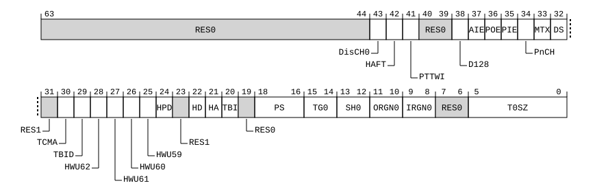

# ​D24.2.195 TCR_EL3, Translation Control Register (EL3)

Source: <https://developer.arm.com/documentation/ddi0487/mc/-Part-D-The-AArch64-System-Level-Architecture/-Chapter-D24-AArch64-System-Register-Descriptions/-D24-2-General-system-control-registers/-D24-2-195-TCR-EL3--Translation-Control-Register--EL3->

##### D24.2.195 TCR\_EL3, Translation Control Register (EL3)

The TCR\_EL3 characteristics are:

Purpose
:   The control register for stage 1 of the EL3 translation regime.

Configuration
:   This register is present only when EL3 is implemented and FEAT\_AA64 is implemented. Otherwise, direct accesses to TCR\_EL3 are UNDEFINED.

Attributes
:   TCR\_EL3 is a 64-bit register.

###### Field descriptions



Unless stated otherwise, any of the bits in TCR\_EL3 are permitted to be cached in a TLB.

Bits [63:44]
:   Reserved, RES0.

DisCH0, bit [43]
:   When FEAT\_D128 is implemented and TCR\_EL3.D128 == '1':
    :   Disable the Contiguous bit for the Start Table.

<table>
 <colgroup>
  <col/>
  <col/>
 </colgroup>
 <thead>
  <tr>
   <th>
    <strong>
     DisCH0
    </strong>
   </th>
   <th>
    <strong>
     Meaning
    </strong>
   </th>
  </tr>
 </thead>
 <tbody>
  <tr>
   <td>
    <p>
     <code>
      0b0
     </code>
    </p>
   </td>
   <td>
    <p>
     The Contiguous bit of Block or Page descriptors of the Start Table is not affected by this field.
    </p>
   </td>
  </tr>
  <tr>
   <td>
    <p>
     <code>
      0b1
     </code>
    </p>
   </td>
   <td>
    <p>
     The Contiguous bit of Block or Page descriptors of the Start Table is treated as 0.
    </p>
   </td>
  </tr>
 </tbody>
</table>

        The reset behavior of this field is:

        - On a Warm reset, this field resets to an architecturally UNKNOWN value.

    Otherwise:
    :   Reserved, RES0.

HAFT, bit [42]
:   When FEAT\_HAFT is implemented:
    :   Hardware managed Access Flag for Table descriptors.

        Enables the Hardware managed Access Flag for Table descriptors.

<table>
 <colgroup>
  <col/>
  <col/>
 </colgroup>
 <thead>
  <tr>
   <th>
    <strong>
     HAFT
    </strong>
   </th>
   <th>
    <strong>
     Meaning
    </strong>
   </th>
  </tr>
 </thead>
 <tbody>
  <tr>
   <td>
    <p>
     <code>
      0b0
     </code>
    </p>
   </td>
   <td>
    <p>
     Hardware managed Access Flag for Table descriptors is disabled.
    </p>
   </td>
  </tr>
  <tr>
   <td>
    <p>
     <code>
      0b1
     </code>
    </p>
   </td>
   <td>
    <p>
     Hardware managed Access Flag for Table descriptors is enabled.
    </p>
   </td>
  </tr>
 </tbody>
</table>

        The reset behavior of this field is:

        - On a Warm reset, this field resets to an architecturally UNKNOWN value.

    Otherwise:
    :   Reserved, RES0.

PTTWI, bit [41]
:   When FEAT\_THE is implemented:
    :   Permit Translation table walk Incoherence.

        Permits RCWS instructions to generate writes that have the Reduced Coherence property.

<table>
 <colgroup>
  <col/>
  <col/>
 </colgroup>
 <thead>
  <tr>
   <th>
    <strong>
     PTTWI
    </strong>
   </th>
   <th>
    <strong>
     Meaning
    </strong>
   </th>
  </tr>
 </thead>
 <tbody>
  <tr>
   <td>
    <p>
     <code>
      0b0
     </code>
    </p>
   </td>
   <td>
    <p>
     Write accesses generated by RCWS at EL3 do not have the Reduced Coherence property.
    </p>
   </td>
  </tr>
  <tr>
   <td>
    <p>
     <code>
      0b1
     </code>
    </p>
   </td>
   <td>
    <p>
     Write accesses generated by RCWS at EL3 have the Reduced Coherence property.
    </p>
   </td>
  </tr>
 </tbody>
</table>

        This bit is permitted to be implemented as a read-only bit with a fixed value of 0.

        The reset behavior of this field is:

        - On a Warm reset, this field resets to an architecturally UNKNOWN value.

    Otherwise:
    :   Reserved, RES0.

Bits [40:39]
:   Reserved, RES0.

D128, bit [38]
:   When FEAT\_D128 is implemented:
    :   Enables VMSAv9-128 translation system.

<table>
 <colgroup>
  <col/>
  <col/>
 </colgroup>
 <thead>
  <tr>
   <th>
    <strong>
     D128
    </strong>
   </th>
   <th>
    <strong>
     Meaning
    </strong>
   </th>
  </tr>
 </thead>
 <tbody>
  <tr>
   <td>
    <p>
     <code>
      0b0
     </code>
    </p>
   </td>
   <td>
    <p>
     Translation system follows VMSAv8-64 translation process.
    </p>
   </td>
  </tr>
  <tr>
   <td>
    <p>
     <code>
      0b1
     </code>
    </p>
   </td>
   <td>
    <p>
     Translation system follows VMSAv9-128 translation process.
    </p>
   </td>
  </tr>
 </tbody>
</table>

        The reset behavior of this field is:

        - On a Warm reset, this field resets to an architecturally UNKNOWN value.

    Otherwise:
    :   Reserved, RES0.

AIE, bit [37]
:   When FEAT\_AIE is implemented:
    :   Enable Attribute Indexing Extension.

<table>
 <colgroup>
  <col/>
  <col/>
 </colgroup>
 <thead>
  <tr>
   <th>
    <strong>
     AIE
    </strong>
   </th>
   <th>
    <strong>
     Meaning
    </strong>
   </th>
  </tr>
 </thead>
 <tbody>
  <tr>
   <td>
    <p>
     <code>
      0b0
     </code>
    </p>
   </td>
   <td>
    <p>
     Attribute Indexing Extension Disabled.
    </p>
   </td>
  </tr>
  <tr>
   <td>
    <p>
     <code>
      0b1
     </code>
    </p>
   </td>
   <td>
    <p>
     Attribute Indexing Extension Enabled.
    </p>
   </td>
  </tr>
 </tbody>
</table>

        The reset behavior of this field is:

        - On a Warm reset, this field resets to an architecturally UNKNOWN value.

    Otherwise:
    :   Reserved, RES0.

POE, bit [36]
:   When FEAT\_S1POE is implemented:
    :   Enables Permission Overlay for EL3 accesses.

<table>
 <colgroup>
  <col/>
  <col/>
 </colgroup>
 <thead>
  <tr>
   <th>
    <strong>
     POE
    </strong>
   </th>
   <th>
    <strong>
     Meaning
    </strong>
   </th>
  </tr>
 </thead>
 <tbody>
  <tr>
   <td>
    <p>
     <code>
      0b0
     </code>
    </p>
   </td>
   <td>
    <p>
     Permission overlay disabled for EL3 access in stage 1 of EL3 translation regime.
    </p>
   </td>
  </tr>
  <tr>
   <td>
    <p>
     <code>
      0b1
     </code>
    </p>
   </td>
   <td>
    <p>
     Permission overlay enabled for EL3 access in stage 1 of EL3 translation regime.
    </p>
   </td>
  </tr>
 </tbody>
</table>

        This bit is not permitted to be cached in a TLB.

        The reset behavior of this field is:

        - On a Warm reset, this field resets to an architecturally UNKNOWN value.

    Otherwise:
    :   Reserved, RES0.

PIE, bit [35]
:   When FEAT\_S1PIE is implemented:
    :   Enables usage of Indirect Permission Scheme.

<table>
 <colgroup>
  <col/>
  <col/>
 </colgroup>
 <thead>
  <tr>
   <th>
    <strong>
     PIE
    </strong>
   </th>
   <th>
    <strong>
     Meaning
    </strong>
   </th>
  </tr>
 </thead>
 <tbody>
  <tr>
   <td>
    <p>
     <code>
      0b0
     </code>
    </p>
   </td>
   <td>
    <p>
     Direct permission model.
    </p>
   </td>
  </tr>
  <tr>
   <td>
    <p>
     <code>
      0b1
     </code>
    </p>
   </td>
   <td>
    <p>
     Indirect permission model.
    </p>
   </td>
  </tr>
 </tbody>
</table>

        This field is RES1 when TCR\_EL3.D128 is 1.

        The reset behavior of this field is:

        - On a Warm reset, this field resets to an architecturally UNKNOWN value.

    Otherwise:
    :   Reserved, RES0.

PnCH, bit [34]
:   When FEAT\_THE is implemented:
    :   Protected attribute enable. Enables use of bit[52] of the stage 1 translation table entries as the Protected bit, for translations using [TTBR0\_EL3](/documentation/ddi0487/mc/-Part-D-The-AArch64-System-Level-Architecture/-Chapter-D24-AArch64-System-Register-Descriptions/-D24-2-General-system-control-registers/-D24-2-210-TTBR0-EL3--Translation-Table-Base-Register-0--EL3-?lang=en#reg_aarch64_ttbr0_el3).

<table>
 <colgroup>
  <col/>
  <col/>
 </colgroup>
 <thead>
  <tr>
   <th>
    <strong>
     PnCH
    </strong>
   </th>
   <th>
    <strong>
     Meaning
    </strong>
   </th>
  </tr>
 </thead>
 <tbody>
  <tr>
   <td>
    <p>
     <code>
      0b0
     </code>
    </p>
   </td>
   <td>
    <p>
     For translations using
     <a class="document-topic" document-topic-path="/ddi0487/mc/-Part-D-The-AArch64-System-Level-Architecture/-Chapter-D24-AArch64-System-Register-Descriptions/-D24-2-General-system-control-registers/-D24-2-210-TTBR0-EL3--Translation-Table-Base-Register-0--EL3-?lang=en#reg_aarch64_ttbr0_el3" href="/documentation/ddi0487/mc/-Part-D-The-AArch64-System-Level-Architecture/-Chapter-D24-AArch64-System-Register-Descriptions/-D24-2-General-system-control-registers/-D24-2-210-TTBR0-EL3--Translation-Table-Base-Register-0--EL3-?lang=en#reg_aarch64_ttbr0_el3">
      TTBR0_EL3
     </a>
     , bit[52] of each stage 1 translation table entry is not the Protected bit.
    </p>
   </td>
  </tr>
  <tr>
   <td>
    <p>
     <code>
      0b1
     </code>
    </p>
   </td>
   <td>
    <p>
     For translations using
     <a class="document-topic" document-topic-path="/ddi0487/mc/-Part-D-The-AArch64-System-Level-Architecture/-Chapter-D24-AArch64-System-Register-Descriptions/-D24-2-General-system-control-registers/-D24-2-210-TTBR0-EL3--Translation-Table-Base-Register-0--EL3-?lang=en#reg_aarch64_ttbr0_el3" href="/documentation/ddi0487/mc/-Part-D-The-AArch64-System-Level-Architecture/-Chapter-D24-AArch64-System-Register-Descriptions/-D24-2-General-system-control-registers/-D24-2-210-TTBR0-EL3--Translation-Table-Base-Register-0--EL3-?lang=en#reg_aarch64_ttbr0_el3">
      TTBR0_EL3
     </a>
     , bit[52] of each stage 1 translation table entry is the Protected bit.
    </p>
   </td>
  </tr>
 </tbody>
</table>

        If bit[52] is used as the Protected bit, it is not used as the Contiguous bit.

        This field is RES0 when TCR\_EL3.D128 is 1.

        The reset behavior of this field is:

        - On a Warm reset, this field resets to an architecturally UNKNOWN value.

    Otherwise:
    :   Reserved, RES0.

MTX, bit [33]
:   When FEAT\_MTE\_NO\_ADDRESS\_TAGS is implemented or FEAT\_MTE\_CANONICAL\_TAGS is implemented:
    :   Extended memory tag checking.

        This field controls address generation and Canonical tagging when EL3 is using AArch64 where the data address would be translated by tables pointed to by [TTBR0\_EL3](/documentation/ddi0487/mc/-Part-D-The-AArch64-System-Level-Architecture/-Chapter-D24-AArch64-System-Register-Descriptions/-D24-2-General-system-control-registers/-D24-2-210-TTBR0-EL3--Translation-Table-Base-Register-0--EL3-?lang=en#reg_aarch64_ttbr0_el3).

        This control has an effect regardless of whether stage 1 of the EL3 translation regime is enabled or not.

<table>
 <colgroup>
  <col/>
  <col/>
 </colgroup>
 <thead>
  <tr>
   <th>
    <strong>
     MTX
    </strong>
   </th>
   <th>
    <strong>
     Meaning
    </strong>
   </th>
  </tr>
 </thead>
 <tbody>
  <tr>
   <td>
    <p>
     <code>
      0b0
     </code>
    </p>
   </td>
   <td>
    <p>
     Canonical tagging is disabled.
    </p>
    <p>
     This control has no effect on address generation.
    </p>
   </td>
  </tr>
  <tr>
   <td>
    <p>
     <code>
      0b1
     </code>
    </p>
   </td>
   <td>
    <p>
     Canonical tagging is enabled.
    </p>
    <p>
     Bits[59:56] of a 64-bit VA hold a Logical Address Tag, and all of the following apply:
    </p>
    <ul>
     <li>
      <p>
       Bits[59:56] are treated as
       <code>
        0b0000
       </code>
       when checking if the address is out of range.
      </p>
     </li>
     <li>
      <p>
       If FEAT_PAuth is implemented, bits[59:56] are not part of the PAC field.
      </p>
     </li>
     <li>
      <p>
       A Canonical Tag Check operation is performed on Tag Checked memory accesses to a Canonically Tagged memory location.
      </p>
     </li>
    </ul>
   </td>
  </tr>
 </tbody>
</table>

        For more information see [Logical address tagging](/documentation/ddi0487/mc/-Part-D-The-AArch64-System-Level-Architecture/-Chapter-D8-The-AArch64-Virtual-Memory-System-Architecture/-D8-9-Logical-Address-Tagging?lang=en#mdsec_mte_tagging) and [Memory region tagging types](/documentation/ddi0487/mc/-Part-D-The-AArch64-System-Level-Architecture/-Chapter-D10-The-Memory-Tagging-Extension/-D10-3-Memory-region-tagging-types?lang=en#mdsec_tagged_memory).

        The reset behavior of this field is:

        - On a Warm reset, this field resets to an architecturally UNKNOWN value.

    Otherwise:
    :   Reserved, RES0.

DS, bit [32]
:   When FEAT\_LPA2 is implemented and (FEAT\_D128 is not implemented or TCR\_EL3.D128 == '0'):
    :   This field affects:

        - Whether a 52-bit output address can be described by the translation tables of the 4KB or 16KB translation granules.
        - The minimum value of TCR\_EL3.T0SZ.
        - How and where shareability for Block and Page descriptors are encoded.

<table>
 <colgroup>
  <col/>
  <col/>
 </colgroup>
 <thead>
  <tr>
   <th>
    <strong>
     DS
    </strong>
   </th>
   <th>
    <strong>
     Meaning
    </strong>
   </th>
  </tr>
 </thead>
 <tbody>
  <tr>
   <td>
    <p>
     <code>
      0b0
     </code>
    </p>
   </td>
   <td>
    <p>
     Bits[49:48] of translation descriptors are
     <small>
      RES0
     </small>
     .
    </p>
    <p>
     Bits[9:8] in Block and Page descriptors encode shareability information in the SH[1:0] field. Bits[9:8] in Table descriptors are ignored by hardware.
    </p>
    <p>
     The minimum value of TCR_EL3.T0SZ is 16. Any memory access using a smaller value generates a stage 1 level 0 translation table fault.
    </p>
    <p>
     Output address[51:48] is
     <code>
      0b0000
     </code>
     .
    </p>
   </td>
  </tr>
  <tr>
   <td>
    <p>
     <code>
      0b1
     </code>
    </p>
   </td>
   <td>
    <p>
     Bits[49:48] of translation descriptors hold output address[49:48].
    </p>
    <p>
     Bits[9:8] of table translation descriptors hold output address[51:50].
    </p>
    <p>
     The shareability information of Block and Page descriptors for cacheable locations is determined by TCR_EL3.SH0.
    </p>
    <p>
     The minimum value of TCR_EL3.T0SZ is 12. Any memory access using a smaller value generates a stage 1 level 0 translation table fault.
    </p>
    <p>
     All calculations of the stage 1 base address are modified for tables of fewer than 8 entries so that the table is aligned to 64 bytes.
    </p>
    <p>
     Bits[5:2] of
     <a class="document-topic" document-topic-path="/ddi0487/mc/-Part-D-The-AArch64-System-Level-Architecture/-Chapter-D24-AArch64-System-Register-Descriptions/-D24-2-General-system-control-registers/-D24-2-210-TTBR0-EL3--Translation-Table-Base-Register-0--EL3-?lang=en#reg_aarch64_ttbr0_el3" href="/documentation/ddi0487/mc/-Part-D-The-AArch64-System-Level-Architecture/-Chapter-D24-AArch64-System-Register-Descriptions/-D24-2-General-system-control-registers/-D24-2-210-TTBR0-EL3--Translation-Table-Base-Register-0--EL3-?lang=en#reg_aarch64_ttbr0_el3">
      TTBR0_EL3
     </a>
     are used to hold bits[51:48] of the output address in all cases.
    </p>
    <blockquote title="Note info">
     <h4>
      Note
     </h4>
     <p>
      As
      <a class="document-topic" document-topic-path="/ddi0487/mc/-Part-A-Arm-Architecture-Introduction-and-Overview/-Chapter-A2-A-profile-Architecture-Extensions/-A2-2-Armv8-A-architecture-extensions/-A2-2-3-The-Armv8-2-architecture-extension?lang=en#feat_feat_lva" href="/documentation/ddi0487/mc/-Part-A-Arm-Architecture-Introduction-and-Overview/-Chapter-A2-A-profile-Architecture-Extensions/-A2-2-Armv8-A-architecture-extensions/-A2-2-3-The-Armv8-2-architecture-extension?lang=en#feat_feat_lva">
       FEAT_LVA
      </a>
      must be implemented if TCR_EL3.DS == 1, the minimum value of the TCR_EL3.T0SZ field is 12, as determined by that extension.
     </p>
    </blockquote>
    <p>
     For the TLBI Range instructions affecting VA, the format of the argument is changed so that bits[36:0] hold BaseADDR[52:16]. For the 4KB translation granule, bits[15:12] of BaseADDR are treated as
     <code>
      0b0000
     </code>
     . For the 16KB translation granule, bits[15:14] of BaseADDR are treated as
     <code>
      0b00
     </code>
     .
    </p>
    <blockquote title="Note info">
     <h4>
      Note
     </h4>
     <p>
      This forces alignment of the ranges used by the TLBI range instructions.
     </p>
    </blockquote>
   </td>
  </tr>
 </tbody>
</table>

        This field is RES0 for a 64KB translation granule.

        The reset behavior of this field is:

        - On a Warm reset, this field resets to an architecturally UNKNOWN value.

    Otherwise:
    :   The Effective value of this bit is 0.

        Access to this field is RES0.

Bit [31]
:   Reserved, RES1.

TCMA, bit [30]
:   When FEAT\_MTE2 is implemented:
    :   Controls the generation of Unchecked accesses at EL3 when address [59:56] = `0b0000`.

<table>
 <colgroup>
  <col/>
  <col/>
 </colgroup>
 <thead>
  <tr>
   <th>
    <strong>
     TCMA
    </strong>
   </th>
   <th>
    <strong>
     Meaning
    </strong>
   </th>
  </tr>
 </thead>
 <tbody>
  <tr>
   <td>
    <p>
     <code>
      0b0
     </code>
    </p>
   </td>
   <td>
    <p>
     This control has no effect on the generation of Unchecked accesses.
    </p>
   </td>
  </tr>
  <tr>
   <td>
    <p>
     <code>
      0b1
     </code>
    </p>
   </td>
   <td>
    <p>
     All accesses are Unchecked.
    </p>
   </td>
  </tr>
 </tbody>
</table>

        The reset behavior of this field is:

        - On a Warm reset, this field resets to an architecturally UNKNOWN value.

    Otherwise:
    :   Reserved, RES0.

TBID, bit [29]
:   When FEAT\_PAuth is implemented:
    :   Controls the use of the top byte of instruction addresses for address matching.

<table>
 <colgroup>
  <col/>
  <col/>
 </colgroup>
 <thead>
  <tr>
   <th>
    <strong>
     TBID
    </strong>
   </th>
   <th>
    <strong>
     Meaning
    </strong>
   </th>
  </tr>
 </thead>
 <tbody>
  <tr>
   <td>
    <p>
     <code>
      0b0
     </code>
    </p>
   </td>
   <td>
    <p>
     TCR_EL3.TBI applies to Instruction and Data accesses.
    </p>
   </td>
  </tr>
  <tr>
   <td>
    <p>
     <code>
      0b1
     </code>
    </p>
   </td>
   <td>
    <p>
     TCR_EL3.TBI applies to Data accesses only.
    </p>
   </td>
  </tr>
 </tbody>
</table>

        This affects addresses where the address would be translated by tables pointed to by [TTBR0\_EL3](/documentation/ddi0487/mc/-Part-D-The-AArch64-System-Level-Architecture/-Chapter-D24-AArch64-System-Register-Descriptions/-D24-2-General-system-control-registers/-D24-2-210-TTBR0-EL3--Translation-Table-Base-Register-0--EL3-?lang=en#reg_aarch64_ttbr0_el3). It has an effect whether the EL3 translation regime is enabled or not.

        For the purpose of this field, all cache maintenance and address translation instructions that perform address translation are treated as data accesses.

        The reset behavior of this field is:

        - On a Warm reset, this field resets to an architecturally UNKNOWN value.

    Otherwise:
    :   Reserved, RES0.

HWU62, bit [28]
:   When FEAT\_HPDS2 is implemented:
    :   Hardware Use. Indicates IMPLEMENTATION DEFINED hardware use of bit[62] of the stage 1 translation table Block or Page entry.

<table>
 <colgroup>
  <col/>
  <col/>
 </colgroup>
 <thead>
  <tr>
   <th>
    <strong>
     HWU62
    </strong>
   </th>
   <th>
    <strong>
     Meaning
    </strong>
   </th>
  </tr>
 </thead>
 <tbody>
  <tr>
   <td>
    <p>
     <code>
      0b0
     </code>
    </p>
   </td>
   <td>
    <p>
     Bit[62] of each stage 1 translation table Block or Page entry cannot be used by hardware for an
     <small>
      IMPLEMENTATION DEFINED
     </small>
     purpose.
    </p>
   </td>
  </tr>
  <tr>
   <td>
    <p>
     <code>
      0b1
     </code>
    </p>
   </td>
   <td>
    <p>
     Bit[62] of each stage 1 translation table Block or Page entry can be used by hardware for an
     <small>
      IMPLEMENTATION DEFINED
     </small>
     purpose if the value of TCR_EL3.HPD is 1.
    </p>
   </td>
  </tr>
 </tbody>
</table>

        The Effective value of this field is 0 if the value of TCR\_EL3.HPD is 0.

        The reset behavior of this field is:

        - On a Warm reset, this field resets to an architecturally UNKNOWN value.

    Otherwise:
    :   Reserved, RES0.

HWU61, bit [27]
:   When FEAT\_HPDS2 is implemented:
    :   Hardware Use. Indicates IMPLEMENTATION DEFINED hardware use of bit[61] of the stage 1 translation table Block or Page entry.

<table>
 <colgroup>
  <col/>
  <col/>
 </colgroup>
 <thead>
  <tr>
   <th>
    <strong>
     HWU61
    </strong>
   </th>
   <th>
    <strong>
     Meaning
    </strong>
   </th>
  </tr>
 </thead>
 <tbody>
  <tr>
   <td>
    <p>
     <code>
      0b0
     </code>
    </p>
   </td>
   <td>
    <p>
     Bit[61] of each stage 1 translation table Block or Page entry cannot be used by hardware for an
     <small>
      IMPLEMENTATION DEFINED
     </small>
     purpose.
    </p>
   </td>
  </tr>
  <tr>
   <td>
    <p>
     <code>
      0b1
     </code>
    </p>
   </td>
   <td>
    <p>
     Bit[61] of each stage 1 translation table Block or Page entry can be used by hardware for an
     <small>
      IMPLEMENTATION DEFINED
     </small>
     purpose if the value of TCR_EL3.HPD is 1.
    </p>
   </td>
  </tr>
 </tbody>
</table>

        The Effective value of this field is 0 if the value of TCR\_EL3.HPD is 0.

        The reset behavior of this field is:

        - On a Warm reset, this field resets to an architecturally UNKNOWN value.

    Otherwise:
    :   Reserved, RES0.

HWU60, bit [26]
:   When FEAT\_HPDS2 is implemented:
    :   Hardware Use. Indicates IMPLEMENTATION DEFINED hardware use of bit[60] of the stage 1 translation table Block or Page entry.

<table>
 <colgroup>
  <col/>
  <col/>
 </colgroup>
 <thead>
  <tr>
   <th>
    <strong>
     HWU60
    </strong>
   </th>
   <th>
    <strong>
     Meaning
    </strong>
   </th>
  </tr>
 </thead>
 <tbody>
  <tr>
   <td>
    <p>
     <code>
      0b0
     </code>
    </p>
   </td>
   <td>
    <p>
     Bit[60] of each stage 1 translation table Block or Page entry cannot be used by hardware for an
     <small>
      IMPLEMENTATION DEFINED
     </small>
     purpose.
    </p>
   </td>
  </tr>
  <tr>
   <td>
    <p>
     <code>
      0b1
     </code>
    </p>
   </td>
   <td>
    <p>
     Bit[60] of each stage 1 translation table Block or Page entry can be used by hardware for an
     <small>
      IMPLEMENTATION DEFINED
     </small>
     purpose if the value of TCR_EL3.HPD is 1.
    </p>
   </td>
  </tr>
 </tbody>
</table>

        The Effective value of this field is 0 if the value of TCR\_EL3.HPD is 0.

        The reset behavior of this field is:

        - On a Warm reset, this field resets to an architecturally UNKNOWN value.

    Otherwise:
    :   Reserved, RES0.

HWU59, bit [25]
:   When FEAT\_HPDS2 is implemented:
    :   Hardware Use. Indicates IMPLEMENTATION DEFINED hardware use of bit[59] of the stage 1 translation table Block or Page entry.

<table>
 <colgroup>
  <col/>
  <col/>
 </colgroup>
 <thead>
  <tr>
   <th>
    <strong>
     HWU59
    </strong>
   </th>
   <th>
    <strong>
     Meaning
    </strong>
   </th>
  </tr>
 </thead>
 <tbody>
  <tr>
   <td>
    <p>
     <code>
      0b0
     </code>
    </p>
   </td>
   <td>
    <p>
     Bit[59] of each stage 1 translation table Block or Page entry cannot be used by hardware for an
     <small>
      IMPLEMENTATION DEFINED
     </small>
     purpose.
    </p>
   </td>
  </tr>
  <tr>
   <td>
    <p>
     <code>
      0b1
     </code>
    </p>
   </td>
   <td>
    <p>
     Bit[59] of each stage 1 translation table Block or Page entry can be used by hardware for an
     <small>
      IMPLEMENTATION DEFINED
     </small>
     purpose if the value of TCR_EL3.HPD is 1.
    </p>
   </td>
  </tr>
 </tbody>
</table>

        The Effective value of this field is 0 if the value of TCR\_EL3.HPD is 0.

        The reset behavior of this field is:

        - On a Warm reset, this field resets to an architecturally UNKNOWN value.

    Otherwise:
    :   Reserved, RES0.

HPD, bit [24]
:   When FEAT\_HPDS is implemented:
    :   Hierarchical Permission Disables. This affects the hierarchical control bits, APTable, PXNTable, and UXNTable, except NSTable, in the translation tables pointed to by [TTBR0\_EL3](/documentation/ddi0487/mc/-Part-D-The-AArch64-System-Level-Architecture/-Chapter-D24-AArch64-System-Register-Descriptions/-D24-2-General-system-control-registers/-D24-2-210-TTBR0-EL3--Translation-Table-Base-Register-0--EL3-?lang=en#reg_aarch64_ttbr0_el3).

<table>
 <colgroup>
  <col/>
  <col/>
 </colgroup>
 <thead>
  <tr>
   <th>
    <strong>
     HPD
    </strong>
   </th>
   <th>
    <strong>
     Meaning
    </strong>
   </th>
  </tr>
 </thead>
 <tbody>
  <tr>
   <td>
    <p>
     <code>
      0b0
     </code>
    </p>
   </td>
   <td>
    <p>
     Hierarchical permissions are enabled.
    </p>
   </td>
  </tr>
  <tr>
   <td>
    <p>
     <code>
      0b1
     </code>
    </p>
   </td>
   <td>
    <p>
     Hierarchical permissions are disabled.
    </p>
    <blockquote title="Note info">
     <h4>
      Note
     </h4>
     <p>
      In this case, bit[61] (APTable[0]) and bit[59] (PXNTable) of the next level descriptor attributes are required to be ignored by the PE, and are no longer reserved, allowing them to be used by software.
     </p>
    </blockquote>
   </td>
  </tr>
 </tbody>
</table>

        When disabled, the permissions are treated as if the bits are zero.

        The reset behavior of this field is:

        - On a Warm reset, this field resets to an architecturally UNKNOWN value.

    Otherwise:
    :   Reserved, RES0.

Bit [23]
:   Reserved, RES1.

HD, bit [22]
:   When FEAT\_HAFDBS is implemented:
    :   Hardware management of dirty state in stage 1 translations from EL3.

<table>
 <colgroup>
  <col/>
  <col/>
 </colgroup>
 <thead>
  <tr>
   <th>
    <strong>
     HD
    </strong>
   </th>
   <th>
    <strong>
     Meaning
    </strong>
   </th>
  </tr>
 </thead>
 <tbody>
  <tr>
   <td>
    <p>
     <code>
      0b0
     </code>
    </p>
   </td>
   <td>
    <p>
     Stage 1 hardware management of dirty state disabled.
    </p>
   </td>
  </tr>
  <tr>
   <td>
    <p>
     <code>
      0b1
     </code>
    </p>
   </td>
   <td>
    <p>
     Stage 1 hardware management of dirty state enabled.
    </p>
   </td>
  </tr>
 </tbody>
</table>

        When the [Effective value](/documentation/ddi0487/mc/-Part-K-Appendixes/Glossary?lang=en#effective_value) of TCR\_EL3.HA is 0, this field behaves as 0 for all purposes other than a direct read of the value of this field.

        The reset behavior of this field is:

        - On a Warm reset, this field resets to an architecturally UNKNOWN value.

    Otherwise:
    :   Reserved, RES0.

HA, bit [21]
:   When FEAT\_HAF is implemented:
    :   Hardware Access flag update in stage 1 translations from EL3.

<table>
 <colgroup>
  <col/>
  <col/>
 </colgroup>
 <thead>
  <tr>
   <th>
    <strong>
     HA
    </strong>
   </th>
   <th>
    <strong>
     Meaning
    </strong>
   </th>
  </tr>
 </thead>
 <tbody>
  <tr>
   <td>
    <p>
     <code>
      0b0
     </code>
    </p>
   </td>
   <td>
    <p>
     Stage 1 Access flag update disabled.
    </p>
   </td>
  </tr>
  <tr>
   <td>
    <p>
     <code>
      0b1
     </code>
    </p>
   </td>
   <td>
    <p>
     Stage 1 Access flag update enabled.
    </p>
   </td>
  </tr>
 </tbody>
</table>

        The reset behavior of this field is:

        - On a Warm reset, this field resets to an architecturally UNKNOWN value.

    Otherwise:
    :   Reserved, RES0.

TBI, bit [20]
:   Top Byte Ignored. Indicates whether the top byte of an address is used for address match for the [TTBR0\_EL3](/documentation/ddi0487/mc/-Part-D-The-AArch64-System-Level-Architecture/-Chapter-D24-AArch64-System-Register-Descriptions/-D24-2-General-system-control-registers/-D24-2-210-TTBR0-EL3--Translation-Table-Base-Register-0--EL3-?lang=en#reg_aarch64_ttbr0_el3) region, or ignored and used for tagged addresses.

<table>
 <colgroup>
  <col/>
  <col/>
 </colgroup>
 <thead>
  <tr>
   <th>
    <strong>
     TBI
    </strong>
   </th>
   <th>
    <strong>
     Meaning
    </strong>
   </th>
  </tr>
 </thead>
 <tbody>
  <tr>
   <td>
    <p>
     <code>
      0b0
     </code>
    </p>
   </td>
   <td>
    <p>
     Top Byte used in the address calculation.
    </p>
   </td>
  </tr>
  <tr>
   <td>
    <p>
     <code>
      0b1
     </code>
    </p>
   </td>
   <td>
    <p>
     Top Byte ignored in the address calculation.
    </p>
   </td>
  </tr>
 </tbody>
</table>

    This affects addresses generated at EL3 using AArch64 where the address would be translated by tables pointed to by [TTBR0\_EL3](/documentation/ddi0487/mc/-Part-D-The-AArch64-System-Level-Architecture/-Chapter-D24-AArch64-System-Register-Descriptions/-D24-2-General-system-control-registers/-D24-2-210-TTBR0-EL3--Translation-Table-Base-Register-0--EL3-?lang=en#reg_aarch64_ttbr0_el3). It has an effect whether the EL3 translation regime is enabled or not.

    If [FEAT\_PAuth](/documentation/ddi0487/mc/-Part-A-Arm-Architecture-Introduction-and-Overview/-Chapter-A2-A-profile-Architecture-Extensions/-A2-2-Armv8-A-architecture-extensions/-A2-2-4-The-Armv8-3-architecture-extension?lang=en#feat_feat_pauth) is implemented and TCR\_EL3.TBID is 1, then this field only applies to Data accesses.

    Otherwise, if the value of TBI is 1, then bits[63:56] of that target address are also set to 0 before the address is stored in the PC, in the following cases:

    - A branch or procedure return within EL3.
    - A exception taken to EL3.
    - An exception return to EL3.

    For more information, see [‘Address tagging’](/documentation/ddi0487/mc/-Part-D-The-AArch64-System-Level-Architecture/-Chapter-D8-The-AArch64-Virtual-Memory-System-Architecture/-D8-8-Address-tagging?lang=en#mdsec_address_tagging).

    > #### Note
    >
    > This control determines the scope of address tagging. It never causes an exception to be generated.

    The reset behavior of this field is:

    - On a Warm reset, this field resets to an architecturally UNKNOWN value.

Bit [19]
:   Reserved, RES0.

PS, bits [18:16]
:   Physical Address Size.

<table>
 <colgroup>
  <col/>
  <col/>
 </colgroup>
 <thead>
  <tr>
   <th>
    <strong>
     PS
    </strong>
   </th>
   <th>
    <strong>
     Meaning
    </strong>
   </th>
  </tr>
 </thead>
 <tbody>
  <tr>
   <td>
    <p>
     <code>
      0b000
     </code>
    </p>
   </td>
   <td>
    <p>
     32 bits, 4GB.
    </p>
   </td>
  </tr>
  <tr>
   <td>
    <p>
     <code>
      0b001
     </code>
    </p>
   </td>
   <td>
    <p>
     36 bits, 64GB.
    </p>
   </td>
  </tr>
  <tr>
   <td>
    <p>
     <code>
      0b010
     </code>
    </p>
   </td>
   <td>
    <p>
     40 bits, 1TB.
    </p>
   </td>
  </tr>
  <tr>
   <td>
    <p>
     <code>
      0b011
     </code>
    </p>
   </td>
   <td>
    <p>
     42 bits, 4TB.
    </p>
   </td>
  </tr>
  <tr>
   <td>
    <p>
     <code>
      0b100
     </code>
    </p>
   </td>
   <td>
    <p>
     44 bits, 16TB.
    </p>
   </td>
  </tr>
  <tr>
   <td>
    <p>
     <code>
      0b101
     </code>
    </p>
   </td>
   <td>
    <p>
     48 bits, 256TB.
    </p>
   </td>
  </tr>
  <tr>
   <td>
    <p>
     <code>
      0b110
     </code>
    </p>
   </td>
   <td>
    <p>
     52 bits, 4PB.
    </p>
   </td>
  </tr>
  <tr>
   <td>
    <p>
     <code>
      0b111
     </code>
    </p>
   </td>
   <td>
    <p>
     56 bits, 64PB.
    </p>
   </td>
  </tr>
 </tbody>
</table>

    The values `0b110` and `0b111` represent different output address sizes depending on implementation choices and translation configuration.

    The following table captures the output address size represented by the value `0b110`:

<table>
 <colgroup>
  <col/>
  <col/>
  <col/>
  <col/>
  <col/>
 </colgroup>
 <thead>
  <tr>
   <th>
    Descriptor Format
   </th>
   <th>
    ID_AA64MMFR0_EL1.PARange
   </th>
   <th>
    Translation Granule
   </th>
   <th>
    DS
    <sup>
     1
    </sup>
   </th>
   <th>
    Represented OA size
   </th>
  </tr>
 </thead>
 <tbody>
  <tr>
   <td>
    Any
   </td>
   <td>
    <code>
     0b0101
    </code>
   </td>
   <td>
    Any
   </td>
   <td>
    Any
   </td>
   <td>
    48 bits, 256TB
   </td>
  </tr>
  <tr>
   <td>
    VMSAv8-64
   </td>
   <td>
    <code>
     0b011x
    </code>
   </td>
   <td>
    4KB or 16KB
   </td>
   <td>
    0
   </td>
   <td>
    48 bits, 256TB
   </td>
  </tr>
  <tr>
   <td>
    VMSAv8-64
   </td>
   <td>
    <code>
     0b011x
    </code>
   </td>
   <td>
    4KB or 16KB
   </td>
   <td>
    1
   </td>
   <td>
    52 bits, 4PB
   </td>
  </tr>
  <tr>
   <td>
    VMSAv8-64
   </td>
   <td>
    <code>
     0b011x
    </code>
   </td>
   <td>
    64KB
   </td>
   <td>
    N/A
   </td>
   <td>
    52 bits, 4PB
   </td>
  </tr>
  <tr>
   <td>
    VMSAv9-128
   </td>
   <td>
    <code>
     0b011x
    </code>
   </td>
   <td>
    Any
   </td>
   <td>
    N/A
   </td>
   <td>
    52 bits, 4PB
   </td>
  </tr>
 </tbody>
</table>

    1 This column represents the value of [TCR\_EL3](/documentation/ddi0487/mc/-Part-D-The-AArch64-System-Level-Architecture/-Chapter-D24-AArch64-System-Register-Descriptions/-D24-2-General-system-control-registers/-D24-2-195-TCR-EL3--Translation-Control-Register--EL3-?lang=en#reg_aarch64_tcr_el3).DS.

    The following table captures the output address size represented by the value `0b111`:

<table>
 <colgroup>
  <col/>
  <col/>
  <col/>
  <col/>
 </colgroup>
 <thead>
  <tr>
   <th>
    Descriptor Format
   </th>
   <th>
    ID_AA64MMFR0_EL1.PARange
   </th>
   <th>
    Translation Granule
   </th>
   <th>
    Represented OA size
   </th>
  </tr>
 </thead>
 <tbody>
  <tr>
   <td>
    Any
   </td>
   <td>
    <code>
     0b0110
    </code>
   </td>
   <td>
    Any
   </td>
   <td>
    OA size represented by
    <code>
     0b110
    </code>
   </td>
  </tr>
  <tr>
   <td>
    VMSAv8-64
   </td>
   <td>
    <code>
     0b0111
    </code>
   </td>
   <td>
    Any
   </td>
   <td>
    OA size represented by
    <code>
     0b110
    </code>
   </td>
  </tr>
  <tr>
   <td>
    VMSAv9-128
   </td>
   <td>
    <code>
     0b0111
    </code>
   </td>
   <td>
    Any
   </td>
   <td>
    56 bits, 64PB
   </td>
  </tr>
 </tbody>
</table>

    If 52-bit PA is supported, and the translation table descriptors cannot express an OA larger than 48-bits, then bits[51:48] of every translation table base address are treated as `0b0000` for the stage of translation controlled by [TCR\_EL3](/documentation/ddi0487/mc/-Part-D-The-AArch64-System-Level-Architecture/-Chapter-D24-AArch64-System-Register-Descriptions/-D24-2-General-system-control-registers/-D24-2-195-TCR-EL3--Translation-Control-Register--EL3-?lang=en#reg_aarch64_tcr_el3).

    If 56-bit PA is supported, and the translation table descriptors cannot express an OA larger than 52-bits, then bits[55:52] of every translation table base address are treated as `0b0000` for the stage of translation controlled by [TCR\_EL3](/documentation/ddi0487/mc/-Part-D-The-AArch64-System-Level-Architecture/-Chapter-D24-AArch64-System-Register-Descriptions/-D24-2-General-system-control-registers/-D24-2-195-TCR-EL3--Translation-Control-Register--EL3-?lang=en#reg_aarch64_tcr_el3).

    If the output address size represented by this field is larger than the supported PA size expressed in [ID\_AA64MMFR0\_EL1](/documentation/ddi0487/mc/-Part-D-The-AArch64-System-Level-Architecture/-Chapter-D24-AArch64-System-Register-Descriptions/-D24-2-General-system-control-registers/-D24-2-87-ID-AA64MMFR0-EL1--AArch64-Memory-Model-Feature-Register-0?lang=en#reg_aarch64_id_aa64mmfr0_el1).PARange, then the output address size is treated as being the same as the supported PA size. Arm strongly recommends that software avoids configuring this field to a value representing an output address size larger than the supported PA size.

    The reset behavior of this field is:

    - On a Warm reset, this field resets to an architecturally UNKNOWN value.

TG0, bits [15:14]
:   Granule size for the [TTBR0\_EL3](/documentation/ddi0487/mc/-Part-D-The-AArch64-System-Level-Architecture/-Chapter-D24-AArch64-System-Register-Descriptions/-D24-2-General-system-control-registers/-D24-2-210-TTBR0-EL3--Translation-Table-Base-Register-0--EL3-?lang=en#reg_aarch64_ttbr0_el3).

<table>
 <colgroup>
  <col/>
  <col/>
 </colgroup>
 <thead>
  <tr>
   <th>
    <strong>
     TG0
    </strong>
   </th>
   <th>
    <strong>
     Meaning
    </strong>
   </th>
  </tr>
 </thead>
 <tbody>
  <tr>
   <td>
    <p>
     <code>
      0b00
     </code>
    </p>
   </td>
   <td>
    <p>
     4KB.
    </p>
   </td>
  </tr>
  <tr>
   <td>
    <p>
     <code>
      0b01
     </code>
    </p>
   </td>
   <td>
    <p>
     64KB.
    </p>
   </td>
  </tr>
  <tr>
   <td>
    <p>
     <code>
      0b10
     </code>
    </p>
   </td>
   <td>
    <p>
     16KB.
    </p>
   </td>
  </tr>
 </tbody>
</table>

    Other values are reserved.

    If the value is programmed to either a reserved value or a size that has not been implemented, then the hardware will treat the field as if it has been programmed to an IMPLEMENTATION DEFINED choice of the sizes that has been implemented for all purposes other than the value read back from this register.

    It is IMPLEMENTATION DEFINED whether the value read back is the value programmed or the value that corresponds to the size chosen.

    The reset behavior of this field is:

    - On a Warm reset, this field resets to an architecturally UNKNOWN value.

SH0, bits [13:12]
:   Shareability attribute for memory associated with translation table walks using [TTBR0\_EL3](/documentation/ddi0487/mc/-Part-D-The-AArch64-System-Level-Architecture/-Chapter-D24-AArch64-System-Register-Descriptions/-D24-2-General-system-control-registers/-D24-2-210-TTBR0-EL3--Translation-Table-Base-Register-0--EL3-?lang=en#reg_aarch64_ttbr0_el3).

<table>
 <colgroup>
  <col/>
  <col/>
 </colgroup>
 <thead>
  <tr>
   <th>
    <strong>
     SH0
    </strong>
   </th>
   <th>
    <strong>
     Meaning
    </strong>
   </th>
  </tr>
 </thead>
 <tbody>
  <tr>
   <td>
    <p>
     <code>
      0b00
     </code>
    </p>
   </td>
   <td>
    <p>
     Non-shareable.
    </p>
   </td>
  </tr>
  <tr>
   <td>
    <p>
     <code>
      0b10
     </code>
    </p>
   </td>
   <td>
    <p>
     Outer Shareable.
    </p>
   </td>
  </tr>
  <tr>
   <td>
    <p>
     <code>
      0b11
     </code>
    </p>
   </td>
   <td>
    <p>
     Inner Shareable.
    </p>
   </td>
  </tr>
 </tbody>
</table>

    Other values are reserved. The effect of programming this field to a Reserved value is that behavior is CONSTRAINED UNPREDICTABLE.

    The reset behavior of this field is:

    - On a Warm reset, this field resets to an architecturally UNKNOWN value.

ORGN0, bits [11:10]
:   Outer Cacheability attribute for memory associated with translation table walks using [TTBR0\_EL3](/documentation/ddi0487/mc/-Part-D-The-AArch64-System-Level-Architecture/-Chapter-D24-AArch64-System-Register-Descriptions/-D24-2-General-system-control-registers/-D24-2-210-TTBR0-EL3--Translation-Table-Base-Register-0--EL3-?lang=en#reg_aarch64_ttbr0_el3).

<table>
 <colgroup>
  <col/>
  <col/>
 </colgroup>
 <thead>
  <tr>
   <th>
    <strong>
     ORGN0
    </strong>
   </th>
   <th>
    <strong>
     Meaning
    </strong>
   </th>
  </tr>
 </thead>
 <tbody>
  <tr>
   <td>
    <p>
     <code>
      0b00
     </code>
    </p>
   </td>
   <td>
    <p>
     Normal memory, Outer Non-cacheable.
    </p>
   </td>
  </tr>
  <tr>
   <td>
    <p>
     <code>
      0b01
     </code>
    </p>
   </td>
   <td>
    <p>
     Normal memory, Outer Write-Back Read-Allocate Write-Allocate Cacheable.
    </p>
   </td>
  </tr>
  <tr>
   <td>
    <p>
     <code>
      0b10
     </code>
    </p>
   </td>
   <td>
    <p>
     Normal memory, Outer Write-Through Read-Allocate No Write-Allocate Cacheable.
    </p>
   </td>
  </tr>
  <tr>
   <td>
    <p>
     <code>
      0b11
     </code>
    </p>
   </td>
   <td>
    <p>
     Normal memory, Outer Write-Back Read-Allocate No Write-Allocate Cacheable.
    </p>
   </td>
  </tr>
 </tbody>
</table>

    The reset behavior of this field is:

    - On a Warm reset, this field resets to an architecturally UNKNOWN value.

IRGN0, bits [9:8]
:   Inner Cacheability attribute for memory associated with translation table walks using [TTBR0\_EL3](/documentation/ddi0487/mc/-Part-D-The-AArch64-System-Level-Architecture/-Chapter-D24-AArch64-System-Register-Descriptions/-D24-2-General-system-control-registers/-D24-2-210-TTBR0-EL3--Translation-Table-Base-Register-0--EL3-?lang=en#reg_aarch64_ttbr0_el3).

<table>
 <colgroup>
  <col/>
  <col/>
 </colgroup>
 <thead>
  <tr>
   <th>
    <strong>
     IRGN0
    </strong>
   </th>
   <th>
    <strong>
     Meaning
    </strong>
   </th>
  </tr>
 </thead>
 <tbody>
  <tr>
   <td>
    <p>
     <code>
      0b00
     </code>
    </p>
   </td>
   <td>
    <p>
     Normal memory, Inner Non-cacheable.
    </p>
   </td>
  </tr>
  <tr>
   <td>
    <p>
     <code>
      0b01
     </code>
    </p>
   </td>
   <td>
    <p>
     Normal memory, Inner Write-Back Read-Allocate Write-Allocate Cacheable.
    </p>
   </td>
  </tr>
  <tr>
   <td>
    <p>
     <code>
      0b10
     </code>
    </p>
   </td>
   <td>
    <p>
     Normal memory, Inner Write-Through Read-Allocate No Write-Allocate Cacheable.
    </p>
   </td>
  </tr>
  <tr>
   <td>
    <p>
     <code>
      0b11
     </code>
    </p>
   </td>
   <td>
    <p>
     Normal memory, Inner Write-Back Read-Allocate No Write-Allocate Cacheable.
    </p>
   </td>
  </tr>
 </tbody>
</table>

    The reset behavior of this field is:

    - On a Warm reset, this field resets to an architecturally UNKNOWN value.

Bits [7:6]
:   Reserved, RES0.

T0SZ, bits [5:0]
:   The size offset of the memory region addressed by [TTBR0\_EL3](/documentation/ddi0487/mc/-Part-D-The-AArch64-System-Level-Architecture/-Chapter-D24-AArch64-System-Register-Descriptions/-D24-2-General-system-control-registers/-D24-2-210-TTBR0-EL3--Translation-Table-Base-Register-0--EL3-?lang=en#reg_aarch64_ttbr0_el3). The region size is 2(64-T0SZ) bytes.

    The maximum and minimum possible values for T0SZ depend on the level of translation table and the memory translation granule size, as described in the AArch64 Virtual Memory System Architecture chapter. It has an effect on computation of PAC whether the EL3 translation regime is enabled or not.

    > #### Note
    >
    > For the 4KB translation granule, if [FEAT\_LPA2](/documentation/ddi0487/mc/-Part-A-Arm-Architecture-Introduction-and-Overview/-Chapter-A2-A-profile-Architecture-Extensions/-A2-2-Armv8-A-architecture-extensions/-A2-2-8-The-Armv8-7-architecture-extension?lang=en#feat_feat_lpa2) is implemented, TCR\_EL3.DS is 1, and this field is less than 16, the translation table walk begins with a level -1 initial lookup.
    >
    > For the 16KB translation granule, if [FEAT\_LPA2](/documentation/ddi0487/mc/-Part-A-Arm-Architecture-Introduction-and-Overview/-Chapter-A2-A-profile-Architecture-Extensions/-A2-2-Armv8-A-architecture-extensions/-A2-2-8-The-Armv8-7-architecture-extension?lang=en#feat_feat_lpa2) is implemented, TCR\_EL3.DS is 1, and this field is less than 17, the translation table walk begins with a level 0 initial lookup.

    The reset behavior of this field is:

    - On a Warm reset, this field resets to an architecturally UNKNOWN value.

###### Accessing TCR\_EL3

Accesses to this register use the following encodings in the System register encoding space:

###### `MRS <Xt>, TCR_EL3`

<table>
 <colgroup>
  <col/>
  <col/>
  <col/>
  <col/>
  <col/>
 </colgroup>
 <thead>
  <tr>
   <th>
    <strong>
     op0
    </strong>
   </th>
   <th>
    <strong>
     op1
    </strong>
   </th>
   <th>
    <strong>
     CRn
    </strong>
   </th>
   <th>
    <strong>
     CRm
    </strong>
   </th>
   <th>
    <strong>
     op2
    </strong>
   </th>
  </tr>
 </thead>
 <tbody>
  <tr>
   <td>
    <p>
     <code>
      0b11
     </code>
    </p>
   </td>
   <td>
    <p>
     <code>
      0b110
     </code>
    </p>
   </td>
   <td>
    <p>
     <code>
      0b0010
     </code>
    </p>
   </td>
   <td>
    <p>
     <code>
      0b0000
     </code>
    </p>
   </td>
   <td>
    <p>
     <code>
      0b010
     </code>
    </p>
   </td>
  </tr>
 </tbody>
</table>

```
if !(HaveEL(EL3) && IsFeatureImplemented(FEAT_AA64)) then
    Undefined();
elsif PSTATE.EL == EL0 then
    Undefined();
elsif PSTATE.EL == EL1 then
    Undefined();
elsif PSTATE.EL == EL2 then
    Undefined();
elsif PSTATE.EL == EL3 then
    X{64}(t) = TCR_EL3();
end;
```

###### `MSR TCR_EL3, <Xt>`

<table>
 <colgroup>
  <col/>
  <col/>
  <col/>
  <col/>
  <col/>
 </colgroup>
 <thead>
  <tr>
   <th>
    <strong>
     op0
    </strong>
   </th>
   <th>
    <strong>
     op1
    </strong>
   </th>
   <th>
    <strong>
     CRn
    </strong>
   </th>
   <th>
    <strong>
     CRm
    </strong>
   </th>
   <th>
    <strong>
     op2
    </strong>
   </th>
  </tr>
 </thead>
 <tbody>
  <tr>
   <td>
    <p>
     <code>
      0b11
     </code>
    </p>
   </td>
   <td>
    <p>
     <code>
      0b110
     </code>
    </p>
   </td>
   <td>
    <p>
     <code>
      0b0010
     </code>
    </p>
   </td>
   <td>
    <p>
     <code>
      0b0000
     </code>
    </p>
   </td>
   <td>
    <p>
     <code>
      0b010
     </code>
    </p>
   </td>
  </tr>
 </tbody>
</table>

```
if !(HaveEL(EL3) && IsFeatureImplemented(FEAT_AA64)) then
    Undefined();
elsif PSTATE.EL == EL0 then
    Undefined();
elsif PSTATE.EL == EL1 then
    Undefined();
elsif PSTATE.EL == EL2 then
    Undefined();
elsif PSTATE.EL == EL3 then
    if IsFeatureImplemented(FEAT_FGWTE3) && FGWTE3_EL3().TCR_EL3 == '1' then
        AArch64_SystemAccessTrap(EL3, 0x18);
    else
        TCR_EL3() = X{64}(t);
    end;
end;
```
