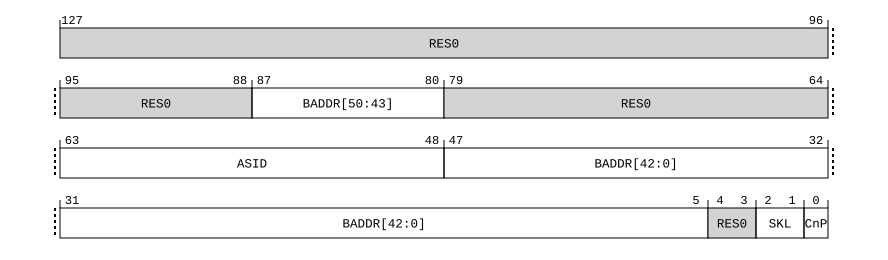

# ​D24.2.212 TTBR1_EL2, Translation Table Base Register 1 (EL2)

Source: <https://developer.arm.com/documentation/ddi0487/mc/-Part-D-The-AArch64-System-Level-Architecture/-Chapter-D24-AArch64-System-Register-Descriptions/-D24-2-General-system-control-registers/-D24-2-212-TTBR1-EL2--Translation-Table-Base-Register-1--EL2->

##### D24.2.212 TTBR1\_EL2, Translation Table Base Register 1 (EL2)

The TTBR1\_EL2 characteristics are:

Purpose
:   When the Effective value of [HCR\_EL2](/documentation/ddi0487/mc/-Part-D-The-AArch64-System-Level-Architecture/-Chapter-D24-AArch64-System-Register-Descriptions/-D24-2-General-system-control-registers/-D24-2-61-HCR-EL2--Hypervisor-Configuration-Register?lang=en#reg_aarch64_hcr_el2).E2H is 1, holds the base address of the translation table for the initial lookup for stage 1 of the translation of an address from the higher VA range in the EL2&0 translation regime, and other information for this translation regime.

    > #### Note
    >
    > When the Effective value of [HCR\_EL2](/documentation/ddi0487/mc/-Part-D-The-AArch64-System-Level-Architecture/-Chapter-D24-AArch64-System-Register-Descriptions/-D24-2-General-system-control-registers/-D24-2-61-HCR-EL2--Hypervisor-Configuration-Register?lang=en#reg_aarch64_hcr_el2).E2H is not 1, the contents of this register are ignored by the PE, except for a direct read or write of the register.

Configuration
:   If EL2 is not implemented, this register is RES0 from EL3.

    This register has no effect if EL2 is not enabled in the current Security state.

    TTBR1\_EL2 is a 128-bit register that can also be accessed as a 64-bit value. If it is accessed as a 64-bit register, accesses read and write bits [63:0] and do not modify bits [127:64].

    This register is present only when FEAT\_VHE is implemented and FEAT\_AA64 is implemented. Otherwise, direct accesses to TTBR1\_EL2 are UNDEFINED.

Attributes
:   TTBR1\_EL2 is a:

    - 128-bit register when FEAT\_D128 is implemented, TCR2\_EL2.D128 == ‘1’, and EffectiveHCR\_EL2\_E2H() == ‘1’.
    - 64-bit register when FEAT\_D128 is not implemented or TCR2\_EL2.D128 == ‘0’.

###### Field descriptions

When FEAT\_D128 is implemented, TCR2\_EL2.D128 == '1', and EffectiveHCR\_EL2\_E2H() == '1':
:   

Bits [127:88]
:   Reserved, RES0.

BADDR, bits [87:80, 47:5]
:   Translation table base address:

    - Bits A[55:x] of the stage 1 translation table base address bits are in register bits[87:80, 47:x].
    - Bits A[(x-1):0] of the stage 1 translation table base address are zero.

    Address bit x is the minimum address bit required to align the translation table to the size of the table. x is calculated based on LOG2(StartTableSize), as described in VMSAv9-128. The smallest permitted value of x is 5.

    The reset behavior of this field is:

    - On a Warm reset, this field resets to an architecturally UNKNOWN value.

Bits [79:64]
:   Reserved, RES0.

ASID, bits [63:48]
:   An ASID for the translation table base address. The [TCR\_EL2](/documentation/ddi0487/mc/-Part-D-The-AArch64-System-Level-Architecture/-Chapter-D24-AArch64-System-Register-Descriptions/-D24-2-General-system-control-registers/-D24-2-194-TCR-EL2--Translation-Control-Register--EL2-?lang=en#reg_aarch64_tcr_el2).A1 field selects either TTBR0\_EL2.ASID or TTBR1\_EL2.ASID.

    If the implementation has only 8 bits of ASID, then the upper 8 bits of this field are RES0.

    The reset behavior of this field is:

    - On a Warm reset, this field resets to an architecturally UNKNOWN value.

Bits [4:3]
:   Reserved, RES0.

SKL, bits [2:1]
:   Skip Level associated with translation table walks using TTBR1\_EL2.

    This determines the number of levels to be skipped from the regular start level of the stage 1 EL2&0 translation table walks using [TTBR1\_EL2](/documentation/ddi0487/mc/-Part-D-The-AArch64-System-Level-Architecture/-Chapter-D24-AArch64-System-Register-Descriptions/-D24-2-General-system-control-registers/-D24-2-212-TTBR1-EL2--Translation-Table-Base-Register-1--EL2-?lang=en#reg_aarch64_ttbr1_el2).

<table>
 <colgroup>
  <col/>
  <col/>
 </colgroup>
 <thead>
  <tr>
   <th>
    <strong>
     SKL
    </strong>
   </th>
   <th>
    <strong>
     Meaning
    </strong>
   </th>
  </tr>
 </thead>
 <tbody>
  <tr>
   <td>
    <p>
     <code>
      0b00
     </code>
    </p>
   </td>
   <td>
    <p>
     Skip 0 level from the regular start level.
    </p>
   </td>
  </tr>
  <tr>
   <td>
    <p>
     <code>
      0b01
     </code>
    </p>
   </td>
   <td>
    <p>
     Skip 1 level from the regular start level.
    </p>
   </td>
  </tr>
  <tr>
   <td>
    <p>
     <code>
      0b10
     </code>
    </p>
   </td>
   <td>
    <p>
     Skip 2 levels from the regular start level.
    </p>
   </td>
  </tr>
  <tr>
   <td>
    <p>
     <code>
      0b11
     </code>
    </p>
   </td>
   <td>
    <p>
     Skip 3 levels from the regular start level.
    </p>
   </td>
  </tr>
 </tbody>
</table>

    The reset behavior of this field is:

    - On a Warm reset, this field resets to an architecturally UNKNOWN value.

CnP, bit [0]
:   When FEAT\_TTCNP is implemented:
    :   Common not Private. This bit indicates whether each entry that is pointed to by TBR1\_EL2 is a member of a common set that can be used by every PE in the Inner Shareable domain for which the value of TTBR1\_EL2.CnP is 1.

<table>
 <colgroup>
  <col/>
  <col/>
 </colgroup>
 <thead>
  <tr>
   <th>
    <strong>
     CnP
    </strong>
   </th>
   <th>
    <strong>
     Meaning
    </strong>
   </th>
  </tr>
 </thead>
 <tbody>
  <tr>
   <td>
    <p>
     <code>
      0b0
     </code>
    </p>
   </td>
   <td>
    <p>
     The translation table entries pointed to by TTBR1_EL2 for the current ASID are permitted to differ from corresponding entries for TTBR1_EL2 for other PEs in the Inner Shareable domain. This is not affected by:
    </p>
    <ul>
     <li>
      <p>
       The value of TTBR1_EL2.CnP on those other PEs.
      </p>
     </li>
     <li>
      <p>
       The value of the current ASID.
      </p>
     </li>
    </ul>
   </td>
  </tr>
  <tr>
   <td>
    <p>
     <code>
      0b1
     </code>
    </p>
   </td>
   <td>
    <p>
     The translation table entries pointed to by TTBR1_EL2 are the same as the translation table entries for every other PE in the Inner Shareable domain for which the value of TTBR1_EL2.CnP is 1 and all of the following apply:
    </p>
    <ul>
     <li>
      <p>
       The translation table entries are pointed to by TTBR1_EL2.
      </p>
     </li>
     <li>
      <p>
       The ASID is the same as the current ASID.
      </p>
     </li>
    </ul>
   </td>
  </tr>
 </tbody>
</table>

        This bit is permitted to be cached in a TLB.

        > #### Note
        >
        > - TTBR1\_EL2 is accessible only when the Effective value of [HCR\_EL2](/documentation/ddi0487/mc/-Part-D-The-AArch64-System-Level-Architecture/-Chapter-D24-AArch64-System-Register-Descriptions/-D24-2-General-system-control-registers/-D24-2-61-HCR-EL2--Hypervisor-Configuration-Register?lang=en#reg_aarch64_hcr_el2).E2H is 1, meaning the current translation regime is the EL2&0 regime.
        > - If the value of the TTBR1\_EL2.CnP bit is 1 on multiple PEs in the same Inner Shareable domain and those TTBR1\_EL2s do not point to the same translation table entries when the other conditions specified for the case when the value of CnP is 1 apply, then the results of translations are CONSTRAINED UNPREDICTABLE, see [‘CONSTRAINED UNPREDICTABLE behaviors due to caching of control or data values’](/documentation/ddi0487/mc/-Part-K-Appendixes/-Appendix-K1-Architectural-Constraints-on-UNPREDICTABLE-Behaviors/-K1-2-AArch64-CONSTRAINED-UNPREDICTABLE-behaviors/-K1-2-3-CONSTRAINED-UNPREDICTABLE-behaviors-due-to-caching-of-control-or-data-values?lang=en#ceghbjbh).

        The reset behavior of this field is:

        - On a Warm reset, this field resets to an architecturally UNKNOWN value.

    Otherwise:
    :   Reserved, RES0.

When FEAT\_D128 is not implemented or TCR2\_EL2.D128 == '0':
:   

ASID, bits [63:48]
:   An ASID for the translation table base address. The [TCR\_EL2](/documentation/ddi0487/mc/-Part-D-The-AArch64-System-Level-Architecture/-Chapter-D24-AArch64-System-Register-Descriptions/-D24-2-General-system-control-registers/-D24-2-194-TCR-EL2--Translation-Control-Register--EL2-?lang=en#reg_aarch64_tcr_el2).A1 field selects either TTBR0\_EL2.ASID or TTBR1\_EL2.ASID.

    If the implementation has only 8 bits of ASID, then the upper 8 bits of this field are RES0.

    The reset behavior of this field is:

    - On a Warm reset, this field resets to an architecturally UNKNOWN value.

BADDR[47:1], bits [47:1]
:   Translation table base address:

    - Bits A[47:x] of the stage 1 translation table base address bits are in register bits[47:x].
    - Bits A[(x-1):0] of the stage 1 translation table base address are zero.

    Address bit x is the minimum address bit required to align the translation table to the size of the table. The AArch64 Virtual Memory System Architecture chapter describes how x is calculated based on the value of [TCR\_EL2](/documentation/ddi0487/mc/-Part-D-The-AArch64-System-Level-Architecture/-Chapter-D24-AArch64-System-Register-Descriptions/-D24-2-General-system-control-registers/-D24-2-194-TCR-EL2--Translation-Control-Register--EL2-?lang=en#reg_aarch64_tcr_el2).T1SZ, the translation stage, and the translation granule size.

    The BADDR field represents a 52-bit address if any of the following apply:

    - The value of [TCR\_EL2](/documentation/ddi0487/mc/-Part-D-The-AArch64-System-Level-Architecture/-Chapter-D24-AArch64-System-Register-Descriptions/-D24-2-General-system-control-registers/-D24-2-194-TCR-EL2--Translation-Control-Register--EL2-?lang=en#reg_aarch64_tcr_el2).{I}PS represents an OA size of 52 bits.
    - The Effective value of [TCR\_EL2](/documentation/ddi0487/mc/-Part-D-The-AArch64-System-Level-Architecture/-Chapter-D24-AArch64-System-Register-Descriptions/-D24-2-General-system-control-registers/-D24-2-194-TCR-EL2--Translation-Control-Register--EL2-?lang=en#reg_aarch64_tcr_el2).DS is 1.

    When TTBR1\_EL2.BADDR represents a 52-bit addresses, all of the following apply:

    - Bits A[51:48] of the stage 1 translation table base address bits are in register bits[5:2].
    - Register bit[1] is RES0.
    - The smallest permitted value of x is 6.
    - When x>6, register bits[(x-1):6] are RES0.

    Otherwise, all of the following apply:

    - Register bits[(x-1):1] are RES0.
    - If 52-bit PA is supported, then bits A[51:48] of the stage 1 translation table base address are treated as `0b0000`.

    > #### Note
    >
    > If BADDR represents a 52-bit address, and the translation table has fewer than eight entries, the table must be aligned to 64 bytes. Otherwise the translation table must be aligned to the size of the table.
    >
    > The OA size specified by [TCR\_EL2](/documentation/ddi0487/mc/-Part-D-The-AArch64-System-Level-Architecture/-Chapter-D24-AArch64-System-Register-Descriptions/-D24-2-General-system-control-registers/-D24-2-194-TCR-EL2--Translation-Control-Register--EL2-?lang=en#reg_aarch64_tcr_el2).{I}PS is determined as follows:
    >
    > - The value of [TCR\_EL2](/documentation/ddi0487/mc/-Part-D-The-AArch64-System-Level-Architecture/-Chapter-D24-AArch64-System-Register-Descriptions/-D24-2-General-system-control-registers/-D24-2-194-TCR-EL2--Translation-Control-Register--EL2-?lang=en#reg_aarch64_tcr_el2).PS when the Effective value of [HCR\_EL2](/documentation/ddi0487/mc/-Part-D-The-AArch64-System-Level-Architecture/-Chapter-D24-AArch64-System-Register-Descriptions/-D24-2-General-system-control-registers/-D24-2-61-HCR-EL2--Hypervisor-Configuration-Register?lang=en#reg_aarch64_hcr_el2).E2H is not 1.
    > - The value of [TCR\_EL2](/documentation/ddi0487/mc/-Part-D-The-AArch64-System-Level-Architecture/-Chapter-D24-AArch64-System-Register-Descriptions/-D24-2-General-system-control-registers/-D24-2-194-TCR-EL2--Translation-Control-Register--EL2-?lang=en#reg_aarch64_tcr_el2).IPS when the Effective value of [HCR\_EL2](/documentation/ddi0487/mc/-Part-D-The-AArch64-System-Level-Architecture/-Chapter-D24-AArch64-System-Register-Descriptions/-D24-2-General-system-control-registers/-D24-2-61-HCR-EL2--Hypervisor-Configuration-Register?lang=en#reg_aarch64_hcr_el2).E2H is 1.
    >
    > For the 64KB granule, if 52-bit PA is not supported, and the value of [TCR\_EL2](/documentation/ddi0487/mc/-Part-D-The-AArch64-System-Level-Architecture/-Chapter-D24-AArch64-System-Register-Descriptions/-D24-2-General-system-control-registers/-D24-2-194-TCR-EL2--Translation-Control-Register--EL2-?lang=en#reg_aarch64_tcr_el2).{I}PS is `0b110` or `0b111`, one of the following IMPLEMENTATION DEFINED behaviors occur:
    >
    > - BADDR uses the extended format to represent a 52-bit base address.
    > - BADDR does not use the extended format.
    >
    > When the value of [ID\_AA64MMFR0\_EL1](/documentation/ddi0487/mc/-Part-D-The-AArch64-System-Level-Architecture/-Chapter-D24-AArch64-System-Register-Descriptions/-D24-2-General-system-control-registers/-D24-2-87-ID-AA64MMFR0-EL1--AArch64-Memory-Model-Feature-Register-0?lang=en#reg_aarch64_id_aa64mmfr0_el1).PARange indicates that the implementation supports a 56 bit PA size, bits A[55:52] of the stage 1 translation table base address are zero.

    If any register bit[47:1] that is defined as RES0 has the value 1 when a translation table walk is done using TTBR1\_EL2, then the translation table base address might be misaligned, with effects that are CONSTRAINED UNPREDICTABLE, and must be one of the following:

    - Bits A[(x-1):0] of the stage 1 translation table base address are treated as if all the bits are zero. The value read back from the corresponding register bits is either the value written to the register or zero.
    - The result of the calculation of an address for a translation table walk using this register can be corrupted in those bits that are nonzero.

    The reset behavior of this field is:

    - On a Warm reset, this field resets to an architecturally UNKNOWN value.

CnP, bit [0]
:   When FEAT\_TTCNP is implemented:
    :   Common not Private. This bit indicates whether each entry that is pointed to by TBR1\_EL2 is a member of a common set that can be used by every PE in the Inner Shareable domain for which the value of TTBR1\_EL2.CnP is 1.

<table>
 <colgroup>
  <col/>
  <col/>
 </colgroup>
 <thead>
  <tr>
   <th>
    <strong>
     CnP
    </strong>
   </th>
   <th>
    <strong>
     Meaning
    </strong>
   </th>
  </tr>
 </thead>
 <tbody>
  <tr>
   <td>
    <p>
     <code>
      0b0
     </code>
    </p>
   </td>
   <td>
    <p>
     The translation table entries pointed to by TTBR1_EL2 for the current ASID are permitted to differ from corresponding entries for TTBR1_EL2 for other PEs in the Inner Shareable domain. This is not affected by:
    </p>
    <ul>
     <li>
      <p>
       The value of TTBR1_EL2.CnP on those other PEs.
      </p>
     </li>
     <li>
      <p>
       The value of the current ASID.
      </p>
     </li>
    </ul>
   </td>
  </tr>
  <tr>
   <td>
    <p>
     <code>
      0b1
     </code>
    </p>
   </td>
   <td>
    <p>
     The translation table entries pointed to by TTBR1_EL2 are the same as the translation table entries for every other PE in the Inner Shareable domain for which the value of TTBR1_EL2.CnP is 1 and all of the following apply:
    </p>
    <ul>
     <li>
      <p>
       The translation table entries are pointed to by TTBR1_EL2.
      </p>
     </li>
     <li>
      <p>
       The ASID is the same as the current ASID.
      </p>
     </li>
    </ul>
   </td>
  </tr>
 </tbody>
</table>

        This bit is permitted to be cached in a TLB.

        > #### Note
        >
        > - TTBR1\_EL2 is accessible only when the Effective value of [HCR\_EL2](/documentation/ddi0487/mc/-Part-D-The-AArch64-System-Level-Architecture/-Chapter-D24-AArch64-System-Register-Descriptions/-D24-2-General-system-control-registers/-D24-2-61-HCR-EL2--Hypervisor-Configuration-Register?lang=en#reg_aarch64_hcr_el2).E2H is 1, meaning the current translation regime is the EL2&0 regime.
        > - If the value of the TTBR1\_EL2.CnP bit is 1 on multiple PEs in the same Inner Shareable domain and those TTBR1\_EL2s do not point to the same translation table entries when the other conditions specified for the case when the value of CnP is 1 apply, then the results of translations are CONSTRAINED UNPREDICTABLE, see [‘CONSTRAINED UNPREDICTABLE behaviors due to caching of control or data values’](/documentation/ddi0487/mc/-Part-K-Appendixes/-Appendix-K1-Architectural-Constraints-on-UNPREDICTABLE-Behaviors/-K1-2-AArch64-CONSTRAINED-UNPREDICTABLE-behaviors/-K1-2-3-CONSTRAINED-UNPREDICTABLE-behaviors-due-to-caching-of-control-or-data-values?lang=en#ceghbjbh).

        The reset behavior of this field is:

        - On a Warm reset, this field resets to an architecturally UNKNOWN value.

    Otherwise:
    :   Reserved, RES0.

###### Accessing TTBR1\_EL2

When the Effective value of [HCR\_EL2](/documentation/ddi0487/mc/-Part-D-The-AArch64-System-Level-Architecture/-Chapter-D24-AArch64-System-Register-Descriptions/-D24-2-General-system-control-registers/-D24-2-61-HCR-EL2--Hypervisor-Configuration-Register?lang=en#reg_aarch64_hcr_el2).E2H is 1, without explicit synchronization, accesses from EL2 using the accessor name `TTBR1_EL2` or `TTBR1_EL1` are not guaranteed to be ordered with respect to accesses using the other accessor name.

Accesses to this register use the following encodings in the System register encoding space:

###### `MRS <Xt>, TTBR1_EL2`

<table>
 <colgroup>
  <col/>
  <col/>
  <col/>
  <col/>
  <col/>
 </colgroup>
 <thead>
  <tr>
   <th>
    <strong>
     op0
    </strong>
   </th>
   <th>
    <strong>
     op1
    </strong>
   </th>
   <th>
    <strong>
     CRn
    </strong>
   </th>
   <th>
    <strong>
     CRm
    </strong>
   </th>
   <th>
    <strong>
     op2
    </strong>
   </th>
  </tr>
 </thead>
 <tbody>
  <tr>
   <td>
    <p>
     <code>
      0b11
     </code>
    </p>
   </td>
   <td>
    <p>
     <code>
      0b100
     </code>
    </p>
   </td>
   <td>
    <p>
     <code>
      0b0010
     </code>
    </p>
   </td>
   <td>
    <p>
     <code>
      0b0000
     </code>
    </p>
   </td>
   <td>
    <p>
     <code>
      0b001
     </code>
    </p>
   </td>
  </tr>
 </tbody>
</table>

```
if !(IsFeatureImplemented(FEAT_VHE) && IsFeatureImplemented(FEAT_AA64)) then
    Undefined();
elsif PSTATE.EL == EL0 then
    Undefined();
elsif PSTATE.EL == EL1 then
    if EffectiveHCR_EL2_NVx() IN {'xx1'} then
        AArch64_SystemAccessTrap(EL2, 0x18);
    else
        Undefined();
    end;
elsif PSTATE.EL == EL2 then
    X{64}(t) = TTBR1_EL2()[63:0];
elsif PSTATE.EL == EL3 then
    X{64}(t) = TTBR1_EL2()[63:0];
end;
```

###### `MSR TTBR1_EL2, <Xt>`

<table>
 <colgroup>
  <col/>
  <col/>
  <col/>
  <col/>
  <col/>
 </colgroup>
 <thead>
  <tr>
   <th>
    <strong>
     op0
    </strong>
   </th>
   <th>
    <strong>
     op1
    </strong>
   </th>
   <th>
    <strong>
     CRn
    </strong>
   </th>
   <th>
    <strong>
     CRm
    </strong>
   </th>
   <th>
    <strong>
     op2
    </strong>
   </th>
  </tr>
 </thead>
 <tbody>
  <tr>
   <td>
    <p>
     <code>
      0b11
     </code>
    </p>
   </td>
   <td>
    <p>
     <code>
      0b100
     </code>
    </p>
   </td>
   <td>
    <p>
     <code>
      0b0010
     </code>
    </p>
   </td>
   <td>
    <p>
     <code>
      0b0000
     </code>
    </p>
   </td>
   <td>
    <p>
     <code>
      0b001
     </code>
    </p>
   </td>
  </tr>
 </tbody>
</table>

```
if !(IsFeatureImplemented(FEAT_VHE) && IsFeatureImplemented(FEAT_AA64)) then
    Undefined();
elsif PSTATE.EL == EL0 then
    Undefined();
elsif PSTATE.EL == EL1 then
    if EffectiveHCR_EL2_NVx() IN {'xx1'} then
        AArch64_SystemAccessTrap(EL2, 0x18);
    else
        Undefined();
    end;
elsif PSTATE.EL == EL2 then
    TTBR1_EL2()[63:0] = X{64}(t);
elsif PSTATE.EL == EL3 then
    TTBR1_EL2()[63:0] = X{64}(t);
end;
```

###### `MRS <Xt>, TTBR1_EL1`

<table>
 <colgroup>
  <col/>
  <col/>
  <col/>
  <col/>
  <col/>
 </colgroup>
 <thead>
  <tr>
   <th>
    <strong>
     op0
    </strong>
   </th>
   <th>
    <strong>
     op1
    </strong>
   </th>
   <th>
    <strong>
     CRn
    </strong>
   </th>
   <th>
    <strong>
     CRm
    </strong>
   </th>
   <th>
    <strong>
     op2
    </strong>
   </th>
  </tr>
 </thead>
 <tbody>
  <tr>
   <td>
    <p>
     <code>
      0b11
     </code>
    </p>
   </td>
   <td>
    <p>
     <code>
      0b000
     </code>
    </p>
   </td>
   <td>
    <p>
     <code>
      0b0010
     </code>
    </p>
   </td>
   <td>
    <p>
     <code>
      0b0000
     </code>
    </p>
   </td>
   <td>
    <p>
     <code>
      0b001
     </code>
    </p>
   </td>
  </tr>
 </tbody>
</table>

```
if !IsFeatureImplemented(FEAT_AA64) then
    Undefined();
elsif PSTATE.EL == EL0 then
    Undefined();
elsif PSTATE.EL == EL1 then
    if EL2Enabled() && HCR_EL2().TRVM == '1' then
        AArch64_SystemAccessTrap(EL2, 0x18);
    elsif EL2Enabled() && IsFeatureImplemented(FEAT_FGT) && (!HaveEL(EL3) || SCR_EL3().FGTEn == '1') && HFGRTR_EL2().TTBR1_EL1 == '1' then
        AArch64_SystemAccessTrap(EL2, 0x18);
    elsif EffectiveHCR_EL2_NVx() IN {'111'} then
        X{64}(t) = NVMem(0x210);
    else
        X{64}(t) = TTBR1_EL1()[63:0];
    end;
elsif PSTATE.EL == EL2 then
    if ELIsInHost(EL2) then
        X{64}(t) = TTBR1_EL2()[63:0];
    else
        X{64}(t) = TTBR1_EL1()[63:0];
    end;
elsif PSTATE.EL == EL3 then
    X{64}(t) = TTBR1_EL1()[63:0];
end;
```

###### `MSR TTBR1_EL1, <Xt>`

<table>
 <colgroup>
  <col/>
  <col/>
  <col/>
  <col/>
  <col/>
 </colgroup>
 <thead>
  <tr>
   <th>
    <strong>
     op0
    </strong>
   </th>
   <th>
    <strong>
     op1
    </strong>
   </th>
   <th>
    <strong>
     CRn
    </strong>
   </th>
   <th>
    <strong>
     CRm
    </strong>
   </th>
   <th>
    <strong>
     op2
    </strong>
   </th>
  </tr>
 </thead>
 <tbody>
  <tr>
   <td>
    <p>
     <code>
      0b11
     </code>
    </p>
   </td>
   <td>
    <p>
     <code>
      0b000
     </code>
    </p>
   </td>
   <td>
    <p>
     <code>
      0b0010
     </code>
    </p>
   </td>
   <td>
    <p>
     <code>
      0b0000
     </code>
    </p>
   </td>
   <td>
    <p>
     <code>
      0b001
     </code>
    </p>
   </td>
  </tr>
 </tbody>
</table>

```
if !IsFeatureImplemented(FEAT_AA64) then
    Undefined();
elsif PSTATE.EL == EL0 then
    Undefined();
elsif PSTATE.EL == EL1 then
    if EL2Enabled() && HCR_EL2().TVM == '1' then
        AArch64_SystemAccessTrap(EL2, 0x18);
    elsif EL2Enabled() && IsFeatureImplemented(FEAT_FGT) && (!HaveEL(EL3) || SCR_EL3().FGTEn == '1') && HFGWTR_EL2().TTBR1_EL1 == '1' then
        AArch64_SystemAccessTrap(EL2, 0x18);
    elsif EffectiveHCR_EL2_NVx() IN {'111'} then
        NVMem(0x210) = X{64}(t);
    else
        TTBR1_EL1()[63:0] = X{64}(t);
    end;
elsif PSTATE.EL == EL2 then
    if ELIsInHost(EL2) then
        TTBR1_EL2()[63:0] = X{64}(t);
    else
        TTBR1_EL1()[63:0] = X{64}(t);
    end;
elsif PSTATE.EL == EL3 then
    TTBR1_EL1()[63:0] = X{64}(t);
end;
```

`When FEAT_D128 is implemented MRRS <Xt>, <Xt+1>, TTBR1_EL2`
:

<table>
 <colgroup>
  <col/>
  <col/>
  <col/>
  <col/>
  <col/>
 </colgroup>
 <thead>
  <tr>
   <th>
    <strong>
     op0
    </strong>
   </th>
   <th>
    <strong>
     op1
    </strong>
   </th>
   <th>
    <strong>
     CRn
    </strong>
   </th>
   <th>
    <strong>
     CRm
    </strong>
   </th>
   <th>
    <strong>
     op2
    </strong>
   </th>
  </tr>
 </thead>
 <tbody>
  <tr>
   <td>
    <p>
     <code>
      0b11
     </code>
    </p>
   </td>
   <td>
    <p>
     <code>
      0b100
     </code>
    </p>
   </td>
   <td>
    <p>
     <code>
      0b0010
     </code>
    </p>
   </td>
   <td>
    <p>
     <code>
      0b0000
     </code>
    </p>
   </td>
   <td>
    <p>
     <code>
      0b001
     </code>
    </p>
   </td>
  </tr>
 </tbody>
</table>

    ```
    if !(IsFeatureImplemented(FEAT_VHE) && IsFeatureImplemented(FEAT_AA64)) then
        Undefined();
    elsif HaveEL(EL3) && PSTATE.EL == EL2 && EL3SDDUndefPriority() && SCR_EL3().D128En == '0' then
        Undefined();
    elsif PSTATE.EL == EL0 then
        Undefined();
    elsif PSTATE.EL == EL1 then
        if EffectiveHCR_EL2_NVx() IN {'xx1'} then
            AArch64_SystemAccessTrap(EL2, 0x14);
        else
            Undefined();
        end;
    elsif PSTATE.EL == EL2 then
        if HaveEL(EL3) && SCR_EL3().D128En == '0' then
            if EL3SDDUndef() then
                Undefined();
            else
                AArch64_SystemAccessTrap(EL3, 0x14);
            end;
        else
            X{128}(t, t2) = TTBR1_EL2();
        end;
    elsif PSTATE.EL == EL3 then
        X{128}(t, t2) = TTBR1_EL2();
    end;
    ```

`When FEAT_D128 is implemented MSRR TTBR1_EL2, <Xt>, <Xt+1>`
:

<table>
 <colgroup>
  <col/>
  <col/>
  <col/>
  <col/>
  <col/>
 </colgroup>
 <thead>
  <tr>
   <th>
    <strong>
     op0
    </strong>
   </th>
   <th>
    <strong>
     op1
    </strong>
   </th>
   <th>
    <strong>
     CRn
    </strong>
   </th>
   <th>
    <strong>
     CRm
    </strong>
   </th>
   <th>
    <strong>
     op2
    </strong>
   </th>
  </tr>
 </thead>
 <tbody>
  <tr>
   <td>
    <p>
     <code>
      0b11
     </code>
    </p>
   </td>
   <td>
    <p>
     <code>
      0b100
     </code>
    </p>
   </td>
   <td>
    <p>
     <code>
      0b0010
     </code>
    </p>
   </td>
   <td>
    <p>
     <code>
      0b0000
     </code>
    </p>
   </td>
   <td>
    <p>
     <code>
      0b001
     </code>
    </p>
   </td>
  </tr>
 </tbody>
</table>

    ```
    if !(IsFeatureImplemented(FEAT_VHE) && IsFeatureImplemented(FEAT_AA64)) then
        Undefined();
    elsif HaveEL(EL3) && PSTATE.EL == EL2 && EL3SDDUndefPriority() && SCR_EL3().D128En == '0' then
        Undefined();
    elsif PSTATE.EL == EL0 then
        Undefined();
    elsif PSTATE.EL == EL1 then
        if EffectiveHCR_EL2_NVx() IN {'xx1'} then
            AArch64_SystemAccessTrap(EL2, 0x14);
        else
            Undefined();
        end;
    elsif PSTATE.EL == EL2 then
        if HaveEL(EL3) && SCR_EL3().D128En == '0' then
            if EL3SDDUndef() then
                Undefined();
            else
                AArch64_SystemAccessTrap(EL3, 0x14);
            end;
        else
            TTBR1_EL2()[127:0] = X{128}(t, t2);
        end;
    elsif PSTATE.EL == EL3 then
        TTBR1_EL2()[127:0] = X{128}(t, t2);
    end;
    ```

`When FEAT_D128 is implemented MRRS <Xt>, <Xt+1>, TTBR1_EL1`
:

<table>
 <colgroup>
  <col/>
  <col/>
  <col/>
  <col/>
  <col/>
 </colgroup>
 <thead>
  <tr>
   <th>
    <strong>
     op0
    </strong>
   </th>
   <th>
    <strong>
     op1
    </strong>
   </th>
   <th>
    <strong>
     CRn
    </strong>
   </th>
   <th>
    <strong>
     CRm
    </strong>
   </th>
   <th>
    <strong>
     op2
    </strong>
   </th>
  </tr>
 </thead>
 <tbody>
  <tr>
   <td>
    <p>
     <code>
      0b11
     </code>
    </p>
   </td>
   <td>
    <p>
     <code>
      0b000
     </code>
    </p>
   </td>
   <td>
    <p>
     <code>
      0b0010
     </code>
    </p>
   </td>
   <td>
    <p>
     <code>
      0b0000
     </code>
    </p>
   </td>
   <td>
    <p>
     <code>
      0b001
     </code>
    </p>
   </td>
  </tr>
 </tbody>
</table>

    ```
    if !IsFeatureImplemented(FEAT_AA64) then
        Undefined();
    elsif HaveEL(EL3) && !(EffectivelyAtEL0InHost() || EffectivelyAtEL0NotInHost() || PSTATE.EL == EL3) && EL3SDDUndefPriority() && SCR_EL3().D128En == '0' then
        Undefined();
    elsif PSTATE.EL == EL0 then
        Undefined();
    elsif PSTATE.EL == EL1 then
        if EL2Enabled() && HCR_EL2().TRVM == '1' then
            AArch64_SystemAccessTrap(EL2, 0x14);
        elsif EL2Enabled() && IsFeatureImplemented(FEAT_FGT) && (!HaveEL(EL3) || SCR_EL3().FGTEn == '1') && HFGRTR_EL2().TTBR1_EL1 == '1' then
            AArch64_SystemAccessTrap(EL2, 0x14);
        elsif EL2Enabled() && (!IsHCRXEL2Enabled() || HCRX_EL2().D128En == '0') then
            AArch64_SystemAccessTrap(EL2, 0x14);
        elsif HaveEL(EL3) && SCR_EL3().D128En == '0' then
            if EL3SDDUndef() then
                Undefined();
            else
                AArch64_SystemAccessTrap(EL3, 0x14);
            end;
        elsif EffectiveHCR_EL2_NVx() IN {'111'} then
            X{128}(t, t2) = NVMem128(0x210);
        else
            X{128}(t, t2) = TTBR1_EL1();
        end;
    elsif PSTATE.EL == EL2 then
        if HaveEL(EL3) && SCR_EL3().D128En == '0' then
            if EL3SDDUndef() then
                Undefined();
            else
                AArch64_SystemAccessTrap(EL3, 0x14);
            end;
        elsif ELIsInHost(EL2) then
            X{128}(t, t2) = TTBR1_EL2();
        else
            X{128}(t, t2) = TTBR1_EL1();
        end;
    elsif PSTATE.EL == EL3 then
        X{128}(t, t2) = TTBR1_EL1();
    end;
    ```

`When FEAT_D128 is implemented MSRR TTBR1_EL1, <Xt>, <Xt+1>`
:

<table>
 <colgroup>
  <col/>
  <col/>
  <col/>
  <col/>
  <col/>
 </colgroup>
 <thead>
  <tr>
   <th>
    <strong>
     op0
    </strong>
   </th>
   <th>
    <strong>
     op1
    </strong>
   </th>
   <th>
    <strong>
     CRn
    </strong>
   </th>
   <th>
    <strong>
     CRm
    </strong>
   </th>
   <th>
    <strong>
     op2
    </strong>
   </th>
  </tr>
 </thead>
 <tbody>
  <tr>
   <td>
    <p>
     <code>
      0b11
     </code>
    </p>
   </td>
   <td>
    <p>
     <code>
      0b000
     </code>
    </p>
   </td>
   <td>
    <p>
     <code>
      0b0010
     </code>
    </p>
   </td>
   <td>
    <p>
     <code>
      0b0000
     </code>
    </p>
   </td>
   <td>
    <p>
     <code>
      0b001
     </code>
    </p>
   </td>
  </tr>
 </tbody>
</table>

    ```
    if !IsFeatureImplemented(FEAT_AA64) then
        Undefined();
    elsif HaveEL(EL3) && !(EffectivelyAtEL0InHost() || EffectivelyAtEL0NotInHost() || PSTATE.EL == EL3) && EL3SDDUndefPriority() && SCR_EL3().D128En == '0' then
        Undefined();
    elsif PSTATE.EL == EL0 then
        Undefined();
    elsif PSTATE.EL == EL1 then
        if EL2Enabled() && HCR_EL2().TVM == '1' then
            AArch64_SystemAccessTrap(EL2, 0x14);
        elsif EL2Enabled() && IsFeatureImplemented(FEAT_FGT) && (!HaveEL(EL3) || SCR_EL3().FGTEn == '1') && HFGWTR_EL2().TTBR1_EL1 == '1' then
            AArch64_SystemAccessTrap(EL2, 0x14);
        elsif EL2Enabled() && (!IsHCRXEL2Enabled() || HCRX_EL2().D128En == '0') then
            AArch64_SystemAccessTrap(EL2, 0x14);
        elsif HaveEL(EL3) && SCR_EL3().D128En == '0' then
            if EL3SDDUndef() then
                Undefined();
            else
                AArch64_SystemAccessTrap(EL3, 0x14);
            end;
        elsif EffectiveHCR_EL2_NVx() IN {'111'} then
            NVMem128(0x210) = X{128}(t, t2);
        else
            TTBR1_EL1()[127:0] = X{128}(t, t2);
        end;
    elsif PSTATE.EL == EL2 then
        if HaveEL(EL3) && SCR_EL3().D128En == '0' then
            if EL3SDDUndef() then
                Undefined();
            else
                AArch64_SystemAccessTrap(EL3, 0x14);
            end;
        elsif ELIsInHost(EL2) then
            TTBR1_EL2()[127:0] = X{128}(t, t2);
        else
            TTBR1_EL1()[127:0] = X{128}(t, t2);
        end;
    elsif PSTATE.EL == EL3 then
        TTBR1_EL1()[127:0] = X{128}(t, t2);
    end;
    ```
