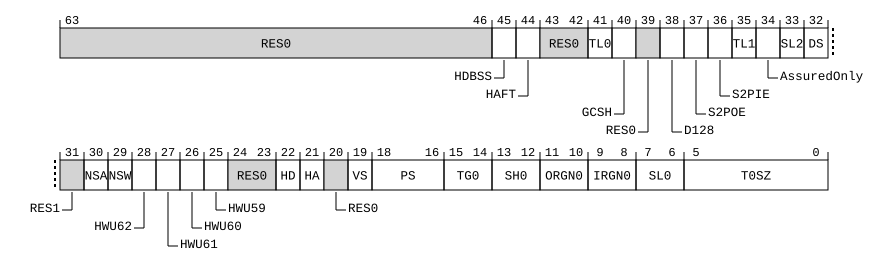

# ​D24.2.223 VTCR_EL2, Virtualization Translation Control Register

Source: <https://developer.arm.com/documentation/ddi0487/mc/-Part-D-The-AArch64-System-Level-Architecture/-Chapter-D24-AArch64-System-Register-Descriptions/-D24-2-General-system-control-registers/-D24-2-223-VTCR-EL2--Virtualization-Translation-Control-Register>

##### D24.2.223 VTCR\_EL2, Virtualization Translation Control Register

The VTCR\_EL2 characteristics are:

Purpose
:   The control register for stage 2 of the EL1&0 translation regime.

Configuration
:   If EL2 is not implemented, this register is RES0 from EL3.

    This register has no effect if EL2 is not enabled in the current Security state.

    AArch64 System register VTCR\_EL2 bits [31:0] are architecturally mapped to AArch32 System register [VTCR](/documentation/ddi0487/mc/-Part-G-The-AArch32-System-Level-Architecture/-Chapter-G8-AArch32-System-Register-Descriptions/-G8-2-General-system-control-registers/-G8-2-172-VTCR--Virtualization-Translation-Control-Register?lang=en#reg_aarch32_vtcr)[31:0].

    This register is present only when FEAT\_AA64 is implemented. Otherwise, direct accesses to VTCR\_EL2 are UNDEFINED.

Attributes
:   VTCR\_EL2 is a 64-bit register.

###### Field descriptions



Unless stated otherwise, any of the bits in VTCR\_EL2 are permitted to be cached in a TLB.

Bits [63:46]
:   Reserved, RES0.

HDBSS, bit [45]
:   When FEAT\_HDBSS is implemented:
    :   Enable use of HDBSS.

<table>
 <colgroup>
  <col/>
  <col/>
 </colgroup>
 <thead>
  <tr>
   <th>
    <strong>
     HDBSS
    </strong>
   </th>
   <th>
    <strong>
     Meaning
    </strong>
   </th>
  </tr>
 </thead>
 <tbody>
  <tr>
   <td>
    <p>
     <code>
      0b0
     </code>
    </p>
   </td>
   <td>
    <p>
     Hardware tracking of Dirty state Structure is disabled.
    </p>
   </td>
  </tr>
  <tr>
   <td>
    <p>
     <code>
      0b1
     </code>
    </p>
   </td>
   <td>
    <p>
     Hardware tracking of Dirty state Structure is enabled.
    </p>
   </td>
  </tr>
 </tbody>
</table>

        If [VTCR\_EL2](/documentation/ddi0487/mc/-Part-D-The-AArch64-System-Level-Architecture/-Chapter-D24-AArch64-System-Register-Descriptions/-D24-2-General-system-control-registers/-D24-2-223-VTCR-EL2--Virtualization-Translation-Control-Register?lang=en#reg_aarch64_vtcr_el2).{HA, HD} is not {1, 1}, the Effective value of this field is 0.

        If [SCR\_EL3](/documentation/ddi0487/mc/-Part-D-The-AArch64-System-Level-Architecture/-Chapter-D24-AArch64-System-Register-Descriptions/-D24-2-General-system-control-registers/-D24-2-168-SCR-EL3--Secure-Configuration-Register?lang=en#reg_aarch64_scr_el3).HDBSSEn is 0, then this field behaves as 0 for all purposes other than a direct read of the value of this bit.

        The reset behavior of this field is:

        - On a Warm reset, this field resets to an architecturally UNKNOWN value.

    Otherwise:
    :   Reserved, RES0.

HAFT, bit [44]
:   When FEAT\_HAFT is implemented:
    :   Hardware managed Access Flag for Table descriptors.

        Enables the Hardware managed Access Flag for Table descriptors.

<table>
 <colgroup>
  <col/>
  <col/>
 </colgroup>
 <thead>
  <tr>
   <th>
    <strong>
     HAFT
    </strong>
   </th>
   <th>
    <strong>
     Meaning
    </strong>
   </th>
  </tr>
 </thead>
 <tbody>
  <tr>
   <td>
    <p>
     <code>
      0b0
     </code>
    </p>
   </td>
   <td>
    <p>
     Hardware managed Access Flag for Table descriptors is disabled.
    </p>
   </td>
  </tr>
  <tr>
   <td>
    <p>
     <code>
      0b1
     </code>
    </p>
   </td>
   <td>
    <p>
     Hardware managed Access Flag for Table descriptors is enabled.
    </p>
   </td>
  </tr>
 </tbody>
</table>

        The reset behavior of this field is:

        - On a Warm reset, this field resets to an architecturally UNKNOWN value.

    Otherwise:
    :   Reserved, RES0.

Bits [43:42]
:   Reserved, RES0.

TL0, bit [41]
:   When FEAT\_THE is implemented:
    :   Control bit to check for presence of MMU TopLevel0 permission attribute.

<table>
 <colgroup>
  <col/>
  <col/>
 </colgroup>
 <thead>
  <tr>
   <th>
    <strong>
     TL0
    </strong>
   </th>
   <th>
    <strong>
     Meaning
    </strong>
   </th>
  </tr>
 </thead>
 <tbody>
  <tr>
   <td>
    <p>
     <code>
      0b0
     </code>
    </p>
   </td>
   <td>
    <p>
     This bit does not have any effect on stage 2 translations.
    </p>
   </td>
  </tr>
  <tr>
   <td>
    <p>
     <code>
      0b1
     </code>
    </p>
   </td>
   <td>
    <p>
     Enables MMU TopLevel0 permission attribute check for
     <a class="document-topic" document-topic-path="/ddi0487/mc/-Part-D-The-AArch64-System-Level-Architecture/-Chapter-D24-AArch64-System-Register-Descriptions/-D24-2-General-system-control-registers/-D24-2-208-TTBR0-EL1--Translation-Table-Base-Register-0--EL1-?lang=en#reg_aarch64_ttbr0_el1" href="/documentation/ddi0487/mc/-Part-D-The-AArch64-System-Level-Architecture/-Chapter-D24-AArch64-System-Register-Descriptions/-D24-2-General-system-control-registers/-D24-2-208-TTBR0-EL1--Translation-Table-Base-Register-0--EL1-?lang=en#reg_aarch64_ttbr0_el1">
      TTBR0_EL1
     </a>
     and
     <a class="document-topic" document-topic-path="/ddi0487/mc/-Part-D-The-AArch64-System-Level-Architecture/-Chapter-D24-AArch64-System-Register-Descriptions/-D24-2-General-system-control-registers/-D24-2-211-TTBR1-EL1--Translation-Table-Base-Register-1--EL1-?lang=en#reg_aarch64_ttbr1_el1" href="/documentation/ddi0487/mc/-Part-D-The-AArch64-System-Level-Architecture/-Chapter-D24-AArch64-System-Register-Descriptions/-D24-2-General-system-control-registers/-D24-2-211-TTBR1-EL1--Translation-Table-Base-Register-1--EL1-?lang=en#reg_aarch64_ttbr1_el1">
      TTBR1_EL1
     </a>
     translations.
    </p>
   </td>
  </tr>
 </tbody>
</table>

        The reset behavior of this field is:

        - On a Warm reset, this field resets to an architecturally UNKNOWN value.

    Otherwise:
    :   Reserved, RES0.

GCSH, bit [40]
:   When FEAT\_THE is implemented and FEAT\_GCS is implemented:
    :   Assured stage 1 translations for Guarded Control Stacks. Enforces use of the AssuredOnly attribute in stage 2 for the memory accessed by privileged Guarded Control Stack data accesses.

<table>
 <colgroup>
  <col/>
  <col/>
 </colgroup>
 <thead>
  <tr>
   <th>
    <strong>
     GCSH
    </strong>
   </th>
   <th>
    <strong>
     Meaning
    </strong>
   </th>
  </tr>
 </thead>
 <tbody>
  <tr>
   <td>
    <p>
     <code>
      0b0
     </code>
    </p>
   </td>
   <td>
    <p>
     For the memory accessed by privileged Guarded Control Stack data accesses, the AssuredOnly attribute in stage 2 is not required to be set.
    </p>
   </td>
  </tr>
  <tr>
   <td>
    <p>
     <code>
      0b1
     </code>
    </p>
   </td>
   <td>
    <p>
     For the memory accessed by privileged Guarded Control Stack data accesses, the AssuredOnly attribute in stage 2 is required to be set.
    </p>
   </td>
  </tr>
 </tbody>
</table>

        This bit is permitted to be cached in a TLB.

        The reset behavior of this field is:

        - On a Warm reset, this field resets to an architecturally UNKNOWN value.

    Otherwise:
    :   Reserved, RES0.

Bit [39]
:   Reserved, RES0.

D128, bit [38]
:   When FEAT\_D128 is implemented:
    :   Enables VMSAv9-128 translation system for stage 2 translation.

<table>
 <colgroup>
  <col/>
  <col/>
 </colgroup>
 <thead>
  <tr>
   <th>
    <strong>
     D128
    </strong>
   </th>
   <th>
    <strong>
     Meaning
    </strong>
   </th>
  </tr>
 </thead>
 <tbody>
  <tr>
   <td>
    <p>
     <code>
      0b0
     </code>
    </p>
   </td>
   <td>
    <p>
     Translation system follows VMSAv8-64 translation process.
    </p>
   </td>
  </tr>
  <tr>
   <td>
    <p>
     <code>
      0b1
     </code>
    </p>
   </td>
   <td>
    <p>
     Translation system follows VMSAv9-128 translation process.
    </p>
   </td>
  </tr>
 </tbody>
</table>

        The reset behavior of this field is:

        - On a Warm reset, this field resets to an architecturally UNKNOWN value.

    Otherwise:
    :   Reserved, RES0.

S2POE, bit [37]
:   When FEAT\_S2POE is implemented:
    :   Enable Permission Overlay. Enables permission overlay in stage 2 Permission model.

<table>
 <colgroup>
  <col/>
  <col/>
 </colgroup>
 <thead>
  <tr>
   <th>
    <strong>
     S2POE
    </strong>
   </th>
   <th>
    <strong>
     Meaning
    </strong>
   </th>
  </tr>
 </thead>
 <tbody>
  <tr>
   <td>
    <p>
     <code>
      0b0
     </code>
    </p>
   </td>
   <td>
    <p>
     Overlay disabled.
    </p>
   </td>
  </tr>
  <tr>
   <td>
    <p>
     <code>
      0b1
     </code>
    </p>
   </td>
   <td>
    <p>
     Overlay enabled.
    </p>
   </td>
  </tr>
 </tbody>
</table>

        This bit is not permitted to be cached in a TLB.

        The reset behavior of this field is:

        - On a Warm reset, this field resets to an architecturally UNKNOWN value.

    Otherwise:
    :   Reserved, RES0.

S2PIE, bit [36]
:   When FEAT\_S2PIE is implemented:
    :   Select Permission Model. Enables usage of permission indirection in stage 2 Permission model.

<table>
 <colgroup>
  <col/>
  <col/>
 </colgroup>
 <thead>
  <tr>
   <th>
    <strong>
     S2PIE
    </strong>
   </th>
   <th>
    <strong>
     Meaning
    </strong>
   </th>
  </tr>
 </thead>
 <tbody>
  <tr>
   <td>
    <p>
     <code>
      0b0
     </code>
    </p>
   </td>
   <td>
    <p>
     Direct permission model.
    </p>
   </td>
  </tr>
  <tr>
   <td>
    <p>
     <code>
      0b1
     </code>
    </p>
   </td>
   <td>
    <p>
     Indirect permission model.
    </p>
   </td>
  </tr>
 </tbody>
</table>

        This field is RES1 when VTCR\_EL2.D128 is set.

        The reset behavior of this field is:

        - On a Warm reset, this field resets to an architecturally UNKNOWN value.

    Otherwise:
    :   Reserved, RES0.

TL1, bit [35]
:   When FEAT\_THE is implemented:
    :   Control bit to check for presence of MMU TopLevel1 permission attribute.

<table>
 <colgroup>
  <col/>
  <col/>
 </colgroup>
 <thead>
  <tr>
   <th>
    <strong>
     TL1
    </strong>
   </th>
   <th>
    <strong>
     Meaning
    </strong>
   </th>
  </tr>
 </thead>
 <tbody>
  <tr>
   <td>
    <p>
     <code>
      0b0
     </code>
    </p>
   </td>
   <td>
    <p>
     This bit does not have any effect on stage 2 translations.
    </p>
   </td>
  </tr>
  <tr>
   <td>
    <p>
     <code>
      0b1
     </code>
    </p>
   </td>
   <td>
    <p>
     Enables MMU TopLevel1 permission attribute check for TTBR0_EL1 and TTBR1_EL1 translations.
    </p>
   </td>
  </tr>
 </tbody>
</table>

        The reset behavior of this field is:

        - On a Warm reset, this field resets to an architecturally UNKNOWN value.

    Otherwise:
    :   Reserved, RES0.

AssuredOnly, bit [34]
:   When FEAT\_THE is implemented:
    :   AssuredOnly attribute enable for VMSAv8-64. Configures use of bit[58] of the stage 2 translation table Block or Page descriptor.

<table>
 <colgroup>
  <col/>
  <col/>
 </colgroup>
 <thead>
  <tr>
   <th>
    <strong>
     AssuredOnly
    </strong>
   </th>
   <th>
    <strong>
     Meaning
    </strong>
   </th>
  </tr>
 </thead>
 <tbody>
  <tr>
   <td>
    <p>
     <code>
      0b0
     </code>
    </p>
   </td>
   <td>
    <p>
     Bit[58] of each stage 2 translation Block or Page descriptor does not indicate AssuredOnly attribute.
    </p>
   </td>
  </tr>
  <tr>
   <td>
    <p>
     <code>
      0b1
     </code>
    </p>
   </td>
   <td>
    <p>
     Bit[58] of each stage 2 translation Block or Page descriptor indicates AssuredOnly attribute.
    </p>
   </td>
  </tr>
 </tbody>
</table>

        This field is RES0 when VTCR\_EL2.D128 is 1.

        The reset behavior of this field is:

        - On a Warm reset, this field resets to an architecturally UNKNOWN value.

    Otherwise:
    :   Reserved, RES0.

SL2, bit [33]
:   When FEAT\_LPA2 is implemented and (FEAT\_D128 is not implemented or VTCR\_EL2.D128 == '0'):
    :   Starting level of the stage 2 translation lookup controlled by VTCR\_EL2.

        If VTCR\_EL2.DS == 1, then VTCR\_EL2.SL2, in combination with VTCR\_EL2.SL0, gives encodings for the stage 2 translation table walk initial lookup level.

        If VTCR\_EL2.DS == 0, then VTCR\_EL2.SL2 is RES0.

        If the translation granule size is not 4KB, then this field is RES0.

        The reset behavior of this field is:

        - On a Warm reset, this field resets to an architecturally UNKNOWN value.

    Otherwise:
    :   Reserved, RES0.

DS, bit [32]
:   When FEAT\_LPA2 is implemented and (FEAT\_D128 is not implemented or VTCR\_EL2.D128 == '0'):
    :   This field affects:

        - Whether a 52-bit output address can be described by the translation tables of the 4KB or 16KB translation granules.
        - The minimum value of VTCR\_EL2.T0SZ and VSTCR\_EL2.T0SZ.
        - How and where shareability for Block and Page descriptors are encoded.

<table>
 <colgroup>
  <col/>
  <col/>
 </colgroup>
 <thead>
  <tr>
   <th>
    <strong>
     DS
    </strong>
   </th>
   <th>
    <strong>
     Meaning
    </strong>
   </th>
  </tr>
 </thead>
 <tbody>
  <tr>
   <td>
    <p>
     <code>
      0b0
     </code>
    </p>
   </td>
   <td>
    <p>
     Bits[49:48] of translation descriptors are
     <small>
      RES0
     </small>
     .
    </p>
    <p>
     Bits[9:8] in Block and Page descriptors encode shareability information in the SH[1:0] field. Bits[9:8] in Table descriptors are ignored by hardware.
    </p>
    <p>
     The minimum value of VTCR_EL2.T0SZ is 16. Any memory access using a smaller value generates a stage 2 level 0 translation table fault.
    </p>
    <p>
     The minimum value of
     <a class="document-topic" document-topic-path="/ddi0487/mc/-Part-D-The-AArch64-System-Level-Architecture/-Chapter-D24-AArch64-System-Register-Descriptions/-D24-2-General-system-control-registers/-D24-2-221-VSTCR-EL2--Virtualization-Secure-Translation-Control-Register?lang=en#reg_aarch64_vstcr_el2" href="/documentation/ddi0487/mc/-Part-D-The-AArch64-System-Level-Architecture/-Chapter-D24-AArch64-System-Register-Descriptions/-D24-2-General-system-control-registers/-D24-2-221-VSTCR-EL2--Virtualization-Secure-Translation-Control-Register?lang=en#reg_aarch64_vstcr_el2">
      VSTCR_EL2
     </a>
     .T0SZ is 16. Any memory access using a smaller value generates a stage 2 level 0 translation table fault.
    </p>
    <p>
     Output address[51:48] is 0000.
    </p>
   </td>
  </tr>
  <tr>
   <td>
    <p>
     <code>
      0b1
     </code>
    </p>
   </td>
   <td>
    <p>
     Bits[49:48] of translation descriptors hold output address[49:48].
    </p>
    <p>
     Bits[9:8] in translation descriptors hold output address[51:50].
    </p>
    <p>
     The shareability information of Block and Page descriptors for cacheable locations is determined by VTCR_EL2.SH0.
    </p>
    <p>
     The minimum value of VTCR_EL2.T0SZ is 12. Any memory access using a smaller value generates a stage 2 level 0 translation table fault.
    </p>
    <p>
     The minimum value of
     <a class="document-topic" document-topic-path="/ddi0487/mc/-Part-D-The-AArch64-System-Level-Architecture/-Chapter-D24-AArch64-System-Register-Descriptions/-D24-2-General-system-control-registers/-D24-2-221-VSTCR-EL2--Virtualization-Secure-Translation-Control-Register?lang=en#reg_aarch64_vstcr_el2" href="/documentation/ddi0487/mc/-Part-D-The-AArch64-System-Level-Architecture/-Chapter-D24-AArch64-System-Register-Descriptions/-D24-2-General-system-control-registers/-D24-2-221-VSTCR-EL2--Virtualization-Secure-Translation-Control-Register?lang=en#reg_aarch64_vstcr_el2">
      VSTCR_EL2
     </a>
     .T0SZ is 12. Any memory access using a smaller value generates a stage 2 level 0 translation table fault.
    </p>
    <blockquote title="Note info">
     <h4>
      Note
     </h4>
     <p>
      As
      <a class="document-topic" document-topic-path="/ddi0487/mc/-Part-A-Arm-Architecture-Introduction-and-Overview/-Chapter-A2-A-profile-Architecture-Extensions/-A2-2-Armv8-A-architecture-extensions/-A2-2-3-The-Armv8-2-architecture-extension?lang=en#feat_feat_lpa" href="/documentation/ddi0487/mc/-Part-A-Arm-Architecture-Introduction-and-Overview/-Chapter-A2-A-profile-Architecture-Extensions/-A2-2-Armv8-A-architecture-extensions/-A2-2-3-The-Armv8-2-architecture-extension?lang=en#feat_feat_lpa">
       FEAT_LPA
      </a>
      must be implemented if VTCR_EL2.DS == 1, the minimum values of VTCR_EL2.T0SZ and
      <a class="document-topic" document-topic-path="/ddi0487/mc/-Part-D-The-AArch64-System-Level-Architecture/-Chapter-D24-AArch64-System-Register-Descriptions/-D24-2-General-system-control-registers/-D24-2-221-VSTCR-EL2--Virtualization-Secure-Translation-Control-Register?lang=en#reg_aarch64_vstcr_el2" href="/documentation/ddi0487/mc/-Part-D-The-AArch64-System-Level-Architecture/-Chapter-D24-AArch64-System-Register-Descriptions/-D24-2-General-system-control-registers/-D24-2-221-VSTCR-EL2--Virtualization-Secure-Translation-Control-Register?lang=en#reg_aarch64_vstcr_el2">
       VSTCR_EL2
      </a>
      .T0SZ are 12, as determined by that extension.
     </p>
    </blockquote>
    <p>
     For the TLBI range instructions affecting IPA, the format of the argument is changed so that bits[36:0] hold BaseADDR[52:16]. For the 4KB translation granule, bits[15:12] of BaseADDR are treated as 0000. For the 16KB translation granule, bits[15:14] of BaseADDR are treated as 00.
    </p>
    <blockquote title="Note info">
     <h4>
      Note
     </h4>
     <p>
      This forces alignment of the ranges used by the TLBI range instructions.
     </p>
    </blockquote>
   </td>
  </tr>
 </tbody>
</table>

        This field is RES0 for a 64KB translation granule.

        The reset behavior of this field is:

        - On a Warm reset, this field resets to an architecturally UNKNOWN value.

    Otherwise:
    :   Reserved, RES0.

Bit [31]
:   Reserved, RES1.

NSA, bit [30]
:   When FEAT\_SEL2 is implemented:
    :   Non-secure stage 2 translation output address space for the Secure EL1&0 translation regime.

<table>
 <colgroup>
  <col/>
  <col/>
 </colgroup>
 <thead>
  <tr>
   <th>
    <strong>
     NSA
    </strong>
   </th>
   <th>
    <strong>
     Meaning
    </strong>
   </th>
  </tr>
 </thead>
 <tbody>
  <tr>
   <td>
    <p>
     <code>
      0b0
     </code>
    </p>
   </td>
   <td>
    <p>
     All stage 2 translations for the Non-secure IPA space of the Secure EL1&amp;0 translation regime access the Secure PA space.
    </p>
   </td>
  </tr>
  <tr>
   <td>
    <p>
     <code>
      0b1
     </code>
    </p>
   </td>
   <td>
    <p>
     All stage 2 translations for the Non-secure IPA space of the Secure EL1&amp;0 translation regime access the Non-secure PA space.
    </p>
   </td>
  </tr>
 </tbody>
</table>

        This bit behaves as 1 for all purposes other than reading back the value of the bit when one of the following is true:

        - The value of VTCR\_EL2.NSW is 1.
        - The value of [VSTCR\_EL2](/documentation/ddi0487/mc/-Part-D-The-AArch64-System-Level-Architecture/-Chapter-D24-AArch64-System-Register-Descriptions/-D24-2-General-system-control-registers/-D24-2-221-VSTCR-EL2--Virtualization-Secure-Translation-Control-Register?lang=en#reg_aarch64_vstcr_el2).SA is 1.

        The reset behavior of this field is:

        - On a Warm reset, this field resets to an architecturally UNKNOWN value.

    Otherwise:
    :   Reserved, RES0.

NSW, bit [29]
:   When FEAT\_SEL2 is implemented:
    :   Non-secure stage 2 translation table address space for the Secure EL1&0 translation regime.

<table>
 <colgroup>
  <col/>
  <col/>
 </colgroup>
 <thead>
  <tr>
   <th>
    <strong>
     NSW
    </strong>
   </th>
   <th>
    <strong>
     Meaning
    </strong>
   </th>
  </tr>
 </thead>
 <tbody>
  <tr>
   <td>
    <p>
     <code>
      0b0
     </code>
    </p>
   </td>
   <td>
    <p>
     All stage 2 translation table walks for the Non-secure IPA space of the Secure EL1&amp;0 translation regime are to the Secure PA space.
    </p>
   </td>
  </tr>
  <tr>
   <td>
    <p>
     <code>
      0b1
     </code>
    </p>
   </td>
   <td>
    <p>
     All stage 2 translation table walks for the Non-secure IPA space of the Secure EL1&amp;0 translation regime are to the Non-secure PA space.
    </p>
   </td>
  </tr>
 </tbody>
</table>

        The reset behavior of this field is:

        - On a Warm reset, this field resets to an architecturally UNKNOWN value.

    Otherwise:
    :   Reserved, RES0.

HWU62, bit [28]
:   When FEAT\_HPDS2 is implemented:
    :   Hardware Use. Indicates IMPLEMENTATION DEFINED hardware use of bit[62] of the stage 2 translation table Block or Page entry.

<table>
 <colgroup>
  <col/>
  <col/>
 </colgroup>
 <thead>
  <tr>
   <th>
    <strong>
     HWU62
    </strong>
   </th>
   <th>
    <strong>
     Meaning
    </strong>
   </th>
  </tr>
 </thead>
 <tbody>
  <tr>
   <td>
    <p>
     <code>
      0b0
     </code>
    </p>
   </td>
   <td>
    <p>
     Bit[62] of each stage 2 translation table Block or Page entry cannot be used by hardware for an
     <small>
      IMPLEMENTATION DEFINED
     </small>
     purpose.
    </p>
   </td>
  </tr>
  <tr>
   <td>
    <p>
     <code>
      0b1
     </code>
    </p>
   </td>
   <td>
    <p>
     Bit[62] of each stage 2 translation table Block or Page entry can be used by hardware for an
     <small>
      IMPLEMENTATION DEFINED
     </small>
     purpose.
    </p>
   </td>
  </tr>
 </tbody>
</table>

        The reset behavior of this field is:

        - On a Warm reset, this field resets to an architecturally UNKNOWN value.

    Otherwise:
    :   Reserved, RES0.

HWU61, bit [27]
:   When FEAT\_HPDS2 is implemented:
    :   Hardware Use. Indicates IMPLEMENTATION DEFINED hardware use of bit[61] of the stage 2 translation table Block or Page entry.

<table>
 <colgroup>
  <col/>
  <col/>
 </colgroup>
 <thead>
  <tr>
   <th>
    <strong>
     HWU61
    </strong>
   </th>
   <th>
    <strong>
     Meaning
    </strong>
   </th>
  </tr>
 </thead>
 <tbody>
  <tr>
   <td>
    <p>
     <code>
      0b0
     </code>
    </p>
   </td>
   <td>
    <p>
     Bit[61] of each stage 2 translation table Block or Page entry cannot be used by hardware for an
     <small>
      IMPLEMENTATION DEFINED
     </small>
     purpose.
    </p>
   </td>
  </tr>
  <tr>
   <td>
    <p>
     <code>
      0b1
     </code>
    </p>
   </td>
   <td>
    <p>
     Bit[61] of each stage 2 translation table Block or Page entry can be used by hardware for an
     <small>
      IMPLEMENTATION DEFINED
     </small>
     purpose.
    </p>
   </td>
  </tr>
 </tbody>
</table>

        The reset behavior of this field is:

        - On a Warm reset, this field resets to an architecturally UNKNOWN value.

    Otherwise:
    :   Reserved, RES0.

HWU60, bit [26]
:   When FEAT\_HPDS2 is implemented:
    :   Hardware Use. Indicates IMPLEMENTATION DEFINED hardware use of bit[60] of the stage 2 translation table Block or Page entry.

<table>
 <colgroup>
  <col/>
  <col/>
 </colgroup>
 <thead>
  <tr>
   <th>
    <strong>
     HWU60
    </strong>
   </th>
   <th>
    <strong>
     Meaning
    </strong>
   </th>
  </tr>
 </thead>
 <tbody>
  <tr>
   <td>
    <p>
     <code>
      0b0
     </code>
    </p>
   </td>
   <td>
    <p>
     Bit[60] of each stage 2 translation table Block or Page entry cannot be used by hardware for an
     <small>
      IMPLEMENTATION DEFINED
     </small>
     purpose.
    </p>
   </td>
  </tr>
  <tr>
   <td>
    <p>
     <code>
      0b1
     </code>
    </p>
   </td>
   <td>
    <p>
     Bit[60] of each stage 2 translation table Block or Page entry can be used by hardware for an
     <small>
      IMPLEMENTATION DEFINED
     </small>
     purpose.
    </p>
   </td>
  </tr>
 </tbody>
</table>

        The reset behavior of this field is:

        - On a Warm reset, this field resets to an architecturally UNKNOWN value.

    Otherwise:
    :   Reserved, RES0.

HWU59, bit [25]
:   When FEAT\_HPDS2 is implemented:
    :   Hardware Use. Indicates IMPLEMENTATION DEFINED hardware use of bit[59] of the stage 2 translation table Block or Page entry.

<table>
 <colgroup>
  <col/>
  <col/>
 </colgroup>
 <thead>
  <tr>
   <th>
    <strong>
     HWU59
    </strong>
   </th>
   <th>
    <strong>
     Meaning
    </strong>
   </th>
  </tr>
 </thead>
 <tbody>
  <tr>
   <td>
    <p>
     <code>
      0b0
     </code>
    </p>
   </td>
   <td>
    <p>
     Bit[59] of each stage 2 translation table Block or Page entry cannot be used by hardware for an
     <small>
      IMPLEMENTATION DEFINED
     </small>
     purpose.
    </p>
   </td>
  </tr>
  <tr>
   <td>
    <p>
     <code>
      0b1
     </code>
    </p>
   </td>
   <td>
    <p>
     Bit[59] of each stage 2 translation table Block or Page entry can be used by hardware for an
     <small>
      IMPLEMENTATION DEFINED
     </small>
     purpose.
    </p>
   </td>
  </tr>
 </tbody>
</table>

        The reset behavior of this field is:

        - On a Warm reset, this field resets to an architecturally UNKNOWN value.

    Otherwise:
    :   Reserved, RES0.

Bits [24:23]
:   Reserved, RES0.

HD, bit [22]
:   When FEAT\_HAFDBS is implemented:
    :   Hardware management of dirty state in stage 2 translations when EL2 is enabled in the current Security state.

<table>
 <colgroup>
  <col/>
  <col/>
 </colgroup>
 <thead>
  <tr>
   <th>
    <strong>
     HD
    </strong>
   </th>
   <th>
    <strong>
     Meaning
    </strong>
   </th>
  </tr>
 </thead>
 <tbody>
  <tr>
   <td>
    <p>
     <code>
      0b0
     </code>
    </p>
   </td>
   <td>
    <p>
     Stage 2 hardware management of dirty state disabled.
    </p>
   </td>
  </tr>
  <tr>
   <td>
    <p>
     <code>
      0b1
     </code>
    </p>
   </td>
   <td>
    <p>
     Stage 2 hardware management of dirty state enabled.
    </p>
   </td>
  </tr>
 </tbody>
</table>

        When the [Effective value](/documentation/ddi0487/mc/-Part-K-Appendixes/Glossary?lang=en#effective_value) of VTCR\_EL2.HA is 0, this field behaves as 0 for all purposes other than a direct read of the value of this field.

        The reset behavior of this field is:

        - On a Warm reset, this field resets to an architecturally UNKNOWN value.

    Otherwise:
    :   Reserved, RES0.

HA, bit [21]
:   When FEAT\_HAF is implemented:
    :   Hardware Access flag update in stage 2 translations when EL2 is enabled in the current Security state.

<table>
 <colgroup>
  <col/>
  <col/>
 </colgroup>
 <thead>
  <tr>
   <th>
    <strong>
     HA
    </strong>
   </th>
   <th>
    <strong>
     Meaning
    </strong>
   </th>
  </tr>
 </thead>
 <tbody>
  <tr>
   <td>
    <p>
     <code>
      0b0
     </code>
    </p>
   </td>
   <td>
    <p>
     Stage 2 Access flag update disabled.
    </p>
   </td>
  </tr>
  <tr>
   <td>
    <p>
     <code>
      0b1
     </code>
    </p>
   </td>
   <td>
    <p>
     Stage 2 Access flag update enabled.
    </p>
   </td>
  </tr>
 </tbody>
</table>

        The reset behavior of this field is:

        - On a Warm reset, this field resets to an architecturally UNKNOWN value.

    Otherwise:
    :   Reserved, RES0.

Bit [20]
:   Reserved, RES0.

VS, bit [19]
:   When FEAT\_VMID16 is implemented:
    :   VMID Size.

<table>
 <colgroup>
  <col/>
  <col/>
 </colgroup>
 <thead>
  <tr>
   <th>
    <strong>
     VS
    </strong>
   </th>
   <th>
    <strong>
     Meaning
    </strong>
   </th>
  </tr>
 </thead>
 <tbody>
  <tr>
   <td>
    <p>
     <code>
      0b0
     </code>
    </p>
   </td>
   <td>
    <p>
     8-bit VMID. The upper 8 bits of
     <a class="document-topic" document-topic-path="/ddi0487/mc/-Part-D-The-AArch64-System-Level-Architecture/-Chapter-D24-AArch64-System-Register-Descriptions/-D24-2-General-system-control-registers/-D24-2-224-VTTBR-EL2--Virtualization-Translation-Table-Base-Register?lang=en#reg_aarch64_vttbr_el2" href="/documentation/ddi0487/mc/-Part-D-The-AArch64-System-Level-Architecture/-Chapter-D24-AArch64-System-Register-Descriptions/-D24-2-General-system-control-registers/-D24-2-224-VTTBR-EL2--Virtualization-Translation-Table-Base-Register?lang=en#reg_aarch64_vttbr_el2">
      VTTBR_EL2
     </a>
     are ignored by the hardware, and treated as if they are all zeros, for every purpose except when reading back the register.
    </p>
   </td>
  </tr>
  <tr>
   <td>
    <p>
     <code>
      0b1
     </code>
    </p>
   </td>
   <td>
    <p>
     16-bit VMID. The upper 8 bits of
     <a class="document-topic" document-topic-path="/ddi0487/mc/-Part-D-The-AArch64-System-Level-Architecture/-Chapter-D24-AArch64-System-Register-Descriptions/-D24-2-General-system-control-registers/-D24-2-224-VTTBR-EL2--Virtualization-Translation-Table-Base-Register?lang=en#reg_aarch64_vttbr_el2" href="/documentation/ddi0487/mc/-Part-D-The-AArch64-System-Level-Architecture/-Chapter-D24-AArch64-System-Register-Descriptions/-D24-2-General-system-control-registers/-D24-2-224-VTTBR-EL2--Virtualization-Translation-Table-Base-Register?lang=en#reg_aarch64_vttbr_el2">
      VTTBR_EL2
     </a>
     are used for allocation and matching in the TLB.
    </p>
   </td>
  </tr>
 </tbody>
</table>

        The reset behavior of this field is:

        - On a Warm reset, this field resets to an architecturally UNKNOWN value.

    Otherwise:
    :   Reserved, RES0.

PS, bits [18:16]
:   Physical address Size for the second stage of translation.

<table>
 <colgroup>
  <col/>
  <col/>
 </colgroup>
 <thead>
  <tr>
   <th>
    <strong>
     PS
    </strong>
   </th>
   <th>
    <strong>
     Meaning
    </strong>
   </th>
  </tr>
 </thead>
 <tbody>
  <tr>
   <td>
    <p>
     <code>
      0b000
     </code>
    </p>
   </td>
   <td>
    <p>
     32 bits, 4GB.
    </p>
   </td>
  </tr>
  <tr>
   <td>
    <p>
     <code>
      0b001
     </code>
    </p>
   </td>
   <td>
    <p>
     36 bits, 64GB.
    </p>
   </td>
  </tr>
  <tr>
   <td>
    <p>
     <code>
      0b010
     </code>
    </p>
   </td>
   <td>
    <p>
     40 bits, 1TB.
    </p>
   </td>
  </tr>
  <tr>
   <td>
    <p>
     <code>
      0b011
     </code>
    </p>
   </td>
   <td>
    <p>
     42 bits, 4TB.
    </p>
   </td>
  </tr>
  <tr>
   <td>
    <p>
     <code>
      0b100
     </code>
    </p>
   </td>
   <td>
    <p>
     44 bits, 16TB.
    </p>
   </td>
  </tr>
  <tr>
   <td>
    <p>
     <code>
      0b101
     </code>
    </p>
   </td>
   <td>
    <p>
     48 bits, 256TB.
    </p>
   </td>
  </tr>
  <tr>
   <td>
    <p>
     <code>
      0b110
     </code>
    </p>
   </td>
   <td>
    <p>
     52 bits, 4PB.
    </p>
   </td>
  </tr>
  <tr>
   <td>
    <p>
     <code>
      0b111
     </code>
    </p>
   </td>
   <td>
    <p>
     56 bits, 64PB.
    </p>
   </td>
  </tr>
 </tbody>
</table>

    The values `0b110` and `0b111` represent different output address sizes depending on implementation choices and translation configuration.

    The following table captures the output address size represented by the value `0b110`:

<table>
 <colgroup>
  <col/>
  <col/>
  <col/>
  <col/>
  <col/>
 </colgroup>
 <thead>
  <tr>
   <th>
    Descriptor Format
   </th>
   <th>
    ID_AA64MMFR0_EL1.PARange
   </th>
   <th>
    Translation Granule
   </th>
   <th>
    DS
    <sup>
     1
    </sup>
   </th>
   <th>
    Represented OA size
   </th>
  </tr>
 </thead>
 <tbody>
  <tr>
   <td>
    Any
   </td>
   <td>
    <code>
     0b0101
    </code>
   </td>
   <td>
    Any
   </td>
   <td>
    Any
   </td>
   <td>
    48 bits, 256TB
   </td>
  </tr>
  <tr>
   <td>
    VMSAv8-64
   </td>
   <td>
    <code>
     0b011x
    </code>
   </td>
   <td>
    4KB or 16KB
   </td>
   <td>
    0
   </td>
   <td>
    48 bits, 256TB
   </td>
  </tr>
  <tr>
   <td>
    VMSAv8-64
   </td>
   <td>
    <code>
     0b011x
    </code>
   </td>
   <td>
    4KB or 16KB
   </td>
   <td>
    1
   </td>
   <td>
    52 bits, 4PB
   </td>
  </tr>
  <tr>
   <td>
    VMSAv8-64
   </td>
   <td>
    <code>
     0b011x
    </code>
   </td>
   <td>
    64KB
   </td>
   <td>
    N/A
   </td>
   <td>
    52 bits, 4PB
   </td>
  </tr>
  <tr>
   <td>
    VMSAv9-128
   </td>
   <td>
    <code>
     0b011x
    </code>
   </td>
   <td>
    Any
   </td>
   <td>
    N/A
   </td>
   <td>
    52 bits, 4PB
   </td>
  </tr>
 </tbody>
</table>

    1 This column represents the value of [VTCR\_EL2](/documentation/ddi0487/mc/-Part-D-The-AArch64-System-Level-Architecture/-Chapter-D24-AArch64-System-Register-Descriptions/-D24-2-General-system-control-registers/-D24-2-223-VTCR-EL2--Virtualization-Translation-Control-Register?lang=en#reg_aarch64_vtcr_el2).DS.

    The following table captures the output address size represented by the value `0b111`:

<table>
 <colgroup>
  <col/>
  <col/>
  <col/>
  <col/>
 </colgroup>
 <thead>
  <tr>
   <th>
    Descriptor Format
   </th>
   <th>
    ID_AA64MMFR0_EL1.PARange
   </th>
   <th>
    Translation Granule
   </th>
   <th>
    Represented OA size
   </th>
  </tr>
 </thead>
 <tbody>
  <tr>
   <td>
    Any
   </td>
   <td>
    <code>
     0b0110
    </code>
   </td>
   <td>
    Any
   </td>
   <td>
    OA size represented by
    <code>
     0b110
    </code>
   </td>
  </tr>
  <tr>
   <td>
    VMSAv8-64
   </td>
   <td>
    <code>
     0b0111
    </code>
   </td>
   <td>
    Any
   </td>
   <td>
    OA size represented by
    <code>
     0b110
    </code>
   </td>
  </tr>
  <tr>
   <td>
    VMSAv9-128
   </td>
   <td>
    <code>
     0b0111
    </code>
   </td>
   <td>
    Any
   </td>
   <td>
    56 bits, 64PB
   </td>
  </tr>
 </tbody>
</table>

    If 52-bit PA is supported, and the translation table descriptors cannot express an OA larger than 48-bits, then bits[51:48] of every translation table base address are treated as `0b0000` for the stage of translation controlled by [VTCR\_EL2](/documentation/ddi0487/mc/-Part-D-The-AArch64-System-Level-Architecture/-Chapter-D24-AArch64-System-Register-Descriptions/-D24-2-General-system-control-registers/-D24-2-223-VTCR-EL2--Virtualization-Translation-Control-Register?lang=en#reg_aarch64_vtcr_el2).

    If 56-bit PA is supported, and the translation table descriptors cannot express an OA larger than 52-bits, then bits[55:52] of every translation table base address are treated as `0b0000` for the stage of translation controlled by [VTCR\_EL2](/documentation/ddi0487/mc/-Part-D-The-AArch64-System-Level-Architecture/-Chapter-D24-AArch64-System-Register-Descriptions/-D24-2-General-system-control-registers/-D24-2-223-VTCR-EL2--Virtualization-Translation-Control-Register?lang=en#reg_aarch64_vtcr_el2).

    The reset behavior of this field is:

    - On a Warm reset, this field resets to an architecturally UNKNOWN value.

TG0, bits [15:14]
:   Granule size for the [VTTBR\_EL2](/documentation/ddi0487/mc/-Part-D-The-AArch64-System-Level-Architecture/-Chapter-D24-AArch64-System-Register-Descriptions/-D24-2-General-system-control-registers/-D24-2-224-VTTBR-EL2--Virtualization-Translation-Table-Base-Register?lang=en#reg_aarch64_vttbr_el2).

<table>
 <colgroup>
  <col/>
  <col/>
 </colgroup>
 <thead>
  <tr>
   <th>
    <strong>
     TG0
    </strong>
   </th>
   <th>
    <strong>
     Meaning
    </strong>
   </th>
  </tr>
 </thead>
 <tbody>
  <tr>
   <td>
    <p>
     <code>
      0b00
     </code>
    </p>
   </td>
   <td>
    <p>
     4KB.
    </p>
   </td>
  </tr>
  <tr>
   <td>
    <p>
     <code>
      0b01
     </code>
    </p>
   </td>
   <td>
    <p>
     64KB.
    </p>
   </td>
  </tr>
  <tr>
   <td>
    <p>
     <code>
      0b10
     </code>
    </p>
   </td>
   <td>
    <p>
     16KB.
    </p>
   </td>
  </tr>
 </tbody>
</table>

    Other values are reserved.

    If [FEAT\_GTG](/documentation/ddi0487/mc/-Part-A-Arm-Architecture-Introduction-and-Overview/-Chapter-A2-A-profile-Architecture-Extensions/-A2-2-Armv8-A-architecture-extensions/-A2-2-6-The-Armv8-5-architecture-extension?lang=en#feat_feat_gtg) is implemented, [ID\_AA64MMFR0\_EL1](/documentation/ddi0487/mc/-Part-D-The-AArch64-System-Level-Architecture/-Chapter-D24-AArch64-System-Register-Descriptions/-D24-2-General-system-control-registers/-D24-2-87-ID-AA64MMFR0-EL1--AArch64-Memory-Model-Feature-Register-0?lang=en#reg_aarch64_id_aa64mmfr0_el1).{TGran4\_2, TGran16\_2, TGran64\_2} indicate which granule sizes are supported for stage 2 translation.

    If [FEAT\_GTG](/documentation/ddi0487/mc/-Part-A-Arm-Architecture-Introduction-and-Overview/-Chapter-A2-A-profile-Architecture-Extensions/-A2-2-Armv8-A-architecture-extensions/-A2-2-6-The-Armv8-5-architecture-extension?lang=en#feat_feat_gtg) is not implemented, [ID\_AA64MMFR0\_EL1](/documentation/ddi0487/mc/-Part-D-The-AArch64-System-Level-Architecture/-Chapter-D24-AArch64-System-Register-Descriptions/-D24-2-General-system-control-registers/-D24-2-87-ID-AA64MMFR0-EL1--AArch64-Memory-Model-Feature-Register-0?lang=en#reg_aarch64_id_aa64mmfr0_el1).{TGran4, TGran16, TGran64} indicate which granule sizes are supported.

    If the value is programmed to either a reserved value or a size that has not been implemented, then the hardware will treat the field as if it has been programmed to an IMPLEMENTATION DEFINED choice of the sizes that has been implemented for all purposes other than the value read back from this register.

    It is IMPLEMENTATION DEFINED whether the value read back is the value programmed or the value that corresponds to the size chosen.

    The reset behavior of this field is:

    - On a Warm reset, this field resets to an architecturally UNKNOWN value.

SH0, bits [13:12]
:   Shareability attribute for memory associated with translation table walks using [VTTBR\_EL2](/documentation/ddi0487/mc/-Part-D-The-AArch64-System-Level-Architecture/-Chapter-D24-AArch64-System-Register-Descriptions/-D24-2-General-system-control-registers/-D24-2-224-VTTBR-EL2--Virtualization-Translation-Table-Base-Register?lang=en#reg_aarch64_vttbr_el2) or [VSTTBR\_EL2](/documentation/ddi0487/mc/-Part-D-The-AArch64-System-Level-Architecture/-Chapter-D24-AArch64-System-Register-Descriptions/-D24-2-General-system-control-registers/-D24-2-222-VSTTBR-EL2--Virtualization-Secure-Translation-Table-Base-Register?lang=en#reg_aarch64_vsttbr_el2).

<table>
 <colgroup>
  <col/>
  <col/>
 </colgroup>
 <thead>
  <tr>
   <th>
    <strong>
     SH0
    </strong>
   </th>
   <th>
    <strong>
     Meaning
    </strong>
   </th>
  </tr>
 </thead>
 <tbody>
  <tr>
   <td>
    <p>
     <code>
      0b00
     </code>
    </p>
   </td>
   <td>
    <p>
     Non-shareable.
    </p>
   </td>
  </tr>
  <tr>
   <td>
    <p>
     <code>
      0b10
     </code>
    </p>
   </td>
   <td>
    <p>
     Outer Shareable.
    </p>
   </td>
  </tr>
  <tr>
   <td>
    <p>
     <code>
      0b11
     </code>
    </p>
   </td>
   <td>
    <p>
     Inner Shareable.
    </p>
   </td>
  </tr>
 </tbody>
</table>

    Other values are reserved. The effect of programming this field to a Reserved value is that behavior is CONSTRAINED UNPREDICTABLE.

    The reset behavior of this field is:

    - On a Warm reset, this field resets to an architecturally UNKNOWN value.

ORGN0, bits [11:10]
:   Outer Cacheability attribute for memory associated with translation table walks using [VTTBR\_EL2](/documentation/ddi0487/mc/-Part-D-The-AArch64-System-Level-Architecture/-Chapter-D24-AArch64-System-Register-Descriptions/-D24-2-General-system-control-registers/-D24-2-224-VTTBR-EL2--Virtualization-Translation-Table-Base-Register?lang=en#reg_aarch64_vttbr_el2) or [VSTTBR\_EL2](/documentation/ddi0487/mc/-Part-D-The-AArch64-System-Level-Architecture/-Chapter-D24-AArch64-System-Register-Descriptions/-D24-2-General-system-control-registers/-D24-2-222-VSTTBR-EL2--Virtualization-Secure-Translation-Table-Base-Register?lang=en#reg_aarch64_vsttbr_el2).

<table>
 <colgroup>
  <col/>
  <col/>
 </colgroup>
 <thead>
  <tr>
   <th>
    <strong>
     ORGN0
    </strong>
   </th>
   <th>
    <strong>
     Meaning
    </strong>
   </th>
  </tr>
 </thead>
 <tbody>
  <tr>
   <td>
    <p>
     <code>
      0b00
     </code>
    </p>
   </td>
   <td>
    <p>
     Normal memory, Outer Non-cacheable.
    </p>
   </td>
  </tr>
  <tr>
   <td>
    <p>
     <code>
      0b01
     </code>
    </p>
   </td>
   <td>
    <p>
     Normal memory, Outer Write-Back Read-Allocate Write-Allocate Cacheable.
    </p>
   </td>
  </tr>
  <tr>
   <td>
    <p>
     <code>
      0b10
     </code>
    </p>
   </td>
   <td>
    <p>
     Normal memory, Outer Write-Through Read-Allocate No Write-Allocate Cacheable.
    </p>
   </td>
  </tr>
  <tr>
   <td>
    <p>
     <code>
      0b11
     </code>
    </p>
   </td>
   <td>
    <p>
     Normal memory, Outer Write-Back Read-Allocate No Write-Allocate Cacheable.
    </p>
   </td>
  </tr>
 </tbody>
</table>

    The reset behavior of this field is:

    - On a Warm reset, this field resets to an architecturally UNKNOWN value.

IRGN0, bits [9:8]
:   Inner Cacheability attribute for memory associated with translation table walks using [VTTBR\_EL2](/documentation/ddi0487/mc/-Part-D-The-AArch64-System-Level-Architecture/-Chapter-D24-AArch64-System-Register-Descriptions/-D24-2-General-system-control-registers/-D24-2-224-VTTBR-EL2--Virtualization-Translation-Table-Base-Register?lang=en#reg_aarch64_vttbr_el2) or [VSTTBR\_EL2](/documentation/ddi0487/mc/-Part-D-The-AArch64-System-Level-Architecture/-Chapter-D24-AArch64-System-Register-Descriptions/-D24-2-General-system-control-registers/-D24-2-222-VSTTBR-EL2--Virtualization-Secure-Translation-Table-Base-Register?lang=en#reg_aarch64_vsttbr_el2).

<table>
 <colgroup>
  <col/>
  <col/>
 </colgroup>
 <thead>
  <tr>
   <th>
    <strong>
     IRGN0
    </strong>
   </th>
   <th>
    <strong>
     Meaning
    </strong>
   </th>
  </tr>
 </thead>
 <tbody>
  <tr>
   <td>
    <p>
     <code>
      0b00
     </code>
    </p>
   </td>
   <td>
    <p>
     Normal memory, Inner Non-cacheable.
    </p>
   </td>
  </tr>
  <tr>
   <td>
    <p>
     <code>
      0b01
     </code>
    </p>
   </td>
   <td>
    <p>
     Normal memory, Inner Write-Back Read-Allocate Write-Allocate Cacheable.
    </p>
   </td>
  </tr>
  <tr>
   <td>
    <p>
     <code>
      0b10
     </code>
    </p>
   </td>
   <td>
    <p>
     Normal memory, Inner Write-Through Read-Allocate No Write-Allocate Cacheable.
    </p>
   </td>
  </tr>
  <tr>
   <td>
    <p>
     <code>
      0b11
     </code>
    </p>
   </td>
   <td>
    <p>
     Normal memory, Inner Write-Back Read-Allocate No Write-Allocate Cacheable.
    </p>
   </td>
  </tr>
 </tbody>
</table>

    The reset behavior of this field is:

    - On a Warm reset, this field resets to an architecturally UNKNOWN value.

SL0, bits [7:6]
:   When FEAT\_TTST is implemented and (FEAT\_D128 is not implemented or VTCR\_EL2.D128 == '0'):
    :   Starting level of the stage 2 translation lookup, controlled by VTCR\_EL2. The meaning of this field depends on the value of VTCR\_EL2.TG0.

<table>
 <colgroup>
  <col/>
  <col/>
 </colgroup>
 <thead>
  <tr>
   <th>
    <strong>
     SL0
    </strong>
   </th>
   <th>
    <strong>
     Meaning
    </strong>
   </th>
  </tr>
 </thead>
 <tbody>
  <tr>
   <td>
    <p>
     <code>
      0b00
     </code>
    </p>
   </td>
   <td>
    <p>
     If VTCR_EL2.TG0 is
     <code>
      0b00
     </code>
     (4KB granule):
    </p>
    <ul>
     <li>
      <p>
       If
       <a class="document-topic" document-topic-path="/ddi0487/mc/-Part-A-Arm-Architecture-Introduction-and-Overview/-Chapter-A2-A-profile-Architecture-Extensions/-A2-2-Armv8-A-architecture-extensions/-A2-2-8-The-Armv8-7-architecture-extension?lang=en#feat_feat_lpa2" href="/documentation/ddi0487/mc/-Part-A-Arm-Architecture-Introduction-and-Overview/-Chapter-A2-A-profile-Architecture-Extensions/-A2-2-Armv8-A-architecture-extensions/-A2-2-8-The-Armv8-7-architecture-extension?lang=en#feat_feat_lpa2">
        FEAT_LPA2
       </a>
       is not implemented, start at level 2.
      </p>
     </li>
     <li>
      <p>
       If
       <a class="document-topic" document-topic-path="/ddi0487/mc/-Part-A-Arm-Architecture-Introduction-and-Overview/-Chapter-A2-A-profile-Architecture-Extensions/-A2-2-Armv8-A-architecture-extensions/-A2-2-8-The-Armv8-7-architecture-extension?lang=en#feat_feat_lpa2" href="/documentation/ddi0487/mc/-Part-A-Arm-Architecture-Introduction-and-Overview/-Chapter-A2-A-profile-Architecture-Extensions/-A2-2-Armv8-A-architecture-extensions/-A2-2-8-The-Armv8-7-architecture-extension?lang=en#feat_feat_lpa2">
        FEAT_LPA2
       </a>
       is implemented and VTCR_EL2.SL2 is 0, start at level 2.
      </p>
     </li>
     <li>
      <p>
       If
       <a class="document-topic" document-topic-path="/ddi0487/mc/-Part-A-Arm-Architecture-Introduction-and-Overview/-Chapter-A2-A-profile-Architecture-Extensions/-A2-2-Armv8-A-architecture-extensions/-A2-2-8-The-Armv8-7-architecture-extension?lang=en#feat_feat_lpa2" href="/documentation/ddi0487/mc/-Part-A-Arm-Architecture-Introduction-and-Overview/-Chapter-A2-A-profile-Architecture-Extensions/-A2-2-Armv8-A-architecture-extensions/-A2-2-8-The-Armv8-7-architecture-extension?lang=en#feat_feat_lpa2">
        FEAT_LPA2
       </a>
       is implemented and VTCR_EL2.SL2 is 1, start at level -1.
      </p>
     </li>
    </ul>
    <p>
     If VTCR_EL2.TG0 is
     <code>
      0b10
     </code>
     (16KB granule) or
     <code>
      0b01
     </code>
     (64KB granule), start at level 3.
    </p>
   </td>
  </tr>
  <tr>
   <td>
    <p>
     <code>
      0b01
     </code>
    </p>
   </td>
   <td>
    <p>
     If VTCR_EL2.TG0 is
     <code>
      0b00
     </code>
     (4KB granule):
    </p>
    <ul>
     <li>
      <p>
       If
       <a class="document-topic" document-topic-path="/ddi0487/mc/-Part-A-Arm-Architecture-Introduction-and-Overview/-Chapter-A2-A-profile-Architecture-Extensions/-A2-2-Armv8-A-architecture-extensions/-A2-2-8-The-Armv8-7-architecture-extension?lang=en#feat_feat_lpa2" href="/documentation/ddi0487/mc/-Part-A-Arm-Architecture-Introduction-and-Overview/-Chapter-A2-A-profile-Architecture-Extensions/-A2-2-Armv8-A-architecture-extensions/-A2-2-8-The-Armv8-7-architecture-extension?lang=en#feat_feat_lpa2">
        FEAT_LPA2
       </a>
       is not implemented, start at level 1.
      </p>
     </li>
     <li>
      <p>
       If
       <a class="document-topic" document-topic-path="/ddi0487/mc/-Part-A-Arm-Architecture-Introduction-and-Overview/-Chapter-A2-A-profile-Architecture-Extensions/-A2-2-Armv8-A-architecture-extensions/-A2-2-8-The-Armv8-7-architecture-extension?lang=en#feat_feat_lpa2" href="/documentation/ddi0487/mc/-Part-A-Arm-Architecture-Introduction-and-Overview/-Chapter-A2-A-profile-Architecture-Extensions/-A2-2-Armv8-A-architecture-extensions/-A2-2-8-The-Armv8-7-architecture-extension?lang=en#feat_feat_lpa2">
        FEAT_LPA2
       </a>
       is implemented and VTCR_EL2.SL2 is 0, start at level 1.
      </p>
     </li>
     <li>
      <p>
       If
       <a class="document-topic" document-topic-path="/ddi0487/mc/-Part-A-Arm-Architecture-Introduction-and-Overview/-Chapter-A2-A-profile-Architecture-Extensions/-A2-2-Armv8-A-architecture-extensions/-A2-2-8-The-Armv8-7-architecture-extension?lang=en#feat_feat_lpa2" href="/documentation/ddi0487/mc/-Part-A-Arm-Architecture-Introduction-and-Overview/-Chapter-A2-A-profile-Architecture-Extensions/-A2-2-Armv8-A-architecture-extensions/-A2-2-8-The-Armv8-7-architecture-extension?lang=en#feat_feat_lpa2">
        FEAT_LPA2
       </a>
       is implemented, the combination of VTCR_EL2.SL0 == 01 and VTCR_EL2.SL2 == 1 is reserved.
      </p>
     </li>
    </ul>
    <p>
     If VTCR_EL2.TG0 is
     <code>
      0b10
     </code>
     (16KB granule) or
     <code>
      0b01
     </code>
     (64KB granule), start at level 2.
    </p>
   </td>
  </tr>
  <tr>
   <td>
    <p>
     <code>
      0b10
     </code>
    </p>
   </td>
   <td>
    <p>
     If VTCR_EL2.TG0 is
     <code>
      0b00
     </code>
     (4KB granule):
    </p>
    <ul>
     <li>
      <p>
       If
       <a class="document-topic" document-topic-path="/ddi0487/mc/-Part-A-Arm-Architecture-Introduction-and-Overview/-Chapter-A2-A-profile-Architecture-Extensions/-A2-2-Armv8-A-architecture-extensions/-A2-2-8-The-Armv8-7-architecture-extension?lang=en#feat_feat_lpa2" href="/documentation/ddi0487/mc/-Part-A-Arm-Architecture-Introduction-and-Overview/-Chapter-A2-A-profile-Architecture-Extensions/-A2-2-Armv8-A-architecture-extensions/-A2-2-8-The-Armv8-7-architecture-extension?lang=en#feat_feat_lpa2">
        FEAT_LPA2
       </a>
       is not implemented, start at level 0.
      </p>
     </li>
     <li>
      <p>
       If
       <a class="document-topic" document-topic-path="/ddi0487/mc/-Part-A-Arm-Architecture-Introduction-and-Overview/-Chapter-A2-A-profile-Architecture-Extensions/-A2-2-Armv8-A-architecture-extensions/-A2-2-8-The-Armv8-7-architecture-extension?lang=en#feat_feat_lpa2" href="/documentation/ddi0487/mc/-Part-A-Arm-Architecture-Introduction-and-Overview/-Chapter-A2-A-profile-Architecture-Extensions/-A2-2-Armv8-A-architecture-extensions/-A2-2-8-The-Armv8-7-architecture-extension?lang=en#feat_feat_lpa2">
        FEAT_LPA2
       </a>
       is implemented and VTCR_EL2.SL2 is 0, start at level 0.
      </p>
     </li>
     <li>
      <p>
       If
       <a class="document-topic" document-topic-path="/ddi0487/mc/-Part-A-Arm-Architecture-Introduction-and-Overview/-Chapter-A2-A-profile-Architecture-Extensions/-A2-2-Armv8-A-architecture-extensions/-A2-2-8-The-Armv8-7-architecture-extension?lang=en#feat_feat_lpa2" href="/documentation/ddi0487/mc/-Part-A-Arm-Architecture-Introduction-and-Overview/-Chapter-A2-A-profile-Architecture-Extensions/-A2-2-Armv8-A-architecture-extensions/-A2-2-8-The-Armv8-7-architecture-extension?lang=en#feat_feat_lpa2">
        FEAT_LPA2
       </a>
       is implemented, the combination of VTCR_EL2.SL0 == 10 and VTCR_EL2.SL2 == 1 is reserved.
      </p>
     </li>
    </ul>
    <p>
     If VTCR_EL2.TG0 is
     <code>
      0b10
     </code>
     (16KB granule) or
     <code>
      0b01
     </code>
     (64KB granule), start at level 1.
    </p>
   </td>
  </tr>
  <tr>
   <td>
    <p>
     <code>
      0b11
     </code>
    </p>
   </td>
   <td>
    <p>
     If VTCR_EL2.TG0 is
     <code>
      0b00
     </code>
     (4KB granule):
    </p>
    <ul>
     <li>
      <p>
       If
       <a class="document-topic" document-topic-path="/ddi0487/mc/-Part-A-Arm-Architecture-Introduction-and-Overview/-Chapter-A2-A-profile-Architecture-Extensions/-A2-2-Armv8-A-architecture-extensions/-A2-2-8-The-Armv8-7-architecture-extension?lang=en#feat_feat_lpa2" href="/documentation/ddi0487/mc/-Part-A-Arm-Architecture-Introduction-and-Overview/-Chapter-A2-A-profile-Architecture-Extensions/-A2-2-Armv8-A-architecture-extensions/-A2-2-8-The-Armv8-7-architecture-extension?lang=en#feat_feat_lpa2">
        FEAT_LPA2
       </a>
       is not implemented, start at level 3.
      </p>
     </li>
     <li>
      <p>
       If
       <a class="document-topic" document-topic-path="/ddi0487/mc/-Part-A-Arm-Architecture-Introduction-and-Overview/-Chapter-A2-A-profile-Architecture-Extensions/-A2-2-Armv8-A-architecture-extensions/-A2-2-8-The-Armv8-7-architecture-extension?lang=en#feat_feat_lpa2" href="/documentation/ddi0487/mc/-Part-A-Arm-Architecture-Introduction-and-Overview/-Chapter-A2-A-profile-Architecture-Extensions/-A2-2-Armv8-A-architecture-extensions/-A2-2-8-The-Armv8-7-architecture-extension?lang=en#feat_feat_lpa2">
        FEAT_LPA2
       </a>
       is implemented and VTCR_EL2.SL2 is 0, start at level 3.
      </p>
     </li>
     <li>
      <p>
       If
       <a class="document-topic" document-topic-path="/ddi0487/mc/-Part-A-Arm-Architecture-Introduction-and-Overview/-Chapter-A2-A-profile-Architecture-Extensions/-A2-2-Armv8-A-architecture-extensions/-A2-2-8-The-Armv8-7-architecture-extension?lang=en#feat_feat_lpa2" href="/documentation/ddi0487/mc/-Part-A-Arm-Architecture-Introduction-and-Overview/-Chapter-A2-A-profile-Architecture-Extensions/-A2-2-Armv8-A-architecture-extensions/-A2-2-8-The-Armv8-7-architecture-extension?lang=en#feat_feat_lpa2">
        FEAT_LPA2
       </a>
       is implemented, the combination of VTCR_EL2.SL0 == 11 and VTCR_EL2.SL2 == 1 is reserved.
      </p>
     </li>
    </ul>
    <p>
     If VTCR_EL2.TG0 is
     <code>
      0b10
     </code>
     (16KB granule) and
     <a class="document-topic" document-topic-path="/ddi0487/mc/-Part-A-Arm-Architecture-Introduction-and-Overview/-Chapter-A2-A-profile-Architecture-Extensions/-A2-2-Armv8-A-architecture-extensions/-A2-2-8-The-Armv8-7-architecture-extension?lang=en#feat_feat_lpa2" href="/documentation/ddi0487/mc/-Part-A-Arm-Architecture-Introduction-and-Overview/-Chapter-A2-A-profile-Architecture-Extensions/-A2-2-Armv8-A-architecture-extensions/-A2-2-8-The-Armv8-7-architecture-extension?lang=en#feat_feat_lpa2">
      FEAT_LPA2
     </a>
     is implemented, start at level 0.
    </p>
   </td>
  </tr>
 </tbody>
</table>

        If this field is programmed to a value that is not consistent with the programming of VTCR\_EL2.T0SZ, then a stage 2 level 0 Translation fault is generated.

        The reset behavior of this field is:

        - On a Warm reset, this field resets to an architecturally UNKNOWN value.

    When FEAT\_TTST is not implemented and (FEAT\_D128 is not implemented or VTCR\_EL2.D128 == '0'):
    :   Starting level of the stage 2 translation lookup, controlled by VTCR\_EL2. The meaning of this field depends on the value of VTCR\_EL2.TG0.

<table>
 <colgroup>
  <col/>
  <col/>
 </colgroup>
 <thead>
  <tr>
   <th>
    <strong>
     SL0
    </strong>
   </th>
   <th>
    <strong>
     Meaning
    </strong>
   </th>
  </tr>
 </thead>
 <tbody>
  <tr>
   <td>
    <p>
     <code>
      0b00
     </code>
    </p>
   </td>
   <td>
    <p>
     If VTCR_EL2.TG0 is
     <code>
      0b00
     </code>
     (4KB granule), start at level 2. If VTCR_EL2.TG0 is
     <code>
      0b10
     </code>
     (16KB granule) or
     <code>
      0b01
     </code>
     (64KB granule), start at level 3.
    </p>
   </td>
  </tr>
  <tr>
   <td>
    <p>
     <code>
      0b01
     </code>
    </p>
   </td>
   <td>
    <p>
     If VTCR_EL2.TG0 is
     <code>
      0b00
     </code>
     (4KB granule), start at level 1. If VTCR_EL2.TG0 is
     <code>
      0b10
     </code>
     (16KB granule) or
     <code>
      0b01
     </code>
     (64KB granule), start at level 2.
    </p>
   </td>
  </tr>
  <tr>
   <td>
    <p>
     <code>
      0b10
     </code>
    </p>
   </td>
   <td>
    <p>
     If VTCR_EL2.TG0 is
     <code>
      0b00
     </code>
     (4KB granule), start at level 0. If VTCR_EL2.TG0 is
     <code>
      0b10
     </code>
     (16KB granule) or
     <code>
      0b01
     </code>
     (64KB granule), start at level 1.
    </p>
   </td>
  </tr>
 </tbody>
</table>

        All other values are reserved. If this field is programmed to a reserved value, or to a value that is not consistent with the programming of VTCR\_EL2.T0SZ, then a stage 2 level 0 Translation fault is generated.

        The reset behavior of this field is:

        - On a Warm reset, this field resets to an architecturally UNKNOWN value.

    Otherwise:
    :   Reserved, RES0.

T0SZ, bits [5:0]
:   The size offset of the memory region addressed by [VTTBR\_EL2](/documentation/ddi0487/mc/-Part-D-The-AArch64-System-Level-Architecture/-Chapter-D24-AArch64-System-Register-Descriptions/-D24-2-General-system-control-registers/-D24-2-224-VTTBR-EL2--Virtualization-Translation-Table-Base-Register?lang=en#reg_aarch64_vttbr_el2). The region size is 2(64-T0SZ) bytes.

    The maximum and minimum possible values for T0SZ depend on the level of translation table and the memory translation granule size, as described in [‘The AArch64 Virtual Memory System Architecture’](/documentation/ddi0487/mc/-Part-D-The-AArch64-System-Level-Architecture/-Chapter-D8-The-AArch64-Virtual-Memory-System-Architecture?lang=en#caciiijc).

    If this field is programmed to a value that is not consistent with the programming of SL0, then a stage 2 level 0 Translation fault is generated.

    > #### Note
    >
    > For the 4KB translation granule, if [FEAT\_LPA2](/documentation/ddi0487/mc/-Part-A-Arm-Architecture-Introduction-and-Overview/-Chapter-A2-A-profile-Architecture-Extensions/-A2-2-Armv8-A-architecture-extensions/-A2-2-8-The-Armv8-7-architecture-extension?lang=en#feat_feat_lpa2) is implemented, VTCR\_EL2.DS is 1, and this field is less than 16, the translation table walk begins with a level -1 initial lookup.
    >
    > For the 16KB translation granule, if [FEAT\_LPA2](/documentation/ddi0487/mc/-Part-A-Arm-Architecture-Introduction-and-Overview/-Chapter-A2-A-profile-Architecture-Extensions/-A2-2-Armv8-A-architecture-extensions/-A2-2-8-The-Armv8-7-architecture-extension?lang=en#feat_feat_lpa2) is implemented, VTCR\_EL2.DS is 1, and this field is less than 17, the translation table walk begins with a level 0 initial lookup.

    The reset behavior of this field is:

    - On a Warm reset, this field resets to an architecturally UNKNOWN value.

###### Accessing VTCR\_EL2

Unless stated otherwise, any of the bits in VTCR\_EL2 are permitted to be cached in a TLB.

Accesses to this register use the following encodings in the System register encoding space:

###### `MRS <Xt>, VTCR_EL2`

<table>
 <colgroup>
  <col/>
  <col/>
  <col/>
  <col/>
  <col/>
 </colgroup>
 <thead>
  <tr>
   <th>
    <strong>
     op0
    </strong>
   </th>
   <th>
    <strong>
     op1
    </strong>
   </th>
   <th>
    <strong>
     CRn
    </strong>
   </th>
   <th>
    <strong>
     CRm
    </strong>
   </th>
   <th>
    <strong>
     op2
    </strong>
   </th>
  </tr>
 </thead>
 <tbody>
  <tr>
   <td>
    <p>
     <code>
      0b11
     </code>
    </p>
   </td>
   <td>
    <p>
     <code>
      0b100
     </code>
    </p>
   </td>
   <td>
    <p>
     <code>
      0b0010
     </code>
    </p>
   </td>
   <td>
    <p>
     <code>
      0b0001
     </code>
    </p>
   </td>
   <td>
    <p>
     <code>
      0b010
     </code>
    </p>
   </td>
  </tr>
 </tbody>
</table>

```
if !IsFeatureImplemented(FEAT_AA64) then
    Undefined();
elsif PSTATE.EL == EL0 then
    Undefined();
elsif PSTATE.EL == EL1 then
    if EffectiveHCR_EL2_NVx() IN {'1x1'} then
        X{64}(t) = NVMem(0x040);
    elsif EffectiveHCR_EL2_NVx() IN {'xx1'} then
        AArch64_SystemAccessTrap(EL2, 0x18);
    else
        Undefined();
    end;
elsif PSTATE.EL == EL2 then
    X{64}(t) = VTCR_EL2();
elsif PSTATE.EL == EL3 then
    X{64}(t) = VTCR_EL2();
end;
```

###### `MSR VTCR_EL2, <Xt>`

<table>
 <colgroup>
  <col/>
  <col/>
  <col/>
  <col/>
  <col/>
 </colgroup>
 <thead>
  <tr>
   <th>
    <strong>
     op0
    </strong>
   </th>
   <th>
    <strong>
     op1
    </strong>
   </th>
   <th>
    <strong>
     CRn
    </strong>
   </th>
   <th>
    <strong>
     CRm
    </strong>
   </th>
   <th>
    <strong>
     op2
    </strong>
   </th>
  </tr>
 </thead>
 <tbody>
  <tr>
   <td>
    <p>
     <code>
      0b11
     </code>
    </p>
   </td>
   <td>
    <p>
     <code>
      0b100
     </code>
    </p>
   </td>
   <td>
    <p>
     <code>
      0b0010
     </code>
    </p>
   </td>
   <td>
    <p>
     <code>
      0b0001
     </code>
    </p>
   </td>
   <td>
    <p>
     <code>
      0b010
     </code>
    </p>
   </td>
  </tr>
 </tbody>
</table>

```
if !IsFeatureImplemented(FEAT_AA64) then
    Undefined();
elsif PSTATE.EL == EL0 then
    Undefined();
elsif PSTATE.EL == EL1 then
    if EffectiveHCR_EL2_NVx() IN {'1x1'} then
        NVMem(0x040) = X{64}(t);
    elsif EffectiveHCR_EL2_NVx() IN {'xx1'} then
        AArch64_SystemAccessTrap(EL2, 0x18);
    else
        Undefined();
    end;
elsif PSTATE.EL == EL2 then
    VTCR_EL2() = X{64}(t);
elsif PSTATE.EL == EL3 then
    VTCR_EL2() = X{64}(t);
end;
```
