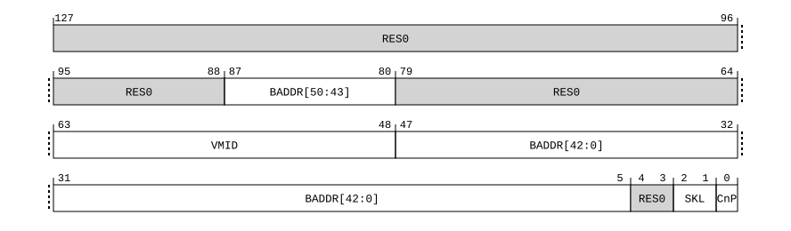

# ​D24.2.224 VTTBR_EL2, Virtualization Translation Table Base Register

Source: <https://developer.arm.com/documentation/ddi0487/mc/-Part-D-The-AArch64-System-Level-Architecture/-Chapter-D24-AArch64-System-Register-Descriptions/-D24-2-General-system-control-registers/-D24-2-224-VTTBR-EL2--Virtualization-Translation-Table-Base-Register>

##### D24.2.224 VTTBR\_EL2, Virtualization Translation Table Base Register

The VTTBR\_EL2 characteristics are:

Purpose
:   Holds the base address of the translation table for the initial lookup for stage 2 of an address translation in the EL1&0 translation regime, and other information for this translation regime.

Configuration
:   If EL2 is not implemented, this register is RES0 from EL3.

    This register has no effect if EL2 is not enabled in the current Security state.

    VTTBR\_EL2 is a 128-bit register that can also be accessed as a 64-bit value. If it is accessed as a 64-bit register, accesses read and write bits [63:0] and do not modify bits [127:64].

    AArch64 System register VTTBR\_EL2 bits [63:0] are architecturally mapped to AArch32 System register [VTTBR](/documentation/ddi0487/mc/-Part-G-The-AArch32-System-Level-Architecture/-Chapter-G8-AArch32-System-Register-Descriptions/-G8-2-General-system-control-registers/-G8-2-173-VTTBR--Virtualization-Translation-Table-Base-Register?lang=en#reg_aarch32_vttbr)[63:0].

    This register is present only when FEAT\_AA64 is implemented. Otherwise, direct accesses to VTTBR\_EL2 are UNDEFINED.

Attributes
:   VTTBR\_EL2 is a:

    - 128-bit register when FEAT\_D128 is implemented and VTCR\_EL2.D128 == ‘1’.
    - 64-bit register when FEAT\_D128 is not implemented or VTCR\_EL2.D128 == ‘0’.

###### Field descriptions

When FEAT\_D128 is implemented and VTCR\_EL2.D128 == '1':
:   

Bits [127:88]
:   Reserved, RES0.

BADDR, bits [87:80, 47:5]
:   Translation table base address:

    - Bits A[55:x] of the stage 2 translation table base address bits are in register bits[87:80, 47:x].
    - Bits A[(x-1):0] of the stage 2 translation table base address are zero.

    Address bit x is the minimum address bit required to align the translation table to the size of the table. x is calculated based on LOG2(StartTableSize), as described in VMSAv9-128. The smallest permitted value of x is 5.

    The reset behavior of this field is:

    - On a Warm reset, this field resets to an architecturally UNKNOWN value.

Bits [79:64]
:   Reserved, RES0.

VMID, bits [63:48]
:   When FEAT\_VMID16 is implemented and VTCR\_EL2.VS == '1':
    :   

    VMID, bits [15:0]
    :   The VMID for the translation table.

        If the implementation has an 8-bit VMID, bits [15:8] of this field are RES0.

        The reset behavior of this field is:

        - On a Warm reset, this field resets to an architecturally UNKNOWN value.

    When FEAT\_VMID16 is not implemented or VTCR\_EL2.VS == '0':
    :   

    Bits [15:8]
    :   Reserved, RES0.

    VMID, bits [7:0]
    :   The VMID for the translation table.

        The VMID is 8 bits when any of the following are true:

        - EL2 is using AArch32.
        - [VTCR\_EL2](/documentation/ddi0487/mc/-Part-D-The-AArch64-System-Level-Architecture/-Chapter-D24-AArch64-System-Register-Descriptions/-D24-2-General-system-control-registers/-D24-2-223-VTCR-EL2--Virtualization-Translation-Control-Register?lang=en#reg_aarch64_vtcr_el2).VS is 0.
        - [FEAT\_VMID16](/documentation/ddi0487/mc/-Part-A-Arm-Architecture-Introduction-and-Overview/-Chapter-A2-A-profile-Architecture-Extensions/-A2-2-Armv8-A-architecture-extensions/-A2-2-2-The-Armv8-1-architecture-extension?lang=en#feat_feat_vmid16) is not implemented.

        The reset behavior of this field is:

        - On a Warm reset, this field resets to an architecturally UNKNOWN value.

Bits [4:3]
:   Reserved, RES0.

SKL, bits [2:1]
:   Skip Level. Skip Level determines the number of levels to be skipped from the regular start level of the Non-Secure stage 2 translation table walk.

<table>
 <colgroup>
  <col/>
  <col/>
 </colgroup>
 <thead>
  <tr>
   <th>
    <strong>
     SKL
    </strong>
   </th>
   <th>
    <strong>
     Meaning
    </strong>
   </th>
  </tr>
 </thead>
 <tbody>
  <tr>
   <td>
    <p>
     <code>
      0b00
     </code>
    </p>
   </td>
   <td>
    <p>
     Skip 0 level from the regular start level.
    </p>
   </td>
  </tr>
  <tr>
   <td>
    <p>
     <code>
      0b01
     </code>
    </p>
   </td>
   <td>
    <p>
     Skip 1 level from the regular start level.
    </p>
   </td>
  </tr>
  <tr>
   <td>
    <p>
     <code>
      0b10
     </code>
    </p>
   </td>
   <td>
    <p>
     Skip 2 levels from the regular start level.
    </p>
   </td>
  </tr>
  <tr>
   <td>
    <p>
     <code>
      0b11
     </code>
    </p>
   </td>
   <td>
    <p>
     Skip 3 levels from the regular start level.
    </p>
   </td>
  </tr>
 </tbody>
</table>

    The reset behavior of this field is:

    - On a Warm reset, this field resets to an architecturally UNKNOWN value.

CnP, bit [0]
:   When FEAT\_TTCNP is implemented:
    :   Common not Private. This bit indicates whether each entry that is pointed to by VTTBR\_EL2 is a member of a common set that can be used by every PE in the Inner Shareable domain for which the value of VTTBR\_EL2.CnP is 1.

<table>
 <colgroup>
  <col/>
  <col/>
 </colgroup>
 <thead>
  <tr>
   <th>
    <strong>
     CnP
    </strong>
   </th>
   <th>
    <strong>
     Meaning
    </strong>
   </th>
  </tr>
 </thead>
 <tbody>
  <tr>
   <td>
    <p>
     <code>
      0b0
     </code>
    </p>
   </td>
   <td>
    <p>
     The translation table entries pointed to by VTTBR_EL2 are permitted to differ from the entries for VTTBR_EL2 for other PEs in the Inner Shareable domain. This is not affected by the value of the current VMID.
    </p>
   </td>
  </tr>
  <tr>
   <td>
    <p>
     <code>
      0b1
     </code>
    </p>
   </td>
   <td>
    <p>
     The translation table entries pointed to by VTTBR_EL2 are the same as the translation table entries for every other PE in the Inner Shareable domain for which the value of VTTBR_EL2.CnP is 1 and the VMID is the same as the current VMID.
    </p>
   </td>
  </tr>
 </tbody>
</table>

        This bit is permitted to be cached in a TLB.

        > #### Note
        >
        > If the value of VTTBR\_EL2.CnP bit is 1 on multiple PEs in the same Inner Shareable domain and those VTTBR\_EL2s do not point to the same translation table entries when using the current VMID, then the results of translations using VTTBR\_EL2 are CONSTRAINED UNPREDICTABLE, see [‘CONSTRAINED UNPREDICTABLE behaviors due to caching of control or data values’](/documentation/ddi0487/mc/-Part-K-Appendixes/-Appendix-K1-Architectural-Constraints-on-UNPREDICTABLE-Behaviors/-K1-2-AArch64-CONSTRAINED-UNPREDICTABLE-behaviors/-K1-2-3-CONSTRAINED-UNPREDICTABLE-behaviors-due-to-caching-of-control-or-data-values?lang=en#ceghbjbh).

        The reset behavior of this field is:

        - On a Warm reset, this field resets to an architecturally UNKNOWN value.

    Otherwise:
    :   Reserved, RES0.

When FEAT\_D128 is not implemented or VTCR\_EL2.D128 == '0':
:   

VMID, bits [63:48]
:   When FEAT\_VMID16 is implemented and VTCR\_EL2.VS == '1':
    :   

    VMID, bits [15:0]
    :   The VMID for the translation table.

        If the implementation has an 8-bit VMID, bits [15:8] of this field are RES0.

        The reset behavior of this field is:

        - On a Warm reset, this field resets to an architecturally UNKNOWN value.

    When FEAT\_VMID16 is not implemented or VTCR\_EL2.VS == '0':
    :   

    Bits [15:8]
    :   Reserved, RES0.

    VMID, bits [7:0]
    :   The VMID for the translation table.

        The VMID is 8 bits when any of the following are true:

        - EL2 is using AArch32.
        - [VTCR\_EL2](/documentation/ddi0487/mc/-Part-D-The-AArch64-System-Level-Architecture/-Chapter-D24-AArch64-System-Register-Descriptions/-D24-2-General-system-control-registers/-D24-2-223-VTCR-EL2--Virtualization-Translation-Control-Register?lang=en#reg_aarch64_vtcr_el2).VS is 0.
        - [FEAT\_VMID16](/documentation/ddi0487/mc/-Part-A-Arm-Architecture-Introduction-and-Overview/-Chapter-A2-A-profile-Architecture-Extensions/-A2-2-Armv8-A-architecture-extensions/-A2-2-2-The-Armv8-1-architecture-extension?lang=en#feat_feat_vmid16) is not implemented.

        The reset behavior of this field is:

        - On a Warm reset, this field resets to an architecturally UNKNOWN value.

BADDR, bits [47:1]
:   Translation table base address, A[47:x] or A[51:x], bits[47:1].

    The BADDR field represents a 52-bit address if any of the following apply:

    - The value of [VTCR\_EL2](/documentation/ddi0487/mc/-Part-D-The-AArch64-System-Level-Architecture/-Chapter-D24-AArch64-System-Register-Descriptions/-D24-2-General-system-control-registers/-D24-2-223-VTCR-EL2--Virtualization-Translation-Control-Register?lang=en#reg_aarch64_vtcr_el2).PS represents an OA size of 52 bits.
    - The Effective value of [VTCR\_EL2](/documentation/ddi0487/mc/-Part-D-The-AArch64-System-Level-Architecture/-Chapter-D24-AArch64-System-Register-Descriptions/-D24-2-General-system-control-registers/-D24-2-223-VTCR-EL2--Virtualization-Translation-Control-Register?lang=en#reg_aarch64_vtcr_el2).DS is 1.

    When VTTBR\_EL2.BADDR represents a 52-bit addresses, all of the following apply:

    - Register bits[47:x] hold bits[47:x] of the stage 2 translation table base address, where x is determined by the size of the translation table at the start level.
    - The smallest permitted value of x is 6.
    - Register bits[5:2] hold bits[51:48] of the stage 2 translation table base address.
    - Bits[x:0] of the translation table base address are zero.
    - When x>6 register bits[(x-1):6] are RES0.
    - Register bit[1] is RES0.

    Otherwise, all of the following apply:

    - Register bits[47:x] hold bits[47:x] of the stage 2 translation table base address.
    - Register bits[(x-1):1] are RES0.
    - If 52-bit PA is supported, then bits[51:48] of the stage 2 translation table base address are treated as `0b0000`.

    > #### Note
    >
    > If BADDR represents a 52-bit address, and the translation table has fewer than eight entries, the table must be aligned to 64 bytes. Otherwise the translation table must be aligned to the size of the table.
    >
    > For the 64KB granule, if 52-bit PA is not supported, and the value of [VTCR\_EL2](/documentation/ddi0487/mc/-Part-D-The-AArch64-System-Level-Architecture/-Chapter-D24-AArch64-System-Register-Descriptions/-D24-2-General-system-control-registers/-D24-2-223-VTCR-EL2--Virtualization-Translation-Control-Register?lang=en#reg_aarch64_vtcr_el2).PS is `0b110` or `0b111`, one of the following IMPLEMENTATION DEFINED behaviors occur:
    >
    > - BADDR uses the extended format to represent a 52-bit base address.
    > - BADDR does not use the extended format.
    >
    > When the value of [ID\_AA64MMFR0\_EL1](/documentation/ddi0487/mc/-Part-D-The-AArch64-System-Level-Architecture/-Chapter-D24-AArch64-System-Register-Descriptions/-D24-2-General-system-control-registers/-D24-2-87-ID-AA64MMFR0-EL1--AArch64-Memory-Model-Feature-Register-0?lang=en#reg_aarch64_id_aa64mmfr0_el1).PARange indicates that the implementation supports a 56 bit PA size, bits [55:52] of the stage 2 translation table base address are zero.

    If any VTTBR\_EL2[47:0] bit that is defined as RES0 has the value 1 when a translation table walk is performed using VTTBR\_EL2, then the translation table base address might be misaligned, with effects that are CONSTRAINED UNPREDICTABLE, and must be one of the following:

    - Bits[x-1:0] of the translation table base address are treated as if all the bits are zero. The value read back from the corresponding register bits is either the value written to the register or zero.
    - The result of the calculation of an address for a translation table walk using this register can be corrupted in those bits that are nonzero.

    The AArch64 Virtual Memory System Architecture chapter describes how x is calculated based on the value of [VTCR\_EL2](/documentation/ddi0487/mc/-Part-D-The-AArch64-System-Level-Architecture/-Chapter-D24-AArch64-System-Register-Descriptions/-D24-2-General-system-control-registers/-D24-2-223-VTCR-EL2--Virtualization-Translation-Control-Register?lang=en#reg_aarch64_vtcr_el2).T0SZ, the stage of translation, and the translation granule size.

    The reset behavior of this field is:

    - On a Warm reset, this field resets to an architecturally UNKNOWN value.

CnP, bit [0]
:   When FEAT\_TTCNP is implemented:
    :   Common not Private. This bit indicates whether each entry that is pointed to by VTTBR\_EL2 is a member of a common set that can be used by every PE in the Inner Shareable domain for which the value of VTTBR\_EL2.CnP is 1.

<table>
 <colgroup>
  <col/>
  <col/>
 </colgroup>
 <thead>
  <tr>
   <th>
    <strong>
     CnP
    </strong>
   </th>
   <th>
    <strong>
     Meaning
    </strong>
   </th>
  </tr>
 </thead>
 <tbody>
  <tr>
   <td>
    <p>
     <code>
      0b0
     </code>
    </p>
   </td>
   <td>
    <p>
     The translation table entries pointed to by VTTBR_EL2 are permitted to differ from the entries for VTTBR_EL2 for other PEs in the Inner Shareable domain. This is not affected by the value of the current VMID.
    </p>
   </td>
  </tr>
  <tr>
   <td>
    <p>
     <code>
      0b1
     </code>
    </p>
   </td>
   <td>
    <p>
     The translation table entries pointed to by VTTBR_EL2 are the same as the translation table entries for every other PE in the Inner Shareable domain for which the value of VTTBR_EL2.CnP is 1 and the VMID is the same as the current VMID.
    </p>
   </td>
  </tr>
 </tbody>
</table>

        This bit is permitted to be cached in a TLB.

        > #### Note
        >
        > If the value of VTTBR\_EL2.CnP bit is 1 on multiple PEs in the same Inner Shareable domain and those VTTBR\_EL2s do not point to the same translation table entries when using the current VMID, then the results of translations using VTTBR\_EL2 are CONSTRAINED UNPREDICTABLE, see [‘CONSTRAINED UNPREDICTABLE behaviors due to caching of control or data values’](/documentation/ddi0487/mc/-Part-K-Appendixes/-Appendix-K1-Architectural-Constraints-on-UNPREDICTABLE-Behaviors/-K1-2-AArch64-CONSTRAINED-UNPREDICTABLE-behaviors/-K1-2-3-CONSTRAINED-UNPREDICTABLE-behaviors-due-to-caching-of-control-or-data-values?lang=en#ceghbjbh).

        The reset behavior of this field is:

        - On a Warm reset, this field resets to an architecturally UNKNOWN value.

    Otherwise:
    :   Reserved, RES0.

###### Accessing VTTBR\_EL2

Accesses to this register use the following encodings in the System register encoding space:

###### `MRS <Xt>, VTTBR_EL2`

<table>
 <colgroup>
  <col/>
  <col/>
  <col/>
  <col/>
  <col/>
 </colgroup>
 <thead>
  <tr>
   <th>
    <strong>
     op0
    </strong>
   </th>
   <th>
    <strong>
     op1
    </strong>
   </th>
   <th>
    <strong>
     CRn
    </strong>
   </th>
   <th>
    <strong>
     CRm
    </strong>
   </th>
   <th>
    <strong>
     op2
    </strong>
   </th>
  </tr>
 </thead>
 <tbody>
  <tr>
   <td>
    <p>
     <code>
      0b11
     </code>
    </p>
   </td>
   <td>
    <p>
     <code>
      0b100
     </code>
    </p>
   </td>
   <td>
    <p>
     <code>
      0b0010
     </code>
    </p>
   </td>
   <td>
    <p>
     <code>
      0b0001
     </code>
    </p>
   </td>
   <td>
    <p>
     <code>
      0b000
     </code>
    </p>
   </td>
  </tr>
 </tbody>
</table>

```
if !IsFeatureImplemented(FEAT_AA64) then
    Undefined();
elsif PSTATE.EL == EL0 then
    Undefined();
elsif PSTATE.EL == EL1 then
    if EffectiveHCR_EL2_NVx() IN {'1x1'} then
        X{64}(t) = NVMem(0x020);
    elsif EffectiveHCR_EL2_NVx() IN {'xx1'} then
        AArch64_SystemAccessTrap(EL2, 0x18);
    else
        Undefined();
    end;
elsif PSTATE.EL == EL2 then
    X{64}(t) = VTTBR_EL2()[63:0];
elsif PSTATE.EL == EL3 then
    X{64}(t) = VTTBR_EL2()[63:0];
end;
```

###### `MSR VTTBR_EL2, <Xt>`

<table>
 <colgroup>
  <col/>
  <col/>
  <col/>
  <col/>
  <col/>
 </colgroup>
 <thead>
  <tr>
   <th>
    <strong>
     op0
    </strong>
   </th>
   <th>
    <strong>
     op1
    </strong>
   </th>
   <th>
    <strong>
     CRn
    </strong>
   </th>
   <th>
    <strong>
     CRm
    </strong>
   </th>
   <th>
    <strong>
     op2
    </strong>
   </th>
  </tr>
 </thead>
 <tbody>
  <tr>
   <td>
    <p>
     <code>
      0b11
     </code>
    </p>
   </td>
   <td>
    <p>
     <code>
      0b100
     </code>
    </p>
   </td>
   <td>
    <p>
     <code>
      0b0010
     </code>
    </p>
   </td>
   <td>
    <p>
     <code>
      0b0001
     </code>
    </p>
   </td>
   <td>
    <p>
     <code>
      0b000
     </code>
    </p>
   </td>
  </tr>
 </tbody>
</table>

```
if !IsFeatureImplemented(FEAT_AA64) then
    Undefined();
elsif PSTATE.EL == EL0 then
    Undefined();
elsif PSTATE.EL == EL1 then
    if EffectiveHCR_EL2_NVx() IN {'1x1'} then
        NVMem(0x020) = X{64}(t);
    elsif EffectiveHCR_EL2_NVx() IN {'xx1'} then
        AArch64_SystemAccessTrap(EL2, 0x18);
    else
        Undefined();
    end;
elsif PSTATE.EL == EL2 then
    VTTBR_EL2()[63:0] = X{64}(t);
elsif PSTATE.EL == EL3 then
    VTTBR_EL2()[63:0] = X{64}(t);
end;
```

`When FEAT_D128 is implemented MRRS <Xt>, <Xt+1>, VTTBR_EL2`
:

<table>
 <colgroup>
  <col/>
  <col/>
  <col/>
  <col/>
  <col/>
 </colgroup>
 <thead>
  <tr>
   <th>
    <strong>
     op0
    </strong>
   </th>
   <th>
    <strong>
     op1
    </strong>
   </th>
   <th>
    <strong>
     CRn
    </strong>
   </th>
   <th>
    <strong>
     CRm
    </strong>
   </th>
   <th>
    <strong>
     op2
    </strong>
   </th>
  </tr>
 </thead>
 <tbody>
  <tr>
   <td>
    <p>
     <code>
      0b11
     </code>
    </p>
   </td>
   <td>
    <p>
     <code>
      0b100
     </code>
    </p>
   </td>
   <td>
    <p>
     <code>
      0b0010
     </code>
    </p>
   </td>
   <td>
    <p>
     <code>
      0b0001
     </code>
    </p>
   </td>
   <td>
    <p>
     <code>
      0b000
     </code>
    </p>
   </td>
  </tr>
 </tbody>
</table>

    ```
    if !IsFeatureImplemented(FEAT_AA64) then
        Undefined();
    elsif HaveEL(EL3) && PSTATE.EL == EL2 && EL3SDDUndefPriority() && SCR_EL3().D128En == '0' then
        Undefined();
    elsif PSTATE.EL == EL0 then
        Undefined();
    elsif PSTATE.EL == EL1 then
        if EffectiveHCR_EL2_NVx() IN {'1x1'} then
            X{128}(t, t2) = NVMem128(0x020);
        elsif EffectiveHCR_EL2_NVx() IN {'xx1'} then
            AArch64_SystemAccessTrap(EL2, 0x14);
        else
            Undefined();
        end;
    elsif PSTATE.EL == EL2 then
        if HaveEL(EL3) && SCR_EL3().D128En == '0' then
            if EL3SDDUndef() then
                Undefined();
            else
                AArch64_SystemAccessTrap(EL3, 0x14);
            end;
        else
            X{128}(t, t2) = VTTBR_EL2();
        end;
    elsif PSTATE.EL == EL3 then
        X{128}(t, t2) = VTTBR_EL2();
    end;
    ```

`When FEAT_D128 is implemented MSRR VTTBR_EL2, <Xt>, <Xt+1>`
:

<table>
 <colgroup>
  <col/>
  <col/>
  <col/>
  <col/>
  <col/>
 </colgroup>
 <thead>
  <tr>
   <th>
    <strong>
     op0
    </strong>
   </th>
   <th>
    <strong>
     op1
    </strong>
   </th>
   <th>
    <strong>
     CRn
    </strong>
   </th>
   <th>
    <strong>
     CRm
    </strong>
   </th>
   <th>
    <strong>
     op2
    </strong>
   </th>
  </tr>
 </thead>
 <tbody>
  <tr>
   <td>
    <p>
     <code>
      0b11
     </code>
    </p>
   </td>
   <td>
    <p>
     <code>
      0b100
     </code>
    </p>
   </td>
   <td>
    <p>
     <code>
      0b0010
     </code>
    </p>
   </td>
   <td>
    <p>
     <code>
      0b0001
     </code>
    </p>
   </td>
   <td>
    <p>
     <code>
      0b000
     </code>
    </p>
   </td>
  </tr>
 </tbody>
</table>

    ```
    if !IsFeatureImplemented(FEAT_AA64) then
        Undefined();
    elsif HaveEL(EL3) && PSTATE.EL == EL2 && EL3SDDUndefPriority() && SCR_EL3().D128En == '0' then
        Undefined();
    elsif PSTATE.EL == EL0 then
        Undefined();
    elsif PSTATE.EL == EL1 then
        if EffectiveHCR_EL2_NVx() IN {'1x1'} then
            NVMem128(0x020) = X{128}(t, t2);
        elsif EffectiveHCR_EL2_NVx() IN {'xx1'} then
            AArch64_SystemAccessTrap(EL2, 0x14);
        else
            Undefined();
        end;
    elsif PSTATE.EL == EL2 then
        if HaveEL(EL3) && SCR_EL3().D128En == '0' then
            if EL3SDDUndef() then
                Undefined();
            else
                AArch64_SystemAccessTrap(EL3, 0x14);
            end;
        else
            VTTBR_EL2()[127:0] = X{128}(t, t2);
        end;
    elsif PSTATE.EL == EL3 then
        VTTBR_EL2()[127:0] = X{128}(t, t2);
    end;
    ```
