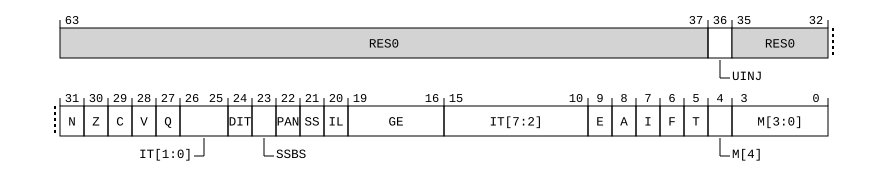

# ​D24.3.14 DSPSR_EL0, Debug Saved Program Status Register

Source: <https://developer.arm.com/documentation/ddi0487/mc/-Part-D-The-AArch64-System-Level-Architecture/-Chapter-D24-AArch64-System-Register-Descriptions/-D24-3-Debug-System-registers/-D24-3-14-DSPSR-EL0--Debug-Saved-Program-Status-Register>

##### D24.3.14 DSPSR\_EL0, Debug Saved Program Status Register

The DSPSR\_EL0 characteristics are:

Purpose
:   Holds the saved process state for Debug state. On entering Debug state, PSTATE information is written to this register. On exiting Debug state, values are copied from this register to PSTATE.

Configuration
:   This register is a Special-purpose register.

    AArch64 System register DSPSR\_EL0 bits [31:0] are architecturally mapped to AArch32 System register [DSPSR](/documentation/ddi0487/mc/-Part-G-The-AArch32-System-Level-Architecture/-Chapter-G8-AArch32-System-Register-Descriptions/-G8-3-Debug-System-registers/-G8-3-30-DSPSR--Debug-Saved-Program-Status-Register?lang=en#reg_aarch32_dspsr)[31:0].

    When FEAT\_Debugv8p9 is implemented, AArch64 System register DSPSR\_EL0 bits [63:32] are architecturally mapped to AArch32 System register [DSPSR2](/documentation/ddi0487/mc/-Part-G-The-AArch32-System-Level-Architecture/-Chapter-G8-AArch32-System-Register-Descriptions/-G8-3-Debug-System-registers/-G8-3-31-DSPSR2--Debug-Saved-Process-State-Register-2?lang=en#reg_aarch32_dspsr2)[31:0].

    This register is present only when FEAT\_AA64 is implemented. Otherwise, direct accesses to DSPSR\_EL0 are UNDEFINED.

Attributes
:   DSPSR\_EL0 is a 64-bit register.

###### Field descriptions

When FEAT\_AA32 is implemented and exiting Debug state to AArch32 state:
:   

Bits [63:37]
:   Reserved, RES0.

UINJ, bit [36]
:   When FEAT\_UINJ is implemented:
    :   Inject Undefined Instruction exception. Copied to PSTATE.UINJ on exiting Debug state.

        The reset behavior of this field is:

        - On a Warm reset, this field resets to an architecturally UNKNOWN value.

    Otherwise:
    :   Reserved, RES0.

Bits [35:32]
:   Reserved, RES0.

N, bit [31]
:   Negative Condition flag. Copied to PSTATE.N on exiting Debug state.

    The reset behavior of this field is:

    - On a Warm reset, this field resets to an architecturally UNKNOWN value.

Z, bit [30]
:   Zero Condition flag. Copied to PSTATE.Z on exiting Debug state.

    The reset behavior of this field is:

    - On a Warm reset, this field resets to an architecturally UNKNOWN value.

C, bit [29]
:   Carry Condition flag. Copied to PSTATE.C on exiting Debug state.

    The reset behavior of this field is:

    - On a Warm reset, this field resets to an architecturally UNKNOWN value.

V, bit [28]
:   Overflow Condition flag. Copied to PSTATE.V on exiting Debug state.

    The reset behavior of this field is:

    - On a Warm reset, this field resets to an architecturally UNKNOWN value.

Q, bit [27]
:   Overflow or saturation flag. Copied to PSTATE.Q on exiting Debug state.

    The reset behavior of this field is:

    - On a Warm reset, this field resets to an architecturally UNKNOWN value.

IT, bits [15:10, 26:25]
:   If-Then. Copied to PSTATE.IT on exiting Debug state.

    On exiting Debug state, DSPSR\_EL0.IT must contain a value that is valid for the instruction being returned to.

    The reset behavior of this field is:

    - On a Warm reset, this field resets to an architecturally UNKNOWN value.

DIT, bit [24]
:   When FEAT\_DIT is implemented:
    :   Data Independent Timing. Copied to PSTATE.DIT on exiting Debug state.

        The reset behavior of this field is:

        - On a Warm reset, this field resets to an architecturally UNKNOWN value.

    Otherwise:
    :   Reserved, RES0.

SSBS, bit [23]
:   When FEAT\_SSBS is implemented:
    :   Speculative Store Bypass. Copied to PSTATE.SSBS on exiting Debug state.

        The reset behavior of this field is:

        - On a Warm reset, this field resets to an architecturally UNKNOWN value.

    Otherwise:
    :   Reserved, RES0.

PAN, bit [22]
:   When FEAT\_PAN is implemented:
    :   Privileged Access Never. Copied to PSTATE.PAN on exiting Debug state.

        The reset behavior of this field is:

        - On a Warm reset, this field resets to an architecturally UNKNOWN value.

    Otherwise:
    :   Reserved, RES0.

SS, bit [21]
:   Software Step. Copied to PSTATE.SS on exiting Debug state.

    The reset behavior of this field is:

    - On a Warm reset, this field resets to an architecturally UNKNOWN value.

IL, bit [20]
:   Illegal Execution state. Copied to PSTATE.IL on exiting Debug state.

    The reset behavior of this field is:

    - On a Warm reset, this field resets to an architecturally UNKNOWN value.

GE, bits [19:16]
:   Greater than or Equal flags. Copied to PSTATE.GE on exiting Debug state.

    The reset behavior of this field is:

    - On a Warm reset, this field resets to an architecturally UNKNOWN value.

E, bit [9]
:   Endianness. Copied to PSTATE.E on exiting Debug state.

    If the implementation does not support big-endian operation, DSPSR\_EL0.E is RES0. If the implementation does not support little-endian operation, DSPSR\_EL0.E is RES1. On exiting Debug state, if the implementation does not support big-endian operation at the Exception level being returned to, DSPSR\_EL0.E is RES0, and if the implementation does not support little-endian operation at the Exception level being returned to, DSPSR\_EL0.E is RES1.

    The reset behavior of this field is:

    - On a Warm reset, this field resets to an architecturally UNKNOWN value.

A, bit [8]
:   SError exception mask. Copied to PSTATE.A on exiting Debug state.

    The reset behavior of this field is:

    - On a Warm reset, this field resets to an architecturally UNKNOWN value.

I, bit [7]
:   IRQ interrupt mask. Copied to PSTATE.I on exiting Debug state.

    The reset behavior of this field is:

    - On a Warm reset, this field resets to an architecturally UNKNOWN value.

F, bit [6]
:   FIQ interrupt mask. Copied to PSTATE.F on exiting Debug state.

    The reset behavior of this field is:

    - On a Warm reset, this field resets to an architecturally UNKNOWN value.

T, bit [5]
:   T32 Instruction set state. Copied to PSTATE.T on exiting Debug state.

    The reset behavior of this field is:

    - On a Warm reset, this field resets to an architecturally UNKNOWN value.

M[4], bit [4]
:   Execution state. Copied to PSTATE.nRW on exiting Debug state.

<table>
 <colgroup>
  <col/>
  <col/>
 </colgroup>
 <thead>
  <tr>
   <th>
    <strong>
     M[4]
    </strong>
   </th>
   <th>
    <strong>
     Meaning
    </strong>
   </th>
  </tr>
 </thead>
 <tbody>
  <tr>
   <td>
    <p>
     <code>
      0b1
     </code>
    </p>
   </td>
   <td>
    <p>
     AArch32 execution state.
    </p>
   </td>
  </tr>
 </tbody>
</table>

    The reset behavior of this field is:

    - On a Warm reset, this field resets to an architecturally UNKNOWN value.

M[3:0], bits [3:0]
:   AArch32 Mode. Copied to PSTATE.M[3:0] on exiting Debug state.

<table>
 <colgroup>
  <col/>
  <col/>
  <col/>
 </colgroup>
 <thead>
  <tr>
   <th>
    <strong>
     M[3:0]
    </strong>
   </th>
   <th>
    <strong>
     Meaning
    </strong>
   </th>
   <th>
    <strong>
     Applies when
    </strong>
   </th>
  </tr>
 </thead>
 <tbody>
  <tr>
   <td>
    <p>
     <code>
      0b0000
     </code>
    </p>
   </td>
   <td>
    <p>
     User.
    </p>
   </td>
   <td>
   </td>
  </tr>
  <tr>
   <td>
    <p>
     <code>
      0b0001
     </code>
    </p>
   </td>
   <td>
    <p>
     FIQ.
    </p>
   </td>
   <td>
   </td>
  </tr>
  <tr>
   <td>
    <p>
     <code>
      0b0010
     </code>
    </p>
   </td>
   <td>
    <p>
     IRQ.
    </p>
   </td>
   <td>
   </td>
  </tr>
  <tr>
   <td>
    <p>
     <code>
      0b0011
     </code>
    </p>
   </td>
   <td>
    <p>
     Supervisor.
    </p>
   </td>
   <td>
   </td>
  </tr>
  <tr>
   <td>
    <p>
     <code>
      0b0110
     </code>
    </p>
   </td>
   <td>
    <p>
     Monitor.
    </p>
   </td>
   <td>
    <p>
     FEAT_EL3 is implemented
    </p>
   </td>
  </tr>
  <tr>
   <td>
    <p>
     <code>
      0b0111
     </code>
    </p>
   </td>
   <td>
    <p>
     Abort.
    </p>
   </td>
   <td>
   </td>
  </tr>
  <tr>
   <td>
    <p>
     <code>
      0b1010
     </code>
    </p>
   </td>
   <td>
    <p>
     Hyp.
    </p>
   </td>
   <td>
   </td>
  </tr>
  <tr>
   <td>
    <p>
     <code>
      0b1011
     </code>
    </p>
   </td>
   <td>
    <p>
     Undefined.
    </p>
   </td>
   <td>
   </td>
  </tr>
  <tr>
   <td>
    <p>
     <code>
      0b1111
     </code>
    </p>
   </td>
   <td>
    <p>
     System.
    </p>
   </td>
   <td>
   </td>
  </tr>
 </tbody>
</table>

    Other values are reserved. If DSPSR\_EL0.M[3:0] has a Reserved value, or a value for an unimplemented Exception level, exiting Debug state is an illegal return event, as described in [‘Illegal return events from AArch64 state’](/documentation/ddi0487/mc/-Part-D-The-AArch64-System-Level-Architecture/-Chapter-D1-The-AArch64-System-Level-Programmers--Model/-D1-4-Exceptions/-D1-4-4-Exception-return?lang=en#mdsec_illegal_exception_returns_from_aarch64_state).

    The reset behavior of this field is:

    - On a Warm reset, this field resets to an architecturally UNKNOWN value.

When FEAT\_AA64 is implemented and entering or exiting Debug state from or to AArch64 state:
:   

Bits [63:37]
:   Reserved, RES0.

UINJ, bit [36]
:   When FEAT\_UINJ is implemented:
    :   Inject Undefined Instruction exception. Set to the value of PSTATE.UINJ on entering Debug state, and copied to PSTATE.UINJ on exiting Debug state.

        The reset behavior of this field is:

        - On a Warm reset, this field resets to an architecturally UNKNOWN value.

    Otherwise:
    :   Reserved, RES0.

PACM, bit [35]
:   When FEAT\_PAuth\_LR is implemented:
    :   PACM. Set to the value of PSTATE.PACM on entering Debug state, and copied to PSTATE.PACM on exiting Debug state.

        The reset behavior of this field is:

        - On a Warm reset, this field resets to an architecturally UNKNOWN value.

    Otherwise:
    :   Reserved, RES0.

EXLOCK, bit [34]
:   When FEAT\_GCS is implemented:
    :   Exception return state lock. Set to the value of PSTATE.EXLOCK on entering Debug state, and copied to PSTATE.EXLOCK on exiting Debug state.

        The reset behavior of this field is:

        - On a Warm reset, this field resets to an architecturally UNKNOWN value.

    Otherwise:
    :   Reserved, RES0.

Bit [33]
:   Reserved, RES0.

PM, bit [32]
:   When FEAT\_EBEP is implemented:
    :   Profiling exception mask bit. Set to the value of PSTATE.PM on entering Debug state, and copied to PSTATE.PM on exiting Debug state.

        The reset behavior of this field is:

        - On a Warm reset, this field resets to an architecturally UNKNOWN value.

    Otherwise:
    :   Reserved, RES0.

N, bit [31]
:   Negative Condition flag. Set to the value of PSTATE.N on entering Debug state, and copied to PSTATE.N on exiting Debug state.

    The reset behavior of this field is:

    - On a Warm reset, this field resets to an architecturally UNKNOWN value.

Z, bit [30]
:   Zero Condition flag. Set to the value of PSTATE.Z on entering Debug state, and copied to PSTATE.Z on exiting Debug state.

    The reset behavior of this field is:

    - On a Warm reset, this field resets to an architecturally UNKNOWN value.

C, bit [29]
:   Carry Condition flag. Set to the value of PSTATE.C on entering Debug state, and copied to PSTATE.C on exiting Debug state.

    The reset behavior of this field is:

    - On a Warm reset, this field resets to an architecturally UNKNOWN value.

V, bit [28]
:   Overflow Condition flag. Set to the value of PSTATE.V on entering Debug state, and copied to PSTATE.V on exiting Debug state.

    The reset behavior of this field is:

    - On a Warm reset, this field resets to an architecturally UNKNOWN value.

Bits [27:26]
:   Reserved, RES0.

TCO, bit [25]
:   When FEAT\_MTE is implemented:
    :   Tag Check Override. Set to the value of PSTATE.TCO on entering Debug state, and copied to PSTATE.TCO on exiting Debug state.

        The reset behavior of this field is:

        - On a Warm reset, this field resets to an architecturally UNKNOWN value.

    Otherwise:
    :   Reserved, RES0.

DIT, bit [24]
:   When FEAT\_DIT is implemented:
    :   Data Independent Timing. Set to the value of PSTATE.DIT on entering Debug state, and copied to PSTATE.DIT on exiting Debug state.

        The reset behavior of this field is:

        - On a Warm reset, this field resets to an architecturally UNKNOWN value.

    Otherwise:
    :   Reserved, RES0.

UAO, bit [23]
:   When FEAT\_UAO is implemented:
    :   User Access Override. Set to the value of PSTATE.UAO on entering Debug state, and copied to PSTATE.UAO on exiting Debug state.

        The reset behavior of this field is:

        - On a Warm reset, this field resets to an architecturally UNKNOWN value.

    Otherwise:
    :   Reserved, RES0.

PAN, bit [22]
:   When FEAT\_PAN is implemented:
    :   Privileged Access Never. Set to the value of PSTATE.PAN on entering Debug state, and copied to PSTATE.PAN on exiting Debug state.

        The reset behavior of this field is:

        - On a Warm reset, this field resets to an architecturally UNKNOWN value.

    Otherwise:
    :   Reserved, RES0.

SS, bit [21]
:   Software Step. Set to the value of PSTATE.SS on entering Debug state, and conditionally copied to PSTATE.SS on exiting Debug state.

    The reset behavior of this field is:

    - On a Warm reset, this field resets to an architecturally UNKNOWN value.

IL, bit [20]
:   Illegal Execution state. Set to the value of PSTATE.IL on entering Debug state, and copied to PSTATE.IL on exiting Debug state.

    The reset behavior of this field is:

    - On a Warm reset, this field resets to an architecturally UNKNOWN value.

Bits [19:14]
:   Reserved, RES0.

ALLINT, bit [13]
:   When FEAT\_NMI is implemented:
    :   All IRQ or FIQ interrupts mask. Set to the value of PSTATE.ALLINT on entering Debug state, and copied to PSTATE.ALLINT on exiting Debug state.

        The reset behavior of this field is:

        - On a Warm reset, this field resets to an architecturally UNKNOWN value.

    Otherwise:
    :   Reserved, RES0.

SSBS, bit [12]
:   When FEAT\_SSBS is implemented:
    :   Speculative Store Bypass. Set to the value of PSTATE.SSBS on entering Debug state, and copied to PSTATE.SSBS on exiting Debug state.

        The reset behavior of this field is:

        - On a Warm reset, this field resets to an architecturally UNKNOWN value.

    Otherwise:
    :   Reserved, RES0.

BTYPE, bits [11:10]
:   When FEAT\_BTI is implemented:
    :   Branch Type Indicator. Set to the value of PSTATE.BTYPE on entering Debug state, and copied to PSTATE.BTYPE on exiting Debug state.

        The reset behavior of this field is:

        - On a Warm reset, this field resets to an architecturally UNKNOWN value.

    Otherwise:
    :   Reserved, RES0.

D, bit [9]
:   Debug exception mask. Set to the value of PSTATE.D on entering Debug state, and copied to PSTATE.D on exiting Debug state.

    The reset behavior of this field is:

    - On a Warm reset, this field resets to an architecturally UNKNOWN value.

A, bit [8]
:   SError exception mask. Set to the value of PSTATE.A on entering Debug state, and copied to PSTATE.A on exiting Debug state.

    The reset behavior of this field is:

    - On a Warm reset, this field resets to an architecturally UNKNOWN value.

I, bit [7]
:   IRQ interrupt mask. Set to the value of PSTATE.I on entering Debug state, and copied to PSTATE.I on exiting Debug state.

    The reset behavior of this field is:

    - On a Warm reset, this field resets to an architecturally UNKNOWN value.

F, bit [6]
:   FIQ interrupt mask. Set to the value of PSTATE.F on entering Debug state, and copied to PSTATE.F on exiting Debug state.

    The reset behavior of this field is:

    - On a Warm reset, this field resets to an architecturally UNKNOWN value.

Bit [5]
:   Reserved, RES0.

M[4], bit [4]
:   Execution state. Set to 0, the value of PSTATE.nRW, on entering Debug state from AArch64 state, and copied to PSTATE.nRW on exiting Debug state.

<table>
 <colgroup>
  <col/>
  <col/>
 </colgroup>
 <thead>
  <tr>
   <th>
    <strong>
     M[4]
    </strong>
   </th>
   <th>
    <strong>
     Meaning
    </strong>
   </th>
  </tr>
 </thead>
 <tbody>
  <tr>
   <td>
    <p>
     <code>
      0b0
     </code>
    </p>
   </td>
   <td>
    <p>
     AArch64 execution state.
    </p>
   </td>
  </tr>
 </tbody>
</table>

    The reset behavior of this field is:

    - On a Warm reset, this field resets to an architecturally UNKNOWN value.

M[3:0], bits [3:0]
:   AArch64 Exception level and selected Stack Pointer.

<table>
 <colgroup>
  <col/>
  <col/>
  <col/>
 </colgroup>
 <thead>
  <tr>
   <th>
    <strong>
     M[3:0]
    </strong>
   </th>
   <th>
    <strong>
     Meaning
    </strong>
   </th>
   <th>
    <strong>
     Applies when
    </strong>
   </th>
  </tr>
 </thead>
 <tbody>
  <tr>
   <td>
    <p>
     <code>
      0b0000
     </code>
    </p>
   </td>
   <td>
    <p>
     EL0.
    </p>
   </td>
   <td>
   </td>
  </tr>
  <tr>
   <td>
    <p>
     <code>
      0b0100
     </code>
    </p>
   </td>
   <td>
    <p>
     EL1 with SP_EL0 (EL1t).
    </p>
   </td>
   <td>
   </td>
  </tr>
  <tr>
   <td>
    <p>
     <code>
      0b0101
     </code>
    </p>
   </td>
   <td>
    <p>
     EL1 with SP_EL1 (EL1h).
    </p>
   </td>
   <td>
   </td>
  </tr>
  <tr>
   <td>
    <p>
     <code>
      0b1000
     </code>
    </p>
   </td>
   <td>
    <p>
     EL2 with SP_EL0 (EL2t).
    </p>
   </td>
   <td>
   </td>
  </tr>
  <tr>
   <td>
    <p>
     <code>
      0b1001
     </code>
    </p>
   </td>
   <td>
    <p>
     EL2 with SP_EL2 (EL2h).
    </p>
   </td>
   <td>
   </td>
  </tr>
  <tr>
   <td>
    <p>
     <code>
      0b1100
     </code>
    </p>
   </td>
   <td>
    <p>
     EL3 with SP_EL0 (EL3t).
    </p>
   </td>
   <td>
    <p>
     FEAT_EL3 is implemented
    </p>
   </td>
  </tr>
  <tr>
   <td>
    <p>
     <code>
      0b1101
     </code>
    </p>
   </td>
   <td>
    <p>
     EL3 with SP_EL3 (EL3h).
    </p>
   </td>
   <td>
    <p>
     FEAT_EL3 is implemented
    </p>
   </td>
  </tr>
 </tbody>
</table>

    Other values are reserved. If DSPSR\_EL0.M[3:0] has a Reserved value, or a value for an unimplemented Exception level, exiting Debug state is an illegal return event, as described in [‘Illegal return events from AArch64 state’](/documentation/ddi0487/mc/-Part-D-The-AArch64-System-Level-Architecture/-Chapter-D1-The-AArch64-System-Level-Programmers--Model/-D1-4-Exceptions/-D1-4-4-Exception-return?lang=en#mdsec_illegal_exception_returns_from_aarch64_state).

    The bits in this field are interpreted as follows:

    - M[3:2] is set to the value of PSTATE.EL on entering Debug state and copied to PSTATE.EL on exiting Debug state.
    - M[1] is unused and is 0 for all non-reserved values.
    - M[0] is set to the value of PSTATE.SP on entering Debug state and copied to PSTATE.SP on exiting Debug state.

    The reset behavior of this field is:

    - On a Warm reset, this field resets to an architecturally UNKNOWN value.

###### Accessing DSPSR\_EL0

Accesses to this register use the following encodings in the System register encoding space:

###### `MRS <Xt>, DSPSR_EL0`

<table>
 <colgroup>
  <col/>
  <col/>
  <col/>
  <col/>
  <col/>
 </colgroup>
 <thead>
  <tr>
   <th>
    <strong>
     op0
    </strong>
   </th>
   <th>
    <strong>
     op1
    </strong>
   </th>
   <th>
    <strong>
     CRn
    </strong>
   </th>
   <th>
    <strong>
     CRm
    </strong>
   </th>
   <th>
    <strong>
     op2
    </strong>
   </th>
  </tr>
 </thead>
 <tbody>
  <tr>
   <td>
    <p>
     <code>
      0b11
     </code>
    </p>
   </td>
   <td>
    <p>
     <code>
      0b011
     </code>
    </p>
   </td>
   <td>
    <p>
     <code>
      0b0100
     </code>
    </p>
   </td>
   <td>
    <p>
     <code>
      0b0101
     </code>
    </p>
   </td>
   <td>
    <p>
     <code>
      0b000
     </code>
    </p>
   </td>
  </tr>
 </tbody>
</table>

```
if !IsFeatureImplemented(FEAT_AA64) then
    Undefined();
elsif !Halted() then
    Undefined();
else
    X{64}(t) = DSPSR_EL0();
end;
```

###### `MSR DSPSR_EL0, <Xt>`

<table>
 <colgroup>
  <col/>
  <col/>
  <col/>
  <col/>
  <col/>
 </colgroup>
 <thead>
  <tr>
   <th>
    <strong>
     op0
    </strong>
   </th>
   <th>
    <strong>
     op1
    </strong>
   </th>
   <th>
    <strong>
     CRn
    </strong>
   </th>
   <th>
    <strong>
     CRm
    </strong>
   </th>
   <th>
    <strong>
     op2
    </strong>
   </th>
  </tr>
 </thead>
 <tbody>
  <tr>
   <td>
    <p>
     <code>
      0b11
     </code>
    </p>
   </td>
   <td>
    <p>
     <code>
      0b011
     </code>
    </p>
   </td>
   <td>
    <p>
     <code>
      0b0100
     </code>
    </p>
   </td>
   <td>
    <p>
     <code>
      0b0101
     </code>
    </p>
   </td>
   <td>
    <p>
     <code>
      0b000
     </code>
    </p>
   </td>
  </tr>
 </tbody>
</table>

```
if !IsFeatureImplemented(FEAT_AA64) then
    Undefined();
elsif !Halted() then
    Undefined();
else
    DSPSR_EL0() = X{64}(t);
end;
```
