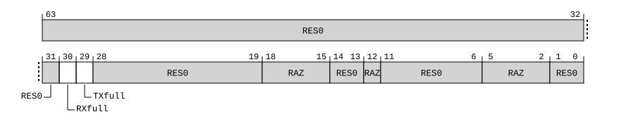

# ​D24.3.16 MDCCSR_EL0, Monitor DCC Status Register

Source: <https://developer.arm.com/documentation/ddi0487/mc/-Part-D-The-AArch64-System-Level-Architecture/-Chapter-D24-AArch64-System-Register-Descriptions/-D24-3-Debug-System-registers/-D24-3-16-MDCCSR-EL0--Monitor-DCC-Status-Register>

##### D24.3.16 MDCCSR\_EL0, Monitor DCC Status Register

The MDCCSR\_EL0 characteristics are:

Purpose
:   Read-only register containing control status flags for the DCC.

Configuration
:   AArch64 System register MDCCSR\_EL0 bits [30:29] are architecturally mapped to External register [EDSCR](/documentation/ddi0487/mc/-Part-H-External-Debug/-Chapter-H9-External-Debug-Register-Descriptions/-H9-2-External-debug-registers/-H9-2-48-EDSCR--External-Debug-Status-and-Control-Register?lang=en#reg_ext_edscr)[30:29].

    AArch64 System register MDCCSR\_EL0 bits [30:29] are architecturally mapped to AArch32 System register [DBGDSCRint](/documentation/ddi0487/mc/-Part-G-The-AArch32-System-Level-Architecture/-Chapter-G8-AArch32-System-Register-Descriptions/-G8-3-Debug-System-registers/-G8-3-15-DBGDSCRint--Debug-Status-and-Control-Register--Internal-View?lang=en#reg_aarch32_dbgdscrint)[30:29].

    This register is present only when FEAT\_AA64 is implemented. Otherwise, direct accesses to MDCCSR\_EL0 are UNDEFINED.

Attributes
:   MDCCSR\_EL0 is a 64-bit register.

###### Field descriptions



Bits [63:31]
:   Reserved, RES0.

RXfull, bit [30]
:   DTRRX full. Read-only view of the equivalent bit in the [EDSCR](/documentation/ddi0487/mc/-Part-H-External-Debug/-Chapter-H9-External-Debug-Register-Descriptions/-H9-2-External-debug-registers/-H9-2-48-EDSCR--External-Debug-Status-and-Control-Register?lang=en#reg_ext_edscr).

    The reset behavior of this field is:

    - On a Cold reset, this field resets to `'0'`.

TXfull, bit [29]
:   DTRTX full. Read-only view of the equivalent bit in the [EDSCR](/documentation/ddi0487/mc/-Part-H-External-Debug/-Chapter-H9-External-Debug-Register-Descriptions/-H9-2-External-debug-registers/-H9-2-48-EDSCR--External-Debug-Status-and-Control-Register?lang=en#reg_ext_edscr).

    The reset behavior of this field is:

    - On a Cold reset, this field resets to `'0'`.

Bits [28:19]
:   Reserved, RES0.

Bits [18:15]
:   Reserved, RAZ.

Bits [14:13]
:   Reserved, RES0.

Bit [12]
:   Reserved, RAZ.

Bits [11:6]
:   Reserved, RES0.

Bits [5:2]
:   Reserved, RAZ.

Bits [1:0]
:   Reserved, RES0.

###### Accessing MDCCSR\_EL0

Accesses to this register use the following encodings in the System register encoding space:

###### `MRS <Xt>, MDCCSR_EL0`

<table>
 <colgroup>
  <col/>
  <col/>
  <col/>
  <col/>
  <col/>
 </colgroup>
 <thead>
  <tr>
   <th>
    <strong>
     op0
    </strong>
   </th>
   <th>
    <strong>
     op1
    </strong>
   </th>
   <th>
    <strong>
     CRn
    </strong>
   </th>
   <th>
    <strong>
     CRm
    </strong>
   </th>
   <th>
    <strong>
     op2
    </strong>
   </th>
  </tr>
 </thead>
 <tbody>
  <tr>
   <td>
    <p>
     <code>
      0b10
     </code>
    </p>
   </td>
   <td>
    <p>
     <code>
      0b011
     </code>
    </p>
   </td>
   <td>
    <p>
     <code>
      0b0000
     </code>
    </p>
   </td>
   <td>
    <p>
     <code>
      0b0001
     </code>
    </p>
   </td>
   <td>
    <p>
     <code>
      0b000
     </code>
    </p>
   </td>
  </tr>
 </tbody>
</table>

```
if !IsFeatureImplemented(FEAT_AA64) then
    Undefined();
elsif Halted() && ConstrainUnpredictableBool(Unpredictable_IGNORETRAPINDEBUG) then
    X{64}(t) = MDCCSR_EL0();
elsif HaveEL(EL3) && PSTATE.EL != EL3 && EL3SDDUndefPriority() && IsFeatureImplemented(FEAT_FGT) && MDCR_EL3().TDCC == '1' then
    Undefined();
elsif HaveEL(EL3) && PSTATE.EL != EL3 && EL3SDDUndefPriority() && MDCR_EL3().TDA == '1' then
    Undefined();
elsif PSTATE.EL == EL0 then
    if MDSCR_EL1().TDCC == '1' then
        AArch64_SystemAccessTraptoEL1orEL2(0x18);
    elsif EL2Enabled() && IsFeatureImplemented(FEAT_FGT) && MDCR_EL2().TDCC == '1' then
        AArch64_SystemAccessTrap(EL2, 0x18);
    elsif EL2Enabled() && (EffectiveTGEforEL0Traps() == '1' || MDCR_EL2().[TDE,TDA] != '00') then
        AArch64_SystemAccessTrap(EL2, 0x18);
    elsif HaveEL(EL3) && IsFeatureImplemented(FEAT_FGT) && MDCR_EL3().TDCC == '1' then
        if EL3SDDUndef() then
            Undefined();
        else
            AArch64_SystemAccessTrap(EL3, 0x18);
        end;
    elsif HaveEL(EL3) && MDCR_EL3().TDA == '1' then
        if EL3SDDUndef() then
            Undefined();
        else
            AArch64_SystemAccessTrap(EL3, 0x18);
        end;
    else
        X{64}(t) = MDCCSR_EL0();
    end;
elsif PSTATE.EL == EL1 then
    if EL2Enabled() && IsFeatureImplemented(FEAT_FGT) && MDCR_EL2().TDCC == '1' then
        AArch64_SystemAccessTrap(EL2, 0x18);
    elsif EL2Enabled() && MDCR_EL2().[TDE,TDA] != '00' then
        AArch64_SystemAccessTrap(EL2, 0x18);
    elsif HaveEL(EL3) && IsFeatureImplemented(FEAT_FGT) && MDCR_EL3().TDCC == '1' then
        if EL3SDDUndef() then
            Undefined();
        else
            AArch64_SystemAccessTrap(EL3, 0x18);
        end;
    elsif HaveEL(EL3) && MDCR_EL3().TDA == '1' then
        if EL3SDDUndef() then
            Undefined();
        else
            AArch64_SystemAccessTrap(EL3, 0x18);
        end;
    else
        X{64}(t) = MDCCSR_EL0();
    end;
elsif PSTATE.EL == EL2 then
    if HaveEL(EL3) && IsFeatureImplemented(FEAT_FGT) && MDCR_EL3().TDCC == '1' then
        if EL3SDDUndef() then
            Undefined();
        else
            AArch64_SystemAccessTrap(EL3, 0x18);
        end;
    elsif HaveEL(EL3) && MDCR_EL3().TDA == '1' then
        if EL3SDDUndef() then
            Undefined();
        else
            AArch64_SystemAccessTrap(EL3, 0x18);
        end;
    else
        X{64}(t) = MDCCSR_EL0();
    end;
elsif PSTATE.EL == EL3 then
    X{64}(t) = MDCCSR_EL0();
end;
```
