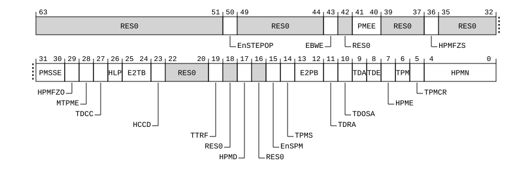

# ​D24.3.17 MDCR_EL2, Monitor Debug Configuration Register (EL2)

Source: <https://developer.arm.com/documentation/ddi0487/mc/-Part-D-The-AArch64-System-Level-Architecture/-Chapter-D24-AArch64-System-Register-Descriptions/-D24-3-Debug-System-registers/-D24-3-17-MDCR-EL2--Monitor-Debug-Configuration-Register--EL2->

##### D24.3.17 MDCR\_EL2, Monitor Debug Configuration Register (EL2)

The MDCR\_EL2 characteristics are:

Purpose
:   Provides EL2 configuration options for self-hosted debug and the Performance Monitors Extension.

Configuration
:   If EL2 is not implemented, this register is RES0 from EL3.

    This register has no effect if EL2 is not enabled in the current Security state.

    AArch64 System register MDCR\_EL2 bits [31:0] are architecturally mapped to AArch32 System register [HDCR](/documentation/ddi0487/mc/-Part-G-The-AArch32-System-Level-Architecture/-Chapter-G8-AArch32-System-Register-Descriptions/-G8-3-Debug-System-registers/-G8-3-32-HDCR--Hyp-Debug-Control-Register?lang=en#reg_aarch32_hdcr)[31:0].

    This register is present only when FEAT\_AA64 is implemented. Otherwise, direct accesses to MDCR\_EL2 are UNDEFINED.

Attributes
:   MDCR\_EL2 is a 64-bit register.

###### Field descriptions



Bits [63:51]
:   Reserved, RES0.

EnSTEPOP, bit [50]
:   When FEAT\_STEP2 is implemented:
    :

<table>
 <colgroup>
  <col/>
  <col/>
 </colgroup>
 <thead>
  <tr>
   <th>
    <strong>
     EnSTEPOP
    </strong>
   </th>
   <th>
    <strong>
     Meaning
    </strong>
   </th>
  </tr>
 </thead>
 <tbody>
  <tr>
   <td>
    <p>
     <code>
      0b0
     </code>
    </p>
   </td>
   <td>
    <p>
     Execution from
     <a class="document-topic" document-topic-path="/ddi0487/mc/-Part-D-The-AArch64-System-Level-Architecture/-Chapter-D24-AArch64-System-Register-Descriptions/-D24-3-Debug-System-registers/-D24-3-22-MDSTEPOP-EL1--Monitor-Debug-Step-Opcode-Register?lang=en#reg_aarch64_mdstepop_el1" href="/documentation/ddi0487/mc/-Part-D-The-AArch64-System-Level-Architecture/-Chapter-D24-AArch64-System-Register-Descriptions/-D24-3-Debug-System-registers/-D24-3-22-MDSTEPOP-EL1--Monitor-Debug-Step-Opcode-Register?lang=en#reg_aarch64_mdstepop_el1">
      MDSTEPOP_EL1
     </a>
     is disabled.
    </p>
   </td>
  </tr>
  <tr>
   <td>
    <p>
     <code>
      0b1
     </code>
    </p>
   </td>
   <td>
    <p>
     Execution from
     <a class="document-topic" document-topic-path="/ddi0487/mc/-Part-D-The-AArch64-System-Level-Architecture/-Chapter-D24-AArch64-System-Register-Descriptions/-D24-3-Debug-System-registers/-D24-3-22-MDSTEPOP-EL1--Monitor-Debug-Step-Opcode-Register?lang=en#reg_aarch64_mdstepop_el1" href="/documentation/ddi0487/mc/-Part-D-The-AArch64-System-Level-Architecture/-Chapter-D24-AArch64-System-Register-Descriptions/-D24-3-Debug-System-registers/-D24-3-22-MDSTEPOP-EL1--Monitor-Debug-Step-Opcode-Register?lang=en#reg_aarch64_mdstepop_el1">
      MDSTEPOP_EL1
     </a>
     is not disabled by this control.
    </p>
   </td>
  </tr>
 </tbody>
</table>

        If EL2 is not implemented or EL2 is disabled in the current Security state, then the Effective value of this field is 1, other than for a direct read of the register.

        The reset behavior of this field is:

        - On a Warm reset, this field resets to an architecturally UNKNOWN value.

    Otherwise:
    :   Reserved, RES0.

Bits [49:44]
:   Reserved, RES0.

EBWE, bit [43]
:   When FEAT\_Debugv8p9 is implemented:
    :   Extended Breakpoint and Watchpoint Enable. Enables use of additional breakpoints or watchpoints.

<table>
 <colgroup>
  <col/>
  <col/>
 </colgroup>
 <thead>
  <tr>
   <th>
    <strong>
     EBWE
    </strong>
   </th>
   <th>
    <strong>
     Meaning
    </strong>
   </th>
  </tr>
 </thead>
 <tbody>
  <tr>
   <td>
    <p>
     <code>
      0b0
     </code>
    </p>
   </td>
   <td>
    <p>
     The Effective value of
     <a class="document-topic" document-topic-path="/ddi0487/mc/-Part-D-The-AArch64-System-Level-Architecture/-Chapter-D24-AArch64-System-Register-Descriptions/-D24-3-Debug-System-registers/-D24-3-20-MDSCR-EL1--Monitor-Debug-System-Control-Register?lang=en#reg_aarch64_mdscr_el1" href="/documentation/ddi0487/mc/-Part-D-The-AArch64-System-Level-Architecture/-Chapter-D24-AArch64-System-Register-Descriptions/-D24-3-Debug-System-registers/-D24-3-20-MDSCR-EL1--Monitor-Debug-System-Control-Register?lang=en#reg_aarch64_mdscr_el1">
      MDSCR_EL1
     </a>
     .EMBWE is 0.
    </p>
    <p>
     The Effective value of
     <a class="document-topic" document-topic-path="/ddi0487/mc/-Part-D-The-AArch64-System-Level-Architecture/-Chapter-D24-AArch64-System-Register-Descriptions/-D24-3-Debug-System-registers/-D24-3-21-MDSELR-EL1--Breakpoint-and-Watchpoint-Selection-Register?lang=en#reg_aarch64_mdselr_el1" href="/documentation/ddi0487/mc/-Part-D-The-AArch64-System-Level-Architecture/-Chapter-D24-AArch64-System-Register-Descriptions/-D24-3-Debug-System-registers/-D24-3-21-MDSELR-EL1--Breakpoint-and-Watchpoint-Selection-Register?lang=en#reg_aarch64_mdselr_el1">
      MDSELR_EL1
     </a>
     .BANK is zero at EL2.
    </p>
   </td>
  </tr>
  <tr>
   <td>
    <p>
     <code>
      0b1
     </code>
    </p>
   </td>
   <td>
    <p>
     The Effective values of
     <a class="document-topic" document-topic-path="/ddi0487/mc/-Part-D-The-AArch64-System-Level-Architecture/-Chapter-D24-AArch64-System-Register-Descriptions/-D24-3-Debug-System-registers/-D24-3-20-MDSCR-EL1--Monitor-Debug-System-Control-Register?lang=en#reg_aarch64_mdscr_el1" href="/documentation/ddi0487/mc/-Part-D-The-AArch64-System-Level-Architecture/-Chapter-D24-AArch64-System-Register-Descriptions/-D24-3-Debug-System-registers/-D24-3-20-MDSCR-EL1--Monitor-Debug-System-Control-Register?lang=en#reg_aarch64_mdscr_el1">
      MDSCR_EL1
     </a>
     .EMBWE and
     <a class="document-topic" document-topic-path="/ddi0487/mc/-Part-D-The-AArch64-System-Level-Architecture/-Chapter-D24-AArch64-System-Register-Descriptions/-D24-3-Debug-System-registers/-D24-3-21-MDSELR-EL1--Breakpoint-and-Watchpoint-Selection-Register?lang=en#reg_aarch64_mdselr_el1" href="/documentation/ddi0487/mc/-Part-D-The-AArch64-System-Level-Architecture/-Chapter-D24-AArch64-System-Register-Descriptions/-D24-3-Debug-System-registers/-D24-3-21-MDSELR-EL1--Breakpoint-and-Watchpoint-Selection-Register?lang=en#reg_aarch64_mdselr_el1">
      MDSELR_EL1
     </a>
     .BANK are not affected by this field.
    </p>
   </td>
  </tr>
 </tbody>
</table>

        It is IMPLEMENTATION DEFINED whether this field is implemented or is RES0 when 16 or fewer breakpoints are implemented, 16 or fewer watchpoints are implemented, and [MDSELR\_EL1](/documentation/ddi0487/mc/-Part-D-The-AArch64-System-Level-Architecture/-Chapter-D24-AArch64-System-Register-Descriptions/-D24-3-Debug-System-registers/-D24-3-21-MDSELR-EL1--Breakpoint-and-Watchpoint-Selection-Register?lang=en#reg_aarch64_mdselr_el1) is implemented as RAZ/WI.

        If EL2 is not implemented or EL2 is disabled in the current Security state, then the Effective value of this field is 1, other than for a direct read of the register.

        This field is ignored by the PE and treated as 0 when EL3 is implemented and [MDCR\_EL3](/documentation/ddi0487/mc/-Part-D-The-AArch64-System-Level-Architecture/-Chapter-D24-AArch64-System-Register-Descriptions/-D24-3-Debug-System-registers/-D24-3-18-MDCR-EL3--Monitor-Debug-Configuration-Register--EL3-?lang=en#reg_aarch64_mdcr_el3).EBWE is 0.

        The reset behavior of this field is:

        - On a Warm reset:
          - When the highest implemented Exception level is EL2, this field resets to `'0'`.
          - Otherwise, this field resets to an architecturally UNKNOWN value.

    Otherwise:
    :   Reserved, RES0.

Bit [42]
:   Reserved, RES0.

PMEE, bits [41:40]
:   When FEAT\_EBEP is implemented:
    :   Performance Monitors Exception Enable. Controls the generation of the **PMUIRQ** signal and the PMU Profiling exception at EL0, EL1, and EL2.

<table>
 <colgroup>
  <col/>
  <col/>
 </colgroup>
 <thead>
  <tr>
   <th>
    <strong>
     PMEE
    </strong>
   </th>
   <th>
    <strong>
     Meaning
    </strong>
   </th>
  </tr>
 </thead>
 <tbody>
  <tr>
   <td>
    <p>
     <code>
      0b00
     </code>
    </p>
   </td>
   <td>
    <p>
     The
     <strong>
      PMUIRQ
     </strong>
     signal is asserted on a PMU overflow, and the PMU Profiling exception is disabled.
    </p>
   </td>
  </tr>
  <tr>
   <td>
    <p>
     <code>
      0b01
     </code>
    </p>
   </td>
   <td>
    <p>
     The
     <strong>
      PMUIRQ
     </strong>
     signal and the PMU Profiling exception are both controlled by
     <a class="document-topic" document-topic-path="/ddi0487/mc/-Part-D-The-AArch64-System-Level-Architecture/-Chapter-D24-AArch64-System-Register-Descriptions/-D24-5-Performance-Monitors-registers/-D24-5-9-PMECR-EL1--Performance-Monitors-Extended-Control-Register--EL1-?lang=en#reg_aarch64_pmecr_el1" href="/documentation/ddi0487/mc/-Part-D-The-AArch64-System-Level-Architecture/-Chapter-D24-AArch64-System-Register-Descriptions/-D24-5-Performance-Monitors-registers/-D24-5-9-PMECR-EL1--Performance-Monitors-Extended-Control-Register--EL1-?lang=en#reg_aarch64_pmecr_el1">
      PMECR_EL1
     </a>
     .PMEE.
    </p>
   </td>
  </tr>
  <tr>
   <td>
    <p>
     <code>
      0b11
     </code>
    </p>
   </td>
   <td>
    <p>
     The
     <strong>
      PMUIRQ
     </strong>
     signal is deasserted, and the PMU Profiling exception is enabled.
    </p>
   </td>
  </tr>
 </tbody>
</table>

        All other values are reserved.

        If EL2 is not implemented or EL2 is disabled in the current Security state, then the Effective value of this field is `0b01`, other than for a direct read of the register.

        This field is ignored by the PE when all of the following are true:

        - EL3 is implemented.
        - [MDCR\_EL3](/documentation/ddi0487/mc/-Part-D-The-AArch64-System-Level-Architecture/-Chapter-D24-AArch64-System-Register-Descriptions/-D24-3-Debug-System-registers/-D24-3-18-MDCR-EL3--Monitor-Debug-Configuration-Register--EL3-?lang=en#reg_aarch64_mdcr_el3).PMEE != `0b01`.

        The reset behavior of this field is:

        - On a Warm reset:
          - When the highest implemented Exception level is EL2, this field resets to `'00'`.
          - Otherwise, this field resets to an architecturally UNKNOWN value.

    Otherwise:
    :   Reserved, RES0.

Bits [39:37]
:   Reserved, RES0.

HPMFZS, bit [36]
:   When FEAT\_SPEv1p2 is implemented:
    :   Hyp Performance Monitors Freeze-on-SPE event. Stop counters when [PMBLIMITR\_EL1](/documentation/ddi0487/mc/-Part-D-The-AArch64-System-Level-Architecture/-Chapter-D24-AArch64-System-Register-Descriptions/-D24-7-Statistical-Profiling-Extension-registers/-D24-7-2-PMBLIMITR-EL1--Profiling-Buffer-Limit-Address-Register?lang=en#reg_aarch64_pmblimitr_el1).{PMFZ,E} is {1,1} and profiling is stopped.

<table>
 <colgroup>
  <col/>
  <col/>
 </colgroup>
 <thead>
  <tr>
   <th>
    <strong>
     HPMFZS
    </strong>
   </th>
   <th>
    <strong>
     Meaning
    </strong>
   </th>
  </tr>
 </thead>
 <tbody>
  <tr>
   <td>
    <p>
     <code>
      0b0
     </code>
    </p>
   </td>
   <td>
    <p>
     Do not freeze on a Statistical Profiling Buffer Management event.
    </p>
   </td>
  </tr>
  <tr>
   <td>
    <p>
     <code>
      0b1
     </code>
    </p>
   </td>
   <td>
    <p>
     Affected counters do not count following a Statistical Profiling Buffer Management event.
    </p>
   </td>
  </tr>
 </tbody>
</table>

        The pseudocode function `SPEProfilingStopped()` describes when profiling is stopped.

        The counters affected by this field are the event counters in the second range. This applies even when EL2 is disabled in the current Security state.

        Other event counters and [PMCCNTR\_EL0](/documentation/ddi0487/mc/-Part-D-The-AArch64-System-Level-Architecture/-Chapter-D24-AArch64-System-Register-Descriptions/-D24-5-Performance-Monitors-registers/-D24-5-2-PMCCNTR-EL0--Performance-Monitors-Cycle-Count-Register?lang=en#reg_aarch64_pmccntr_el0) are not affected by this field.

        When [FEAT\_PMUv3\_ICNTR](/documentation/ddi0487/mc/-Part-A-Arm-Architecture-Introduction-and-Overview/-Chapter-A2-A-profile-Architecture-Extensions/-A2-2-Armv8-A-architecture-extensions/-A2-2-10-The-Armv8-9-architecture-extension?lang=en#feat_feat_pmuv3_icntr) is implemented, [PMICNTR\_EL0](/documentation/ddi0487/mc/-Part-D-The-AArch64-System-Level-Architecture/-Chapter-D24-AArch64-System-Register-Descriptions/-D24-5-Performance-Monitors-registers/-D24-5-14-PMICNTR-EL0--Performance-Monitors-Instruction-Counter-Register?lang=en#reg_aarch64_pmicntr_el0) is not affected by this field.

        If MDCR\_EL2.HPMN is equal to `GetNumEventCountersSelfHosted()`, then this field has no effect.

        The reset behavior of this field is:

        - On a Warm reset, this field resets to an architecturally UNKNOWN value.

    Otherwise:
    :   Reserved, RES0.

Bits [35:32]
:   Reserved, RES0.

PMSSE, bits [31:30]
:   When FEAT\_PMUv3\_SS is implemented:
    :   Performance Monitors Snapshot Enable. Controls the generation of Capture events.

<table>
 <colgroup>
  <col/>
  <col/>
 </colgroup>
 <thead>
  <tr>
   <th>
    <strong>
     PMSSE
    </strong>
   </th>
   <th>
    <strong>
     Meaning
    </strong>
   </th>
  </tr>
 </thead>
 <tbody>
  <tr>
   <td>
    <p>
     <code>
      0b00
     </code>
    </p>
   </td>
   <td>
    <p>
     Capture events are disabled.
    </p>
   </td>
  </tr>
  <tr>
   <td>
    <p>
     <code>
      0b01
     </code>
    </p>
   </td>
   <td>
    <p>
     Capture events are controlled by
     <a class="document-topic" document-topic-path="/ddi0487/mc/-Part-D-The-AArch64-System-Level-Architecture/-Chapter-D24-AArch64-System-Register-Descriptions/-D24-5-Performance-Monitors-registers/-D24-5-9-PMECR-EL1--Performance-Monitors-Extended-Control-Register--EL1-?lang=en#reg_aarch64_pmecr_el1" href="/documentation/ddi0487/mc/-Part-D-The-AArch64-System-Level-Architecture/-Chapter-D24-AArch64-System-Register-Descriptions/-D24-5-Performance-Monitors-registers/-D24-5-9-PMECR-EL1--Performance-Monitors-Extended-Control-Register--EL1-?lang=en#reg_aarch64_pmecr_el1">
      PMECR_EL1
     </a>
     .SSE.
    </p>
   </td>
  </tr>
  <tr>
   <td>
    <p>
     <code>
      0b10
     </code>
    </p>
   </td>
   <td>
    <p>
     Capture events are enabled and prohibited.
    </p>
   </td>
  </tr>
  <tr>
   <td>
    <p>
     <code>
      0b11
     </code>
    </p>
   </td>
   <td>
    <p>
     Capture events are enabled and allowed.
    </p>
   </td>
  </tr>
 </tbody>
</table>

        If EL2 is not implemented, then the Effective value of this field is `0b01`.

        The reset behavior of this field is:

        - On a Cold reset:
          - When the highest implemented Exception level is EL2, this field resets to `'00'`.
          - Otherwise, this field resets to an architecturally UNKNOWN value.

    Otherwise:
    :   Reserved, RES0.

HPMFZO, bit [29]
:   When FEAT\_PMUv3p7 is implemented:
    :   Hyp Performance Monitors Freeze-on-overflow. Stop event counters on overflow.

<table>
 <colgroup>
  <col/>
  <col/>
 </colgroup>
 <thead>
  <tr>
   <th>
    <strong>
     HPMFZO
    </strong>
   </th>
   <th>
    <strong>
     Meaning
    </strong>
   </th>
  </tr>
 </thead>
 <tbody>
  <tr>
   <td>
    <p>
     <code>
      0b0
     </code>
    </p>
   </td>
   <td>
    <p>
     Do not freeze on overflow.
    </p>
   </td>
  </tr>
  <tr>
   <td>
    <p>
     <code>
      0b1
     </code>
    </p>
   </td>
   <td>
    <p>
     Affected counters do not count when
     <a class="document-topic" document-topic-path="/ddi0487/mc/-Part-D-The-AArch64-System-Level-Architecture/-Chapter-D24-AArch64-System-Register-Descriptions/-D24-5-Performance-Monitors-registers/-D24-5-19-PMOVSCLR-EL0--Performance-Monitors-Overflow-Flag-Status-Clear-Register?lang=en#reg_aarch64_pmovsclr_el0" href="/documentation/ddi0487/mc/-Part-D-The-AArch64-System-Level-Architecture/-Chapter-D24-AArch64-System-Register-Descriptions/-D24-5-Performance-Monitors-registers/-D24-5-19-PMOVSCLR-EL0--Performance-Monitors-Overflow-Flag-Status-Clear-Register?lang=en#reg_aarch64_pmovsclr_el0">
      PMOVSCLR_EL0
     </a>
     [m] is 1 for any event counter
     <a class="document-topic" document-topic-path="/ddi0487/mc/-Part-D-The-AArch64-System-Level-Architecture/-Chapter-D24-AArch64-System-Register-Descriptions/-D24-5-Performance-Monitors-registers/-D24-5-10-PMEVCNTR-n--EL0--Performance-Monitors-Event-Count-Registers--n---0---30?lang=en#reg_aarch64_pmevcntrn_el0" href="/documentation/ddi0487/mc/-Part-D-The-AArch64-System-Level-Architecture/-Chapter-D24-AArch64-System-Register-Descriptions/-D24-5-Performance-Monitors-registers/-D24-5-10-PMEVCNTR-n--EL0--Performance-Monitors-Event-Count-Registers--n---0---30?lang=en#reg_aarch64_pmevcntrn_el0">
      PMEVCNTR&lt;m&gt;_EL0
     </a>
     in the second range.
    </p>
   </td>
  </tr>
 </tbody>
</table>

        The counters affected by this field are the event counters in the second range. This applies even when EL2 is disabled in the current Security state.

        Other event counters and [PMCCNTR\_EL0](/documentation/ddi0487/mc/-Part-D-The-AArch64-System-Level-Architecture/-Chapter-D24-AArch64-System-Register-Descriptions/-D24-5-Performance-Monitors-registers/-D24-5-2-PMCCNTR-EL0--Performance-Monitors-Cycle-Count-Register?lang=en#reg_aarch64_pmccntr_el0) are not affected by this field.

        When [FEAT\_PMUv3\_ICNTR](/documentation/ddi0487/mc/-Part-A-Arm-Architecture-Introduction-and-Overview/-Chapter-A2-A-profile-Architecture-Extensions/-A2-2-Armv8-A-architecture-extensions/-A2-2-10-The-Armv8-9-architecture-extension?lang=en#feat_feat_pmuv3_icntr) is implemented, [PMICNTR\_EL0](/documentation/ddi0487/mc/-Part-D-The-AArch64-System-Level-Architecture/-Chapter-D24-AArch64-System-Register-Descriptions/-D24-5-Performance-Monitors-registers/-D24-5-14-PMICNTR-EL0--Performance-Monitors-Instruction-Counter-Register?lang=en#reg_aarch64_pmicntr_el0) is not affected by this field.

        If MDCR\_EL2.HPMN is equal to `GetNumEventCountersSelfHosted()`, then this field has no effect.

        The reset behavior of this field is:

        - On a Warm reset, this field resets to an architecturally UNKNOWN value.

    Otherwise:
    :   Reserved, RES0.

MTPME, bit [28]
:   When FEAT\_MTPMU is implemented and EL3 is not implemented:
    :   Multi-threaded PMU Enable. Enables use of the [PMEVTYPER<n>\_EL0](/documentation/ddi0487/mc/-Part-D-The-AArch64-System-Level-Architecture/-Chapter-D24-AArch64-System-Register-Descriptions/-D24-5-Performance-Monitors-registers/-D24-5-12-PMEVTYPER-n--EL0--Performance-Monitors-Event-Type-Registers--n---0---30?lang=en#reg_aarch64_pmevtypern_el0).MT bits.

<table>
 <colgroup>
  <col/>
  <col/>
 </colgroup>
 <thead>
  <tr>
   <th>
    <strong>
     MTPME
    </strong>
   </th>
   <th>
    <strong>
     Meaning
    </strong>
   </th>
  </tr>
 </thead>
 <tbody>
  <tr>
   <td>
    <p>
     <code>
      0b0
     </code>
    </p>
   </td>
   <td>
    <p>
     <a class="document-topic" document-topic-path="/ddi0487/mc/-Part-A-Arm-Architecture-Introduction-and-Overview/-Chapter-A2-A-profile-Architecture-Extensions/-A2-2-Armv8-A-architecture-extensions/-A2-2-7-The-Armv8-6-architecture-extension?lang=en#feat_feat_mtpmu" href="/documentation/ddi0487/mc/-Part-A-Arm-Architecture-Introduction-and-Overview/-Chapter-A2-A-profile-Architecture-Extensions/-A2-2-Armv8-A-architecture-extensions/-A2-2-7-The-Armv8-6-architecture-extension?lang=en#feat_feat_mtpmu">
      FEAT_MTPMU
     </a>
     is disabled. The Effective value of
     <a class="document-topic" document-topic-path="/ddi0487/mc/-Part-D-The-AArch64-System-Level-Architecture/-Chapter-D24-AArch64-System-Register-Descriptions/-D24-5-Performance-Monitors-registers/-D24-5-12-PMEVTYPER-n--EL0--Performance-Monitors-Event-Type-Registers--n---0---30?lang=en#reg_aarch64_pmevtypern_el0" href="/documentation/ddi0487/mc/-Part-D-The-AArch64-System-Level-Architecture/-Chapter-D24-AArch64-System-Register-Descriptions/-D24-5-Performance-Monitors-registers/-D24-5-12-PMEVTYPER-n--EL0--Performance-Monitors-Event-Type-Registers--n---0---30?lang=en#reg_aarch64_pmevtypern_el0">
      PMEVTYPER&lt;n&gt;_EL0
     </a>
     .MT is 0.
    </p>
   </td>
  </tr>
  <tr>
   <td>
    <p>
     <code>
      0b1
     </code>
    </p>
   </td>
   <td>
    <p>
     <a class="document-topic" document-topic-path="/ddi0487/mc/-Part-D-The-AArch64-System-Level-Architecture/-Chapter-D24-AArch64-System-Register-Descriptions/-D24-5-Performance-Monitors-registers/-D24-5-12-PMEVTYPER-n--EL0--Performance-Monitors-Event-Type-Registers--n---0---30?lang=en#reg_aarch64_pmevtypern_el0" href="/documentation/ddi0487/mc/-Part-D-The-AArch64-System-Level-Architecture/-Chapter-D24-AArch64-System-Register-Descriptions/-D24-5-Performance-Monitors-registers/-D24-5-12-PMEVTYPER-n--EL0--Performance-Monitors-Event-Type-Registers--n---0---30?lang=en#reg_aarch64_pmevtypern_el0">
      PMEVTYPER&lt;n&gt;_EL0
     </a>
     .MT bits not affected by this field.
    </p>
   </td>
  </tr>
 </tbody>
</table>

        If [FEAT\_MTPMU](/documentation/ddi0487/mc/-Part-A-Arm-Architecture-Introduction-and-Overview/-Chapter-A2-A-profile-Architecture-Extensions/-A2-2-Armv8-A-architecture-extensions/-A2-2-7-The-Armv8-6-architecture-extension?lang=en#feat_feat_mtpmu) is disabled for any other PE in the system that has the same level 1 Affinity as the PE, it is IMPLEMENTATION DEFINED whether the PE behaves as if this field is 0.

        The reset behavior of this field is:

        - On a Cold reset, this field resets to `'1'`.

    Otherwise:
    :   Reserved, RES0.

TDCC, bit [27]
:   When FEAT\_FGT is implemented:
    :   Trap DCC. Traps use of the Debug Comms Channel at EL1 and EL0 to EL2.

<table>
 <colgroup>
  <col/>
  <col/>
 </colgroup>
 <thead>
  <tr>
   <th>
    <strong>
     TDCC
    </strong>
   </th>
   <th>
    <strong>
     Meaning
    </strong>
   </th>
  </tr>
 </thead>
 <tbody>
  <tr>
   <td>
    <p>
     <code>
      0b0
     </code>
    </p>
   </td>
   <td>
    <p>
     This control does not cause any register accesses to be trapped.
    </p>
   </td>
  </tr>
  <tr>
   <td>
    <p>
     <code>
      0b1
     </code>
    </p>
   </td>
   <td>
    <p>
     If EL2 is implemented and enabled in the current Security state, accesses to the DCC System registers at EL1 and EL0 generate a Trap exception to EL2, unless the access also generates a higher priority exception.
    </p>
    <p>
     Traps on the DCC data transfer registers are ignored when the PE is in Debug state.
    </p>
   </td>
  </tr>
 </tbody>
</table>

        The DCC System registers trapped by this control are:

        AArch64: [OSDTRRX\_EL1](/documentation/ddi0487/mc/-Part-D-The-AArch64-System-Level-Architecture/-Chapter-D24-AArch64-System-Register-Descriptions/-D24-3-Debug-System-registers/-D24-3-24-OSDTRRX-EL1--OS-Lock-Data-Transfer-Register--Receive?lang=en#reg_aarch64_osdtrrx_el1), [OSDTRTX\_EL1](/documentation/ddi0487/mc/-Part-D-The-AArch64-System-Level-Architecture/-Chapter-D24-AArch64-System-Register-Descriptions/-D24-3-Debug-System-registers/-D24-3-25-OSDTRTX-EL1--OS-Lock-Data-Transfer-Register--Transmit?lang=en#reg_aarch64_osdtrtx_el1), [MDCCSR\_EL0](/documentation/ddi0487/mc/-Part-D-The-AArch64-System-Level-Architecture/-Chapter-D24-AArch64-System-Register-Descriptions/-D24-3-Debug-System-registers/-D24-3-16-MDCCSR-EL0--Monitor-DCC-Status-Register?lang=en#reg_aarch64_mdccsr_el0), [MDCCINT\_EL1](/documentation/ddi0487/mc/-Part-D-The-AArch64-System-Level-Architecture/-Chapter-D24-AArch64-System-Register-Descriptions/-D24-3-Debug-System-registers/-D24-3-15-MDCCINT-EL1--Monitor-DCC-Interrupt-Enable-Register?lang=en#reg_aarch64_mdccint_el1), and, when the PE is in Non-debug state, [DBGDTR\_EL0](/documentation/ddi0487/mc/-Part-D-The-AArch64-System-Level-Architecture/-Chapter-D24-AArch64-System-Register-Descriptions/-D24-3-Debug-System-registers/-D24-3-6-DBGDTR-EL0--Debug-Data-Transfer-Register--half-duplex?lang=en#reg_aarch64_dbgdtr_el0), [DBGDTRRX\_EL0](/documentation/ddi0487/mc/-Part-D-The-AArch64-System-Level-Architecture/-Chapter-D24-AArch64-System-Register-Descriptions/-D24-3-Debug-System-registers/-D24-3-7-DBGDTRRX-EL0--Debug-Data-Transfer-Register--Receive?lang=en#reg_aarch64_dbgdtrrx_el0), and [DBGDTRTX\_EL0](/documentation/ddi0487/mc/-Part-D-The-AArch64-System-Level-Architecture/-Chapter-D24-AArch64-System-Register-Descriptions/-D24-3-Debug-System-registers/-D24-3-8-DBGDTRTX-EL0--Debug-Data-Transfer-Register--Transmit?lang=en#reg_aarch64_dbgdtrtx_el0).

        AArch32: [DBGDTRRXext](/documentation/ddi0487/mc/-Part-G-The-AArch32-System-Level-Architecture/-Chapter-G8-AArch32-System-Register-Descriptions/-G8-3-Debug-System-registers/-G8-3-16-DBGDTRRXext--Debug-OS-Lock-Data-Transfer-Register--Receive--External-View?lang=en#reg_aarch32_dbgdtrrxext), [DBGDTRTXext](/documentation/ddi0487/mc/-Part-G-The-AArch32-System-Level-Architecture/-Chapter-G8-AArch32-System-Register-Descriptions/-G8-3-Debug-System-registers/-G8-3-18-DBGDTRTXext--Debug-OS-Lock-Data-Transfer-Register--Transmit?lang=en#reg_aarch32_dbgdtrtxext), [DBGDSCRint](/documentation/ddi0487/mc/-Part-G-The-AArch32-System-Level-Architecture/-Chapter-G8-AArch32-System-Register-Descriptions/-G8-3-Debug-System-registers/-G8-3-15-DBGDSCRint--Debug-Status-and-Control-Register--Internal-View?lang=en#reg_aarch32_dbgdscrint), [DBGDCCINT](/documentation/ddi0487/mc/-Part-G-The-AArch32-System-Level-Architecture/-Chapter-G8-AArch32-System-Register-Descriptions/-G8-3-Debug-System-registers/-G8-3-7-DBGDCCINT--DCC-Interrupt-Enable-Register?lang=en#reg_aarch32_dbgdccint), and, when the PE is in Non-debug state, [DBGDTRRXint](/documentation/ddi0487/mc/-Part-G-The-AArch32-System-Level-Architecture/-Chapter-G8-AArch32-System-Register-Descriptions/-G8-3-Debug-System-registers/-G8-3-17-DBGDTRRXint--Debug-Data-Transfer-Register--Receive?lang=en#reg_aarch32_dbgdtrrxint) and [DBGDTRTXint](/documentation/ddi0487/mc/-Part-G-The-AArch32-System-Level-Architecture/-Chapter-G8-AArch32-System-Register-Descriptions/-G8-3-Debug-System-registers/-G8-3-19-DBGDTRTXint--Debug-Data-Transfer-Register--Transmit?lang=en#reg_aarch32_dbgdtrtxint).

        The traps are reported with EC syndrome value:

        - `0x05` for trapped AArch32 `MRC` and `MCR` accesses with `coproc` == `0b1110`.
        - `0x06` for trapped AArch32 `LDC` to [DBGDTRTXint](/documentation/ddi0487/mc/-Part-G-The-AArch32-System-Level-Architecture/-Chapter-G8-AArch32-System-Register-Descriptions/-G8-3-Debug-System-registers/-G8-3-19-DBGDTRTXint--Debug-Data-Transfer-Register--Transmit?lang=en#reg_aarch32_dbgdtrtxint) and `STC` from [DBGDTRRXint](/documentation/ddi0487/mc/-Part-G-The-AArch32-System-Level-Architecture/-Chapter-G8-AArch32-System-Register-Descriptions/-G8-3-Debug-System-registers/-G8-3-17-DBGDTRRXint--Debug-Data-Transfer-Register--Receive?lang=en#reg_aarch32_dbgdtrrxint).
        - `0x18` for trapped AArch64 `MRS` and `MSR` accesses.

        When the PE is in Debug state, MDCR\_EL2.TDCC does not trap any accesses to:

        AArch64: [DBGDTR\_EL0](/documentation/ddi0487/mc/-Part-D-The-AArch64-System-Level-Architecture/-Chapter-D24-AArch64-System-Register-Descriptions/-D24-3-Debug-System-registers/-D24-3-6-DBGDTR-EL0--Debug-Data-Transfer-Register--half-duplex?lang=en#reg_aarch64_dbgdtr_el0), [DBGDTRRX\_EL0](/documentation/ddi0487/mc/-Part-D-The-AArch64-System-Level-Architecture/-Chapter-D24-AArch64-System-Register-Descriptions/-D24-3-Debug-System-registers/-D24-3-7-DBGDTRRX-EL0--Debug-Data-Transfer-Register--Receive?lang=en#reg_aarch64_dbgdtrrx_el0), and [DBGDTRTX\_EL0](/documentation/ddi0487/mc/-Part-D-The-AArch64-System-Level-Architecture/-Chapter-D24-AArch64-System-Register-Descriptions/-D24-3-Debug-System-registers/-D24-3-8-DBGDTRTX-EL0--Debug-Data-Transfer-Register--Transmit?lang=en#reg_aarch64_dbgdtrtx_el0).

        AArch32: [DBGDTRRXint](/documentation/ddi0487/mc/-Part-G-The-AArch32-System-Level-Architecture/-Chapter-G8-AArch32-System-Register-Descriptions/-G8-3-Debug-System-registers/-G8-3-17-DBGDTRRXint--Debug-Data-Transfer-Register--Receive?lang=en#reg_aarch32_dbgdtrrxint) and [DBGDTRTXint](/documentation/ddi0487/mc/-Part-G-The-AArch32-System-Level-Architecture/-Chapter-G8-AArch32-System-Register-Descriptions/-G8-3-Debug-System-registers/-G8-3-19-DBGDTRTXint--Debug-Data-Transfer-Register--Transmit?lang=en#reg_aarch32_dbgdtrtxint).

        The reset behavior of this field is:

        - On a Warm reset, this field resets to an architecturally UNKNOWN value.

    Otherwise:
    :   Reserved, RES0.

HLP, bit [26]
:   When FEAT\_PMUv3p5 is implemented:
    :   Hypervisor Long Event Counter Enable. Determines which event counter bit generates an overflow recorded by [PMOVSR](/documentation/ddi0487/mc/-Part-G-The-AArch32-System-Level-Architecture/-Chapter-G8-AArch32-System-Register-Descriptions/-G8-4-Performance-Monitors-registers/-G8-4-14-PMOVSR--Performance-Monitors-Overflow-Flag-Status-Register?lang=en#reg_aarch32_pmovsr)[n].

<table>
 <colgroup>
  <col/>
  <col/>
 </colgroup>
 <thead>
  <tr>
   <th>
    <strong>
     HLP
    </strong>
   </th>
   <th>
    <strong>
     Meaning
    </strong>
   </th>
  </tr>
 </thead>
 <tbody>
  <tr>
   <td>
    <p>
     <code>
      0b0
     </code>
    </p>
   </td>
   <td>
    <p>
     Affected counters overflow on increment that causes unsigned overflow of
     <a class="document-topic" document-topic-path="/ddi0487/mc/-Part-D-The-AArch64-System-Level-Architecture/-Chapter-D24-AArch64-System-Register-Descriptions/-D24-5-Performance-Monitors-registers/-D24-5-10-PMEVCNTR-n--EL0--Performance-Monitors-Event-Count-Registers--n---0---30?lang=en#reg_aarch64_pmevcntrn_el0" href="/documentation/ddi0487/mc/-Part-D-The-AArch64-System-Level-Architecture/-Chapter-D24-AArch64-System-Register-Descriptions/-D24-5-Performance-Monitors-registers/-D24-5-10-PMEVCNTR-n--EL0--Performance-Monitors-Event-Count-Registers--n---0---30?lang=en#reg_aarch64_pmevcntrn_el0">
      PMEVCNTR&lt;n&gt;_EL0
     </a>
     [31:0].
    </p>
   </td>
  </tr>
  <tr>
   <td>
    <p>
     <code>
      0b1
     </code>
    </p>
   </td>
   <td>
    <p>
     Affected counters overflow on increment that causes unsigned overflow of
     <a class="document-topic" document-topic-path="/ddi0487/mc/-Part-D-The-AArch64-System-Level-Architecture/-Chapter-D24-AArch64-System-Register-Descriptions/-D24-5-Performance-Monitors-registers/-D24-5-10-PMEVCNTR-n--EL0--Performance-Monitors-Event-Count-Registers--n---0---30?lang=en#reg_aarch64_pmevcntrn_el0" href="/documentation/ddi0487/mc/-Part-D-The-AArch64-System-Level-Architecture/-Chapter-D24-AArch64-System-Register-Descriptions/-D24-5-Performance-Monitors-registers/-D24-5-10-PMEVCNTR-n--EL0--Performance-Monitors-Event-Count-Registers--n---0---30?lang=en#reg_aarch64_pmevcntrn_el0">
      PMEVCNTR&lt;n&gt;_EL0
     </a>
     [63:0].
    </p>
   </td>
  </tr>
 </tbody>
</table>

        When [FEAT\_EBEP](/documentation/ddi0487/mc/-Part-A-Arm-Architecture-Introduction-and-Overview/-Chapter-A2-A-profile-Architecture-Extensions/-A2-3-Armv9-A-architecture-extensions/-A2-3-5-The-Armv9-4-architecture-extension?lang=en#feat_feat_ebep) is implemented and the PMU Profiling exception is enabled, the Effective value of this field is 1.

        The counters affected by this field are the event counters in the second range. This applies even when EL2 is disabled in the current Security state.

        The following are not affected by this field:

        - Other event counters.
        - [PMCCNTR\_EL0](/documentation/ddi0487/mc/-Part-D-The-AArch64-System-Level-Architecture/-Chapter-D24-AArch64-System-Register-Descriptions/-D24-5-Performance-Monitors-registers/-D24-5-2-PMCCNTR-EL0--Performance-Monitors-Cycle-Count-Register?lang=en#reg_aarch64_pmccntr_el0).
        - If [FEAT\_PMUv3\_ICNTR](/documentation/ddi0487/mc/-Part-A-Arm-Architecture-Introduction-and-Overview/-Chapter-A2-A-profile-Architecture-Extensions/-A2-2-Armv8-A-architecture-extensions/-A2-2-10-The-Armv8-9-architecture-extension?lang=en#feat_feat_pmuv3_icntr) is implemented, [PMICNTR\_EL0](/documentation/ddi0487/mc/-Part-D-The-AArch64-System-Level-Architecture/-Chapter-D24-AArch64-System-Register-Descriptions/-D24-5-Performance-Monitors-registers/-D24-5-14-PMICNTR-EL0--Performance-Monitors-Instruction-Counter-Register?lang=en#reg_aarch64_pmicntr_el0).

        If MDCR\_EL2.HPMN is equal to `GetNumEventCountersSelfHosted()`, then this field has no effect.

        For more information see the description of MDCR\_EL2.HPMN.

        The reset behavior of this field is:

        - On a Warm reset, this field resets to an architecturally UNKNOWN value.

    Otherwise:
    :   Reserved, RES0.

E2TB, bits [25:24]
:   When FEAT\_TRBE is implemented:
    :   EL2 Trace Buffer.

        If EL2 is implemented and enabled in the trace buffer owning Security state, then this field controls the trace buffer owning translation regime.

        If EL2 is implemented and enabled in the current Security state, then this field controls access to trace buffer System registers from EL1.

<table>
 <colgroup>
  <col/>
  <col/>
 </colgroup>
 <thead>
  <tr>
   <th>
    <strong>
     E2TB
    </strong>
   </th>
   <th>
    <strong>
     Meaning
    </strong>
   </th>
  </tr>
 </thead>
 <tbody>
  <tr>
   <td>
    <p>
     <code>
      0b00
     </code>
    </p>
   </td>
   <td>
    <p>
     If EL2 is implemented and enabled in the trace buffer owning Security state, then the trace buffer owning Exception level is EL2. Otherwise, the trace buffer owning Exception level is EL1 and, if
     <code>
      TraceBufferEnabled()
     </code>
     == TRUE, tracing is prohibited at EL2.
    </p>
    <p>
     If EL2 is implemented and enabled in the current Security state, then accesses to trace buffer System registers at EL1 are trapped to EL2, unless the access generates a higher priority exception.
    </p>
   </td>
  </tr>
  <tr>
   <td>
    <p>
     <code>
      0b10
     </code>
    </p>
   </td>
   <td>
    <p>
     Trace buffer owning Exception level is EL1. If
     <code>
      TraceBufferEnabled()
     </code>
     == TRUE, then tracing is prohibited at EL2.
    </p>
    <p>
     If EL2 is implemented and enabled in the current Security state, then accesses to trace buffer System registers at EL1 are trapped to EL2, unless the access generates a higher priority exception.
    </p>
   </td>
  </tr>
  <tr>
   <td>
    <p>
     <code>
      0b11
     </code>
    </p>
   </td>
   <td>
    <p>
     Trace buffer owning Exception level is EL1. If
     <code>
      TraceBufferEnabled()
     </code>
     == TRUE, then tracing is prohibited at EL2.
    </p>
    <p>
     Accesses to trace buffer System registers at EL1 are not trapped by this mechanism.
    </p>
   </td>
  </tr>
 </tbody>
</table>

        All other values are reserved.

        In AArch64 state, the instructions affected by this control are:

        - `MRS` and `MSR` accesses to [TRBBASER\_EL1](/documentation/ddi0487/mc/-Part-D-The-AArch64-System-Level-Architecture/-Chapter-D24-AArch64-System-Register-Descriptions/-D24-4-Trace-registers/-D24-4-1-TRBBASER-EL1--Trace-Buffer-Base-Address-Register?lang=en#reg_aarch64_trbbaser_el1), [TRBLIMITR\_EL1](/documentation/ddi0487/mc/-Part-D-The-AArch64-System-Level-Architecture/-Chapter-D24-AArch64-System-Register-Descriptions/-D24-4-Trace-registers/-D24-4-3-TRBLIMITR-EL1--Trace-Buffer-Limit-Address-Register?lang=en#reg_aarch64_trblimitr_el1), [TRBMAR\_EL1](/documentation/ddi0487/mc/-Part-D-The-AArch64-System-Level-Architecture/-Chapter-D24-AArch64-System-Register-Descriptions/-D24-4-Trace-registers/-D24-4-4-TRBMAR-EL1--Trace-Buffer-Memory-Attribute-Register?lang=en#reg_aarch64_trbmar_el1), [TRBPTR\_EL1](/documentation/ddi0487/mc/-Part-D-The-AArch64-System-Level-Architecture/-Chapter-D24-AArch64-System-Register-Descriptions/-D24-4-Trace-registers/-D24-4-6-TRBPTR-EL1--Trace-Buffer-Write-Pointer-Register?lang=en#reg_aarch64_trbptr_el1), [TRBSR\_EL1](/documentation/ddi0487/mc/-Part-D-The-AArch64-System-Level-Architecture/-Chapter-D24-AArch64-System-Register-Descriptions/-D24-4-Trace-registers/-D24-4-7-TRBSR-EL1--Trace-Buffer-Status-syndrome-Register--EL1-?lang=en#reg_aarch64_trbsr_el1), and [TRBTRG\_EL1](/documentation/ddi0487/mc/-Part-D-The-AArch64-System-Level-Architecture/-Chapter-D24-AArch64-System-Register-Descriptions/-D24-4-Trace-registers/-D24-4-10-TRBTRG-EL1--Trace-Buffer-Trigger-Counter-Register?lang=en#reg_aarch64_trbtrg_el1).
        - If [FEAT\_TRBE\_MPAM](/documentation/ddi0487/mc/-Part-A-Arm-Architecture-Introduction-and-Overview/-Chapter-A2-A-profile-Architecture-Extensions/-A2-3-Armv9-A-architecture-extensions/-A2-3-5-The-Armv9-4-architecture-extension?lang=en#feat_feat_trbe_mpam) is implemented, `MRS` and `MSR` accesses to [TRBMPAM\_EL1](/documentation/ddi0487/mc/-Part-D-The-AArch64-System-Level-Architecture/-Chapter-D24-AArch64-System-Register-Descriptions/-D24-4-Trace-registers/-D24-4-5-TRBMPAM-EL1--Trace-Buffer-MPAM-Configuration-Register?lang=en#reg_aarch64_trbmpam_el1).
        - If [FEAT\_TRBE\_EXC](/documentation/ddi0487/mc/-Part-A-Arm-Architecture-Introduction-and-Overview/-Chapter-A2-A-profile-Architecture-Extensions/-A2-3-Armv9-A-architecture-extensions/-A2-3-7-The-Armv9-6-architecture-extension?lang=en#feat_feat_trbe_exc) is implemented, `MRS` and `MSR` accesses to [TRBSR\_EL2](/documentation/ddi0487/mc/-Part-D-The-AArch64-System-Level-Architecture/-Chapter-D24-AArch64-System-Register-Descriptions/-D24-4-Trace-registers/-D24-4-8-TRBSR-EL2--Trace-Buffer-Syndrome-Register--EL2-?lang=en#reg_aarch64_trbsr_el2) and [TRBSR\_EL12](/documentation/ddi0487/mc/-Part-D-The-AArch64-System-Level-Architecture/-Chapter-D24-AArch64-System-Register-Descriptions/-D24-4-Trace-registers/-D24-4-7-TRBSR-EL1--Trace-Buffer-Status-syndrome-Register--EL1-?lang=en#reg_aarch64_trbsr_el1).

        Unless the instruction generates a higher priority exception, trapped instructions generate an exception to EL2, reported using EC syndrome value `0x18`.

        When `TraceBufferEnabled()`==FALSE, this field has no effect on whether tracing is prohibited.

        The reset behavior of this field is:

        - On a Warm reset, this field resets to an architecturally UNKNOWN value.

    Otherwise:
    :   Reserved, RES0.

HCCD, bit [23]
:   When FEAT\_PMUv3p5 is implemented:
    :   Hypervisor Cycle Counter Disable. Prohibits [PMCCNTR\_EL0](/documentation/ddi0487/mc/-Part-D-The-AArch64-System-Level-Architecture/-Chapter-D24-AArch64-System-Register-Descriptions/-D24-5-Performance-Monitors-registers/-D24-5-2-PMCCNTR-EL0--Performance-Monitors-Cycle-Count-Register?lang=en#reg_aarch64_pmccntr_el0) from counting at EL2.

<table>
 <colgroup>
  <col/>
  <col/>
 </colgroup>
 <thead>
  <tr>
   <th>
    <strong>
     HCCD
    </strong>
   </th>
   <th>
    <strong>
     Meaning
    </strong>
   </th>
  </tr>
 </thead>
 <tbody>
  <tr>
   <td>
    <p>
     <code>
      0b0
     </code>
    </p>
   </td>
   <td>
    <p>
     Cycle counting by
     <a class="document-topic" document-topic-path="/ddi0487/mc/-Part-D-The-AArch64-System-Level-Architecture/-Chapter-D24-AArch64-System-Register-Descriptions/-D24-5-Performance-Monitors-registers/-D24-5-2-PMCCNTR-EL0--Performance-Monitors-Cycle-Count-Register?lang=en#reg_aarch64_pmccntr_el0" href="/documentation/ddi0487/mc/-Part-D-The-AArch64-System-Level-Architecture/-Chapter-D24-AArch64-System-Register-Descriptions/-D24-5-Performance-Monitors-registers/-D24-5-2-PMCCNTR-EL0--Performance-Monitors-Cycle-Count-Register?lang=en#reg_aarch64_pmccntr_el0">
      PMCCNTR_EL0
     </a>
     is not affected by this mechanism.
    </p>
   </td>
  </tr>
  <tr>
   <td>
    <p>
     <code>
      0b1
     </code>
    </p>
   </td>
   <td>
    <p>
     Cycle counting by
     <a class="document-topic" document-topic-path="/ddi0487/mc/-Part-D-The-AArch64-System-Level-Architecture/-Chapter-D24-AArch64-System-Register-Descriptions/-D24-5-Performance-Monitors-registers/-D24-5-2-PMCCNTR-EL0--Performance-Monitors-Cycle-Count-Register?lang=en#reg_aarch64_pmccntr_el0" href="/documentation/ddi0487/mc/-Part-D-The-AArch64-System-Level-Architecture/-Chapter-D24-AArch64-System-Register-Descriptions/-D24-5-Performance-Monitors-registers/-D24-5-2-PMCCNTR-EL0--Performance-Monitors-Cycle-Count-Register?lang=en#reg_aarch64_pmccntr_el0">
      PMCCNTR_EL0
     </a>
     is prohibited at EL2.
    </p>
   </td>
  </tr>
 </tbody>
</table>

        This field does not affect the CPU\_CYCLES event or any other event that counts cycles.

        The reset behavior of this field is:

        - On a Warm reset, this field resets to `'0'`.

    Otherwise:
    :   Reserved, RES0.

Bits [22:20]
:   Reserved, RES0.

TTRF, bit [19]
:   When FEAT\_TRF is implemented:
    :   Traps use of the Trace Filter Control registers at EL1 to EL2, as follows:

        - Access to [TRFCR\_EL1](/documentation/ddi0487/mc/-Part-D-The-AArch64-System-Level-Architecture/-Chapter-D24-AArch64-System-Register-Descriptions/-D24-4-Trace-registers/-D24-4-73-TRFCR-EL1--Trace-Filter-Control-Register--EL1-?lang=en#reg_aarch64_trfcr_el1) is trapped to EL2, reported using EC syndrome value `0x18`.
        - Access to [TRFCR](/documentation/ddi0487/mc/-Part-G-The-AArch32-System-Level-Architecture/-Chapter-G8-AArch32-System-Register-Descriptions/-G8-3-Debug-System-registers/-G8-3-37-TRFCR--Trace-Filter-Control-Register?lang=en#reg_aarch32_trfcr) is trapped to EL2, reported using EC syndrome value `0x03`.

<table>
 <colgroup>
  <col/>
  <col/>
 </colgroup>
 <thead>
  <tr>
   <th>
    <strong>
     TTRF
    </strong>
   </th>
   <th>
    <strong>
     Meaning
    </strong>
   </th>
  </tr>
 </thead>
 <tbody>
  <tr>
   <td>
    <p>
     <code>
      0b0
     </code>
    </p>
   </td>
   <td>
    <p>
     Accesses to the specified registers at EL1 are not affected by this control.
    </p>
   </td>
  </tr>
  <tr>
   <td>
    <p>
     <code>
      0b1
     </code>
    </p>
   </td>
   <td>
    <p>
     Accesses to the specified registers at EL1 generate a trap exception to EL2 when EL2 is enabled in the current Security state.
    </p>
   </td>
  </tr>
 </tbody>
</table>

        The reset behavior of this field is:

        - On a Warm reset, this field resets to an architecturally UNKNOWN value.

    Otherwise:
    :   Reserved, RES0.

Bit [18]
:   Reserved, RES0.

HPMD, bit [17]
:   When FEAT\_PMUv3p1 is implemented and FEAT\_Debugv8p2 is implemented:
    :   Guest Performance Monitors Disable. Controls PMU operation at EL2.

<table>
 <colgroup>
  <col/>
  <col/>
 </colgroup>
 <thead>
  <tr>
   <th>
    <strong>
     HPMD
    </strong>
   </th>
   <th>
    <strong>
     Meaning
    </strong>
   </th>
  </tr>
 </thead>
 <tbody>
  <tr>
   <td>
    <p>
     <code>
      0b0
     </code>
    </p>
   </td>
   <td>
    <p>
     Counters are not affected by this mechanism.
    </p>
   </td>
  </tr>
  <tr>
   <td>
    <p>
     <code>
      0b1
     </code>
    </p>
   </td>
   <td>
    <p>
     Affected counters are prohibited from counting at EL2.
    </p>
    <p>
     If
     <a class="document-topic" document-topic-path="/ddi0487/mc/-Part-D-The-AArch64-System-Level-Architecture/-Chapter-D24-AArch64-System-Register-Descriptions/-D24-5-Performance-Monitors-registers/-D24-5-8-PMCR-EL0--Performance-Monitors-Control-Register?lang=en#reg_aarch64_pmcr_el0" href="/documentation/ddi0487/mc/-Part-D-The-AArch64-System-Level-Architecture/-Chapter-D24-AArch64-System-Register-Descriptions/-D24-5-Performance-Monitors-registers/-D24-5-8-PMCR-EL0--Performance-Monitors-Control-Register?lang=en#reg_aarch64_pmcr_el0">
      PMCR_EL0
     </a>
     .DP is 1, then
     <a class="document-topic" document-topic-path="/ddi0487/mc/-Part-D-The-AArch64-System-Level-Architecture/-Chapter-D24-AArch64-System-Register-Descriptions/-D24-5-Performance-Monitors-registers/-D24-5-2-PMCCNTR-EL0--Performance-Monitors-Cycle-Count-Register?lang=en#reg_aarch64_pmccntr_el0" href="/documentation/ddi0487/mc/-Part-D-The-AArch64-System-Level-Architecture/-Chapter-D24-AArch64-System-Register-Descriptions/-D24-5-Performance-Monitors-registers/-D24-5-2-PMCCNTR-EL0--Performance-Monitors-Cycle-Count-Register?lang=en#reg_aarch64_pmccntr_el0">
      PMCCNTR_EL0
     </a>
     is disabled at EL2. Otherwise,
     <a class="document-topic" document-topic-path="/ddi0487/mc/-Part-D-The-AArch64-System-Level-Architecture/-Chapter-D24-AArch64-System-Register-Descriptions/-D24-5-Performance-Monitors-registers/-D24-5-2-PMCCNTR-EL0--Performance-Monitors-Cycle-Count-Register?lang=en#reg_aarch64_pmccntr_el0" href="/documentation/ddi0487/mc/-Part-D-The-AArch64-System-Level-Architecture/-Chapter-D24-AArch64-System-Register-Descriptions/-D24-5-Performance-Monitors-registers/-D24-5-2-PMCCNTR-EL0--Performance-Monitors-Cycle-Count-Register?lang=en#reg_aarch64_pmccntr_el0">
      PMCCNTR_EL0
     </a>
     is not affected by this mechanism.
    </p>
   </td>
  </tr>
 </tbody>
</table>

        The counters affected by this field are:

        - Event counters in the first range.
        - If [FEAT\_PMUv3\_ICNTR](/documentation/ddi0487/mc/-Part-A-Arm-Architecture-Introduction-and-Overview/-Chapter-A2-A-profile-Architecture-Extensions/-A2-2-Armv8-A-architecture-extensions/-A2-2-10-The-Armv8-9-architecture-extension?lang=en#feat_feat_pmuv3_icntr) is implemented, the instruction counter [PMICNTR\_EL0](/documentation/ddi0487/mc/-Part-D-The-AArch64-System-Level-Architecture/-Chapter-D24-AArch64-System-Register-Descriptions/-D24-5-Performance-Monitors-registers/-D24-5-14-PMICNTR-EL0--Performance-Monitors-Instruction-Counter-Register?lang=en#reg_aarch64_pmicntr_el0).
        - If [PMCR\_EL0](/documentation/ddi0487/mc/-Part-D-The-AArch64-System-Level-Architecture/-Chapter-D24-AArch64-System-Register-Descriptions/-D24-5-Performance-Monitors-registers/-D24-5-8-PMCR-EL0--Performance-Monitors-Control-Register?lang=en#reg_aarch64_pmcr_el0).DP is 1, the cycle counter [PMCCNTR\_EL0](/documentation/ddi0487/mc/-Part-D-The-AArch64-System-Level-Architecture/-Chapter-D24-AArch64-System-Register-Descriptions/-D24-5-Performance-Monitors-registers/-D24-5-2-PMCCNTR-EL0--Performance-Monitors-Cycle-Count-Register?lang=en#reg_aarch64_pmccntr_el0).

        Other event counters are not affected by this field.

        When [PMCR\_EL0](/documentation/ddi0487/mc/-Part-D-The-AArch64-System-Level-Architecture/-Chapter-D24-AArch64-System-Register-Descriptions/-D24-5-Performance-Monitors-registers/-D24-5-8-PMCR-EL0--Performance-Monitors-Control-Register?lang=en#reg_aarch64_pmcr_el0).DP is 0, [PMCCNTR\_EL0](/documentation/ddi0487/mc/-Part-D-The-AArch64-System-Level-Architecture/-Chapter-D24-AArch64-System-Register-Descriptions/-D24-5-Performance-Monitors-registers/-D24-5-2-PMCCNTR-EL0--Performance-Monitors-Cycle-Count-Register?lang=en#reg_aarch64_pmccntr_el0) is not affected by this field.

        The reset behavior of this field is:

        - On a Warm reset, this field resets to `'0'`.

    When FEAT\_PMUv3p1 is implemented:
    :   Guest Performance Monitors Disable. Controls PMU operation at EL2 when `ExternalSecureNoninvasiveDebugEnabled()` is FALSE.

<table>
 <colgroup>
  <col/>
  <col/>
 </colgroup>
 <thead>
  <tr>
   <th>
    <strong>
     HPMD
    </strong>
   </th>
   <th>
    <strong>
     Meaning
    </strong>
   </th>
  </tr>
 </thead>
 <tbody>
  <tr>
   <td>
    <p>
     <code>
      0b0
     </code>
    </p>
   </td>
   <td>
    <p>
     Counters are not affected by this mechanism.
    </p>
   </td>
  </tr>
  <tr>
   <td>
    <p>
     <code>
      0b1
     </code>
    </p>
   </td>
   <td>
    <p>
     If
     <code>
      ExternalSecureNoninvasiveDebugEnabled()
     </code>
     is FALSE, then all the following apply:
    </p>
    <ul>
     <li>
      <p>
       Affected event counters are prohibited from counting at EL2.
      </p>
     </li>
     <li>
      <p>
       If
       <a class="document-topic" document-topic-path="/ddi0487/mc/-Part-D-The-AArch64-System-Level-Architecture/-Chapter-D24-AArch64-System-Register-Descriptions/-D24-5-Performance-Monitors-registers/-D24-5-8-PMCR-EL0--Performance-Monitors-Control-Register?lang=en#reg_aarch64_pmcr_el0" href="/documentation/ddi0487/mc/-Part-D-The-AArch64-System-Level-Architecture/-Chapter-D24-AArch64-System-Register-Descriptions/-D24-5-Performance-Monitors-registers/-D24-5-8-PMCR-EL0--Performance-Monitors-Control-Register?lang=en#reg_aarch64_pmcr_el0">
        PMCR_EL0
       </a>
       .DP is 1, then
       <a class="document-topic" document-topic-path="/ddi0487/mc/-Part-D-The-AArch64-System-Level-Architecture/-Chapter-D24-AArch64-System-Register-Descriptions/-D24-5-Performance-Monitors-registers/-D24-5-2-PMCCNTR-EL0--Performance-Monitors-Cycle-Count-Register?lang=en#reg_aarch64_pmccntr_el0" href="/documentation/ddi0487/mc/-Part-D-The-AArch64-System-Level-Architecture/-Chapter-D24-AArch64-System-Register-Descriptions/-D24-5-Performance-Monitors-registers/-D24-5-2-PMCCNTR-EL0--Performance-Monitors-Cycle-Count-Register?lang=en#reg_aarch64_pmccntr_el0">
        PMCCNTR_EL0
       </a>
       is disabled at EL2. Otherwise,
       <a class="document-topic" document-topic-path="/ddi0487/mc/-Part-D-The-AArch64-System-Level-Architecture/-Chapter-D24-AArch64-System-Register-Descriptions/-D24-5-Performance-Monitors-registers/-D24-5-2-PMCCNTR-EL0--Performance-Monitors-Cycle-Count-Register?lang=en#reg_aarch64_pmccntr_el0" href="/documentation/ddi0487/mc/-Part-D-The-AArch64-System-Level-Architecture/-Chapter-D24-AArch64-System-Register-Descriptions/-D24-5-Performance-Monitors-registers/-D24-5-2-PMCCNTR-EL0--Performance-Monitors-Cycle-Count-Register?lang=en#reg_aarch64_pmccntr_el0">
        PMCCNTR_EL0
       </a>
       is not affected by this mechanism.
      </p>
     </li>
    </ul>
   </td>
  </tr>
 </tbody>
</table>

        If `ExternalSecureNoninvasiveDebugEnabled()` is TRUE, then the event counters and [PMCCNTR\_EL0](/documentation/ddi0487/mc/-Part-D-The-AArch64-System-Level-Architecture/-Chapter-D24-AArch64-System-Register-Descriptions/-D24-5-Performance-Monitors-registers/-D24-5-2-PMCCNTR-EL0--Performance-Monitors-Cycle-Count-Register?lang=en#reg_aarch64_pmccntr_el0) are not affected by this field.

        Otherwise, the counters affected by this field are:

        - Event counters in the first range.
        - If [PMCR\_EL0](/documentation/ddi0487/mc/-Part-D-The-AArch64-System-Level-Architecture/-Chapter-D24-AArch64-System-Register-Descriptions/-D24-5-Performance-Monitors-registers/-D24-5-8-PMCR-EL0--Performance-Monitors-Control-Register?lang=en#reg_aarch64_pmcr_el0).DP is 1, the cycle counter, [PMCCNTR\_EL0](/documentation/ddi0487/mc/-Part-D-The-AArch64-System-Level-Architecture/-Chapter-D24-AArch64-System-Register-Descriptions/-D24-5-Performance-Monitors-registers/-D24-5-2-PMCCNTR-EL0--Performance-Monitors-Cycle-Count-Register?lang=en#reg_aarch64_pmccntr_el0).

        Other event counters are not affected by this field. When [PMCR\_EL0](/documentation/ddi0487/mc/-Part-D-The-AArch64-System-Level-Architecture/-Chapter-D24-AArch64-System-Register-Descriptions/-D24-5-Performance-Monitors-registers/-D24-5-8-PMCR-EL0--Performance-Monitors-Control-Register?lang=en#reg_aarch64_pmcr_el0).DP is 0, [PMCCNTR\_EL0](/documentation/ddi0487/mc/-Part-D-The-AArch64-System-Level-Architecture/-Chapter-D24-AArch64-System-Register-Descriptions/-D24-5-Performance-Monitors-registers/-D24-5-2-PMCCNTR-EL0--Performance-Monitors-Cycle-Count-Register?lang=en#reg_aarch64_pmccntr_el0) is not affected by this field.

        The reset behavior of this field is:

        - On a Warm reset, this field resets to `'0'`.

    Otherwise:
    :   Reserved, RES0.

Bit [16]
:   Reserved, RES0.

EnSPM, bit [15]
:   When FEAT\_SPMU is implemented:
    :   Enable access to System PMU registers. When disabled, accesses to System PMU registers generate a trap to EL2.

<table>
 <colgroup>
  <col/>
  <col/>
 </colgroup>
 <thead>
  <tr>
   <th>
    <strong>
     EnSPM
    </strong>
   </th>
   <th>
    <strong>
     Meaning
    </strong>
   </th>
  </tr>
 </thead>
 <tbody>
  <tr>
   <td>
    <p>
     <code>
      0b0
     </code>
    </p>
   </td>
   <td>
    <p>
     Accesses of the specified System PMU registers at EL1 and EL0 are trapped to EL2, unless the instruction generates a higher priority exception.
    </p>
   </td>
  </tr>
  <tr>
   <td>
    <p>
     <code>
      0b1
     </code>
    </p>
   </td>
   <td>
    <p>
     Accesses of the specified System PMU registers are not trapped by this mechanism.
    </p>
   </td>
  </tr>
 </tbody>
</table>

        In AArch64 state, the instructions affected by this control are: `MRS` and `MSR` accesses to [SPMACCESSR\_EL1](/documentation/ddi0487/mc/-Part-D-The-AArch64-System-Level-Architecture/-Chapter-D24-AArch64-System-Register-Descriptions/-D24-5-Performance-Monitors-registers/-D24-5-29-SPMACCESSR-EL1--System-Performance-Monitors-Access-Register--EL1-?lang=en#reg_aarch64_spmaccessr_el1), [SPMCFGR\_EL1](/documentation/ddi0487/mc/-Part-D-The-AArch64-System-Level-Architecture/-Chapter-D24-AArch64-System-Register-Descriptions/-D24-5-Performance-Monitors-registers/-D24-5-32-SPMCFGR-EL1--System-Performance-Monitors-Configuration-Register?lang=en#reg_aarch64_spmcfgr_el1), [SPMCGCR<n>\_EL1](/documentation/ddi0487/mc/-Part-D-The-AArch64-System-Level-Architecture/-Chapter-D24-AArch64-System-Register-Descriptions/-D24-5-Performance-Monitors-registers/-D24-5-33-SPMCGCR-n--EL1--System-PMU-Counter-Group-Configuration-Registers--n---0---1?lang=en#reg_aarch64_spmcgcrn_el1), [SPMCNTENCLR\_EL0](/documentation/ddi0487/mc/-Part-D-The-AArch64-System-Level-Architecture/-Chapter-D24-AArch64-System-Register-Descriptions/-D24-5-Performance-Monitors-registers/-D24-5-34-SPMCNTENCLR-EL0--System-Performance-Monitors-Count-Enable-Clear-Register?lang=en#reg_aarch64_spmcntenclr_el0), [SPMCNTENSET\_EL0](/documentation/ddi0487/mc/-Part-D-The-AArch64-System-Level-Architecture/-Chapter-D24-AArch64-System-Register-Descriptions/-D24-5-Performance-Monitors-registers/-D24-5-35-SPMCNTENSET-EL0--System-Performance-Monitors-Count-Enable-Set-Register?lang=en#reg_aarch64_spmcntenset_el0), [SPMCR\_EL0](/documentation/ddi0487/mc/-Part-D-The-AArch64-System-Level-Architecture/-Chapter-D24-AArch64-System-Register-Descriptions/-D24-5-Performance-Monitors-registers/-D24-5-36-SPMCR-EL0--System-Performance-Monitor-Control-Register?lang=en#reg_aarch64_spmcr_el0), [SPMDEVAFF\_EL1](/documentation/ddi0487/mc/-Part-D-The-AArch64-System-Level-Architecture/-Chapter-D24-AArch64-System-Register-Descriptions/-D24-5-Performance-Monitors-registers/-D24-5-37-SPMDEVAFF-EL1--System-Performance-Monitors-Device-Affinity-Register?lang=en#reg_aarch64_spmdevaff_el1), [SPMDEVARCH\_EL1](/documentation/ddi0487/mc/-Part-D-The-AArch64-System-Level-Architecture/-Chapter-D24-AArch64-System-Register-Descriptions/-D24-5-Performance-Monitors-registers/-D24-5-38-SPMDEVARCH-EL1--System-Performance-Monitors-Device-Architecture-Register?lang=en#reg_aarch64_spmdevarch_el1), [SPMEVCNTR<n>\_EL0](/documentation/ddi0487/mc/-Part-D-The-AArch64-System-Level-Architecture/-Chapter-D24-AArch64-System-Register-Descriptions/-D24-5-Performance-Monitors-registers/-D24-5-39-SPMEVCNTR-n--EL0--System-Performance-Monitors-Event-Count-Register--n---0---63?lang=en#reg_aarch64_spmevcntrn_el0), [SPMEVFILT2R<n>\_EL0](/documentation/ddi0487/mc/-Part-D-The-AArch64-System-Level-Architecture/-Chapter-D24-AArch64-System-Register-Descriptions/-D24-5-Performance-Monitors-registers/-D24-5-40-SPMEVFILT2R-n--EL0--System-Performance-Monitors-Event-Filter-Control-Register-2--n---0---63?lang=en#reg_aarch64_spmevfilt2rn_el0), [SPMEVFILTR<n>\_EL0](/documentation/ddi0487/mc/-Part-D-The-AArch64-System-Level-Architecture/-Chapter-D24-AArch64-System-Register-Descriptions/-D24-5-Performance-Monitors-registers/-D24-5-41-SPMEVFILTR-n--EL0--System-Performance-Monitors-Event-Filter-Control-Register--n---0---63?lang=en#reg_aarch64_spmevfiltrn_el0), [SPMEVTYPER<n>\_EL0](/documentation/ddi0487/mc/-Part-D-The-AArch64-System-Level-Architecture/-Chapter-D24-AArch64-System-Register-Descriptions/-D24-5-Performance-Monitors-registers/-D24-5-42-SPMEVTYPER-n--EL0--System-Performance-Monitors-Event-Type-Register--n---0---63?lang=en#reg_aarch64_spmevtypern_el0), [SPMIIDR\_EL1](/documentation/ddi0487/mc/-Part-D-The-AArch64-System-Level-Architecture/-Chapter-D24-AArch64-System-Register-Descriptions/-D24-5-Performance-Monitors-registers/-D24-5-43-SPMIIDR-EL1--System-PMU-Implementation-Identification-Register?lang=en#reg_aarch64_spmiidr_el1), [SPMINTENCLR\_EL1](/documentation/ddi0487/mc/-Part-D-The-AArch64-System-Level-Architecture/-Chapter-D24-AArch64-System-Register-Descriptions/-D24-5-Performance-Monitors-registers/-D24-5-44-SPMINTENCLR-EL1--System-Performance-Monitors-Interrupt-Enable-Clear-Register?lang=en#reg_aarch64_spmintenclr_el1), [SPMINTENSET\_EL1](/documentation/ddi0487/mc/-Part-D-The-AArch64-System-Level-Architecture/-Chapter-D24-AArch64-System-Register-Descriptions/-D24-5-Performance-Monitors-registers/-D24-5-45-SPMINTENSET-EL1--System-Performance-Monitors-Interrupt-Enable-Set-Register?lang=en#reg_aarch64_spmintenset_el1), [SPMOVSCLR\_EL0](/documentation/ddi0487/mc/-Part-D-The-AArch64-System-Level-Architecture/-Chapter-D24-AArch64-System-Register-Descriptions/-D24-5-Performance-Monitors-registers/-D24-5-46-SPMOVSCLR-EL0--System-Performance-Monitors-Overflow-Flag-Status-Clear-Register?lang=en#reg_aarch64_spmovsclr_el0), [SPMOVSSET\_EL0](/documentation/ddi0487/mc/-Part-D-The-AArch64-System-Level-Architecture/-Chapter-D24-AArch64-System-Register-Descriptions/-D24-5-Performance-Monitors-registers/-D24-5-47-SPMOVSSET-EL0--System-Performance-Monitors-Overflow-Flag-Status-Set-Register?lang=en#reg_aarch64_spmovsset_el0), [SPMSCR\_EL1](/documentation/ddi0487/mc/-Part-D-The-AArch64-System-Level-Architecture/-Chapter-D24-AArch64-System-Register-Descriptions/-D24-5-Performance-Monitors-registers/-D24-5-49-SPMSCR-EL1--System-Performance-Monitors-Secure-Control-Register?lang=en#reg_aarch64_spmscr_el1), and [SPMSELR\_EL0](/documentation/ddi0487/mc/-Part-D-The-AArch64-System-Level-Architecture/-Chapter-D24-AArch64-System-Register-Descriptions/-D24-5-Performance-Monitors-registers/-D24-5-50-SPMSELR-EL0--System-Performance-Monitors-Select-Register?lang=en#reg_aarch64_spmselr_el0).

        Trapped instructions are reported using EC syndrome value `0x18`.

        The reset behavior of this field is:

        - On a Warm reset, this field resets to an architecturally UNKNOWN value.

    Otherwise:
    :   Reserved, RES0.

TPMS, bit [14]
:   When FEAT\_SPE is implemented:
    :   Trap Performance Monitor Sampling. Enables a trap to EL2 on accesses of SPE registers.

<table>
 <colgroup>
  <col/>
  <col/>
 </colgroup>
 <thead>
  <tr>
   <th>
    <strong>
     TPMS
    </strong>
   </th>
   <th>
    <strong>
     Meaning
    </strong>
   </th>
  </tr>
 </thead>
 <tbody>
  <tr>
   <td>
    <p>
     <code>
      0b0
     </code>
    </p>
   </td>
   <td>
    <p>
     Accesses of the specified SPE registers are not trapped by this mechanism.
    </p>
   </td>
  </tr>
  <tr>
   <td>
    <p>
     <code>
      0b1
     </code>
    </p>
   </td>
   <td>
    <p>
     Accesses of the specified SPE registers at EL1 are trapped to EL2, unless the instruction generates a higher priority exception.
    </p>
   </td>
  </tr>
 </tbody>
</table>

        In AArch64 state, the instructions affected by this control are:

        - `MRS` and `MSR` accesses to [PMSCR\_EL1](/documentation/ddi0487/mc/-Part-D-The-AArch64-System-Level-Architecture/-Chapter-D24-AArch64-System-Register-Descriptions/-D24-7-Statistical-Profiling-Extension-registers/-D24-7-8-PMSCR-EL1--Statistical-Profiling-Control-Register--EL1-?lang=en#reg_aarch64_pmscr_el1), [PMSEVFR\_EL1](/documentation/ddi0487/mc/-Part-D-The-AArch64-System-Level-Architecture/-Chapter-D24-AArch64-System-Register-Descriptions/-D24-7-Statistical-Profiling-Extension-registers/-D24-7-11-PMSEVFR-EL1--Sampling-Event-Filter-Register?lang=en#reg_aarch64_pmsevfr_el1), [PMSFCR\_EL1](/documentation/ddi0487/mc/-Part-D-The-AArch64-System-Level-Architecture/-Chapter-D24-AArch64-System-Register-Descriptions/-D24-7-Statistical-Profiling-Extension-registers/-D24-7-12-PMSFCR-EL1--Sampling-Filter-Control-Register?lang=en#reg_aarch64_pmsfcr_el1), [PMSICR\_EL1](/documentation/ddi0487/mc/-Part-D-The-AArch64-System-Level-Architecture/-Chapter-D24-AArch64-System-Register-Descriptions/-D24-7-Statistical-Profiling-Extension-registers/-D24-7-13-PMSICR-EL1--Sampling-Interval-Counter-Register?lang=en#reg_aarch64_pmsicr_el1), [PMSIRR\_EL1](/documentation/ddi0487/mc/-Part-D-The-AArch64-System-Level-Architecture/-Chapter-D24-AArch64-System-Register-Descriptions/-D24-7-Statistical-Profiling-Extension-registers/-D24-7-15-PMSIRR-EL1--Sampling-Interval-Reload-Register?lang=en#reg_aarch64_pmsirr_el1), and [PMSLATFR\_EL1](/documentation/ddi0487/mc/-Part-D-The-AArch64-System-Level-Architecture/-Chapter-D24-AArch64-System-Register-Descriptions/-D24-7-Statistical-Profiling-Extension-registers/-D24-7-16-PMSLATFR-EL1--Sampling-Latency-Filter-Register?lang=en#reg_aarch64_pmslatfr_el1).
        - `MRS` accesses to [PMSIDR\_EL1](/documentation/ddi0487/mc/-Part-D-The-AArch64-System-Level-Architecture/-Chapter-D24-AArch64-System-Register-Descriptions/-D24-7-Statistical-Profiling-Extension-registers/-D24-7-14-PMSIDR-EL1--Sampling-Profiling-ID-Register?lang=en#reg_aarch64_pmsidr_el1).
        - If [FEAT\_SPE\_FnE](/documentation/ddi0487/mc/-Part-A-Arm-Architecture-Introduction-and-Overview/-Chapter-A2-A-profile-Architecture-Extensions/-A2-2-Armv8-A-architecture-extensions/-A2-2-8-The-Armv8-7-architecture-extension?lang=en#feat_feat_spe_fne) is implemented, `MRS` and `MSR` accesses to [PMSNEVFR\_EL1](/documentation/ddi0487/mc/-Part-D-The-AArch64-System-Level-Architecture/-Chapter-D24-AArch64-System-Register-Descriptions/-D24-7-Statistical-Profiling-Extension-registers/-D24-7-17-PMSNEVFR-EL1--Sampling-Inverted-Event-Filter-Register?lang=en#reg_aarch64_pmsnevfr_el1).
        - If [FEAT\_SPE\_FDS](/documentation/ddi0487/mc/-Part-A-Arm-Architecture-Introduction-and-Overview/-Chapter-A2-A-profile-Architecture-Extensions/-A2-2-Armv8-A-architecture-extensions/-A2-2-10-The-Armv8-9-architecture-extension?lang=en#feat_feat_spe_fds) is implemented, `MRS` and `MSR` accesses to [PMSDSFR\_EL1](/documentation/ddi0487/mc/-Part-D-The-AArch64-System-Level-Architecture/-Chapter-D24-AArch64-System-Register-Descriptions/-D24-7-Statistical-Profiling-Extension-registers/-D24-7-10-PMSDSFR-EL1--Sampling-Data-Source-Filter-Register?lang=en#reg_aarch64_pmsdsfr_el1).

        Trapped instructions are reported using EC syndrome value `0x18`.

        The reset behavior of this field is:

        - On a Warm reset, this field resets to an architecturally UNKNOWN value.

    Otherwise:
    :   Reserved, RES0.

E2PB, bits [13:12]
:   When FEAT\_SPE is implemented:
    :   EL2 Profiling Buffer.

        If EL2 is implemented and enabled in the Profiling Buffer owning Security state, then this field controls the Profiling Buffer owning translation regime.

        If EL2 is implemented and enabled in the current Security state, then this field controls access to Profiling Buffer System registers from EL1.

<table>
 <colgroup>
  <col/>
  <col/>
 </colgroup>
 <thead>
  <tr>
   <th>
    <strong>
     E2PB
    </strong>
   </th>
   <th>
    <strong>
     Meaning
    </strong>
   </th>
  </tr>
 </thead>
 <tbody>
  <tr>
   <td>
    <p>
     <code>
      0b00
     </code>
    </p>
   </td>
   <td>
    <p>
     If EL2 is implemented and enabled in the Profiling Buffer owning Security state, then the Profiling Buffer owning Exception level is EL2. Otherwise, the Profiling Buffer owning Exception level is EL1 and, Profiling is prohibited at EL2.
    </p>
    <p>
     If EL2 is implemented and enabled in the current Security state, then accesses to Profiling Buffer System registers at EL1 are trapped to EL2, unless the access generates a higher priority exception.
    </p>
   </td>
  </tr>
  <tr>
   <td>
    <p>
     <code>
      0b10
     </code>
    </p>
   </td>
   <td>
    <p>
     Profiling Buffer owning Exception level is EL1. Profiling is prohibited at EL2.
    </p>
    <p>
     If EL2 is implemented and enabled in the current Security state, then accesses to Profiling Buffer System registers at EL1 are trapped to EL2, unless the access generates a higher priority exception.
    </p>
   </td>
  </tr>
  <tr>
   <td>
    <p>
     <code>
      0b11
     </code>
    </p>
   </td>
   <td>
    <p>
     Profiling Buffer owning Exception level is EL1. Profiling is prohibited at EL2.
    </p>
    <p>
     Accesses to Profiling Buffer System registers at EL1 are not trapped by this mechanism.
    </p>
   </td>
  </tr>
 </tbody>
</table>

        All other values are reserved.

        In AArch64 state, the instructions affected by this control are:

        - `MRS` and `MSR` accesses to [PMBLIMITR\_EL1](/documentation/ddi0487/mc/-Part-D-The-AArch64-System-Level-Architecture/-Chapter-D24-AArch64-System-Register-Descriptions/-D24-7-Statistical-Profiling-Extension-registers/-D24-7-2-PMBLIMITR-EL1--Profiling-Buffer-Limit-Address-Register?lang=en#reg_aarch64_pmblimitr_el1), [PMBPTR\_EL1](/documentation/ddi0487/mc/-Part-D-The-AArch64-System-Level-Architecture/-Chapter-D24-AArch64-System-Register-Descriptions/-D24-7-Statistical-Profiling-Extension-registers/-D24-7-4-PMBPTR-EL1--Profiling-Buffer-Write-Pointer-Register?lang=en#reg_aarch64_pmbptr_el1), and [PMBSR\_EL1](/documentation/ddi0487/mc/-Part-D-The-AArch64-System-Level-Architecture/-Chapter-D24-AArch64-System-Register-Descriptions/-D24-7-Statistical-Profiling-Extension-registers/-D24-7-5-PMBSR-EL1--Profiling-Buffer-Status-syndrome-Register--EL1-?lang=en#reg_aarch64_pmbsr_el1).
        - If [FEAT\_SPE\_nVM](/documentation/ddi0487/mc/-Part-A-Arm-Architecture-Introduction-and-Overview/-Chapter-A2-A-profile-Architecture-Extensions/-A2-3-Armv9-A-architecture-extensions/-A2-3-7-The-Armv9-6-architecture-extension?lang=en#feat_feat_spe_nvm) is implemented, `MRS` and `MSR` accesses to [PMBMAR\_EL1](/documentation/ddi0487/mc/-Part-D-The-AArch64-System-Level-Architecture/-Chapter-D24-AArch64-System-Register-Descriptions/-D24-7-Statistical-Profiling-Extension-registers/-D24-7-3-PMBMAR-EL1--Profiling-Buffer-Memory-Attribute-Register?lang=en#reg_aarch64_pmbmar_el1).

        Unless the instruction generates a higher priority exception, trapped instructions generate an exception to EL2, reported using EC syndrome value `0x18`.

        The reset behavior of this field is:

        - On a Warm reset, this field resets to an architecturally UNKNOWN value.

    Otherwise:
    :   Reserved, RES0.

TDRA, bit [11]
:   Trap Debug ROM Address register access. Traps System register accesses to the Debug ROM registers to EL2 when EL2 is enabled in the current Security state as follows:

    - If EL1 is using AArch64, accesses to [MDRAR\_EL1](/documentation/ddi0487/mc/-Part-D-The-AArch64-System-Level-Architecture/-Chapter-D24-AArch64-System-Register-Descriptions/-D24-3-Debug-System-registers/-D24-3-19-MDRAR-EL1--Monitor-Debug-ROM-Address-Register?lang=en#reg_aarch64_mdrar_el1) are trapped to EL2, reported using EC syndrome value `0x18`.
    - If EL0 or EL1 is using AArch32 state, MRC or MCR accesses to the following registers are trapped to EL2, reported using EC syndrome value `0x05` and MRRC or MCRR accesses are trapped to EL2, reported using EC syndrome value `0x0C`:
      - [DBGDRAR](/documentation/ddi0487/mc/-Part-G-The-AArch32-System-Level-Architecture/-Chapter-G8-AArch32-System-Register-Descriptions/-G8-3-Debug-System-registers/-G8-3-12-DBGDRAR--Debug-ROM-Address-Register?lang=en#reg_aarch32_dbgdrar), [DBGDSAR](/documentation/ddi0487/mc/-Part-G-The-AArch32-System-Level-Architecture/-Chapter-G8-AArch32-System-Register-Descriptions/-G8-3-Debug-System-registers/-G8-3-13-DBGDSAR--Debug-Self-Address-Register?lang=en#reg_aarch32_dbgdsar).

<table>
 <colgroup>
  <col/>
  <col/>
 </colgroup>
 <thead>
  <tr>
   <th>
    <strong>
     TDRA
    </strong>
   </th>
   <th>
    <strong>
     Meaning
    </strong>
   </th>
  </tr>
 </thead>
 <tbody>
  <tr>
   <td>
    <p>
     <code>
      0b0
     </code>
    </p>
   </td>
   <td>
    <p>
     This control does not cause any instructions to be trapped.
    </p>
   </td>
  </tr>
  <tr>
   <td>
    <p>
     <code>
      0b1
     </code>
    </p>
   </td>
   <td>
    <p>
     EL0 and EL1 System register accesses to the Debug ROM registers are trapped to EL2 when EL2 is enabled in the current Security state, unless it is trapped by the following:
    </p>
    <ul>
     <li>
      <p>
       <a class="document-topic" document-topic-path="/ddi0487/mc/-Part-G-The-AArch32-System-Level-Architecture/-Chapter-G8-AArch32-System-Register-Descriptions/-G8-3-Debug-System-registers/-G8-3-14-DBGDSCRext--Debug-Status-and-Control-Register--External-View?lang=en#reg_aarch32_dbgdscrext" href="/documentation/ddi0487/mc/-Part-G-The-AArch32-System-Level-Architecture/-Chapter-G8-AArch32-System-Register-Descriptions/-G8-3-Debug-System-registers/-G8-3-14-DBGDSCRext--Debug-Status-and-Control-Register--External-View?lang=en#reg_aarch32_dbgdscrext">
        DBGDSCRext
       </a>
       .UDCCdis.
      </p>
     </li>
     <li>
      <p>
       <a class="document-topic" document-topic-path="/ddi0487/mc/-Part-D-The-AArch64-System-Level-Architecture/-Chapter-D24-AArch64-System-Register-Descriptions/-D24-3-Debug-System-registers/-D24-3-20-MDSCR-EL1--Monitor-Debug-System-Control-Register?lang=en#reg_aarch64_mdscr_el1" href="/documentation/ddi0487/mc/-Part-D-The-AArch64-System-Level-Architecture/-Chapter-D24-AArch64-System-Register-Descriptions/-D24-3-Debug-System-registers/-D24-3-20-MDSCR-EL1--Monitor-Debug-System-Control-Register?lang=en#reg_aarch64_mdscr_el1">
        MDSCR_EL1
       </a>
       .TDCC.
      </p>
     </li>
    </ul>
   </td>
  </tr>
 </tbody>
</table>

    This field is treated as being 1 for all purposes other than a direct read when one or more of the following are true:

    - The Effective value of MDCR\_EL2.TDE is 1.
    - The [Effective value](/documentation/ddi0487/mc/-Part-K-Appendixes/Glossary?lang=en#effective_value) of [HCR\_EL2](/documentation/ddi0487/mc/-Part-D-The-AArch64-System-Level-Architecture/-Chapter-D24-AArch64-System-Register-Descriptions/-D24-2-General-system-control-registers/-D24-2-61-HCR-EL2--Hypervisor-Configuration-Register?lang=en#reg_aarch64_hcr_el2).TGE is 1.

    > #### Note
    >
    > EL2 does not provide traps on debug register accesses through the optional memory-mapped external debug interfaces.

    System register accesses to the debug System registers might have side-effects. When a System register access is trapped to EL2, no side-effects occur before the exception is taken to EL2.

    The reset behavior of this field is:

    - On a Warm reset, this field resets to an architecturally UNKNOWN value.

TDOSA, bit [10]
:   When FEAT\_DoubleLock is implemented:
    :   Trap debug OS-related register access. Traps EL1 System register accesses to the powerdown debug System registers to EL2, from both Execution states as follows:

        - In AArch64 state, accesses to the following registers are trapped to EL2, reported using EC syndrome value `0x18`:
          - [OSLAR\_EL1](/documentation/ddi0487/mc/-Part-D-The-AArch64-System-Level-Architecture/-Chapter-D24-AArch64-System-Register-Descriptions/-D24-3-Debug-System-registers/-D24-3-27-OSLAR-EL1--OS-Lock-Access-Register?lang=en#reg_aarch64_oslar_el1), [OSLSR\_EL1](/documentation/ddi0487/mc/-Part-D-The-AArch64-System-Level-Architecture/-Chapter-D24-AArch64-System-Register-Descriptions/-D24-3-Debug-System-registers/-D24-3-28-OSLSR-EL1--OS-Lock-Status-Register?lang=en#reg_aarch64_oslsr_el1), [OSDLR\_EL1](/documentation/ddi0487/mc/-Part-D-The-AArch64-System-Level-Architecture/-Chapter-D24-AArch64-System-Register-Descriptions/-D24-3-Debug-System-registers/-D24-3-23-OSDLR-EL1--OS-Double-Lock-Register?lang=en#reg_aarch64_osdlr_el1), and [DBGPRCR\_EL1](/documentation/ddi0487/mc/-Part-D-The-AArch64-System-Level-Architecture/-Chapter-D24-AArch64-System-Register-Descriptions/-D24-3-Debug-System-registers/-D24-3-9-DBGPRCR-EL1--Debug-Power-Control-Register?lang=en#reg_aarch64_dbgprcr_el1).
          - Any IMPLEMENTATION DEFINED register with similar functionality that the implementation specifies as trapped by this bit.
        - In AArch32 state, accesses to the following registers are trapped to EL2, reported using EC syndrome value `0x05`:
          - [DBGOSLSR](/documentation/ddi0487/mc/-Part-G-The-AArch32-System-Level-Architecture/-Chapter-G8-AArch32-System-Register-Descriptions/-G8-3-Debug-System-registers/-G8-3-23-DBGOSLSR--Debug-OS-Lock-Status-Register?lang=en#reg_aarch32_dbgoslsr), [DBGOSLAR](/documentation/ddi0487/mc/-Part-G-The-AArch32-System-Level-Architecture/-Chapter-G8-AArch32-System-Register-Descriptions/-G8-3-Debug-System-registers/-G8-3-22-DBGOSLAR--Debug-OS-Lock-Access-Register?lang=en#reg_aarch32_dbgoslar), [DBGOSDLR](/documentation/ddi0487/mc/-Part-G-The-AArch32-System-Level-Architecture/-Chapter-G8-AArch32-System-Register-Descriptions/-G8-3-Debug-System-registers/-G8-3-20-DBGOSDLR--Debug-OS-Double-Lock-Register?lang=en#reg_aarch32_dbgosdlr), and [DBGPRCR](/documentation/ddi0487/mc/-Part-G-The-AArch32-System-Level-Architecture/-Chapter-G8-AArch32-System-Register-Descriptions/-G8-3-Debug-System-registers/-G8-3-24-DBGPRCR--Debug-Power-Control-Register?lang=en#reg_aarch32_dbgprcr).
          - Any IMPLEMENTATION DEFINED register with similar functionality that the implementation specifies as trapped by this bit.

<table>
 <colgroup>
  <col/>
  <col/>
 </colgroup>
 <thead>
  <tr>
   <th>
    <strong>
     TDOSA
    </strong>
   </th>
   <th>
    <strong>
     Meaning
    </strong>
   </th>
  </tr>
 </thead>
 <tbody>
  <tr>
   <td>
    <p>
     <code>
      0b0
     </code>
    </p>
   </td>
   <td>
    <p>
     This control does not cause any instructions to be trapped.
    </p>
   </td>
  </tr>
  <tr>
   <td>
    <p>
     <code>
      0b1
     </code>
    </p>
   </td>
   <td>
    <p>
     EL1 System register accesses to the powerdown debug System registers are trapped to EL2 when EL2 is enabled in the current Security state.
    </p>
   </td>
  </tr>
 </tbody>
</table>

        > #### Note
        >
        > These registers are not accessible at EL0.

        This field is treated as being 1 for all purposes other than a direct read when one or more of the following are true:

        - The Effective value of [MDCR\_EL2](/documentation/ddi0487/mc/-Part-D-The-AArch64-System-Level-Architecture/-Chapter-D24-AArch64-System-Register-Descriptions/-D24-3-Debug-System-registers/-D24-3-17-MDCR-EL2--Monitor-Debug-Configuration-Register--EL2-?lang=en#reg_aarch64_mdcr_el2).TDE is 1.
        - The [Effective value](/documentation/ddi0487/mc/-Part-K-Appendixes/Glossary?lang=en#effective_value) of [HCR\_EL2](/documentation/ddi0487/mc/-Part-D-The-AArch64-System-Level-Architecture/-Chapter-D24-AArch64-System-Register-Descriptions/-D24-2-General-system-control-registers/-D24-2-61-HCR-EL2--Hypervisor-Configuration-Register?lang=en#reg_aarch64_hcr_el2).TGE is 1.

        System register accesses to the debug System registers might have side-effects. When a System register access is trapped to EL2, no side-effects occur before the exception is taken to EL2.

        The reset behavior of this field is:

        - On a Warm reset, this field resets to an architecturally UNKNOWN value.

    Otherwise:
    :   Trap debug OS-related register access. Traps EL1 System register accesses to the powerdown debug System registers to EL2, from both Execution states as follows:

        - In AArch64 state, accesses to the following registers are trapped to EL2, reported using EC syndrome value `0x18`:

          - [OSLAR\_EL1](/documentation/ddi0487/mc/-Part-D-The-AArch64-System-Level-Architecture/-Chapter-D24-AArch64-System-Register-Descriptions/-D24-3-Debug-System-registers/-D24-3-27-OSLAR-EL1--OS-Lock-Access-Register?lang=en#reg_aarch64_oslar_el1), [OSLSR\_EL1](/documentation/ddi0487/mc/-Part-D-The-AArch64-System-Level-Architecture/-Chapter-D24-AArch64-System-Register-Descriptions/-D24-3-Debug-System-registers/-D24-3-28-OSLSR-EL1--OS-Lock-Status-Register?lang=en#reg_aarch64_oslsr_el1), and [DBGPRCR\_EL1](/documentation/ddi0487/mc/-Part-D-The-AArch64-System-Level-Architecture/-Chapter-D24-AArch64-System-Register-Descriptions/-D24-3-Debug-System-registers/-D24-3-9-DBGPRCR-EL1--Debug-Power-Control-Register?lang=en#reg_aarch64_dbgprcr_el1).
          - Any IMPLEMENTATION DEFINED register with similar functionality that the implementation specifies as trapped by this bit.
        - In AArch32 state, accesses to the following registers are trapped to EL2, reported using EC syndrome value `0x05`:

          - [DBGOSLSR](/documentation/ddi0487/mc/-Part-G-The-AArch32-System-Level-Architecture/-Chapter-G8-AArch32-System-Register-Descriptions/-G8-3-Debug-System-registers/-G8-3-23-DBGOSLSR--Debug-OS-Lock-Status-Register?lang=en#reg_aarch32_dbgoslsr), [DBGOSLAR](/documentation/ddi0487/mc/-Part-G-The-AArch32-System-Level-Architecture/-Chapter-G8-AArch32-System-Register-Descriptions/-G8-3-Debug-System-registers/-G8-3-22-DBGOSLAR--Debug-OS-Lock-Access-Register?lang=en#reg_aarch32_dbgoslar), and [DBGPRCR](/documentation/ddi0487/mc/-Part-G-The-AArch32-System-Level-Architecture/-Chapter-G8-AArch32-System-Register-Descriptions/-G8-3-Debug-System-registers/-G8-3-24-DBGPRCR--Debug-Power-Control-Register?lang=en#reg_aarch32_dbgprcr).
          - Any IMPLEMENTATION DEFINED register with similar functionality that the implementation specifies as trapped by this bit.

        It is IMPLEMENTATION DEFINED whether accesses to [OSDLR\_EL1](/documentation/ddi0487/mc/-Part-D-The-AArch64-System-Level-Architecture/-Chapter-D24-AArch64-System-Register-Descriptions/-D24-3-Debug-System-registers/-D24-3-23-OSDLR-EL1--OS-Double-Lock-Register?lang=en#reg_aarch64_osdlr_el1) are trapped.

        It is IMPLEMENTATION DEFINED whether accesses to [DBGOSDLR](/documentation/ddi0487/mc/-Part-G-The-AArch32-System-Level-Architecture/-Chapter-G8-AArch32-System-Register-Descriptions/-G8-3-Debug-System-registers/-G8-3-20-DBGOSDLR--Debug-OS-Double-Lock-Register?lang=en#reg_aarch32_dbgosdlr) are trapped.

<table>
 <colgroup>
  <col/>
  <col/>
 </colgroup>
 <thead>
  <tr>
   <th>
    <strong>
     TDOSA
    </strong>
   </th>
   <th>
    <strong>
     Meaning
    </strong>
   </th>
  </tr>
 </thead>
 <tbody>
  <tr>
   <td>
    <p>
     <code>
      0b0
     </code>
    </p>
   </td>
   <td>
    <p>
     This control does not cause any instructions to be trapped.
    </p>
   </td>
  </tr>
  <tr>
   <td>
    <p>
     <code>
      0b1
     </code>
    </p>
   </td>
   <td>
    <p>
     EL1 System register accesses to the powerdown debug System registers are trapped to EL2 when EL2 is enabled in the current Security state.
    </p>
   </td>
  </tr>
 </tbody>
</table>

        > #### Note
        >
        > These registers are not accessible at EL0.

        This field is treated as being 1 for all purposes other than a direct read when one or more of the following are true:

        - The Effective value of [MDCR\_EL2](/documentation/ddi0487/mc/-Part-D-The-AArch64-System-Level-Architecture/-Chapter-D24-AArch64-System-Register-Descriptions/-D24-3-Debug-System-registers/-D24-3-17-MDCR-EL2--Monitor-Debug-Configuration-Register--EL2-?lang=en#reg_aarch64_mdcr_el2).TDE is 1.
        - The [Effective value](/documentation/ddi0487/mc/-Part-K-Appendixes/Glossary?lang=en#effective_value) of [HCR\_EL2](/documentation/ddi0487/mc/-Part-D-The-AArch64-System-Level-Architecture/-Chapter-D24-AArch64-System-Register-Descriptions/-D24-2-General-system-control-registers/-D24-2-61-HCR-EL2--Hypervisor-Configuration-Register?lang=en#reg_aarch64_hcr_el2).TGE is 1.

        > #### Note
        >
        > EL2 does not provide traps on debug register accesses through the optional memory-mapped external debug interfaces.

        System register accesses to the debug System registers might have side-effects. When a System register access is trapped to EL2, no side-effects occur before the exception is taken to EL2.

        The reset behavior of this field is:

        - On a Warm reset, this field resets to an architecturally UNKNOWN value.

TDA, bit [9]
:   Trap accesses of debug System registers. Enables a trap to EL2 on accesses of debug System registers.

<table>
 <colgroup>
  <col/>
  <col/>
 </colgroup>
 <thead>
  <tr>
   <th>
    <strong>
     TDA
    </strong>
   </th>
   <th>
    <strong>
     Meaning
    </strong>
   </th>
  </tr>
 </thead>
 <tbody>
  <tr>
   <td>
    <p>
     <code>
      0b0
     </code>
    </p>
   </td>
   <td>
    <p>
     Accesses of the specified debug System registers are not trapped by this mechanism.
    </p>
   </td>
  </tr>
  <tr>
   <td>
    <p>
     <code>
      0b1
     </code>
    </p>
   </td>
   <td>
    <p>
     Accesses of the specified debug System registers at EL1 and EL0 are trapped to EL2, unless the instruction generates a higher priority exception.
    </p>
   </td>
  </tr>
 </tbody>
</table>

    In AArch64 state, the instructions affected by this control are:

    - `MRS` and `MSR` accesses to [DBGAUTHSTATUS\_EL1](/documentation/ddi0487/mc/-Part-D-The-AArch64-System-Level-Architecture/-Chapter-D24-AArch64-System-Register-Descriptions/-D24-3-Debug-System-registers/-D24-3-1-DBGAUTHSTATUS-EL1--Debug-Authentication-Status-Register?lang=en#reg_aarch64_dbgauthstatus_el1), [DBGBCR<n>\_EL1](/documentation/ddi0487/mc/-Part-D-The-AArch64-System-Level-Architecture/-Chapter-D24-AArch64-System-Register-Descriptions/-D24-3-Debug-System-registers/-D24-3-2-DBGBCR-n--EL1--Debug-Breakpoint-Control-Registers--n---0---63?lang=en#reg_aarch64_dbgbcrn_el1), [DBGBVR<n>\_EL1](/documentation/ddi0487/mc/-Part-D-The-AArch64-System-Level-Architecture/-Chapter-D24-AArch64-System-Register-Descriptions/-D24-3-Debug-System-registers/-D24-3-3-DBGBVR-n--EL1--Debug-Breakpoint-Value-Registers--n---0---63?lang=en#reg_aarch64_dbgbvrn_el1), [DBGCLAIMCLR\_EL1](/documentation/ddi0487/mc/-Part-D-The-AArch64-System-Level-Architecture/-Chapter-D24-AArch64-System-Register-Descriptions/-D24-3-Debug-System-registers/-D24-3-4-DBGCLAIMCLR-EL1--Debug-CLAIM-Tag-Clear-Register?lang=en#reg_aarch64_dbgclaimclr_el1), [DBGCLAIMSET\_EL1](/documentation/ddi0487/mc/-Part-D-The-AArch64-System-Level-Architecture/-Chapter-D24-AArch64-System-Register-Descriptions/-D24-3-Debug-System-registers/-D24-3-5-DBGCLAIMSET-EL1--Debug-CLAIM-Tag-Set-Register?lang=en#reg_aarch64_dbgclaimset_el1), [DBGWCR<n>\_EL1](/documentation/ddi0487/mc/-Part-D-The-AArch64-System-Level-Architecture/-Chapter-D24-AArch64-System-Register-Descriptions/-D24-3-Debug-System-registers/-D24-3-11-DBGWCR-n--EL1--Debug-Watchpoint-Control-Registers--n---0---63?lang=en#reg_aarch64_dbgwcrn_el1), [DBGWVR<n>\_EL1](/documentation/ddi0487/mc/-Part-D-The-AArch64-System-Level-Architecture/-Chapter-D24-AArch64-System-Register-Descriptions/-D24-3-Debug-System-registers/-D24-3-12-DBGWVR-n--EL1--Debug-Watchpoint-Value-Registers--n---0---63?lang=en#reg_aarch64_dbgwvrn_el1), [MDCCINT\_EL1](/documentation/ddi0487/mc/-Part-D-The-AArch64-System-Level-Architecture/-Chapter-D24-AArch64-System-Register-Descriptions/-D24-3-Debug-System-registers/-D24-3-15-MDCCINT-EL1--Monitor-DCC-Interrupt-Enable-Register?lang=en#reg_aarch64_mdccint_el1), [MDCCSR\_EL0](/documentation/ddi0487/mc/-Part-D-The-AArch64-System-Level-Architecture/-Chapter-D24-AArch64-System-Register-Descriptions/-D24-3-Debug-System-registers/-D24-3-16-MDCCSR-EL0--Monitor-DCC-Status-Register?lang=en#reg_aarch64_mdccsr_el0), [MDSCR\_EL1](/documentation/ddi0487/mc/-Part-D-The-AArch64-System-Level-Architecture/-Chapter-D24-AArch64-System-Register-Descriptions/-D24-3-Debug-System-registers/-D24-3-20-MDSCR-EL1--Monitor-Debug-System-Control-Register?lang=en#reg_aarch64_mdscr_el1), [OSDTRRX\_EL1](/documentation/ddi0487/mc/-Part-D-The-AArch64-System-Level-Architecture/-Chapter-D24-AArch64-System-Register-Descriptions/-D24-3-Debug-System-registers/-D24-3-24-OSDTRRX-EL1--OS-Lock-Data-Transfer-Register--Receive?lang=en#reg_aarch64_osdtrrx_el1), [OSDTRTX\_EL1](/documentation/ddi0487/mc/-Part-D-The-AArch64-System-Level-Architecture/-Chapter-D24-AArch64-System-Register-Descriptions/-D24-3-Debug-System-registers/-D24-3-25-OSDTRTX-EL1--OS-Lock-Data-Transfer-Register--Transmit?lang=en#reg_aarch64_osdtrtx_el1), and [OSECCR\_EL1](/documentation/ddi0487/mc/-Part-D-The-AArch64-System-Level-Architecture/-Chapter-D24-AArch64-System-Register-Descriptions/-D24-3-Debug-System-registers/-D24-3-26-OSECCR-EL1--OS-Lock-Exception-Catch-Control-Register?lang=en#reg_aarch64_oseccr_el1).
    - If [FEAT\_Debugv8p9](/documentation/ddi0487/mc/-Part-A-Arm-Architecture-Introduction-and-Overview/-Chapter-A2-A-profile-Architecture-Extensions/-A2-2-Armv8-A-architecture-extensions/-A2-2-10-The-Armv8-9-architecture-extension?lang=en#feat_feat_debugv8p9) is implemented, `MRS` and `MSR` accesses to [MDSELR\_EL1](/documentation/ddi0487/mc/-Part-D-The-AArch64-System-Level-Architecture/-Chapter-D24-AArch64-System-Register-Descriptions/-D24-3-Debug-System-registers/-D24-3-21-MDSELR-EL1--Breakpoint-and-Watchpoint-Selection-Register?lang=en#reg_aarch64_mdselr_el1).
    - If [FEAT\_STEP2](/documentation/ddi0487/mc/-Part-A-Arm-Architecture-Introduction-and-Overview/-Chapter-A2-A-profile-Architecture-Extensions/-A2-3-Armv9-A-architecture-extensions/-A2-3-6-The-Armv9-5-architecture-extension?lang=en#feat_feat_step2) is implemented, `MRS` and `MSR` accesses to [MDSTEPOP\_EL1](/documentation/ddi0487/mc/-Part-D-The-AArch64-System-Level-Architecture/-Chapter-D24-AArch64-System-Register-Descriptions/-D24-3-Debug-System-registers/-D24-3-22-MDSTEPOP-EL1--Monitor-Debug-Step-Opcode-Register?lang=en#reg_aarch64_mdstepop_el1).
    - In Non-debug state, `MRS` accesses to [DBGDTRRX\_EL0](/documentation/ddi0487/mc/-Part-D-The-AArch64-System-Level-Architecture/-Chapter-D24-AArch64-System-Register-Descriptions/-D24-3-Debug-System-registers/-D24-3-7-DBGDTRRX-EL0--Debug-Data-Transfer-Register--Receive?lang=en#reg_aarch64_dbgdtrrx_el0) and [DBGDTR\_EL0](/documentation/ddi0487/mc/-Part-D-The-AArch64-System-Level-Architecture/-Chapter-D24-AArch64-System-Register-Descriptions/-D24-3-Debug-System-registers/-D24-3-6-DBGDTR-EL0--Debug-Data-Transfer-Register--half-duplex?lang=en#reg_aarch64_dbgdtr_el0) and `MSR` accesses to [DBGDTRTX\_EL0](/documentation/ddi0487/mc/-Part-D-The-AArch64-System-Level-Architecture/-Chapter-D24-AArch64-System-Register-Descriptions/-D24-3-Debug-System-registers/-D24-3-8-DBGDTRTX-EL0--Debug-Data-Transfer-Register--Transmit?lang=en#reg_aarch64_dbgdtrtx_el0) and [DBGDTR\_EL0](/documentation/ddi0487/mc/-Part-D-The-AArch64-System-Level-Architecture/-Chapter-D24-AArch64-System-Register-Descriptions/-D24-3-Debug-System-registers/-D24-3-6-DBGDTR-EL0--Debug-Data-Transfer-Register--half-duplex?lang=en#reg_aarch64_dbgdtr_el0).

    In AArch32 state, the instructions affected by this control are:

    - `MRC` and `MCR` accesses to [DBGAUTHSTATUS](/documentation/ddi0487/mc/-Part-G-The-AArch32-System-Level-Architecture/-Chapter-G8-AArch32-System-Register-Descriptions/-G8-3-Debug-System-registers/-G8-3-1-DBGAUTHSTATUS--Debug-Authentication-Status-register?lang=en#reg_aarch32_dbgauthstatus), [DBGBCR<n>](/documentation/ddi0487/mc/-Part-G-The-AArch32-System-Level-Architecture/-Chapter-G8-AArch32-System-Register-Descriptions/-G8-3-Debug-System-registers/-G8-3-2-DBGBCR-n---Debug-Breakpoint-Control-Registers--n---0---15?lang=en#reg_aarch32_dbgbcrn), [DBGBVR<n>](/documentation/ddi0487/mc/-Part-G-The-AArch32-System-Level-Architecture/-Chapter-G8-AArch32-System-Register-Descriptions/-G8-3-Debug-System-registers/-G8-3-3-DBGBVR-n---Debug-Breakpoint-Value-Registers--n---0---15?lang=en#reg_aarch32_dbgbvrn), [DBGBXVR<n>](/documentation/ddi0487/mc/-Part-G-The-AArch32-System-Level-Architecture/-Chapter-G8-AArch32-System-Register-Descriptions/-G8-3-Debug-System-registers/-G8-3-4-DBGBXVR-n---Debug-Breakpoint-Extended-Value-Registers--n---0---15?lang=en#reg_aarch32_dbgbxvrn), [DBGCLAIMCLR](/documentation/ddi0487/mc/-Part-G-The-AArch32-System-Level-Architecture/-Chapter-G8-AArch32-System-Register-Descriptions/-G8-3-Debug-System-registers/-G8-3-5-DBGCLAIMCLR--Debug-CLAIM-Tag-Clear-register?lang=en#reg_aarch32_dbgclaimclr), [DBGCLAIMSET](/documentation/ddi0487/mc/-Part-G-The-AArch32-System-Level-Architecture/-Chapter-G8-AArch32-System-Register-Descriptions/-G8-3-Debug-System-registers/-G8-3-6-DBGCLAIMSET--Debug-CLAIM-Tag-Set-register?lang=en#reg_aarch32_dbgclaimset), [DBGDCCINT](/documentation/ddi0487/mc/-Part-G-The-AArch32-System-Level-Architecture/-Chapter-G8-AArch32-System-Register-Descriptions/-G8-3-Debug-System-registers/-G8-3-7-DBGDCCINT--DCC-Interrupt-Enable-Register?lang=en#reg_aarch32_dbgdccint), [DBGDEVID](/documentation/ddi0487/mc/-Part-G-The-AArch32-System-Level-Architecture/-Chapter-G8-AArch32-System-Register-Descriptions/-G8-3-Debug-System-registers/-G8-3-8-DBGDEVID--Debug-Device-ID-register-0?lang=en#reg_aarch32_dbgdevid), [DBGDEVID1](/documentation/ddi0487/mc/-Part-G-The-AArch32-System-Level-Architecture/-Chapter-G8-AArch32-System-Register-Descriptions/-G8-3-Debug-System-registers/-G8-3-9-DBGDEVID1--Debug-Device-ID-register-1?lang=en#reg_aarch32_dbgdevid1), [DBGDEVID2](/documentation/ddi0487/mc/-Part-G-The-AArch32-System-Level-Architecture/-Chapter-G8-AArch32-System-Register-Descriptions/-G8-3-Debug-System-registers/-G8-3-10-DBGDEVID2--Debug-Device-ID-register-2?lang=en#reg_aarch32_dbgdevid2), [DBGDIDR](/documentation/ddi0487/mc/-Part-G-The-AArch32-System-Level-Architecture/-Chapter-G8-AArch32-System-Register-Descriptions/-G8-3-Debug-System-registers/-G8-3-11-DBGDIDR--Debug-ID-Register?lang=en#reg_aarch32_dbgdidr), [DBGDSCRext](/documentation/ddi0487/mc/-Part-G-The-AArch32-System-Level-Architecture/-Chapter-G8-AArch32-System-Register-Descriptions/-G8-3-Debug-System-registers/-G8-3-14-DBGDSCRext--Debug-Status-and-Control-Register--External-View?lang=en#reg_aarch32_dbgdscrext), [DBGDSCRint](/documentation/ddi0487/mc/-Part-G-The-AArch32-System-Level-Architecture/-Chapter-G8-AArch32-System-Register-Descriptions/-G8-3-Debug-System-registers/-G8-3-15-DBGDSCRint--Debug-Status-and-Control-Register--Internal-View?lang=en#reg_aarch32_dbgdscrint), [DBGDTRRXext](/documentation/ddi0487/mc/-Part-G-The-AArch32-System-Level-Architecture/-Chapter-G8-AArch32-System-Register-Descriptions/-G8-3-Debug-System-registers/-G8-3-16-DBGDTRRXext--Debug-OS-Lock-Data-Transfer-Register--Receive--External-View?lang=en#reg_aarch32_dbgdtrrxext), [DBGDTRTXext](/documentation/ddi0487/mc/-Part-G-The-AArch32-System-Level-Architecture/-Chapter-G8-AArch32-System-Register-Descriptions/-G8-3-Debug-System-registers/-G8-3-18-DBGDTRTXext--Debug-OS-Lock-Data-Transfer-Register--Transmit?lang=en#reg_aarch32_dbgdtrtxext), [DBGOSECCR](/documentation/ddi0487/mc/-Part-G-The-AArch32-System-Level-Architecture/-Chapter-G8-AArch32-System-Register-Descriptions/-G8-3-Debug-System-registers/-G8-3-21-DBGOSECCR--Debug-OS-Lock-Exception-Catch-Control-Register?lang=en#reg_aarch32_dbgoseccr), [DBGVCR](/documentation/ddi0487/mc/-Part-G-The-AArch32-System-Level-Architecture/-Chapter-G8-AArch32-System-Register-Descriptions/-G8-3-Debug-System-registers/-G8-3-25-DBGVCR--Debug-Vector-Catch-Register?lang=en#reg_aarch32_dbgvcr), [DBGWCR<n>](/documentation/ddi0487/mc/-Part-G-The-AArch32-System-Level-Architecture/-Chapter-G8-AArch32-System-Register-Descriptions/-G8-3-Debug-System-registers/-G8-3-26-DBGWCR-n---Debug-Watchpoint-Control-Registers--n---0---15?lang=en#reg_aarch32_dbgwcrn), [DBGWFAR](/documentation/ddi0487/mc/-Part-G-The-AArch32-System-Level-Architecture/-Chapter-G8-AArch32-System-Register-Descriptions/-G8-3-Debug-System-registers/-G8-3-27-DBGWFAR--Debug-Watchpoint-Fault-Address-Register?lang=en#reg_aarch32_dbgwfar), and [DBGWVR<n>](/documentation/ddi0487/mc/-Part-G-The-AArch32-System-Level-Architecture/-Chapter-G8-AArch32-System-Register-Descriptions/-G8-3-Debug-System-registers/-G8-3-28-DBGWVR-n---Debug-Watchpoint-Value-Registers--n---0---15?lang=en#reg_aarch32_dbgwvrn).
    - `STC` accesses to [DBGDTRRXint](/documentation/ddi0487/mc/-Part-G-The-AArch32-System-Level-Architecture/-Chapter-G8-AArch32-System-Register-Descriptions/-G8-3-Debug-System-registers/-G8-3-17-DBGDTRRXint--Debug-Data-Transfer-Register--Receive?lang=en#reg_aarch32_dbgdtrrxint) and `LDC` accesses to [DBGDTRTXint](/documentation/ddi0487/mc/-Part-G-The-AArch32-System-Level-Architecture/-Chapter-G8-AArch32-System-Register-Descriptions/-G8-3-Debug-System-registers/-G8-3-19-DBGDTRTXint--Debug-Data-Transfer-Register--Transmit?lang=en#reg_aarch32_dbgdtrtxint).
    - In Non-debug state, `MRC` accesses to [DBGDTRRXint](/documentation/ddi0487/mc/-Part-G-The-AArch32-System-Level-Architecture/-Chapter-G8-AArch32-System-Register-Descriptions/-G8-3-Debug-System-registers/-G8-3-17-DBGDTRRXint--Debug-Data-Transfer-Register--Receive?lang=en#reg_aarch32_dbgdtrrxint) and `MCR` accesses to [DBGDTRTXint](/documentation/ddi0487/mc/-Part-G-The-AArch32-System-Level-Architecture/-Chapter-G8-AArch32-System-Register-Descriptions/-G8-3-Debug-System-registers/-G8-3-19-DBGDTRTXint--Debug-Data-Transfer-Register--Transmit?lang=en#reg_aarch32_dbgdtrtxint).

    Trapped AArch64 instructions are reported using EC syndrome value `0x18`.

    Trapped AArch32 instructions are reported using EC syndrome value `0x05` for `MRC` and `MCR` accesses, and `0x06` for `LDC` and `STC` accesses.

    The following instructions are not trapped in Debug state:

    - AArch64 `MRS` accesses to [DBGDTRRX\_EL0](/documentation/ddi0487/mc/-Part-D-The-AArch64-System-Level-Architecture/-Chapter-D24-AArch64-System-Register-Descriptions/-D24-3-Debug-System-registers/-D24-3-7-DBGDTRRX-EL0--Debug-Data-Transfer-Register--Receive?lang=en#reg_aarch64_dbgdtrrx_el0) and [DBGDTR\_EL0](/documentation/ddi0487/mc/-Part-D-The-AArch64-System-Level-Architecture/-Chapter-D24-AArch64-System-Register-Descriptions/-D24-3-Debug-System-registers/-D24-3-6-DBGDTR-EL0--Debug-Data-Transfer-Register--half-duplex?lang=en#reg_aarch64_dbgdtr_el0) and `MSR` accesses to [DBGDTRTX\_EL0](/documentation/ddi0487/mc/-Part-D-The-AArch64-System-Level-Architecture/-Chapter-D24-AArch64-System-Register-Descriptions/-D24-3-Debug-System-registers/-D24-3-8-DBGDTRTX-EL0--Debug-Data-Transfer-Register--Transmit?lang=en#reg_aarch64_dbgdtrtx_el0) and [DBGDTR\_EL0](/documentation/ddi0487/mc/-Part-D-The-AArch64-System-Level-Architecture/-Chapter-D24-AArch64-System-Register-Descriptions/-D24-3-Debug-System-registers/-D24-3-6-DBGDTR-EL0--Debug-Data-Transfer-Register--half-duplex?lang=en#reg_aarch64_dbgdtr_el0).
    - AArch32 `MRC` accesses to [DBGDTRRXint](/documentation/ddi0487/mc/-Part-G-The-AArch32-System-Level-Architecture/-Chapter-G8-AArch32-System-Register-Descriptions/-G8-3-Debug-System-registers/-G8-3-17-DBGDTRRXint--Debug-Data-Transfer-Register--Receive?lang=en#reg_aarch32_dbgdtrrxint) and `MCR` accesses to [DBGDTRTXint](/documentation/ddi0487/mc/-Part-G-The-AArch32-System-Level-Architecture/-Chapter-G8-AArch32-System-Register-Descriptions/-G8-3-Debug-System-registers/-G8-3-19-DBGDTRTXint--Debug-Data-Transfer-Register--Transmit?lang=en#reg_aarch32_dbgdtrtxint).

    If 16 or fewer breakpoints and 16 or fewer watchpoints are implemented, and [MDSELR\_EL1](/documentation/ddi0487/mc/-Part-D-The-AArch64-System-Level-Architecture/-Chapter-D24-AArch64-System-Register-Descriptions/-D24-3-Debug-System-registers/-D24-3-21-MDSELR-EL1--Breakpoint-and-Watchpoint-Selection-Register?lang=en#reg_aarch64_mdselr_el1) is implemented as RAZ/WI, then it is IMPLEMENTATION DEFINED whether AArch64 accesses to [MDSELR\_EL1](/documentation/ddi0487/mc/-Part-D-The-AArch64-System-Level-Architecture/-Chapter-D24-AArch64-System-Register-Descriptions/-D24-3-Debug-System-registers/-D24-3-21-MDSELR-EL1--Breakpoint-and-Watchpoint-Selection-Register?lang=en#reg_aarch64_mdselr_el1) are trapped to EL2 when MDCR\_EL2.TDA is 1.

    This field is ignored by the PE and treated as one when any of the following are true:

    - The Effective value of [MDCR\_EL2](/documentation/ddi0487/mc/-Part-D-The-AArch64-System-Level-Architecture/-Chapter-D24-AArch64-System-Register-Descriptions/-D24-3-Debug-System-registers/-D24-3-17-MDCR-EL2--Monitor-Debug-Configuration-Register--EL2-?lang=en#reg_aarch64_mdcr_el2).TDE is 1.
    - The [Effective value](/documentation/ddi0487/mc/-Part-K-Appendixes/Glossary?lang=en#effective_value) of [HCR\_EL2](/documentation/ddi0487/mc/-Part-D-The-AArch64-System-Level-Architecture/-Chapter-D24-AArch64-System-Register-Descriptions/-D24-2-General-system-control-registers/-D24-2-61-HCR-EL2--Hypervisor-Configuration-Register?lang=en#reg_aarch64_hcr_el2).TGE is 1.

    The reset behavior of this field is:

    - On a Warm reset, this field resets to an architecturally UNKNOWN value.

TDE, bit [8]
:   Trap Debug Exceptions. Controls routing of Debug exceptions, and defines the debug target Exception level, ELD.

<table>
 <colgroup>
  <col/>
  <col/>
 </colgroup>
 <thead>
  <tr>
   <th>
    <strong>
     TDE
    </strong>
   </th>
   <th>
    <strong>
     Meaning
    </strong>
   </th>
  </tr>
 </thead>
 <tbody>
  <tr>
   <td>
    <p>
     <code>
      0b0
     </code>
    </p>
   </td>
   <td>
    <p>
     The debug target Exception level is EL1.
    </p>
   </td>
  </tr>
  <tr>
   <td>
    <p>
     <code>
      0b1
     </code>
    </p>
   </td>
   <td>
    <p>
     If EL2 is enabled for the current Effective value of
     <a class="document-topic" document-topic-path="/ddi0487/mc/-Part-D-The-AArch64-System-Level-Architecture/-Chapter-D24-AArch64-System-Register-Descriptions/-D24-2-General-system-control-registers/-D24-2-168-SCR-EL3--Secure-Configuration-Register?lang=en#reg_aarch64_scr_el3" href="/documentation/ddi0487/mc/-Part-D-The-AArch64-System-Level-Architecture/-Chapter-D24-AArch64-System-Register-Descriptions/-D24-2-General-system-control-registers/-D24-2-168-SCR-EL3--Secure-Configuration-Register?lang=en#reg_aarch64_scr_el3">
      SCR_EL3
     </a>
     .NS, the debug target Exception level is EL2, otherwise the debug target Exception level is EL1.
    </p>
    <p>
     The MDCR_EL2.{TDRA, TDOSA, TDA} fields are treated as being 1 for all purposes other than returning the result of a direct read of the register.
    </p>
   </td>
  </tr>
 </tbody>
</table>

    For more information, see [‘Routing debug exceptions’](/documentation/ddi0487/mc/-Part-D-The-AArch64-System-Level-Architecture/-Chapter-D2-AArch64-Self-hosted-Debug/-D2-2-Routing-debug-exceptions?lang=en#d2beicggig).

    This field is treated as being 1 for all purposes other than a direct read when the [Effective value](/documentation/ddi0487/mc/-Part-K-Appendixes/Glossary?lang=en#effective_value) of [HCR\_EL2](/documentation/ddi0487/mc/-Part-D-The-AArch64-System-Level-Architecture/-Chapter-D24-AArch64-System-Register-Descriptions/-D24-2-General-system-control-registers/-D24-2-61-HCR-EL2--Hypervisor-Configuration-Register?lang=en#reg_aarch64_hcr_el2).TGE is 1.

    The reset behavior of this field is:

    - On a Warm reset, this field resets to an architecturally UNKNOWN value.

HPME, bit [7]
:   When FEAT\_PMUv3 is implemented:
    :   Hyp Enable.

<table>
 <colgroup>
  <col/>
  <col/>
 </colgroup>
 <thead>
  <tr>
   <th>
    <strong>
     HPME
    </strong>
   </th>
   <th>
    <strong>
     Meaning
    </strong>
   </th>
  </tr>
 </thead>
 <tbody>
  <tr>
   <td>
    <p>
     <code>
      0b0
     </code>
    </p>
   </td>
   <td>
    <p>
     Affected counters are disabled and do not count.
    </p>
   </td>
  </tr>
  <tr>
   <td>
    <p>
     <code>
      0b1
     </code>
    </p>
   </td>
   <td>
    <p>
     Affected counters are enabled by
     <a class="document-topic" document-topic-path="/ddi0487/mc/-Part-D-The-AArch64-System-Level-Architecture/-Chapter-D24-AArch64-System-Register-Descriptions/-D24-5-Performance-Monitors-registers/-D24-5-7-PMCNTENSET-EL0--Performance-Monitors-Count-Enable-Set-Register?lang=en#reg_aarch64_pmcntenset_el0" href="/documentation/ddi0487/mc/-Part-D-The-AArch64-System-Level-Architecture/-Chapter-D24-AArch64-System-Register-Descriptions/-D24-5-Performance-Monitors-registers/-D24-5-7-PMCNTENSET-EL0--Performance-Monitors-Count-Enable-Set-Register?lang=en#reg_aarch64_pmcntenset_el0">
      PMCNTENSET_EL0
     </a>
     .
    </p>
   </td>
  </tr>
 </tbody>
</table>

        The counters affected by this field are the event counters in the second range. This applies even when EL2 is disabled in the current Security state.

        The following counters are not affected by this field:

        - Other event counters.
        - [PMCCNTR\_EL0](/documentation/ddi0487/mc/-Part-D-The-AArch64-System-Level-Architecture/-Chapter-D24-AArch64-System-Register-Descriptions/-D24-5-Performance-Monitors-registers/-D24-5-2-PMCCNTR-EL0--Performance-Monitors-Cycle-Count-Register?lang=en#reg_aarch64_pmccntr_el0).
        - If [FEAT\_PMUv3\_ICNTR](/documentation/ddi0487/mc/-Part-A-Arm-Architecture-Introduction-and-Overview/-Chapter-A2-A-profile-Architecture-Extensions/-A2-2-Armv8-A-architecture-extensions/-A2-2-10-The-Armv8-9-architecture-extension?lang=en#feat_feat_pmuv3_icntr) is implemented, [PMICNTR\_EL0](/documentation/ddi0487/mc/-Part-D-The-AArch64-System-Level-Architecture/-Chapter-D24-AArch64-System-Register-Descriptions/-D24-5-Performance-Monitors-registers/-D24-5-14-PMICNTR-EL0--Performance-Monitors-Instruction-Counter-Register?lang=en#reg_aarch64_pmicntr_el0).

        If MDCR\_EL2.HPMN is equal to `GetNumEventCountersSelfHosted()`, then this field has no effect.

        The reset behavior of this field is:

        - On a Warm reset, this field resets to an architecturally UNKNOWN value.

    Otherwise:
    :   Reserved, RES0.

TPM, bit [6]
:   When FEAT\_PMUv3 is implemented:
    :   Trap accesses of PMU System registers. Enables a trap to EL2 on accesses of PMU System registers.

<table>
 <colgroup>
  <col/>
  <col/>
 </colgroup>
 <thead>
  <tr>
   <th>
    <strong>
     TPM
    </strong>
   </th>
   <th>
    <strong>
     Meaning
    </strong>
   </th>
  </tr>
 </thead>
 <tbody>
  <tr>
   <td>
    <p>
     <code>
      0b0
     </code>
    </p>
   </td>
   <td>
    <p>
     Accesses of the specified PMU System registers are not trapped by this mechanism.
    </p>
   </td>
  </tr>
  <tr>
   <td>
    <p>
     <code>
      0b1
     </code>
    </p>
   </td>
   <td>
    <p>
     Accesses of the specified PMU System registers at EL1 and EL0 are trapped to EL2, unless the instruction generates a higher priority exception.
    </p>
   </td>
  </tr>
 </tbody>
</table>

        In AArch64 state, the instructions affected by this control are:

        - `MRS` and `MSR` accesses to [PMCCFILTR\_EL0](/documentation/ddi0487/mc/-Part-D-The-AArch64-System-Level-Architecture/-Chapter-D24-AArch64-System-Register-Descriptions/-D24-5-Performance-Monitors-registers/-D24-5-1-PMCCFILTR-EL0--Performance-Monitors-Cycle-Count-Filter-Register?lang=en#reg_aarch64_pmccfiltr_el0), [PMCCNTR\_EL0](/documentation/ddi0487/mc/-Part-D-The-AArch64-System-Level-Architecture/-Chapter-D24-AArch64-System-Register-Descriptions/-D24-5-Performance-Monitors-registers/-D24-5-2-PMCCNTR-EL0--Performance-Monitors-Cycle-Count-Register?lang=en#reg_aarch64_pmccntr_el0), [PMCNTENCLR\_EL0](/documentation/ddi0487/mc/-Part-D-The-AArch64-System-Level-Architecture/-Chapter-D24-AArch64-System-Register-Descriptions/-D24-5-Performance-Monitors-registers/-D24-5-6-PMCNTENCLR-EL0--Performance-Monitors-Count-Enable-Clear-Register?lang=en#reg_aarch64_pmcntenclr_el0), [PMCNTENSET\_EL0](/documentation/ddi0487/mc/-Part-D-The-AArch64-System-Level-Architecture/-Chapter-D24-AArch64-System-Register-Descriptions/-D24-5-Performance-Monitors-registers/-D24-5-7-PMCNTENSET-EL0--Performance-Monitors-Count-Enable-Set-Register?lang=en#reg_aarch64_pmcntenset_el0), [PMCR\_EL0](/documentation/ddi0487/mc/-Part-D-The-AArch64-System-Level-Architecture/-Chapter-D24-AArch64-System-Register-Descriptions/-D24-5-Performance-Monitors-registers/-D24-5-8-PMCR-EL0--Performance-Monitors-Control-Register?lang=en#reg_aarch64_pmcr_el0), [PMEVCNTR<n>\_EL0](/documentation/ddi0487/mc/-Part-D-The-AArch64-System-Level-Architecture/-Chapter-D24-AArch64-System-Register-Descriptions/-D24-5-Performance-Monitors-registers/-D24-5-10-PMEVCNTR-n--EL0--Performance-Monitors-Event-Count-Registers--n---0---30?lang=en#reg_aarch64_pmevcntrn_el0), [PMEVTYPER<n>\_EL0](/documentation/ddi0487/mc/-Part-D-The-AArch64-System-Level-Architecture/-Chapter-D24-AArch64-System-Register-Descriptions/-D24-5-Performance-Monitors-registers/-D24-5-12-PMEVTYPER-n--EL0--Performance-Monitors-Event-Type-Registers--n---0---30?lang=en#reg_aarch64_pmevtypern_el0), [PMINTENCLR\_EL1](/documentation/ddi0487/mc/-Part-D-The-AArch64-System-Level-Architecture/-Chapter-D24-AArch64-System-Register-Descriptions/-D24-5-Performance-Monitors-registers/-D24-5-16-PMINTENCLR-EL1--Performance-Monitors-Interrupt-Enable-Clear-Register?lang=en#reg_aarch64_pmintenclr_el1), [PMINTENSET\_EL1](/documentation/ddi0487/mc/-Part-D-The-AArch64-System-Level-Architecture/-Chapter-D24-AArch64-System-Register-Descriptions/-D24-5-Performance-Monitors-registers/-D24-5-17-PMINTENSET-EL1--Performance-Monitors-Interrupt-Enable-Set-Register?lang=en#reg_aarch64_pmintenset_el1), [PMOVSCLR\_EL0](/documentation/ddi0487/mc/-Part-D-The-AArch64-System-Level-Architecture/-Chapter-D24-AArch64-System-Register-Descriptions/-D24-5-Performance-Monitors-registers/-D24-5-19-PMOVSCLR-EL0--Performance-Monitors-Overflow-Flag-Status-Clear-Register?lang=en#reg_aarch64_pmovsclr_el0), [PMOVSSET\_EL0](/documentation/ddi0487/mc/-Part-D-The-AArch64-System-Level-Architecture/-Chapter-D24-AArch64-System-Register-Descriptions/-D24-5-Performance-Monitors-registers/-D24-5-20-PMOVSSET-EL0--Performance-Monitors-Overflow-Flag-Status-Set-Register?lang=en#reg_aarch64_pmovsset_el0), [PMSELR\_EL0](/documentation/ddi0487/mc/-Part-D-The-AArch64-System-Level-Architecture/-Chapter-D24-AArch64-System-Register-Descriptions/-D24-5-Performance-Monitors-registers/-D24-5-21-PMSELR-EL0--Performance-Monitors-Event-Counter-Selection-Register?lang=en#reg_aarch64_pmselr_el0), [PMSWINC\_EL0](/documentation/ddi0487/mc/-Part-D-The-AArch64-System-Level-Architecture/-Chapter-D24-AArch64-System-Register-Descriptions/-D24-5-Performance-Monitors-registers/-D24-5-23-PMSWINC-EL0--Performance-Monitors-Software-Increment-Register?lang=en#reg_aarch64_pmswinc_el0), [PMUSERENR\_EL0](/documentation/ddi0487/mc/-Part-D-The-AArch64-System-Level-Architecture/-Chapter-D24-AArch64-System-Register-Descriptions/-D24-5-Performance-Monitors-registers/-D24-5-25-PMUSERENR-EL0--Performance-Monitors-User-Enable-Register?lang=en#reg_aarch64_pmuserenr_el0), [PMXEVCNTR\_EL0](/documentation/ddi0487/mc/-Part-D-The-AArch64-System-Level-Architecture/-Chapter-D24-AArch64-System-Register-Descriptions/-D24-5-Performance-Monitors-registers/-D24-5-26-PMXEVCNTR-EL0--Performance-Monitors-Selected-Event-Count-Register?lang=en#reg_aarch64_pmxevcntr_el0), and [PMXEVTYPER\_EL0](/documentation/ddi0487/mc/-Part-D-The-AArch64-System-Level-Architecture/-Chapter-D24-AArch64-System-Register-Descriptions/-D24-5-Performance-Monitors-registers/-D24-5-27-PMXEVTYPER-EL0--Performance-Monitors-Selected-Event-Type-Register?lang=en#reg_aarch64_pmxevtyper_el0).
        - `MRS` accesses to [PMCEID0\_EL0](/documentation/ddi0487/mc/-Part-D-The-AArch64-System-Level-Architecture/-Chapter-D24-AArch64-System-Register-Descriptions/-D24-5-Performance-Monitors-registers/-D24-5-4-PMCEID0-EL0--Performance-Monitors-Common-Event-Identification-Register-0?lang=en#reg_aarch64_pmceid0_el0) and [PMCEID1\_EL0](/documentation/ddi0487/mc/-Part-D-The-AArch64-System-Level-Architecture/-Chapter-D24-AArch64-System-Register-Descriptions/-D24-5-Performance-Monitors-registers/-D24-5-5-PMCEID1-EL0--Performance-Monitors-Common-Event-Identification-Register-1?lang=en#reg_aarch64_pmceid1_el0).
        - If [FEAT\_PMUv3p4](/documentation/ddi0487/mc/-Part-A-Arm-Architecture-Introduction-and-Overview/-Chapter-A2-A-profile-Architecture-Extensions/-A2-2-Armv8-A-architecture-extensions/-A2-2-5-The-Armv8-4-architecture-extension?lang=en#feat_feat_pmuv3p4) is implemented, `MRS` accesses to [PMMIR\_EL1](/documentation/ddi0487/mc/-Part-D-The-AArch64-System-Level-Architecture/-Chapter-D24-AArch64-System-Register-Descriptions/-D24-5-Performance-Monitors-registers/-D24-5-18-PMMIR-EL1--Performance-Monitors-Machine-Identification-Register?lang=en#reg_aarch64_pmmir_el1).
        - If [FEAT\_PMUv3p9](/documentation/ddi0487/mc/-Part-A-Arm-Architecture-Introduction-and-Overview/-Chapter-A2-A-profile-Architecture-Extensions/-A2-2-Armv8-A-architecture-extensions/-A2-2-10-The-Armv8-9-architecture-extension?lang=en#feat_feat_pmuv3p9) is implemented, `MSR` accesses to [PMZR\_EL0](/documentation/ddi0487/mc/-Part-D-The-AArch64-System-Level-Architecture/-Chapter-D24-AArch64-System-Register-Descriptions/-D24-5-Performance-Monitors-registers/-D24-5-28-PMZR-EL0--Performance-Monitors-Zero-with-Mask?lang=en#reg_aarch64_pmzr_el0).
        - If [FEAT\_PMUv3\_ICNTR](/documentation/ddi0487/mc/-Part-A-Arm-Architecture-Introduction-and-Overview/-Chapter-A2-A-profile-Architecture-Extensions/-A2-2-Armv8-A-architecture-extensions/-A2-2-10-The-Armv8-9-architecture-extension?lang=en#feat_feat_pmuv3_icntr) is implemented, `MRS` accesses to [PMICFILTR\_EL0](/documentation/ddi0487/mc/-Part-D-The-AArch64-System-Level-Architecture/-Chapter-D24-AArch64-System-Register-Descriptions/-D24-5-Performance-Monitors-registers/-D24-5-13-PMICFILTR-EL0--Performance-Monitors-Instruction-Counter-Filter-Register?lang=en#reg_aarch64_pmicfiltr_el0) and [PMICNTR\_EL0](/documentation/ddi0487/mc/-Part-D-The-AArch64-System-Level-Architecture/-Chapter-D24-AArch64-System-Register-Descriptions/-D24-5-Performance-Monitors-registers/-D24-5-14-PMICNTR-EL0--Performance-Monitors-Instruction-Counter-Register?lang=en#reg_aarch64_pmicntr_el0).
        - If [FEAT\_EBEP](/documentation/ddi0487/mc/-Part-A-Arm-Architecture-Introduction-and-Overview/-Chapter-A2-A-profile-Architecture-Extensions/-A2-3-Armv9-A-architecture-extensions/-A2-3-5-The-Armv9-4-architecture-extension?lang=en#feat_feat_ebep) is implemented or [FEAT\_PMUv3\_SS](/documentation/ddi0487/mc/-Part-A-Arm-Architecture-Introduction-and-Overview/-Chapter-A2-A-profile-Architecture-Extensions/-A2-2-Armv8-A-architecture-extensions/-A2-2-10-The-Armv8-9-architecture-extension?lang=en#feat_feat_pmuv3_ss) is implemented, `MRS` and `MSR` accesses to [PMECR\_EL1](/documentation/ddi0487/mc/-Part-D-The-AArch64-System-Level-Architecture/-Chapter-D24-AArch64-System-Register-Descriptions/-D24-5-Performance-Monitors-registers/-D24-5-9-PMECR-EL1--Performance-Monitors-Extended-Control-Register--EL1-?lang=en#reg_aarch64_pmecr_el1).

        In AArch32 state, the instructions affected by this control are:

        - `MRC` and `MCR` accesses to [PMCCFILTR](/documentation/ddi0487/mc/-Part-G-The-AArch32-System-Level-Architecture/-Chapter-G8-AArch32-System-Register-Descriptions/-G8-4-Performance-Monitors-registers/-G8-4-1-PMCCFILTR--Performance-Monitors-Cycle-Count-Filter-Register?lang=en#reg_aarch32_pmccfiltr), [PMCCNTR](/documentation/ddi0487/mc/-Part-G-The-AArch32-System-Level-Architecture/-Chapter-G8-AArch32-System-Register-Descriptions/-G8-4-Performance-Monitors-registers/-G8-4-2-PMCCNTR--Performance-Monitors-Cycle-Count-Register?lang=en#reg_aarch32_pmccntr), [PMCNTENCLR](/documentation/ddi0487/mc/-Part-G-The-AArch32-System-Level-Architecture/-Chapter-G8-AArch32-System-Register-Descriptions/-G8-4-Performance-Monitors-registers/-G8-4-7-PMCNTENCLR--Performance-Monitors-Count-Enable-Clear-register?lang=en#reg_aarch32_pmcntenclr), [PMCNTENSET](/documentation/ddi0487/mc/-Part-G-The-AArch32-System-Level-Architecture/-Chapter-G8-AArch32-System-Register-Descriptions/-G8-4-Performance-Monitors-registers/-G8-4-8-PMCNTENSET--Performance-Monitors-Count-Enable-Set-register?lang=en#reg_aarch32_pmcntenset), [PMCR](/documentation/ddi0487/mc/-Part-G-The-AArch32-System-Level-Architecture/-Chapter-G8-AArch32-System-Register-Descriptions/-G8-4-Performance-Monitors-registers/-G8-4-9-PMCR--Performance-Monitors-Control-Register?lang=en#reg_aarch32_pmcr), [PMEVCNTR<n>](/documentation/ddi0487/mc/-Part-G-The-AArch32-System-Level-Architecture/-Chapter-G8-AArch32-System-Register-Descriptions/-G8-4-Performance-Monitors-registers/-G8-4-10-PMEVCNTR-n---Performance-Monitors-Event-Count-Registers--n---0---30?lang=en#reg_aarch32_pmevcntrn), [PMEVTYPER<n>](/documentation/ddi0487/mc/-Part-G-The-AArch32-System-Level-Architecture/-Chapter-G8-AArch32-System-Register-Descriptions/-G8-4-Performance-Monitors-registers/-G8-4-11-PMEVTYPER-n---Performance-Monitors-Event-Type-Registers--n---0---30?lang=en#reg_aarch32_pmevtypern), [PMINTENCLR](/documentation/ddi0487/mc/-Part-G-The-AArch32-System-Level-Architecture/-Chapter-G8-AArch32-System-Register-Descriptions/-G8-4-Performance-Monitors-registers/-G8-4-12-PMINTENCLR--Performance-Monitors-Interrupt-Enable-Clear-register?lang=en#reg_aarch32_pmintenclr), [PMINTENSET](/documentation/ddi0487/mc/-Part-G-The-AArch32-System-Level-Architecture/-Chapter-G8-AArch32-System-Register-Descriptions/-G8-4-Performance-Monitors-registers/-G8-4-13-PMINTENSET--Performance-Monitors-Interrupt-Enable-Set-register?lang=en#reg_aarch32_pmintenset), [PMOVSR](/documentation/ddi0487/mc/-Part-G-The-AArch32-System-Level-Architecture/-Chapter-G8-AArch32-System-Register-Descriptions/-G8-4-Performance-Monitors-registers/-G8-4-14-PMOVSR--Performance-Monitors-Overflow-Flag-Status-Register?lang=en#reg_aarch32_pmovsr), [PMOVSSET](/documentation/ddi0487/mc/-Part-G-The-AArch32-System-Level-Architecture/-Chapter-G8-AArch32-System-Register-Descriptions/-G8-4-Performance-Monitors-registers/-G8-4-15-PMOVSSET--Performance-Monitors-Overflow-Flag-Status-Set-register?lang=en#reg_aarch32_pmovsset), [PMSELR](/documentation/ddi0487/mc/-Part-G-The-AArch32-System-Level-Architecture/-Chapter-G8-AArch32-System-Register-Descriptions/-G8-4-Performance-Monitors-registers/-G8-4-16-PMSELR--Performance-Monitors-Event-Counter-Selection-Register?lang=en#reg_aarch32_pmselr), [PMSWINC](/documentation/ddi0487/mc/-Part-G-The-AArch32-System-Level-Architecture/-Chapter-G8-AArch32-System-Register-Descriptions/-G8-4-Performance-Monitors-registers/-G8-4-17-PMSWINC--Performance-Monitors-Software-Increment-register?lang=en#reg_aarch32_pmswinc), [PMUSERENR](/documentation/ddi0487/mc/-Part-G-The-AArch32-System-Level-Architecture/-Chapter-G8-AArch32-System-Register-Descriptions/-G8-4-Performance-Monitors-registers/-G8-4-18-PMUSERENR--Performance-Monitors-User-Enable-Register?lang=en#reg_aarch32_pmuserenr), [PMXEVCNTR](/documentation/ddi0487/mc/-Part-G-The-AArch32-System-Level-Architecture/-Chapter-G8-AArch32-System-Register-Descriptions/-G8-4-Performance-Monitors-registers/-G8-4-19-PMXEVCNTR--Performance-Monitors-Selected-Event-Count-Register?lang=en#reg_aarch32_pmxevcntr), and [PMXEVTYPER](/documentation/ddi0487/mc/-Part-G-The-AArch32-System-Level-Architecture/-Chapter-G8-AArch32-System-Register-Descriptions/-G8-4-Performance-Monitors-registers/-G8-4-20-PMXEVTYPER--Performance-Monitors-Selected-Event-Type-Register?lang=en#reg_aarch32_pmxevtyper).
        - `MRC` accesses to [PMCEID0](/documentation/ddi0487/mc/-Part-G-The-AArch32-System-Level-Architecture/-Chapter-G8-AArch32-System-Register-Descriptions/-G8-4-Performance-Monitors-registers/-G8-4-3-PMCEID0--Performance-Monitors-Common-Event-Identification-register-0?lang=en#reg_aarch32_pmceid0) and [PMCEID1](/documentation/ddi0487/mc/-Part-G-The-AArch32-System-Level-Architecture/-Chapter-G8-AArch32-System-Register-Descriptions/-G8-4-Performance-Monitors-registers/-G8-4-4-PMCEID1--Performance-Monitors-Common-Event-Identification-register-1?lang=en#reg_aarch32_pmceid1).
        - `MRRC` and `MCRR` accesses to [PMCCNTR](/documentation/ddi0487/mc/-Part-G-The-AArch32-System-Level-Architecture/-Chapter-G8-AArch32-System-Register-Descriptions/-G8-4-Performance-Monitors-registers/-G8-4-2-PMCCNTR--Performance-Monitors-Cycle-Count-Register?lang=en#reg_aarch32_pmccntr).
        - If [FEAT\_PMUv3p1](/documentation/ddi0487/mc/-Part-A-Arm-Architecture-Introduction-and-Overview/-Chapter-A2-A-profile-Architecture-Extensions/-A2-2-Armv8-A-architecture-extensions/-A2-2-2-The-Armv8-1-architecture-extension?lang=en#feat_feat_pmuv3p1) is implemented, `MRC` accesses to [PMCEID2](/documentation/ddi0487/mc/-Part-G-The-AArch32-System-Level-Architecture/-Chapter-G8-AArch32-System-Register-Descriptions/-G8-4-Performance-Monitors-registers/-G8-4-5-PMCEID2--Performance-Monitors-Common-Event-Identification-register-2?lang=en#reg_aarch32_pmceid2) and [PMCEID3](/documentation/ddi0487/mc/-Part-G-The-AArch32-System-Level-Architecture/-Chapter-G8-AArch32-System-Register-Descriptions/-G8-4-Performance-Monitors-registers/-G8-4-6-PMCEID3--Performance-Monitors-Common-Event-Identification-register-3?lang=en#reg_aarch32_pmceid3).
        - If [FEAT\_PMUv3p4](/documentation/ddi0487/mc/-Part-A-Arm-Architecture-Introduction-and-Overview/-Chapter-A2-A-profile-Architecture-Extensions/-A2-2-Armv8-A-architecture-extensions/-A2-2-5-The-Armv8-4-architecture-extension?lang=en#feat_feat_pmuv3p4) is implemented, `MRC` accesses to [PMMIR](/documentation/ddi0487/mc/-Part-G-The-AArch32-System-Level-Architecture/-Chapter-G8-AArch32-System-Register-Descriptions/-G8-3-Debug-System-registers/-G8-3-34-PMMIR--Performance-Monitors-Machine-Identification-Register?lang=en#reg_aarch32_pmmir).

        Trapped AArch64 instructions are reported using EC syndrome value `0x18`.

        Trapped AArch32 instructions are reported using EC syndrome value `0x03` for `MRC` and `MCR` accesses, and `0x04` for `MRRC` and `MCRR` accesses.

        The reset behavior of this field is:

        - On a Warm reset, this field resets to an architecturally UNKNOWN value.

    Otherwise:
    :   Reserved, RES0.

TPMCR, bit [5]
:   When FEAT\_PMUv3 is implemented:
    :   Trap [PMCR\_EL0](/documentation/ddi0487/mc/-Part-D-The-AArch64-System-Level-Architecture/-Chapter-D24-AArch64-System-Register-Descriptions/-D24-5-Performance-Monitors-registers/-D24-5-8-PMCR-EL0--Performance-Monitors-Control-Register?lang=en#reg_aarch64_pmcr_el0) or [PMCR](/documentation/ddi0487/mc/-Part-G-The-AArch32-System-Level-Architecture/-Chapter-G8-AArch32-System-Register-Descriptions/-G8-4-Performance-Monitors-registers/-G8-4-9-PMCR--Performance-Monitors-Control-Register?lang=en#reg_aarch32_pmcr) accesses. Traps EL0 and EL1 accesses to EL2, when EL2 is enabled in the current Security state, as follows:

        - In AArch64 state, accesses to [PMCR\_EL0](/documentation/ddi0487/mc/-Part-D-The-AArch64-System-Level-Architecture/-Chapter-D24-AArch64-System-Register-Descriptions/-D24-5-Performance-Monitors-registers/-D24-5-8-PMCR-EL0--Performance-Monitors-Control-Register?lang=en#reg_aarch64_pmcr_el0) are trapped to EL2, reported using EC syndrome value `0x18`.
        - In AArch32 state, accesses to [PMCR](/documentation/ddi0487/mc/-Part-G-The-AArch32-System-Level-Architecture/-Chapter-G8-AArch32-System-Register-Descriptions/-G8-4-Performance-Monitors-registers/-G8-4-9-PMCR--Performance-Monitors-Control-Register?lang=en#reg_aarch32_pmcr) are trapped to EL2, reported using EC syndrome value `0x03`.

<table>
 <colgroup>
  <col/>
  <col/>
 </colgroup>
 <thead>
  <tr>
   <th>
    <strong>
     TPMCR
    </strong>
   </th>
   <th>
    <strong>
     Meaning
    </strong>
   </th>
  </tr>
 </thead>
 <tbody>
  <tr>
   <td>
    <p>
     <code>
      0b0
     </code>
    </p>
   </td>
   <td>
    <p>
     This control does not cause any instructions to be trapped.
    </p>
   </td>
  </tr>
  <tr>
   <td>
    <p>
     <code>
      0b1
     </code>
    </p>
   </td>
   <td>
    <p>
     EL0 and EL1 accesses to the specified registers are trapped to EL2 when EL2 is enabled in the current Security state, unless they are trapped by the following:
    </p>
    <ul>
     <li>
      <p>
       <a class="document-topic" document-topic-path="/ddi0487/mc/-Part-G-The-AArch32-System-Level-Architecture/-Chapter-G8-AArch32-System-Register-Descriptions/-G8-4-Performance-Monitors-registers/-G8-4-18-PMUSERENR--Performance-Monitors-User-Enable-Register?lang=en#reg_aarch32_pmuserenr" href="/documentation/ddi0487/mc/-Part-G-The-AArch32-System-Level-Architecture/-Chapter-G8-AArch32-System-Register-Descriptions/-G8-4-Performance-Monitors-registers/-G8-4-18-PMUSERENR--Performance-Monitors-User-Enable-Register?lang=en#reg_aarch32_pmuserenr">
        PMUSERENR
       </a>
       .EN.
      </p>
     </li>
     <li>
      <p>
       <a class="document-topic" document-topic-path="/ddi0487/mc/-Part-D-The-AArch64-System-Level-Architecture/-Chapter-D24-AArch64-System-Register-Descriptions/-D24-5-Performance-Monitors-registers/-D24-5-25-PMUSERENR-EL0--Performance-Monitors-User-Enable-Register?lang=en#reg_aarch64_pmuserenr_el0" href="/documentation/ddi0487/mc/-Part-D-The-AArch64-System-Level-Architecture/-Chapter-D24-AArch64-System-Register-Descriptions/-D24-5-Performance-Monitors-registers/-D24-5-25-PMUSERENR-EL0--Performance-Monitors-User-Enable-Register?lang=en#reg_aarch64_pmuserenr_el0">
        PMUSERENR_EL0
       </a>
       .EN.
      </p>
     </li>
    </ul>
   </td>
  </tr>
 </tbody>
</table>

        > #### Note
        >
        > EL2 does not provide traps on Performance Monitor register accesses through the optional memory-mapped external debug interface.

        The reset behavior of this field is:

        - On a Warm reset, this field resets to an architecturally UNKNOWN value.

    Otherwise:
    :   Reserved, RES0.

HPMN, bits [4:0]
:   When FEAT\_PMUv3 is implemented:
    :   Defines the number of event counters [PMEVCNTR<n>\_EL0](/documentation/ddi0487/mc/-Part-D-The-AArch64-System-Level-Architecture/-Chapter-D24-AArch64-System-Register-Descriptions/-D24-5-Performance-Monitors-registers/-D24-5-10-PMEVCNTR-n--EL0--Performance-Monitors-Event-Count-Registers--n---0---30?lang=en#reg_aarch64_pmevcntrn_el0) and, if [FEAT\_PMUv3\_SS](/documentation/ddi0487/mc/-Part-A-Arm-Architecture-Introduction-and-Overview/-Chapter-A2-A-profile-Architecture-Extensions/-A2-2-Armv8-A-architecture-extensions/-A2-2-10-The-Armv8-9-architecture-extension?lang=en#feat_feat_pmuv3_ss) is implemented, event counter snapshot registers [PMEVCNTSVR<n>\_EL1](/documentation/ddi0487/mc/-Part-D-The-AArch64-System-Level-Architecture/-Chapter-D24-AArch64-System-Register-Descriptions/-D24-5-Performance-Monitors-registers/-D24-5-11-PMEVCNTSVR-n--EL1--Performance-Monitors-Event-Count-Saved-Value-Registers--n---0---30?lang=en#reg_aarch64_pmevcntsvrn_el1), that are accessible from EL1 and, if permitted, from EL0.

        MDCR\_EL2.HPMN divides the event counters accessible from self-hosted software into a first range and a second range.

        When [FEAT\_PMUv3\_EXTPMN](/documentation/ddi0487/mc/-Part-A-Arm-Architecture-Introduction-and-Overview/-Chapter-A2-A-profile-Architecture-Extensions/-A2-3-Armv9-A-architecture-extensions/-A2-3-7-The-Armv9-6-architecture-extension?lang=en#feat_feat_pmuv3_extpmn) is implemented, all of the following apply:

        - [PMCCR](/documentation/ddi0487/mc/-Part-I-Memory-mapped-Components-of-the-Arm-Architecture/-Chapter-I5-External-System-Control-Register-Descriptions/-I5-3-Performance-Monitors-external-register-descriptions/-I5-3-6-PMCCR--PMU-Configuration-Control-Register?lang=en#reg_pmu_pmccr).EPMN divides the `NUM_PMU_COUNTERS` event counters implemented by the PE into the event counters that MDCR\_EL2.HPMN divides into the first and second ranges, and a third range that is inaccessible from self-hosted software.
        - If MDCR\_EL2.HPMN is not 0 and is less than the Effective value of [PMCCR](/documentation/ddi0487/mc/-Part-I-Memory-mapped-Components-of-the-Arm-Architecture/-Chapter-I5-External-System-Control-Register-Descriptions/-I5-3-Performance-Monitors-external-register-descriptions/-I5-3-6-PMCCR--PMU-Configuration-Control-Register?lang=en#reg_pmu_pmccr).EPMN, then event counters [0..(MDCR\_EL2.HPMN-1)] are in the first range, and the remaining event counters [MDCR\_EL2.HPMN..([PMCCR](/documentation/ddi0487/mc/-Part-I-Memory-mapped-Components-of-the-Arm-Architecture/-Chapter-I5-External-System-Control-Register-Descriptions/-I5-3-Performance-Monitors-external-register-descriptions/-I5-3-6-PMCCR--PMU-Configuration-Control-Register?lang=en#reg_pmu_pmccr).EPMN-1)] are in the second range.
        - The pseudocode function `GetNumEventCountersSelfHosted()` returns the Effective value of [PMCCR](/documentation/ddi0487/mc/-Part-I-Memory-mapped-Components-of-the-Arm-Architecture/-Chapter-I5-External-System-Control-Register-Descriptions/-I5-3-Performance-Monitors-external-register-descriptions/-I5-3-6-PMCCR--PMU-Configuration-Control-Register?lang=en#reg_pmu_pmccr).EPMN.

        When [FEAT\_PMUv3\_EXTPMN](/documentation/ddi0487/mc/-Part-A-Arm-Architecture-Introduction-and-Overview/-Chapter-A2-A-profile-Architecture-Extensions/-A2-3-Armv9-A-architecture-extensions/-A2-3-7-The-Armv9-6-architecture-extension?lang=en#feat_feat_pmuv3_extpmn) is not implemented, all of the following apply:

        - All of the `NUM_PMU_COUNTERS` event counters are accessible to self-hosted software and no counters are in the third range.
        - If MDCR\_EL2.HPMN is not 0 and is less than `NUM_PMU_COUNTERS`, then event counters [0..(MDCR\_EL2.HPMN-1)] are in the first range, and the remaining event counters [MDCR\_EL2.HPMN..(`NUM_PMU_COUNTERS`-1)] are in the second range.
        - The pseudocode function `GetNumEventCountersSelfHosted()` returns `NUM_PMU_COUNTERS`.

        If [FEAT\_HPMN0](/documentation/ddi0487/mc/-Part-A-Arm-Architecture-Introduction-and-Overview/-Chapter-A2-A-profile-Architecture-Extensions/-A2-2-Armv8-A-architecture-extensions/-A2-2-7-The-Armv8-6-architecture-extension?lang=en#feat_feat_hpmn0) is implemented and MDCR\_EL2.HPMN is 0, then all of the following apply:

        - No event counters are in the first range.
        - If [FEAT\_PMUv3\_EXTPMN](/documentation/ddi0487/mc/-Part-A-Arm-Architecture-Introduction-and-Overview/-Chapter-A2-A-profile-Architecture-Extensions/-A2-3-Armv9-A-architecture-extensions/-A2-3-7-The-Armv9-6-architecture-extension?lang=en#feat_feat_pmuv3_extpmn) is implemented, then event counters [0..([PMCCR](/documentation/ddi0487/mc/-Part-I-Memory-mapped-Components-of-the-Arm-Architecture/-Chapter-I5-External-System-Control-Register-Descriptions/-I5-3-Performance-Monitors-external-register-descriptions/-I5-3-6-PMCCR--PMU-Configuration-Control-Register?lang=en#reg_pmu_pmccr).EPMN-1)] are in the second range.
        - If [FEAT\_PMUv3\_EXTPMN](/documentation/ddi0487/mc/-Part-A-Arm-Architecture-Introduction-and-Overview/-Chapter-A2-A-profile-Architecture-Extensions/-A2-3-Armv9-A-architecture-extensions/-A2-3-7-The-Armv9-6-architecture-extension?lang=en#feat_feat_pmuv3_extpmn) is not implemented, then all event counters are in the second range.

        If MDCR\_EL2.HPMN is equal to `GetNumEventCountersSelfHosted()`, or EL2 is not implemented, then all of the following apply:

        - If [FEAT\_PMUv3\_EXTPMN](/documentation/ddi0487/mc/-Part-A-Arm-Architecture-Introduction-and-Overview/-Chapter-A2-A-profile-Architecture-Extensions/-A2-3-Armv9-A-architecture-extensions/-A2-3-7-The-Armv9-6-architecture-extension?lang=en#feat_feat_pmuv3_extpmn) is implemented, then event counters [0..([PMCCR](/documentation/ddi0487/mc/-Part-I-Memory-mapped-Components-of-the-Arm-Architecture/-Chapter-I5-External-System-Control-Register-Descriptions/-I5-3-Performance-Monitors-external-register-descriptions/-I5-3-6-PMCCR--PMU-Configuration-Control-Register?lang=en#reg_pmu_pmccr).EPMN-1)] are in the first range.
        - If [FEAT\_PMUv3\_EXTPMN](/documentation/ddi0487/mc/-Part-A-Arm-Architecture-Introduction-and-Overview/-Chapter-A2-A-profile-Architecture-Extensions/-A2-3-Armv9-A-architecture-extensions/-A2-3-7-The-Armv9-6-architecture-extension?lang=en#feat_feat_pmuv3_extpmn) is not implemented, then all event counters are in the first range.
        - No event counters are in the second range.

        All of the following apply for an event counter [PMEVCNTR<n>\_EL0](/documentation/ddi0487/mc/-Part-D-The-AArch64-System-Level-Architecture/-Chapter-D24-AArch64-System-Register-Descriptions/-D24-5-Performance-Monitors-registers/-D24-5-10-PMEVCNTR-n--EL0--Performance-Monitors-Event-Count-Registers--n---0---30?lang=en#reg_aarch64_pmevcntrn_el0) in the first range:

        - The counter is accessible from EL1, EL2, and EL3.
        - The counter is accessible from EL0 if permitted by [PMUSERENR\_EL0](/documentation/ddi0487/mc/-Part-D-The-AArch64-System-Level-Architecture/-Chapter-D24-AArch64-System-Register-Descriptions/-D24-5-Performance-Monitors-registers/-D24-5-25-PMUSERENR-EL0--Performance-Monitors-User-Enable-Register?lang=en#reg_aarch64_pmuserenr_el0) and [PMUACR\_EL1](/documentation/ddi0487/mc/-Part-D-The-AArch64-System-Level-Architecture/-Chapter-D24-AArch64-System-Register-Descriptions/-D24-5-Performance-Monitors-registers/-D24-5-24-PMUACR-EL1--Performance-Monitors-User-Access-Control-Register?lang=en#reg_aarch64_pmuacr_el1), or by [PMUSERENR](/documentation/ddi0487/mc/-Part-G-The-AArch32-System-Level-Architecture/-Chapter-G8-AArch32-System-Register-Descriptions/-G8-4-Performance-Monitors-registers/-G8-4-18-PMUSERENR--Performance-Monitors-User-Enable-Register?lang=en#reg_aarch32_pmuserenr).
        - If [FEAT\_PMUv3p5](/documentation/ddi0487/mc/-Part-A-Arm-Architecture-Introduction-and-Overview/-Chapter-A2-A-profile-Architecture-Extensions/-A2-2-Armv8-A-architecture-extensions/-A2-2-6-The-Armv8-5-architecture-extension?lang=en#feat_feat_pmuv3p5) is implemented, then [PMCR\_EL0](/documentation/ddi0487/mc/-Part-D-The-AArch64-System-Level-Architecture/-Chapter-D24-AArch64-System-Register-Descriptions/-D24-5-Performance-Monitors-registers/-D24-5-8-PMCR-EL0--Performance-Monitors-Control-Register?lang=en#reg_aarch64_pmcr_el0).LP or [PMCR](/documentation/ddi0487/mc/-Part-G-The-AArch32-System-Level-Architecture/-Chapter-G8-AArch32-System-Register-Descriptions/-G8-4-Performance-Monitors-registers/-G8-4-9-PMCR--Performance-Monitors-Control-Register?lang=en#reg_aarch32_pmcr).LP determines whether the counter overflow flag [PMOVSSET\_EL0](/documentation/ddi0487/mc/-Part-D-The-AArch64-System-Level-Architecture/-Chapter-D24-AArch64-System-Register-Descriptions/-D24-5-Performance-Monitors-registers/-D24-5-20-PMOVSSET-EL0--Performance-Monitors-Overflow-Flag-Status-Set-Register?lang=en#reg_aarch64_pmovsset_el0)[n] is set on unsigned overflow of [PMEVCNTR<n>\_EL0](/documentation/ddi0487/mc/-Part-D-The-AArch64-System-Level-Architecture/-Chapter-D24-AArch64-System-Register-Descriptions/-D24-5-Performance-Monitors-registers/-D24-5-10-PMEVCNTR-n--EL0--Performance-Monitors-Event-Count-Registers--n---0---30?lang=en#reg_aarch64_pmevcntrn_el0)[31:0] or [PMEVCNTR<n>\_EL0](/documentation/ddi0487/mc/-Part-D-The-AArch64-System-Level-Architecture/-Chapter-D24-AArch64-System-Register-Descriptions/-D24-5-Performance-Monitors-registers/-D24-5-10-PMEVCNTR-n--EL0--Performance-Monitors-Event-Count-Registers--n---0---30?lang=en#reg_aarch64_pmevcntrn_el0)[63:0].
        - [PMCR\_EL0](/documentation/ddi0487/mc/-Part-D-The-AArch64-System-Level-Architecture/-Chapter-D24-AArch64-System-Register-Descriptions/-D24-5-Performance-Monitors-registers/-D24-5-8-PMCR-EL0--Performance-Monitors-Control-Register?lang=en#reg_aarch64_pmcr_el0).E and [PMCNTENSET\_EL0](/documentation/ddi0487/mc/-Part-D-The-AArch64-System-Level-Architecture/-Chapter-D24-AArch64-System-Register-Descriptions/-D24-5-Performance-Monitors-registers/-D24-5-7-PMCNTENSET-EL0--Performance-Monitors-Count-Enable-Set-Register?lang=en#reg_aarch64_pmcntenset_el0)[n] enable the operation of the event counter.

        All of the following apply for an event counter [PMEVCNTR<n>\_EL0](/documentation/ddi0487/mc/-Part-D-The-AArch64-System-Level-Architecture/-Chapter-D24-AArch64-System-Register-Descriptions/-D24-5-Performance-Monitors-registers/-D24-5-10-PMEVCNTR-n--EL0--Performance-Monitors-Event-Count-Registers--n---0---30?lang=en#reg_aarch64_pmevcntrn_el0) in the second range:

        - The counter is accessible from EL2 and EL3.
        - If EL2 is disabled in the current Security state, then the event counter is accessible from EL1, and from EL0 if permitted by [PMUSERENR\_EL0](/documentation/ddi0487/mc/-Part-D-The-AArch64-System-Level-Architecture/-Chapter-D24-AArch64-System-Register-Descriptions/-D24-5-Performance-Monitors-registers/-D24-5-25-PMUSERENR-EL0--Performance-Monitors-User-Enable-Register?lang=en#reg_aarch64_pmuserenr_el0) and [PMUACR\_EL1](/documentation/ddi0487/mc/-Part-D-The-AArch64-System-Level-Architecture/-Chapter-D24-AArch64-System-Register-Descriptions/-D24-5-Performance-Monitors-registers/-D24-5-24-PMUACR-EL1--Performance-Monitors-User-Access-Control-Register?lang=en#reg_aarch64_pmuacr_el1), or by [PMUSERENR](/documentation/ddi0487/mc/-Part-G-The-AArch32-System-Level-Architecture/-Chapter-G8-AArch32-System-Register-Descriptions/-G8-4-Performance-Monitors-registers/-G8-4-18-PMUSERENR--Performance-Monitors-User-Enable-Register?lang=en#reg_aarch32_pmuserenr).
        - If [FEAT\_PMUv3p5](/documentation/ddi0487/mc/-Part-A-Arm-Architecture-Introduction-and-Overview/-Chapter-A2-A-profile-Architecture-Extensions/-A2-2-Armv8-A-architecture-extensions/-A2-2-6-The-Armv8-5-architecture-extension?lang=en#feat_feat_pmuv3p5) is implemented, MDCR\_EL2.HLP determines whether the counter overflow flag [PMOVSSET\_EL0](/documentation/ddi0487/mc/-Part-D-The-AArch64-System-Level-Architecture/-Chapter-D24-AArch64-System-Register-Descriptions/-D24-5-Performance-Monitors-registers/-D24-5-20-PMOVSSET-EL0--Performance-Monitors-Overflow-Flag-Status-Set-Register?lang=en#reg_aarch64_pmovsset_el0)[n] is set on unsigned overflow of [PMEVCNTR<n>\_EL0](/documentation/ddi0487/mc/-Part-D-The-AArch64-System-Level-Architecture/-Chapter-D24-AArch64-System-Register-Descriptions/-D24-5-Performance-Monitors-registers/-D24-5-10-PMEVCNTR-n--EL0--Performance-Monitors-Event-Count-Registers--n---0---30?lang=en#reg_aarch64_pmevcntrn_el0)[31:0] or [PMEVCNTR<n>\_EL0](/documentation/ddi0487/mc/-Part-D-The-AArch64-System-Level-Architecture/-Chapter-D24-AArch64-System-Register-Descriptions/-D24-5-Performance-Monitors-registers/-D24-5-10-PMEVCNTR-n--EL0--Performance-Monitors-Event-Count-Registers--n---0---30?lang=en#reg_aarch64_pmevcntrn_el0)[63:0].
        - MDCR\_EL2.HPME and [PMCNTENSET\_EL0](/documentation/ddi0487/mc/-Part-D-The-AArch64-System-Level-Architecture/-Chapter-D24-AArch64-System-Register-Descriptions/-D24-5-Performance-Monitors-registers/-D24-5-7-PMCNTENSET-EL0--Performance-Monitors-Count-Enable-Set-Register?lang=en#reg_aarch64_pmcntenset_el0)[n] enable the operation of the event counter.

        If [FEAT\_PMUv3\_SS](/documentation/ddi0487/mc/-Part-A-Arm-Architecture-Introduction-and-Overview/-Chapter-A2-A-profile-Architecture-Extensions/-A2-2-Armv8-A-architecture-extensions/-A2-2-10-The-Armv8-9-architecture-extension?lang=en#feat_feat_pmuv3_ss) is implemented, then all of the following apply:

        - For an event counter snapshot register [PMEVCNTSVR<n>\_EL1](/documentation/ddi0487/mc/-Part-D-The-AArch64-System-Level-Architecture/-Chapter-D24-AArch64-System-Register-Descriptions/-D24-5-Performance-Monitors-registers/-D24-5-11-PMEVCNTSVR-n--EL1--Performance-Monitors-Event-Count-Saved-Value-Registers--n---0---30?lang=en#reg_aarch64_pmevcntsvrn_el1) in the first range, the register is accessible from EL1, EL2, and EL3.
        - For an event counter snapshot register [PMEVCNTSVR<n>\_EL1](/documentation/ddi0487/mc/-Part-D-The-AArch64-System-Level-Architecture/-Chapter-D24-AArch64-System-Register-Descriptions/-D24-5-Performance-Monitors-registers/-D24-5-11-PMEVCNTSVR-n--EL1--Performance-Monitors-Event-Count-Saved-Value-Registers--n---0---30?lang=en#reg_aarch64_pmevcntsvrn_el1) in the second range, the register is accessible from EL2 and EL3. If EL2 is disabled in the current Security state, the event counter is also accessible from EL1.

        For information about counters in the third range, see the description of [PMCCR](/documentation/ddi0487/mc/-Part-I-Memory-mapped-Components-of-the-Arm-Architecture/-Chapter-I5-External-System-Control-Register-Descriptions/-I5-3-Performance-Monitors-external-register-descriptions/-I5-3-6-PMCCR--PMU-Configuration-Control-Register?lang=en#reg_pmu_pmccr).EPMN.

        Values greater than `GetNumEventCountersSelfHosted()` are reserved. If [FEAT\_HPMN0](/documentation/ddi0487/mc/-Part-A-Arm-Architecture-Introduction-and-Overview/-Chapter-A2-A-profile-Architecture-Extensions/-A2-2-Armv8-A-architecture-extensions/-A2-2-7-The-Armv8-6-architecture-extension?lang=en#feat_feat_hpmn0) is not implemented, then the value 0 is reserved.

        When [FEAT\_PMUv3\_EXTPMN](/documentation/ddi0487/mc/-Part-A-Arm-Architecture-Introduction-and-Overview/-Chapter-A2-A-profile-Architecture-Extensions/-A2-3-Armv9-A-architecture-extensions/-A2-3-7-The-Armv9-6-architecture-extension?lang=en#feat_feat_pmuv3_extpmn) is not implemented and this field is set to a reserved value, the following CONSTRAINED UNPREDICTABLE behaviors apply:

        - The value returned by a direct read of MDCR\_EL2.HPMN is UNKNOWN.
        - The number of event counters in each of the first and second ranges is UNKNOWN. That is, either:
          - The PE behaves as if MDCR\_EL2.HPMN is set to an UNKNOWN nonzero value less than or equal to `NUM_PMU_COUNTERS`.
          - All counters are in the second range and none are in the first range.

        When [FEAT\_PMUv3\_EXTPMN](/documentation/ddi0487/mc/-Part-A-Arm-Architecture-Introduction-and-Overview/-Chapter-A2-A-profile-Architecture-Extensions/-A2-3-Armv9-A-architecture-extensions/-A2-3-7-The-Armv9-6-architecture-extension?lang=en#feat_feat_pmuv3_extpmn) is implemented and this field is set to a reserved value, the following behaviors apply:

        - The value returned by a direct read of MDCR\_EL2.HPMN is the Effective value of [PMCCR](/documentation/ddi0487/mc/-Part-I-Memory-mapped-Components-of-the-Arm-Architecture/-Chapter-I5-External-System-Control-Register-Descriptions/-I5-3-Performance-Monitors-external-register-descriptions/-I5-3-6-PMCCR--PMU-Configuration-Control-Register?lang=en#reg_pmu_pmccr).EPMN.
        - No event counters are in the second range.
        - The value returned by an indirect read of MDCR\_EL2.HPMN as a result of direct reads of [PMCR\_EL0](/documentation/ddi0487/mc/-Part-D-The-AArch64-System-Level-Architecture/-Chapter-D24-AArch64-System-Register-Descriptions/-D24-5-Performance-Monitors-registers/-D24-5-8-PMCR-EL0--Performance-Monitors-Control-Register?lang=en#reg_aarch64_pmcr_el0).N or [PMCR](/documentation/ddi0487/mc/-Part-G-The-AArch32-System-Level-Architecture/-Chapter-G8-AArch32-System-Register-Descriptions/-G8-4-Performance-Monitors-registers/-G8-4-9-PMCR--Performance-Monitors-Control-Register?lang=en#reg_aarch32_pmcr).N is the Effective value of [PMCCR](/documentation/ddi0487/mc/-Part-I-Memory-mapped-Components-of-the-Arm-Architecture/-Chapter-I5-External-System-Control-Register-Descriptions/-I5-3-Performance-Monitors-external-register-descriptions/-I5-3-6-PMCCR--PMU-Configuration-Control-Register?lang=en#reg_pmu_pmccr).EPMN.

        The reset behavior of this field is:

        - On a Warm reset, this field resets to the expression `NUM_PMU_COUNTERS`.

    Otherwise:
    :   Reserved, RES0.

###### Accessing MDCR\_EL2

Accesses to this register use the following encodings in the System register encoding space:

###### `MRS <Xt>, MDCR_EL2`

<table>
 <colgroup>
  <col/>
  <col/>
  <col/>
  <col/>
  <col/>
 </colgroup>
 <thead>
  <tr>
   <th>
    <strong>
     op0
    </strong>
   </th>
   <th>
    <strong>
     op1
    </strong>
   </th>
   <th>
    <strong>
     CRn
    </strong>
   </th>
   <th>
    <strong>
     CRm
    </strong>
   </th>
   <th>
    <strong>
     op2
    </strong>
   </th>
  </tr>
 </thead>
 <tbody>
  <tr>
   <td>
    <p>
     <code>
      0b11
     </code>
    </p>
   </td>
   <td>
    <p>
     <code>
      0b100
     </code>
    </p>
   </td>
   <td>
    <p>
     <code>
      0b0001
     </code>
    </p>
   </td>
   <td>
    <p>
     <code>
      0b0001
     </code>
    </p>
   </td>
   <td>
    <p>
     <code>
      0b001
     </code>
    </p>
   </td>
  </tr>
 </tbody>
</table>

```
if !IsFeatureImplemented(FEAT_AA64) then
    Undefined();
elsif HaveEL(EL3) && PSTATE.EL == EL2 && EL3SDDUndefPriority() && MDCR_EL3().TDA == '1' then
    Undefined();
elsif PSTATE.EL == EL0 then
    Undefined();
elsif PSTATE.EL == EL1 then
    if EffectiveHCR_EL2_NVx() IN {'xx1'} then
        AArch64_SystemAccessTrap(EL2, 0x18);
    else
        Undefined();
    end;
elsif PSTATE.EL == EL2 then
    if HaveEL(EL3) && MDCR_EL3().TDA == '1' then
        if EL3SDDUndef() then
            Undefined();
        else
            AArch64_SystemAccessTrap(EL3, 0x18);
        end;
    else
        X{64}(t) = MDCR_EL2();
    end;
elsif PSTATE.EL == EL3 then
    X{64}(t) = MDCR_EL2();
end;
```

###### `MSR MDCR_EL2, <Xt>`

<table>
 <colgroup>
  <col/>
  <col/>
  <col/>
  <col/>
  <col/>
 </colgroup>
 <thead>
  <tr>
   <th>
    <strong>
     op0
    </strong>
   </th>
   <th>
    <strong>
     op1
    </strong>
   </th>
   <th>
    <strong>
     CRn
    </strong>
   </th>
   <th>
    <strong>
     CRm
    </strong>
   </th>
   <th>
    <strong>
     op2
    </strong>
   </th>
  </tr>
 </thead>
 <tbody>
  <tr>
   <td>
    <p>
     <code>
      0b11
     </code>
    </p>
   </td>
   <td>
    <p>
     <code>
      0b100
     </code>
    </p>
   </td>
   <td>
    <p>
     <code>
      0b0001
     </code>
    </p>
   </td>
   <td>
    <p>
     <code>
      0b0001
     </code>
    </p>
   </td>
   <td>
    <p>
     <code>
      0b001
     </code>
    </p>
   </td>
  </tr>
 </tbody>
</table>

```
if !IsFeatureImplemented(FEAT_AA64) then
    Undefined();
elsif HaveEL(EL3) && PSTATE.EL == EL2 && EL3SDDUndefPriority() && MDCR_EL3().TDA == '1' then
    Undefined();
elsif PSTATE.EL == EL0 then
    Undefined();
elsif PSTATE.EL == EL1 then
    if EffectiveHCR_EL2_NVx() IN {'xx1'} then
        AArch64_SystemAccessTrap(EL2, 0x18);
    else
        Undefined();
    end;
elsif PSTATE.EL == EL2 then
    if HaveEL(EL3) && MDCR_EL3().TDA == '1' then
        if EL3SDDUndef() then
            Undefined();
        else
            AArch64_SystemAccessTrap(EL3, 0x18);
        end;
    else
        MDCR_EL2() = X{64}(t);
    end;
elsif PSTATE.EL == EL3 then
    MDCR_EL2() = X{64}(t);
end;
```
