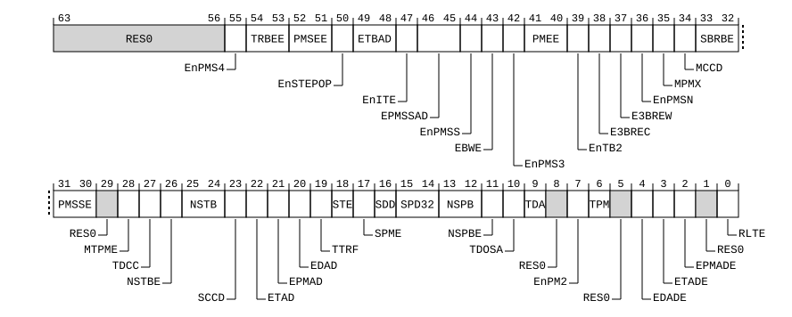

# ​D24.3.18 MDCR_EL3, Monitor Debug Configuration Register (EL3)

Source: <https://developer.arm.com/documentation/ddi0487/mc/-Part-D-The-AArch64-System-Level-Architecture/-Chapter-D24-AArch64-System-Register-Descriptions/-D24-3-Debug-System-registers/-D24-3-18-MDCR-EL3--Monitor-Debug-Configuration-Register--EL3->

##### D24.3.18 MDCR\_EL3, Monitor Debug Configuration Register (EL3)

The MDCR\_EL3 characteristics are:

Purpose
:   Provides EL3 configuration options for self-hosted debug and the Performance Monitors Extension.

Configuration
:   This register is present only when EL3 is implemented and FEAT\_AA64 is implemented. Otherwise, direct accesses to MDCR\_EL3 are UNDEFINED.

Attributes
:   MDCR\_EL3 is a 64-bit register.

###### Field descriptions



Bits [63:56]
:   Reserved, RES0.

EnPMS4, bit [55]
:   When FEAT\_SPE\_nVM is implemented:
    :   Enable access to SPE registers. When disabled, accesses to SPE registers generate a trap to EL3.

<table>
 <colgroup>
  <col/>
  <col/>
 </colgroup>
 <thead>
  <tr>
   <th>
    <strong>
     EnPMS4
    </strong>
   </th>
   <th>
    <strong>
     Meaning
    </strong>
   </th>
  </tr>
 </thead>
 <tbody>
  <tr>
   <td>
    <p>
     <code>
      0b0
     </code>
    </p>
   </td>
   <td>
    <p>
     Accesses of the specified SPE registers at EL2 and EL1 are trapped to EL3, unless the instruction generates a higher priority exception.
    </p>
   </td>
  </tr>
  <tr>
   <td>
    <p>
     <code>
      0b1
     </code>
    </p>
   </td>
   <td>
    <p>
     Accesses of the specified SPE registers are not trapped by this mechanism.
    </p>
   </td>
  </tr>
 </tbody>
</table>

        In AArch64 state, the instructions affected by this control are: `MRS` and `MSR` accesses to [PMBMAR\_EL1](/documentation/ddi0487/mc/-Part-D-The-AArch64-System-Level-Architecture/-Chapter-D24-AArch64-System-Register-Descriptions/-D24-7-Statistical-Profiling-Extension-registers/-D24-7-3-PMBMAR-EL1--Profiling-Buffer-Memory-Attribute-Register?lang=en#reg_aarch64_pmbmar_el1).

        Trapped instructions are reported using EC syndrome value `0x18`.

        The reset behavior of this field is:

        - On a Warm reset, this field resets to an architecturally UNKNOWN value.

    Otherwise:
    :   Reserved, RES0.

TRBEE, bits [54:53]
:   When FEAT\_TRBE\_EXC is implemented:
    :   Trace buffer management event Exception Enable.

<table>
 <colgroup>
  <col/>
  <col/>
 </colgroup>
 <thead>
  <tr>
   <th>
    <strong>
     TRBEE
    </strong>
   </th>
   <th>
    <strong>
     Meaning
    </strong>
   </th>
  </tr>
 </thead>
 <tbody>
  <tr>
   <td>
    <p>
     <code>
      0b00
     </code>
    </p>
   </td>
   <td>
    <p>
     Disabled. TRBE Profiling exceptions for all Exception levels are disabled. All of the following apply:
    </p>
    <ul>
     <li>
      <p>
       No trace buffer management events are recorded in
       <a class="document-topic" document-topic-path="/ddi0487/mc/-Part-D-The-AArch64-System-Level-Architecture/-Chapter-D24-AArch64-System-Register-Descriptions/-D24-4-Trace-registers/-D24-4-9-TRBSR-EL3--Trace-Buffer-Syndrome-Register--EL3-?lang=en#reg_aarch64_trbsr_el3" href="/documentation/ddi0487/mc/-Part-D-The-AArch64-System-Level-Architecture/-Chapter-D24-AArch64-System-Register-Descriptions/-D24-4-Trace-registers/-D24-4-9-TRBSR-EL3--Trace-Buffer-Syndrome-Register--EL3-?lang=en#reg_aarch64_trbsr_el3">
        TRBSR_EL3
       </a>
       .
      </p>
     </li>
     <li>
      <p>
       TRBE Profiling exceptions are not generated.
      </p>
     </li>
     <li>
      <p>
       <a class="document-topic" document-topic-path="/ddi0487/mc/-Part-D-The-AArch64-System-Level-Architecture/-Chapter-D24-AArch64-System-Register-Descriptions/-D24-4-Trace-registers/-D24-4-7-TRBSR-EL1--Trace-Buffer-Status-syndrome-Register--EL1-?lang=en#reg_aarch64_trbsr_el1" href="/documentation/ddi0487/mc/-Part-D-The-AArch64-System-Level-Architecture/-Chapter-D24-AArch64-System-Register-Descriptions/-D24-4-Trace-registers/-D24-4-7-TRBSR-EL1--Trace-Buffer-Status-syndrome-Register--EL1-?lang=en#reg_aarch64_trbsr_el1">
        TRBSR_EL1
       </a>
       .IRQ drives the interrupt request signal
       <strong>
        TRBIRQ
       </strong>
       .
      </p>
     </li>
     <li>
      <p>
       Accesses to
       <a class="document-topic" document-topic-path="/ddi0487/mc/-Part-D-The-AArch64-System-Level-Architecture/-Chapter-D24-AArch64-System-Register-Descriptions/-D24-4-Trace-registers/-D24-4-8-TRBSR-EL2--Trace-Buffer-Syndrome-Register--EL2-?lang=en#reg_aarch64_trbsr_el2" href="/documentation/ddi0487/mc/-Part-D-The-AArch64-System-Level-Architecture/-Chapter-D24-AArch64-System-Register-Descriptions/-D24-4-Trace-registers/-D24-4-8-TRBSR-EL2--Trace-Buffer-Syndrome-Register--EL2-?lang=en#reg_aarch64_trbsr_el2">
        TRBSR_EL2
       </a>
       at EL2 are trapped to EL3.
      </p>
     </li>
     <li>
      <p>
       Accesses to
       <a class="document-topic" document-topic-path="/ddi0487/mc/-Part-D-The-AArch64-System-Level-Architecture/-Chapter-D24-AArch64-System-Register-Descriptions/-D24-4-Trace-registers/-D24-4-7-TRBSR-EL1--Trace-Buffer-Status-syndrome-Register--EL1-?lang=en#reg_aarch64_trbsr_el1" href="/documentation/ddi0487/mc/-Part-D-The-AArch64-System-Level-Architecture/-Chapter-D24-AArch64-System-Register-Descriptions/-D24-4-Trace-registers/-D24-4-7-TRBSR-EL1--Trace-Buffer-Status-syndrome-Register--EL1-?lang=en#reg_aarch64_trbsr_el1">
        TRBSR_EL1
       </a>
       at EL1 ignore the value of
       <a class="document-topic" document-topic-path="/ddi0487/mc/-Part-D-The-AArch64-System-Level-Architecture/-Chapter-D24-AArch64-System-Register-Descriptions/-D24-2-General-system-control-registers/-D24-2-61-HCR-EL2--Hypervisor-Configuration-Register?lang=en#reg_aarch64_hcr_el2" href="/documentation/ddi0487/mc/-Part-D-The-AArch64-System-Level-Architecture/-Chapter-D24-AArch64-System-Register-Descriptions/-D24-2-General-system-control-registers/-D24-2-61-HCR-EL2--Hypervisor-Configuration-Register?lang=en#reg_aarch64_hcr_el2">
        HCR_EL2
       </a>
       .NV1 and accesses to
       <a class="document-topic" document-topic-path="/ddi0487/mc/-Part-D-The-AArch64-System-Level-Architecture/-Chapter-D24-AArch64-System-Register-Descriptions/-D24-4-Trace-registers/-D24-4-7-TRBSR-EL1--Trace-Buffer-Status-syndrome-Register--EL1-?lang=en#reg_aarch64_trbsr_el1" href="/documentation/ddi0487/mc/-Part-D-The-AArch64-System-Level-Architecture/-Chapter-D24-AArch64-System-Register-Descriptions/-D24-4-Trace-registers/-D24-4-7-TRBSR-EL1--Trace-Buffer-Status-syndrome-Register--EL1-?lang=en#reg_aarch64_trbsr_el1">
        TRBSR_EL1
       </a>
       at EL2 ignore the value of
       <a class="document-topic" document-topic-path="/ddi0487/mc/-Part-D-The-AArch64-System-Level-Architecture/-Chapter-D24-AArch64-System-Register-Descriptions/-D24-2-General-system-control-registers/-D24-2-61-HCR-EL2--Hypervisor-Configuration-Register?lang=en#reg_aarch64_hcr_el2" href="/documentation/ddi0487/mc/-Part-D-The-AArch64-System-Level-Architecture/-Chapter-D24-AArch64-System-Register-Descriptions/-D24-2-General-system-control-registers/-D24-2-61-HCR-EL2--Hypervisor-Configuration-Register?lang=en#reg_aarch64_hcr_el2">
        HCR_EL2
       </a>
       .E2H.
      </p>
     </li>
    </ul>
   </td>
  </tr>
  <tr>
   <td>
    <p>
     <code>
      0b01
     </code>
    </p>
   </td>
   <td>
    <p>
     Delegated. TRBE Profiling exceptions for EL3 are disabled, but might be enabled for EL2 or EL1 by
     <a class="document-topic" document-topic-path="/ddi0487/mc/-Part-D-The-AArch64-System-Level-Architecture/-Chapter-D24-AArch64-System-Register-Descriptions/-D24-4-Trace-registers/-D24-4-74-TRFCR-EL2--Trace-Filter-Control-Register--EL2-?lang=en#reg_aarch64_trfcr_el2" href="/documentation/ddi0487/mc/-Part-D-The-AArch64-System-Level-Architecture/-Chapter-D24-AArch64-System-Register-Descriptions/-D24-4-Trace-registers/-D24-4-74-TRFCR-EL2--Trace-Filter-Control-Register--EL2-?lang=en#reg_aarch64_trfcr_el2">
      TRFCR_EL2
     </a>
     .EE or
     <a class="document-topic" document-topic-path="/ddi0487/mc/-Part-D-The-AArch64-System-Level-Architecture/-Chapter-D24-AArch64-System-Register-Descriptions/-D24-4-Trace-registers/-D24-4-73-TRFCR-EL1--Trace-Filter-Control-Register--EL1-?lang=en#reg_aarch64_trfcr_el1" href="/documentation/ddi0487/mc/-Part-D-The-AArch64-System-Level-Architecture/-Chapter-D24-AArch64-System-Register-Descriptions/-D24-4-Trace-registers/-D24-4-73-TRFCR-EL1--Trace-Filter-Control-Register--EL1-?lang=en#reg_aarch64_trfcr_el1">
      TRFCR_EL1
     </a>
     .EE. All of the following apply:
    </p>
    <ul>
     <li>
      <p>
       No trace buffer management events are recorded in
       <a class="document-topic" document-topic-path="/ddi0487/mc/-Part-D-The-AArch64-System-Level-Architecture/-Chapter-D24-AArch64-System-Register-Descriptions/-D24-4-Trace-registers/-D24-4-9-TRBSR-EL3--Trace-Buffer-Syndrome-Register--EL3-?lang=en#reg_aarch64_trbsr_el3" href="/documentation/ddi0487/mc/-Part-D-The-AArch64-System-Level-Architecture/-Chapter-D24-AArch64-System-Register-Descriptions/-D24-4-Trace-registers/-D24-4-9-TRBSR-EL3--Trace-Buffer-Syndrome-Register--EL3-?lang=en#reg_aarch64_trbsr_el3">
        TRBSR_EL3
       </a>
       .
      </p>
     </li>
     <li>
      <p>
       <a class="document-topic" document-topic-path="/ddi0487/mc/-Part-D-The-AArch64-System-Level-Architecture/-Chapter-D24-AArch64-System-Register-Descriptions/-D24-4-Trace-registers/-D24-4-9-TRBSR-EL3--Trace-Buffer-Syndrome-Register--EL3-?lang=en#reg_aarch64_trbsr_el3" href="/documentation/ddi0487/mc/-Part-D-The-AArch64-System-Level-Architecture/-Chapter-D24-AArch64-System-Register-Descriptions/-D24-4-Trace-registers/-D24-4-9-TRBSR-EL3--Trace-Buffer-Syndrome-Register--EL3-?lang=en#reg_aarch64_trbsr_el3">
        TRBSR_EL3
       </a>
       .IRQ is ignored and TRBE Profiling exceptions are not taken to EL3.
      </p>
     </li>
    </ul>
   </td>
  </tr>
  <tr>
   <td>
    <p>
     <code>
      0b10
     </code>
    </p>
   </td>
   <td>
    <p>
     Enabled. TRBE Profiling exceptions for EL3 are enabled for trace buffer management events targeting EL3, as follows:
    </p>
    <ul>
     <li>
      <p>
       Trace buffer management events due to a fault on a write to the trace buffer that would generate a Data Abort exception taken to EL3 if generated by a store instruction executed at the owning Exception level are recorded in
       <a class="document-topic" document-topic-path="/ddi0487/mc/-Part-D-The-AArch64-System-Level-Architecture/-Chapter-D24-AArch64-System-Register-Descriptions/-D24-4-Trace-registers/-D24-4-9-TRBSR-EL3--Trace-Buffer-Syndrome-Register--EL3-?lang=en#reg_aarch64_trbsr_el3" href="/documentation/ddi0487/mc/-Part-D-The-AArch64-System-Level-Architecture/-Chapter-D24-AArch64-System-Register-Descriptions/-D24-4-Trace-registers/-D24-4-9-TRBSR-EL3--Trace-Buffer-Syndrome-Register--EL3-?lang=en#reg_aarch64_trbsr_el3">
        TRBSR_EL3
       </a>
       . That is, any of the following faults:
      </p>
      <ul>
       <li>
        <p>
         Granule Protection Check faults other than Granule Protection Faults (GPFs).
        </p>
       </li>
       <li>
        <p>
         If
         <a class="document-topic" document-topic-path="/ddi0487/mc/-Part-D-The-AArch64-System-Level-Architecture/-Chapter-D24-AArch64-System-Register-Descriptions/-D24-2-General-system-control-registers/-D24-2-168-SCR-EL3--Secure-Configuration-Register?lang=en#reg_aarch64_scr_el3" href="/documentation/ddi0487/mc/-Part-D-The-AArch64-System-Level-Architecture/-Chapter-D24-AArch64-System-Register-Descriptions/-D24-2-General-system-control-registers/-D24-2-168-SCR-EL3--Secure-Configuration-Register?lang=en#reg_aarch64_scr_el3">
          SCR_EL3
         </a>
         .GPF is 1, GPFs.
        </p>
       </li>
       <li>
        <p>
         If
         <a class="document-topic" document-topic-path="/ddi0487/mc/-Part-D-The-AArch64-System-Level-Architecture/-Chapter-D24-AArch64-System-Register-Descriptions/-D24-2-General-system-control-registers/-D24-2-168-SCR-EL3--Secure-Configuration-Register?lang=en#reg_aarch64_scr_el3" href="/documentation/ddi0487/mc/-Part-D-The-AArch64-System-Level-Architecture/-Chapter-D24-AArch64-System-Register-Descriptions/-D24-2-General-system-control-registers/-D24-2-168-SCR-EL3--Secure-Configuration-Register?lang=en#reg_aarch64_scr_el3">
          SCR_EL3
         </a>
         .EA is 1, External aborts.
        </p>
       </li>
      </ul>
     </li>
     <li>
      <p>
       TRBE Profiling exceptions are generated and taken to EL3 when unmasked and
       <a class="document-topic" document-topic-path="/ddi0487/mc/-Part-D-The-AArch64-System-Level-Architecture/-Chapter-D24-AArch64-System-Register-Descriptions/-D24-4-Trace-registers/-D24-4-9-TRBSR-EL3--Trace-Buffer-Syndrome-Register--EL3-?lang=en#reg_aarch64_trbsr_el3" href="/documentation/ddi0487/mc/-Part-D-The-AArch64-System-Level-Architecture/-Chapter-D24-AArch64-System-Register-Descriptions/-D24-4-Trace-registers/-D24-4-9-TRBSR-EL3--Trace-Buffer-Syndrome-Register--EL3-?lang=en#reg_aarch64_trbsr_el3">
        TRBSR_EL3
       </a>
       .IRQ is 1.
      </p>
     </li>
    </ul>
   </td>
  </tr>
  <tr>
   <td>
    <p>
     <code>
      0b11
     </code>
    </p>
   </td>
   <td>
    <p>
     Trap all. TRBE Profiling exceptions for EL3 are enabled for all trace buffer management events, as follows:
    </p>
    <ul>
     <li>
      <p>
       All trace buffer management events are recorded in
       <a class="document-topic" document-topic-path="/ddi0487/mc/-Part-D-The-AArch64-System-Level-Architecture/-Chapter-D24-AArch64-System-Register-Descriptions/-D24-4-Trace-registers/-D24-4-9-TRBSR-EL3--Trace-Buffer-Syndrome-Register--EL3-?lang=en#reg_aarch64_trbsr_el3" href="/documentation/ddi0487/mc/-Part-D-The-AArch64-System-Level-Architecture/-Chapter-D24-AArch64-System-Register-Descriptions/-D24-4-Trace-registers/-D24-4-9-TRBSR-EL3--Trace-Buffer-Syndrome-Register--EL3-?lang=en#reg_aarch64_trbsr_el3">
        TRBSR_EL3
       </a>
       .
      </p>
     </li>
     <li>
      <p>
       TRBE Profiling exceptions are generated and taken to EL3 when unmasked and
       <a class="document-topic" document-topic-path="/ddi0487/mc/-Part-D-The-AArch64-System-Level-Architecture/-Chapter-D24-AArch64-System-Register-Descriptions/-D24-4-Trace-registers/-D24-4-9-TRBSR-EL3--Trace-Buffer-Syndrome-Register--EL3-?lang=en#reg_aarch64_trbsr_el3" href="/documentation/ddi0487/mc/-Part-D-The-AArch64-System-Level-Architecture/-Chapter-D24-AArch64-System-Register-Descriptions/-D24-4-Trace-registers/-D24-4-9-TRBSR-EL3--Trace-Buffer-Syndrome-Register--EL3-?lang=en#reg_aarch64_trbsr_el3">
        TRBSR_EL3
       </a>
       .IRQ is 1.
      </p>
     </li>
    </ul>
   </td>
  </tr>
 </tbody>
</table>

        If EL3 is not implemented, then the Effective value of [MDCR\_EL3](/documentation/ddi0487/mc/-Part-D-The-AArch64-System-Level-Architecture/-Chapter-D24-AArch64-System-Register-Descriptions/-D24-3-Debug-System-registers/-D24-3-18-MDCR-EL3--Monitor-Debug-Configuration-Register--EL3-?lang=en#reg_aarch64_mdcr_el3).TRBEE is `0b01`.

        The reset behavior of this field is:

        - On a Warm reset:
          - When the highest implemented Exception level is EL3, this field resets to `'00'`.
          - Otherwise, this field resets to an architecturally UNKNOWN value.

    Otherwise:
    :   Reserved, RES0.

PMSEE, bits [52:51]
:   When FEAT\_SPE\_EXC is implemented:
    :   Profiling Buffer management event Exception Enable.

<table>
 <colgroup>
  <col/>
  <col/>
 </colgroup>
 <thead>
  <tr>
   <th>
    <strong>
     PMSEE
    </strong>
   </th>
   <th>
    <strong>
     Meaning
    </strong>
   </th>
  </tr>
 </thead>
 <tbody>
  <tr>
   <td>
    <p>
     <code>
      0b00
     </code>
    </p>
   </td>
   <td>
    <p>
     Disabled. SPE Profiling exceptions for all Exception levels are disabled. All of the following apply:
    </p>
    <ul>
     <li>
      <p>
       No Profiling Buffer management events are recorded in
       <a class="document-topic" document-topic-path="/ddi0487/mc/-Part-D-The-AArch64-System-Level-Architecture/-Chapter-D24-AArch64-System-Register-Descriptions/-D24-7-Statistical-Profiling-Extension-registers/-D24-7-7-PMBSR-EL3--Profiling-Buffer-Syndrome-Register--EL3-?lang=en#reg_aarch64_pmbsr_el3" href="/documentation/ddi0487/mc/-Part-D-The-AArch64-System-Level-Architecture/-Chapter-D24-AArch64-System-Register-Descriptions/-D24-7-Statistical-Profiling-Extension-registers/-D24-7-7-PMBSR-EL3--Profiling-Buffer-Syndrome-Register--EL3-?lang=en#reg_aarch64_pmbsr_el3">
        PMBSR_EL3
       </a>
       .
      </p>
     </li>
     <li>
      <p>
       SPE Profiling exceptions are not generated.
      </p>
     </li>
     <li>
      <p>
       <a class="document-topic" document-topic-path="/ddi0487/mc/-Part-D-The-AArch64-System-Level-Architecture/-Chapter-D24-AArch64-System-Register-Descriptions/-D24-7-Statistical-Profiling-Extension-registers/-D24-7-5-PMBSR-EL1--Profiling-Buffer-Status-syndrome-Register--EL1-?lang=en#reg_aarch64_pmbsr_el1" href="/documentation/ddi0487/mc/-Part-D-The-AArch64-System-Level-Architecture/-Chapter-D24-AArch64-System-Register-Descriptions/-D24-7-Statistical-Profiling-Extension-registers/-D24-7-5-PMBSR-EL1--Profiling-Buffer-Status-syndrome-Register--EL1-?lang=en#reg_aarch64_pmbsr_el1">
        PMBSR_EL1
       </a>
       .S drives the interrupt request signal
       <strong>
        PMBIRQ
       </strong>
       .
      </p>
     </li>
     <li>
      <p>
       Accesses to
       <a class="document-topic" document-topic-path="/ddi0487/mc/-Part-D-The-AArch64-System-Level-Architecture/-Chapter-D24-AArch64-System-Register-Descriptions/-D24-7-Statistical-Profiling-Extension-registers/-D24-7-6-PMBSR-EL2--Profiling-Buffer-Syndrome-Register--EL2-?lang=en#reg_aarch64_pmbsr_el2" href="/documentation/ddi0487/mc/-Part-D-The-AArch64-System-Level-Architecture/-Chapter-D24-AArch64-System-Register-Descriptions/-D24-7-Statistical-Profiling-Extension-registers/-D24-7-6-PMBSR-EL2--Profiling-Buffer-Syndrome-Register--EL2-?lang=en#reg_aarch64_pmbsr_el2">
        PMBSR_EL2
       </a>
       at EL2 are trapped to EL3.
      </p>
     </li>
     <li>
      <p>
       Accesses to
       <a class="document-topic" document-topic-path="/ddi0487/mc/-Part-D-The-AArch64-System-Level-Architecture/-Chapter-D24-AArch64-System-Register-Descriptions/-D24-7-Statistical-Profiling-Extension-registers/-D24-7-5-PMBSR-EL1--Profiling-Buffer-Status-syndrome-Register--EL1-?lang=en#reg_aarch64_pmbsr_el1" href="/documentation/ddi0487/mc/-Part-D-The-AArch64-System-Level-Architecture/-Chapter-D24-AArch64-System-Register-Descriptions/-D24-7-Statistical-Profiling-Extension-registers/-D24-7-5-PMBSR-EL1--Profiling-Buffer-Status-syndrome-Register--EL1-?lang=en#reg_aarch64_pmbsr_el1">
        PMBSR_EL1
       </a>
       at EL1 ignore the value of
       <a class="document-topic" document-topic-path="/ddi0487/mc/-Part-D-The-AArch64-System-Level-Architecture/-Chapter-D24-AArch64-System-Register-Descriptions/-D24-2-General-system-control-registers/-D24-2-61-HCR-EL2--Hypervisor-Configuration-Register?lang=en#reg_aarch64_hcr_el2" href="/documentation/ddi0487/mc/-Part-D-The-AArch64-System-Level-Architecture/-Chapter-D24-AArch64-System-Register-Descriptions/-D24-2-General-system-control-registers/-D24-2-61-HCR-EL2--Hypervisor-Configuration-Register?lang=en#reg_aarch64_hcr_el2">
        HCR_EL2
       </a>
       .NV1 and accesses to
       <a class="document-topic" document-topic-path="/ddi0487/mc/-Part-D-The-AArch64-System-Level-Architecture/-Chapter-D24-AArch64-System-Register-Descriptions/-D24-7-Statistical-Profiling-Extension-registers/-D24-7-5-PMBSR-EL1--Profiling-Buffer-Status-syndrome-Register--EL1-?lang=en#reg_aarch64_pmbsr_el1" href="/documentation/ddi0487/mc/-Part-D-The-AArch64-System-Level-Architecture/-Chapter-D24-AArch64-System-Register-Descriptions/-D24-7-Statistical-Profiling-Extension-registers/-D24-7-5-PMBSR-EL1--Profiling-Buffer-Status-syndrome-Register--EL1-?lang=en#reg_aarch64_pmbsr_el1">
        PMBSR_EL1
       </a>
       at EL2 ignore the value of
       <a class="document-topic" document-topic-path="/ddi0487/mc/-Part-D-The-AArch64-System-Level-Architecture/-Chapter-D24-AArch64-System-Register-Descriptions/-D24-2-General-system-control-registers/-D24-2-61-HCR-EL2--Hypervisor-Configuration-Register?lang=en#reg_aarch64_hcr_el2" href="/documentation/ddi0487/mc/-Part-D-The-AArch64-System-Level-Architecture/-Chapter-D24-AArch64-System-Register-Descriptions/-D24-2-General-system-control-registers/-D24-2-61-HCR-EL2--Hypervisor-Configuration-Register?lang=en#reg_aarch64_hcr_el2">
        HCR_EL2
       </a>
       .E2H.
      </p>
     </li>
    </ul>
   </td>
  </tr>
  <tr>
   <td>
    <p>
     <code>
      0b01
     </code>
    </p>
   </td>
   <td>
    <p>
     Delegated. SPE Profiling exceptions for EL3 are disabled, but might be enabled for EL2 or EL1 by
     <a class="document-topic" document-topic-path="/ddi0487/mc/-Part-D-The-AArch64-System-Level-Architecture/-Chapter-D24-AArch64-System-Register-Descriptions/-D24-7-Statistical-Profiling-Extension-registers/-D24-7-9-PMSCR-EL2--Statistical-Profiling-Control-Register--EL2-?lang=en#reg_aarch64_pmscr_el2" href="/documentation/ddi0487/mc/-Part-D-The-AArch64-System-Level-Architecture/-Chapter-D24-AArch64-System-Register-Descriptions/-D24-7-Statistical-Profiling-Extension-registers/-D24-7-9-PMSCR-EL2--Statistical-Profiling-Control-Register--EL2-?lang=en#reg_aarch64_pmscr_el2">
      PMSCR_EL2
     </a>
     .EE or
     <a class="document-topic" document-topic-path="/ddi0487/mc/-Part-D-The-AArch64-System-Level-Architecture/-Chapter-D24-AArch64-System-Register-Descriptions/-D24-7-Statistical-Profiling-Extension-registers/-D24-7-8-PMSCR-EL1--Statistical-Profiling-Control-Register--EL1-?lang=en#reg_aarch64_pmscr_el1" href="/documentation/ddi0487/mc/-Part-D-The-AArch64-System-Level-Architecture/-Chapter-D24-AArch64-System-Register-Descriptions/-D24-7-Statistical-Profiling-Extension-registers/-D24-7-8-PMSCR-EL1--Statistical-Profiling-Control-Register--EL1-?lang=en#reg_aarch64_pmscr_el1">
      PMSCR_EL1
     </a>
     .EE. All of the following apply:
    </p>
    <ul>
     <li>
      <p>
       No Profiling Buffer management events are recorded in
       <a class="document-topic" document-topic-path="/ddi0487/mc/-Part-D-The-AArch64-System-Level-Architecture/-Chapter-D24-AArch64-System-Register-Descriptions/-D24-7-Statistical-Profiling-Extension-registers/-D24-7-7-PMBSR-EL3--Profiling-Buffer-Syndrome-Register--EL3-?lang=en#reg_aarch64_pmbsr_el3" href="/documentation/ddi0487/mc/-Part-D-The-AArch64-System-Level-Architecture/-Chapter-D24-AArch64-System-Register-Descriptions/-D24-7-Statistical-Profiling-Extension-registers/-D24-7-7-PMBSR-EL3--Profiling-Buffer-Syndrome-Register--EL3-?lang=en#reg_aarch64_pmbsr_el3">
        PMBSR_EL3
       </a>
       .
      </p>
     </li>
     <li>
      <p>
       <a class="document-topic" document-topic-path="/ddi0487/mc/-Part-D-The-AArch64-System-Level-Architecture/-Chapter-D24-AArch64-System-Register-Descriptions/-D24-7-Statistical-Profiling-Extension-registers/-D24-7-7-PMBSR-EL3--Profiling-Buffer-Syndrome-Register--EL3-?lang=en#reg_aarch64_pmbsr_el3" href="/documentation/ddi0487/mc/-Part-D-The-AArch64-System-Level-Architecture/-Chapter-D24-AArch64-System-Register-Descriptions/-D24-7-Statistical-Profiling-Extension-registers/-D24-7-7-PMBSR-EL3--Profiling-Buffer-Syndrome-Register--EL3-?lang=en#reg_aarch64_pmbsr_el3">
        PMBSR_EL3
       </a>
       .S is ignored and SPE Profiling exceptions are not taken to EL3.
      </p>
     </li>
    </ul>
   </td>
  </tr>
  <tr>
   <td>
    <p>
     <code>
      0b10
     </code>
    </p>
   </td>
   <td>
    <p>
     Enabled. SPE Profiling exceptions for EL3 are enabled for Profiling Buffer management events targeting EL3, as follows:
    </p>
    <ul>
     <li>
      <p>
       Profiling Buffer management events due to a fault on a write to the Profiling Buffer that would generate a Data Abort exception taken to EL3 if generated by a store instruction executed at the owning Exception level are recorded in
       <a class="document-topic" document-topic-path="/ddi0487/mc/-Part-D-The-AArch64-System-Level-Architecture/-Chapter-D24-AArch64-System-Register-Descriptions/-D24-7-Statistical-Profiling-Extension-registers/-D24-7-7-PMBSR-EL3--Profiling-Buffer-Syndrome-Register--EL3-?lang=en#reg_aarch64_pmbsr_el3" href="/documentation/ddi0487/mc/-Part-D-The-AArch64-System-Level-Architecture/-Chapter-D24-AArch64-System-Register-Descriptions/-D24-7-Statistical-Profiling-Extension-registers/-D24-7-7-PMBSR-EL3--Profiling-Buffer-Syndrome-Register--EL3-?lang=en#reg_aarch64_pmbsr_el3">
        PMBSR_EL3
       </a>
       . That is, any of the following faults:
      </p>
      <ul>
       <li>
        <p>
         Granule Protection Check faults other than Granule Protection Faults (GPFs).
        </p>
       </li>
       <li>
        <p>
         If
         <a class="document-topic" document-topic-path="/ddi0487/mc/-Part-D-The-AArch64-System-Level-Architecture/-Chapter-D24-AArch64-System-Register-Descriptions/-D24-2-General-system-control-registers/-D24-2-168-SCR-EL3--Secure-Configuration-Register?lang=en#reg_aarch64_scr_el3" href="/documentation/ddi0487/mc/-Part-D-The-AArch64-System-Level-Architecture/-Chapter-D24-AArch64-System-Register-Descriptions/-D24-2-General-system-control-registers/-D24-2-168-SCR-EL3--Secure-Configuration-Register?lang=en#reg_aarch64_scr_el3">
          SCR_EL3
         </a>
         .GPF is 1, GPFs.
        </p>
       </li>
       <li>
        <p>
         If
         <a class="document-topic" document-topic-path="/ddi0487/mc/-Part-D-The-AArch64-System-Level-Architecture/-Chapter-D24-AArch64-System-Register-Descriptions/-D24-2-General-system-control-registers/-D24-2-168-SCR-EL3--Secure-Configuration-Register?lang=en#reg_aarch64_scr_el3" href="/documentation/ddi0487/mc/-Part-D-The-AArch64-System-Level-Architecture/-Chapter-D24-AArch64-System-Register-Descriptions/-D24-2-General-system-control-registers/-D24-2-168-SCR-EL3--Secure-Configuration-Register?lang=en#reg_aarch64_scr_el3">
          SCR_EL3
         </a>
         .EA is 1, External aborts.
        </p>
       </li>
      </ul>
     </li>
     <li>
      <p>
       SPE Profiling exceptions are generated and taken to EL3 when unmasked and
       <a class="document-topic" document-topic-path="/ddi0487/mc/-Part-D-The-AArch64-System-Level-Architecture/-Chapter-D24-AArch64-System-Register-Descriptions/-D24-7-Statistical-Profiling-Extension-registers/-D24-7-7-PMBSR-EL3--Profiling-Buffer-Syndrome-Register--EL3-?lang=en#reg_aarch64_pmbsr_el3" href="/documentation/ddi0487/mc/-Part-D-The-AArch64-System-Level-Architecture/-Chapter-D24-AArch64-System-Register-Descriptions/-D24-7-Statistical-Profiling-Extension-registers/-D24-7-7-PMBSR-EL3--Profiling-Buffer-Syndrome-Register--EL3-?lang=en#reg_aarch64_pmbsr_el3">
        PMBSR_EL3
       </a>
       .S is 1.
      </p>
     </li>
    </ul>
   </td>
  </tr>
  <tr>
   <td>
    <p>
     <code>
      0b11
     </code>
    </p>
   </td>
   <td>
    <p>
     Trap all. SPE Profiling exceptions for EL3 are enabled for all Profiling Buffer management events, as follows:
    </p>
    <ul>
     <li>
      <p>
       All Profiling Buffer management events are recorded in
       <a class="document-topic" document-topic-path="/ddi0487/mc/-Part-D-The-AArch64-System-Level-Architecture/-Chapter-D24-AArch64-System-Register-Descriptions/-D24-7-Statistical-Profiling-Extension-registers/-D24-7-7-PMBSR-EL3--Profiling-Buffer-Syndrome-Register--EL3-?lang=en#reg_aarch64_pmbsr_el3" href="/documentation/ddi0487/mc/-Part-D-The-AArch64-System-Level-Architecture/-Chapter-D24-AArch64-System-Register-Descriptions/-D24-7-Statistical-Profiling-Extension-registers/-D24-7-7-PMBSR-EL3--Profiling-Buffer-Syndrome-Register--EL3-?lang=en#reg_aarch64_pmbsr_el3">
        PMBSR_EL3
       </a>
       .
      </p>
     </li>
     <li>
      <p>
       SPE Profiling exceptions are generated and taken to EL3 when unmasked and
       <a class="document-topic" document-topic-path="/ddi0487/mc/-Part-D-The-AArch64-System-Level-Architecture/-Chapter-D24-AArch64-System-Register-Descriptions/-D24-7-Statistical-Profiling-Extension-registers/-D24-7-7-PMBSR-EL3--Profiling-Buffer-Syndrome-Register--EL3-?lang=en#reg_aarch64_pmbsr_el3" href="/documentation/ddi0487/mc/-Part-D-The-AArch64-System-Level-Architecture/-Chapter-D24-AArch64-System-Register-Descriptions/-D24-7-Statistical-Profiling-Extension-registers/-D24-7-7-PMBSR-EL3--Profiling-Buffer-Syndrome-Register--EL3-?lang=en#reg_aarch64_pmbsr_el3">
        PMBSR_EL3
       </a>
       .S is 1.
      </p>
     </li>
    </ul>
   </td>
  </tr>
 </tbody>
</table>

        If EL3 is not implemented, then the Effective value of [MDCR\_EL3](/documentation/ddi0487/mc/-Part-D-The-AArch64-System-Level-Architecture/-Chapter-D24-AArch64-System-Register-Descriptions/-D24-3-Debug-System-registers/-D24-3-18-MDCR-EL3--Monitor-Debug-Configuration-Register--EL3-?lang=en#reg_aarch64_mdcr_el3).PMSEE is `0b01`.

        The reset behavior of this field is:

        - On a Warm reset:
          - When the highest implemented Exception level is EL3, this field resets to `'00'`.
          - Otherwise, this field resets to an architecturally UNKNOWN value.

    Otherwise:
    :   Reserved, RES0.

EnSTEPOP, bit [50]
:   When FEAT\_STEP2 is implemented:
    :

<table>
 <colgroup>
  <col/>
  <col/>
 </colgroup>
 <thead>
  <tr>
   <th>
    <strong>
     EnSTEPOP
    </strong>
   </th>
   <th>
    <strong>
     Meaning
    </strong>
   </th>
  </tr>
 </thead>
 <tbody>
  <tr>
   <td>
    <p>
     <code>
      0b0
     </code>
    </p>
   </td>
   <td>
    <p>
     Execution from
     <a class="document-topic" document-topic-path="/ddi0487/mc/-Part-D-The-AArch64-System-Level-Architecture/-Chapter-D24-AArch64-System-Register-Descriptions/-D24-3-Debug-System-registers/-D24-3-22-MDSTEPOP-EL1--Monitor-Debug-Step-Opcode-Register?lang=en#reg_aarch64_mdstepop_el1" href="/documentation/ddi0487/mc/-Part-D-The-AArch64-System-Level-Architecture/-Chapter-D24-AArch64-System-Register-Descriptions/-D24-3-Debug-System-registers/-D24-3-22-MDSTEPOP-EL1--Monitor-Debug-Step-Opcode-Register?lang=en#reg_aarch64_mdstepop_el1">
      MDSTEPOP_EL1
     </a>
     is disabled. EL2, EL1 and EL0 System register accesses to
     <a class="document-topic" document-topic-path="/ddi0487/mc/-Part-D-The-AArch64-System-Level-Architecture/-Chapter-D24-AArch64-System-Register-Descriptions/-D24-3-Debug-System-registers/-D24-3-22-MDSTEPOP-EL1--Monitor-Debug-Step-Opcode-Register?lang=en#reg_aarch64_mdstepop_el1" href="/documentation/ddi0487/mc/-Part-D-The-AArch64-System-Level-Architecture/-Chapter-D24-AArch64-System-Register-Descriptions/-D24-3-Debug-System-registers/-D24-3-22-MDSTEPOP-EL1--Monitor-Debug-Step-Opcode-Register?lang=en#reg_aarch64_mdstepop_el1">
      MDSTEPOP_EL1
     </a>
     are trapped to EL3, unless the access generates a higher priority exception.
    </p>
   </td>
  </tr>
  <tr>
   <td>
    <p>
     <code>
      0b1
     </code>
    </p>
   </td>
   <td>
    <p>
     Execution from
     <a class="document-topic" document-topic-path="/ddi0487/mc/-Part-D-The-AArch64-System-Level-Architecture/-Chapter-D24-AArch64-System-Register-Descriptions/-D24-3-Debug-System-registers/-D24-3-22-MDSTEPOP-EL1--Monitor-Debug-Step-Opcode-Register?lang=en#reg_aarch64_mdstepop_el1" href="/documentation/ddi0487/mc/-Part-D-The-AArch64-System-Level-Architecture/-Chapter-D24-AArch64-System-Register-Descriptions/-D24-3-Debug-System-registers/-D24-3-22-MDSTEPOP-EL1--Monitor-Debug-Step-Opcode-Register?lang=en#reg_aarch64_mdstepop_el1">
      MDSTEPOP_EL1
     </a>
     is not disabled by this control. System register accesses to
     <a class="document-topic" document-topic-path="/ddi0487/mc/-Part-D-The-AArch64-System-Level-Architecture/-Chapter-D24-AArch64-System-Register-Descriptions/-D24-3-Debug-System-registers/-D24-3-22-MDSTEPOP-EL1--Monitor-Debug-Step-Opcode-Register?lang=en#reg_aarch64_mdstepop_el1" href="/documentation/ddi0487/mc/-Part-D-The-AArch64-System-Level-Architecture/-Chapter-D24-AArch64-System-Register-Descriptions/-D24-3-Debug-System-registers/-D24-3-22-MDSTEPOP-EL1--Monitor-Debug-Step-Opcode-Register?lang=en#reg_aarch64_mdstepop_el1">
      MDSTEPOP_EL1
     </a>
     are not trapped by this mechanism.
    </p>
   </td>
  </tr>
 </tbody>
</table>

        The reset behavior of this field is:

        - On a Warm reset, this field resets to an architecturally UNKNOWN value.

    Otherwise:
    :   Reserved, RES0.

ETBAD, bits [49:48]
:   When FEAT\_TRBE\_EXT is implemented:
    :   External Trace Buffer Access Disable. Controls access to the Trace Buffer registers from an external debugger.

<table>
 <colgroup>
  <col/>
  <col/>
  <col/>
 </colgroup>
 <thead>
  <tr>
   <th>
    <strong>
     ETBAD
    </strong>
   </th>
   <th>
    <strong>
     Meaning
    </strong>
   </th>
   <th>
    <strong>
     Applies when
    </strong>
   </th>
  </tr>
 </thead>
 <tbody>
  <tr>
   <td>
    <p>
     <code>
      0b00
     </code>
    </p>
   </td>
   <td>
    <p>
     Non-secure accesses from an external debugger to Trace Buffer registers are prohibited.
    </p>
    <p>
     If
     <a class="document-topic" document-topic-path="/ddi0487/mc/-Part-A-Arm-Architecture-Introduction-and-Overview/-Chapter-A2-A-profile-Architecture-Extensions/-A2-3-Armv9-A-architecture-extensions/-A2-3-3-The-Armv9-2-architecture-extension?lang=en#feat_feat_rme" href="/documentation/ddi0487/mc/-Part-A-Arm-Architecture-Introduction-and-Overview/-Chapter-A2-A-profile-Architecture-Extensions/-A2-3-Armv9-A-architecture-extensions/-A2-3-3-The-Armv9-2-architecture-extension?lang=en#feat_feat_rme">
      FEAT_RME
     </a>
     is implemented, Secure and Realm accesses from an external debugger to Trace Buffer registers are prohibited and Root accesses to Trace Buffer registers are allowed.
    </p>
    <p>
     If
     <a class="document-topic" document-topic-path="/ddi0487/mc/-Part-A-Arm-Architecture-Introduction-and-Overview/-Chapter-A2-A-profile-Architecture-Extensions/-A2-3-Armv9-A-architecture-extensions/-A2-3-3-The-Armv9-2-architecture-extension?lang=en#feat_feat_rme" href="/documentation/ddi0487/mc/-Part-A-Arm-Architecture-Introduction-and-Overview/-Chapter-A2-A-profile-Architecture-Extensions/-A2-3-Armv9-A-architecture-extensions/-A2-3-3-The-Armv9-2-architecture-extension?lang=en#feat_feat_rme">
      FEAT_RME
     </a>
     is not implemented, Secure accesses to Trace Buffer registers are allowed.
    </p>
   </td>
   <td>
   </td>
  </tr>
  <tr>
   <td>
    <p>
     <code>
      0b01
     </code>
    </p>
   </td>
   <td>
    <p>
     Secure and Non-secure accesses from an external debugger to Trace Buffer registers are prohibited. Root and Realm accesses to Trace Buffer registers are allowed.
    </p>
   </td>
   <td>
    <p>
     FEAT_RME is implemented
    </p>
   </td>
  </tr>
  <tr>
   <td>
    <p>
     <code>
      0b10
     </code>
    </p>
   </td>
   <td>
    <p>
     Realm and Non-secure accesses from an external debugger to Trace Buffer registers are prohibited. Root and Secure accesses to Trace Buffer registers are allowed.
    </p>
   </td>
   <td>
    <p>
     FEAT_RME is implemented
    </p>
   </td>
  </tr>
  <tr>
   <td>
    <p>
     <code>
      0b11
     </code>
    </p>
   </td>
   <td>
    <p>
     All accesses from an external debugger to Trace Buffer registers are allowed.
    </p>
   </td>
   <td>
   </td>
  </tr>
 </tbody>
</table>

        If EL3 is not implemented, then the Effective value of this field is `0b11`.

        The reset behavior of this field is:

        - On a Warm reset, this field resets to `'00'`.

    Otherwise:
    :   Reserved, RES0.

EnITE, bit [47]
:   When FEAT\_ITE is implemented:
    :   Enable access to Instrumentation trace System registers. When disabled, accesses to Instrumentation trace System registers generate a trap to EL3.

<table>
 <colgroup>
  <col/>
  <col/>
 </colgroup>
 <thead>
  <tr>
   <th>
    <strong>
     EnITE
    </strong>
   </th>
   <th>
    <strong>
     Meaning
    </strong>
   </th>
  </tr>
 </thead>
 <tbody>
  <tr>
   <td>
    <p>
     <code>
      0b0
     </code>
    </p>
   </td>
   <td>
    <p>
     Accesses of the specified Instrumentation trace System registers at EL2 and EL1 are trapped to EL3, unless the instruction generates a higher priority exception.
    </p>
   </td>
  </tr>
  <tr>
   <td>
    <p>
     <code>
      0b1
     </code>
    </p>
   </td>
   <td>
    <p>
     Accesses of the specified Instrumentation trace System registers are not trapped by this mechanism.
    </p>
   </td>
  </tr>
 </tbody>
</table>

        In AArch64 state, the instructions affected by this control are: `MRS` and `MSR` accesses to [TRCITECR\_EL1](/documentation/ddi0487/mc/-Part-D-The-AArch64-System-Level-Architecture/-Chapter-D24-AArch64-System-Register-Descriptions/-D24-4-Trace-registers/-D24-4-47-TRCITECR-EL1--Instrumentation-Trace-Control-Register--EL1-?lang=en#reg_aarch64_trcitecr_el1), [TRCITECR\_EL2](/documentation/ddi0487/mc/-Part-D-The-AArch64-System-Level-Architecture/-Chapter-D24-AArch64-System-Register-Descriptions/-D24-4-Trace-registers/-D24-4-48-TRCITECR-EL2--Instrumentation-Trace-Control-Register--EL2-?lang=en#reg_aarch64_trcitecr_el2), and TRCITECR\_EL12.

        Trapped instructions are reported using EC syndrome value `0x18`.

        The reset behavior of this field is:

        - On a Warm reset, this field resets to an architecturally UNKNOWN value.

    Otherwise:
    :   Reserved, RES0.

EPMSSAD, bits [46:45]
:   When FEAT\_PMUv3\_SS is implemented:
    :   External PMU Snapshot Access Disable. Controls access to the PMU Snapshot registers from an external debugger.

        External accesses of the following registers are affected by this control:

        - [PMCCNTSVR\_EL1](/documentation/ddi0487/mc/-Part-I-Memory-mapped-Components-of-the-Arm-Architecture/-Chapter-I5-External-System-Control-Register-Descriptions/-I5-3-Performance-Monitors-external-register-descriptions/-I5-3-5-PMCCNTSVR-EL1--Performance-Monitors-Cycle-Count-Saved-Value-Register?lang=en#reg_pmu_pmccntsvr_el1), [PMEVCNTSVR<n>\_EL1](/documentation/ddi0487/mc/-Part-I-Memory-mapped-Components-of-the-Arm-Architecture/-Chapter-I5-External-System-Control-Register-Descriptions/-I5-3-Performance-Monitors-external-register-descriptions/-I5-3-30-PMEVCNTSVR-n--EL1--Performance-Monitors-Event-Count-Saved-Value-Registers--n---0---30?lang=en#reg_pmu_pmevcntsvrn_el1), and [PMSSCR\_EL1](/documentation/ddi0487/mc/-Part-I-Memory-mapped-Components-of-the-Arm-Architecture/-Chapter-I5-External-System-Control-Register-Descriptions/-I5-3-Performance-Monitors-external-register-descriptions/-I5-3-57-PMSSCR-EL1--Performance-Monitors-Snapshot-Status-and-Capture-Register?lang=en#reg_pmu_pmsscr_el1).
        - If [FEAT\_PMUv3\_ICNTR](/documentation/ddi0487/mc/-Part-A-Arm-Architecture-Introduction-and-Overview/-Chapter-A2-A-profile-Architecture-Extensions/-A2-2-Armv8-A-architecture-extensions/-A2-2-10-The-Armv8-9-architecture-extension?lang=en#feat_feat_pmuv3_icntr) is implemented, [PMICNTSVR\_EL1](/documentation/ddi0487/mc/-Part-I-Memory-mapped-Components-of-the-Arm-Architecture/-Chapter-I5-External-System-Control-Register-Descriptions/-I5-3-Performance-Monitors-external-register-descriptions/-I5-3-35-PMICNTSVR-EL1--Performance-Monitors-Instruction-Count-Saved-Value-Register?lang=en#reg_pmu_pmicntsvr_el1).

<table>
 <colgroup>
  <col/>
  <col/>
  <col/>
 </colgroup>
 <thead>
  <tr>
   <th>
    <strong>
     EPMSSAD
    </strong>
   </th>
   <th>
    <strong>
     Meaning
    </strong>
   </th>
   <th>
    <strong>
     Applies when
    </strong>
   </th>
  </tr>
 </thead>
 <tbody>
  <tr>
   <td>
    <p>
     <code>
      0b00
     </code>
    </p>
   </td>
   <td>
    <p>
     Non-secure accesses from an external debugger to the affected PMU Snapshot registers are prohibited.
    </p>
    <p>
     If
     <a class="document-topic" document-topic-path="/ddi0487/mc/-Part-A-Arm-Architecture-Introduction-and-Overview/-Chapter-A2-A-profile-Architecture-Extensions/-A2-3-Armv9-A-architecture-extensions/-A2-3-3-The-Armv9-2-architecture-extension?lang=en#feat_feat_rme" href="/documentation/ddi0487/mc/-Part-A-Arm-Architecture-Introduction-and-Overview/-Chapter-A2-A-profile-Architecture-Extensions/-A2-3-Armv9-A-architecture-extensions/-A2-3-3-The-Armv9-2-architecture-extension?lang=en#feat_feat_rme">
      FEAT_RME
     </a>
     is implemented, Secure and Realm accesses from an external debugger to the affected PMU Snapshot registers are prohibited.
    </p>
    <p>
     Other accesses from an external debugger to the specified registers are not affected by this control.
    </p>
   </td>
   <td>
   </td>
  </tr>
  <tr>
   <td>
    <p>
     <code>
      0b01
     </code>
    </p>
   </td>
   <td>
    <p>
     Secure and Non-secure accesses from an external debugger to the affected PMU Snapshot registers are prohibited.
    </p>
    <p>
     Other accesses from an external debugger to the specified registers are not affected by this control.
    </p>
   </td>
   <td>
    <p>
     FEAT_RME is implemented
    </p>
   </td>
  </tr>
  <tr>
   <td>
    <p>
     <code>
      0b10
     </code>
    </p>
   </td>
   <td>
    <p>
     Realm and Non-secure accesses from an external debugger to the affected PMU Snapshot registers are prohibited.
    </p>
    <p>
     Other accesses from an external debugger to the specified registers are not affected by this control.
    </p>
   </td>
   <td>
    <p>
     FEAT_RME is implemented
    </p>
   </td>
  </tr>
  <tr>
   <td>
    <p>
     <code>
      0b11
     </code>
    </p>
   </td>
   <td>
    <p>
     No accesses from an external debugger to the affected PMU Snapshot registers are prohibited by this control.
    </p>
   </td>
   <td>
   </td>
  </tr>
 </tbody>
</table>

        If EL3 is not implemented, then the Effective value of this field is `0b11`.

        The reset behavior of this field is:

        - On a Warm reset, this field resets to `'00'`.

    Otherwise:
    :   Reserved, RES0.

EnPMSS, bit [44]
:   When FEAT\_PMUv3\_SS is implemented:
    :   Enable access to PMU Snapshot registers. When disabled, accesses to PMU Snapshot registers generate a trap to EL3.

<table>
 <colgroup>
  <col/>
  <col/>
 </colgroup>
 <thead>
  <tr>
   <th>
    <strong>
     EnPMSS
    </strong>
   </th>
   <th>
    <strong>
     Meaning
    </strong>
   </th>
  </tr>
 </thead>
 <tbody>
  <tr>
   <td>
    <p>
     <code>
      0b0
     </code>
    </p>
   </td>
   <td>
    <p>
     Accesses of the specified PMU Snapshot registers at EL2 and EL1 are trapped to EL3, unless the instruction generates a higher priority exception.
    </p>
   </td>
  </tr>
  <tr>
   <td>
    <p>
     <code>
      0b1
     </code>
    </p>
   </td>
   <td>
    <p>
     Accesses of the specified PMU Snapshot registers are not trapped by this mechanism.
    </p>
   </td>
  </tr>
 </tbody>
</table>

        In AArch64 state, the instructions affected by this control are:

        - `MRS` and `MSR` accesses to [PMCCNTSVR\_EL1](/documentation/ddi0487/mc/-Part-D-The-AArch64-System-Level-Architecture/-Chapter-D24-AArch64-System-Register-Descriptions/-D24-5-Performance-Monitors-registers/-D24-5-3-PMCCNTSVR-EL1--Performance-Monitors-Cycle-Count-Saved-Value-Register?lang=en#reg_aarch64_pmccntsvr_el1), [PMEVCNTSVR<n>\_EL1](/documentation/ddi0487/mc/-Part-D-The-AArch64-System-Level-Architecture/-Chapter-D24-AArch64-System-Register-Descriptions/-D24-5-Performance-Monitors-registers/-D24-5-11-PMEVCNTSVR-n--EL1--Performance-Monitors-Event-Count-Saved-Value-Registers--n---0---30?lang=en#reg_aarch64_pmevcntsvrn_el1), and [PMSSCR\_EL1](/documentation/ddi0487/mc/-Part-D-The-AArch64-System-Level-Architecture/-Chapter-D24-AArch64-System-Register-Descriptions/-D24-5-Performance-Monitors-registers/-D24-5-22-PMSSCR-EL1--Performance-Monitors-Snapshot-Status-and-Capture-Register?lang=en#reg_aarch64_pmsscr_el1).
        - If [FEAT\_PMUv3\_ICNTR](/documentation/ddi0487/mc/-Part-A-Arm-Architecture-Introduction-and-Overview/-Chapter-A2-A-profile-Architecture-Extensions/-A2-2-Armv8-A-architecture-extensions/-A2-2-10-The-Armv8-9-architecture-extension?lang=en#feat_feat_pmuv3_icntr) is implemented, `MRS` and `MSR` accesses to [PMICNTSVR\_EL1](/documentation/ddi0487/mc/-Part-D-The-AArch64-System-Level-Architecture/-Chapter-D24-AArch64-System-Register-Descriptions/-D24-5-Performance-Monitors-registers/-D24-5-15-PMICNTSVR-EL1--Performance-Monitors-Instruction-Count-Saved-Value-Register?lang=en#reg_aarch64_pmicntsvr_el1).

        Trapped instructions are reported using EC syndrome value `0x18`.

        The reset behavior of this field is:

        - On a Warm reset, this field resets to an architecturally UNKNOWN value.

    Otherwise:
    :   Reserved, RES0.

EBWE, bit [43]
:   When FEAT\_Debugv8p9 is implemented:
    :   Extended Breakpoint and Watchpoint Enable. Enables use of additional breakpoints or watchpoints, and enables a trap to EL3 on accesses to debug System registers.

<table>
 <colgroup>
  <col/>
  <col/>
 </colgroup>
 <thead>
  <tr>
   <th>
    <strong>
     EBWE
    </strong>
   </th>
   <th>
    <strong>
     Meaning
    </strong>
   </th>
  </tr>
 </thead>
 <tbody>
  <tr>
   <td>
    <p>
     <code>
      0b0
     </code>
    </p>
   </td>
   <td>
    <p>
     The Effective values of
     <a class="document-topic" document-topic-path="/ddi0487/mc/-Part-D-The-AArch64-System-Level-Architecture/-Chapter-D24-AArch64-System-Register-Descriptions/-D24-3-Debug-System-registers/-D24-3-20-MDSCR-EL1--Monitor-Debug-System-Control-Register?lang=en#reg_aarch64_mdscr_el1" href="/documentation/ddi0487/mc/-Part-D-The-AArch64-System-Level-Architecture/-Chapter-D24-AArch64-System-Register-Descriptions/-D24-3-Debug-System-registers/-D24-3-20-MDSCR-EL1--Monitor-Debug-System-Control-Register?lang=en#reg_aarch64_mdscr_el1">
      MDSCR_EL1
     </a>
     .EMBWE and
     <a class="document-topic" document-topic-path="/ddi0487/mc/-Part-D-The-AArch64-System-Level-Architecture/-Chapter-D24-AArch64-System-Register-Descriptions/-D24-3-Debug-System-registers/-D24-3-17-MDCR-EL2--Monitor-Debug-Configuration-Register--EL2-?lang=en#reg_aarch64_mdcr_el2" href="/documentation/ddi0487/mc/-Part-D-The-AArch64-System-Level-Architecture/-Chapter-D24-AArch64-System-Register-Descriptions/-D24-3-Debug-System-registers/-D24-3-17-MDCR-EL2--Monitor-Debug-Configuration-Register--EL2-?lang=en#reg_aarch64_mdcr_el2">
      MDCR_EL2
     </a>
     .EBWE are 0.
    </p>
    <p>
     The Effective value of
     <a class="document-topic" document-topic-path="/ddi0487/mc/-Part-D-The-AArch64-System-Level-Architecture/-Chapter-D24-AArch64-System-Register-Descriptions/-D24-3-Debug-System-registers/-D24-3-21-MDSELR-EL1--Breakpoint-and-Watchpoint-Selection-Register?lang=en#reg_aarch64_mdselr_el1" href="/documentation/ddi0487/mc/-Part-D-The-AArch64-System-Level-Architecture/-Chapter-D24-AArch64-System-Register-Descriptions/-D24-3-Debug-System-registers/-D24-3-21-MDSELR-EL1--Breakpoint-and-Watchpoint-Selection-Register?lang=en#reg_aarch64_mdselr_el1">
      MDSELR_EL1
     </a>
     .BANK is zero at EL3.
    </p>
    <p>
     Accesses of
     <a class="document-topic" document-topic-path="/ddi0487/mc/-Part-D-The-AArch64-System-Level-Architecture/-Chapter-D24-AArch64-System-Register-Descriptions/-D24-3-Debug-System-registers/-D24-3-21-MDSELR-EL1--Breakpoint-and-Watchpoint-Selection-Register?lang=en#reg_aarch64_mdselr_el1" href="/documentation/ddi0487/mc/-Part-D-The-AArch64-System-Level-Architecture/-Chapter-D24-AArch64-System-Register-Descriptions/-D24-3-Debug-System-registers/-D24-3-21-MDSELR-EL1--Breakpoint-and-Watchpoint-Selection-Register?lang=en#reg_aarch64_mdselr_el1">
      MDSELR_EL1
     </a>
     at EL2 and EL1 are trapped to EL3, unless the instruction generates a higher priority exception.
    </p>
   </td>
  </tr>
  <tr>
   <td>
    <p>
     <code>
      0b1
     </code>
    </p>
   </td>
   <td>
    <p>
     The Effective values of
     <a class="document-topic" document-topic-path="/ddi0487/mc/-Part-D-The-AArch64-System-Level-Architecture/-Chapter-D24-AArch64-System-Register-Descriptions/-D24-3-Debug-System-registers/-D24-3-20-MDSCR-EL1--Monitor-Debug-System-Control-Register?lang=en#reg_aarch64_mdscr_el1" href="/documentation/ddi0487/mc/-Part-D-The-AArch64-System-Level-Architecture/-Chapter-D24-AArch64-System-Register-Descriptions/-D24-3-Debug-System-registers/-D24-3-20-MDSCR-EL1--Monitor-Debug-System-Control-Register?lang=en#reg_aarch64_mdscr_el1">
      MDSCR_EL1
     </a>
     .EMBWE,
     <a class="document-topic" document-topic-path="/ddi0487/mc/-Part-D-The-AArch64-System-Level-Architecture/-Chapter-D24-AArch64-System-Register-Descriptions/-D24-3-Debug-System-registers/-D24-3-17-MDCR-EL2--Monitor-Debug-Configuration-Register--EL2-?lang=en#reg_aarch64_mdcr_el2" href="/documentation/ddi0487/mc/-Part-D-The-AArch64-System-Level-Architecture/-Chapter-D24-AArch64-System-Register-Descriptions/-D24-3-Debug-System-registers/-D24-3-17-MDCR-EL2--Monitor-Debug-Configuration-Register--EL2-?lang=en#reg_aarch64_mdcr_el2">
      MDCR_EL2
     </a>
     .EBWE, and
     <a class="document-topic" document-topic-path="/ddi0487/mc/-Part-D-The-AArch64-System-Level-Architecture/-Chapter-D24-AArch64-System-Register-Descriptions/-D24-3-Debug-System-registers/-D24-3-21-MDSELR-EL1--Breakpoint-and-Watchpoint-Selection-Register?lang=en#reg_aarch64_mdselr_el1" href="/documentation/ddi0487/mc/-Part-D-The-AArch64-System-Level-Architecture/-Chapter-D24-AArch64-System-Register-Descriptions/-D24-3-Debug-System-registers/-D24-3-21-MDSELR-EL1--Breakpoint-and-Watchpoint-Selection-Register?lang=en#reg_aarch64_mdselr_el1">
      MDSELR_EL1
     </a>
     .BANK are not affected by this field.
    </p>
    <p>
     Accesses of
     <a class="document-topic" document-topic-path="/ddi0487/mc/-Part-D-The-AArch64-System-Level-Architecture/-Chapter-D24-AArch64-System-Register-Descriptions/-D24-3-Debug-System-registers/-D24-3-21-MDSELR-EL1--Breakpoint-and-Watchpoint-Selection-Register?lang=en#reg_aarch64_mdselr_el1" href="/documentation/ddi0487/mc/-Part-D-The-AArch64-System-Level-Architecture/-Chapter-D24-AArch64-System-Register-Descriptions/-D24-3-Debug-System-registers/-D24-3-21-MDSELR-EL1--Breakpoint-and-Watchpoint-Selection-Register?lang=en#reg_aarch64_mdselr_el1">
      MDSELR_EL1
     </a>
     are not trapped by this mechanism.
    </p>
   </td>
  </tr>
 </tbody>
</table>

        In AArch64 state, the instructions affected by this control are: `MRS` and `MSR` accesses to [MDSELR\_EL1](/documentation/ddi0487/mc/-Part-D-The-AArch64-System-Level-Architecture/-Chapter-D24-AArch64-System-Register-Descriptions/-D24-3-Debug-System-registers/-D24-3-21-MDSELR-EL1--Breakpoint-and-Watchpoint-Selection-Register?lang=en#reg_aarch64_mdselr_el1).

        Trapped instructions are reported using EC syndrome value `0x18`.

        It is IMPLEMENTATION DEFINED whether this field is implemented or is RES0 when 16 or fewer breakpoints are implemented, 16 or fewer watchpoints are implemented, and [MDSELR\_EL1](/documentation/ddi0487/mc/-Part-D-The-AArch64-System-Level-Architecture/-Chapter-D24-AArch64-System-Register-Descriptions/-D24-3-Debug-System-registers/-D24-3-21-MDSELR-EL1--Breakpoint-and-Watchpoint-Selection-Register?lang=en#reg_aarch64_mdselr_el1) is implemented as RAZ/WI.

        If EL3 is not implemented, then the Effective value of this field is 1.

        The reset behavior of this field is:

        - On a Warm reset, this field resets to `'0'`.

    Otherwise:
    :   Reserved, RES0.

EnPMS3, bit [42]
:   When FEAT\_SPE\_FDS is implemented:
    :   Enable access to SPE registers. When disabled, accesses to SPE registers generate a trap to EL3.

<table>
 <colgroup>
  <col/>
  <col/>
 </colgroup>
 <thead>
  <tr>
   <th>
    <strong>
     EnPMS3
    </strong>
   </th>
   <th>
    <strong>
     Meaning
    </strong>
   </th>
  </tr>
 </thead>
 <tbody>
  <tr>
   <td>
    <p>
     <code>
      0b0
     </code>
    </p>
   </td>
   <td>
    <p>
     Accesses of the specified SPE registers at EL2 and EL1 are trapped to EL3, unless the instruction generates a higher priority exception.
    </p>
   </td>
  </tr>
  <tr>
   <td>
    <p>
     <code>
      0b1
     </code>
    </p>
   </td>
   <td>
    <p>
     Accesses of the specified SPE registers are not trapped by this mechanism.
    </p>
   </td>
  </tr>
 </tbody>
</table>

        In AArch64 state, the instructions affected by this control are: `MRS` and `MSR` accesses to [PMSDSFR\_EL1](/documentation/ddi0487/mc/-Part-D-The-AArch64-System-Level-Architecture/-Chapter-D24-AArch64-System-Register-Descriptions/-D24-7-Statistical-Profiling-Extension-registers/-D24-7-10-PMSDSFR-EL1--Sampling-Data-Source-Filter-Register?lang=en#reg_aarch64_pmsdsfr_el1).

        Trapped instructions are reported using EC syndrome value `0x18`.

        The reset behavior of this field is:

        - On a Warm reset, this field resets to an architecturally UNKNOWN value.

    Otherwise:
    :   Reserved, RES0.

PMEE, bits [41:40]
:   When FEAT\_EBEP is implemented:
    :   Performance Monitors Exception Enable. Controls the generation of the **PMUIRQ** signal and the PMU Profiling exception at all Exception levels.

<table>
 <colgroup>
  <col/>
  <col/>
 </colgroup>
 <thead>
  <tr>
   <th>
    <strong>
     PMEE
    </strong>
   </th>
   <th>
    <strong>
     Meaning
    </strong>
   </th>
  </tr>
 </thead>
 <tbody>
  <tr>
   <td>
    <p>
     <code>
      0b00
     </code>
    </p>
   </td>
   <td>
    <p>
     The
     <strong>
      PMUIRQ
     </strong>
     signal is asserted on a PMU overflow, and the PMU Profiling exception is disabled.
    </p>
   </td>
  </tr>
  <tr>
   <td>
    <p>
     <code>
      0b01
     </code>
    </p>
   </td>
   <td>
    <p>
     The
     <strong>
      PMUIRQ
     </strong>
     signal and the PMU Profiling exception are both controlled by
     <a class="document-topic" document-topic-path="/ddi0487/mc/-Part-D-The-AArch64-System-Level-Architecture/-Chapter-D24-AArch64-System-Register-Descriptions/-D24-3-Debug-System-registers/-D24-3-17-MDCR-EL2--Monitor-Debug-Configuration-Register--EL2-?lang=en#reg_aarch64_mdcr_el2" href="/documentation/ddi0487/mc/-Part-D-The-AArch64-System-Level-Architecture/-Chapter-D24-AArch64-System-Register-Descriptions/-D24-3-Debug-System-registers/-D24-3-17-MDCR-EL2--Monitor-Debug-Configuration-Register--EL2-?lang=en#reg_aarch64_mdcr_el2">
      MDCR_EL2
     </a>
     .PMEE.
    </p>
   </td>
  </tr>
  <tr>
   <td>
    <p>
     <code>
      0b11
     </code>
    </p>
   </td>
   <td>
    <p>
     The
     <strong>
      PMUIRQ
     </strong>
     signal is deasserted, and the PMU Profiling exception is enabled.
    </p>
   </td>
  </tr>
 </tbody>
</table>

        All other values are reserved.

        If EL3 is not implemented, then the Effective value of this field is `0b01`.

        The reset behavior of this field is:

        - On a Warm reset:
          - When the highest implemented Exception level is EL3, this field resets to `'00'`.
          - Otherwise, this field resets to an architecturally UNKNOWN value.

    Otherwise:
    :   Reserved, RES0.

EnTB2, bit [39]
:   When FEAT\_TRBE\_MPAM is implemented:
    :   Enable access to Trace Buffer registers. When disabled, accesses to Trace Buffer registers generate a trap to EL3.

<table>
 <colgroup>
  <col/>
  <col/>
 </colgroup>
 <thead>
  <tr>
   <th>
    <strong>
     EnTB2
    </strong>
   </th>
   <th>
    <strong>
     Meaning
    </strong>
   </th>
  </tr>
 </thead>
 <tbody>
  <tr>
   <td>
    <p>
     <code>
      0b0
     </code>
    </p>
   </td>
   <td>
    <p>
     Accesses of the specified Trace Buffer registers at EL2 and EL1 are trapped to EL3, unless the instruction generates a higher priority exception.
    </p>
   </td>
  </tr>
  <tr>
   <td>
    <p>
     <code>
      0b1
     </code>
    </p>
   </td>
   <td>
    <p>
     Accesses of the specified Trace Buffer registers are not trapped by this mechanism.
    </p>
   </td>
  </tr>
 </tbody>
</table>

        In AArch64 state, the instructions affected by this control are: `MRS` and `MSR` accesses to [TRBMPAM\_EL1](/documentation/ddi0487/mc/-Part-D-The-AArch64-System-Level-Architecture/-Chapter-D24-AArch64-System-Register-Descriptions/-D24-4-Trace-registers/-D24-4-5-TRBMPAM-EL1--Trace-Buffer-MPAM-Configuration-Register?lang=en#reg_aarch64_trbmpam_el1).

        Trapped instructions are reported using EC syndrome value `0x18`.

        The reset behavior of this field is:

        - On a Warm reset, this field resets to an architecturally UNKNOWN value.

    Otherwise:
    :   Reserved, RES0.

E3BREC, bit [38]
:   When FEAT\_BRBEv1p1 is implemented:
    :   Branch Record Buffer EL3 Cold Reset Enable. With MDCR\_EL3.E3BREW, controls branch recording at EL3.

<table>
 <colgroup>
  <col/>
  <col/>
 </colgroup>
 <thead>
  <tr>
   <th>
    <strong>
     E3BREC
    </strong>
   </th>
   <th>
    <strong>
     Meaning
    </strong>
   </th>
  </tr>
 </thead>
 <tbody>
  <tr>
   <td>
    <p>
     <code>
      0b0
     </code>
    </p>
   </td>
   <td>
    <p>
     When MDCR_EL3.E3BREW == 0: Branch recording at EL3 is disabled.
    </p>
    <p>
     When MDCR_EL3.E3BREW == 1: Branch recording at EL3 is enabled.
    </p>
   </td>
  </tr>
  <tr>
   <td>
    <p>
     <code>
      0b1
     </code>
    </p>
   </td>
   <td>
    <p>
     When MDCR_EL3.E3BREW == 0: Branch recording at EL3 is enabled.
    </p>
    <p>
     When MDCR_EL3.E3BREW == 1: Branch recording at EL3 is disabled.
    </p>
   </td>
  </tr>
 </tbody>
</table>

        The reset behavior of this field is:

        - On a Cold reset, this field resets to `'0'`.

    Otherwise:
    :   Reserved, RES0.

E3BREW, bit [37]
:   When FEAT\_BRBEv1p1 is implemented:
    :   Branch Record Buffer EL3 Warm Reset Enable. With MDCR\_EL3.E3BREC, controls branch recording at EL3.

        For a description of the values derived by evaluating MDCR\_EL3.E3BREC and MDCR\_EL3.E3BREW together, see MDCR\_EL3.E3BREC.

        The reset behavior of this field is:

        - On a Warm reset, this field resets to `'0'`.

    Otherwise:
    :   Reserved, RES0.

EnPMSN, bit [36]
:   When FEAT\_SPE\_FnE is implemented:
    :   Trap accesses to [PMSNEVFR\_EL1](/documentation/ddi0487/mc/-Part-D-The-AArch64-System-Level-Architecture/-Chapter-D24-AArch64-System-Register-Descriptions/-D24-7-Statistical-Profiling-Extension-registers/-D24-7-17-PMSNEVFR-EL1--Sampling-Inverted-Event-Filter-Register?lang=en#reg_aarch64_pmsnevfr_el1). Controls access to Statistical Profiling [PMSNEVFR\_EL1](/documentation/ddi0487/mc/-Part-D-The-AArch64-System-Level-Architecture/-Chapter-D24-AArch64-System-Register-Descriptions/-D24-7-Statistical-Profiling-Extension-registers/-D24-7-17-PMSNEVFR-EL1--Sampling-Inverted-Event-Filter-Register?lang=en#reg_aarch64_pmsnevfr_el1) System register from EL2 and EL1.

<table>
 <colgroup>
  <col/>
  <col/>
 </colgroup>
 <thead>
  <tr>
   <th>
    <strong>
     EnPMSN
    </strong>
   </th>
   <th>
    <strong>
     Meaning
    </strong>
   </th>
  </tr>
 </thead>
 <tbody>
  <tr>
   <td>
    <p>
     <code>
      0b0
     </code>
    </p>
   </td>
   <td>
    <p>
     Accesses to
     <a class="document-topic" document-topic-path="/ddi0487/mc/-Part-D-The-AArch64-System-Level-Architecture/-Chapter-D24-AArch64-System-Register-Descriptions/-D24-7-Statistical-Profiling-Extension-registers/-D24-7-17-PMSNEVFR-EL1--Sampling-Inverted-Event-Filter-Register?lang=en#reg_aarch64_pmsnevfr_el1" href="/documentation/ddi0487/mc/-Part-D-The-AArch64-System-Level-Architecture/-Chapter-D24-AArch64-System-Register-Descriptions/-D24-7-Statistical-Profiling-Extension-registers/-D24-7-17-PMSNEVFR-EL1--Sampling-Inverted-Event-Filter-Register?lang=en#reg_aarch64_pmsnevfr_el1">
      PMSNEVFR_EL1
     </a>
     at EL2 and EL1 generate a Trap exception to EL3.
    </p>
   </td>
  </tr>
  <tr>
   <td>
    <p>
     <code>
      0b1
     </code>
    </p>
   </td>
   <td>
    <p>
     Do not trap
     <a class="document-topic" document-topic-path="/ddi0487/mc/-Part-D-The-AArch64-System-Level-Architecture/-Chapter-D24-AArch64-System-Register-Descriptions/-D24-7-Statistical-Profiling-Extension-registers/-D24-7-17-PMSNEVFR-EL1--Sampling-Inverted-Event-Filter-Register?lang=en#reg_aarch64_pmsnevfr_el1" href="/documentation/ddi0487/mc/-Part-D-The-AArch64-System-Level-Architecture/-Chapter-D24-AArch64-System-Register-Descriptions/-D24-7-Statistical-Profiling-Extension-registers/-D24-7-17-PMSNEVFR-EL1--Sampling-Inverted-Event-Filter-Register?lang=en#reg_aarch64_pmsnevfr_el1">
      PMSNEVFR_EL1
     </a>
     to EL3.
    </p>
   </td>
  </tr>
 </tbody>
</table>

        The reset behavior of this field is:

        - On a Warm reset, this field resets to an architecturally UNKNOWN value.

    Otherwise:
    :   Reserved, RES0.

MPMX, bit [35]
:   When FEAT\_PMUv3p7 is implemented:
    :   Monitor Performance Monitors Extended control. With MDCR\_EL3.SPME, controls PMU operation at EL3.

<table>
 <colgroup>
  <col/>
  <col/>
 </colgroup>
 <thead>
  <tr>
   <th>
    <strong>
     MPMX
    </strong>
   </th>
   <th>
    <strong>
     Meaning
    </strong>
   </th>
  </tr>
 </thead>
 <tbody>
  <tr>
   <td>
    <p>
     <code>
      0b0
     </code>
    </p>
   </td>
   <td>
    <p>
     Counters are not affected by this mechanism.
    </p>
   </td>
  </tr>
  <tr>
   <td>
    <p>
     <code>
      0b1
     </code>
    </p>
   </td>
   <td>
    <p>
     Affected counters are prohibited from counting at EL3.
    </p>
    <p>
     If
     <a class="document-topic" document-topic-path="/ddi0487/mc/-Part-D-The-AArch64-System-Level-Architecture/-Chapter-D24-AArch64-System-Register-Descriptions/-D24-5-Performance-Monitors-registers/-D24-5-8-PMCR-EL0--Performance-Monitors-Control-Register?lang=en#reg_aarch64_pmcr_el0" href="/documentation/ddi0487/mc/-Part-D-The-AArch64-System-Level-Architecture/-Chapter-D24-AArch64-System-Register-Descriptions/-D24-5-Performance-Monitors-registers/-D24-5-8-PMCR-EL0--Performance-Monitors-Control-Register?lang=en#reg_aarch64_pmcr_el0">
      PMCR_EL0
     </a>
     .DP is 1,
     <a class="document-topic" document-topic-path="/ddi0487/mc/-Part-D-The-AArch64-System-Level-Architecture/-Chapter-D24-AArch64-System-Register-Descriptions/-D24-5-Performance-Monitors-registers/-D24-5-2-PMCCNTR-EL0--Performance-Monitors-Cycle-Count-Register?lang=en#reg_aarch64_pmccntr_el0" href="/documentation/ddi0487/mc/-Part-D-The-AArch64-System-Level-Architecture/-Chapter-D24-AArch64-System-Register-Descriptions/-D24-5-Performance-Monitors-registers/-D24-5-2-PMCCNTR-EL0--Performance-Monitors-Cycle-Count-Register?lang=en#reg_aarch64_pmccntr_el0">
      PMCCNTR_EL0
     </a>
     is disabled at EL3. Otherwise,
     <a class="document-topic" document-topic-path="/ddi0487/mc/-Part-D-The-AArch64-System-Level-Architecture/-Chapter-D24-AArch64-System-Register-Descriptions/-D24-5-Performance-Monitors-registers/-D24-5-2-PMCCNTR-EL0--Performance-Monitors-Cycle-Count-Register?lang=en#reg_aarch64_pmccntr_el0" href="/documentation/ddi0487/mc/-Part-D-The-AArch64-System-Level-Architecture/-Chapter-D24-AArch64-System-Register-Descriptions/-D24-5-Performance-Monitors-registers/-D24-5-2-PMCCNTR-EL0--Performance-Monitors-Cycle-Count-Register?lang=en#reg_aarch64_pmccntr_el0">
      PMCCNTR_EL0
     </a>
     is not affected by this mechanism.
    </p>
   </td>
  </tr>
 </tbody>
</table>

        The counters affected by this field are:

        - If EL2 is implemented and MDCR\_EL3.SPME is 1, event counters [PMEVCNTR<n>\_EL0](/documentation/ddi0487/mc/-Part-D-The-AArch64-System-Level-Architecture/-Chapter-D24-AArch64-System-Register-Descriptions/-D24-5-Performance-Monitors-registers/-D24-5-10-PMEVCNTR-n--EL0--Performance-Monitors-Event-Count-Registers--n---0---30?lang=en#reg_aarch64_pmevcntrn_el0) in the first range.
        - If EL2 is not implemented or MDCR\_EL3.SPME is 0, event counters in the first and second ranges.
        - If [FEAT\_PMUv3\_ICNTR](/documentation/ddi0487/mc/-Part-A-Arm-Architecture-Introduction-and-Overview/-Chapter-A2-A-profile-Architecture-Extensions/-A2-2-Armv8-A-architecture-extensions/-A2-2-10-The-Armv8-9-architecture-extension?lang=en#feat_feat_pmuv3_icntr) is implemented, the instruction counter, [PMICNTR\_EL0](/documentation/ddi0487/mc/-Part-D-The-AArch64-System-Level-Architecture/-Chapter-D24-AArch64-System-Register-Descriptions/-D24-5-Performance-Monitors-registers/-D24-5-14-PMICNTR-EL0--Performance-Monitors-Instruction-Counter-Register?lang=en#reg_aarch64_pmicntr_el0).
        - If [PMCR\_EL0](/documentation/ddi0487/mc/-Part-D-The-AArch64-System-Level-Architecture/-Chapter-D24-AArch64-System-Register-Descriptions/-D24-5-Performance-Monitors-registers/-D24-5-8-PMCR-EL0--Performance-Monitors-Control-Register?lang=en#reg_aarch64_pmcr_el0).DP is 1, the cycle counter, [PMCCNTR\_EL0](/documentation/ddi0487/mc/-Part-D-The-AArch64-System-Level-Architecture/-Chapter-D24-AArch64-System-Register-Descriptions/-D24-5-Performance-Monitors-registers/-D24-5-2-PMCCNTR-EL0--Performance-Monitors-Cycle-Count-Register?lang=en#reg_aarch64_pmccntr_el0).

        Other event counters are not affected by this field. When [PMCR\_EL0](/documentation/ddi0487/mc/-Part-D-The-AArch64-System-Level-Architecture/-Chapter-D24-AArch64-System-Register-Descriptions/-D24-5-Performance-Monitors-registers/-D24-5-8-PMCR-EL0--Performance-Monitors-Control-Register?lang=en#reg_aarch64_pmcr_el0).DP is 0, [PMCCNTR\_EL0](/documentation/ddi0487/mc/-Part-D-The-AArch64-System-Level-Architecture/-Chapter-D24-AArch64-System-Register-Descriptions/-D24-5-Performance-Monitors-registers/-D24-5-2-PMCCNTR-EL0--Performance-Monitors-Cycle-Count-Register?lang=en#reg_aarch64_pmccntr_el0) is not affected by this field.

        For more information about event counter ranges, see [MDCR\_EL2](/documentation/ddi0487/mc/-Part-D-The-AArch64-System-Level-Architecture/-Chapter-D24-AArch64-System-Register-Descriptions/-D24-3-Debug-System-registers/-D24-3-17-MDCR-EL2--Monitor-Debug-Configuration-Register--EL2-?lang=en#reg_aarch64_mdcr_el2).HPMN.

        The reset behavior of this field is:

        - On a Warm reset, this field resets to `'0'`.

    Otherwise:
    :   Reserved, RES0.

MCCD, bit [34]
:   When FEAT\_PMUv3p7 is implemented:
    :   Monitor Cycle Counter Disable. Prohibits the Cycle Counter, [PMCCNTR\_EL0](/documentation/ddi0487/mc/-Part-D-The-AArch64-System-Level-Architecture/-Chapter-D24-AArch64-System-Register-Descriptions/-D24-5-Performance-Monitors-registers/-D24-5-2-PMCCNTR-EL0--Performance-Monitors-Cycle-Count-Register?lang=en#reg_aarch64_pmccntr_el0), from counting at EL3.

<table>
 <colgroup>
  <col/>
  <col/>
 </colgroup>
 <thead>
  <tr>
   <th>
    <strong>
     MCCD
    </strong>
   </th>
   <th>
    <strong>
     Meaning
    </strong>
   </th>
  </tr>
 </thead>
 <tbody>
  <tr>
   <td>
    <p>
     <code>
      0b0
     </code>
    </p>
   </td>
   <td>
    <p>
     Cycle counting by
     <a class="document-topic" document-topic-path="/ddi0487/mc/-Part-D-The-AArch64-System-Level-Architecture/-Chapter-D24-AArch64-System-Register-Descriptions/-D24-5-Performance-Monitors-registers/-D24-5-2-PMCCNTR-EL0--Performance-Monitors-Cycle-Count-Register?lang=en#reg_aarch64_pmccntr_el0" href="/documentation/ddi0487/mc/-Part-D-The-AArch64-System-Level-Architecture/-Chapter-D24-AArch64-System-Register-Descriptions/-D24-5-Performance-Monitors-registers/-D24-5-2-PMCCNTR-EL0--Performance-Monitors-Cycle-Count-Register?lang=en#reg_aarch64_pmccntr_el0">
      PMCCNTR_EL0
     </a>
     is not affected by this mechanism.
    </p>
   </td>
  </tr>
  <tr>
   <td>
    <p>
     <code>
      0b1
     </code>
    </p>
   </td>
   <td>
    <p>
     Cycle counting by
     <a class="document-topic" document-topic-path="/ddi0487/mc/-Part-D-The-AArch64-System-Level-Architecture/-Chapter-D24-AArch64-System-Register-Descriptions/-D24-5-Performance-Monitors-registers/-D24-5-2-PMCCNTR-EL0--Performance-Monitors-Cycle-Count-Register?lang=en#reg_aarch64_pmccntr_el0" href="/documentation/ddi0487/mc/-Part-D-The-AArch64-System-Level-Architecture/-Chapter-D24-AArch64-System-Register-Descriptions/-D24-5-Performance-Monitors-registers/-D24-5-2-PMCCNTR-EL0--Performance-Monitors-Cycle-Count-Register?lang=en#reg_aarch64_pmccntr_el0">
      PMCCNTR_EL0
     </a>
     is prohibited at EL3.
    </p>
   </td>
  </tr>
 </tbody>
</table>

        This field does not affect the CPU\_CYCLES event or any other event that counts cycles.

        The reset behavior of this field is:

        - On a Warm reset, this field resets to `'0'`.

    Otherwise:
    :   Reserved, RES0.

SBRBE, bits [33:32]
:   When FEAT\_BRBE is implemented:
    :   Secure Branch Record Buffer Enable. Controls branch recording by the BRBE, and access to BRBE registers and instructions at EL2 and EL1.

<table>
 <colgroup>
  <col/>
  <col/>
 </colgroup>
 <thead>
  <tr>
   <th>
    <strong>
     SBRBE
    </strong>
   </th>
   <th>
    <strong>
     Meaning
    </strong>
   </th>
  </tr>
 </thead>
 <tbody>
  <tr>
   <td>
    <p>
     <code>
      0b00
     </code>
    </p>
   </td>
   <td>
    <p>
     Direct accesses to BRBE registers and instructions, except when at EL3, generate a Trap exception to EL3. EL0, EL1, and EL2 are prohibited regions.
    </p>
   </td>
  </tr>
  <tr>
   <td>
    <p>
     <code>
      0b01
     </code>
    </p>
   </td>
   <td>
    <p>
     Direct accesses to BRBE registers and instructions in Secure state, except when at EL3, generate a Trap exception to EL3. EL0, EL1, and EL2 in Secure state are prohibited regions. This control does not cause any direct accesses to BRBE registers when not in Secure state to be trapped, and does not cause any Exception levels when not in Secure state to be a prohibited region.
    </p>
   </td>
  </tr>
  <tr>
   <td>
    <p>
     <code>
      0b10
     </code>
    </p>
   </td>
   <td>
    <p>
     Direct accesses to BRBE registers and instructions, except when at EL3, generate a Trap exception to EL3. This control does not cause any Exception levels to be prohibited regions.
    </p>
   </td>
  </tr>
  <tr>
   <td>
    <p>
     <code>
      0b11
     </code>
    </p>
   </td>
   <td>
    <p>
     This control does not cause any direct accesses to BRBE registers or instruction to be trapped, and does not cause any Exception levels to be a prohibited region.
    </p>
   </td>
  </tr>
 </tbody>
</table>

        The Branch Record Buffer registers trapped by this control are: [BRBCR\_EL1](/documentation/ddi0487/mc/-Part-D-The-AArch64-System-Level-Architecture/-Chapter-D24-AArch64-System-Register-Descriptions/-D24-8-Branch-Record-Buffer-Extension-registers/-D24-8-1-BRBCR-EL1--Branch-Record-Buffer-Control-Register--EL1-?lang=en#reg_aarch64_brbcr_el1), [BRBCR\_EL2](/documentation/ddi0487/mc/-Part-D-The-AArch64-System-Level-Architecture/-Chapter-D24-AArch64-System-Register-Descriptions/-D24-8-Branch-Record-Buffer-Extension-registers/-D24-8-2-BRBCR-EL2--Branch-Record-Buffer-Control-Register--EL2-?lang=en#reg_aarch64_brbcr_el2), BRBCR\_EL12, [BRBFCR\_EL1](/documentation/ddi0487/mc/-Part-D-The-AArch64-System-Level-Architecture/-Chapter-D24-AArch64-System-Register-Descriptions/-D24-8-Branch-Record-Buffer-Extension-registers/-D24-8-3-BRBFCR-EL1--Branch-Record-Buffer-Function-Control-Register?lang=en#reg_aarch64_brbfcr_el1), [BRBIDR0\_EL1](/documentation/ddi0487/mc/-Part-D-The-AArch64-System-Level-Architecture/-Chapter-D24-AArch64-System-Register-Descriptions/-D24-8-Branch-Record-Buffer-Extension-registers/-D24-8-4-BRBIDR0-EL1--Branch-Record-Buffer-ID0-Register?lang=en#reg_aarch64_brbidr0_el1), [BRBINF<n>\_EL1](/documentation/ddi0487/mc/-Part-D-The-AArch64-System-Level-Architecture/-Chapter-D24-AArch64-System-Register-Descriptions/-D24-8-Branch-Record-Buffer-Extension-registers/-D24-8-6-BRBINF-n--EL1--Branch-Record-Buffer-Information-Register--n---n---0---31?lang=en#reg_aarch64_brbinfn_el1), [BRBINFINJ\_EL1](/documentation/ddi0487/mc/-Part-D-The-AArch64-System-Level-Architecture/-Chapter-D24-AArch64-System-Register-Descriptions/-D24-8-Branch-Record-Buffer-Extension-registers/-D24-8-5-BRBINFINJ-EL1--Branch-Record-Buffer-Information-Injection-Register?lang=en#reg_aarch64_brbinfinj_el1), [BRBSRC<n>\_EL1](/documentation/ddi0487/mc/-Part-D-The-AArch64-System-Level-Architecture/-Chapter-D24-AArch64-System-Register-Descriptions/-D24-8-Branch-Record-Buffer-Extension-registers/-D24-8-8-BRBSRC-n--EL1--Branch-Record-Buffer-Source-Address-Register--n---n---0---31?lang=en#reg_aarch64_brbsrcn_el1), [BRBSRCINJ\_EL1](/documentation/ddi0487/mc/-Part-D-The-AArch64-System-Level-Architecture/-Chapter-D24-AArch64-System-Register-Descriptions/-D24-8-Branch-Record-Buffer-Extension-registers/-D24-8-7-BRBSRCINJ-EL1--Branch-Record-Buffer-Source-Address-Injection-Register?lang=en#reg_aarch64_brbsrcinj_el1), [BRBTGT<n>\_EL1](/documentation/ddi0487/mc/-Part-D-The-AArch64-System-Level-Architecture/-Chapter-D24-AArch64-System-Register-Descriptions/-D24-8-Branch-Record-Buffer-Extension-registers/-D24-8-10-BRBTGT-n--EL1--Branch-Record-Buffer-Target-Address-Register--n---n---0---31?lang=en#reg_aarch64_brbtgtn_el1), [BRBTGTINJ\_EL1](/documentation/ddi0487/mc/-Part-D-The-AArch64-System-Level-Architecture/-Chapter-D24-AArch64-System-Register-Descriptions/-D24-8-Branch-Record-Buffer-Extension-registers/-D24-8-9-BRBTGTINJ-EL1--Branch-Record-Buffer-Target-Address-Injection-Register?lang=en#reg_aarch64_brbtgtinj_el1), and [BRBTS\_EL1](/documentation/ddi0487/mc/-Part-D-The-AArch64-System-Level-Architecture/-Chapter-D24-AArch64-System-Register-Descriptions/-D24-8-Branch-Record-Buffer-Extension-registers/-D24-8-11-BRBTS-EL1--Branch-Record-Buffer-Timestamp-Register?lang=en#reg_aarch64_brbts_el1).

        The Branch Record Buffer instructions trapped by this control are:

        - [BRB IALL](/documentation/ddi0487/mc/-Part-C-The-AArch64-Instruction-Set/-Chapter-C5-The-A64-System-Instruction-Class/-C5-7-A64-System-instructions-for-the-Branch-Record-Buffer-Extension/-C5-7-1-BRB-IALL--Invalidate-the-Branch-Record-Buffer?lang=en#reg_aarch64_brb_iall).
        - [BRB INJ](/documentation/ddi0487/mc/-Part-C-The-AArch64-Instruction-Set/-Chapter-C5-The-A64-System-Instruction-Class/-C5-7-A64-System-instructions-for-the-Branch-Record-Buffer-Extension/-C5-7-2-BRB-INJ--Branch-Record-Injection-into-the-Branch-Record-Buffer?lang=en#reg_aarch64_brb_inj).

        > #### Note
        >
        > If FEAT\_BRBEv1p1 is not implemented, EL3 is a prohibited region.

        If EL3 is not implemented, then the Effective value of this field is `0b11`.

        The reset behavior of this field is:

        - On a Warm reset, this field resets to an architecturally UNKNOWN value.

    Otherwise:
    :   Reserved, RES0.

PMSSE, bits [31:30]
:   When FEAT\_PMUv3\_SS is implemented:
    :   Performance Monitors Snapshot Enable. Controls the generation of Capture events.

<table>
 <colgroup>
  <col/>
  <col/>
 </colgroup>
 <thead>
  <tr>
   <th>
    <strong>
     PMSSE
    </strong>
   </th>
   <th>
    <strong>
     Meaning
    </strong>
   </th>
  </tr>
 </thead>
 <tbody>
  <tr>
   <td>
    <p>
     <code>
      0b00
     </code>
    </p>
   </td>
   <td>
    <p>
     Capture events are disabled.
    </p>
   </td>
  </tr>
  <tr>
   <td>
    <p>
     <code>
      0b01
     </code>
    </p>
   </td>
   <td>
    <p>
     Capture events are controlled by
     <a class="document-topic" document-topic-path="/ddi0487/mc/-Part-D-The-AArch64-System-Level-Architecture/-Chapter-D24-AArch64-System-Register-Descriptions/-D24-3-Debug-System-registers/-D24-3-17-MDCR-EL2--Monitor-Debug-Configuration-Register--EL2-?lang=en#reg_aarch64_mdcr_el2" href="/documentation/ddi0487/mc/-Part-D-The-AArch64-System-Level-Architecture/-Chapter-D24-AArch64-System-Register-Descriptions/-D24-3-Debug-System-registers/-D24-3-17-MDCR-EL2--Monitor-Debug-Configuration-Register--EL2-?lang=en#reg_aarch64_mdcr_el2">
      MDCR_EL2
     </a>
     .PMSSE.
    </p>
   </td>
  </tr>
  <tr>
   <td>
    <p>
     <code>
      0b10
     </code>
    </p>
   </td>
   <td>
    <p>
     Capture events are enabled and prohibited.
    </p>
   </td>
  </tr>
  <tr>
   <td>
    <p>
     <code>
      0b11
     </code>
    </p>
   </td>
   <td>
    <p>
     Capture events are enabled and allowed.
    </p>
   </td>
  </tr>
 </tbody>
</table>

        If EL3 is not implemented, then the Effective value of this field is `0b01`.

        The reset behavior of this field is:

        - On a Cold reset, this field resets to `'00'`.

    Otherwise:
    :   Reserved, RES0.

Bit [29]
:   Reserved, RES0.

MTPME, bit [28]
:   When FEAT\_MTPMU is implemented:
    :   Multi-threaded PMU Enable. Enables use of the [PMEVTYPER<n>\_EL0](/documentation/ddi0487/mc/-Part-D-The-AArch64-System-Level-Architecture/-Chapter-D24-AArch64-System-Register-Descriptions/-D24-5-Performance-Monitors-registers/-D24-5-12-PMEVTYPER-n--EL0--Performance-Monitors-Event-Type-Registers--n---0---30?lang=en#reg_aarch64_pmevtypern_el0).MT bits.

<table>
 <colgroup>
  <col/>
  <col/>
 </colgroup>
 <thead>
  <tr>
   <th>
    <strong>
     MTPME
    </strong>
   </th>
   <th>
    <strong>
     Meaning
    </strong>
   </th>
  </tr>
 </thead>
 <tbody>
  <tr>
   <td>
    <p>
     <code>
      0b0
     </code>
    </p>
   </td>
   <td>
    <p>
     <a class="document-topic" document-topic-path="/ddi0487/mc/-Part-A-Arm-Architecture-Introduction-and-Overview/-Chapter-A2-A-profile-Architecture-Extensions/-A2-2-Armv8-A-architecture-extensions/-A2-2-7-The-Armv8-6-architecture-extension?lang=en#feat_feat_mtpmu" href="/documentation/ddi0487/mc/-Part-A-Arm-Architecture-Introduction-and-Overview/-Chapter-A2-A-profile-Architecture-Extensions/-A2-2-Armv8-A-architecture-extensions/-A2-2-7-The-Armv8-6-architecture-extension?lang=en#feat_feat_mtpmu">
      FEAT_MTPMU
     </a>
     is disabled. The Effective value of
     <a class="document-topic" document-topic-path="/ddi0487/mc/-Part-D-The-AArch64-System-Level-Architecture/-Chapter-D24-AArch64-System-Register-Descriptions/-D24-5-Performance-Monitors-registers/-D24-5-12-PMEVTYPER-n--EL0--Performance-Monitors-Event-Type-Registers--n---0---30?lang=en#reg_aarch64_pmevtypern_el0" href="/documentation/ddi0487/mc/-Part-D-The-AArch64-System-Level-Architecture/-Chapter-D24-AArch64-System-Register-Descriptions/-D24-5-Performance-Monitors-registers/-D24-5-12-PMEVTYPER-n--EL0--Performance-Monitors-Event-Type-Registers--n---0---30?lang=en#reg_aarch64_pmevtypern_el0">
      PMEVTYPER&lt;n&gt;_EL0
     </a>
     .MT is 0.
    </p>
   </td>
  </tr>
  <tr>
   <td>
    <p>
     <code>
      0b1
     </code>
    </p>
   </td>
   <td>
    <p>
     <a class="document-topic" document-topic-path="/ddi0487/mc/-Part-D-The-AArch64-System-Level-Architecture/-Chapter-D24-AArch64-System-Register-Descriptions/-D24-5-Performance-Monitors-registers/-D24-5-12-PMEVTYPER-n--EL0--Performance-Monitors-Event-Type-Registers--n---0---30?lang=en#reg_aarch64_pmevtypern_el0" href="/documentation/ddi0487/mc/-Part-D-The-AArch64-System-Level-Architecture/-Chapter-D24-AArch64-System-Register-Descriptions/-D24-5-Performance-Monitors-registers/-D24-5-12-PMEVTYPER-n--EL0--Performance-Monitors-Event-Type-Registers--n---0---30?lang=en#reg_aarch64_pmevtypern_el0">
      PMEVTYPER&lt;n&gt;_EL0
     </a>
     .MT bits not affected by this field.
    </p>
   </td>
  </tr>
 </tbody>
</table>

        If [FEAT\_MTPMU](/documentation/ddi0487/mc/-Part-A-Arm-Architecture-Introduction-and-Overview/-Chapter-A2-A-profile-Architecture-Extensions/-A2-2-Armv8-A-architecture-extensions/-A2-2-7-The-Armv8-6-architecture-extension?lang=en#feat_feat_mtpmu) is disabled for any other PE in the system that has the same level 1 Affinity as the PE, it is IMPLEMENTATION DEFINED whether the PE behaves as if this field is 0.

        The reset behavior of this field is:

        - On a Cold reset, this field resets to `'1'`.

    Otherwise:
    :   Reserved, RES0.

TDCC, bit [27]
:   When FEAT\_FGT is implemented:
    :   Trap DCC. Traps use of the Debug Comms Channel at EL2, EL1, and EL0 to EL3.

<table>
 <colgroup>
  <col/>
  <col/>
 </colgroup>
 <thead>
  <tr>
   <th>
    <strong>
     TDCC
    </strong>
   </th>
   <th>
    <strong>
     Meaning
    </strong>
   </th>
  </tr>
 </thead>
 <tbody>
  <tr>
   <td>
    <p>
     <code>
      0b0
     </code>
    </p>
   </td>
   <td>
    <p>
     This control does not cause any register accesses to be trapped.
    </p>
   </td>
  </tr>
  <tr>
   <td>
    <p>
     <code>
      0b1
     </code>
    </p>
   </td>
   <td>
    <p>
     Accesses to the DCC System registers at EL2, EL1, and EL0 generate a Trap exception to EL3, unless the access also generates a higher priority exception.
    </p>
    <p>
     Traps on the DCC data transfer registers are ignored when the PE is in Debug state.
    </p>
   </td>
  </tr>
 </tbody>
</table>

        The DCC System registers trapped by this control are:

        AArch64: [OSDTRRX\_EL1](/documentation/ddi0487/mc/-Part-D-The-AArch64-System-Level-Architecture/-Chapter-D24-AArch64-System-Register-Descriptions/-D24-3-Debug-System-registers/-D24-3-24-OSDTRRX-EL1--OS-Lock-Data-Transfer-Register--Receive?lang=en#reg_aarch64_osdtrrx_el1), [OSDTRTX\_EL1](/documentation/ddi0487/mc/-Part-D-The-AArch64-System-Level-Architecture/-Chapter-D24-AArch64-System-Register-Descriptions/-D24-3-Debug-System-registers/-D24-3-25-OSDTRTX-EL1--OS-Lock-Data-Transfer-Register--Transmit?lang=en#reg_aarch64_osdtrtx_el1), [MDCCSR\_EL0](/documentation/ddi0487/mc/-Part-D-The-AArch64-System-Level-Architecture/-Chapter-D24-AArch64-System-Register-Descriptions/-D24-3-Debug-System-registers/-D24-3-16-MDCCSR-EL0--Monitor-DCC-Status-Register?lang=en#reg_aarch64_mdccsr_el0), [MDCCINT\_EL1](/documentation/ddi0487/mc/-Part-D-The-AArch64-System-Level-Architecture/-Chapter-D24-AArch64-System-Register-Descriptions/-D24-3-Debug-System-registers/-D24-3-15-MDCCINT-EL1--Monitor-DCC-Interrupt-Enable-Register?lang=en#reg_aarch64_mdccint_el1), and, when the PE is in Non-debug state, [DBGDTR\_EL0](/documentation/ddi0487/mc/-Part-D-The-AArch64-System-Level-Architecture/-Chapter-D24-AArch64-System-Register-Descriptions/-D24-3-Debug-System-registers/-D24-3-6-DBGDTR-EL0--Debug-Data-Transfer-Register--half-duplex?lang=en#reg_aarch64_dbgdtr_el0), [DBGDTRRX\_EL0](/documentation/ddi0487/mc/-Part-D-The-AArch64-System-Level-Architecture/-Chapter-D24-AArch64-System-Register-Descriptions/-D24-3-Debug-System-registers/-D24-3-7-DBGDTRRX-EL0--Debug-Data-Transfer-Register--Receive?lang=en#reg_aarch64_dbgdtrrx_el0), and [DBGDTRTX\_EL0](/documentation/ddi0487/mc/-Part-D-The-AArch64-System-Level-Architecture/-Chapter-D24-AArch64-System-Register-Descriptions/-D24-3-Debug-System-registers/-D24-3-8-DBGDTRTX-EL0--Debug-Data-Transfer-Register--Transmit?lang=en#reg_aarch64_dbgdtrtx_el0).

        AArch32: [DBGDTRRXext](/documentation/ddi0487/mc/-Part-G-The-AArch32-System-Level-Architecture/-Chapter-G8-AArch32-System-Register-Descriptions/-G8-3-Debug-System-registers/-G8-3-16-DBGDTRRXext--Debug-OS-Lock-Data-Transfer-Register--Receive--External-View?lang=en#reg_aarch32_dbgdtrrxext), [DBGDTRTXext](/documentation/ddi0487/mc/-Part-G-The-AArch32-System-Level-Architecture/-Chapter-G8-AArch32-System-Register-Descriptions/-G8-3-Debug-System-registers/-G8-3-18-DBGDTRTXext--Debug-OS-Lock-Data-Transfer-Register--Transmit?lang=en#reg_aarch32_dbgdtrtxext), [DBGDSCRint](/documentation/ddi0487/mc/-Part-G-The-AArch32-System-Level-Architecture/-Chapter-G8-AArch32-System-Register-Descriptions/-G8-3-Debug-System-registers/-G8-3-15-DBGDSCRint--Debug-Status-and-Control-Register--Internal-View?lang=en#reg_aarch32_dbgdscrint), [DBGDCCINT](/documentation/ddi0487/mc/-Part-G-The-AArch32-System-Level-Architecture/-Chapter-G8-AArch32-System-Register-Descriptions/-G8-3-Debug-System-registers/-G8-3-7-DBGDCCINT--DCC-Interrupt-Enable-Register?lang=en#reg_aarch32_dbgdccint), and, when the PE is in Non-debug state, [DBGDTRRXint](/documentation/ddi0487/mc/-Part-G-The-AArch32-System-Level-Architecture/-Chapter-G8-AArch32-System-Register-Descriptions/-G8-3-Debug-System-registers/-G8-3-17-DBGDTRRXint--Debug-Data-Transfer-Register--Receive?lang=en#reg_aarch32_dbgdtrrxint) and [DBGDTRTXint](/documentation/ddi0487/mc/-Part-G-The-AArch32-System-Level-Architecture/-Chapter-G8-AArch32-System-Register-Descriptions/-G8-3-Debug-System-registers/-G8-3-19-DBGDTRTXint--Debug-Data-Transfer-Register--Transmit?lang=en#reg_aarch32_dbgdtrtxint).

        The traps are reported with EC syndrome value:

        - `0x05` for trapped AArch32 `MRC` and `MCR` accesses with `coproc` == `0b1110`.
        - `0x06` for trapped AArch32 `LDC` to [DBGDTRTXint](/documentation/ddi0487/mc/-Part-G-The-AArch32-System-Level-Architecture/-Chapter-G8-AArch32-System-Register-Descriptions/-G8-3-Debug-System-registers/-G8-3-19-DBGDTRTXint--Debug-Data-Transfer-Register--Transmit?lang=en#reg_aarch32_dbgdtrtxint) and `STC` from [DBGDTRRXint](/documentation/ddi0487/mc/-Part-G-The-AArch32-System-Level-Architecture/-Chapter-G8-AArch32-System-Register-Descriptions/-G8-3-Debug-System-registers/-G8-3-17-DBGDTRRXint--Debug-Data-Transfer-Register--Receive?lang=en#reg_aarch32_dbgdtrrxint).
        - `0x18` for trapped AArch64 `MRS` and `MSR` accesses.

        When the PE is in Debug state, MDCR\_EL3.TDCC does not trap any accesses to:

        AArch64: [DBGDTR\_EL0](/documentation/ddi0487/mc/-Part-D-The-AArch64-System-Level-Architecture/-Chapter-D24-AArch64-System-Register-Descriptions/-D24-3-Debug-System-registers/-D24-3-6-DBGDTR-EL0--Debug-Data-Transfer-Register--half-duplex?lang=en#reg_aarch64_dbgdtr_el0), [DBGDTRRX\_EL0](/documentation/ddi0487/mc/-Part-D-The-AArch64-System-Level-Architecture/-Chapter-D24-AArch64-System-Register-Descriptions/-D24-3-Debug-System-registers/-D24-3-7-DBGDTRRX-EL0--Debug-Data-Transfer-Register--Receive?lang=en#reg_aarch64_dbgdtrrx_el0), and [DBGDTRTX\_EL0](/documentation/ddi0487/mc/-Part-D-The-AArch64-System-Level-Architecture/-Chapter-D24-AArch64-System-Register-Descriptions/-D24-3-Debug-System-registers/-D24-3-8-DBGDTRTX-EL0--Debug-Data-Transfer-Register--Transmit?lang=en#reg_aarch64_dbgdtrtx_el0).

        AArch32: [DBGDTRRXint](/documentation/ddi0487/mc/-Part-G-The-AArch32-System-Level-Architecture/-Chapter-G8-AArch32-System-Register-Descriptions/-G8-3-Debug-System-registers/-G8-3-17-DBGDTRRXint--Debug-Data-Transfer-Register--Receive?lang=en#reg_aarch32_dbgdtrrxint) and [DBGDTRTXint](/documentation/ddi0487/mc/-Part-G-The-AArch32-System-Level-Architecture/-Chapter-G8-AArch32-System-Register-Descriptions/-G8-3-Debug-System-registers/-G8-3-19-DBGDTRTXint--Debug-Data-Transfer-Register--Transmit?lang=en#reg_aarch32_dbgdtrtxint).

        The reset behavior of this field is:

        - On a Warm reset, this field resets to an architecturally UNKNOWN value.

    Otherwise:
    :   Reserved, RES0.

NSTBE, bit [26]
:   When FEAT\_TRBE is implemented and FEAT\_RME is implemented:
    :   Non-secure Trace Buffer Extended. Together with MDCR\_EL3.NSTB, controls the trace buffer owning Security state and accesses to trace buffer System registers from EL2 and EL1.

        For a description of the values derived by evaluating NSTB and NSTBE together, see MDCR\_EL3.NSTB.

        The reset behavior of this field is:

        - On a Warm reset, this field resets to an architecturally UNKNOWN value.

    Otherwise:
    :   Reserved, RES0.

NSTB, bits [25:24]
:   When FEAT\_TRBE is implemented and FEAT\_RME is implemented:
    :   Non-secure Trace Buffer. Together with MDCR\_EL3.NSTBE, controls the trace buffer owning Security state and accesses to trace buffer System registers from EL2 and EL1.

<table>
 <colgroup>
  <col/>
  <col/>
  <col/>
  <col/>
 </colgroup>
 <thead>
  <tr>
   <th>
    NSTBE
   </th>
   <th>
    NSTB
   </th>
   <th>
    Meaning
   </th>
   <th>
   </th>
  </tr>
 </thead>
 <tbody>
  <tr>
   <td>
    <code>
     0b0
    </code>
   </td>
   <td>
    <code>
     0b00
    </code>
   </td>
   <td>
    Trace buffer owning Security state is Secure state. When TraceBufferEnabled()==TRUE, tracing is prohibited in Realm and Non-secure states. Accesses to trace buffer System registers at EL2 and EL1 are trapped to EL3, unless the access generates a higher priority exception. When Secure state is not implemented, this encoding is reserved.
   </td>
   <td>
   </td>
  </tr>
  <tr>
   <td>
    <code>
     0b0
    </code>
   </td>
   <td>
    <code>
     0b01
    </code>
   </td>
   <td>
    Trace buffer owning Security state is Secure state. When TraceBufferEnabled()==TRUE, tracing is prohibited in Realm and Non-secure states. Accesses to trace buffer System registers at Realm and Non-secure EL2, and Realm and Non-secure EL1, are trapped to EL3, unless the access generates a higher priority exception. When Secure state is not implemented, this encoding is reserved.
   </td>
   <td>
   </td>
  </tr>
  <tr>
   <td>
    <code>
     0b0
    </code>
   </td>
   <td>
    <code>
     0b10
    </code>
   </td>
   <td>
    Trace buffer owning Security state is Non-secure state. When TraceBufferEnabled()==TRUE, tracing is prohibited in Secure and Realm states. Accesses to trace buffer System registers at EL2 and EL1 are trapped to EL3, unless the access generates a higher priority exception.
   </td>
   <td>
   </td>
  </tr>
  <tr>
   <td>
    <code>
     0b0
    </code>
   </td>
   <td>
    <code>
     0b11
    </code>
   </td>
   <td>
    Trace buffer owning Security state is Non-secure state. When TraceBufferEnabled()==TRUE, tracing is prohibited in Secure and Realm states. Accesses to trace buffer System registers at Secure and Realm EL2, and Secure and Realm EL1, are trapped to EL3, unless the access generates a higher priority exception.
   </td>
   <td>
   </td>
  </tr>
  <tr>
   <td>
    <code>
     0b1
    </code>
   </td>
   <td>
    <code>
     0b10
    </code>
   </td>
   <td colspan="2">
    Trace buffer owning Security state is Realm state. | When TraceBufferEnabled()==TRUE, tracing is prohibited in Secure and Non-secure states. | Accesses to trace buffer System registers at EL2 and EL1 are | trapped to EL3, unless the access generates a higher priority exception.
   </td>
  </tr>
  <tr>
   <td>
    <code>
     0b1
    </code>
   </td>
   <td>
    <code>
     0b11
    </code>
   </td>
   <td>
    Trace buffer owning Security state is Realm state. When TraceBufferEnabled()==TRUE, tracing is prohibited in Secure and Non-secure states. Accesses to trace buffer System registers at Secure and Non-secure EL2, and Secure and Non-secure EL1, are trapped to EL3, unless the access generates a higher priority exception.
   </td>
   <td>
   </td>
  </tr>
 </tbody>
</table>

        All other combinations of MDCR\_EL3.NSTBE and MDCR\_EL3.NSTB are reserved.

        In AArch64 state, the instructions affected by this control are:

        - `MRS` and `MSR` accesses to [TRBBASER\_EL1](/documentation/ddi0487/mc/-Part-D-The-AArch64-System-Level-Architecture/-Chapter-D24-AArch64-System-Register-Descriptions/-D24-4-Trace-registers/-D24-4-1-TRBBASER-EL1--Trace-Buffer-Base-Address-Register?lang=en#reg_aarch64_trbbaser_el1), [TRBLIMITR\_EL1](/documentation/ddi0487/mc/-Part-D-The-AArch64-System-Level-Architecture/-Chapter-D24-AArch64-System-Register-Descriptions/-D24-4-Trace-registers/-D24-4-3-TRBLIMITR-EL1--Trace-Buffer-Limit-Address-Register?lang=en#reg_aarch64_trblimitr_el1), [TRBMAR\_EL1](/documentation/ddi0487/mc/-Part-D-The-AArch64-System-Level-Architecture/-Chapter-D24-AArch64-System-Register-Descriptions/-D24-4-Trace-registers/-D24-4-4-TRBMAR-EL1--Trace-Buffer-Memory-Attribute-Register?lang=en#reg_aarch64_trbmar_el1), [TRBPTR\_EL1](/documentation/ddi0487/mc/-Part-D-The-AArch64-System-Level-Architecture/-Chapter-D24-AArch64-System-Register-Descriptions/-D24-4-Trace-registers/-D24-4-6-TRBPTR-EL1--Trace-Buffer-Write-Pointer-Register?lang=en#reg_aarch64_trbptr_el1), [TRBSR\_EL1](/documentation/ddi0487/mc/-Part-D-The-AArch64-System-Level-Architecture/-Chapter-D24-AArch64-System-Register-Descriptions/-D24-4-Trace-registers/-D24-4-7-TRBSR-EL1--Trace-Buffer-Status-syndrome-Register--EL1-?lang=en#reg_aarch64_trbsr_el1), and [TRBTRG\_EL1](/documentation/ddi0487/mc/-Part-D-The-AArch64-System-Level-Architecture/-Chapter-D24-AArch64-System-Register-Descriptions/-D24-4-Trace-registers/-D24-4-10-TRBTRG-EL1--Trace-Buffer-Trigger-Counter-Register?lang=en#reg_aarch64_trbtrg_el1).
        - If [FEAT\_TRBE\_MPAM](/documentation/ddi0487/mc/-Part-A-Arm-Architecture-Introduction-and-Overview/-Chapter-A2-A-profile-Architecture-Extensions/-A2-3-Armv9-A-architecture-extensions/-A2-3-5-The-Armv9-4-architecture-extension?lang=en#feat_feat_trbe_mpam) is implemented, `MRS` and `MSR` accesses to [TRBMPAM\_EL1](/documentation/ddi0487/mc/-Part-D-The-AArch64-System-Level-Architecture/-Chapter-D24-AArch64-System-Register-Descriptions/-D24-4-Trace-registers/-D24-4-5-TRBMPAM-EL1--Trace-Buffer-MPAM-Configuration-Register?lang=en#reg_aarch64_trbmpam_el1).
        - If [FEAT\_TRBE\_EXC](/documentation/ddi0487/mc/-Part-A-Arm-Architecture-Introduction-and-Overview/-Chapter-A2-A-profile-Architecture-Extensions/-A2-3-Armv9-A-architecture-extensions/-A2-3-7-The-Armv9-6-architecture-extension?lang=en#feat_feat_trbe_exc) is implemented, `MRS` and `MSR` accesses to [TRBSR\_EL2](/documentation/ddi0487/mc/-Part-D-The-AArch64-System-Level-Architecture/-Chapter-D24-AArch64-System-Register-Descriptions/-D24-4-Trace-registers/-D24-4-8-TRBSR-EL2--Trace-Buffer-Syndrome-Register--EL2-?lang=en#reg_aarch64_trbsr_el2) and [TRBSR\_EL12](/documentation/ddi0487/mc/-Part-D-The-AArch64-System-Level-Architecture/-Chapter-D24-AArch64-System-Register-Descriptions/-D24-4-Trace-registers/-D24-4-7-TRBSR-EL1--Trace-Buffer-Status-syndrome-Register--EL1-?lang=en#reg_aarch64_trbsr_el1).

        Unless the instruction generates a higher priority exception, trapped instructions generate an exception to EL3, reported using EC syndrome value `0x18`.

        When `TraceBufferEnabled()`==FALSE, these controls have no effect on whether tracing is prohibited.

        If the Trace Buffer Unit is enabled and using Self-hosted mode, and MDCR\_EL3.{NSTB, NSTBE} selects a reserved value, then the behavior is CONSTRAINED UNPREDICTABLE, and the Trace Buffer Unit does one of:

        - Behaves as if the Trace Buffer Unit is disabled.
        - Selects an implemented Security state as the owning Security state.
        - When trace data is received from the trace unit, it is not written to memory and the Trace Buffer Unit generates a trace buffer management event, as follows:
          - [TRBSR\_ELx](/documentation/ddi0487/mc/-Part-K-Appendixes/-Appendix-K14-Registers-Index/-K14-1-Introduction-and-register-disambiguation/-K14-1-2-Register-name-disambiguation-by-Exception-level?lang=en#trbsr_elx).IRQ is set to 1.
          - If [TRBSR\_ELx](/documentation/ddi0487/mc/-Part-K-Appendixes/-Appendix-K14-Registers-Index/-K14-1-Introduction-and-register-disambiguation/-K14-1-2-Register-name-disambiguation-by-Exception-level?lang=en#trbsr_elx).S is 0, then all of the following occur:
            - [TRBSR\_ELx](/documentation/ddi0487/mc/-Part-K-Appendixes/-Appendix-K14-Registers-Index/-K14-1-Introduction-and-register-disambiguation/-K14-1-2-Register-name-disambiguation-by-Exception-level?lang=en#trbsr_elx).S is set to 1, Collection is stopped.
            - [TRBSR\_ELx](/documentation/ddi0487/mc/-Part-K-Appendixes/-Appendix-K14-Registers-Index/-K14-1-Introduction-and-register-disambiguation/-K14-1-2-Register-name-disambiguation-by-Exception-level?lang=en#trbsr_elx).EC is set to `0x00`, Other buffer management event.
            - [TRBSR\_ELx](/documentation/ddi0487/mc/-Part-K-Appendixes/-Appendix-K14-Registers-Index/-K14-1-Introduction-and-register-disambiguation/-K14-1-2-Register-name-disambiguation-by-Exception-level?lang=en#trbsr_elx).BSC is set to `0b000000`, Access not allowed.
          - The other fields in [TRBSR\_ELx](/documentation/ddi0487/mc/-Part-K-Appendixes/-Appendix-K14-Registers-Index/-K14-1-Introduction-and-register-disambiguation/-K14-1-2-Register-name-disambiguation-by-Exception-level?lang=en#trbsr_elx) are unchanged.

        If the Trace Buffer Unit is enabled and using Self-hosted mode, and MDCR\_EL3.{NSTB, NSTBE} selects a reserved value, then it is CONSTRAINED UNPREDICTABLE whether or not accesses to trace buffer System registers at EL2 and EL1 generate Trap exceptions to EL3.

        If EL3 is not implemented and the Effective value of [SCR\_EL3](/documentation/ddi0487/mc/-Part-D-The-AArch64-System-Level-Architecture/-Chapter-D24-AArch64-System-Register-Descriptions/-D24-2-General-system-control-registers/-D24-2-168-SCR-EL3--Secure-Configuration-Register?lang=en#reg_aarch64_scr_el3).NS is 1, then the Effective value of this field is `0b11`.

        If EL3 is not implemented and the Effective value of [SCR\_EL3](/documentation/ddi0487/mc/-Part-D-The-AArch64-System-Level-Architecture/-Chapter-D24-AArch64-System-Register-Descriptions/-D24-2-General-system-control-registers/-D24-2-168-SCR-EL3--Secure-Configuration-Register?lang=en#reg_aarch64_scr_el3).NS is 0, then the Effective value of this field is `0b01`.

        The reset behavior of this field is:

        - On a Warm reset, this field resets to an architecturally UNKNOWN value.

    When FEAT\_TRBE is implemented:
    :   Non-secure Trace Buffer. Controls the trace buffer owning Security state and accesses to trace buffer System registers from EL2 and EL1.

<table>
 <colgroup>
  <col/>
  <col/>
 </colgroup>
 <thead>
  <tr>
   <th>
    <strong>
     NSTB
    </strong>
   </th>
   <th>
    <strong>
     Meaning
    </strong>
   </th>
  </tr>
 </thead>
 <tbody>
  <tr>
   <td>
    <p>
     <code>
      0b00
     </code>
    </p>
   </td>
   <td>
    <p>
     Trace buffer owning Security state is Secure state. When
     <code>
      TraceBufferEnabled()
     </code>
     ==TRUE, tracing is prohibited in Non-secure state.
    </p>
    <p>
     Accesses to trace buffer System registers at EL2 and EL1 are trapped to EL3, unless the access generates a higher priority exception.
    </p>
   </td>
  </tr>
  <tr>
   <td>
    <p>
     <code>
      0b01
     </code>
    </p>
   </td>
   <td>
    <p>
     Trace buffer owning Security state is Secure state. When
     <code>
      TraceBufferEnabled()
     </code>
     ==TRUE, tracing is prohibited in Non-secure state.
    </p>
    <p>
     Accesses to trace buffer System registers at EL2 and EL1 in Non-secure state are trapped to EL3, unless the access generates a higher priority exception.
    </p>
   </td>
  </tr>
  <tr>
   <td>
    <p>
     <code>
      0b10
     </code>
    </p>
   </td>
   <td>
    <p>
     Trace buffer owning Security state is Non-secure state. When
     <code>
      TraceBufferEnabled()
     </code>
     ==TRUE, tracing is prohibited in Secure state.
    </p>
    <p>
     Accesses to trace buffer System registers at EL2 and EL1 are trapped to EL3, unless the access generates a higher priority exception.
    </p>
   </td>
  </tr>
  <tr>
   <td>
    <p>
     <code>
      0b11
     </code>
    </p>
   </td>
   <td>
    <p>
     Trace buffer owning Security state is Non-secure state. When
     <code>
      TraceBufferEnabled()
     </code>
     ==TRUE, tracing is prohibited in Secure state.
    </p>
    <p>
     Accesses to trace buffer System registers at EL2 and EL1 in Secure state are trapped to EL3, unless the access generates a higher priority exception.
    </p>
   </td>
  </tr>
 </tbody>
</table>

        In AArch64 state, the instructions affected by this control are:

        - `MRS` and `MSR` accesses to [TRBBASER\_EL1](/documentation/ddi0487/mc/-Part-D-The-AArch64-System-Level-Architecture/-Chapter-D24-AArch64-System-Register-Descriptions/-D24-4-Trace-registers/-D24-4-1-TRBBASER-EL1--Trace-Buffer-Base-Address-Register?lang=en#reg_aarch64_trbbaser_el1), [TRBLIMITR\_EL1](/documentation/ddi0487/mc/-Part-D-The-AArch64-System-Level-Architecture/-Chapter-D24-AArch64-System-Register-Descriptions/-D24-4-Trace-registers/-D24-4-3-TRBLIMITR-EL1--Trace-Buffer-Limit-Address-Register?lang=en#reg_aarch64_trblimitr_el1), [TRBMAR\_EL1](/documentation/ddi0487/mc/-Part-D-The-AArch64-System-Level-Architecture/-Chapter-D24-AArch64-System-Register-Descriptions/-D24-4-Trace-registers/-D24-4-4-TRBMAR-EL1--Trace-Buffer-Memory-Attribute-Register?lang=en#reg_aarch64_trbmar_el1), [TRBPTR\_EL1](/documentation/ddi0487/mc/-Part-D-The-AArch64-System-Level-Architecture/-Chapter-D24-AArch64-System-Register-Descriptions/-D24-4-Trace-registers/-D24-4-6-TRBPTR-EL1--Trace-Buffer-Write-Pointer-Register?lang=en#reg_aarch64_trbptr_el1), [TRBSR\_EL1](/documentation/ddi0487/mc/-Part-D-The-AArch64-System-Level-Architecture/-Chapter-D24-AArch64-System-Register-Descriptions/-D24-4-Trace-registers/-D24-4-7-TRBSR-EL1--Trace-Buffer-Status-syndrome-Register--EL1-?lang=en#reg_aarch64_trbsr_el1), and [TRBTRG\_EL1](/documentation/ddi0487/mc/-Part-D-The-AArch64-System-Level-Architecture/-Chapter-D24-AArch64-System-Register-Descriptions/-D24-4-Trace-registers/-D24-4-10-TRBTRG-EL1--Trace-Buffer-Trigger-Counter-Register?lang=en#reg_aarch64_trbtrg_el1).
        - If [FEAT\_TRBE\_MPAM](/documentation/ddi0487/mc/-Part-A-Arm-Architecture-Introduction-and-Overview/-Chapter-A2-A-profile-Architecture-Extensions/-A2-3-Armv9-A-architecture-extensions/-A2-3-5-The-Armv9-4-architecture-extension?lang=en#feat_feat_trbe_mpam) is implemented, `MRS` and `MSR` accesses to [TRBMPAM\_EL1](/documentation/ddi0487/mc/-Part-D-The-AArch64-System-Level-Architecture/-Chapter-D24-AArch64-System-Register-Descriptions/-D24-4-Trace-registers/-D24-4-5-TRBMPAM-EL1--Trace-Buffer-MPAM-Configuration-Register?lang=en#reg_aarch64_trbmpam_el1).
        - If [FEAT\_TRBE\_EXC](/documentation/ddi0487/mc/-Part-A-Arm-Architecture-Introduction-and-Overview/-Chapter-A2-A-profile-Architecture-Extensions/-A2-3-Armv9-A-architecture-extensions/-A2-3-7-The-Armv9-6-architecture-extension?lang=en#feat_feat_trbe_exc) is implemented, `MRS` and `MSR` accesses to [TRBSR\_EL2](/documentation/ddi0487/mc/-Part-D-The-AArch64-System-Level-Architecture/-Chapter-D24-AArch64-System-Register-Descriptions/-D24-4-Trace-registers/-D24-4-8-TRBSR-EL2--Trace-Buffer-Syndrome-Register--EL2-?lang=en#reg_aarch64_trbsr_el2) and [TRBSR\_EL12](/documentation/ddi0487/mc/-Part-D-The-AArch64-System-Level-Architecture/-Chapter-D24-AArch64-System-Register-Descriptions/-D24-4-Trace-registers/-D24-4-7-TRBSR-EL1--Trace-Buffer-Status-syndrome-Register--EL1-?lang=en#reg_aarch64_trbsr_el1).

        Unless the instruction generates a higher priority exception, trapped instructions generate an exception to EL3, reported using EC syndrome value `0x18`.

        When `TraceBufferEnabled()`==FALSE, this control has no effect on whether tracing is prohibited.

        If EL3 is not implemented and the Effective value of [SCR\_EL3](/documentation/ddi0487/mc/-Part-D-The-AArch64-System-Level-Architecture/-Chapter-D24-AArch64-System-Register-Descriptions/-D24-2-General-system-control-registers/-D24-2-168-SCR-EL3--Secure-Configuration-Register?lang=en#reg_aarch64_scr_el3).NS is 1, then the Effective value of this field is `0b11`.

        If EL3 is not implemented and the Effective value of [SCR\_EL3](/documentation/ddi0487/mc/-Part-D-The-AArch64-System-Level-Architecture/-Chapter-D24-AArch64-System-Register-Descriptions/-D24-2-General-system-control-registers/-D24-2-168-SCR-EL3--Secure-Configuration-Register?lang=en#reg_aarch64_scr_el3).NS is 0, then the Effective value of this field is `0b01`.

        The reset behavior of this field is:

        - On a Warm reset, this field resets to an architecturally UNKNOWN value.

    Otherwise:
    :   Reserved, RES0.

SCCD, bit [23]
:   When FEAT\_PMUv3p5 is implemented:
    :   Secure Cycle Counter Disable. Prohibits [PMCCNTR\_EL0](/documentation/ddi0487/mc/-Part-D-The-AArch64-System-Level-Architecture/-Chapter-D24-AArch64-System-Register-Descriptions/-D24-5-Performance-Monitors-registers/-D24-5-2-PMCCNTR-EL0--Performance-Monitors-Cycle-Count-Register?lang=en#reg_aarch64_pmccntr_el0) from counting in Secure state and EL3.

<table>
 <colgroup>
  <col/>
  <col/>
 </colgroup>
 <thead>
  <tr>
   <th>
    <strong>
     SCCD
    </strong>
   </th>
   <th>
    <strong>
     Meaning
    </strong>
   </th>
  </tr>
 </thead>
 <tbody>
  <tr>
   <td>
    <p>
     <code>
      0b0
     </code>
    </p>
   </td>
   <td>
    <p>
     Cycle counting by
     <a class="document-topic" document-topic-path="/ddi0487/mc/-Part-D-The-AArch64-System-Level-Architecture/-Chapter-D24-AArch64-System-Register-Descriptions/-D24-5-Performance-Monitors-registers/-D24-5-2-PMCCNTR-EL0--Performance-Monitors-Cycle-Count-Register?lang=en#reg_aarch64_pmccntr_el0" href="/documentation/ddi0487/mc/-Part-D-The-AArch64-System-Level-Architecture/-Chapter-D24-AArch64-System-Register-Descriptions/-D24-5-Performance-Monitors-registers/-D24-5-2-PMCCNTR-EL0--Performance-Monitors-Cycle-Count-Register?lang=en#reg_aarch64_pmccntr_el0">
      PMCCNTR_EL0
     </a>
     is not affected by this mechanism.
    </p>
   </td>
  </tr>
  <tr>
   <td>
    <p>
     <code>
      0b1
     </code>
    </p>
   </td>
   <td>
    <p>
     Cycle counting by
     <a class="document-topic" document-topic-path="/ddi0487/mc/-Part-D-The-AArch64-System-Level-Architecture/-Chapter-D24-AArch64-System-Register-Descriptions/-D24-5-Performance-Monitors-registers/-D24-5-2-PMCCNTR-EL0--Performance-Monitors-Cycle-Count-Register?lang=en#reg_aarch64_pmccntr_el0" href="/documentation/ddi0487/mc/-Part-D-The-AArch64-System-Level-Architecture/-Chapter-D24-AArch64-System-Register-Descriptions/-D24-5-Performance-Monitors-registers/-D24-5-2-PMCCNTR-EL0--Performance-Monitors-Cycle-Count-Register?lang=en#reg_aarch64_pmccntr_el0">
      PMCCNTR_EL0
     </a>
     is prohibited in Secure state and EL3.
    </p>
   </td>
  </tr>
 </tbody>
</table>

        This field does not affect the CPU\_CYCLES event or any other event that counts cycles.

        The reset behavior of this field is:

        - On a Warm reset, this field resets to `'0'`.

    Otherwise:
    :   Reserved, RES0.

ETAD, bit [22]
:   When FEAT\_RME is implemented, FEAT\_TRC\_EXT is implemented, and FEAT\_TRBE is implemented:
    :   External Trace Access Disable. Together with MDCR\_EL3.ETADE, controls access to trace unit registers by an external debugger.

<table>
 <colgroup>
  <col/>
  <col/>
  <col/>
 </colgroup>
 <thead>
  <tr>
   <th>
    ETADE
   </th>
   <th>
    ETAD
   </th>
   <th>
    Meaning
   </th>
  </tr>
 </thead>
 <tbody>
  <tr>
   <td>
    <code>
     0b0
    </code>
   </td>
   <td>
    <code>
     0b0
    </code>
   </td>
   <td>
    No accesses from an external debugger to trace unit registers are prohibited by this control.
   </td>
  </tr>
  <tr>
   <td>
    <code>
     0b0
    </code>
   </td>
   <td>
    <code>
     0b1
    </code>
   </td>
   <td>
    Realm and Non-secure accesses from an external debugger to trace unit registers are prohibited. Other accesses from an external debugger to trace unit registers are not affected by this control.
   </td>
  </tr>
  <tr>
   <td>
    <code>
     0b1
    </code>
   </td>
   <td>
    <code>
     0b0
    </code>
   </td>
   <td>
    Secure and Non-secure accesses from an external debugger to trace unit registers are prohibited. Other accesses from an external debugger to trace unit registers are not affected by this control.
   </td>
  </tr>
  <tr>
   <td>
    <code>
     0b1
    </code>
   </td>
   <td>
    <code>
     0b1
    </code>
   </td>
   <td>
    Secure, Non-secure, and Realm accesses from an external debugger to trace unit registers are prohibited. Other accesses from an external debugger to trace unit registers are not affected by this control.
   </td>
  </tr>
 </tbody>
</table>

        The reset behavior of this field is:

        - On a Warm reset, this field resets to `'0'`.

    When FEAT\_TRC\_EXT is implemented and FEAT\_TRBE is implemented:
    :   External Trace Access Disable. Controls Non-secure access to trace unit registers by an external debugger.

<table>
 <colgroup>
  <col/>
  <col/>
 </colgroup>
 <thead>
  <tr>
   <th>
    <strong>
     ETAD
    </strong>
   </th>
   <th>
    <strong>
     Meaning
    </strong>
   </th>
  </tr>
 </thead>
 <tbody>
  <tr>
   <td>
    <p>
     <code>
      0b0
     </code>
    </p>
   </td>
   <td>
    <p>
     No accesses from an external debugger to the trace unit registers are prohibited by this control.
    </p>
   </td>
  </tr>
  <tr>
   <td>
    <p>
     <code>
      0b1
     </code>
    </p>
   </td>
   <td>
    <p>
     Non-secure accesses from an external debugger to some trace unit registers are prohibited. See individual registers for the effect of this field.
    </p>
   </td>
  </tr>
 </tbody>
</table>

        If EL3 is not implemented and the Effective value of [SCR\_EL3](/documentation/ddi0487/mc/-Part-D-The-AArch64-System-Level-Architecture/-Chapter-D24-AArch64-System-Register-Descriptions/-D24-2-General-system-control-registers/-D24-2-168-SCR-EL3--Secure-Configuration-Register?lang=en#reg_aarch64_scr_el3).NS is 0, then the Effective value of this field is 1.

        The reset behavior of this field is:

        - On a Warm reset, this field resets to `'0'`.

    Otherwise:
    :   Reserved, RES0.

EPMAD, bit [21]
:   When FEAT\_RME is implemented and FEAT\_PMUv3\_EXT is implemented:
    :   External Performance Monitors Access Disable. Together with MDCR\_EL3.EPMADE, controls access to Performance Monitor registers by an external debugger.

        External accesses of the following Performance Monitor registers are affected by this control:

        - [PMCCFILTR\_EL0](/documentation/ddi0487/mc/-Part-I-Memory-mapped-Components-of-the-Arm-Architecture/-Chapter-I5-External-System-Control-Register-Descriptions/-I5-3-Performance-Monitors-external-register-descriptions/-I5-3-2-PMCCFILTR-EL0--Performance-Monitors-Cycle-Counter-Filter-Register?lang=en#reg_pmu_pmccfiltr_el0), [PMCCNTR\_EL0](/documentation/ddi0487/mc/-Part-I-Memory-mapped-Components-of-the-Arm-Architecture/-Chapter-I5-External-System-Control-Register-Descriptions/-I5-3-Performance-Monitors-external-register-descriptions/-I5-3-4-PMCCNTR-EL0--Performance-Monitors-Cycle-Counter?lang=en#reg_pmu_pmccntr_el0), [PMCFGR](/documentation/ddi0487/mc/-Part-I-Memory-mapped-Components-of-the-Arm-Architecture/-Chapter-I5-External-System-Control-Register-Descriptions/-I5-3-Performance-Monitors-external-register-descriptions/-I5-3-11-PMCFGR--Performance-Monitors-Configuration-Register?lang=en#reg_pmu_pmcfgr), [PMCNTENCLR\_EL0](/documentation/ddi0487/mc/-Part-I-Memory-mapped-Components-of-the-Arm-Architecture/-Chapter-I5-External-System-Control-Register-Descriptions/-I5-3-Performance-Monitors-external-register-descriptions/-I5-3-20-PMCNTENCLR-EL0--Performance-Monitors-Count-Enable-Clear-Register?lang=en#reg_pmu_pmcntenclr_el0), [PMCNTENSET\_EL0](/documentation/ddi0487/mc/-Part-I-Memory-mapped-Components-of-the-Arm-Architecture/-Chapter-I5-External-System-Control-Register-Descriptions/-I5-3-Performance-Monitors-external-register-descriptions/-I5-3-21-PMCNTENSET-EL0--Performance-Monitors-Count-Enable-Set-Register?lang=en#reg_pmu_pmcntenset_el0), [PMCR\_EL0](/documentation/ddi0487/mc/-Part-I-Memory-mapped-Components-of-the-Arm-Architecture/-Chapter-I5-External-System-Control-Register-Descriptions/-I5-3-Performance-Monitors-external-register-descriptions/-I5-3-22-PMCR-EL0--Performance-Monitors-Control-Register?lang=en#reg_pmu_pmcr_el0), [PMEVCNTR<n>\_EL0](/documentation/ddi0487/mc/-Part-I-Memory-mapped-Components-of-the-Arm-Architecture/-Chapter-I5-External-System-Control-Register-Descriptions/-I5-3-Performance-Monitors-external-register-descriptions/-I5-3-29-PMEVCNTR-n--EL0--Performance-Monitors-Event-Count-Registers--n---0---30?lang=en#reg_pmu_pmevcntrn_el0), [PMEVTYPER<n>\_EL0](/documentation/ddi0487/mc/-Part-I-Memory-mapped-Components-of-the-Arm-Architecture/-Chapter-I5-External-System-Control-Register-Descriptions/-I5-3-Performance-Monitors-external-register-descriptions/-I5-3-32-PMEVTYPER-n--EL0--Performance-Monitors-Event-Type-Registers--n---0---30?lang=en#reg_pmu_pmevtypern_el0), [PMINTENCLR\_EL1](/documentation/ddi0487/mc/-Part-I-Memory-mapped-Components-of-the-Arm-Architecture/-Chapter-I5-External-System-Control-Register-Descriptions/-I5-3-Performance-Monitors-external-register-descriptions/-I5-3-38-PMINTENCLR-EL1--Performance-Monitors-Interrupt-Enable-Clear-Register?lang=en#reg_pmu_pmintenclr_el1), [PMINTENSET\_EL1](/documentation/ddi0487/mc/-Part-I-Memory-mapped-Components-of-the-Arm-Architecture/-Chapter-I5-External-System-Control-Register-Descriptions/-I5-3-Performance-Monitors-external-register-descriptions/-I5-3-39-PMINTENSET-EL1--Performance-Monitors-Interrupt-Enable-Set-Register?lang=en#reg_pmu_pmintenset_el1), [PMOVSCLR\_EL0](/documentation/ddi0487/mc/-Part-I-Memory-mapped-Components-of-the-Arm-Architecture/-Chapter-I5-External-System-Control-Register-Descriptions/-I5-3-Performance-Monitors-external-register-descriptions/-I5-3-45-PMOVSCLR-EL0--Performance-Monitors-Overflow-Flag-Status-Clear-register?lang=en#reg_pmu_pmovsclr_el0), and [PMOVSSET\_EL0](/documentation/ddi0487/mc/-Part-I-Memory-mapped-Components-of-the-Arm-Architecture/-Chapter-I5-External-System-Control-Register-Descriptions/-I5-3-Performance-Monitors-external-register-descriptions/-I5-3-46-PMOVSSET-EL0--Performance-Monitors-Overflow-Flag-Status-Set-Register?lang=en#reg_pmu_pmovsset_el0).
        - If [PMEVFILT2R<n>](/documentation/ddi0487/mc/-Part-I-Memory-mapped-Components-of-the-Arm-Architecture/-Chapter-I5-External-System-Control-Register-Descriptions/-I5-3-Performance-Monitors-external-register-descriptions/-I5-3-31-PMEVFILT2R-n---Performance-Monitors-Event-Filter-Registers--n---0---63?lang=en#reg_pmu_pmevfilt2rn) is implemented, [PMEVFILT2R<n>](/documentation/ddi0487/mc/-Part-I-Memory-mapped-Components-of-the-Arm-Architecture/-Chapter-I5-External-System-Control-Register-Descriptions/-I5-3-Performance-Monitors-external-register-descriptions/-I5-3-31-PMEVFILT2R-n---Performance-Monitors-Event-Filter-Registers--n---0---63?lang=en#reg_pmu_pmevfilt2rn).
        - If implemented, [PMIIDR](/documentation/ddi0487/mc/-Part-I-Memory-mapped-Components-of-the-Arm-Architecture/-Chapter-I5-External-System-Control-Register-Descriptions/-I5-3-Performance-Monitors-external-register-descriptions/-I5-3-36-PMIIDR--Performance-Monitors-Implementation-Identification-Register?lang=en#reg_pmu_pmiidr).
        - If [PMSWINC\_EL0](/documentation/ddi0487/mc/-Part-I-Memory-mapped-Components-of-the-Arm-Architecture/-Chapter-I5-External-System-Control-Register-Descriptions/-I5-3-Performance-Monitors-external-register-descriptions/-I5-3-58-PMSWINC-EL0--Performance-Monitors-Software-Increment-Register?lang=en#reg_pmu_pmswinc_el0) is implemented in the external view, [PMSWINC\_EL0](/documentation/ddi0487/mc/-Part-I-Memory-mapped-Components-of-the-Arm-Architecture/-Chapter-I5-External-System-Control-Register-Descriptions/-I5-3-Performance-Monitors-external-register-descriptions/-I5-3-58-PMSWINC-EL0--Performance-Monitors-Software-Increment-Register?lang=en#reg_pmu_pmswinc_el0).
        - If [FEAT\_PMUv3p4](/documentation/ddi0487/mc/-Part-A-Arm-Architecture-Introduction-and-Overview/-Chapter-A2-A-profile-Architecture-Extensions/-A2-2-Armv8-A-architecture-extensions/-A2-2-5-The-Armv8-4-architecture-extension?lang=en#feat_feat_pmuv3p4) is implemented, [PMMIR](/documentation/ddi0487/mc/-Part-I-Memory-mapped-Components-of-the-Arm-Architecture/-Chapter-I5-External-System-Control-Register-Descriptions/-I5-3-Performance-Monitors-external-register-descriptions/-I5-3-43-PMMIR--Performance-Monitors-Machine-Identification-Register?lang=en#reg_pmu_pmmir).
        - If [FEAT\_PMUv3\_EXT64](/documentation/ddi0487/mc/-Part-A-Arm-Architecture-Introduction-and-Overview/-Chapter-A2-A-profile-Architecture-Extensions/-A2-2-Armv8-A-architecture-extensions/-A2-2-9-The-Armv8-8-architecture-extension?lang=en#feat_feat_pmuv3_ext64) is implemented, [PMCNTEN](/documentation/ddi0487/mc/-Part-I-Memory-mapped-Components-of-the-Arm-Architecture/-Chapter-I5-External-System-Control-Register-Descriptions/-I5-3-Performance-Monitors-external-register-descriptions/-I5-3-19-PMCNTEN--Performance-Monitors-Count-Enable-register?lang=en#reg_pmu_pmcnten), [PMINTEN](/documentation/ddi0487/mc/-Part-I-Memory-mapped-Components-of-the-Arm-Architecture/-Chapter-I5-External-System-Control-Register-Descriptions/-I5-3-Performance-Monitors-external-register-descriptions/-I5-3-37-PMINTEN--Performance-Monitors-Interrupt-Enable-register?lang=en#reg_pmu_pminten), and [PMOVS](/documentation/ddi0487/mc/-Part-I-Memory-mapped-Components-of-the-Arm-Architecture/-Chapter-I5-External-System-Control-Register-Descriptions/-I5-3-Performance-Monitors-external-register-descriptions/-I5-3-44-PMOVS--Performance-Monitors-Overflow-Flag-Status-register?lang=en#reg_pmu_pmovs).
        - If [FEAT\_PMUv3p9](/documentation/ddi0487/mc/-Part-A-Arm-Architecture-Introduction-and-Overview/-Chapter-A2-A-profile-Architecture-Extensions/-A2-2-Armv8-A-architecture-extensions/-A2-2-10-The-Armv8-9-architecture-extension?lang=en#feat_feat_pmuv3p9) is implemented, [PMZR\_EL0](/documentation/ddi0487/mc/-Part-I-Memory-mapped-Components-of-the-Arm-Architecture/-Chapter-I5-External-System-Control-Register-Descriptions/-I5-3-Performance-Monitors-external-register-descriptions/-I5-3-61-PMZR-EL0--Performance-Monitors-Zero-with-Mask?lang=en#reg_pmu_pmzr_el0).
        - If [FEAT\_PMUv3\_ICNTR](/documentation/ddi0487/mc/-Part-A-Arm-Architecture-Introduction-and-Overview/-Chapter-A2-A-profile-Architecture-Extensions/-A2-2-Armv8-A-architecture-extensions/-A2-2-10-The-Armv8-9-architecture-extension?lang=en#feat_feat_pmuv3_icntr) is implemented, [PMCGCR0](/documentation/ddi0487/mc/-Part-I-Memory-mapped-Components-of-the-Arm-Architecture/-Chapter-I5-External-System-Control-Register-Descriptions/-I5-3-Performance-Monitors-external-register-descriptions/-I5-3-12-PMCGCR0--Counter-Group-Configuration-Register-0?lang=en#reg_pmu_pmcgcr0), [PMICFILTR\_EL0](/documentation/ddi0487/mc/-Part-I-Memory-mapped-Components-of-the-Arm-Architecture/-Chapter-I5-External-System-Control-Register-Descriptions/-I5-3-Performance-Monitors-external-register-descriptions/-I5-3-33-PMICFILTR-EL0--Performance-Monitors-Instruction-Counter-Filter-Register?lang=en#reg_pmu_pmicfiltr_el0), and [PMICNTR\_EL0](/documentation/ddi0487/mc/-Part-I-Memory-mapped-Components-of-the-Arm-Architecture/-Chapter-I5-External-System-Control-Register-Descriptions/-I5-3-Performance-Monitors-external-register-descriptions/-I5-3-34-PMICNTR-EL0--Performance-Monitors-Instruction-Counter-Register?lang=en#reg_pmu_pmicntr_el0).
        - If [FEAT\_PCSRv8p9](/documentation/ddi0487/mc/-Part-A-Arm-Architecture-Introduction-and-Overview/-Chapter-A2-A-profile-Architecture-Extensions/-A2-2-Armv8-A-architecture-extensions/-A2-2-10-The-Armv8-9-architecture-extension?lang=en#feat_feat_pcsrv8p9) is implemented, [PMPCSCTL](/documentation/ddi0487/mc/-Part-I-Memory-mapped-Components-of-the-Arm-Architecture/-Chapter-I5-External-System-Control-Register-Descriptions/-I5-3-Performance-Monitors-external-register-descriptions/-I5-3-47-PMPCSCTL--PC-Sample-based-Profiling-Control-Register?lang=en#reg_pmu_pmpcsctl).

<table>
 <colgroup>
  <col/>
  <col/>
  <col/>
 </colgroup>
 <thead>
  <tr>
   <th>
    EPMADE
   </th>
   <th>
    EPMAD
   </th>
   <th>
    Meaning
   </th>
  </tr>
 </thead>
 <tbody>
  <tr>
   <td>
    <code>
     0b0
    </code>
   </td>
   <td>
    <code>
     0b0
    </code>
   </td>
   <td>
    No accesses from an external debugger to affected Performance Monitor registers are prohibited by this control.
   </td>
  </tr>
  <tr>
   <td>
    <code>
     0b0
    </code>
   </td>
   <td>
    <code>
     0b1
    </code>
   </td>
   <td>
    Realm and Non-secure accesses from an external debugger to affected Performance Monitor registers are prohibited. Other accesses from an external debugger to affected Performance Monitor registers are not affected by this control.
   </td>
  </tr>
  <tr>
   <td>
    <code>
     0b1
    </code>
   </td>
   <td>
    <code>
     0b0
    </code>
   </td>
   <td>
    Secure and Non-secure accesses from an external debugger to affected Performance Monitor registers are prohibited. Other accesses from an external debugger to affected Performance Monitor registers are not affected by this control.
   </td>
  </tr>
  <tr>
   <td>
    <code>
     0b1
    </code>
   </td>
   <td>
    <code>
     0b1
    </code>
   </td>
   <td>
    Secure, Non-secure, and Realm accesses from an external debugger to affected Performance Monitor registers are prohibited. Other accesses from an external debugger to affected Performance Monitor registers are not affected by this control.
   </td>
  </tr>
 </tbody>
</table>

        The reset behavior of this field is:

        - On a Warm reset, this field resets to `'0'`.

    When FEAT\_Debugv8p4 is implemented and FEAT\_PMUv3\_EXT is implemented:
    :   External Performance Monitors Access Disable. Controls Non-secure access to Performance Monitor registers by an external debugger.

        External accesses of the following Performance Monitor registers are affected by this control:

        - [PMCCFILTR\_EL0](/documentation/ddi0487/mc/-Part-I-Memory-mapped-Components-of-the-Arm-Architecture/-Chapter-I5-External-System-Control-Register-Descriptions/-I5-3-Performance-Monitors-external-register-descriptions/-I5-3-2-PMCCFILTR-EL0--Performance-Monitors-Cycle-Counter-Filter-Register?lang=en#reg_pmu_pmccfiltr_el0), [PMCCNTR\_EL0](/documentation/ddi0487/mc/-Part-I-Memory-mapped-Components-of-the-Arm-Architecture/-Chapter-I5-External-System-Control-Register-Descriptions/-I5-3-Performance-Monitors-external-register-descriptions/-I5-3-4-PMCCNTR-EL0--Performance-Monitors-Cycle-Counter?lang=en#reg_pmu_pmccntr_el0), [PMCFGR](/documentation/ddi0487/mc/-Part-I-Memory-mapped-Components-of-the-Arm-Architecture/-Chapter-I5-External-System-Control-Register-Descriptions/-I5-3-Performance-Monitors-external-register-descriptions/-I5-3-11-PMCFGR--Performance-Monitors-Configuration-Register?lang=en#reg_pmu_pmcfgr), [PMCNTENCLR\_EL0](/documentation/ddi0487/mc/-Part-I-Memory-mapped-Components-of-the-Arm-Architecture/-Chapter-I5-External-System-Control-Register-Descriptions/-I5-3-Performance-Monitors-external-register-descriptions/-I5-3-20-PMCNTENCLR-EL0--Performance-Monitors-Count-Enable-Clear-Register?lang=en#reg_pmu_pmcntenclr_el0), [PMCNTENSET\_EL0](/documentation/ddi0487/mc/-Part-I-Memory-mapped-Components-of-the-Arm-Architecture/-Chapter-I5-External-System-Control-Register-Descriptions/-I5-3-Performance-Monitors-external-register-descriptions/-I5-3-21-PMCNTENSET-EL0--Performance-Monitors-Count-Enable-Set-Register?lang=en#reg_pmu_pmcntenset_el0), [PMCR\_EL0](/documentation/ddi0487/mc/-Part-I-Memory-mapped-Components-of-the-Arm-Architecture/-Chapter-I5-External-System-Control-Register-Descriptions/-I5-3-Performance-Monitors-external-register-descriptions/-I5-3-22-PMCR-EL0--Performance-Monitors-Control-Register?lang=en#reg_pmu_pmcr_el0), [PMEVCNTR<n>\_EL0](/documentation/ddi0487/mc/-Part-I-Memory-mapped-Components-of-the-Arm-Architecture/-Chapter-I5-External-System-Control-Register-Descriptions/-I5-3-Performance-Monitors-external-register-descriptions/-I5-3-29-PMEVCNTR-n--EL0--Performance-Monitors-Event-Count-Registers--n---0---30?lang=en#reg_pmu_pmevcntrn_el0), [PMEVTYPER<n>\_EL0](/documentation/ddi0487/mc/-Part-I-Memory-mapped-Components-of-the-Arm-Architecture/-Chapter-I5-External-System-Control-Register-Descriptions/-I5-3-Performance-Monitors-external-register-descriptions/-I5-3-32-PMEVTYPER-n--EL0--Performance-Monitors-Event-Type-Registers--n---0---30?lang=en#reg_pmu_pmevtypern_el0), [PMINTENCLR\_EL1](/documentation/ddi0487/mc/-Part-I-Memory-mapped-Components-of-the-Arm-Architecture/-Chapter-I5-External-System-Control-Register-Descriptions/-I5-3-Performance-Monitors-external-register-descriptions/-I5-3-38-PMINTENCLR-EL1--Performance-Monitors-Interrupt-Enable-Clear-Register?lang=en#reg_pmu_pmintenclr_el1), [PMINTENSET\_EL1](/documentation/ddi0487/mc/-Part-I-Memory-mapped-Components-of-the-Arm-Architecture/-Chapter-I5-External-System-Control-Register-Descriptions/-I5-3-Performance-Monitors-external-register-descriptions/-I5-3-39-PMINTENSET-EL1--Performance-Monitors-Interrupt-Enable-Set-Register?lang=en#reg_pmu_pmintenset_el1), [PMOVSCLR\_EL0](/documentation/ddi0487/mc/-Part-I-Memory-mapped-Components-of-the-Arm-Architecture/-Chapter-I5-External-System-Control-Register-Descriptions/-I5-3-Performance-Monitors-external-register-descriptions/-I5-3-45-PMOVSCLR-EL0--Performance-Monitors-Overflow-Flag-Status-Clear-register?lang=en#reg_pmu_pmovsclr_el0), and [PMOVSSET\_EL0](/documentation/ddi0487/mc/-Part-I-Memory-mapped-Components-of-the-Arm-Architecture/-Chapter-I5-External-System-Control-Register-Descriptions/-I5-3-Performance-Monitors-external-register-descriptions/-I5-3-46-PMOVSSET-EL0--Performance-Monitors-Overflow-Flag-Status-Set-Register?lang=en#reg_pmu_pmovsset_el0).
        - If [PMEVFILT2R<n>](/documentation/ddi0487/mc/-Part-I-Memory-mapped-Components-of-the-Arm-Architecture/-Chapter-I5-External-System-Control-Register-Descriptions/-I5-3-Performance-Monitors-external-register-descriptions/-I5-3-31-PMEVFILT2R-n---Performance-Monitors-Event-Filter-Registers--n---0---63?lang=en#reg_pmu_pmevfilt2rn) is implemented, [PMEVFILT2R<n>](/documentation/ddi0487/mc/-Part-I-Memory-mapped-Components-of-the-Arm-Architecture/-Chapter-I5-External-System-Control-Register-Descriptions/-I5-3-Performance-Monitors-external-register-descriptions/-I5-3-31-PMEVFILT2R-n---Performance-Monitors-Event-Filter-Registers--n---0---63?lang=en#reg_pmu_pmevfilt2rn).
        - If implemented, [PMIIDR](/documentation/ddi0487/mc/-Part-I-Memory-mapped-Components-of-the-Arm-Architecture/-Chapter-I5-External-System-Control-Register-Descriptions/-I5-3-Performance-Monitors-external-register-descriptions/-I5-3-36-PMIIDR--Performance-Monitors-Implementation-Identification-Register?lang=en#reg_pmu_pmiidr).
        - If [PMSWINC\_EL0](/documentation/ddi0487/mc/-Part-I-Memory-mapped-Components-of-the-Arm-Architecture/-Chapter-I5-External-System-Control-Register-Descriptions/-I5-3-Performance-Monitors-external-register-descriptions/-I5-3-58-PMSWINC-EL0--Performance-Monitors-Software-Increment-Register?lang=en#reg_pmu_pmswinc_el0) is implemented in the external view, [PMSWINC\_EL0](/documentation/ddi0487/mc/-Part-I-Memory-mapped-Components-of-the-Arm-Architecture/-Chapter-I5-External-System-Control-Register-Descriptions/-I5-3-Performance-Monitors-external-register-descriptions/-I5-3-58-PMSWINC-EL0--Performance-Monitors-Software-Increment-Register?lang=en#reg_pmu_pmswinc_el0).
        - If [FEAT\_PMUv3p4](/documentation/ddi0487/mc/-Part-A-Arm-Architecture-Introduction-and-Overview/-Chapter-A2-A-profile-Architecture-Extensions/-A2-2-Armv8-A-architecture-extensions/-A2-2-5-The-Armv8-4-architecture-extension?lang=en#feat_feat_pmuv3p4) is implemented, [PMMIR](/documentation/ddi0487/mc/-Part-I-Memory-mapped-Components-of-the-Arm-Architecture/-Chapter-I5-External-System-Control-Register-Descriptions/-I5-3-Performance-Monitors-external-register-descriptions/-I5-3-43-PMMIR--Performance-Monitors-Machine-Identification-Register?lang=en#reg_pmu_pmmir).
        - If [FEAT\_PMUv3\_EXT64](/documentation/ddi0487/mc/-Part-A-Arm-Architecture-Introduction-and-Overview/-Chapter-A2-A-profile-Architecture-Extensions/-A2-2-Armv8-A-architecture-extensions/-A2-2-9-The-Armv8-8-architecture-extension?lang=en#feat_feat_pmuv3_ext64) is implemented, [PMCNTEN](/documentation/ddi0487/mc/-Part-I-Memory-mapped-Components-of-the-Arm-Architecture/-Chapter-I5-External-System-Control-Register-Descriptions/-I5-3-Performance-Monitors-external-register-descriptions/-I5-3-19-PMCNTEN--Performance-Monitors-Count-Enable-register?lang=en#reg_pmu_pmcnten), [PMINTEN](/documentation/ddi0487/mc/-Part-I-Memory-mapped-Components-of-the-Arm-Architecture/-Chapter-I5-External-System-Control-Register-Descriptions/-I5-3-Performance-Monitors-external-register-descriptions/-I5-3-37-PMINTEN--Performance-Monitors-Interrupt-Enable-register?lang=en#reg_pmu_pminten), and [PMOVS](/documentation/ddi0487/mc/-Part-I-Memory-mapped-Components-of-the-Arm-Architecture/-Chapter-I5-External-System-Control-Register-Descriptions/-I5-3-Performance-Monitors-external-register-descriptions/-I5-3-44-PMOVS--Performance-Monitors-Overflow-Flag-Status-register?lang=en#reg_pmu_pmovs).
        - If [FEAT\_PMUv3p9](/documentation/ddi0487/mc/-Part-A-Arm-Architecture-Introduction-and-Overview/-Chapter-A2-A-profile-Architecture-Extensions/-A2-2-Armv8-A-architecture-extensions/-A2-2-10-The-Armv8-9-architecture-extension?lang=en#feat_feat_pmuv3p9) is implemented, [PMZR\_EL0](/documentation/ddi0487/mc/-Part-I-Memory-mapped-Components-of-the-Arm-Architecture/-Chapter-I5-External-System-Control-Register-Descriptions/-I5-3-Performance-Monitors-external-register-descriptions/-I5-3-61-PMZR-EL0--Performance-Monitors-Zero-with-Mask?lang=en#reg_pmu_pmzr_el0).
        - If [FEAT\_PMUv3\_ICNTR](/documentation/ddi0487/mc/-Part-A-Arm-Architecture-Introduction-and-Overview/-Chapter-A2-A-profile-Architecture-Extensions/-A2-2-Armv8-A-architecture-extensions/-A2-2-10-The-Armv8-9-architecture-extension?lang=en#feat_feat_pmuv3_icntr) is implemented, [PMCGCR0](/documentation/ddi0487/mc/-Part-I-Memory-mapped-Components-of-the-Arm-Architecture/-Chapter-I5-External-System-Control-Register-Descriptions/-I5-3-Performance-Monitors-external-register-descriptions/-I5-3-12-PMCGCR0--Counter-Group-Configuration-Register-0?lang=en#reg_pmu_pmcgcr0), [PMICFILTR\_EL0](/documentation/ddi0487/mc/-Part-I-Memory-mapped-Components-of-the-Arm-Architecture/-Chapter-I5-External-System-Control-Register-Descriptions/-I5-3-Performance-Monitors-external-register-descriptions/-I5-3-33-PMICFILTR-EL0--Performance-Monitors-Instruction-Counter-Filter-Register?lang=en#reg_pmu_pmicfiltr_el0), and [PMICNTR\_EL0](/documentation/ddi0487/mc/-Part-I-Memory-mapped-Components-of-the-Arm-Architecture/-Chapter-I5-External-System-Control-Register-Descriptions/-I5-3-Performance-Monitors-external-register-descriptions/-I5-3-34-PMICNTR-EL0--Performance-Monitors-Instruction-Counter-Register?lang=en#reg_pmu_pmicntr_el0).
        - If [FEAT\_PCSRv8p9](/documentation/ddi0487/mc/-Part-A-Arm-Architecture-Introduction-and-Overview/-Chapter-A2-A-profile-Architecture-Extensions/-A2-2-Armv8-A-architecture-extensions/-A2-2-10-The-Armv8-9-architecture-extension?lang=en#feat_feat_pcsrv8p9) is implemented, [PMPCSCTL](/documentation/ddi0487/mc/-Part-I-Memory-mapped-Components-of-the-Arm-Architecture/-Chapter-I5-External-System-Control-Register-Descriptions/-I5-3-Performance-Monitors-external-register-descriptions/-I5-3-47-PMPCSCTL--PC-Sample-based-Profiling-Control-Register?lang=en#reg_pmu_pmpcsctl).

<table>
 <colgroup>
  <col/>
  <col/>
 </colgroup>
 <thead>
  <tr>
   <th>
    <strong>
     EPMAD
    </strong>
   </th>
   <th>
    <strong>
     Meaning
    </strong>
   </th>
  </tr>
 </thead>
 <tbody>
  <tr>
   <td>
    <p>
     <code>
      0b0
     </code>
    </p>
   </td>
   <td>
    <p>
     No accesses from an external debugger to the Performance Monitor registers are prohibited by this control.
    </p>
   </td>
  </tr>
  <tr>
   <td>
    <p>
     <code>
      0b1
     </code>
    </p>
   </td>
   <td>
    <p>
     Non-secure accesses from an external debugger to the affected Performance Monitor registers are prohibited.
    </p>
   </td>
  </tr>
 </tbody>
</table>

        If EL3 is not implemented and the Effective value of [SCR\_EL3](/documentation/ddi0487/mc/-Part-D-The-AArch64-System-Level-Architecture/-Chapter-D24-AArch64-System-Register-Descriptions/-D24-2-General-system-control-registers/-D24-2-168-SCR-EL3--Secure-Configuration-Register?lang=en#reg_aarch64_scr_el3).NS is 0, then the Effective value of this field is 1.

        The reset behavior of this field is:

        - On a Warm reset, this field resets to `'0'`.

    When FEAT\_PMUv3\_EXT is implemented:
    :   External Performance Monitors Access Disable. Controls access to Performance Monitor registers by an external debugger.

        External accesses of the following Performance Monitor registers are affected by this control:

        - [PMCCFILTR\_EL0](/documentation/ddi0487/mc/-Part-I-Memory-mapped-Components-of-the-Arm-Architecture/-Chapter-I5-External-System-Control-Register-Descriptions/-I5-3-Performance-Monitors-external-register-descriptions/-I5-3-2-PMCCFILTR-EL0--Performance-Monitors-Cycle-Counter-Filter-Register?lang=en#reg_pmu_pmccfiltr_el0), [PMCCNTR\_EL0](/documentation/ddi0487/mc/-Part-I-Memory-mapped-Components-of-the-Arm-Architecture/-Chapter-I5-External-System-Control-Register-Descriptions/-I5-3-Performance-Monitors-external-register-descriptions/-I5-3-4-PMCCNTR-EL0--Performance-Monitors-Cycle-Counter?lang=en#reg_pmu_pmccntr_el0), [PMCFGR](/documentation/ddi0487/mc/-Part-I-Memory-mapped-Components-of-the-Arm-Architecture/-Chapter-I5-External-System-Control-Register-Descriptions/-I5-3-Performance-Monitors-external-register-descriptions/-I5-3-11-PMCFGR--Performance-Monitors-Configuration-Register?lang=en#reg_pmu_pmcfgr), [PMCNTENCLR\_EL0](/documentation/ddi0487/mc/-Part-I-Memory-mapped-Components-of-the-Arm-Architecture/-Chapter-I5-External-System-Control-Register-Descriptions/-I5-3-Performance-Monitors-external-register-descriptions/-I5-3-20-PMCNTENCLR-EL0--Performance-Monitors-Count-Enable-Clear-Register?lang=en#reg_pmu_pmcntenclr_el0), [PMCNTENSET\_EL0](/documentation/ddi0487/mc/-Part-I-Memory-mapped-Components-of-the-Arm-Architecture/-Chapter-I5-External-System-Control-Register-Descriptions/-I5-3-Performance-Monitors-external-register-descriptions/-I5-3-21-PMCNTENSET-EL0--Performance-Monitors-Count-Enable-Set-Register?lang=en#reg_pmu_pmcntenset_el0), [PMCR\_EL0](/documentation/ddi0487/mc/-Part-I-Memory-mapped-Components-of-the-Arm-Architecture/-Chapter-I5-External-System-Control-Register-Descriptions/-I5-3-Performance-Monitors-external-register-descriptions/-I5-3-22-PMCR-EL0--Performance-Monitors-Control-Register?lang=en#reg_pmu_pmcr_el0), [PMEVCNTR<n>\_EL0](/documentation/ddi0487/mc/-Part-I-Memory-mapped-Components-of-the-Arm-Architecture/-Chapter-I5-External-System-Control-Register-Descriptions/-I5-3-Performance-Monitors-external-register-descriptions/-I5-3-29-PMEVCNTR-n--EL0--Performance-Monitors-Event-Count-Registers--n---0---30?lang=en#reg_pmu_pmevcntrn_el0), [PMEVTYPER<n>\_EL0](/documentation/ddi0487/mc/-Part-I-Memory-mapped-Components-of-the-Arm-Architecture/-Chapter-I5-External-System-Control-Register-Descriptions/-I5-3-Performance-Monitors-external-register-descriptions/-I5-3-32-PMEVTYPER-n--EL0--Performance-Monitors-Event-Type-Registers--n---0---30?lang=en#reg_pmu_pmevtypern_el0), [PMINTENCLR\_EL1](/documentation/ddi0487/mc/-Part-I-Memory-mapped-Components-of-the-Arm-Architecture/-Chapter-I5-External-System-Control-Register-Descriptions/-I5-3-Performance-Monitors-external-register-descriptions/-I5-3-38-PMINTENCLR-EL1--Performance-Monitors-Interrupt-Enable-Clear-Register?lang=en#reg_pmu_pmintenclr_el1), [PMINTENSET\_EL1](/documentation/ddi0487/mc/-Part-I-Memory-mapped-Components-of-the-Arm-Architecture/-Chapter-I5-External-System-Control-Register-Descriptions/-I5-3-Performance-Monitors-external-register-descriptions/-I5-3-39-PMINTENSET-EL1--Performance-Monitors-Interrupt-Enable-Set-Register?lang=en#reg_pmu_pmintenset_el1), [PMOVSCLR\_EL0](/documentation/ddi0487/mc/-Part-I-Memory-mapped-Components-of-the-Arm-Architecture/-Chapter-I5-External-System-Control-Register-Descriptions/-I5-3-Performance-Monitors-external-register-descriptions/-I5-3-45-PMOVSCLR-EL0--Performance-Monitors-Overflow-Flag-Status-Clear-register?lang=en#reg_pmu_pmovsclr_el0), and [PMOVSSET\_EL0](/documentation/ddi0487/mc/-Part-I-Memory-mapped-Components-of-the-Arm-Architecture/-Chapter-I5-External-System-Control-Register-Descriptions/-I5-3-Performance-Monitors-external-register-descriptions/-I5-3-46-PMOVSSET-EL0--Performance-Monitors-Overflow-Flag-Status-Set-Register?lang=en#reg_pmu_pmovsset_el0).
        - If [PMEVFILT2R<n>](/documentation/ddi0487/mc/-Part-I-Memory-mapped-Components-of-the-Arm-Architecture/-Chapter-I5-External-System-Control-Register-Descriptions/-I5-3-Performance-Monitors-external-register-descriptions/-I5-3-31-PMEVFILT2R-n---Performance-Monitors-Event-Filter-Registers--n---0---63?lang=en#reg_pmu_pmevfilt2rn) is implemented, [PMEVFILT2R<n>](/documentation/ddi0487/mc/-Part-I-Memory-mapped-Components-of-the-Arm-Architecture/-Chapter-I5-External-System-Control-Register-Descriptions/-I5-3-Performance-Monitors-external-register-descriptions/-I5-3-31-PMEVFILT2R-n---Performance-Monitors-Event-Filter-Registers--n---0---63?lang=en#reg_pmu_pmevfilt2rn).
        - If implemented, [PMIIDR](/documentation/ddi0487/mc/-Part-I-Memory-mapped-Components-of-the-Arm-Architecture/-Chapter-I5-External-System-Control-Register-Descriptions/-I5-3-Performance-Monitors-external-register-descriptions/-I5-3-36-PMIIDR--Performance-Monitors-Implementation-Identification-Register?lang=en#reg_pmu_pmiidr).
        - If [PMSWINC\_EL0](/documentation/ddi0487/mc/-Part-I-Memory-mapped-Components-of-the-Arm-Architecture/-Chapter-I5-External-System-Control-Register-Descriptions/-I5-3-Performance-Monitors-external-register-descriptions/-I5-3-58-PMSWINC-EL0--Performance-Monitors-Software-Increment-Register?lang=en#reg_pmu_pmswinc_el0) is implemented in the external view, [PMSWINC\_EL0](/documentation/ddi0487/mc/-Part-I-Memory-mapped-Components-of-the-Arm-Architecture/-Chapter-I5-External-System-Control-Register-Descriptions/-I5-3-Performance-Monitors-external-register-descriptions/-I5-3-58-PMSWINC-EL0--Performance-Monitors-Software-Increment-Register?lang=en#reg_pmu_pmswinc_el0).
        - If [FEAT\_PMUv3p4](/documentation/ddi0487/mc/-Part-A-Arm-Architecture-Introduction-and-Overview/-Chapter-A2-A-profile-Architecture-Extensions/-A2-2-Armv8-A-architecture-extensions/-A2-2-5-The-Armv8-4-architecture-extension?lang=en#feat_feat_pmuv3p4) is implemented, [PMMIR](/documentation/ddi0487/mc/-Part-I-Memory-mapped-Components-of-the-Arm-Architecture/-Chapter-I5-External-System-Control-Register-Descriptions/-I5-3-Performance-Monitors-external-register-descriptions/-I5-3-43-PMMIR--Performance-Monitors-Machine-Identification-Register?lang=en#reg_pmu_pmmir).

<table>
 <colgroup>
  <col/>
  <col/>
 </colgroup>
 <thead>
  <tr>
   <th>
    <strong>
     EPMAD
    </strong>
   </th>
   <th>
    <strong>
     Meaning
    </strong>
   </th>
  </tr>
 </thead>
 <tbody>
  <tr>
   <td>
    <p>
     <code>
      0b0
     </code>
    </p>
   </td>
   <td>
    <p>
     No accesses from an external debugger to the Performance Monitor registers are prohibited by this control.
    </p>
   </td>
  </tr>
  <tr>
   <td>
    <p>
     <code>
      0b1
     </code>
    </p>
   </td>
   <td>
    <p>
     If the
     <small>
      IMPLEMENTATION DEFINED
     </small>
     authentication interface function
     <code>
      ExternalSecureInvasiveDebugEnabled()
     </code>
     returns FALSE, then accesses from an external debugger to the affected Performance Monitor registers are prohibited.
    </p>
   </td>
  </tr>
 </tbody>
</table>

        If EL3 is not implemented and the Effective value of [SCR\_EL3](/documentation/ddi0487/mc/-Part-D-The-AArch64-System-Level-Architecture/-Chapter-D24-AArch64-System-Register-Descriptions/-D24-2-General-system-control-registers/-D24-2-168-SCR-EL3--Secure-Configuration-Register?lang=en#reg_aarch64_scr_el3).NS is 0, then the Effective value of this field is 1.

        The reset behavior of this field is:

        - On a Warm reset, this field resets to `'0'`.

    Otherwise:
    :   Reserved, RES0.

EDAD, bit [20]
:   When FEAT\_RME is implemented:
    :   External Debug Access Disable. Together with MDCR\_EL3.EDADE, controls access to breakpoint registers, watchpoint registers, and [OSLAR\_EL1](/documentation/ddi0487/mc/-Part-H-External-Debug/-Chapter-H9-External-Debug-Register-Descriptions/-H9-2-External-debug-registers/-H9-2-53-OSLAR-EL1--OS-Lock-Access-Register?lang=en#reg_ext_oslar_el1) by an external debugger.

        External accesses of the following debug registers are affected by this control:

        - [DBGBCR<n>\_EL1](/documentation/ddi0487/mc/-Part-H-External-Debug/-Chapter-H9-External-Debug-Register-Descriptions/-H9-2-External-debug-registers/-H9-2-2-DBGBCR-n--EL1--Debug-Breakpoint-Control-Registers--n---0---63?lang=en#reg_ext_dbgbcrn_el1), [DBGBVR<n>\_EL1](/documentation/ddi0487/mc/-Part-H-External-Debug/-Chapter-H9-External-Debug-Register-Descriptions/-H9-2-External-debug-registers/-H9-2-3-DBGBVR-n--EL1--Debug-Breakpoint-Value-Registers--n---0---63?lang=en#reg_ext_dbgbvrn_el1), [DBGWCR<n>\_EL1](/documentation/ddi0487/mc/-Part-H-External-Debug/-Chapter-H9-External-Debug-Register-Descriptions/-H9-2-External-debug-registers/-H9-2-8-DBGWCR-n--EL1--Debug-Watchpoint-Control-Registers--n---0---63?lang=en#reg_ext_dbgwcrn_el1), [DBGWVR<n>\_EL1](/documentation/ddi0487/mc/-Part-H-External-Debug/-Chapter-H9-External-Debug-Register-Descriptions/-H9-2-External-debug-registers/-H9-2-9-DBGWVR-n--EL1--Debug-Watchpoint-Value-Registers--n---0---63?lang=en#reg_ext_dbgwvrn_el1), and [OSLAR\_EL1](/documentation/ddi0487/mc/-Part-H-External-Debug/-Chapter-H9-External-Debug-Register-Descriptions/-H9-2-External-debug-registers/-H9-2-53-OSLAR-EL1--OS-Lock-Access-Register?lang=en#reg_ext_oslar_el1).

<table>
 <colgroup>
  <col/>
  <col/>
  <col/>
 </colgroup>
 <thead>
  <tr>
   <th>
    EDADE
   </th>
   <th>
    EDAD
   </th>
   <th>
    Meaning
   </th>
  </tr>
 </thead>
 <tbody>
  <tr>
   <td>
    <code>
     0b0
    </code>
   </td>
   <td>
    <code>
     0b0
    </code>
   </td>
   <td>
    No accesses from an external debugger to affected debug registers are prohibited by this control.
   </td>
  </tr>
  <tr>
   <td>
    <code>
     0b0
    </code>
   </td>
   <td>
    <code>
     0b1
    </code>
   </td>
   <td>
    Realm and Non-secure accesses from an external debugger to affected debug registers are prohibited. Other accesses from an external debugger to affected debug registers are not affected by this control.
   </td>
  </tr>
  <tr>
   <td>
    <code>
     0b1
    </code>
   </td>
   <td>
    <code>
     0b0
    </code>
   </td>
   <td>
    Secure and Non-secure accesses from an external debugger to affected debug registers are prohibited. Other accesses from an external debugger to affected debug registers are not affected by this control.
   </td>
  </tr>
  <tr>
   <td>
    <code>
     0b1
    </code>
   </td>
   <td>
    <code>
     0b1
    </code>
   </td>
   <td>
    Secure, Non-secure, and Realm accesses from an external debugger to affected debug registers are prohibited. Other accesses from an external debugger to affected debug registers are not affected by this control.
   </td>
  </tr>
 </tbody>
</table>

        The reset behavior of this field is:

        - On a Warm reset, this field resets to `'0'`.

    When FEAT\_Debugv8p4 is implemented:
    :   External Debug Access Disable. Controls Non-secure access to breakpoint registers, watchpoint registers, and [OSLAR\_EL1](/documentation/ddi0487/mc/-Part-H-External-Debug/-Chapter-H9-External-Debug-Register-Descriptions/-H9-2-External-debug-registers/-H9-2-53-OSLAR-EL1--OS-Lock-Access-Register?lang=en#reg_ext_oslar_el1) by an external debugger.

        External accesses of the following debug registers are affected by this control:

        - [DBGBCR<n>\_EL1](/documentation/ddi0487/mc/-Part-H-External-Debug/-Chapter-H9-External-Debug-Register-Descriptions/-H9-2-External-debug-registers/-H9-2-2-DBGBCR-n--EL1--Debug-Breakpoint-Control-Registers--n---0---63?lang=en#reg_ext_dbgbcrn_el1), [DBGBVR<n>\_EL1](/documentation/ddi0487/mc/-Part-H-External-Debug/-Chapter-H9-External-Debug-Register-Descriptions/-H9-2-External-debug-registers/-H9-2-3-DBGBVR-n--EL1--Debug-Breakpoint-Value-Registers--n---0---63?lang=en#reg_ext_dbgbvrn_el1), [DBGWCR<n>\_EL1](/documentation/ddi0487/mc/-Part-H-External-Debug/-Chapter-H9-External-Debug-Register-Descriptions/-H9-2-External-debug-registers/-H9-2-8-DBGWCR-n--EL1--Debug-Watchpoint-Control-Registers--n---0---63?lang=en#reg_ext_dbgwcrn_el1), [DBGWVR<n>\_EL1](/documentation/ddi0487/mc/-Part-H-External-Debug/-Chapter-H9-External-Debug-Register-Descriptions/-H9-2-External-debug-registers/-H9-2-9-DBGWVR-n--EL1--Debug-Watchpoint-Value-Registers--n---0---63?lang=en#reg_ext_dbgwvrn_el1), and [OSLAR\_EL1](/documentation/ddi0487/mc/-Part-H-External-Debug/-Chapter-H9-External-Debug-Register-Descriptions/-H9-2-External-debug-registers/-H9-2-53-OSLAR-EL1--OS-Lock-Access-Register?lang=en#reg_ext_oslar_el1).

<table>
 <colgroup>
  <col/>
  <col/>
 </colgroup>
 <thead>
  <tr>
   <th>
    <strong>
     EDAD
    </strong>
   </th>
   <th>
    <strong>
     Meaning
    </strong>
   </th>
  </tr>
 </thead>
 <tbody>
  <tr>
   <td>
    <p>
     <code>
      0b0
     </code>
    </p>
   </td>
   <td>
    <p>
     No accesses from an external debugger to the debug registers are prohibited by this control.
    </p>
   </td>
  </tr>
  <tr>
   <td>
    <p>
     <code>
      0b1
     </code>
    </p>
   </td>
   <td>
    <p>
     Non-secure accesses from an external debugger to the affected debug registers are prohibited.
    </p>
   </td>
  </tr>
 </tbody>
</table>

        If EL3 is not implemented and the Effective value of [SCR\_EL3](/documentation/ddi0487/mc/-Part-D-The-AArch64-System-Level-Architecture/-Chapter-D24-AArch64-System-Register-Descriptions/-D24-2-General-system-control-registers/-D24-2-168-SCR-EL3--Secure-Configuration-Register?lang=en#reg_aarch64_scr_el3).NS is 0, then the Effective value of this field is 1.

        The reset behavior of this field is:

        - On a Warm reset, this field resets to `'0'`.

    When FEAT\_Debugv8p2 is implemented:
    :   External Debug Access Disable. Controls access to breakpoint registers, watchpoint registers, and [OSLAR\_EL1](/documentation/ddi0487/mc/-Part-H-External-Debug/-Chapter-H9-External-Debug-Register-Descriptions/-H9-2-External-debug-registers/-H9-2-53-OSLAR-EL1--OS-Lock-Access-Register?lang=en#reg_ext_oslar_el1) by an external debugger.

        External accesses of the following debug registers are affected by this control:

        - [DBGBCR<n>\_EL1](/documentation/ddi0487/mc/-Part-H-External-Debug/-Chapter-H9-External-Debug-Register-Descriptions/-H9-2-External-debug-registers/-H9-2-2-DBGBCR-n--EL1--Debug-Breakpoint-Control-Registers--n---0---63?lang=en#reg_ext_dbgbcrn_el1), [DBGBVR<n>\_EL1](/documentation/ddi0487/mc/-Part-H-External-Debug/-Chapter-H9-External-Debug-Register-Descriptions/-H9-2-External-debug-registers/-H9-2-3-DBGBVR-n--EL1--Debug-Breakpoint-Value-Registers--n---0---63?lang=en#reg_ext_dbgbvrn_el1), [DBGWCR<n>\_EL1](/documentation/ddi0487/mc/-Part-H-External-Debug/-Chapter-H9-External-Debug-Register-Descriptions/-H9-2-External-debug-registers/-H9-2-8-DBGWCR-n--EL1--Debug-Watchpoint-Control-Registers--n---0---63?lang=en#reg_ext_dbgwcrn_el1), [DBGWVR<n>\_EL1](/documentation/ddi0487/mc/-Part-H-External-Debug/-Chapter-H9-External-Debug-Register-Descriptions/-H9-2-External-debug-registers/-H9-2-9-DBGWVR-n--EL1--Debug-Watchpoint-Value-Registers--n---0---63?lang=en#reg_ext_dbgwvrn_el1), and [OSLAR\_EL1](/documentation/ddi0487/mc/-Part-H-External-Debug/-Chapter-H9-External-Debug-Register-Descriptions/-H9-2-External-debug-registers/-H9-2-53-OSLAR-EL1--OS-Lock-Access-Register?lang=en#reg_ext_oslar_el1).

<table>
 <colgroup>
  <col/>
  <col/>
 </colgroup>
 <thead>
  <tr>
   <th>
    <strong>
     EDAD
    </strong>
   </th>
   <th>
    <strong>
     Meaning
    </strong>
   </th>
  </tr>
 </thead>
 <tbody>
  <tr>
   <td>
    <p>
     <code>
      0b0
     </code>
    </p>
   </td>
   <td>
    <p>
     No accesses from an external debugger to the debug registers are prohibited by this control.
    </p>
   </td>
  </tr>
  <tr>
   <td>
    <p>
     <code>
      0b1
     </code>
    </p>
   </td>
   <td>
    <p>
     If the
     <small>
      IMPLEMENTATION DEFINED
     </small>
     authentication interface function
     <code>
      ExternalSecureInvasiveDebugEnabled()
     </code>
     returns FALSE, then accesses from an external debugger to the affected debug registers are prohibited.
    </p>
   </td>
  </tr>
 </tbody>
</table>

        If EL3 is not implemented and the Effective value of [SCR\_EL3](/documentation/ddi0487/mc/-Part-D-The-AArch64-System-Level-Architecture/-Chapter-D24-AArch64-System-Register-Descriptions/-D24-2-General-system-control-registers/-D24-2-168-SCR-EL3--Secure-Configuration-Register?lang=en#reg_aarch64_scr_el3).NS is 0, then the Effective value of this field is 1.

        The reset behavior of this field is:

        - On a Warm reset, this field resets to `'0'`.

    Otherwise:
    :   External Debug Access Disable. Controls access to breakpoint registers, watchpoint registers, and optionally [OSLAR\_EL1](/documentation/ddi0487/mc/-Part-H-External-Debug/-Chapter-H9-External-Debug-Register-Descriptions/-H9-2-External-debug-registers/-H9-2-53-OSLAR-EL1--OS-Lock-Access-Register?lang=en#reg_ext_oslar_el1) by an external debugger.

        External accesses of the following debug registers are affected by this control:

        - [DBGBCR<n>\_EL1](/documentation/ddi0487/mc/-Part-H-External-Debug/-Chapter-H9-External-Debug-Register-Descriptions/-H9-2-External-debug-registers/-H9-2-2-DBGBCR-n--EL1--Debug-Breakpoint-Control-Registers--n---0---63?lang=en#reg_ext_dbgbcrn_el1), [DBGBVR<n>\_EL1](/documentation/ddi0487/mc/-Part-H-External-Debug/-Chapter-H9-External-Debug-Register-Descriptions/-H9-2-External-debug-registers/-H9-2-3-DBGBVR-n--EL1--Debug-Breakpoint-Value-Registers--n---0---63?lang=en#reg_ext_dbgbvrn_el1), [DBGWCR<n>\_EL1](/documentation/ddi0487/mc/-Part-H-External-Debug/-Chapter-H9-External-Debug-Register-Descriptions/-H9-2-External-debug-registers/-H9-2-8-DBGWCR-n--EL1--Debug-Watchpoint-Control-Registers--n---0---63?lang=en#reg_ext_dbgwcrn_el1), and [DBGWVR<n>\_EL1](/documentation/ddi0487/mc/-Part-H-External-Debug/-Chapter-H9-External-Debug-Register-Descriptions/-H9-2-External-debug-registers/-H9-2-9-DBGWVR-n--EL1--Debug-Watchpoint-Value-Registers--n---0---63?lang=en#reg_ext_dbgwvrn_el1).
        - It is IMPLEMENTATION DEFINED whether this control affects [OSLAR\_EL1](/documentation/ddi0487/mc/-Part-H-External-Debug/-Chapter-H9-External-Debug-Register-Descriptions/-H9-2-External-debug-registers/-H9-2-53-OSLAR-EL1--OS-Lock-Access-Register?lang=en#reg_ext_oslar_el1).

<table>
 <colgroup>
  <col/>
  <col/>
 </colgroup>
 <thead>
  <tr>
   <th>
    <strong>
     EDAD
    </strong>
   </th>
   <th>
    <strong>
     Meaning
    </strong>
   </th>
  </tr>
 </thead>
 <tbody>
  <tr>
   <td>
    <p>
     <code>
      0b0
     </code>
    </p>
   </td>
   <td>
    <p>
     No accesses from an external debugger to the debug registers are prohibited by this control.
    </p>
   </td>
  </tr>
  <tr>
   <td>
    <p>
     <code>
      0b1
     </code>
    </p>
   </td>
   <td>
    <p>
     If the
     <small>
      IMPLEMENTATION DEFINED
     </small>
     authentication interface function
     <code>
      ExternalSecureInvasiveDebugEnabled()
     </code>
     returns FALSE, then accesses from an external debugger to the affected debug registers are prohibited.
    </p>
   </td>
  </tr>
 </tbody>
</table>

        If EL3 is not implemented and the Effective value of [SCR\_EL3](/documentation/ddi0487/mc/-Part-D-The-AArch64-System-Level-Architecture/-Chapter-D24-AArch64-System-Register-Descriptions/-D24-2-General-system-control-registers/-D24-2-168-SCR-EL3--Secure-Configuration-Register?lang=en#reg_aarch64_scr_el3).NS is 0, then the Effective value of this field is 1.

        The reset behavior of this field is:

        - On a Warm reset, this field resets to `'0'`.

TTRF, bit [19]
:   When FEAT\_TRF is implemented:
    :   Trap Trace Filter controls. Traps use of the Trace Filter control registers at EL2 and EL1 to EL3.

        The Trace Filter registers trapped by this control are:

        - [TRFCR\_EL2](/documentation/ddi0487/mc/-Part-D-The-AArch64-System-Level-Architecture/-Chapter-D24-AArch64-System-Register-Descriptions/-D24-4-Trace-registers/-D24-4-74-TRFCR-EL2--Trace-Filter-Control-Register--EL2-?lang=en#reg_aarch64_trfcr_el2), TRFCR\_EL12, [TRFCR\_EL1](/documentation/ddi0487/mc/-Part-D-The-AArch64-System-Level-Architecture/-Chapter-D24-AArch64-System-Register-Descriptions/-D24-4-Trace-registers/-D24-4-73-TRFCR-EL1--Trace-Filter-Control-Register--EL1-?lang=en#reg_aarch64_trfcr_el1), reported using EC syndrome value `0x18`.
        - [HTRFCR](/documentation/ddi0487/mc/-Part-G-The-AArch32-System-Level-Architecture/-Chapter-G8-AArch32-System-Register-Descriptions/-G8-3-Debug-System-registers/-G8-3-33-HTRFCR--Hyp-Trace-Filter-Control-Register?lang=en#reg_aarch32_htrfcr) and [TRFCR](/documentation/ddi0487/mc/-Part-G-The-AArch32-System-Level-Architecture/-Chapter-G8-AArch32-System-Register-Descriptions/-G8-3-Debug-System-registers/-G8-3-37-TRFCR--Trace-Filter-Control-Register?lang=en#reg_aarch32_trfcr), reported using EC syndrome value `0x03`.

<table>
 <colgroup>
  <col/>
  <col/>
 </colgroup>
 <thead>
  <tr>
   <th>
    <strong>
     TTRF
    </strong>
   </th>
   <th>
    <strong>
     Meaning
    </strong>
   </th>
  </tr>
 </thead>
 <tbody>
  <tr>
   <td>
    <p>
     <code>
      0b0
     </code>
    </p>
   </td>
   <td>
    <p>
     Accesses to Trace Filter registers at EL2 and EL1 are not affected by this field.
    </p>
   </td>
  </tr>
  <tr>
   <td>
    <p>
     <code>
      0b1
     </code>
    </p>
   </td>
   <td>
    <p>
     Accesses to Trace Filter registers at EL2 and EL1 generate a Trap exception to EL3, unless the access generates a higher priority exception.
    </p>
   </td>
  </tr>
 </tbody>
</table>

        The reset behavior of this field is:

        - On a Warm reset, this field resets to an architecturally UNKNOWN value.

    Otherwise:
    :   Reserved, RES0.

STE, bit [18]
:   When FEAT\_TRF is implemented and HaveSecureState():
    :   Secure Trace enable. Enables tracing in Secure state.

<table>
 <colgroup>
  <col/>
  <col/>
 </colgroup>
 <thead>
  <tr>
   <th>
    <strong>
     STE
    </strong>
   </th>
   <th>
    <strong>
     Meaning
    </strong>
   </th>
  </tr>
 </thead>
 <tbody>
  <tr>
   <td>
    <p>
     <code>
      0b0
     </code>
    </p>
   </td>
   <td>
    <p>
     Trace prohibited in Secure state unless overridden by the
     <small>
      IMPLEMENTATION DEFINED
     </small>
     authentication interface.
    </p>
   </td>
  </tr>
  <tr>
   <td>
    <p>
     <code>
      0b1
     </code>
    </p>
   </td>
   <td>
    <p>
     Trace in Secure state is not affected by this field.
    </p>
   </td>
  </tr>
 </tbody>
</table>

        This field also controls the level of authentication required by an external debugger to enable external tracing. See [‘Register controls to enable self-hosted trace’](/documentation/ddi0487/mc/-Part-D-The-AArch64-System-Level-Architecture/-Chapter-D3-AArch64-Self-hosted-Trace/-D3-1-About-self-hosted-trace/-D3-1-2-Register-controls-to-enable-self-hosted-trace?lang=en#babhfddh).

        If EL3 is not implemented and the Effective value of [SCR\_EL3](/documentation/ddi0487/mc/-Part-D-The-AArch64-System-Level-Architecture/-Chapter-D24-AArch64-System-Register-Descriptions/-D24-2-General-system-control-registers/-D24-2-168-SCR-EL3--Secure-Configuration-Register?lang=en#reg_aarch64_scr_el3).NS is 0, the Effective value of this field is 1.

        The reset behavior of this field is:

        - On a Warm reset, this field resets to `'0'`.

    Otherwise:
    :   Reserved, RES0.

SPME, bit [17]
:   When FEAT\_PMUv3 is implemented and FEAT\_PMUv3p7 is implemented:
    :   Secure Performance Monitors Enable. Controls PMU operation in Secure state and at EL3 when MDCR\_EL3.MPMX is 0.

<table>
 <colgroup>
  <col/>
  <col/>
 </colgroup>
 <thead>
  <tr>
   <th>
    <strong>
     SPME
    </strong>
   </th>
   <th>
    <strong>
     Meaning
    </strong>
   </th>
  </tr>
 </thead>
 <tbody>
  <tr>
   <td>
    <p>
     <code>
      0b0
     </code>
    </p>
   </td>
   <td>
    <p>
     Affected counters are prohibited from counting in Secure state and at EL3. If
     <a class="document-topic" document-topic-path="/ddi0487/mc/-Part-D-The-AArch64-System-Level-Architecture/-Chapter-D24-AArch64-System-Register-Descriptions/-D24-5-Performance-Monitors-registers/-D24-5-8-PMCR-EL0--Performance-Monitors-Control-Register?lang=en#reg_aarch64_pmcr_el0" href="/documentation/ddi0487/mc/-Part-D-The-AArch64-System-Level-Architecture/-Chapter-D24-AArch64-System-Register-Descriptions/-D24-5-Performance-Monitors-registers/-D24-5-8-PMCR-EL0--Performance-Monitors-Control-Register?lang=en#reg_aarch64_pmcr_el0">
      PMCR_EL0
     </a>
     .DP is 1,
     <a class="document-topic" document-topic-path="/ddi0487/mc/-Part-D-The-AArch64-System-Level-Architecture/-Chapter-D24-AArch64-System-Register-Descriptions/-D24-5-Performance-Monitors-registers/-D24-5-2-PMCCNTR-EL0--Performance-Monitors-Cycle-Count-Register?lang=en#reg_aarch64_pmccntr_el0" href="/documentation/ddi0487/mc/-Part-D-The-AArch64-System-Level-Architecture/-Chapter-D24-AArch64-System-Register-Descriptions/-D24-5-Performance-Monitors-registers/-D24-5-2-PMCCNTR-EL0--Performance-Monitors-Cycle-Count-Register?lang=en#reg_aarch64_pmccntr_el0">
      PMCCNTR_EL0
     </a>
     is disabled in Secure state and at EL3. Otherwise,
     <a class="document-topic" document-topic-path="/ddi0487/mc/-Part-D-The-AArch64-System-Level-Architecture/-Chapter-D24-AArch64-System-Register-Descriptions/-D24-5-Performance-Monitors-registers/-D24-5-2-PMCCNTR-EL0--Performance-Monitors-Cycle-Count-Register?lang=en#reg_aarch64_pmccntr_el0" href="/documentation/ddi0487/mc/-Part-D-The-AArch64-System-Level-Architecture/-Chapter-D24-AArch64-System-Register-Descriptions/-D24-5-Performance-Monitors-registers/-D24-5-2-PMCCNTR-EL0--Performance-Monitors-Cycle-Count-Register?lang=en#reg_aarch64_pmccntr_el0">
      PMCCNTR_EL0
     </a>
     is not affected by this mechanism.
    </p>
   </td>
  </tr>
  <tr>
   <td>
    <p>
     <code>
      0b1
     </code>
    </p>
   </td>
   <td>
    <p>
     Counters are not affected by this mechanism.
    </p>
   </td>
  </tr>
 </tbody>
</table>

        When MDCR\_EL3.MPMX is 0, the counters affected by this field are:

        - Event counters in the first and second ranges. For more information about event counter ranges, see [MDCR\_EL2](/documentation/ddi0487/mc/-Part-D-The-AArch64-System-Level-Architecture/-Chapter-D24-AArch64-System-Register-Descriptions/-D24-3-Debug-System-registers/-D24-3-17-MDCR-EL2--Monitor-Debug-Configuration-Register--EL2-?lang=en#reg_aarch64_mdcr_el2).HPMN.
        - If [FEAT\_PMUv3\_ICNTR](/documentation/ddi0487/mc/-Part-A-Arm-Architecture-Introduction-and-Overview/-Chapter-A2-A-profile-Architecture-Extensions/-A2-2-Armv8-A-architecture-extensions/-A2-2-10-The-Armv8-9-architecture-extension?lang=en#feat_feat_pmuv3_icntr) is implemented, the instruction counter, [PMICNTR\_EL0](/documentation/ddi0487/mc/-Part-D-The-AArch64-System-Level-Architecture/-Chapter-D24-AArch64-System-Register-Descriptions/-D24-5-Performance-Monitors-registers/-D24-5-14-PMICNTR-EL0--Performance-Monitors-Instruction-Counter-Register?lang=en#reg_aarch64_pmicntr_el0).
        - If [PMCR\_EL0](/documentation/ddi0487/mc/-Part-D-The-AArch64-System-Level-Architecture/-Chapter-D24-AArch64-System-Register-Descriptions/-D24-5-Performance-Monitors-registers/-D24-5-8-PMCR-EL0--Performance-Monitors-Control-Register?lang=en#reg_aarch64_pmcr_el0).DP is 1, the cycle counter, [PMCCNTR\_EL0](/documentation/ddi0487/mc/-Part-D-The-AArch64-System-Level-Architecture/-Chapter-D24-AArch64-System-Register-Descriptions/-D24-5-Performance-Monitors-registers/-D24-5-2-PMCCNTR-EL0--Performance-Monitors-Cycle-Count-Register?lang=en#reg_aarch64_pmccntr_el0).

        When [PMCR\_EL0](/documentation/ddi0487/mc/-Part-D-The-AArch64-System-Level-Architecture/-Chapter-D24-AArch64-System-Register-Descriptions/-D24-5-Performance-Monitors-registers/-D24-5-8-PMCR-EL0--Performance-Monitors-Control-Register?lang=en#reg_aarch64_pmcr_el0).DP is 0, [PMCCNTR\_EL0](/documentation/ddi0487/mc/-Part-D-The-AArch64-System-Level-Architecture/-Chapter-D24-AArch64-System-Register-Descriptions/-D24-5-Performance-Monitors-registers/-D24-5-2-PMCCNTR-EL0--Performance-Monitors-Cycle-Count-Register?lang=en#reg_aarch64_pmccntr_el0) is not affected by this field.

        When MDCR\_EL3.MPMX is 1, this field controls which event counters are affected by MDCR\_EL3.MPMX at EL3. See MDCR\_EL3.MPMX for more information.

        If EL3 is not implemented and the Effective value of [SCR\_EL3](/documentation/ddi0487/mc/-Part-D-The-AArch64-System-Level-Architecture/-Chapter-D24-AArch64-System-Register-Descriptions/-D24-2-General-system-control-registers/-D24-2-168-SCR-EL3--Secure-Configuration-Register?lang=en#reg_aarch64_scr_el3).NS is 0, then the Effective value of this field is 1.

        The reset behavior of this field is:

        - On a Warm reset, this field resets to `'0'`.

    When FEAT\_PMUv3 is implemented and FEAT\_Debugv8p2 is implemented:
    :   Secure Performance Monitors Enable. Controls PMU operation in Secure state.

<table>
 <colgroup>
  <col/>
  <col/>
 </colgroup>
 <thead>
  <tr>
   <th>
    <strong>
     SPME
    </strong>
   </th>
   <th>
    <strong>
     Meaning
    </strong>
   </th>
  </tr>
 </thead>
 <tbody>
  <tr>
   <td>
    <p>
     <code>
      0b0
     </code>
    </p>
   </td>
   <td>
    <p>
     Event counting is prohibited in Secure state.
    </p>
    <p>
     If
     <a class="document-topic" document-topic-path="/ddi0487/mc/-Part-D-The-AArch64-System-Level-Architecture/-Chapter-D24-AArch64-System-Register-Descriptions/-D24-5-Performance-Monitors-registers/-D24-5-8-PMCR-EL0--Performance-Monitors-Control-Register?lang=en#reg_aarch64_pmcr_el0" href="/documentation/ddi0487/mc/-Part-D-The-AArch64-System-Level-Architecture/-Chapter-D24-AArch64-System-Register-Descriptions/-D24-5-Performance-Monitors-registers/-D24-5-8-PMCR-EL0--Performance-Monitors-Control-Register?lang=en#reg_aarch64_pmcr_el0">
      PMCR_EL0
     </a>
     .DP is 1,
     <a class="document-topic" document-topic-path="/ddi0487/mc/-Part-D-The-AArch64-System-Level-Architecture/-Chapter-D24-AArch64-System-Register-Descriptions/-D24-5-Performance-Monitors-registers/-D24-5-2-PMCCNTR-EL0--Performance-Monitors-Cycle-Count-Register?lang=en#reg_aarch64_pmccntr_el0" href="/documentation/ddi0487/mc/-Part-D-The-AArch64-System-Level-Architecture/-Chapter-D24-AArch64-System-Register-Descriptions/-D24-5-Performance-Monitors-registers/-D24-5-2-PMCCNTR-EL0--Performance-Monitors-Cycle-Count-Register?lang=en#reg_aarch64_pmccntr_el0">
      PMCCNTR_EL0
     </a>
     is disabled in Secure state. Otherwise,
     <a class="document-topic" document-topic-path="/ddi0487/mc/-Part-D-The-AArch64-System-Level-Architecture/-Chapter-D24-AArch64-System-Register-Descriptions/-D24-5-Performance-Monitors-registers/-D24-5-2-PMCCNTR-EL0--Performance-Monitors-Cycle-Count-Register?lang=en#reg_aarch64_pmccntr_el0" href="/documentation/ddi0487/mc/-Part-D-The-AArch64-System-Level-Architecture/-Chapter-D24-AArch64-System-Register-Descriptions/-D24-5-Performance-Monitors-registers/-D24-5-2-PMCCNTR-EL0--Performance-Monitors-Cycle-Count-Register?lang=en#reg_aarch64_pmccntr_el0">
      PMCCNTR_EL0
     </a>
     is not affected by this mechanism.
    </p>
   </td>
  </tr>
  <tr>
   <td>
    <p>
     <code>
      0b1
     </code>
    </p>
   </td>
   <td>
    <p>
     Event counting and
     <a class="document-topic" document-topic-path="/ddi0487/mc/-Part-D-The-AArch64-System-Level-Architecture/-Chapter-D24-AArch64-System-Register-Descriptions/-D24-5-Performance-Monitors-registers/-D24-5-2-PMCCNTR-EL0--Performance-Monitors-Cycle-Count-Register?lang=en#reg_aarch64_pmccntr_el0" href="/documentation/ddi0487/mc/-Part-D-The-AArch64-System-Level-Architecture/-Chapter-D24-AArch64-System-Register-Descriptions/-D24-5-Performance-Monitors-registers/-D24-5-2-PMCCNTR-EL0--Performance-Monitors-Cycle-Count-Register?lang=en#reg_aarch64_pmccntr_el0">
      PMCCNTR_EL0
     </a>
     are not affected by this mechanism.
    </p>
   </td>
  </tr>
 </tbody>
</table>

        The counters affected by this field are:

        - All event counters.
        - If [PMCR\_EL0](/documentation/ddi0487/mc/-Part-D-The-AArch64-System-Level-Architecture/-Chapter-D24-AArch64-System-Register-Descriptions/-D24-5-Performance-Monitors-registers/-D24-5-8-PMCR-EL0--Performance-Monitors-Control-Register?lang=en#reg_aarch64_pmcr_el0).DP is 1, the cycle counter, [PMCCNTR\_EL0](/documentation/ddi0487/mc/-Part-D-The-AArch64-System-Level-Architecture/-Chapter-D24-AArch64-System-Register-Descriptions/-D24-5-Performance-Monitors-registers/-D24-5-2-PMCCNTR-EL0--Performance-Monitors-Cycle-Count-Register?lang=en#reg_aarch64_pmccntr_el0).

        When [PMCR\_EL0](/documentation/ddi0487/mc/-Part-D-The-AArch64-System-Level-Architecture/-Chapter-D24-AArch64-System-Register-Descriptions/-D24-5-Performance-Monitors-registers/-D24-5-8-PMCR-EL0--Performance-Monitors-Control-Register?lang=en#reg_aarch64_pmcr_el0).DP is 0, [PMCCNTR\_EL0](/documentation/ddi0487/mc/-Part-D-The-AArch64-System-Level-Architecture/-Chapter-D24-AArch64-System-Register-Descriptions/-D24-5-Performance-Monitors-registers/-D24-5-2-PMCCNTR-EL0--Performance-Monitors-Cycle-Count-Register?lang=en#reg_aarch64_pmccntr_el0) is not affected by this field.

        If EL3 is not implemented and the Effective value of [SCR\_EL3](/documentation/ddi0487/mc/-Part-D-The-AArch64-System-Level-Architecture/-Chapter-D24-AArch64-System-Register-Descriptions/-D24-2-General-system-control-registers/-D24-2-168-SCR-EL3--Secure-Configuration-Register?lang=en#reg_aarch64_scr_el3).NS is 0, then the Effective value of this field is 1.

        The reset behavior of this field is:

        - On a Warm reset, this field resets to `'0'`.

    When FEAT\_PMUv3 is implemented:
    :   Secure Performance Monitors Enable. Controls PMU operation in Secure state.

<table>
 <colgroup>
  <col/>
  <col/>
 </colgroup>
 <thead>
  <tr>
   <th>
    <strong>
     SPME
    </strong>
   </th>
   <th>
    <strong>
     Meaning
    </strong>
   </th>
  </tr>
 </thead>
 <tbody>
  <tr>
   <td>
    <p>
     <code>
      0b0
     </code>
    </p>
   </td>
   <td>
    <p>
     If
     <code>
      ExternalSecureNoninvasiveDebugEnabled()
     </code>
     is FALSE, then all the following apply:
    </p>
    <ul>
     <li>
      <p>
       Event counting is prohibited in Secure state.
      </p>
     </li>
     <li>
      <p>
       If
       <a class="document-topic" document-topic-path="/ddi0487/mc/-Part-D-The-AArch64-System-Level-Architecture/-Chapter-D24-AArch64-System-Register-Descriptions/-D24-5-Performance-Monitors-registers/-D24-5-8-PMCR-EL0--Performance-Monitors-Control-Register?lang=en#reg_aarch64_pmcr_el0" href="/documentation/ddi0487/mc/-Part-D-The-AArch64-System-Level-Architecture/-Chapter-D24-AArch64-System-Register-Descriptions/-D24-5-Performance-Monitors-registers/-D24-5-8-PMCR-EL0--Performance-Monitors-Control-Register?lang=en#reg_aarch64_pmcr_el0">
        PMCR_EL0
       </a>
       .DP is 1,
       <a class="document-topic" document-topic-path="/ddi0487/mc/-Part-D-The-AArch64-System-Level-Architecture/-Chapter-D24-AArch64-System-Register-Descriptions/-D24-5-Performance-Monitors-registers/-D24-5-2-PMCCNTR-EL0--Performance-Monitors-Cycle-Count-Register?lang=en#reg_aarch64_pmccntr_el0" href="/documentation/ddi0487/mc/-Part-D-The-AArch64-System-Level-Architecture/-Chapter-D24-AArch64-System-Register-Descriptions/-D24-5-Performance-Monitors-registers/-D24-5-2-PMCCNTR-EL0--Performance-Monitors-Cycle-Count-Register?lang=en#reg_aarch64_pmccntr_el0">
        PMCCNTR_EL0
       </a>
       is disabled in Secure state. Otherwise,
       <a class="document-topic" document-topic-path="/ddi0487/mc/-Part-D-The-AArch64-System-Level-Architecture/-Chapter-D24-AArch64-System-Register-Descriptions/-D24-5-Performance-Monitors-registers/-D24-5-2-PMCCNTR-EL0--Performance-Monitors-Cycle-Count-Register?lang=en#reg_aarch64_pmccntr_el0" href="/documentation/ddi0487/mc/-Part-D-The-AArch64-System-Level-Architecture/-Chapter-D24-AArch64-System-Register-Descriptions/-D24-5-Performance-Monitors-registers/-D24-5-2-PMCCNTR-EL0--Performance-Monitors-Cycle-Count-Register?lang=en#reg_aarch64_pmccntr_el0">
        PMCCNTR_EL0
       </a>
       is not affected by this mechanism.
      </p>
     </li>
    </ul>
   </td>
  </tr>
  <tr>
   <td>
    <p>
     <code>
      0b1
     </code>
    </p>
   </td>
   <td>
    <p>
     Event counting and
     <a class="document-topic" document-topic-path="/ddi0487/mc/-Part-D-The-AArch64-System-Level-Architecture/-Chapter-D24-AArch64-System-Register-Descriptions/-D24-5-Performance-Monitors-registers/-D24-5-2-PMCCNTR-EL0--Performance-Monitors-Cycle-Count-Register?lang=en#reg_aarch64_pmccntr_el0" href="/documentation/ddi0487/mc/-Part-D-The-AArch64-System-Level-Architecture/-Chapter-D24-AArch64-System-Register-Descriptions/-D24-5-Performance-Monitors-registers/-D24-5-2-PMCCNTR-EL0--Performance-Monitors-Cycle-Count-Register?lang=en#reg_aarch64_pmccntr_el0">
      PMCCNTR_EL0
     </a>
     are not affected by this mechanism.
    </p>
   </td>
  </tr>
 </tbody>
</table>

        If `ExternalSecureNoninvasiveDebugEnabled()` is TRUE, then the event counters and [PMCCNTR\_EL0](/documentation/ddi0487/mc/-Part-D-The-AArch64-System-Level-Architecture/-Chapter-D24-AArch64-System-Register-Descriptions/-D24-5-Performance-Monitors-registers/-D24-5-2-PMCCNTR-EL0--Performance-Monitors-Cycle-Count-Register?lang=en#reg_aarch64_pmccntr_el0) are not affected by this field.

        Otherwise, the counters affected by this field are:

        - All event counters.
        - If [PMCR\_EL0](/documentation/ddi0487/mc/-Part-D-The-AArch64-System-Level-Architecture/-Chapter-D24-AArch64-System-Register-Descriptions/-D24-5-Performance-Monitors-registers/-D24-5-8-PMCR-EL0--Performance-Monitors-Control-Register?lang=en#reg_aarch64_pmcr_el0).DP is 1, the cycle counter, [PMCCNTR\_EL0](/documentation/ddi0487/mc/-Part-D-The-AArch64-System-Level-Architecture/-Chapter-D24-AArch64-System-Register-Descriptions/-D24-5-Performance-Monitors-registers/-D24-5-2-PMCCNTR-EL0--Performance-Monitors-Cycle-Count-Register?lang=en#reg_aarch64_pmccntr_el0).

        When [PMCR\_EL0](/documentation/ddi0487/mc/-Part-D-The-AArch64-System-Level-Architecture/-Chapter-D24-AArch64-System-Register-Descriptions/-D24-5-Performance-Monitors-registers/-D24-5-8-PMCR-EL0--Performance-Monitors-Control-Register?lang=en#reg_aarch64_pmcr_el0).DP is 0, [PMCCNTR\_EL0](/documentation/ddi0487/mc/-Part-D-The-AArch64-System-Level-Architecture/-Chapter-D24-AArch64-System-Register-Descriptions/-D24-5-Performance-Monitors-registers/-D24-5-2-PMCCNTR-EL0--Performance-Monitors-Cycle-Count-Register?lang=en#reg_aarch64_pmccntr_el0) is not affected by this field.

        If EL3 is not implemented and the Effective value of [SCR\_EL3](/documentation/ddi0487/mc/-Part-D-The-AArch64-System-Level-Architecture/-Chapter-D24-AArch64-System-Register-Descriptions/-D24-2-General-system-control-registers/-D24-2-168-SCR-EL3--Secure-Configuration-Register?lang=en#reg_aarch64_scr_el3).NS is 0, then the Effective value of this field is 1.

        The reset behavior of this field is:

        - On a Warm reset, this field resets to `'0'`.

    Otherwise:
    :   Reserved, RES0.

SDD, bit [16]
:   When HaveSecureState():
    :   AArch64 Secure Self-hosted invasive debug disable. Disables Software debug exceptions in Secure state, other than Breakpoint Instruction exceptions.

<table>
 <colgroup>
  <col/>
  <col/>
 </colgroup>
 <thead>
  <tr>
   <th>
    <strong>
     SDD
    </strong>
   </th>
   <th>
    <strong>
     Meaning
    </strong>
   </th>
  </tr>
 </thead>
 <tbody>
  <tr>
   <td>
    <p>
     <code>
      0b0
     </code>
    </p>
   </td>
   <td>
    <p>
     Debug exceptions in Secure state are not affected by this field.
    </p>
   </td>
  </tr>
  <tr>
   <td>
    <p>
     <code>
      0b1
     </code>
    </p>
   </td>
   <td>
    <p>
     Debug exceptions, other than Breakpoint Instruction exceptions, are disabled from all Exception levels in Secure state.
    </p>
   </td>
  </tr>
 </tbody>
</table>

        The SDD bit is ignored unless both of the following are true:

        - The PE is in Secure state.
        - The Effective value of [SCR\_EL3](/documentation/ddi0487/mc/-Part-D-The-AArch64-System-Level-Architecture/-Chapter-D24-AArch64-System-Register-Descriptions/-D24-2-General-system-control-registers/-D24-2-168-SCR-EL3--Secure-Configuration-Register?lang=en#reg_aarch64_scr_el3).RW is 0.

        If Secure EL2 is implemented and enabled, and Secure EL1 is using AArch32, then:

        - If debug exceptions from Secure EL1 are enabled, debug exceptions from Secure EL0 are also enabled.
        - Otherwise, debug exceptions from Secure EL0 are enabled only if the value of [SDER32\_EL3](/documentation/ddi0487/mc/-Part-D-The-AArch64-System-Level-Architecture/-Chapter-D24-AArch64-System-Register-Descriptions/-D24-3-Debug-System-registers/-D24-3-30-SDER32-EL3--AArch32-Secure-Debug-Enable-Register?lang=en#reg_aarch64_sder32_el3).SUIDEN is 1.

        The reset behavior of this field is:

        - On a Warm reset, this field resets to an architecturally UNKNOWN value.

    Otherwise:
    :   Reserved, RES0.

SPD32, bits [15:14]
:   When FEAT\_AA32EL1 is implemented:
    :   AArch32 Secure self-hosted privileged debug. Enables or disables debug exceptions from Secure EL1 using AArch32, other than Breakpoint Instruction exceptions.

<table>
 <colgroup>
  <col/>
  <col/>
 </colgroup>
 <thead>
  <tr>
   <th>
    <strong>
     SPD32
    </strong>
   </th>
   <th>
    <strong>
     Meaning
    </strong>
   </th>
  </tr>
 </thead>
 <tbody>
  <tr>
   <td>
    <p>
     <code>
      0b00
     </code>
    </p>
   </td>
   <td>
    <p>
     Legacy mode. Debug exceptions from Secure EL1 are enabled by the
     <small>
      IMPLEMENTATION DEFINED
     </small>
     authentication interface.
    </p>
   </td>
  </tr>
  <tr>
   <td>
    <p>
     <code>
      0b10
     </code>
    </p>
   </td>
   <td>
    <p>
     Secure privileged debug disabled. Debug exceptions from Secure EL1 are disabled.
    </p>
   </td>
  </tr>
  <tr>
   <td>
    <p>
     <code>
      0b11
     </code>
    </p>
   </td>
   <td>
    <p>
     Secure privileged debug enabled. Debug exceptions from Secure EL1 are enabled.
    </p>
   </td>
  </tr>
 </tbody>
</table>

        Other values are reserved, and have the CONSTRAINED UNPREDICTABLE behavior that they must have the same behavior as `0b00`. Software must not rely on this property as the behavior of reserved values might change in a future revision of the architecture.

        This field has no effect on Breakpoint Instruction exceptions. These are always enabled.

        This field is ignored unless both of the following are true:

        - The PE is in Secure state.
        - The Effective value of [SCR\_EL3](/documentation/ddi0487/mc/-Part-D-The-AArch64-System-Level-Architecture/-Chapter-D24-AArch64-System-Register-Descriptions/-D24-2-General-system-control-registers/-D24-2-168-SCR-EL3--Secure-Configuration-Register?lang=en#reg_aarch64_scr_el3).RW is 0.

        If Secure EL1 is using AArch32, then:

        - If debug exceptions from Secure EL1 are enabled, then debug exceptions from Secure EL0 are also enabled.
        - Otherwise, debug exceptions from Secure EL0 are enabled only if the value of [SDER32\_EL3](/documentation/ddi0487/mc/-Part-D-The-AArch64-System-Level-Architecture/-Chapter-D24-AArch64-System-Register-Descriptions/-D24-3-Debug-System-registers/-D24-3-30-SDER32-EL3--AArch32-Secure-Debug-Enable-Register?lang=en#reg_aarch64_sder32_el3).SUIDEN is 1.

        If EL3 is not implemented and the Effective value of [SCR\_EL3](/documentation/ddi0487/mc/-Part-D-The-AArch64-System-Level-Architecture/-Chapter-D24-AArch64-System-Register-Descriptions/-D24-2-General-system-control-registers/-D24-2-168-SCR-EL3--Secure-Configuration-Register?lang=en#reg_aarch64_scr_el3).NS is 0, then the Effective value of this field is `0b11`.

        The reset behavior of this field is:

        - On a Warm reset, this field resets to an architecturally UNKNOWN value.

    Otherwise:
    :   Reserved, RES0.

NSPB, bits [13:12]
:   When FEAT\_SPE is implemented and FEAT\_RME is implemented:
    :   Non-secure Profiling Buffer. Together with MDCR\_EL3.NSPBE, controls the Profiling Buffer owning Security state and accesses to Statistical Profiling and Profiling Buffer System registers from EL2 and EL1.

<table>
 <colgroup>
  <col/>
  <col/>
  <col/>
  <col/>
 </colgroup>
 <thead>
  <tr>
   <th>
    NSPBE
   </th>
   <th>
    NSPB
   </th>
   <th>
    Meaning
   </th>
   <th>
   </th>
  </tr>
 </thead>
 <tbody>
  <tr>
   <td>
    <code>
     0b0
    </code>
   </td>
   <td>
    <code>
     0b00
    </code>
   </td>
   <td>
    Profiling Buffer owning Security state is Secure state. Profiling is disabled in Realm and Non-secure states. Accesses to Statistical Profiling and Profiling Buffer System registers at EL2 and EL1 are trapped to EL3, unless the access generates a higher priority exception. When Secure state is not implemented, this encoding is reserved.
   </td>
   <td>
   </td>
  </tr>
  <tr>
   <td>
    <code>
     0b0
    </code>
   </td>
   <td>
    <code>
     0b01
    </code>
   </td>
   <td>
    Profiling Buffer owning Security state is Secure state. Profiling is disabled in Realm and Non-secure states. Accesses to Statistical Profiling and Profiling Buffer System registers at Realm and Non-secure EL2, and Realm and Non-secure EL1, are trapped to EL3, unless the access generates a higher priority exception. When Secure state is not implemented, this encoding is reserved.
   </td>
   <td>
   </td>
  </tr>
  <tr>
   <td>
    <code>
     0b0
    </code>
   </td>
   <td>
    <code>
     0b10
    </code>
   </td>
   <td>
    Profiling Buffer owning Security state is Non-secure state. Profiling is disabled in Secure and Realm states. Accesses to Statistical Profiling and Profiling Buffer System registers at EL2 and EL1 are trapped to EL3, unless the access generates a higher priority exception.
   </td>
   <td>
   </td>
  </tr>
  <tr>
   <td>
    <code>
     0b0
    </code>
   </td>
   <td>
    <code>
     0b11
    </code>
   </td>
   <td>
    Profiling Buffer owning Security state is Non-secure state. Profiling is disabled in Secure and Realm states. Accesses to Statistical Profiling and Profiling Buffer System registers at Secure and Realm EL2, and Secure and Realm EL1, are trapped to EL3, unless the access generates a higher priority exception.
   </td>
   <td>
   </td>
  </tr>
  <tr>
   <td>
    <code>
     0b1
    </code>
   </td>
   <td>
    <code>
     0b10
    </code>
   </td>
   <td colspan="2">
    Profiling Buffer owning Security state is Realm state. | Profiling is disabled in Secure and Non-secure states. | Accesses to Statistical Profiling and Profiling Buffer System registers at EL2 and EL1 are | trapped to EL3, unless the access generates a higher priority exception.
   </td>
  </tr>
  <tr>
   <td>
    <code>
     0b1
    </code>
   </td>
   <td>
    <code>
     0b11
    </code>
   </td>
   <td>
    Profiling Buffer owning Security state is Realm state. Profiling is disabled in Secure and Non-secure states. Accesses to Statistical Profiling and Profiling Buffer System registers at Secure and Non-secure EL2, and Secure and Non-secure EL1, are trapped to EL3, unless the access generates a higher priority exception.
   </td>
   <td>
   </td>
  </tr>
 </tbody>
</table>

        All other combinations of MDCR\_EL3.NSPBE and MDCR\_EL3.NSPB are reserved.

        In AArch64 state, the instructions affected by this control are:

        - `MRS` and `MSR` accesses to [PMBLIMITR\_EL1](/documentation/ddi0487/mc/-Part-D-The-AArch64-System-Level-Architecture/-Chapter-D24-AArch64-System-Register-Descriptions/-D24-7-Statistical-Profiling-Extension-registers/-D24-7-2-PMBLIMITR-EL1--Profiling-Buffer-Limit-Address-Register?lang=en#reg_aarch64_pmblimitr_el1), [PMBPTR\_EL1](/documentation/ddi0487/mc/-Part-D-The-AArch64-System-Level-Architecture/-Chapter-D24-AArch64-System-Register-Descriptions/-D24-7-Statistical-Profiling-Extension-registers/-D24-7-4-PMBPTR-EL1--Profiling-Buffer-Write-Pointer-Register?lang=en#reg_aarch64_pmbptr_el1), [PMBSR\_EL1](/documentation/ddi0487/mc/-Part-D-The-AArch64-System-Level-Architecture/-Chapter-D24-AArch64-System-Register-Descriptions/-D24-7-Statistical-Profiling-Extension-registers/-D24-7-5-PMBSR-EL1--Profiling-Buffer-Status-syndrome-Register--EL1-?lang=en#reg_aarch64_pmbsr_el1), [PMSCR\_EL1](/documentation/ddi0487/mc/-Part-D-The-AArch64-System-Level-Architecture/-Chapter-D24-AArch64-System-Register-Descriptions/-D24-7-Statistical-Profiling-Extension-registers/-D24-7-8-PMSCR-EL1--Statistical-Profiling-Control-Register--EL1-?lang=en#reg_aarch64_pmscr_el1), [PMSCR\_EL2](/documentation/ddi0487/mc/-Part-D-The-AArch64-System-Level-Architecture/-Chapter-D24-AArch64-System-Register-Descriptions/-D24-7-Statistical-Profiling-Extension-registers/-D24-7-9-PMSCR-EL2--Statistical-Profiling-Control-Register--EL2-?lang=en#reg_aarch64_pmscr_el2), [PMSCR\_EL12](/documentation/ddi0487/mc/-Part-D-The-AArch64-System-Level-Architecture/-Chapter-D24-AArch64-System-Register-Descriptions/-D24-7-Statistical-Profiling-Extension-registers/-D24-7-8-PMSCR-EL1--Statistical-Profiling-Control-Register--EL1-?lang=en#reg_aarch64_pmscr_el1), [PMSEVFR\_EL1](/documentation/ddi0487/mc/-Part-D-The-AArch64-System-Level-Architecture/-Chapter-D24-AArch64-System-Register-Descriptions/-D24-7-Statistical-Profiling-Extension-registers/-D24-7-11-PMSEVFR-EL1--Sampling-Event-Filter-Register?lang=en#reg_aarch64_pmsevfr_el1), [PMSFCR\_EL1](/documentation/ddi0487/mc/-Part-D-The-AArch64-System-Level-Architecture/-Chapter-D24-AArch64-System-Register-Descriptions/-D24-7-Statistical-Profiling-Extension-registers/-D24-7-12-PMSFCR-EL1--Sampling-Filter-Control-Register?lang=en#reg_aarch64_pmsfcr_el1), [PMSICR\_EL1](/documentation/ddi0487/mc/-Part-D-The-AArch64-System-Level-Architecture/-Chapter-D24-AArch64-System-Register-Descriptions/-D24-7-Statistical-Profiling-Extension-registers/-D24-7-13-PMSICR-EL1--Sampling-Interval-Counter-Register?lang=en#reg_aarch64_pmsicr_el1), [PMSIRR\_EL1](/documentation/ddi0487/mc/-Part-D-The-AArch64-System-Level-Architecture/-Chapter-D24-AArch64-System-Register-Descriptions/-D24-7-Statistical-Profiling-Extension-registers/-D24-7-15-PMSIRR-EL1--Sampling-Interval-Reload-Register?lang=en#reg_aarch64_pmsirr_el1), and [PMSLATFR\_EL1](/documentation/ddi0487/mc/-Part-D-The-AArch64-System-Level-Architecture/-Chapter-D24-AArch64-System-Register-Descriptions/-D24-7-Statistical-Profiling-Extension-registers/-D24-7-16-PMSLATFR-EL1--Sampling-Latency-Filter-Register?lang=en#reg_aarch64_pmslatfr_el1).
        - `MRS` accesses to [PMSIDR\_EL1](/documentation/ddi0487/mc/-Part-D-The-AArch64-System-Level-Architecture/-Chapter-D24-AArch64-System-Register-Descriptions/-D24-7-Statistical-Profiling-Extension-registers/-D24-7-14-PMSIDR-EL1--Sampling-Profiling-ID-Register?lang=en#reg_aarch64_pmsidr_el1).
        - If [FEAT\_SPE\_FnE](/documentation/ddi0487/mc/-Part-A-Arm-Architecture-Introduction-and-Overview/-Chapter-A2-A-profile-Architecture-Extensions/-A2-2-Armv8-A-architecture-extensions/-A2-2-8-The-Armv8-7-architecture-extension?lang=en#feat_feat_spe_fne) is implemented, `MRS` and `MSR` accesses to [PMSNEVFR\_EL1](/documentation/ddi0487/mc/-Part-D-The-AArch64-System-Level-Architecture/-Chapter-D24-AArch64-System-Register-Descriptions/-D24-7-Statistical-Profiling-Extension-registers/-D24-7-17-PMSNEVFR-EL1--Sampling-Inverted-Event-Filter-Register?lang=en#reg_aarch64_pmsnevfr_el1).
        - If [FEAT\_SPE\_FDS](/documentation/ddi0487/mc/-Part-A-Arm-Architecture-Introduction-and-Overview/-Chapter-A2-A-profile-Architecture-Extensions/-A2-2-Armv8-A-architecture-extensions/-A2-2-10-The-Armv8-9-architecture-extension?lang=en#feat_feat_spe_fds) is implemented, `MRS` and `MSR` accesses to [PMSDSFR\_EL1](/documentation/ddi0487/mc/-Part-D-The-AArch64-System-Level-Architecture/-Chapter-D24-AArch64-System-Register-Descriptions/-D24-7-Statistical-Profiling-Extension-registers/-D24-7-10-PMSDSFR-EL1--Sampling-Data-Source-Filter-Register?lang=en#reg_aarch64_pmsdsfr_el1).
        - If [FEAT\_SPE\_EXC](/documentation/ddi0487/mc/-Part-A-Arm-Architecture-Introduction-and-Overview/-Chapter-A2-A-profile-Architecture-Extensions/-A2-3-Armv9-A-architecture-extensions/-A2-3-7-The-Armv9-6-architecture-extension?lang=en#feat_feat_spe_exc) is implemented, `MRS` and `MSR` accesses to [PMBSR\_EL2](/documentation/ddi0487/mc/-Part-D-The-AArch64-System-Level-Architecture/-Chapter-D24-AArch64-System-Register-Descriptions/-D24-7-Statistical-Profiling-Extension-registers/-D24-7-6-PMBSR-EL2--Profiling-Buffer-Syndrome-Register--EL2-?lang=en#reg_aarch64_pmbsr_el2) and [PMBSR\_EL12](/documentation/ddi0487/mc/-Part-D-The-AArch64-System-Level-Architecture/-Chapter-D24-AArch64-System-Register-Descriptions/-D24-7-Statistical-Profiling-Extension-registers/-D24-7-5-PMBSR-EL1--Profiling-Buffer-Status-syndrome-Register--EL1-?lang=en#reg_aarch64_pmbsr_el1).
        - If [FEAT\_SPE\_nVM](/documentation/ddi0487/mc/-Part-A-Arm-Architecture-Introduction-and-Overview/-Chapter-A2-A-profile-Architecture-Extensions/-A2-3-Armv9-A-architecture-extensions/-A2-3-7-The-Armv9-6-architecture-extension?lang=en#feat_feat_spe_nvm) is implemented, `MRS` and `MSR` accesses to [PMBMAR\_EL1](/documentation/ddi0487/mc/-Part-D-The-AArch64-System-Level-Architecture/-Chapter-D24-AArch64-System-Register-Descriptions/-D24-7-Statistical-Profiling-Extension-registers/-D24-7-3-PMBMAR-EL1--Profiling-Buffer-Memory-Attribute-Register?lang=en#reg_aarch64_pmbmar_el1).

        Unless the instruction generates a higher priority exception, trapped instructions generate an exception to EL3, reported using EC syndrome value `0x18`.

        If profiling is enabled and MDCR\_EL3.{NSPB, NSPBE} selects a reserved value, then the behavior is CONSTRAINED UNPREDICTABLE, and the Statistical Profiling Unit does one of:

        - Behaves as if profiling is disabled.
        - Selects an implemented Security state as the owning Security state.
        - When profiling data is generated, it is not written to memory and the Statistical Profiling Unit generates a Profiling Buffer management event, as follows:
          - If [PMBSR\_ELx](/documentation/ddi0487/mc/-Part-K-Appendixes/-Appendix-K14-Registers-Index/-K14-1-Introduction-and-register-disambiguation/-K14-1-2-Register-name-disambiguation-by-Exception-level?lang=en#pmbsr_elx).S is 0, then all of the following occur:
            - [PMBSR\_ELx](/documentation/ddi0487/mc/-Part-K-Appendixes/-Appendix-K14-Registers-Index/-K14-1-Introduction-and-register-disambiguation/-K14-1-2-Register-name-disambiguation-by-Exception-level?lang=en#pmbsr_elx).S is set to 1.
            - [PMBSR\_ELx](/documentation/ddi0487/mc/-Part-K-Appendixes/-Appendix-K14-Registers-Index/-K14-1-Introduction-and-register-disambiguation/-K14-1-2-Register-name-disambiguation-by-Exception-level?lang=en#pmbsr_elx).DL is set to 1.
            - [PMBSR\_ELx](/documentation/ddi0487/mc/-Part-K-Appendixes/-Appendix-K14-Registers-Index/-K14-1-Introduction-and-register-disambiguation/-K14-1-2-Register-name-disambiguation-by-Exception-level?lang=en#pmbsr_elx).EC is set to `0b000000`, Other buffer management event.
            - [PMBSR\_ELx](/documentation/ddi0487/mc/-Part-K-Appendixes/-Appendix-K14-Registers-Index/-K14-1-Introduction-and-register-disambiguation/-K14-1-2-Register-name-disambiguation-by-Exception-level?lang=en#pmbsr_elx).BSC is set to `0b000000`, Access not allowed.
          - The other fields in [PMBSR\_ELx](/documentation/ddi0487/mc/-Part-K-Appendixes/-Appendix-K14-Registers-Index/-K14-1-Introduction-and-register-disambiguation/-K14-1-2-Register-name-disambiguation-by-Exception-level?lang=en#pmbsr_elx) are unchanged.

        If profiling is enabled and MDCR\_EL3.{NSPB, NSPBE} selects a reserved value, then it is CONSTRAINED UNPREDICTABLE whether or not accesses to the Statistical Profiling and Profiling Buffer System registers at EL2 and EL1 generate Trap exceptions to EL3.

        If EL3 is not implemented and the Effective value of [SCR\_EL3](/documentation/ddi0487/mc/-Part-D-The-AArch64-System-Level-Architecture/-Chapter-D24-AArch64-System-Register-Descriptions/-D24-2-General-system-control-registers/-D24-2-168-SCR-EL3--Secure-Configuration-Register?lang=en#reg_aarch64_scr_el3).NS is 1, then the Effective value of this field is `0b11`.

        If EL3 is not implemented and the Effective value of [SCR\_EL3](/documentation/ddi0487/mc/-Part-D-The-AArch64-System-Level-Architecture/-Chapter-D24-AArch64-System-Register-Descriptions/-D24-2-General-system-control-registers/-D24-2-168-SCR-EL3--Secure-Configuration-Register?lang=en#reg_aarch64_scr_el3).NS is 0, then the Effective value of this field is `0b01`.

        The reset behavior of this field is:

        - On a Warm reset, this field resets to an architecturally UNKNOWN value.

    When FEAT\_SPE is implemented:
    :   Non-secure Profiling Buffer. Controls the Profiling Buffer owning Security state and accesses to Statistical Profiling and Profiling Buffer System registers from EL2 and EL1.

<table>
 <colgroup>
  <col/>
  <col/>
 </colgroup>
 <thead>
  <tr>
   <th>
    <strong>
     NSPB
    </strong>
   </th>
   <th>
    <strong>
     Meaning
    </strong>
   </th>
  </tr>
 </thead>
 <tbody>
  <tr>
   <td>
    <p>
     <code>
      0b00
     </code>
    </p>
   </td>
   <td>
    <p>
     Profiling Buffer owning Security state is Secure state. Profiling is disabled in Non-secure state.
    </p>
    <p>
     Accesses to Statistical Profiling and Profiling Buffer System registers at EL2 and EL1 are trapped to EL3, unless the access generates a higher priority exception.
    </p>
   </td>
  </tr>
  <tr>
   <td>
    <p>
     <code>
      0b01
     </code>
    </p>
   </td>
   <td>
    <p>
     Profiling Buffer owning Security state is Secure state. Profiling is disabled in Non-secure state.
    </p>
    <p>
     Accesses to Statistical Profiling and Profiling Buffer System registers at EL2 and EL1 in Non-secure state are trapped to EL3, unless the access generates a higher priority exception.
    </p>
   </td>
  </tr>
  <tr>
   <td>
    <p>
     <code>
      0b10
     </code>
    </p>
   </td>
   <td>
    <p>
     Profiling Buffer owning Security state is Non-secure state. Profiling is disabled in Secure state.
    </p>
    <p>
     Accesses to Statistical Profiling and Profiling Buffer System registers at EL2 and EL1 are trapped to EL3, unless the access generates a higher priority exception.
    </p>
   </td>
  </tr>
  <tr>
   <td>
    <p>
     <code>
      0b11
     </code>
    </p>
   </td>
   <td>
    <p>
     Profiling Buffer owning Security state is Non-secure state. Profiling is disabled in Secure state.
    </p>
    <p>
     Accesses to Statistical Profiling and Profiling Buffer System registers at EL2 and EL1 in Secure state are trapped to EL3, unless the access generates a higher priority exception.
    </p>
   </td>
  </tr>
 </tbody>
</table>

        In AArch64 state, the instructions affected by this control are:

        - `MRS` and `MSR` accesses to [PMBLIMITR\_EL1](/documentation/ddi0487/mc/-Part-D-The-AArch64-System-Level-Architecture/-Chapter-D24-AArch64-System-Register-Descriptions/-D24-7-Statistical-Profiling-Extension-registers/-D24-7-2-PMBLIMITR-EL1--Profiling-Buffer-Limit-Address-Register?lang=en#reg_aarch64_pmblimitr_el1), [PMBPTR\_EL1](/documentation/ddi0487/mc/-Part-D-The-AArch64-System-Level-Architecture/-Chapter-D24-AArch64-System-Register-Descriptions/-D24-7-Statistical-Profiling-Extension-registers/-D24-7-4-PMBPTR-EL1--Profiling-Buffer-Write-Pointer-Register?lang=en#reg_aarch64_pmbptr_el1), [PMBSR\_EL1](/documentation/ddi0487/mc/-Part-D-The-AArch64-System-Level-Architecture/-Chapter-D24-AArch64-System-Register-Descriptions/-D24-7-Statistical-Profiling-Extension-registers/-D24-7-5-PMBSR-EL1--Profiling-Buffer-Status-syndrome-Register--EL1-?lang=en#reg_aarch64_pmbsr_el1), [PMSCR\_EL1](/documentation/ddi0487/mc/-Part-D-The-AArch64-System-Level-Architecture/-Chapter-D24-AArch64-System-Register-Descriptions/-D24-7-Statistical-Profiling-Extension-registers/-D24-7-8-PMSCR-EL1--Statistical-Profiling-Control-Register--EL1-?lang=en#reg_aarch64_pmscr_el1), [PMSCR\_EL2](/documentation/ddi0487/mc/-Part-D-The-AArch64-System-Level-Architecture/-Chapter-D24-AArch64-System-Register-Descriptions/-D24-7-Statistical-Profiling-Extension-registers/-D24-7-9-PMSCR-EL2--Statistical-Profiling-Control-Register--EL2-?lang=en#reg_aarch64_pmscr_el2), [PMSCR\_EL12](/documentation/ddi0487/mc/-Part-D-The-AArch64-System-Level-Architecture/-Chapter-D24-AArch64-System-Register-Descriptions/-D24-7-Statistical-Profiling-Extension-registers/-D24-7-8-PMSCR-EL1--Statistical-Profiling-Control-Register--EL1-?lang=en#reg_aarch64_pmscr_el1), [PMSEVFR\_EL1](/documentation/ddi0487/mc/-Part-D-The-AArch64-System-Level-Architecture/-Chapter-D24-AArch64-System-Register-Descriptions/-D24-7-Statistical-Profiling-Extension-registers/-D24-7-11-PMSEVFR-EL1--Sampling-Event-Filter-Register?lang=en#reg_aarch64_pmsevfr_el1), [PMSFCR\_EL1](/documentation/ddi0487/mc/-Part-D-The-AArch64-System-Level-Architecture/-Chapter-D24-AArch64-System-Register-Descriptions/-D24-7-Statistical-Profiling-Extension-registers/-D24-7-12-PMSFCR-EL1--Sampling-Filter-Control-Register?lang=en#reg_aarch64_pmsfcr_el1), [PMSICR\_EL1](/documentation/ddi0487/mc/-Part-D-The-AArch64-System-Level-Architecture/-Chapter-D24-AArch64-System-Register-Descriptions/-D24-7-Statistical-Profiling-Extension-registers/-D24-7-13-PMSICR-EL1--Sampling-Interval-Counter-Register?lang=en#reg_aarch64_pmsicr_el1), [PMSIRR\_EL1](/documentation/ddi0487/mc/-Part-D-The-AArch64-System-Level-Architecture/-Chapter-D24-AArch64-System-Register-Descriptions/-D24-7-Statistical-Profiling-Extension-registers/-D24-7-15-PMSIRR-EL1--Sampling-Interval-Reload-Register?lang=en#reg_aarch64_pmsirr_el1), and [PMSLATFR\_EL1](/documentation/ddi0487/mc/-Part-D-The-AArch64-System-Level-Architecture/-Chapter-D24-AArch64-System-Register-Descriptions/-D24-7-Statistical-Profiling-Extension-registers/-D24-7-16-PMSLATFR-EL1--Sampling-Latency-Filter-Register?lang=en#reg_aarch64_pmslatfr_el1).
        - `MRS` accesses to [PMSIDR\_EL1](/documentation/ddi0487/mc/-Part-D-The-AArch64-System-Level-Architecture/-Chapter-D24-AArch64-System-Register-Descriptions/-D24-7-Statistical-Profiling-Extension-registers/-D24-7-14-PMSIDR-EL1--Sampling-Profiling-ID-Register?lang=en#reg_aarch64_pmsidr_el1).
        - If [FEAT\_SPE\_FnE](/documentation/ddi0487/mc/-Part-A-Arm-Architecture-Introduction-and-Overview/-Chapter-A2-A-profile-Architecture-Extensions/-A2-2-Armv8-A-architecture-extensions/-A2-2-8-The-Armv8-7-architecture-extension?lang=en#feat_feat_spe_fne) is implemented, `MRS` and `MSR` accesses to [PMSNEVFR\_EL1](/documentation/ddi0487/mc/-Part-D-The-AArch64-System-Level-Architecture/-Chapter-D24-AArch64-System-Register-Descriptions/-D24-7-Statistical-Profiling-Extension-registers/-D24-7-17-PMSNEVFR-EL1--Sampling-Inverted-Event-Filter-Register?lang=en#reg_aarch64_pmsnevfr_el1).
        - If [FEAT\_SPE\_FDS](/documentation/ddi0487/mc/-Part-A-Arm-Architecture-Introduction-and-Overview/-Chapter-A2-A-profile-Architecture-Extensions/-A2-2-Armv8-A-architecture-extensions/-A2-2-10-The-Armv8-9-architecture-extension?lang=en#feat_feat_spe_fds) is implemented, `MRS` and `MSR` accesses to [PMSDSFR\_EL1](/documentation/ddi0487/mc/-Part-D-The-AArch64-System-Level-Architecture/-Chapter-D24-AArch64-System-Register-Descriptions/-D24-7-Statistical-Profiling-Extension-registers/-D24-7-10-PMSDSFR-EL1--Sampling-Data-Source-Filter-Register?lang=en#reg_aarch64_pmsdsfr_el1).
        - If [FEAT\_SPE\_EXC](/documentation/ddi0487/mc/-Part-A-Arm-Architecture-Introduction-and-Overview/-Chapter-A2-A-profile-Architecture-Extensions/-A2-3-Armv9-A-architecture-extensions/-A2-3-7-The-Armv9-6-architecture-extension?lang=en#feat_feat_spe_exc) is implemented, `MRS` and `MSR` accesses to [PMBSR\_EL2](/documentation/ddi0487/mc/-Part-D-The-AArch64-System-Level-Architecture/-Chapter-D24-AArch64-System-Register-Descriptions/-D24-7-Statistical-Profiling-Extension-registers/-D24-7-6-PMBSR-EL2--Profiling-Buffer-Syndrome-Register--EL2-?lang=en#reg_aarch64_pmbsr_el2) and [PMBSR\_EL12](/documentation/ddi0487/mc/-Part-D-The-AArch64-System-Level-Architecture/-Chapter-D24-AArch64-System-Register-Descriptions/-D24-7-Statistical-Profiling-Extension-registers/-D24-7-5-PMBSR-EL1--Profiling-Buffer-Status-syndrome-Register--EL1-?lang=en#reg_aarch64_pmbsr_el1).
        - If [FEAT\_SPE\_nVM](/documentation/ddi0487/mc/-Part-A-Arm-Architecture-Introduction-and-Overview/-Chapter-A2-A-profile-Architecture-Extensions/-A2-3-Armv9-A-architecture-extensions/-A2-3-7-The-Armv9-6-architecture-extension?lang=en#feat_feat_spe_nvm) is implemented, `MRS` and `MSR` accesses to [PMBMAR\_EL1](/documentation/ddi0487/mc/-Part-D-The-AArch64-System-Level-Architecture/-Chapter-D24-AArch64-System-Register-Descriptions/-D24-7-Statistical-Profiling-Extension-registers/-D24-7-3-PMBMAR-EL1--Profiling-Buffer-Memory-Attribute-Register?lang=en#reg_aarch64_pmbmar_el1).

        Unless the instruction generates a higher priority exception, trapped instructions generate an exception to EL3, reported using EC syndrome value `0x18`.

        If EL3 is not implemented and the Effective value of [SCR\_EL3](/documentation/ddi0487/mc/-Part-D-The-AArch64-System-Level-Architecture/-Chapter-D24-AArch64-System-Register-Descriptions/-D24-2-General-system-control-registers/-D24-2-168-SCR-EL3--Secure-Configuration-Register?lang=en#reg_aarch64_scr_el3).NS is 1, then the Effective value of this field is `0b11`.

        If EL3 is not implemented and the Effective value of [SCR\_EL3](/documentation/ddi0487/mc/-Part-D-The-AArch64-System-Level-Architecture/-Chapter-D24-AArch64-System-Register-Descriptions/-D24-2-General-system-control-registers/-D24-2-168-SCR-EL3--Secure-Configuration-Register?lang=en#reg_aarch64_scr_el3).NS is 0, then the Effective value of this field is `0b01`.

        The reset behavior of this field is:

        - On a Warm reset, this field resets to an architecturally UNKNOWN value.

    Otherwise:
    :   Reserved, RES0.

NSPBE, bit [11]
:   When FEAT\_SPE is implemented and FEAT\_RME is implemented:
    :   Non-secure Profiling Buffer Extended. Together with MDCR\_EL3.NSPB, controls the Profiling Buffer owning Security state and accesses to Statistical Profiling and Profiling Buffer System registers from EL2 and EL1.

        For a description of the values derived by evaluating NSPB and NSPBE together, see MDCR\_EL3.NSPB.

        The reset behavior of this field is:

        - On a Warm reset, this field resets to an architecturally UNKNOWN value.

    Otherwise:
    :   Reserved, RES0.

TDOSA, bit [10]
:   When FEAT\_DoubleLock is implemented:
    :   Trap debug OS-related register access. Traps EL2 and EL1 System register accesses to the powerdown debug System registers to EL3.

        Accesses to the registers are trapped as follows:

        - Accesses from AArch64 state, [OSLAR\_EL1](/documentation/ddi0487/mc/-Part-D-The-AArch64-System-Level-Architecture/-Chapter-D24-AArch64-System-Register-Descriptions/-D24-3-Debug-System-registers/-D24-3-27-OSLAR-EL1--OS-Lock-Access-Register?lang=en#reg_aarch64_oslar_el1), [OSLSR\_EL1](/documentation/ddi0487/mc/-Part-D-The-AArch64-System-Level-Architecture/-Chapter-D24-AArch64-System-Register-Descriptions/-D24-3-Debug-System-registers/-D24-3-28-OSLSR-EL1--OS-Lock-Status-Register?lang=en#reg_aarch64_oslsr_el1), [OSDLR\_EL1](/documentation/ddi0487/mc/-Part-D-The-AArch64-System-Level-Architecture/-Chapter-D24-AArch64-System-Register-Descriptions/-D24-3-Debug-System-registers/-D24-3-23-OSDLR-EL1--OS-Double-Lock-Register?lang=en#reg_aarch64_osdlr_el1), [DBGPRCR\_EL1](/documentation/ddi0487/mc/-Part-D-The-AArch64-System-Level-Architecture/-Chapter-D24-AArch64-System-Register-Descriptions/-D24-3-Debug-System-registers/-D24-3-9-DBGPRCR-EL1--Debug-Power-Control-Register?lang=en#reg_aarch64_dbgprcr_el1), and any IMPLEMENTATION DEFINED register with similar functionality that the implementation specifies as trapped by this field, are trapped to EL3 and reported using EC syndrome value `0x18`.
        - Accesses using MCR or MRC to [DBGOSLAR](/documentation/ddi0487/mc/-Part-G-The-AArch32-System-Level-Architecture/-Chapter-G8-AArch32-System-Register-Descriptions/-G8-3-Debug-System-registers/-G8-3-22-DBGOSLAR--Debug-OS-Lock-Access-Register?lang=en#reg_aarch32_dbgoslar), [DBGOSLSR](/documentation/ddi0487/mc/-Part-G-The-AArch32-System-Level-Architecture/-Chapter-G8-AArch32-System-Register-Descriptions/-G8-3-Debug-System-registers/-G8-3-23-DBGOSLSR--Debug-OS-Lock-Status-Register?lang=en#reg_aarch32_dbgoslsr), [DBGOSDLR](/documentation/ddi0487/mc/-Part-G-The-AArch32-System-Level-Architecture/-Chapter-G8-AArch32-System-Register-Descriptions/-G8-3-Debug-System-registers/-G8-3-20-DBGOSDLR--Debug-OS-Double-Lock-Register?lang=en#reg_aarch32_dbgosdlr), and [DBGPRCR](/documentation/ddi0487/mc/-Part-G-The-AArch32-System-Level-Architecture/-Chapter-G8-AArch32-System-Register-Descriptions/-G8-3-Debug-System-registers/-G8-3-24-DBGPRCR--Debug-Power-Control-Register?lang=en#reg_aarch32_dbgprcr), are trapped to EL3 and reported using EC syndrome value `0x05`.
        - Accesses to any IMPLEMENTATION DEFINED register with similar functionality that the implementation specifies as trapped by this field.

<table>
 <colgroup>
  <col/>
  <col/>
 </colgroup>
 <thead>
  <tr>
   <th>
    <strong>
     TDOSA
    </strong>
   </th>
   <th>
    <strong>
     Meaning
    </strong>
   </th>
  </tr>
 </thead>
 <tbody>
  <tr>
   <td>
    <p>
     <code>
      0b0
     </code>
    </p>
   </td>
   <td>
    <p>
     This control does not cause any instructions to be trapped.
    </p>
   </td>
  </tr>
  <tr>
   <td>
    <p>
     <code>
      0b1
     </code>
    </p>
   </td>
   <td>
    <p>
     EL2 and EL1 System register accesses to the powerdown debug System registers are trapped to EL3, unless it is trapped by
     <a class="document-topic" document-topic-path="/ddi0487/mc/-Part-G-The-AArch32-System-Level-Architecture/-Chapter-G8-AArch32-System-Register-Descriptions/-G8-3-Debug-System-registers/-G8-3-32-HDCR--Hyp-Debug-Control-Register?lang=en#reg_aarch32_hdcr" href="/documentation/ddi0487/mc/-Part-G-The-AArch32-System-Level-Architecture/-Chapter-G8-AArch32-System-Register-Descriptions/-G8-3-Debug-System-registers/-G8-3-32-HDCR--Hyp-Debug-Control-Register?lang=en#reg_aarch32_hdcr">
      HDCR
     </a>
     .TDOSA or
     <a class="document-topic" document-topic-path="/ddi0487/mc/-Part-D-The-AArch64-System-Level-Architecture/-Chapter-D24-AArch64-System-Register-Descriptions/-D24-3-Debug-System-registers/-D24-3-17-MDCR-EL2--Monitor-Debug-Configuration-Register--EL2-?lang=en#reg_aarch64_mdcr_el2" href="/documentation/ddi0487/mc/-Part-D-The-AArch64-System-Level-Architecture/-Chapter-D24-AArch64-System-Register-Descriptions/-D24-3-Debug-System-registers/-D24-3-17-MDCR-EL2--Monitor-Debug-Configuration-Register--EL2-?lang=en#reg_aarch64_mdcr_el2">
      MDCR_EL2
     </a>
     .TDOSA.
    </p>
   </td>
  </tr>
 </tbody>
</table>

        > #### Note
        >
        > The powerdown debug System registers are not accessible at EL0.

        The reset behavior of this field is:

        - On a Warm reset, this field resets to an architecturally UNKNOWN value.

    Otherwise:
    :   Trap debug OS-related register access. Traps EL2 and EL1 System register accesses to the powerdown debug System registers to EL3.

        The following registers are affected by this trap:

        - AArch64: [OSLAR\_EL1](/documentation/ddi0487/mc/-Part-D-The-AArch64-System-Level-Architecture/-Chapter-D24-AArch64-System-Register-Descriptions/-D24-3-Debug-System-registers/-D24-3-27-OSLAR-EL1--OS-Lock-Access-Register?lang=en#reg_aarch64_oslar_el1), [OSLSR\_EL1](/documentation/ddi0487/mc/-Part-D-The-AArch64-System-Level-Architecture/-Chapter-D24-AArch64-System-Register-Descriptions/-D24-3-Debug-System-registers/-D24-3-28-OSLSR-EL1--OS-Lock-Status-Register?lang=en#reg_aarch64_oslsr_el1), and [DBGPRCR\_EL1](/documentation/ddi0487/mc/-Part-D-The-AArch64-System-Level-Architecture/-Chapter-D24-AArch64-System-Register-Descriptions/-D24-3-Debug-System-registers/-D24-3-9-DBGPRCR-EL1--Debug-Power-Control-Register?lang=en#reg_aarch64_dbgprcr_el1).
        - AArch32: [DBGOSLAR](/documentation/ddi0487/mc/-Part-G-The-AArch32-System-Level-Architecture/-Chapter-G8-AArch32-System-Register-Descriptions/-G8-3-Debug-System-registers/-G8-3-22-DBGOSLAR--Debug-OS-Lock-Access-Register?lang=en#reg_aarch32_dbgoslar), [DBGOSLSR](/documentation/ddi0487/mc/-Part-G-The-AArch32-System-Level-Architecture/-Chapter-G8-AArch32-System-Register-Descriptions/-G8-3-Debug-System-registers/-G8-3-23-DBGOSLSR--Debug-OS-Lock-Status-Register?lang=en#reg_aarch32_dbgoslsr), and [DBGPRCR](/documentation/ddi0487/mc/-Part-G-The-AArch32-System-Level-Architecture/-Chapter-G8-AArch32-System-Register-Descriptions/-G8-3-Debug-System-registers/-G8-3-24-DBGPRCR--Debug-Power-Control-Register?lang=en#reg_aarch32_dbgprcr).
        - AArch64 and AArch32: Any IMPLEMENTATION DEFINED register with similar functionality that the implementation specifies as trapped by this field.
        - It is IMPLEMENTATION DEFINED whether accesses to [OSDLR\_EL1](/documentation/ddi0487/mc/-Part-D-The-AArch64-System-Level-Architecture/-Chapter-D24-AArch64-System-Register-Descriptions/-D24-3-Debug-System-registers/-D24-3-23-OSDLR-EL1--OS-Double-Lock-Register?lang=en#reg_aarch64_osdlr_el1) and [DBGOSDLR](/documentation/ddi0487/mc/-Part-G-The-AArch32-System-Level-Architecture/-Chapter-G8-AArch32-System-Register-Descriptions/-G8-3-Debug-System-registers/-G8-3-20-DBGOSDLR--Debug-OS-Double-Lock-Register?lang=en#reg_aarch32_dbgosdlr) are trapped.

<table>
 <colgroup>
  <col/>
  <col/>
 </colgroup>
 <thead>
  <tr>
   <th>
    <strong>
     TDOSA
    </strong>
   </th>
   <th>
    <strong>
     Meaning
    </strong>
   </th>
  </tr>
 </thead>
 <tbody>
  <tr>
   <td>
    <p>
     <code>
      0b0
     </code>
    </p>
   </td>
   <td>
    <p>
     This control does not cause any instructions to be trapped.
    </p>
   </td>
  </tr>
  <tr>
   <td>
    <p>
     <code>
      0b1
     </code>
    </p>
   </td>
   <td>
    <p>
     EL2 and EL1 System register accesses to the powerdown debug System registers are trapped to EL3, unless it is trapped by
     <a class="document-topic" document-topic-path="/ddi0487/mc/-Part-G-The-AArch32-System-Level-Architecture/-Chapter-G8-AArch32-System-Register-Descriptions/-G8-3-Debug-System-registers/-G8-3-32-HDCR--Hyp-Debug-Control-Register?lang=en#reg_aarch32_hdcr" href="/documentation/ddi0487/mc/-Part-G-The-AArch32-System-Level-Architecture/-Chapter-G8-AArch32-System-Register-Descriptions/-G8-3-Debug-System-registers/-G8-3-32-HDCR--Hyp-Debug-Control-Register?lang=en#reg_aarch32_hdcr">
      HDCR
     </a>
     .TDOSA or
     <a class="document-topic" document-topic-path="/ddi0487/mc/-Part-D-The-AArch64-System-Level-Architecture/-Chapter-D24-AArch64-System-Register-Descriptions/-D24-3-Debug-System-registers/-D24-3-17-MDCR-EL2--Monitor-Debug-Configuration-Register--EL2-?lang=en#reg_aarch64_mdcr_el2" href="/documentation/ddi0487/mc/-Part-D-The-AArch64-System-Level-Architecture/-Chapter-D24-AArch64-System-Register-Descriptions/-D24-3-Debug-System-registers/-D24-3-17-MDCR-EL2--Monitor-Debug-Configuration-Register--EL2-?lang=en#reg_aarch64_mdcr_el2">
      MDCR_EL2
     </a>
     .TDOSA.
    </p>
   </td>
  </tr>
 </tbody>
</table>

        > #### Note
        >
        > The powerdown debug System registers are not accessible at EL0.

        The reset behavior of this field is:

        - On a Warm reset, this field resets to an architecturally UNKNOWN value.

TDA, bit [9]
:   Trap accesses of debug System registers. Enables a trap to EL3 on accesses of debug System registers.

<table>
 <colgroup>
  <col/>
  <col/>
 </colgroup>
 <thead>
  <tr>
   <th>
    <strong>
     TDA
    </strong>
   </th>
   <th>
    <strong>
     Meaning
    </strong>
   </th>
  </tr>
 </thead>
 <tbody>
  <tr>
   <td>
    <p>
     <code>
      0b0
     </code>
    </p>
   </td>
   <td>
    <p>
     Accesses of the specified debug System registers are not trapped by this mechanism.
    </p>
   </td>
  </tr>
  <tr>
   <td>
    <p>
     <code>
      0b1
     </code>
    </p>
   </td>
   <td>
    <p>
     Accesses of the specified debug System registers at EL2, EL1, and EL0 are trapped to EL3, unless the instruction generates a higher priority exception.
    </p>
   </td>
  </tr>
 </tbody>
</table>

    In AArch64 state, the instructions affected by this control are:

    - `MRS` and `MSR` accesses to [DBGAUTHSTATUS\_EL1](/documentation/ddi0487/mc/-Part-D-The-AArch64-System-Level-Architecture/-Chapter-D24-AArch64-System-Register-Descriptions/-D24-3-Debug-System-registers/-D24-3-1-DBGAUTHSTATUS-EL1--Debug-Authentication-Status-Register?lang=en#reg_aarch64_dbgauthstatus_el1), [DBGBCR<n>\_EL1](/documentation/ddi0487/mc/-Part-D-The-AArch64-System-Level-Architecture/-Chapter-D24-AArch64-System-Register-Descriptions/-D24-3-Debug-System-registers/-D24-3-2-DBGBCR-n--EL1--Debug-Breakpoint-Control-Registers--n---0---63?lang=en#reg_aarch64_dbgbcrn_el1), [DBGBVR<n>\_EL1](/documentation/ddi0487/mc/-Part-D-The-AArch64-System-Level-Architecture/-Chapter-D24-AArch64-System-Register-Descriptions/-D24-3-Debug-System-registers/-D24-3-3-DBGBVR-n--EL1--Debug-Breakpoint-Value-Registers--n---0---63?lang=en#reg_aarch64_dbgbvrn_el1), [DBGCLAIMCLR\_EL1](/documentation/ddi0487/mc/-Part-D-The-AArch64-System-Level-Architecture/-Chapter-D24-AArch64-System-Register-Descriptions/-D24-3-Debug-System-registers/-D24-3-4-DBGCLAIMCLR-EL1--Debug-CLAIM-Tag-Clear-Register?lang=en#reg_aarch64_dbgclaimclr_el1), [DBGCLAIMSET\_EL1](/documentation/ddi0487/mc/-Part-D-The-AArch64-System-Level-Architecture/-Chapter-D24-AArch64-System-Register-Descriptions/-D24-3-Debug-System-registers/-D24-3-5-DBGCLAIMSET-EL1--Debug-CLAIM-Tag-Set-Register?lang=en#reg_aarch64_dbgclaimset_el1), [DBGVCR32\_EL2](/documentation/ddi0487/mc/-Part-D-The-AArch64-System-Level-Architecture/-Chapter-D24-AArch64-System-Register-Descriptions/-D24-3-Debug-System-registers/-D24-3-10-DBGVCR32-EL2--Debug-Vector-Catch-Register?lang=en#reg_aarch64_dbgvcr32_el2), [DBGWCR<n>\_EL1](/documentation/ddi0487/mc/-Part-D-The-AArch64-System-Level-Architecture/-Chapter-D24-AArch64-System-Register-Descriptions/-D24-3-Debug-System-registers/-D24-3-11-DBGWCR-n--EL1--Debug-Watchpoint-Control-Registers--n---0---63?lang=en#reg_aarch64_dbgwcrn_el1), [DBGWVR<n>\_EL1](/documentation/ddi0487/mc/-Part-D-The-AArch64-System-Level-Architecture/-Chapter-D24-AArch64-System-Register-Descriptions/-D24-3-Debug-System-registers/-D24-3-12-DBGWVR-n--EL1--Debug-Watchpoint-Value-Registers--n---0---63?lang=en#reg_aarch64_dbgwvrn_el1), [MDCCINT\_EL1](/documentation/ddi0487/mc/-Part-D-The-AArch64-System-Level-Architecture/-Chapter-D24-AArch64-System-Register-Descriptions/-D24-3-Debug-System-registers/-D24-3-15-MDCCINT-EL1--Monitor-DCC-Interrupt-Enable-Register?lang=en#reg_aarch64_mdccint_el1), [MDCCSR\_EL0](/documentation/ddi0487/mc/-Part-D-The-AArch64-System-Level-Architecture/-Chapter-D24-AArch64-System-Register-Descriptions/-D24-3-Debug-System-registers/-D24-3-16-MDCCSR-EL0--Monitor-DCC-Status-Register?lang=en#reg_aarch64_mdccsr_el0), [MDCR\_EL2](/documentation/ddi0487/mc/-Part-D-The-AArch64-System-Level-Architecture/-Chapter-D24-AArch64-System-Register-Descriptions/-D24-3-Debug-System-registers/-D24-3-17-MDCR-EL2--Monitor-Debug-Configuration-Register--EL2-?lang=en#reg_aarch64_mdcr_el2), [MDRAR\_EL1](/documentation/ddi0487/mc/-Part-D-The-AArch64-System-Level-Architecture/-Chapter-D24-AArch64-System-Register-Descriptions/-D24-3-Debug-System-registers/-D24-3-19-MDRAR-EL1--Monitor-Debug-ROM-Address-Register?lang=en#reg_aarch64_mdrar_el1), [MDSCR\_EL1](/documentation/ddi0487/mc/-Part-D-The-AArch64-System-Level-Architecture/-Chapter-D24-AArch64-System-Register-Descriptions/-D24-3-Debug-System-registers/-D24-3-20-MDSCR-EL1--Monitor-Debug-System-Control-Register?lang=en#reg_aarch64_mdscr_el1), [OSDTRRX\_EL1](/documentation/ddi0487/mc/-Part-D-The-AArch64-System-Level-Architecture/-Chapter-D24-AArch64-System-Register-Descriptions/-D24-3-Debug-System-registers/-D24-3-24-OSDTRRX-EL1--OS-Lock-Data-Transfer-Register--Receive?lang=en#reg_aarch64_osdtrrx_el1), [OSDTRTX\_EL1](/documentation/ddi0487/mc/-Part-D-The-AArch64-System-Level-Architecture/-Chapter-D24-AArch64-System-Register-Descriptions/-D24-3-Debug-System-registers/-D24-3-25-OSDTRTX-EL1--OS-Lock-Data-Transfer-Register--Transmit?lang=en#reg_aarch64_osdtrtx_el1), and [OSECCR\_EL1](/documentation/ddi0487/mc/-Part-D-The-AArch64-System-Level-Architecture/-Chapter-D24-AArch64-System-Register-Descriptions/-D24-3-Debug-System-registers/-D24-3-26-OSECCR-EL1--OS-Lock-Exception-Catch-Control-Register?lang=en#reg_aarch64_oseccr_el1).
    - If [FEAT\_Debugv8p9](/documentation/ddi0487/mc/-Part-A-Arm-Architecture-Introduction-and-Overview/-Chapter-A2-A-profile-Architecture-Extensions/-A2-2-Armv8-A-architecture-extensions/-A2-2-10-The-Armv8-9-architecture-extension?lang=en#feat_feat_debugv8p9) is implemented, `MRS` and `MSR` accesses to [MDSELR\_EL1](/documentation/ddi0487/mc/-Part-D-The-AArch64-System-Level-Architecture/-Chapter-D24-AArch64-System-Register-Descriptions/-D24-3-Debug-System-registers/-D24-3-21-MDSELR-EL1--Breakpoint-and-Watchpoint-Selection-Register?lang=en#reg_aarch64_mdselr_el1).
    - If [FEAT\_STEP2](/documentation/ddi0487/mc/-Part-A-Arm-Architecture-Introduction-and-Overview/-Chapter-A2-A-profile-Architecture-Extensions/-A2-3-Armv9-A-architecture-extensions/-A2-3-6-The-Armv9-5-architecture-extension?lang=en#feat_feat_step2) is implemented, `MRS` and `MSR` accesses to [MDSTEPOP\_EL1](/documentation/ddi0487/mc/-Part-D-The-AArch64-System-Level-Architecture/-Chapter-D24-AArch64-System-Register-Descriptions/-D24-3-Debug-System-registers/-D24-3-22-MDSTEPOP-EL1--Monitor-Debug-Step-Opcode-Register?lang=en#reg_aarch64_mdstepop_el1).
    - In Non-debug state, `MRS` accesses to [DBGDTRRX\_EL0](/documentation/ddi0487/mc/-Part-D-The-AArch64-System-Level-Architecture/-Chapter-D24-AArch64-System-Register-Descriptions/-D24-3-Debug-System-registers/-D24-3-7-DBGDTRRX-EL0--Debug-Data-Transfer-Register--Receive?lang=en#reg_aarch64_dbgdtrrx_el0) and [DBGDTR\_EL0](/documentation/ddi0487/mc/-Part-D-The-AArch64-System-Level-Architecture/-Chapter-D24-AArch64-System-Register-Descriptions/-D24-3-Debug-System-registers/-D24-3-6-DBGDTR-EL0--Debug-Data-Transfer-Register--half-duplex?lang=en#reg_aarch64_dbgdtr_el0) and `MSR` accesses to [DBGDTRTX\_EL0](/documentation/ddi0487/mc/-Part-D-The-AArch64-System-Level-Architecture/-Chapter-D24-AArch64-System-Register-Descriptions/-D24-3-Debug-System-registers/-D24-3-8-DBGDTRTX-EL0--Debug-Data-Transfer-Register--Transmit?lang=en#reg_aarch64_dbgdtrtx_el0) and [DBGDTR\_EL0](/documentation/ddi0487/mc/-Part-D-The-AArch64-System-Level-Architecture/-Chapter-D24-AArch64-System-Register-Descriptions/-D24-3-Debug-System-registers/-D24-3-6-DBGDTR-EL0--Debug-Data-Transfer-Register--half-duplex?lang=en#reg_aarch64_dbgdtr_el0).

    In AArch32 state, the instructions affected by this control are:

    - `MRC` and `MCR` accesses to [DBGAUTHSTATUS](/documentation/ddi0487/mc/-Part-G-The-AArch32-System-Level-Architecture/-Chapter-G8-AArch32-System-Register-Descriptions/-G8-3-Debug-System-registers/-G8-3-1-DBGAUTHSTATUS--Debug-Authentication-Status-register?lang=en#reg_aarch32_dbgauthstatus), [DBGBCR<n>](/documentation/ddi0487/mc/-Part-G-The-AArch32-System-Level-Architecture/-Chapter-G8-AArch32-System-Register-Descriptions/-G8-3-Debug-System-registers/-G8-3-2-DBGBCR-n---Debug-Breakpoint-Control-Registers--n---0---15?lang=en#reg_aarch32_dbgbcrn), [DBGBVR<n>](/documentation/ddi0487/mc/-Part-G-The-AArch32-System-Level-Architecture/-Chapter-G8-AArch32-System-Register-Descriptions/-G8-3-Debug-System-registers/-G8-3-3-DBGBVR-n---Debug-Breakpoint-Value-Registers--n---0---15?lang=en#reg_aarch32_dbgbvrn), [DBGBXVR<n>](/documentation/ddi0487/mc/-Part-G-The-AArch32-System-Level-Architecture/-Chapter-G8-AArch32-System-Register-Descriptions/-G8-3-Debug-System-registers/-G8-3-4-DBGBXVR-n---Debug-Breakpoint-Extended-Value-Registers--n---0---15?lang=en#reg_aarch32_dbgbxvrn), [DBGCLAIMCLR](/documentation/ddi0487/mc/-Part-G-The-AArch32-System-Level-Architecture/-Chapter-G8-AArch32-System-Register-Descriptions/-G8-3-Debug-System-registers/-G8-3-5-DBGCLAIMCLR--Debug-CLAIM-Tag-Clear-register?lang=en#reg_aarch32_dbgclaimclr), [DBGCLAIMSET](/documentation/ddi0487/mc/-Part-G-The-AArch32-System-Level-Architecture/-Chapter-G8-AArch32-System-Register-Descriptions/-G8-3-Debug-System-registers/-G8-3-6-DBGCLAIMSET--Debug-CLAIM-Tag-Set-register?lang=en#reg_aarch32_dbgclaimset), [DBGDCCINT](/documentation/ddi0487/mc/-Part-G-The-AArch32-System-Level-Architecture/-Chapter-G8-AArch32-System-Register-Descriptions/-G8-3-Debug-System-registers/-G8-3-7-DBGDCCINT--DCC-Interrupt-Enable-Register?lang=en#reg_aarch32_dbgdccint), [DBGDEVID](/documentation/ddi0487/mc/-Part-G-The-AArch32-System-Level-Architecture/-Chapter-G8-AArch32-System-Register-Descriptions/-G8-3-Debug-System-registers/-G8-3-8-DBGDEVID--Debug-Device-ID-register-0?lang=en#reg_aarch32_dbgdevid), [DBGDEVID1](/documentation/ddi0487/mc/-Part-G-The-AArch32-System-Level-Architecture/-Chapter-G8-AArch32-System-Register-Descriptions/-G8-3-Debug-System-registers/-G8-3-9-DBGDEVID1--Debug-Device-ID-register-1?lang=en#reg_aarch32_dbgdevid1), [DBGDEVID2](/documentation/ddi0487/mc/-Part-G-The-AArch32-System-Level-Architecture/-Chapter-G8-AArch32-System-Register-Descriptions/-G8-3-Debug-System-registers/-G8-3-10-DBGDEVID2--Debug-Device-ID-register-2?lang=en#reg_aarch32_dbgdevid2), [DBGDIDR](/documentation/ddi0487/mc/-Part-G-The-AArch32-System-Level-Architecture/-Chapter-G8-AArch32-System-Register-Descriptions/-G8-3-Debug-System-registers/-G8-3-11-DBGDIDR--Debug-ID-Register?lang=en#reg_aarch32_dbgdidr), [DBGDRAR](/documentation/ddi0487/mc/-Part-G-The-AArch32-System-Level-Architecture/-Chapter-G8-AArch32-System-Register-Descriptions/-G8-3-Debug-System-registers/-G8-3-12-DBGDRAR--Debug-ROM-Address-Register?lang=en#reg_aarch32_dbgdrar), [DBGDSAR](/documentation/ddi0487/mc/-Part-G-The-AArch32-System-Level-Architecture/-Chapter-G8-AArch32-System-Register-Descriptions/-G8-3-Debug-System-registers/-G8-3-13-DBGDSAR--Debug-Self-Address-Register?lang=en#reg_aarch32_dbgdsar), [DBGDSCRext](/documentation/ddi0487/mc/-Part-G-The-AArch32-System-Level-Architecture/-Chapter-G8-AArch32-System-Register-Descriptions/-G8-3-Debug-System-registers/-G8-3-14-DBGDSCRext--Debug-Status-and-Control-Register--External-View?lang=en#reg_aarch32_dbgdscrext), [DBGDSCRint](/documentation/ddi0487/mc/-Part-G-The-AArch32-System-Level-Architecture/-Chapter-G8-AArch32-System-Register-Descriptions/-G8-3-Debug-System-registers/-G8-3-15-DBGDSCRint--Debug-Status-and-Control-Register--Internal-View?lang=en#reg_aarch32_dbgdscrint), [DBGDTRRXext](/documentation/ddi0487/mc/-Part-G-The-AArch32-System-Level-Architecture/-Chapter-G8-AArch32-System-Register-Descriptions/-G8-3-Debug-System-registers/-G8-3-16-DBGDTRRXext--Debug-OS-Lock-Data-Transfer-Register--Receive--External-View?lang=en#reg_aarch32_dbgdtrrxext), [DBGDTRTXext](/documentation/ddi0487/mc/-Part-G-The-AArch32-System-Level-Architecture/-Chapter-G8-AArch32-System-Register-Descriptions/-G8-3-Debug-System-registers/-G8-3-18-DBGDTRTXext--Debug-OS-Lock-Data-Transfer-Register--Transmit?lang=en#reg_aarch32_dbgdtrtxext), [DBGOSECCR](/documentation/ddi0487/mc/-Part-G-The-AArch32-System-Level-Architecture/-Chapter-G8-AArch32-System-Register-Descriptions/-G8-3-Debug-System-registers/-G8-3-21-DBGOSECCR--Debug-OS-Lock-Exception-Catch-Control-Register?lang=en#reg_aarch32_dbgoseccr), [DBGVCR](/documentation/ddi0487/mc/-Part-G-The-AArch32-System-Level-Architecture/-Chapter-G8-AArch32-System-Register-Descriptions/-G8-3-Debug-System-registers/-G8-3-25-DBGVCR--Debug-Vector-Catch-Register?lang=en#reg_aarch32_dbgvcr), [DBGWCR<n>](/documentation/ddi0487/mc/-Part-G-The-AArch32-System-Level-Architecture/-Chapter-G8-AArch32-System-Register-Descriptions/-G8-3-Debug-System-registers/-G8-3-26-DBGWCR-n---Debug-Watchpoint-Control-Registers--n---0---15?lang=en#reg_aarch32_dbgwcrn), [DBGWFAR](/documentation/ddi0487/mc/-Part-G-The-AArch32-System-Level-Architecture/-Chapter-G8-AArch32-System-Register-Descriptions/-G8-3-Debug-System-registers/-G8-3-27-DBGWFAR--Debug-Watchpoint-Fault-Address-Register?lang=en#reg_aarch32_dbgwfar), [DBGWVR<n>](/documentation/ddi0487/mc/-Part-G-The-AArch32-System-Level-Architecture/-Chapter-G8-AArch32-System-Register-Descriptions/-G8-3-Debug-System-registers/-G8-3-28-DBGWVR-n---Debug-Watchpoint-Value-Registers--n---0---15?lang=en#reg_aarch32_dbgwvrn), [HDCR](/documentation/ddi0487/mc/-Part-G-The-AArch32-System-Level-Architecture/-Chapter-G8-AArch32-System-Register-Descriptions/-G8-3-Debug-System-registers/-G8-3-32-HDCR--Hyp-Debug-Control-Register?lang=en#reg_aarch32_hdcr), and [SDER](/documentation/ddi0487/mc/-Part-G-The-AArch32-System-Level-Architecture/-Chapter-G8-AArch32-System-Register-Descriptions/-G8-3-Debug-System-registers/-G8-3-36-SDER--Secure-Debug-Enable-Register?lang=en#reg_aarch32_sder).
    - `MRRC` accesses to [DBGDRAR](/documentation/ddi0487/mc/-Part-G-The-AArch32-System-Level-Architecture/-Chapter-G8-AArch32-System-Register-Descriptions/-G8-3-Debug-System-registers/-G8-3-12-DBGDRAR--Debug-ROM-Address-Register?lang=en#reg_aarch32_dbgdrar) and [DBGDSAR](/documentation/ddi0487/mc/-Part-G-The-AArch32-System-Level-Architecture/-Chapter-G8-AArch32-System-Register-Descriptions/-G8-3-Debug-System-registers/-G8-3-13-DBGDSAR--Debug-Self-Address-Register?lang=en#reg_aarch32_dbgdsar).
    - `STC` accesses to [DBGDTRRXint](/documentation/ddi0487/mc/-Part-G-The-AArch32-System-Level-Architecture/-Chapter-G8-AArch32-System-Register-Descriptions/-G8-3-Debug-System-registers/-G8-3-17-DBGDTRRXint--Debug-Data-Transfer-Register--Receive?lang=en#reg_aarch32_dbgdtrrxint) and `LDC` accesses to [DBGDTRTXint](/documentation/ddi0487/mc/-Part-G-The-AArch32-System-Level-Architecture/-Chapter-G8-AArch32-System-Register-Descriptions/-G8-3-Debug-System-registers/-G8-3-19-DBGDTRTXint--Debug-Data-Transfer-Register--Transmit?lang=en#reg_aarch32_dbgdtrtxint).
    - In Non-debug state, `MRC` accesses to [DBGDTRRXint](/documentation/ddi0487/mc/-Part-G-The-AArch32-System-Level-Architecture/-Chapter-G8-AArch32-System-Register-Descriptions/-G8-3-Debug-System-registers/-G8-3-17-DBGDTRRXint--Debug-Data-Transfer-Register--Receive?lang=en#reg_aarch32_dbgdtrrxint) and `MCR` accesses to [DBGDTRTXint](/documentation/ddi0487/mc/-Part-G-The-AArch32-System-Level-Architecture/-Chapter-G8-AArch32-System-Register-Descriptions/-G8-3-Debug-System-registers/-G8-3-19-DBGDTRTXint--Debug-Data-Transfer-Register--Transmit?lang=en#reg_aarch32_dbgdtrtxint).

    Trapped AArch64 instructions are reported using EC syndrome value `0x18`.

    Trapped AArch32 instructions are reported using EC syndrome value `0x03` for `MRC` and `MCR` accesses with `coproc` == `0b1111`, `0x05` for `MCR` and `MCR` accesses with `coproc` == `0b1110`, `0x06` for `LDC` and `STC` accesses, and `0x0C` for `MRRC` accesses.

    The following instructions are not trapped in Debug state:

    - AArch64 `MRS` accesses to [DBGDTRRX\_EL0](/documentation/ddi0487/mc/-Part-D-The-AArch64-System-Level-Architecture/-Chapter-D24-AArch64-System-Register-Descriptions/-D24-3-Debug-System-registers/-D24-3-7-DBGDTRRX-EL0--Debug-Data-Transfer-Register--Receive?lang=en#reg_aarch64_dbgdtrrx_el0) and [DBGDTR\_EL0](/documentation/ddi0487/mc/-Part-D-The-AArch64-System-Level-Architecture/-Chapter-D24-AArch64-System-Register-Descriptions/-D24-3-Debug-System-registers/-D24-3-6-DBGDTR-EL0--Debug-Data-Transfer-Register--half-duplex?lang=en#reg_aarch64_dbgdtr_el0) and `MSR` accesses to [DBGDTRTX\_EL0](/documentation/ddi0487/mc/-Part-D-The-AArch64-System-Level-Architecture/-Chapter-D24-AArch64-System-Register-Descriptions/-D24-3-Debug-System-registers/-D24-3-8-DBGDTRTX-EL0--Debug-Data-Transfer-Register--Transmit?lang=en#reg_aarch64_dbgdtrtx_el0) and [DBGDTR\_EL0](/documentation/ddi0487/mc/-Part-D-The-AArch64-System-Level-Architecture/-Chapter-D24-AArch64-System-Register-Descriptions/-D24-3-Debug-System-registers/-D24-3-6-DBGDTR-EL0--Debug-Data-Transfer-Register--half-duplex?lang=en#reg_aarch64_dbgdtr_el0).
    - AArch32 `MRC` accesses to [DBGDTRRXint](/documentation/ddi0487/mc/-Part-G-The-AArch32-System-Level-Architecture/-Chapter-G8-AArch32-System-Register-Descriptions/-G8-3-Debug-System-registers/-G8-3-17-DBGDTRRXint--Debug-Data-Transfer-Register--Receive?lang=en#reg_aarch32_dbgdtrrxint) and `MCR` accesses to [DBGDTRTXint](/documentation/ddi0487/mc/-Part-G-The-AArch32-System-Level-Architecture/-Chapter-G8-AArch32-System-Register-Descriptions/-G8-3-Debug-System-registers/-G8-3-19-DBGDTRTXint--Debug-Data-Transfer-Register--Transmit?lang=en#reg_aarch32_dbgdtrtxint).

    If 16 or fewer breakpoints and 16 or fewer watchpoints are implemented, and [MDSELR\_EL1](/documentation/ddi0487/mc/-Part-D-The-AArch64-System-Level-Architecture/-Chapter-D24-AArch64-System-Register-Descriptions/-D24-3-Debug-System-registers/-D24-3-21-MDSELR-EL1--Breakpoint-and-Watchpoint-Selection-Register?lang=en#reg_aarch64_mdselr_el1) is implemented as RAZ/WI, then it is IMPLEMENTATION DEFINED whether AArch64 accesses to [MDSELR\_EL1](/documentation/ddi0487/mc/-Part-D-The-AArch64-System-Level-Architecture/-Chapter-D24-AArch64-System-Register-Descriptions/-D24-3-Debug-System-registers/-D24-3-21-MDSELR-EL1--Breakpoint-and-Watchpoint-Selection-Register?lang=en#reg_aarch64_mdselr_el1) are trapped to EL3 when MDCR\_EL3.TDA is 1.

    The reset behavior of this field is:

    - On a Warm reset, this field resets to an architecturally UNKNOWN value.

Bit [8]
:   Reserved, RES0.

EnPM2, bit [7]
:   When FEAT\_PMUv3p9 is implemented, or FEAT\_SPMU is implemented, or FEAT\_EBEP is implemented, or FEAT\_PMUv3\_SS is implemented, or FEAT\_SPMU2 is implemented:
    :   Enable access to PMU System registers. When disabled, accesses to PMU System registers generate a trap to EL3.

<table>
 <colgroup>
  <col/>
  <col/>
 </colgroup>
 <thead>
  <tr>
   <th>
    <strong>
     EnPM2
    </strong>
   </th>
   <th>
    <strong>
     Meaning
    </strong>
   </th>
  </tr>
 </thead>
 <tbody>
  <tr>
   <td>
    <p>
     <code>
      0b0
     </code>
    </p>
   </td>
   <td>
    <p>
     Accesses of the specified PMU System registers at EL2, EL1, and EL0 are trapped to EL3, unless the instruction generates a higher priority exception.
    </p>
    <p>
     If
     <a class="document-topic" document-topic-path="/ddi0487/mc/-Part-A-Arm-Architecture-Introduction-and-Overview/-Chapter-A2-A-profile-Architecture-Extensions/-A2-2-Armv8-A-architecture-extensions/-A2-2-10-The-Armv8-9-architecture-extension?lang=en#feat_feat_pmuv3_icntr" href="/documentation/ddi0487/mc/-Part-A-Arm-Architecture-Introduction-and-Overview/-Chapter-A2-A-profile-Architecture-Extensions/-A2-2-Armv8-A-architecture-extensions/-A2-2-10-The-Armv8-9-architecture-extension?lang=en#feat_feat_pmuv3_icntr">
      FEAT_PMUv3_ICNTR
     </a>
     is implemented, then:
    </p>
    <ul>
     <li>
      <p>
       <a class="document-topic" document-topic-path="/ddi0487/mc/-Part-D-The-AArch64-System-Level-Architecture/-Chapter-D24-AArch64-System-Register-Descriptions/-D24-5-Performance-Monitors-registers/-D24-5-6-PMCNTENCLR-EL0--Performance-Monitors-Count-Enable-Clear-Register?lang=en#reg_aarch64_pmcntenclr_el0" href="/documentation/ddi0487/mc/-Part-D-The-AArch64-System-Level-Architecture/-Chapter-D24-AArch64-System-Register-Descriptions/-D24-5-Performance-Monitors-registers/-D24-5-6-PMCNTENCLR-EL0--Performance-Monitors-Count-Enable-Clear-Register?lang=en#reg_aarch64_pmcntenclr_el0">
        PMCNTENCLR_EL0
       </a>
       .F0,
       <a class="document-topic" document-topic-path="/ddi0487/mc/-Part-D-The-AArch64-System-Level-Architecture/-Chapter-D24-AArch64-System-Register-Descriptions/-D24-5-Performance-Monitors-registers/-D24-5-7-PMCNTENSET-EL0--Performance-Monitors-Count-Enable-Set-Register?lang=en#reg_aarch64_pmcntenset_el0" href="/documentation/ddi0487/mc/-Part-D-The-AArch64-System-Level-Architecture/-Chapter-D24-AArch64-System-Register-Descriptions/-D24-5-Performance-Monitors-registers/-D24-5-7-PMCNTENSET-EL0--Performance-Monitors-Count-Enable-Set-Register?lang=en#reg_aarch64_pmcntenset_el0">
        PMCNTENSET_EL0
       </a>
       .F0,
       <a class="document-topic" document-topic-path="/ddi0487/mc/-Part-D-The-AArch64-System-Level-Architecture/-Chapter-D24-AArch64-System-Register-Descriptions/-D24-5-Performance-Monitors-registers/-D24-5-19-PMOVSCLR-EL0--Performance-Monitors-Overflow-Flag-Status-Clear-Register?lang=en#reg_aarch64_pmovsclr_el0" href="/documentation/ddi0487/mc/-Part-D-The-AArch64-System-Level-Architecture/-Chapter-D24-AArch64-System-Register-Descriptions/-D24-5-Performance-Monitors-registers/-D24-5-19-PMOVSCLR-EL0--Performance-Monitors-Overflow-Flag-Status-Clear-Register?lang=en#reg_aarch64_pmovsclr_el0">
        PMOVSCLR_EL0
       </a>
       .F0,
       <a class="document-topic" document-topic-path="/ddi0487/mc/-Part-D-The-AArch64-System-Level-Architecture/-Chapter-D24-AArch64-System-Register-Descriptions/-D24-5-Performance-Monitors-registers/-D24-5-20-PMOVSSET-EL0--Performance-Monitors-Overflow-Flag-Status-Set-Register?lang=en#reg_aarch64_pmovsset_el0" href="/documentation/ddi0487/mc/-Part-D-The-AArch64-System-Level-Architecture/-Chapter-D24-AArch64-System-Register-Descriptions/-D24-5-Performance-Monitors-registers/-D24-5-20-PMOVSSET-EL0--Performance-Monitors-Overflow-Flag-Status-Set-Register?lang=en#reg_aarch64_pmovsset_el0">
        PMOVSSET_EL0
       </a>
       .F0, and
       <a class="document-topic" document-topic-path="/ddi0487/mc/-Part-D-The-AArch64-System-Level-Architecture/-Chapter-D24-AArch64-System-Register-Descriptions/-D24-5-Performance-Monitors-registers/-D24-5-28-PMZR-EL0--Performance-Monitors-Zero-with-Mask?lang=en#reg_aarch64_pmzr_el0" href="/documentation/ddi0487/mc/-Part-D-The-AArch64-System-Level-Architecture/-Chapter-D24-AArch64-System-Register-Descriptions/-D24-5-Performance-Monitors-registers/-D24-5-28-PMZR-EL0--Performance-Monitors-Zero-with-Mask?lang=en#reg_aarch64_pmzr_el0">
        PMZR_EL0
       </a>
       .F0 read-as-zero and ignore writes at EL2, EL1, and EL0.
      </p>
     </li>
     <li>
      <p>
       <a class="document-topic" document-topic-path="/ddi0487/mc/-Part-D-The-AArch64-System-Level-Architecture/-Chapter-D24-AArch64-System-Register-Descriptions/-D24-5-Performance-Monitors-registers/-D24-5-16-PMINTENCLR-EL1--Performance-Monitors-Interrupt-Enable-Clear-Register?lang=en#reg_aarch64_pmintenclr_el1" href="/documentation/ddi0487/mc/-Part-D-The-AArch64-System-Level-Architecture/-Chapter-D24-AArch64-System-Register-Descriptions/-D24-5-Performance-Monitors-registers/-D24-5-16-PMINTENCLR-EL1--Performance-Monitors-Interrupt-Enable-Clear-Register?lang=en#reg_aarch64_pmintenclr_el1">
        PMINTENCLR_EL1
       </a>
       .F0 and
       <a class="document-topic" document-topic-path="/ddi0487/mc/-Part-D-The-AArch64-System-Level-Architecture/-Chapter-D24-AArch64-System-Register-Descriptions/-D24-5-Performance-Monitors-registers/-D24-5-17-PMINTENSET-EL1--Performance-Monitors-Interrupt-Enable-Set-Register?lang=en#reg_aarch64_pmintenset_el1" href="/documentation/ddi0487/mc/-Part-D-The-AArch64-System-Level-Architecture/-Chapter-D24-AArch64-System-Register-Descriptions/-D24-5-Performance-Monitors-registers/-D24-5-17-PMINTENSET-EL1--Performance-Monitors-Interrupt-Enable-Set-Register?lang=en#reg_aarch64_pmintenset_el1">
        PMINTENSET_EL1
       </a>
       .F0 read-as-zero and ignore writes at EL2 and EL1.
      </p>
     </li>
    </ul>
   </td>
  </tr>
  <tr>
   <td>
    <p>
     <code>
      0b1
     </code>
    </p>
   </td>
   <td>
    <p>
     Accesses of the specified PMU System registers are not trapped by this mechanism.
    </p>
   </td>
  </tr>
 </tbody>
</table>

        In AArch64 state, the instructions affected by this control are:

        - If [FEAT\_EBEP](/documentation/ddi0487/mc/-Part-A-Arm-Architecture-Introduction-and-Overview/-Chapter-A2-A-profile-Architecture-Extensions/-A2-3-Armv9-A-architecture-extensions/-A2-3-5-The-Armv9-4-architecture-extension?lang=en#feat_feat_ebep) is implemented or [FEAT\_PMUv3\_SS](/documentation/ddi0487/mc/-Part-A-Arm-Architecture-Introduction-and-Overview/-Chapter-A2-A-profile-Architecture-Extensions/-A2-2-Armv8-A-architecture-extensions/-A2-2-10-The-Armv8-9-architecture-extension?lang=en#feat_feat_pmuv3_ss) is implemented, `MRS` and `MSR` accesses to [PMECR\_EL1](/documentation/ddi0487/mc/-Part-D-The-AArch64-System-Level-Architecture/-Chapter-D24-AArch64-System-Register-Descriptions/-D24-5-Performance-Monitors-registers/-D24-5-9-PMECR-EL1--Performance-Monitors-Extended-Control-Register--EL1-?lang=en#reg_aarch64_pmecr_el1).
        - If [FEAT\_PMUv3\_ICNTR](/documentation/ddi0487/mc/-Part-A-Arm-Architecture-Introduction-and-Overview/-Chapter-A2-A-profile-Architecture-Extensions/-A2-2-Armv8-A-architecture-extensions/-A2-2-10-The-Armv8-9-architecture-extension?lang=en#feat_feat_pmuv3_icntr) is implemented, `MRS` and `MSR` accesses to [PMICFILTR\_EL0](/documentation/ddi0487/mc/-Part-D-The-AArch64-System-Level-Architecture/-Chapter-D24-AArch64-System-Register-Descriptions/-D24-5-Performance-Monitors-registers/-D24-5-13-PMICFILTR-EL0--Performance-Monitors-Instruction-Counter-Filter-Register?lang=en#reg_aarch64_pmicfiltr_el0) and [PMICNTR\_EL0](/documentation/ddi0487/mc/-Part-D-The-AArch64-System-Level-Architecture/-Chapter-D24-AArch64-System-Register-Descriptions/-D24-5-Performance-Monitors-registers/-D24-5-14-PMICNTR-EL0--Performance-Monitors-Instruction-Counter-Register?lang=en#reg_aarch64_pmicntr_el0).
        - If [FEAT\_PMUv3p9](/documentation/ddi0487/mc/-Part-A-Arm-Architecture-Introduction-and-Overview/-Chapter-A2-A-profile-Architecture-Extensions/-A2-2-Armv8-A-architecture-extensions/-A2-2-10-The-Armv8-9-architecture-extension?lang=en#feat_feat_pmuv3p9) is implemented, `MRS` and `MSR` accesses to [PMUACR\_EL1](/documentation/ddi0487/mc/-Part-D-The-AArch64-System-Level-Architecture/-Chapter-D24-AArch64-System-Register-Descriptions/-D24-5-Performance-Monitors-registers/-D24-5-24-PMUACR-EL1--Performance-Monitors-User-Access-Control-Register?lang=en#reg_aarch64_pmuacr_el1).
        - If [FEAT\_SPMU](/documentation/ddi0487/mc/-Part-A-Arm-Architecture-Introduction-and-Overview/-Chapter-A2-A-profile-Architecture-Extensions/-A2-2-Armv8-A-architecture-extensions/-A2-2-10-The-Armv8-9-architecture-extension?lang=en#feat_feat_spmu) is implemented, `MRS` and `MSR` accesses to [SPMACCESSR\_EL1](/documentation/ddi0487/mc/-Part-D-The-AArch64-System-Level-Architecture/-Chapter-D24-AArch64-System-Register-Descriptions/-D24-5-Performance-Monitors-registers/-D24-5-29-SPMACCESSR-EL1--System-Performance-Monitors-Access-Register--EL1-?lang=en#reg_aarch64_spmaccessr_el1), [SPMACCESSR\_EL2](/documentation/ddi0487/mc/-Part-D-The-AArch64-System-Level-Architecture/-Chapter-D24-AArch64-System-Register-Descriptions/-D24-5-Performance-Monitors-registers/-D24-5-30-SPMACCESSR-EL2--System-Performance-Monitors-Access-Register--EL2-?lang=en#reg_aarch64_spmaccessr_el2), SPMACCESSR\_EL12, [SPMCFGR\_EL1](/documentation/ddi0487/mc/-Part-D-The-AArch64-System-Level-Architecture/-Chapter-D24-AArch64-System-Register-Descriptions/-D24-5-Performance-Monitors-registers/-D24-5-32-SPMCFGR-EL1--System-Performance-Monitors-Configuration-Register?lang=en#reg_aarch64_spmcfgr_el1), [SPMCGCR<n>\_EL1](/documentation/ddi0487/mc/-Part-D-The-AArch64-System-Level-Architecture/-Chapter-D24-AArch64-System-Register-Descriptions/-D24-5-Performance-Monitors-registers/-D24-5-33-SPMCGCR-n--EL1--System-PMU-Counter-Group-Configuration-Registers--n---0---1?lang=en#reg_aarch64_spmcgcrn_el1), [SPMCNTENCLR\_EL0](/documentation/ddi0487/mc/-Part-D-The-AArch64-System-Level-Architecture/-Chapter-D24-AArch64-System-Register-Descriptions/-D24-5-Performance-Monitors-registers/-D24-5-34-SPMCNTENCLR-EL0--System-Performance-Monitors-Count-Enable-Clear-Register?lang=en#reg_aarch64_spmcntenclr_el0), [SPMCNTENSET\_EL0](/documentation/ddi0487/mc/-Part-D-The-AArch64-System-Level-Architecture/-Chapter-D24-AArch64-System-Register-Descriptions/-D24-5-Performance-Monitors-registers/-D24-5-35-SPMCNTENSET-EL0--System-Performance-Monitors-Count-Enable-Set-Register?lang=en#reg_aarch64_spmcntenset_el0), [SPMCR\_EL0](/documentation/ddi0487/mc/-Part-D-The-AArch64-System-Level-Architecture/-Chapter-D24-AArch64-System-Register-Descriptions/-D24-5-Performance-Monitors-registers/-D24-5-36-SPMCR-EL0--System-Performance-Monitor-Control-Register?lang=en#reg_aarch64_spmcr_el0), [SPMDEVAFF\_EL1](/documentation/ddi0487/mc/-Part-D-The-AArch64-System-Level-Architecture/-Chapter-D24-AArch64-System-Register-Descriptions/-D24-5-Performance-Monitors-registers/-D24-5-37-SPMDEVAFF-EL1--System-Performance-Monitors-Device-Affinity-Register?lang=en#reg_aarch64_spmdevaff_el1), [SPMDEVARCH\_EL1](/documentation/ddi0487/mc/-Part-D-The-AArch64-System-Level-Architecture/-Chapter-D24-AArch64-System-Register-Descriptions/-D24-5-Performance-Monitors-registers/-D24-5-38-SPMDEVARCH-EL1--System-Performance-Monitors-Device-Architecture-Register?lang=en#reg_aarch64_spmdevarch_el1), [SPMEVCNTR<n>\_EL0](/documentation/ddi0487/mc/-Part-D-The-AArch64-System-Level-Architecture/-Chapter-D24-AArch64-System-Register-Descriptions/-D24-5-Performance-Monitors-registers/-D24-5-39-SPMEVCNTR-n--EL0--System-Performance-Monitors-Event-Count-Register--n---0---63?lang=en#reg_aarch64_spmevcntrn_el0), [SPMEVFILT2R<n>\_EL0](/documentation/ddi0487/mc/-Part-D-The-AArch64-System-Level-Architecture/-Chapter-D24-AArch64-System-Register-Descriptions/-D24-5-Performance-Monitors-registers/-D24-5-40-SPMEVFILT2R-n--EL0--System-Performance-Monitors-Event-Filter-Control-Register-2--n---0---63?lang=en#reg_aarch64_spmevfilt2rn_el0), [SPMEVFILTR<n>\_EL0](/documentation/ddi0487/mc/-Part-D-The-AArch64-System-Level-Architecture/-Chapter-D24-AArch64-System-Register-Descriptions/-D24-5-Performance-Monitors-registers/-D24-5-41-SPMEVFILTR-n--EL0--System-Performance-Monitors-Event-Filter-Control-Register--n---0---63?lang=en#reg_aarch64_spmevfiltrn_el0), [SPMEVTYPER<n>\_EL0](/documentation/ddi0487/mc/-Part-D-The-AArch64-System-Level-Architecture/-Chapter-D24-AArch64-System-Register-Descriptions/-D24-5-Performance-Monitors-registers/-D24-5-42-SPMEVTYPER-n--EL0--System-Performance-Monitors-Event-Type-Register--n---0---63?lang=en#reg_aarch64_spmevtypern_el0), [SPMIIDR\_EL1](/documentation/ddi0487/mc/-Part-D-The-AArch64-System-Level-Architecture/-Chapter-D24-AArch64-System-Register-Descriptions/-D24-5-Performance-Monitors-registers/-D24-5-43-SPMIIDR-EL1--System-PMU-Implementation-Identification-Register?lang=en#reg_aarch64_spmiidr_el1), [SPMINTENCLR\_EL1](/documentation/ddi0487/mc/-Part-D-The-AArch64-System-Level-Architecture/-Chapter-D24-AArch64-System-Register-Descriptions/-D24-5-Performance-Monitors-registers/-D24-5-44-SPMINTENCLR-EL1--System-Performance-Monitors-Interrupt-Enable-Clear-Register?lang=en#reg_aarch64_spmintenclr_el1), [SPMINTENSET\_EL1](/documentation/ddi0487/mc/-Part-D-The-AArch64-System-Level-Architecture/-Chapter-D24-AArch64-System-Register-Descriptions/-D24-5-Performance-Monitors-registers/-D24-5-45-SPMINTENSET-EL1--System-Performance-Monitors-Interrupt-Enable-Set-Register?lang=en#reg_aarch64_spmintenset_el1), [SPMOVSCLR\_EL0](/documentation/ddi0487/mc/-Part-D-The-AArch64-System-Level-Architecture/-Chapter-D24-AArch64-System-Register-Descriptions/-D24-5-Performance-Monitors-registers/-D24-5-46-SPMOVSCLR-EL0--System-Performance-Monitors-Overflow-Flag-Status-Clear-Register?lang=en#reg_aarch64_spmovsclr_el0), [SPMOVSSET\_EL0](/documentation/ddi0487/mc/-Part-D-The-AArch64-System-Level-Architecture/-Chapter-D24-AArch64-System-Register-Descriptions/-D24-5-Performance-Monitors-registers/-D24-5-47-SPMOVSSET-EL0--System-Performance-Monitors-Overflow-Flag-Status-Set-Register?lang=en#reg_aarch64_spmovsset_el0), [SPMSCR\_EL1](/documentation/ddi0487/mc/-Part-D-The-AArch64-System-Level-Architecture/-Chapter-D24-AArch64-System-Register-Descriptions/-D24-5-Performance-Monitors-registers/-D24-5-49-SPMSCR-EL1--System-Performance-Monitors-Secure-Control-Register?lang=en#reg_aarch64_spmscr_el1), and [SPMSELR\_EL0](/documentation/ddi0487/mc/-Part-D-The-AArch64-System-Level-Architecture/-Chapter-D24-AArch64-System-Register-Descriptions/-D24-5-Performance-Monitors-registers/-D24-5-50-SPMSELR-EL0--System-Performance-Monitors-Select-Register?lang=en#reg_aarch64_spmselr_el0).
        - If [FEAT\_SPMU2](/documentation/ddi0487/mc/-Part-A-Arm-Architecture-Introduction-and-Overview/-Chapter-A2-A-profile-Architecture-Extensions/-A2-3-Armv9-A-architecture-extensions/-A2-3-6-The-Armv9-5-architecture-extension?lang=en#feat_feat_spmu2) is implemented, `MSR` writes to [SPMZR\_EL0](/documentation/ddi0487/mc/-Part-D-The-AArch64-System-Level-Architecture/-Chapter-D24-AArch64-System-Register-Descriptions/-D24-5-Performance-Monitors-registers/-D24-5-51-SPMZR-EL0--System-Performance-Monitors-Zero-with-Mask?lang=en#reg_aarch64_spmzr_el0).

        Trapped instructions are reported using EC syndrome value `0x18`.

        The reset behavior of this field is:

        - On a Warm reset, this field resets to an architecturally UNKNOWN value.

    Otherwise:
    :   Reserved, RES0.

TPM, bit [6]
:   When FEAT\_PMUv3 is implemented:
    :   Trap accesses of PMU System registers. Enables a trap to EL3 on accesses of PMU System registers.

<table>
 <colgroup>
  <col/>
  <col/>
 </colgroup>
 <thead>
  <tr>
   <th>
    <strong>
     TPM
    </strong>
   </th>
   <th>
    <strong>
     Meaning
    </strong>
   </th>
  </tr>
 </thead>
 <tbody>
  <tr>
   <td>
    <p>
     <code>
      0b0
     </code>
    </p>
   </td>
   <td>
    <p>
     Accesses of the specified PMU System registers are not trapped by this mechanism.
    </p>
   </td>
  </tr>
  <tr>
   <td>
    <p>
     <code>
      0b1
     </code>
    </p>
   </td>
   <td>
    <p>
     Accesses of the specified PMU System registers at EL2, EL1, and EL0 are trapped to EL3, unless the instruction generates a higher priority exception.
    </p>
   </td>
  </tr>
 </tbody>
</table>

        In AArch64 state, the instructions affected by this control are:

        - `MRS` and `MSR` accesses to [PMCCFILTR\_EL0](/documentation/ddi0487/mc/-Part-D-The-AArch64-System-Level-Architecture/-Chapter-D24-AArch64-System-Register-Descriptions/-D24-5-Performance-Monitors-registers/-D24-5-1-PMCCFILTR-EL0--Performance-Monitors-Cycle-Count-Filter-Register?lang=en#reg_aarch64_pmccfiltr_el0), [PMCCNTR\_EL0](/documentation/ddi0487/mc/-Part-D-The-AArch64-System-Level-Architecture/-Chapter-D24-AArch64-System-Register-Descriptions/-D24-5-Performance-Monitors-registers/-D24-5-2-PMCCNTR-EL0--Performance-Monitors-Cycle-Count-Register?lang=en#reg_aarch64_pmccntr_el0), [PMCNTENCLR\_EL0](/documentation/ddi0487/mc/-Part-D-The-AArch64-System-Level-Architecture/-Chapter-D24-AArch64-System-Register-Descriptions/-D24-5-Performance-Monitors-registers/-D24-5-6-PMCNTENCLR-EL0--Performance-Monitors-Count-Enable-Clear-Register?lang=en#reg_aarch64_pmcntenclr_el0), [PMCNTENSET\_EL0](/documentation/ddi0487/mc/-Part-D-The-AArch64-System-Level-Architecture/-Chapter-D24-AArch64-System-Register-Descriptions/-D24-5-Performance-Monitors-registers/-D24-5-7-PMCNTENSET-EL0--Performance-Monitors-Count-Enable-Set-Register?lang=en#reg_aarch64_pmcntenset_el0), [PMCR\_EL0](/documentation/ddi0487/mc/-Part-D-The-AArch64-System-Level-Architecture/-Chapter-D24-AArch64-System-Register-Descriptions/-D24-5-Performance-Monitors-registers/-D24-5-8-PMCR-EL0--Performance-Monitors-Control-Register?lang=en#reg_aarch64_pmcr_el0), [PMEVCNTR<n>\_EL0](/documentation/ddi0487/mc/-Part-D-The-AArch64-System-Level-Architecture/-Chapter-D24-AArch64-System-Register-Descriptions/-D24-5-Performance-Monitors-registers/-D24-5-10-PMEVCNTR-n--EL0--Performance-Monitors-Event-Count-Registers--n---0---30?lang=en#reg_aarch64_pmevcntrn_el0), [PMEVTYPER<n>\_EL0](/documentation/ddi0487/mc/-Part-D-The-AArch64-System-Level-Architecture/-Chapter-D24-AArch64-System-Register-Descriptions/-D24-5-Performance-Monitors-registers/-D24-5-12-PMEVTYPER-n--EL0--Performance-Monitors-Event-Type-Registers--n---0---30?lang=en#reg_aarch64_pmevtypern_el0), [PMINTENCLR\_EL1](/documentation/ddi0487/mc/-Part-D-The-AArch64-System-Level-Architecture/-Chapter-D24-AArch64-System-Register-Descriptions/-D24-5-Performance-Monitors-registers/-D24-5-16-PMINTENCLR-EL1--Performance-Monitors-Interrupt-Enable-Clear-Register?lang=en#reg_aarch64_pmintenclr_el1), [PMINTENSET\_EL1](/documentation/ddi0487/mc/-Part-D-The-AArch64-System-Level-Architecture/-Chapter-D24-AArch64-System-Register-Descriptions/-D24-5-Performance-Monitors-registers/-D24-5-17-PMINTENSET-EL1--Performance-Monitors-Interrupt-Enable-Set-Register?lang=en#reg_aarch64_pmintenset_el1), [PMOVSCLR\_EL0](/documentation/ddi0487/mc/-Part-D-The-AArch64-System-Level-Architecture/-Chapter-D24-AArch64-System-Register-Descriptions/-D24-5-Performance-Monitors-registers/-D24-5-19-PMOVSCLR-EL0--Performance-Monitors-Overflow-Flag-Status-Clear-Register?lang=en#reg_aarch64_pmovsclr_el0), [PMOVSSET\_EL0](/documentation/ddi0487/mc/-Part-D-The-AArch64-System-Level-Architecture/-Chapter-D24-AArch64-System-Register-Descriptions/-D24-5-Performance-Monitors-registers/-D24-5-20-PMOVSSET-EL0--Performance-Monitors-Overflow-Flag-Status-Set-Register?lang=en#reg_aarch64_pmovsset_el0), [PMSELR\_EL0](/documentation/ddi0487/mc/-Part-D-The-AArch64-System-Level-Architecture/-Chapter-D24-AArch64-System-Register-Descriptions/-D24-5-Performance-Monitors-registers/-D24-5-21-PMSELR-EL0--Performance-Monitors-Event-Counter-Selection-Register?lang=en#reg_aarch64_pmselr_el0), [PMSWINC\_EL0](/documentation/ddi0487/mc/-Part-D-The-AArch64-System-Level-Architecture/-Chapter-D24-AArch64-System-Register-Descriptions/-D24-5-Performance-Monitors-registers/-D24-5-23-PMSWINC-EL0--Performance-Monitors-Software-Increment-Register?lang=en#reg_aarch64_pmswinc_el0), [PMUSERENR\_EL0](/documentation/ddi0487/mc/-Part-D-The-AArch64-System-Level-Architecture/-Chapter-D24-AArch64-System-Register-Descriptions/-D24-5-Performance-Monitors-registers/-D24-5-25-PMUSERENR-EL0--Performance-Monitors-User-Enable-Register?lang=en#reg_aarch64_pmuserenr_el0), [PMXEVCNTR\_EL0](/documentation/ddi0487/mc/-Part-D-The-AArch64-System-Level-Architecture/-Chapter-D24-AArch64-System-Register-Descriptions/-D24-5-Performance-Monitors-registers/-D24-5-26-PMXEVCNTR-EL0--Performance-Monitors-Selected-Event-Count-Register?lang=en#reg_aarch64_pmxevcntr_el0), and [PMXEVTYPER\_EL0](/documentation/ddi0487/mc/-Part-D-The-AArch64-System-Level-Architecture/-Chapter-D24-AArch64-System-Register-Descriptions/-D24-5-Performance-Monitors-registers/-D24-5-27-PMXEVTYPER-EL0--Performance-Monitors-Selected-Event-Type-Register?lang=en#reg_aarch64_pmxevtyper_el0).
        - `MRS` accesses to [PMCEID0\_EL0](/documentation/ddi0487/mc/-Part-D-The-AArch64-System-Level-Architecture/-Chapter-D24-AArch64-System-Register-Descriptions/-D24-5-Performance-Monitors-registers/-D24-5-4-PMCEID0-EL0--Performance-Monitors-Common-Event-Identification-Register-0?lang=en#reg_aarch64_pmceid0_el0) and [PMCEID1\_EL0](/documentation/ddi0487/mc/-Part-D-The-AArch64-System-Level-Architecture/-Chapter-D24-AArch64-System-Register-Descriptions/-D24-5-Performance-Monitors-registers/-D24-5-5-PMCEID1-EL0--Performance-Monitors-Common-Event-Identification-Register-1?lang=en#reg_aarch64_pmceid1_el0).
        - If [FEAT\_PMUv3p4](/documentation/ddi0487/mc/-Part-A-Arm-Architecture-Introduction-and-Overview/-Chapter-A2-A-profile-Architecture-Extensions/-A2-2-Armv8-A-architecture-extensions/-A2-2-5-The-Armv8-4-architecture-extension?lang=en#feat_feat_pmuv3p4) is implemented, `MRS` accesses to [PMMIR\_EL1](/documentation/ddi0487/mc/-Part-D-The-AArch64-System-Level-Architecture/-Chapter-D24-AArch64-System-Register-Descriptions/-D24-5-Performance-Monitors-registers/-D24-5-18-PMMIR-EL1--Performance-Monitors-Machine-Identification-Register?lang=en#reg_aarch64_pmmir_el1).
        - If [FEAT\_PMUv3p9](/documentation/ddi0487/mc/-Part-A-Arm-Architecture-Introduction-and-Overview/-Chapter-A2-A-profile-Architecture-Extensions/-A2-2-Armv8-A-architecture-extensions/-A2-2-10-The-Armv8-9-architecture-extension?lang=en#feat_feat_pmuv3p9) is implemented, `MSR` accesses to [PMZR\_EL0](/documentation/ddi0487/mc/-Part-D-The-AArch64-System-Level-Architecture/-Chapter-D24-AArch64-System-Register-Descriptions/-D24-5-Performance-Monitors-registers/-D24-5-28-PMZR-EL0--Performance-Monitors-Zero-with-Mask?lang=en#reg_aarch64_pmzr_el0).
        - If [FEAT\_PMUv3\_ICNTR](/documentation/ddi0487/mc/-Part-A-Arm-Architecture-Introduction-and-Overview/-Chapter-A2-A-profile-Architecture-Extensions/-A2-2-Armv8-A-architecture-extensions/-A2-2-10-The-Armv8-9-architecture-extension?lang=en#feat_feat_pmuv3_icntr) is implemented, `MRS` and `MSR` accesses to [PMICFILTR\_EL0](/documentation/ddi0487/mc/-Part-D-The-AArch64-System-Level-Architecture/-Chapter-D24-AArch64-System-Register-Descriptions/-D24-5-Performance-Monitors-registers/-D24-5-13-PMICFILTR-EL0--Performance-Monitors-Instruction-Counter-Filter-Register?lang=en#reg_aarch64_pmicfiltr_el0) and [PMICNTR\_EL0](/documentation/ddi0487/mc/-Part-D-The-AArch64-System-Level-Architecture/-Chapter-D24-AArch64-System-Register-Descriptions/-D24-5-Performance-Monitors-registers/-D24-5-14-PMICNTR-EL0--Performance-Monitors-Instruction-Counter-Register?lang=en#reg_aarch64_pmicntr_el0).
        - If [FEAT\_EBEP](/documentation/ddi0487/mc/-Part-A-Arm-Architecture-Introduction-and-Overview/-Chapter-A2-A-profile-Architecture-Extensions/-A2-3-Armv9-A-architecture-extensions/-A2-3-5-The-Armv9-4-architecture-extension?lang=en#feat_feat_ebep) is implemented or [FEAT\_PMUv3\_SS](/documentation/ddi0487/mc/-Part-A-Arm-Architecture-Introduction-and-Overview/-Chapter-A2-A-profile-Architecture-Extensions/-A2-2-Armv8-A-architecture-extensions/-A2-2-10-The-Armv8-9-architecture-extension?lang=en#feat_feat_pmuv3_ss) is implemented, `MRS` and `MSR` accesses to [PMECR\_EL1](/documentation/ddi0487/mc/-Part-D-The-AArch64-System-Level-Architecture/-Chapter-D24-AArch64-System-Register-Descriptions/-D24-5-Performance-Monitors-registers/-D24-5-9-PMECR-EL1--Performance-Monitors-Extended-Control-Register--EL1-?lang=en#reg_aarch64_pmecr_el1).

        In AArch32 state, the instructions affected by this control are:

        - `MRC` and `MCR` accesses to [PMCCFILTR](/documentation/ddi0487/mc/-Part-G-The-AArch32-System-Level-Architecture/-Chapter-G8-AArch32-System-Register-Descriptions/-G8-4-Performance-Monitors-registers/-G8-4-1-PMCCFILTR--Performance-Monitors-Cycle-Count-Filter-Register?lang=en#reg_aarch32_pmccfiltr), [PMCCNTR](/documentation/ddi0487/mc/-Part-G-The-AArch32-System-Level-Architecture/-Chapter-G8-AArch32-System-Register-Descriptions/-G8-4-Performance-Monitors-registers/-G8-4-2-PMCCNTR--Performance-Monitors-Cycle-Count-Register?lang=en#reg_aarch32_pmccntr), [PMCEID0](/documentation/ddi0487/mc/-Part-G-The-AArch32-System-Level-Architecture/-Chapter-G8-AArch32-System-Register-Descriptions/-G8-4-Performance-Monitors-registers/-G8-4-3-PMCEID0--Performance-Monitors-Common-Event-Identification-register-0?lang=en#reg_aarch32_pmceid0), [PMCEID1](/documentation/ddi0487/mc/-Part-G-The-AArch32-System-Level-Architecture/-Chapter-G8-AArch32-System-Register-Descriptions/-G8-4-Performance-Monitors-registers/-G8-4-4-PMCEID1--Performance-Monitors-Common-Event-Identification-register-1?lang=en#reg_aarch32_pmceid1), [PMCNTENCLR](/documentation/ddi0487/mc/-Part-G-The-AArch32-System-Level-Architecture/-Chapter-G8-AArch32-System-Register-Descriptions/-G8-4-Performance-Monitors-registers/-G8-4-7-PMCNTENCLR--Performance-Monitors-Count-Enable-Clear-register?lang=en#reg_aarch32_pmcntenclr), [PMCNTENSET](/documentation/ddi0487/mc/-Part-G-The-AArch32-System-Level-Architecture/-Chapter-G8-AArch32-System-Register-Descriptions/-G8-4-Performance-Monitors-registers/-G8-4-8-PMCNTENSET--Performance-Monitors-Count-Enable-Set-register?lang=en#reg_aarch32_pmcntenset), [PMCR](/documentation/ddi0487/mc/-Part-G-The-AArch32-System-Level-Architecture/-Chapter-G8-AArch32-System-Register-Descriptions/-G8-4-Performance-Monitors-registers/-G8-4-9-PMCR--Performance-Monitors-Control-Register?lang=en#reg_aarch32_pmcr), [PMEVCNTR<n>](/documentation/ddi0487/mc/-Part-G-The-AArch32-System-Level-Architecture/-Chapter-G8-AArch32-System-Register-Descriptions/-G8-4-Performance-Monitors-registers/-G8-4-10-PMEVCNTR-n---Performance-Monitors-Event-Count-Registers--n---0---30?lang=en#reg_aarch32_pmevcntrn), [PMEVTYPER<n>](/documentation/ddi0487/mc/-Part-G-The-AArch32-System-Level-Architecture/-Chapter-G8-AArch32-System-Register-Descriptions/-G8-4-Performance-Monitors-registers/-G8-4-11-PMEVTYPER-n---Performance-Monitors-Event-Type-Registers--n---0---30?lang=en#reg_aarch32_pmevtypern), [PMINTENCLR](/documentation/ddi0487/mc/-Part-G-The-AArch32-System-Level-Architecture/-Chapter-G8-AArch32-System-Register-Descriptions/-G8-4-Performance-Monitors-registers/-G8-4-12-PMINTENCLR--Performance-Monitors-Interrupt-Enable-Clear-register?lang=en#reg_aarch32_pmintenclr), [PMINTENSET](/documentation/ddi0487/mc/-Part-G-The-AArch32-System-Level-Architecture/-Chapter-G8-AArch32-System-Register-Descriptions/-G8-4-Performance-Monitors-registers/-G8-4-13-PMINTENSET--Performance-Monitors-Interrupt-Enable-Set-register?lang=en#reg_aarch32_pmintenset), [PMOVSR](/documentation/ddi0487/mc/-Part-G-The-AArch32-System-Level-Architecture/-Chapter-G8-AArch32-System-Register-Descriptions/-G8-4-Performance-Monitors-registers/-G8-4-14-PMOVSR--Performance-Monitors-Overflow-Flag-Status-Register?lang=en#reg_aarch32_pmovsr), [PMOVSSET](/documentation/ddi0487/mc/-Part-G-The-AArch32-System-Level-Architecture/-Chapter-G8-AArch32-System-Register-Descriptions/-G8-4-Performance-Monitors-registers/-G8-4-15-PMOVSSET--Performance-Monitors-Overflow-Flag-Status-Set-register?lang=en#reg_aarch32_pmovsset), [PMSELR](/documentation/ddi0487/mc/-Part-G-The-AArch32-System-Level-Architecture/-Chapter-G8-AArch32-System-Register-Descriptions/-G8-4-Performance-Monitors-registers/-G8-4-16-PMSELR--Performance-Monitors-Event-Counter-Selection-Register?lang=en#reg_aarch32_pmselr), [PMSWINC](/documentation/ddi0487/mc/-Part-G-The-AArch32-System-Level-Architecture/-Chapter-G8-AArch32-System-Register-Descriptions/-G8-4-Performance-Monitors-registers/-G8-4-17-PMSWINC--Performance-Monitors-Software-Increment-register?lang=en#reg_aarch32_pmswinc), [PMUSERENR](/documentation/ddi0487/mc/-Part-G-The-AArch32-System-Level-Architecture/-Chapter-G8-AArch32-System-Register-Descriptions/-G8-4-Performance-Monitors-registers/-G8-4-18-PMUSERENR--Performance-Monitors-User-Enable-Register?lang=en#reg_aarch32_pmuserenr), [PMXEVCNTR](/documentation/ddi0487/mc/-Part-G-The-AArch32-System-Level-Architecture/-Chapter-G8-AArch32-System-Register-Descriptions/-G8-4-Performance-Monitors-registers/-G8-4-19-PMXEVCNTR--Performance-Monitors-Selected-Event-Count-Register?lang=en#reg_aarch32_pmxevcntr), and [PMXEVTYPER](/documentation/ddi0487/mc/-Part-G-The-AArch32-System-Level-Architecture/-Chapter-G8-AArch32-System-Register-Descriptions/-G8-4-Performance-Monitors-registers/-G8-4-20-PMXEVTYPER--Performance-Monitors-Selected-Event-Type-Register?lang=en#reg_aarch32_pmxevtyper).
        - `MRRC` and `MCRR` accesses to [PMCCNTR](/documentation/ddi0487/mc/-Part-G-The-AArch32-System-Level-Architecture/-Chapter-G8-AArch32-System-Register-Descriptions/-G8-4-Performance-Monitors-registers/-G8-4-2-PMCCNTR--Performance-Monitors-Cycle-Count-Register?lang=en#reg_aarch32_pmccntr).
        - If [FEAT\_PMUv3p1](/documentation/ddi0487/mc/-Part-A-Arm-Architecture-Introduction-and-Overview/-Chapter-A2-A-profile-Architecture-Extensions/-A2-2-Armv8-A-architecture-extensions/-A2-2-2-The-Armv8-1-architecture-extension?lang=en#feat_feat_pmuv3p1) is implemented, `MRC` accesses to [PMCEID2](/documentation/ddi0487/mc/-Part-G-The-AArch32-System-Level-Architecture/-Chapter-G8-AArch32-System-Register-Descriptions/-G8-4-Performance-Monitors-registers/-G8-4-5-PMCEID2--Performance-Monitors-Common-Event-Identification-register-2?lang=en#reg_aarch32_pmceid2) and [PMCEID3](/documentation/ddi0487/mc/-Part-G-The-AArch32-System-Level-Architecture/-Chapter-G8-AArch32-System-Register-Descriptions/-G8-4-Performance-Monitors-registers/-G8-4-6-PMCEID3--Performance-Monitors-Common-Event-Identification-register-3?lang=en#reg_aarch32_pmceid3).
        - If [FEAT\_PMUv3p4](/documentation/ddi0487/mc/-Part-A-Arm-Architecture-Introduction-and-Overview/-Chapter-A2-A-profile-Architecture-Extensions/-A2-2-Armv8-A-architecture-extensions/-A2-2-5-The-Armv8-4-architecture-extension?lang=en#feat_feat_pmuv3p4) is implemented, `MRC` accesses to [PMMIR](/documentation/ddi0487/mc/-Part-G-The-AArch32-System-Level-Architecture/-Chapter-G8-AArch32-System-Register-Descriptions/-G8-3-Debug-System-registers/-G8-3-34-PMMIR--Performance-Monitors-Machine-Identification-Register?lang=en#reg_aarch32_pmmir).

        Trapped AArch64 instructions are reported using EC syndrome value `0x18`.

        Trapped AArch32 instructions are reported using EC syndrome value `0x03` for `MRC` and `MCR` accesses, and `0x04` for `MRRC` and `MCRR` accesses.

        The reset behavior of this field is:

        - On a Warm reset, this field resets to an architecturally UNKNOWN value.

    Otherwise:
    :   Reserved, RES0.

Bit [5]
:   Reserved, RES0.

EDADE, bit [4]
:   When FEAT\_RME is implemented:
    :   External Debug Access Disable Extended. Together with MDCR\_EL3.EDAD, controls access to breakpoint registers, watchpoint registers, and [OSLAR\_EL1](/documentation/ddi0487/mc/-Part-H-External-Debug/-Chapter-H9-External-Debug-Register-Descriptions/-H9-2-External-debug-registers/-H9-2-53-OSLAR-EL1--OS-Lock-Access-Register?lang=en#reg_ext_oslar_el1) by an external debugger.

        For a description of the values derived by evaluating MDCR\_EL3.EDAD and MDCR\_EL3.EDADE together, see MDCR\_EL3.EDAD.

        The reset behavior of this field is:

        - On a Warm reset, this field resets to `'0'`.

    Otherwise:
    :   Reserved, RES0.

ETADE, bit [3]
:   When FEAT\_RME is implemented, FEAT\_TRC\_EXT is implemented, and FEAT\_TRBE is implemented:
    :   External Trace Access Disable Extended. Together with MDCR\_EL3.ETAD, controls access to trace unit registers by an external debugger.

        For a description of the values derived by evaluating MDCR\_EL3.ETAD and MDCR\_EL3.ETADE together, see MDCR\_EL3.ETAD.

        The reset behavior of this field is:

        - On a Warm reset, this field resets to `'0'`.

    Otherwise:
    :   Reserved, RES0.

EPMADE, bit [2]
:   When FEAT\_RME is implemented and FEAT\_PMUv3\_EXT is implemented:
    :   External Performance Monitors Access Disable Extended. Together with MDCR\_EL3.EPMAD, controls access to Performance Monitor registers by an external debugger.

        For a description of the values derived by evaluating MDCR\_EL3.EPMAD and MDCR\_EL3.EPMADE together, see MDCR\_EL3.EPMAD.

        The reset behavior of this field is:

        - On a Warm reset, this field resets to `'0'`.

    Otherwise:
    :   Reserved, RES0.

Bit [1]
:   Reserved, RES0.

RLTE, bit [0]
:   When FEAT\_RME is implemented and FEAT\_TRF is implemented:
    :   Realm Trace enable. Enables tracing in Realm state.

<table>
 <colgroup>
  <col/>
  <col/>
 </colgroup>
 <thead>
  <tr>
   <th>
    <strong>
     RLTE
    </strong>
   </th>
   <th>
    <strong>
     Meaning
    </strong>
   </th>
  </tr>
 </thead>
 <tbody>
  <tr>
   <td>
    <p>
     <code>
      0b0
     </code>
    </p>
   </td>
   <td>
    <p>
     Trace prohibited in Realm state, unless overridden by the
     <small>
      IMPLEMENTATION DEFINED
     </small>
     authentication interface.
    </p>
   </td>
  </tr>
  <tr>
   <td>
    <p>
     <code>
      0b1
     </code>
    </p>
   </td>
   <td>
    <p>
     Trace in Realm state is not affected by this field.
    </p>
   </td>
  </tr>
 </tbody>
</table>

        This field also controls the level of authentication that is required by an external debugger to enable external tracing.

        The reset behavior of this field is:

        - On a Warm reset, this field resets to `'0'`.

    Otherwise:
    :   Reserved, RES0.

###### Accessing MDCR\_EL3

Accesses to this register use the following encodings in the System register encoding space:

###### `MRS <Xt>, MDCR_EL3`

<table>
 <colgroup>
  <col/>
  <col/>
  <col/>
  <col/>
  <col/>
 </colgroup>
 <thead>
  <tr>
   <th>
    <strong>
     op0
    </strong>
   </th>
   <th>
    <strong>
     op1
    </strong>
   </th>
   <th>
    <strong>
     CRn
    </strong>
   </th>
   <th>
    <strong>
     CRm
    </strong>
   </th>
   <th>
    <strong>
     op2
    </strong>
   </th>
  </tr>
 </thead>
 <tbody>
  <tr>
   <td>
    <p>
     <code>
      0b11
     </code>
    </p>
   </td>
   <td>
    <p>
     <code>
      0b110
     </code>
    </p>
   </td>
   <td>
    <p>
     <code>
      0b0001
     </code>
    </p>
   </td>
   <td>
    <p>
     <code>
      0b0011
     </code>
    </p>
   </td>
   <td>
    <p>
     <code>
      0b001
     </code>
    </p>
   </td>
  </tr>
 </tbody>
</table>

```
if !(HaveEL(EL3) && IsFeatureImplemented(FEAT_AA64)) then
    Undefined();
elsif PSTATE.EL == EL0 then
    Undefined();
elsif PSTATE.EL == EL1 then
    Undefined();
elsif PSTATE.EL == EL2 then
    Undefined();
elsif PSTATE.EL == EL3 then
    X{64}(t) = MDCR_EL3();
end;
```

###### `MSR MDCR_EL3, <Xt>`

<table>
 <colgroup>
  <col/>
  <col/>
  <col/>
  <col/>
  <col/>
 </colgroup>
 <thead>
  <tr>
   <th>
    <strong>
     op0
    </strong>
   </th>
   <th>
    <strong>
     op1
    </strong>
   </th>
   <th>
    <strong>
     CRn
    </strong>
   </th>
   <th>
    <strong>
     CRm
    </strong>
   </th>
   <th>
    <strong>
     op2
    </strong>
   </th>
  </tr>
 </thead>
 <tbody>
  <tr>
   <td>
    <p>
     <code>
      0b11
     </code>
    </p>
   </td>
   <td>
    <p>
     <code>
      0b110
     </code>
    </p>
   </td>
   <td>
    <p>
     <code>
      0b0001
     </code>
    </p>
   </td>
   <td>
    <p>
     <code>
      0b0011
     </code>
    </p>
   </td>
   <td>
    <p>
     <code>
      0b001
     </code>
    </p>
   </td>
  </tr>
 </tbody>
</table>

```
if !(HaveEL(EL3) && IsFeatureImplemented(FEAT_AA64)) then
    Undefined();
elsif PSTATE.EL == EL0 then
    Undefined();
elsif PSTATE.EL == EL1 then
    Undefined();
elsif PSTATE.EL == EL2 then
    Undefined();
elsif PSTATE.EL == EL3 then
    if IsFeatureImplemented(FEAT_FGWTE3) && FGWTE3_EL3().MDCR_EL3 == '1' then
        AArch64_SystemAccessTrap(EL3, 0x18);
    else
        MDCR_EL3() = X{64}(t);
    end;
end;
```
