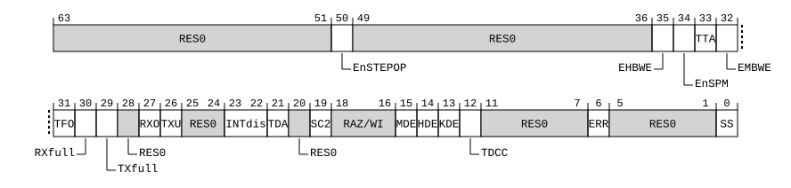

# ​D24.3.20 MDSCR_EL1, Monitor Debug System Control Register

Source: <https://developer.arm.com/documentation/ddi0487/mc/-Part-D-The-AArch64-System-Level-Architecture/-Chapter-D24-AArch64-System-Register-Descriptions/-D24-3-Debug-System-registers/-D24-3-20-MDSCR-EL1--Monitor-Debug-System-Control-Register>

##### D24.3.20 MDSCR\_EL1, Monitor Debug System Control Register

The MDSCR\_EL1 characteristics are:

Purpose
:   Main control register for the debug implementation.

Configuration
:   AArch64 System register MDSCR\_EL1 bits [31:0] are architecturally mapped to AArch32 System register [DBGDSCRext](/documentation/ddi0487/mc/-Part-G-The-AArch32-System-Level-Architecture/-Chapter-G8-AArch32-System-Register-Descriptions/-G8-3-Debug-System-registers/-G8-3-14-DBGDSCRext--Debug-Status-and-Control-Register--External-View?lang=en#reg_aarch32_dbgdscrext)[31:0].

    AArch64 System register MDSCR\_EL1 bit [15] is architecturally mapped to AArch32 System register [DBGDSCRint](/documentation/ddi0487/mc/-Part-G-The-AArch32-System-Level-Architecture/-Chapter-G8-AArch32-System-Register-Descriptions/-G8-3-Debug-System-registers/-G8-3-15-DBGDSCRint--Debug-Status-and-Control-Register--Internal-View?lang=en#reg_aarch32_dbgdscrint)[15].

    AArch64 System register MDSCR\_EL1 bit [12] is architecturally mapped to AArch32 System register [DBGDSCRint](/documentation/ddi0487/mc/-Part-G-The-AArch32-System-Level-Architecture/-Chapter-G8-AArch32-System-Register-Descriptions/-G8-3-Debug-System-registers/-G8-3-15-DBGDSCRint--Debug-Status-and-Control-Register--Internal-View?lang=en#reg_aarch32_dbgdscrint)[12].

    AArch64 System register MDSCR\_EL1 bits [5:2] are architecturally mapped to AArch32 System register [DBGDSCRint](/documentation/ddi0487/mc/-Part-G-The-AArch32-System-Level-Architecture/-Chapter-G8-AArch32-System-Register-Descriptions/-G8-3-Debug-System-registers/-G8-3-15-DBGDSCRint--Debug-Status-and-Control-Register--Internal-View?lang=en#reg_aarch32_dbgdscrint)[5:2].

    AArch64 System register MDSCR\_EL1 bits [31:29, 27:26, 23:21, 19, 14, 6] are architecturally mapped to External register [EDSCR](/documentation/ddi0487/mc/-Part-H-External-Debug/-Chapter-H9-External-Debug-Register-Descriptions/-H9-2-External-debug-registers/-H9-2-48-EDSCR--External-Debug-Status-and-Control-Register?lang=en#reg_ext_edscr)[31:29, 27:26, 23:21, 19, 14, 6].

    AArch64 System register MDSCR\_EL1 bits [35, 33] are architecturally mapped to External register [EDSCR2](/documentation/ddi0487/mc/-Part-H-External-Debug/-Chapter-H9-External-Debug-Register-Descriptions/-H9-2-External-debug-registers/-H9-2-49-EDSCR2--External-Debug-Status-and-Control-Register-2?lang=en#reg_ext_edscr2)[3, 1].

    This register is present only when FEAT\_AA64 is implemented. Otherwise, direct accesses to MDSCR\_EL1 are UNDEFINED.

Attributes
:   MDSCR\_EL1 is a 64-bit register.

###### Field descriptions



Bits [63:51]
:   Reserved, RES0.

EnSTEPOP, bit [50]
:   When FEAT\_STEP2 is implemented:
    :   Software step control bit. Enable execution from [MDSTEPOP\_EL1](/documentation/ddi0487/mc/-Part-D-The-AArch64-System-Level-Architecture/-Chapter-D24-AArch64-System-Register-Descriptions/-D24-3-Debug-System-registers/-D24-3-22-MDSTEPOP-EL1--Monitor-Debug-Step-Opcode-Register?lang=en#reg_aarch64_mdstepop_el1). Permitted values are:

<table>
 <colgroup>
  <col/>
  <col/>
 </colgroup>
 <thead>
  <tr>
   <th>
    <strong>
     EnSTEPOP
    </strong>
   </th>
   <th>
    <strong>
     Meaning
    </strong>
   </th>
  </tr>
 </thead>
 <tbody>
  <tr>
   <td>
    <p>
     <code>
      0b0
     </code>
    </p>
   </td>
   <td>
    <p>
     Execution from
     <a class="document-topic" document-topic-path="/ddi0487/mc/-Part-D-The-AArch64-System-Level-Architecture/-Chapter-D24-AArch64-System-Register-Descriptions/-D24-3-Debug-System-registers/-D24-3-22-MDSTEPOP-EL1--Monitor-Debug-Step-Opcode-Register?lang=en#reg_aarch64_mdstepop_el1" href="/documentation/ddi0487/mc/-Part-D-The-AArch64-System-Level-Architecture/-Chapter-D24-AArch64-System-Register-Descriptions/-D24-3-Debug-System-registers/-D24-3-22-MDSTEPOP-EL1--Monitor-Debug-Step-Opcode-Register?lang=en#reg_aarch64_mdstepop_el1">
      MDSTEPOP_EL1
     </a>
     is disabled.
    </p>
   </td>
  </tr>
  <tr>
   <td>
    <p>
     <code>
      0b1
     </code>
    </p>
   </td>
   <td>
    <p>
     Execution from
     <a class="document-topic" document-topic-path="/ddi0487/mc/-Part-D-The-AArch64-System-Level-Architecture/-Chapter-D24-AArch64-System-Register-Descriptions/-D24-3-Debug-System-registers/-D24-3-22-MDSTEPOP-EL1--Monitor-Debug-Step-Opcode-Register?lang=en#reg_aarch64_mdstepop_el1" href="/documentation/ddi0487/mc/-Part-D-The-AArch64-System-Level-Architecture/-Chapter-D24-AArch64-System-Register-Descriptions/-D24-3-Debug-System-registers/-D24-3-22-MDSTEPOP-EL1--Monitor-Debug-Step-Opcode-Register?lang=en#reg_aarch64_mdstepop_el1">
      MDSTEPOP_EL1
     </a>
     is not disabled by this control.
    </p>
   </td>
  </tr>
 </tbody>
</table>

        The reset behavior of this field is:

        - On a Warm reset, this field resets to an architecturally UNKNOWN value.

    Otherwise:
    :   Reserved, RES0.

Bits [49:36]
:   Reserved, RES0.

EHBWE, bit [35]
:   When FEAT\_Debugv8p9 is implemented:
    :   Extended Halting Breakpoint and Watchpoint Enable. Used for save/restore of [EDSCR2](/documentation/ddi0487/mc/-Part-H-External-Debug/-Chapter-H9-External-Debug-Register-Descriptions/-H9-2-External-debug-registers/-H9-2-49-EDSCR2--External-Debug-Status-and-Control-Register-2?lang=en#reg_ext_edscr2).EHBWE.

        When [OSLSR\_EL1](/documentation/ddi0487/mc/-Part-D-The-AArch64-System-Level-Architecture/-Chapter-D24-AArch64-System-Register-Descriptions/-D24-3-Debug-System-registers/-D24-3-28-OSLSR-EL1--OS-Lock-Status-Register?lang=en#reg_aarch64_oslsr_el1).OSLK is 0, software must treat this field as UNK/SBZP.

        When [OSLSR\_EL1](/documentation/ddi0487/mc/-Part-D-The-AArch64-System-Level-Architecture/-Chapter-D24-AArch64-System-Register-Descriptions/-D24-3-Debug-System-registers/-D24-3-28-OSLSR-EL1--OS-Lock-Status-Register?lang=en#reg_aarch64_oslsr_el1).OSLK is 1, this field holds the value of [EDSCR2](/documentation/ddi0487/mc/-Part-H-External-Debug/-Chapter-H9-External-Debug-Register-Descriptions/-H9-2-External-debug-registers/-H9-2-49-EDSCR2--External-Debug-Status-and-Control-Register-2?lang=en#reg_ext_edscr2).EHBWE. Reads and writes of this field are indirect accesses to [EDSCR2](/documentation/ddi0487/mc/-Part-H-External-Debug/-Chapter-H9-External-Debug-Register-Descriptions/-H9-2-External-debug-registers/-H9-2-49-EDSCR2--External-Debug-Status-and-Control-Register-2?lang=en#reg_ext_edscr2).EHBWE.

        It is IMPLEMENTATION DEFINED whether this field is implemented or is RES0 when 16 or fewer breakpoints are implemented, 16 or fewer watchpoints are implemented, and [MDSELR\_EL1](/documentation/ddi0487/mc/-Part-D-The-AArch64-System-Level-Architecture/-Chapter-D24-AArch64-System-Register-Descriptions/-D24-3-Debug-System-registers/-D24-3-21-MDSELR-EL1--Breakpoint-and-Watchpoint-Selection-Register?lang=en#reg_aarch64_mdselr_el1) is implemented as RAZ/WI.

        The reset behavior of this field is:

        - On a Cold reset, this field resets to `'0'`.

        Accessing this field has the following behavior:

        - When OSLSR\_EL1.OSLK == ‘0’, access to this field is RO.
        - Otherwise, access to this field is RW.

    Otherwise:
    :   Reserved, RES0.

EnSPM, bit [34]
:   When FEAT\_SPMU is implemented:
    :   Enable access to System PMU registers. When disabled, accesses to System PMU registers generate a trap to EL1.

<table>
 <colgroup>
  <col/>
  <col/>
 </colgroup>
 <thead>
  <tr>
   <th>
    <strong>
     EnSPM
    </strong>
   </th>
   <th>
    <strong>
     Meaning
    </strong>
   </th>
  </tr>
 </thead>
 <tbody>
  <tr>
   <td>
    <p>
     <code>
      0b0
     </code>
    </p>
   </td>
   <td>
    <p>
     Accesses of the specified System PMU registers at EL0 are trapped to EL1, unless the instruction generates a higher priority exception.
    </p>
   </td>
  </tr>
  <tr>
   <td>
    <p>
     <code>
      0b1
     </code>
    </p>
   </td>
   <td>
    <p>
     Accesses of the specified System PMU registers are not trapped by this mechanism.
    </p>
   </td>
  </tr>
 </tbody>
</table>

        In AArch64 state, the instructions affected by this control are: `MRS` and `MSR` accesses to [SPMCNTENCLR\_EL0](/documentation/ddi0487/mc/-Part-D-The-AArch64-System-Level-Architecture/-Chapter-D24-AArch64-System-Register-Descriptions/-D24-5-Performance-Monitors-registers/-D24-5-34-SPMCNTENCLR-EL0--System-Performance-Monitors-Count-Enable-Clear-Register?lang=en#reg_aarch64_spmcntenclr_el0), [SPMCNTENSET\_EL0](/documentation/ddi0487/mc/-Part-D-The-AArch64-System-Level-Architecture/-Chapter-D24-AArch64-System-Register-Descriptions/-D24-5-Performance-Monitors-registers/-D24-5-35-SPMCNTENSET-EL0--System-Performance-Monitors-Count-Enable-Set-Register?lang=en#reg_aarch64_spmcntenset_el0), [SPMCR\_EL0](/documentation/ddi0487/mc/-Part-D-The-AArch64-System-Level-Architecture/-Chapter-D24-AArch64-System-Register-Descriptions/-D24-5-Performance-Monitors-registers/-D24-5-36-SPMCR-EL0--System-Performance-Monitor-Control-Register?lang=en#reg_aarch64_spmcr_el0), [SPMEVCNTR<n>\_EL0](/documentation/ddi0487/mc/-Part-D-The-AArch64-System-Level-Architecture/-Chapter-D24-AArch64-System-Register-Descriptions/-D24-5-Performance-Monitors-registers/-D24-5-39-SPMEVCNTR-n--EL0--System-Performance-Monitors-Event-Count-Register--n---0---63?lang=en#reg_aarch64_spmevcntrn_el0), [SPMEVFILT2R<n>\_EL0](/documentation/ddi0487/mc/-Part-D-The-AArch64-System-Level-Architecture/-Chapter-D24-AArch64-System-Register-Descriptions/-D24-5-Performance-Monitors-registers/-D24-5-40-SPMEVFILT2R-n--EL0--System-Performance-Monitors-Event-Filter-Control-Register-2--n---0---63?lang=en#reg_aarch64_spmevfilt2rn_el0), [SPMEVFILTR<n>\_EL0](/documentation/ddi0487/mc/-Part-D-The-AArch64-System-Level-Architecture/-Chapter-D24-AArch64-System-Register-Descriptions/-D24-5-Performance-Monitors-registers/-D24-5-41-SPMEVFILTR-n--EL0--System-Performance-Monitors-Event-Filter-Control-Register--n---0---63?lang=en#reg_aarch64_spmevfiltrn_el0), [SPMEVTYPER<n>\_EL0](/documentation/ddi0487/mc/-Part-D-The-AArch64-System-Level-Architecture/-Chapter-D24-AArch64-System-Register-Descriptions/-D24-5-Performance-Monitors-registers/-D24-5-42-SPMEVTYPER-n--EL0--System-Performance-Monitors-Event-Type-Register--n---0---63?lang=en#reg_aarch64_spmevtypern_el0), [SPMOVSCLR\_EL0](/documentation/ddi0487/mc/-Part-D-The-AArch64-System-Level-Architecture/-Chapter-D24-AArch64-System-Register-Descriptions/-D24-5-Performance-Monitors-registers/-D24-5-46-SPMOVSCLR-EL0--System-Performance-Monitors-Overflow-Flag-Status-Clear-Register?lang=en#reg_aarch64_spmovsclr_el0), [SPMOVSSET\_EL0](/documentation/ddi0487/mc/-Part-D-The-AArch64-System-Level-Architecture/-Chapter-D24-AArch64-System-Register-Descriptions/-D24-5-Performance-Monitors-registers/-D24-5-47-SPMOVSSET-EL0--System-Performance-Monitors-Overflow-Flag-Status-Set-Register?lang=en#reg_aarch64_spmovsset_el0), and [SPMSELR\_EL0](/documentation/ddi0487/mc/-Part-D-The-AArch64-System-Level-Architecture/-Chapter-D24-AArch64-System-Register-Descriptions/-D24-5-Performance-Monitors-registers/-D24-5-50-SPMSELR-EL0--System-Performance-Monitors-Select-Register?lang=en#reg_aarch64_spmselr_el0).

        Unless the instruction generates a higher priority exception:

        - If EL2 is implemented and enabled in the current Security state, and [HCR\_EL2](/documentation/ddi0487/mc/-Part-D-The-AArch64-System-Level-Architecture/-Chapter-D24-AArch64-System-Register-Descriptions/-D24-2-General-system-control-registers/-D24-2-61-HCR-EL2--Hypervisor-Configuration-Register?lang=en#reg_aarch64_hcr_el2).TGE is 1, then trapped instructions generate an exception to EL2.
        - Otherwise, trapped instructions generate an exception to EL1.

        Trapped instructions are reported using EC syndrome value `0x18`.

        The reset behavior of this field is:

        - On a Warm reset, this field resets to an architecturally UNKNOWN value.

    Otherwise:
    :   Reserved, RES0.

TTA, bit [33]
:   When FEAT\_TRBE\_EXT is implemented or FEAT\_ETEv1p3 is implemented:
    :   Trap Trace Accesses. Used for save/restore of [EDSCR2](/documentation/ddi0487/mc/-Part-H-External-Debug/-Chapter-H9-External-Debug-Register-Descriptions/-H9-2-External-debug-registers/-H9-2-49-EDSCR2--External-Debug-Status-and-Control-Register-2?lang=en#reg_ext_edscr2).TTA.

        When [OSLSR\_EL1](/documentation/ddi0487/mc/-Part-D-The-AArch64-System-Level-Architecture/-Chapter-D24-AArch64-System-Register-Descriptions/-D24-3-Debug-System-registers/-D24-3-28-OSLSR-EL1--OS-Lock-Status-Register?lang=en#reg_aarch64_oslsr_el1).OSLK is 0, software must treat this field as UNK/SBZP.

        When [OSLSR\_EL1](/documentation/ddi0487/mc/-Part-D-The-AArch64-System-Level-Architecture/-Chapter-D24-AArch64-System-Register-Descriptions/-D24-3-Debug-System-registers/-D24-3-28-OSLSR-EL1--OS-Lock-Status-Register?lang=en#reg_aarch64_oslsr_el1).OSLK is 1, this field holds the value of [EDSCR2](/documentation/ddi0487/mc/-Part-H-External-Debug/-Chapter-H9-External-Debug-Register-Descriptions/-H9-2-External-debug-registers/-H9-2-49-EDSCR2--External-Debug-Status-and-Control-Register-2?lang=en#reg_ext_edscr2).TTA. Reads and writes of this field are indirect accesses to [EDSCR2](/documentation/ddi0487/mc/-Part-H-External-Debug/-Chapter-H9-External-Debug-Register-Descriptions/-H9-2-External-debug-registers/-H9-2-49-EDSCR2--External-Debug-Status-and-Control-Register-2?lang=en#reg_ext_edscr2).TTA.

        The reset behavior of this field is:

        - On a Cold reset, this field resets to `'0'`.

        Accessing this field has the following behavior:

        - When OSLSR\_EL1.OSLK == ‘0’, access to this field is RO.
        - Otherwise, access to this field is RW.

    Otherwise:
    :   Reserved, RES0.

EMBWE, bit [32]
:   When FEAT\_Debugv8p9 is implemented:
    :   Extended Monitor Breakpoint and Watchpoint Enable. Enables use of additional breakpoints or watchpoints.

<table>
 <colgroup>
  <col/>
  <col/>
 </colgroup>
 <thead>
  <tr>
   <th>
    <strong>
     EMBWE
    </strong>
   </th>
   <th>
    <strong>
     Meaning
    </strong>
   </th>
  </tr>
 </thead>
 <tbody>
  <tr>
   <td>
    <p>
     <code>
      0b0
     </code>
    </p>
   </td>
   <td>
    <p>
     Breakpoint and Watchpoint exceptions are disabled for each breakpoint &lt;n&gt; and watchpoint &lt;n&gt;, where n is greater than or equal to 16.
    </p>
    <p>
     The Effective value of
     <a class="document-topic" document-topic-path="/ddi0487/mc/-Part-D-The-AArch64-System-Level-Architecture/-Chapter-D24-AArch64-System-Register-Descriptions/-D24-3-Debug-System-registers/-D24-3-21-MDSELR-EL1--Breakpoint-and-Watchpoint-Selection-Register?lang=en#reg_aarch64_mdselr_el1" href="/documentation/ddi0487/mc/-Part-D-The-AArch64-System-Level-Architecture/-Chapter-D24-AArch64-System-Register-Descriptions/-D24-3-Debug-System-registers/-D24-3-21-MDSELR-EL1--Breakpoint-and-Watchpoint-Selection-Register?lang=en#reg_aarch64_mdselr_el1">
      MDSELR_EL1
     </a>
     .BANK is zero at EL1.
    </p>
   </td>
  </tr>
  <tr>
   <td>
    <p>
     <code>
      0b1
     </code>
    </p>
   </td>
   <td>
    <p>
     Breakpoint and Watchpoint exceptions are not affected by this mechanism.
    </p>
    <p>
     The Effective value of
     <a class="document-topic" document-topic-path="/ddi0487/mc/-Part-D-The-AArch64-System-Level-Architecture/-Chapter-D24-AArch64-System-Register-Descriptions/-D24-3-Debug-System-registers/-D24-3-21-MDSELR-EL1--Breakpoint-and-Watchpoint-Selection-Register?lang=en#reg_aarch64_mdselr_el1" href="/documentation/ddi0487/mc/-Part-D-The-AArch64-System-Level-Architecture/-Chapter-D24-AArch64-System-Register-Descriptions/-D24-3-Debug-System-registers/-D24-3-21-MDSELR-EL1--Breakpoint-and-Watchpoint-Selection-Register?lang=en#reg_aarch64_mdselr_el1">
      MDSELR_EL1
     </a>
     .BANK is not affected by this field.
    </p>
   </td>
  </tr>
 </tbody>
</table>

        It is IMPLEMENTATION DEFINED whether this field is implemented or is RES0 when 16 or fewer breakpoints are implemented, 16 or fewer watchpoints are implemented, and [MDSELR\_EL1](/documentation/ddi0487/mc/-Part-D-The-AArch64-System-Level-Architecture/-Chapter-D24-AArch64-System-Register-Descriptions/-D24-3-Debug-System-registers/-D24-3-21-MDSELR-EL1--Breakpoint-and-Watchpoint-Selection-Register?lang=en#reg_aarch64_mdselr_el1) is implemented as RAZ/WI.

        This field is ignored by the PE and treated as zero when any of the following are true:

        - EL3 is implemented and [MDCR\_EL3](/documentation/ddi0487/mc/-Part-D-The-AArch64-System-Level-Architecture/-Chapter-D24-AArch64-System-Register-Descriptions/-D24-3-Debug-System-registers/-D24-3-18-MDCR-EL3--Monitor-Debug-Configuration-Register--EL3-?lang=en#reg_aarch64_mdcr_el3).EBWE is 0.
        - EL2 is implemented and enabled in the current Security state, and [MDCR\_EL2](/documentation/ddi0487/mc/-Part-D-The-AArch64-System-Level-Architecture/-Chapter-D24-AArch64-System-Register-Descriptions/-D24-3-Debug-System-registers/-D24-3-17-MDCR-EL2--Monitor-Debug-Configuration-Register--EL2-?lang=en#reg_aarch64_mdcr_el2).EBWE is 0.

        The reset behavior of this field is:

        - On a Warm reset:
          - When the highest implemented Exception level is EL1, this field resets to `'0'`.
          - Otherwise, this field resets to an architecturally UNKNOWN value.

    Otherwise:
    :   Reserved, RES0.

TFO, bit [31]
:   When FEAT\_TRF is implemented:
    :   Trace Filter override. Used for save/restore of [EDSCR](/documentation/ddi0487/mc/-Part-H-External-Debug/-Chapter-H9-External-Debug-Register-Descriptions/-H9-2-External-debug-registers/-H9-2-48-EDSCR--External-Debug-Status-and-Control-Register?lang=en#reg_ext_edscr).TFO.

        When [OSLSR\_EL1](/documentation/ddi0487/mc/-Part-D-The-AArch64-System-Level-Architecture/-Chapter-D24-AArch64-System-Register-Descriptions/-D24-3-Debug-System-registers/-D24-3-28-OSLSR-EL1--OS-Lock-Status-Register?lang=en#reg_aarch64_oslsr_el1).OSLK == 0, software must treat this bit as UNK/SBZP.

        When [OSLSR\_EL1](/documentation/ddi0487/mc/-Part-D-The-AArch64-System-Level-Architecture/-Chapter-D24-AArch64-System-Register-Descriptions/-D24-3-Debug-System-registers/-D24-3-28-OSLSR-EL1--OS-Lock-Status-Register?lang=en#reg_aarch64_oslsr_el1).OSLK == 1, this bit holds the value of [EDSCR](/documentation/ddi0487/mc/-Part-H-External-Debug/-Chapter-H9-External-Debug-Register-Descriptions/-H9-2-External-debug-registers/-H9-2-48-EDSCR--External-Debug-Status-and-Control-Register?lang=en#reg_ext_edscr).TFO. Reads and writes of this bit are indirect accesses to [EDSCR](/documentation/ddi0487/mc/-Part-H-External-Debug/-Chapter-H9-External-Debug-Register-Descriptions/-H9-2-External-debug-registers/-H9-2-48-EDSCR--External-Debug-Status-and-Control-Register?lang=en#reg_ext_edscr).TFO.

        The reset behavior of this field is:

        - On a Cold reset, this field resets to `'0'`.

        Accessing this field has the following behavior:

        - When OSLSR\_EL1.OSLK == ‘1’, access to this field is RW.
        - When OSLSR\_EL1.OSLK == ‘0’, access to this field is RO.

    Otherwise:
    :   Reserved, RES0.

RXfull, bit [30]
:   Used for save/restore of [EDSCR](/documentation/ddi0487/mc/-Part-H-External-Debug/-Chapter-H9-External-Debug-Register-Descriptions/-H9-2-External-debug-registers/-H9-2-48-EDSCR--External-Debug-Status-and-Control-Register?lang=en#reg_ext_edscr).RXfull.

    When [OSLSR\_EL1](/documentation/ddi0487/mc/-Part-D-The-AArch64-System-Level-Architecture/-Chapter-D24-AArch64-System-Register-Descriptions/-D24-3-Debug-System-registers/-D24-3-28-OSLSR-EL1--OS-Lock-Status-Register?lang=en#reg_aarch64_oslsr_el1).OSLK == 0, software must treat this bit as UNK/SBZP.

    When [OSLSR\_EL1](/documentation/ddi0487/mc/-Part-D-The-AArch64-System-Level-Architecture/-Chapter-D24-AArch64-System-Register-Descriptions/-D24-3-Debug-System-registers/-D24-3-28-OSLSR-EL1--OS-Lock-Status-Register?lang=en#reg_aarch64_oslsr_el1).OSLK == 1, this bit holds the value of [EDSCR](/documentation/ddi0487/mc/-Part-H-External-Debug/-Chapter-H9-External-Debug-Register-Descriptions/-H9-2-External-debug-registers/-H9-2-48-EDSCR--External-Debug-Status-and-Control-Register?lang=en#reg_ext_edscr).RXfull. Reads and writes of this bit are indirect accesses to [EDSCR](/documentation/ddi0487/mc/-Part-H-External-Debug/-Chapter-H9-External-Debug-Register-Descriptions/-H9-2-External-debug-registers/-H9-2-48-EDSCR--External-Debug-Status-and-Control-Register?lang=en#reg_ext_edscr).RXfull.

    The reset behavior of this field is:

    - On a Cold reset, this field resets to `'0'`.

    Accessing this field has the following behavior:

    - When OSLSR\_EL1.OSLK == ‘1’, access to this field is RW.
    - When OSLSR\_EL1.OSLK == ‘0’, access to this field is RO.

TXfull, bit [29]
:   Used for save/restore of [EDSCR](/documentation/ddi0487/mc/-Part-H-External-Debug/-Chapter-H9-External-Debug-Register-Descriptions/-H9-2-External-debug-registers/-H9-2-48-EDSCR--External-Debug-Status-and-Control-Register?lang=en#reg_ext_edscr).TXfull.

    When [OSLSR\_EL1](/documentation/ddi0487/mc/-Part-D-The-AArch64-System-Level-Architecture/-Chapter-D24-AArch64-System-Register-Descriptions/-D24-3-Debug-System-registers/-D24-3-28-OSLSR-EL1--OS-Lock-Status-Register?lang=en#reg_aarch64_oslsr_el1).OSLK == 0, software must treat this bit as UNK/SBZP.

    When [OSLSR\_EL1](/documentation/ddi0487/mc/-Part-D-The-AArch64-System-Level-Architecture/-Chapter-D24-AArch64-System-Register-Descriptions/-D24-3-Debug-System-registers/-D24-3-28-OSLSR-EL1--OS-Lock-Status-Register?lang=en#reg_aarch64_oslsr_el1).OSLK == 1, this bit holds the value of [EDSCR](/documentation/ddi0487/mc/-Part-H-External-Debug/-Chapter-H9-External-Debug-Register-Descriptions/-H9-2-External-debug-registers/-H9-2-48-EDSCR--External-Debug-Status-and-Control-Register?lang=en#reg_ext_edscr).TXfull. Reads and writes of this bit are indirect accesses to [EDSCR](/documentation/ddi0487/mc/-Part-H-External-Debug/-Chapter-H9-External-Debug-Register-Descriptions/-H9-2-External-debug-registers/-H9-2-48-EDSCR--External-Debug-Status-and-Control-Register?lang=en#reg_ext_edscr).TXfull.

    The reset behavior of this field is:

    - On a Cold reset, this field resets to `'0'`.

    Accessing this field has the following behavior:

    - When OSLSR\_EL1.OSLK == ‘1’, access to this field is RW.
    - When OSLSR\_EL1.OSLK == ‘0’, access to this field is RO.

Bit [28]
:   Reserved, RES0.

RXO, bit [27]
:   Used for save/restore of [EDSCR](/documentation/ddi0487/mc/-Part-H-External-Debug/-Chapter-H9-External-Debug-Register-Descriptions/-H9-2-External-debug-registers/-H9-2-48-EDSCR--External-Debug-Status-and-Control-Register?lang=en#reg_ext_edscr).RXO.

    When [OSLSR\_EL1](/documentation/ddi0487/mc/-Part-D-The-AArch64-System-Level-Architecture/-Chapter-D24-AArch64-System-Register-Descriptions/-D24-3-Debug-System-registers/-D24-3-28-OSLSR-EL1--OS-Lock-Status-Register?lang=en#reg_aarch64_oslsr_el1).OSLK == 0, software must treat this bit as UNK/SBZP.

    When [OSLSR\_EL1](/documentation/ddi0487/mc/-Part-D-The-AArch64-System-Level-Architecture/-Chapter-D24-AArch64-System-Register-Descriptions/-D24-3-Debug-System-registers/-D24-3-28-OSLSR-EL1--OS-Lock-Status-Register?lang=en#reg_aarch64_oslsr_el1).OSLK == 1, this bit holds the value of [EDSCR](/documentation/ddi0487/mc/-Part-H-External-Debug/-Chapter-H9-External-Debug-Register-Descriptions/-H9-2-External-debug-registers/-H9-2-48-EDSCR--External-Debug-Status-and-Control-Register?lang=en#reg_ext_edscr).RXO. Reads and writes of this bit are indirect accesses to [EDSCR](/documentation/ddi0487/mc/-Part-H-External-Debug/-Chapter-H9-External-Debug-Register-Descriptions/-H9-2-External-debug-registers/-H9-2-48-EDSCR--External-Debug-Status-and-Control-Register?lang=en#reg_ext_edscr).RXO.

    When [OSLSR\_EL1](/documentation/ddi0487/mc/-Part-D-The-AArch64-System-Level-Architecture/-Chapter-D24-AArch64-System-Register-Descriptions/-D24-3-Debug-System-registers/-D24-3-28-OSLSR-EL1--OS-Lock-Status-Register?lang=en#reg_aarch64_oslsr_el1).OSLK == 1, if bits [27,6] of the value written to MDSCR\_EL1 are {1,0}, that is, the RXO bit is 1 and the ERR bit is 0, the PE sets [EDSCR](/documentation/ddi0487/mc/-Part-H-External-Debug/-Chapter-H9-External-Debug-Register-Descriptions/-H9-2-External-debug-registers/-H9-2-48-EDSCR--External-Debug-Status-and-Control-Register?lang=en#reg_ext_edscr).{RXO,ERR} to UNKNOWN values.

    The reset behavior of this field is:

    - On a Cold reset, this field resets to `'0'`.

    Accessing this field has the following behavior:

    - When OSLSR\_EL1.OSLK == ‘1’, access to this field is RW.
    - When OSLSR\_EL1.OSLK == ‘0’, access to this field is RO.

TXU, bit [26]
:   Used for save/restore of [EDSCR](/documentation/ddi0487/mc/-Part-H-External-Debug/-Chapter-H9-External-Debug-Register-Descriptions/-H9-2-External-debug-registers/-H9-2-48-EDSCR--External-Debug-Status-and-Control-Register?lang=en#reg_ext_edscr).TXU.

    When [OSLSR\_EL1](/documentation/ddi0487/mc/-Part-D-The-AArch64-System-Level-Architecture/-Chapter-D24-AArch64-System-Register-Descriptions/-D24-3-Debug-System-registers/-D24-3-28-OSLSR-EL1--OS-Lock-Status-Register?lang=en#reg_aarch64_oslsr_el1).OSLK == 0, software must treat this bit as UNK/SBZP.

    When [OSLSR\_EL1](/documentation/ddi0487/mc/-Part-D-The-AArch64-System-Level-Architecture/-Chapter-D24-AArch64-System-Register-Descriptions/-D24-3-Debug-System-registers/-D24-3-28-OSLSR-EL1--OS-Lock-Status-Register?lang=en#reg_aarch64_oslsr_el1).OSLK == 1, this bit holds the value of [EDSCR](/documentation/ddi0487/mc/-Part-H-External-Debug/-Chapter-H9-External-Debug-Register-Descriptions/-H9-2-External-debug-registers/-H9-2-48-EDSCR--External-Debug-Status-and-Control-Register?lang=en#reg_ext_edscr).TXU. Reads and writes of this bit are indirect accesses to [EDSCR](/documentation/ddi0487/mc/-Part-H-External-Debug/-Chapter-H9-External-Debug-Register-Descriptions/-H9-2-External-debug-registers/-H9-2-48-EDSCR--External-Debug-Status-and-Control-Register?lang=en#reg_ext_edscr).TXU.

    When [OSLSR\_EL1](/documentation/ddi0487/mc/-Part-D-The-AArch64-System-Level-Architecture/-Chapter-D24-AArch64-System-Register-Descriptions/-D24-3-Debug-System-registers/-D24-3-28-OSLSR-EL1--OS-Lock-Status-Register?lang=en#reg_aarch64_oslsr_el1).OSLK == 1, if bits [26,6] of the value written to MDSCR\_EL1 are {1,0}, that is, the TXU bit is 1 and the ERR bit is 0, the PE sets [EDSCR](/documentation/ddi0487/mc/-Part-H-External-Debug/-Chapter-H9-External-Debug-Register-Descriptions/-H9-2-External-debug-registers/-H9-2-48-EDSCR--External-Debug-Status-and-Control-Register?lang=en#reg_ext_edscr).{TXU,ERR} to UNKNOWN values.

    The reset behavior of this field is:

    - On a Cold reset, this field resets to `'0'`.

    Accessing this field has the following behavior:

    - When OSLSR\_EL1.OSLK == ‘1’, access to this field is RW.
    - When OSLSR\_EL1.OSLK == ‘0’, access to this field is RO.

Bits [25:24]
:   Reserved, RES0.

INTdis, bits [23:22]
:   Used for save/restore of [EDSCR](/documentation/ddi0487/mc/-Part-H-External-Debug/-Chapter-H9-External-Debug-Register-Descriptions/-H9-2-External-debug-registers/-H9-2-48-EDSCR--External-Debug-Status-and-Control-Register?lang=en#reg_ext_edscr).INTdis.

    When [OSLSR\_EL1](/documentation/ddi0487/mc/-Part-D-The-AArch64-System-Level-Architecture/-Chapter-D24-AArch64-System-Register-Descriptions/-D24-3-Debug-System-registers/-D24-3-28-OSLSR-EL1--OS-Lock-Status-Register?lang=en#reg_aarch64_oslsr_el1).OSLK == 0, software must treat this bit as UNK/SBZP.

    When [OSLSR\_EL1](/documentation/ddi0487/mc/-Part-D-The-AArch64-System-Level-Architecture/-Chapter-D24-AArch64-System-Register-Descriptions/-D24-3-Debug-System-registers/-D24-3-28-OSLSR-EL1--OS-Lock-Status-Register?lang=en#reg_aarch64_oslsr_el1).OSLK == 1, this field holds the value of [EDSCR](/documentation/ddi0487/mc/-Part-H-External-Debug/-Chapter-H9-External-Debug-Register-Descriptions/-H9-2-External-debug-registers/-H9-2-48-EDSCR--External-Debug-Status-and-Control-Register?lang=en#reg_ext_edscr).INTdis. Reads and writes of this field are indirect accesses to [EDSCR](/documentation/ddi0487/mc/-Part-H-External-Debug/-Chapter-H9-External-Debug-Register-Descriptions/-H9-2-External-debug-registers/-H9-2-48-EDSCR--External-Debug-Status-and-Control-Register?lang=en#reg_ext_edscr).INTdis.

    The reset behavior of this field is:

    - On a Cold reset, this field resets to `'00'`.

    Accessing this field has the following behavior:

    - When OSLSR\_EL1.OSLK == ‘1’, access to this field is RW.
    - When OSLSR\_EL1.OSLK == ‘0’, access to this field is RO.

TDA, bit [21]
:   Used for save/restore of [EDSCR](/documentation/ddi0487/mc/-Part-H-External-Debug/-Chapter-H9-External-Debug-Register-Descriptions/-H9-2-External-debug-registers/-H9-2-48-EDSCR--External-Debug-Status-and-Control-Register?lang=en#reg_ext_edscr).TDA.

    When [OSLSR\_EL1](/documentation/ddi0487/mc/-Part-D-The-AArch64-System-Level-Architecture/-Chapter-D24-AArch64-System-Register-Descriptions/-D24-3-Debug-System-registers/-D24-3-28-OSLSR-EL1--OS-Lock-Status-Register?lang=en#reg_aarch64_oslsr_el1).OSLK == 0, software must treat this bit as UNK/SBZP.

    When [OSLSR\_EL1](/documentation/ddi0487/mc/-Part-D-The-AArch64-System-Level-Architecture/-Chapter-D24-AArch64-System-Register-Descriptions/-D24-3-Debug-System-registers/-D24-3-28-OSLSR-EL1--OS-Lock-Status-Register?lang=en#reg_aarch64_oslsr_el1).OSLK == 1, this bit holds the value of [EDSCR](/documentation/ddi0487/mc/-Part-H-External-Debug/-Chapter-H9-External-Debug-Register-Descriptions/-H9-2-External-debug-registers/-H9-2-48-EDSCR--External-Debug-Status-and-Control-Register?lang=en#reg_ext_edscr).TDA. Reads and writes of this bit are indirect accesses to [EDSCR](/documentation/ddi0487/mc/-Part-H-External-Debug/-Chapter-H9-External-Debug-Register-Descriptions/-H9-2-External-debug-registers/-H9-2-48-EDSCR--External-Debug-Status-and-Control-Register?lang=en#reg_ext_edscr).TDA.

    The reset behavior of this field is:

    - On a Cold reset, this field resets to `'0'`.

    Accessing this field has the following behavior:

    - When OSLSR\_EL1.OSLK == ‘1’, access to this field is RW.
    - When OSLSR\_EL1.OSLK == ‘0’, access to this field is RO.

Bit [20]
:   Reserved, RES0.

SC2, bit [19]
:   When FEAT\_PCSRv8 is implemented, FEAT\_VHE is implemented, and FEAT\_PCSRv8p2 is not implemented:
    :   Used for save/restore of [EDSCR](/documentation/ddi0487/mc/-Part-H-External-Debug/-Chapter-H9-External-Debug-Register-Descriptions/-H9-2-External-debug-registers/-H9-2-48-EDSCR--External-Debug-Status-and-Control-Register?lang=en#reg_ext_edscr).SC2.

        When [OSLSR\_EL1](/documentation/ddi0487/mc/-Part-D-The-AArch64-System-Level-Architecture/-Chapter-D24-AArch64-System-Register-Descriptions/-D24-3-Debug-System-registers/-D24-3-28-OSLSR-EL1--OS-Lock-Status-Register?lang=en#reg_aarch64_oslsr_el1).OSLK == 0, software must treat this bit as UNK/SBZP.

        When [OSLSR\_EL1](/documentation/ddi0487/mc/-Part-D-The-AArch64-System-Level-Architecture/-Chapter-D24-AArch64-System-Register-Descriptions/-D24-3-Debug-System-registers/-D24-3-28-OSLSR-EL1--OS-Lock-Status-Register?lang=en#reg_aarch64_oslsr_el1).OSLK == 1, this bit holds the value of [EDSCR](/documentation/ddi0487/mc/-Part-H-External-Debug/-Chapter-H9-External-Debug-Register-Descriptions/-H9-2-External-debug-registers/-H9-2-48-EDSCR--External-Debug-Status-and-Control-Register?lang=en#reg_ext_edscr).SC2. Reads and writes of this bit are indirect accesses to [EDSCR](/documentation/ddi0487/mc/-Part-H-External-Debug/-Chapter-H9-External-Debug-Register-Descriptions/-H9-2-External-debug-registers/-H9-2-48-EDSCR--External-Debug-Status-and-Control-Register?lang=en#reg_ext_edscr).SC2.

        The reset behavior of this field is:

        - On a Cold reset, this field resets to `'0'`.

        Accessing this field has the following behavior:

        - When OSLSR\_EL1.OSLK == ‘1’, access to this field is RW.
        - When OSLSR\_EL1.OSLK == ‘0’, access to this field is RO.

    Otherwise:
    :   Reserved, RES0.

Bits [18:16]
:   Reserved, RAZ/WI.

    Hardware must implement this field as RAZ/WI. Software must not rely on the register reading as zero, and must use a read-modify-write sequence to write to the register.

MDE, bit [15]
:   Monitor debug events. Enable Breakpoint, Watchpoint, and Vector Catch exceptions.

<table>
 <colgroup>
  <col/>
  <col/>
 </colgroup>
 <thead>
  <tr>
   <th>
    <strong>
     MDE
    </strong>
   </th>
   <th>
    <strong>
     Meaning
    </strong>
   </th>
  </tr>
 </thead>
 <tbody>
  <tr>
   <td>
    <p>
     <code>
      0b0
     </code>
    </p>
   </td>
   <td>
    <p>
     Breakpoint, Watchpoint, and Vector Catch exceptions disabled.
    </p>
   </td>
  </tr>
  <tr>
   <td>
    <p>
     <code>
      0b1
     </code>
    </p>
   </td>
   <td>
    <p>
     Breakpoint, Watchpoint, and Vector Catch exceptions enabled.
    </p>
   </td>
  </tr>
 </tbody>
</table>

    The reset behavior of this field is:

    - On a Warm reset, this field resets to an architecturally UNKNOWN value.

HDE, bit [14]
:   Used for save/restore of [EDSCR](/documentation/ddi0487/mc/-Part-H-External-Debug/-Chapter-H9-External-Debug-Register-Descriptions/-H9-2-External-debug-registers/-H9-2-48-EDSCR--External-Debug-Status-and-Control-Register?lang=en#reg_ext_edscr).HDE.

    When [OSLSR\_EL1](/documentation/ddi0487/mc/-Part-D-The-AArch64-System-Level-Architecture/-Chapter-D24-AArch64-System-Register-Descriptions/-D24-3-Debug-System-registers/-D24-3-28-OSLSR-EL1--OS-Lock-Status-Register?lang=en#reg_aarch64_oslsr_el1).OSLK == 0, software must treat this bit as UNK/SBZP.

    When [OSLSR\_EL1](/documentation/ddi0487/mc/-Part-D-The-AArch64-System-Level-Architecture/-Chapter-D24-AArch64-System-Register-Descriptions/-D24-3-Debug-System-registers/-D24-3-28-OSLSR-EL1--OS-Lock-Status-Register?lang=en#reg_aarch64_oslsr_el1).OSLK == 1, this bit holds the value of [EDSCR](/documentation/ddi0487/mc/-Part-H-External-Debug/-Chapter-H9-External-Debug-Register-Descriptions/-H9-2-External-debug-registers/-H9-2-48-EDSCR--External-Debug-Status-and-Control-Register?lang=en#reg_ext_edscr).HDE. Reads and writes of this bit are indirect accesses to [EDSCR](/documentation/ddi0487/mc/-Part-H-External-Debug/-Chapter-H9-External-Debug-Register-Descriptions/-H9-2-External-debug-registers/-H9-2-48-EDSCR--External-Debug-Status-and-Control-Register?lang=en#reg_ext_edscr).HDE.

    The reset behavior of this field is:

    - On a Cold reset, this field resets to `'0'`.

    Accessing this field has the following behavior:

    - When OSLSR\_EL1.OSLK == ‘1’, access to this field is RW.
    - When OSLSR\_EL1.OSLK == ‘0’, access to this field is RO.

KDE, bit [13]
:   Local (kernel) debug enable. If ELD is using AArch64, enable debug exceptions within ELD. Permitted values are:

<table>
 <colgroup>
  <col/>
  <col/>
 </colgroup>
 <thead>
  <tr>
   <th>
    <strong>
     KDE
    </strong>
   </th>
   <th>
    <strong>
     Meaning
    </strong>
   </th>
  </tr>
 </thead>
 <tbody>
  <tr>
   <td>
    <p>
     <code>
      0b0
     </code>
    </p>
   </td>
   <td>
    <p>
     Debug exceptions, other than Breakpoint Instruction exceptions, disabled within EL
     <sub>
      D
     </sub>
     .
    </p>
   </td>
  </tr>
  <tr>
   <td>
    <p>
     <code>
      0b1
     </code>
    </p>
   </td>
   <td>
    <p>
     All debug exceptions enabled within EL
     <sub>
      D
     </sub>
     .
    </p>
   </td>
  </tr>
 </tbody>
</table>

    RES0 if ELD is using AArch32.

    The reset behavior of this field is:

    - On a Warm reset, this field resets to an architecturally UNKNOWN value.

TDCC, bit [12]
:   Traps EL0 accesses to the Debug Communication Channel (DCC) registers to EL1, or to EL2 when it is implemented and enabled for the current Security state and [HCR\_EL2](/documentation/ddi0487/mc/-Part-D-The-AArch64-System-Level-Architecture/-Chapter-D24-AArch64-System-Register-Descriptions/-D24-2-General-system-control-registers/-D24-2-61-HCR-EL2--Hypervisor-Configuration-Register?lang=en#reg_aarch64_hcr_el2).TGE is 1, from both Execution states, as follows:

    - In AArch64 state, MRS or MSR accesses to the following DCC System registers are trapped, reported using EC syndrome value `0x18`:
      - [MDCCSR\_EL0](/documentation/ddi0487/mc/-Part-D-The-AArch64-System-Level-Architecture/-Chapter-D24-AArch64-System-Register-Descriptions/-D24-3-Debug-System-registers/-D24-3-16-MDCCSR-EL0--Monitor-DCC-Status-Register?lang=en#reg_aarch64_mdccsr_el0).
      - If not in Debug state, [DBGDTR\_EL0](/documentation/ddi0487/mc/-Part-D-The-AArch64-System-Level-Architecture/-Chapter-D24-AArch64-System-Register-Descriptions/-D24-3-Debug-System-registers/-D24-3-6-DBGDTR-EL0--Debug-Data-Transfer-Register--half-duplex?lang=en#reg_aarch64_dbgdtr_el0), [DBGDTRTX\_EL0](/documentation/ddi0487/mc/-Part-D-The-AArch64-System-Level-Architecture/-Chapter-D24-AArch64-System-Register-Descriptions/-D24-3-Debug-System-registers/-D24-3-8-DBGDTRTX-EL0--Debug-Data-Transfer-Register--Transmit?lang=en#reg_aarch64_dbgdtrtx_el0), and [DBGDTRRX\_EL0](/documentation/ddi0487/mc/-Part-D-The-AArch64-System-Level-Architecture/-Chapter-D24-AArch64-System-Register-Descriptions/-D24-3-Debug-System-registers/-D24-3-7-DBGDTRRX-EL0--Debug-Data-Transfer-Register--Receive?lang=en#reg_aarch64_dbgdtrrx_el0).
    - In AArch32 state, MRC or MCR accesses to the following registers are trapped, reported using EC syndrome value `0x05`.
      - [DBGDSCRint](/documentation/ddi0487/mc/-Part-G-The-AArch32-System-Level-Architecture/-Chapter-G8-AArch32-System-Register-Descriptions/-G8-3-Debug-System-registers/-G8-3-15-DBGDSCRint--Debug-Status-and-Control-Register--Internal-View?lang=en#reg_aarch32_dbgdscrint), [DBGDIDR](/documentation/ddi0487/mc/-Part-G-The-AArch32-System-Level-Architecture/-Chapter-G8-AArch32-System-Register-Descriptions/-G8-3-Debug-System-registers/-G8-3-11-DBGDIDR--Debug-ID-Register?lang=en#reg_aarch32_dbgdidr), [DBGDSAR](/documentation/ddi0487/mc/-Part-G-The-AArch32-System-Level-Architecture/-Chapter-G8-AArch32-System-Register-Descriptions/-G8-3-Debug-System-registers/-G8-3-13-DBGDSAR--Debug-Self-Address-Register?lang=en#reg_aarch32_dbgdsar), [DBGDRAR](/documentation/ddi0487/mc/-Part-G-The-AArch32-System-Level-Architecture/-Chapter-G8-AArch32-System-Register-Descriptions/-G8-3-Debug-System-registers/-G8-3-12-DBGDRAR--Debug-ROM-Address-Register?lang=en#reg_aarch32_dbgdrar).
      - If not in Debug state, [DBGDTRRXint](/documentation/ddi0487/mc/-Part-G-The-AArch32-System-Level-Architecture/-Chapter-G8-AArch32-System-Register-Descriptions/-G8-3-Debug-System-registers/-G8-3-17-DBGDTRRXint--Debug-Data-Transfer-Register--Receive?lang=en#reg_aarch32_dbgdtrrxint), and [DBGDTRTXint](/documentation/ddi0487/mc/-Part-G-The-AArch32-System-Level-Architecture/-Chapter-G8-AArch32-System-Register-Descriptions/-G8-3-Debug-System-registers/-G8-3-19-DBGDTRTXint--Debug-Data-Transfer-Register--Transmit?lang=en#reg_aarch32_dbgdtrtxint).
    - In AArch32 state, LDC access to [DBGDTRRXint](/documentation/ddi0487/mc/-Part-G-The-AArch32-System-Level-Architecture/-Chapter-G8-AArch32-System-Register-Descriptions/-G8-3-Debug-System-registers/-G8-3-17-DBGDTRRXint--Debug-Data-Transfer-Register--Receive?lang=en#reg_aarch32_dbgdtrrxint) and STC access to [DBGDTRTXint](/documentation/ddi0487/mc/-Part-G-The-AArch32-System-Level-Architecture/-Chapter-G8-AArch32-System-Register-Descriptions/-G8-3-Debug-System-registers/-G8-3-19-DBGDTRTXint--Debug-Data-Transfer-Register--Transmit?lang=en#reg_aarch32_dbgdtrtxint) are trapped, reported using EC syndrome value `0x06`.
    - In AArch32 state, MRRC accesses to [DBGDSAR](/documentation/ddi0487/mc/-Part-G-The-AArch32-System-Level-Architecture/-Chapter-G8-AArch32-System-Register-Descriptions/-G8-3-Debug-System-registers/-G8-3-13-DBGDSAR--Debug-Self-Address-Register?lang=en#reg_aarch32_dbgdsar) and [DBGDRAR](/documentation/ddi0487/mc/-Part-G-The-AArch32-System-Level-Architecture/-Chapter-G8-AArch32-System-Register-Descriptions/-G8-3-Debug-System-registers/-G8-3-12-DBGDRAR--Debug-ROM-Address-Register?lang=en#reg_aarch32_dbgdrar) are trapped, reported using EC syndrome value `0x0C`.

<table>
 <colgroup>
  <col/>
  <col/>
 </colgroup>
 <thead>
  <tr>
   <th>
    <strong>
     TDCC
    </strong>
   </th>
   <th>
    <strong>
     Meaning
    </strong>
   </th>
  </tr>
 </thead>
 <tbody>
  <tr>
   <td>
    <p>
     <code>
      0b0
     </code>
    </p>
   </td>
   <td>
    <p>
     This control does not cause any instructions to be trapped.
    </p>
   </td>
  </tr>
  <tr>
   <td>
    <p>
     <code>
      0b1
     </code>
    </p>
   </td>
   <td>
    <p>
     EL0 using AArch64: EL0 accesses to the AArch64 DCC System registers are trapped.
    </p>
    <p>
     EL0 using AArch32: EL0 accesses to the AArch32 DCC System registers are trapped.
    </p>
   </td>
  </tr>
 </tbody>
</table>

    The reset behavior of this field is:

    - On a Warm reset, this field resets to an architecturally UNKNOWN value.

Bits [11:7]
:   Reserved, RES0.

ERR, bit [6]
:   Used for save/restore of [EDSCR](/documentation/ddi0487/mc/-Part-H-External-Debug/-Chapter-H9-External-Debug-Register-Descriptions/-H9-2-External-debug-registers/-H9-2-48-EDSCR--External-Debug-Status-and-Control-Register?lang=en#reg_ext_edscr).ERR.

    When [OSLSR\_EL1](/documentation/ddi0487/mc/-Part-D-The-AArch64-System-Level-Architecture/-Chapter-D24-AArch64-System-Register-Descriptions/-D24-3-Debug-System-registers/-D24-3-28-OSLSR-EL1--OS-Lock-Status-Register?lang=en#reg_aarch64_oslsr_el1).OSLK == 0, software must treat this bit as UNK/SBZP.

    When [OSLSR\_EL1](/documentation/ddi0487/mc/-Part-D-The-AArch64-System-Level-Architecture/-Chapter-D24-AArch64-System-Register-Descriptions/-D24-3-Debug-System-registers/-D24-3-28-OSLSR-EL1--OS-Lock-Status-Register?lang=en#reg_aarch64_oslsr_el1).OSLK == 1, this bit holds the value of [EDSCR](/documentation/ddi0487/mc/-Part-H-External-Debug/-Chapter-H9-External-Debug-Register-Descriptions/-H9-2-External-debug-registers/-H9-2-48-EDSCR--External-Debug-Status-and-Control-Register?lang=en#reg_ext_edscr).ERR. Reads and writes of this bit are indirect accesses to [EDSCR](/documentation/ddi0487/mc/-Part-H-External-Debug/-Chapter-H9-External-Debug-Register-Descriptions/-H9-2-External-debug-registers/-H9-2-48-EDSCR--External-Debug-Status-and-Control-Register?lang=en#reg_ext_edscr).ERR.

    The reset behavior of this field is:

    - On a Cold reset, this field resets to `'0'`.

    Accessing this field has the following behavior:

    - When OSLSR\_EL1.OSLK == ‘1’, access to this field is RW.
    - When OSLSR\_EL1.OSLK == ‘0’, access to this field is RO.

Bits [5:1]
:   Reserved, RES0.

SS, bit [0]
:   Software step control bit. If ELD is using AArch64, enable Software step. Permitted values are:

<table>
 <colgroup>
  <col/>
  <col/>
 </colgroup>
 <thead>
  <tr>
   <th>
    <strong>
     SS
    </strong>
   </th>
   <th>
    <strong>
     Meaning
    </strong>
   </th>
  </tr>
 </thead>
 <tbody>
  <tr>
   <td>
    <p>
     <code>
      0b0
     </code>
    </p>
   </td>
   <td>
    <p>
     Software step disabled
    </p>
   </td>
  </tr>
  <tr>
   <td>
    <p>
     <code>
      0b1
     </code>
    </p>
   </td>
   <td>
    <p>
     Software step enabled.
    </p>
   </td>
  </tr>
 </tbody>
</table>

    RES0 if ELD is using AArch32.

    The reset behavior of this field is:

    - On a Warm reset, this field resets to an architecturally UNKNOWN value.

###### Accessing MDSCR\_EL1

Accesses to this register use the following encodings in the System register encoding space:

###### `MRS <Xt>, MDSCR_EL1`

<table>
 <colgroup>
  <col/>
  <col/>
  <col/>
  <col/>
  <col/>
 </colgroup>
 <thead>
  <tr>
   <th>
    <strong>
     op0
    </strong>
   </th>
   <th>
    <strong>
     op1
    </strong>
   </th>
   <th>
    <strong>
     CRn
    </strong>
   </th>
   <th>
    <strong>
     CRm
    </strong>
   </th>
   <th>
    <strong>
     op2
    </strong>
   </th>
  </tr>
 </thead>
 <tbody>
  <tr>
   <td>
    <p>
     <code>
      0b10
     </code>
    </p>
   </td>
   <td>
    <p>
     <code>
      0b000
     </code>
    </p>
   </td>
   <td>
    <p>
     <code>
      0b0000
     </code>
    </p>
   </td>
   <td>
    <p>
     <code>
      0b0010
     </code>
    </p>
   </td>
   <td>
    <p>
     <code>
      0b010
     </code>
    </p>
   </td>
  </tr>
 </tbody>
</table>

```
if !IsFeatureImplemented(FEAT_AA64) then
    Undefined();
elsif HaveEL(EL3) && !(EffectivelyAtEL0InHost() || EffectivelyAtEL0NotInHost() || PSTATE.EL == EL3) && EL3SDDUndefPriority() && MDCR_EL3().TDA == '1' then
    Undefined();
elsif PSTATE.EL == EL0 then
    Undefined();
elsif PSTATE.EL == EL1 then
    if EL2Enabled() && IsFeatureImplemented(FEAT_FGT) && (!HaveEL(EL3) || SCR_EL3().FGTEn == '1') && HDFGRTR_EL2().MDSCR_EL1 == '1' then
        AArch64_SystemAccessTrap(EL2, 0x18);
    elsif EL2Enabled() && MDCR_EL2().[TDE,TDA] != '00' then
        AArch64_SystemAccessTrap(EL2, 0x18);
    elsif HaveEL(EL3) && MDCR_EL3().TDA == '1' then
        if EL3SDDUndef() then
            Undefined();
        else
            AArch64_SystemAccessTrap(EL3, 0x18);
        end;
    elsif EffectiveHCR_EL2_NVx() IN {'1x1'} then
        X{64}(t) = NVMem(0x158);
    else
        X{64}(t) = MDSCR_EL1();
    end;
elsif PSTATE.EL == EL2 then
    if HaveEL(EL3) && MDCR_EL3().TDA == '1' then
        if EL3SDDUndef() then
            Undefined();
        else
            AArch64_SystemAccessTrap(EL3, 0x18);
        end;
    else
        X{64}(t) = MDSCR_EL1();
    end;
elsif PSTATE.EL == EL3 then
    X{64}(t) = MDSCR_EL1();
end;
```

###### `MSR MDSCR_EL1, <Xt>`

<table>
 <colgroup>
  <col/>
  <col/>
  <col/>
  <col/>
  <col/>
 </colgroup>
 <thead>
  <tr>
   <th>
    <strong>
     op0
    </strong>
   </th>
   <th>
    <strong>
     op1
    </strong>
   </th>
   <th>
    <strong>
     CRn
    </strong>
   </th>
   <th>
    <strong>
     CRm
    </strong>
   </th>
   <th>
    <strong>
     op2
    </strong>
   </th>
  </tr>
 </thead>
 <tbody>
  <tr>
   <td>
    <p>
     <code>
      0b10
     </code>
    </p>
   </td>
   <td>
    <p>
     <code>
      0b000
     </code>
    </p>
   </td>
   <td>
    <p>
     <code>
      0b0000
     </code>
    </p>
   </td>
   <td>
    <p>
     <code>
      0b0010
     </code>
    </p>
   </td>
   <td>
    <p>
     <code>
      0b010
     </code>
    </p>
   </td>
  </tr>
 </tbody>
</table>

```
if !IsFeatureImplemented(FEAT_AA64) then
    Undefined();
elsif HaveEL(EL3) && !(EffectivelyAtEL0InHost() || EffectivelyAtEL0NotInHost() || PSTATE.EL == EL3) && EL3SDDUndefPriority() && MDCR_EL3().TDA == '1' then
    Undefined();
elsif PSTATE.EL == EL0 then
    Undefined();
elsif PSTATE.EL == EL1 then
    if EL2Enabled() && IsFeatureImplemented(FEAT_FGT) && (!HaveEL(EL3) || SCR_EL3().FGTEn == '1') && HDFGWTR_EL2().MDSCR_EL1 == '1' then
        AArch64_SystemAccessTrap(EL2, 0x18);
    elsif EL2Enabled() && MDCR_EL2().[TDE,TDA] != '00' then
        AArch64_SystemAccessTrap(EL2, 0x18);
    elsif HaveEL(EL3) && MDCR_EL3().TDA == '1' then
        if EL3SDDUndef() then
            Undefined();
        else
            AArch64_SystemAccessTrap(EL3, 0x18);
        end;
    elsif EffectiveHCR_EL2_NVx() IN {'1x1'} then
        NVMem(0x158) = X{64}(t);
    else
        MDSCR_EL1() = X{64}(t);
    end;
elsif PSTATE.EL == EL2 then
    if HaveEL(EL3) && MDCR_EL3().TDA == '1' then
        if EL3SDDUndef() then
            Undefined();
        else
            AArch64_SystemAccessTrap(EL3, 0x18);
        end;
    else
        MDSCR_EL1() = X{64}(t);
    end;
elsif PSTATE.EL == EL3 then
    MDSCR_EL1() = X{64}(t);
end;
```
