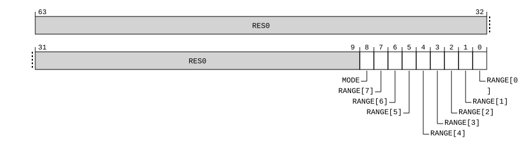

# ​D24.4.52 TRCQCTLR, Trace Q Element Control Register

Source: <https://developer.arm.com/documentation/ddi0487/mc/-Part-D-The-AArch64-System-Level-Architecture/-Chapter-D24-AArch64-System-Register-Descriptions/-D24-4-Trace-registers/-D24-4-52-TRCQCTLR--Trace-Q-Element-Control-Register>

##### D24.4.52 TRCQCTLR, Trace Q Element Control Register

The TRCQCTLR characteristics are:

Purpose
:   Controls when Q elements are enabled.

Configuration
:   AArch64 System register TRCQCTLR bits [31:0] are architecturally mapped to External register [TRCQCTLR](/documentation/ddi0487/mc/-Part-H-External-Debug/-Chapter-H9-External-Debug-Register-Descriptions/-H9-3-External-trace-registers/-H9-3-61-TRCQCTLR--Trace-Q-Element-Control-Register?lang=en#reg_ext_trcqctlr)[31:0].

    This register is present only when FEAT\_ETE is implemented, System register access to the trace unit registers is implemented, and TRCIDR0.QFILT == ‘1’. Otherwise, direct accesses to TRCQCTLR are UNDEFINED.

Attributes
:   TRCQCTLR is a 64-bit register.

###### Field descriptions



Bits [63:9]
:   Reserved, RES0.

MODE, bit [8]
:   Selects whether the Address Range Comparators selected by TRCQCTLR.RANGE indicate address ranges where the trace unit is permitted to generate Q elements or address ranges where the trace unit is not permitted to generate Q elements:

<table>
 <colgroup>
  <col/>
  <col/>
 </colgroup>
 <thead>
  <tr>
   <th>
    <strong>
     MODE
    </strong>
   </th>
   <th>
    <strong>
     Meaning
    </strong>
   </th>
  </tr>
 </thead>
 <tbody>
  <tr>
   <td>
    <p>
     <code>
      0b0
     </code>
    </p>
   </td>
   <td>
    <p>
     Exclude mode.
    </p>
    <p>
     The Address Range Comparators selected by TRCQCTLR.RANGE indicate address ranges where the trace unit must not generate Q elements. If no ranges are selected, Q elements are permitted across the entire memory map.
    </p>
   </td>
  </tr>
  <tr>
   <td>
    <p>
     <code>
      0b1
     </code>
    </p>
   </td>
   <td>
    <p>
     Include Mode.
    </p>
    <p>
     The Address Range Comparators selected by TRCQCTLR.RANGE indicate address ranges where the trace unit can generate Q elements. If all the implemented bits in RANGE are set to 0 then Q elements are disabled.
    </p>
   </td>
  </tr>
 </tbody>
</table>

    The reset behavior of this field is:

    - On a Trace unit reset, this field resets to an architecturally UNKNOWN value.

RANGE[<m>] , bits [m], for m = 7 to 0
:   Specifies whether Address Range Comparator <m> controls Q elements.

<table>
 <colgroup>
  <col/>
  <col/>
 </colgroup>
 <thead>
  <tr>
   <th>
    <strong>
     RANGE[&lt;m&gt;]
    </strong>
   </th>
   <th>
    <strong>
     Meaning
    </strong>
   </th>
  </tr>
 </thead>
 <tbody>
  <tr>
   <td>
    <p>
     <code>
      0b0
     </code>
    </p>
   </td>
   <td>
    <p>
     The address range that Address Range Comparator &lt;m&gt; defines is not selected.
    </p>
   </td>
  </tr>
  <tr>
   <td>
    <p>
     <code>
      0b1
     </code>
    </p>
   </td>
   <td>
    <p>
     The address range that Address Range Comparator &lt;m&gt; defines is selected.
    </p>
   </td>
  </tr>
 </tbody>
</table>

    The reset behavior of this field is:

    - On a Trace unit reset, this field resets to an architecturally UNKNOWN value.

    Accessing this field has the following behavior:

    - When m >= UInt(TRCIDR4.NUMACPAIRS), access to this field is RES0.
    - Otherwise, access to this field is RW.

###### Accessing TRCQCTLR

Must be programmed if [TRCCONFIGR](/documentation/ddi0487/mc/-Part-D-The-AArch64-System-Level-Architecture/-Chapter-D24-AArch64-System-Register-Descriptions/-D24-4-Trace-registers/-D24-4-25-TRCCONFIGR--Trace-Configuration-Register?lang=en#reg_aarch64_trcconfigr).QE != `0b00`.

If the trace unit is not in the Idle state it is CONSTRAINED UNPREDICTABLE whether writes to this register are ignored.

Accesses to this register use the following encodings in the System register encoding space:

###### `MRS <Xt>, TRCQCTLR`

<table>
 <colgroup>
  <col/>
  <col/>
  <col/>
  <col/>
  <col/>
 </colgroup>
 <thead>
  <tr>
   <th>
    <strong>
     op0
    </strong>
   </th>
   <th>
    <strong>
     op1
    </strong>
   </th>
   <th>
    <strong>
     CRn
    </strong>
   </th>
   <th>
    <strong>
     CRm
    </strong>
   </th>
   <th>
    <strong>
     op2
    </strong>
   </th>
  </tr>
 </thead>
 <tbody>
  <tr>
   <td>
    <p>
     <code>
      0b10
     </code>
    </p>
   </td>
   <td>
    <p>
     <code>
      0b001
     </code>
    </p>
   </td>
   <td>
    <p>
     <code>
      0b0000
     </code>
    </p>
   </td>
   <td>
    <p>
     <code>
      0b0001
     </code>
    </p>
   </td>
   <td>
    <p>
     <code>
      0b001
     </code>
    </p>
   </td>
  </tr>
 </tbody>
</table>

```
if !(IsFeatureImplemented(FEAT_ETE) && IsFeatureImplemented(FEAT_TRC_SR) && TRCIDR0().QFILT == '1') then
    Undefined();
elsif HaveEL(EL3) && !(EffectivelyAtEL0InHost() || EffectivelyAtEL0NotInHost() || PSTATE.EL == EL3) && EL3SDDUndefPriority() && CPTR_EL3().TTA == '1' then
    Undefined();
elsif PSTATE.EL == EL0 then
    Undefined();
elsif PSTATE.EL == EL1 then
    if CPACR_EL1().TTA == '1' then
        AArch64_SystemAccessTrap(EL1, 0x18);
    elsif EL2Enabled() && CPTR_EL2().TTA == '1' then
        AArch64_SystemAccessTrap(EL2, 0x18);
    elsif EL2Enabled() && IsFeatureImplemented(FEAT_FGT) && (!HaveEL(EL3) || SCR_EL3().FGTEn == '1') && HDFGRTR_EL2().TRC == '1' then
        AArch64_SystemAccessTrap(EL2, 0x18);
    elsif HaveEL(EL3) && CPTR_EL3().TTA == '1' then
        if EL3SDDUndef() then
            Undefined();
        else
            AArch64_SystemAccessTrap(EL3, 0x18);
        end;
    elsif IsFeatureImplemented(FEAT_TRBE_EXT) && OSLSR_EL1().OSLK == '0' && HaltingAllowed() && EDSCR2().TTA == '1' then
        Halt(DebugHalt_SoftwareAccess);
    else
        X{64}(t) = TRCQCTLR();
    end;
elsif PSTATE.EL == EL2 then
    if CPTR_EL2().TTA == '1' then
        AArch64_SystemAccessTrap(EL2, 0x18);
    elsif HaveEL(EL3) && CPTR_EL3().TTA == '1' then
        if EL3SDDUndef() then
            Undefined();
        else
            AArch64_SystemAccessTrap(EL3, 0x18);
        end;
    elsif IsFeatureImplemented(FEAT_TRBE_EXT) && OSLSR_EL1().OSLK == '0' && HaltingAllowed() && EDSCR2().TTA == '1' then
        Halt(DebugHalt_SoftwareAccess);
    else
        X{64}(t) = TRCQCTLR();
    end;
elsif PSTATE.EL == EL3 then
    if CPTR_EL3().TTA == '1' then
        AArch64_SystemAccessTrap(EL3, 0x18);
    elsif IsFeatureImplemented(FEAT_TRBE_EXT) && OSLSR_EL1().OSLK == '0' && HaltingAllowed() && EDSCR2().TTA == '1' then
        Halt(DebugHalt_SoftwareAccess);
    else
        X{64}(t) = TRCQCTLR();
    end;
end;
```

###### `MSR TRCQCTLR, <Xt>`

<table>
 <colgroup>
  <col/>
  <col/>
  <col/>
  <col/>
  <col/>
 </colgroup>
 <thead>
  <tr>
   <th>
    <strong>
     op0
    </strong>
   </th>
   <th>
    <strong>
     op1
    </strong>
   </th>
   <th>
    <strong>
     CRn
    </strong>
   </th>
   <th>
    <strong>
     CRm
    </strong>
   </th>
   <th>
    <strong>
     op2
    </strong>
   </th>
  </tr>
 </thead>
 <tbody>
  <tr>
   <td>
    <p>
     <code>
      0b10
     </code>
    </p>
   </td>
   <td>
    <p>
     <code>
      0b001
     </code>
    </p>
   </td>
   <td>
    <p>
     <code>
      0b0000
     </code>
    </p>
   </td>
   <td>
    <p>
     <code>
      0b0001
     </code>
    </p>
   </td>
   <td>
    <p>
     <code>
      0b001
     </code>
    </p>
   </td>
  </tr>
 </tbody>
</table>

```
if !(IsFeatureImplemented(FEAT_ETE) && IsFeatureImplemented(FEAT_TRC_SR) && TRCIDR0().QFILT == '1') then
    Undefined();
elsif HaveEL(EL3) && !(EffectivelyAtEL0InHost() || EffectivelyAtEL0NotInHost() || PSTATE.EL == EL3) && EL3SDDUndefPriority() && CPTR_EL3().TTA == '1' then
    Undefined();
elsif PSTATE.EL == EL0 then
    Undefined();
elsif PSTATE.EL == EL1 then
    if CPACR_EL1().TTA == '1' then
        AArch64_SystemAccessTrap(EL1, 0x18);
    elsif EL2Enabled() && CPTR_EL2().TTA == '1' then
        AArch64_SystemAccessTrap(EL2, 0x18);
    elsif EL2Enabled() && IsFeatureImplemented(FEAT_FGT) && (!HaveEL(EL3) || SCR_EL3().FGTEn == '1') && HDFGWTR_EL2().TRC == '1' then
        AArch64_SystemAccessTrap(EL2, 0x18);
    elsif HaveEL(EL3) && CPTR_EL3().TTA == '1' then
        if EL3SDDUndef() then
            Undefined();
        else
            AArch64_SystemAccessTrap(EL3, 0x18);
        end;
    elsif IsFeatureImplemented(FEAT_TRBE_EXT) && OSLSR_EL1().OSLK == '0' && HaltingAllowed() && EDSCR2().TTA == '1' then
        Halt(DebugHalt_SoftwareAccess);
    else
        TRCQCTLR() = X{64}(t);
    end;
elsif PSTATE.EL == EL2 then
    if CPTR_EL2().TTA == '1' then
        AArch64_SystemAccessTrap(EL2, 0x18);
    elsif HaveEL(EL3) && CPTR_EL3().TTA == '1' then
        if EL3SDDUndef() then
            Undefined();
        else
            AArch64_SystemAccessTrap(EL3, 0x18);
        end;
    elsif IsFeatureImplemented(FEAT_TRBE_EXT) && OSLSR_EL1().OSLK == '0' && HaltingAllowed() && EDSCR2().TTA == '1' then
        Halt(DebugHalt_SoftwareAccess);
    else
        TRCQCTLR() = X{64}(t);
    end;
elsif PSTATE.EL == EL3 then
    if CPTR_EL3().TTA == '1' then
        AArch64_SystemAccessTrap(EL3, 0x18);
    elsif IsFeatureImplemented(FEAT_TRBE_EXT) && OSLSR_EL1().OSLK == '0' && HaltingAllowed() && EDSCR2().TTA == '1' then
        Halt(DebugHalt_SoftwareAccess);
    else
        TRCQCTLR() = X{64}(t);
    end;
end;
```
