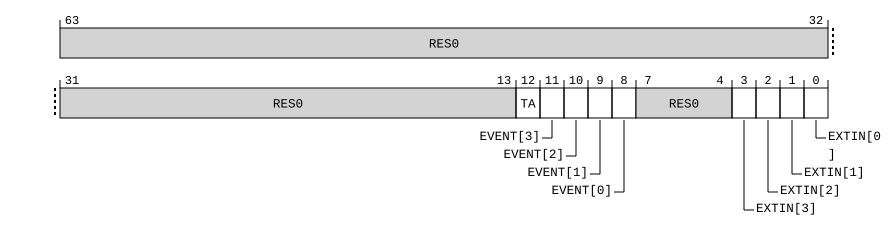

# ​D24.4.54 TRCRSR, Trace Resources Status Register

Source: <https://developer.arm.com/documentation/ddi0487/mc/-Part-D-The-AArch64-System-Level-Architecture/-Chapter-D24-AArch64-System-Register-Descriptions/-D24-4-Trace-registers/-D24-4-54-TRCRSR--Trace-Resources-Status-Register>

##### D24.4.54 TRCRSR, Trace Resources Status Register

The TRCRSR characteristics are:

Purpose
:   Use this to set, or read, the status of the resources.

Configuration
:   AArch64 System register TRCRSR bits [31:0] are architecturally mapped to External register [TRCRSR](/documentation/ddi0487/mc/-Part-H-External-Debug/-Chapter-H9-External-Debug-Register-Descriptions/-H9-3-External-trace-registers/-H9-3-63-TRCRSR--Trace-Resources-Status-Register?lang=en#reg_ext_trcrsr)[31:0].

    This register is present only when FEAT\_ETE is implemented and System register access to the trace unit registers is implemented. Otherwise, direct accesses to TRCRSR are UNDEFINED.

Attributes
:   TRCRSR is a 64-bit register.

###### Field descriptions



Bits [63:13]
:   Reserved, RES0.

TA, bit [12]
:   Tracing active.

<table>
 <colgroup>
  <col/>
  <col/>
 </colgroup>
 <thead>
  <tr>
   <th>
    <strong>
     TA
    </strong>
   </th>
   <th>
    <strong>
     Meaning
    </strong>
   </th>
  </tr>
 </thead>
 <tbody>
  <tr>
   <td>
    <p>
     <code>
      0b0
     </code>
    </p>
   </td>
   <td>
    <p>
     Tracing is not active.
    </p>
   </td>
  </tr>
  <tr>
   <td>
    <p>
     <code>
      0b1
     </code>
    </p>
   </td>
   <td>
    <p>
     Tracing is active.
    </p>
   </td>
  </tr>
 </tbody>
</table>

    The reset behavior of this field is:

    - On a Trace unit reset, this field resets to an architecturally UNKNOWN value.

EVENT[<m>] , bits [m+8], for m = 3 to 0
:   Untraced status of ETEEvents.

<table>
 <colgroup>
  <col/>
  <col/>
 </colgroup>
 <thead>
  <tr>
   <th>
    <strong>
     EVENT[&lt;m&gt;]
    </strong>
   </th>
   <th>
    <strong>
     Meaning
    </strong>
   </th>
  </tr>
 </thead>
 <tbody>
  <tr>
   <td>
    <p>
     <code>
      0b0
     </code>
    </p>
   </td>
   <td>
    <p>
     An ETEEvent &lt;m&gt; has not occurred.
    </p>
   </td>
  </tr>
  <tr>
   <td>
    <p>
     <code>
      0b1
     </code>
    </p>
   </td>
   <td>
    <p>
     An ETEEvent &lt;m&gt; has occurred while the resources were in the Paused state.
    </p>
   </td>
  </tr>
 </tbody>
</table>

    The reset behavior of this field is:

    - On a Trace unit reset, this field resets to an architecturally UNKNOWN value.

    Accessing this field has the following behavior:

    - When TRCIDR4.NUMRSPAIR == ‘0000’, access to this field is RES0.
    - Access to this field is RES0 if all of the following are true:
      - TRCIDR4.NUMRSPAIR != ‘0000’
      - m > UInt(TRCIDR0.NUMEVENT)
    - Otherwise, access to this field is RW.

Bits [7:4]
:   Reserved, RES0.

EXTIN[<m>] , bits [m], for m = 3 to 0
:   The sticky status of the External Input Selectors.

<table>
 <colgroup>
  <col/>
  <col/>
 </colgroup>
 <thead>
  <tr>
   <th>
    <strong>
     EXTIN[&lt;m&gt;]
    </strong>
   </th>
   <th>
    <strong>
     Meaning
    </strong>
   </th>
  </tr>
 </thead>
 <tbody>
  <tr>
   <td>
    <p>
     <code>
      0b0
     </code>
    </p>
   </td>
   <td>
    <p>
     An event selected by External Input Selector &lt;m&gt; has not occurred.
    </p>
   </td>
  </tr>
  <tr>
   <td>
    <p>
     <code>
      0b1
     </code>
    </p>
   </td>
   <td>
    <p>
     At least one event selected by External Input Selector &lt;m&gt; has occurred while the resources were in the Paused state.
    </p>
   </td>
  </tr>
 </tbody>
</table>

    The reset behavior of this field is:

    - On a Trace unit reset, this field resets to an architecturally UNKNOWN value.

    Accessing this field has the following behavior:

    - When m >= UInt(TRCIDR5.NUMEXTINSEL), access to this field is RES0.
    - Otherwise, access to this field is RW.

###### Accessing TRCRSR

Must always be programmed.

If the trace unit is not in the Idle state it is CONSTRAINED UNPREDICTABLE whether writes to this register are ignored.

Reads from this register might return an UNKNOWN value if the trace unit is not in either of the Idle or Stable states.

Accesses to this register use the following encodings in the System register encoding space:

###### `MRS <Xt>, TRCRSR`

<table>
 <colgroup>
  <col/>
  <col/>
  <col/>
  <col/>
  <col/>
 </colgroup>
 <thead>
  <tr>
   <th>
    <strong>
     op0
    </strong>
   </th>
   <th>
    <strong>
     op1
    </strong>
   </th>
   <th>
    <strong>
     CRn
    </strong>
   </th>
   <th>
    <strong>
     CRm
    </strong>
   </th>
   <th>
    <strong>
     op2
    </strong>
   </th>
  </tr>
 </thead>
 <tbody>
  <tr>
   <td>
    <p>
     <code>
      0b10
     </code>
    </p>
   </td>
   <td>
    <p>
     <code>
      0b001
     </code>
    </p>
   </td>
   <td>
    <p>
     <code>
      0b0000
     </code>
    </p>
   </td>
   <td>
    <p>
     <code>
      0b1010
     </code>
    </p>
   </td>
   <td>
    <p>
     <code>
      0b000
     </code>
    </p>
   </td>
  </tr>
 </tbody>
</table>

```
if !(IsFeatureImplemented(FEAT_ETE) && IsFeatureImplemented(FEAT_TRC_SR)) then
    Undefined();
elsif HaveEL(EL3) && !(EffectivelyAtEL0InHost() || EffectivelyAtEL0NotInHost() || PSTATE.EL == EL3) && EL3SDDUndefPriority() && CPTR_EL3().TTA == '1' then
    Undefined();
elsif PSTATE.EL == EL0 then
    Undefined();
elsif PSTATE.EL == EL1 then
    if CPACR_EL1().TTA == '1' then
        AArch64_SystemAccessTrap(EL1, 0x18);
    elsif EL2Enabled() && CPTR_EL2().TTA == '1' then
        AArch64_SystemAccessTrap(EL2, 0x18);
    elsif EL2Enabled() && IsFeatureImplemented(FEAT_FGT) && (!HaveEL(EL3) || SCR_EL3().FGTEn == '1') && HDFGRTR_EL2().TRC == '1' then
        AArch64_SystemAccessTrap(EL2, 0x18);
    elsif HaveEL(EL3) && CPTR_EL3().TTA == '1' then
        if EL3SDDUndef() then
            Undefined();
        else
            AArch64_SystemAccessTrap(EL3, 0x18);
        end;
    elsif IsFeatureImplemented(FEAT_TRBE_EXT) && OSLSR_EL1().OSLK == '0' && HaltingAllowed() && EDSCR2().TTA == '1' then
        Halt(DebugHalt_SoftwareAccess);
    else
        X{64}(t) = TRCRSR();
    end;
elsif PSTATE.EL == EL2 then
    if CPTR_EL2().TTA == '1' then
        AArch64_SystemAccessTrap(EL2, 0x18);
    elsif HaveEL(EL3) && CPTR_EL3().TTA == '1' then
        if EL3SDDUndef() then
            Undefined();
        else
            AArch64_SystemAccessTrap(EL3, 0x18);
        end;
    elsif IsFeatureImplemented(FEAT_TRBE_EXT) && OSLSR_EL1().OSLK == '0' && HaltingAllowed() && EDSCR2().TTA == '1' then
        Halt(DebugHalt_SoftwareAccess);
    else
        X{64}(t) = TRCRSR();
    end;
elsif PSTATE.EL == EL3 then
    if CPTR_EL3().TTA == '1' then
        AArch64_SystemAccessTrap(EL3, 0x18);
    elsif IsFeatureImplemented(FEAT_TRBE_EXT) && OSLSR_EL1().OSLK == '0' && HaltingAllowed() && EDSCR2().TTA == '1' then
        Halt(DebugHalt_SoftwareAccess);
    else
        X{64}(t) = TRCRSR();
    end;
end;
```

###### `MSR TRCRSR, <Xt>`

<table>
 <colgroup>
  <col/>
  <col/>
  <col/>
  <col/>
  <col/>
 </colgroup>
 <thead>
  <tr>
   <th>
    <strong>
     op0
    </strong>
   </th>
   <th>
    <strong>
     op1
    </strong>
   </th>
   <th>
    <strong>
     CRn
    </strong>
   </th>
   <th>
    <strong>
     CRm
    </strong>
   </th>
   <th>
    <strong>
     op2
    </strong>
   </th>
  </tr>
 </thead>
 <tbody>
  <tr>
   <td>
    <p>
     <code>
      0b10
     </code>
    </p>
   </td>
   <td>
    <p>
     <code>
      0b001
     </code>
    </p>
   </td>
   <td>
    <p>
     <code>
      0b0000
     </code>
    </p>
   </td>
   <td>
    <p>
     <code>
      0b1010
     </code>
    </p>
   </td>
   <td>
    <p>
     <code>
      0b000
     </code>
    </p>
   </td>
  </tr>
 </tbody>
</table>

```
if !(IsFeatureImplemented(FEAT_ETE) && IsFeatureImplemented(FEAT_TRC_SR)) then
    Undefined();
elsif HaveEL(EL3) && !(EffectivelyAtEL0InHost() || EffectivelyAtEL0NotInHost() || PSTATE.EL == EL3) && EL3SDDUndefPriority() && CPTR_EL3().TTA == '1' then
    Undefined();
elsif PSTATE.EL == EL0 then
    Undefined();
elsif PSTATE.EL == EL1 then
    if CPACR_EL1().TTA == '1' then
        AArch64_SystemAccessTrap(EL1, 0x18);
    elsif EL2Enabled() && CPTR_EL2().TTA == '1' then
        AArch64_SystemAccessTrap(EL2, 0x18);
    elsif EL2Enabled() && IsFeatureImplemented(FEAT_FGT) && (!HaveEL(EL3) || SCR_EL3().FGTEn == '1') && HDFGWTR_EL2().TRC == '1' then
        AArch64_SystemAccessTrap(EL2, 0x18);
    elsif HaveEL(EL3) && CPTR_EL3().TTA == '1' then
        if EL3SDDUndef() then
            Undefined();
        else
            AArch64_SystemAccessTrap(EL3, 0x18);
        end;
    elsif IsFeatureImplemented(FEAT_TRBE_EXT) && OSLSR_EL1().OSLK == '0' && HaltingAllowed() && EDSCR2().TTA == '1' then
        Halt(DebugHalt_SoftwareAccess);
    else
        TRCRSR() = X{64}(t);
    end;
elsif PSTATE.EL == EL2 then
    if CPTR_EL2().TTA == '1' then
        AArch64_SystemAccessTrap(EL2, 0x18);
    elsif HaveEL(EL3) && CPTR_EL3().TTA == '1' then
        if EL3SDDUndef() then
            Undefined();
        else
            AArch64_SystemAccessTrap(EL3, 0x18);
        end;
    elsif IsFeatureImplemented(FEAT_TRBE_EXT) && OSLSR_EL1().OSLK == '0' && HaltingAllowed() && EDSCR2().TTA == '1' then
        Halt(DebugHalt_SoftwareAccess);
    else
        TRCRSR() = X{64}(t);
    end;
elsif PSTATE.EL == EL3 then
    if CPTR_EL3().TTA == '1' then
        AArch64_SystemAccessTrap(EL3, 0x18);
    elsif IsFeatureImplemented(FEAT_TRBE_EXT) && OSLSR_EL1().OSLK == '0' && HaltingAllowed() && EDSCR2().TTA == '1' then
        Halt(DebugHalt_SoftwareAccess);
    else
        TRCRSR() = X{64}(t);
    end;
end;
```
