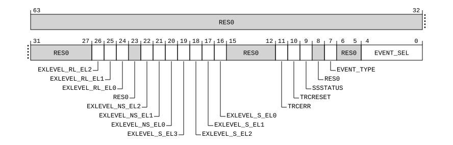

# ​D24.4.66 TRCVICTLR, Trace ViewInst Main Control Register

Source: <https://developer.arm.com/documentation/ddi0487/mc/-Part-D-The-AArch64-System-Level-Architecture/-Chapter-D24-AArch64-System-Register-Descriptions/-D24-4-Trace-registers/-D24-4-66-TRCVICTLR--Trace-ViewInst-Main-Control-Register>

##### D24.4.66 TRCVICTLR, Trace ViewInst Main Control Register

The TRCVICTLR characteristics are:

Purpose
:   Controls instruction trace filtering.

Configuration
:   AArch64 System register TRCVICTLR bits [31:0] are architecturally mapped to External register [TRCVICTLR](/documentation/ddi0487/mc/-Part-H-External-Debug/-Chapter-H9-External-Debug-Register-Descriptions/-H9-3-External-trace-registers/-H9-3-75-TRCVICTLR--Trace-ViewInst-Main-Control-Register?lang=en#reg_ext_trcvictlr)[31:0].

    This register is present only when FEAT\_ETE is implemented and System register access to the trace unit registers is implemented. Otherwise, direct accesses to TRCVICTLR are UNDEFINED.

Attributes
:   TRCVICTLR is a 64-bit register.

###### Field descriptions



Bits [63:27]
:   Reserved, RES0.

EXLEVEL\_RL\_EL2, bit [26]
:   When FEAT\_RME is implemented:
    :   Filter instruction trace for EL2 in Realm state.

<table>
 <colgroup>
  <col/>
  <col/>
 </colgroup>
 <thead>
  <tr>
   <th>
    <strong>
     EXLEVEL_RL_EL2
    </strong>
   </th>
   <th>
    <strong>
     Meaning
    </strong>
   </th>
  </tr>
 </thead>
 <tbody>
  <tr>
   <td>
    <p>
     <code>
      0b0
     </code>
    </p>
   </td>
   <td>
    <p>
     When TRCVICTLR.EXLEVEL_NS_EL2 is 0 the trace unit generates instruction trace for EL2 in Realm state.
    </p>
    <p>
     When TRCVICTLR.EXLEVEL_NS_EL2 is 1 the trace unit does not generate instruction trace for EL2 in Realm state.
    </p>
   </td>
  </tr>
  <tr>
   <td>
    <p>
     <code>
      0b1
     </code>
    </p>
   </td>
   <td>
    <p>
     When TRCVICTLR.EXLEVEL_NS_EL2 is 0 the trace unit does not generate instruction trace for EL2 in Realm state.
    </p>
    <p>
     When TRCVICTLR.EXLEVEL_NS_EL2 is 1 the trace unit generates instruction trace for EL2 in Realm state.
    </p>
   </td>
  </tr>
 </tbody>
</table>

        The reset behavior of this field is:

        - On a Trace unit reset, this field resets to an architecturally UNKNOWN value.

    Otherwise:
    :   Reserved, RES0.

EXLEVEL\_RL\_EL1, bit [25]
:   When FEAT\_RME is implemented:
    :   Filter instruction trace for EL1 in Realm state.

<table>
 <colgroup>
  <col/>
  <col/>
 </colgroup>
 <thead>
  <tr>
   <th>
    <strong>
     EXLEVEL_RL_EL1
    </strong>
   </th>
   <th>
    <strong>
     Meaning
    </strong>
   </th>
  </tr>
 </thead>
 <tbody>
  <tr>
   <td>
    <p>
     <code>
      0b0
     </code>
    </p>
   </td>
   <td>
    <p>
     When TRCVICTLR.EXLEVEL_NS_EL1 is 0 the trace unit generates instruction trace for EL1 in Realm state.
    </p>
    <p>
     When TRCVICTLR.EXLEVEL_NS_EL1 is 1 the trace unit does not generate instruction trace for EL1 in Realm state.
    </p>
   </td>
  </tr>
  <tr>
   <td>
    <p>
     <code>
      0b1
     </code>
    </p>
   </td>
   <td>
    <p>
     When TRCVICTLR.EXLEVEL_NS_EL1 is 0 the trace unit does not generate instruction trace for EL1 in Realm state.
    </p>
    <p>
     When TRCVICTLR.EXLEVEL_NS_EL1 is 1 the trace unit generates instruction trace for EL1 in Realm state.
    </p>
   </td>
  </tr>
 </tbody>
</table>

        The reset behavior of this field is:

        - On a Trace unit reset, this field resets to an architecturally UNKNOWN value.

    Otherwise:
    :   Reserved, RES0.

EXLEVEL\_RL\_EL0, bit [24]
:   When FEAT\_RME is implemented:
    :   Filter instruction trace for EL0 in Realm state.

<table>
 <colgroup>
  <col/>
  <col/>
 </colgroup>
 <thead>
  <tr>
   <th>
    <strong>
     EXLEVEL_RL_EL0
    </strong>
   </th>
   <th>
    <strong>
     Meaning
    </strong>
   </th>
  </tr>
 </thead>
 <tbody>
  <tr>
   <td>
    <p>
     <code>
      0b0
     </code>
    </p>
   </td>
   <td>
    <p>
     When TRCVICTLR.EXLEVEL_NS_EL0 is 0 the trace unit generates instruction trace for EL0 in Realm state.
    </p>
    <p>
     When TRCVICTLR.EXLEVEL_NS_EL0 is 1 the trace unit does not generate instruction trace for EL0 in Realm state.
    </p>
   </td>
  </tr>
  <tr>
   <td>
    <p>
     <code>
      0b1
     </code>
    </p>
   </td>
   <td>
    <p>
     When TRCVICTLR.EXLEVEL_NS_EL0 is 0 the trace unit does not generate instruction trace for EL0 in Realm state.
    </p>
    <p>
     When TRCVICTLR.EXLEVEL_NS_EL0 is 1 the trace unit generates instruction trace for EL0 in Realm state.
    </p>
   </td>
  </tr>
 </tbody>
</table>

        The reset behavior of this field is:

        - On a Trace unit reset, this field resets to an architecturally UNKNOWN value.

    Otherwise:
    :   Reserved, RES0.

Bit [23]
:   Reserved, RES0.

EXLEVEL\_NS\_EL2, bit [22]
:   When Non-secure EL2 is implemented:
    :   Filter instruction trace for EL2 in Non-secure state.

<table>
 <colgroup>
  <col/>
  <col/>
 </colgroup>
 <thead>
  <tr>
   <th>
    <strong>
     EXLEVEL_NS_EL2
    </strong>
   </th>
   <th>
    <strong>
     Meaning
    </strong>
   </th>
  </tr>
 </thead>
 <tbody>
  <tr>
   <td>
    <p>
     <code>
      0b0
     </code>
    </p>
   </td>
   <td>
    <p>
     The trace unit generates instruction trace for EL2 in Non-secure state.
    </p>
   </td>
  </tr>
  <tr>
   <td>
    <p>
     <code>
      0b1
     </code>
    </p>
   </td>
   <td>
    <p>
     The trace unit does not generate instruction trace for EL2 in Non-secure state.
    </p>
   </td>
  </tr>
 </tbody>
</table>

        The reset behavior of this field is:

        - On a Trace unit reset, this field resets to an architecturally UNKNOWN value.

    Otherwise:
    :   Reserved, RES0.

EXLEVEL\_NS\_EL1, bit [21]
:   When Non-secure EL1 is implemented:
    :   Filter instruction trace for EL1 in Non-secure state.

<table>
 <colgroup>
  <col/>
  <col/>
 </colgroup>
 <thead>
  <tr>
   <th>
    <strong>
     EXLEVEL_NS_EL1
    </strong>
   </th>
   <th>
    <strong>
     Meaning
    </strong>
   </th>
  </tr>
 </thead>
 <tbody>
  <tr>
   <td>
    <p>
     <code>
      0b0
     </code>
    </p>
   </td>
   <td>
    <p>
     The trace unit generates instruction trace for EL1 in Non-secure state.
    </p>
   </td>
  </tr>
  <tr>
   <td>
    <p>
     <code>
      0b1
     </code>
    </p>
   </td>
   <td>
    <p>
     The trace unit does not generate instruction trace for EL1 in Non-secure state.
    </p>
   </td>
  </tr>
 </tbody>
</table>

        The reset behavior of this field is:

        - On a Trace unit reset, this field resets to an architecturally UNKNOWN value.

    Otherwise:
    :   Reserved, RES0.

EXLEVEL\_NS\_EL0, bit [20]
:   When Non-secure EL0 is implemented:
    :   Filter instruction trace for EL0 in Non-secure state.

<table>
 <colgroup>
  <col/>
  <col/>
 </colgroup>
 <thead>
  <tr>
   <th>
    <strong>
     EXLEVEL_NS_EL0
    </strong>
   </th>
   <th>
    <strong>
     Meaning
    </strong>
   </th>
  </tr>
 </thead>
 <tbody>
  <tr>
   <td>
    <p>
     <code>
      0b0
     </code>
    </p>
   </td>
   <td>
    <p>
     The trace unit generates instruction trace for EL0 in Non-secure state.
    </p>
   </td>
  </tr>
  <tr>
   <td>
    <p>
     <code>
      0b1
     </code>
    </p>
   </td>
   <td>
    <p>
     The trace unit does not generate instruction trace for EL0 in Non-secure state.
    </p>
   </td>
  </tr>
 </tbody>
</table>

        The reset behavior of this field is:

        - On a Trace unit reset, this field resets to an architecturally UNKNOWN value.

    Otherwise:
    :   Reserved, RES0.

EXLEVEL\_S\_EL3, bit [19]
:   When EL3 is implemented:
    :   Filter instruction trace for EL3.

<table>
 <colgroup>
  <col/>
  <col/>
 </colgroup>
 <thead>
  <tr>
   <th>
    <strong>
     EXLEVEL_S_EL3
    </strong>
   </th>
   <th>
    <strong>
     Meaning
    </strong>
   </th>
  </tr>
 </thead>
 <tbody>
  <tr>
   <td>
    <p>
     <code>
      0b0
     </code>
    </p>
   </td>
   <td>
    <p>
     The trace unit generates instruction trace for EL3.
    </p>
   </td>
  </tr>
  <tr>
   <td>
    <p>
     <code>
      0b1
     </code>
    </p>
   </td>
   <td>
    <p>
     The trace unit does not generate instruction trace for EL3.
    </p>
   </td>
  </tr>
 </tbody>
</table>

        The reset behavior of this field is:

        - On a Trace unit reset, this field resets to an architecturally UNKNOWN value.

    Otherwise:
    :   Reserved, RES0.

EXLEVEL\_S\_EL2, bit [18]
:   When Secure EL2 is implemented:
    :   Filter instruction trace for EL2 in Secure state.

<table>
 <colgroup>
  <col/>
  <col/>
 </colgroup>
 <thead>
  <tr>
   <th>
    <strong>
     EXLEVEL_S_EL2
    </strong>
   </th>
   <th>
    <strong>
     Meaning
    </strong>
   </th>
  </tr>
 </thead>
 <tbody>
  <tr>
   <td>
    <p>
     <code>
      0b0
     </code>
    </p>
   </td>
   <td>
    <p>
     The trace unit generates instruction trace for EL2 in Secure state.
    </p>
   </td>
  </tr>
  <tr>
   <td>
    <p>
     <code>
      0b1
     </code>
    </p>
   </td>
   <td>
    <p>
     The trace unit does not generate instruction trace for EL2 in Secure state.
    </p>
   </td>
  </tr>
 </tbody>
</table>

        The reset behavior of this field is:

        - On a Trace unit reset, this field resets to an architecturally UNKNOWN value.

    Otherwise:
    :   Reserved, RES0.

EXLEVEL\_S\_EL1, bit [17]
:   When Secure EL1 is implemented:
    :   Filter instruction trace for EL1 in Secure state.

<table>
 <colgroup>
  <col/>
  <col/>
 </colgroup>
 <thead>
  <tr>
   <th>
    <strong>
     EXLEVEL_S_EL1
    </strong>
   </th>
   <th>
    <strong>
     Meaning
    </strong>
   </th>
  </tr>
 </thead>
 <tbody>
  <tr>
   <td>
    <p>
     <code>
      0b0
     </code>
    </p>
   </td>
   <td>
    <p>
     The trace unit generates instruction trace for EL1 in Secure state.
    </p>
   </td>
  </tr>
  <tr>
   <td>
    <p>
     <code>
      0b1
     </code>
    </p>
   </td>
   <td>
    <p>
     The trace unit does not generate instruction trace for EL1 in Secure state.
    </p>
   </td>
  </tr>
 </tbody>
</table>

        The reset behavior of this field is:

        - On a Trace unit reset, this field resets to an architecturally UNKNOWN value.

    Otherwise:
    :   Reserved, RES0.

EXLEVEL\_S\_EL0, bit [16]
:   When Secure EL0 is implemented:
    :   Filter instruction trace for EL0 in Secure state.

<table>
 <colgroup>
  <col/>
  <col/>
 </colgroup>
 <thead>
  <tr>
   <th>
    <strong>
     EXLEVEL_S_EL0
    </strong>
   </th>
   <th>
    <strong>
     Meaning
    </strong>
   </th>
  </tr>
 </thead>
 <tbody>
  <tr>
   <td>
    <p>
     <code>
      0b0
     </code>
    </p>
   </td>
   <td>
    <p>
     The trace unit generates instruction trace for EL0 in Secure state.
    </p>
   </td>
  </tr>
  <tr>
   <td>
    <p>
     <code>
      0b1
     </code>
    </p>
   </td>
   <td>
    <p>
     The trace unit does not generate instruction trace for EL0 in Secure state.
    </p>
   </td>
  </tr>
 </tbody>
</table>

        The reset behavior of this field is:

        - On a Trace unit reset, this field resets to an architecturally UNKNOWN value.

    Otherwise:
    :   Reserved, RES0.

Bits [15:12]
:   Reserved, RES0.

TRCERR, bit [11]
:   When TRCIDR3.TRCERR == '1':
    :   Controls the forced tracing of System Error exceptions.

<table>
 <colgroup>
  <col/>
  <col/>
 </colgroup>
 <thead>
  <tr>
   <th>
    <strong>
     TRCERR
    </strong>
   </th>
   <th>
    <strong>
     Meaning
    </strong>
   </th>
  </tr>
 </thead>
 <tbody>
  <tr>
   <td>
    <p>
     <code>
      0b0
     </code>
    </p>
   </td>
   <td>
    <p>
     Forced tracing of System Error exceptions is disabled.
    </p>
   </td>
  </tr>
  <tr>
   <td>
    <p>
     <code>
      0b1
     </code>
    </p>
   </td>
   <td>
    <p>
     Forced tracing of System Error exceptions is enabled.
    </p>
   </td>
  </tr>
 </tbody>
</table>

        The reset behavior of this field is:

        - On a Trace unit reset, this field resets to an architecturally UNKNOWN value.

    Otherwise:
    :   Reserved, RES0.

TRCRESET, bit [10]
:   Controls the forced tracing of PE Resets.

<table>
 <colgroup>
  <col/>
  <col/>
 </colgroup>
 <thead>
  <tr>
   <th>
    <strong>
     TRCRESET
    </strong>
   </th>
   <th>
    <strong>
     Meaning
    </strong>
   </th>
  </tr>
 </thead>
 <tbody>
  <tr>
   <td>
    <p>
     <code>
      0b0
     </code>
    </p>
   </td>
   <td>
    <p>
     Forced tracing of PE Resets is disabled.
    </p>
   </td>
  </tr>
  <tr>
   <td>
    <p>
     <code>
      0b1
     </code>
    </p>
   </td>
   <td>
    <p>
     Forced tracing of PE Resets is enabled.
    </p>
   </td>
  </tr>
 </tbody>
</table>

    The reset behavior of this field is:

    - On a Trace unit reset, this field resets to an architecturally UNKNOWN value.

SSSTATUS, bit [9]
:   ViewInst start/stop function status.

<table>
 <colgroup>
  <col/>
  <col/>
 </colgroup>
 <thead>
  <tr>
   <th>
    <strong>
     SSSTATUS
    </strong>
   </th>
   <th>
    <strong>
     Meaning
    </strong>
   </th>
  </tr>
 </thead>
 <tbody>
  <tr>
   <td>
    <p>
     <code>
      0b0
     </code>
    </p>
   </td>
   <td>
    <p>
     Stopped State.
    </p>
    <p>
     The ViewInst start/stop function is in the stopped state.
    </p>
   </td>
  </tr>
  <tr>
   <td>
    <p>
     <code>
      0b1
     </code>
    </p>
   </td>
   <td>
    <p>
     Started State.
    </p>
    <p>
     The ViewInst start/stop function is in the started state.
    </p>
   </td>
  </tr>
 </tbody>
</table>

    Before software enables the trace unit, it must write to this field to set the initial state of the ViewInst start/stop function. If the ViewInst start/stop function is not used then set this field to 1. Arm recommends that the value of this field is set before each trace session begins.

    If the trace unit becomes disabled while a start point or stop point is still speculative, then the value of TRCVICTLR.SSSTATUS is UNKNOWN and might represent the result of a speculative start point or stop point.

    If software which is running on the PE being traced disables the trace unit, either by clearing [TRCPRGCTLR](/documentation/ddi0487/mc/-Part-D-The-AArch64-System-Level-Architecture/-Chapter-D24-AArch64-System-Register-Descriptions/-D24-4-Trace-registers/-D24-4-51-TRCPRGCTLR--Trace-Programming-Control-Register?lang=en#reg_aarch64_trcprgctlr).EN or locking the OS Lock, Arm recommends that a DSB and an ISB instruction are executed before disabling the trace unit to prevent any start points or stop points being speculative at the point of disabling the trace unit. This procedure assumes that all start points or stop points occur before the barrier instructions are executed. The procedure does not guarantee that there are no speculative start points or stop points when disabling, although it helps minimize the probability.

    The reset behavior of this field is:

    - On a Trace unit reset, this field resets to an architecturally UNKNOWN value.

    Accessing this field has the following behavior:

    - Access to this field is RES1 if all of the following are true:
      - TRCIDR4.NUMACPAIRS == ‘0000’
      - TRCIDR4.NUMPC == ‘0000’
    - Otherwise, access to this field is RW.

Bit [8]
:   Reserved, RES0.

EVENT\_TYPE, bit [7]
:   When TRCIDR4.NUMRSPAIR != '0000':
    :   Chooses the type of Resource Selector.

<table>
 <colgroup>
  <col/>
  <col/>
 </colgroup>
 <thead>
  <tr>
   <th>
    <strong>
     EVENT_TYPE
    </strong>
   </th>
   <th>
    <strong>
     Meaning
    </strong>
   </th>
  </tr>
 </thead>
 <tbody>
  <tr>
   <td>
    <p>
     <code>
      0b0
     </code>
    </p>
   </td>
   <td>
    <p>
     A single Resource Selector.
    </p>
    <p>
     TRCVICTLR.EVENT.SEL[4:0] selects the single Resource Selector, from 0-31, used to activate the resource event.
    </p>
   </td>
  </tr>
  <tr>
   <td>
    <p>
     <code>
      0b1
     </code>
    </p>
   </td>
   <td>
    <p>
     A Boolean-combined pair of Resource Selectors.
    </p>
    <p>
     TRCVICTLR.EVENT.SEL[3:0] selects the Resource Selector pair, from 0-15, that has a Boolean function that is applied to it whose output is used to activate the resource event. TRCVICTLR.EVENT.SEL[4] is
     <small>
      RES0
     </small>
     .
    </p>
   </td>
  </tr>
 </tbody>
</table>

        The reset behavior of this field is:

        - On a Trace unit reset, this field resets to an architecturally UNKNOWN value.

    Otherwise:
    :   Reserved, RES0.

Bits [6:5]
:   Reserved, RES0.

Bits [4:0]
:   When TRCIDR4.NUMRSPAIR != '0000':

    EVENT\_SEL, bits [4:0]
    :   Defines the selected Resource Selector or pair of Resource Selectors. TRCVICTLR.EVENT.TYPE controls whether TRCVICTLR.EVENT.SEL is the index of a single Resource Selector, or the index of a pair of Resource Selectors.

        If an unimplemented Resource Selector is selected using this field, the behavior of the resource event is UNPREDICTABLE, and the resource event might fire or might not fire when the resources are not in the Paused state.

        If an unimplemented Resource Selector is selected using this field, the value returned on a direct read of this field is UNKNOWN.

        Selecting Resource Selector pair 0 using this field is UNPREDICTABLE, and the resource event might fire or might not fire when the resources are not in the Paused state.

        The reset behavior of this field is:

        - On a Trace unit reset, this field resets to an architecturally UNKNOWN value.

    When TRCIDR4.NUMRSPAIR == '0000':

    Reserved, bits [4:0]
    :   This field is reserved:

        - Bits [4:1] are RES0.
        - Bit [0] is RES1.

    Otherwise:
    :   Reserved, RES0.

###### Accessing TRCVICTLR

Must be programmed.

Reads from this register might return an UNKNOWN value if the trace unit is not in either of the Idle or Stable states.

Accesses to this register use the following encodings in the System register encoding space:

###### `MRS <Xt>, TRCVICTLR`

<table>
 <colgroup>
  <col/>
  <col/>
  <col/>
  <col/>
  <col/>
 </colgroup>
 <thead>
  <tr>
   <th>
    <strong>
     op0
    </strong>
   </th>
   <th>
    <strong>
     op1
    </strong>
   </th>
   <th>
    <strong>
     CRn
    </strong>
   </th>
   <th>
    <strong>
     CRm
    </strong>
   </th>
   <th>
    <strong>
     op2
    </strong>
   </th>
  </tr>
 </thead>
 <tbody>
  <tr>
   <td>
    <p>
     <code>
      0b10
     </code>
    </p>
   </td>
   <td>
    <p>
     <code>
      0b001
     </code>
    </p>
   </td>
   <td>
    <p>
     <code>
      0b0000
     </code>
    </p>
   </td>
   <td>
    <p>
     <code>
      0b0000
     </code>
    </p>
   </td>
   <td>
    <p>
     <code>
      0b010
     </code>
    </p>
   </td>
  </tr>
 </tbody>
</table>

```
if !(IsFeatureImplemented(FEAT_ETE) && IsFeatureImplemented(FEAT_TRC_SR)) then
    Undefined();
elsif HaveEL(EL3) && !(EffectivelyAtEL0InHost() || EffectivelyAtEL0NotInHost() || PSTATE.EL == EL3) && EL3SDDUndefPriority() && CPTR_EL3().TTA == '1' then
    Undefined();
elsif PSTATE.EL == EL0 then
    Undefined();
elsif PSTATE.EL == EL1 then
    if CPACR_EL1().TTA == '1' then
        AArch64_SystemAccessTrap(EL1, 0x18);
    elsif EL2Enabled() && CPTR_EL2().TTA == '1' then
        AArch64_SystemAccessTrap(EL2, 0x18);
    elsif EL2Enabled() && IsFeatureImplemented(FEAT_FGT) && (!HaveEL(EL3) || SCR_EL3().FGTEn == '1') && HDFGRTR_EL2().TRCVICTLR == '1' then
        AArch64_SystemAccessTrap(EL2, 0x18);
    elsif HaveEL(EL3) && CPTR_EL3().TTA == '1' then
        if EL3SDDUndef() then
            Undefined();
        else
            AArch64_SystemAccessTrap(EL3, 0x18);
        end;
    elsif IsFeatureImplemented(FEAT_TRBE_EXT) && OSLSR_EL1().OSLK == '0' && HaltingAllowed() && EDSCR2().TTA == '1' then
        Halt(DebugHalt_SoftwareAccess);
    else
        X{64}(t) = TRCVICTLR();
    end;
elsif PSTATE.EL == EL2 then
    if CPTR_EL2().TTA == '1' then
        AArch64_SystemAccessTrap(EL2, 0x18);
    elsif HaveEL(EL3) && CPTR_EL3().TTA == '1' then
        if EL3SDDUndef() then
            Undefined();
        else
            AArch64_SystemAccessTrap(EL3, 0x18);
        end;
    elsif IsFeatureImplemented(FEAT_TRBE_EXT) && OSLSR_EL1().OSLK == '0' && HaltingAllowed() && EDSCR2().TTA == '1' then
        Halt(DebugHalt_SoftwareAccess);
    else
        X{64}(t) = TRCVICTLR();
    end;
elsif PSTATE.EL == EL3 then
    if CPTR_EL3().TTA == '1' then
        AArch64_SystemAccessTrap(EL3, 0x18);
    elsif IsFeatureImplemented(FEAT_TRBE_EXT) && OSLSR_EL1().OSLK == '0' && HaltingAllowed() && EDSCR2().TTA == '1' then
        Halt(DebugHalt_SoftwareAccess);
    else
        X{64}(t) = TRCVICTLR();
    end;
end;
```

###### `MSR TRCVICTLR, <Xt>`

<table>
 <colgroup>
  <col/>
  <col/>
  <col/>
  <col/>
  <col/>
 </colgroup>
 <thead>
  <tr>
   <th>
    <strong>
     op0
    </strong>
   </th>
   <th>
    <strong>
     op1
    </strong>
   </th>
   <th>
    <strong>
     CRn
    </strong>
   </th>
   <th>
    <strong>
     CRm
    </strong>
   </th>
   <th>
    <strong>
     op2
    </strong>
   </th>
  </tr>
 </thead>
 <tbody>
  <tr>
   <td>
    <p>
     <code>
      0b10
     </code>
    </p>
   </td>
   <td>
    <p>
     <code>
      0b001
     </code>
    </p>
   </td>
   <td>
    <p>
     <code>
      0b0000
     </code>
    </p>
   </td>
   <td>
    <p>
     <code>
      0b0000
     </code>
    </p>
   </td>
   <td>
    <p>
     <code>
      0b010
     </code>
    </p>
   </td>
  </tr>
 </tbody>
</table>

```
if !(IsFeatureImplemented(FEAT_ETE) && IsFeatureImplemented(FEAT_TRC_SR)) then
    Undefined();
elsif HaveEL(EL3) && !(EffectivelyAtEL0InHost() || EffectivelyAtEL0NotInHost() || PSTATE.EL == EL3) && EL3SDDUndefPriority() && CPTR_EL3().TTA == '1' then
    Undefined();
elsif PSTATE.EL == EL0 then
    Undefined();
elsif PSTATE.EL == EL1 then
    if CPACR_EL1().TTA == '1' then
        AArch64_SystemAccessTrap(EL1, 0x18);
    elsif EL2Enabled() && CPTR_EL2().TTA == '1' then
        AArch64_SystemAccessTrap(EL2, 0x18);
    elsif EL2Enabled() && IsFeatureImplemented(FEAT_FGT) && (!HaveEL(EL3) || SCR_EL3().FGTEn == '1') && HDFGWTR_EL2().TRCVICTLR == '1' then
        AArch64_SystemAccessTrap(EL2, 0x18);
    elsif HaveEL(EL3) && CPTR_EL3().TTA == '1' then
        if EL3SDDUndef() then
            Undefined();
        else
            AArch64_SystemAccessTrap(EL3, 0x18);
        end;
    elsif IsFeatureImplemented(FEAT_TRBE_EXT) && OSLSR_EL1().OSLK == '0' && HaltingAllowed() && EDSCR2().TTA == '1' then
        Halt(DebugHalt_SoftwareAccess);
    else
        TRCVICTLR() = X{64}(t);
    end;
elsif PSTATE.EL == EL2 then
    if CPTR_EL2().TTA == '1' then
        AArch64_SystemAccessTrap(EL2, 0x18);
    elsif HaveEL(EL3) && CPTR_EL3().TTA == '1' then
        if EL3SDDUndef() then
            Undefined();
        else
            AArch64_SystemAccessTrap(EL3, 0x18);
        end;
    elsif IsFeatureImplemented(FEAT_TRBE_EXT) && OSLSR_EL1().OSLK == '0' && HaltingAllowed() && EDSCR2().TTA == '1' then
        Halt(DebugHalt_SoftwareAccess);
    else
        TRCVICTLR() = X{64}(t);
    end;
elsif PSTATE.EL == EL3 then
    if CPTR_EL3().TTA == '1' then
        AArch64_SystemAccessTrap(EL3, 0x18);
    elsif IsFeatureImplemented(FEAT_TRBE_EXT) && OSLSR_EL1().OSLK == '0' && HaltingAllowed() && EDSCR2().TTA == '1' then
        Halt(DebugHalt_SoftwareAccess);
    else
        TRCVICTLR() = X{64}(t);
    end;
end;
```
