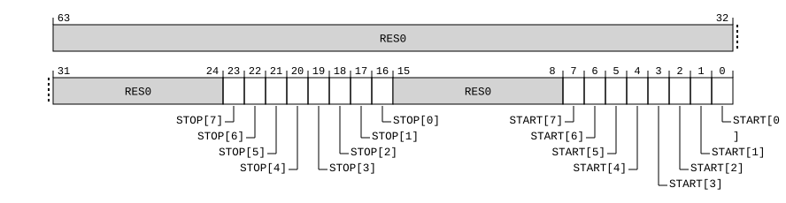

# ​D24.4.68 TRCVIPCSSCTLR, Trace ViewInst Start/Stop PE Comparator Control Register

Source: <https://developer.arm.com/documentation/ddi0487/mc/-Part-D-The-AArch64-System-Level-Architecture/-Chapter-D24-AArch64-System-Register-Descriptions/-D24-4-Trace-registers/-D24-4-68-TRCVIPCSSCTLR--Trace-ViewInst-Start-Stop-PE-Comparator-Control-Register>

##### D24.4.68 TRCVIPCSSCTLR, Trace ViewInst Start/Stop PE Comparator Control Register

The TRCVIPCSSCTLR characteristics are:

Purpose
:   Use this to select, or read, which PE Comparator Inputs can control the ViewInst start/stop function.

Configuration
:   AArch64 System register TRCVIPCSSCTLR bits [31:0] are architecturally mapped to External register [TRCVIPCSSCTLR](/documentation/ddi0487/mc/-Part-H-External-Debug/-Chapter-H9-External-Debug-Register-Descriptions/-H9-3-External-trace-registers/-H9-3-77-TRCVIPCSSCTLR--Trace-ViewInst-Start-Stop-PE-Comparator-Control-Register?lang=en#reg_ext_trcvipcssctlr)[31:0].

    This register is present only when FEAT\_ETE is implemented, System register access to the trace unit registers is implemented, and UInt(TRCIDR4.NUMPC) > 0. Otherwise, direct accesses to TRCVIPCSSCTLR are UNDEFINED.

Attributes
:   TRCVIPCSSCTLR is a 64-bit register.

###### Field descriptions



Bits [63:24]
:   Reserved, RES0.

STOP[<m>] , bits [m+16], for m = 7 to 0
:   Selects whether PE Comparator Input <m> is in use with the ViewInst start/stop function for the purpose of stopping trace.

<table>
 <colgroup>
  <col/>
  <col/>
 </colgroup>
 <thead>
  <tr>
   <th>
    <strong>
     STOP[&lt;m&gt;]
    </strong>
   </th>
   <th>
    <strong>
     Meaning
    </strong>
   </th>
  </tr>
 </thead>
 <tbody>
  <tr>
   <td>
    <p>
     <code>
      0b0
     </code>
    </p>
   </td>
   <td>
    <p>
     The PE Comparator Input &lt;m&gt; is not selected as a stop resource.
    </p>
   </td>
  </tr>
  <tr>
   <td>
    <p>
     <code>
      0b1
     </code>
    </p>
   </td>
   <td>
    <p>
     The PE Comparator Input &lt;m&gt; is selected as a stop resource.
    </p>
   </td>
  </tr>
 </tbody>
</table>

    The reset behavior of this field is:

    - On a Trace unit reset, this field resets to an architecturally UNKNOWN value.

    Accessing this field has the following behavior:

    - When m >= UInt(TRCIDR4.NUMPC), access to this field is RES0.
    - Otherwise, access to this field is RW.

Bits [15:8]
:   Reserved, RES0.

START[<m>] , bits [m], for m = 7 to 0
:   Selects whether PE Comparator Input <m> is in use with the ViewInst start/stop function for the purpose of starting trace.

<table>
 <colgroup>
  <col/>
  <col/>
 </colgroup>
 <thead>
  <tr>
   <th>
    <strong>
     START[&lt;m&gt;]
    </strong>
   </th>
   <th>
    <strong>
     Meaning
    </strong>
   </th>
  </tr>
 </thead>
 <tbody>
  <tr>
   <td>
    <p>
     <code>
      0b0
     </code>
    </p>
   </td>
   <td>
    <p>
     The PE Comparator Input &lt;m&gt; is not selected as a start resource.
    </p>
   </td>
  </tr>
  <tr>
   <td>
    <p>
     <code>
      0b1
     </code>
    </p>
   </td>
   <td>
    <p>
     The PE Comparator Input &lt;m&gt; is selected as a start resource.
    </p>
   </td>
  </tr>
 </tbody>
</table>

    The reset behavior of this field is:

    - On a Trace unit reset, this field resets to an architecturally UNKNOWN value.

    Accessing this field has the following behavior:

    - When m >= UInt(TRCIDR4.NUMPC), access to this field is RES0.
    - Otherwise, access to this field is RW.

###### Accessing TRCVIPCSSCTLR

Must be programmed if [TRCIDR4](/documentation/ddi0487/mc/-Part-D-The-AArch64-System-Level-Architecture/-Chapter-D24-AArch64-System-Register-Descriptions/-D24-4-Trace-registers/-D24-4-39-TRCIDR4--Trace-ID-Register-4?lang=en#reg_aarch64_trcidr4).NUMPC != `0b0000`.

If the trace unit is not in the Idle state it is CONSTRAINED UNPREDICTABLE whether writes to this register are ignored.

Accesses to this register use the following encodings in the System register encoding space:

###### `MRS <Xt>, TRCVIPCSSCTLR`

<table>
 <colgroup>
  <col/>
  <col/>
  <col/>
  <col/>
  <col/>
 </colgroup>
 <thead>
  <tr>
   <th>
    <strong>
     op0
    </strong>
   </th>
   <th>
    <strong>
     op1
    </strong>
   </th>
   <th>
    <strong>
     CRn
    </strong>
   </th>
   <th>
    <strong>
     CRm
    </strong>
   </th>
   <th>
    <strong>
     op2
    </strong>
   </th>
  </tr>
 </thead>
 <tbody>
  <tr>
   <td>
    <p>
     <code>
      0b10
     </code>
    </p>
   </td>
   <td>
    <p>
     <code>
      0b001
     </code>
    </p>
   </td>
   <td>
    <p>
     <code>
      0b0000
     </code>
    </p>
   </td>
   <td>
    <p>
     <code>
      0b0011
     </code>
    </p>
   </td>
   <td>
    <p>
     <code>
      0b010
     </code>
    </p>
   </td>
  </tr>
 </tbody>
</table>

```
if !(IsFeatureImplemented(FEAT_ETE) && IsFeatureImplemented(FEAT_TRC_SR) && UInt(TRCIDR4().NUMPC) > 0) then
    Undefined();
elsif HaveEL(EL3) && !(EffectivelyAtEL0InHost() || EffectivelyAtEL0NotInHost() || PSTATE.EL == EL3) && EL3SDDUndefPriority() && CPTR_EL3().TTA == '1' then
    Undefined();
elsif PSTATE.EL == EL0 then
    Undefined();
elsif PSTATE.EL == EL1 then
    if CPACR_EL1().TTA == '1' then
        AArch64_SystemAccessTrap(EL1, 0x18);
    elsif EL2Enabled() && CPTR_EL2().TTA == '1' then
        AArch64_SystemAccessTrap(EL2, 0x18);
    elsif EL2Enabled() && IsFeatureImplemented(FEAT_FGT) && (!HaveEL(EL3) || SCR_EL3().FGTEn == '1') && HDFGRTR_EL2().TRC == '1' then
        AArch64_SystemAccessTrap(EL2, 0x18);
    elsif HaveEL(EL3) && CPTR_EL3().TTA == '1' then
        if EL3SDDUndef() then
            Undefined();
        else
            AArch64_SystemAccessTrap(EL3, 0x18);
        end;
    elsif IsFeatureImplemented(FEAT_TRBE_EXT) && OSLSR_EL1().OSLK == '0' && HaltingAllowed() && EDSCR2().TTA == '1' then
        Halt(DebugHalt_SoftwareAccess);
    else
        X{64}(t) = TRCVIPCSSCTLR();
    end;
elsif PSTATE.EL == EL2 then
    if CPTR_EL2().TTA == '1' then
        AArch64_SystemAccessTrap(EL2, 0x18);
    elsif HaveEL(EL3) && CPTR_EL3().TTA == '1' then
        if EL3SDDUndef() then
            Undefined();
        else
            AArch64_SystemAccessTrap(EL3, 0x18);
        end;
    elsif IsFeatureImplemented(FEAT_TRBE_EXT) && OSLSR_EL1().OSLK == '0' && HaltingAllowed() && EDSCR2().TTA == '1' then
        Halt(DebugHalt_SoftwareAccess);
    else
        X{64}(t) = TRCVIPCSSCTLR();
    end;
elsif PSTATE.EL == EL3 then
    if CPTR_EL3().TTA == '1' then
        AArch64_SystemAccessTrap(EL3, 0x18);
    elsif IsFeatureImplemented(FEAT_TRBE_EXT) && OSLSR_EL1().OSLK == '0' && HaltingAllowed() && EDSCR2().TTA == '1' then
        Halt(DebugHalt_SoftwareAccess);
    else
        X{64}(t) = TRCVIPCSSCTLR();
    end;
end;
```

###### `MSR TRCVIPCSSCTLR, <Xt>`

<table>
 <colgroup>
  <col/>
  <col/>
  <col/>
  <col/>
  <col/>
 </colgroup>
 <thead>
  <tr>
   <th>
    <strong>
     op0
    </strong>
   </th>
   <th>
    <strong>
     op1
    </strong>
   </th>
   <th>
    <strong>
     CRn
    </strong>
   </th>
   <th>
    <strong>
     CRm
    </strong>
   </th>
   <th>
    <strong>
     op2
    </strong>
   </th>
  </tr>
 </thead>
 <tbody>
  <tr>
   <td>
    <p>
     <code>
      0b10
     </code>
    </p>
   </td>
   <td>
    <p>
     <code>
      0b001
     </code>
    </p>
   </td>
   <td>
    <p>
     <code>
      0b0000
     </code>
    </p>
   </td>
   <td>
    <p>
     <code>
      0b0011
     </code>
    </p>
   </td>
   <td>
    <p>
     <code>
      0b010
     </code>
    </p>
   </td>
  </tr>
 </tbody>
</table>

```
if !(IsFeatureImplemented(FEAT_ETE) && IsFeatureImplemented(FEAT_TRC_SR) && UInt(TRCIDR4().NUMPC) > 0) then
    Undefined();
elsif HaveEL(EL3) && !(EffectivelyAtEL0InHost() || EffectivelyAtEL0NotInHost() || PSTATE.EL == EL3) && EL3SDDUndefPriority() && CPTR_EL3().TTA == '1' then
    Undefined();
elsif PSTATE.EL == EL0 then
    Undefined();
elsif PSTATE.EL == EL1 then
    if CPACR_EL1().TTA == '1' then
        AArch64_SystemAccessTrap(EL1, 0x18);
    elsif EL2Enabled() && CPTR_EL2().TTA == '1' then
        AArch64_SystemAccessTrap(EL2, 0x18);
    elsif EL2Enabled() && IsFeatureImplemented(FEAT_FGT) && (!HaveEL(EL3) || SCR_EL3().FGTEn == '1') && HDFGWTR_EL2().TRC == '1' then
        AArch64_SystemAccessTrap(EL2, 0x18);
    elsif HaveEL(EL3) && CPTR_EL3().TTA == '1' then
        if EL3SDDUndef() then
            Undefined();
        else
            AArch64_SystemAccessTrap(EL3, 0x18);
        end;
    elsif IsFeatureImplemented(FEAT_TRBE_EXT) && OSLSR_EL1().OSLK == '0' && HaltingAllowed() && EDSCR2().TTA == '1' then
        Halt(DebugHalt_SoftwareAccess);
    else
        TRCVIPCSSCTLR() = X{64}(t);
    end;
elsif PSTATE.EL == EL2 then
    if CPTR_EL2().TTA == '1' then
        AArch64_SystemAccessTrap(EL2, 0x18);
    elsif HaveEL(EL3) && CPTR_EL3().TTA == '1' then
        if EL3SDDUndef() then
            Undefined();
        else
            AArch64_SystemAccessTrap(EL3, 0x18);
        end;
    elsif IsFeatureImplemented(FEAT_TRBE_EXT) && OSLSR_EL1().OSLK == '0' && HaltingAllowed() && EDSCR2().TTA == '1' then
        Halt(DebugHalt_SoftwareAccess);
    else
        TRCVIPCSSCTLR() = X{64}(t);
    end;
elsif PSTATE.EL == EL3 then
    if CPTR_EL3().TTA == '1' then
        AArch64_SystemAccessTrap(EL3, 0x18);
    elsif IsFeatureImplemented(FEAT_TRBE_EXT) && OSLSR_EL1().OSLK == '0' && HaltingAllowed() && EDSCR2().TTA == '1' then
        Halt(DebugHalt_SoftwareAccess);
    else
        TRCVIPCSSCTLR() = X{64}(t);
    end;
end;
```
