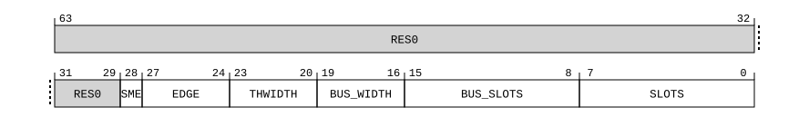

# ​D24.5.18 PMMIR_EL1, Performance Monitors Machine Identification Register

Source: <https://developer.arm.com/documentation/ddi0487/mc/-Part-D-The-AArch64-System-Level-Architecture/-Chapter-D24-AArch64-System-Register-Descriptions/-D24-5-Performance-Monitors-registers/-D24-5-18-PMMIR-EL1--Performance-Monitors-Machine-Identification-Register>

##### D24.5.18 PMMIR\_EL1, Performance Monitors Machine Identification Register

The PMMIR\_EL1 characteristics are:

Purpose
:   Describes Performance Monitors parameters specific to the implementation to software.

Configuration
:   AArch64 System register PMMIR\_EL1 bits [31:0] are architecturally mapped to AArch32 System register [PMMIR](/documentation/ddi0487/mc/-Part-G-The-AArch32-System-Level-Architecture/-Chapter-G8-AArch32-System-Register-Descriptions/-G8-3-Debug-System-registers/-G8-3-34-PMMIR--Performance-Monitors-Machine-Identification-Register?lang=en#reg_aarch32_pmmir)[31:0].

    When FEAT\_PMUv3\_EXT is implemented and FEAT\_PMUv3p4 is implemented, AArch64 System register PMMIR\_EL1 bits [31:0] are architecturally mapped to External register [PMMIR](/documentation/ddi0487/mc/-Part-I-Memory-mapped-Components-of-the-Arm-Architecture/-Chapter-I5-External-System-Control-Register-Descriptions/-I5-3-Performance-Monitors-external-register-descriptions/-I5-3-43-PMMIR--Performance-Monitors-Machine-Identification-Register?lang=en#reg_pmu_pmmir)[31:0].

    When (IsFeatureImplemented(FEAT\_PMUv3\_EXT) && IsFeatureImplemented(FEAT\_PMUv3p4)) && (IsFeatureImplemented(FEAT\_PMUv3\_EXT64) || IsFeatureImplemented(FEAT\_PMUv3p9)), AArch64 System register PMMIR\_EL1 bits [63:32] are architecturally mapped to External register [PMMIR](/documentation/ddi0487/mc/-Part-I-Memory-mapped-Components-of-the-Arm-Architecture/-Chapter-I5-External-System-Control-Register-Descriptions/-I5-3-Performance-Monitors-external-register-descriptions/-I5-3-43-PMMIR--Performance-Monitors-Machine-Identification-Register?lang=en#reg_pmu_pmmir)[63:32].

    This register is present only when FEAT\_PMUv3p4 is implemented and FEAT\_AA64 is implemented. Otherwise, direct accesses to PMMIR\_EL1 are UNDEFINED.

Attributes
:   PMMIR\_EL1 is a 64-bit register.

###### Field descriptions



Bits [63:29]
:   Reserved, RES0.

SME, bit [28]
:   PMUv3 for SME. Adds support for the Streaming SVE mode filter.

    The value of this field is an IMPLEMENTATION DEFINED choice of:

<table>
 <colgroup>
  <col/>
  <col/>
 </colgroup>
 <thead>
  <tr>
   <th>
    <strong>
     SME
    </strong>
   </th>
   <th>
    <strong>
     Meaning
    </strong>
   </th>
  </tr>
 </thead>
 <tbody>
  <tr>
   <td>
    <p>
     <code>
      0b0
     </code>
    </p>
   </td>
   <td>
    <p>
     Streaming SVE mode filter not implemented.
    </p>
   </td>
  </tr>
  <tr>
   <td>
    <p>
     <code>
      0b1
     </code>
    </p>
   </td>
   <td>
    <p>
     Adds support for the Streaming SVE mode filter.
    </p>
   </td>
  </tr>
 </tbody>
</table>

    All other values are reserved.

    [FEAT\_PMUv3\_SME](/documentation/ddi0487/mc/-Part-A-Arm-Architecture-Introduction-and-Overview/-Chapter-A2-A-profile-Architecture-Extensions/-A2-3-Armv9-A-architecture-extensions/-A2-3-6-The-Armv9-5-architecture-extension?lang=en#feat_feat_pmuv3_sme) implements the functionality identified by the value 1.

    Access to this field is RO.

EDGE, bits [27:24]
:   PMU event edge detection. With PMMIR\_EL1.THWIDTH, indicates implementation of event counter thresholding features.

    The value of this field is an IMPLEMENTATION DEFINED choice of:

<table>
 <colgroup>
  <col/>
  <col/>
 </colgroup>
 <thead>
  <tr>
   <th>
    <strong>
     EDGE
    </strong>
   </th>
   <th>
    <strong>
     Meaning
    </strong>
   </th>
  </tr>
 </thead>
 <tbody>
  <tr>
   <td>
    <p>
     <code>
      0b0000
     </code>
    </p>
   </td>
   <td>
    <p>
     <a class="document-topic" document-topic-path="/ddi0487/mc/-Part-A-Arm-Architecture-Introduction-and-Overview/-Chapter-A2-A-profile-Architecture-Extensions/-A2-2-Armv8-A-architecture-extensions/-A2-2-10-The-Armv8-9-architecture-extension?lang=en#feat_feat_pmuv3_edge" href="/documentation/ddi0487/mc/-Part-A-Arm-Architecture-Introduction-and-Overview/-Chapter-A2-A-profile-Architecture-Extensions/-A2-2-Armv8-A-architecture-extensions/-A2-2-10-The-Armv8-9-architecture-extension?lang=en#feat_feat_pmuv3_edge">
      FEAT_PMUv3_EDGE
     </a>
     is not implemented.
    </p>
   </td>
  </tr>
  <tr>
   <td>
    <p>
     <code>
      0b0001
     </code>
    </p>
   </td>
   <td>
    <p>
     <a class="document-topic" document-topic-path="/ddi0487/mc/-Part-A-Arm-Architecture-Introduction-and-Overview/-Chapter-A2-A-profile-Architecture-Extensions/-A2-2-Armv8-A-architecture-extensions/-A2-2-10-The-Armv8-9-architecture-extension?lang=en#feat_feat_pmuv3_edge" href="/documentation/ddi0487/mc/-Part-A-Arm-Architecture-Introduction-and-Overview/-Chapter-A2-A-profile-Architecture-Extensions/-A2-2-Armv8-A-architecture-extensions/-A2-2-10-The-Armv8-9-architecture-extension?lang=en#feat_feat_pmuv3_edge">
      FEAT_PMUv3_EDGE
     </a>
     is implemented.
    </p>
   </td>
  </tr>
  <tr>
   <td>
    <p>
     <code>
      0b0010
     </code>
    </p>
   </td>
   <td>
    <p>
     As
     <code>
      0b0001
     </code>
     , and adds support for threshold value linking between a pair of counters.
    </p>
   </td>
  </tr>
 </tbody>
</table>

    All other values are reserved.

    If FEAT\_PMUv3\_TH is not implemented, the only permitted value is `0b0000`.

    [FEAT\_PMUv3\_EDGE](/documentation/ddi0487/mc/-Part-A-Arm-Architecture-Introduction-and-Overview/-Chapter-A2-A-profile-Architecture-Extensions/-A2-2-Armv8-A-architecture-extensions/-A2-2-10-The-Armv8-9-architecture-extension?lang=en#feat_feat_pmuv3_edge) implements the functionality identified by the value `0b0001`.

    [FEAT\_PMUv3\_TH2](/documentation/ddi0487/mc/-Part-A-Arm-Architecture-Introduction-and-Overview/-Chapter-A2-A-profile-Architecture-Extensions/-A2-3-Armv9-A-architecture-extensions/-A2-3-6-The-Armv9-5-architecture-extension?lang=en#feat_feat_pmuv3_th2) implements the functionality identified by the value `0b0010`.

    Access to this field is RO.

THWIDTH, bits [23:20]
:   [PMEVTYPER<n>\_EL0](/documentation/ddi0487/mc/-Part-D-The-AArch64-System-Level-Architecture/-Chapter-D24-AArch64-System-Register-Descriptions/-D24-5-Performance-Monitors-registers/-D24-5-12-PMEVTYPER-n--EL0--Performance-Monitors-Event-Type-Registers--n---0---30?lang=en#reg_aarch64_pmevtypern_el0).TH width. Indicates implementation of the [FEAT\_PMUv3\_TH](/documentation/ddi0487/mc/-Part-A-Arm-Architecture-Introduction-and-Overview/-Chapter-A2-A-profile-Architecture-Extensions/-A2-2-Armv8-A-architecture-extensions/-A2-2-9-The-Armv8-8-architecture-extension?lang=en#feat_feat_pmuv3_th) feature, and, if implemented, the size of the [PMEVTYPER<n>\_EL0](/documentation/ddi0487/mc/-Part-D-The-AArch64-System-Level-Architecture/-Chapter-D24-AArch64-System-Register-Descriptions/-D24-5-Performance-Monitors-registers/-D24-5-12-PMEVTYPER-n--EL0--Performance-Monitors-Event-Type-Registers--n---0---30?lang=en#reg_aarch64_pmevtypern_el0).TH field.

    The value of this field is an IMPLEMENTATION DEFINED choice of:

<table>
 <colgroup>
  <col/>
  <col/>
 </colgroup>
 <thead>
  <tr>
   <th>
    <strong>
     THWIDTH
    </strong>
   </th>
   <th>
    <strong>
     Meaning
    </strong>
   </th>
  </tr>
 </thead>
 <tbody>
  <tr>
   <td>
    <p>
     <code>
      0b0000
     </code>
    </p>
   </td>
   <td>
    <p>
     <a class="document-topic" document-topic-path="/ddi0487/mc/-Part-A-Arm-Architecture-Introduction-and-Overview/-Chapter-A2-A-profile-Architecture-Extensions/-A2-2-Armv8-A-architecture-extensions/-A2-2-9-The-Armv8-8-architecture-extension?lang=en#feat_feat_pmuv3_th" href="/documentation/ddi0487/mc/-Part-A-Arm-Architecture-Introduction-and-Overview/-Chapter-A2-A-profile-Architecture-Extensions/-A2-2-Armv8-A-architecture-extensions/-A2-2-9-The-Armv8-8-architecture-extension?lang=en#feat_feat_pmuv3_th">
      FEAT_PMUv3_TH
     </a>
     is not implemented.
    </p>
   </td>
  </tr>
  <tr>
   <td>
    <p>
     <code>
      0b0001
     </code>
    </p>
   </td>
   <td>
    <p>
     1 bit.
     <a class="document-topic" document-topic-path="/ddi0487/mc/-Part-D-The-AArch64-System-Level-Architecture/-Chapter-D24-AArch64-System-Register-Descriptions/-D24-5-Performance-Monitors-registers/-D24-5-12-PMEVTYPER-n--EL0--Performance-Monitors-Event-Type-Registers--n---0---30?lang=en#reg_aarch64_pmevtypern_el0" href="/documentation/ddi0487/mc/-Part-D-The-AArch64-System-Level-Architecture/-Chapter-D24-AArch64-System-Register-Descriptions/-D24-5-Performance-Monitors-registers/-D24-5-12-PMEVTYPER-n--EL0--Performance-Monitors-Event-Type-Registers--n---0---30?lang=en#reg_aarch64_pmevtypern_el0">
      PMEVTYPER&lt;n&gt;_EL0
     </a>
     .TH[11:1] are
     <small>
      RES0
     </small>
     .
    </p>
   </td>
  </tr>
  <tr>
   <td>
    <p>
     <code>
      0b0010
     </code>
    </p>
   </td>
   <td>
    <p>
     2 bits.
     <a class="document-topic" document-topic-path="/ddi0487/mc/-Part-D-The-AArch64-System-Level-Architecture/-Chapter-D24-AArch64-System-Register-Descriptions/-D24-5-Performance-Monitors-registers/-D24-5-12-PMEVTYPER-n--EL0--Performance-Monitors-Event-Type-Registers--n---0---30?lang=en#reg_aarch64_pmevtypern_el0" href="/documentation/ddi0487/mc/-Part-D-The-AArch64-System-Level-Architecture/-Chapter-D24-AArch64-System-Register-Descriptions/-D24-5-Performance-Monitors-registers/-D24-5-12-PMEVTYPER-n--EL0--Performance-Monitors-Event-Type-Registers--n---0---30?lang=en#reg_aarch64_pmevtypern_el0">
      PMEVTYPER&lt;n&gt;_EL0
     </a>
     .TH[11:2] are
     <small>
      RES0
     </small>
     .
    </p>
   </td>
  </tr>
  <tr>
   <td>
    <p>
     <code>
      0b0011
     </code>
    </p>
   </td>
   <td>
    <p>
     3 bits.
     <a class="document-topic" document-topic-path="/ddi0487/mc/-Part-D-The-AArch64-System-Level-Architecture/-Chapter-D24-AArch64-System-Register-Descriptions/-D24-5-Performance-Monitors-registers/-D24-5-12-PMEVTYPER-n--EL0--Performance-Monitors-Event-Type-Registers--n---0---30?lang=en#reg_aarch64_pmevtypern_el0" href="/documentation/ddi0487/mc/-Part-D-The-AArch64-System-Level-Architecture/-Chapter-D24-AArch64-System-Register-Descriptions/-D24-5-Performance-Monitors-registers/-D24-5-12-PMEVTYPER-n--EL0--Performance-Monitors-Event-Type-Registers--n---0---30?lang=en#reg_aarch64_pmevtypern_el0">
      PMEVTYPER&lt;n&gt;_EL0
     </a>
     .TH[11:3] are
     <small>
      RES0
     </small>
     .
    </p>
   </td>
  </tr>
  <tr>
   <td>
    <p>
     <code>
      0b0100
     </code>
    </p>
   </td>
   <td>
    <p>
     4 bits.
     <a class="document-topic" document-topic-path="/ddi0487/mc/-Part-D-The-AArch64-System-Level-Architecture/-Chapter-D24-AArch64-System-Register-Descriptions/-D24-5-Performance-Monitors-registers/-D24-5-12-PMEVTYPER-n--EL0--Performance-Monitors-Event-Type-Registers--n---0---30?lang=en#reg_aarch64_pmevtypern_el0" href="/documentation/ddi0487/mc/-Part-D-The-AArch64-System-Level-Architecture/-Chapter-D24-AArch64-System-Register-Descriptions/-D24-5-Performance-Monitors-registers/-D24-5-12-PMEVTYPER-n--EL0--Performance-Monitors-Event-Type-Registers--n---0---30?lang=en#reg_aarch64_pmevtypern_el0">
      PMEVTYPER&lt;n&gt;_EL0
     </a>
     .TH[11:4] are
     <small>
      RES0
     </small>
     .
    </p>
   </td>
  </tr>
  <tr>
   <td>
    <p>
     <code>
      0b0101
     </code>
    </p>
   </td>
   <td>
    <p>
     5 bits.
     <a class="document-topic" document-topic-path="/ddi0487/mc/-Part-D-The-AArch64-System-Level-Architecture/-Chapter-D24-AArch64-System-Register-Descriptions/-D24-5-Performance-Monitors-registers/-D24-5-12-PMEVTYPER-n--EL0--Performance-Monitors-Event-Type-Registers--n---0---30?lang=en#reg_aarch64_pmevtypern_el0" href="/documentation/ddi0487/mc/-Part-D-The-AArch64-System-Level-Architecture/-Chapter-D24-AArch64-System-Register-Descriptions/-D24-5-Performance-Monitors-registers/-D24-5-12-PMEVTYPER-n--EL0--Performance-Monitors-Event-Type-Registers--n---0---30?lang=en#reg_aarch64_pmevtypern_el0">
      PMEVTYPER&lt;n&gt;_EL0
     </a>
     .TH[11:5] are
     <small>
      RES0
     </small>
     .
    </p>
   </td>
  </tr>
  <tr>
   <td>
    <p>
     <code>
      0b0110
     </code>
    </p>
   </td>
   <td>
    <p>
     6 bits.
     <a class="document-topic" document-topic-path="/ddi0487/mc/-Part-D-The-AArch64-System-Level-Architecture/-Chapter-D24-AArch64-System-Register-Descriptions/-D24-5-Performance-Monitors-registers/-D24-5-12-PMEVTYPER-n--EL0--Performance-Monitors-Event-Type-Registers--n---0---30?lang=en#reg_aarch64_pmevtypern_el0" href="/documentation/ddi0487/mc/-Part-D-The-AArch64-System-Level-Architecture/-Chapter-D24-AArch64-System-Register-Descriptions/-D24-5-Performance-Monitors-registers/-D24-5-12-PMEVTYPER-n--EL0--Performance-Monitors-Event-Type-Registers--n---0---30?lang=en#reg_aarch64_pmevtypern_el0">
      PMEVTYPER&lt;n&gt;_EL0
     </a>
     .TH[11:6] are
     <small>
      RES0
     </small>
     .
    </p>
   </td>
  </tr>
  <tr>
   <td>
    <p>
     <code>
      0b0111
     </code>
    </p>
   </td>
   <td>
    <p>
     7 bits.
     <a class="document-topic" document-topic-path="/ddi0487/mc/-Part-D-The-AArch64-System-Level-Architecture/-Chapter-D24-AArch64-System-Register-Descriptions/-D24-5-Performance-Monitors-registers/-D24-5-12-PMEVTYPER-n--EL0--Performance-Monitors-Event-Type-Registers--n---0---30?lang=en#reg_aarch64_pmevtypern_el0" href="/documentation/ddi0487/mc/-Part-D-The-AArch64-System-Level-Architecture/-Chapter-D24-AArch64-System-Register-Descriptions/-D24-5-Performance-Monitors-registers/-D24-5-12-PMEVTYPER-n--EL0--Performance-Monitors-Event-Type-Registers--n---0---30?lang=en#reg_aarch64_pmevtypern_el0">
      PMEVTYPER&lt;n&gt;_EL0
     </a>
     .TH[11:7] are
     <small>
      RES0
     </small>
     .
    </p>
   </td>
  </tr>
  <tr>
   <td>
    <p>
     <code>
      0b1000
     </code>
    </p>
   </td>
   <td>
    <p>
     8 bits.
     <a class="document-topic" document-topic-path="/ddi0487/mc/-Part-D-The-AArch64-System-Level-Architecture/-Chapter-D24-AArch64-System-Register-Descriptions/-D24-5-Performance-Monitors-registers/-D24-5-12-PMEVTYPER-n--EL0--Performance-Monitors-Event-Type-Registers--n---0---30?lang=en#reg_aarch64_pmevtypern_el0" href="/documentation/ddi0487/mc/-Part-D-The-AArch64-System-Level-Architecture/-Chapter-D24-AArch64-System-Register-Descriptions/-D24-5-Performance-Monitors-registers/-D24-5-12-PMEVTYPER-n--EL0--Performance-Monitors-Event-Type-Registers--n---0---30?lang=en#reg_aarch64_pmevtypern_el0">
      PMEVTYPER&lt;n&gt;_EL0
     </a>
     .TH[11:8] are
     <small>
      RES0
     </small>
     .
    </p>
   </td>
  </tr>
  <tr>
   <td>
    <p>
     <code>
      0b1001
     </code>
    </p>
   </td>
   <td>
    <p>
     9 bits.
     <a class="document-topic" document-topic-path="/ddi0487/mc/-Part-D-The-AArch64-System-Level-Architecture/-Chapter-D24-AArch64-System-Register-Descriptions/-D24-5-Performance-Monitors-registers/-D24-5-12-PMEVTYPER-n--EL0--Performance-Monitors-Event-Type-Registers--n---0---30?lang=en#reg_aarch64_pmevtypern_el0" href="/documentation/ddi0487/mc/-Part-D-The-AArch64-System-Level-Architecture/-Chapter-D24-AArch64-System-Register-Descriptions/-D24-5-Performance-Monitors-registers/-D24-5-12-PMEVTYPER-n--EL0--Performance-Monitors-Event-Type-Registers--n---0---30?lang=en#reg_aarch64_pmevtypern_el0">
      PMEVTYPER&lt;n&gt;_EL0
     </a>
     .TH[11:9] are
     <small>
      RES0
     </small>
     .
    </p>
   </td>
  </tr>
  <tr>
   <td>
    <p>
     <code>
      0b1010
     </code>
    </p>
   </td>
   <td>
    <p>
     10 bits.
     <a class="document-topic" document-topic-path="/ddi0487/mc/-Part-D-The-AArch64-System-Level-Architecture/-Chapter-D24-AArch64-System-Register-Descriptions/-D24-5-Performance-Monitors-registers/-D24-5-12-PMEVTYPER-n--EL0--Performance-Monitors-Event-Type-Registers--n---0---30?lang=en#reg_aarch64_pmevtypern_el0" href="/documentation/ddi0487/mc/-Part-D-The-AArch64-System-Level-Architecture/-Chapter-D24-AArch64-System-Register-Descriptions/-D24-5-Performance-Monitors-registers/-D24-5-12-PMEVTYPER-n--EL0--Performance-Monitors-Event-Type-Registers--n---0---30?lang=en#reg_aarch64_pmevtypern_el0">
      PMEVTYPER&lt;n&gt;_EL0
     </a>
     .TH[11:10] are
     <small>
      RES0
     </small>
     .
    </p>
   </td>
  </tr>
  <tr>
   <td>
    <p>
     <code>
      0b1011
     </code>
    </p>
   </td>
   <td>
    <p>
     11 bits.
     <a class="document-topic" document-topic-path="/ddi0487/mc/-Part-D-The-AArch64-System-Level-Architecture/-Chapter-D24-AArch64-System-Register-Descriptions/-D24-5-Performance-Monitors-registers/-D24-5-12-PMEVTYPER-n--EL0--Performance-Monitors-Event-Type-Registers--n---0---30?lang=en#reg_aarch64_pmevtypern_el0" href="/documentation/ddi0487/mc/-Part-D-The-AArch64-System-Level-Architecture/-Chapter-D24-AArch64-System-Register-Descriptions/-D24-5-Performance-Monitors-registers/-D24-5-12-PMEVTYPER-n--EL0--Performance-Monitors-Event-Type-Registers--n---0---30?lang=en#reg_aarch64_pmevtypern_el0">
      PMEVTYPER&lt;n&gt;_EL0
     </a>
     .TH[11] is
     <small>
      RES0
     </small>
     .
    </p>
   </td>
  </tr>
  <tr>
   <td>
    <p>
     <code>
      0b1100
     </code>
    </p>
   </td>
   <td>
    <p>
     12 bits.
    </p>
   </td>
  </tr>
 </tbody>
</table>

    All other values are reserved.

    If [FEAT\_PMUv3\_TH](/documentation/ddi0487/mc/-Part-A-Arm-Architecture-Introduction-and-Overview/-Chapter-A2-A-profile-Architecture-Extensions/-A2-2-Armv8-A-architecture-extensions/-A2-2-9-The-Armv8-8-architecture-extension?lang=en#feat_feat_pmuv3_th) is not implemented, this field is zero.

    Otherwise, the largest value that can be written to [PMEVTYPER<n>\_EL0](/documentation/ddi0487/mc/-Part-D-The-AArch64-System-Level-Architecture/-Chapter-D24-AArch64-System-Register-Descriptions/-D24-5-Performance-Monitors-registers/-D24-5-12-PMEVTYPER-n--EL0--Performance-Monitors-Event-Type-Registers--n---0---30?lang=en#reg_aarch64_pmevtypern_el0).TH is 2(PMMIR\_EL1.THWIDTH) minus one.

    Access to this field is RO.

BUS\_WIDTH, bits [19:16]
:   Bus width. Indicates the number of bytes each BUS\_ACCESS event relates to. Encoded as Log2(number of bytes), plus one.

    The value of this field is an IMPLEMENTATION DEFINED choice of:

<table>
 <colgroup>
  <col/>
  <col/>
 </colgroup>
 <thead>
  <tr>
   <th>
    <strong>
     BUS_WIDTH
    </strong>
   </th>
   <th>
    <strong>
     Meaning
    </strong>
   </th>
  </tr>
 </thead>
 <tbody>
  <tr>
   <td>
    <p>
     <code>
      0b0000
     </code>
    </p>
   </td>
   <td>
    <p>
     The information is not available.
    </p>
   </td>
  </tr>
  <tr>
   <td>
    <p>
     <code>
      0b0011
     </code>
    </p>
   </td>
   <td>
    <p>
     Four bytes.
    </p>
   </td>
  </tr>
  <tr>
   <td>
    <p>
     <code>
      0b0100
     </code>
    </p>
   </td>
   <td>
    <p>
     8 bytes.
    </p>
   </td>
  </tr>
  <tr>
   <td>
    <p>
     <code>
      0b0101
     </code>
    </p>
   </td>
   <td>
    <p>
     16 bytes.
    </p>
   </td>
  </tr>
  <tr>
   <td>
    <p>
     <code>
      0b0110
     </code>
    </p>
   </td>
   <td>
    <p>
     32 bytes.
    </p>
   </td>
  </tr>
  <tr>
   <td>
    <p>
     <code>
      0b0111
     </code>
    </p>
   </td>
   <td>
    <p>
     64 bytes.
    </p>
   </td>
  </tr>
  <tr>
   <td>
    <p>
     <code>
      0b1000
     </code>
    </p>
   </td>
   <td>
    <p>
     128 bytes.
    </p>
   </td>
  </tr>
  <tr>
   <td>
    <p>
     <code>
      0b1001
     </code>
    </p>
   </td>
   <td>
    <p>
     256 bytes.
    </p>
   </td>
  </tr>
  <tr>
   <td>
    <p>
     <code>
      0b1010
     </code>
    </p>
   </td>
   <td>
    <p>
     512 bytes.
    </p>
   </td>
  </tr>
  <tr>
   <td>
    <p>
     <code>
      0b1011
     </code>
    </p>
   </td>
   <td>
    <p>
     1024 bytes.
    </p>
   </td>
  </tr>
  <tr>
   <td>
    <p>
     <code>
      0b1100
     </code>
    </p>
   </td>
   <td>
    <p>
     2048 bytes.
    </p>
   </td>
  </tr>
 </tbody>
</table>

    All other values are reserved.

    Each transfer is up to this number of bytes. An access might be smaller than the bus width.

    When this field is nonzero, each access counted by BUS\_ACCESS is at most BUS\_WIDTH bytes. An implementation might treat a wide bus as multiple narrower buses, such that a wide access on the bus increments the BUS\_ACCESS counter by more than one.

    Access to this field is RO.

BUS\_SLOTS, bits [15:8]
:   Bus count. The largest value by which the BUS\_ACCESS event might increment in a single BUS\_CYCLES cycle.

    When this field is nonzero, the largest value by which the BUS\_ACCESS event might increment in a single BUS\_CYCLES cycle is BUS\_SLOTS.

    If the bus count information is not available, this field will read as zero.

    This field has an IMPLEMENTATION DEFINED value.

    Access to this field is RO.

SLOTS, bits [7:0]
:   Operation width. The largest value by which the STALL\_SLOT event might increment in a single cycle. If the STALL\_SLOT event is not implemented, this field might read as zero.

    This field has an IMPLEMENTATION DEFINED value.

    Access to this field is RO.

###### Accessing PMMIR\_EL1

Accesses to this register use the following encodings in the System register encoding space:

###### `MRS <Xt>, PMMIR_EL1`

<table>
 <colgroup>
  <col/>
  <col/>
  <col/>
  <col/>
  <col/>
 </colgroup>
 <thead>
  <tr>
   <th>
    <strong>
     op0
    </strong>
   </th>
   <th>
    <strong>
     op1
    </strong>
   </th>
   <th>
    <strong>
     CRn
    </strong>
   </th>
   <th>
    <strong>
     CRm
    </strong>
   </th>
   <th>
    <strong>
     op2
    </strong>
   </th>
  </tr>
 </thead>
 <tbody>
  <tr>
   <td>
    <p>
     <code>
      0b11
     </code>
    </p>
   </td>
   <td>
    <p>
     <code>
      0b000
     </code>
    </p>
   </td>
   <td>
    <p>
     <code>
      0b1001
     </code>
    </p>
   </td>
   <td>
    <p>
     <code>
      0b1110
     </code>
    </p>
   </td>
   <td>
    <p>
     <code>
      0b110
     </code>
    </p>
   </td>
  </tr>
 </tbody>
</table>

```
if !(IsFeatureImplemented(FEAT_PMUv3p4) && IsFeatureImplemented(FEAT_AA64)) then
    Undefined();
elsif HaveEL(EL3) && !(EffectivelyAtEL0InHost() || EffectivelyAtEL0NotInHost() || PSTATE.EL == EL3) && EL3SDDUndefPriority() && MDCR_EL3().TPM == '1' then
    Undefined();
elsif PSTATE.EL == EL0 then
    Undefined();
elsif PSTATE.EL == EL1 then
    if EL2Enabled() && IsFeatureImplemented(FEAT_FGT) && (!HaveEL(EL3) || SCR_EL3().FGTEn == '1') && HDFGRTR_EL2().PMMIR_EL1 == '1' then
        AArch64_SystemAccessTrap(EL2, 0x18);
    elsif EL2Enabled() && MDCR_EL2().TPM == '1' then
        AArch64_SystemAccessTrap(EL2, 0x18);
    elsif HaveEL(EL3) && MDCR_EL3().TPM == '1' then
        if EL3SDDUndef() then
            Undefined();
        else
            AArch64_SystemAccessTrap(EL3, 0x18);
        end;
    else
        X{64}(t) = PMMIR_EL1();
    end;
elsif PSTATE.EL == EL2 then
    if HaveEL(EL3) && MDCR_EL3().TPM == '1' then
        if EL3SDDUndef() then
            Undefined();
        else
            AArch64_SystemAccessTrap(EL3, 0x18);
        end;
    else
        X{64}(t) = PMMIR_EL1();
    end;
elsif PSTATE.EL == EL3 then
    X{64}(t) = PMMIR_EL1();
end;
```
