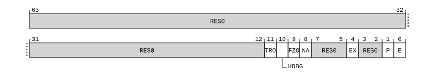

# ​D24.5.36 SPMCR_EL0, System Performance Monitor Control Register

Source: <https://developer.arm.com/documentation/ddi0487/mc/-Part-D-The-AArch64-System-Level-Architecture/-Chapter-D24-AArch64-System-Register-Descriptions/-D24-5-Performance-Monitors-registers/-D24-5-36-SPMCR-EL0--System-Performance-Monitor-Control-Register>

##### D24.5.36 SPMCR\_EL0, System Performance Monitor Control Register

The SPMCR\_EL0 characteristics are:

Purpose
:   Main control register for System PMU <s>.

Configuration
:   This register is present only when FEAT\_SPMU is implemented and FEAT\_AA64 is implemented. Otherwise, direct accesses to SPMCR\_EL0 are UNDEFINED.

Attributes
:   SPMCR\_EL0 is a 64-bit register.

###### Field descriptions



Bits [63:12]
:   Reserved, RES0.

TRO, bit [11]
:   When SPMCFGR\_EL1.TRO == '1':
    :   Trace enable. For more information on this field, see ‘CoreSight PMU Architecture’.

        The reset behavior of this field is:

        - On a System PMU reset, this field resets to an architecturally UNKNOWN value.

        Accessing this field has the following behavior:

        - When EL0 is the current Exception level, access to this field is RO.
        - Otherwise, access to this field is RW.

    Otherwise:
    :   Reserved, RES0.

HDBG, bit [10]
:   When SPMCFGR\_EL1.HDBG == '1':
    :   Halt-on-debug. For more information on this field, see ‘CoreSight PMU Architecture’.

        The reset behavior of this field is:

        - On a System PMU reset, this field resets to an architecturally UNKNOWN value.

        Accessing this field has the following behavior:

        - When EL0 is the current Exception level, access to this field is RO.
        - Otherwise, access to this field is RW.

    Otherwise:
    :   Reserved, RES0.

FZO, bit [9]
:   When SPMCFGR\_EL1.FZO == '1':
    :   Freeze-on-overflow. For more information on this field, see ‘CoreSight PMU Architecture’.

        > #### Note
        >
        > If implemented by a System PMU, then freeze-on-overflow affects only the counters of System PMU <s>, not other System PMUs nor the PE PMU.

        The reset behavior of this field is:

        - On a System PMU reset, this field resets to an architecturally UNKNOWN value.

    Otherwise:
    :   Reserved, RES0.

NA, bit [8]
:   When SPMCFGR\_EL1.NA == '1':
    :   Not accessible. For more information on this field, see ‘CoreSight PMU Architecture’.

        Access to this field is RO.

    Otherwise:
    :   Reserved, RES0.

Bits [7:5]
:   Reserved, RES0.

EX, bit [4]
:   When SPMCFGR\_EL1.EX == '1':
    :   Export enable. For more information on this field, see ‘CoreSight PMU Architecture’.

        The reset behavior of this field is:

        - On a System PMU reset, this field resets to an architecturally UNKNOWN value.

    Otherwise:
    :   Reserved, RES0.

Bits [3:2]
:   Reserved, RES0.

P, bit [1]
:   Event counter reset.

<table>
 <colgroup>
  <col/>
  <col/>
 </colgroup>
 <thead>
  <tr>
   <th>
    <strong>
     P
    </strong>
   </th>
   <th>
    <strong>
     Meaning
    </strong>
   </th>
  </tr>
 </thead>
 <tbody>
  <tr>
   <td>
    <p>
     <code>
      0b0
     </code>
    </p>
   </td>
   <td>
    <p>
     Write is ignored.
    </p>
   </td>
  </tr>
  <tr>
   <td>
    <p>
     <code>
      0b1
     </code>
    </p>
   </td>
   <td>
    <p>
     Reset all event counters in System PMU &lt;s&gt; to zero.
    </p>
   </td>
  </tr>
 </tbody>
</table>

    > #### Note
    >
    > Resetting the event counters does not affect any overflow flags.

    Access to this field is WO/RAZ.

E, bit [0]
:   Count enable. This field controls System PMU <s>.

<table>
 <colgroup>
  <col/>
  <col/>
 </colgroup>
 <thead>
  <tr>
   <th>
    <strong>
     E
    </strong>
   </th>
   <th>
    <strong>
     Meaning
    </strong>
   </th>
  </tr>
 </thead>
 <tbody>
  <tr>
   <td>
    <p>
     <code>
      0b0
     </code>
    </p>
   </td>
   <td>
    <p>
     Monitor is disabled.
    </p>
   </td>
  </tr>
  <tr>
   <td>
    <p>
     <code>
      0b1
     </code>
    </p>
   </td>
   <td>
    <p>
     Monitor is enabled.
    </p>
   </td>
  </tr>
 </tbody>
</table>

    Performance monitor overflow IRQs are only signaled by System PMU <s> when this field is 1.

    The reset behavior of this field is:

    - On a System PMU reset, this field resets to `'0'`.

###### Accessing SPMCR\_EL0

To access SPMCR\_EL0 for System PMU <s>, set [SPMSELR\_EL0](/documentation/ddi0487/mc/-Part-D-The-AArch64-System-Level-Architecture/-Chapter-D24-AArch64-System-Register-Descriptions/-D24-5-Performance-Monitors-registers/-D24-5-50-SPMSELR-EL0--System-Performance-Monitors-Select-Register?lang=en#reg_aarch64_spmselr_el0).SYSPMUSEL to s.

SPMCR\_EL0 reads-as-zero and ignores writes if System PMU <s> is not implemented.

Accesses to this register use the following encodings in the System register encoding space:

###### `MRS <Xt>, SPMCR_EL0`

<table>
 <colgroup>
  <col/>
  <col/>
  <col/>
  <col/>
  <col/>
 </colgroup>
 <thead>
  <tr>
   <th>
    <strong>
     op0
    </strong>
   </th>
   <th>
    <strong>
     op1
    </strong>
   </th>
   <th>
    <strong>
     CRn
    </strong>
   </th>
   <th>
    <strong>
     CRm
    </strong>
   </th>
   <th>
    <strong>
     op2
    </strong>
   </th>
  </tr>
 </thead>
 <tbody>
  <tr>
   <td>
    <p>
     <code>
      0b10
     </code>
    </p>
   </td>
   <td>
    <p>
     <code>
      0b011
     </code>
    </p>
   </td>
   <td>
    <p>
     <code>
      0b1001
     </code>
    </p>
   </td>
   <td>
    <p>
     <code>
      0b1100
     </code>
    </p>
   </td>
   <td>
    <p>
     <code>
      0b000
     </code>
    </p>
   </td>
  </tr>
 </tbody>
</table>

```
if !(IsFeatureImplemented(FEAT_SPMU) && IsFeatureImplemented(FEAT_AA64)) then
    Undefined();
elsif HaveEL(EL3) && PSTATE.EL != EL3 && EL3SDDUndefPriority() && MDCR_EL3().EnPM2 == '0' then
    Undefined();
elsif HaveEL(EL3) && PSTATE.EL != EL3 && EL3SDDUndefPriority() && SPMACCESSR_EL3()[UInt(SPMSELR_EL0().SYSPMUSEL) * 2+:2] == '00' then
    Undefined();
elsif PSTATE.EL == EL0 then
    if MDSCR_EL1().EnSPM == '0' then
        AArch64_SystemAccessTraptoEL1orEL2(0x18);
    elsif EffectivelyAtEL0NotInHost() && SPMACCESSR_EL1()[UInt(SPMSELR_EL0().SYSPMUSEL) * 2+:2] == '00' then
        AArch64_SystemAccessTraptoEL1orEL2(0x18);
    elsif EL2Enabled() && EffectivelyAtEL0NotInHost() && IsFeatureImplemented(FEAT_FGT2) && ((HaveEL(EL3) && SCR_EL3().FGTEn2 == '0') || HDFGRTR2_EL2().nSPMCR_EL0 == '0') then
        AArch64_SystemAccessTrap(EL2, 0x18);
    elsif EL2Enabled() && MDCR_EL2().EnSPM == '0' then
        AArch64_SystemAccessTrap(EL2, 0x18);
    elsif EL2Enabled() && SPMACCESSR_EL2()[UInt(SPMSELR_EL0().SYSPMUSEL) * 2+:2] == '00' then
        AArch64_SystemAccessTrap(EL2, 0x18);
    elsif HaveEL(EL3) && MDCR_EL3().EnPM2 == '0' then
        if EL3SDDUndef() then
            Undefined();
        else
            AArch64_SystemAccessTrap(EL3, 0x18);
        end;
    elsif HaveEL(EL3) && SPMACCESSR_EL3()[UInt(SPMSELR_EL0().SYSPMUSEL) * 2+:2] == '00' then
        if EL3SDDUndef() then
            Undefined();
        else
            AArch64_SystemAccessTrap(EL3, 0x18);
        end;
    else
        X{64}(t) = SPMCR_EL0(UInt(SPMSELR_EL0().SYSPMUSEL));
    end;
elsif PSTATE.EL == EL1 then
    if EL2Enabled() && IsFeatureImplemented(FEAT_FGT2) && ((HaveEL(EL3) && SCR_EL3().FGTEn2 == '0') || HDFGRTR2_EL2().nSPMCR_EL0 == '0') then
        AArch64_SystemAccessTrap(EL2, 0x18);
    elsif EL2Enabled() && MDCR_EL2().EnSPM == '0' then
        AArch64_SystemAccessTrap(EL2, 0x18);
    elsif EL2Enabled() && SPMACCESSR_EL2()[UInt(SPMSELR_EL0().SYSPMUSEL) * 2+:2] == '00' then
        AArch64_SystemAccessTrap(EL2, 0x18);
    elsif HaveEL(EL3) && MDCR_EL3().EnPM2 == '0' then
        if EL3SDDUndef() then
            Undefined();
        else
            AArch64_SystemAccessTrap(EL3, 0x18);
        end;
    elsif HaveEL(EL3) && SPMACCESSR_EL3()[UInt(SPMSELR_EL0().SYSPMUSEL) * 2+:2] == '00' then
        if EL3SDDUndef() then
            Undefined();
        else
            AArch64_SystemAccessTrap(EL3, 0x18);
        end;
    else
        X{64}(t) = SPMCR_EL0(UInt(SPMSELR_EL0().SYSPMUSEL));
    end;
elsif PSTATE.EL == EL2 then
    if HaveEL(EL3) && MDCR_EL3().EnPM2 == '0' then
        if EL3SDDUndef() then
            Undefined();
        else
            AArch64_SystemAccessTrap(EL3, 0x18);
        end;
    elsif HaveEL(EL3) && SPMACCESSR_EL3()[UInt(SPMSELR_EL0().SYSPMUSEL) * 2+:2] == '00' then
        if EL3SDDUndef() then
            Undefined();
        else
            AArch64_SystemAccessTrap(EL3, 0x18);
        end;
    else
        X{64}(t) = SPMCR_EL0(UInt(SPMSELR_EL0().SYSPMUSEL));
    end;
elsif PSTATE.EL == EL3 then
    X{64}(t) = SPMCR_EL0(UInt(SPMSELR_EL0().SYSPMUSEL));
end;
```

###### `MSR SPMCR_EL0, <Xt>`

<table>
 <colgroup>
  <col/>
  <col/>
  <col/>
  <col/>
  <col/>
 </colgroup>
 <thead>
  <tr>
   <th>
    <strong>
     op0
    </strong>
   </th>
   <th>
    <strong>
     op1
    </strong>
   </th>
   <th>
    <strong>
     CRn
    </strong>
   </th>
   <th>
    <strong>
     CRm
    </strong>
   </th>
   <th>
    <strong>
     op2
    </strong>
   </th>
  </tr>
 </thead>
 <tbody>
  <tr>
   <td>
    <p>
     <code>
      0b10
     </code>
    </p>
   </td>
   <td>
    <p>
     <code>
      0b011
     </code>
    </p>
   </td>
   <td>
    <p>
     <code>
      0b1001
     </code>
    </p>
   </td>
   <td>
    <p>
     <code>
      0b1100
     </code>
    </p>
   </td>
   <td>
    <p>
     <code>
      0b000
     </code>
    </p>
   </td>
  </tr>
 </tbody>
</table>

```
if !(IsFeatureImplemented(FEAT_SPMU) && IsFeatureImplemented(FEAT_AA64)) then
    Undefined();
elsif HaveEL(EL3) && PSTATE.EL != EL3 && EL3SDDUndefPriority() && MDCR_EL3().EnPM2 == '0' then
    Undefined();
elsif HaveEL(EL3) && PSTATE.EL != EL3 && EL3SDDUndefPriority() && SPMACCESSR_EL3()[UInt(SPMSELR_EL0().SYSPMUSEL) * 2+:2] != '11' then
    Undefined();
elsif PSTATE.EL == EL0 then
    if MDSCR_EL1().EnSPM == '0' then
        AArch64_SystemAccessTraptoEL1orEL2(0x18);
    elsif EffectivelyAtEL0NotInHost() && SPMACCESSR_EL1()[UInt(SPMSELR_EL0().SYSPMUSEL) * 2+:2] != '11' then
        AArch64_SystemAccessTraptoEL1orEL2(0x18);
    elsif EL2Enabled() && EffectivelyAtEL0NotInHost() && IsFeatureImplemented(FEAT_FGT2) && ((HaveEL(EL3) && SCR_EL3().FGTEn2 == '0') || HDFGWTR2_EL2().nSPMCR_EL0 == '0') then
        AArch64_SystemAccessTrap(EL2, 0x18);
    elsif EL2Enabled() && MDCR_EL2().EnSPM == '0' then
        AArch64_SystemAccessTrap(EL2, 0x18);
    elsif EL2Enabled() && SPMACCESSR_EL2()[UInt(SPMSELR_EL0().SYSPMUSEL) * 2+:2] != '11' then
        AArch64_SystemAccessTrap(EL2, 0x18);
    elsif HaveEL(EL3) && MDCR_EL3().EnPM2 == '0' then
        if EL3SDDUndef() then
            Undefined();
        else
            AArch64_SystemAccessTrap(EL3, 0x18);
        end;
    elsif HaveEL(EL3) && SPMACCESSR_EL3()[UInt(SPMSELR_EL0().SYSPMUSEL) * 2+:2] != '11' then
        if EL3SDDUndef() then
            Undefined();
        else
            AArch64_SystemAccessTrap(EL3, 0x18);
        end;
    else
        SPMCR_EL0(UInt(SPMSELR_EL0().SYSPMUSEL)) = X{64}(t);
    end;
elsif PSTATE.EL == EL1 then
    if EL2Enabled() && IsFeatureImplemented(FEAT_FGT2) && ((HaveEL(EL3) && SCR_EL3().FGTEn2 == '0') || HDFGWTR2_EL2().nSPMCR_EL0 == '0') then
        AArch64_SystemAccessTrap(EL2, 0x18);
    elsif EL2Enabled() && MDCR_EL2().EnSPM == '0' then
        AArch64_SystemAccessTrap(EL2, 0x18);
    elsif EL2Enabled() && SPMACCESSR_EL2()[UInt(SPMSELR_EL0().SYSPMUSEL) * 2+:2] != '11' then
        AArch64_SystemAccessTrap(EL2, 0x18);
    elsif HaveEL(EL3) && MDCR_EL3().EnPM2 == '0' then
        if EL3SDDUndef() then
            Undefined();
        else
            AArch64_SystemAccessTrap(EL3, 0x18);
        end;
    elsif HaveEL(EL3) && SPMACCESSR_EL3()[UInt(SPMSELR_EL0().SYSPMUSEL) * 2+:2] != '11' then
        if EL3SDDUndef() then
            Undefined();
        else
            AArch64_SystemAccessTrap(EL3, 0x18);
        end;
    else
        SPMCR_EL0(UInt(SPMSELR_EL0().SYSPMUSEL)) = X{64}(t);
    end;
elsif PSTATE.EL == EL2 then
    if HaveEL(EL3) && MDCR_EL3().EnPM2 == '0' then
        if EL3SDDUndef() then
            Undefined();
        else
            AArch64_SystemAccessTrap(EL3, 0x18);
        end;
    elsif HaveEL(EL3) && SPMACCESSR_EL3()[UInt(SPMSELR_EL0().SYSPMUSEL) * 2+:2] != '11' then
        if EL3SDDUndef() then
            Undefined();
        else
            AArch64_SystemAccessTrap(EL3, 0x18);
        end;
    else
        SPMCR_EL0(UInt(SPMSELR_EL0().SYSPMUSEL)) = X{64}(t);
    end;
elsif PSTATE.EL == EL3 then
    SPMCR_EL0(UInt(SPMSELR_EL0().SYSPMUSEL)) = X{64}(t);
end;
```
