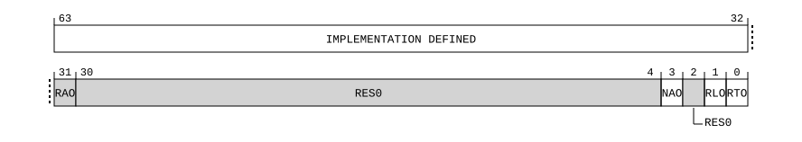

# ​D24.5.48 SPMROOTCR_EL3, System Performance Monitors Root and Realm Control Register

Source: <https://developer.arm.com/documentation/ddi0487/mc/-Part-D-The-AArch64-System-Level-Architecture/-Chapter-D24-AArch64-System-Register-Descriptions/-D24-5-Performance-Monitors-registers/-D24-5-48-SPMROOTCR-EL3--System-Performance-Monitors-Root-and-Realm-Control-Register>

##### D24.5.48 SPMROOTCR\_EL3, System Performance Monitors Root and Realm Control Register

The SPMROOTCR\_EL3 characteristics are:

Purpose
:   Controls observability of Root and Realm events by System PMU <s>.

Configuration
:   This register is present only when FEAT\_RME is implemented, FEAT\_SPMU is implemented, and FEAT\_AA64 is implemented. Otherwise, direct accesses to SPMROOTCR\_EL3 are UNDEFINED.

Attributes
:   SPMROOTCR\_EL3 is a 64-bit register.

###### Field descriptions



IMPLEMENTATION DEFINED, bits [63:32]
:   IMPLEMENTATION DEFINED observation controls. Additional IMPLEMENTATION DEFINED bits to control certain types of filter or events by System PMU <s>.

    The reset behavior of this field is:

    - On a System PMU reset, this field resets to an IMPLEMENTATION DEFINED value.

Bit [31]
:   Reserved, RAO.

    Indicates SPMROOTCR\_EL3 is implemented by System PMU <s>.

Bits [30:4]
:   Reserved, RES0.

NAO, bit [3]
:   When System PMU <s> can count or monitor non-attributable events:
    :   Non-attributable Observation. Controls whether events or monitorable characteristics not attributable with any source can be monitored by System PMU <s>.

<table>
 <colgroup>
  <col/>
  <col/>
 </colgroup>
 <thead>
  <tr>
   <th>
    <strong>
     NAO
    </strong>
   </th>
   <th>
    <strong>
     Meaning
    </strong>
   </th>
  </tr>
 </thead>
 <tbody>
  <tr>
   <td>
    <p>
     <code>
      0b0
     </code>
    </p>
   </td>
   <td>
    <p>
     Events not attributable with any event source are not counted by System PMU &lt;s&gt;.
    </p>
   </td>
  </tr>
  <tr>
   <td>
    <p>
     <code>
      0b1
     </code>
    </p>
   </td>
   <td>
    <p>
     Counting non-attributable events by System PMU &lt;s&gt; is not prevented by this mechanism.
    </p>
   </td>
  </tr>
 </tbody>
</table>

        When both SPMROOTCR\_EL3 and [SPMSCR\_EL1](/documentation/ddi0487/mc/-Part-D-The-AArch64-System-Level-Architecture/-Chapter-D24-AArch64-System-Register-Descriptions/-D24-5-Performance-Monitors-registers/-D24-5-49-SPMSCR-EL1--System-Performance-Monitors-Secure-Control-Register?lang=en#reg_aarch64_spmscr_el1) are implemented, non-attributable events are counted only if both SPMROOTCR\_EL3.NAO is 1 and [SPMSCR\_EL1](/documentation/ddi0487/mc/-Part-D-The-AArch64-System-Level-Architecture/-Chapter-D24-AArch64-System-Register-Descriptions/-D24-5-Performance-Monitors-registers/-D24-5-49-SPMSCR-EL1--System-Performance-Monitors-Secure-Control-Register?lang=en#reg_aarch64_spmscr_el1).{NAO, SO} is nonzero.

        SPMROOTCR\_EL3.NAO has the opposite reset polarity to [SPMSCR\_EL1](/documentation/ddi0487/mc/-Part-D-The-AArch64-System-Level-Architecture/-Chapter-D24-AArch64-System-Register-Descriptions/-D24-5-Performance-Monitors-registers/-D24-5-49-SPMSCR-EL1--System-Performance-Monitors-Secure-Control-Register?lang=en#reg_aarch64_spmscr_el1).NAO.

        The reset behavior of this field is:

        - On a System PMU reset, this field resets to `'1'`.

    Otherwise:
    :   Reserved, RES0.

Bit [2]
:   Reserved, RES0.

RLO, bit [1]
:   Realm Observation. Controls whether events or monitorable characteristics attributable to a Realm event source can be monitored by System PMU <s>.

<table>
 <colgroup>
  <col/>
  <col/>
 </colgroup>
 <thead>
  <tr>
   <th>
    <strong>
     RLO
    </strong>
   </th>
   <th>
    <strong>
     Meaning
    </strong>
   </th>
  </tr>
 </thead>
 <tbody>
  <tr>
   <td>
    <p>
     <code>
      0b0
     </code>
    </p>
   </td>
   <td>
    <p>
     Events attributable to a Realm event source are not counted by System PMU &lt;s&gt;.
    </p>
   </td>
  </tr>
  <tr>
   <td>
    <p>
     <code>
      0b1
     </code>
    </p>
   </td>
   <td>
    <p>
     Counting events by System PMU &lt;s&gt; that are attributable to a Realm event source is not prevented by this mechanism.
    </p>
   </td>
  </tr>
 </tbody>
</table>

    The reset behavior of this field is:

    - On a System PMU reset, this field resets to `'0'`.

RTO, bit [0]
:   Root Observation. Controls whether events or monitorable characteristics attributable to a Root event source can be monitored by System PMU <s>.

<table>
 <colgroup>
  <col/>
  <col/>
 </colgroup>
 <thead>
  <tr>
   <th>
    <strong>
     RTO
    </strong>
   </th>
   <th>
    <strong>
     Meaning
    </strong>
   </th>
  </tr>
 </thead>
 <tbody>
  <tr>
   <td>
    <p>
     <code>
      0b0
     </code>
    </p>
   </td>
   <td>
    <p>
     Events attributable to a Root event source are not counted by System PMU &lt;s&gt;.
    </p>
   </td>
  </tr>
  <tr>
   <td>
    <p>
     <code>
      0b1
     </code>
    </p>
   </td>
   <td>
    <p>
     Counting events by System PMU &lt;s&gt; that are attributable to a Root event source is not prevented by this mechanism.
    </p>
   </td>
  </tr>
 </tbody>
</table>

    The reset behavior of this field is:

    - On a System PMU reset, this field resets to `'0'`.

###### Accessing SPMROOTCR\_EL3

To access SPMROOTCR\_EL3 for System PMU <s>, set [SPMSELR\_EL0](/documentation/ddi0487/mc/-Part-D-The-AArch64-System-Level-Architecture/-Chapter-D24-AArch64-System-Register-Descriptions/-D24-5-Performance-Monitors-registers/-D24-5-50-SPMSELR-EL0--System-Performance-Monitors-Select-Register?lang=en#reg_aarch64_spmselr_el0).SYSPMUSEL to s.

SPMROOTCR\_EL3 reads-as-zero and ignores writes if any of the following are true:

- System PMU <s> is not implemented.
- System PMU <s> does not implement SPMROOTCR\_EL3.

Accesses to this register use the following encodings in the System register encoding space:

###### `MRS <Xt>, SPMROOTCR_EL3`

<table>
 <colgroup>
  <col/>
  <col/>
  <col/>
  <col/>
  <col/>
 </colgroup>
 <thead>
  <tr>
   <th>
    <strong>
     op0
    </strong>
   </th>
   <th>
    <strong>
     op1
    </strong>
   </th>
   <th>
    <strong>
     CRn
    </strong>
   </th>
   <th>
    <strong>
     CRm
    </strong>
   </th>
   <th>
    <strong>
     op2
    </strong>
   </th>
  </tr>
 </thead>
 <tbody>
  <tr>
   <td>
    <p>
     <code>
      0b10
     </code>
    </p>
   </td>
   <td>
    <p>
     <code>
      0b110
     </code>
    </p>
   </td>
   <td>
    <p>
     <code>
      0b1001
     </code>
    </p>
   </td>
   <td>
    <p>
     <code>
      0b1110
     </code>
    </p>
   </td>
   <td>
    <p>
     <code>
      0b111
     </code>
    </p>
   </td>
  </tr>
 </tbody>
</table>

```
if !(IsFeatureImplemented(FEAT_RME) && IsFeatureImplemented(FEAT_SPMU) && IsFeatureImplemented(FEAT_AA64)) then
    Undefined();
elsif PSTATE.EL == EL0 then
    Undefined();
elsif PSTATE.EL == EL1 then
    Undefined();
elsif PSTATE.EL == EL2 then
    Undefined();
elsif PSTATE.EL == EL3 then
    X{64}(t) = SPMROOTCR_EL3(UInt(SPMSELR_EL0().SYSPMUSEL));
end;
```

###### `MSR SPMROOTCR_EL3, <Xt>`

<table>
 <colgroup>
  <col/>
  <col/>
  <col/>
  <col/>
  <col/>
 </colgroup>
 <thead>
  <tr>
   <th>
    <strong>
     op0
    </strong>
   </th>
   <th>
    <strong>
     op1
    </strong>
   </th>
   <th>
    <strong>
     CRn
    </strong>
   </th>
   <th>
    <strong>
     CRm
    </strong>
   </th>
   <th>
    <strong>
     op2
    </strong>
   </th>
  </tr>
 </thead>
 <tbody>
  <tr>
   <td>
    <p>
     <code>
      0b10
     </code>
    </p>
   </td>
   <td>
    <p>
     <code>
      0b110
     </code>
    </p>
   </td>
   <td>
    <p>
     <code>
      0b1001
     </code>
    </p>
   </td>
   <td>
    <p>
     <code>
      0b1110
     </code>
    </p>
   </td>
   <td>
    <p>
     <code>
      0b111
     </code>
    </p>
   </td>
  </tr>
 </tbody>
</table>

```
if !(IsFeatureImplemented(FEAT_RME) && IsFeatureImplemented(FEAT_SPMU) && IsFeatureImplemented(FEAT_AA64)) then
    Undefined();
elsif PSTATE.EL == EL0 then
    Undefined();
elsif PSTATE.EL == EL1 then
    Undefined();
elsif PSTATE.EL == EL2 then
    Undefined();
elsif PSTATE.EL == EL3 then
    if IsFeatureImplemented(FEAT_FGWTE3) && FGWTE3_EL3().SPMROOTCR_EL3 == '1' then
        AArch64_SystemAccessTrap(EL3, 0x18);
    else
        SPMROOTCR_EL3(UInt(SPMSELR_EL0().SYSPMUSEL)) = X{64}(t);
    end;
end;
```
