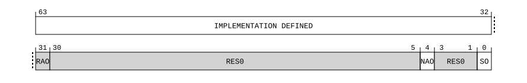

# ​D24.5.49 SPMSCR_EL1, System Performance Monitors Secure Control Register

Source: <https://developer.arm.com/documentation/ddi0487/mc/-Part-D-The-AArch64-System-Level-Architecture/-Chapter-D24-AArch64-System-Register-Descriptions/-D24-5-Performance-Monitors-registers/-D24-5-49-SPMSCR-EL1--System-Performance-Monitors-Secure-Control-Register>

##### D24.5.49 SPMSCR\_EL1, System Performance Monitors Secure Control Register

The SPMSCR\_EL1 characteristics are:

Purpose
:   Controls observability of Secure events by System PMU <s>, and optionally controls Secure attributes for message signaled interrupts and Non-secure access to the performance monitor registers.

Configuration
:   This register is present only when Secure EL1 is implemented, FEAT\_SPMU is implemented, and FEAT\_AA64 is implemented. Otherwise, direct accesses to SPMSCR\_EL1 are UNDEFINED.

Attributes
:   SPMSCR\_EL1 is a 64-bit register.

###### Field descriptions



IMPLEMENTATION DEFINED, bits [63:32]
:   IMPLEMENTATION DEFINED observation controls. Additional IMPLEMENTATION DEFINED bits to control certain types of filter or events by System PMU <s>.

    The reset behavior of this field is:

    - On a System PMU reset, this field resets to an IMPLEMENTATION DEFINED value.

Bit [31]
:   Reserved, RAO.

    Indicates SPMSCR\_EL1 is implemented by System PMU <s>.

    This field reads-as-one.

Bits [30:5]
:   Reserved, RES0.

NAO, bit [4]
:   When System PMU <s> can count or monitor non-attributable events:
    :   Non-attributable Observation. Controls whether events or monitorable characteristics not attributable with any source can be monitored by System PMU <s>.

<table>
 <colgroup>
  <col/>
  <col/>
 </colgroup>
 <thead>
  <tr>
   <th>
    <strong>
     NAO
    </strong>
   </th>
   <th>
    <strong>
     Meaning
    </strong>
   </th>
  </tr>
 </thead>
 <tbody>
  <tr>
   <td>
    <p>
     <code>
      0b0
     </code>
    </p>
   </td>
   <td>
    <p>
     Events not attributable with any event source are not counted by System PMU &lt;s&gt;, unless overridden by SPMSCR_EL1.SO.
    </p>
   </td>
  </tr>
  <tr>
   <td>
    <p>
     <code>
      0b1
     </code>
    </p>
   </td>
   <td>
    <p>
     Counting non-attributable events by System PMU &lt;s&gt; is not prevented by this mechanism.
    </p>
   </td>
  </tr>
 </tbody>
</table>

        When both [SPMROOTCR\_EL3](/documentation/ddi0487/mc/-Part-D-The-AArch64-System-Level-Architecture/-Chapter-D24-AArch64-System-Register-Descriptions/-D24-5-Performance-Monitors-registers/-D24-5-48-SPMROOTCR-EL3--System-Performance-Monitors-Root-and-Realm-Control-Register?lang=en#reg_aarch64_spmrootcr_el3) and SPMSCR\_EL1 are implemented, non-attributable events are counted only if both [SPMROOTCR\_EL3](/documentation/ddi0487/mc/-Part-D-The-AArch64-System-Level-Architecture/-Chapter-D24-AArch64-System-Register-Descriptions/-D24-5-Performance-Monitors-registers/-D24-5-48-SPMROOTCR-EL3--System-Performance-Monitors-Root-and-Realm-Control-Register?lang=en#reg_aarch64_spmrootcr_el3).NAO is 1 and SPMSCR\_EL1.{NAO, SO} is nonzero.

        SPMSCR\_EL1.NAO has the opposite reset polarity to [SPMROOTCR\_EL3](/documentation/ddi0487/mc/-Part-D-The-AArch64-System-Level-Architecture/-Chapter-D24-AArch64-System-Register-Descriptions/-D24-5-Performance-Monitors-registers/-D24-5-48-SPMROOTCR-EL3--System-Performance-Monitors-Root-and-Realm-Control-Register?lang=en#reg_aarch64_spmrootcr_el3).NAO.

        This field is optional if Root and Realm states are not implemented. When this field is not implemented, System PMU <s> behaves as if SPMSCR\_EL1.NAO is 0, and whether events or monitorable characteristics not attributable with any source can be monitored is controlled by SPMSCR\_EL1.SO.

        The reset behavior of this field is:

        - On a System PMU reset, this field resets to `'0'`.

    Otherwise:
    :   Reserved, RES0.

Bits [3:1]
:   Reserved, RES0.

SO, bit [0]
:   Secure Observation. Controls whether events or monitorable characteristics attributable to a Secure event source can be monitored by System PMU <s>.

<table>
 <colgroup>
  <col/>
  <col/>
 </colgroup>
 <thead>
  <tr>
   <th>
    <strong>
     SO
    </strong>
   </th>
   <th>
    <strong>
     Meaning
    </strong>
   </th>
  </tr>
 </thead>
 <tbody>
  <tr>
   <td>
    <p>
     <code>
      0b0
     </code>
    </p>
   </td>
   <td>
    <p>
     Events attributable to a Secure event source are not counted by System PMU &lt;s&gt;.
    </p>
   </td>
  </tr>
  <tr>
   <td>
    <p>
     <code>
      0b1
     </code>
    </p>
   </td>
   <td>
    <p>
     Counting events by System PMU &lt;s&gt; that are attributable to a Secure event source is not prevented by this mechanism.
    </p>
   </td>
  </tr>
 </tbody>
</table>

    Also controls whether events or monitorable characteristics not attributable with any source can be monitored by System PMU <s>. See SPMSCR\_EL1.NAO.

    The reset behavior of this field is:

    - On a System PMU reset, this field resets to `'0'`.

###### Accessing SPMSCR\_EL1

To access SPMSCR\_EL1 for System PMU <s>, set [SPMSELR\_EL0](/documentation/ddi0487/mc/-Part-D-The-AArch64-System-Level-Architecture/-Chapter-D24-AArch64-System-Register-Descriptions/-D24-5-Performance-Monitors-registers/-D24-5-50-SPMSELR-EL0--System-Performance-Monitors-Select-Register?lang=en#reg_aarch64_spmselr_el0).SYSPMUSEL to s.

SPMSCR\_EL1 reads-as-zero and ignores writes if any of the following are true:

- System PMU <s> is not implemented.
- System PMU <s> does not implement SPMSCR\_EL1.

SPMSCR\_EL1 is UNDEFINED if accessed in Non-secure or Realm state.

Accesses to this register use the following encodings in the System register encoding space:

###### `MRS <Xt>, SPMSCR_EL1`

<table>
 <colgroup>
  <col/>
  <col/>
  <col/>
  <col/>
  <col/>
 </colgroup>
 <thead>
  <tr>
   <th>
    <strong>
     op0
    </strong>
   </th>
   <th>
    <strong>
     op1
    </strong>
   </th>
   <th>
    <strong>
     CRn
    </strong>
   </th>
   <th>
    <strong>
     CRm
    </strong>
   </th>
   <th>
    <strong>
     op2
    </strong>
   </th>
  </tr>
 </thead>
 <tbody>
  <tr>
   <td>
    <p>
     <code>
      0b10
     </code>
    </p>
   </td>
   <td>
    <p>
     <code>
      0b111
     </code>
    </p>
   </td>
   <td>
    <p>
     <code>
      0b1001
     </code>
    </p>
   </td>
   <td>
    <p>
     <code>
      0b1110
     </code>
    </p>
   </td>
   <td>
    <p>
     <code>
      0b111
     </code>
    </p>
   </td>
  </tr>
 </tbody>
</table>

```
if !(HaveELUsingSecurityState(EL1, TRUE) && IsFeatureImplemented(FEAT_SPMU) && IsFeatureImplemented(FEAT_AA64)) then
    Undefined();
elsif IsCurrentSecurityState(SS_NonSecure) || (IsFeatureImplemented(FEAT_RME) && IsCurrentSecurityState(SS_Realm)) then
    Undefined();
elsif HaveEL(EL3) && !(EffectivelyAtEL0InHost() || EffectivelyAtEL0NotInHost() || PSTATE.EL == EL3) && EL3SDDUndefPriority() && MDCR_EL3().EnPM2 == '0' then
    Undefined();
elsif HaveEL(EL3) && !(EffectivelyAtEL0InHost() || EffectivelyAtEL0NotInHost() || PSTATE.EL == EL3) && EL3SDDUndefPriority() && SPMACCESSR_EL3()[UInt(SPMSELR_EL0().SYSPMUSEL) * 2+:2] == '00' then
    Undefined();
elsif PSTATE.EL == EL0 then
    Undefined();
elsif PSTATE.EL == EL1 then
    if EL2Enabled() && IsFeatureImplemented(FEAT_FGT2) && ((HaveEL(EL3) && SCR_EL3().FGTEn2 == '0') || HDFGRTR2_EL2().nSPMSCR_EL1 == '0') then
        AArch64_SystemAccessTrap(EL2, 0x18);
    elsif EL2Enabled() && MDCR_EL2().EnSPM == '0' then
        AArch64_SystemAccessTrap(EL2, 0x18);
    elsif EL2Enabled() && SPMACCESSR_EL2()[UInt(SPMSELR_EL0().SYSPMUSEL) * 2+:2] == '00' then
        AArch64_SystemAccessTrap(EL2, 0x18);
    elsif HaveEL(EL3) && MDCR_EL3().EnPM2 == '0' then
        if EL3SDDUndef() then
            Undefined();
        else
            AArch64_SystemAccessTrap(EL3, 0x18);
        end;
    elsif HaveEL(EL3) && SPMACCESSR_EL3()[UInt(SPMSELR_EL0().SYSPMUSEL) * 2+:2] == '00' then
        if EL3SDDUndef() then
            Undefined();
        else
            AArch64_SystemAccessTrap(EL3, 0x18);
        end;
    else
        X{64}(t) = SPMSCR_EL1(UInt(SPMSELR_EL0().SYSPMUSEL));
    end;
elsif PSTATE.EL == EL2 then
    if HaveEL(EL3) && MDCR_EL3().EnPM2 == '0' then
        if EL3SDDUndef() then
            Undefined();
        else
            AArch64_SystemAccessTrap(EL3, 0x18);
        end;
    elsif HaveEL(EL3) && SPMACCESSR_EL3()[UInt(SPMSELR_EL0().SYSPMUSEL) * 2+:2] == '00' then
        if EL3SDDUndef() then
            Undefined();
        else
            AArch64_SystemAccessTrap(EL3, 0x18);
        end;
    else
        X{64}(t) = SPMSCR_EL1(UInt(SPMSELR_EL0().SYSPMUSEL));
    end;
elsif PSTATE.EL == EL3 then
    X{64}(t) = SPMSCR_EL1(UInt(SPMSELR_EL0().SYSPMUSEL));
end;
```

###### `MSR SPMSCR_EL1, <Xt>`

<table>
 <colgroup>
  <col/>
  <col/>
  <col/>
  <col/>
  <col/>
 </colgroup>
 <thead>
  <tr>
   <th>
    <strong>
     op0
    </strong>
   </th>
   <th>
    <strong>
     op1
    </strong>
   </th>
   <th>
    <strong>
     CRn
    </strong>
   </th>
   <th>
    <strong>
     CRm
    </strong>
   </th>
   <th>
    <strong>
     op2
    </strong>
   </th>
  </tr>
 </thead>
 <tbody>
  <tr>
   <td>
    <p>
     <code>
      0b10
     </code>
    </p>
   </td>
   <td>
    <p>
     <code>
      0b111
     </code>
    </p>
   </td>
   <td>
    <p>
     <code>
      0b1001
     </code>
    </p>
   </td>
   <td>
    <p>
     <code>
      0b1110
     </code>
    </p>
   </td>
   <td>
    <p>
     <code>
      0b111
     </code>
    </p>
   </td>
  </tr>
 </tbody>
</table>

```
if !(HaveELUsingSecurityState(EL1, TRUE) && IsFeatureImplemented(FEAT_SPMU) && IsFeatureImplemented(FEAT_AA64)) then
    Undefined();
elsif IsCurrentSecurityState(SS_NonSecure) || (IsFeatureImplemented(FEAT_RME) && IsCurrentSecurityState(SS_Realm)) then
    Undefined();
elsif HaveEL(EL3) && !(EffectivelyAtEL0InHost() || EffectivelyAtEL0NotInHost() || PSTATE.EL == EL3) && EL3SDDUndefPriority() && MDCR_EL3().EnPM2 == '0' then
    Undefined();
elsif HaveEL(EL3) && !(EffectivelyAtEL0InHost() || EffectivelyAtEL0NotInHost() || PSTATE.EL == EL3) && EL3SDDUndefPriority() && SPMACCESSR_EL3()[UInt(SPMSELR_EL0().SYSPMUSEL) * 2+:2] != '11' then
    Undefined();
elsif PSTATE.EL == EL0 then
    Undefined();
elsif PSTATE.EL == EL1 then
    if EL2Enabled() && IsFeatureImplemented(FEAT_FGT2) && ((HaveEL(EL3) && SCR_EL3().FGTEn2 == '0') || HDFGWTR2_EL2().nSPMSCR_EL1 == '0') then
        AArch64_SystemAccessTrap(EL2, 0x18);
    elsif EL2Enabled() && MDCR_EL2().EnSPM == '0' then
        AArch64_SystemAccessTrap(EL2, 0x18);
    elsif EL2Enabled() && SPMACCESSR_EL2()[UInt(SPMSELR_EL0().SYSPMUSEL) * 2+:2] != '11' then
        AArch64_SystemAccessTrap(EL2, 0x18);
    elsif HaveEL(EL3) && MDCR_EL3().EnPM2 == '0' then
        if EL3SDDUndef() then
            Undefined();
        else
            AArch64_SystemAccessTrap(EL3, 0x18);
        end;
    elsif HaveEL(EL3) && SPMACCESSR_EL3()[UInt(SPMSELR_EL0().SYSPMUSEL) * 2+:2] != '11' then
        if EL3SDDUndef() then
            Undefined();
        else
            AArch64_SystemAccessTrap(EL3, 0x18);
        end;
    else
        SPMSCR_EL1(UInt(SPMSELR_EL0().SYSPMUSEL)) = X{64}(t);
    end;
elsif PSTATE.EL == EL2 then
    if HaveEL(EL3) && MDCR_EL3().EnPM2 == '0' then
        if EL3SDDUndef() then
            Undefined();
        else
            AArch64_SystemAccessTrap(EL3, 0x18);
        end;
    elsif HaveEL(EL3) && SPMACCESSR_EL3()[UInt(SPMSELR_EL0().SYSPMUSEL) * 2+:2] != '11' then
        if EL3SDDUndef() then
            Undefined();
        else
            AArch64_SystemAccessTrap(EL3, 0x18);
        end;
    else
        SPMSCR_EL1(UInt(SPMSELR_EL0().SYSPMUSEL)) = X{64}(t);
    end;
elsif PSTATE.EL == EL3 then
    SPMSCR_EL1(UInt(SPMSELR_EL0().SYSPMUSEL)) = X{64}(t);
end;
```
