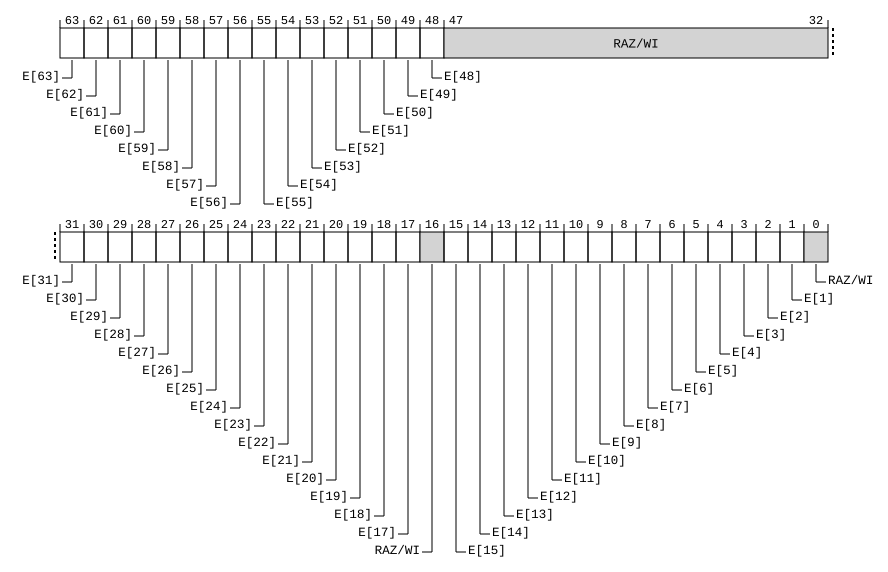

# ​D24.7.17 PMSNEVFR_EL1, Sampling Inverted Event Filter Register

Source: <https://developer.arm.com/documentation/ddi0487/mc/-Part-D-The-AArch64-System-Level-Architecture/-Chapter-D24-AArch64-System-Register-Descriptions/-D24-7-Statistical-Profiling-Extension-registers/-D24-7-17-PMSNEVFR-EL1--Sampling-Inverted-Event-Filter-Register>

##### D24.7.17 PMSNEVFR\_EL1, Sampling Inverted Event Filter Register

The PMSNEVFR\_EL1 characteristics are:

Purpose
:   Controls sample filtering by events. The overall inverted filter is the logical OR of these filters. For example, if PMSNEVFR\_EL1.E[3] and PMSNEVFR\_EL1.E[5] are both set to 1, samples that have either event 3 (Level 1 unified or data cache refill) or event 5 (TLB walk) set to 1 are not recorded.

Configuration
:   This register is present only when FEAT\_SPE\_FnE is implemented. Otherwise, direct accesses to PMSNEVFR\_EL1 are UNDEFINED.

Attributes
:   PMSNEVFR\_EL1 is a 64-bit register.

###### Field descriptions



E[63], bit [63]
:   When event 63 is implemented and filtering on event 63 is supported:
    :   Filter on IMPLEMENTATION DEFINED event 63.

<table>
 <colgroup>
  <col/>
  <col/>
 </colgroup>
 <thead>
  <tr>
   <th>
    <strong>
     E[63]
    </strong>
   </th>
   <th>
    <strong>
     Meaning
    </strong>
   </th>
  </tr>
 </thead>
 <tbody>
  <tr>
   <td>
    <p>
     <code>
      0b0
     </code>
    </p>
   </td>
   <td>
    <p>
     Events packet.E[63] is ignored by the PMSNEVFR_EL1 filter.
    </p>
   </td>
  </tr>
  <tr>
   <td>
    <p>
     <code>
      0b1
     </code>
    </p>
   </td>
   <td>
    <p>
     Do not record samples that have Events packet.E[63] == 1.
    </p>
   </td>
  </tr>
 </tbody>
</table>

        An IMPLEMENTATION DEFINED event might be recorded as a multi-bit field. In this case, the corresponding bits of PMSNEVFR\_EL1 define an IMPLEMENTATION DEFINED filter for the event.

        If [PMSFCR\_EL1](/documentation/ddi0487/mc/-Part-D-The-AArch64-System-Level-Architecture/-Chapter-D24-AArch64-System-Register-Descriptions/-D24-7-Statistical-Profiling-Extension-registers/-D24-7-12-PMSFCR-EL1--Sampling-Filter-Control-Register?lang=en#reg_aarch64_pmsfcr_el1).FnE is 1, PMSFCR\_EL1.FE is 1, [PMSEVFR\_EL1](/documentation/ddi0487/mc/-Part-D-The-AArch64-System-Level-Architecture/-Chapter-D24-AArch64-System-Register-Descriptions/-D24-7-Statistical-Profiling-Extension-registers/-D24-7-11-PMSEVFR-EL1--Sampling-Event-Filter-Register?lang=en#reg_aarch64_pmsevfr_el1).E[63] is 1, and PMSNEVFR\_EL1.E[63] is 1, then, for each sampled operation, it is CONSTRAINED UNPREDICTABLE whether the sample is discarded, and it is CONSTRAINED UNPREDICTABLE whether the SAMPLE\_FEED\_EVENT PMU event is generated.

        This field is ignored by the PE when [PMSFCR\_EL1](/documentation/ddi0487/mc/-Part-D-The-AArch64-System-Level-Architecture/-Chapter-D24-AArch64-System-Register-Descriptions/-D24-7-Statistical-Profiling-Extension-registers/-D24-7-12-PMSFCR-EL1--Sampling-Filter-Control-Register?lang=en#reg_aarch64_pmsfcr_el1).FnE is 0

        The reset behavior of this field is:

        - On a Warm reset, this field resets to an architecturally UNKNOWN value.

    Otherwise:
    :   Reserved, RAZ/WI.

E[62], bit [62]
:   When event 62 is implemented and filtering on event 62 is supported:
    :   Filter on IMPLEMENTATION DEFINED event 62.

<table>
 <colgroup>
  <col/>
  <col/>
 </colgroup>
 <thead>
  <tr>
   <th>
    <strong>
     E[62]
    </strong>
   </th>
   <th>
    <strong>
     Meaning
    </strong>
   </th>
  </tr>
 </thead>
 <tbody>
  <tr>
   <td>
    <p>
     <code>
      0b0
     </code>
    </p>
   </td>
   <td>
    <p>
     Events packet.E[62] is ignored by the PMSNEVFR_EL1 filter.
    </p>
   </td>
  </tr>
  <tr>
   <td>
    <p>
     <code>
      0b1
     </code>
    </p>
   </td>
   <td>
    <p>
     Do not record samples that have Events packet.E[62] == 1.
    </p>
   </td>
  </tr>
 </tbody>
</table>

        An IMPLEMENTATION DEFINED event might be recorded as a multi-bit field. In this case, the corresponding bits of PMSNEVFR\_EL1 define an IMPLEMENTATION DEFINED filter for the event.

        If [PMSFCR\_EL1](/documentation/ddi0487/mc/-Part-D-The-AArch64-System-Level-Architecture/-Chapter-D24-AArch64-System-Register-Descriptions/-D24-7-Statistical-Profiling-Extension-registers/-D24-7-12-PMSFCR-EL1--Sampling-Filter-Control-Register?lang=en#reg_aarch64_pmsfcr_el1).FnE is 1, PMSFCR\_EL1.FE is 1, [PMSEVFR\_EL1](/documentation/ddi0487/mc/-Part-D-The-AArch64-System-Level-Architecture/-Chapter-D24-AArch64-System-Register-Descriptions/-D24-7-Statistical-Profiling-Extension-registers/-D24-7-11-PMSEVFR-EL1--Sampling-Event-Filter-Register?lang=en#reg_aarch64_pmsevfr_el1).E[62] is 1, and PMSNEVFR\_EL1.E[62] is 1, then, for each sampled operation, it is CONSTRAINED UNPREDICTABLE whether the sample is discarded, and it is CONSTRAINED UNPREDICTABLE whether the SAMPLE\_FEED\_EVENT PMU event is generated.

        This field is ignored by the PE when [PMSFCR\_EL1](/documentation/ddi0487/mc/-Part-D-The-AArch64-System-Level-Architecture/-Chapter-D24-AArch64-System-Register-Descriptions/-D24-7-Statistical-Profiling-Extension-registers/-D24-7-12-PMSFCR-EL1--Sampling-Filter-Control-Register?lang=en#reg_aarch64_pmsfcr_el1).FnE is 0

        The reset behavior of this field is:

        - On a Warm reset, this field resets to an architecturally UNKNOWN value.

    Otherwise:
    :   Reserved, RAZ/WI.

E[61], bit [61]
:   When event 61 is implemented and filtering on event 61 is supported:
    :   Filter on IMPLEMENTATION DEFINED event 61.

<table>
 <colgroup>
  <col/>
  <col/>
 </colgroup>
 <thead>
  <tr>
   <th>
    <strong>
     E[61]
    </strong>
   </th>
   <th>
    <strong>
     Meaning
    </strong>
   </th>
  </tr>
 </thead>
 <tbody>
  <tr>
   <td>
    <p>
     <code>
      0b0
     </code>
    </p>
   </td>
   <td>
    <p>
     Events packet.E[61] is ignored by the PMSNEVFR_EL1 filter.
    </p>
   </td>
  </tr>
  <tr>
   <td>
    <p>
     <code>
      0b1
     </code>
    </p>
   </td>
   <td>
    <p>
     Do not record samples that have Events packet.E[61] == 1.
    </p>
   </td>
  </tr>
 </tbody>
</table>

        An IMPLEMENTATION DEFINED event might be recorded as a multi-bit field. In this case, the corresponding bits of PMSNEVFR\_EL1 define an IMPLEMENTATION DEFINED filter for the event.

        If [PMSFCR\_EL1](/documentation/ddi0487/mc/-Part-D-The-AArch64-System-Level-Architecture/-Chapter-D24-AArch64-System-Register-Descriptions/-D24-7-Statistical-Profiling-Extension-registers/-D24-7-12-PMSFCR-EL1--Sampling-Filter-Control-Register?lang=en#reg_aarch64_pmsfcr_el1).FnE is 1, PMSFCR\_EL1.FE is 1, [PMSEVFR\_EL1](/documentation/ddi0487/mc/-Part-D-The-AArch64-System-Level-Architecture/-Chapter-D24-AArch64-System-Register-Descriptions/-D24-7-Statistical-Profiling-Extension-registers/-D24-7-11-PMSEVFR-EL1--Sampling-Event-Filter-Register?lang=en#reg_aarch64_pmsevfr_el1).E[61] is 1, and PMSNEVFR\_EL1.E[61] is 1, then, for each sampled operation, it is CONSTRAINED UNPREDICTABLE whether the sample is discarded, and it is CONSTRAINED UNPREDICTABLE whether the SAMPLE\_FEED\_EVENT PMU event is generated.

        This field is ignored by the PE when [PMSFCR\_EL1](/documentation/ddi0487/mc/-Part-D-The-AArch64-System-Level-Architecture/-Chapter-D24-AArch64-System-Register-Descriptions/-D24-7-Statistical-Profiling-Extension-registers/-D24-7-12-PMSFCR-EL1--Sampling-Filter-Control-Register?lang=en#reg_aarch64_pmsfcr_el1).FnE is 0

        The reset behavior of this field is:

        - On a Warm reset, this field resets to an architecturally UNKNOWN value.

    Otherwise:
    :   Reserved, RAZ/WI.

E[60], bit [60]
:   When event 60 is implemented and filtering on event 60 is supported:
    :   Filter on IMPLEMENTATION DEFINED event 60.

<table>
 <colgroup>
  <col/>
  <col/>
 </colgroup>
 <thead>
  <tr>
   <th>
    <strong>
     E[60]
    </strong>
   </th>
   <th>
    <strong>
     Meaning
    </strong>
   </th>
  </tr>
 </thead>
 <tbody>
  <tr>
   <td>
    <p>
     <code>
      0b0
     </code>
    </p>
   </td>
   <td>
    <p>
     Events packet.E[60] is ignored by the PMSNEVFR_EL1 filter.
    </p>
   </td>
  </tr>
  <tr>
   <td>
    <p>
     <code>
      0b1
     </code>
    </p>
   </td>
   <td>
    <p>
     Do not record samples that have Events packet.E[60] == 1.
    </p>
   </td>
  </tr>
 </tbody>
</table>

        An IMPLEMENTATION DEFINED event might be recorded as a multi-bit field. In this case, the corresponding bits of PMSNEVFR\_EL1 define an IMPLEMENTATION DEFINED filter for the event.

        If [PMSFCR\_EL1](/documentation/ddi0487/mc/-Part-D-The-AArch64-System-Level-Architecture/-Chapter-D24-AArch64-System-Register-Descriptions/-D24-7-Statistical-Profiling-Extension-registers/-D24-7-12-PMSFCR-EL1--Sampling-Filter-Control-Register?lang=en#reg_aarch64_pmsfcr_el1).FnE is 1, PMSFCR\_EL1.FE is 1, [PMSEVFR\_EL1](/documentation/ddi0487/mc/-Part-D-The-AArch64-System-Level-Architecture/-Chapter-D24-AArch64-System-Register-Descriptions/-D24-7-Statistical-Profiling-Extension-registers/-D24-7-11-PMSEVFR-EL1--Sampling-Event-Filter-Register?lang=en#reg_aarch64_pmsevfr_el1).E[60] is 1, and PMSNEVFR\_EL1.E[60] is 1, then, for each sampled operation, it is CONSTRAINED UNPREDICTABLE whether the sample is discarded, and it is CONSTRAINED UNPREDICTABLE whether the SAMPLE\_FEED\_EVENT PMU event is generated.

        This field is ignored by the PE when [PMSFCR\_EL1](/documentation/ddi0487/mc/-Part-D-The-AArch64-System-Level-Architecture/-Chapter-D24-AArch64-System-Register-Descriptions/-D24-7-Statistical-Profiling-Extension-registers/-D24-7-12-PMSFCR-EL1--Sampling-Filter-Control-Register?lang=en#reg_aarch64_pmsfcr_el1).FnE is 0

        The reset behavior of this field is:

        - On a Warm reset, this field resets to an architecturally UNKNOWN value.

    Otherwise:
    :   Reserved, RAZ/WI.

E[59], bit [59]
:   When event 59 is implemented and filtering on event 59 is supported:
    :   Filter on IMPLEMENTATION DEFINED event 59.

<table>
 <colgroup>
  <col/>
  <col/>
 </colgroup>
 <thead>
  <tr>
   <th>
    <strong>
     E[59]
    </strong>
   </th>
   <th>
    <strong>
     Meaning
    </strong>
   </th>
  </tr>
 </thead>
 <tbody>
  <tr>
   <td>
    <p>
     <code>
      0b0
     </code>
    </p>
   </td>
   <td>
    <p>
     Events packet.E[59] is ignored by the PMSNEVFR_EL1 filter.
    </p>
   </td>
  </tr>
  <tr>
   <td>
    <p>
     <code>
      0b1
     </code>
    </p>
   </td>
   <td>
    <p>
     Do not record samples that have Events packet.E[59] == 1.
    </p>
   </td>
  </tr>
 </tbody>
</table>

        An IMPLEMENTATION DEFINED event might be recorded as a multi-bit field. In this case, the corresponding bits of PMSNEVFR\_EL1 define an IMPLEMENTATION DEFINED filter for the event.

        If [PMSFCR\_EL1](/documentation/ddi0487/mc/-Part-D-The-AArch64-System-Level-Architecture/-Chapter-D24-AArch64-System-Register-Descriptions/-D24-7-Statistical-Profiling-Extension-registers/-D24-7-12-PMSFCR-EL1--Sampling-Filter-Control-Register?lang=en#reg_aarch64_pmsfcr_el1).FnE is 1, PMSFCR\_EL1.FE is 1, [PMSEVFR\_EL1](/documentation/ddi0487/mc/-Part-D-The-AArch64-System-Level-Architecture/-Chapter-D24-AArch64-System-Register-Descriptions/-D24-7-Statistical-Profiling-Extension-registers/-D24-7-11-PMSEVFR-EL1--Sampling-Event-Filter-Register?lang=en#reg_aarch64_pmsevfr_el1).E[59] is 1, and PMSNEVFR\_EL1.E[59] is 1, then, for each sampled operation, it is CONSTRAINED UNPREDICTABLE whether the sample is discarded, and it is CONSTRAINED UNPREDICTABLE whether the SAMPLE\_FEED\_EVENT PMU event is generated.

        This field is ignored by the PE when [PMSFCR\_EL1](/documentation/ddi0487/mc/-Part-D-The-AArch64-System-Level-Architecture/-Chapter-D24-AArch64-System-Register-Descriptions/-D24-7-Statistical-Profiling-Extension-registers/-D24-7-12-PMSFCR-EL1--Sampling-Filter-Control-Register?lang=en#reg_aarch64_pmsfcr_el1).FnE is 0

        The reset behavior of this field is:

        - On a Warm reset, this field resets to an architecturally UNKNOWN value.

    Otherwise:
    :   Reserved, RAZ/WI.

E[58], bit [58]
:   When event 58 is implemented and filtering on event 58 is supported:
    :   Filter on IMPLEMENTATION DEFINED event 58.

<table>
 <colgroup>
  <col/>
  <col/>
 </colgroup>
 <thead>
  <tr>
   <th>
    <strong>
     E[58]
    </strong>
   </th>
   <th>
    <strong>
     Meaning
    </strong>
   </th>
  </tr>
 </thead>
 <tbody>
  <tr>
   <td>
    <p>
     <code>
      0b0
     </code>
    </p>
   </td>
   <td>
    <p>
     Events packet.E[58] is ignored by the PMSNEVFR_EL1 filter.
    </p>
   </td>
  </tr>
  <tr>
   <td>
    <p>
     <code>
      0b1
     </code>
    </p>
   </td>
   <td>
    <p>
     Do not record samples that have Events packet.E[58] == 1.
    </p>
   </td>
  </tr>
 </tbody>
</table>

        An IMPLEMENTATION DEFINED event might be recorded as a multi-bit field. In this case, the corresponding bits of PMSNEVFR\_EL1 define an IMPLEMENTATION DEFINED filter for the event.

        If [PMSFCR\_EL1](/documentation/ddi0487/mc/-Part-D-The-AArch64-System-Level-Architecture/-Chapter-D24-AArch64-System-Register-Descriptions/-D24-7-Statistical-Profiling-Extension-registers/-D24-7-12-PMSFCR-EL1--Sampling-Filter-Control-Register?lang=en#reg_aarch64_pmsfcr_el1).FnE is 1, PMSFCR\_EL1.FE is 1, [PMSEVFR\_EL1](/documentation/ddi0487/mc/-Part-D-The-AArch64-System-Level-Architecture/-Chapter-D24-AArch64-System-Register-Descriptions/-D24-7-Statistical-Profiling-Extension-registers/-D24-7-11-PMSEVFR-EL1--Sampling-Event-Filter-Register?lang=en#reg_aarch64_pmsevfr_el1).E[58] is 1, and PMSNEVFR\_EL1.E[58] is 1, then, for each sampled operation, it is CONSTRAINED UNPREDICTABLE whether the sample is discarded, and it is CONSTRAINED UNPREDICTABLE whether the SAMPLE\_FEED\_EVENT PMU event is generated.

        This field is ignored by the PE when [PMSFCR\_EL1](/documentation/ddi0487/mc/-Part-D-The-AArch64-System-Level-Architecture/-Chapter-D24-AArch64-System-Register-Descriptions/-D24-7-Statistical-Profiling-Extension-registers/-D24-7-12-PMSFCR-EL1--Sampling-Filter-Control-Register?lang=en#reg_aarch64_pmsfcr_el1).FnE is 0

        The reset behavior of this field is:

        - On a Warm reset, this field resets to an architecturally UNKNOWN value.

    Otherwise:
    :   Reserved, RAZ/WI.

E[57], bit [57]
:   When event 57 is implemented and filtering on event 57 is supported:
    :   Filter on IMPLEMENTATION DEFINED event 57.

<table>
 <colgroup>
  <col/>
  <col/>
 </colgroup>
 <thead>
  <tr>
   <th>
    <strong>
     E[57]
    </strong>
   </th>
   <th>
    <strong>
     Meaning
    </strong>
   </th>
  </tr>
 </thead>
 <tbody>
  <tr>
   <td>
    <p>
     <code>
      0b0
     </code>
    </p>
   </td>
   <td>
    <p>
     Events packet.E[57] is ignored by the PMSNEVFR_EL1 filter.
    </p>
   </td>
  </tr>
  <tr>
   <td>
    <p>
     <code>
      0b1
     </code>
    </p>
   </td>
   <td>
    <p>
     Do not record samples that have Events packet.E[57] == 1.
    </p>
   </td>
  </tr>
 </tbody>
</table>

        An IMPLEMENTATION DEFINED event might be recorded as a multi-bit field. In this case, the corresponding bits of PMSNEVFR\_EL1 define an IMPLEMENTATION DEFINED filter for the event.

        If [PMSFCR\_EL1](/documentation/ddi0487/mc/-Part-D-The-AArch64-System-Level-Architecture/-Chapter-D24-AArch64-System-Register-Descriptions/-D24-7-Statistical-Profiling-Extension-registers/-D24-7-12-PMSFCR-EL1--Sampling-Filter-Control-Register?lang=en#reg_aarch64_pmsfcr_el1).FnE is 1, PMSFCR\_EL1.FE is 1, [PMSEVFR\_EL1](/documentation/ddi0487/mc/-Part-D-The-AArch64-System-Level-Architecture/-Chapter-D24-AArch64-System-Register-Descriptions/-D24-7-Statistical-Profiling-Extension-registers/-D24-7-11-PMSEVFR-EL1--Sampling-Event-Filter-Register?lang=en#reg_aarch64_pmsevfr_el1).E[57] is 1, and PMSNEVFR\_EL1.E[57] is 1, then, for each sampled operation, it is CONSTRAINED UNPREDICTABLE whether the sample is discarded, and it is CONSTRAINED UNPREDICTABLE whether the SAMPLE\_FEED\_EVENT PMU event is generated.

        This field is ignored by the PE when [PMSFCR\_EL1](/documentation/ddi0487/mc/-Part-D-The-AArch64-System-Level-Architecture/-Chapter-D24-AArch64-System-Register-Descriptions/-D24-7-Statistical-Profiling-Extension-registers/-D24-7-12-PMSFCR-EL1--Sampling-Filter-Control-Register?lang=en#reg_aarch64_pmsfcr_el1).FnE is 0

        The reset behavior of this field is:

        - On a Warm reset, this field resets to an architecturally UNKNOWN value.

    Otherwise:
    :   Reserved, RAZ/WI.

E[56], bit [56]
:   When event 56 is implemented and filtering on event 56 is supported:
    :   Filter on IMPLEMENTATION DEFINED event 56.

<table>
 <colgroup>
  <col/>
  <col/>
 </colgroup>
 <thead>
  <tr>
   <th>
    <strong>
     E[56]
    </strong>
   </th>
   <th>
    <strong>
     Meaning
    </strong>
   </th>
  </tr>
 </thead>
 <tbody>
  <tr>
   <td>
    <p>
     <code>
      0b0
     </code>
    </p>
   </td>
   <td>
    <p>
     Events packet.E[56] is ignored by the PMSNEVFR_EL1 filter.
    </p>
   </td>
  </tr>
  <tr>
   <td>
    <p>
     <code>
      0b1
     </code>
    </p>
   </td>
   <td>
    <p>
     Do not record samples that have Events packet.E[56] == 1.
    </p>
   </td>
  </tr>
 </tbody>
</table>

        An IMPLEMENTATION DEFINED event might be recorded as a multi-bit field. In this case, the corresponding bits of PMSNEVFR\_EL1 define an IMPLEMENTATION DEFINED filter for the event.

        If [PMSFCR\_EL1](/documentation/ddi0487/mc/-Part-D-The-AArch64-System-Level-Architecture/-Chapter-D24-AArch64-System-Register-Descriptions/-D24-7-Statistical-Profiling-Extension-registers/-D24-7-12-PMSFCR-EL1--Sampling-Filter-Control-Register?lang=en#reg_aarch64_pmsfcr_el1).FnE is 1, PMSFCR\_EL1.FE is 1, [PMSEVFR\_EL1](/documentation/ddi0487/mc/-Part-D-The-AArch64-System-Level-Architecture/-Chapter-D24-AArch64-System-Register-Descriptions/-D24-7-Statistical-Profiling-Extension-registers/-D24-7-11-PMSEVFR-EL1--Sampling-Event-Filter-Register?lang=en#reg_aarch64_pmsevfr_el1).E[56] is 1, and PMSNEVFR\_EL1.E[56] is 1, then, for each sampled operation, it is CONSTRAINED UNPREDICTABLE whether the sample is discarded, and it is CONSTRAINED UNPREDICTABLE whether the SAMPLE\_FEED\_EVENT PMU event is generated.

        This field is ignored by the PE when [PMSFCR\_EL1](/documentation/ddi0487/mc/-Part-D-The-AArch64-System-Level-Architecture/-Chapter-D24-AArch64-System-Register-Descriptions/-D24-7-Statistical-Profiling-Extension-registers/-D24-7-12-PMSFCR-EL1--Sampling-Filter-Control-Register?lang=en#reg_aarch64_pmsfcr_el1).FnE is 0

        The reset behavior of this field is:

        - On a Warm reset, this field resets to an architecturally UNKNOWN value.

    Otherwise:
    :   Reserved, RAZ/WI.

E[55], bit [55]
:   When event 55 is implemented and filtering on event 55 is supported:
    :   Filter on IMPLEMENTATION DEFINED event 55.

<table>
 <colgroup>
  <col/>
  <col/>
 </colgroup>
 <thead>
  <tr>
   <th>
    <strong>
     E[55]
    </strong>
   </th>
   <th>
    <strong>
     Meaning
    </strong>
   </th>
  </tr>
 </thead>
 <tbody>
  <tr>
   <td>
    <p>
     <code>
      0b0
     </code>
    </p>
   </td>
   <td>
    <p>
     Events packet.E[55] is ignored by the PMSNEVFR_EL1 filter.
    </p>
   </td>
  </tr>
  <tr>
   <td>
    <p>
     <code>
      0b1
     </code>
    </p>
   </td>
   <td>
    <p>
     Do not record samples that have Events packet.E[55] == 1.
    </p>
   </td>
  </tr>
 </tbody>
</table>

        An IMPLEMENTATION DEFINED event might be recorded as a multi-bit field. In this case, the corresponding bits of PMSNEVFR\_EL1 define an IMPLEMENTATION DEFINED filter for the event.

        If [PMSFCR\_EL1](/documentation/ddi0487/mc/-Part-D-The-AArch64-System-Level-Architecture/-Chapter-D24-AArch64-System-Register-Descriptions/-D24-7-Statistical-Profiling-Extension-registers/-D24-7-12-PMSFCR-EL1--Sampling-Filter-Control-Register?lang=en#reg_aarch64_pmsfcr_el1).FnE is 1, PMSFCR\_EL1.FE is 1, [PMSEVFR\_EL1](/documentation/ddi0487/mc/-Part-D-The-AArch64-System-Level-Architecture/-Chapter-D24-AArch64-System-Register-Descriptions/-D24-7-Statistical-Profiling-Extension-registers/-D24-7-11-PMSEVFR-EL1--Sampling-Event-Filter-Register?lang=en#reg_aarch64_pmsevfr_el1).E[55] is 1, and PMSNEVFR\_EL1.E[55] is 1, then, for each sampled operation, it is CONSTRAINED UNPREDICTABLE whether the sample is discarded, and it is CONSTRAINED UNPREDICTABLE whether the SAMPLE\_FEED\_EVENT PMU event is generated.

        This field is ignored by the PE when [PMSFCR\_EL1](/documentation/ddi0487/mc/-Part-D-The-AArch64-System-Level-Architecture/-Chapter-D24-AArch64-System-Register-Descriptions/-D24-7-Statistical-Profiling-Extension-registers/-D24-7-12-PMSFCR-EL1--Sampling-Filter-Control-Register?lang=en#reg_aarch64_pmsfcr_el1).FnE is 0

        The reset behavior of this field is:

        - On a Warm reset, this field resets to an architecturally UNKNOWN value.

    Otherwise:
    :   Reserved, RAZ/WI.

E[54], bit [54]
:   When event 54 is implemented and filtering on event 54 is supported:
    :   Filter on IMPLEMENTATION DEFINED event 54.

<table>
 <colgroup>
  <col/>
  <col/>
 </colgroup>
 <thead>
  <tr>
   <th>
    <strong>
     E[54]
    </strong>
   </th>
   <th>
    <strong>
     Meaning
    </strong>
   </th>
  </tr>
 </thead>
 <tbody>
  <tr>
   <td>
    <p>
     <code>
      0b0
     </code>
    </p>
   </td>
   <td>
    <p>
     Events packet.E[54] is ignored by the PMSNEVFR_EL1 filter.
    </p>
   </td>
  </tr>
  <tr>
   <td>
    <p>
     <code>
      0b1
     </code>
    </p>
   </td>
   <td>
    <p>
     Do not record samples that have Events packet.E[54] == 1.
    </p>
   </td>
  </tr>
 </tbody>
</table>

        An IMPLEMENTATION DEFINED event might be recorded as a multi-bit field. In this case, the corresponding bits of PMSNEVFR\_EL1 define an IMPLEMENTATION DEFINED filter for the event.

        If [PMSFCR\_EL1](/documentation/ddi0487/mc/-Part-D-The-AArch64-System-Level-Architecture/-Chapter-D24-AArch64-System-Register-Descriptions/-D24-7-Statistical-Profiling-Extension-registers/-D24-7-12-PMSFCR-EL1--Sampling-Filter-Control-Register?lang=en#reg_aarch64_pmsfcr_el1).FnE is 1, PMSFCR\_EL1.FE is 1, [PMSEVFR\_EL1](/documentation/ddi0487/mc/-Part-D-The-AArch64-System-Level-Architecture/-Chapter-D24-AArch64-System-Register-Descriptions/-D24-7-Statistical-Profiling-Extension-registers/-D24-7-11-PMSEVFR-EL1--Sampling-Event-Filter-Register?lang=en#reg_aarch64_pmsevfr_el1).E[54] is 1, and PMSNEVFR\_EL1.E[54] is 1, then, for each sampled operation, it is CONSTRAINED UNPREDICTABLE whether the sample is discarded, and it is CONSTRAINED UNPREDICTABLE whether the SAMPLE\_FEED\_EVENT PMU event is generated.

        This field is ignored by the PE when [PMSFCR\_EL1](/documentation/ddi0487/mc/-Part-D-The-AArch64-System-Level-Architecture/-Chapter-D24-AArch64-System-Register-Descriptions/-D24-7-Statistical-Profiling-Extension-registers/-D24-7-12-PMSFCR-EL1--Sampling-Filter-Control-Register?lang=en#reg_aarch64_pmsfcr_el1).FnE is 0

        The reset behavior of this field is:

        - On a Warm reset, this field resets to an architecturally UNKNOWN value.

    Otherwise:
    :   Reserved, RAZ/WI.

E[53], bit [53]
:   When event 53 is implemented and filtering on event 53 is supported:
    :   Filter on IMPLEMENTATION DEFINED event 53.

<table>
 <colgroup>
  <col/>
  <col/>
 </colgroup>
 <thead>
  <tr>
   <th>
    <strong>
     E[53]
    </strong>
   </th>
   <th>
    <strong>
     Meaning
    </strong>
   </th>
  </tr>
 </thead>
 <tbody>
  <tr>
   <td>
    <p>
     <code>
      0b0
     </code>
    </p>
   </td>
   <td>
    <p>
     Events packet.E[53] is ignored by the PMSNEVFR_EL1 filter.
    </p>
   </td>
  </tr>
  <tr>
   <td>
    <p>
     <code>
      0b1
     </code>
    </p>
   </td>
   <td>
    <p>
     Do not record samples that have Events packet.E[53] == 1.
    </p>
   </td>
  </tr>
 </tbody>
</table>

        An IMPLEMENTATION DEFINED event might be recorded as a multi-bit field. In this case, the corresponding bits of PMSNEVFR\_EL1 define an IMPLEMENTATION DEFINED filter for the event.

        If [PMSFCR\_EL1](/documentation/ddi0487/mc/-Part-D-The-AArch64-System-Level-Architecture/-Chapter-D24-AArch64-System-Register-Descriptions/-D24-7-Statistical-Profiling-Extension-registers/-D24-7-12-PMSFCR-EL1--Sampling-Filter-Control-Register?lang=en#reg_aarch64_pmsfcr_el1).FnE is 1, PMSFCR\_EL1.FE is 1, [PMSEVFR\_EL1](/documentation/ddi0487/mc/-Part-D-The-AArch64-System-Level-Architecture/-Chapter-D24-AArch64-System-Register-Descriptions/-D24-7-Statistical-Profiling-Extension-registers/-D24-7-11-PMSEVFR-EL1--Sampling-Event-Filter-Register?lang=en#reg_aarch64_pmsevfr_el1).E[53] is 1, and PMSNEVFR\_EL1.E[53] is 1, then, for each sampled operation, it is CONSTRAINED UNPREDICTABLE whether the sample is discarded, and it is CONSTRAINED UNPREDICTABLE whether the SAMPLE\_FEED\_EVENT PMU event is generated.

        This field is ignored by the PE when [PMSFCR\_EL1](/documentation/ddi0487/mc/-Part-D-The-AArch64-System-Level-Architecture/-Chapter-D24-AArch64-System-Register-Descriptions/-D24-7-Statistical-Profiling-Extension-registers/-D24-7-12-PMSFCR-EL1--Sampling-Filter-Control-Register?lang=en#reg_aarch64_pmsfcr_el1).FnE is 0

        The reset behavior of this field is:

        - On a Warm reset, this field resets to an architecturally UNKNOWN value.

    Otherwise:
    :   Reserved, RAZ/WI.

E[52], bit [52]
:   When event 52 is implemented and filtering on event 52 is supported:
    :   Filter on IMPLEMENTATION DEFINED event 52.

<table>
 <colgroup>
  <col/>
  <col/>
 </colgroup>
 <thead>
  <tr>
   <th>
    <strong>
     E[52]
    </strong>
   </th>
   <th>
    <strong>
     Meaning
    </strong>
   </th>
  </tr>
 </thead>
 <tbody>
  <tr>
   <td>
    <p>
     <code>
      0b0
     </code>
    </p>
   </td>
   <td>
    <p>
     Events packet.E[52] is ignored by the PMSNEVFR_EL1 filter.
    </p>
   </td>
  </tr>
  <tr>
   <td>
    <p>
     <code>
      0b1
     </code>
    </p>
   </td>
   <td>
    <p>
     Do not record samples that have Events packet.E[52] == 1.
    </p>
   </td>
  </tr>
 </tbody>
</table>

        An IMPLEMENTATION DEFINED event might be recorded as a multi-bit field. In this case, the corresponding bits of PMSNEVFR\_EL1 define an IMPLEMENTATION DEFINED filter for the event.

        If [PMSFCR\_EL1](/documentation/ddi0487/mc/-Part-D-The-AArch64-System-Level-Architecture/-Chapter-D24-AArch64-System-Register-Descriptions/-D24-7-Statistical-Profiling-Extension-registers/-D24-7-12-PMSFCR-EL1--Sampling-Filter-Control-Register?lang=en#reg_aarch64_pmsfcr_el1).FnE is 1, PMSFCR\_EL1.FE is 1, [PMSEVFR\_EL1](/documentation/ddi0487/mc/-Part-D-The-AArch64-System-Level-Architecture/-Chapter-D24-AArch64-System-Register-Descriptions/-D24-7-Statistical-Profiling-Extension-registers/-D24-7-11-PMSEVFR-EL1--Sampling-Event-Filter-Register?lang=en#reg_aarch64_pmsevfr_el1).E[52] is 1, and PMSNEVFR\_EL1.E[52] is 1, then, for each sampled operation, it is CONSTRAINED UNPREDICTABLE whether the sample is discarded, and it is CONSTRAINED UNPREDICTABLE whether the SAMPLE\_FEED\_EVENT PMU event is generated.

        This field is ignored by the PE when [PMSFCR\_EL1](/documentation/ddi0487/mc/-Part-D-The-AArch64-System-Level-Architecture/-Chapter-D24-AArch64-System-Register-Descriptions/-D24-7-Statistical-Profiling-Extension-registers/-D24-7-12-PMSFCR-EL1--Sampling-Filter-Control-Register?lang=en#reg_aarch64_pmsfcr_el1).FnE is 0

        The reset behavior of this field is:

        - On a Warm reset, this field resets to an architecturally UNKNOWN value.

    Otherwise:
    :   Reserved, RAZ/WI.

E[51], bit [51]
:   When event 51 is implemented and filtering on event 51 is supported:
    :   Filter on IMPLEMENTATION DEFINED event 51.

<table>
 <colgroup>
  <col/>
  <col/>
 </colgroup>
 <thead>
  <tr>
   <th>
    <strong>
     E[51]
    </strong>
   </th>
   <th>
    <strong>
     Meaning
    </strong>
   </th>
  </tr>
 </thead>
 <tbody>
  <tr>
   <td>
    <p>
     <code>
      0b0
     </code>
    </p>
   </td>
   <td>
    <p>
     Events packet.E[51] is ignored by the PMSNEVFR_EL1 filter.
    </p>
   </td>
  </tr>
  <tr>
   <td>
    <p>
     <code>
      0b1
     </code>
    </p>
   </td>
   <td>
    <p>
     Do not record samples that have Events packet.E[51] == 1.
    </p>
   </td>
  </tr>
 </tbody>
</table>

        An IMPLEMENTATION DEFINED event might be recorded as a multi-bit field. In this case, the corresponding bits of PMSNEVFR\_EL1 define an IMPLEMENTATION DEFINED filter for the event.

        If [PMSFCR\_EL1](/documentation/ddi0487/mc/-Part-D-The-AArch64-System-Level-Architecture/-Chapter-D24-AArch64-System-Register-Descriptions/-D24-7-Statistical-Profiling-Extension-registers/-D24-7-12-PMSFCR-EL1--Sampling-Filter-Control-Register?lang=en#reg_aarch64_pmsfcr_el1).FnE is 1, PMSFCR\_EL1.FE is 1, [PMSEVFR\_EL1](/documentation/ddi0487/mc/-Part-D-The-AArch64-System-Level-Architecture/-Chapter-D24-AArch64-System-Register-Descriptions/-D24-7-Statistical-Profiling-Extension-registers/-D24-7-11-PMSEVFR-EL1--Sampling-Event-Filter-Register?lang=en#reg_aarch64_pmsevfr_el1).E[51] is 1, and PMSNEVFR\_EL1.E[51] is 1, then, for each sampled operation, it is CONSTRAINED UNPREDICTABLE whether the sample is discarded, and it is CONSTRAINED UNPREDICTABLE whether the SAMPLE\_FEED\_EVENT PMU event is generated.

        This field is ignored by the PE when [PMSFCR\_EL1](/documentation/ddi0487/mc/-Part-D-The-AArch64-System-Level-Architecture/-Chapter-D24-AArch64-System-Register-Descriptions/-D24-7-Statistical-Profiling-Extension-registers/-D24-7-12-PMSFCR-EL1--Sampling-Filter-Control-Register?lang=en#reg_aarch64_pmsfcr_el1).FnE is 0

        The reset behavior of this field is:

        - On a Warm reset, this field resets to an architecturally UNKNOWN value.

    Otherwise:
    :   Reserved, RAZ/WI.

E[50], bit [50]
:   When event 50 is implemented and filtering on event 50 is supported:
    :   Filter on IMPLEMENTATION DEFINED event 50.

<table>
 <colgroup>
  <col/>
  <col/>
 </colgroup>
 <thead>
  <tr>
   <th>
    <strong>
     E[50]
    </strong>
   </th>
   <th>
    <strong>
     Meaning
    </strong>
   </th>
  </tr>
 </thead>
 <tbody>
  <tr>
   <td>
    <p>
     <code>
      0b0
     </code>
    </p>
   </td>
   <td>
    <p>
     Events packet.E[50] is ignored by the PMSNEVFR_EL1 filter.
    </p>
   </td>
  </tr>
  <tr>
   <td>
    <p>
     <code>
      0b1
     </code>
    </p>
   </td>
   <td>
    <p>
     Do not record samples that have Events packet.E[50] == 1.
    </p>
   </td>
  </tr>
 </tbody>
</table>

        An IMPLEMENTATION DEFINED event might be recorded as a multi-bit field. In this case, the corresponding bits of PMSNEVFR\_EL1 define an IMPLEMENTATION DEFINED filter for the event.

        If [PMSFCR\_EL1](/documentation/ddi0487/mc/-Part-D-The-AArch64-System-Level-Architecture/-Chapter-D24-AArch64-System-Register-Descriptions/-D24-7-Statistical-Profiling-Extension-registers/-D24-7-12-PMSFCR-EL1--Sampling-Filter-Control-Register?lang=en#reg_aarch64_pmsfcr_el1).FnE is 1, PMSFCR\_EL1.FE is 1, [PMSEVFR\_EL1](/documentation/ddi0487/mc/-Part-D-The-AArch64-System-Level-Architecture/-Chapter-D24-AArch64-System-Register-Descriptions/-D24-7-Statistical-Profiling-Extension-registers/-D24-7-11-PMSEVFR-EL1--Sampling-Event-Filter-Register?lang=en#reg_aarch64_pmsevfr_el1).E[50] is 1, and PMSNEVFR\_EL1.E[50] is 1, then, for each sampled operation, it is CONSTRAINED UNPREDICTABLE whether the sample is discarded, and it is CONSTRAINED UNPREDICTABLE whether the SAMPLE\_FEED\_EVENT PMU event is generated.

        This field is ignored by the PE when [PMSFCR\_EL1](/documentation/ddi0487/mc/-Part-D-The-AArch64-System-Level-Architecture/-Chapter-D24-AArch64-System-Register-Descriptions/-D24-7-Statistical-Profiling-Extension-registers/-D24-7-12-PMSFCR-EL1--Sampling-Filter-Control-Register?lang=en#reg_aarch64_pmsfcr_el1).FnE is 0

        The reset behavior of this field is:

        - On a Warm reset, this field resets to an architecturally UNKNOWN value.

    Otherwise:
    :   Reserved, RAZ/WI.

E[49], bit [49]
:   When event 49 is implemented and filtering on event 49 is supported:
    :   Filter on IMPLEMENTATION DEFINED event 49.

<table>
 <colgroup>
  <col/>
  <col/>
 </colgroup>
 <thead>
  <tr>
   <th>
    <strong>
     E[49]
    </strong>
   </th>
   <th>
    <strong>
     Meaning
    </strong>
   </th>
  </tr>
 </thead>
 <tbody>
  <tr>
   <td>
    <p>
     <code>
      0b0
     </code>
    </p>
   </td>
   <td>
    <p>
     Events packet.E[49] is ignored by the PMSNEVFR_EL1 filter.
    </p>
   </td>
  </tr>
  <tr>
   <td>
    <p>
     <code>
      0b1
     </code>
    </p>
   </td>
   <td>
    <p>
     Do not record samples that have Events packet.E[49] == 1.
    </p>
   </td>
  </tr>
 </tbody>
</table>

        An IMPLEMENTATION DEFINED event might be recorded as a multi-bit field. In this case, the corresponding bits of PMSNEVFR\_EL1 define an IMPLEMENTATION DEFINED filter for the event.

        If [PMSFCR\_EL1](/documentation/ddi0487/mc/-Part-D-The-AArch64-System-Level-Architecture/-Chapter-D24-AArch64-System-Register-Descriptions/-D24-7-Statistical-Profiling-Extension-registers/-D24-7-12-PMSFCR-EL1--Sampling-Filter-Control-Register?lang=en#reg_aarch64_pmsfcr_el1).FnE is 1, PMSFCR\_EL1.FE is 1, [PMSEVFR\_EL1](/documentation/ddi0487/mc/-Part-D-The-AArch64-System-Level-Architecture/-Chapter-D24-AArch64-System-Register-Descriptions/-D24-7-Statistical-Profiling-Extension-registers/-D24-7-11-PMSEVFR-EL1--Sampling-Event-Filter-Register?lang=en#reg_aarch64_pmsevfr_el1).E[49] is 1, and PMSNEVFR\_EL1.E[49] is 1, then, for each sampled operation, it is CONSTRAINED UNPREDICTABLE whether the sample is discarded, and it is CONSTRAINED UNPREDICTABLE whether the SAMPLE\_FEED\_EVENT PMU event is generated.

        This field is ignored by the PE when [PMSFCR\_EL1](/documentation/ddi0487/mc/-Part-D-The-AArch64-System-Level-Architecture/-Chapter-D24-AArch64-System-Register-Descriptions/-D24-7-Statistical-Profiling-Extension-registers/-D24-7-12-PMSFCR-EL1--Sampling-Filter-Control-Register?lang=en#reg_aarch64_pmsfcr_el1).FnE is 0

        The reset behavior of this field is:

        - On a Warm reset, this field resets to an architecturally UNKNOWN value.

    Otherwise:
    :   Reserved, RAZ/WI.

E[48], bit [48]
:   When event 48 is implemented and filtering on event 48 is supported:
    :   Filter on IMPLEMENTATION DEFINED event 48.

<table>
 <colgroup>
  <col/>
  <col/>
 </colgroup>
 <thead>
  <tr>
   <th>
    <strong>
     E[48]
    </strong>
   </th>
   <th>
    <strong>
     Meaning
    </strong>
   </th>
  </tr>
 </thead>
 <tbody>
  <tr>
   <td>
    <p>
     <code>
      0b0
     </code>
    </p>
   </td>
   <td>
    <p>
     Events packet.E[48] is ignored by the PMSNEVFR_EL1 filter.
    </p>
   </td>
  </tr>
  <tr>
   <td>
    <p>
     <code>
      0b1
     </code>
    </p>
   </td>
   <td>
    <p>
     Do not record samples that have Events packet.E[48] == 1.
    </p>
   </td>
  </tr>
 </tbody>
</table>

        An IMPLEMENTATION DEFINED event might be recorded as a multi-bit field. In this case, the corresponding bits of PMSNEVFR\_EL1 define an IMPLEMENTATION DEFINED filter for the event.

        If [PMSFCR\_EL1](/documentation/ddi0487/mc/-Part-D-The-AArch64-System-Level-Architecture/-Chapter-D24-AArch64-System-Register-Descriptions/-D24-7-Statistical-Profiling-Extension-registers/-D24-7-12-PMSFCR-EL1--Sampling-Filter-Control-Register?lang=en#reg_aarch64_pmsfcr_el1).FnE is 1, PMSFCR\_EL1.FE is 1, [PMSEVFR\_EL1](/documentation/ddi0487/mc/-Part-D-The-AArch64-System-Level-Architecture/-Chapter-D24-AArch64-System-Register-Descriptions/-D24-7-Statistical-Profiling-Extension-registers/-D24-7-11-PMSEVFR-EL1--Sampling-Event-Filter-Register?lang=en#reg_aarch64_pmsevfr_el1).E[48] is 1, and PMSNEVFR\_EL1.E[48] is 1, then, for each sampled operation, it is CONSTRAINED UNPREDICTABLE whether the sample is discarded, and it is CONSTRAINED UNPREDICTABLE whether the SAMPLE\_FEED\_EVENT PMU event is generated.

        This field is ignored by the PE when [PMSFCR\_EL1](/documentation/ddi0487/mc/-Part-D-The-AArch64-System-Level-Architecture/-Chapter-D24-AArch64-System-Register-Descriptions/-D24-7-Statistical-Profiling-Extension-registers/-D24-7-12-PMSFCR-EL1--Sampling-Filter-Control-Register?lang=en#reg_aarch64_pmsfcr_el1).FnE is 0

        The reset behavior of this field is:

        - On a Warm reset, this field resets to an architecturally UNKNOWN value.

    Otherwise:
    :   Reserved, RAZ/WI.

Bits [47:32]
:   Reserved, RAZ/WI.

E[31], bit [31]
:   When FEAT\_SPEv1p4 is not implemented, event 31 is implemented, and filtering on event 31 is supported:
    :   Filter on IMPLEMENTATION DEFINED event 31.

<table>
 <colgroup>
  <col/>
  <col/>
 </colgroup>
 <thead>
  <tr>
   <th>
    <strong>
     E[31]
    </strong>
   </th>
   <th>
    <strong>
     Meaning
    </strong>
   </th>
  </tr>
 </thead>
 <tbody>
  <tr>
   <td>
    <p>
     <code>
      0b0
     </code>
    </p>
   </td>
   <td>
    <p>
     Events packet.E[31] is ignored by the PMSNEVFR_EL1 filter.
    </p>
   </td>
  </tr>
  <tr>
   <td>
    <p>
     <code>
      0b1
     </code>
    </p>
   </td>
   <td>
    <p>
     Do not record samples that have Events packet.E[31] == 1.
    </p>
   </td>
  </tr>
 </tbody>
</table>

        An IMPLEMENTATION DEFINED event might be recorded as a multi-bit field. In this case, the corresponding bits of PMSNEVFR\_EL1 define an IMPLEMENTATION DEFINED filter for the event.

        If [PMSFCR\_EL1](/documentation/ddi0487/mc/-Part-D-The-AArch64-System-Level-Architecture/-Chapter-D24-AArch64-System-Register-Descriptions/-D24-7-Statistical-Profiling-Extension-registers/-D24-7-12-PMSFCR-EL1--Sampling-Filter-Control-Register?lang=en#reg_aarch64_pmsfcr_el1).FnE is 1, PMSFCR\_EL1.FE is 1, [PMSEVFR\_EL1](/documentation/ddi0487/mc/-Part-D-The-AArch64-System-Level-Architecture/-Chapter-D24-AArch64-System-Register-Descriptions/-D24-7-Statistical-Profiling-Extension-registers/-D24-7-11-PMSEVFR-EL1--Sampling-Event-Filter-Register?lang=en#reg_aarch64_pmsevfr_el1).E[31] is 1, and PMSNEVFR\_EL1.E[31] is 1, then, for each sampled operation, it is CONSTRAINED UNPREDICTABLE whether the sample is discarded, and it is CONSTRAINED UNPREDICTABLE whether the SAMPLE\_FEED\_EVENT PMU event is generated.

        This field is ignored by the PE when [PMSFCR\_EL1](/documentation/ddi0487/mc/-Part-D-The-AArch64-System-Level-Architecture/-Chapter-D24-AArch64-System-Register-Descriptions/-D24-7-Statistical-Profiling-Extension-registers/-D24-7-12-PMSFCR-EL1--Sampling-Filter-Control-Register?lang=en#reg_aarch64_pmsfcr_el1).FnE is 0

        The reset behavior of this field is:

        - On a Warm reset, this field resets to an architecturally UNKNOWN value.

    Otherwise:
    :   Reserved, RAZ/WI.

E[30], bit [30]
:   When FEAT\_SPEv1p4 is not implemented, event 30 is implemented, and filtering on event 30 is supported:
    :   Filter on IMPLEMENTATION DEFINED event 30.

<table>
 <colgroup>
  <col/>
  <col/>
 </colgroup>
 <thead>
  <tr>
   <th>
    <strong>
     E[30]
    </strong>
   </th>
   <th>
    <strong>
     Meaning
    </strong>
   </th>
  </tr>
 </thead>
 <tbody>
  <tr>
   <td>
    <p>
     <code>
      0b0
     </code>
    </p>
   </td>
   <td>
    <p>
     Events packet.E[30] is ignored by the PMSNEVFR_EL1 filter.
    </p>
   </td>
  </tr>
  <tr>
   <td>
    <p>
     <code>
      0b1
     </code>
    </p>
   </td>
   <td>
    <p>
     Do not record samples that have Events packet.E[30] == 1.
    </p>
   </td>
  </tr>
 </tbody>
</table>

        An IMPLEMENTATION DEFINED event might be recorded as a multi-bit field. In this case, the corresponding bits of PMSNEVFR\_EL1 define an IMPLEMENTATION DEFINED filter for the event.

        If [PMSFCR\_EL1](/documentation/ddi0487/mc/-Part-D-The-AArch64-System-Level-Architecture/-Chapter-D24-AArch64-System-Register-Descriptions/-D24-7-Statistical-Profiling-Extension-registers/-D24-7-12-PMSFCR-EL1--Sampling-Filter-Control-Register?lang=en#reg_aarch64_pmsfcr_el1).FnE is 1, PMSFCR\_EL1.FE is 1, [PMSEVFR\_EL1](/documentation/ddi0487/mc/-Part-D-The-AArch64-System-Level-Architecture/-Chapter-D24-AArch64-System-Register-Descriptions/-D24-7-Statistical-Profiling-Extension-registers/-D24-7-11-PMSEVFR-EL1--Sampling-Event-Filter-Register?lang=en#reg_aarch64_pmsevfr_el1).E[30] is 1, and PMSNEVFR\_EL1.E[30] is 1, then, for each sampled operation, it is CONSTRAINED UNPREDICTABLE whether the sample is discarded, and it is CONSTRAINED UNPREDICTABLE whether the SAMPLE\_FEED\_EVENT PMU event is generated.

        This field is ignored by the PE when [PMSFCR\_EL1](/documentation/ddi0487/mc/-Part-D-The-AArch64-System-Level-Architecture/-Chapter-D24-AArch64-System-Register-Descriptions/-D24-7-Statistical-Profiling-Extension-registers/-D24-7-12-PMSFCR-EL1--Sampling-Filter-Control-Register?lang=en#reg_aarch64_pmsfcr_el1).FnE is 0

        The reset behavior of this field is:

        - On a Warm reset, this field resets to an architecturally UNKNOWN value.

    Otherwise:
    :   Reserved, RAZ/WI.

E[29], bit [29]
:   When FEAT\_SPEv1p4 is not implemented, event 29 is implemented, and filtering on event 29 is supported:
    :   Filter on IMPLEMENTATION DEFINED event 29.

<table>
 <colgroup>
  <col/>
  <col/>
 </colgroup>
 <thead>
  <tr>
   <th>
    <strong>
     E[29]
    </strong>
   </th>
   <th>
    <strong>
     Meaning
    </strong>
   </th>
  </tr>
 </thead>
 <tbody>
  <tr>
   <td>
    <p>
     <code>
      0b0
     </code>
    </p>
   </td>
   <td>
    <p>
     Events packet.E[29] is ignored by the PMSNEVFR_EL1 filter.
    </p>
   </td>
  </tr>
  <tr>
   <td>
    <p>
     <code>
      0b1
     </code>
    </p>
   </td>
   <td>
    <p>
     Do not record samples that have Events packet.E[29] == 1.
    </p>
   </td>
  </tr>
 </tbody>
</table>

        An IMPLEMENTATION DEFINED event might be recorded as a multi-bit field. In this case, the corresponding bits of PMSNEVFR\_EL1 define an IMPLEMENTATION DEFINED filter for the event.

        If [PMSFCR\_EL1](/documentation/ddi0487/mc/-Part-D-The-AArch64-System-Level-Architecture/-Chapter-D24-AArch64-System-Register-Descriptions/-D24-7-Statistical-Profiling-Extension-registers/-D24-7-12-PMSFCR-EL1--Sampling-Filter-Control-Register?lang=en#reg_aarch64_pmsfcr_el1).FnE is 1, PMSFCR\_EL1.FE is 1, [PMSEVFR\_EL1](/documentation/ddi0487/mc/-Part-D-The-AArch64-System-Level-Architecture/-Chapter-D24-AArch64-System-Register-Descriptions/-D24-7-Statistical-Profiling-Extension-registers/-D24-7-11-PMSEVFR-EL1--Sampling-Event-Filter-Register?lang=en#reg_aarch64_pmsevfr_el1).E[29] is 1, and PMSNEVFR\_EL1.E[29] is 1, then, for each sampled operation, it is CONSTRAINED UNPREDICTABLE whether the sample is discarded, and it is CONSTRAINED UNPREDICTABLE whether the SAMPLE\_FEED\_EVENT PMU event is generated.

        This field is ignored by the PE when [PMSFCR\_EL1](/documentation/ddi0487/mc/-Part-D-The-AArch64-System-Level-Architecture/-Chapter-D24-AArch64-System-Register-Descriptions/-D24-7-Statistical-Profiling-Extension-registers/-D24-7-12-PMSFCR-EL1--Sampling-Filter-Control-Register?lang=en#reg_aarch64_pmsfcr_el1).FnE is 0

        The reset behavior of this field is:

        - On a Warm reset, this field resets to an architecturally UNKNOWN value.

    Otherwise:
    :   Reserved, RAZ/WI.

E[28], bit [28]
:   When FEAT\_SPEv1p4 is not implemented, event 28 is implemented, and filtering on event 28 is supported:
    :   Filter on IMPLEMENTATION DEFINED event 28.

<table>
 <colgroup>
  <col/>
  <col/>
 </colgroup>
 <thead>
  <tr>
   <th>
    <strong>
     E[28]
    </strong>
   </th>
   <th>
    <strong>
     Meaning
    </strong>
   </th>
  </tr>
 </thead>
 <tbody>
  <tr>
   <td>
    <p>
     <code>
      0b0
     </code>
    </p>
   </td>
   <td>
    <p>
     Events packet.E[28] is ignored by the PMSNEVFR_EL1 filter.
    </p>
   </td>
  </tr>
  <tr>
   <td>
    <p>
     <code>
      0b1
     </code>
    </p>
   </td>
   <td>
    <p>
     Do not record samples that have Events packet.E[28] == 1.
    </p>
   </td>
  </tr>
 </tbody>
</table>

        An IMPLEMENTATION DEFINED event might be recorded as a multi-bit field. In this case, the corresponding bits of PMSNEVFR\_EL1 define an IMPLEMENTATION DEFINED filter for the event.

        If [PMSFCR\_EL1](/documentation/ddi0487/mc/-Part-D-The-AArch64-System-Level-Architecture/-Chapter-D24-AArch64-System-Register-Descriptions/-D24-7-Statistical-Profiling-Extension-registers/-D24-7-12-PMSFCR-EL1--Sampling-Filter-Control-Register?lang=en#reg_aarch64_pmsfcr_el1).FnE is 1, PMSFCR\_EL1.FE is 1, [PMSEVFR\_EL1](/documentation/ddi0487/mc/-Part-D-The-AArch64-System-Level-Architecture/-Chapter-D24-AArch64-System-Register-Descriptions/-D24-7-Statistical-Profiling-Extension-registers/-D24-7-11-PMSEVFR-EL1--Sampling-Event-Filter-Register?lang=en#reg_aarch64_pmsevfr_el1).E[28] is 1, and PMSNEVFR\_EL1.E[28] is 1, then, for each sampled operation, it is CONSTRAINED UNPREDICTABLE whether the sample is discarded, and it is CONSTRAINED UNPREDICTABLE whether the SAMPLE\_FEED\_EVENT PMU event is generated.

        This field is ignored by the PE when [PMSFCR\_EL1](/documentation/ddi0487/mc/-Part-D-The-AArch64-System-Level-Architecture/-Chapter-D24-AArch64-System-Register-Descriptions/-D24-7-Statistical-Profiling-Extension-registers/-D24-7-12-PMSFCR-EL1--Sampling-Filter-Control-Register?lang=en#reg_aarch64_pmsfcr_el1).FnE is 0

        The reset behavior of this field is:

        - On a Warm reset, this field resets to an architecturally UNKNOWN value.

    Otherwise:
    :   Reserved, RAZ/WI.

E[27], bit [27]
:   When FEAT\_SPEv1p4 is not implemented, event 27 is implemented, and filtering on event 27 is supported:
    :   Filter on IMPLEMENTATION DEFINED event 27.

<table>
 <colgroup>
  <col/>
  <col/>
 </colgroup>
 <thead>
  <tr>
   <th>
    <strong>
     E[27]
    </strong>
   </th>
   <th>
    <strong>
     Meaning
    </strong>
   </th>
  </tr>
 </thead>
 <tbody>
  <tr>
   <td>
    <p>
     <code>
      0b0
     </code>
    </p>
   </td>
   <td>
    <p>
     Events packet.E[27] is ignored by the PMSNEVFR_EL1 filter.
    </p>
   </td>
  </tr>
  <tr>
   <td>
    <p>
     <code>
      0b1
     </code>
    </p>
   </td>
   <td>
    <p>
     Do not record samples that have Events packet.E[27] == 1.
    </p>
   </td>
  </tr>
 </tbody>
</table>

        An IMPLEMENTATION DEFINED event might be recorded as a multi-bit field. In this case, the corresponding bits of PMSNEVFR\_EL1 define an IMPLEMENTATION DEFINED filter for the event.

        If [PMSFCR\_EL1](/documentation/ddi0487/mc/-Part-D-The-AArch64-System-Level-Architecture/-Chapter-D24-AArch64-System-Register-Descriptions/-D24-7-Statistical-Profiling-Extension-registers/-D24-7-12-PMSFCR-EL1--Sampling-Filter-Control-Register?lang=en#reg_aarch64_pmsfcr_el1).FnE is 1, PMSFCR\_EL1.FE is 1, [PMSEVFR\_EL1](/documentation/ddi0487/mc/-Part-D-The-AArch64-System-Level-Architecture/-Chapter-D24-AArch64-System-Register-Descriptions/-D24-7-Statistical-Profiling-Extension-registers/-D24-7-11-PMSEVFR-EL1--Sampling-Event-Filter-Register?lang=en#reg_aarch64_pmsevfr_el1).E[27] is 1, and PMSNEVFR\_EL1.E[27] is 1, then, for each sampled operation, it is CONSTRAINED UNPREDICTABLE whether the sample is discarded, and it is CONSTRAINED UNPREDICTABLE whether the SAMPLE\_FEED\_EVENT PMU event is generated.

        This field is ignored by the PE when [PMSFCR\_EL1](/documentation/ddi0487/mc/-Part-D-The-AArch64-System-Level-Architecture/-Chapter-D24-AArch64-System-Register-Descriptions/-D24-7-Statistical-Profiling-Extension-registers/-D24-7-12-PMSFCR-EL1--Sampling-Filter-Control-Register?lang=en#reg_aarch64_pmsfcr_el1).FnE is 0

        The reset behavior of this field is:

        - On a Warm reset, this field resets to an architecturally UNKNOWN value.

    Otherwise:
    :   Reserved, RAZ/WI.

E[26], bit [26]
:   When FEAT\_SPEv1p4 is not implemented, event 26 is implemented, and filtering on event 26 is supported:
    :   Filter on IMPLEMENTATION DEFINED event 26.

<table>
 <colgroup>
  <col/>
  <col/>
 </colgroup>
 <thead>
  <tr>
   <th>
    <strong>
     E[26]
    </strong>
   </th>
   <th>
    <strong>
     Meaning
    </strong>
   </th>
  </tr>
 </thead>
 <tbody>
  <tr>
   <td>
    <p>
     <code>
      0b0
     </code>
    </p>
   </td>
   <td>
    <p>
     Events packet.E[26] is ignored by the PMSNEVFR_EL1 filter.
    </p>
   </td>
  </tr>
  <tr>
   <td>
    <p>
     <code>
      0b1
     </code>
    </p>
   </td>
   <td>
    <p>
     Do not record samples that have Events packet.E[26] == 1.
    </p>
   </td>
  </tr>
 </tbody>
</table>

        An IMPLEMENTATION DEFINED event might be recorded as a multi-bit field. In this case, the corresponding bits of PMSNEVFR\_EL1 define an IMPLEMENTATION DEFINED filter for the event.

        If [PMSFCR\_EL1](/documentation/ddi0487/mc/-Part-D-The-AArch64-System-Level-Architecture/-Chapter-D24-AArch64-System-Register-Descriptions/-D24-7-Statistical-Profiling-Extension-registers/-D24-7-12-PMSFCR-EL1--Sampling-Filter-Control-Register?lang=en#reg_aarch64_pmsfcr_el1).FnE is 1, PMSFCR\_EL1.FE is 1, [PMSEVFR\_EL1](/documentation/ddi0487/mc/-Part-D-The-AArch64-System-Level-Architecture/-Chapter-D24-AArch64-System-Register-Descriptions/-D24-7-Statistical-Profiling-Extension-registers/-D24-7-11-PMSEVFR-EL1--Sampling-Event-Filter-Register?lang=en#reg_aarch64_pmsevfr_el1).E[26] is 1, and PMSNEVFR\_EL1.E[26] is 1, then, for each sampled operation, it is CONSTRAINED UNPREDICTABLE whether the sample is discarded, and it is CONSTRAINED UNPREDICTABLE whether the SAMPLE\_FEED\_EVENT PMU event is generated.

        This field is ignored by the PE when [PMSFCR\_EL1](/documentation/ddi0487/mc/-Part-D-The-AArch64-System-Level-Architecture/-Chapter-D24-AArch64-System-Register-Descriptions/-D24-7-Statistical-Profiling-Extension-registers/-D24-7-12-PMSFCR-EL1--Sampling-Filter-Control-Register?lang=en#reg_aarch64_pmsfcr_el1).FnE is 0

        The reset behavior of this field is:

        - On a Warm reset, this field resets to an architecturally UNKNOWN value.

    Otherwise:
    :   Reserved, RAZ/WI.

E[25], bit [25]
:   When (FEAT\_SPE\_SME is implemented or FEAT\_SPEv1p5 is implemented) and event 25 is implemented:
    :   Filter on the ‘Shared resource’ event, Events packet.E[25], set.

<table>
 <colgroup>
  <col/>
  <col/>
 </colgroup>
 <thead>
  <tr>
   <th>
    <strong>
     E[25]
    </strong>
   </th>
   <th>
    <strong>
     Meaning
    </strong>
   </th>
  </tr>
 </thead>
 <tbody>
  <tr>
   <td>
    <p>
     <code>
      0b0
     </code>
    </p>
   </td>
   <td>
    <p>
     The &lsquo;Shared resource&rsquo; event, Events packet.E[25], is ignored by the PMSNEVFR_EL1 filter.
    </p>
   </td>
  </tr>
  <tr>
   <td>
    <p>
     <code>
      0b1
     </code>
    </p>
   </td>
   <td>
    <p>
     Do not record samples that have Events packet.E[25] == 1.
    </p>
   </td>
  </tr>
 </tbody>
</table>

        If [PMSFCR\_EL1](/documentation/ddi0487/mc/-Part-D-The-AArch64-System-Level-Architecture/-Chapter-D24-AArch64-System-Register-Descriptions/-D24-7-Statistical-Profiling-Extension-registers/-D24-7-12-PMSFCR-EL1--Sampling-Filter-Control-Register?lang=en#reg_aarch64_pmsfcr_el1).FnE is 1, PMSFCR\_EL1.FE is 1, [PMSEVFR\_EL1](/documentation/ddi0487/mc/-Part-D-The-AArch64-System-Level-Architecture/-Chapter-D24-AArch64-System-Register-Descriptions/-D24-7-Statistical-Profiling-Extension-registers/-D24-7-11-PMSEVFR-EL1--Sampling-Event-Filter-Register?lang=en#reg_aarch64_pmsevfr_el1).E[25] is 1, and PMSNEVFR\_EL1.E[25] is 1, then, for each sampled operation, it is CONSTRAINED UNPREDICTABLE whether the sample is discarded, and it is CONSTRAINED UNPREDICTABLE whether the SAMPLE\_FEED\_EVENT PMU event is generated.

        This field is ignored by the PE when [PMSFCR\_EL1](/documentation/ddi0487/mc/-Part-D-The-AArch64-System-Level-Architecture/-Chapter-D24-AArch64-System-Register-Descriptions/-D24-7-Statistical-Profiling-Extension-registers/-D24-7-12-PMSFCR-EL1--Sampling-Filter-Control-Register?lang=en#reg_aarch64_pmsfcr_el1).FnE is 0.

        The reset behavior of this field is:

        - On a Warm reset, this field resets to an architecturally UNKNOWN value.

    When FEAT\_SPEv1p4 is not implemented, event 25 is implemented, and filtering on event 25 is supported:
    :   Filter on IMPLEMENTATION DEFINED event 25.

<table>
 <colgroup>
  <col/>
  <col/>
 </colgroup>
 <thead>
  <tr>
   <th>
    <strong>
     E[25]
    </strong>
   </th>
   <th>
    <strong>
     Meaning
    </strong>
   </th>
  </tr>
 </thead>
 <tbody>
  <tr>
   <td>
    <p>
     <code>
      0b0
     </code>
    </p>
   </td>
   <td>
    <p>
     Events packet.E[25] is ignored by the PMSNEVFR_EL1 filter.
    </p>
   </td>
  </tr>
  <tr>
   <td>
    <p>
     <code>
      0b1
     </code>
    </p>
   </td>
   <td>
    <p>
     Do not record samples that have Events packet.E[25] == 1.
    </p>
   </td>
  </tr>
 </tbody>
</table>

        An IMPLEMENTATION DEFINED event might be recorded as a multi-bit field. In this case, the corresponding bits of PMSNEVFR\_EL1 define an IMPLEMENTATION DEFINED filter for the event.

        If [PMSFCR\_EL1](/documentation/ddi0487/mc/-Part-D-The-AArch64-System-Level-Architecture/-Chapter-D24-AArch64-System-Register-Descriptions/-D24-7-Statistical-Profiling-Extension-registers/-D24-7-12-PMSFCR-EL1--Sampling-Filter-Control-Register?lang=en#reg_aarch64_pmsfcr_el1).FnE is 1, PMSFCR\_EL1.FE is 1, [PMSEVFR\_EL1](/documentation/ddi0487/mc/-Part-D-The-AArch64-System-Level-Architecture/-Chapter-D24-AArch64-System-Register-Descriptions/-D24-7-Statistical-Profiling-Extension-registers/-D24-7-11-PMSEVFR-EL1--Sampling-Event-Filter-Register?lang=en#reg_aarch64_pmsevfr_el1).E[25] is 1, and PMSNEVFR\_EL1.E[25] is 1, then, for each sampled operation, it is CONSTRAINED UNPREDICTABLE whether the sample is discarded, and it is CONSTRAINED UNPREDICTABLE whether the SAMPLE\_FEED\_EVENT PMU event is generated.

        This field is ignored by the PE when [PMSFCR\_EL1](/documentation/ddi0487/mc/-Part-D-The-AArch64-System-Level-Architecture/-Chapter-D24-AArch64-System-Register-Descriptions/-D24-7-Statistical-Profiling-Extension-registers/-D24-7-12-PMSFCR-EL1--Sampling-Filter-Control-Register?lang=en#reg_aarch64_pmsfcr_el1).FnE is 0

        The reset behavior of this field is:

        - On a Warm reset, this field resets to an architecturally UNKNOWN value.

    Otherwise:
    :   Reserved, RAZ/WI.

E[24], bit [24]
:   When FEAT\_SPE\_SME is implemented:
    :   Filter on the ‘Streaming SVE mode’ event, Events packet.E[24], set.

<table>
 <colgroup>
  <col/>
  <col/>
 </colgroup>
 <thead>
  <tr>
   <th>
    <strong>
     E[24]
    </strong>
   </th>
   <th>
    <strong>
     Meaning
    </strong>
   </th>
  </tr>
 </thead>
 <tbody>
  <tr>
   <td>
    <p>
     <code>
      0b0
     </code>
    </p>
   </td>
   <td>
    <p>
     The &lsquo;Streaming SVE mode&rsquo; event, Events packet.E[24], is ignored by the PMSNEVFR_EL1 filter.
    </p>
   </td>
  </tr>
  <tr>
   <td>
    <p>
     <code>
      0b1
     </code>
    </p>
   </td>
   <td>
    <p>
     Do not record samples that have Events packet.E[24] == 1.
    </p>
   </td>
  </tr>
 </tbody>
</table>

        If [PMSFCR\_EL1](/documentation/ddi0487/mc/-Part-D-The-AArch64-System-Level-Architecture/-Chapter-D24-AArch64-System-Register-Descriptions/-D24-7-Statistical-Profiling-Extension-registers/-D24-7-12-PMSFCR-EL1--Sampling-Filter-Control-Register?lang=en#reg_aarch64_pmsfcr_el1).FnE is 1, PMSFCR\_EL1.FE is 1, [PMSEVFR\_EL1](/documentation/ddi0487/mc/-Part-D-The-AArch64-System-Level-Architecture/-Chapter-D24-AArch64-System-Register-Descriptions/-D24-7-Statistical-Profiling-Extension-registers/-D24-7-11-PMSEVFR-EL1--Sampling-Event-Filter-Register?lang=en#reg_aarch64_pmsevfr_el1).E[24] is 1, and PMSNEVFR\_EL1.E[24] is 1, then, for each sampled operation, it is CONSTRAINED UNPREDICTABLE whether the sample is discarded, and it is CONSTRAINED UNPREDICTABLE whether the SAMPLE\_FEED\_EVENT PMU event is generated.

        This field is ignored by the PE when [PMSFCR\_EL1](/documentation/ddi0487/mc/-Part-D-The-AArch64-System-Level-Architecture/-Chapter-D24-AArch64-System-Register-Descriptions/-D24-7-Statistical-Profiling-Extension-registers/-D24-7-12-PMSFCR-EL1--Sampling-Filter-Control-Register?lang=en#reg_aarch64_pmsfcr_el1).FnE is 0.

        The reset behavior of this field is:

        - On a Warm reset, this field resets to an architecturally UNKNOWN value.

    When FEAT\_SPEv1p4 is not implemented, event 24 is implemented, and filtering on event 24 is supported:
    :   Filter on IMPLEMENTATION DEFINED event 24.

<table>
 <colgroup>
  <col/>
  <col/>
 </colgroup>
 <thead>
  <tr>
   <th>
    <strong>
     E[24]
    </strong>
   </th>
   <th>
    <strong>
     Meaning
    </strong>
   </th>
  </tr>
 </thead>
 <tbody>
  <tr>
   <td>
    <p>
     <code>
      0b0
     </code>
    </p>
   </td>
   <td>
    <p>
     Events packet.E[24] is ignored by the PMSNEVFR_EL1 filter.
    </p>
   </td>
  </tr>
  <tr>
   <td>
    <p>
     <code>
      0b1
     </code>
    </p>
   </td>
   <td>
    <p>
     Do not record samples that have Events packet.E[24] == 1.
    </p>
   </td>
  </tr>
 </tbody>
</table>

        An IMPLEMENTATION DEFINED event might be recorded as a multi-bit field. In this case, the corresponding bits of PMSNEVFR\_EL1 define an IMPLEMENTATION DEFINED filter for the event.

        If [PMSFCR\_EL1](/documentation/ddi0487/mc/-Part-D-The-AArch64-System-Level-Architecture/-Chapter-D24-AArch64-System-Register-Descriptions/-D24-7-Statistical-Profiling-Extension-registers/-D24-7-12-PMSFCR-EL1--Sampling-Filter-Control-Register?lang=en#reg_aarch64_pmsfcr_el1).FnE is 1, PMSFCR\_EL1.FE is 1, [PMSEVFR\_EL1](/documentation/ddi0487/mc/-Part-D-The-AArch64-System-Level-Architecture/-Chapter-D24-AArch64-System-Register-Descriptions/-D24-7-Statistical-Profiling-Extension-registers/-D24-7-11-PMSEVFR-EL1--Sampling-Event-Filter-Register?lang=en#reg_aarch64_pmsevfr_el1).E[24] is 1, and PMSNEVFR\_EL1.E[24] is 1, then, for each sampled operation, it is CONSTRAINED UNPREDICTABLE whether the sample is discarded, and it is CONSTRAINED UNPREDICTABLE whether the SAMPLE\_FEED\_EVENT PMU event is generated.

        This field is ignored by the PE when [PMSFCR\_EL1](/documentation/ddi0487/mc/-Part-D-The-AArch64-System-Level-Architecture/-Chapter-D24-AArch64-System-Register-Descriptions/-D24-7-Statistical-Profiling-Extension-registers/-D24-7-12-PMSFCR-EL1--Sampling-Filter-Control-Register?lang=en#reg_aarch64_pmsfcr_el1).FnE is 0

        The reset behavior of this field is:

        - On a Warm reset, this field resets to an architecturally UNKNOWN value.

    Otherwise:
    :   Reserved, RAZ/WI.

E[23], bit [23]
:   When FEAT\_SPEv1p4 is implemented and event 23 is implemented:
    :   Filter on the ‘Data snooped’ event, Events packet.E[23], set.

<table>
 <colgroup>
  <col/>
  <col/>
 </colgroup>
 <thead>
  <tr>
   <th>
    <strong>
     E[23]
    </strong>
   </th>
   <th>
    <strong>
     Meaning
    </strong>
   </th>
  </tr>
 </thead>
 <tbody>
  <tr>
   <td>
    <p>
     <code>
      0b0
     </code>
    </p>
   </td>
   <td>
    <p>
     The &lsquo;Data snooped&rsquo; event, Events packet.E[23], is ignored by the PMSNEVFR_EL1 filter.
    </p>
   </td>
  </tr>
  <tr>
   <td>
    <p>
     <code>
      0b1
     </code>
    </p>
   </td>
   <td>
    <p>
     Do not record samples that have Events packet.E[23] == 1.
    </p>
   </td>
  </tr>
 </tbody>
</table>

        If [PMSFCR\_EL1](/documentation/ddi0487/mc/-Part-D-The-AArch64-System-Level-Architecture/-Chapter-D24-AArch64-System-Register-Descriptions/-D24-7-Statistical-Profiling-Extension-registers/-D24-7-12-PMSFCR-EL1--Sampling-Filter-Control-Register?lang=en#reg_aarch64_pmsfcr_el1).FnE is 1, PMSFCR\_EL1.FE is 1, [PMSEVFR\_EL1](/documentation/ddi0487/mc/-Part-D-The-AArch64-System-Level-Architecture/-Chapter-D24-AArch64-System-Register-Descriptions/-D24-7-Statistical-Profiling-Extension-registers/-D24-7-11-PMSEVFR-EL1--Sampling-Event-Filter-Register?lang=en#reg_aarch64_pmsevfr_el1).E[23] is 1, and PMSNEVFR\_EL1.E[23] is 1, then, for each sampled operation, it is CONSTRAINED UNPREDICTABLE whether the sample is discarded, and it is CONSTRAINED UNPREDICTABLE whether the SAMPLE\_FEED\_EVENT PMU event is generated.

        This field is ignored by the PE when [PMSFCR\_EL1](/documentation/ddi0487/mc/-Part-D-The-AArch64-System-Level-Architecture/-Chapter-D24-AArch64-System-Register-Descriptions/-D24-7-Statistical-Profiling-Extension-registers/-D24-7-12-PMSFCR-EL1--Sampling-Filter-Control-Register?lang=en#reg_aarch64_pmsfcr_el1).FnE is 0.

        The reset behavior of this field is:

        - On a Warm reset, this field resets to an architecturally UNKNOWN value.

    Otherwise:
    :   Reserved, RAZ/WI.

E[22], bit [22]
:   When FEAT\_SPEv1p4 is implemented and event 22 is implemented:
    :   Filter on the ‘Recently fetched’ event, Events packet.E[22], set.

<table>
 <colgroup>
  <col/>
  <col/>
 </colgroup>
 <thead>
  <tr>
   <th>
    <strong>
     E[22]
    </strong>
   </th>
   <th>
    <strong>
     Meaning
    </strong>
   </th>
  </tr>
 </thead>
 <tbody>
  <tr>
   <td>
    <p>
     <code>
      0b0
     </code>
    </p>
   </td>
   <td>
    <p>
     The &lsquo;Recently fetched&rsquo; event, Events packet.E[22], is ignored by the PMSNEVFR_EL1 filter.
    </p>
   </td>
  </tr>
  <tr>
   <td>
    <p>
     <code>
      0b1
     </code>
    </p>
   </td>
   <td>
    <p>
     Do not record samples that have Events packet.E[22] == 1.
    </p>
   </td>
  </tr>
 </tbody>
</table>

        If [PMSFCR\_EL1](/documentation/ddi0487/mc/-Part-D-The-AArch64-System-Level-Architecture/-Chapter-D24-AArch64-System-Register-Descriptions/-D24-7-Statistical-Profiling-Extension-registers/-D24-7-12-PMSFCR-EL1--Sampling-Filter-Control-Register?lang=en#reg_aarch64_pmsfcr_el1).FnE is 1, PMSFCR\_EL1.FE is 1, [PMSEVFR\_EL1](/documentation/ddi0487/mc/-Part-D-The-AArch64-System-Level-Architecture/-Chapter-D24-AArch64-System-Register-Descriptions/-D24-7-Statistical-Profiling-Extension-registers/-D24-7-11-PMSEVFR-EL1--Sampling-Event-Filter-Register?lang=en#reg_aarch64_pmsevfr_el1).E[22] is 1, and PMSNEVFR\_EL1.E[22] is 1, then, for each sampled operation, it is CONSTRAINED UNPREDICTABLE whether the sample is discarded, and it is CONSTRAINED UNPREDICTABLE whether the SAMPLE\_FEED\_EVENT PMU event is generated.

        This field is ignored by the PE when [PMSFCR\_EL1](/documentation/ddi0487/mc/-Part-D-The-AArch64-System-Level-Architecture/-Chapter-D24-AArch64-System-Register-Descriptions/-D24-7-Statistical-Profiling-Extension-registers/-D24-7-12-PMSFCR-EL1--Sampling-Filter-Control-Register?lang=en#reg_aarch64_pmsfcr_el1).FnE is 0.

        The reset behavior of this field is:

        - On a Warm reset, this field resets to an architecturally UNKNOWN value.

    Otherwise:
    :   Reserved, RAZ/WI.

E[21], bit [21]
:   When FEAT\_SPEv1p4 is implemented and event 21 is implemented:
    :   Filter on the ‘Cache data modified’ event, Events packet.E[21], set.

<table>
 <colgroup>
  <col/>
  <col/>
 </colgroup>
 <thead>
  <tr>
   <th>
    <strong>
     E[21]
    </strong>
   </th>
   <th>
    <strong>
     Meaning
    </strong>
   </th>
  </tr>
 </thead>
 <tbody>
  <tr>
   <td>
    <p>
     <code>
      0b0
     </code>
    </p>
   </td>
   <td>
    <p>
     The &lsquo;Cache data modified&rsquo; event, Events packet.E[21], is ignored by the PMSNEVFR_EL1 filter.
    </p>
   </td>
  </tr>
  <tr>
   <td>
    <p>
     <code>
      0b1
     </code>
    </p>
   </td>
   <td>
    <p>
     Do not record samples that have Events packet.E[21] == 1.
    </p>
   </td>
  </tr>
 </tbody>
</table>

        If [PMSFCR\_EL1](/documentation/ddi0487/mc/-Part-D-The-AArch64-System-Level-Architecture/-Chapter-D24-AArch64-System-Register-Descriptions/-D24-7-Statistical-Profiling-Extension-registers/-D24-7-12-PMSFCR-EL1--Sampling-Filter-Control-Register?lang=en#reg_aarch64_pmsfcr_el1).FnE is 1, PMSFCR\_EL1.FE is 1, [PMSEVFR\_EL1](/documentation/ddi0487/mc/-Part-D-The-AArch64-System-Level-Architecture/-Chapter-D24-AArch64-System-Register-Descriptions/-D24-7-Statistical-Profiling-Extension-registers/-D24-7-11-PMSEVFR-EL1--Sampling-Event-Filter-Register?lang=en#reg_aarch64_pmsevfr_el1).E[21] is 1, and PMSNEVFR\_EL1.E[21] is 1, then, for each sampled operation, it is CONSTRAINED UNPREDICTABLE whether the sample is discarded, and it is CONSTRAINED UNPREDICTABLE whether the SAMPLE\_FEED\_EVENT PMU event is generated.

        This field is ignored by the PE when [PMSFCR\_EL1](/documentation/ddi0487/mc/-Part-D-The-AArch64-System-Level-Architecture/-Chapter-D24-AArch64-System-Register-Descriptions/-D24-7-Statistical-Profiling-Extension-registers/-D24-7-12-PMSFCR-EL1--Sampling-Filter-Control-Register?lang=en#reg_aarch64_pmsfcr_el1).FnE is 0.

        The reset behavior of this field is:

        - On a Warm reset, this field resets to an architecturally UNKNOWN value.

    Otherwise:
    :   Reserved, RAZ/WI.

E[20], bit [20]
:   When FEAT\_SPEv1p4 is implemented and event 20 is implemented:
    :   Filter on the ‘Level 2 data cache miss’ event, Events packet.E[20], set.

<table>
 <colgroup>
  <col/>
  <col/>
 </colgroup>
 <thead>
  <tr>
   <th>
    <strong>
     E[20]
    </strong>
   </th>
   <th>
    <strong>
     Meaning
    </strong>
   </th>
  </tr>
 </thead>
 <tbody>
  <tr>
   <td>
    <p>
     <code>
      0b0
     </code>
    </p>
   </td>
   <td>
    <p>
     The &lsquo;Level 2 data cache miss&rsquo; event, Events packet.E[20], is ignored by the PMSNEVFR_EL1 filter.
    </p>
   </td>
  </tr>
  <tr>
   <td>
    <p>
     <code>
      0b1
     </code>
    </p>
   </td>
   <td>
    <p>
     Do not record samples that have Events packet.E[20] == 1.
    </p>
   </td>
  </tr>
 </tbody>
</table>

        If [PMSFCR\_EL1](/documentation/ddi0487/mc/-Part-D-The-AArch64-System-Level-Architecture/-Chapter-D24-AArch64-System-Register-Descriptions/-D24-7-Statistical-Profiling-Extension-registers/-D24-7-12-PMSFCR-EL1--Sampling-Filter-Control-Register?lang=en#reg_aarch64_pmsfcr_el1).FnE is 1, PMSFCR\_EL1.FE is 1, [PMSEVFR\_EL1](/documentation/ddi0487/mc/-Part-D-The-AArch64-System-Level-Architecture/-Chapter-D24-AArch64-System-Register-Descriptions/-D24-7-Statistical-Profiling-Extension-registers/-D24-7-11-PMSEVFR-EL1--Sampling-Event-Filter-Register?lang=en#reg_aarch64_pmsevfr_el1).E[20] is 1, and PMSNEVFR\_EL1.E[20] is 1, then, for each sampled operation, it is CONSTRAINED UNPREDICTABLE whether the sample is discarded, and it is CONSTRAINED UNPREDICTABLE whether the SAMPLE\_FEED\_EVENT PMU event is generated.

        This field is ignored by the PE when [PMSFCR\_EL1](/documentation/ddi0487/mc/-Part-D-The-AArch64-System-Level-Architecture/-Chapter-D24-AArch64-System-Register-Descriptions/-D24-7-Statistical-Profiling-Extension-registers/-D24-7-12-PMSFCR-EL1--Sampling-Filter-Control-Register?lang=en#reg_aarch64_pmsfcr_el1).FnE is 0.

        The reset behavior of this field is:

        - On a Warm reset, this field resets to an architecturally UNKNOWN value.

    Otherwise:
    :   Reserved, RAZ/WI.

E[19], bit [19]
:   When FEAT\_SPEv1p4 is implemented and event 19 is implemented:
    :   Filter on the ‘Level 2 data cache access’ event, Events packet.E[19], set.

<table>
 <colgroup>
  <col/>
  <col/>
 </colgroup>
 <thead>
  <tr>
   <th>
    <strong>
     E[19]
    </strong>
   </th>
   <th>
    <strong>
     Meaning
    </strong>
   </th>
  </tr>
 </thead>
 <tbody>
  <tr>
   <td>
    <p>
     <code>
      0b0
     </code>
    </p>
   </td>
   <td>
    <p>
     The &lsquo;Level 2 data cache access&rsquo; event, Events packet.E[19], is ignored by the PMSNEVFR_EL1 filter.
    </p>
   </td>
  </tr>
  <tr>
   <td>
    <p>
     <code>
      0b1
     </code>
    </p>
   </td>
   <td>
    <p>
     Do not record samples that have Events packet.E[19] == 1.
    </p>
   </td>
  </tr>
 </tbody>
</table>

        If [PMSFCR\_EL1](/documentation/ddi0487/mc/-Part-D-The-AArch64-System-Level-Architecture/-Chapter-D24-AArch64-System-Register-Descriptions/-D24-7-Statistical-Profiling-Extension-registers/-D24-7-12-PMSFCR-EL1--Sampling-Filter-Control-Register?lang=en#reg_aarch64_pmsfcr_el1).FnE is 1, PMSFCR\_EL1.FE is 1, [PMSEVFR\_EL1](/documentation/ddi0487/mc/-Part-D-The-AArch64-System-Level-Architecture/-Chapter-D24-AArch64-System-Register-Descriptions/-D24-7-Statistical-Profiling-Extension-registers/-D24-7-11-PMSEVFR-EL1--Sampling-Event-Filter-Register?lang=en#reg_aarch64_pmsevfr_el1).E[19] is 1, and PMSNEVFR\_EL1.E[19] is 1, then, for each sampled operation, it is CONSTRAINED UNPREDICTABLE whether the sample is discarded, and it is CONSTRAINED UNPREDICTABLE whether the SAMPLE\_FEED\_EVENT PMU event is generated.

        This field is ignored by the PE when [PMSFCR\_EL1](/documentation/ddi0487/mc/-Part-D-The-AArch64-System-Level-Architecture/-Chapter-D24-AArch64-System-Register-Descriptions/-D24-7-Statistical-Profiling-Extension-registers/-D24-7-12-PMSFCR-EL1--Sampling-Filter-Control-Register?lang=en#reg_aarch64_pmsfcr_el1).FnE is 0.

        The reset behavior of this field is:

        - On a Warm reset, this field resets to an architecturally UNKNOWN value.

    Otherwise:
    :   Reserved, RAZ/WI.

E[18], bit [18]
:   When FEAT\_SPEv1p1 is implemented and (FEAT\_SVE is implemented or FEAT\_SME is implemented):
    :   Filter on the ‘Empty predicate’ event, Events packet.E[18], set.

<table>
 <colgroup>
  <col/>
  <col/>
 </colgroup>
 <thead>
  <tr>
   <th>
    <strong>
     E[18]
    </strong>
   </th>
   <th>
    <strong>
     Meaning
    </strong>
   </th>
  </tr>
 </thead>
 <tbody>
  <tr>
   <td>
    <p>
     <code>
      0b0
     </code>
    </p>
   </td>
   <td>
    <p>
     The &lsquo;Empty predicate&rsquo; event, Events packet.E[18], is ignored by the PMSNEVFR_EL1 filter.
    </p>
   </td>
  </tr>
  <tr>
   <td>
    <p>
     <code>
      0b1
     </code>
    </p>
   </td>
   <td>
    <p>
     Do not record samples that have Events packet.E[18] == 1.
    </p>
   </td>
  </tr>
 </tbody>
</table>

        If [PMSFCR\_EL1](/documentation/ddi0487/mc/-Part-D-The-AArch64-System-Level-Architecture/-Chapter-D24-AArch64-System-Register-Descriptions/-D24-7-Statistical-Profiling-Extension-registers/-D24-7-12-PMSFCR-EL1--Sampling-Filter-Control-Register?lang=en#reg_aarch64_pmsfcr_el1).FnE is 1, PMSFCR\_EL1.FE is 1, [PMSEVFR\_EL1](/documentation/ddi0487/mc/-Part-D-The-AArch64-System-Level-Architecture/-Chapter-D24-AArch64-System-Register-Descriptions/-D24-7-Statistical-Profiling-Extension-registers/-D24-7-11-PMSEVFR-EL1--Sampling-Event-Filter-Register?lang=en#reg_aarch64_pmsevfr_el1).E[18] is 1, and PMSNEVFR\_EL1.E[18] is 1, then, for each sampled operation, it is CONSTRAINED UNPREDICTABLE whether the sample is discarded, and it is CONSTRAINED UNPREDICTABLE whether the SAMPLE\_FEED\_EVENT PMU event is generated.

        This field is ignored by the PE when [PMSFCR\_EL1](/documentation/ddi0487/mc/-Part-D-The-AArch64-System-Level-Architecture/-Chapter-D24-AArch64-System-Register-Descriptions/-D24-7-Statistical-Profiling-Extension-registers/-D24-7-12-PMSFCR-EL1--Sampling-Filter-Control-Register?lang=en#reg_aarch64_pmsfcr_el1).FnE is 0.

        The reset behavior of this field is:

        - On a Warm reset, this field resets to an architecturally UNKNOWN value.

    Otherwise:
    :   Reserved, RAZ/WI.

E[17], bit [17]
:   When FEAT\_SPEv1p1 is implemented and (FEAT\_SVE is implemented or FEAT\_SME is implemented):
    :   Filter on the ‘Partial or empty predicate’ event, Events packet.E[17], set.

<table>
 <colgroup>
  <col/>
  <col/>
 </colgroup>
 <thead>
  <tr>
   <th>
    <strong>
     E[17]
    </strong>
   </th>
   <th>
    <strong>
     Meaning
    </strong>
   </th>
  </tr>
 </thead>
 <tbody>
  <tr>
   <td>
    <p>
     <code>
      0b0
     </code>
    </p>
   </td>
   <td>
    <p>
     The &lsquo;Partial or empty predicate&rsquo; event, Events packet.E[17], is ignored by the PMSNEVFR_EL1 filter.
    </p>
   </td>
  </tr>
  <tr>
   <td>
    <p>
     <code>
      0b1
     </code>
    </p>
   </td>
   <td>
    <p>
     Do not record samples that have Events packet.E[17] == 1.
    </p>
   </td>
  </tr>
 </tbody>
</table>

        If [PMSFCR\_EL1](/documentation/ddi0487/mc/-Part-D-The-AArch64-System-Level-Architecture/-Chapter-D24-AArch64-System-Register-Descriptions/-D24-7-Statistical-Profiling-Extension-registers/-D24-7-12-PMSFCR-EL1--Sampling-Filter-Control-Register?lang=en#reg_aarch64_pmsfcr_el1).FnE is 1, PMSFCR\_EL1.FE is 1, [PMSEVFR\_EL1](/documentation/ddi0487/mc/-Part-D-The-AArch64-System-Level-Architecture/-Chapter-D24-AArch64-System-Register-Descriptions/-D24-7-Statistical-Profiling-Extension-registers/-D24-7-11-PMSEVFR-EL1--Sampling-Event-Filter-Register?lang=en#reg_aarch64_pmsevfr_el1).E[17] is 1, and PMSNEVFR\_EL1.E[17] is 1, then, for each sampled operation, it is CONSTRAINED UNPREDICTABLE whether the sample is discarded, and it is CONSTRAINED UNPREDICTABLE whether the SAMPLE\_FEED\_EVENT PMU event is generated.

        This field is ignored by the PE when [PMSFCR\_EL1](/documentation/ddi0487/mc/-Part-D-The-AArch64-System-Level-Architecture/-Chapter-D24-AArch64-System-Register-Descriptions/-D24-7-Statistical-Profiling-Extension-registers/-D24-7-12-PMSFCR-EL1--Sampling-Filter-Control-Register?lang=en#reg_aarch64_pmsfcr_el1).FnE is 0.

        The reset behavior of this field is:

        - On a Warm reset, this field resets to an architecturally UNKNOWN value.

    Otherwise:
    :   Reserved, RAZ/WI.

Bit [16]
:   Reserved, RAZ/WI.

E[15], bit [15]
:   When event 15 is implemented and filtering on event 15 is supported:
    :   Filter on IMPLEMENTATION DEFINED event 15.

<table>
 <colgroup>
  <col/>
  <col/>
 </colgroup>
 <thead>
  <tr>
   <th>
    <strong>
     E[15]
    </strong>
   </th>
   <th>
    <strong>
     Meaning
    </strong>
   </th>
  </tr>
 </thead>
 <tbody>
  <tr>
   <td>
    <p>
     <code>
      0b0
     </code>
    </p>
   </td>
   <td>
    <p>
     Events packet.E[15] is ignored by the PMSNEVFR_EL1 filter.
    </p>
   </td>
  </tr>
  <tr>
   <td>
    <p>
     <code>
      0b1
     </code>
    </p>
   </td>
   <td>
    <p>
     Do not record samples that have Events packet.E[15] == 1.
    </p>
   </td>
  </tr>
 </tbody>
</table>

        An IMPLEMENTATION DEFINED event might be recorded as a multi-bit field. In this case, the corresponding bits of PMSNEVFR\_EL1 define an IMPLEMENTATION DEFINED filter for the event.

        If [PMSFCR\_EL1](/documentation/ddi0487/mc/-Part-D-The-AArch64-System-Level-Architecture/-Chapter-D24-AArch64-System-Register-Descriptions/-D24-7-Statistical-Profiling-Extension-registers/-D24-7-12-PMSFCR-EL1--Sampling-Filter-Control-Register?lang=en#reg_aarch64_pmsfcr_el1).FnE is 1, PMSFCR\_EL1.FE is 1, [PMSEVFR\_EL1](/documentation/ddi0487/mc/-Part-D-The-AArch64-System-Level-Architecture/-Chapter-D24-AArch64-System-Register-Descriptions/-D24-7-Statistical-Profiling-Extension-registers/-D24-7-11-PMSEVFR-EL1--Sampling-Event-Filter-Register?lang=en#reg_aarch64_pmsevfr_el1).E[15] is 1, and PMSNEVFR\_EL1.E[15] is 1, then, for each sampled operation, it is CONSTRAINED UNPREDICTABLE whether the sample is discarded, and it is CONSTRAINED UNPREDICTABLE whether the SAMPLE\_FEED\_EVENT PMU event is generated.

        This field is ignored by the PE when [PMSFCR\_EL1](/documentation/ddi0487/mc/-Part-D-The-AArch64-System-Level-Architecture/-Chapter-D24-AArch64-System-Register-Descriptions/-D24-7-Statistical-Profiling-Extension-registers/-D24-7-12-PMSFCR-EL1--Sampling-Filter-Control-Register?lang=en#reg_aarch64_pmsfcr_el1).FnE is 0

        The reset behavior of this field is:

        - On a Warm reset, this field resets to an architecturally UNKNOWN value.

    Otherwise:
    :   Reserved, RAZ/WI.

E[14], bit [14]
:   When event 14 is implemented and filtering on event 14 is supported:
    :   Filter on IMPLEMENTATION DEFINED event 14.

<table>
 <colgroup>
  <col/>
  <col/>
 </colgroup>
 <thead>
  <tr>
   <th>
    <strong>
     E[14]
    </strong>
   </th>
   <th>
    <strong>
     Meaning
    </strong>
   </th>
  </tr>
 </thead>
 <tbody>
  <tr>
   <td>
    <p>
     <code>
      0b0
     </code>
    </p>
   </td>
   <td>
    <p>
     Events packet.E[14] is ignored by the PMSNEVFR_EL1 filter.
    </p>
   </td>
  </tr>
  <tr>
   <td>
    <p>
     <code>
      0b1
     </code>
    </p>
   </td>
   <td>
    <p>
     Do not record samples that have Events packet.E[14] == 1.
    </p>
   </td>
  </tr>
 </tbody>
</table>

        An IMPLEMENTATION DEFINED event might be recorded as a multi-bit field. In this case, the corresponding bits of PMSNEVFR\_EL1 define an IMPLEMENTATION DEFINED filter for the event.

        If [PMSFCR\_EL1](/documentation/ddi0487/mc/-Part-D-The-AArch64-System-Level-Architecture/-Chapter-D24-AArch64-System-Register-Descriptions/-D24-7-Statistical-Profiling-Extension-registers/-D24-7-12-PMSFCR-EL1--Sampling-Filter-Control-Register?lang=en#reg_aarch64_pmsfcr_el1).FnE is 1, PMSFCR\_EL1.FE is 1, [PMSEVFR\_EL1](/documentation/ddi0487/mc/-Part-D-The-AArch64-System-Level-Architecture/-Chapter-D24-AArch64-System-Register-Descriptions/-D24-7-Statistical-Profiling-Extension-registers/-D24-7-11-PMSEVFR-EL1--Sampling-Event-Filter-Register?lang=en#reg_aarch64_pmsevfr_el1).E[14] is 1, and PMSNEVFR\_EL1.E[14] is 1, then, for each sampled operation, it is CONSTRAINED UNPREDICTABLE whether the sample is discarded, and it is CONSTRAINED UNPREDICTABLE whether the SAMPLE\_FEED\_EVENT PMU event is generated.

        This field is ignored by the PE when [PMSFCR\_EL1](/documentation/ddi0487/mc/-Part-D-The-AArch64-System-Level-Architecture/-Chapter-D24-AArch64-System-Register-Descriptions/-D24-7-Statistical-Profiling-Extension-registers/-D24-7-12-PMSFCR-EL1--Sampling-Filter-Control-Register?lang=en#reg_aarch64_pmsfcr_el1).FnE is 0

        The reset behavior of this field is:

        - On a Warm reset, this field resets to an architecturally UNKNOWN value.

    Otherwise:
    :   Reserved, RAZ/WI.

E[13], bit [13]
:   When event 13 is implemented and filtering on event 13 is supported:
    :   Filter on IMPLEMENTATION DEFINED event 13.

<table>
 <colgroup>
  <col/>
  <col/>
 </colgroup>
 <thead>
  <tr>
   <th>
    <strong>
     E[13]
    </strong>
   </th>
   <th>
    <strong>
     Meaning
    </strong>
   </th>
  </tr>
 </thead>
 <tbody>
  <tr>
   <td>
    <p>
     <code>
      0b0
     </code>
    </p>
   </td>
   <td>
    <p>
     Events packet.E[13] is ignored by the PMSNEVFR_EL1 filter.
    </p>
   </td>
  </tr>
  <tr>
   <td>
    <p>
     <code>
      0b1
     </code>
    </p>
   </td>
   <td>
    <p>
     Do not record samples that have Events packet.E[13] == 1.
    </p>
   </td>
  </tr>
 </tbody>
</table>

        An IMPLEMENTATION DEFINED event might be recorded as a multi-bit field. In this case, the corresponding bits of PMSNEVFR\_EL1 define an IMPLEMENTATION DEFINED filter for the event.

        If [PMSFCR\_EL1](/documentation/ddi0487/mc/-Part-D-The-AArch64-System-Level-Architecture/-Chapter-D24-AArch64-System-Register-Descriptions/-D24-7-Statistical-Profiling-Extension-registers/-D24-7-12-PMSFCR-EL1--Sampling-Filter-Control-Register?lang=en#reg_aarch64_pmsfcr_el1).FnE is 1, PMSFCR\_EL1.FE is 1, [PMSEVFR\_EL1](/documentation/ddi0487/mc/-Part-D-The-AArch64-System-Level-Architecture/-Chapter-D24-AArch64-System-Register-Descriptions/-D24-7-Statistical-Profiling-Extension-registers/-D24-7-11-PMSEVFR-EL1--Sampling-Event-Filter-Register?lang=en#reg_aarch64_pmsevfr_el1).E[13] is 1, and PMSNEVFR\_EL1.E[13] is 1, then, for each sampled operation, it is CONSTRAINED UNPREDICTABLE whether the sample is discarded, and it is CONSTRAINED UNPREDICTABLE whether the SAMPLE\_FEED\_EVENT PMU event is generated.

        This field is ignored by the PE when [PMSFCR\_EL1](/documentation/ddi0487/mc/-Part-D-The-AArch64-System-Level-Architecture/-Chapter-D24-AArch64-System-Register-Descriptions/-D24-7-Statistical-Profiling-Extension-registers/-D24-7-12-PMSFCR-EL1--Sampling-Filter-Control-Register?lang=en#reg_aarch64_pmsfcr_el1).FnE is 0

        The reset behavior of this field is:

        - On a Warm reset, this field resets to an architecturally UNKNOWN value.

    Otherwise:
    :   Reserved, RAZ/WI.

E[12], bit [12]
:   When event 12 is implemented and filtering on event 12 is supported:
    :   Filter on IMPLEMENTATION DEFINED event 12.

<table>
 <colgroup>
  <col/>
  <col/>
 </colgroup>
 <thead>
  <tr>
   <th>
    <strong>
     E[12]
    </strong>
   </th>
   <th>
    <strong>
     Meaning
    </strong>
   </th>
  </tr>
 </thead>
 <tbody>
  <tr>
   <td>
    <p>
     <code>
      0b0
     </code>
    </p>
   </td>
   <td>
    <p>
     Events packet.E[12] is ignored by the PMSNEVFR_EL1 filter.
    </p>
   </td>
  </tr>
  <tr>
   <td>
    <p>
     <code>
      0b1
     </code>
    </p>
   </td>
   <td>
    <p>
     Do not record samples that have Events packet.E[12] == 1.
    </p>
   </td>
  </tr>
 </tbody>
</table>

        An IMPLEMENTATION DEFINED event might be recorded as a multi-bit field. In this case, the corresponding bits of PMSNEVFR\_EL1 define an IMPLEMENTATION DEFINED filter for the event.

        If [PMSFCR\_EL1](/documentation/ddi0487/mc/-Part-D-The-AArch64-System-Level-Architecture/-Chapter-D24-AArch64-System-Register-Descriptions/-D24-7-Statistical-Profiling-Extension-registers/-D24-7-12-PMSFCR-EL1--Sampling-Filter-Control-Register?lang=en#reg_aarch64_pmsfcr_el1).FnE is 1, PMSFCR\_EL1.FE is 1, [PMSEVFR\_EL1](/documentation/ddi0487/mc/-Part-D-The-AArch64-System-Level-Architecture/-Chapter-D24-AArch64-System-Register-Descriptions/-D24-7-Statistical-Profiling-Extension-registers/-D24-7-11-PMSEVFR-EL1--Sampling-Event-Filter-Register?lang=en#reg_aarch64_pmsevfr_el1).E[12] is 1, and PMSNEVFR\_EL1.E[12] is 1, then, for each sampled operation, it is CONSTRAINED UNPREDICTABLE whether the sample is discarded, and it is CONSTRAINED UNPREDICTABLE whether the SAMPLE\_FEED\_EVENT PMU event is generated.

        This field is ignored by the PE when [PMSFCR\_EL1](/documentation/ddi0487/mc/-Part-D-The-AArch64-System-Level-Architecture/-Chapter-D24-AArch64-System-Register-Descriptions/-D24-7-Statistical-Profiling-Extension-registers/-D24-7-12-PMSFCR-EL1--Sampling-Filter-Control-Register?lang=en#reg_aarch64_pmsfcr_el1).FnE is 0

        The reset behavior of this field is:

        - On a Warm reset, this field resets to an architecturally UNKNOWN value.

    Otherwise:
    :   Reserved, RAZ/WI.

E[11], bit [11]
:   When FEAT\_SPEv1p1 is implemented:
    :   Filter on the ‘Misalignment’ event, Events packet.E[11], set.

<table>
 <colgroup>
  <col/>
  <col/>
 </colgroup>
 <thead>
  <tr>
   <th>
    <strong>
     E[11]
    </strong>
   </th>
   <th>
    <strong>
     Meaning
    </strong>
   </th>
  </tr>
 </thead>
 <tbody>
  <tr>
   <td>
    <p>
     <code>
      0b0
     </code>
    </p>
   </td>
   <td>
    <p>
     The &lsquo;Misalignment&rsquo; event, Events packet.E[11], is ignored by the PMSNEVFR_EL1 filter.
    </p>
   </td>
  </tr>
  <tr>
   <td>
    <p>
     <code>
      0b1
     </code>
    </p>
   </td>
   <td>
    <p>
     Do not record samples that have Events packet.E[11] == 1.
    </p>
   </td>
  </tr>
 </tbody>
</table>

        If [PMSFCR\_EL1](/documentation/ddi0487/mc/-Part-D-The-AArch64-System-Level-Architecture/-Chapter-D24-AArch64-System-Register-Descriptions/-D24-7-Statistical-Profiling-Extension-registers/-D24-7-12-PMSFCR-EL1--Sampling-Filter-Control-Register?lang=en#reg_aarch64_pmsfcr_el1).FnE is 1, PMSFCR\_EL1.FE is 1, [PMSEVFR\_EL1](/documentation/ddi0487/mc/-Part-D-The-AArch64-System-Level-Architecture/-Chapter-D24-AArch64-System-Register-Descriptions/-D24-7-Statistical-Profiling-Extension-registers/-D24-7-11-PMSEVFR-EL1--Sampling-Event-Filter-Register?lang=en#reg_aarch64_pmsevfr_el1).E[11] is 1, and PMSNEVFR\_EL1.E[11] is 1, then, for each sampled operation, it is CONSTRAINED UNPREDICTABLE whether the sample is discarded, and it is CONSTRAINED UNPREDICTABLE whether the SAMPLE\_FEED\_EVENT PMU event is generated.

        This field is ignored by the PE when [PMSFCR\_EL1](/documentation/ddi0487/mc/-Part-D-The-AArch64-System-Level-Architecture/-Chapter-D24-AArch64-System-Register-Descriptions/-D24-7-Statistical-Profiling-Extension-registers/-D24-7-12-PMSFCR-EL1--Sampling-Filter-Control-Register?lang=en#reg_aarch64_pmsfcr_el1).FnE is 0.

        The reset behavior of this field is:

        - On a Warm reset, this field resets to an architecturally UNKNOWN value.

    Otherwise:
    :   Reserved, RAZ/WI.

E[10], bit [10]
:   When (FEAT\_SPEv1p4 is implemented or filtering on event 10 is optionally supported) and event 10 is implemented:
    :   Filter on the ‘Remote access’ event, Events packet.E[10], set.

<table>
 <colgroup>
  <col/>
  <col/>
 </colgroup>
 <thead>
  <tr>
   <th>
    <strong>
     E[10]
    </strong>
   </th>
   <th>
    <strong>
     Meaning
    </strong>
   </th>
  </tr>
 </thead>
 <tbody>
  <tr>
   <td>
    <p>
     <code>
      0b0
     </code>
    </p>
   </td>
   <td>
    <p>
     The &lsquo;Remote access&rsquo; event, Events packet.E[10], is ignored by the PMSNEVFR_EL1 filter.
    </p>
   </td>
  </tr>
  <tr>
   <td>
    <p>
     <code>
      0b1
     </code>
    </p>
   </td>
   <td>
    <p>
     Do not record samples that have Events packet.E[10] == 1.
    </p>
   </td>
  </tr>
 </tbody>
</table>

        If [PMSFCR\_EL1](/documentation/ddi0487/mc/-Part-D-The-AArch64-System-Level-Architecture/-Chapter-D24-AArch64-System-Register-Descriptions/-D24-7-Statistical-Profiling-Extension-registers/-D24-7-12-PMSFCR-EL1--Sampling-Filter-Control-Register?lang=en#reg_aarch64_pmsfcr_el1).FnE is 1, PMSFCR\_EL1.FE is 1, [PMSEVFR\_EL1](/documentation/ddi0487/mc/-Part-D-The-AArch64-System-Level-Architecture/-Chapter-D24-AArch64-System-Register-Descriptions/-D24-7-Statistical-Profiling-Extension-registers/-D24-7-11-PMSEVFR-EL1--Sampling-Event-Filter-Register?lang=en#reg_aarch64_pmsevfr_el1).E[10] is 1, and PMSNEVFR\_EL1.E[10] is 1, then, for each sampled operation, it is CONSTRAINED UNPREDICTABLE whether the sample is discarded, and it is CONSTRAINED UNPREDICTABLE whether the SAMPLE\_FEED\_EVENT PMU event is generated.

        This field is ignored by the PE when [PMSFCR\_EL1](/documentation/ddi0487/mc/-Part-D-The-AArch64-System-Level-Architecture/-Chapter-D24-AArch64-System-Register-Descriptions/-D24-7-Statistical-Profiling-Extension-registers/-D24-7-12-PMSFCR-EL1--Sampling-Filter-Control-Register?lang=en#reg_aarch64_pmsfcr_el1).FnE is 0.

        The reset behavior of this field is:

        - On a Warm reset, this field resets to an architecturally UNKNOWN value.

    Otherwise:
    :   Reserved, RAZ/WI.

E[9], bit [9]
:   When (FEAT\_SPEv1p4 is implemented or filtering on event 9 is optionally supported) and event 9 is implemented:
    :   Filter on the ‘Last-level cache miss’ event, Events packet.E[9], set.

<table>
 <colgroup>
  <col/>
  <col/>
 </colgroup>
 <thead>
  <tr>
   <th>
    <strong>
     E[9]
    </strong>
   </th>
   <th>
    <strong>
     Meaning
    </strong>
   </th>
  </tr>
 </thead>
 <tbody>
  <tr>
   <td>
    <p>
     <code>
      0b0
     </code>
    </p>
   </td>
   <td>
    <p>
     The &lsquo;Last-level cache miss&rsquo; event, Events packet.E[9], is ignored by the PMSNEVFR_EL1 filter.
    </p>
   </td>
  </tr>
  <tr>
   <td>
    <p>
     <code>
      0b1
     </code>
    </p>
   </td>
   <td>
    <p>
     Do not record samples that have Events packet.E[9] == 1.
    </p>
   </td>
  </tr>
 </tbody>
</table>

        If [PMSFCR\_EL1](/documentation/ddi0487/mc/-Part-D-The-AArch64-System-Level-Architecture/-Chapter-D24-AArch64-System-Register-Descriptions/-D24-7-Statistical-Profiling-Extension-registers/-D24-7-12-PMSFCR-EL1--Sampling-Filter-Control-Register?lang=en#reg_aarch64_pmsfcr_el1).FnE is 1, PMSFCR\_EL1.FE is 1, [PMSEVFR\_EL1](/documentation/ddi0487/mc/-Part-D-The-AArch64-System-Level-Architecture/-Chapter-D24-AArch64-System-Register-Descriptions/-D24-7-Statistical-Profiling-Extension-registers/-D24-7-11-PMSEVFR-EL1--Sampling-Event-Filter-Register?lang=en#reg_aarch64_pmsevfr_el1).E[9] is 1, and PMSNEVFR\_EL1.E[9] is 1, then, for each sampled operation, it is CONSTRAINED UNPREDICTABLE whether the sample is discarded, and it is CONSTRAINED UNPREDICTABLE whether the SAMPLE\_FEED\_EVENT PMU event is generated.

        This field is ignored by the PE when [PMSFCR\_EL1](/documentation/ddi0487/mc/-Part-D-The-AArch64-System-Level-Architecture/-Chapter-D24-AArch64-System-Register-Descriptions/-D24-7-Statistical-Profiling-Extension-registers/-D24-7-12-PMSFCR-EL1--Sampling-Filter-Control-Register?lang=en#reg_aarch64_pmsfcr_el1).FnE is 0.

        The reset behavior of this field is:

        - On a Warm reset, this field resets to an architecturally UNKNOWN value.

    Otherwise:
    :   Reserved, RAZ/WI.

E[8], bit [8]
:   When (FEAT\_SPEv1p4 is implemented or filtering on event 8 is optionally supported) and event 8 is implemented:
    :   Filter on the ‘Last-level cache access’ event, Events packet.E[8], set.

<table>
 <colgroup>
  <col/>
  <col/>
 </colgroup>
 <thead>
  <tr>
   <th>
    <strong>
     E[8]
    </strong>
   </th>
   <th>
    <strong>
     Meaning
    </strong>
   </th>
  </tr>
 </thead>
 <tbody>
  <tr>
   <td>
    <p>
     <code>
      0b0
     </code>
    </p>
   </td>
   <td>
    <p>
     The &lsquo;Last-level cache access&rsquo; event, Events packet.E[8], is ignored by the PMSNEVFR_EL1 filter.
    </p>
   </td>
  </tr>
  <tr>
   <td>
    <p>
     <code>
      0b1
     </code>
    </p>
   </td>
   <td>
    <p>
     Do not record samples that have Events packet.E[8] == 1.
    </p>
   </td>
  </tr>
 </tbody>
</table>

        If [PMSFCR\_EL1](/documentation/ddi0487/mc/-Part-D-The-AArch64-System-Level-Architecture/-Chapter-D24-AArch64-System-Register-Descriptions/-D24-7-Statistical-Profiling-Extension-registers/-D24-7-12-PMSFCR-EL1--Sampling-Filter-Control-Register?lang=en#reg_aarch64_pmsfcr_el1).FnE is 1, PMSFCR\_EL1.FE is 1, [PMSEVFR\_EL1](/documentation/ddi0487/mc/-Part-D-The-AArch64-System-Level-Architecture/-Chapter-D24-AArch64-System-Register-Descriptions/-D24-7-Statistical-Profiling-Extension-registers/-D24-7-11-PMSEVFR-EL1--Sampling-Event-Filter-Register?lang=en#reg_aarch64_pmsevfr_el1).E[8] is 1, and PMSNEVFR\_EL1.E[8] is 1, then, for each sampled operation, it is CONSTRAINED UNPREDICTABLE whether the sample is discarded, and it is CONSTRAINED UNPREDICTABLE whether the SAMPLE\_FEED\_EVENT PMU event is generated.

        This field is ignored by the PE when [PMSFCR\_EL1](/documentation/ddi0487/mc/-Part-D-The-AArch64-System-Level-Architecture/-Chapter-D24-AArch64-System-Register-Descriptions/-D24-7-Statistical-Profiling-Extension-registers/-D24-7-12-PMSFCR-EL1--Sampling-Filter-Control-Register?lang=en#reg_aarch64_pmsfcr_el1).FnE is 0.

        The reset behavior of this field is:

        - On a Warm reset, this field resets to an architecturally UNKNOWN value.

    Otherwise:
    :   Reserved, RAZ/WI.

E[7], bit [7]
:   Filter on the ‘Mispredicted’ event, Events packet.E[7], set.

<table>
 <colgroup>
  <col/>
  <col/>
 </colgroup>
 <thead>
  <tr>
   <th>
    <strong>
     E[7]
    </strong>
   </th>
   <th>
    <strong>
     Meaning
    </strong>
   </th>
  </tr>
 </thead>
 <tbody>
  <tr>
   <td>
    <p>
     <code>
      0b0
     </code>
    </p>
   </td>
   <td>
    <p>
     The &lsquo;Mispredicted&rsquo; event, Events packet.E[7], is ignored by the PMSNEVFR_EL1 filter.
    </p>
   </td>
  </tr>
  <tr>
   <td>
    <p>
     <code>
      0b1
     </code>
    </p>
   </td>
   <td>
    <p>
     Do not record samples that have Events packet.E[7] == 1.
    </p>
   </td>
  </tr>
 </tbody>
</table>

    If [PMSFCR\_EL1](/documentation/ddi0487/mc/-Part-D-The-AArch64-System-Level-Architecture/-Chapter-D24-AArch64-System-Register-Descriptions/-D24-7-Statistical-Profiling-Extension-registers/-D24-7-12-PMSFCR-EL1--Sampling-Filter-Control-Register?lang=en#reg_aarch64_pmsfcr_el1).FnE is 1, PMSFCR\_EL1.FE is 1, [PMSEVFR\_EL1](/documentation/ddi0487/mc/-Part-D-The-AArch64-System-Level-Architecture/-Chapter-D24-AArch64-System-Register-Descriptions/-D24-7-Statistical-Profiling-Extension-registers/-D24-7-11-PMSEVFR-EL1--Sampling-Event-Filter-Register?lang=en#reg_aarch64_pmsevfr_el1).E[7] is 1, and PMSNEVFR\_EL1.E[7] is 1, then, for each sampled operation, it is CONSTRAINED UNPREDICTABLE whether the sample is discarded, and it is CONSTRAINED UNPREDICTABLE whether the SAMPLE\_FEED\_EVENT PMU event is generated.

    This field is ignored by the PE when [PMSFCR\_EL1](/documentation/ddi0487/mc/-Part-D-The-AArch64-System-Level-Architecture/-Chapter-D24-AArch64-System-Register-Descriptions/-D24-7-Statistical-Profiling-Extension-registers/-D24-7-12-PMSFCR-EL1--Sampling-Filter-Control-Register?lang=en#reg_aarch64_pmsfcr_el1).FnE is 0.

    The reset behavior of this field is:

    - On a Warm reset, this field resets to an architecturally UNKNOWN value.

E[6], bit [6]
:   When FEAT\_SPE\_FnE is implemented:
    :   Filter on the ‘Not taken’ event, Events packet.E[6], set.

<table>
 <colgroup>
  <col/>
  <col/>
 </colgroup>
 <thead>
  <tr>
   <th>
    <strong>
     E[6]
    </strong>
   </th>
   <th>
    <strong>
     Meaning
    </strong>
   </th>
  </tr>
 </thead>
 <tbody>
  <tr>
   <td>
    <p>
     <code>
      0b0
     </code>
    </p>
   </td>
   <td>
    <p>
     The &lsquo;Not taken&rsquo; event, Events packet.E[6], is ignored by the PMSNEVFR_EL1 filter.
    </p>
   </td>
  </tr>
  <tr>
   <td>
    <p>
     <code>
      0b1
     </code>
    </p>
   </td>
   <td>
    <p>
     Do not record samples that have Events packet.E[6] == 1.
    </p>
   </td>
  </tr>
 </tbody>
</table>

        If [PMSFCR\_EL1](/documentation/ddi0487/mc/-Part-D-The-AArch64-System-Level-Architecture/-Chapter-D24-AArch64-System-Register-Descriptions/-D24-7-Statistical-Profiling-Extension-registers/-D24-7-12-PMSFCR-EL1--Sampling-Filter-Control-Register?lang=en#reg_aarch64_pmsfcr_el1).FnE is 1, PMSFCR\_EL1.FE is 1, [PMSEVFR\_EL1](/documentation/ddi0487/mc/-Part-D-The-AArch64-System-Level-Architecture/-Chapter-D24-AArch64-System-Register-Descriptions/-D24-7-Statistical-Profiling-Extension-registers/-D24-7-11-PMSEVFR-EL1--Sampling-Event-Filter-Register?lang=en#reg_aarch64_pmsevfr_el1).E[6] is 1, and PMSNEVFR\_EL1.E[6] is 1, then, for each sampled operation, it is CONSTRAINED UNPREDICTABLE whether the sample is discarded, and it is CONSTRAINED UNPREDICTABLE whether the SAMPLE\_FEED\_EVENT PMU event is generated.

        This field is ignored by the PE when [PMSFCR\_EL1](/documentation/ddi0487/mc/-Part-D-The-AArch64-System-Level-Architecture/-Chapter-D24-AArch64-System-Register-Descriptions/-D24-7-Statistical-Profiling-Extension-registers/-D24-7-12-PMSFCR-EL1--Sampling-Filter-Control-Register?lang=en#reg_aarch64_pmsfcr_el1).FnE is 0.

        The reset behavior of this field is:

        - On a Warm reset, this field resets to an architecturally UNKNOWN value.

    Otherwise:
    :   Reserved, RAZ/WI.

E[5], bit [5]
:   Filter on the ‘TLB walk’ event, Events packet.E[5], set.

<table>
 <colgroup>
  <col/>
  <col/>
 </colgroup>
 <thead>
  <tr>
   <th>
    <strong>
     E[5]
    </strong>
   </th>
   <th>
    <strong>
     Meaning
    </strong>
   </th>
  </tr>
 </thead>
 <tbody>
  <tr>
   <td>
    <p>
     <code>
      0b0
     </code>
    </p>
   </td>
   <td>
    <p>
     The &lsquo;TLB walk&rsquo; event, Events packet.E[5], is ignored by the PMSNEVFR_EL1 filter.
    </p>
   </td>
  </tr>
  <tr>
   <td>
    <p>
     <code>
      0b1
     </code>
    </p>
   </td>
   <td>
    <p>
     Do not record samples that have Events packet.E[5] == 1.
    </p>
   </td>
  </tr>
 </tbody>
</table>

    If [PMSFCR\_EL1](/documentation/ddi0487/mc/-Part-D-The-AArch64-System-Level-Architecture/-Chapter-D24-AArch64-System-Register-Descriptions/-D24-7-Statistical-Profiling-Extension-registers/-D24-7-12-PMSFCR-EL1--Sampling-Filter-Control-Register?lang=en#reg_aarch64_pmsfcr_el1).FnE is 1, PMSFCR\_EL1.FE is 1, [PMSEVFR\_EL1](/documentation/ddi0487/mc/-Part-D-The-AArch64-System-Level-Architecture/-Chapter-D24-AArch64-System-Register-Descriptions/-D24-7-Statistical-Profiling-Extension-registers/-D24-7-11-PMSEVFR-EL1--Sampling-Event-Filter-Register?lang=en#reg_aarch64_pmsevfr_el1).E[5] is 1, and PMSNEVFR\_EL1.E[5] is 1, then, for each sampled operation, it is CONSTRAINED UNPREDICTABLE whether the sample is discarded, and it is CONSTRAINED UNPREDICTABLE whether the SAMPLE\_FEED\_EVENT PMU event is generated.

    This field is ignored by the PE when [PMSFCR\_EL1](/documentation/ddi0487/mc/-Part-D-The-AArch64-System-Level-Architecture/-Chapter-D24-AArch64-System-Register-Descriptions/-D24-7-Statistical-Profiling-Extension-registers/-D24-7-12-PMSFCR-EL1--Sampling-Filter-Control-Register?lang=en#reg_aarch64_pmsfcr_el1).FnE is 0.

    The reset behavior of this field is:

    - On a Warm reset, this field resets to an architecturally UNKNOWN value.

E[4], bit [4]
:   When FEAT\_SPEv1p4 is implemented or filtering on event 4 is optionally supported:
    :   Filter on the ‘TLB access’ event, Events packet.E[4], set.

<table>
 <colgroup>
  <col/>
  <col/>
 </colgroup>
 <thead>
  <tr>
   <th>
    <strong>
     E[4]
    </strong>
   </th>
   <th>
    <strong>
     Meaning
    </strong>
   </th>
  </tr>
 </thead>
 <tbody>
  <tr>
   <td>
    <p>
     <code>
      0b0
     </code>
    </p>
   </td>
   <td>
    <p>
     The &lsquo;TLB access&rsquo; event, Events packet.E[4], is ignored by the PMSNEVFR_EL1 filter.
    </p>
   </td>
  </tr>
  <tr>
   <td>
    <p>
     <code>
      0b1
     </code>
    </p>
   </td>
   <td>
    <p>
     Do not record samples that have Events packet.E[4] == 1.
    </p>
   </td>
  </tr>
 </tbody>
</table>

        If [PMSFCR\_EL1](/documentation/ddi0487/mc/-Part-D-The-AArch64-System-Level-Architecture/-Chapter-D24-AArch64-System-Register-Descriptions/-D24-7-Statistical-Profiling-Extension-registers/-D24-7-12-PMSFCR-EL1--Sampling-Filter-Control-Register?lang=en#reg_aarch64_pmsfcr_el1).FnE is 1, PMSFCR\_EL1.FE is 1, [PMSEVFR\_EL1](/documentation/ddi0487/mc/-Part-D-The-AArch64-System-Level-Architecture/-Chapter-D24-AArch64-System-Register-Descriptions/-D24-7-Statistical-Profiling-Extension-registers/-D24-7-11-PMSEVFR-EL1--Sampling-Event-Filter-Register?lang=en#reg_aarch64_pmsevfr_el1).E[4] is 1, and PMSNEVFR\_EL1.E[4] is 1, then, for each sampled operation, it is CONSTRAINED UNPREDICTABLE whether the sample is discarded, and it is CONSTRAINED UNPREDICTABLE whether the SAMPLE\_FEED\_EVENT PMU event is generated.

        This field is ignored by the PE when [PMSFCR\_EL1](/documentation/ddi0487/mc/-Part-D-The-AArch64-System-Level-Architecture/-Chapter-D24-AArch64-System-Register-Descriptions/-D24-7-Statistical-Profiling-Extension-registers/-D24-7-12-PMSFCR-EL1--Sampling-Filter-Control-Register?lang=en#reg_aarch64_pmsfcr_el1).FnE is 0.

        The reset behavior of this field is:

        - On a Warm reset, this field resets to an architecturally UNKNOWN value.

    Otherwise:
    :   Reserved, RAZ/WI.

E[3], bit [3]
:   Filter on the ‘Level 1 data cache miss’ event, Events packet.E[3], set.

<table>
 <colgroup>
  <col/>
  <col/>
 </colgroup>
 <thead>
  <tr>
   <th>
    <strong>
     E[3]
    </strong>
   </th>
   <th>
    <strong>
     Meaning
    </strong>
   </th>
  </tr>
 </thead>
 <tbody>
  <tr>
   <td>
    <p>
     <code>
      0b0
     </code>
    </p>
   </td>
   <td>
    <p>
     The &lsquo;Level 1 data cache miss&rsquo; event, Events packet.E[3], is ignored by the PMSNEVFR_EL1 filter.
    </p>
   </td>
  </tr>
  <tr>
   <td>
    <p>
     <code>
      0b1
     </code>
    </p>
   </td>
   <td>
    <p>
     Do not record samples that have Events packet.E[3] == 1.
    </p>
   </td>
  </tr>
 </tbody>
</table>

    If [PMSFCR\_EL1](/documentation/ddi0487/mc/-Part-D-The-AArch64-System-Level-Architecture/-Chapter-D24-AArch64-System-Register-Descriptions/-D24-7-Statistical-Profiling-Extension-registers/-D24-7-12-PMSFCR-EL1--Sampling-Filter-Control-Register?lang=en#reg_aarch64_pmsfcr_el1).FnE is 1, PMSFCR\_EL1.FE is 1, [PMSEVFR\_EL1](/documentation/ddi0487/mc/-Part-D-The-AArch64-System-Level-Architecture/-Chapter-D24-AArch64-System-Register-Descriptions/-D24-7-Statistical-Profiling-Extension-registers/-D24-7-11-PMSEVFR-EL1--Sampling-Event-Filter-Register?lang=en#reg_aarch64_pmsevfr_el1).E[3] is 1, and PMSNEVFR\_EL1.E[3] is 1, then, for each sampled operation, it is CONSTRAINED UNPREDICTABLE whether the sample is discarded, and it is CONSTRAINED UNPREDICTABLE whether the SAMPLE\_FEED\_EVENT PMU event is generated.

    This field is ignored by the PE when [PMSFCR\_EL1](/documentation/ddi0487/mc/-Part-D-The-AArch64-System-Level-Architecture/-Chapter-D24-AArch64-System-Register-Descriptions/-D24-7-Statistical-Profiling-Extension-registers/-D24-7-12-PMSFCR-EL1--Sampling-Filter-Control-Register?lang=en#reg_aarch64_pmsfcr_el1).FnE is 0.

    The reset behavior of this field is:

    - On a Warm reset, this field resets to an architecturally UNKNOWN value.

E[2], bit [2]
:   When FEAT\_SPEv1p4 is implemented or filtering on event 2 is optionally supported:
    :   Filter on the ‘Level 1 data cache access’ event, Events packet.E[2], set.

<table>
 <colgroup>
  <col/>
  <col/>
 </colgroup>
 <thead>
  <tr>
   <th>
    <strong>
     E[2]
    </strong>
   </th>
   <th>
    <strong>
     Meaning
    </strong>
   </th>
  </tr>
 </thead>
 <tbody>
  <tr>
   <td>
    <p>
     <code>
      0b0
     </code>
    </p>
   </td>
   <td>
    <p>
     The &lsquo;Level 1 data cache access&rsquo; event, Events packet.E[2], is ignored by the PMSNEVFR_EL1 filter.
    </p>
   </td>
  </tr>
  <tr>
   <td>
    <p>
     <code>
      0b1
     </code>
    </p>
   </td>
   <td>
    <p>
     Do not record samples that have Events packet.E[2] == 1.
    </p>
   </td>
  </tr>
 </tbody>
</table>

        If [PMSFCR\_EL1](/documentation/ddi0487/mc/-Part-D-The-AArch64-System-Level-Architecture/-Chapter-D24-AArch64-System-Register-Descriptions/-D24-7-Statistical-Profiling-Extension-registers/-D24-7-12-PMSFCR-EL1--Sampling-Filter-Control-Register?lang=en#reg_aarch64_pmsfcr_el1).FnE is 1, PMSFCR\_EL1.FE is 1, [PMSEVFR\_EL1](/documentation/ddi0487/mc/-Part-D-The-AArch64-System-Level-Architecture/-Chapter-D24-AArch64-System-Register-Descriptions/-D24-7-Statistical-Profiling-Extension-registers/-D24-7-11-PMSEVFR-EL1--Sampling-Event-Filter-Register?lang=en#reg_aarch64_pmsevfr_el1).E[2] is 1, and PMSNEVFR\_EL1.E[2] is 1, then, for each sampled operation, it is CONSTRAINED UNPREDICTABLE whether the sample is discarded, and it is CONSTRAINED UNPREDICTABLE whether the SAMPLE\_FEED\_EVENT PMU event is generated.

        This field is ignored by the PE when [PMSFCR\_EL1](/documentation/ddi0487/mc/-Part-D-The-AArch64-System-Level-Architecture/-Chapter-D24-AArch64-System-Register-Descriptions/-D24-7-Statistical-Profiling-Extension-registers/-D24-7-12-PMSFCR-EL1--Sampling-Filter-Control-Register?lang=en#reg_aarch64_pmsfcr_el1).FnE is 0.

        The reset behavior of this field is:

        - On a Warm reset, this field resets to an architecturally UNKNOWN value.

    Otherwise:
    :   Reserved, RAZ/WI.

E[1], bit [1]
:   When the PE supports sampling of speculative instructions:
    :   Filter on the ‘Retired’ event, Events packet.E[1], set.

<table>
 <colgroup>
  <col/>
  <col/>
 </colgroup>
 <thead>
  <tr>
   <th>
    <strong>
     E[1]
    </strong>
   </th>
   <th>
    <strong>
     Meaning
    </strong>
   </th>
  </tr>
 </thead>
 <tbody>
  <tr>
   <td>
    <p>
     <code>
      0b0
     </code>
    </p>
   </td>
   <td>
    <p>
     The &lsquo;Retired&rsquo; event, Events packet.E[1], is ignored by the PMSNEVFR_EL1 filter.
    </p>
   </td>
  </tr>
  <tr>
   <td>
    <p>
     <code>
      0b1
     </code>
    </p>
   </td>
   <td>
    <p>
     Do not record samples that have Events packet.E[1] == 1.
    </p>
   </td>
  </tr>
 </tbody>
</table>

        If [PMSFCR\_EL1](/documentation/ddi0487/mc/-Part-D-The-AArch64-System-Level-Architecture/-Chapter-D24-AArch64-System-Register-Descriptions/-D24-7-Statistical-Profiling-Extension-registers/-D24-7-12-PMSFCR-EL1--Sampling-Filter-Control-Register?lang=en#reg_aarch64_pmsfcr_el1).FnE is 1, PMSFCR\_EL1.FE is 1, [PMSEVFR\_EL1](/documentation/ddi0487/mc/-Part-D-The-AArch64-System-Level-Architecture/-Chapter-D24-AArch64-System-Register-Descriptions/-D24-7-Statistical-Profiling-Extension-registers/-D24-7-11-PMSEVFR-EL1--Sampling-Event-Filter-Register?lang=en#reg_aarch64_pmsevfr_el1).E[1] is 1, and PMSNEVFR\_EL1.E[1] is 1, then, for each sampled operation, it is CONSTRAINED UNPREDICTABLE whether the sample is discarded, and it is CONSTRAINED UNPREDICTABLE whether the SAMPLE\_FEED\_EVENT PMU event is generated.

        This field is ignored by the PE when [PMSFCR\_EL1](/documentation/ddi0487/mc/-Part-D-The-AArch64-System-Level-Architecture/-Chapter-D24-AArch64-System-Register-Descriptions/-D24-7-Statistical-Profiling-Extension-registers/-D24-7-12-PMSFCR-EL1--Sampling-Filter-Control-Register?lang=en#reg_aarch64_pmsfcr_el1).FnE is 0.

        If the PE does not support the sampling of speculative instructions, or always discards the sample record for speculative instructions, this bit reads as an UNKNOWN value and the PE ignores its value.

        The reset behavior of this field is:

        - On a Warm reset, this field resets to an architecturally UNKNOWN value.

    Otherwise:
    :   Reserved, RAZ/WI.

Bit [0]
:   Reserved, RAZ/WI.

###### Accessing PMSNEVFR\_EL1

Accesses to this register use the following encodings in the System register encoding space:

###### `MRS <Xt>, PMSNEVFR_EL1`

<table>
 <colgroup>
  <col/>
  <col/>
  <col/>
  <col/>
  <col/>
 </colgroup>
 <thead>
  <tr>
   <th>
    <strong>
     op0
    </strong>
   </th>
   <th>
    <strong>
     op1
    </strong>
   </th>
   <th>
    <strong>
     CRn
    </strong>
   </th>
   <th>
    <strong>
     CRm
    </strong>
   </th>
   <th>
    <strong>
     op2
    </strong>
   </th>
  </tr>
 </thead>
 <tbody>
  <tr>
   <td>
    <p>
     <code>
      0b11
     </code>
    </p>
   </td>
   <td>
    <p>
     <code>
      0b000
     </code>
    </p>
   </td>
   <td>
    <p>
     <code>
      0b1001
     </code>
    </p>
   </td>
   <td>
    <p>
     <code>
      0b1001
     </code>
    </p>
   </td>
   <td>
    <p>
     <code>
      0b001
     </code>
    </p>
   </td>
  </tr>
 </tbody>
</table>

```
if !IsFeatureImplemented(FEAT_SPE_FnE) then
    Undefined();
elsif HaveEL(EL3) && !(EffectivelyAtEL0InHost() || EffectivelyAtEL0NotInHost() || PSTATE.EL == EL3) && EL3SDDUndefPriority() && CheckMDCR_EL3_NSPBTrap() then
    Undefined();
elsif HaveEL(EL3) && !(EffectivelyAtEL0InHost() || EffectivelyAtEL0NotInHost() || PSTATE.EL == EL3) && EL3SDDUndefPriority() && MDCR_EL3().EnPMSN == '0' then
    Undefined();
elsif PSTATE.EL == EL0 then
    Undefined();
elsif PSTATE.EL == EL1 then
    if EL2Enabled() && IsFeatureImplemented(FEAT_FGT) && (!HaveEL(EL3) || SCR_EL3().FGTEn == '1') && HDFGRTR_EL2().nPMSNEVFR_EL1 == '0' then
        AArch64_SystemAccessTrap(EL2, 0x18);
    elsif EL2Enabled() && MDCR_EL2().TPMS == '1' then
        AArch64_SystemAccessTrap(EL2, 0x18);
    elsif HaveEL(EL3) && CheckMDCR_EL3_NSPBTrap() then
        if EL3SDDUndef() then
            Undefined();
        else
            AArch64_SystemAccessTrap(EL3, 0x18);
        end;
    elsif HaveEL(EL3) && MDCR_EL3().EnPMSN == '0' then
        if EL3SDDUndef() then
            Undefined();
        else
            AArch64_SystemAccessTrap(EL3, 0x18);
        end;
    elsif EffectiveHCR_EL2_NVx() IN {'1x1'} then
        X{64}(t) = NVMem(0x850);
    else
        X{64}(t) = PMSNEVFR_EL1();
    end;
elsif PSTATE.EL == EL2 then
    if HaveEL(EL3) && CheckMDCR_EL3_NSPBTrap() then
        if EL3SDDUndef() then
            Undefined();
        else
            AArch64_SystemAccessTrap(EL3, 0x18);
        end;
    elsif HaveEL(EL3) && MDCR_EL3().EnPMSN == '0' then
        if EL3SDDUndef() then
            Undefined();
        else
            AArch64_SystemAccessTrap(EL3, 0x18);
        end;
    else
        X{64}(t) = PMSNEVFR_EL1();
    end;
elsif PSTATE.EL == EL3 then
    X{64}(t) = PMSNEVFR_EL1();
end;
```

###### `MSR PMSNEVFR_EL1, <Xt>`

<table>
 <colgroup>
  <col/>
  <col/>
  <col/>
  <col/>
  <col/>
 </colgroup>
 <thead>
  <tr>
   <th>
    <strong>
     op0
    </strong>
   </th>
   <th>
    <strong>
     op1
    </strong>
   </th>
   <th>
    <strong>
     CRn
    </strong>
   </th>
   <th>
    <strong>
     CRm
    </strong>
   </th>
   <th>
    <strong>
     op2
    </strong>
   </th>
  </tr>
 </thead>
 <tbody>
  <tr>
   <td>
    <p>
     <code>
      0b11
     </code>
    </p>
   </td>
   <td>
    <p>
     <code>
      0b000
     </code>
    </p>
   </td>
   <td>
    <p>
     <code>
      0b1001
     </code>
    </p>
   </td>
   <td>
    <p>
     <code>
      0b1001
     </code>
    </p>
   </td>
   <td>
    <p>
     <code>
      0b001
     </code>
    </p>
   </td>
  </tr>
 </tbody>
</table>

```
if !IsFeatureImplemented(FEAT_SPE_FnE) then
    Undefined();
elsif HaveEL(EL3) && !(EffectivelyAtEL0InHost() || EffectivelyAtEL0NotInHost() || PSTATE.EL == EL3) && EL3SDDUndefPriority() && CheckMDCR_EL3_NSPBTrap() then
    Undefined();
elsif HaveEL(EL3) && !(EffectivelyAtEL0InHost() || EffectivelyAtEL0NotInHost() || PSTATE.EL == EL3) && EL3SDDUndefPriority() && MDCR_EL3().EnPMSN == '0' then
    Undefined();
elsif PSTATE.EL == EL0 then
    Undefined();
elsif PSTATE.EL == EL1 then
    if EL2Enabled() && IsFeatureImplemented(FEAT_FGT) && (!HaveEL(EL3) || SCR_EL3().FGTEn == '1') && HDFGWTR_EL2().nPMSNEVFR_EL1 == '0' then
        AArch64_SystemAccessTrap(EL2, 0x18);
    elsif EL2Enabled() && MDCR_EL2().TPMS == '1' then
        AArch64_SystemAccessTrap(EL2, 0x18);
    elsif HaveEL(EL3) && CheckMDCR_EL3_NSPBTrap() then
        if EL3SDDUndef() then
            Undefined();
        else
            AArch64_SystemAccessTrap(EL3, 0x18);
        end;
    elsif HaveEL(EL3) && MDCR_EL3().EnPMSN == '0' then
        if EL3SDDUndef() then
            Undefined();
        else
            AArch64_SystemAccessTrap(EL3, 0x18);
        end;
    elsif EffectiveHCR_EL2_NVx() IN {'1x1'} then
        NVMem(0x850) = X{64}(t);
    else
        PMSNEVFR_EL1() = X{64}(t);
    end;
elsif PSTATE.EL == EL2 then
    if HaveEL(EL3) && CheckMDCR_EL3_NSPBTrap() then
        if EL3SDDUndef() then
            Undefined();
        else
            AArch64_SystemAccessTrap(EL3, 0x18);
        end;
    elsif HaveEL(EL3) && MDCR_EL3().EnPMSN == '0' then
        if EL3SDDUndef() then
            Undefined();
        else
            AArch64_SystemAccessTrap(EL3, 0x18);
        end;
    else
        PMSNEVFR_EL1() = X{64}(t);
    end;
elsif PSTATE.EL == EL3 then
    PMSNEVFR_EL1() = X{64}(t);
end;
```
