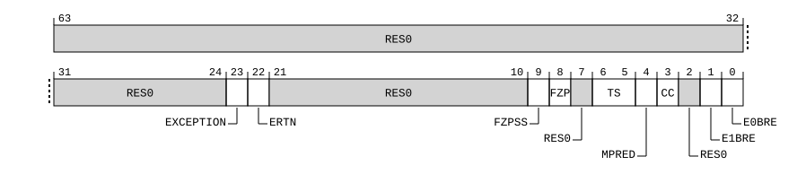

# ​D24.8.1 BRBCR_EL1, Branch Record Buffer Control Register (EL1)

Source: <https://developer.arm.com/documentation/ddi0487/mc/-Part-D-The-AArch64-System-Level-Architecture/-Chapter-D24-AArch64-System-Register-Descriptions/-D24-8-Branch-Record-Buffer-Extension-registers/-D24-8-1-BRBCR-EL1--Branch-Record-Buffer-Control-Register--EL1->

##### D24.8.1 BRBCR\_EL1, Branch Record Buffer Control Register (EL1)

The BRBCR\_EL1 characteristics are:

Purpose
:   Controls the Branch Record Buffer.

Configuration
:   This register is present only when FEAT\_BRBE is implemented. Otherwise, direct accesses to BRBCR\_EL1 are UNDEFINED.

Attributes
:   BRBCR\_EL1 is a 64-bit register.

###### Field descriptions



Bits [63:24]
:   Reserved, RES0.

EXCEPTION, bit [23]
:   Enable the recording of entry to EL1 through an exception.

<table>
 <colgroup>
  <col/>
  <col/>
 </colgroup>
 <thead>
  <tr>
   <th>
    <strong>
     EXCEPTION
    </strong>
   </th>
   <th>
    <strong>
     Meaning
    </strong>
   </th>
  </tr>
 </thead>
 <tbody>
  <tr>
   <td>
    <p>
     <code>
      0b0
     </code>
    </p>
   </td>
   <td>
    <p>
     Disable the recording of Branch records for exceptions when taken to EL1.
    </p>
   </td>
  </tr>
  <tr>
   <td>
    <p>
     <code>
      0b1
     </code>
    </p>
   </td>
   <td>
    <p>
     Enable the recording of Branch records for exceptions when taken to EL1.
    </p>
   </td>
  </tr>
 </tbody>
</table>

    The reset behavior of this field is:

    - On a Cold reset:
      - When FEAT\_BRBEv1p1 is implemented, this field resets to an architecturally UNKNOWN value.
    - On a Warm reset:
      - When FEAT\_BRBEv1p1 is not implemented, this field resets to an architecturally UNKNOWN value.

ERTN, bit [22]
:   Allow the recording Branch records for exception return instructions from EL1.

<table>
 <colgroup>
  <col/>
  <col/>
 </colgroup>
 <thead>
  <tr>
   <th>
    <strong>
     ERTN
    </strong>
   </th>
   <th>
    <strong>
     Meaning
    </strong>
   </th>
  </tr>
 </thead>
 <tbody>
  <tr>
   <td>
    <p>
     <code>
      0b0
     </code>
    </p>
   </td>
   <td>
    <p>
     Disable the recording Branch records for exception return instructions from EL1.
    </p>
   </td>
  </tr>
  <tr>
   <td>
    <p>
     <code>
      0b1
     </code>
    </p>
   </td>
   <td>
    <p>
     Enable the recording Branch records for exception return instructions from EL1.
    </p>
   </td>
  </tr>
 </tbody>
</table>

    The reset behavior of this field is:

    - On a Cold reset:
      - When FEAT\_BRBEv1p1 is implemented, this field resets to an architecturally UNKNOWN value.
    - On a Warm reset:
      - When FEAT\_BRBEv1p1 is not implemented, this field resets to an architecturally UNKNOWN value.

Bits [21:10]
:   Reserved, RES0.

FZPSS, bit [9]
:   When FEAT\_PMUv3\_SS is implemented:
    :   Freeze BRBE on PMU Snapshot.

<table>
 <colgroup>
  <col/>
  <col/>
 </colgroup>
 <thead>
  <tr>
   <th>
    <strong>
     FZPSS
    </strong>
   </th>
   <th>
    <strong>
     Meaning
    </strong>
   </th>
  </tr>
 </thead>
 <tbody>
  <tr>
   <td>
    <p>
     <code>
      0b0
     </code>
    </p>
   </td>
   <td>
    <p>
     Branch recording is not affected by this control.
    </p>
   </td>
  </tr>
  <tr>
   <td>
    <p>
     <code>
      0b1
     </code>
    </p>
   </td>
   <td>
    <p>
     If either EL2 is not implemented or
     <a class="document-topic" document-topic-path="/ddi0487/mc/-Part-D-The-AArch64-System-Level-Architecture/-Chapter-D24-AArch64-System-Register-Descriptions/-D24-8-Branch-Record-Buffer-Extension-registers/-D24-8-2-BRBCR-EL2--Branch-Record-Buffer-Control-Register--EL2-?lang=en#reg_aarch64_brbcr_el2" href="/documentation/ddi0487/mc/-Part-D-The-AArch64-System-Level-Architecture/-Chapter-D24-AArch64-System-Register-Descriptions/-D24-8-Branch-Record-Buffer-Extension-registers/-D24-8-2-BRBCR-EL2--Branch-Record-Buffer-Control-Register--EL2-?lang=en#reg_aarch64_brbcr_el2">
      BRBCR_EL2
     </a>
     .FZPSS is 1, then a BRBE freeze event occurs when a successful Capture event occurs.
    </p>
   </td>
  </tr>
 </tbody>
</table>

        The reset behavior of this field is:

        - On a Cold reset, this field resets to an architecturally UNKNOWN value.

    Otherwise:
    :   Reserved, RES0.

FZP, bit [8]
:   When FEAT\_PMUv3 is implemented:
    :   Freeze BRBE on PMU overflow.

<table>
 <colgroup>
  <col/>
  <col/>
 </colgroup>
 <thead>
  <tr>
   <th>
    <strong>
     FZP
    </strong>
   </th>
   <th>
    <strong>
     Meaning
    </strong>
   </th>
  </tr>
 </thead>
 <tbody>
  <tr>
   <td>
    <p>
     <code>
      0b0
     </code>
    </p>
   </td>
   <td>
    <p>
     Branch recording is not affected by this control.
    </p>
   </td>
  </tr>
  <tr>
   <td>
    <p>
     <code>
      0b1
     </code>
    </p>
   </td>
   <td>
    <p>
     A BRBE freeze event occurs when the PE is in a Non-prohibited region,
     <a class="document-topic" document-topic-path="/ddi0487/mc/-Part-D-The-AArch64-System-Level-Architecture/-Chapter-D24-AArch64-System-Register-Descriptions/-D24-8-Branch-Record-Buffer-Extension-registers/-D24-8-3-BRBFCR-EL1--Branch-Record-Buffer-Function-Control-Register?lang=en#reg_aarch64_brbfcr_el1" href="/documentation/ddi0487/mc/-Part-D-The-AArch64-System-Level-Architecture/-Chapter-D24-AArch64-System-Register-Descriptions/-D24-8-Branch-Record-Buffer-Extension-registers/-D24-8-3-BRBFCR-EL1--Branch-Record-Buffer-Function-Control-Register?lang=en#reg_aarch64_brbfcr_el1">
      BRBFCR_EL1
     </a>
     .PAUSED is 0, and any of the following applies:
    </p>
    <ul>
     <li>
      <p>
       For any event counter
       <a class="document-topic" document-topic-path="/ddi0487/mc/-Part-D-The-AArch64-System-Level-Architecture/-Chapter-D24-AArch64-System-Register-Descriptions/-D24-5-Performance-Monitors-registers/-D24-5-10-PMEVCNTR-n--EL0--Performance-Monitors-Event-Count-Registers--n---0---30?lang=en#reg_aarch64_pmevcntrn_el0" href="/documentation/ddi0487/mc/-Part-D-The-AArch64-System-Level-Architecture/-Chapter-D24-AArch64-System-Register-Descriptions/-D24-5-Performance-Monitors-registers/-D24-5-10-PMEVCNTR-n--EL0--Performance-Monitors-Event-Count-Registers--n---0---30?lang=en#reg_aarch64_pmevcntrn_el0">
        PMEVCNTR&lt;m&gt;_EL0
       </a>
       in the first range,
       <a class="document-topic" document-topic-path="/ddi0487/mc/-Part-D-The-AArch64-System-Level-Architecture/-Chapter-D24-AArch64-System-Register-Descriptions/-D24-5-Performance-Monitors-registers/-D24-5-19-PMOVSCLR-EL0--Performance-Monitors-Overflow-Flag-Status-Clear-Register?lang=en#reg_aarch64_pmovsclr_el0" href="/documentation/ddi0487/mc/-Part-D-The-AArch64-System-Level-Architecture/-Chapter-D24-AArch64-System-Register-Descriptions/-D24-5-Performance-Monitors-registers/-D24-5-19-PMOVSCLR-EL0--Performance-Monitors-Overflow-Flag-Status-Clear-Register?lang=en#reg_aarch64_pmovsclr_el0">
        PMOVSCLR_EL0
       </a>
       [m] is 1.
      </p>
     </li>
     <li>
      <p>
       <a class="document-topic" document-topic-path="/ddi0487/mc/-Part-A-Arm-Architecture-Introduction-and-Overview/-Chapter-A2-A-profile-Architecture-Extensions/-A2-2-Armv8-A-architecture-extensions/-A2-2-10-The-Armv8-9-architecture-extension?lang=en#feat_feat_pmuv3_icntr" href="/documentation/ddi0487/mc/-Part-A-Arm-Architecture-Introduction-and-Overview/-Chapter-A2-A-profile-Architecture-Extensions/-A2-2-Armv8-A-architecture-extensions/-A2-2-10-The-Armv8-9-architecture-extension?lang=en#feat_feat_pmuv3_icntr">
        FEAT_PMUv3_ICNTR
       </a>
       is implemented and
       <a class="document-topic" document-topic-path="/ddi0487/mc/-Part-D-The-AArch64-System-Level-Architecture/-Chapter-D24-AArch64-System-Register-Descriptions/-D24-5-Performance-Monitors-registers/-D24-5-19-PMOVSCLR-EL0--Performance-Monitors-Overflow-Flag-Status-Clear-Register?lang=en#reg_aarch64_pmovsclr_el0" href="/documentation/ddi0487/mc/-Part-D-The-AArch64-System-Level-Architecture/-Chapter-D24-AArch64-System-Register-Descriptions/-D24-5-Performance-Monitors-registers/-D24-5-19-PMOVSCLR-EL0--Performance-Monitors-Overflow-Flag-Status-Clear-Register?lang=en#reg_aarch64_pmovsclr_el0">
        PMOVSCLR_EL0
       </a>
       .F0 is 1.
      </p>
     </li>
    </ul>
    <p>
     For more information about event counter ranges, see
     <a class="document-topic" document-topic-path="/ddi0487/mc/-Part-D-The-AArch64-System-Level-Architecture/-Chapter-D24-AArch64-System-Register-Descriptions/-D24-3-Debug-System-registers/-D24-3-17-MDCR-EL2--Monitor-Debug-Configuration-Register--EL2-?lang=en#reg_aarch64_mdcr_el2" href="/documentation/ddi0487/mc/-Part-D-The-AArch64-System-Level-Architecture/-Chapter-D24-AArch64-System-Register-Descriptions/-D24-3-Debug-System-registers/-D24-3-17-MDCR-EL2--Monitor-Debug-Configuration-Register--EL2-?lang=en#reg_aarch64_mdcr_el2">
      MDCR_EL2
     </a>
     .HPMN.
    </p>
   </td>
  </tr>
 </tbody>
</table>

        The reset behavior of this field is:

        - On a Cold reset:
          - When FEAT\_BRBEv1p1 is implemented, this field resets to an architecturally UNKNOWN value.
        - On a Warm reset:
          - When FEAT\_BRBEv1p1 is not implemented, this field resets to an architecturally UNKNOWN value.

    Otherwise:
    :   Reserved, RES0.

Bit [7]
:   Reserved, RES0.

TS, bits [6:5]
:   Timestamp Control.

<table>
 <colgroup>
  <col/>
  <col/>
  <col/>
 </colgroup>
 <thead>
  <tr>
   <th>
    <strong>
     TS
    </strong>
   </th>
   <th>
    <strong>
     Meaning
    </strong>
   </th>
   <th>
    <strong>
     Applies when
    </strong>
   </th>
  </tr>
 </thead>
 <tbody>
  <tr>
   <td>
    <p>
     <code>
      0b01
     </code>
    </p>
   </td>
   <td>
    <p>
     Virtual timestamp. The BRBE recorded timestamp is the physical counter value, minus the value of
     <a class="document-topic" document-topic-path="/ddi0487/mc/-Part-D-The-AArch64-System-Level-Architecture/-Chapter-D24-AArch64-System-Register-Descriptions/-D24-10-Generic-Timer-registers/-D24-10-27-CNTVOFF-EL2--Counter-timer-Virtual-Offset-Register?lang=en#reg_aarch64_cntvoff_el2" href="/documentation/ddi0487/mc/-Part-D-The-AArch64-System-Level-Architecture/-Chapter-D24-AArch64-System-Register-Descriptions/-D24-10-Generic-Timer-registers/-D24-10-27-CNTVOFF-EL2--Counter-timer-Virtual-Offset-Register?lang=en#reg_aarch64_cntvoff_el2">
      CNTVOFF_EL2
     </a>
     .
    </p>
   </td>
   <td>
   </td>
  </tr>
  <tr>
   <td>
    <p>
     <code>
      0b10
     </code>
    </p>
   </td>
   <td>
    <p>
     Guest physical timestamp. The BRBE recorded timestamp is the physical counter value minus a physical offset. If any of the following are true, the physical offset is zero, otherwise the physical offset is the value of
     <a class="document-topic" document-topic-path="/ddi0487/mc/-Part-D-The-AArch64-System-Level-Architecture/-Chapter-D24-AArch64-System-Register-Descriptions/-D24-10-Generic-Timer-registers/-D24-10-18-CNTPOFF-EL2--Counter-timer-Physical-Offset-Register?lang=en#reg_aarch64_cntpoff_el2" href="/documentation/ddi0487/mc/-Part-D-The-AArch64-System-Level-Architecture/-Chapter-D24-AArch64-System-Register-Descriptions/-D24-10-Generic-Timer-registers/-D24-10-18-CNTPOFF-EL2--Counter-timer-Physical-Offset-Register?lang=en#reg_aarch64_cntpoff_el2">
      CNTPOFF_EL2
     </a>
     :
    </p>
    <ul>
     <li>
      <p>
       EL3 is implemented and
       <a class="document-topic" document-topic-path="/ddi0487/mc/-Part-D-The-AArch64-System-Level-Architecture/-Chapter-D24-AArch64-System-Register-Descriptions/-D24-2-General-system-control-registers/-D24-2-168-SCR-EL3--Secure-Configuration-Register?lang=en#reg_aarch64_scr_el3" href="/documentation/ddi0487/mc/-Part-D-The-AArch64-System-Level-Architecture/-Chapter-D24-AArch64-System-Register-Descriptions/-D24-2-General-system-control-registers/-D24-2-168-SCR-EL3--Secure-Configuration-Register?lang=en#reg_aarch64_scr_el3">
        SCR_EL3
       </a>
       .ECVEn == 0.
      </p>
     </li>
     <li>
      <p>
       EL2 is implemented and
       <a class="document-topic" document-topic-path="/ddi0487/mc/-Part-D-The-AArch64-System-Level-Architecture/-Chapter-D24-AArch64-System-Register-Descriptions/-D24-10-Generic-Timer-registers/-D24-10-2-CNTHCTL-EL2--Counter-timer-Hypervisor-Control-Register?lang=en#reg_aarch64_cnthctl_el2" href="/documentation/ddi0487/mc/-Part-D-The-AArch64-System-Level-Architecture/-Chapter-D24-AArch64-System-Register-Descriptions/-D24-10-Generic-Timer-registers/-D24-10-2-CNTHCTL-EL2--Counter-timer-Hypervisor-Control-Register?lang=en#reg_aarch64_cnthctl_el2">
        CNTHCTL_EL2
       </a>
       .ECV == 0.
      </p>
     </li>
     <li>
      <p>
       FEAT_ECV_POFF is not implemented.
      </p>
     </li>
    </ul>
   </td>
   <td>
    <p>
     FEAT_ECV is implemented
    </p>
   </td>
  </tr>
  <tr>
   <td>
    <p>
     <code>
      0b11
     </code>
    </p>
   </td>
   <td>
    <p>
     Physical timestamp. The BRBE recorded timestamp is the physical counter value.
    </p>
   </td>
   <td>
   </td>
  </tr>
 </tbody>
</table>

    All other values are reserved.

    This field is ignored by the PE when EL2 is implemented and [BRBCR\_EL2](/documentation/ddi0487/mc/-Part-D-The-AArch64-System-Level-Architecture/-Chapter-D24-AArch64-System-Register-Descriptions/-D24-8-Branch-Record-Buffer-Extension-registers/-D24-8-2-BRBCR-EL2--Branch-Record-Buffer-Control-Register--EL2-?lang=en#reg_aarch64_brbcr_el2).TS != `0b00`.

    The reset behavior of this field is:

    - On a Cold reset:
      - When FEAT\_BRBEv1p1 is implemented, this field resets to an architecturally UNKNOWN value.
    - On a Warm reset:
      - When FEAT\_BRBEv1p1 is not implemented, this field resets to an architecturally UNKNOWN value.

MPRED, bit [4]
:   Mask the recording of mispredicts.

<table>
 <colgroup>
  <col/>
  <col/>
 </colgroup>
 <thead>
  <tr>
   <th>
    <strong>
     MPRED
    </strong>
   </th>
   <th>
    <strong>
     Meaning
    </strong>
   </th>
  </tr>
 </thead>
 <tbody>
  <tr>
   <td>
    <p>
     <code>
      0b0
     </code>
    </p>
   </td>
   <td>
    <p>
     Disable the recording of mispredict information.
    </p>
   </td>
  </tr>
  <tr>
   <td>
    <p>
     <code>
      0b1
     </code>
    </p>
   </td>
   <td>
    <p>
     Allow the recording of mispredict information.
    </p>
   </td>
  </tr>
 </tbody>
</table>

    The reset behavior of this field is:

    - On a Cold reset:
      - When FEAT\_BRBEv1p1 is implemented, this field resets to an architecturally UNKNOWN value.
    - On a Warm reset:
      - When FEAT\_BRBEv1p1 is not implemented, this field resets to an architecturally UNKNOWN value.

CC, bit [3]
:   Enable the recording of cycle count information.

<table>
 <colgroup>
  <col/>
  <col/>
 </colgroup>
 <thead>
  <tr>
   <th>
    <strong>
     CC
    </strong>
   </th>
   <th>
    <strong>
     Meaning
    </strong>
   </th>
  </tr>
 </thead>
 <tbody>
  <tr>
   <td>
    <p>
     <code>
      0b0
     </code>
    </p>
   </td>
   <td>
    <p>
     Disable the recording of cycle count information.
    </p>
   </td>
  </tr>
  <tr>
   <td>
    <p>
     <code>
      0b1
     </code>
    </p>
   </td>
   <td>
    <p>
     Allow the recording of cycle count information.
    </p>
   </td>
  </tr>
 </tbody>
</table>

    The reset behavior of this field is:

    - On a Cold reset:
      - When FEAT\_BRBEv1p1 is implemented, this field resets to an architecturally UNKNOWN value.
    - On a Warm reset:
      - When FEAT\_BRBEv1p1 is not implemented, this field resets to an architecturally UNKNOWN value.

Bit [2]
:   Reserved, RES0.

E1BRE, bit [1]
:   EL1 Branch recording enable.

<table>
 <colgroup>
  <col/>
  <col/>
 </colgroup>
 <thead>
  <tr>
   <th>
    <strong>
     E1BRE
    </strong>
   </th>
   <th>
    <strong>
     Meaning
    </strong>
   </th>
  </tr>
 </thead>
 <tbody>
  <tr>
   <td>
    <p>
     <code>
      0b0
     </code>
    </p>
   </td>
   <td>
    <p>
     Branch recording prohibited at EL1.
    </p>
   </td>
  </tr>
  <tr>
   <td>
    <p>
     <code>
      0b1
     </code>
    </p>
   </td>
   <td>
    <p>
     Branch recording enabled at EL1.
    </p>
   </td>
  </tr>
 </tbody>
</table>

    The reset behavior of this field is:

    - On a Warm reset, this field resets to `'0'`.

E0BRE, bit [0]
:   EL0 Branch recording enable.

<table>
 <colgroup>
  <col/>
  <col/>
 </colgroup>
 <thead>
  <tr>
   <th>
    <strong>
     E0BRE
    </strong>
   </th>
   <th>
    <strong>
     Meaning
    </strong>
   </th>
  </tr>
 </thead>
 <tbody>
  <tr>
   <td>
    <p>
     <code>
      0b0
     </code>
    </p>
   </td>
   <td>
    <p>
     Branch recording prohibited at EL0.
    </p>
   </td>
  </tr>
  <tr>
   <td>
    <p>
     <code>
      0b1
     </code>
    </p>
   </td>
   <td>
    <p>
     Branch recording enabled at EL0.
    </p>
   </td>
  </tr>
 </tbody>
</table>

    This field is ignored by the PE when all of the following are true:

    - The [Effective value](/documentation/ddi0487/mc/-Part-K-Appendixes/Glossary?lang=en#effective_value) of [HCR\_EL2](/documentation/ddi0487/mc/-Part-D-The-AArch64-System-Level-Architecture/-Chapter-D24-AArch64-System-Register-Descriptions/-D24-2-General-system-control-registers/-D24-2-61-HCR-EL2--Hypervisor-Configuration-Register?lang=en#reg_aarch64_hcr_el2).TGE is 1.
    - EL2 is implemented and enabled in the current Security state.

    The reset behavior of this field is:

    - On a Warm reset, this field resets to `'0'`.

###### Accessing BRBCR\_EL1

When the Effective value of [HCR\_EL2](/documentation/ddi0487/mc/-Part-D-The-AArch64-System-Level-Architecture/-Chapter-D24-AArch64-System-Register-Descriptions/-D24-2-General-system-control-registers/-D24-2-61-HCR-EL2--Hypervisor-Configuration-Register?lang=en#reg_aarch64_hcr_el2).E2H is 1, without explicit synchronization, accesses from EL3 using the accessor name `BRBCR_EL1` or `BRBCR_EL12` are not guaranteed to be ordered with respect to accesses using the other accessor name.

Accesses to this register use the following encodings in the System register encoding space:

###### `MRS <Xt>, BRBCR_EL1`

<table>
 <colgroup>
  <col/>
  <col/>
  <col/>
  <col/>
  <col/>
 </colgroup>
 <thead>
  <tr>
   <th>
    <strong>
     op0
    </strong>
   </th>
   <th>
    <strong>
     op1
    </strong>
   </th>
   <th>
    <strong>
     CRn
    </strong>
   </th>
   <th>
    <strong>
     CRm
    </strong>
   </th>
   <th>
    <strong>
     op2
    </strong>
   </th>
  </tr>
 </thead>
 <tbody>
  <tr>
   <td>
    <p>
     <code>
      0b10
     </code>
    </p>
   </td>
   <td>
    <p>
     <code>
      0b001
     </code>
    </p>
   </td>
   <td>
    <p>
     <code>
      0b1001
     </code>
    </p>
   </td>
   <td>
    <p>
     <code>
      0b0000
     </code>
    </p>
   </td>
   <td>
    <p>
     <code>
      0b000
     </code>
    </p>
   </td>
  </tr>
 </tbody>
</table>

```
if !IsFeatureImplemented(FEAT_BRBE) then
    Undefined();
elsif HaveEL(EL3) && !(EffectivelyAtEL0InHost() || EffectivelyAtEL0NotInHost() || PSTATE.EL == EL3) && EL3SDDUndefPriority() && MDCR_EL3().SBRBE != '11' && SCR_EL3().NS == '0' then
    Undefined();
elsif HaveEL(EL3) && !(EffectivelyAtEL0InHost() || EffectivelyAtEL0NotInHost() || PSTATE.EL == EL3) && EL3SDDUndefPriority() && MDCR_EL3().SBRBE IN {'x0'} && SCR_EL3().NS == '1' then
    Undefined();
elsif PSTATE.EL == EL0 then
    Undefined();
elsif PSTATE.EL == EL1 then
    if EL2Enabled() && IsFeatureImplemented(FEAT_FGT) && (!HaveEL(EL3) || SCR_EL3().FGTEn == '1') && HDFGRTR_EL2().nBRBCTL == '0' then
        AArch64_SystemAccessTrap(EL2, 0x18);
    elsif HaveEL(EL3) && MDCR_EL3().SBRBE != '11' && SCR_EL3().NS == '0' then
        if EL3SDDUndef() then
            Undefined();
        else
            AArch64_SystemAccessTrap(EL3, 0x18);
        end;
    elsif HaveEL(EL3) && MDCR_EL3().SBRBE IN {'x0'} && SCR_EL3().NS == '1' then
        if EL3SDDUndef() then
            Undefined();
        else
            AArch64_SystemAccessTrap(EL3, 0x18);
        end;
    elsif EffectiveHCR_EL2_NVx() IN {'111'} then
        X{64}(t) = NVMem(0x8E0);
    else
        X{64}(t) = BRBCR_EL1();
    end;
elsif PSTATE.EL == EL2 then
    if HaveEL(EL3) && MDCR_EL3().SBRBE != '11' && SCR_EL3().NS == '0' then
        if EL3SDDUndef() then
            Undefined();
        else
            AArch64_SystemAccessTrap(EL3, 0x18);
        end;
    elsif HaveEL(EL3) && MDCR_EL3().SBRBE IN {'x0'} && SCR_EL3().NS == '1' then
        if EL3SDDUndef() then
            Undefined();
        else
            AArch64_SystemAccessTrap(EL3, 0x18);
        end;
    elsif ELIsInHost(EL2) then
        X{64}(t) = BRBCR_EL2();
    else
        X{64}(t) = BRBCR_EL1();
    end;
elsif PSTATE.EL == EL3 then
    X{64}(t) = BRBCR_EL1();
end;
```

###### `MSR BRBCR_EL1, <Xt>`

<table>
 <colgroup>
  <col/>
  <col/>
  <col/>
  <col/>
  <col/>
 </colgroup>
 <thead>
  <tr>
   <th>
    <strong>
     op0
    </strong>
   </th>
   <th>
    <strong>
     op1
    </strong>
   </th>
   <th>
    <strong>
     CRn
    </strong>
   </th>
   <th>
    <strong>
     CRm
    </strong>
   </th>
   <th>
    <strong>
     op2
    </strong>
   </th>
  </tr>
 </thead>
 <tbody>
  <tr>
   <td>
    <p>
     <code>
      0b10
     </code>
    </p>
   </td>
   <td>
    <p>
     <code>
      0b001
     </code>
    </p>
   </td>
   <td>
    <p>
     <code>
      0b1001
     </code>
    </p>
   </td>
   <td>
    <p>
     <code>
      0b0000
     </code>
    </p>
   </td>
   <td>
    <p>
     <code>
      0b000
     </code>
    </p>
   </td>
  </tr>
 </tbody>
</table>

```
if !IsFeatureImplemented(FEAT_BRBE) then
    Undefined();
elsif HaveEL(EL3) && !(EffectivelyAtEL0InHost() || EffectivelyAtEL0NotInHost() || PSTATE.EL == EL3) && EL3SDDUndefPriority() && MDCR_EL3().SBRBE != '11' && SCR_EL3().NS == '0' then
    Undefined();
elsif HaveEL(EL3) && !(EffectivelyAtEL0InHost() || EffectivelyAtEL0NotInHost() || PSTATE.EL == EL3) && EL3SDDUndefPriority() && MDCR_EL3().SBRBE IN {'x0'} && SCR_EL3().NS == '1' then
    Undefined();
elsif PSTATE.EL == EL0 then
    Undefined();
elsif PSTATE.EL == EL1 then
    if EL2Enabled() && IsFeatureImplemented(FEAT_FGT) && (!HaveEL(EL3) || SCR_EL3().FGTEn == '1') && HDFGWTR_EL2().nBRBCTL == '0' then
        AArch64_SystemAccessTrap(EL2, 0x18);
    elsif HaveEL(EL3) && MDCR_EL3().SBRBE != '11' && SCR_EL3().NS == '0' then
        if EL3SDDUndef() then
            Undefined();
        else
            AArch64_SystemAccessTrap(EL3, 0x18);
        end;
    elsif HaveEL(EL3) && MDCR_EL3().SBRBE IN {'x0'} && SCR_EL3().NS == '1' then
        if EL3SDDUndef() then
            Undefined();
        else
            AArch64_SystemAccessTrap(EL3, 0x18);
        end;
    elsif EffectiveHCR_EL2_NVx() IN {'111'} then
        NVMem(0x8E0) = X{64}(t);
    else
        BRBCR_EL1() = X{64}(t);
    end;
elsif PSTATE.EL == EL2 then
    if HaveEL(EL3) && MDCR_EL3().SBRBE != '11' && SCR_EL3().NS == '0' then
        if EL3SDDUndef() then
            Undefined();
        else
            AArch64_SystemAccessTrap(EL3, 0x18);
        end;
    elsif HaveEL(EL3) && MDCR_EL3().SBRBE IN {'x0'} && SCR_EL3().NS == '1' then
        if EL3SDDUndef() then
            Undefined();
        else
            AArch64_SystemAccessTrap(EL3, 0x18);
        end;
    elsif ELIsInHost(EL2) then
        BRBCR_EL2() = X{64}(t);
    else
        BRBCR_EL1() = X{64}(t);
    end;
elsif PSTATE.EL == EL3 then
    BRBCR_EL1() = X{64}(t);
end;
```

`When FEAT_VHE is implemented MRS <Xt>, BRBCR_EL12`
:

<table>
 <colgroup>
  <col/>
  <col/>
  <col/>
  <col/>
  <col/>
 </colgroup>
 <thead>
  <tr>
   <th>
    <strong>
     op0
    </strong>
   </th>
   <th>
    <strong>
     op1
    </strong>
   </th>
   <th>
    <strong>
     CRn
    </strong>
   </th>
   <th>
    <strong>
     CRm
    </strong>
   </th>
   <th>
    <strong>
     op2
    </strong>
   </th>
  </tr>
 </thead>
 <tbody>
  <tr>
   <td>
    <p>
     <code>
      0b10
     </code>
    </p>
   </td>
   <td>
    <p>
     <code>
      0b101
     </code>
    </p>
   </td>
   <td>
    <p>
     <code>
      0b1001
     </code>
    </p>
   </td>
   <td>
    <p>
     <code>
      0b0000
     </code>
    </p>
   </td>
   <td>
    <p>
     <code>
      0b000
     </code>
    </p>
   </td>
  </tr>
 </tbody>
</table>

    ```
    if !IsFeatureImplemented(FEAT_BRBE) then
        Undefined();
    elsif HaveEL(EL3) && PSTATE.EL == EL2 && EL3SDDUndefPriority() && MDCR_EL3().SBRBE != '11' && SCR_EL3().NS == '0' then
        Undefined();
    elsif HaveEL(EL3) && PSTATE.EL == EL2 && EL3SDDUndefPriority() && MDCR_EL3().SBRBE IN {'x0'} && SCR_EL3().NS == '1' then
        Undefined();
    elsif PSTATE.EL == EL0 then
        Undefined();
    elsif PSTATE.EL == EL1 then
        if EffectiveHCR_EL2_NVx() == '101' then
            X{64}(t) = NVMem(0x8E0);
        elsif EffectiveHCR_EL2_NVx() IN {'xx1'} then
            AArch64_SystemAccessTrap(EL2, 0x18);
        else
            Undefined();
        end;
    elsif PSTATE.EL == EL2 then
        if ELIsInHost(EL2) then
            if HaveEL(EL3) && MDCR_EL3().SBRBE != '11' && SCR_EL3().NS == '0' then
                if EL3SDDUndef() then
                    Undefined();
                else
                    AArch64_SystemAccessTrap(EL3, 0x18);
                end;
            elsif HaveEL(EL3) && MDCR_EL3().SBRBE IN {'x0'} && SCR_EL3().NS == '1' then
                if EL3SDDUndef() then
                    Undefined();
                else
                    AArch64_SystemAccessTrap(EL3, 0x18);
                end;
            else
                X{64}(t) = BRBCR_EL1();
            end;
        else
            Undefined();
        end;
    elsif PSTATE.EL == EL3 then
        if ELIsInHost(EL2) then
            X{64}(t) = BRBCR_EL1();
        else
            Undefined();
        end;
    end;
    ```

`When FEAT_VHE is implemented MSR BRBCR_EL12, <Xt>`
:

<table>
 <colgroup>
  <col/>
  <col/>
  <col/>
  <col/>
  <col/>
 </colgroup>
 <thead>
  <tr>
   <th>
    <strong>
     op0
    </strong>
   </th>
   <th>
    <strong>
     op1
    </strong>
   </th>
   <th>
    <strong>
     CRn
    </strong>
   </th>
   <th>
    <strong>
     CRm
    </strong>
   </th>
   <th>
    <strong>
     op2
    </strong>
   </th>
  </tr>
 </thead>
 <tbody>
  <tr>
   <td>
    <p>
     <code>
      0b10
     </code>
    </p>
   </td>
   <td>
    <p>
     <code>
      0b101
     </code>
    </p>
   </td>
   <td>
    <p>
     <code>
      0b1001
     </code>
    </p>
   </td>
   <td>
    <p>
     <code>
      0b0000
     </code>
    </p>
   </td>
   <td>
    <p>
     <code>
      0b000
     </code>
    </p>
   </td>
  </tr>
 </tbody>
</table>

    ```
    if !IsFeatureImplemented(FEAT_BRBE) then
        Undefined();
    elsif HaveEL(EL3) && PSTATE.EL == EL2 && EL3SDDUndefPriority() && MDCR_EL3().SBRBE != '11' && SCR_EL3().NS == '0' then
        Undefined();
    elsif HaveEL(EL3) && PSTATE.EL == EL2 && EL3SDDUndefPriority() && MDCR_EL3().SBRBE IN {'x0'} && SCR_EL3().NS == '1' then
        Undefined();
    elsif PSTATE.EL == EL0 then
        Undefined();
    elsif PSTATE.EL == EL1 then
        if EffectiveHCR_EL2_NVx() == '101' then
            NVMem(0x8E0) = X{64}(t);
        elsif EffectiveHCR_EL2_NVx() IN {'xx1'} then
            AArch64_SystemAccessTrap(EL2, 0x18);
        else
            Undefined();
        end;
    elsif PSTATE.EL == EL2 then
        if ELIsInHost(EL2) then
            if HaveEL(EL3) && MDCR_EL3().SBRBE != '11' && SCR_EL3().NS == '0' then
                if EL3SDDUndef() then
                    Undefined();
                else
                    AArch64_SystemAccessTrap(EL3, 0x18);
                end;
            elsif HaveEL(EL3) && MDCR_EL3().SBRBE IN {'x0'} && SCR_EL3().NS == '1' then
                if EL3SDDUndef() then
                    Undefined();
                else
                    AArch64_SystemAccessTrap(EL3, 0x18);
                end;
            else
                BRBCR_EL1() = X{64}(t);
            end;
        else
            Undefined();
        end;
    elsif PSTATE.EL == EL3 then
        if ELIsInHost(EL2) then
            BRBCR_EL1() = X{64}(t);
        else
            Undefined();
        end;
    end;
    ```
