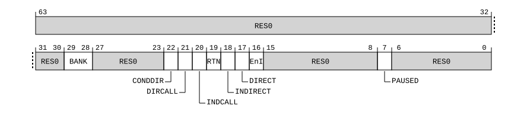

# ​D24.8.3 BRBFCR_EL1, Branch Record Buffer Function Control Register

Source: <https://developer.arm.com/documentation/ddi0487/mc/-Part-D-The-AArch64-System-Level-Architecture/-Chapter-D24-AArch64-System-Register-Descriptions/-D24-8-Branch-Record-Buffer-Extension-registers/-D24-8-3-BRBFCR-EL1--Branch-Record-Buffer-Function-Control-Register>

##### D24.8.3 BRBFCR\_EL1, Branch Record Buffer Function Control Register

The BRBFCR\_EL1 characteristics are:

Purpose
:   Functional controls for the Branch Record Buffer.

Configuration
:   This register is present only when FEAT\_BRBE is implemented. Otherwise, direct accesses to BRBFCR\_EL1 are UNDEFINED.

Attributes
:   BRBFCR\_EL1 is a 64-bit register.

###### Field descriptions



Bits [63:30]
:   Reserved, RES0.

BANK, bits [29:28]
:   Branch record buffer bank access control.

<table>
 <colgroup>
  <col/>
  <col/>
 </colgroup>
 <thead>
  <tr>
   <th>
    <strong>
     BANK
    </strong>
   </th>
   <th>
    <strong>
     Meaning
    </strong>
   </th>
  </tr>
 </thead>
 <tbody>
  <tr>
   <td>
    <p>
     <code>
      0b00
     </code>
    </p>
   </td>
   <td>
    <p>
     Select branch records 0 to 31.
    </p>
   </td>
  </tr>
  <tr>
   <td>
    <p>
     <code>
      0b01
     </code>
    </p>
   </td>
   <td>
    <p>
     Select branch records 32 to 63.
    </p>
   </td>
  </tr>
 </tbody>
</table>

    All other values are reserved.

    The reset behavior of this field is:

    - On a Warm reset, this field resets to an architecturally UNKNOWN value.

Bits [27:23]
:   Reserved, RES0.

CONDDIR, bit [22]
:   Match on conditional direct branch instructions.

<table>
 <colgroup>
  <col/>
  <col/>
 </colgroup>
 <thead>
  <tr>
   <th>
    <strong>
     CONDDIR
    </strong>
   </th>
   <th>
    <strong>
     Meaning
    </strong>
   </th>
  </tr>
 </thead>
 <tbody>
  <tr>
   <td>
    <p>
     <code>
      0b0
     </code>
    </p>
   </td>
   <td>
    <p>
     Do not match on conditional direct branch instructions.
    </p>
   </td>
  </tr>
  <tr>
   <td>
    <p>
     <code>
      0b1
     </code>
    </p>
   </td>
   <td>
    <p>
     Match on conditional direct branch instructions.
    </p>
   </td>
  </tr>
 </tbody>
</table>

    The reset behavior of this field is:

    - On a Cold reset:
      - When FEAT\_BRBEv1p1 is implemented, this field resets to an architecturally UNKNOWN value.
    - On a Warm reset:
      - When FEAT\_BRBEv1p1 is not implemented, this field resets to an architecturally UNKNOWN value.

DIRCALL, bit [21]
:   Match on direct branch with link instructions.

<table>
 <colgroup>
  <col/>
  <col/>
 </colgroup>
 <thead>
  <tr>
   <th>
    <strong>
     DIRCALL
    </strong>
   </th>
   <th>
    <strong>
     Meaning
    </strong>
   </th>
  </tr>
 </thead>
 <tbody>
  <tr>
   <td>
    <p>
     <code>
      0b0
     </code>
    </p>
   </td>
   <td>
    <p>
     Do not match on direct branch with link instructions.
    </p>
   </td>
  </tr>
  <tr>
   <td>
    <p>
     <code>
      0b1
     </code>
    </p>
   </td>
   <td>
    <p>
     Match on direct branch with link instructions.
    </p>
   </td>
  </tr>
 </tbody>
</table>

    The reset behavior of this field is:

    - On a Cold reset:
      - When FEAT\_BRBEv1p1 is implemented, this field resets to an architecturally UNKNOWN value.
    - On a Warm reset:
      - When FEAT\_BRBEv1p1 is not implemented, this field resets to an architecturally UNKNOWN value.

INDCALL, bit [20]
:   Match on indirect branch with link instructions.

<table>
 <colgroup>
  <col/>
  <col/>
 </colgroup>
 <thead>
  <tr>
   <th>
    <strong>
     INDCALL
    </strong>
   </th>
   <th>
    <strong>
     Meaning
    </strong>
   </th>
  </tr>
 </thead>
 <tbody>
  <tr>
   <td>
    <p>
     <code>
      0b0
     </code>
    </p>
   </td>
   <td>
    <p>
     Do not match on indirect branch with link instructions.
    </p>
   </td>
  </tr>
  <tr>
   <td>
    <p>
     <code>
      0b1
     </code>
    </p>
   </td>
   <td>
    <p>
     Match on indirect branch with link instructions.
    </p>
   </td>
  </tr>
 </tbody>
</table>

    The reset behavior of this field is:

    - On a Cold reset:
      - When FEAT\_BRBEv1p1 is implemented, this field resets to an architecturally UNKNOWN value.
    - On a Warm reset:
      - When FEAT\_BRBEv1p1 is not implemented, this field resets to an architecturally UNKNOWN value.

RTN, bit [19]
:   Match on function return instructions.

<table>
 <colgroup>
  <col/>
  <col/>
 </colgroup>
 <thead>
  <tr>
   <th>
    <strong>
     RTN
    </strong>
   </th>
   <th>
    <strong>
     Meaning
    </strong>
   </th>
  </tr>
 </thead>
 <tbody>
  <tr>
   <td>
    <p>
     <code>
      0b0
     </code>
    </p>
   </td>
   <td>
    <p>
     Do not match on function return instructions.
    </p>
   </td>
  </tr>
  <tr>
   <td>
    <p>
     <code>
      0b1
     </code>
    </p>
   </td>
   <td>
    <p>
     Match on function return instructions.
    </p>
   </td>
  </tr>
 </tbody>
</table>

    The reset behavior of this field is:

    - On a Cold reset:
      - When FEAT\_BRBEv1p1 is implemented, this field resets to an architecturally UNKNOWN value.
    - On a Warm reset:
      - When FEAT\_BRBEv1p1 is not implemented, this field resets to an architecturally UNKNOWN value.

INDIRECT, bit [18]
:   Match on indirect branch instructions.

<table>
 <colgroup>
  <col/>
  <col/>
 </colgroup>
 <thead>
  <tr>
   <th>
    <strong>
     INDIRECT
    </strong>
   </th>
   <th>
    <strong>
     Meaning
    </strong>
   </th>
  </tr>
 </thead>
 <tbody>
  <tr>
   <td>
    <p>
     <code>
      0b0
     </code>
    </p>
   </td>
   <td>
    <p>
     Do not match on indirect branch instructions.
    </p>
   </td>
  </tr>
  <tr>
   <td>
    <p>
     <code>
      0b1
     </code>
    </p>
   </td>
   <td>
    <p>
     Match on indirect branch instructions.
    </p>
   </td>
  </tr>
 </tbody>
</table>

    The reset behavior of this field is:

    - On a Cold reset:
      - When FEAT\_BRBEv1p1 is implemented, this field resets to an architecturally UNKNOWN value.
    - On a Warm reset:
      - When FEAT\_BRBEv1p1 is not implemented, this field resets to an architecturally UNKNOWN value.

DIRECT, bit [17]
:   Match on unconditional direct branch instructions.

<table>
 <colgroup>
  <col/>
  <col/>
 </colgroup>
 <thead>
  <tr>
   <th>
    <strong>
     DIRECT
    </strong>
   </th>
   <th>
    <strong>
     Meaning
    </strong>
   </th>
  </tr>
 </thead>
 <tbody>
  <tr>
   <td>
    <p>
     <code>
      0b0
     </code>
    </p>
   </td>
   <td>
    <p>
     Do not match on unconditional direct branch instructions.
    </p>
   </td>
  </tr>
  <tr>
   <td>
    <p>
     <code>
      0b1
     </code>
    </p>
   </td>
   <td>
    <p>
     Match on unconditional direct branch instructions.
    </p>
   </td>
  </tr>
 </tbody>
</table>

    The reset behavior of this field is:

    - On a Cold reset:
      - When FEAT\_BRBEv1p1 is implemented, this field resets to an architecturally UNKNOWN value.
    - On a Warm reset:
      - When FEAT\_BRBEv1p1 is not implemented, this field resets to an architecturally UNKNOWN value.

EnI, bit [16]
:   Include or exclude matches.

<table>
 <colgroup>
  <col/>
  <col/>
 </colgroup>
 <thead>
  <tr>
   <th>
    <strong>
     EnI
    </strong>
   </th>
   <th>
    <strong>
     Meaning
    </strong>
   </th>
  </tr>
 </thead>
 <tbody>
  <tr>
   <td>
    <p>
     <code>
      0b0
     </code>
    </p>
   </td>
   <td>
    <p>
     Include records for matches, and exclude records for non-matches.
    </p>
   </td>
  </tr>
  <tr>
   <td>
    <p>
     <code>
      0b1
     </code>
    </p>
   </td>
   <td>
    <p>
     Exclude records for matches, and include records for non-matches.
    </p>
   </td>
  </tr>
 </tbody>
</table>

    The reset behavior of this field is:

    - On a Cold reset:
      - When FEAT\_BRBEv1p1 is implemented, this field resets to an architecturally UNKNOWN value.
    - On a Warm reset:
      - When FEAT\_BRBEv1p1 is not implemented, this field resets to an architecturally UNKNOWN value.

Bits [15:8]
:   Reserved, RES0.

PAUSED, bit [7]
:   Branch recording Paused status.

<table>
 <colgroup>
  <col/>
  <col/>
 </colgroup>
 <thead>
  <tr>
   <th>
    <strong>
     PAUSED
    </strong>
   </th>
   <th>
    <strong>
     Meaning
    </strong>
   </th>
  </tr>
 </thead>
 <tbody>
  <tr>
   <td>
    <p>
     <code>
      0b0
     </code>
    </p>
   </td>
   <td>
    <p>
     Branch recording is not Paused.
    </p>
   </td>
  </tr>
  <tr>
   <td>
    <p>
     <code>
      0b1
     </code>
    </p>
   </td>
   <td>
    <p>
     Branch recording is Paused.
    </p>
   </td>
  </tr>
 </tbody>
</table>

    The reset behavior of this field is:

    - On a Cold reset:
      - When FEAT\_BRBEv1p1 is implemented, this field resets to an architecturally UNKNOWN value.
    - On a Warm reset:
      - When FEAT\_BRBEv1p1 is not implemented, this field resets to an architecturally UNKNOWN value.

Bits [6:0]
:   Reserved, RES0.

###### Accessing BRBFCR\_EL1

Accesses to this register use the following encodings in the System register encoding space:

###### `MRS <Xt>, BRBFCR_EL1`

<table>
 <colgroup>
  <col/>
  <col/>
  <col/>
  <col/>
  <col/>
 </colgroup>
 <thead>
  <tr>
   <th>
    <strong>
     op0
    </strong>
   </th>
   <th>
    <strong>
     op1
    </strong>
   </th>
   <th>
    <strong>
     CRn
    </strong>
   </th>
   <th>
    <strong>
     CRm
    </strong>
   </th>
   <th>
    <strong>
     op2
    </strong>
   </th>
  </tr>
 </thead>
 <tbody>
  <tr>
   <td>
    <p>
     <code>
      0b10
     </code>
    </p>
   </td>
   <td>
    <p>
     <code>
      0b001
     </code>
    </p>
   </td>
   <td>
    <p>
     <code>
      0b1001
     </code>
    </p>
   </td>
   <td>
    <p>
     <code>
      0b0000
     </code>
    </p>
   </td>
   <td>
    <p>
     <code>
      0b001
     </code>
    </p>
   </td>
  </tr>
 </tbody>
</table>

```
if !IsFeatureImplemented(FEAT_BRBE) then
    Undefined();
elsif HaveEL(EL3) && !(EffectivelyAtEL0InHost() || EffectivelyAtEL0NotInHost() || PSTATE.EL == EL3) && EL3SDDUndefPriority() && MDCR_EL3().SBRBE != '11' && SCR_EL3().NS == '0' then
    Undefined();
elsif HaveEL(EL3) && !(EffectivelyAtEL0InHost() || EffectivelyAtEL0NotInHost() || PSTATE.EL == EL3) && EL3SDDUndefPriority() && MDCR_EL3().SBRBE IN {'x0'} && SCR_EL3().NS == '1' then
    Undefined();
elsif PSTATE.EL == EL0 then
    Undefined();
elsif PSTATE.EL == EL1 then
    if EL2Enabled() && IsFeatureImplemented(FEAT_FGT) && (!HaveEL(EL3) || SCR_EL3().FGTEn == '1') && HDFGRTR_EL2().nBRBCTL == '0' then
        AArch64_SystemAccessTrap(EL2, 0x18);
    elsif HaveEL(EL3) && MDCR_EL3().SBRBE != '11' && SCR_EL3().NS == '0' then
        if EL3SDDUndef() then
            Undefined();
        else
            AArch64_SystemAccessTrap(EL3, 0x18);
        end;
    elsif HaveEL(EL3) && MDCR_EL3().SBRBE IN {'x0'} && SCR_EL3().NS == '1' then
        if EL3SDDUndef() then
            Undefined();
        else
            AArch64_SystemAccessTrap(EL3, 0x18);
        end;
    else
        X{64}(t) = BRBFCR_EL1();
    end;
elsif PSTATE.EL == EL2 then
    if HaveEL(EL3) && MDCR_EL3().SBRBE != '11' && SCR_EL3().NS == '0' then
        if EL3SDDUndef() then
            Undefined();
        else
            AArch64_SystemAccessTrap(EL3, 0x18);
        end;
    elsif HaveEL(EL3) && MDCR_EL3().SBRBE IN {'x0'} && SCR_EL3().NS == '1' then
        if EL3SDDUndef() then
            Undefined();
        else
            AArch64_SystemAccessTrap(EL3, 0x18);
        end;
    else
        X{64}(t) = BRBFCR_EL1();
    end;
elsif PSTATE.EL == EL3 then
    X{64}(t) = BRBFCR_EL1();
end;
```

###### `MSR BRBFCR_EL1, <Xt>`

<table>
 <colgroup>
  <col/>
  <col/>
  <col/>
  <col/>
  <col/>
 </colgroup>
 <thead>
  <tr>
   <th>
    <strong>
     op0
    </strong>
   </th>
   <th>
    <strong>
     op1
    </strong>
   </th>
   <th>
    <strong>
     CRn
    </strong>
   </th>
   <th>
    <strong>
     CRm
    </strong>
   </th>
   <th>
    <strong>
     op2
    </strong>
   </th>
  </tr>
 </thead>
 <tbody>
  <tr>
   <td>
    <p>
     <code>
      0b10
     </code>
    </p>
   </td>
   <td>
    <p>
     <code>
      0b001
     </code>
    </p>
   </td>
   <td>
    <p>
     <code>
      0b1001
     </code>
    </p>
   </td>
   <td>
    <p>
     <code>
      0b0000
     </code>
    </p>
   </td>
   <td>
    <p>
     <code>
      0b001
     </code>
    </p>
   </td>
  </tr>
 </tbody>
</table>

```
if !IsFeatureImplemented(FEAT_BRBE) then
    Undefined();
elsif HaveEL(EL3) && !(EffectivelyAtEL0InHost() || EffectivelyAtEL0NotInHost() || PSTATE.EL == EL3) && EL3SDDUndefPriority() && MDCR_EL3().SBRBE != '11' && SCR_EL3().NS == '0' then
    Undefined();
elsif HaveEL(EL3) && !(EffectivelyAtEL0InHost() || EffectivelyAtEL0NotInHost() || PSTATE.EL == EL3) && EL3SDDUndefPriority() && MDCR_EL3().SBRBE IN {'x0'} && SCR_EL3().NS == '1' then
    Undefined();
elsif PSTATE.EL == EL0 then
    Undefined();
elsif PSTATE.EL == EL1 then
    if EL2Enabled() && IsFeatureImplemented(FEAT_FGT) && (!HaveEL(EL3) || SCR_EL3().FGTEn == '1') && HDFGWTR_EL2().nBRBCTL == '0' then
        AArch64_SystemAccessTrap(EL2, 0x18);
    elsif HaveEL(EL3) && MDCR_EL3().SBRBE != '11' && SCR_EL3().NS == '0' then
        if EL3SDDUndef() then
            Undefined();
        else
            AArch64_SystemAccessTrap(EL3, 0x18);
        end;
    elsif HaveEL(EL3) && MDCR_EL3().SBRBE IN {'x0'} && SCR_EL3().NS == '1' then
        if EL3SDDUndef() then
            Undefined();
        else
            AArch64_SystemAccessTrap(EL3, 0x18);
        end;
    else
        BRBFCR_EL1() = X{64}(t);
    end;
elsif PSTATE.EL == EL2 then
    if HaveEL(EL3) && MDCR_EL3().SBRBE != '11' && SCR_EL3().NS == '0' then
        if EL3SDDUndef() then
            Undefined();
        else
            AArch64_SystemAccessTrap(EL3, 0x18);
        end;
    elsif HaveEL(EL3) && MDCR_EL3().SBRBE IN {'x0'} && SCR_EL3().NS == '1' then
        if EL3SDDUndef() then
            Undefined();
        else
            AArch64_SystemAccessTrap(EL3, 0x18);
        end;
    else
        BRBFCR_EL1() = X{64}(t);
    end;
elsif PSTATE.EL == EL3 then
    BRBFCR_EL1() = X{64}(t);
end;
```
