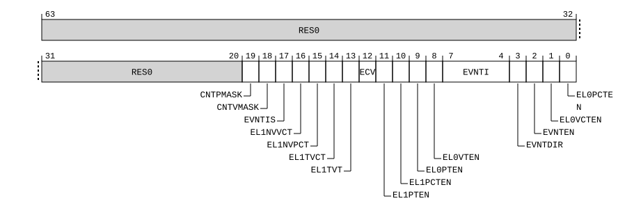
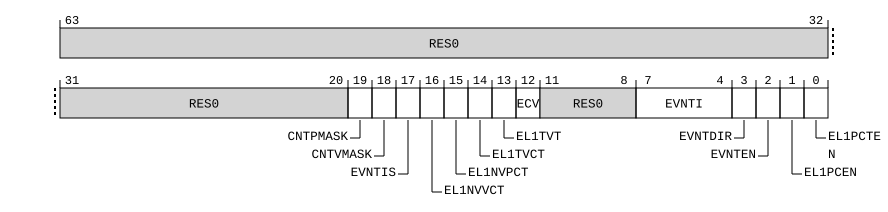

# ​D24.10.2 CNTHCTL_EL2, Counter-timer Hypervisor Control Register

Source: <https://developer.arm.com/documentation/ddi0487/mc/-Part-D-The-AArch64-System-Level-Architecture/-Chapter-D24-AArch64-System-Register-Descriptions/-D24-10-Generic-Timer-registers/-D24-10-2-CNTHCTL-EL2--Counter-timer-Hypervisor-Control-Register>

##### D24.10.2 CNTHCTL\_EL2, Counter-timer Hypervisor Control Register

The CNTHCTL\_EL2 characteristics are:

Purpose
:   Controls the generation of an event stream from the physical counter, and access from EL1 to the physical counter and the EL1 physical timer.

Configuration
:   If EL2 is not implemented, this register is RES0 from EL3.

    Fields that control the generation of events from the event stream have an effect regardless of the current Exception level and whether EL2 is enabled in the current Security state.

    All other fields have no effect if EL2 is not enabled in the current Security state.

    AArch64 System register CNTHCTL\_EL2 bits [31:0] are architecturally mapped to AArch32 System register [CNTHCTL](/documentation/ddi0487/mc/-Part-G-The-AArch32-System-Level-Architecture/-Chapter-G8-AArch32-System-Register-Descriptions/-G8-7-Generic-Timer-registers/-G8-7-2-CNTHCTL--Counter-timer-Hyp-Control-register?lang=en#reg_aarch32_cnthctl)[31:0].

    This register is present only when FEAT\_AA64 is implemented. Otherwise, direct accesses to CNTHCTL\_EL2 are UNDEFINED.

Attributes
:   CNTHCTL\_EL2 is a 64-bit register.

###### Field descriptions

When EffectiveHCR\_EL2\_E2H() == '1':
:   

Bits [63:20]
:   Reserved, RES0.

CNTPMASK, bit [19]
:   When FEAT\_RME is implemented:
    :

<table>
 <colgroup>
  <col/>
  <col/>
 </colgroup>
 <thead>
  <tr>
   <th>
    <strong>
     CNTPMASK
    </strong>
   </th>
   <th>
    <strong>
     Meaning
    </strong>
   </th>
  </tr>
 </thead>
 <tbody>
  <tr>
   <td>
    <p>
     <code>
      0b0
     </code>
    </p>
   </td>
   <td>
    <p>
     This control has no effect on
     <a class="document-topic" document-topic-path="/ddi0487/mc/-Part-D-The-AArch64-System-Level-Architecture/-Chapter-D24-AArch64-System-Register-Descriptions/-D24-10-Generic-Timer-registers/-D24-10-22-CNTP-CTL-EL0--Counter-timer-Physical-Timer-Control-Register?lang=en#reg_aarch64_cntp_ctl_el0" href="/documentation/ddi0487/mc/-Part-D-The-AArch64-System-Level-Architecture/-Chapter-D24-AArch64-System-Register-Descriptions/-D24-10-Generic-Timer-registers/-D24-10-22-CNTP-CTL-EL0--Counter-timer-Physical-Timer-Control-Register?lang=en#reg_aarch64_cntp_ctl_el0">
      CNTP_CTL_EL0
     </a>
     .IMASK.
    </p>
   </td>
  </tr>
  <tr>
   <td>
    <p>
     <code>
      0b1
     </code>
    </p>
   </td>
   <td>
    <p>
     <a class="document-topic" document-topic-path="/ddi0487/mc/-Part-D-The-AArch64-System-Level-Architecture/-Chapter-D24-AArch64-System-Register-Descriptions/-D24-10-Generic-Timer-registers/-D24-10-22-CNTP-CTL-EL0--Counter-timer-Physical-Timer-Control-Register?lang=en#reg_aarch64_cntp_ctl_el0" href="/documentation/ddi0487/mc/-Part-D-The-AArch64-System-Level-Architecture/-Chapter-D24-AArch64-System-Register-Descriptions/-D24-10-Generic-Timer-registers/-D24-10-22-CNTP-CTL-EL0--Counter-timer-Physical-Timer-Control-Register?lang=en#reg_aarch64_cntp_ctl_el0">
      CNTP_CTL_EL0
     </a>
     .IMASK behaves as if set to 1 for all purposes other than a direct read of the field.
    </p>
   </td>
  </tr>
 </tbody>
</table>

        This bit is RES0 in Non-secure and Secure state.

        The reset behavior of this field is:

        - On a Warm reset, this field resets to an architecturally UNKNOWN value.

    Otherwise:
    :   Reserved, RES0.

CNTVMASK, bit [18]
:   When FEAT\_RME is implemented:
    :

<table>
 <colgroup>
  <col/>
  <col/>
 </colgroup>
 <thead>
  <tr>
   <th>
    <strong>
     CNTVMASK
    </strong>
   </th>
   <th>
    <strong>
     Meaning
    </strong>
   </th>
  </tr>
 </thead>
 <tbody>
  <tr>
   <td>
    <p>
     <code>
      0b0
     </code>
    </p>
   </td>
   <td>
    <p>
     This control has no effect on
     <a class="document-topic" document-topic-path="/ddi0487/mc/-Part-D-The-AArch64-System-Level-Architecture/-Chapter-D24-AArch64-System-Register-Descriptions/-D24-10-Generic-Timer-registers/-D24-10-28-CNTV-CTL-EL0--Counter-timer-Virtual-Timer-Control-Register?lang=en#reg_aarch64_cntv_ctl_el0" href="/documentation/ddi0487/mc/-Part-D-The-AArch64-System-Level-Architecture/-Chapter-D24-AArch64-System-Register-Descriptions/-D24-10-Generic-Timer-registers/-D24-10-28-CNTV-CTL-EL0--Counter-timer-Virtual-Timer-Control-Register?lang=en#reg_aarch64_cntv_ctl_el0">
      CNTV_CTL_EL0
     </a>
     .IMASK.
    </p>
   </td>
  </tr>
  <tr>
   <td>
    <p>
     <code>
      0b1
     </code>
    </p>
   </td>
   <td>
    <p>
     <a class="document-topic" document-topic-path="/ddi0487/mc/-Part-D-The-AArch64-System-Level-Architecture/-Chapter-D24-AArch64-System-Register-Descriptions/-D24-10-Generic-Timer-registers/-D24-10-28-CNTV-CTL-EL0--Counter-timer-Virtual-Timer-Control-Register?lang=en#reg_aarch64_cntv_ctl_el0" href="/documentation/ddi0487/mc/-Part-D-The-AArch64-System-Level-Architecture/-Chapter-D24-AArch64-System-Register-Descriptions/-D24-10-Generic-Timer-registers/-D24-10-28-CNTV-CTL-EL0--Counter-timer-Virtual-Timer-Control-Register?lang=en#reg_aarch64_cntv_ctl_el0">
      CNTV_CTL_EL0
     </a>
     .IMASK behaves as if set to 1 for all purposes other than a direct read of the field.
    </p>
   </td>
  </tr>
 </tbody>
</table>

        This bit is RES0 in Non-secure and Secure state.

        The reset behavior of this field is:

        - On a Warm reset, this field resets to an architecturally UNKNOWN value.

    Otherwise:
    :   Reserved, RES0.

EVNTIS, bit [17]
:   When FEAT\_ECV is implemented:
    :   Controls the scale of the generation of the event stream.

<table>
 <colgroup>
  <col/>
  <col/>
 </colgroup>
 <thead>
  <tr>
   <th>
    <strong>
     EVNTIS
    </strong>
   </th>
   <th>
    <strong>
     Meaning
    </strong>
   </th>
  </tr>
 </thead>
 <tbody>
  <tr>
   <td>
    <p>
     <code>
      0b0
     </code>
    </p>
   </td>
   <td>
    <p>
     The CNTHCTL_EL2.EVNTI field applies to
     <a class="document-topic" document-topic-path="/ddi0487/mc/-Part-D-The-AArch64-System-Level-Architecture/-Chapter-D24-AArch64-System-Register-Descriptions/-D24-10-Generic-Timer-registers/-D24-10-17-CNTPCT-EL0--Counter-timer-Physical-Count-Register?lang=en#reg_aarch64_cntpct_el0" href="/documentation/ddi0487/mc/-Part-D-The-AArch64-System-Level-Architecture/-Chapter-D24-AArch64-System-Register-Descriptions/-D24-10-Generic-Timer-registers/-D24-10-17-CNTPCT-EL0--Counter-timer-Physical-Count-Register?lang=en#reg_aarch64_cntpct_el0">
      CNTPCT_EL0
     </a>
     [15:0].
    </p>
   </td>
  </tr>
  <tr>
   <td>
    <p>
     <code>
      0b1
     </code>
    </p>
   </td>
   <td>
    <p>
     The CNTHCTL_EL2.EVNTI field applies to
     <a class="document-topic" document-topic-path="/ddi0487/mc/-Part-D-The-AArch64-System-Level-Architecture/-Chapter-D24-AArch64-System-Register-Descriptions/-D24-10-Generic-Timer-registers/-D24-10-17-CNTPCT-EL0--Counter-timer-Physical-Count-Register?lang=en#reg_aarch64_cntpct_el0" href="/documentation/ddi0487/mc/-Part-D-The-AArch64-System-Level-Architecture/-Chapter-D24-AArch64-System-Register-Descriptions/-D24-10-Generic-Timer-registers/-D24-10-17-CNTPCT-EL0--Counter-timer-Physical-Count-Register?lang=en#reg_aarch64_cntpct_el0">
      CNTPCT_EL0
     </a>
     [23:8].
    </p>
   </td>
  </tr>
 </tbody>
</table>

        This control applies regardless of the value of the CNTHCTL\_EL2.ECV bit.

        The reset behavior of this field is:

        - On a Warm reset, this field resets to an architecturally UNKNOWN value.

    Otherwise:
    :   Reserved, RES0.

EL1NVVCT, bit [16]
:   When FEAT\_ECV is implemented:
    :   When [HCR\_EL2](/documentation/ddi0487/mc/-Part-D-The-AArch64-System-Level-Architecture/-Chapter-D24-AArch64-System-Register-Descriptions/-D24-2-General-system-control-registers/-D24-2-61-HCR-EL2--Hypervisor-Configuration-Register?lang=en#reg_aarch64_hcr_el2).TGE is 0 and the Effective value of [HCR\_EL2](/documentation/ddi0487/mc/-Part-D-The-AArch64-System-Level-Architecture/-Chapter-D24-AArch64-System-Register-Descriptions/-D24-2-General-system-control-registers/-D24-2-61-HCR-EL2--Hypervisor-Configuration-Register?lang=en#reg_aarch64_hcr_el2).{NV2, NV1, NV} is {1, 0, 1}, traps EL1 accesses to the specified EL1 virtual timer registers using the EL02 descriptors to EL2 as follows:

        Accesses to CNTV\_CTL\_EL02 and CNTV\_CVAL\_EL02 are trapped to EL2 and reported with EC syndrome value `0x18`.

<table>
 <colgroup>
  <col/>
  <col/>
 </colgroup>
 <thead>
  <tr>
   <th>
    <strong>
     EL1NVVCT
    </strong>
   </th>
   <th>
    <strong>
     Meaning
    </strong>
   </th>
  </tr>
 </thead>
 <tbody>
  <tr>
   <td>
    <p>
     <code>
      0b0
     </code>
    </p>
   </td>
   <td>
    <p>
     This control does not cause any instructions to be trapped.
    </p>
   </td>
  </tr>
  <tr>
   <td>
    <p>
     <code>
      0b1
     </code>
    </p>
   </td>
   <td>
    <p>
     EL1 accesses to the specified registers are trapped to EL2.
    </p>
   </td>
  </tr>
 </tbody>
</table>

        If [HCR\_EL2](/documentation/ddi0487/mc/-Part-D-The-AArch64-System-Level-Architecture/-Chapter-D24-AArch64-System-Register-Descriptions/-D24-2-General-system-control-registers/-D24-2-61-HCR-EL2--Hypervisor-Configuration-Register?lang=en#reg_aarch64_hcr_el2).TGE is 1 or the Effective value of [HCR\_EL2](/documentation/ddi0487/mc/-Part-D-The-AArch64-System-Level-Architecture/-Chapter-D24-AArch64-System-Register-Descriptions/-D24-2-General-system-control-registers/-D24-2-61-HCR-EL2--Hypervisor-Configuration-Register?lang=en#reg_aarch64_hcr_el2).{NV2, NV1, NV} is not {1, 0, 1}, this control does not cause any instructions to be trapped.

        If EL3 is implemented and EL2 is not implemented, behavior is as if this bit is 0 other than for the purpose of a direct read.

        This control applies regardless of the value of the CNTHCTL\_EL2.ECV bit.

        The reset behavior of this field is:

        - On a Warm reset, this field resets to an architecturally UNKNOWN value.

    Otherwise:
    :   Reserved, RES0.

EL1NVPCT, bit [15]
:   When FEAT\_ECV is implemented:
    :   When [HCR\_EL2](/documentation/ddi0487/mc/-Part-D-The-AArch64-System-Level-Architecture/-Chapter-D24-AArch64-System-Register-Descriptions/-D24-2-General-system-control-registers/-D24-2-61-HCR-EL2--Hypervisor-Configuration-Register?lang=en#reg_aarch64_hcr_el2).TGE is 0 and the Effective value of [HCR\_EL2](/documentation/ddi0487/mc/-Part-D-The-AArch64-System-Level-Architecture/-Chapter-D24-AArch64-System-Register-Descriptions/-D24-2-General-system-control-registers/-D24-2-61-HCR-EL2--Hypervisor-Configuration-Register?lang=en#reg_aarch64_hcr_el2).{NV2, NV1, NV} is {1, 0, 1}, traps EL1 accesses to the specified EL1 physical timer registers using the EL02 descriptors to EL2 as follows:

        Accesses to CNTP\_CTL\_EL02 and CNTP\_CVAL\_EL02 are trapped to EL2 and reported with EC syndrome value `0x18`.

<table>
 <colgroup>
  <col/>
  <col/>
 </colgroup>
 <thead>
  <tr>
   <th>
    <strong>
     EL1NVPCT
    </strong>
   </th>
   <th>
    <strong>
     Meaning
    </strong>
   </th>
  </tr>
 </thead>
 <tbody>
  <tr>
   <td>
    <p>
     <code>
      0b0
     </code>
    </p>
   </td>
   <td>
    <p>
     This control does not cause any instructions to be trapped.
    </p>
   </td>
  </tr>
  <tr>
   <td>
    <p>
     <code>
      0b1
     </code>
    </p>
   </td>
   <td>
    <p>
     EL1 accesses to the specified registers are trapped to EL2.
    </p>
   </td>
  </tr>
 </tbody>
</table>

        If [HCR\_EL2](/documentation/ddi0487/mc/-Part-D-The-AArch64-System-Level-Architecture/-Chapter-D24-AArch64-System-Register-Descriptions/-D24-2-General-system-control-registers/-D24-2-61-HCR-EL2--Hypervisor-Configuration-Register?lang=en#reg_aarch64_hcr_el2).TGE is 1 or the Effective value of [HCR\_EL2](/documentation/ddi0487/mc/-Part-D-The-AArch64-System-Level-Architecture/-Chapter-D24-AArch64-System-Register-Descriptions/-D24-2-General-system-control-registers/-D24-2-61-HCR-EL2--Hypervisor-Configuration-Register?lang=en#reg_aarch64_hcr_el2).{NV2, NV1, NV} is not {1, 0, 1}, this control does not cause any instructions to be trapped.

        If EL3 is implemented and EL2 is not implemented, behavior is as if this bit is 0 other than for the purpose of a direct read.

        This control applies regardless of the value of the CNTHCTL\_EL2.ECV bit.

        The reset behavior of this field is:

        - On a Warm reset, this field resets to an architecturally UNKNOWN value.

    Otherwise:
    :   Reserved, RES0.

EL1TVCT, bit [14]
:   When FEAT\_ECV is implemented:
    :   Traps EL0 and EL1 accesses to the EL1 virtual counter registers to EL2 when EL2 is enabled in the current Security state, as follows:

        - In AArch64 state, accesses to [CNTVCT\_EL0](/documentation/ddi0487/mc/-Part-D-The-AArch64-System-Level-Architecture/-Chapter-D24-AArch64-System-Register-Descriptions/-D24-10-Generic-Timer-registers/-D24-10-26-CNTVCT-EL0--Counter-timer-Virtual-Count-Register?lang=en#reg_aarch64_cntvct_el0) and [CNTVCTSS\_EL0](/documentation/ddi0487/mc/-Part-D-The-AArch64-System-Level-Architecture/-Chapter-D24-AArch64-System-Register-Descriptions/-D24-10-Generic-Timer-registers/-D24-10-25-CNTVCTSS-EL0--Counter-timer-Self-Synchronized-Virtual-Count-Register?lang=en#reg_aarch64_cntvctss_el0) are trapped to EL2 and reported using EC syndrome value `0x18`, unless they are trapped by [CNTKCTL\_EL1](/documentation/ddi0487/mc/-Part-D-The-AArch64-System-Level-Architecture/-Chapter-D24-AArch64-System-Register-Descriptions/-D24-10-Generic-Timer-registers/-D24-10-15-CNTKCTL-EL1--Counter-timer-Kernel-Control-Register?lang=en#reg_aarch64_cntkctl_el1).EL0VCTEN.
        - In AArch32 state, accesses to [CNTVCT](/documentation/ddi0487/mc/-Part-G-The-AArch32-System-Level-Architecture/-Chapter-G8-AArch32-System-Register-Descriptions/-G8-7-Generic-Timer-registers/-G8-7-24-CNTVCT--Counter-timer-Virtual-Count-register?lang=en#reg_aarch32_cntvct) are trapped to EL2 and reported with EC syndrome value `0x04`, unless they are trapped by [CNTKCTL\_EL1](/documentation/ddi0487/mc/-Part-D-The-AArch64-System-Level-Architecture/-Chapter-D24-AArch64-System-Register-Descriptions/-D24-10-Generic-Timer-registers/-D24-10-15-CNTKCTL-EL1--Counter-timer-Kernel-Control-Register?lang=en#reg_aarch64_cntkctl_el1).EL0VCTEN or [CNTKCTL](/documentation/ddi0487/mc/-Part-G-The-AArch32-System-Level-Architecture/-Chapter-G8-AArch32-System-Register-Descriptions/-G8-7-Generic-Timer-registers/-G8-7-15-CNTKCTL--Counter-timer-Kernel-Control-register?lang=en#reg_aarch32_cntkctl).PL0VCTEN.

<table>
 <colgroup>
  <col/>
  <col/>
 </colgroup>
 <thead>
  <tr>
   <th>
    <strong>
     EL1TVCT
    </strong>
   </th>
   <th>
    <strong>
     Meaning
    </strong>
   </th>
  </tr>
 </thead>
 <tbody>
  <tr>
   <td>
    <p>
     <code>
      0b0
     </code>
    </p>
   </td>
   <td>
    <p>
     This control does not cause any instructions to be trapped.
    </p>
   </td>
  </tr>
  <tr>
   <td>
    <p>
     <code>
      0b1
     </code>
    </p>
   </td>
   <td>
    <p>
     EL0 and EL1 accesses to the specified registers are trapped to EL2.
    </p>
   </td>
  </tr>
 </tbody>
</table>

        If EL3 is implemented and EL2 is not implemented, behavior is as if this bit is 0 other than for the purpose of a direct read.

        If [HCR\_EL2](/documentation/ddi0487/mc/-Part-D-The-AArch64-System-Level-Architecture/-Chapter-D24-AArch64-System-Register-Descriptions/-D24-2-General-system-control-registers/-D24-2-61-HCR-EL2--Hypervisor-Configuration-Register?lang=en#reg_aarch64_hcr_el2).TGE is 1, this control does not cause any instructions to be trapped.

        This control applies regardless of the value of the CNTHCTL\_EL2.ECV bit.

        The reset behavior of this field is:

        - On a Warm reset, this field resets to an architecturally UNKNOWN value.

    Otherwise:
    :   Reserved, RES0.

EL1TVT, bit [13]
:   When FEAT\_ECV is implemented:
    :   When the Effective value of [HCR\_EL2](/documentation/ddi0487/mc/-Part-D-The-AArch64-System-Level-Architecture/-Chapter-D24-AArch64-System-Register-Descriptions/-D24-2-General-system-control-registers/-D24-2-61-HCR-EL2--Hypervisor-Configuration-Register?lang=en#reg_aarch64_hcr_el2).{E2H, TGE} is not {1, 1}, traps EL0 and EL1 accesses to the EL1 virtual timer registers to EL2, when EL2 is enabled for the current Security state, as follows:

        - In AArch64 state, accesses to the following registers are trapped to EL2 and reported with EC syndrome value `0x18`, unless they are trapped by [CNTKCTL\_EL1](/documentation/ddi0487/mc/-Part-D-The-AArch64-System-Level-Architecture/-Chapter-D24-AArch64-System-Register-Descriptions/-D24-10-Generic-Timer-registers/-D24-10-15-CNTKCTL-EL1--Counter-timer-Kernel-Control-Register?lang=en#reg_aarch64_cntkctl_el1).EL0VTEN:
          - [CNTV\_CTL\_EL0](/documentation/ddi0487/mc/-Part-D-The-AArch64-System-Level-Architecture/-Chapter-D24-AArch64-System-Register-Descriptions/-D24-10-Generic-Timer-registers/-D24-10-28-CNTV-CTL-EL0--Counter-timer-Virtual-Timer-Control-Register?lang=en#reg_aarch64_cntv_ctl_el0).
          - [CNTV\_CVAL\_EL0](/documentation/ddi0487/mc/-Part-D-The-AArch64-System-Level-Architecture/-Chapter-D24-AArch64-System-Register-Descriptions/-D24-10-Generic-Timer-registers/-D24-10-29-CNTV-CVAL-EL0--Counter-timer-Virtual-Timer-CompareValue-Register?lang=en#reg_aarch64_cntv_cval_el0).
          - [CNTV\_TVAL\_EL0](/documentation/ddi0487/mc/-Part-D-The-AArch64-System-Level-Architecture/-Chapter-D24-AArch64-System-Register-Descriptions/-D24-10-Generic-Timer-registers/-D24-10-30-CNTV-TVAL-EL0--Counter-timer-Virtual-Timer-TimerValue-Register?lang=en#reg_aarch64_cntv_tval_el0).
        - In AArch32 state, MRC and MCR accesses to the following registers are trapped to EL2 and reported using EC syndrome value `0x03`, and MCRR and MRRC accesses are trapped to EL2 and reported using EC syndrome value `0x04`, unless they are trapped by [CNTKCTL\_EL1](/documentation/ddi0487/mc/-Part-D-The-AArch64-System-Level-Architecture/-Chapter-D24-AArch64-System-Register-Descriptions/-D24-10-Generic-Timer-registers/-D24-10-15-CNTKCTL-EL1--Counter-timer-Kernel-Control-Register?lang=en#reg_aarch64_cntkctl_el1).EL0VTEN or [CNTKCTL](/documentation/ddi0487/mc/-Part-G-The-AArch32-System-Level-Architecture/-Chapter-G8-AArch32-System-Register-Descriptions/-G8-7-Generic-Timer-registers/-G8-7-15-CNTKCTL--Counter-timer-Kernel-Control-register?lang=en#reg_aarch32_cntkctl).PL0VTEN:
          - [CNTV\_CTL](/documentation/ddi0487/mc/-Part-G-The-AArch32-System-Level-Architecture/-Chapter-G8-AArch32-System-Register-Descriptions/-G8-7-Generic-Timer-registers/-G8-7-21-CNTV-CTL--Counter-timer-Virtual-Timer-Control-register?lang=en#reg_aarch32_cntv_ctl).
          - [CNTV\_CVAL](/documentation/ddi0487/mc/-Part-G-The-AArch32-System-Level-Architecture/-Chapter-G8-AArch32-System-Register-Descriptions/-G8-7-Generic-Timer-registers/-G8-7-22-CNTV-CVAL--Counter-timer-Virtual-Timer-CompareValue-register?lang=en#reg_aarch32_cntv_cval).
          - [CNTV\_TVAL](/documentation/ddi0487/mc/-Part-G-The-AArch32-System-Level-Architecture/-Chapter-G8-AArch32-System-Register-Descriptions/-G8-7-Generic-Timer-registers/-G8-7-23-CNTV-TVAL--Counter-timer-Virtual-Timer-TimerValue-register?lang=en#reg_aarch32_cntv_tval).

<table>
 <colgroup>
  <col/>
  <col/>
 </colgroup>
 <thead>
  <tr>
   <th>
    <strong>
     EL1TVT
    </strong>
   </th>
   <th>
    <strong>
     Meaning
    </strong>
   </th>
  </tr>
 </thead>
 <tbody>
  <tr>
   <td>
    <p>
     <code>
      0b0
     </code>
    </p>
   </td>
   <td>
    <p>
     This control does not cause any instructions to be trapped.
    </p>
   </td>
  </tr>
  <tr>
   <td>
    <p>
     <code>
      0b1
     </code>
    </p>
   </td>
   <td>
    <p>
     EL0 and EL1 accesses to the specified registers are trapped to EL2.
    </p>
   </td>
  </tr>
 </tbody>
</table>

        If [HCR\_EL2](/documentation/ddi0487/mc/-Part-D-The-AArch64-System-Level-Architecture/-Chapter-D24-AArch64-System-Register-Descriptions/-D24-2-General-system-control-registers/-D24-2-61-HCR-EL2--Hypervisor-Configuration-Register?lang=en#reg_aarch64_hcr_el2).TGE is 1, this control does not cause any instructions to be trapped.

        If EL3 is implemented and EL2 is not implemented, behavior is as if this bit is 0 other than for the purpose of a direct read.

        This control applies regardless of the value of the CNTHCTL\_EL2.ECV bit.

        The reset behavior of this field is:

        - On a Warm reset, this field resets to an architecturally UNKNOWN value.

    Otherwise:
    :   Reserved, RES0.

ECV, bit [12]
:   When FEAT\_ECV\_POFF is implemented:
    :   Enables the Enhanced Counter Virtualization functionality registers.

        When the Enhanced Counter Virtualization is enabled, the behavior is as follows:

        - An MRS to [CNTPCT\_EL0](/documentation/ddi0487/mc/-Part-D-The-AArch64-System-Level-Architecture/-Chapter-D24-AArch64-System-Register-Descriptions/-D24-10-Generic-Timer-registers/-D24-10-17-CNTPCT-EL0--Counter-timer-Physical-Count-Register?lang=en#reg_aarch64_cntpct_el0) from either EL0 or EL1 that is not trapped will return the value (`PCount`<63:0> - [CNTPOFF\_EL2](/documentation/ddi0487/mc/-Part-D-The-AArch64-System-Level-Architecture/-Chapter-D24-AArch64-System-Register-Descriptions/-D24-10-Generic-Timer-registers/-D24-10-18-CNTPOFF-EL2--Counter-timer-Physical-Offset-Register?lang=en#reg_aarch64_cntpoff_el2)<63:0>).
        - The EL1 physical timer interrupt is triggered when ((`PCount`<63:0> - [CNTPOFF\_EL2](/documentation/ddi0487/mc/-Part-D-The-AArch64-System-Level-Architecture/-Chapter-D24-AArch64-System-Register-Descriptions/-D24-10-Generic-Timer-registers/-D24-10-18-CNTPOFF-EL2--Counter-timer-Physical-Offset-Register?lang=en#reg_aarch64_cntpoff_el2)<63:0>) - `PCVal`<63:0>) is greater than or equal to 0.

        `PCount`<63:0> is the physical count returned when [CNTPCT\_EL0](/documentation/ddi0487/mc/-Part-D-The-AArch64-System-Level-Architecture/-Chapter-D24-AArch64-System-Register-Descriptions/-D24-10-Generic-Timer-registers/-D24-10-17-CNTPCT-EL0--Counter-timer-Physical-Count-Register?lang=en#reg_aarch64_cntpct_el0) is read from EL2 or EL3.

        `PCVal`<63:0> is the EL1 physical timer compare value for this timer.

<table>
 <colgroup>
  <col/>
  <col/>
 </colgroup>
 <thead>
  <tr>
   <th>
    <strong>
     ECV
    </strong>
   </th>
   <th>
    <strong>
     Meaning
    </strong>
   </th>
  </tr>
 </thead>
 <tbody>
  <tr>
   <td>
    <p>
     <code>
      0b0
     </code>
    </p>
   </td>
   <td>
    <p>
     Enhanced Counter Virtualization functionality is disabled.
    </p>
   </td>
  </tr>
  <tr>
   <td>
    <p>
     <code>
      0b1
     </code>
    </p>
   </td>
   <td>
    <p>
     Enhanced Counter Virtualization functionality is enabled.
    </p>
   </td>
  </tr>
 </tbody>
</table>

        When [HCR\_EL2](/documentation/ddi0487/mc/-Part-D-The-AArch64-System-Level-Architecture/-Chapter-D24-AArch64-System-Register-Descriptions/-D24-2-General-system-control-registers/-D24-2-61-HCR-EL2--Hypervisor-Configuration-Register?lang=en#reg_aarch64_hcr_el2).TGE is 1 or [SCR\_EL3](/documentation/ddi0487/mc/-Part-D-The-AArch64-System-Level-Architecture/-Chapter-D24-AArch64-System-Register-Descriptions/-D24-2-General-system-control-registers/-D24-2-168-SCR-EL3--Secure-Configuration-Register?lang=en#reg_aarch64_scr_el3).{NS, EEL2} is {0, 0}, the Effective value of this field is 0.

        The reset behavior of this field is:

        - On a Warm reset, this field resets to an architecturally UNKNOWN value.

    Otherwise:
    :   Reserved, RES0.

EL1PTEN, bit [11]
:   When [HCR\_EL2](/documentation/ddi0487/mc/-Part-D-The-AArch64-System-Level-Architecture/-Chapter-D24-AArch64-System-Register-Descriptions/-D24-2-General-system-control-registers/-D24-2-61-HCR-EL2--Hypervisor-Configuration-Register?lang=en#reg_aarch64_hcr_el2).TGE is 0, traps EL0 and EL1 accesses to the EL1 physical timer registers to EL2 when EL2 is enabled in the current Security state, as follows:

    - In AArch64 state, accesses to the following registers are trapped to EL2 and reported with EC syndrome value `0x18`, unless they are trapped by [CNTKCTL\_EL1](/documentation/ddi0487/mc/-Part-D-The-AArch64-System-Level-Architecture/-Chapter-D24-AArch64-System-Register-Descriptions/-D24-10-Generic-Timer-registers/-D24-10-15-CNTKCTL-EL1--Counter-timer-Kernel-Control-Register?lang=en#reg_aarch64_cntkctl_el1).EL0PTEN:
      - [CNTP\_CTL\_EL0](/documentation/ddi0487/mc/-Part-D-The-AArch64-System-Level-Architecture/-Chapter-D24-AArch64-System-Register-Descriptions/-D24-10-Generic-Timer-registers/-D24-10-22-CNTP-CTL-EL0--Counter-timer-Physical-Timer-Control-Register?lang=en#reg_aarch64_cntp_ctl_el0).
      - [CNTP\_CVAL\_EL0](/documentation/ddi0487/mc/-Part-D-The-AArch64-System-Level-Architecture/-Chapter-D24-AArch64-System-Register-Descriptions/-D24-10-Generic-Timer-registers/-D24-10-23-CNTP-CVAL-EL0--Counter-timer-Physical-Timer-CompareValue-Register?lang=en#reg_aarch64_cntp_cval_el0).
      - [CNTP\_TVAL\_EL0](/documentation/ddi0487/mc/-Part-D-The-AArch64-System-Level-Architecture/-Chapter-D24-AArch64-System-Register-Descriptions/-D24-10-Generic-Timer-registers/-D24-10-24-CNTP-TVAL-EL0--Counter-timer-Physical-Timer-TimerValue-Register?lang=en#reg_aarch64_cntp_tval_el0).
    - In AArch32 state, MRC and MCR accesses to the following registers are trapped and reported using EC syndrome value `0x03` and MRRC and MCRR accesses are trapped and reported using EC syndrome value `0x04`, unless they are trapped by [CNTKCTL\_EL1](/documentation/ddi0487/mc/-Part-D-The-AArch64-System-Level-Architecture/-Chapter-D24-AArch64-System-Register-Descriptions/-D24-10-Generic-Timer-registers/-D24-10-15-CNTKCTL-EL1--Counter-timer-Kernel-Control-Register?lang=en#reg_aarch64_cntkctl_el1).EL0PTEN or [CNTKCTL](/documentation/ddi0487/mc/-Part-G-The-AArch32-System-Level-Architecture/-Chapter-G8-AArch32-System-Register-Descriptions/-G8-7-Generic-Timer-registers/-G8-7-15-CNTKCTL--Counter-timer-Kernel-Control-register?lang=en#reg_aarch32_cntkctl).PL0PTEN:
      - [CNTP\_CTL](/documentation/ddi0487/mc/-Part-G-The-AArch32-System-Level-Architecture/-Chapter-G8-AArch32-System-Register-Descriptions/-G8-7-Generic-Timer-registers/-G8-7-16-CNTP-CTL--Counter-timer-Physical-Timer-Control-register?lang=en#reg_aarch32_cntp_ctl).
      - [CNTP\_CVAL](/documentation/ddi0487/mc/-Part-G-The-AArch32-System-Level-Architecture/-Chapter-G8-AArch32-System-Register-Descriptions/-G8-7-Generic-Timer-registers/-G8-7-17-CNTP-CVAL--Counter-timer-Physical-Timer-CompareValue-register?lang=en#reg_aarch32_cntp_cval).
      - [CNTP\_TVAL](/documentation/ddi0487/mc/-Part-G-The-AArch32-System-Level-Architecture/-Chapter-G8-AArch32-System-Register-Descriptions/-G8-7-Generic-Timer-registers/-G8-7-18-CNTP-TVAL--Counter-timer-Physical-Timer-TimerValue-register?lang=en#reg_aarch32_cntp_tval).

<table>
 <colgroup>
  <col/>
  <col/>
 </colgroup>
 <thead>
  <tr>
   <th>
    <strong>
     EL1PTEN
    </strong>
   </th>
   <th>
    <strong>
     Meaning
    </strong>
   </th>
  </tr>
 </thead>
 <tbody>
  <tr>
   <td>
    <p>
     <code>
      0b0
     </code>
    </p>
   </td>
   <td>
    <p>
     EL0 and EL1 accesses to the specified registers are trapped to EL2.
    </p>
   </td>
  </tr>
  <tr>
   <td>
    <p>
     <code>
      0b1
     </code>
    </p>
   </td>
   <td>
    <p>
     This control does not cause any instructions to be trapped.
    </p>
   </td>
  </tr>
 </tbody>
</table>

    When [HCR\_EL2](/documentation/ddi0487/mc/-Part-D-The-AArch64-System-Level-Architecture/-Chapter-D24-AArch64-System-Register-Descriptions/-D24-2-General-system-control-registers/-D24-2-61-HCR-EL2--Hypervisor-Configuration-Register?lang=en#reg_aarch64_hcr_el2).TGE is 1, this control does not cause any instructions to be trapped.

    The reset behavior of this field is:

    - On a Warm reset, this field resets to an architecturally UNKNOWN value.

EL1PCTEN, bit [10]
:   When [HCR\_EL2](/documentation/ddi0487/mc/-Part-D-The-AArch64-System-Level-Architecture/-Chapter-D24-AArch64-System-Register-Descriptions/-D24-2-General-system-control-registers/-D24-2-61-HCR-EL2--Hypervisor-Configuration-Register?lang=en#reg_aarch64_hcr_el2).TGE is 0, traps EL0 and EL1 accesses to the EL1 physical counter registers to EL2 when EL2 is enabled in the current Security state, as follows:

    - In AArch64 state, accesses to [CNTPCT\_EL0](/documentation/ddi0487/mc/-Part-D-The-AArch64-System-Level-Architecture/-Chapter-D24-AArch64-System-Register-Descriptions/-D24-10-Generic-Timer-registers/-D24-10-17-CNTPCT-EL0--Counter-timer-Physical-Count-Register?lang=en#reg_aarch64_cntpct_el0) and [CNTPCTSS\_EL0](/documentation/ddi0487/mc/-Part-D-The-AArch64-System-Level-Architecture/-Chapter-D24-AArch64-System-Register-Descriptions/-D24-10-Generic-Timer-registers/-D24-10-16-CNTPCTSS-EL0--Counter-timer-Self-Synchronized-Physical-Count-Register?lang=en#reg_aarch64_cntpctss_el0) are trapped to EL2 and reported with EC syndrome value `0x18`, unless they are trapped by [CNTKCTL\_EL1](/documentation/ddi0487/mc/-Part-D-The-AArch64-System-Level-Architecture/-Chapter-D24-AArch64-System-Register-Descriptions/-D24-10-Generic-Timer-registers/-D24-10-15-CNTKCTL-EL1--Counter-timer-Kernel-Control-Register?lang=en#reg_aarch64_cntkctl_el1).EL0PCTEN.
    - In AArch32 state, MRRC or MCRR accesses to [CNTPCT](/documentation/ddi0487/mc/-Part-G-The-AArch32-System-Level-Architecture/-Chapter-G8-AArch32-System-Register-Descriptions/-G8-7-Generic-Timer-registers/-G8-7-19-CNTPCT--Counter-timer-Physical-Count-register?lang=en#reg_aarch32_cntpct) are trapped to EL2 and reported with EC syndrome value `0x04`, unless they are trapped by [CNTKCTL\_EL1](/documentation/ddi0487/mc/-Part-D-The-AArch64-System-Level-Architecture/-Chapter-D24-AArch64-System-Register-Descriptions/-D24-10-Generic-Timer-registers/-D24-10-15-CNTKCTL-EL1--Counter-timer-Kernel-Control-Register?lang=en#reg_aarch64_cntkctl_el1).EL0PCTEN or [CNTKCTL](/documentation/ddi0487/mc/-Part-G-The-AArch32-System-Level-Architecture/-Chapter-G8-AArch32-System-Register-Descriptions/-G8-7-Generic-Timer-registers/-G8-7-15-CNTKCTL--Counter-timer-Kernel-Control-register?lang=en#reg_aarch32_cntkctl).PL0PCTEN.

<table>
 <colgroup>
  <col/>
  <col/>
 </colgroup>
 <thead>
  <tr>
   <th>
    <strong>
     EL1PCTEN
    </strong>
   </th>
   <th>
    <strong>
     Meaning
    </strong>
   </th>
  </tr>
 </thead>
 <tbody>
  <tr>
   <td>
    <p>
     <code>
      0b0
     </code>
    </p>
   </td>
   <td>
    <p>
     EL0 and EL1 accesses to the specified registers are trapped to EL2.
    </p>
   </td>
  </tr>
  <tr>
   <td>
    <p>
     <code>
      0b1
     </code>
    </p>
   </td>
   <td>
    <p>
     This control does not cause any instructions to be trapped.
    </p>
   </td>
  </tr>
 </tbody>
</table>

    When [HCR\_EL2](/documentation/ddi0487/mc/-Part-D-The-AArch64-System-Level-Architecture/-Chapter-D24-AArch64-System-Register-Descriptions/-D24-2-General-system-control-registers/-D24-2-61-HCR-EL2--Hypervisor-Configuration-Register?lang=en#reg_aarch64_hcr_el2).TGE is 1, this control does not cause any instructions to be trapped.

    The reset behavior of this field is:

    - On a Warm reset, this field resets to an architecturally UNKNOWN value.

EL0PTEN, bit [9]
:   When [HCR\_EL2](/documentation/ddi0487/mc/-Part-D-The-AArch64-System-Level-Architecture/-Chapter-D24-AArch64-System-Register-Descriptions/-D24-2-General-system-control-registers/-D24-2-61-HCR-EL2--Hypervisor-Configuration-Register?lang=en#reg_aarch64_hcr_el2).TGE is 1, traps EL0 accesses to the physical timer registers to EL2, as follows:

    - In AArch64 state, accesses to the following registers are trapped to EL2 and reported with EC syndrome value `0x18`:
      - [CNTP\_CTL\_EL0](/documentation/ddi0487/mc/-Part-D-The-AArch64-System-Level-Architecture/-Chapter-D24-AArch64-System-Register-Descriptions/-D24-10-Generic-Timer-registers/-D24-10-22-CNTP-CTL-EL0--Counter-timer-Physical-Timer-Control-Register?lang=en#reg_aarch64_cntp_ctl_el0).
      - [CNTP\_CVAL\_EL0](/documentation/ddi0487/mc/-Part-D-The-AArch64-System-Level-Architecture/-Chapter-D24-AArch64-System-Register-Descriptions/-D24-10-Generic-Timer-registers/-D24-10-23-CNTP-CVAL-EL0--Counter-timer-Physical-Timer-CompareValue-Register?lang=en#reg_aarch64_cntp_cval_el0).
      - [CNTP\_TVAL\_EL0](/documentation/ddi0487/mc/-Part-D-The-AArch64-System-Level-Architecture/-Chapter-D24-AArch64-System-Register-Descriptions/-D24-10-Generic-Timer-registers/-D24-10-24-CNTP-TVAL-EL0--Counter-timer-Physical-Timer-TimerValue-Register?lang=en#reg_aarch64_cntp_tval_el0).
    - In AArch32 state, MRC and MCR accesses to the following registers are trapped and reported using EC syndrome value `0x03` and MRRC and MCRR accesses are trapped and reported using EC syndrome value `0x04`:
      - [CNTP\_CTL](/documentation/ddi0487/mc/-Part-G-The-AArch32-System-Level-Architecture/-Chapter-G8-AArch32-System-Register-Descriptions/-G8-7-Generic-Timer-registers/-G8-7-16-CNTP-CTL--Counter-timer-Physical-Timer-Control-register?lang=en#reg_aarch32_cntp_ctl).
      - [CNTP\_CVAL](/documentation/ddi0487/mc/-Part-G-The-AArch32-System-Level-Architecture/-Chapter-G8-AArch32-System-Register-Descriptions/-G8-7-Generic-Timer-registers/-G8-7-17-CNTP-CVAL--Counter-timer-Physical-Timer-CompareValue-register?lang=en#reg_aarch32_cntp_cval).
      - [CNTP\_TVAL](/documentation/ddi0487/mc/-Part-G-The-AArch32-System-Level-Architecture/-Chapter-G8-AArch32-System-Register-Descriptions/-G8-7-Generic-Timer-registers/-G8-7-18-CNTP-TVAL--Counter-timer-Physical-Timer-TimerValue-register?lang=en#reg_aarch32_cntp_tval).

<table>
 <colgroup>
  <col/>
  <col/>
 </colgroup>
 <thead>
  <tr>
   <th>
    <strong>
     EL0PTEN
    </strong>
   </th>
   <th>
    <strong>
     Meaning
    </strong>
   </th>
  </tr>
 </thead>
 <tbody>
  <tr>
   <td>
    <p>
     <code>
      0b0
     </code>
    </p>
   </td>
   <td>
    <p>
     EL0 accesses to the specified registers are trapped to EL2.
    </p>
   </td>
  </tr>
  <tr>
   <td>
    <p>
     <code>
      0b1
     </code>
    </p>
   </td>
   <td>
    <p>
     This control does not cause any instructions to be trapped.
    </p>
   </td>
  </tr>
 </tbody>
</table>

    When [HCR\_EL2](/documentation/ddi0487/mc/-Part-D-The-AArch64-System-Level-Architecture/-Chapter-D24-AArch64-System-Register-Descriptions/-D24-2-General-system-control-registers/-D24-2-61-HCR-EL2--Hypervisor-Configuration-Register?lang=en#reg_aarch64_hcr_el2).TGE is 0, this control does not cause any instructions to be trapped.

    The reset behavior of this field is:

    - On a Warm reset, this field resets to an architecturally UNKNOWN value.

EL0VTEN, bit [8]
:   When [HCR\_EL2](/documentation/ddi0487/mc/-Part-D-The-AArch64-System-Level-Architecture/-Chapter-D24-AArch64-System-Register-Descriptions/-D24-2-General-system-control-registers/-D24-2-61-HCR-EL2--Hypervisor-Configuration-Register?lang=en#reg_aarch64_hcr_el2).TGE is 1, traps EL0 accesses to the virtual timer registers to EL2 as follows:

    - In AArch64 state, accesses to the following registers are trapped to EL2 and reported with EC syndrome value `0x18`:
      - [CNTV\_CTL\_EL0](/documentation/ddi0487/mc/-Part-D-The-AArch64-System-Level-Architecture/-Chapter-D24-AArch64-System-Register-Descriptions/-D24-10-Generic-Timer-registers/-D24-10-28-CNTV-CTL-EL0--Counter-timer-Virtual-Timer-Control-Register?lang=en#reg_aarch64_cntv_ctl_el0).
      - [CNTV\_CVAL\_EL0](/documentation/ddi0487/mc/-Part-D-The-AArch64-System-Level-Architecture/-Chapter-D24-AArch64-System-Register-Descriptions/-D24-10-Generic-Timer-registers/-D24-10-29-CNTV-CVAL-EL0--Counter-timer-Virtual-Timer-CompareValue-Register?lang=en#reg_aarch64_cntv_cval_el0).
      - [CNTV\_TVAL\_EL0](/documentation/ddi0487/mc/-Part-D-The-AArch64-System-Level-Architecture/-Chapter-D24-AArch64-System-Register-Descriptions/-D24-10-Generic-Timer-registers/-D24-10-30-CNTV-TVAL-EL0--Counter-timer-Virtual-Timer-TimerValue-Register?lang=en#reg_aarch64_cntv_tval_el0).
    - In AArch32 state, MRC and MCR accesses to the following registers are trapped and reported using EC syndrome value `0x03` and MRRC and MCRR accesses are trapped and reported using EC syndrome value `0x04`:
      - [CNTV\_CTL](/documentation/ddi0487/mc/-Part-G-The-AArch32-System-Level-Architecture/-Chapter-G8-AArch32-System-Register-Descriptions/-G8-7-Generic-Timer-registers/-G8-7-21-CNTV-CTL--Counter-timer-Virtual-Timer-Control-register?lang=en#reg_aarch32_cntv_ctl).
      - [CNTV\_CVAL](/documentation/ddi0487/mc/-Part-G-The-AArch32-System-Level-Architecture/-Chapter-G8-AArch32-System-Register-Descriptions/-G8-7-Generic-Timer-registers/-G8-7-22-CNTV-CVAL--Counter-timer-Virtual-Timer-CompareValue-register?lang=en#reg_aarch32_cntv_cval).
      - [CNTV\_TVAL](/documentation/ddi0487/mc/-Part-G-The-AArch32-System-Level-Architecture/-Chapter-G8-AArch32-System-Register-Descriptions/-G8-7-Generic-Timer-registers/-G8-7-23-CNTV-TVAL--Counter-timer-Virtual-Timer-TimerValue-register?lang=en#reg_aarch32_cntv_tval).

<table>
 <colgroup>
  <col/>
  <col/>
 </colgroup>
 <thead>
  <tr>
   <th>
    <strong>
     EL0VTEN
    </strong>
   </th>
   <th>
    <strong>
     Meaning
    </strong>
   </th>
  </tr>
 </thead>
 <tbody>
  <tr>
   <td>
    <p>
     <code>
      0b0
     </code>
    </p>
   </td>
   <td>
    <p>
     EL0 accesses to the specified registers are trapped to EL2.
    </p>
   </td>
  </tr>
  <tr>
   <td>
    <p>
     <code>
      0b1
     </code>
    </p>
   </td>
   <td>
    <p>
     This control does not cause any instructions to be trapped.
    </p>
   </td>
  </tr>
 </tbody>
</table>

    When [HCR\_EL2](/documentation/ddi0487/mc/-Part-D-The-AArch64-System-Level-Architecture/-Chapter-D24-AArch64-System-Register-Descriptions/-D24-2-General-system-control-registers/-D24-2-61-HCR-EL2--Hypervisor-Configuration-Register?lang=en#reg_aarch64_hcr_el2).TGE is 0, this control does not cause any instructions to be trapped.

    The reset behavior of this field is:

    - On a Warm reset, this field resets to an architecturally UNKNOWN value.

EVNTI, bits [7:4]
:   Selects which bit of [CNTPCT\_EL0](/documentation/ddi0487/mc/-Part-D-The-AArch64-System-Level-Architecture/-Chapter-D24-AArch64-System-Register-Descriptions/-D24-10-Generic-Timer-registers/-D24-10-17-CNTPCT-EL0--Counter-timer-Physical-Count-Register?lang=en#reg_aarch64_cntpct_el0), as seen from EL2, is the trigger for the event stream generated from that counter when that stream is enabled.

    If [FEAT\_ECV](/documentation/ddi0487/mc/-Part-A-Arm-Architecture-Introduction-and-Overview/-Chapter-A2-A-profile-Architecture-Extensions/-A2-2-Armv8-A-architecture-extensions/-A2-2-7-The-Armv8-6-architecture-extension?lang=en#feat_feat_ecv) is implemented, and CNTHCTL\_EL2.EVNTIS is 1, this field selects a trigger bit in the range 8 to 23 of [CNTPCT\_EL0](/documentation/ddi0487/mc/-Part-D-The-AArch64-System-Level-Architecture/-Chapter-D24-AArch64-System-Register-Descriptions/-D24-10-Generic-Timer-registers/-D24-10-17-CNTPCT-EL0--Counter-timer-Physical-Count-Register?lang=en#reg_aarch64_cntpct_el0).

    Otherwise, this field selects a trigger bit in the range 0 to 15 of [CNTPCT\_EL0](/documentation/ddi0487/mc/-Part-D-The-AArch64-System-Level-Architecture/-Chapter-D24-AArch64-System-Register-Descriptions/-D24-10-Generic-Timer-registers/-D24-10-17-CNTPCT-EL0--Counter-timer-Physical-Count-Register?lang=en#reg_aarch64_cntpct_el0).

    The reset behavior of this field is:

    - On a Warm reset, this field resets to an architecturally UNKNOWN value.

EVNTDIR, bit [3]
:   Controls which transition of the [CNTPCT\_EL0](/documentation/ddi0487/mc/-Part-D-The-AArch64-System-Level-Architecture/-Chapter-D24-AArch64-System-Register-Descriptions/-D24-10-Generic-Timer-registers/-D24-10-17-CNTPCT-EL0--Counter-timer-Physical-Count-Register?lang=en#reg_aarch64_cntpct_el0) trigger bit, as seen from EL2 and defined by EVNTI, generates an event when the event stream is enabled.

<table>
 <colgroup>
  <col/>
  <col/>
 </colgroup>
 <thead>
  <tr>
   <th>
    <strong>
     EVNTDIR
    </strong>
   </th>
   <th>
    <strong>
     Meaning
    </strong>
   </th>
  </tr>
 </thead>
 <tbody>
  <tr>
   <td>
    <p>
     <code>
      0b0
     </code>
    </p>
   </td>
   <td>
    <p>
     A 0 to 1 transition of the trigger bit triggers an event.
    </p>
   </td>
  </tr>
  <tr>
   <td>
    <p>
     <code>
      0b1
     </code>
    </p>
   </td>
   <td>
    <p>
     A 1 to 0 transition of the trigger bit triggers an event.
    </p>
   </td>
  </tr>
 </tbody>
</table>

    The reset behavior of this field is:

    - On a Warm reset, this field resets to an architecturally UNKNOWN value.

EVNTEN, bit [2]
:   Enables the generation of an event stream from [CNTPCT\_EL0](/documentation/ddi0487/mc/-Part-D-The-AArch64-System-Level-Architecture/-Chapter-D24-AArch64-System-Register-Descriptions/-D24-10-Generic-Timer-registers/-D24-10-17-CNTPCT-EL0--Counter-timer-Physical-Count-Register?lang=en#reg_aarch64_cntpct_el0) as seen from EL2.

<table>
 <colgroup>
  <col/>
  <col/>
 </colgroup>
 <thead>
  <tr>
   <th>
    <strong>
     EVNTEN
    </strong>
   </th>
   <th>
    <strong>
     Meaning
    </strong>
   </th>
  </tr>
 </thead>
 <tbody>
  <tr>
   <td>
    <p>
     <code>
      0b0
     </code>
    </p>
   </td>
   <td>
    <p>
     Disables the event stream.
    </p>
   </td>
  </tr>
  <tr>
   <td>
    <p>
     <code>
      0b1
     </code>
    </p>
   </td>
   <td>
    <p>
     Enables the event stream.
    </p>
   </td>
  </tr>
 </tbody>
</table>

    The reset behavior of this field is:

    - On a Warm reset, this field resets to an architecturally UNKNOWN value.

EL0VCTEN, bit [1]
:   When [HCR\_EL2](/documentation/ddi0487/mc/-Part-D-The-AArch64-System-Level-Architecture/-Chapter-D24-AArch64-System-Register-Descriptions/-D24-2-General-system-control-registers/-D24-2-61-HCR-EL2--Hypervisor-Configuration-Register?lang=en#reg_aarch64_hcr_el2).TGE is 1, traps EL0 accesses to the frequency register and virtual counter registers to EL2, as follows:

    - In AArch64 state, accesses to the following registers are trapped to EL2 and reported with EC syndrome value `0x18`:
      - [CNTVCT\_EL0](/documentation/ddi0487/mc/-Part-D-The-AArch64-System-Level-Architecture/-Chapter-D24-AArch64-System-Register-Descriptions/-D24-10-Generic-Timer-registers/-D24-10-26-CNTVCT-EL0--Counter-timer-Virtual-Count-Register?lang=en#reg_aarch64_cntvct_el0).
      - [CNTVCTSS\_EL0](/documentation/ddi0487/mc/-Part-D-The-AArch64-System-Level-Architecture/-Chapter-D24-AArch64-System-Register-Descriptions/-D24-10-Generic-Timer-registers/-D24-10-25-CNTVCTSS-EL0--Counter-timer-Self-Synchronized-Virtual-Count-Register?lang=en#reg_aarch64_cntvctss_el0).
      - [CNTFRQ\_EL0](/documentation/ddi0487/mc/-Part-D-The-AArch64-System-Level-Architecture/-Chapter-D24-AArch64-System-Register-Descriptions/-D24-10-Generic-Timer-registers/-D24-10-1-CNTFRQ-EL0--Counter-timer-Frequency-Register?lang=en#reg_aarch64_cntfrq_el0) if [CNTHCTL\_EL2](/documentation/ddi0487/mc/-Part-D-The-AArch64-System-Level-Architecture/-Chapter-D24-AArch64-System-Register-Descriptions/-D24-10-Generic-Timer-registers/-D24-10-2-CNTHCTL-EL2--Counter-timer-Hypervisor-Control-Register?lang=en#reg_aarch64_cnthctl_el2).EL0PCTEN is 0.
    - In AArch32 state, MRC and MCR accesses to the following registers are trapped and reported using EC syndrome value `0x03` and MRRC and MCRR accesses are trapped and reported using EC syndrome value `0x04`:
      - [CNTVCT](/documentation/ddi0487/mc/-Part-G-The-AArch32-System-Level-Architecture/-Chapter-G8-AArch32-System-Register-Descriptions/-G8-7-Generic-Timer-registers/-G8-7-24-CNTVCT--Counter-timer-Virtual-Count-register?lang=en#reg_aarch32_cntvct) and if [CNTHCTL](/documentation/ddi0487/mc/-Part-G-The-AArch32-System-Level-Architecture/-Chapter-G8-AArch32-System-Register-Descriptions/-G8-7-Generic-Timer-registers/-G8-7-2-CNTHCTL--Counter-timer-Hyp-Control-register?lang=en#reg_aarch32_cnthctl).EL0PCTEN is 0, [CNTFRQ](/documentation/ddi0487/mc/-Part-G-The-AArch32-System-Level-Architecture/-Chapter-G8-AArch32-System-Register-Descriptions/-G8-7-Generic-Timer-registers/-G8-7-1-CNTFRQ--Counter-timer-Frequency-register?lang=en#reg_aarch32_cntfrq).

<table>
 <colgroup>
  <col/>
  <col/>
 </colgroup>
 <thead>
  <tr>
   <th>
    <strong>
     EL0VCTEN
    </strong>
   </th>
   <th>
    <strong>
     Meaning
    </strong>
   </th>
  </tr>
 </thead>
 <tbody>
  <tr>
   <td>
    <p>
     <code>
      0b0
     </code>
    </p>
   </td>
   <td>
    <p>
     EL0 accesses to the specified registers are trapped to EL2.
    </p>
   </td>
  </tr>
  <tr>
   <td>
    <p>
     <code>
      0b1
     </code>
    </p>
   </td>
   <td>
    <p>
     This control does not cause any instructions to be trapped.
    </p>
   </td>
  </tr>
 </tbody>
</table>

    If [HCR\_EL2](/documentation/ddi0487/mc/-Part-D-The-AArch64-System-Level-Architecture/-Chapter-D24-AArch64-System-Register-Descriptions/-D24-2-General-system-control-registers/-D24-2-61-HCR-EL2--Hypervisor-Configuration-Register?lang=en#reg_aarch64_hcr_el2).TGE is 0, the field is ignored for all purposes other than direct reads and writes of the register.

    The reset behavior of this field is:

    - On a Warm reset, this field resets to an architecturally UNKNOWN value.

EL0PCTEN, bit [0]
:   Traps EL0 accesses to the frequency register and physical counter registers to EL2, as follows:

    - In AArch64 state, accesses to the following registers are trapped to EL2 and reported with EC syndrome value `0x18`:
      - [CNTPCT\_EL0](/documentation/ddi0487/mc/-Part-D-The-AArch64-System-Level-Architecture/-Chapter-D24-AArch64-System-Register-Descriptions/-D24-10-Generic-Timer-registers/-D24-10-17-CNTPCT-EL0--Counter-timer-Physical-Count-Register?lang=en#reg_aarch64_cntpct_el0).
      - [CNTPCTSS\_EL0](/documentation/ddi0487/mc/-Part-D-The-AArch64-System-Level-Architecture/-Chapter-D24-AArch64-System-Register-Descriptions/-D24-10-Generic-Timer-registers/-D24-10-16-CNTPCTSS-EL0--Counter-timer-Self-Synchronized-Physical-Count-Register?lang=en#reg_aarch64_cntpctss_el0).
      - [CNTFRQ\_EL0](/documentation/ddi0487/mc/-Part-D-The-AArch64-System-Level-Architecture/-Chapter-D24-AArch64-System-Register-Descriptions/-D24-10-Generic-Timer-registers/-D24-10-1-CNTFRQ-EL0--Counter-timer-Frequency-Register?lang=en#reg_aarch64_cntfrq_el0) if [CNTHCTL\_EL2](/documentation/ddi0487/mc/-Part-D-The-AArch64-System-Level-Architecture/-Chapter-D24-AArch64-System-Register-Descriptions/-D24-10-Generic-Timer-registers/-D24-10-2-CNTHCTL-EL2--Counter-timer-Hypervisor-Control-Register?lang=en#reg_aarch64_cnthctl_el2).EL0VCTEN is 0.
    - In AArch32 state, MRC and MCR accesses to the following registers are trapped and reported using EC syndrome value `0x03` and MRRC and MCRR accesses are trapped and reported using EC syndrome value `0x04`:
      - [CNTPCT](/documentation/ddi0487/mc/-Part-G-The-AArch32-System-Level-Architecture/-Chapter-G8-AArch32-System-Register-Descriptions/-G8-7-Generic-Timer-registers/-G8-7-19-CNTPCT--Counter-timer-Physical-Count-register?lang=en#reg_aarch32_cntpct) and if [CNTHCTL\_EL2](/documentation/ddi0487/mc/-Part-D-The-AArch64-System-Level-Architecture/-Chapter-D24-AArch64-System-Register-Descriptions/-D24-10-Generic-Timer-registers/-D24-10-2-CNTHCTL-EL2--Counter-timer-Hypervisor-Control-Register?lang=en#reg_aarch64_cnthctl_el2).EL0VCTEN is 0, [CNTFRQ](/documentation/ddi0487/mc/-Part-G-The-AArch32-System-Level-Architecture/-Chapter-G8-AArch32-System-Register-Descriptions/-G8-7-Generic-Timer-registers/-G8-7-1-CNTFRQ--Counter-timer-Frequency-register?lang=en#reg_aarch32_cntfrq).

<table>
 <colgroup>
  <col/>
  <col/>
 </colgroup>
 <thead>
  <tr>
   <th>
    <strong>
     EL0PCTEN
    </strong>
   </th>
   <th>
    <strong>
     Meaning
    </strong>
   </th>
  </tr>
 </thead>
 <tbody>
  <tr>
   <td>
    <p>
     <code>
      0b0
     </code>
    </p>
   </td>
   <td>
    <p>
     From AArch64 state: EL0 accesses to the specified registers are trapped to EL2.
    </p>
   </td>
  </tr>
  <tr>
   <td>
    <p>
     <code>
      0b1
     </code>
    </p>
   </td>
   <td>
    <p>
     This control does not cause any instructions to be trapped.
    </p>
   </td>
  </tr>
 </tbody>
</table>

    If [HCR\_EL2](/documentation/ddi0487/mc/-Part-D-The-AArch64-System-Level-Architecture/-Chapter-D24-AArch64-System-Register-Descriptions/-D24-2-General-system-control-registers/-D24-2-61-HCR-EL2--Hypervisor-Configuration-Register?lang=en#reg_aarch64_hcr_el2).TGE is 0, the control does not cause any instructions to be trapped for all purposes other than direct reads and writes of the register.

    The reset behavior of this field is:

    - On a Warm reset, this field resets to an architecturally UNKNOWN value.

Otherwise:
:   

    The following field descriptions apply in all Armv8.0 implementations.

    The descriptions also explain the behavior when EL3 is implemented and EL2 is not implemented.

Bits [63:20]
:   Reserved, RES0.

CNTPMASK, bit [19]
:   When FEAT\_RME is implemented:
    :

<table>
 <colgroup>
  <col/>
  <col/>
 </colgroup>
 <thead>
  <tr>
   <th>
    <strong>
     CNTPMASK
    </strong>
   </th>
   <th>
    <strong>
     Meaning
    </strong>
   </th>
  </tr>
 </thead>
 <tbody>
  <tr>
   <td>
    <p>
     <code>
      0b0
     </code>
    </p>
   </td>
   <td>
    <p>
     This control has no effect on
     <a class="document-topic" document-topic-path="/ddi0487/mc/-Part-D-The-AArch64-System-Level-Architecture/-Chapter-D24-AArch64-System-Register-Descriptions/-D24-10-Generic-Timer-registers/-D24-10-22-CNTP-CTL-EL0--Counter-timer-Physical-Timer-Control-Register?lang=en#reg_aarch64_cntp_ctl_el0" href="/documentation/ddi0487/mc/-Part-D-The-AArch64-System-Level-Architecture/-Chapter-D24-AArch64-System-Register-Descriptions/-D24-10-Generic-Timer-registers/-D24-10-22-CNTP-CTL-EL0--Counter-timer-Physical-Timer-Control-Register?lang=en#reg_aarch64_cntp_ctl_el0">
      CNTP_CTL_EL0
     </a>
     .IMASK.
    </p>
   </td>
  </tr>
  <tr>
   <td>
    <p>
     <code>
      0b1
     </code>
    </p>
   </td>
   <td>
    <p>
     <a class="document-topic" document-topic-path="/ddi0487/mc/-Part-D-The-AArch64-System-Level-Architecture/-Chapter-D24-AArch64-System-Register-Descriptions/-D24-10-Generic-Timer-registers/-D24-10-22-CNTP-CTL-EL0--Counter-timer-Physical-Timer-Control-Register?lang=en#reg_aarch64_cntp_ctl_el0" href="/documentation/ddi0487/mc/-Part-D-The-AArch64-System-Level-Architecture/-Chapter-D24-AArch64-System-Register-Descriptions/-D24-10-Generic-Timer-registers/-D24-10-22-CNTP-CTL-EL0--Counter-timer-Physical-Timer-Control-Register?lang=en#reg_aarch64_cntp_ctl_el0">
      CNTP_CTL_EL0
     </a>
     .IMASK behaves as if set to 1 for all purposes other than a direct read of the field.
    </p>
   </td>
  </tr>
 </tbody>
</table>

        This bit is RES0 in Non-secure and Secure state.

        The reset behavior of this field is:

        - On a Warm reset, this field resets to an architecturally UNKNOWN value.

    Otherwise:
    :   Reserved, RES0.

CNTVMASK, bit [18]
:   When FEAT\_RME is implemented:
    :

<table>
 <colgroup>
  <col/>
  <col/>
 </colgroup>
 <thead>
  <tr>
   <th>
    <strong>
     CNTVMASK
    </strong>
   </th>
   <th>
    <strong>
     Meaning
    </strong>
   </th>
  </tr>
 </thead>
 <tbody>
  <tr>
   <td>
    <p>
     <code>
      0b0
     </code>
    </p>
   </td>
   <td>
    <p>
     This control has no effect on
     <a class="document-topic" document-topic-path="/ddi0487/mc/-Part-D-The-AArch64-System-Level-Architecture/-Chapter-D24-AArch64-System-Register-Descriptions/-D24-10-Generic-Timer-registers/-D24-10-28-CNTV-CTL-EL0--Counter-timer-Virtual-Timer-Control-Register?lang=en#reg_aarch64_cntv_ctl_el0" href="/documentation/ddi0487/mc/-Part-D-The-AArch64-System-Level-Architecture/-Chapter-D24-AArch64-System-Register-Descriptions/-D24-10-Generic-Timer-registers/-D24-10-28-CNTV-CTL-EL0--Counter-timer-Virtual-Timer-Control-Register?lang=en#reg_aarch64_cntv_ctl_el0">
      CNTV_CTL_EL0
     </a>
     .IMASK.
    </p>
   </td>
  </tr>
  <tr>
   <td>
    <p>
     <code>
      0b1
     </code>
    </p>
   </td>
   <td>
    <p>
     <a class="document-topic" document-topic-path="/ddi0487/mc/-Part-D-The-AArch64-System-Level-Architecture/-Chapter-D24-AArch64-System-Register-Descriptions/-D24-10-Generic-Timer-registers/-D24-10-28-CNTV-CTL-EL0--Counter-timer-Virtual-Timer-Control-Register?lang=en#reg_aarch64_cntv_ctl_el0" href="/documentation/ddi0487/mc/-Part-D-The-AArch64-System-Level-Architecture/-Chapter-D24-AArch64-System-Register-Descriptions/-D24-10-Generic-Timer-registers/-D24-10-28-CNTV-CTL-EL0--Counter-timer-Virtual-Timer-Control-Register?lang=en#reg_aarch64_cntv_ctl_el0">
      CNTV_CTL_EL0
     </a>
     .IMASK behaves as if set to 1 for all purposes other than a direct read of the field.
    </p>
   </td>
  </tr>
 </tbody>
</table>

        This bit is RES0 in Non-secure and Secure state.

        The reset behavior of this field is:

        - On a Warm reset, this field resets to an architecturally UNKNOWN value.

    Otherwise:
    :   Reserved, RES0.

EVNTIS, bit [17]
:   When FEAT\_ECV is implemented:
    :   Controls the scale of the generation of the event stream.

<table>
 <colgroup>
  <col/>
  <col/>
 </colgroup>
 <thead>
  <tr>
   <th>
    <strong>
     EVNTIS
    </strong>
   </th>
   <th>
    <strong>
     Meaning
    </strong>
   </th>
  </tr>
 </thead>
 <tbody>
  <tr>
   <td>
    <p>
     <code>
      0b0
     </code>
    </p>
   </td>
   <td>
    <p>
     The CNTHCTL_EL2.EVNTI field applies to
     <a class="document-topic" document-topic-path="/ddi0487/mc/-Part-D-The-AArch64-System-Level-Architecture/-Chapter-D24-AArch64-System-Register-Descriptions/-D24-10-Generic-Timer-registers/-D24-10-17-CNTPCT-EL0--Counter-timer-Physical-Count-Register?lang=en#reg_aarch64_cntpct_el0" href="/documentation/ddi0487/mc/-Part-D-The-AArch64-System-Level-Architecture/-Chapter-D24-AArch64-System-Register-Descriptions/-D24-10-Generic-Timer-registers/-D24-10-17-CNTPCT-EL0--Counter-timer-Physical-Count-Register?lang=en#reg_aarch64_cntpct_el0">
      CNTPCT_EL0
     </a>
     [15:0].
    </p>
   </td>
  </tr>
  <tr>
   <td>
    <p>
     <code>
      0b1
     </code>
    </p>
   </td>
   <td>
    <p>
     The CNTHCTL_EL2.EVNTI field applies to
     <a class="document-topic" document-topic-path="/ddi0487/mc/-Part-D-The-AArch64-System-Level-Architecture/-Chapter-D24-AArch64-System-Register-Descriptions/-D24-10-Generic-Timer-registers/-D24-10-17-CNTPCT-EL0--Counter-timer-Physical-Count-Register?lang=en#reg_aarch64_cntpct_el0" href="/documentation/ddi0487/mc/-Part-D-The-AArch64-System-Level-Architecture/-Chapter-D24-AArch64-System-Register-Descriptions/-D24-10-Generic-Timer-registers/-D24-10-17-CNTPCT-EL0--Counter-timer-Physical-Count-Register?lang=en#reg_aarch64_cntpct_el0">
      CNTPCT_EL0
     </a>
     [23:8].
    </p>
   </td>
  </tr>
 </tbody>
</table>

        This control applies regardless of the value of the CNTHCTL\_EL2.ECV bit.

        The reset behavior of this field is:

        - On a Warm reset, this field resets to an architecturally UNKNOWN value.

    Otherwise:
    :   Reserved, RES0.

EL1NVVCT, bit [16]
:   When FEAT\_ECV is implemented:
    :   When the Effective value of [HCR\_EL2](/documentation/ddi0487/mc/-Part-D-The-AArch64-System-Level-Architecture/-Chapter-D24-AArch64-System-Register-Descriptions/-D24-2-General-system-control-registers/-D24-2-61-HCR-EL2--Hypervisor-Configuration-Register?lang=en#reg_aarch64_hcr_el2).{NV2, NV1, NV} is {1, 0, 1}, traps EL1 accesses to the specified EL1 virtual timer registers using the EL02 descriptors to EL2 as follows:

        Accesses to CNTV\_CTL\_EL02 and CNTV\_CVAL\_EL02 are trapped to EL2 and reported with EC syndrome value `0x18`.

<table>
 <colgroup>
  <col/>
  <col/>
 </colgroup>
 <thead>
  <tr>
   <th>
    <strong>
     EL1NVVCT
    </strong>
   </th>
   <th>
    <strong>
     Meaning
    </strong>
   </th>
  </tr>
 </thead>
 <tbody>
  <tr>
   <td>
    <p>
     <code>
      0b0
     </code>
    </p>
   </td>
   <td>
    <p>
     This control does not cause any instructions to be trapped.
    </p>
   </td>
  </tr>
  <tr>
   <td>
    <p>
     <code>
      0b1
     </code>
    </p>
   </td>
   <td>
    <p>
     EL1 accesses to the specified registers are trapped to EL2.
    </p>
   </td>
  </tr>
 </tbody>
</table>

        If the Effective value of [HCR\_EL2](/documentation/ddi0487/mc/-Part-D-The-AArch64-System-Level-Architecture/-Chapter-D24-AArch64-System-Register-Descriptions/-D24-2-General-system-control-registers/-D24-2-61-HCR-EL2--Hypervisor-Configuration-Register?lang=en#reg_aarch64_hcr_el2).{NV2, NV1, NV} is not {1, 0, 1}, this control does not cause any instructions to be trapped.

        If EL3 is implemented and EL2 is not implemented, behavior is as if this bit is 0 other than for the purpose of a direct read.

        This control applies regardless of the value of the CNTHCTL\_EL2.ECV bit.

        The reset behavior of this field is:

        - On a Warm reset, this field resets to an architecturally UNKNOWN value.

    Otherwise:
    :   Reserved, RES0.

EL1NVPCT, bit [15]
:   When FEAT\_ECV is implemented:
    :   When the Effective value of [HCR\_EL2](/documentation/ddi0487/mc/-Part-D-The-AArch64-System-Level-Architecture/-Chapter-D24-AArch64-System-Register-Descriptions/-D24-2-General-system-control-registers/-D24-2-61-HCR-EL2--Hypervisor-Configuration-Register?lang=en#reg_aarch64_hcr_el2).{NV2, NV1, NV} is {1, 0, 1}, traps EL1 accesses to the specified EL1 physical timer registers using the EL02 descriptors to EL2 as follows:

        Accesses to CNTP\_CTL\_EL02 and CNTP\_CVAL\_EL02 are trapped to EL2 and reported with EC syndrome value `0x18`.

<table>
 <colgroup>
  <col/>
  <col/>
 </colgroup>
 <thead>
  <tr>
   <th>
    <strong>
     EL1NVPCT
    </strong>
   </th>
   <th>
    <strong>
     Meaning
    </strong>
   </th>
  </tr>
 </thead>
 <tbody>
  <tr>
   <td>
    <p>
     <code>
      0b0
     </code>
    </p>
   </td>
   <td>
    <p>
     This control does not cause any instructions to be trapped.
    </p>
   </td>
  </tr>
  <tr>
   <td>
    <p>
     <code>
      0b1
     </code>
    </p>
   </td>
   <td>
    <p>
     EL1 accesses to the specified registers are trapped to EL2.
    </p>
   </td>
  </tr>
 </tbody>
</table>

        If the Effective value of [HCR\_EL2](/documentation/ddi0487/mc/-Part-D-The-AArch64-System-Level-Architecture/-Chapter-D24-AArch64-System-Register-Descriptions/-D24-2-General-system-control-registers/-D24-2-61-HCR-EL2--Hypervisor-Configuration-Register?lang=en#reg_aarch64_hcr_el2).{NV2, NV1, NV} is not {1, 0, 1}, this control does not cause any instructions to be trapped.

        If EL3 is implemented and EL2 is not implemented, behavior is as if this bit is 0 other than for the purpose of a direct read.

        This control applies regardless of the value of the CNTHCTL\_EL2.ECV bit.

        The reset behavior of this field is:

        - On a Warm reset, this field resets to an architecturally UNKNOWN value.

    Otherwise:
    :   Reserved, RES0.

EL1TVCT, bit [14]
:   When FEAT\_ECV is implemented:
    :   Traps EL0 and EL1 accesses to the EL1 virtual counter registers to EL2, when EL2 is enabled in the current Security state, as follows:

        - In AArch64 state, accesses to [CNTVCT\_EL0](/documentation/ddi0487/mc/-Part-D-The-AArch64-System-Level-Architecture/-Chapter-D24-AArch64-System-Register-Descriptions/-D24-10-Generic-Timer-registers/-D24-10-26-CNTVCT-EL0--Counter-timer-Virtual-Count-Register?lang=en#reg_aarch64_cntvct_el0) and [CNTVCTSS\_EL0](/documentation/ddi0487/mc/-Part-D-The-AArch64-System-Level-Architecture/-Chapter-D24-AArch64-System-Register-Descriptions/-D24-10-Generic-Timer-registers/-D24-10-25-CNTVCTSS-EL0--Counter-timer-Self-Synchronized-Virtual-Count-Register?lang=en#reg_aarch64_cntvctss_el0) are trapped to EL2 and reported using EC syndrome value `0x18`, unless they are trapped by [CNTKCTL\_EL1](/documentation/ddi0487/mc/-Part-D-The-AArch64-System-Level-Architecture/-Chapter-D24-AArch64-System-Register-Descriptions/-D24-10-Generic-Timer-registers/-D24-10-15-CNTKCTL-EL1--Counter-timer-Kernel-Control-Register?lang=en#reg_aarch64_cntkctl_el1).EL0VCTEN.
        - In AArch32 state, accesses to [CNTVCT](/documentation/ddi0487/mc/-Part-G-The-AArch32-System-Level-Architecture/-Chapter-G8-AArch32-System-Register-Descriptions/-G8-7-Generic-Timer-registers/-G8-7-24-CNTVCT--Counter-timer-Virtual-Count-register?lang=en#reg_aarch32_cntvct) are trapped to EL2 and reported using EC syndrome value `0x04`, unless they are trapped by [CNTKCTL\_EL1](/documentation/ddi0487/mc/-Part-D-The-AArch64-System-Level-Architecture/-Chapter-D24-AArch64-System-Register-Descriptions/-D24-10-Generic-Timer-registers/-D24-10-15-CNTKCTL-EL1--Counter-timer-Kernel-Control-Register?lang=en#reg_aarch64_cntkctl_el1).EL0VCTEN or [CNTKCTL](/documentation/ddi0487/mc/-Part-G-The-AArch32-System-Level-Architecture/-Chapter-G8-AArch32-System-Register-Descriptions/-G8-7-Generic-Timer-registers/-G8-7-15-CNTKCTL--Counter-timer-Kernel-Control-register?lang=en#reg_aarch32_cntkctl).PL0VCTEN.

<table>
 <colgroup>
  <col/>
  <col/>
 </colgroup>
 <thead>
  <tr>
   <th>
    <strong>
     EL1TVCT
    </strong>
   </th>
   <th>
    <strong>
     Meaning
    </strong>
   </th>
  </tr>
 </thead>
 <tbody>
  <tr>
   <td>
    <p>
     <code>
      0b0
     </code>
    </p>
   </td>
   <td>
    <p>
     This control does not cause any instructions to be trapped.
    </p>
   </td>
  </tr>
  <tr>
   <td>
    <p>
     <code>
      0b1
     </code>
    </p>
   </td>
   <td>
    <p>
     EL0 and EL1 accesses to the specified registers are trapped to EL2.
    </p>
   </td>
  </tr>
 </tbody>
</table>

        If EL3 is implemented and EL2 is not implemented, behavior is as if this bit is 0 other than for the purpose of a direct read.

        This control applies regardless of the value of the CNTHCTL\_EL2.ECV bit.

        The reset behavior of this field is:

        - On a Warm reset, this field resets to an architecturally UNKNOWN value.

    Otherwise:
    :   Reserved, RES0.

EL1TVT, bit [13]
:   When FEAT\_ECV is implemented:
    :   If the Effective value of [HCR\_EL2](/documentation/ddi0487/mc/-Part-D-The-AArch64-System-Level-Architecture/-Chapter-D24-AArch64-System-Register-Descriptions/-D24-2-General-system-control-registers/-D24-2-61-HCR-EL2--Hypervisor-Configuration-Register?lang=en#reg_aarch64_hcr_el2).{E2H, TGE} is not {1, 1}, then traps EL0 and EL1 accesses to the EL1 virtual timer registers to EL2, when EL2 is enabled for the current Security state, as follows:

        - In AArch64 state, accesses to the following registers are trapped to EL2 and reported with EC syndrome value `0x18`, unless they are trapped by [CNTKCTL\_EL1](/documentation/ddi0487/mc/-Part-D-The-AArch64-System-Level-Architecture/-Chapter-D24-AArch64-System-Register-Descriptions/-D24-10-Generic-Timer-registers/-D24-10-15-CNTKCTL-EL1--Counter-timer-Kernel-Control-Register?lang=en#reg_aarch64_cntkctl_el1).EL0VTEN:
          - [CNTV\_CTL\_EL0](/documentation/ddi0487/mc/-Part-D-The-AArch64-System-Level-Architecture/-Chapter-D24-AArch64-System-Register-Descriptions/-D24-10-Generic-Timer-registers/-D24-10-28-CNTV-CTL-EL0--Counter-timer-Virtual-Timer-Control-Register?lang=en#reg_aarch64_cntv_ctl_el0).
          - [CNTV\_CVAL\_EL0](/documentation/ddi0487/mc/-Part-D-The-AArch64-System-Level-Architecture/-Chapter-D24-AArch64-System-Register-Descriptions/-D24-10-Generic-Timer-registers/-D24-10-29-CNTV-CVAL-EL0--Counter-timer-Virtual-Timer-CompareValue-Register?lang=en#reg_aarch64_cntv_cval_el0).
          - [CNTV\_TVAL\_EL0](/documentation/ddi0487/mc/-Part-D-The-AArch64-System-Level-Architecture/-Chapter-D24-AArch64-System-Register-Descriptions/-D24-10-Generic-Timer-registers/-D24-10-30-CNTV-TVAL-EL0--Counter-timer-Virtual-Timer-TimerValue-Register?lang=en#reg_aarch64_cntv_tval_el0).
        - In AArch32 state, MRC and MCR accesses to the following registers are trapped and reported using EC syndrome value `0x03` and MRRC and MCRR accesses are trapped and reported using EC syndrome value `0x04`, unless they are trapped by [CNTKCTL\_EL1](/documentation/ddi0487/mc/-Part-D-The-AArch64-System-Level-Architecture/-Chapter-D24-AArch64-System-Register-Descriptions/-D24-10-Generic-Timer-registers/-D24-10-15-CNTKCTL-EL1--Counter-timer-Kernel-Control-Register?lang=en#reg_aarch64_cntkctl_el1).EL0VTEN or [CNTKCTL](/documentation/ddi0487/mc/-Part-G-The-AArch32-System-Level-Architecture/-Chapter-G8-AArch32-System-Register-Descriptions/-G8-7-Generic-Timer-registers/-G8-7-15-CNTKCTL--Counter-timer-Kernel-Control-register?lang=en#reg_aarch32_cntkctl).PL0VTEN:
          - [CNTV\_CTL](/documentation/ddi0487/mc/-Part-G-The-AArch32-System-Level-Architecture/-Chapter-G8-AArch32-System-Register-Descriptions/-G8-7-Generic-Timer-registers/-G8-7-21-CNTV-CTL--Counter-timer-Virtual-Timer-Control-register?lang=en#reg_aarch32_cntv_ctl).
          - [CNTV\_CVAL](/documentation/ddi0487/mc/-Part-G-The-AArch32-System-Level-Architecture/-Chapter-G8-AArch32-System-Register-Descriptions/-G8-7-Generic-Timer-registers/-G8-7-22-CNTV-CVAL--Counter-timer-Virtual-Timer-CompareValue-register?lang=en#reg_aarch32_cntv_cval).
          - [CNTV\_TVAL](/documentation/ddi0487/mc/-Part-G-The-AArch32-System-Level-Architecture/-Chapter-G8-AArch32-System-Register-Descriptions/-G8-7-Generic-Timer-registers/-G8-7-23-CNTV-TVAL--Counter-timer-Virtual-Timer-TimerValue-register?lang=en#reg_aarch32_cntv_tval).

<table>
 <colgroup>
  <col/>
  <col/>
 </colgroup>
 <thead>
  <tr>
   <th>
    <strong>
     EL1TVT
    </strong>
   </th>
   <th>
    <strong>
     Meaning
    </strong>
   </th>
  </tr>
 </thead>
 <tbody>
  <tr>
   <td>
    <p>
     <code>
      0b0
     </code>
    </p>
   </td>
   <td>
    <p>
     This control does not cause any instructions to be trapped.
    </p>
   </td>
  </tr>
  <tr>
   <td>
    <p>
     <code>
      0b1
     </code>
    </p>
   </td>
   <td>
    <p>
     EL0 and EL1 accesses to the specified registers are trapped to EL2.
    </p>
   </td>
  </tr>
 </tbody>
</table>

        If EL3 is implemented and EL2 is not implemented, behavior is as if this bit is 0 other than for the purpose of a direct read.

        This control applies regardless of the value of the CNTHCTL\_EL2.ECV bit.

        The reset behavior of this field is:

        - On a Warm reset, this field resets to an architecturally UNKNOWN value.

    Otherwise:
    :   Reserved, RES0.

ECV, bit [12]
:   When FEAT\_ECV\_POFF is implemented:
    :   Enables the Enhanced Counter Virtualization functionality registers.

        When the Enhanced Counter Virtualization is enabled, the behavior is as follows:

        - An MRS to [CNTPCT\_EL0](/documentation/ddi0487/mc/-Part-D-The-AArch64-System-Level-Architecture/-Chapter-D24-AArch64-System-Register-Descriptions/-D24-10-Generic-Timer-registers/-D24-10-17-CNTPCT-EL0--Counter-timer-Physical-Count-Register?lang=en#reg_aarch64_cntpct_el0) from either EL0 or EL1 that is not trapped will return the value (`PCount`<63:0> - [CNTPOFF\_EL2](/documentation/ddi0487/mc/-Part-D-The-AArch64-System-Level-Architecture/-Chapter-D24-AArch64-System-Register-Descriptions/-D24-10-Generic-Timer-registers/-D24-10-18-CNTPOFF-EL2--Counter-timer-Physical-Offset-Register?lang=en#reg_aarch64_cntpoff_el2)<63:0>).
        - The EL1 physical timer interrupt is triggered when ((`PCount`<63:0> - [CNTPOFF\_EL2](/documentation/ddi0487/mc/-Part-D-The-AArch64-System-Level-Architecture/-Chapter-D24-AArch64-System-Register-Descriptions/-D24-10-Generic-Timer-registers/-D24-10-18-CNTPOFF-EL2--Counter-timer-Physical-Offset-Register?lang=en#reg_aarch64_cntpoff_el2)<63:0>) - `PCVal`<63:0>) is greater than or equal to 0.

        `PCount` is the physical count returned when [CNTPCT\_EL0](/documentation/ddi0487/mc/-Part-D-The-AArch64-System-Level-Architecture/-Chapter-D24-AArch64-System-Register-Descriptions/-D24-10-Generic-Timer-registers/-D24-10-17-CNTPCT-EL0--Counter-timer-Physical-Count-Register?lang=en#reg_aarch64_cntpct_el0) is read from EL2 or EL3.

        `PCVal`<63:0> is the EL1 physical timer compare value for this timer.

<table>
 <colgroup>
  <col/>
  <col/>
 </colgroup>
 <thead>
  <tr>
   <th>
    <strong>
     ECV
    </strong>
   </th>
   <th>
    <strong>
     Meaning
    </strong>
   </th>
  </tr>
 </thead>
 <tbody>
  <tr>
   <td>
    <p>
     <code>
      0b0
     </code>
    </p>
   </td>
   <td>
    <p>
     Enhanced Counter Virtualization functionality is disabled.
    </p>
   </td>
  </tr>
  <tr>
   <td>
    <p>
     <code>
      0b1
     </code>
    </p>
   </td>
   <td>
    <p>
     Enhanced Counter Virtualization functionality is enabled.
    </p>
   </td>
  </tr>
 </tbody>
</table>

        When [SCR\_EL3](/documentation/ddi0487/mc/-Part-D-The-AArch64-System-Level-Architecture/-Chapter-D24-AArch64-System-Register-Descriptions/-D24-2-General-system-control-registers/-D24-2-168-SCR-EL3--Secure-Configuration-Register?lang=en#reg_aarch64_scr_el3).{NS, EEL2} is {0, 0} or if [FEAT\_ECV\_POFF](/documentation/ddi0487/mc/-Part-A-Arm-Architecture-Introduction-and-Overview/-Chapter-A2-A-profile-Architecture-Extensions/-A2-2-Armv8-A-architecture-extensions/-A2-2-7-The-Armv8-6-architecture-extension?lang=en#feat_feat_ecv_poff) is not implemented, the Effective value of this field is 0.

        The reset behavior of this field is:

        - On a Warm reset, this field resets to an architecturally UNKNOWN value.

    Otherwise:
    :   Reserved, RES0.

Bits [11:8]
:   Reserved, RES0.

EVNTI, bits [7:4]
:   Selects which bit of [CNTPCT\_EL0](/documentation/ddi0487/mc/-Part-D-The-AArch64-System-Level-Architecture/-Chapter-D24-AArch64-System-Register-Descriptions/-D24-10-Generic-Timer-registers/-D24-10-17-CNTPCT-EL0--Counter-timer-Physical-Count-Register?lang=en#reg_aarch64_cntpct_el0), as seen from EL2,is the trigger for the event stream generated from that counter when that stream is enabled.

    If [FEAT\_ECV](/documentation/ddi0487/mc/-Part-A-Arm-Architecture-Introduction-and-Overview/-Chapter-A2-A-profile-Architecture-Extensions/-A2-2-Armv8-A-architecture-extensions/-A2-2-7-The-Armv8-6-architecture-extension?lang=en#feat_feat_ecv) is implemented, and CNTHCTL\_EL2.EVNTIS is 1, this field selects a trigger bit in the range 8 to 23 of [CNTPCT\_EL0](/documentation/ddi0487/mc/-Part-D-The-AArch64-System-Level-Architecture/-Chapter-D24-AArch64-System-Register-Descriptions/-D24-10-Generic-Timer-registers/-D24-10-17-CNTPCT-EL0--Counter-timer-Physical-Count-Register?lang=en#reg_aarch64_cntpct_el0).

    Otherwise, this field selects a trigger bit in the range 0 to 15 of [CNTPCT\_EL0](/documentation/ddi0487/mc/-Part-D-The-AArch64-System-Level-Architecture/-Chapter-D24-AArch64-System-Register-Descriptions/-D24-10-Generic-Timer-registers/-D24-10-17-CNTPCT-EL0--Counter-timer-Physical-Count-Register?lang=en#reg_aarch64_cntpct_el0).

    The reset behavior of this field is:

    - On a Warm reset, this field resets to an architecturally UNKNOWN value.

EVNTDIR, bit [3]
:   Controls which transition of the [CNTPCT\_EL0](/documentation/ddi0487/mc/-Part-D-The-AArch64-System-Level-Architecture/-Chapter-D24-AArch64-System-Register-Descriptions/-D24-10-Generic-Timer-registers/-D24-10-17-CNTPCT-EL0--Counter-timer-Physical-Count-Register?lang=en#reg_aarch64_cntpct_el0) trigger bit, as seen from EL2 and defined by EVNTI, generates an event when the event stream is enabled.

<table>
 <colgroup>
  <col/>
  <col/>
 </colgroup>
 <thead>
  <tr>
   <th>
    <strong>
     EVNTDIR
    </strong>
   </th>
   <th>
    <strong>
     Meaning
    </strong>
   </th>
  </tr>
 </thead>
 <tbody>
  <tr>
   <td>
    <p>
     <code>
      0b0
     </code>
    </p>
   </td>
   <td>
    <p>
     A 0 to 1 transition of the trigger bit triggers an event.
    </p>
   </td>
  </tr>
  <tr>
   <td>
    <p>
     <code>
      0b1
     </code>
    </p>
   </td>
   <td>
    <p>
     A 1 to 0 transition of the trigger bit triggers an event.
    </p>
   </td>
  </tr>
 </tbody>
</table>

    The reset behavior of this field is:

    - On a Warm reset, this field resets to an architecturally UNKNOWN value.

EVNTEN, bit [2]
:   Enables the generation of an event stream from [CNTPCT\_EL0](/documentation/ddi0487/mc/-Part-D-The-AArch64-System-Level-Architecture/-Chapter-D24-AArch64-System-Register-Descriptions/-D24-10-Generic-Timer-registers/-D24-10-17-CNTPCT-EL0--Counter-timer-Physical-Count-Register?lang=en#reg_aarch64_cntpct_el0) as seen from EL2.

<table>
 <colgroup>
  <col/>
  <col/>
 </colgroup>
 <thead>
  <tr>
   <th>
    <strong>
     EVNTEN
    </strong>
   </th>
   <th>
    <strong>
     Meaning
    </strong>
   </th>
  </tr>
 </thead>
 <tbody>
  <tr>
   <td>
    <p>
     <code>
      0b0
     </code>
    </p>
   </td>
   <td>
    <p>
     Disables the event stream.
    </p>
   </td>
  </tr>
  <tr>
   <td>
    <p>
     <code>
      0b1
     </code>
    </p>
   </td>
   <td>
    <p>
     Enables the event stream.
    </p>
   </td>
  </tr>
 </tbody>
</table>

    The reset behavior of this field is:

    - On a Warm reset, this field resets to an architecturally UNKNOWN value.

EL1PCEN, bit [1]
:   Traps EL0 and EL1 accesses to the EL1 physical timer registers to EL2 when EL2 is enabled in the current Security state, as follows:

    - In AArch64 state, accesses to [CNTP\_CTL\_EL0](/documentation/ddi0487/mc/-Part-D-The-AArch64-System-Level-Architecture/-Chapter-D24-AArch64-System-Register-Descriptions/-D24-10-Generic-Timer-registers/-D24-10-22-CNTP-CTL-EL0--Counter-timer-Physical-Timer-Control-Register?lang=en#reg_aarch64_cntp_ctl_el0), [CNTP\_CVAL\_EL0](/documentation/ddi0487/mc/-Part-D-The-AArch64-System-Level-Architecture/-Chapter-D24-AArch64-System-Register-Descriptions/-D24-10-Generic-Timer-registers/-D24-10-23-CNTP-CVAL-EL0--Counter-timer-Physical-Timer-CompareValue-Register?lang=en#reg_aarch64_cntp_cval_el0), [CNTP\_TVAL\_EL0](/documentation/ddi0487/mc/-Part-D-The-AArch64-System-Level-Architecture/-Chapter-D24-AArch64-System-Register-Descriptions/-D24-10-Generic-Timer-registers/-D24-10-24-CNTP-TVAL-EL0--Counter-timer-Physical-Timer-TimerValue-Register?lang=en#reg_aarch64_cntp_tval_el0) are trapped to EL2, reported using EC syndrome value `0x18`, unless they are trapped by [CNTKCTL\_EL1](/documentation/ddi0487/mc/-Part-D-The-AArch64-System-Level-Architecture/-Chapter-D24-AArch64-System-Register-Descriptions/-D24-10-Generic-Timer-registers/-D24-10-15-CNTKCTL-EL1--Counter-timer-Kernel-Control-Register?lang=en#reg_aarch64_cntkctl_el1).EL0PTEN.
    - In AArch32 state, MRC or MCR accesses to the following registers are trapped to EL2 and reported using EC syndrome value `0x03`, and MRRC and MCRR accesses are trapped to EL2, reported using EC syndrome value `0x04`, unless they are trapped by [CNTKCTL\_EL1](/documentation/ddi0487/mc/-Part-D-The-AArch64-System-Level-Architecture/-Chapter-D24-AArch64-System-Register-Descriptions/-D24-10-Generic-Timer-registers/-D24-10-15-CNTKCTL-EL1--Counter-timer-Kernel-Control-Register?lang=en#reg_aarch64_cntkctl_el1).EL0PTEN or [CNTKCTL](/documentation/ddi0487/mc/-Part-G-The-AArch32-System-Level-Architecture/-Chapter-G8-AArch32-System-Register-Descriptions/-G8-7-Generic-Timer-registers/-G8-7-15-CNTKCTL--Counter-timer-Kernel-Control-register?lang=en#reg_aarch32_cntkctl).PL0PTEN:
      - [CNTP\_CTL](/documentation/ddi0487/mc/-Part-G-The-AArch32-System-Level-Architecture/-Chapter-G8-AArch32-System-Register-Descriptions/-G8-7-Generic-Timer-registers/-G8-7-16-CNTP-CTL--Counter-timer-Physical-Timer-Control-register?lang=en#reg_aarch32_cntp_ctl), [CNTP\_CVAL](/documentation/ddi0487/mc/-Part-G-The-AArch32-System-Level-Architecture/-Chapter-G8-AArch32-System-Register-Descriptions/-G8-7-Generic-Timer-registers/-G8-7-17-CNTP-CVAL--Counter-timer-Physical-Timer-CompareValue-register?lang=en#reg_aarch32_cntp_cval), [CNTP\_TVAL](/documentation/ddi0487/mc/-Part-G-The-AArch32-System-Level-Architecture/-Chapter-G8-AArch32-System-Register-Descriptions/-G8-7-Generic-Timer-registers/-G8-7-18-CNTP-TVAL--Counter-timer-Physical-Timer-TimerValue-register?lang=en#reg_aarch32_cntp_tval).

<table>
 <colgroup>
  <col/>
  <col/>
 </colgroup>
 <thead>
  <tr>
   <th>
    <strong>
     EL1PCEN
    </strong>
   </th>
   <th>
    <strong>
     Meaning
    </strong>
   </th>
  </tr>
 </thead>
 <tbody>
  <tr>
   <td>
    <p>
     <code>
      0b0
     </code>
    </p>
   </td>
   <td>
    <p>
     EL0 and EL1 accesses to the specified registers are trapped to EL2.
    </p>
   </td>
  </tr>
  <tr>
   <td>
    <p>
     <code>
      0b1
     </code>
    </p>
   </td>
   <td>
    <p>
     This control does not cause any instructions to be trapped.
    </p>
   </td>
  </tr>
 </tbody>
</table>

    If EL3 is implemented and EL2 is not implemented, behavior is as if this bit is 1 other than for the purpose of a direct read.

    The reset behavior of this field is:

    - On a Warm reset, this field resets to an architecturally UNKNOWN value.

EL1PCTEN, bit [0]
:   Traps EL0 and EL1 accesses to the EL1 physical counter registers to EL2 when EL2 is enabled in the current Security state, as follows:

    - In AArch64 state, accesses to [CNTPCT\_EL0](/documentation/ddi0487/mc/-Part-D-The-AArch64-System-Level-Architecture/-Chapter-D24-AArch64-System-Register-Descriptions/-D24-10-Generic-Timer-registers/-D24-10-17-CNTPCT-EL0--Counter-timer-Physical-Count-Register?lang=en#reg_aarch64_cntpct_el0) and [CNTPCTSS\_EL0](/documentation/ddi0487/mc/-Part-D-The-AArch64-System-Level-Architecture/-Chapter-D24-AArch64-System-Register-Descriptions/-D24-10-Generic-Timer-registers/-D24-10-16-CNTPCTSS-EL0--Counter-timer-Self-Synchronized-Physical-Count-Register?lang=en#reg_aarch64_cntpctss_el0) are trapped to EL2 and reported using EC syndrome value `0x18`, unless they are trapped by [CNTKCTL\_EL1](/documentation/ddi0487/mc/-Part-D-The-AArch64-System-Level-Architecture/-Chapter-D24-AArch64-System-Register-Descriptions/-D24-10-Generic-Timer-registers/-D24-10-15-CNTKCTL-EL1--Counter-timer-Kernel-Control-Register?lang=en#reg_aarch64_cntkctl_el1).EL0PCTEN.
    - In AArch32 state, MRRC or MCRR accesses to [CNTPCT](/documentation/ddi0487/mc/-Part-G-The-AArch32-System-Level-Architecture/-Chapter-G8-AArch32-System-Register-Descriptions/-G8-7-Generic-Timer-registers/-G8-7-19-CNTPCT--Counter-timer-Physical-Count-register?lang=en#reg_aarch32_cntpct) are trapped to EL2 and reported using EC syndrome value `0x04`, unless they are trapped by [CNTKCTL\_EL1](/documentation/ddi0487/mc/-Part-D-The-AArch64-System-Level-Architecture/-Chapter-D24-AArch64-System-Register-Descriptions/-D24-10-Generic-Timer-registers/-D24-10-15-CNTKCTL-EL1--Counter-timer-Kernel-Control-Register?lang=en#reg_aarch64_cntkctl_el1).EL0PCTEN or [CNTKCTL](/documentation/ddi0487/mc/-Part-G-The-AArch32-System-Level-Architecture/-Chapter-G8-AArch32-System-Register-Descriptions/-G8-7-Generic-Timer-registers/-G8-7-15-CNTKCTL--Counter-timer-Kernel-Control-register?lang=en#reg_aarch32_cntkctl).PL0PCTEN.

<table>
 <colgroup>
  <col/>
  <col/>
 </colgroup>
 <thead>
  <tr>
   <th>
    <strong>
     EL1PCTEN
    </strong>
   </th>
   <th>
    <strong>
     Meaning
    </strong>
   </th>
  </tr>
 </thead>
 <tbody>
  <tr>
   <td>
    <p>
     <code>
      0b0
     </code>
    </p>
   </td>
   <td>
    <p>
     EL0 and EL1 accesses to the specified registers are trapped to EL2.
    </p>
   </td>
  </tr>
  <tr>
   <td>
    <p>
     <code>
      0b1
     </code>
    </p>
   </td>
   <td>
    <p>
     This control does not cause any instructions to be trapped.
    </p>
   </td>
  </tr>
 </tbody>
</table>

    If EL3 is implemented and EL2 is not implemented, behavior is as if this bit is 1 other than for the purpose of a direct read.

    The reset behavior of this field is:

    - On a Warm reset, this field resets to an architecturally UNKNOWN value.

###### Accessing CNTHCTL\_EL2

When the Effective value of [HCR\_EL2](/documentation/ddi0487/mc/-Part-D-The-AArch64-System-Level-Architecture/-Chapter-D24-AArch64-System-Register-Descriptions/-D24-2-General-system-control-registers/-D24-2-61-HCR-EL2--Hypervisor-Configuration-Register?lang=en#reg_aarch64_hcr_el2).E2H is 1, without explicit synchronization, accesses from EL2 using the accessor name `CNTHCTL_EL2` or `CNTKCTL_EL1` are not guaranteed to be ordered with respect to accesses using the other accessor name.

Accesses to this register use the following encodings in the System register encoding space:

###### `MRS <Xt>, CNTHCTL_EL2`

<table>
 <colgroup>
  <col/>
  <col/>
  <col/>
  <col/>
  <col/>
 </colgroup>
 <thead>
  <tr>
   <th>
    <strong>
     op0
    </strong>
   </th>
   <th>
    <strong>
     op1
    </strong>
   </th>
   <th>
    <strong>
     CRn
    </strong>
   </th>
   <th>
    <strong>
     CRm
    </strong>
   </th>
   <th>
    <strong>
     op2
    </strong>
   </th>
  </tr>
 </thead>
 <tbody>
  <tr>
   <td>
    <p>
     <code>
      0b11
     </code>
    </p>
   </td>
   <td>
    <p>
     <code>
      0b100
     </code>
    </p>
   </td>
   <td>
    <p>
     <code>
      0b1110
     </code>
    </p>
   </td>
   <td>
    <p>
     <code>
      0b0001
     </code>
    </p>
   </td>
   <td>
    <p>
     <code>
      0b000
     </code>
    </p>
   </td>
  </tr>
 </tbody>
</table>

```
if !IsFeatureImplemented(FEAT_AA64) then
    Undefined();
elsif PSTATE.EL == EL0 then
    Undefined();
elsif PSTATE.EL == EL1 then
    if EffectiveHCR_EL2_NVx() IN {'xx1'} then
        AArch64_SystemAccessTrap(EL2, 0x18);
    else
        Undefined();
    end;
elsif PSTATE.EL == EL2 then
    X{64}(t) = CNTHCTL_EL2();
elsif PSTATE.EL == EL3 then
    X{64}(t) = CNTHCTL_EL2();
end;
```

###### `MSR CNTHCTL_EL2, <Xt>`

<table>
 <colgroup>
  <col/>
  <col/>
  <col/>
  <col/>
  <col/>
 </colgroup>
 <thead>
  <tr>
   <th>
    <strong>
     op0
    </strong>
   </th>
   <th>
    <strong>
     op1
    </strong>
   </th>
   <th>
    <strong>
     CRn
    </strong>
   </th>
   <th>
    <strong>
     CRm
    </strong>
   </th>
   <th>
    <strong>
     op2
    </strong>
   </th>
  </tr>
 </thead>
 <tbody>
  <tr>
   <td>
    <p>
     <code>
      0b11
     </code>
    </p>
   </td>
   <td>
    <p>
     <code>
      0b100
     </code>
    </p>
   </td>
   <td>
    <p>
     <code>
      0b1110
     </code>
    </p>
   </td>
   <td>
    <p>
     <code>
      0b0001
     </code>
    </p>
   </td>
   <td>
    <p>
     <code>
      0b000
     </code>
    </p>
   </td>
  </tr>
 </tbody>
</table>

```
if !IsFeatureImplemented(FEAT_AA64) then
    Undefined();
elsif PSTATE.EL == EL0 then
    Undefined();
elsif PSTATE.EL == EL1 then
    if EffectiveHCR_EL2_NVx() IN {'xx1'} then
        AArch64_SystemAccessTrap(EL2, 0x18);
    else
        Undefined();
    end;
elsif PSTATE.EL == EL2 then
    CNTHCTL_EL2() = X{64}(t);
elsif PSTATE.EL == EL3 then
    CNTHCTL_EL2() = X{64}(t);
end;
```

`When FEAT_VHE is implemented MRS <Xt>, CNTKCTL_EL1`
:

<table>
 <colgroup>
  <col/>
  <col/>
  <col/>
  <col/>
  <col/>
 </colgroup>
 <thead>
  <tr>
   <th>
    <strong>
     op0
    </strong>
   </th>
   <th>
    <strong>
     op1
    </strong>
   </th>
   <th>
    <strong>
     CRn
    </strong>
   </th>
   <th>
    <strong>
     CRm
    </strong>
   </th>
   <th>
    <strong>
     op2
    </strong>
   </th>
  </tr>
 </thead>
 <tbody>
  <tr>
   <td>
    <p>
     <code>
      0b11
     </code>
    </p>
   </td>
   <td>
    <p>
     <code>
      0b000
     </code>
    </p>
   </td>
   <td>
    <p>
     <code>
      0b1110
     </code>
    </p>
   </td>
   <td>
    <p>
     <code>
      0b0001
     </code>
    </p>
   </td>
   <td>
    <p>
     <code>
      0b000
     </code>
    </p>
   </td>
  </tr>
 </tbody>
</table>

    ```
    if !IsFeatureImplemented(FEAT_AA64) then
        Undefined();
    elsif PSTATE.EL == EL0 then
        Undefined();
    elsif PSTATE.EL == EL1 then
        X{64}(t) = CNTKCTL_EL1();
    elsif PSTATE.EL == EL2 then
        if ELIsInHost(EL2) then
            X{64}(t) = CNTHCTL_EL2_VHE(CNTHCTL_EL2());
        else
            X{64}(t) = CNTKCTL_EL1();
        end;
    elsif PSTATE.EL == EL3 then
        X{64}(t) = CNTKCTL_EL1();
    end;
    ```

`When FEAT_VHE is implemented MSR CNTKCTL_EL1, <Xt>`
:

<table>
 <colgroup>
  <col/>
  <col/>
  <col/>
  <col/>
  <col/>
 </colgroup>
 <thead>
  <tr>
   <th>
    <strong>
     op0
    </strong>
   </th>
   <th>
    <strong>
     op1
    </strong>
   </th>
   <th>
    <strong>
     CRn
    </strong>
   </th>
   <th>
    <strong>
     CRm
    </strong>
   </th>
   <th>
    <strong>
     op2
    </strong>
   </th>
  </tr>
 </thead>
 <tbody>
  <tr>
   <td>
    <p>
     <code>
      0b11
     </code>
    </p>
   </td>
   <td>
    <p>
     <code>
      0b000
     </code>
    </p>
   </td>
   <td>
    <p>
     <code>
      0b1110
     </code>
    </p>
   </td>
   <td>
    <p>
     <code>
      0b0001
     </code>
    </p>
   </td>
   <td>
    <p>
     <code>
      0b000
     </code>
    </p>
   </td>
  </tr>
 </tbody>
</table>

    ```
    if !IsFeatureImplemented(FEAT_AA64) then
        Undefined();
    elsif PSTATE.EL == EL0 then
        Undefined();
    elsif PSTATE.EL == EL1 then
        CNTKCTL_EL1() = X{64}(t);
    elsif PSTATE.EL == EL2 then
        if ELIsInHost(EL2) then
            CNTHCTL_EL2() = CNTHCTL_EL2_VHE(X{64}(t));
        else
            CNTKCTL_EL1() = X{64}(t);
        end;
    elsif PSTATE.EL == EL3 then
        CNTKCTL_EL1() = X{64}(t);
    end;
    ```
