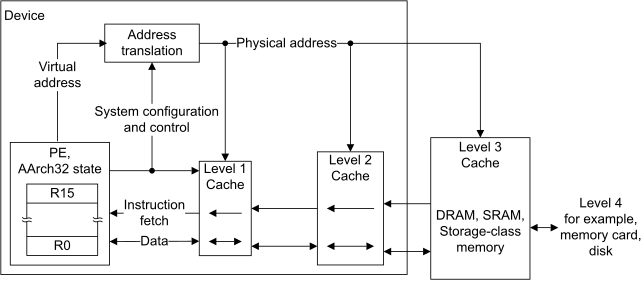

# ​E2.5.2 Memory hierarchy

Source: <https://developer.arm.com/documentation/ddi0487/mc/-Part-E-The-AArch32-Application-Level-Architecture/-Chapter-E2-The-AArch32-Application-Level-Memory-Model/-E2-5-Caches-and-memory-hierarchy/-E2-5-2-Memory-hierarchy>

##### E2.5.2 Memory hierarchy

Typically memory close to a PE has very low latency, but is limited in size and expensive to implement. Further from the PE it is common to implement larger blocks of memory but these have increased latency. To optimize overall performance, a memory system can include multiple levels of cache in a hierarchical memory system that exploits this trade-off between size and latency. [Figure E2-1](/documentation/ddi0487/mc/-Part-E-The-AArch32-Application-Level-Architecture/-Chapter-E2-The-AArch32-Application-Level-Memory-Model/-E2-5-Caches-and-memory-hierarchy/-E2-5-2-Memory-hierarchy?lang=en#fig_cegfjccc) shows an example of such a system in a system that supports virtual addressing.

Figure E2-1 Multiple levels of cache in a memory hierarchy

> #### Note
>
> In this manual, in a hierarchical memory system, Level 1 refers to the level closest to the PE, as shown in [Figure E2-1](/documentation/ddi0487/mc/-Part-E-The-AArch32-Application-Level-Architecture/-Chapter-E2-The-AArch32-Application-Level-Memory-Model/-E2-5-Caches-and-memory-hierarchy/-E2-5-2-Memory-hierarchy?lang=en#fig_cegfjccc).

Instructions and data can be held in separate caches or in a unified cache. A cache hierarchy can have one or more levels of separate instruction and data caches, with one or more unified caches located at the levels closest to the main memory. Memory coherency for cache topologies can be defined using the conceptual points [Point of Unification](/documentation/ddi0487/mc/-Part-D-The-AArch64-System-Level-Architecture/-Chapter-D7-The-AArch64-System-Level-Memory-Model/-D7-5-Cache-support/-D7-5-8-About-cache-maintenance-in-AArch64-state?lang=en#beijdjdb) ([PoU](/documentation/ddi0487/mc/-Part-D-The-AArch64-System-Level-Architecture/-Chapter-D7-The-AArch64-System-Level-Memory-Model/-D7-5-Cache-support/-D7-5-8-About-cache-maintenance-in-AArch64-state?lang=en#beibgcbf)) and [Point of Coherency](/documentation/ddi0487/mc/-Part-D-The-AArch64-System-Level-Architecture/-Chapter-D7-The-AArch64-System-Level-Memory-Model/-D7-5-Cache-support/-D7-5-8-About-cache-maintenance-in-AArch64-state?lang=en#beifcdgi) ([PoC](/documentation/ddi0487/mc/-Part-D-The-AArch64-System-Level-Architecture/-Chapter-D7-The-AArch64-System-Level-Memory-Model/-D7-5-Cache-support/-D7-5-8-About-cache-maintenance-in-AArch64-state?lang=en#beihjcej)). For more information, including the definitions of [PoU](/documentation/ddi0487/mc/-Part-D-The-AArch64-System-Level-Architecture/-Chapter-D7-The-AArch64-System-Level-Memory-Model/-D7-5-Cache-support/-D7-5-8-About-cache-maintenance-in-AArch64-state?lang=en#beibgcbf) and [PoC](/documentation/ddi0487/mc/-Part-D-The-AArch64-System-Level-Architecture/-Chapter-D7-The-AArch64-System-Level-Memory-Model/-D7-5-Cache-support/-D7-5-8-About-cache-maintenance-in-AArch64-state?lang=en#beihjcej), see [About cache maintenance in AArch32 state](/documentation/ddi0487/mc/-Part-G-The-AArch32-System-Level-Architecture/-Chapter-G4-The-AArch32-System-Level-Memory-Model/-G4-4-AArch32-cache-and-branch-predictor-support/-G4-4-6-About-cache-maintenance-in-AArch32-state?lang=en#beiccagb).

> #### Note
>
> [FEAT\_DPB](/documentation/ddi0487/mc/-Part-A-Arm-Architecture-Introduction-and-Overview/-Chapter-A2-A-profile-Architecture-Extensions/-A2-2-Armv8-A-architecture-extensions/-A2-2-3-The-Armv8-2-architecture-extension?lang=en#feat_feat_dpb) adds architectural support for an additional conceptual point, [Point of Persistence](/documentation/ddi0487/mc/-Part-D-The-AArch64-System-Level-Architecture/-Chapter-D7-The-AArch64-System-Level-Memory-Model/-D7-5-Cache-support/-D7-5-8-About-cache-maintenance-in-AArch64-state?lang=en#beijhicg), but this support is provided only in AArch64 state. For more information, see [About cache maintenance in AArch64 state](/documentation/ddi0487/mc/-Part-D-The-AArch64-System-Level-Architecture/-Chapter-D7-The-AArch64-System-Level-Memory-Model/-D7-5-Cache-support/-D7-5-8-About-cache-maintenance-in-AArch64-state?lang=en#beifigbh).

###### E2.5.2.1 The Cacheability and Shareability memory attributes

Cacheability and Shareability are two attributes that describe the memory hierarchy in a multiprocessing system:

Cacheability
:   This term defines whether memory locations are allowed to be allocated into a cache or not. Cacheability is defined independently for Inner and Outer Cacheability locations.

Shareability
:   This term defines whether memory locations are shareable between different agents in a system. Marking a memory location as shareable for a particular domain requires hardware to ensure that the location is coherent for all agents in that domain. Shareability is defined independently for Inner and Outer Shareability domains.

For more information about the Cacheability and Shareability attributes, see [Memory types and attributes](/documentation/ddi0487/mc/-Part-E-The-AArch32-Application-Level-Architecture/-Chapter-E2-The-AArch32-Application-Level-Memory-Model/-E2-8-Memory-types-and-attributes?lang=en#aa32chddaiha).
