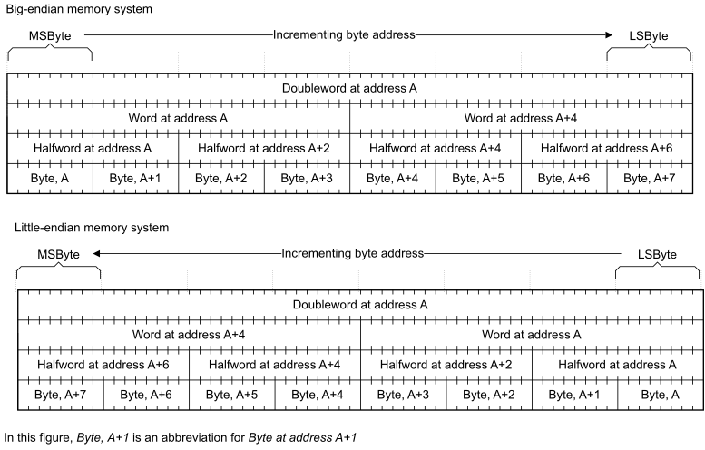

# ​E2.7.1 General description of endianness in the Arm architecture

Source: <https://developer.arm.com/documentation/ddi0487/mc/-Part-E-The-AArch32-Application-Level-Architecture/-Chapter-E2-The-AArch32-Application-Level-Memory-Model/-E2-7-Endian-support/-E2-7-1-General-description-of-endianness-in-the-Arm-architecture>

##### E2.7.1 General description of endianness in the Arm architecture

This section only describes memory addressing and the effects of endianness for data elements up to doubleword of 64 bits. However, this description can be extended to apply to larger data elements.

For an address A, [Figure E2-2](/documentation/ddi0487/mc/-Part-E-The-AArch32-Application-Level-Architecture/-Chapter-E2-The-AArch32-Application-Level-Memory-Model/-E2-7-Endian-support/-E2-7-1-General-description-of-endianness-in-the-Arm-architecture?lang=en#fig_cegbjajf) shows, for big-endian and little-endian memory systems, the relationship between:

- The doubleword at address A.
- The words at addresses A and A+4.
- The halfwords at addresses A, A+2, A+4, and A+6.
- The bytes at addresses A, A+1, A+2, A+3, A+4, A+5, A+6, and A+7.

The terms in [Figure E2-2](/documentation/ddi0487/mc/-Part-E-The-AArch32-Application-Level-Architecture/-Chapter-E2-The-AArch32-Application-Level-Memory-Model/-E2-7-Endian-support/-E2-7-1-General-description-of-endianness-in-the-Arm-architecture?lang=en#fig_cegbjajf) have the following definitions:

MSByte
:   Most significant byte.

LSByte
:   Least significant byte.

Figure E2-2 Endianness relationships in AArch32 state

