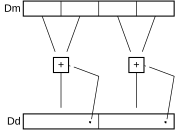

# ​F6.1.161 VPADAL

Source: <https://developer.arm.com/documentation/ddi0487/mc/-Part-F-The-AArch32-Instruction-Sets/-Chapter-F6-T32-and-A32-Advanced-SIMD-and-Floating-point-Instruction-Descriptions/-F6-1-Alphabetical-list-of-Advanced-SIMD-and-floating-point-instructions/-F6-1-161-VPADAL>

##### F6.1.161 VPADAL

Vector Pairwise Add and Accumulate Long adds adjacent pairs of elements of a vector, and accumulates the results into the elements of the destination vector.

The vectors can be doubleword or quadword. The operand elements can be 8-bit, 16-bit, or 32-bit integers. The result elements are twice the length of the operand elements.

Figure F6-2 VPADAL doubleword operation for data type S16



Depending on settings in the [CPACR](/documentation/ddi0487/mc/-Part-G-The-AArch32-System-Level-Architecture/-Chapter-G8-AArch32-System-Register-Descriptions/-G8-2-General-system-control-registers/-G8-2-33-CPACR--Architectural-Feature-Access-Control-Register?lang=en#reg_aarch32_cpacr), [NSACR](/documentation/ddi0487/mc/-Part-G-The-AArch32-System-Level-Architecture/-Chapter-G8-AArch32-System-Register-Descriptions/-G8-2-General-system-control-registers/-G8-2-120-NSACR--Non-Secure-Access-Control-Register?lang=en#reg_aarch32_nsacr), and [HCPTR](/documentation/ddi0487/mc/-Part-G-The-AArch32-System-Level-Architecture/-Chapter-G8-AArch32-System-Register-Descriptions/-G8-2-General-system-control-registers/-G8-2-64-HCPTR--Hyp-Architectural-Feature-Trap-Register?lang=en#reg_aarch32_hcptr) registers, and the Security state and PE mode in which the instruction is executed, an attempt to execute the instruction might be UNDEFINED, or trapped to Hyp mode. For more information see [Enabling Advanced SIMD and floating-point support](/documentation/ddi0487/mc/-Part-G-The-AArch32-System-Level-Architecture/-Chapter-G1-The-AArch32-System-Level-Programmers--Model/-G1-21-Advanced-SIMD-and-floating-point-support/-G1-21-2-Enabling-Advanced-SIMD-and-floating-point-support?lang=en#cihiddff).

It has encodings from the following instruction sets: A32 ([A1](/documentation/ddi0487/mc/-Part-F-The-AArch32-Instruction-Sets/-Chapter-F6-T32-and-A32-Advanced-SIMD-and-Floating-point-Instruction-Descriptions/-F6-1-Alphabetical-list-of-Advanced-SIMD-and-floating-point-instructions/-F6-1-161-VPADAL?lang=en#isa_vpadal_iclass_a1)) and T32 ([T1](/documentation/ddi0487/mc/-Part-F-The-AArch32-Instruction-Sets/-Chapter-F6-T32-and-A32-Advanced-SIMD-and-Floating-point-Instruction-Descriptions/-F6-1-Alphabetical-list-of-Advanced-SIMD-and-floating-point-instructions/-F6-1-161-VPADAL?lang=en#isa_vpadal_iclass_t1)).

###### A1


###### Encoding for the 64-bit SIMD vector variant

Applies when `(Q == 0)`

```
VPADAL{<c>}{<q>}.<dt>  <Dd>, <Dm>
```

###### Encoding for the 128-bit SIMD vector variant

Applies when `(Q == 1)`

```
VPADAL{<c>}{<q>}.<dt>  <Qd>, <Qm>
```

###### Decode for all variants of this encoding

```
if size == ‘11’ then Undefined(); end;
if Q == ‘1’ && (Vd[0] == ‘1’ || Vm[0] == ‘1’) then Undefined(); end;
let unsigned : boolean = (op == ‘1’);
let esize : integer{} = 8 << UInt(size);
let elements : integer = 64 DIV esize;
let d : integer = UInt(D::Vd);
let m : integer = UInt(M::Vm);
let regs : integer = if Q == ‘0’ then 1 else 2;
```

###### T1


###### Encoding for the 64-bit SIMD vector variant

Applies when `(Q == 0)`

```
VPADAL{<c>}{<q>}.<dt>  <Dd>, <Dm>
```

###### Encoding for the 128-bit SIMD vector variant

Applies when `(Q == 1)`

```
VPADAL{<c>}{<q>}.<dt>  <Qd>, <Qm>
```

###### Decode for all variants of this encoding

```
if size == ‘11’ then Undefined(); end;
if Q == ‘1’ && (Vd[0] == ‘1’ || Vm[0] == ‘1’) then Undefined(); end;
let unsigned : boolean = (op == ‘1’);
let esize : integer{} = 8 << UInt(size);
let elements : integer = 64 DIV esize;
let d : integer = UInt(D::Vd);
let m : integer = UInt(M::Vm);
let regs : integer = if Q == ‘0’ then 1 else 2;
```

###### Assembler Symbols

<c>
:   ​

    For the “A1 128-bit SIMD vector” and “A1 64-bit SIMD vector” variants: see [Standard assembler syntax fields](/documentation/ddi0487/mc/-Part-F-The-AArch32-Instruction-Sets/-Chapter-F1-About-the-T32-and-A32-Instruction-Descriptions/-F1-2-Standard-assembler-syntax-fields?lang=en#babbefhf). This encoding must be unconditional.

    ​

    For the “T1 128-bit SIMD vector” and “T1 64-bit SIMD vector” variants: see [Standard assembler syntax fields](/documentation/ddi0487/mc/-Part-F-The-AArch32-Instruction-Sets/-Chapter-F1-About-the-T32-and-A32-Instruction-Descriptions/-F1-2-Standard-assembler-syntax-fields?lang=en#babbefhf).

<q>
:   ​
    ​

    See [Standard assembler syntax fields](/documentation/ddi0487/mc/-Part-F-The-AArch32-Instruction-Sets/-Chapter-F1-About-the-T32-and-A32-Instruction-Descriptions/-F1-2-Standard-assembler-syntax-fields?lang=en#babbefhf).

<dt>
:   ​

    Is the data type for the elements of the vectors, encoded in “op:size”:

<table>
 <colgroup>
  <col/>
  <col/>
  <col/>
 </colgroup>
 <thead>
  <tr>
   <th>
    <strong>
     op
    </strong>
   </th>
   <th>
    <strong>
     size
    </strong>
   </th>
   <th>
    <strong>
     &lt;dt&gt;
    </strong>
   </th>
  </tr>
 </thead>
 <tbody>
  <tr>
   <td>
    <p>
     <code>
      0
     </code>
    </p>
   </td>
   <td>
    <p>
     <code>
      00
     </code>
    </p>
   </td>
   <td>
    <p>
     <code>
      S8
     </code>
    </p>
   </td>
  </tr>
  <tr>
   <td>
    <p>
     <code>
      0
     </code>
    </p>
   </td>
   <td>
    <p>
     <code>
      01
     </code>
    </p>
   </td>
   <td>
    <p>
     <code>
      S16
     </code>
    </p>
   </td>
  </tr>
  <tr>
   <td>
    <p>
     <code>
      0
     </code>
    </p>
   </td>
   <td>
    <p>
     <code>
      10
     </code>
    </p>
   </td>
   <td>
    <p>
     <code>
      S32
     </code>
    </p>
   </td>
  </tr>
  <tr>
   <td>
    <p>
     <code>
      x
     </code>
    </p>
   </td>
   <td>
    <p>
     <code>
      11
     </code>
    </p>
   </td>
   <td>
    <p>
     <code>
      RESERVED
     </code>
    </p>
   </td>
  </tr>
  <tr>
   <td>
    <p>
     <code>
      1
     </code>
    </p>
   </td>
   <td>
    <p>
     <code>
      00
     </code>
    </p>
   </td>
   <td>
    <p>
     <code>
      U8
     </code>
    </p>
   </td>
  </tr>
  <tr>
   <td>
    <p>
     <code>
      1
     </code>
    </p>
   </td>
   <td>
    <p>
     <code>
      01
     </code>
    </p>
   </td>
   <td>
    <p>
     <code>
      U16
     </code>
    </p>
   </td>
  </tr>
  <tr>
   <td>
    <p>
     <code>
      1
     </code>
    </p>
   </td>
   <td>
    <p>
     <code>
      10
     </code>
    </p>
   </td>
   <td>
    <p>
     <code>
      U32
     </code>
    </p>
   </td>
  </tr>
 </tbody>
</table>

<Dd>
:   ​

    Is the 64-bit name of the SIMD&FP destination register, encoded in the “D:Vd” field.

<Dm>
:   ​

    Is the 64-bit name of the SIMD&FP source register, encoded in the “M:Vm” field.

<Qd>
:   ​

    Is the 128-bit name of the SIMD&FP destination register, encoded in the “D:Vd” field as <Qd>\*2.

<Qm>
:   ​

    Is the 128-bit name of the SIMD&FP source register, encoded in the “M:Vm” field as <Qm>\*2.

###### Operation

```
if ConditionPassed() then
    EncodingSpecificOperations();
    CheckAdvSIMDEnabled();
    let h : integer = elements DIV 2;
    for r = 0 to regs-1 do
        for e = 0 to h-1 do
            let op1elt : bits(esize) = D(m+r)[(2*e)*:esize];
            let op2elt : bits(esize) = D(m+r)[(2*e+1)*:esize];
            let element1 : integer = if unsigned then UInt(op1elt) else SInt(op1elt);
            let element2 : integer = if unsigned then UInt(op2elt) else SInt(op2elt);
            let result : integer = element1 + element2;
            D(d+r)[e*:(2*esize)] = D(d+r)[e*:(2*esize)] + result;
        end;
    end;
end;
```

###### Operational Information

This instruction is a data-independent-time instruction as described in [About the DIT bit](/documentation/ddi0487/mc/-Part-E-The-AArch32-Application-Level-Architecture/-Chapter-E1-The-AArch32-Application-Level-Programmers--Model/-E1-2-The-Application-level-programmers--model-in-AArch32-state/-E1-2-5-About-the-DIT-bit?lang=en#beiidceg).
