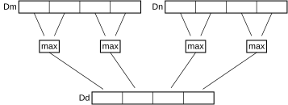

# ​F6.1.166 VPMAX (integer)

Source: <https://developer.arm.com/documentation/ddi0487/mc/-Part-F-The-AArch32-Instruction-Sets/-Chapter-F6-T32-and-A32-Advanced-SIMD-and-Floating-point-Instruction-Descriptions/-F6-1-Alphabetical-list-of-Advanced-SIMD-and-floating-point-instructions/-F6-1-166-VPMAX--integer->

##### F6.1.166 VPMAX (integer)

Vector Pairwise Maximum (integer)

Vector Pairwise Maximum compares adjacent pairs of elements in two doubleword vectors, and copies the larger of each pair into the corresponding element in the destination doubleword vector.

Figure F6-5 VPMAX doubleword operation for data type S16 or U16



Depending on settings in the [CPACR](/documentation/ddi0487/mc/-Part-G-The-AArch32-System-Level-Architecture/-Chapter-G8-AArch32-System-Register-Descriptions/-G8-2-General-system-control-registers/-G8-2-33-CPACR--Architectural-Feature-Access-Control-Register?lang=en#reg_aarch32_cpacr), [NSACR](/documentation/ddi0487/mc/-Part-G-The-AArch32-System-Level-Architecture/-Chapter-G8-AArch32-System-Register-Descriptions/-G8-2-General-system-control-registers/-G8-2-120-NSACR--Non-Secure-Access-Control-Register?lang=en#reg_aarch32_nsacr), and [HCPTR](/documentation/ddi0487/mc/-Part-G-The-AArch32-System-Level-Architecture/-Chapter-G8-AArch32-System-Register-Descriptions/-G8-2-General-system-control-registers/-G8-2-64-HCPTR--Hyp-Architectural-Feature-Trap-Register?lang=en#reg_aarch32_hcptr) registers, and the Security state and PE mode in which the instruction is executed, an attempt to execute the instruction might be UNDEFINED, or trapped to Hyp mode. For more information see [Enabling Advanced SIMD and floating-point support](/documentation/ddi0487/mc/-Part-G-The-AArch32-System-Level-Architecture/-Chapter-G1-The-AArch32-System-Level-Programmers--Model/-G1-21-Advanced-SIMD-and-floating-point-support/-G1-21-2-Enabling-Advanced-SIMD-and-floating-point-support?lang=en#cihiddff).

It has encodings from the following instruction sets: A32 ([A1](/documentation/ddi0487/mc/-Part-F-The-AArch32-Instruction-Sets/-Chapter-F6-T32-and-A32-Advanced-SIMD-and-Floating-point-Instruction-Descriptions/-F6-1-Alphabetical-list-of-Advanced-SIMD-and-floating-point-instructions/-F6-1-166-VPMAX--integer-?lang=en#isa_vpmax_i_iclass_a1)) and T32 ([T1](/documentation/ddi0487/mc/-Part-F-The-AArch32-Instruction-Sets/-Chapter-F6-T32-and-A32-Advanced-SIMD-and-Floating-point-Instruction-Descriptions/-F6-1-Alphabetical-list-of-Advanced-SIMD-and-floating-point-instructions/-F6-1-166-VPMAX--integer-?lang=en#isa_vpmax_i_iclass_t1)).

###### A1


###### Encoding

```
VPMAX{<c>}{<q>}.<dt>  {<Dd>, }<Dn>, <Dm>
```

###### Decode for this encoding

```
if size == ‘11’ then Undefined(); end;
let maximum : boolean = (op == ‘0’);
let unsigned : boolean = (U == ‘1’);
let esize : integer{} = 8 << UInt(size);
let elements : integer = 64 DIV esize;
let d : integer = UInt(D::Vd);
let n : integer = UInt(N::Vn);
let m : integer = UInt(M::Vm);
```

###### T1


###### Encoding

```
VPMAX{<c>}{<q>}.<dt>  {<Dd>, }<Dn>, <Dm>
```

###### Decode for this encoding

```
if size == ‘11’ then Undefined(); end;
let maximum : boolean = (op == ‘0’);
let unsigned : boolean = (U == ‘1’);
let esize : integer{} = 8 << UInt(size);
let elements : integer = 64 DIV esize;
let d : integer = UInt(D::Vd);
let n : integer = UInt(N::Vn);
let m : integer = UInt(M::Vm);
```

###### Assembler Symbols

<c>
:   ​

    For the “A1” variant: see [Standard assembler syntax fields](/documentation/ddi0487/mc/-Part-F-The-AArch32-Instruction-Sets/-Chapter-F1-About-the-T32-and-A32-Instruction-Descriptions/-F1-2-Standard-assembler-syntax-fields?lang=en#babbefhf). This encoding must be unconditional.

    ​

    For the “T1” variant: see [Standard assembler syntax fields](/documentation/ddi0487/mc/-Part-F-The-AArch32-Instruction-Sets/-Chapter-F1-About-the-T32-and-A32-Instruction-Descriptions/-F1-2-Standard-assembler-syntax-fields?lang=en#babbefhf).

<q>
:   ​
    ​

    See [Standard assembler syntax fields](/documentation/ddi0487/mc/-Part-F-The-AArch32-Instruction-Sets/-Chapter-F1-About-the-T32-and-A32-Instruction-Descriptions/-F1-2-Standard-assembler-syntax-fields?lang=en#babbefhf).

<dt>
:   ​

    Is the data type for the elements of the operands, encoded in “U:size”:

<table>
 <colgroup>
  <col/>
  <col/>
  <col/>
 </colgroup>
 <thead>
  <tr>
   <th>
    <strong>
     U
    </strong>
   </th>
   <th>
    <strong>
     size
    </strong>
   </th>
   <th>
    <strong>
     &lt;dt&gt;
    </strong>
   </th>
  </tr>
 </thead>
 <tbody>
  <tr>
   <td>
    <p>
     <code>
      0
     </code>
    </p>
   </td>
   <td>
    <p>
     <code>
      00
     </code>
    </p>
   </td>
   <td>
    <p>
     <code>
      S8
     </code>
    </p>
   </td>
  </tr>
  <tr>
   <td>
    <p>
     <code>
      0
     </code>
    </p>
   </td>
   <td>
    <p>
     <code>
      01
     </code>
    </p>
   </td>
   <td>
    <p>
     <code>
      S16
     </code>
    </p>
   </td>
  </tr>
  <tr>
   <td>
    <p>
     <code>
      0
     </code>
    </p>
   </td>
   <td>
    <p>
     <code>
      10
     </code>
    </p>
   </td>
   <td>
    <p>
     <code>
      S32
     </code>
    </p>
   </td>
  </tr>
  <tr>
   <td>
    <p>
     <code>
      1
     </code>
    </p>
   </td>
   <td>
    <p>
     <code>
      00
     </code>
    </p>
   </td>
   <td>
    <p>
     <code>
      U8
     </code>
    </p>
   </td>
  </tr>
  <tr>
   <td>
    <p>
     <code>
      1
     </code>
    </p>
   </td>
   <td>
    <p>
     <code>
      01
     </code>
    </p>
   </td>
   <td>
    <p>
     <code>
      U16
     </code>
    </p>
   </td>
  </tr>
  <tr>
   <td>
    <p>
     <code>
      1
     </code>
    </p>
   </td>
   <td>
    <p>
     <code>
      10
     </code>
    </p>
   </td>
   <td>
    <p>
     <code>
      U32
     </code>
    </p>
   </td>
  </tr>
 </tbody>
</table>

<Dd>
:   ​

    Is the 64-bit name of the SIMD&FP destination register, encoded in the “D:Vd” field.

<Dn>
:   ​

    Is the 64-bit name of the first SIMD&FP source register, encoded in the “N:Vn” field.

<Dm>
:   ​

    Is the 64-bit name of the second SIMD&FP source register, encoded in the “M:Vm” field.

###### Operation

```
if ConditionPassed() then
    EncodingSpecificOperations();
    CheckAdvSIMDEnabled();
    var dest : bits(64);
    let h : integer = elements DIV 2;
    for e = 0 to h-1 do
        var op1elt : bits(esize) = D(n)[(2*e)*:esize];
        var op2elt : bits(esize) = D(n)[(2*e+1)*:esize];
        var element1 : integer = if unsigned then UInt(op1elt) else SInt(op1elt);
        var element2 : integer = if unsigned then UInt(op2elt) else SInt(op2elt);
        var result : integer = if maximum then Max(element1, element2) else Min(element1, element2);
        dest[e*:esize] = result[esize-1:0];
        op1elt = D(m)[(2*e)*:esize];
        op2elt = D(m)[(2*e+1)*:esize];
        element1 = if unsigned then UInt(op1elt) else SInt(op1elt);
        element2 = if unsigned then UInt(op2elt) else SInt(op2elt);
        result = if maximum then Max(element1, element2) else Min(element1, element2);
        dest[(e+h)*:esize] = result[esize-1:0];
    end;
    D(d) = dest;
end;
```

###### Operational Information

This instruction is a data-independent-time instruction as described in [About the DIT bit](/documentation/ddi0487/mc/-Part-E-The-AArch32-Application-Level-Architecture/-Chapter-E1-The-AArch32-Application-Level-Programmers--Model/-E1-2-The-Application-level-programmers--model-in-AArch32-state/-E1-2-5-About-the-DIT-bit?lang=en#beiidceg).
