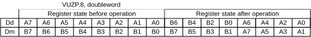
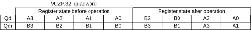

# ​F6.1.262 VUZP

Source: <https://developer.arm.com/documentation/ddi0487/mc/-Part-F-The-AArch32-Instruction-Sets/-Chapter-F6-T32-and-A32-Advanced-SIMD-and-Floating-point-Instruction-Descriptions/-F6-1-Alphabetical-list-of-Advanced-SIMD-and-floating-point-instructions/-F6-1-262-VUZP>

##### F6.1.262 VUZP

Vector Unzip de-interleaves the elements of two vectors.

The elements of the vectors can be 8-bit, 16-bit, or 32-bit. There is no distinction between data types.

Figure F6-10 VUZP doubleword operation for data type 8



Figure F6-11 VUZP quadword operation for data type 32



Depending on settings in the [CPACR](/documentation/ddi0487/mc/-Part-G-The-AArch32-System-Level-Architecture/-Chapter-G8-AArch32-System-Register-Descriptions/-G8-2-General-system-control-registers/-G8-2-33-CPACR--Architectural-Feature-Access-Control-Register?lang=en#reg_aarch32_cpacr), [NSACR](/documentation/ddi0487/mc/-Part-G-The-AArch32-System-Level-Architecture/-Chapter-G8-AArch32-System-Register-Descriptions/-G8-2-General-system-control-registers/-G8-2-120-NSACR--Non-Secure-Access-Control-Register?lang=en#reg_aarch32_nsacr), and [HCPTR](/documentation/ddi0487/mc/-Part-G-The-AArch32-System-Level-Architecture/-Chapter-G8-AArch32-System-Register-Descriptions/-G8-2-General-system-control-registers/-G8-2-64-HCPTR--Hyp-Architectural-Feature-Trap-Register?lang=en#reg_aarch32_hcptr) registers, and the Security state and PE mode in which the instruction is executed, an attempt to execute the instruction might be UNDEFINED, or trapped to Hyp mode. For more information see [Enabling Advanced SIMD and floating-point support](/documentation/ddi0487/mc/-Part-G-The-AArch32-System-Level-Architecture/-Chapter-G1-The-AArch32-System-Level-Programmers--Model/-G1-21-Advanced-SIMD-and-floating-point-support/-G1-21-2-Enabling-Advanced-SIMD-and-floating-point-support?lang=en#cihiddff).

It has encodings from the following instruction sets: A32 ([A1](/documentation/ddi0487/mc/-Part-F-The-AArch32-Instruction-Sets/-Chapter-F6-T32-and-A32-Advanced-SIMD-and-Floating-point-Instruction-Descriptions/-F6-1-Alphabetical-list-of-Advanced-SIMD-and-floating-point-instructions/-F6-1-262-VUZP?lang=en#isa_vuzp_iclass_a1)) and T32 ([T1](/documentation/ddi0487/mc/-Part-F-The-AArch32-Instruction-Sets/-Chapter-F6-T32-and-A32-Advanced-SIMD-and-Floating-point-Instruction-Descriptions/-F6-1-Alphabetical-list-of-Advanced-SIMD-and-floating-point-instructions/-F6-1-262-VUZP?lang=en#isa_vuzp_iclass_t1)).

###### A1


###### Encoding for the 64-bit SIMD vector variant

Applies when `(Q == 0)`

```
VUZP{<c>}{<q>}.<dt>  <Dd>, <Dm>
```

###### Encoding for the 128-bit SIMD vector variant

Applies when `(Q == 1)`

```
VUZP{<c>}{<q>}.<dt>  <Qd>, <Qm>
```

###### Decode for all variants of this encoding

```
if size == ‘11’ || (Q == ‘0’ && size == ‘10’) then Undefined(); end;
if Q == ‘1’ && (Vd[0] == ‘1’ || Vm[0] == ‘1’) then Undefined(); end;
let quadword_operation : boolean = (Q == ‘1’);
let esize : integer{} = 8 << UInt(size);
let d : integer = UInt(D::Vd);
let m : integer = UInt(M::Vm);
```

###### T1


###### Encoding for the 64-bit SIMD vector variant

Applies when `(Q == 0)`

```
VUZP{<c>}{<q>}.<dt>  <Dd>, <Dm>
```

###### Encoding for the 128-bit SIMD vector variant

Applies when `(Q == 1)`

```
VUZP{<c>}{<q>}.<dt>  <Qd>, <Qm>
```

###### Decode for all variants of this encoding

```
if size == ‘11’ || (Q == ‘0’ && size == ‘10’) then Undefined(); end;
if Q == ‘1’ && (Vd[0] == ‘1’ || Vm[0] == ‘1’) then Undefined(); end;
let quadword_operation : boolean = (Q == ‘1’);
let esize : integer{} = 8 << UInt(size);
let d : integer = UInt(D::Vd);
let m : integer = UInt(M::Vm);
```

###### Assembler Symbols

<c>
:   ​

    For the “A1 128-bit SIMD vector” and “A1 64-bit SIMD vector” variants: see [Standard assembler syntax fields](/documentation/ddi0487/mc/-Part-F-The-AArch32-Instruction-Sets/-Chapter-F1-About-the-T32-and-A32-Instruction-Descriptions/-F1-2-Standard-assembler-syntax-fields?lang=en#babbefhf). This encoding must be unconditional.

    ​

    For the “T1 128-bit SIMD vector” and “T1 64-bit SIMD vector” variants: see [Standard assembler syntax fields](/documentation/ddi0487/mc/-Part-F-The-AArch32-Instruction-Sets/-Chapter-F1-About-the-T32-and-A32-Instruction-Descriptions/-F1-2-Standard-assembler-syntax-fields?lang=en#babbefhf).

<q>
:   ​
    ​

    See [Standard assembler syntax fields](/documentation/ddi0487/mc/-Part-F-The-AArch32-Instruction-Sets/-Chapter-F1-About-the-T32-and-A32-Instruction-Descriptions/-F1-2-Standard-assembler-syntax-fields?lang=en#babbefhf).

<dt>
:   ​

    For the “A1 64-bit SIMD vector” and “T1 64-bit SIMD vector” variants: is the data type for the elements of the vectors, encoded in “size”:

<table>
 <colgroup>
  <col/>
  <col/>
 </colgroup>
 <thead>
  <tr>
   <th>
    <strong>
     size
    </strong>
   </th>
   <th>
    <strong>
     &lt;dt&gt;
    </strong>
   </th>
  </tr>
 </thead>
 <tbody>
  <tr>
   <td>
    <p>
     <code>
      00
     </code>
    </p>
   </td>
   <td>
    <p>
     <code>
      8
     </code>
    </p>
   </td>
  </tr>
  <tr>
   <td>
    <p>
     <code>
      01
     </code>
    </p>
   </td>
   <td>
    <p>
     <code>
      16
     </code>
    </p>
   </td>
  </tr>
  <tr>
   <td>
    <p>
     <code>
      1x
     </code>
    </p>
   </td>
   <td>
    <p>
     <code>
      RESERVED
     </code>
    </p>
   </td>
  </tr>
 </tbody>
</table>

    ​

    For the “A1 128-bit SIMD vector” and “T1 128-bit SIMD vector” variants: is the data type for the elements of the vectors, encoded in “size”:

<table>
 <colgroup>
  <col/>
  <col/>
 </colgroup>
 <thead>
  <tr>
   <th>
    <strong>
     size
    </strong>
   </th>
   <th>
    <strong>
     &lt;dt&gt;
    </strong>
   </th>
  </tr>
 </thead>
 <tbody>
  <tr>
   <td>
    <p>
     <code>
      00
     </code>
    </p>
   </td>
   <td>
    <p>
     <code>
      8
     </code>
    </p>
   </td>
  </tr>
  <tr>
   <td>
    <p>
     <code>
      01
     </code>
    </p>
   </td>
   <td>
    <p>
     <code>
      16
     </code>
    </p>
   </td>
  </tr>
  <tr>
   <td>
    <p>
     <code>
      10
     </code>
    </p>
   </td>
   <td>
    <p>
     <code>
      32
     </code>
    </p>
   </td>
  </tr>
  <tr>
   <td>
    <p>
     <code>
      11
     </code>
    </p>
   </td>
   <td>
    <p>
     <code>
      RESERVED
     </code>
    </p>
   </td>
  </tr>
 </tbody>
</table>

<Dd>
:   ​

    Is the 64-bit name of the SIMD&FP destination register, encoded in the “D:Vd” field.

<Dm>
:   ​

    Is the 64-bit name of the SIMD&FP source register, encoded in the “M:Vm” field.

<Qd>
:   ​

    Is the 128-bit name of the SIMD&FP destination register, encoded in the “D:Vd” field as <Qd>\*2.

<Qm>
:   ​

    Is the 128-bit name of the SIMD&FP source register, encoded in the “M:Vm” field as <Qm>\*2.

###### Operation

```
if ConditionPassed() then
    EncodingSpecificOperations();
    CheckAdvSIMDEnabled();
    if quadword_operation then
        if d == m then
            Q(d>>1) = ARBITRARY : bits(128);
        else
            let zipped_q : bits(256) = Q(m>>1)::Q(d>>1);
            for e = 0 to (128 DIV esize) - 1 do
                Q(d>>1)[e*:esize] = zipped_q[(2*e)*:esize];
                Q(m>>1)[e*:esize] = zipped_q[(2*e+1)*:esize];
            end;
        end;
    else
        if d == m then
            D(d) = ARBITRARY : bits(64);
        else
            let zipped_d : bits(128) = D(m)::D(d);
            for e = 0 to (64 DIV esize) - 1 do
                D(d)[e*:esize] = zipped_d[(2*e)*:esize];
                D(m)[e*:esize] = zipped_d[(2*e+1)*:esize];
            end;
        end;
    end;
end;
```

###### Operational Information

This instruction is a data-independent-time instruction as described in [About the DIT bit](/documentation/ddi0487/mc/-Part-E-The-AArch32-Application-Level-Architecture/-Chapter-E1-The-AArch32-Application-Level-Programmers--Model/-E1-2-The-Application-level-programmers--model-in-AArch32-state/-E1-2-5-About-the-DIT-bit?lang=en#beiidceg).
