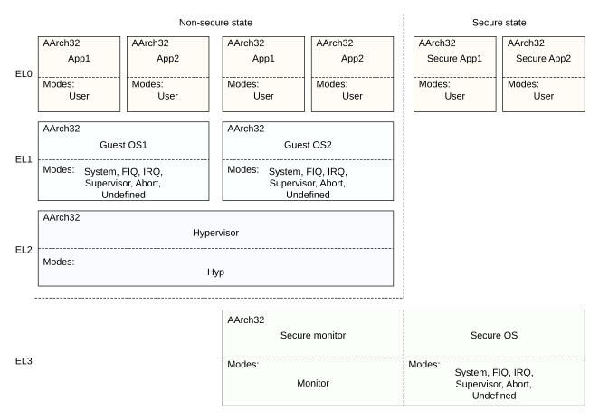

# ​G1.6.1 The Armv8-A security model

Source: <https://developer.arm.com/documentation/ddi0487/mc/-Part-G-The-AArch32-System-Level-Architecture/-Chapter-G1-The-AArch32-System-Level-Programmers--Model/-G1-6-Security-state/-G1-6-1-The-Armv8-A-security-model>

##### G1.6.1 The Armv8-A security model

The principles of the Armv8-A security model are defined in [Security states](/documentation/ddi0487/mc/-Part-D-The-AArch64-System-Level-Architecture/-Chapter-D1-The-AArch64-System-Level-Programmers--Model/-D1-1-Exception-levels/-D1-1-2-Security-states?lang=en#beijbibh).

###### G1.6.1.1 The AArch32 security model, and execution privilege

The Exception level hierarchy of four Exception levels, EL0, EL1, EL2, and EL3, applies to execution in both Execution states. This section describes the mapping between Exception levels, AArch32 modes, and execution privilege.

The AArch32 modes Monitor, System, Supervisor, Abort, Undefined, IRQ, and FIQ all have the same execution privilege.

In Secure state:

- Monitor mode executes only at EL3, and is accessible only when EL3 is using AArch32.
- System mode, Supervisor mode, Abort mode, Undefined mode, IRQ mode, and FIQ mode all:

  - Execute at EL1 when EL3 is using AArch64.
  - Execute at EL3 when EL3 is using AArch32.

This means that there is a difference in the Secure state hierarchy that the PE is using, depending on which Execution state EL3 is using:

- If EL3 is using AArch64:

  - There is no support for Monitor mode.
  - If EL1 is using AArch32, System mode, Supervisor mode, Abort mode, Undefined mode, IRQ mode, and FIQ mode execute at Secure EL1.
- If EL3 is using AArch32:

  - Monitor mode is supported, and executes at Secure EL3.
  - System mode, Supervisor mode, Abort mode, Undefined mode, IRQ mode, and FIQ mode execute at Secure EL3.
  - There is no support for a Secure EL1 Exception level.

See [Security behavior in Exception levels using AArch32 when EL2 or EL3 are using AArch64](/documentation/ddi0487/mc/-Part-G-The-AArch32-System-Level-Architecture/-Chapter-G1-The-AArch32-System-Level-Programmers--Model/-G1-13-Handling-exceptions-that-are-taken-to-an-Exception-level-using-AArch32/-G1-13-4-PE-mode-for-taking-exceptions?lang=en#chdcfjff) for more information about operation in a Secure EL1 mode when EL3 is using AArch64.

In Non-secure state, the PL1 modes System, Supervisor, Abort, Undefined, IRQ, and FIQ always execute at EL1.

User mode always executes at EL0 and has the lowest possible execution privilege.

Hyp mode always executes in Non-secure state at EL2 and has higher execution privilege than all of:

- User mode.
- System mode, Supervisor mode, Abort mode, Undefined mode, IRQ mode, and FIQ mode.

[Limited use of Privilege level in AArch32 state](/documentation/ddi0487/mc/-Part-G-The-AArch32-System-Level-Architecture/-Chapter-G1-The-AArch32-System-Level-Programmers--Model/-G1-7-Security-state--Exception-levels--and-AArch32-execution-privilege/-G1-7-1-Limited-use-of-Privilege-level-in-AArch32-state?lang=en#chdifaab) describes how, in some contexts, the concept of *Privilege levels* can be used to represent the execution privilege hierarchy.

For more information about the modes, see [About the AArch32 PE modes](/documentation/ddi0487/mc/-Part-G-The-AArch32-System-Level-Architecture/-Chapter-G1-The-AArch32-System-Level-Programmers--Model/-G1-4-Execution-state/-G1-4-1-About-the-AArch32-PE-modes?lang=en#chddchge).

[Figure G1-1](/documentation/ddi0487/mc/-Part-G-The-AArch32-System-Level-Architecture/-Chapter-G1-The-AArch32-System-Level-Programmers--Model/-G1-6-Security-state/-G1-6-1-The-Armv8-A-security-model?lang=en#fig_chdfffcd) shows the security model when EL3 is using AArch32, and shows the expected use of the different Exception levels, and which modes execute at which Exception levels.

Figure G1-1 Armv8-A Security model when EL3 is using AArch32

> #### Note
>
> For an overview of the Security models when EL3 is using AArch64 and EL2, EL1, and EL0 are all using AArch32, see [Figure G1-2](/documentation/ddi0487/mc/-Part-G-The-AArch32-System-Level-Architecture/-Chapter-G1-The-AArch32-System-Level-Programmers--Model/-G1-9-AArch32-state-PE-modes/-G1-9-1-Notes-on-the-AArch32-PE-modes?lang=en#fig_cihjefid).

[Figure G1-1](/documentation/ddi0487/mc/-Part-G-The-AArch32-System-Level-Architecture/-Chapter-G1-The-AArch32-System-Level-Programmers--Model/-G1-6-Security-state/-G1-6-1-The-Armv8-A-security-model?lang=en#fig_chdfffcd) shows that when EL3 is using AArch32, the Exception levels and modes available in each Security state are as follows:

Secure state
:   EL0
    :   User mode.

    EL3
    :   Any mode that is available in Secure state, other than User mode.

Non-secure state
:   EL0
    :   User mode.

    EL1
    :   Any mode that is available in Non-secure state, other than Hyp mode and User mode.

    EL2
    :   Hyp mode.

Execution at EL0 is described as *unprivileged execution*.

A mode associated with a particular Exception level, EL*n*, is described as an EL*n* mode.

> #### Note
>
> The Exception level defines the ability to access resources in the current Security state, and does not imply anything about the ability to access resources in the other Security state.

When EL3 is using AArch32, many AArch32 System registers accessible at PL1 are *banked* between the Secure and Non-secure states.

When EL3 is using AArch64 and Secure EL1 is using AArch32, System registers accessible at PL1 are not banked between the Non-secure and Secure states. Software running at EL3 is expected to switch the content of the PL1-accessible System registers between the Secure and Non-secure context, in a similar manner to switching the contents of general purpose registers. For information on the relationship between AArch64 and AArch32 System registers in an interprocessing environment, see [Mapping of the System registers between the Execution states](/documentation/ddi0487/mc/-Part-D-The-AArch64-System-Level-Architecture/-Chapter-D1-The-AArch64-System-Level-Programmers--Model/-D1-10-Interprocessing/-D1-10-1-Register-mappings-between-AArch32-state-and-AArch64-state?lang=en#beifbcjb).

For more information on the System registers, see [The AArch32 System register interface](/documentation/ddi0487/mc/-Part-G-The-AArch32-System-Level-Architecture/-Chapter-G1-The-AArch32-System-Level-Programmers--Model/-G1-20-The-AArch32-System-register-interface?lang=en#zeibehhd).

The *Secure Monitor Call* (`SMC`) instruction provides software with a system call to EL3. When executing at a privileged Exception level, `SMC` instructions generates exceptions. For more information, see [Secure Monitor Call (SMC) exception](/documentation/ddi0487/mc/-Part-G-The-AArch32-System-Level-Architecture/-Chapter-G1-The-AArch32-System-Level-Programmers--Model/-G1-17-AArch32-state-exception-descriptions/-G1-17-5-Secure-Monitor-Call--SMC--exception?lang=en#cihehjbh) and [SMC](/documentation/ddi0487/mc/-Part-C-The-AArch64-Instruction-Set/-Chapter-C6-A64-Base-Instruction-Descriptions/-C6-2-Alphabetical-list-of-A64-base-instructions/-C6-2-372-SMC?lang=en#isa_smc).

> #### Note
>
> For more information about the Privilege level terminology, see [Security state, Exception levels, and AArch32 execution privilege](/documentation/ddi0487/mc/-Part-G-The-AArch32-System-Level-Architecture/-Chapter-G1-The-AArch32-System-Level-Programmers--Model/-G1-7-Security-state--Exception-levels--and-AArch32-execution-privilege?lang=en#chdfhajj).

###### G1.6.1.2 Changing from Secure state to Non-secure state

Monitor mode is provided to support switching between Secure and Non-secure states. When executing in an Exception level that is using AArch32, except in Monitor mode and Hyp mode, the Security state is controlled:

- By the [SCR](/documentation/ddi0487/mc/-Part-G-The-AArch32-System-Level-Architecture/-Chapter-G8-AArch32-System-Register-Descriptions/-G8-2-General-system-control-registers/-G8-2-126-SCR--Secure-Configuration-Register?lang=en#reg_aarch32_scr).NS bit, when EL3 is using AArch32.
- By the [SCR\_EL3](/documentation/ddi0487/mc/-Part-D-The-AArch64-System-Level-Architecture/-Chapter-D24-AArch64-System-Register-Descriptions/-D24-2-General-system-control-registers/-D24-2-168-SCR-EL3--Secure-Configuration-Register?lang=en#reg_aarch64_scr_el3).NS bit, when EL3 is using AArch64.

The mapping of AArch32 privileged modes to the exception hierarchy means that it is possible when EL3 is using AArch32 to change from EL3 to Non-secure EL1 without an exception return. This can occur in one of the following ways:

- Using an `MSR` or `CPS` instruction to switch from Monitor mode to another privileged mode while [SCR](/documentation/ddi0487/mc/-Part-G-The-AArch32-System-Level-Architecture/-Chapter-G8-AArch32-System-Register-Descriptions/-G8-2-General-system-control-registers/-G8-2-126-SCR--Secure-Configuration-Register?lang=en#reg_aarch32_scr).NS is 1.
- Using an `MCR` instruction that writes [SCR](/documentation/ddi0487/mc/-Part-G-The-AArch32-System-Level-Architecture/-Chapter-G8-AArch32-System-Register-Descriptions/-G8-2-General-system-control-registers/-G8-2-126-SCR--Secure-Configuration-Register?lang=en#reg_aarch32_scr).NS to change from Secure to Non-secure state when in a privileged mode other than Monitor mode.

Arm strongly recommends that software executing at EL3 using AArch32 does not use either of these mechanisms to change from EL3 to Non-secure EL1 without an exception return. The use of both of these mechanisms is deprecated.
