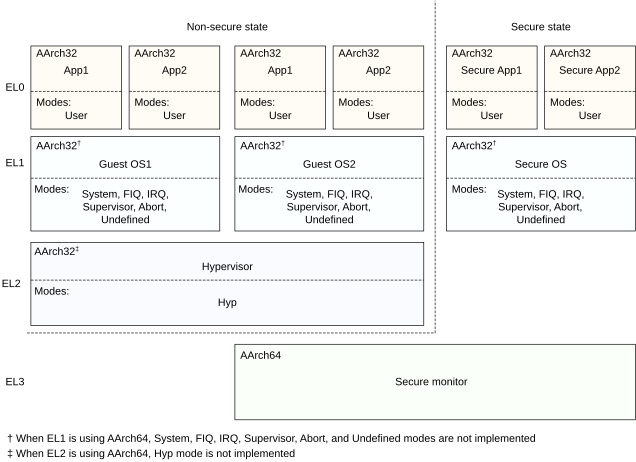

# ​G1.9.1 Notes on the AArch32 PE modes

Source: <https://developer.arm.com/documentation/ddi0487/mc/-Part-G-The-AArch32-System-Level-Architecture/-Chapter-G1-The-AArch32-System-Level-Programmers--Model/-G1-9-AArch32-state-PE-modes/-G1-9-1-Notes-on-the-AArch32-PE-modes>

##### G1.9.1 Notes on the AArch32 PE modes

PE modes are defined only in AArch32 state. Because each mode is implemented as part of a particular Exception level that is using AArch32, the set of available modes depends on which Exception levels are implemented and using AArch32, as described in [Effect of the EL3 Execution state on the PE modes and Exception levels](/documentation/ddi0487/mc/-Part-G-The-AArch32-System-Level-Architecture/-Chapter-G1-The-AArch32-System-Level-Programmers--Model/-G1-9-AArch32-state-PE-modes/-G1-9-1-Notes-on-the-AArch32-PE-modes?lang=en#chdchfgb).

This section gives more information about each of the modes, when it is implemented.

User mode
:   Software executing in User mode executes at EL0. Execution in User mode is sometimes described as unprivileged execution. Application programs normally execute in User mode, and any program executed in User mode:

    - Makes only unprivileged accesses to system resources, meaning it cannot access protected system resources.
    - Makes only unprivileged access to memory.
    - Cannot change mode except by causing an exception, see [Handling exceptions that are taken to an Exception level using AArch32](/documentation/ddi0487/mc/-Part-G-The-AArch32-System-Level-Architecture/-Chapter-G1-The-AArch32-System-Level-Programmers--Model/-G1-13-Handling-exceptions-that-are-taken-to-an-Exception-level-using-AArch32?lang=en#cihgiebj).

System mode
:   System mode is implemented at EL1 or EL3, see [Effect of the EL3 Execution state on the PE modes and Exception levels](/documentation/ddi0487/mc/-Part-G-The-AArch32-System-Level-Architecture/-Chapter-G1-The-AArch32-System-Level-Programmers--Model/-G1-9-AArch32-state-PE-modes/-G1-9-1-Notes-on-the-AArch32-PE-modes?lang=en#chdchfgb).

    System mode has the same registers available as User mode, and is not entered by any exception.

Supervisor mode
:   Supervisor mode is implemented at EL1 or EL3, see [Effect of the EL3 Execution state on the PE modes and Exception levels](/documentation/ddi0487/mc/-Part-G-The-AArch32-System-Level-Architecture/-Chapter-G1-The-AArch32-System-Level-Programmers--Model/-G1-9-AArch32-state-PE-modes/-G1-9-1-Notes-on-the-AArch32-PE-modes?lang=en#chdchfgb).

    Supervisor mode is the default mode to which a Supervisor Call exception is taken. Executing an `SVC` (Supervisor Call) instruction generates a Supervisor Call exception.

    In an implementation where the highest implemented Exception level is using AArch32, if that Exception level is EL3 or EL1, a PE enters Supervisor mode on reset.

Abort mode
:   Abort mode is implemented at EL1 or EL3, see [Effect of the EL3 Execution state on the PE modes and Exception levels](/documentation/ddi0487/mc/-Part-G-The-AArch32-System-Level-Architecture/-Chapter-G1-The-AArch32-System-Level-Programmers--Model/-G1-9-AArch32-state-PE-modes/-G1-9-1-Notes-on-the-AArch32-PE-modes?lang=en#chdchfgb).

    Abort mode is the default mode to which a Data Abort exception or Prefetch Abort exception is taken.

Undefined mode
:   Undefined mode is implemented at EL1 or EL3, see [Effect of the EL3 Execution state on the PE modes and Exception levels](/documentation/ddi0487/mc/-Part-G-The-AArch32-System-Level-Architecture/-Chapter-G1-The-AArch32-System-Level-Programmers--Model/-G1-9-AArch32-state-PE-modes/-G1-9-1-Notes-on-the-AArch32-PE-modes?lang=en#chdchfgb).

    Undefined mode is the default mode to which an instruction-related exception, including any attempt to execute an UNDEFINED instruction, is taken.

FIQ mode
:   FIQ mode is implemented at EL1 or EL3, see [Effect of the EL3 Execution state on the PE modes and Exception levels](/documentation/ddi0487/mc/-Part-G-The-AArch32-System-Level-Architecture/-Chapter-G1-The-AArch32-System-Level-Programmers--Model/-G1-9-AArch32-state-PE-modes/-G1-9-1-Notes-on-the-AArch32-PE-modes?lang=en#chdchfgb).

    FIQ mode is the default mode to which an FIQ interrupt is taken.

IRQ mode
:   IRQ mode is implemented at EL1 or EL3, see [Effect of the EL3 Execution state on the PE modes and Exception levels](/documentation/ddi0487/mc/-Part-G-The-AArch32-System-Level-Architecture/-Chapter-G1-The-AArch32-System-Level-Programmers--Model/-G1-9-AArch32-state-PE-modes/-G1-9-1-Notes-on-the-AArch32-PE-modes?lang=en#chdchfgb).

    IRQ mode is the default mode to which an IRQ interrupt is taken.

Hyp mode
:   Hyp mode is the Non-secure EL2 mode.

    Hyp mode is entered on taking an exception from Non-secure state that must be taken to EL2.

    In an implementation where the highest implemented Exception level is EL2 and EL2 uses AArch32 on reset, a PE enters Hyp mode on reset.

    The Hypervisor Call exception and Hyp Trap exception are implemented as part of EL2 and are always taken to Hyp mode when EL2 is using AArch32.

    Executing an `HVC` (Hypervisor Call) instruction generates a Hypervisor Call exception. See [Hypervisor Call (HVC) exception](/documentation/ddi0487/mc/-Part-G-The-AArch32-System-Level-Architecture/-Chapter-G1-The-AArch32-System-Level-Programmers--Model/-G1-17-AArch32-state-exception-descriptions/-G1-17-6-Hypervisor-Call--HVC--exception?lang=en#beibebhj).

    For more information, see [Hyp mode](/documentation/ddi0487/mc/-Part-G-The-AArch32-System-Level-Architecture/-Chapter-G1-The-AArch32-System-Level-Programmers--Model/-G1-9-AArch32-state-PE-modes/-G1-9-2-Hyp-mode?lang=en#beicaigc).

Monitor mode
:   Monitor mode is the Secure EL3 mode. This means it is always in the Secure state, regardless of the value of the [SCR](/documentation/ddi0487/mc/-Part-G-The-AArch32-System-Level-Architecture/-Chapter-G8-AArch32-System-Register-Descriptions/-G8-2-General-system-control-registers/-G8-2-126-SCR--Secure-Configuration-Register?lang=en#reg_aarch32_scr).NS bit.

    Monitor mode is the mode to which a Secure Monitor Call exception is taken. In a Non-secure EL1 mode, or a Secure EL3 mode, executing an `SMC` (Secure Monitor Call) instruction generates a Secure Monitor Call exception.

    When EL3 is using AArch32, some exceptions that are taken to a different mode by default can be configured to be taken to EL3, see [PE mode for taking exceptions](/documentation/ddi0487/mc/-Part-G-The-AArch32-System-Level-Architecture/-Chapter-G1-The-AArch32-System-Level-Programmers--Model/-G1-13-Handling-exceptions-that-are-taken-to-an-Exception-level-using-AArch32/-G1-13-4-PE-mode-for-taking-exceptions?lang=en#beifhhgg).

    When EL3 is using AArch32, software executing in Monitor mode:

    - Has access to both the Secure and Non-secure copies of System registers.
    - Can perform an exception return to Secure state, or to Non-secure state.

    This means that, when EL3 is using AArch32, Monitor mode provides the only recommended method of changing between the Secure and Non-secure Security states.

Secure and Non-secure modes
:   In an implementation that includes EL3, the names of most implemented modes can be qualified as Secure or Non-secure, to indicate whether the PE is also in Secure state or Non-secure state. For example:

    - If a PE is in Supervisor mode and Secure state, it is in *Secure Supervisor mode*.
    - If a PE is in User mode and Non-secure state, it is in *Non-secure User mode*.

    > #### Note
    >
    > As indicated in the appropriate Mode descriptions:
    >
    > - Monitor mode is a Secure mode, meaning it is always in the Secure state.
    > - Hyp mode is a Non-secure mode, meaning it is accessible only in Non-secure state.

###### G1.9.1.1 Effect of the EL3 Execution state on the PE modes and Exception levels

[Figure G1-1](/documentation/ddi0487/mc/-Part-G-The-AArch32-System-Level-Architecture/-Chapter-G1-The-AArch32-System-Level-Programmers--Model/-G1-6-Security-state/-G1-6-1-The-Armv8-A-security-model?lang=en#fig_chdfffcd) shows the PE modes, Exception levels, and Security states, for an implementation that includes all of the Exception levels, when EL3 is using AArch32. [Figure G1-2](/documentation/ddi0487/mc/-Part-G-The-AArch32-System-Level-Architecture/-Chapter-G1-The-AArch32-System-Level-Programmers--Model/-G1-9-AArch32-state-PE-modes/-G1-9-1-Notes-on-the-AArch32-PE-modes?lang=en#fig_cihjefid) shows how the implemented modes change when EL3 is using AArch64.

Figure G1-2 Exception levels, and PE modes, when EL3 is using AArch64

Comparing [Figure G1-1](/documentation/ddi0487/mc/-Part-G-The-AArch32-System-Level-Architecture/-Chapter-G1-The-AArch32-System-Level-Programmers--Model/-G1-6-Security-state/-G1-6-1-The-Armv8-A-security-model?lang=en#fig_chdfffcd) and [Figure G1-2](/documentation/ddi0487/mc/-Part-G-The-AArch32-System-Level-Architecture/-Chapter-G1-The-AArch32-System-Level-Programmers--Model/-G1-9-AArch32-state-PE-modes/-G1-9-1-Notes-on-the-AArch32-PE-modes?lang=en#fig_cihjefid) shows how, in Secure state only, the implementation of System, FIQ, IRQ, Supervisor, Abort, and Undefined mode depends on the Execution state that EL3 is using. That is, these modes are implemented as follows:

Non-secure state
:   If Non-secure EL1 is using AArch32, then System, FIQ, IRQ, Supervisor, Abort, and Undefined modes are implemented as part of EL1. Otherwise, these modes are not implemented in Non-secure state.

Secure state
:   The implementation of these modes depends on the Execution state that EL3 is using, as follows:

    EL3 using AArch64
    :   If Secure EL1 is using AArch32, then System, FIQ, IRQ, Supervisor, Abort, and Undefined modes are implemented as part of EL1. Otherwise, these modes are not implemented in Secure state.

    EL3 using AArch32
    :   In Secure state, System, FIQ, IRQ, Supervisor, Abort, and Undefined modes are implemented as part of EL3, see [Figure G1-1](/documentation/ddi0487/mc/-Part-G-The-AArch32-System-Level-Architecture/-Chapter-G1-The-AArch32-System-Level-Programmers--Model/-G1-6-Security-state/-G1-6-1-The-Armv8-A-security-model?lang=en#fig_chdfffcd).
