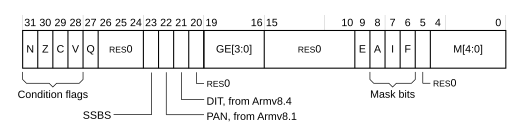

# ​G1.11.1 Accessing PSTATE fields

Source: <https://developer.arm.com/documentation/ddi0487/mc/-Part-G-The-AArch32-System-Level-Architecture/-Chapter-G1-The-AArch32-System-Level-Programmers--Model/-G1-11-Process-state--PSTATE/-G1-11-1-Accessing-PSTATE-fields>

##### G1.11.1 Accessing PSTATE fields

The [PSTATE](/documentation/ddi0487/mc/-Part-E-The-AArch32-Application-Level-Architecture/-Chapter-E1-The-AArch32-Application-Level-Programmers--Model/-E1-2-The-Application-level-programmers--model-in-AArch32-state/-E1-2-4-Process-state--PSTATE?lang=en#cegjcbch) fields can be accessed as described in the following subsections:

- [The Current Program Status Register, CPSR](/documentation/ddi0487/mc/-Part-G-The-AArch32-System-Level-Architecture/-Chapter-G1-The-AArch32-System-Level-Programmers--Model/-G1-11-Process-state--PSTATE/-G1-11-1-Accessing-PSTATE-fields?lang=en#cihjbhja).
- [Accessing the PE state controls, the Execution state bit, and the Undefined Instruction exception injection bit](/documentation/ddi0487/mc/-Part-G-The-AArch32-System-Level-Architecture/-Chapter-G1-The-AArch32-System-Level-Programmers--Model/-G1-11-Process-state--PSTATE/-G1-11-1-Accessing-PSTATE-fields?lang=en#chdjifab).
- [The CPS instruction](/documentation/ddi0487/mc/-Part-G-The-AArch32-System-Level-Architecture/-Chapter-G1-The-AArch32-System-Level-Programmers--Model/-G1-11-Process-state--PSTATE/-G1-11-1-Accessing-PSTATE-fields?lang=en#chdihjai).
- [The SETEND instruction](/documentation/ddi0487/mc/-Part-G-The-AArch32-System-Level-Architecture/-Chapter-G1-The-AArch32-System-Level-Programmers--Model/-G1-11-Process-state--PSTATE/-G1-11-1-Accessing-PSTATE-fields?lang=en#chdbbbdi).
- [The SETPAN instruction](/documentation/ddi0487/mc/-Part-G-The-AArch32-System-Level-Architecture/-Chapter-G1-The-AArch32-System-Level-Programmers--Model/-G1-11-Process-state--PSTATE/-G1-11-1-Accessing-PSTATE-fields?lang=en#chdgdjhe).

###### G1.11.1.1 The Current Program Status Register, CPSR

Some [PSTATE](/documentation/ddi0487/mc/-Part-G-The-AArch32-System-Level-Architecture/-Chapter-G1-The-AArch32-System-Level-Programmers--Model/-G1-11-Process-state--PSTATE?lang=en#chdedfdc) fields can be accessed using the Special-purpose *Current Program Status Register* (CPSR). The CPSR can be directly read using the [MRS](/documentation/ddi0487/mc/-Part-C-The-AArch64-Instruction-Set/-Chapter-C6-A64-Base-Instruction-Descriptions/-C6-2-Alphabetical-list-of-A64-base-instructions/-C6-2-287-MRS?lang=en#isa_mrs) instruction, and directly written using the [MSR (register)](/documentation/ddi0487/mc/-Part-F-The-AArch32-Instruction-Sets/-Chapter-F5-T32-and-A32-Base-Instruction-Set-Instruction-Descriptions/-F5-1-Alphabetical-list-of-T32-and-A32-base-instruction-set-instructions/-F5-1-122-MSR--register-?lang=en#isa_msr_r) and [MSR (immediate)](/documentation/ddi0487/mc/-Part-F-The-AArch32-Instruction-Sets/-Chapter-F5-T32-and-A32-Base-Instruction-Set-Instruction-Descriptions/-F5-1-Alphabetical-list-of-T32-and-A32-base-instruction-set-instructions/-F5-1-121-MSR--immediate-?lang=en#isa_msr_i) instructions.

The CPSR bit assignments are:

N, Z, C, V, bits [31:28]
:   The [PSTATE](/documentation/ddi0487/mc/-Part-G-The-AArch32-System-Level-Architecture/-Chapter-G1-The-AArch32-System-Level-Programmers--Model/-G1-11-Process-state--PSTATE?lang=en#chdedfdc) Condition flags.

Q, bit [27]
:   The [PSTATE](/documentation/ddi0487/mc/-Part-G-The-AArch32-System-Level-Architecture/-Chapter-G1-The-AArch32-System-Level-Programmers--Model/-G1-11-Process-state--PSTATE?lang=en#chdedfdc) overflow or saturation flag.

Bits[26:23, 20, 15:10, 5]
:   Reserved, RES0.

SSBS, bit [23]
:   Speculative Store Bypass Safe (SSBS) bit, see [Access permissions for instruction execution](/documentation/ddi0487/mc/-Part-G-The-AArch32-System-Level-Architecture/-Chapter-G5-The-AArch32-Virtual-Memory-System-Architecture/-G5-6-Memory-access-control/-G5-6-3-Access-permissions-for-instruction-execution?lang=en#chddcjhb).

Bit[22]
:   In Armv8.0, Reserved, RES0.

    In Armv8.1, *Privileged Access Never* (PAN) state bit, see [About the PAN bit](/documentation/ddi0487/mc/-Part-G-The-AArch32-System-Level-Architecture/-Chapter-G5-The-AArch32-Virtual-Memory-System-Architecture/-G5-6-Memory-access-control/-G5-6-2-About-the-PAN-bit?lang=en#cchhabfe).

DIT, bit [21]
:   Shows the value of [CPSR](/documentation/ddi0487/mc/-Part-G-The-AArch32-System-Level-Architecture/-Chapter-G1-The-AArch32-System-Level-Programmers--Model/-G1-11-Process-state--PSTATE/-G1-11-1-Accessing-PSTATE-fields?lang=en#cihjbhja).DIT immediately before the exception was taken.

GE[3:0], bits [19:16]
:   The [PSTATE](/documentation/ddi0487/mc/-Part-G-The-AArch32-System-Level-Architecture/-Chapter-G1-The-AArch32-System-Level-Programmers--Model/-G1-11-Process-state--PSTATE?lang=en#chdedfdc) greater than or equal flags.

E, bit [9]
:   The [PSTATE](/documentation/ddi0487/mc/-Part-G-The-AArch32-System-Level-Architecture/-Chapter-G1-The-AArch32-System-Level-Programmers--Model/-G1-11-Process-state--PSTATE?lang=en#chdedfdc) endianness bit.

A, I, F, bits [8:6]
:   The [PSTATE](/documentation/ddi0487/mc/-Part-G-The-AArch32-System-Level-Architecture/-Chapter-G1-The-AArch32-System-Level-Programmers--Model/-G1-11-Process-state--PSTATE?lang=en#chdedfdc) asynchronous exception mask bits.

M[4:0], bits [4:0]
:   The [PSTATE](/documentation/ddi0487/mc/-Part-G-The-AArch32-System-Level-Architecture/-Chapter-G1-The-AArch32-System-Level-Programmers--Model/-G1-11-Process-state--PSTATE?lang=en#chdedfdc) mode bits.

The other [PSTATE](/documentation/ddi0487/mc/-Part-G-The-AArch32-System-Level-Architecture/-Chapter-G1-The-AArch32-System-Level-Programmers--Model/-G1-11-Process-state--PSTATE?lang=en#chdedfdc) fields cannot be accessed by using the CPSR. For information on how to access them, see [Accessing the PE state controls, the Execution state bit, and the Undefined Instruction exception injection bit](/documentation/ddi0487/mc/-Part-G-The-AArch32-System-Level-Architecture/-Chapter-G1-The-AArch32-System-Level-Programmers--Model/-G1-11-Process-state--PSTATE/-G1-11-1-Accessing-PSTATE-fields?lang=en#chdjifab).

The application level alias for the CPSR is the [APSR](/documentation/ddi0487/mc/-Part-E-The-AArch32-Application-Level-Architecture/-Chapter-E1-The-AArch32-Application-Level-Programmers--Model/-E1-2-The-Application-level-programmers--model-in-AArch32-state/-E1-2-4-Process-state--PSTATE?lang=en#cjagbhbh). The [APSR](/documentation/ddi0487/mc/-Part-E-The-AArch32-Application-Level-Architecture/-Chapter-E1-The-AArch32-Application-Level-Programmers--Model/-E1-2-The-Application-level-programmers--model-in-AArch32-state/-E1-2-4-Process-state--PSTATE?lang=en#cjagbhbh) is a subset of the CPSR. See [The Application Program Status Register, APSR](/documentation/ddi0487/mc/-Part-E-The-AArch32-Application-Level-Architecture/-Chapter-E1-The-AArch32-Application-Level-Programmers--Model/-E1-2-The-Application-level-programmers--model-in-AArch32-state/-E1-2-4-Process-state--PSTATE?lang=en#cjagbhbh).

Writes to the CPSR have side-effects on various aspects of PE operation. All of these side-effects, except side-effects on memory accesses associated with fetching instructions, are synchronous to the CPSR write. This means that they are guaranteed:

- Not to be visible to earlier instructions in the execution stream.
- To be visible to later instructions in the execution stream.

The privilege level and address space of memory accesses associated with fetching instructions depend on the current Exception level and Security state. Writes to [PSTATE](/documentation/ddi0487/mc/-Part-G-The-AArch32-System-Level-Architecture/-Chapter-G1-The-AArch32-System-Level-Programmers--Model/-G1-11-Process-state--PSTATE?lang=en#chdedfdc).M can change one or both of the Exception level and Security state. The effect, on memory accesses associated with fetching instructions, of a change of Exception level or Security state is:

- Synchronous to the change of Exception level or Security state, if that change is caused by an exception entry or exception return.
- Guaranteed not to be visible to any memory access caused by fetching an earlier instruction in the execution stream.
- Guaranteed to be visible to any memory access caused by fetching any instruction after the next [Context Synchronization event](/documentation/ddi0487/mc/-Part-K-Appendixes/Glossary?lang=en#babdjfhg) in the execution stream.
- Might or might not affect memory accesses caused by fetching instructions between the mode change instruction and the point where the mode change is guaranteed to be visible.

See [Exception return to an Exception level using AArch32](/documentation/ddi0487/mc/-Part-G-The-AArch32-System-Level-Architecture/-Chapter-G1-The-AArch32-System-Level-Programmers--Model/-G1-15-Exception-return-to-an-Exception-level-using-AArch32?lang=en#cihbafec) for the definition of exception return instructions.

###### G1.11.1.2 Accessing the PE state controls, the Execution state bit, and the Undefined Instruction exception injection bit

The PE state controls are the [PSTATE](/documentation/ddi0487/mc/-Part-G-The-AArch32-System-Level-Architecture/-Chapter-G1-The-AArch32-System-Level-Programmers--Model/-G1-11-Process-state--PSTATE?lang=en#chdedfdc).{IL, IT[7:0], J, E, T} fields. Software can read or write these in an [SPSR](/documentation/ddi0487/mc/-Part-G-The-AArch32-System-Level-Architecture/-Chapter-G1-The-AArch32-System-Level-Programmers--Model/-G1-10-AArch32-general-purpose-registers--the-PC--and-the-Special-purpose-registers/-G1-10-2-Saved-Program-Status-Registers--SPSRs-?lang=en#chddaabb).

In the [CPSR](/documentation/ddi0487/mc/-Part-G-The-AArch32-System-Level-Architecture/-Chapter-G1-The-AArch32-System-Level-Programmers--Model/-G1-11-Process-state--PSTATE/-G1-11-1-Accessing-PSTATE-fields?lang=en#cihjbhja):

- The PE state controls, other than [PSTATE](/documentation/ddi0487/mc/-Part-G-The-AArch32-System-Level-Architecture/-Chapter-G1-The-AArch32-System-Level-Programmers--Model/-G1-11-Process-state--PSTATE?lang=en#chdedfdc).E, are RAZ when read by an [MRS](/documentation/ddi0487/mc/-Part-C-The-AArch64-Instruction-Set/-Chapter-C6-A64-Base-Instruction-Descriptions/-C6-2-Alphabetical-list-of-A64-base-instructions/-C6-2-287-MRS?lang=en#isa_mrs) instruction.
- Writes to the PE state controls, other than [PSTATE](/documentation/ddi0487/mc/-Part-G-The-AArch32-System-Level-Architecture/-Chapter-G1-The-AArch32-System-Level-Programmers--Model/-G1-11-Process-state--PSTATE?lang=en#chdedfdc).E, by [MSR (register)](/documentation/ddi0487/mc/-Part-F-The-AArch32-Instruction-Sets/-Chapter-F5-T32-and-A32-Base-Instruction-Set-Instruction-Descriptions/-F5-1-Alphabetical-list-of-T32-and-A32-base-instruction-set-instructions/-F5-1-122-MSR--register-?lang=en#isa_msr_r) or [MSR (immediate)](/documentation/ddi0487/mc/-Part-F-The-AArch32-Instruction-Sets/-Chapter-F5-T32-and-A32-Base-Instruction-Set-Instruction-Descriptions/-F5-1-Alphabetical-list-of-T32-and-A32-base-instruction-set-instructions/-F5-1-121-MSR--immediate-?lang=en#isa_msr_i), are ignored in all modes.

Instructions other than [MRS](/documentation/ddi0487/mc/-Part-C-The-AArch64-Instruction-Set/-Chapter-C6-A64-Base-Instruction-Descriptions/-C6-2-Alphabetical-list-of-A64-base-instructions/-C6-2-287-MRS?lang=en#isa_mrs), [MSR (register)](/documentation/ddi0487/mc/-Part-F-The-AArch32-Instruction-Sets/-Chapter-F5-T32-and-A32-Base-Instruction-Set-Instruction-Descriptions/-F5-1-Alphabetical-list-of-T32-and-A32-base-instruction-set-instructions/-F5-1-122-MSR--register-?lang=en#isa_msr_r), or [MSR (immediate)](/documentation/ddi0487/mc/-Part-F-The-AArch32-Instruction-Sets/-Chapter-F5-T32-and-A32-Base-Instruction-Set-Instruction-Descriptions/-F5-1-Alphabetical-list-of-T32-and-A32-base-instruction-set-instructions/-F5-1-121-MSR--immediate-?lang=en#isa_msr_i) that access the PE state controls can read and write them in any mode.

Unlike the other [PSTATE](/documentation/ddi0487/mc/-Part-G-The-AArch32-System-Level-Architecture/-Chapter-G1-The-AArch32-System-Level-Programmers--Model/-G1-11-Process-state--PSTATE?lang=en#chdedfdc) PE state controls, [PSTATE](/documentation/ddi0487/mc/-Part-G-The-AArch32-System-Level-Architecture/-Chapter-G1-The-AArch32-System-Level-Programmers--Model/-G1-11-Process-state--PSTATE?lang=en#chdedfdc).E can be read by an [MRS](/documentation/ddi0487/mc/-Part-C-The-AArch64-Instruction-Set/-Chapter-C6-A64-Base-Instruction-Descriptions/-C6-2-Alphabetical-list-of-A64-base-instructions/-C6-2-287-MRS?lang=en#isa_mrs) instruction and might be written by [MSR (register)](/documentation/ddi0487/mc/-Part-F-The-AArch32-Instruction-Sets/-Chapter-F5-T32-and-A32-Base-Instruction-Set-Instruction-Descriptions/-F5-1-Alphabetical-list-of-T32-and-A32-base-instruction-set-instructions/-F5-1-122-MSR--register-?lang=en#isa_msr_r) or [MSR (immediate)](/documentation/ddi0487/mc/-Part-F-The-AArch32-Instruction-Sets/-Chapter-F5-T32-and-A32-Base-Instruction-Set-Instruction-Descriptions/-F5-1-Alphabetical-list-of-T32-and-A32-base-instruction-set-instructions/-F5-1-121-MSR--immediate-?lang=en#isa_msr_i). However, Arm deprecates [PSTATE](/documentation/ddi0487/mc/-Part-G-The-AArch32-System-Level-Architecture/-Chapter-G1-The-AArch32-System-Level-Programmers--Model/-G1-11-Process-state--PSTATE?lang=en#chdedfdc).E having a different value from the equivalent System register EE bit, see [Mixed-endian support in AArch32](/documentation/ddi0487/mc/-Part-G-The-AArch32-System-Level-Architecture/-Chapter-G4-The-AArch32-System-Level-Memory-Model/-G4-3-Mixed-endian-support-in-AArch32?lang=en#beiibaig).

> #### Note
>
> To determine the current endianness, software can use an `LDR` instruction to load a word from memory with a known value that differs if the endianness is reversed. For example, using an `LDR` instruction to load a word whose four bytes are `0x01`, `0x00`, `0x00`, and `0x00` in ascending order of memory address loads the destination register with:
>
> - `0x0000_0001` if the current endianness is little-endian.
> - `0x0100_0000` if the current endianness is big-endian.

The [PSTATE](/documentation/ddi0487/mc/-Part-G-The-AArch32-System-Level-Architecture/-Chapter-G1-The-AArch32-System-Level-Programmers--Model/-G1-11-Process-state--PSTATE?lang=en#chdedfdc).M[4] bit is the Execution state bit. When read by an [MRS](/documentation/ddi0487/mc/-Part-C-The-AArch64-Instruction-Set/-Chapter-C6-A64-Base-Instruction-Descriptions/-C6-2-Alphabetical-list-of-A64-base-instructions/-C6-2-287-MRS?lang=en#isa_mrs) instruction in AArch32 state, this bit always reads as 1. When written by an [MSR (register)](/documentation/ddi0487/mc/-Part-F-The-AArch32-Instruction-Sets/-Chapter-F5-T32-and-A32-Base-Instruction-Set-Instruction-Descriptions/-F5-1-Alphabetical-list-of-T32-and-A32-base-instruction-set-instructions/-F5-1-122-MSR--register-?lang=en#isa_msr_r) instruction or [MSR (immediate)](/documentation/ddi0487/mc/-Part-F-The-AArch32-Instruction-Sets/-Chapter-F5-T32-and-A32-Base-Instruction-Set-Instruction-Descriptions/-F5-1-Alphabetical-list-of-T32-and-A32-base-instruction-set-instructions/-F5-1-121-MSR--immediate-?lang=en#isa_msr_i) instruction, writing a value other than 1 is an illegal change to the [PSTATE](/documentation/ddi0487/mc/-Part-G-The-AArch32-System-Level-Architecture/-Chapter-G1-The-AArch32-System-Level-Programmers--Model/-G1-11-Process-state--PSTATE?lang=en#chdedfdc).M field. See [Illegal changes to PSTATE.M](/documentation/ddi0487/mc/-Part-G-The-AArch32-System-Level-Architecture/-Chapter-G1-The-AArch32-System-Level-Programmers--Model/-G1-11-Process-state--PSTATE/-G1-11-3-Illegal-changes-to-PSTATE-M?lang=en#chddfige).

The [PSTATE](/documentation/ddi0487/mc/-Part-G-The-AArch32-System-Level-Architecture/-Chapter-G1-The-AArch32-System-Level-Programmers--Model/-G1-11-Process-state--PSTATE?lang=en#chdedfdc).UINJ bit is the Undefined Instruction exception injection bit, implemented when [FEAT\_UINJ](/documentation/ddi0487/mc/-Part-A-Arm-Architecture-Introduction-and-Overview/-Chapter-A2-A-profile-Architecture-Extensions/-A2-3-Armv9-A-architecture-extensions/-A2-3-7-The-Armv9-6-architecture-extension?lang=en#feat_feat_uinj) is implemented. Software can read or write this bit in AArch64 state in [SPSR\_ELx](/documentation/ddi0487/mc/-Part-K-Appendixes/-Appendix-K14-Registers-Index/-K14-1-Introduction-and-register-disambiguation/-K14-1-2-Register-name-disambiguation-by-Exception-level?lang=en#spsr_elx). See [Undefined Instruction exception](/documentation/ddi0487/mc/-Part-G-The-AArch32-System-Level-Architecture/-Chapter-G1-The-AArch32-System-Level-Programmers--Model/-G1-17-AArch32-state-exception-descriptions/-G1-17-1-Undefined-Instruction-exception?lang=en#cihcdfgc) and [Undefined Instruction exceptions injected by PSTATE.UINJ](/documentation/ddi0487/mc/-Part-D-The-AArch64-System-Level-Architecture/-Chapter-D1-The-AArch64-System-Level-Programmers--Model/-D1-4-Exceptions/-D1-4-5-Synchronous-exception-types?lang=en#mdsec_undefined_instruction_exceptions_injected_by_pstate_uinj).

###### G1.11.1.3 The `CPS` instruction

The T32 and A32 instruction sets both include an instruction to manipulate [PSTATE](/documentation/ddi0487/mc/-Part-G-The-AArch32-System-Level-Architecture/-Chapter-G1-The-AArch32-System-Level-Programmers--Model/-G1-11-Process-state--PSTATE?lang=en#chdedfdc).{A, I, F} and [PSTATE](/documentation/ddi0487/mc/-Part-G-The-AArch32-System-Level-Architecture/-Chapter-G1-The-AArch32-System-Level-Programmers--Model/-G1-11-Process-state--PSTATE?lang=en#chdedfdc).M:

`CPSIE <iflags> {, #<mode>}`
:   Sets the specified [PSTATE](/documentation/ddi0487/mc/-Part-G-The-AArch32-System-Level-Architecture/-Chapter-G1-The-AArch32-System-Level-Programmers--Model/-G1-11-Process-state--PSTATE?lang=en#chdedfdc). {A, I, F} exception masks to 0, enabling the exception, and optionally changes to the specified mode.

`CPSID <iflags> {, #<mode>}`
:   Sets the specified [PSTATE](/documentation/ddi0487/mc/-Part-G-The-AArch32-System-Level-Architecture/-Chapter-G1-The-AArch32-System-Level-Programmers--Model/-G1-11-Process-state--PSTATE?lang=en#chdedfdc).{A, I, F} exception masks to 1, disabling the exception, and optionally changes to the specified mode.

`CPS #<mode>`
:   Changes to the specified mode without affecting the [PSTATE](/documentation/ddi0487/mc/-Part-G-The-AArch32-System-Level-Architecture/-Chapter-G1-The-AArch32-System-Level-Programmers--Model/-G1-11-Process-state--PSTATE?lang=en#chdedfdc).{A, I, F} exception masks.

The `CPS` instruction is unconditional. For more information, see [CPS, CPSID, CPSIE](/documentation/ddi0487/mc/-Part-F-The-AArch32-Instruction-Sets/-Chapter-F5-T32-and-A32-Base-Instruction-Set-Instruction-Descriptions/-F5-1-Alphabetical-list-of-T32-and-A32-base-instruction-set-instructions/-F5-1-39-CPS--CPSID--CPSIE?lang=en#isa_cps).

###### G1.11.1.4 The `SETEND` instruction

The T32 and A32 instruction sets both include an instruction to manipulate [PSTATE](/documentation/ddi0487/mc/-Part-G-The-AArch32-System-Level-Architecture/-Chapter-G1-The-AArch32-System-Level-Programmers--Model/-G1-11-Process-state--PSTATE?lang=en#chdedfdc).E:

`SETEND BE`
:   Sets [PSTATE](/documentation/ddi0487/mc/-Part-G-The-AArch32-System-Level-Architecture/-Chapter-G1-The-AArch32-System-Level-Programmers--Model/-G1-11-Process-state--PSTATE?lang=en#chdedfdc).E to 1, for big-endian operation.

`SETEND LE`
:   Sets [PSTATE](/documentation/ddi0487/mc/-Part-G-The-AArch32-System-Level-Architecture/-Chapter-G1-The-AArch32-System-Level-Programmers--Model/-G1-11-Process-state--PSTATE?lang=en#chdedfdc).E to 0, for little-endian operation.

The `SETEND` instruction is unconditional. For more information, see [SETEND](/documentation/ddi0487/mc/-Part-F-The-AArch32-Instruction-Sets/-Chapter-F5-T32-and-A32-Base-Instruction-Set-Instruction-Descriptions/-F5-1-Alphabetical-list-of-T32-and-A32-base-instruction-set-instructions/-F5-1-183-SETEND?lang=en#isa_setend). Arm deprecates use of the `SETEND` instruction.

###### G1.11.1.5 The `SETPAN` instruction

[FEAT\_PAN](/documentation/ddi0487/mc/-Part-A-Arm-Architecture-Introduction-and-Overview/-Chapter-A2-A-profile-Architecture-Extensions/-A2-2-Armv8-A-architecture-extensions/-A2-2-2-The-Armv8-1-architecture-extension?lang=en#feat_feat_pan) adds the `SETPAN` instruction to the T32 and A32 instruction sets, to manipulate [PSTATE](/documentation/ddi0487/mc/-Part-G-The-AArch32-System-Level-Architecture/-Chapter-G1-The-AArch32-System-Level-Programmers--Model/-G1-11-Process-state--PSTATE?lang=en#chdedfdc).PAN:

`SETPAN #0`
:   Sets [PSTATE](/documentation/ddi0487/mc/-Part-G-The-AArch32-System-Level-Architecture/-Chapter-G1-The-AArch32-System-Level-Programmers--Model/-G1-11-Process-state--PSTATE?lang=en#chdedfdc).PAN to 0, disabling Privileged access-never operation.

`SETPAN #1`
:   Sets [PSTATE](/documentation/ddi0487/mc/-Part-G-The-AArch32-System-Level-Architecture/-Chapter-G1-The-AArch32-System-Level-Programmers--Model/-G1-11-Process-state--PSTATE?lang=en#chdedfdc).PAN to 1, enabling Privileged access-never operation.

The `SETPAN` instruction is unconditional.

- [SETPAN](/documentation/ddi0487/mc/-Part-F-The-AArch32-Instruction-Sets/-Chapter-F5-T32-and-A32-Base-Instruction-Set-Instruction-Descriptions/-F5-1-Alphabetical-list-of-T32-and-A32-base-instruction-set-instructions/-F5-1-184-SETPAN?lang=en#isa_setpan).
- [About the PAN bit](/documentation/ddi0487/mc/-Part-G-The-AArch32-System-Level-Architecture/-Chapter-G5-The-AArch32-Virtual-Memory-System-Architecture/-G5-6-Memory-access-control/-G5-6-2-About-the-PAN-bit?lang=en#cchhabfe).
