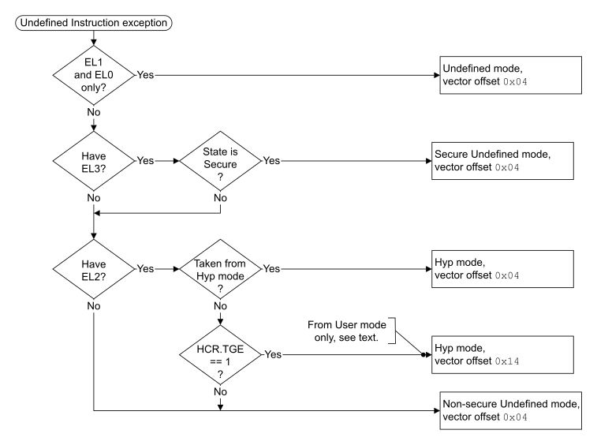

# ​G1.17.1 Undefined Instruction exception

Source: <https://developer.arm.com/documentation/ddi0487/mc/-Part-G-The-AArch32-System-Level-Architecture/-Chapter-G1-The-AArch32-System-Level-Programmers--Model/-G1-17-AArch32-state-exception-descriptions/-G1-17-1-Undefined-Instruction-exception>

##### G1.17.1 Undefined Instruction exception

An Undefined Instruction exception might be caused by:

- A System register access, floating-point, or Advanced SIMD instruction that is not accessible because of the settings in one or more of the [CPACR](/documentation/ddi0487/mc/-Part-G-The-AArch32-System-Level-Architecture/-Chapter-G8-AArch32-System-Register-Descriptions/-G8-2-General-system-control-registers/-G8-2-33-CPACR--Architectural-Feature-Access-Control-Register?lang=en#reg_aarch32_cpacr), [NSACR](/documentation/ddi0487/mc/-Part-G-The-AArch32-System-Level-Architecture/-Chapter-G8-AArch32-System-Register-Descriptions/-G8-2-General-system-control-registers/-G8-2-120-NSACR--Non-Secure-Access-Control-Register?lang=en#reg_aarch32_nsacr), [HCPTR](/documentation/ddi0487/mc/-Part-G-The-AArch32-System-Level-Architecture/-Chapter-G8-AArch32-System-Register-Descriptions/-G8-2-General-system-control-registers/-G8-2-64-HCPTR--Hyp-Architectural-Feature-Trap-Register?lang=en#reg_aarch32_hcptr), and [DBGDSCRext](/documentation/ddi0487/mc/-Part-G-The-AArch32-System-Level-Architecture/-Chapter-G8-AArch32-System-Register-Descriptions/-G8-3-Debug-System-registers/-G8-3-14-DBGDSCRext--Debug-Status-and-Control-Register--External-View?lang=en#reg_aarch32_dbgdscrext).
- A System register access, floating-point, or Advanced SIMD instruction that is not implemented.
- A System register access, floating-point, or Advanced SIMD instruction that causes an exception during execution. This includes:

  - Trapped floating-point exceptions that are taken to AArch32, if an implementation supports these traps. See [Floating-point exceptions and exception traps](/documentation/ddi0487/mc/-Part-E-The-AArch32-Application-Level-Architecture/-Chapter-E1-The-AArch32-Application-Level-Programmers--Model/-E1-3-Advanced-SIMD-and-floating-point-instructions/-E1-3-8-Floating-point-exceptions-and-exception-traps?lang=en#cfihbhhd).
  - Execution of certain floating-point instructions when one or both of the [FPSCR](/documentation/ddi0487/mc/-Part-G-The-AArch32-System-Level-Architecture/-Chapter-G8-AArch32-System-Register-Descriptions/-G8-2-General-system-control-registers/-G8-2-55-FPSCR--Floating-Point-Status-and-Control-Register?lang=en#reg_aarch32_fpscr).{Stride, Len} fields in nonzero, in an implementation in which those fields are RW. The description of [FPEXC](/documentation/ddi0487/mc/-Part-G-The-AArch32-System-Level-Architecture/-Chapter-G8-AArch32-System-Register-Descriptions/-G8-2-General-system-control-registers/-G8-2-54-FPEXC--Floating-Point-Exception-Control-register?lang=en#reg_aarch32_fpexc) specifies the instructions to which this applies.
- If [FEAT\_UINJ](/documentation/ddi0487/mc/-Part-A-Arm-Architecture-Introduction-and-Overview/-Chapter-A2-A-profile-Architecture-Extensions/-A2-3-Armv9-A-architecture-extensions/-A2-3-7-The-Armv9-6-architecture-extension?lang=en#feat_feat_uinj) is implemented, an attempt at EL0 using AArch32 to execute any instruction when [PSTATE](/documentation/ddi0487/mc/-Part-E-The-AArch32-Application-Level-Architecture/-Chapter-E1-The-AArch32-Application-Level-Programmers--Model/-E1-2-The-Application-level-programmers--model-in-AArch32-state/-E1-2-4-Process-state--PSTATE?lang=en#cegjcbch).UINJ is 1. See [Undefined Instruction exceptions injected by PSTATE.UINJ](/documentation/ddi0487/mc/-Part-D-The-AArch64-System-Level-Architecture/-Chapter-D1-The-AArch64-System-Level-Programmers--Model/-D1-4-Exceptions/-D1-4-5-Synchronous-exception-types?lang=en#mdsec_undefined_instruction_exceptions_injected_by_pstate_uinj).
- An instruction that is UNDEFINED.

> #### Note
>
> The Undefined Instruction exception is taken using offset `0x04` in the Hyp, Secure, or Non-secure vector table. In the Monitor vector table this offset is used for the Monitor Trap exception. See [Monitor Trap exception](/documentation/ddi0487/mc/-Part-G-The-AArch32-System-Level-Architecture/-Chapter-G1-The-AArch32-System-Level-Programmers--Model/-G1-17-AArch32-state-exception-descriptions/-G1-17-2-Monitor-Trap-exception?lang=en#chdbhhac) and [The vector tables and exception offsets](/documentation/ddi0487/mc/-Part-G-The-AArch32-System-Level-Architecture/-Chapter-G1-The-AArch32-System-Level-Programmers--Model/-G1-13-Handling-exceptions-that-are-taken-to-an-Exception-level-using-AArch32/-G1-13-1-Exception-vectors-and-the-exception-base-address?lang=en#beibgefb).

By default, an Undefined Instruction exception is taken to Undefined mode, but an Undefined Instruction exception can be taken to EL2, meaning it is taken to Hyp mode if EL2 is using AArch32, see [The PE mode to which the Undefined Instruction exception is taken](/documentation/ddi0487/mc/-Part-G-The-AArch32-System-Level-Architecture/-Chapter-G1-The-AArch32-System-Level-Programmers--Model/-G1-17-AArch32-state-exception-descriptions/-G1-17-1-Undefined-Instruction-exception?lang=en#beihcjcg).

The Undefined Instruction exception can provide:

- Signaling of an illegal instruction execution.
- *Lazy context switching* of System registers.

The preferred return address for an Undefined Instruction exception is the address of the instruction that generated the exception. For an exception taken to AArch32 state, this return is performed as follows:

- If returning from Secure or Non-secure Undefined mode, the exception return uses the [SPSR](/documentation/ddi0487/mc/-Part-G-The-AArch32-System-Level-Architecture/-Chapter-G1-The-AArch32-System-Level-Programmers--Model/-G1-10-AArch32-general-purpose-registers--the-PC--and-the-Special-purpose-registers/-G1-10-2-Saved-Program-Status-Registers--SPSRs-?lang=en#chddaabb) and LR\_und values generated by the exception entry, as follows:

  - If [SPSR](/documentation/ddi0487/mc/-Part-G-The-AArch32-System-Level-Architecture/-Chapter-G1-The-AArch32-System-Level-Programmers--Model/-G1-10-AArch32-general-purpose-registers--the-PC--and-the-Special-purpose-registers/-G1-10-2-Saved-Program-Status-Registers--SPSRs-?lang=en#chddaabb).T is 0, indicating that the exception occurred in A32 state, the return uses an exception return instruction with a subtraction of 4.
  - If [SPSR](/documentation/ddi0487/mc/-Part-G-The-AArch32-System-Level-Architecture/-Chapter-G1-The-AArch32-System-Level-Programmers--Model/-G1-10-AArch32-general-purpose-registers--the-PC--and-the-Special-purpose-registers/-G1-10-2-Saved-Program-Status-Registers--SPSRs-?lang=en#chddaabb).T is 1, indicating that the exception occurred in T32 state, the return uses an exception return instruction with a subtraction of 2.
- If returning from Hyp mode, the exception return is performed by an `ERET` instruction, using the [SPSR](/documentation/ddi0487/mc/-Part-G-The-AArch32-System-Level-Architecture/-Chapter-G1-The-AArch32-System-Level-Programmers--Model/-G1-10-AArch32-general-purpose-registers--the-PC--and-the-Special-purpose-registers/-G1-10-2-Saved-Program-Status-Registers--SPSRs-?lang=en#chddaabb) and [ELR\_hyp](/documentation/ddi0487/mc/-Part-G-The-AArch32-System-Level-Architecture/-Chapter-G1-The-AArch32-System-Level-Programmers--Model/-G1-10-AArch32-general-purpose-registers--the-PC--and-the-Special-purpose-registers/-G1-10-3-ELR-hyp?lang=en#beijhfcf) values generated by the exception entry.

For more information, see [Exception return to an Exception level using AArch32](/documentation/ddi0487/mc/-Part-G-The-AArch32-System-Level-Architecture/-Chapter-G1-The-AArch32-System-Level-Programmers--Model/-G1-15-Exception-return-to-an-Exception-level-using-AArch32?lang=en#cihbafec).

> #### Note
>
> If handling the Undefined Instruction exception requires instruction emulation, followed by return to the next instruction after the instruction that caused the exception, the instruction emulator must use the instruction length to calculate the correct return address, and to calculate the updated values of the IT bits if necessary.

###### G1.17.1.1 The PE mode to which the Undefined Instruction exception is taken

[Figure G1-4](/documentation/ddi0487/mc/-Part-G-The-AArch32-System-Level-Architecture/-Chapter-G1-The-AArch32-System-Level-Programmers--Model/-G1-17-AArch32-state-exception-descriptions/-G1-17-1-Undefined-Instruction-exception?lang=en#fig_beihchgb) shows how the implementation, state, and configuration options determine the PE mode to which an Undefined Instruction exception is taken, when the exception is taken to an Exception level that is using AArch32.

Figure G1-4 The PE mode an Undefined Instruction exception is taken to in AArch32 state

See also [UNPREDICTABLE cases when the value of HCR.TGE is 1](/documentation/ddi0487/mc/-Part-G-The-AArch32-System-Level-Architecture/-Chapter-G1-The-AArch32-System-Level-Programmers--Model/-G1-13-Handling-exceptions-that-are-taken-to-an-Exception-level-using-AArch32/-G1-13-4-PE-mode-for-taking-exceptions?lang=en#chdhijjf).

###### G1.17.1.2 Pseudocode description of taking the Undefined Instruction exception

The [`AArch32_Undefined`](/documentation/ddi0487/mc/-Part-J-Architectural-Pseudocode/-Chapter-J1-A-profile-Architecture-Pseudocode/-J1-3-Pseudocode-for-AArch32-operation/-J1-3-64-AArch32-Undefined?lang=en#asl_func_aarch32_undefined_0)`()` pseudocode procedure determines whether the Undefined Instruction exception is taken to AArch32 state. If it is taken to AArch32 state, the [`AArch32_TakeUndefInstrException`](/documentation/ddi0487/mc/-Part-J-Architectural-Pseudocode/-Chapter-J1-A-profile-Architecture-Pseudocode/-J1-3-Pseudocode-for-AArch32-operation/-J1-3-63-AArch32-TakeUndefInstrException?lang=en#asl_func_aarch32_takeundefinstrexception_0)`()` pseudocode procedure describes how the PE takes the exception.

An Undefined Instruction exception is taken to an Exception level using AArch64 if either:

- It is generated in User mode when EL1 is using AArch64.
- It is generated in User mode when EL2 is enabled in the current Security state and is using AArch64 and the value of [HCR\_EL2](/documentation/ddi0487/mc/-Part-D-The-AArch64-System-Level-Architecture/-Chapter-D24-AArch64-System-Register-Descriptions/-D24-2-General-system-control-registers/-D24-2-61-HCR-EL2--Hypervisor-Configuration-Register?lang=en#reg_aarch64_hcr_el2).TGE is 1.

###### G1.17.1.3 Conditional execution of undefined instructions

The conditional execution rules described in [Conditional execution](/documentation/ddi0487/mc/-Part-F-The-AArch32-Instruction-Sets/-Chapter-F1-About-the-T32-and-A32-Instruction-Descriptions/-F1-3-Conditional-execution?lang=en#babgabfg) apply to all instructions. This includes undefined instructions and other instructions that would cause entry to the Undefined Instruction exception.

If such an instruction fails its condition check, the behavior depends on the potential cause of entry to the Undefined Instruction exception, as follows:

- If the potential cause is the execution of the instruction itself and depends on data values used by the instruction, the instruction executes as a `NOP` and does not cause an Undefined Instruction exception.
- In the following cases, it is IMPLEMENTATION DEFINED whether the instruction executes as a `NOP` or causes an Undefined Instruction exception:

  - The potential cause is the execution of an earlier System register access instruction, floating-point instruction, or Advanced SIMD instruction.
  - The potential cause is the execution of the instruction itself without dependence on the data values used by the instruction.

  An implementation must handle all such cases in the same way.

###### G1.17.1.4 Interaction of UNDEFINED instruction behavior with UNPREDICTABLE or CONSTRAINED UNPREDICTABLE instruction behavior

If this manual describes an instruction as both:

- UNPREDICTABLE and UNDEFINED then the instruction is UNPREDICTABLE.
- CONSTRAINED UNPREDICTABLE and UNDEFINED then the instruction is CONSTRAINED UNPREDICTABLE.

> #### Note
>
> An example of this is where both:
>
> - An instruction, or instruction class, is made UNDEFINED by some general principle, or by a configuration field.
> - A particular encoding of that instruction or instruction class is specified as CONSTRAINED UNPREDICTABLE.
