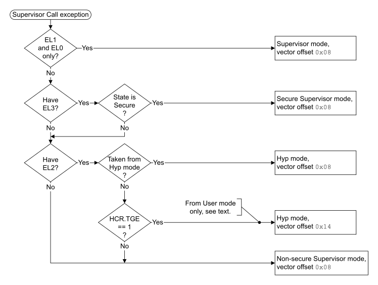

# ​G1.17.4 Supervisor Call (SVC) exception

Source: <https://developer.arm.com/documentation/ddi0487/mc/-Part-G-The-AArch32-System-Level-Architecture/-Chapter-G1-The-AArch32-System-Level-Programmers--Model/-G1-17-AArch32-state-exception-descriptions/-G1-17-4-Supervisor-Call--SVC--exception>

##### G1.17.4 Supervisor Call (SVC) exception

The Supervisor Call instruction, `SVC`, requests a supervisor function, typically to request an operating system function. When EL1 is using AArch32, executing an `SVC` instruction causes the PE to enter Supervisor mode. For more information, see [SVC](/documentation/ddi0487/mc/-Part-C-The-AArch64-Instruction-Set/-Chapter-C6-A64-Base-Instruction-Descriptions/-C6-2-Alphabetical-list-of-A64-base-instructions/-C6-2-466-SVC?lang=en#isa_svc).

> #### Note
>
> In an implementation that includes EL2, when EL2 is using AArch32:
>
> - When an `SVC` instruction is executed in Hyp mode, the Supervisor Call exception is taken to Hyp mode. For more information, see [SVC](/documentation/ddi0487/mc/-Part-C-The-AArch64-Instruction-Set/-Chapter-C6-A64-Base-Instruction-Descriptions/-C6-2-Alphabetical-list-of-A64-base-instructions/-C6-2-466-SVC?lang=en#isa_svc).
> - When the [HCR](/documentation/ddi0487/mc/-Part-G-The-AArch32-System-Level-Architecture/-Chapter-G8-AArch32-System-Register-Descriptions/-G8-2-General-system-control-registers/-G8-2-65-HCR--Hyp-Configuration-Register?lang=en#reg_aarch32_hcr).TGE bit is set to 1, the Supervisor Call exception generated by execution of an `SVC` instruction in Non-secure User mode is routed to Hyp mode. For more information, see [Supervisor Call exception, when the value of HCR.TGE is 1](/documentation/ddi0487/mc/-Part-G-The-AArch32-System-Level-Architecture/-Chapter-G1-The-AArch32-System-Level-Programmers--Model/-G1-13-Handling-exceptions-that-are-taken-to-an-Exception-level-using-AArch32/-G1-13-6-Routing-exceptions-from-Non-secure-EL0-to-EL2?lang=en#beijjbdg).

By default, a Supervisor Call exception that is taken to AArch32 state is taken to Supervisor mode, but a Supervisor Call exception can be taken to EL2, meaning it is taken to Hyp mode if EL2 is using AArch32, see [The PE mode to which the Supervisor Call exception is taken](/documentation/ddi0487/mc/-Part-G-The-AArch32-System-Level-Architecture/-Chapter-G1-The-AArch32-System-Level-Programmers--Model/-G1-17-AArch32-state-exception-descriptions/-G1-17-4-Supervisor-Call--SVC--exception?lang=en#beiiiehi).

The preferred return address for a Supervisor Call exception is the address of the next instruction after the `SVC` instruction. For an exception taken to AArch32 state, this return is performed as follows:

- If returning from Secure or Non-secure Supervisor mode, the exception return uses the [SPSR](/documentation/ddi0487/mc/-Part-G-The-AArch32-System-Level-Architecture/-Chapter-G1-The-AArch32-System-Level-Programmers--Model/-G1-10-AArch32-general-purpose-registers--the-PC--and-the-Special-purpose-registers/-G1-10-2-Saved-Program-Status-Registers--SPSRs-?lang=en#chddaabb) and LR\_svc values generated by the exception entry, in an exception return instruction without subtraction.
- If returning from Hyp mode, the exception return is performed by an `ERET` instruction, using the [SPSR](/documentation/ddi0487/mc/-Part-G-The-AArch32-System-Level-Architecture/-Chapter-G1-The-AArch32-System-Level-Programmers--Model/-G1-10-AArch32-general-purpose-registers--the-PC--and-the-Special-purpose-registers/-G1-10-2-Saved-Program-Status-Registers--SPSRs-?lang=en#chddaabb) and [ELR\_hyp](/documentation/ddi0487/mc/-Part-G-The-AArch32-System-Level-Architecture/-Chapter-G1-The-AArch32-System-Level-Programmers--Model/-G1-10-AArch32-general-purpose-registers--the-PC--and-the-Special-purpose-registers/-G1-10-3-ELR-hyp?lang=en#beijhfcf) values generated by the exception entry.

For more information, see [Exception return to an Exception level using AArch32](/documentation/ddi0487/mc/-Part-G-The-AArch32-System-Level-Architecture/-Chapter-G1-The-AArch32-System-Level-Programmers--Model/-G1-15-Exception-return-to-an-Exception-level-using-AArch32?lang=en#cihbafec).

###### G1.17.4.1 The PE mode to which the Supervisor Call exception is taken

[Figure G1-5](/documentation/ddi0487/mc/-Part-G-The-AArch32-System-Level-Architecture/-Chapter-G1-The-AArch32-System-Level-Programmers--Model/-G1-17-AArch32-state-exception-descriptions/-G1-17-4-Supervisor-Call--SVC--exception?lang=en#fig_beigjejc) shows how the implementation, state, and configuration options determine the PE mode to which a Supervisor Call exception is taken, when the exception is taken to an Exception level that is using AArch32.

Figure G1-5 The PE mode the Supervisor Call exception is taken to in AArch32 state

See also [UNPREDICTABLE cases when the value of HCR.TGE is 1](/documentation/ddi0487/mc/-Part-G-The-AArch32-System-Level-Architecture/-Chapter-G1-The-AArch32-System-Level-Programmers--Model/-G1-13-Handling-exceptions-that-are-taken-to-an-Exception-level-using-AArch32/-G1-13-4-PE-mode-for-taking-exceptions?lang=en#chdhijjf).

###### G1.17.4.2 Pseudocode description of taking the Supervisor Call exception

The [`AArch32_CallSupervisor`](/documentation/ddi0487/mc/-Part-J-Architectural-Pseudocode/-Chapter-J1-A-profile-Architecture-Pseudocode/-J1-3-Pseudocode-for-AArch32-operation/-J1-3-44-AArch32-CallSupervisor?lang=en#asl_func_aarch32_callsupervisor_1)`()` pseudocode procedure determines whether the Supervisor Call exception is taken to AArch32 state. If it is taken to AArch32 state, the [`AArch32_TakeSVCException`](/documentation/ddi0487/mc/-Part-J-Architectural-Pseudocode/-Chapter-J1-A-profile-Architecture-Pseudocode/-J1-3-Pseudocode-for-AArch32-operation/-J1-3-47-AArch32-TakeSVCException?lang=en#asl_func_aarch32_takesvcexception_1)`()` pseudocode procedure describes how the PE takes the exception.

An Supervisor Call exception is taken to an Exception level using AArch64 if either:

- It is generated by executing an `SVC` instruction in User mode when EL1 is using AArch64.
- It is generated by executing an `SVC` instruction in Non-secure User mode when EL2 is using AArch64 and the value of [HCR\_EL2](/documentation/ddi0487/mc/-Part-D-The-AArch64-System-Level-Architecture/-Chapter-D24-AArch64-System-Register-Descriptions/-D24-2-General-system-control-registers/-D24-2-61-HCR-EL2--Hypervisor-Configuration-Register?lang=en#reg_aarch64_hcr_el2).TGE is 1.
