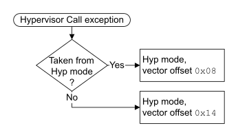

# ​G1.17.6 Hypervisor Call (HVC) exception

Source: <https://developer.arm.com/documentation/ddi0487/mc/-Part-G-The-AArch32-System-Level-Architecture/-Chapter-G1-The-AArch32-System-Level-Programmers--Model/-G1-17-AArch32-state-exception-descriptions/-G1-17-6-Hypervisor-Call--HVC--exception>

##### G1.17.6 Hypervisor Call (HVC) exception

The Hypervisor Call exception is implemented only as part of EL2.

The Hypervisor Call instruction, `HVC`, requests a hypervisor function. When EL2 is using AArch32, executing an `HVC` instruction generates a Hypervisor Call exception that is taken to Hyp mode. For more information, see [HVC](/documentation/ddi0487/mc/-Part-C-The-AArch64-Instruction-Set/-Chapter-C6-A64-Base-Instruction-Descriptions/-C6-2-Alphabetical-list-of-A64-base-instructions/-C6-2-175-HVC?lang=en#isa_hvc).

> #### Note
>
> - Execution of `HVC` instructions is disabled when the value of [SCR](/documentation/ddi0487/mc/-Part-K-Appendixes/-Appendix-K14-Registers-Index/-K14-1-Introduction-and-register-disambiguation/-K14-1-1-Register-name-disambiguation-by-Execution-state?lang=en#cegceecb).HCE is 0. Descriptions of `HVC` instruction execution elsewhere in this section assume the [Effective value](/documentation/ddi0487/mc/-Part-K-Appendixes/Glossary?lang=en#effective_value) of [SCR](/documentation/ddi0487/mc/-Part-K-Appendixes/-Appendix-K14-Registers-Index/-K14-1-Introduction-and-register-disambiguation/-K14-1-1-Register-name-disambiguation-by-Execution-state?lang=en#cegceecb).HCE is 1.
> - When EL2 is using AArch64 an `HVC` instruction executed in a Non-secure EL1 mode generates an exception that is taken to EL2 using AArch64.

The preferred return address for a Hypervisor Call exception is the address of the next instruction after the `HVC` instruction. The exception return is performed by an `ERET` instruction, using the [SPSR](/documentation/ddi0487/mc/-Part-G-The-AArch32-System-Level-Architecture/-Chapter-G1-The-AArch32-System-Level-Programmers--Model/-G1-10-AArch32-general-purpose-registers--the-PC--and-the-Special-purpose-registers/-G1-10-2-Saved-Program-Status-Registers--SPSRs-?lang=en#chddaabb) and [ELR\_hyp](/documentation/ddi0487/mc/-Part-G-The-AArch32-System-Level-Architecture/-Chapter-G1-The-AArch32-System-Level-Programmers--Model/-G1-10-AArch32-general-purpose-registers--the-PC--and-the-Special-purpose-registers/-G1-10-3-ELR-hyp?lang=en#beijhfcf) values generated by the exception entry.

For more information, see [Exception return to an Exception level using AArch32](/documentation/ddi0487/mc/-Part-G-The-AArch32-System-Level-Architecture/-Chapter-G1-The-AArch32-System-Level-Programmers--Model/-G1-15-Exception-return-to-an-Exception-level-using-AArch32?lang=en#cihbafec).

When EL2 is using AArch32, executing an `HVC` instruction transfers the immediate argument of the instruction to the [HSR](/documentation/ddi0487/mc/-Part-G-The-AArch32-System-Level-Architecture/-Chapter-G8-AArch32-System-Register-Descriptions/-G8-2-General-system-control-registers/-G8-2-74-HSR--Hyp-Syndrome-Register?lang=en#reg_aarch32_hsr). The exception handler retrieves the argument from the [HSR](/documentation/ddi0487/mc/-Part-G-The-AArch32-System-Level-Architecture/-Chapter-G8-AArch32-System-Register-Descriptions/-G8-2-General-system-control-registers/-G8-2-74-HSR--Hyp-Syndrome-Register?lang=en#reg_aarch32_hsr), and therefore does not have to access the original [HVC](/documentation/ddi0487/mc/-Part-C-The-AArch64-Instruction-Set/-Chapter-C6-A64-Base-Instruction-Descriptions/-C6-2-Alphabetical-list-of-A64-base-instructions/-C6-2-175-HVC?lang=en#isa_hvc) instruction. For more information, see [Use of the HSR](/documentation/ddi0487/mc/-Part-G-The-AArch32-System-Level-Architecture/-Chapter-G5-The-AArch32-Virtual-Memory-System-Architecture/-G5-12-Exception-reporting-in-a-VMSAv8-32-implementation/-G5-12-5-Reporting-exceptions-taken-to-Hyp-mode?lang=en#beidbeag).

###### G1.17.6.1 The PE mode to which the Hypervisor Call exception is taken

The Hypervisor Call exception is supported only as part of EL2. When EL2 is using AArch32, a Hypervisor Call exception is taken to Hyp mode, using a vector offset that depends on the mode from which the exception is taken, as [Figure G1-6](/documentation/ddi0487/mc/-Part-G-The-AArch32-System-Level-Architecture/-Chapter-G1-The-AArch32-System-Level-Programmers--Model/-G1-17-AArch32-state-exception-descriptions/-G1-17-6-Hypervisor-Call--HVC--exception?lang=en#fig_beijahdd) shows. This offset is from the Hyp exception base address.

Figure G1-6 The PE mode the Hypervisor Call exception is taken to in AArch32 state

###### G1.17.6.2 Pseudocode description of taking the Hypervisor Call exception

The [`AArch32_CallHypervisor`](/documentation/ddi0487/mc/-Part-J-Architectural-Pseudocode/-Chapter-J1-A-profile-Architecture-Pseudocode/-J1-3-Pseudocode-for-AArch32-operation/-J1-3-43-AArch32-CallHypervisor?lang=en#asl_func_aarch32_callhypervisor_1)`()` pseudocode procedure determines whether the valid execution of an `HVC` instruction in AArch32 state generates an exception that is taken to EL2 using AArch64, or generates a Hypervisor Call exception taken to Hyp mode.

The [`AArch32_TakeHVCException`](/documentation/ddi0487/mc/-Part-J-Architectural-Pseudocode/-Chapter-J1-A-profile-Architecture-Pseudocode/-J1-3-Pseudocode-for-AArch32-operation/-J1-3-45-AArch32-TakeHVCException?lang=en#asl_func_aarch32_takehvcexception_1)`()` pseudocode procedure describes how the PE takes a Hypervisor Call exception.
