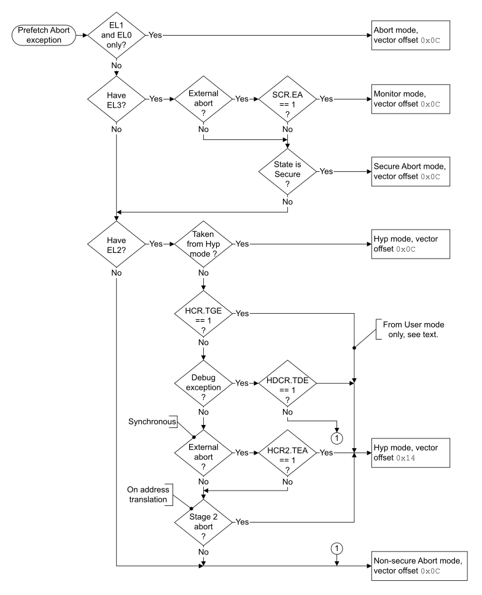

# ​G1.17.7 Prefetch Abort exception

Source: <https://developer.arm.com/documentation/ddi0487/mc/-Part-G-The-AArch32-System-Level-Architecture/-Chapter-G1-The-AArch32-System-Level-Programmers--Model/-G1-17-AArch32-state-exception-descriptions/-G1-17-7-Prefetch-Abort-exception>

##### G1.17.7 Prefetch Abort exception

A Prefetch Abort exception can be generated by:

- A synchronous memory abort on an instruction fetch.

  > #### Note
  >
  > Asynchronous External aborts on instruction fetches are reported as SError exceptions using the Data Abort exception, see [Data Abort exception](/documentation/ddi0487/mc/-Part-G-The-AArch32-System-Level-Architecture/-Chapter-G1-The-AArch32-System-Level-Programmers--Model/-G1-17-AArch32-state-exception-descriptions/-G1-17-8-Data-Abort-exception?lang=en#cihfjgjh).

  A Prefetch Abort exception entry is synchronous to the instruction whose fetch aborted.

  For more information about memory aborts see [VMSAv8-32 memory aborts](/documentation/ddi0487/mc/-Part-G-The-AArch32-System-Level-Architecture/-Chapter-G5-The-AArch32-Virtual-Memory-System-Architecture/-G5-11-VMSAv8-32-memory-aborts?lang=en#caccbjcj).
- A Breakpoint, Vector Catch or Breakpoint Instruction exception, see [AArch32 Self-hosted Debug](/documentation/ddi0487/mc/-Part-G-The-AArch32-System-Level-Architecture/-Chapter-G2-AArch32-Self-hosted-Debug?lang=en#g2bcgefacd).

> #### Note
>
> If an implementation fetches instructions speculatively, it must handle a synchronous abort on such an instruction fetch by:
>
> - Generating a Prefetch Abort exception only if the instruction would be executed in a simple sequential execution of the program.
> - Ignoring the abort if the instruction would not be executed in a simple sequential execution of the program.

By default, when EL1 is using AArch32, a Prefetch Abort exception is taken to Abort mode, but a Prefetch Abort exception can be taken to:

- EL2, meaning it is taken to Hyp mode if EL2 is using AArch32.
- EL3, meaning it is taken to Monitor mode if EL3 is using AArch32.

For more information:

- About cases where the Prefetch Abort exception is taken to an Exception level that is using AArch32, see [The PE mode to which the Prefetch Abort exception is taken](/documentation/ddi0487/mc/-Part-G-The-AArch32-System-Level-Architecture/-Chapter-G1-The-AArch32-System-Level-Programmers--Model/-G1-17-AArch32-state-exception-descriptions/-G1-17-7-Prefetch-Abort-exception?lang=en#beiifiee).
- About cases where the Prefetch Abort generates an exception that is taken to an Exception level that is using AArch64, see [Pseudocode description of taking the Prefetch Abort exception](/documentation/ddi0487/mc/-Part-G-The-AArch32-System-Level-Architecture/-Chapter-G1-The-AArch32-System-Level-Programmers--Model/-G1-17-AArch32-state-exception-descriptions/-G1-17-7-Prefetch-Abort-exception?lang=en#beigiebe).

The preferred return address for a Prefetch Abort exception is the address of the aborted instruction. For an exception taken to AArch32 state this return is performed as follows:

- If returning from a mode other than Hyp mode, using the [SPSR](/documentation/ddi0487/mc/-Part-G-The-AArch32-System-Level-Architecture/-Chapter-G1-The-AArch32-System-Level-Programmers--Model/-G1-10-AArch32-general-purpose-registers--the-PC--and-the-Special-purpose-registers/-G1-10-2-Saved-Program-Status-Registers--SPSRs-?lang=en#chddaabb) and LR values generated by the exception entry, using an exception return instruction with a subtraction of 4. This means using:

  - SPSR\_abt and LR\_abt if returning from Abort mode.
  - SPSR\_mon and LR\_mon if returning from Monitor mode.
- If returning from Hyp mode, using the [SPSR\_hyp](/documentation/ddi0487/mc/-Part-G-The-AArch32-System-Level-Architecture/-Chapter-G8-AArch32-System-Register-Descriptions/-G8-2-General-system-control-registers/-G8-2-131-SPSR-hyp--Saved-Program-Status-Register--Hyp-mode-?lang=en#reg_aarch32_spsr_hyp) and [ELR\_hyp](/documentation/ddi0487/mc/-Part-G-The-AArch32-System-Level-Architecture/-Chapter-G1-The-AArch32-System-Level-Programmers--Model/-G1-10-AArch32-general-purpose-registers--the-PC--and-the-Special-purpose-registers/-G1-10-3-ELR-hyp?lang=en#beijhfcf) values generated by the exception entry, using an `ERET` instruction.

For more information about the handling of Prefetch Abort exceptions in AArch32 state, see [Exception return to an Exception level using AArch32](/documentation/ddi0487/mc/-Part-G-The-AArch32-System-Level-Architecture/-Chapter-G1-The-AArch32-System-Level-Programmers--Model/-G1-15-Exception-return-to-an-Exception-level-using-AArch32?lang=en#cihbafec).

###### G1.17.7.1 Prefetch Abort exception reporting a PC alignment fault exception

A PC alignment fault exception that is taken to an Exception level that is using AArch32 is reported as a Prefetch Abort exception, and:

If the exception is taken to EL1 using AArch32 or EL3 using AArch32
:   - The IFSR indicates the cause of the exception:

      - If the value of [TTBCR](/documentation/ddi0487/mc/-Part-G-The-AArch32-System-Level-Architecture/-Chapter-G8-AArch32-System-Register-Descriptions/-G8-2-General-system-control-registers/-G8-2-165-TTBCR--Translation-Table-Base-Control-Register?lang=en#reg_aarch32_ttbcr).EAE is 0, [IFSR](/documentation/ddi0487/mc/-Part-G-The-AArch32-System-Level-Architecture/-Chapter-G8-AArch32-System-Register-Descriptions/-G8-2-General-system-control-registers/-G8-2-103-IFSR--Instruction-Fault-Status-Register?lang=en#reg_aarch32_ifsr).FS takes the value `0b00001`.
      - If the value of [TTBCR](/documentation/ddi0487/mc/-Part-G-The-AArch32-System-Level-Architecture/-Chapter-G8-AArch32-System-Register-Descriptions/-G8-2-General-system-control-registers/-G8-2-165-TTBCR--Translation-Table-Base-Control-Register?lang=en#reg_aarch32_ttbcr).EAE is 1, [IFSR](/documentation/ddi0487/mc/-Part-G-The-AArch32-System-Level-Architecture/-Chapter-G8-AArch32-System-Register-Descriptions/-G8-2-General-system-control-registers/-G8-2-103-IFSR--Instruction-Fault-Status-Register?lang=en#reg_aarch32_ifsr).STATUS takes the value `0b100001`.
    - [IFAR](/documentation/ddi0487/mc/-Part-G-The-AArch32-System-Level-Architecture/-Chapter-G8-AArch32-System-Register-Descriptions/-G8-2-General-system-control-registers/-G8-2-102-IFAR--Instruction-Fault-Address-Register?lang=en#reg_aarch32_ifar) holds the value of the address that faulted, including the misaligned low order bit or bits.
    - R14\_abt holds the address that faulted, including the misaligned low order bit or bits, with the standard offset for a Prefetch Abort exception.

If the exception is taken to EL2 using AArch32
:   - [HSR](/documentation/ddi0487/mc/-Part-G-The-AArch32-System-Level-Architecture/-Chapter-G8-AArch32-System-Register-Descriptions/-G8-2-General-system-control-registers/-G8-2-74-HSR--Hyp-Syndrome-Register?lang=en#reg_aarch32_hsr).EC takes the value `0b100010`.
    - [HSR](/documentation/ddi0487/mc/-Part-G-The-AArch32-System-Level-Architecture/-Chapter-G8-AArch32-System-Register-Descriptions/-G8-2-General-system-control-registers/-G8-2-74-HSR--Hyp-Syndrome-Register?lang=en#reg_aarch32_hsr).IL is UNKNOWN.
    - [HSR](/documentation/ddi0487/mc/-Part-G-The-AArch32-System-Level-Architecture/-Chapter-G8-AArch32-System-Register-Descriptions/-G8-2-General-system-control-registers/-G8-2-74-HSR--Hyp-Syndrome-Register?lang=en#reg_aarch32_hsr).ISS is RES0.
    - [HIFAR](/documentation/ddi0487/mc/-Part-G-The-AArch32-System-Level-Architecture/-Chapter-G8-AArch32-System-Register-Descriptions/-G8-2-General-system-control-registers/-G8-2-68-HIFAR--Hyp-Instruction-Fault-Address-Register?lang=en#reg_aarch32_hifar) and [ELR\_hyp](/documentation/ddi0487/mc/-Part-G-The-AArch32-System-Level-Architecture/-Chapter-G1-The-AArch32-System-Level-Programmers--Model/-G1-10-AArch32-general-purpose-registers--the-PC--and-the-Special-purpose-registers/-G1-10-3-ELR-hyp?lang=en#beijhfcf) each hold the value of the address that faulted, including the misaligned low order bit or bits.

For a PC alignment fault exception taken to an Exception level that is using AArch32:

- If the exception occurred because of the CONSTRAINED UNPREDICTABLE behavior of a branch to an unaligned PC value, as described in [Branching to an unaligned PC](/documentation/ddi0487/mc/-Part-K-Appendixes/-Appendix-K1-Architectural-Constraints-on-UNPREDICTABLE-Behaviors/-K1-1-AArch32-CONSTRAINED-UNPREDICTABLE-behaviors/-K1-1-5-Branching-to-an-unaligned-PC?lang=en#ceggjfid), then bit[0] of the faulting address is forced to zero, and therefore the misalignment is because the value of bit[1] of this address is 1.
- If the exception occurred on an exit from Debug state, as described in [Exiting Debug state](/documentation/ddi0487/mc/-Part-H-External-Debug/-Chapter-H2-Debug-State/-H2-5-Exiting-Debug-state?lang=en#babfiecg), then it is CONSTRAINED UNPREDICTABLE whether bit[0] of the faulting address is forced to zero.

###### G1.17.7.2 The PE mode to which the Prefetch Abort exception is taken

[Figure G1-7](/documentation/ddi0487/mc/-Part-G-The-AArch32-System-Level-Architecture/-Chapter-G1-The-AArch32-System-Level-Programmers--Model/-G1-17-AArch32-state-exception-descriptions/-G1-17-7-Prefetch-Abort-exception?lang=en#fig_beifeehd) shows how the implementation, state, and configuration options determine the PE mode to which a Prefetch Abort exception is taken, when the exception is taken to an Exception level that is using AArch32.

> #### Note
>
> In this figure, the [Effective value](/documentation/ddi0487/mc/-Part-K-Appendixes/Glossary?lang=en#effective_value) of [HCR2](/documentation/ddi0487/mc/-Part-G-The-AArch32-System-Level-Architecture/-Chapter-G8-AArch32-System-Register-Descriptions/-G8-2-General-system-control-registers/-G8-2-66-HCR2--Hyp-Configuration-Register-2?lang=en#reg_aarch32_hcr2).TEA is 0 if [FEAT\_RAS](/documentation/ddi0487/mc/-Part-A-Arm-Architecture-Introduction-and-Overview/-Chapter-A2-A-profile-Architecture-Extensions/-A2-2-Armv8-A-architecture-extensions/-A2-2-3-The-Armv8-2-architecture-extension?lang=en#feat_feat_ras) is not implemented.

Figure G1-7 The PE mode the Prefetch Abort exception is taken to in AArch32 state

See also [UNPREDICTABLE cases when the value of HCR.TGE is 1](/documentation/ddi0487/mc/-Part-G-The-AArch32-System-Level-Architecture/-Chapter-G1-The-AArch32-System-Level-Programmers--Model/-G1-13-Handling-exceptions-that-are-taken-to-an-Exception-level-using-AArch32/-G1-13-4-PE-mode-for-taking-exceptions?lang=en#chdhijjf).

###### G1.17.7.3 Pseudocode description of taking the Prefetch Abort exception

The [`AArch32_Abort`](/documentation/ddi0487/mc/-Part-J-Architectural-Pseudocode/-Chapter-J1-A-profile-Architecture-Pseudocode/-J1-3-Pseudocode-for-AArch32-operation/-J1-3-19-AArch32-Abort?lang=en#asl_func_aarch32_abort_1)`()` pseudocode function determines whether the Prefetch Abort condition generates an exception that is taken to an Exception level that is using AArch64, or generates a Prefetch Abort exception that is taken in AArch32 state. When the exception is taken in AArch32 state, the [`AArch32_TakePrefetchAbortException`](/documentation/ddi0487/mc/-Part-J-Architectural-Pseudocode/-Chapter-J1-A-profile-Architecture-Pseudocode/-J1-3-Pseudocode-for-AArch32-operation/-J1-3-26-AArch32-TakePrefetchAbortException?lang=en#asl_func_aarch32_takeprefetchabortexception_1)`()` pseudocode procedure describes how the PE takes the exception.

The exception is taken to an Exception level using AArch64 if one of the following applies:

- The exception is generated in User mode when EL1 is using AArch64.
- The implementation includes EL2, EL2 is using AArch64, and one of the following applies:

  - The value of [HCR\_EL2](/documentation/ddi0487/mc/-Part-D-The-AArch64-System-Level-Architecture/-Chapter-D24-AArch64-System-Register-Descriptions/-D24-2-General-system-control-registers/-D24-2-61-HCR-EL2--Hypervisor-Configuration-Register?lang=en#reg_aarch64_hcr_el2).TGE is 1 and the exception is generated in Non-secure User mode.
  - The value of [MDCR\_EL2](/documentation/ddi0487/mc/-Part-D-The-AArch64-System-Level-Architecture/-Chapter-D24-AArch64-System-Register-Descriptions/-D24-3-Debug-System-registers/-D24-3-17-MDCR-EL2--Monitor-Debug-Configuration-Register--EL2-?lang=en#reg_aarch64_mdcr_el2).TDE is 1 and the exception is generated by a Debug exception in a Non-secure EL1 or Non-secure EL0 mode.
  - The exception is generated by a stage 2 fault during a stage 1 translation table walk using the AArch32 Non-secure EL1&0 translation regime.
- The implementation includes EL3, EL3 is using AArch64, the value of [SCR\_EL3](/documentation/ddi0487/mc/-Part-D-The-AArch64-System-Level-Architecture/-Chapter-D24-AArch64-System-Register-Descriptions/-D24-2-General-system-control-registers/-D24-2-168-SCR-EL3--Secure-Configuration-Register?lang=en#reg_aarch64_scr_el3).EA is 1. and the exception is generated by an External abort in AArch32 state.
