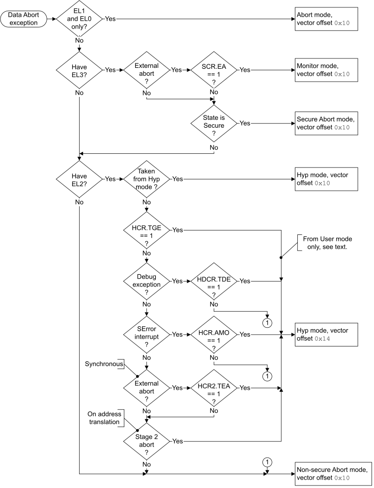

# ​G1.17.8 Data Abort exception

Source: <https://developer.arm.com/documentation/ddi0487/mc/-Part-G-The-AArch32-System-Level-Architecture/-Chapter-G1-The-AArch32-System-Level-Programmers--Model/-G1-17-AArch32-state-exception-descriptions/-G1-17-8-Data-Abort-exception>

##### G1.17.8 Data Abort exception

In AArch32 state, a Data Abort exception can be generated by:

- A synchronous abort on a data read or write memory access. Exception entry is synchronous to the instruction that generated the memory access.
- An SError exception. The SError exception might be caused by an External abort on a memory access, which can be any of:

  - A data read or write access.
  - An instruction fetch.
  - In a VMSA memory system, a translation table access.

  Exception entry occurs asynchronously.

  As described in [Asynchronous exception masking controls](/documentation/ddi0487/mc/-Part-G-The-AArch32-System-Level-Architecture/-Chapter-G1-The-AArch32-System-Level-Programmers--Model/-G1-16-Asynchronous-exception-behavior-for-exceptions-taken-from-AArch32-state/-G1-16-3-Asynchronous-exception-masking-controls?lang=en#cihdjfdc), SError exceptions can be masked. When this happens, a generated SError exception is not taken until it is not masked.
- A watchpoint, see [Watchpoint exceptions](/documentation/ddi0487/mc/-Part-G-The-AArch32-System-Level-Architecture/-Chapter-G2-AArch32-Self-hosted-Debug/-G2-9-Watchpoint-exceptions?lang=en#g3bcggecbj).

By default, when EL1 is using AArch32 a Data Abort exception is taken to Abort mode, but a Data Abort exception can be taken to:

- EL2, meaning it is taken to Hyp mode if EL2 is using AArch32.
- EL3, meaning it is taken to Monitor mode if EL3 is using AArch32.

For more information:

- About cases where the Data Abort exception is taken to an Exception level that is using AArch32, see [The PE mode to which the Data Abort exception is taken](/documentation/ddi0487/mc/-Part-G-The-AArch32-System-Level-Architecture/-Chapter-G1-The-AArch32-System-Level-Programmers--Model/-G1-17-AArch32-state-exception-descriptions/-G1-17-8-Data-Abort-exception?lang=en#beibcgcd).
- About memory aborts in AArch32 state, see [VMSAv8-32 memory aborts](/documentation/ddi0487/mc/-Part-G-The-AArch32-System-Level-Architecture/-Chapter-G5-The-AArch32-Virtual-Memory-System-Architecture/-G5-11-VMSAv8-32-memory-aborts?lang=en#caccbjcj).
- About cases where the Data Abort generates an exception that is taken to an Exception level that is using AArch64, see [Pseudocode description of taking the Data Abort exception](/documentation/ddi0487/mc/-Part-G-The-AArch32-System-Level-Architecture/-Chapter-G1-The-AArch32-System-Level-Programmers--Model/-G1-17-AArch32-state-exception-descriptions/-G1-17-8-Data-Abort-exception?lang=en#beibdcga).

The preferred return address for a Data Abort exception is the address of the instruction that generated the aborting memory access, or the address of the instruction following the instruction boundary at which an SError exception was taken. For an exception taken to AArch32 state, this return is performed as follows:

- If returning from a mode other than Hyp mode, using the [SPSR](/documentation/ddi0487/mc/-Part-G-The-AArch32-System-Level-Architecture/-Chapter-G1-The-AArch32-System-Level-Programmers--Model/-G1-10-AArch32-general-purpose-registers--the-PC--and-the-Special-purpose-registers/-G1-10-2-Saved-Program-Status-Registers--SPSRs-?lang=en#chddaabb) and LR values generated by the exception entry, using an exception return instruction with a subtraction of 8. This means using:

  - [SPSR](/documentation/ddi0487/mc/-Part-G-The-AArch32-System-Level-Architecture/-Chapter-G1-The-AArch32-System-Level-Programmers--Model/-G1-10-AArch32-general-purpose-registers--the-PC--and-the-Special-purpose-registers/-G1-10-2-Saved-Program-Status-Registers--SPSRs-?lang=en#chddaabb)\_abt and LR\_abt if returning from Abort mode.
  - [SPSR](/documentation/ddi0487/mc/-Part-G-The-AArch32-System-Level-Architecture/-Chapter-G1-The-AArch32-System-Level-Programmers--Model/-G1-10-AArch32-general-purpose-registers--the-PC--and-the-Special-purpose-registers/-G1-10-2-Saved-Program-Status-Registers--SPSRs-?lang=en#chddaabb)\_mon and LR\_mon if returning from Monitor mode.
- If returning from Hyp mode, using the SPSR\_hyp and [ELR\_hyp](/documentation/ddi0487/mc/-Part-G-The-AArch32-System-Level-Architecture/-Chapter-G1-The-AArch32-System-Level-Programmers--Model/-G1-10-AArch32-general-purpose-registers--the-PC--and-the-Special-purpose-registers/-G1-10-3-ELR-hyp?lang=en#beijhfcf) values generated by the exception entry, using an `ERET` instruction.

For more information about the handling of Data Abort exceptions in AArch32 state, see [Exception return to an Exception level using AArch32](/documentation/ddi0487/mc/-Part-G-The-AArch32-System-Level-Architecture/-Chapter-G1-The-AArch32-System-Level-Programmers--Model/-G1-15-Exception-return-to-an-Exception-level-using-AArch32?lang=en#cihbafec).

###### G1.17.8.1 The PE mode to which the Data Abort exception is taken

[Figure G1-8](/documentation/ddi0487/mc/-Part-G-The-AArch32-System-Level-Architecture/-Chapter-G1-The-AArch32-System-Level-Programmers--Model/-G1-17-AArch32-state-exception-descriptions/-G1-17-8-Data-Abort-exception?lang=en#fig_beihbaci) shows the determination of the mode to which a Data Abort exception is taken when the exception is taken to an Exception level that is using AArch32.

> #### Note
>
> In this figure, the [Effective value](/documentation/ddi0487/mc/-Part-K-Appendixes/Glossary?lang=en#effective_value) of [HCR2](/documentation/ddi0487/mc/-Part-G-The-AArch32-System-Level-Architecture/-Chapter-G8-AArch32-System-Register-Descriptions/-G8-2-General-system-control-registers/-G8-2-66-HCR2--Hyp-Configuration-Register-2?lang=en#reg_aarch32_hcr2).TEA is 0 if [FEAT\_RAS](/documentation/ddi0487/mc/-Part-A-Arm-Architecture-Introduction-and-Overview/-Chapter-A2-A-profile-Architecture-Extensions/-A2-2-Armv8-A-architecture-extensions/-A2-2-3-The-Armv8-2-architecture-extension?lang=en#feat_feat_ras) is not implemented.

Figure G1-8 The PE mode the Data Abort exception is taken to in AArch32 state

See also [UNPREDICTABLE cases when the value of HCR.TGE is 1](/documentation/ddi0487/mc/-Part-G-The-AArch32-System-Level-Architecture/-Chapter-G1-The-AArch32-System-Level-Programmers--Model/-G1-13-Handling-exceptions-that-are-taken-to-an-Exception-level-using-AArch32/-G1-13-4-PE-mode-for-taking-exceptions?lang=en#chdhijjf).

###### G1.17.8.2 Pseudocode description of taking the Data Abort exception

The [`AArch32_Abort`](/documentation/ddi0487/mc/-Part-J-Architectural-Pseudocode/-Chapter-J1-A-profile-Architecture-Pseudocode/-J1-3-Pseudocode-for-AArch32-operation/-J1-3-19-AArch32-Abort?lang=en#asl_func_aarch32_abort_1)`()` pseudocode function determines whether the Data Abort condition generates an exception that is taken to an Exception level that is using AArch64, or generates a Data Abort exception that is taken in AArch32 state. When the exception is taken in AArch32 state, the [`AArch32_TakeDataAbortException`](/documentation/ddi0487/mc/-Part-J-Architectural-Pseudocode/-Chapter-J1-A-profile-Architecture-Pseudocode/-J1-3-Pseudocode-for-AArch32-operation/-J1-3-25-AArch32-TakeDataAbortException?lang=en#asl_func_aarch32_takedataabortexception_1)`()` pseudocode procedure describes how the PE takes the exception.

The exception is taken to an Exception level using AArch64 if one of the following applies:

- The exception is generated in User mode when EL1 is using AArch64.
- The implementation includes EL2, EL2 is using AArch64, and one of the following applies:

  - The value of [HCR\_EL2](/documentation/ddi0487/mc/-Part-D-The-AArch64-System-Level-Architecture/-Chapter-D24-AArch64-System-Register-Descriptions/-D24-2-General-system-control-registers/-D24-2-61-HCR-EL2--Hypervisor-Configuration-Register?lang=en#reg_aarch64_hcr_el2).TGE is 1 and the exception is generated in Non-secure User mode.
  - The value of [MDCR\_EL2](/documentation/ddi0487/mc/-Part-D-The-AArch64-System-Level-Architecture/-Chapter-D24-AArch64-System-Register-Descriptions/-D24-3-Debug-System-registers/-D24-3-17-MDCR-EL2--Monitor-Debug-Configuration-Register--EL2-?lang=en#reg_aarch64_mdcr_el2).TDE is 1 and the exception is generated by a Debug exception in a Non-secure EL1 or Non-secure EL0 mode.
  - The exception is generated by a stage 2 fault during a stage 1 translation table walk using the AArch32 Non-secure EL1&0 translation regime.
- The implementation includes EL3, EL3 is using AArch64, the value of [SCR\_EL3](/documentation/ddi0487/mc/-Part-D-The-AArch64-System-Level-Architecture/-Chapter-D24-AArch64-System-Register-Descriptions/-D24-2-General-system-control-registers/-D24-2-168-SCR-EL3--Secure-Configuration-Register?lang=en#reg_aarch64_scr_el3).EA is 1. and the exception is generated by an External abort in AArch32 state.

###### G1.17.8.3 Effects of data-aborted instructions

An instruction that accesses data memory can modify memory by storing one or more values. If the execution of such an instruction generates a Data Abort exception, or causes Debug state entry because of a watchpoint set on the location, the value of each memory location that the instruction stores to is:

- Unchanged for any location for which one of the following applies:

  - An Alignment fault is generated.
  - An [MMU fault](/documentation/ddi0487/mc/-Part-G-The-AArch32-System-Level-Architecture/-Chapter-G5-The-AArch32-Virtual-Memory-System-Architecture/-G5-11-VMSAv8-32-memory-aborts?lang=en#aa32_mmu_fault) is generated.
  - A Watchpoint is generated.
  - An External abort is generated, if that External abort is taken synchronously.
- UNKNOWN for any location for which no exception and no debug event is generated.

If the access to a memory location generates an External abort that is taken asynchronously, it is outside the scope of the architecture to define the effect of the store on that memory location, because this depends on the system-specific nature of the External abort. However, in general, Arm recommends that such locations are unchanged.

For External aborts and Watchpoints, where in principle faulting could be identified at byte or halfword granularity, the size of a location in this definition is the size for which a memory access is single-copy atomic.

In AArch32 state, instructions that access data memory can modify registers in the following ways:

- By loading values into one or more of the general-purpose registers. The registers loaded can include the PC.
- By loading values into one or more of the registers in the Advanced SIMD and floating-point register file.
- By specifying *base register writeback*, in which the base register used in the address calculation has a modified value written to it. All instructions that support base register writeback have CONSTRAINED UNPREDICTABLE results if base register writeback is specified with the PC as the base register. Only general-purpose registers can be modified reliably in this way.
- By a direct transfer to or from the Debug Communication Channel (DCC) register, using the LDC and STC instructions. For more information, see [The Debug Communication Channel and Instruction Transfer Register](/documentation/ddi0487/mc/-Part-H-External-Debug/-Chapter-H4-The-Debug-Communication-Channel-and-Instruction-Transfer-Register?lang=en#babhhaae).

  If the instruction that accesses the DCC System registers is an LDC or STC instruction, UNKNOWN values are left in the Data Transfer Register and DCC flow-control flags.
- By modifying [PSTATE](/documentation/ddi0487/mc/-Part-G-The-AArch32-System-Level-Architecture/-Chapter-G1-The-AArch32-System-Level-Programmers--Model/-G1-11-Process-state--PSTATE?lang=en#chdedfdc).

If the execution of such an instruction generates a synchronous Data Abort exception, the following rules determine the values left in these registers:

- On entry to the Data Abort exception handler:

  - The PC value is the Data Abort vector address, see [Exception vectors and the exception base address](/documentation/ddi0487/mc/-Part-G-The-AArch32-System-Level-Architecture/-Chapter-G1-The-AArch32-System-Level-Programmers--Model/-G1-13-Handling-exceptions-that-are-taken-to-an-Exception-level-using-AArch32/-G1-13-1-Exception-vectors-and-the-exception-base-address?lang=en#cihfgbhd).
  - The LR\_abt value is determined from the address of the aborted instruction.

  Neither value is affected by the results of any load specified by the instruction.
- The base register is restored to its original value if either:

  - The aborted instruction is a load and the list of registers to be loaded includes the base register.
  - The base register is being written back.
- If the instruction only loads one general-purpose register the value in that register is unchanged.
- If the instruction loads more than one general-purpose register, UNKNOWN values are left in destination registers other than the PC and the base register of the instruction.
- If the instruction affects any registers in the Advanced SIMD and floating-point register file, UNKNOWN values are left in the registers that are affected.
- [PSTATE](/documentation/ddi0487/mc/-Part-G-The-AArch32-System-Level-Architecture/-Chapter-G1-The-AArch32-System-Level-Programmers--Model/-G1-11-Process-state--PSTATE?lang=en#chdedfdc) bits that are not defined as updated on exception entry retain their current value.
- If the instruction is a `STREX`, `STREXB`, `STREXH`, or `STREXD`, `<Rd>` is not updated.

After taking a Data Abort exception, the state of the Exclusives monitors is UNKNOWN. Therefore, Arm strongly recommends that the abort handler performs a `CLREX` instruction, or a dummy `STREX` instruction, to clear the Exclusives monitor state.

An External abort might signal a data corruption to the PE. For example, a memory location might have been corrupted. The error that caused the External abort might have been propagated. The RAS Extension provides mechanisms for software to determine the extent of the corruption and contain propagation of the error. For more information, see [RAS PE Architecture](/documentation/ddi0487/mc/-Part-D-The-AArch64-System-Level-Architecture/-Chapter-D20-RAS-PE-Architecture?lang=en#ras_pe_architecture).

###### G1.17.8.4 The Arm abort model

The abort model used by an Arm PE is described as a *Base Restored Abort Model*. This means that if a synchronous Data Abort exception is generated by executing an instruction that specifies base register writeback, the value in the base register is unchanged.

The abort model applies uniformly across all instructions.
