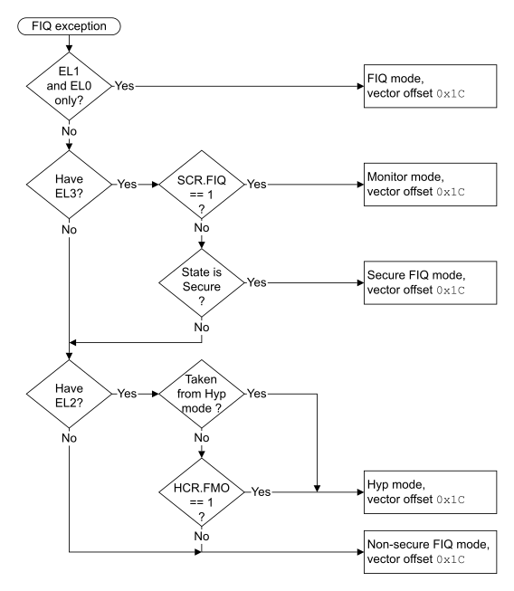

# ​G1.17.12 FIQ exception

Source: <https://developer.arm.com/documentation/ddi0487/mc/-Part-G-The-AArch32-System-Level-Architecture/-Chapter-G1-The-AArch32-System-Level-Programmers--Model/-G1-17-AArch32-state-exception-descriptions/-G1-17-12-FIQ-exception>

##### G1.17.12 FIQ exception

The FIQ exception is generated by IMPLEMENTATION DEFINED means. Typically this is by asserting an FIQ interrupt request input to the PE.

When an FIQ exception is taken, exception entry is precise to an instruction boundary.

As described in [Asynchronous exception masking controls](/documentation/ddi0487/mc/-Part-G-The-AArch32-System-Level-Architecture/-Chapter-G1-The-AArch32-System-Level-Programmers--Model/-G1-16-Asynchronous-exception-behavior-for-exceptions-taken-from-AArch32-state/-G1-16-3-Asynchronous-exception-masking-controls?lang=en#cihdjfdc), FIQ exceptions can be masked. When this happens, a generated FIQ exception is not taken until it is not masked.

By default, an FIQ exception is taken to FIQ mode, but an FIQ exception can be taken to:

- EL2, meaning it is taken to Hyp mode if EL2 is using AArch32.
- EL3, meaning it is taken to Monitor mode if EL3 is using AArch32.

For more information:

- About cases where the exception is taken to an Exception level using AArch32, see [The PE mode to which the physical FIQ exception is taken](/documentation/ddi0487/mc/-Part-G-The-AArch32-System-Level-Architecture/-Chapter-G1-The-AArch32-System-Level-Programmers--Model/-G1-17-AArch32-state-exception-descriptions/-G1-17-12-FIQ-exception?lang=en#beidbaic).
- About cases where the exception is taken to an Exception level using AArch64, see [Pseudocode description of taking the FIQ exception](/documentation/ddi0487/mc/-Part-G-The-AArch32-System-Level-Architecture/-Chapter-G1-The-AArch32-System-Level-Programmers--Model/-G1-17-AArch32-state-exception-descriptions/-G1-17-12-FIQ-exception?lang=en#beidffea).

The preferred return address for an FIQ exception is the address of the instruction following the instruction boundary at which the exception was taken. For an exception taken to AArch32 state this return is performed as follows:

- If returning from a mode other than Hyp mode, using the [SPSR](/documentation/ddi0487/mc/-Part-G-The-AArch32-System-Level-Architecture/-Chapter-G1-The-AArch32-System-Level-Programmers--Model/-G1-10-AArch32-general-purpose-registers--the-PC--and-the-Special-purpose-registers/-G1-10-2-Saved-Program-Status-Registers--SPSRs-?lang=en#chddaabb) and LR values generated by the exception entry, using an exception return instruction with a subtraction of 4. This means using:

  - [SPSR](/documentation/ddi0487/mc/-Part-G-The-AArch32-System-Level-Architecture/-Chapter-G1-The-AArch32-System-Level-Programmers--Model/-G1-10-AArch32-general-purpose-registers--the-PC--and-the-Special-purpose-registers/-G1-10-2-Saved-Program-Status-Registers--SPSRs-?lang=en#chddaabb)\_fiq and LR\_fiq if returning from FIQ mode.
  - [SPSR](/documentation/ddi0487/mc/-Part-G-The-AArch32-System-Level-Architecture/-Chapter-G1-The-AArch32-System-Level-Programmers--Model/-G1-10-AArch32-general-purpose-registers--the-PC--and-the-Special-purpose-registers/-G1-10-2-Saved-Program-Status-Registers--SPSRs-?lang=en#chddaabb)\_mon and LR\_mon if returning from Monitor mode.
- If returning from Hyp mode, using the [SPSR](/documentation/ddi0487/mc/-Part-G-The-AArch32-System-Level-Architecture/-Chapter-G1-The-AArch32-System-Level-Programmers--Model/-G1-10-AArch32-general-purpose-registers--the-PC--and-the-Special-purpose-registers/-G1-10-2-Saved-Program-Status-Registers--SPSRs-?lang=en#chddaabb)\_hyp and [ELR\_hyp](/documentation/ddi0487/mc/-Part-G-The-AArch32-System-Level-Architecture/-Chapter-G1-The-AArch32-System-Level-Programmers--Model/-G1-10-AArch32-general-purpose-registers--the-PC--and-the-Special-purpose-registers/-G1-10-3-ELR-hyp?lang=en#beijhfcf) values generated by the exception entry, using an `ERET` instruction.

For more information, see [Exception return to an Exception level using AArch32](/documentation/ddi0487/mc/-Part-G-The-AArch32-System-Level-Architecture/-Chapter-G1-The-AArch32-System-Level-Programmers--Model/-G1-15-Exception-return-to-an-Exception-level-using-AArch32?lang=en#cihbafec).

###### G1.17.12.1 The PE mode to which the physical FIQ exception is taken

[Figure G1-10](/documentation/ddi0487/mc/-Part-G-The-AArch32-System-Level-Architecture/-Chapter-G1-The-AArch32-System-Level-Programmers--Model/-G1-17-AArch32-state-exception-descriptions/-G1-17-12-FIQ-exception?lang=en#fig_fiq_exception_aarch32_state) shows how the implementation, state, and configuration options determine the PE mode to which an FIQ exception is taken when the exception is taken to an Exception level that is using AArch32.

Figure G1-10 The PE mode the FIQ exception is taken to in AArch32 state

###### G1.17.12.2 Pseudocode description of taking the FIQ exception

The [`AArch32_TakePhysicalFIQException`](/documentation/ddi0487/mc/-Part-J-Architectural-Pseudocode/-Chapter-J1-A-profile-Architecture-Pseudocode/-J1-3-Pseudocode-for-AArch32-operation/-J1-3-27-AArch32-TakePhysicalFIQException?lang=en#asl_func_aarch32_takephysicalfiqexception_0)`()` pseudocode procedure describes how the PE takes the exception.

This procedure includes the case where the exception is taken to an Exception level that is using AArch64. This happens if one of the following applies:

- The exception is taken from User mode and EL1 is using AArch64. The Exception is taken to EL1 using AArch64.
- The exception is taken from User mode, EL2 is implemented in the current Security state and using AArch64, and the value of [HCR\_EL2](/documentation/ddi0487/mc/-Part-D-The-AArch64-System-Level-Architecture/-Chapter-D24-AArch64-System-Register-Descriptions/-D24-2-General-system-control-registers/-D24-2-61-HCR-EL2--Hypervisor-Configuration-Register?lang=en#reg_aarch64_hcr_el2).TGE is 1. The Exception is taken to EL2 using AArch64.
- The exception is taken from an EL0 or EL1 mode, EL2 is implemented in the current Security state and using AArch64, and the value of [HCR\_EL2](/documentation/ddi0487/mc/-Part-D-The-AArch64-System-Level-Architecture/-Chapter-D24-AArch64-System-Register-Descriptions/-D24-2-General-system-control-registers/-D24-2-61-HCR-EL2--Hypervisor-Configuration-Register?lang=en#reg_aarch64_hcr_el2).FMO is 1. The Exception is taken to EL2 using AArch64.
- The exception is taken from a PE mode other than Monitor mode, EL3 is implemented and using AArch64, and the value of [SCR\_EL3](/documentation/ddi0487/mc/-Part-D-The-AArch64-System-Level-Architecture/-Chapter-D24-AArch64-System-Register-Descriptions/-D24-2-General-system-control-registers/-D24-2-168-SCR-EL3--Secure-Configuration-Register?lang=en#reg_aarch64_scr_el3).FIQ is 1. The Exception is taken to EL3 using AArch64.
