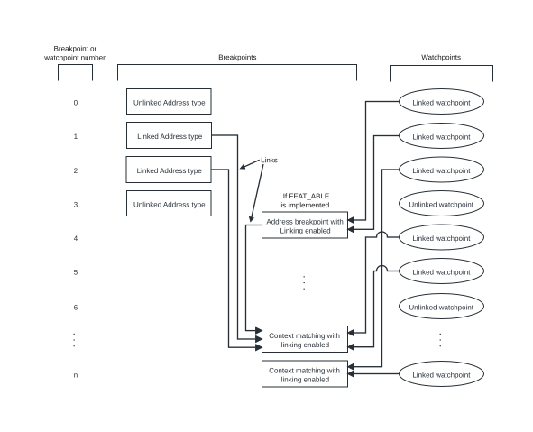

# ​G2.8.2 Breakpoint types and linking of breakpoints

Source: <https://developer.arm.com/documentation/ddi0487/mc/-Part-G-The-AArch32-System-Level-Architecture/-Chapter-G2-AArch32-Self-hosted-Debug/-G2-8-Breakpoint-exceptions/-G2-8-2-Breakpoint-types-and-linking-of-breakpoints>

##### G2.8.2 Breakpoint types and linking of breakpoints

Each implemented breakpoint is one of the following:

- A *context-aware* breakpoint. This is a breakpoint that can be programmed to generate a Breakpoint exception on any one of the following:

  - An instruction address match.
  - An instruction address mismatch.
  - A Context ID match, with the value held in the [CONTEXTIDR](/documentation/ddi0487/mc/-Part-G-The-AArch32-System-Level-Architecture/-Chapter-G8-AArch32-System-Register-Descriptions/-G8-2-General-system-control-registers/-G8-2-28-CONTEXTIDR--Context-ID-Register?lang=en#reg_aarch32_contextidr).
  - A VMID match, with the value held in the [VTTBR](/documentation/ddi0487/mc/-Part-G-The-AArch32-System-Level-Architecture/-Chapter-G8-AArch32-System-Register-Descriptions/-G8-2-General-system-control-registers/-G8-2-173-VTTBR--Virtualization-Translation-Table-Base-Register?lang=en#reg_aarch32_vttbr).
  - Both a Context ID match and a VMID match.
- A breakpoint that is not context-aware. These can only be programmed to generate a Breakpoint exception on an instruction address match or an instruction address mismatch.

[DBGDIDR](/documentation/ddi0487/mc/-Part-G-The-AArch32-System-Level-Architecture/-Chapter-G8-AArch32-System-Register-Descriptions/-G8-3-Debug-System-registers/-G8-3-11-DBGDIDR--Debug-ID-Register?lang=en#reg_aarch32_dbgdidr).CTX\_CMPs shows how many of the implemented breakpoints are context-aware breakpoints. At least one implemented breakpoint must be context-aware. The context-aware breakpoints are the highest numbered breakpoints.

Any breakpoint that is programmed to generate a Breakpoint exception on an instruction address match or mismatch is categorized as an *Address breakpoint*. Breakpoints that are programmed to match on anything else are categorized as *Context breakpoints*.

When a debugger programs a breakpoint to be an Address or a Context breakpoint, it must also program that breakpoint so that it is either:

- Used in isolation. In this case, the breakpoint is called an *Unlinked breakpoint*.
- Enabled for linking to another breakpoint. In this case, the breakpoint is called a *Linked breakpoint*.

By linking an Address breakpoint and a Context breakpoint together, the debugger can create a breakpoint pair that only generates a Breakpoint exception if the PE is in a particular context when an instruction address match or mismatch occurs. For example, a debugger might:

1. Program breakpoint number one to be a *Linked Address Match breakpoint*.
2. Program breakpoint number five to be a *Linked Context ID Match breakpoint*.
3. Link these two breakpoints together. A Breakpoint exception is only generated if both the instruction address matches and the Context ID matches.

The *Breakpoint Type* field for a breakpoint, [DBGBCR<n>](/documentation/ddi0487/mc/-Part-G-The-AArch32-System-Level-Architecture/-Chapter-G8-AArch32-System-Register-Descriptions/-G8-3-Debug-System-registers/-G8-3-2-DBGBCR-n---Debug-Breakpoint-Control-Registers--n---0---15?lang=en#reg_aarch32_dbgbcrn).BT, controls the breakpoint type and whether the breakpoint is enabled for linking. If BT[0] is 1, the breakpoint is enabled for linking.

Address breakpoints can be programmed to generate Breakpoint exceptions on addresses that are halfword-aligned but not word-aligned. This makes it possible to breakpoint on T32 instructions. See [Specifying the halfword-aligned address that an Address breakpoint matches on](/documentation/ddi0487/mc/-Part-G-The-AArch32-System-Level-Architecture/-Chapter-G2-AArch32-Self-hosted-Debug/-G2-8-Breakpoint-exceptions/-G2-8-4-Breakpoint-instruction-address-comparisons?lang=en#bgbecaed).

###### G2.8.2.1 Rules for linking breakpoints

The rules for breakpoint linking are as follows:

- Only Linked breakpoint types can be linked.
- Any type of Linked Address breakpoint can link to any type of Linked Context breakpoint. The *Linked Breakpoint Number* field, [DBGBCR<n>](/documentation/ddi0487/mc/-Part-G-The-AArch32-System-Level-Architecture/-Chapter-G8-AArch32-System-Register-Descriptions/-G8-3-Debug-System-registers/-G8-3-2-DBGBCR-n---Debug-Breakpoint-Control-Registers--n---0---15?lang=en#reg_aarch32_dbgbcrn).LBN, for the Linked Address breakpoint specifies the particular Linked Context breakpoint that the Linked Address breakpoint links to, and:

  - [DBGBCR<n>](/documentation/ddi0487/mc/-Part-G-The-AArch32-System-Level-Architecture/-Chapter-G8-AArch32-System-Register-Descriptions/-G8-3-Debug-System-registers/-G8-3-2-DBGBCR-n---Debug-Breakpoint-Control-Registers--n---0---15?lang=en#reg_aarch32_dbgbcrn).{SSC, HMC, PMC} for the Linked Address breakpoint define the execution conditions that the breakpoint pair generates Breakpoint exceptions for. See [Execution conditions for which a breakpoint generates Breakpoint exceptions](/documentation/ddi0487/mc/-Part-G-The-AArch32-System-Level-Architecture/-Chapter-G2-AArch32-Self-hosted-Debug/-G2-8-Breakpoint-exceptions/-G2-8-3-Execution-conditions-for-which-a-breakpoint-generates-Breakpoint-exceptions?lang=en#bgbighid).
  - [DBGBCR<n>](/documentation/ddi0487/mc/-Part-G-The-AArch32-System-Level-Architecture/-Chapter-G8-AArch32-System-Register-Descriptions/-G8-3-Debug-System-registers/-G8-3-2-DBGBCR-n---Debug-Breakpoint-Control-Registers--n---0---15?lang=en#reg_aarch32_dbgbcrn).{SSC, HMC, PMC} for the Linked Context breakpoint are ignored.
- Linked Context breakpoint types can only be linked to. The LBN field for Context breakpoints is therefore ignored.
- Linked Address breakpoints cannot link to watchpoints. The LBN field can therefore only specify another breakpoint.
- If a Linked Address breakpoint links to a breakpoint that is not context-aware, the behavior of the Linked Address breakpoint is CONSTRAINED UNPREDICTABLE. See [Other usage constraints for Address breakpoints](/documentation/ddi0487/mc/-Part-G-The-AArch32-System-Level-Architecture/-Chapter-G2-AArch32-Self-hosted-Debug/-G2-8-Breakpoint-exceptions/-G2-8-6-Using-breakpoints?lang=en#bgbgfhfd).
- If a Linked Address breakpoint links to an Unlinked Context breakpoint, the Linked Address breakpoint never generates any Breakpoint exceptions.
- Multiple Linked Address breakpoints can link to a single Linked Context breakpoint.

  > #### Note
  >
  > Multiple Linked watchpoints can also link to a single Linked Context breakpoint. [Watchpoint exceptions](/documentation/ddi0487/mc/-Part-G-The-AArch32-System-Level-Architecture/-Chapter-G2-AArch32-Self-hosted-Debug/-G2-9-Watchpoint-exceptions?lang=en#g3bcggecbj) describes watchpoints.

These rules mean that a single Linked Context breakpoint might be linked to by all, or any combination of, the following:

- Multiple Linked Address Match breakpoints.
- Multiple Linked Address Mismatch breakpoints.
- Multiple Linked watchpoints.

It is also possible that a Linked Context breakpoint might have no breakpoints or watchpoints linked to it.

[Figure G2-1](/documentation/ddi0487/mc/-Part-G-The-AArch32-System-Level-Architecture/-Chapter-G2-AArch32-Self-hosted-Debug/-G2-8-Breakpoint-exceptions/-G2-8-2-Breakpoint-types-and-linking-of-breakpoints?lang=en#fig_bgbjbeac) shows an example of permitted breakpoint and watchpoint linking.

Figure G2-1 The role of linking in Breakpoint and Watchpoint exception generation

In [Figure G2-1](/documentation/ddi0487/mc/-Part-G-The-AArch32-System-Level-Architecture/-Chapter-G2-AArch32-Self-hosted-Debug/-G2-8-Breakpoint-exceptions/-G2-8-2-Breakpoint-types-and-linking-of-breakpoints?lang=en#fig_bgbjbeac), each Linked Address breakpoint can only generate a Breakpoint exception if the comparisons made by both it, and the Linked Context breakpoint that it links to, are successful. Similarly, each Linked watchpoint can only generate a Watchpoint exception if the comparisons made by both it, and the Linked Context breakpoint that it links to, are successful.

###### G2.8.2.2 Breakpoint types defined by DBGBCRn.BT

The following list provides more detail about each breakpoint type:

`0b0000`, Unlinked Address Match breakpoint
:   Generation of a Breakpoint exception depends on both:

    - [DBGBCR<n>](/documentation/ddi0487/mc/-Part-G-The-AArch32-System-Level-Architecture/-Chapter-G8-AArch32-System-Register-Descriptions/-G8-3-Debug-System-registers/-G8-3-2-DBGBCR-n---Debug-Breakpoint-Control-Registers--n---0---15?lang=en#reg_aarch32_dbgbcrn).{SSC, HMC, PMC}. These define the execution conditions that the breakpoint generates Breakpoint exceptions for. See [Execution conditions for which a breakpoint generates Breakpoint exceptions](/documentation/ddi0487/mc/-Part-G-The-AArch32-System-Level-Architecture/-Chapter-G2-AArch32-Self-hosted-Debug/-G2-8-Breakpoint-exceptions/-G2-8-3-Execution-conditions-for-which-a-breakpoint-generates-Breakpoint-exceptions?lang=en#bgbighid).
    - A successful address match, as described in [Breakpoint instruction address comparisons](/documentation/ddi0487/mc/-Part-G-The-AArch32-System-Level-Architecture/-Chapter-G2-AArch32-Self-hosted-Debug/-G2-8-Breakpoint-exceptions/-G2-8-4-Breakpoint-instruction-address-comparisons?lang=en#cjadcfgd).

    [DBGBCR<n>](/documentation/ddi0487/mc/-Part-G-The-AArch32-System-Level-Architecture/-Chapter-G8-AArch32-System-Register-Descriptions/-G8-3-Debug-System-registers/-G8-3-2-DBGBCR-n---Debug-Breakpoint-Control-Registers--n---0---15?lang=en#reg_aarch32_dbgbcrn).{LBNX, LBN} for this breakpoint is ignored.

`0b0001`, Linked Address Match breakpoint
:   Generation of a Breakpoint exception depends on all of the following:

    - [DBGBCR<n>](/documentation/ddi0487/mc/-Part-G-The-AArch32-System-Level-Architecture/-Chapter-G8-AArch32-System-Register-Descriptions/-G8-3-Debug-System-registers/-G8-3-2-DBGBCR-n---Debug-Breakpoint-Control-Registers--n---0---15?lang=en#reg_aarch32_dbgbcrn).{SSC, HMC, PMC} for this breakpoint. These define the execution conditions that the breakpoint generates Breakpoint exceptions for. See [Execution conditions for which a breakpoint generates Breakpoint exceptions](/documentation/ddi0487/mc/-Part-G-The-AArch32-System-Level-Architecture/-Chapter-G2-AArch32-Self-hosted-Debug/-G2-8-Breakpoint-exceptions/-G2-8-3-Execution-conditions-for-which-a-breakpoint-generates-Breakpoint-exceptions?lang=en#bgbighid).
    - A successful address match defined by this breakpoint, as described in [Breakpoint instruction address comparisons](/documentation/ddi0487/mc/-Part-G-The-AArch32-System-Level-Architecture/-Chapter-G2-AArch32-Self-hosted-Debug/-G2-8-Breakpoint-exceptions/-G2-8-4-Breakpoint-instruction-address-comparisons?lang=en#cjadcfgd).
    - A successful context match defined by the Context breakpoint with linking enabled that this breakpoint links to.

    [DBGBCR<n>](/documentation/ddi0487/mc/-Part-G-The-AArch32-System-Level-Architecture/-Chapter-G8-AArch32-System-Register-Descriptions/-G8-3-Debug-System-registers/-G8-3-2-DBGBCR-n---Debug-Breakpoint-Control-Registers--n---0---15?lang=en#reg_aarch32_dbgbcrn).{LBNX, LBN} for this breakpoint selects the Context breakpoint with linking enabled that this breakpoint links to.

`0b0010`, Context ID Match breakpoint
:   BT == `0b0010` is a reserved value if the breakpoint is not a context-aware breakpoint.

    For context-aware breakpoints, generation of a Breakpoint exception depends on both:

    - [DBGBCR<n>](/documentation/ddi0487/mc/-Part-G-The-AArch32-System-Level-Architecture/-Chapter-G8-AArch32-System-Register-Descriptions/-G8-3-Debug-System-registers/-G8-3-2-DBGBCR-n---Debug-Breakpoint-Control-Registers--n---0---15?lang=en#reg_aarch32_dbgbcrn).{SSC, HMC, PMC}. These define the execution conditions that the breakpoint generates Breakpoint exceptions for. See [Execution conditions for which a breakpoint generates Breakpoint exceptions](/documentation/ddi0487/mc/-Part-G-The-AArch32-System-Level-Architecture/-Chapter-G2-AArch32-Self-hosted-Debug/-G2-8-Breakpoint-exceptions/-G2-8-3-Execution-conditions-for-which-a-breakpoint-generates-Breakpoint-exceptions?lang=en#bgbighid).
    - A successful Context ID match, as described in [Breakpoint context comparisons](/documentation/ddi0487/mc/-Part-G-The-AArch32-System-Level-Architecture/-Chapter-G2-AArch32-Self-hosted-Debug/-G2-8-Breakpoint-exceptions/-G2-8-5-Breakpoint-context-comparisons?lang=en#bgbjbhja).

    The value of [DBGBVR<n>](/documentation/ddi0487/mc/-Part-G-The-AArch32-System-Level-Architecture/-Chapter-G8-AArch32-System-Register-Descriptions/-G8-3-Debug-System-registers/-G8-3-3-DBGBVR-n---Debug-Breakpoint-Value-Registers--n---0---15?lang=en#reg_aarch32_dbgbvrn).ContextID is compared with the current Context ID.

    [CONTEXTIDR\_EL2](/documentation/ddi0487/mc/-Part-D-The-AArch64-System-Level-Architecture/-Chapter-D24-AArch64-System-Register-Descriptions/-D24-2-General-system-control-registers/-D24-2-34-CONTEXTIDR-EL2--Context-ID-Register--EL2-?lang=en#reg_aarch64_contextidr_el2) holds the current Context ID when all of:

    - The implementation includes [FEAT\_VHE](/documentation/ddi0487/mc/-Part-A-Arm-Architecture-Introduction-and-Overview/-Chapter-A2-A-profile-Architecture-Extensions/-A2-2-Armv8-A-architecture-extensions/-A2-2-2-The-Armv8-1-architecture-extension?lang=en#feat_feat_vhe).
    - EL2 is implemented and enabled in the current Security state.
    - EL2 using AArch64 and the [Effective value](/documentation/ddi0487/mc/-Part-K-Appendixes/Glossary?lang=en#effective_value) of [HCR\_EL2](/documentation/ddi0487/mc/-Part-D-The-AArch64-System-Level-Architecture/-Chapter-D24-AArch64-System-Register-Descriptions/-D24-2-General-system-control-registers/-D24-2-61-HCR-EL2--Hypervisor-Configuration-Register?lang=en#reg_aarch64_hcr_el2).E2H is 1.
    - The PE is executing at EL0 and [HCR\_EL2](/documentation/ddi0487/mc/-Part-D-The-AArch64-System-Level-Architecture/-Chapter-D24-AArch64-System-Register-Descriptions/-D24-2-General-system-control-registers/-D24-2-61-HCR-EL2--Hypervisor-Configuration-Register?lang=en#reg_aarch64_hcr_el2).TGE is 1, or the PE is executing at EL2.

    Otherwise, [CONTEXTIDR](/documentation/ddi0487/mc/-Part-G-The-AArch32-System-Level-Architecture/-Chapter-G8-AArch32-System-Register-Descriptions/-G8-2-General-system-control-registers/-G8-2-28-CONTEXTIDR--Context-ID-Register?lang=en#reg_aarch32_contextidr) holds the current Context ID.

    [DBGBCR<n>](/documentation/ddi0487/mc/-Part-G-The-AArch32-System-Level-Architecture/-Chapter-G8-AArch32-System-Register-Descriptions/-G8-3-Debug-System-registers/-G8-3-2-DBGBCR-n---Debug-Breakpoint-Control-Registers--n---0---15?lang=en#reg_aarch32_dbgbcrn).{LBNX, LBN, BAS} for this breakpoint are ignored

`0b0011`, Context ID Match breakpoint with linking enabled
:   BT == `0b0011` is a reserved value if the breakpoint is not a context-aware breakpoint.

    For context-aware breakpoints, either:

    - This breakpoint does not generate any debug exceptions, if no Linked breakpoints or Linked watchpoints link to it.
    - Generation of a Breakpoint exception depends on both:

      - A successful instruction address match, defined by a Linked Address breakpoint that links to this breakpoint, see [Breakpoint instruction address comparisons](/documentation/ddi0487/mc/-Part-G-The-AArch32-System-Level-Architecture/-Chapter-G2-AArch32-Self-hosted-Debug/-G2-8-Breakpoint-exceptions/-G2-8-4-Breakpoint-instruction-address-comparisons?lang=en#cjadcfgd).
      - A successful Context ID match defined by this breakpoint, as described in [Breakpoint context comparisons](/documentation/ddi0487/mc/-Part-G-The-AArch32-System-Level-Architecture/-Chapter-G2-AArch32-Self-hosted-Debug/-G2-8-Breakpoint-exceptions/-G2-8-5-Breakpoint-context-comparisons?lang=en#bgbjbhja).
    - Generation of a Watchpoint exception depends on both:

      - A successful data address match, defined by a Linked watchpoint that links to this breakpoint, see [Watchpoint data address comparisons](/documentation/ddi0487/mc/-Part-G-The-AArch32-System-Level-Architecture/-Chapter-G2-AArch32-Self-hosted-Debug/-G2-9-Watchpoint-exceptions/-G2-9-4-Watchpoint-data-address-comparisons?lang=en#g3bcgfghff).
      - A successful Context ID match defined by this breakpoint, as described in [Breakpoint context comparisons](/documentation/ddi0487/mc/-Part-G-The-AArch32-System-Level-Architecture/-Chapter-G2-AArch32-Self-hosted-Debug/-G2-8-Breakpoint-exceptions/-G2-8-5-Breakpoint-context-comparisons?lang=en#bgbjbhja).

    The value of [DBGBVR<n>](/documentation/ddi0487/mc/-Part-G-The-AArch32-System-Level-Architecture/-Chapter-G8-AArch32-System-Register-Descriptions/-G8-3-Debug-System-registers/-G8-3-3-DBGBVR-n---Debug-Breakpoint-Value-Registers--n---0---15?lang=en#reg_aarch32_dbgbvrn).ContextID is compared with the current Context ID.

    [CONTEXTIDR\_EL2](/documentation/ddi0487/mc/-Part-D-The-AArch64-System-Level-Architecture/-Chapter-D24-AArch64-System-Register-Descriptions/-D24-2-General-system-control-registers/-D24-2-34-CONTEXTIDR-EL2--Context-ID-Register--EL2-?lang=en#reg_aarch64_contextidr_el2) holds the current Context ID when all of:

    - The implementation includes [FEAT\_VHE](/documentation/ddi0487/mc/-Part-A-Arm-Architecture-Introduction-and-Overview/-Chapter-A2-A-profile-Architecture-Extensions/-A2-2-Armv8-A-architecture-extensions/-A2-2-2-The-Armv8-1-architecture-extension?lang=en#feat_feat_vhe).
    - EL2 is implemented and enabled in the current Security state.
    - EL2 using AArch64 and the [Effective value](/documentation/ddi0487/mc/-Part-K-Appendixes/Glossary?lang=en#effective_value) of [HCR\_EL2](/documentation/ddi0487/mc/-Part-D-The-AArch64-System-Level-Architecture/-Chapter-D24-AArch64-System-Register-Descriptions/-D24-2-General-system-control-registers/-D24-2-61-HCR-EL2--Hypervisor-Configuration-Register?lang=en#reg_aarch64_hcr_el2).E2H is 1.
    - The PE is executing at EL0 and [HCR\_EL2](/documentation/ddi0487/mc/-Part-D-The-AArch64-System-Level-Architecture/-Chapter-D24-AArch64-System-Register-Descriptions/-D24-2-General-system-control-registers/-D24-2-61-HCR-EL2--Hypervisor-Configuration-Register?lang=en#reg_aarch64_hcr_el2).TGE is 1, or the PE is executing at EL2.

    Otherwise, [CONTEXTIDR](/documentation/ddi0487/mc/-Part-G-The-AArch32-System-Level-Architecture/-Chapter-G8-AArch32-System-Register-Descriptions/-G8-2-General-system-control-registers/-G8-2-28-CONTEXTIDR--Context-ID-Register?lang=en#reg_aarch32_contextidr) holds the current Context ID.

    [DBGBCR<n>](/documentation/ddi0487/mc/-Part-G-The-AArch32-System-Level-Architecture/-Chapter-G8-AArch32-System-Register-Descriptions/-G8-3-Debug-System-registers/-G8-3-2-DBGBCR-n---Debug-Breakpoint-Control-Registers--n---0---15?lang=en#reg_aarch32_dbgbcrn).{LBNX, LBN, SSC, HMC, BAS PMC} for this breakpoint are ignored.

`0b0100`, Unlinked Address Mismatch breakpoint
:   Generation of a Breakpoint exception depends on both:

    - [DBGBCR<n>](/documentation/ddi0487/mc/-Part-G-The-AArch32-System-Level-Architecture/-Chapter-G8-AArch32-System-Register-Descriptions/-G8-3-Debug-System-registers/-G8-3-2-DBGBCR-n---Debug-Breakpoint-Control-Registers--n---0---15?lang=en#reg_aarch32_dbgbcrn).{SSC, HMC, PMC}. These define the execution conditions that the breakpoint generates Breakpoint exceptions for. See [Execution conditions for which a breakpoint generates Breakpoint exceptions](/documentation/ddi0487/mc/-Part-G-The-AArch32-System-Level-Architecture/-Chapter-G2-AArch32-Self-hosted-Debug/-G2-8-Breakpoint-exceptions/-G2-8-3-Execution-conditions-for-which-a-breakpoint-generates-Breakpoint-exceptions?lang=en#bgbighid).
    - A successful address mismatch, as described in [Breakpoint instruction address comparisons](/documentation/ddi0487/mc/-Part-G-The-AArch32-System-Level-Architecture/-Chapter-G2-AArch32-Self-hosted-Debug/-G2-8-Breakpoint-exceptions/-G2-8-4-Breakpoint-instruction-address-comparisons?lang=en#cjadcfgd).

    [DBGBCR<n>](/documentation/ddi0487/mc/-Part-G-The-AArch32-System-Level-Architecture/-Chapter-G8-AArch32-System-Register-Descriptions/-G8-3-Debug-System-registers/-G8-3-2-DBGBCR-n---Debug-Breakpoint-Control-Registers--n---0---15?lang=en#reg_aarch32_dbgbcrn).{LBNX, LBN} for this breakpoint is ignored.

`0b0101`, Linked Address Mismatch breakpoint
:   Generation of a Breakpoint exception depends on all of the following:

    - [DBGBCR<n>](/documentation/ddi0487/mc/-Part-G-The-AArch32-System-Level-Architecture/-Chapter-G8-AArch32-System-Register-Descriptions/-G8-3-Debug-System-registers/-G8-3-2-DBGBCR-n---Debug-Breakpoint-Control-Registers--n---0---15?lang=en#reg_aarch32_dbgbcrn).{SSC, HMC, PMC}. These define the execution conditions that the breakpoint generates Breakpoint exceptions for. See [Execution conditions for which a breakpoint generates Breakpoint exceptions](/documentation/ddi0487/mc/-Part-G-The-AArch32-System-Level-Architecture/-Chapter-G2-AArch32-Self-hosted-Debug/-G2-8-Breakpoint-exceptions/-G2-8-3-Execution-conditions-for-which-a-breakpoint-generates-Breakpoint-exceptions?lang=en#bgbighid).
    - A successful address mismatch defined by this breakpoint, as described in [Breakpoint instruction address comparisons](/documentation/ddi0487/mc/-Part-G-The-AArch32-System-Level-Architecture/-Chapter-G2-AArch32-Self-hosted-Debug/-G2-8-Breakpoint-exceptions/-G2-8-4-Breakpoint-instruction-address-comparisons?lang=en#cjadcfgd).
    - A successful context match defined by the Linked Context breakpoint that this breakpoint links to.

    [DBGBCR<n>](/documentation/ddi0487/mc/-Part-G-The-AArch32-System-Level-Architecture/-Chapter-G8-AArch32-System-Register-Descriptions/-G8-3-Debug-System-registers/-G8-3-2-DBGBCR-n---Debug-Breakpoint-Control-Registers--n---0---15?lang=en#reg_aarch32_dbgbcrn).{LBNX, LBN} for this breakpoint selects the Linked Context breakpoint that this breakpoint links to.

`0b0110`, CONTEXTIDR\_EL1 Match breakpoint
:   BT == `0b0110` is a reserved value if either:

    - The breakpoint is not a context-aware breakpoint.
    - The implementation does not include [FEAT\_VHE](/documentation/ddi0487/mc/-Part-A-Arm-Architecture-Introduction-and-Overview/-Chapter-A2-A-profile-Architecture-Extensions/-A2-2-Armv8-A-architecture-extensions/-A2-2-2-The-Armv8-1-architecture-extension?lang=en#feat_feat_vhe).

    For context-aware breakpoints, generation of a Breakpoint exception depends on both:

    - [DBGBCR<n>](/documentation/ddi0487/mc/-Part-G-The-AArch32-System-Level-Architecture/-Chapter-G8-AArch32-System-Register-Descriptions/-G8-3-Debug-System-registers/-G8-3-2-DBGBCR-n---Debug-Breakpoint-Control-Registers--n---0---15?lang=en#reg_aarch32_dbgbcrn).{SSC, HMC, PMC}. These define the execution conditions for which the breakpoint generates Breakpoint exceptions.
    - A successful Context ID match defined by this breakpoint, as described in [Breakpoint context comparisons](/documentation/ddi0487/mc/-Part-G-The-AArch32-System-Level-Architecture/-Chapter-G2-AArch32-Self-hosted-Debug/-G2-8-Breakpoint-exceptions/-G2-8-5-Breakpoint-context-comparisons?lang=en#bgbjbhja).

    The Context ID check is made against the value in [CONTEXTIDR](/documentation/ddi0487/mc/-Part-G-The-AArch32-System-Level-Architecture/-Chapter-G8-AArch32-System-Register-Descriptions/-G8-2-General-system-control-registers/-G8-2-28-CONTEXTIDR--Context-ID-Register?lang=en#reg_aarch32_contextidr), or [CONTEXTIDR\_EL1](/documentation/ddi0487/mc/-Part-D-The-AArch64-System-Level-Architecture/-Chapter-D24-AArch64-System-Register-Descriptions/-D24-2-General-system-control-registers/-D24-2-33-CONTEXTIDR-EL1--Context-ID-Register--EL1-?lang=en#reg_aarch64_contextidr_el1). The value of [DBGBVR<n>](/documentation/ddi0487/mc/-Part-G-The-AArch32-System-Level-Architecture/-Chapter-G8-AArch32-System-Register-Descriptions/-G8-3-Debug-System-registers/-G8-3-3-DBGBVR-n---Debug-Breakpoint-Value-Registers--n---0---15?lang=en#reg_aarch32_dbgbvrn).ContextID is compared with the Context ID value held in [CONTEXTIDR](/documentation/ddi0487/mc/-Part-G-The-AArch32-System-Level-Architecture/-Chapter-G8-AArch32-System-Register-Descriptions/-G8-2-General-system-control-registers/-G8-2-28-CONTEXTIDR--Context-ID-Register?lang=en#reg_aarch32_contextidr) or [CONTEXTIDR\_EL1](/documentation/ddi0487/mc/-Part-D-The-AArch64-System-Level-Architecture/-Chapter-D24-AArch64-System-Register-Descriptions/-D24-2-General-system-control-registers/-D24-2-33-CONTEXTIDR-EL1--Context-ID-Register--EL1-?lang=en#reg_aarch64_contextidr_el1).

    [DBGBCR<n>](/documentation/ddi0487/mc/-Part-G-The-AArch32-System-Level-Architecture/-Chapter-G8-AArch32-System-Register-Descriptions/-G8-3-Debug-System-registers/-G8-3-2-DBGBCR-n---Debug-Breakpoint-Control-Registers--n---0---15?lang=en#reg_aarch32_dbgbcrn).{LBNX, LBN, BAS} for this breakpoint are ignored.

`0b0111`, CONTEXTIDR\_EL1 Match breakpoint with linking enabled
:   BT == `0b0111` is a reserved value if either:

    - The breakpoint is not a context-aware breakpoint.
    - The implementation does not include [FEAT\_VHE](/documentation/ddi0487/mc/-Part-A-Arm-Architecture-Introduction-and-Overview/-Chapter-A2-A-profile-Architecture-Extensions/-A2-2-Armv8-A-architecture-extensions/-A2-2-2-The-Armv8-1-architecture-extension?lang=en#feat_feat_vhe).

    For context-aware breakpoints, one of the following applies:

    - If no Linked breakpoints or Linked watchpoints link to this breakpoint, then the breakpoint does not generate any debug exceptions.
    - Generation of a Breakpoint exception depends on both:

      - A successful instruction address match, defined by a Linked Address match breakpoint that links to this breakpoint, see [Breakpoint instruction address comparisons](/documentation/ddi0487/mc/-Part-G-The-AArch32-System-Level-Architecture/-Chapter-G2-AArch32-Self-hosted-Debug/-G2-8-Breakpoint-exceptions/-G2-8-4-Breakpoint-instruction-address-comparisons?lang=en#cjadcfgd).
      - A successful Context ID match defined by this breakpoint, as described in [Breakpoint context comparisons](/documentation/ddi0487/mc/-Part-G-The-AArch32-System-Level-Architecture/-Chapter-G2-AArch32-Self-hosted-Debug/-G2-8-Breakpoint-exceptions/-G2-8-5-Breakpoint-context-comparisons?lang=en#bgbjbhja).
    - Generation of a Watchpoint exception depends on both:

      - A successful data address match, defined by a Linked watchpoint that links to this breakpoint, see [Watchpoint data address comparisons](/documentation/ddi0487/mc/-Part-G-The-AArch32-System-Level-Architecture/-Chapter-G2-AArch32-Self-hosted-Debug/-G2-9-Watchpoint-exceptions/-G2-9-4-Watchpoint-data-address-comparisons?lang=en#g3bcgfghff).
      - A successful Context ID match defined by this breakpoint, as described in [Breakpoint context comparisons](/documentation/ddi0487/mc/-Part-G-The-AArch32-System-Level-Architecture/-Chapter-G2-AArch32-Self-hosted-Debug/-G2-8-Breakpoint-exceptions/-G2-8-5-Breakpoint-context-comparisons?lang=en#bgbjbhja).

    The Context ID check is made against the value in [CONTEXTIDR](/documentation/ddi0487/mc/-Part-G-The-AArch32-System-Level-Architecture/-Chapter-G8-AArch32-System-Register-Descriptions/-G8-2-General-system-control-registers/-G8-2-28-CONTEXTIDR--Context-ID-Register?lang=en#reg_aarch32_contextidr), or [CONTEXTIDR\_EL1](/documentation/ddi0487/mc/-Part-D-The-AArch64-System-Level-Architecture/-Chapter-D24-AArch64-System-Register-Descriptions/-D24-2-General-system-control-registers/-D24-2-33-CONTEXTIDR-EL1--Context-ID-Register--EL1-?lang=en#reg_aarch64_contextidr_el1). The value of [DBGBVR<n>](/documentation/ddi0487/mc/-Part-G-The-AArch32-System-Level-Architecture/-Chapter-G8-AArch32-System-Register-Descriptions/-G8-3-Debug-System-registers/-G8-3-3-DBGBVR-n---Debug-Breakpoint-Value-Registers--n---0---15?lang=en#reg_aarch32_dbgbvrn).ContextID is compared with the Context ID value held in [CONTEXTIDR](/documentation/ddi0487/mc/-Part-G-The-AArch32-System-Level-Architecture/-Chapter-G8-AArch32-System-Register-Descriptions/-G8-2-General-system-control-registers/-G8-2-28-CONTEXTIDR--Context-ID-Register?lang=en#reg_aarch32_contextidr) or [CONTEXTIDR\_EL1](/documentation/ddi0487/mc/-Part-D-The-AArch64-System-Level-Architecture/-Chapter-D24-AArch64-System-Register-Descriptions/-D24-2-General-system-control-registers/-D24-2-33-CONTEXTIDR-EL1--Context-ID-Register--EL1-?lang=en#reg_aarch64_contextidr_el1).

    [DBGBCR<n>](/documentation/ddi0487/mc/-Part-G-The-AArch32-System-Level-Architecture/-Chapter-G8-AArch32-System-Register-Descriptions/-G8-3-Debug-System-registers/-G8-3-2-DBGBCR-n---Debug-Breakpoint-Control-Registers--n---0---15?lang=en#reg_aarch32_dbgbcrn).{LBNX, LBN, SSC, HMC, BAS, PMC} for this breakpoint are ignored.

`0b1000`, VMID Match breakpoint
:   BT == `0b1000` is a reserved value if either:

    - The breakpoint is not a context-aware breakpoint.
    - EL2 is not implemented.

    For context-aware breakpoints, generation of a Breakpoint exception depends on both:

    - [DBGBCR<n>](/documentation/ddi0487/mc/-Part-G-The-AArch32-System-Level-Architecture/-Chapter-G8-AArch32-System-Register-Descriptions/-G8-3-Debug-System-registers/-G8-3-2-DBGBCR-n---Debug-Breakpoint-Control-Registers--n---0---15?lang=en#reg_aarch32_dbgbcrn).{SSC, HMC, PMC}. These define the execution conditions that the breakpoint generates Breakpoint exceptions for. See [Execution conditions for which a breakpoint generates Breakpoint exceptions](/documentation/ddi0487/mc/-Part-G-The-AArch32-System-Level-Architecture/-Chapter-G2-AArch32-Self-hosted-Debug/-G2-8-Breakpoint-exceptions/-G2-8-3-Execution-conditions-for-which-a-breakpoint-generates-Breakpoint-exceptions?lang=en#bgbighid).
    - A successful VMID match, as described in [Breakpoint context comparisons](/documentation/ddi0487/mc/-Part-G-The-AArch32-System-Level-Architecture/-Chapter-G2-AArch32-Self-hosted-Debug/-G2-8-Breakpoint-exceptions/-G2-8-5-Breakpoint-context-comparisons?lang=en#bgbjbhja).

    [DBGBCR<n>](/documentation/ddi0487/mc/-Part-G-The-AArch32-System-Level-Architecture/-Chapter-G8-AArch32-System-Register-Descriptions/-G8-3-Debug-System-registers/-G8-3-2-DBGBCR-n---Debug-Breakpoint-Control-Registers--n---0---15?lang=en#reg_aarch32_dbgbcrn).{LBNX, LBN, BAS} for this breakpoint are ignored.

`0b1001`, VMID Match breakpoint with linking enabled
:   BT == `0b1000` is a reserved value if either:

    - The breakpoint is not a context-matching breakpoint.
    - EL2 is not implemented.

    For context-aware breakpoints, either:

    - This breakpoint does not generate any debug exceptions, if no Linked breakpoints or Linked watchpoints link to it.
    - Generation of a Breakpoint exception depends on both:

      - A successful instruction address match, defined by a Linked Address Match breakpoint that links to this breakpoint. See [Breakpoint instruction address comparisons](/documentation/ddi0487/mc/-Part-G-The-AArch32-System-Level-Architecture/-Chapter-G2-AArch32-Self-hosted-Debug/-G2-8-Breakpoint-exceptions/-G2-8-4-Breakpoint-instruction-address-comparisons?lang=en#cjadcfgd).
      - A successful VMID match defined by this breakpoint.
    - Generation of a Watchpoint exception depends on both:

      - A successful data address match, defined by a Linked watchpoint that links to this breakpoint, see [Watchpoint data address comparisons](/documentation/ddi0487/mc/-Part-G-The-AArch32-System-Level-Architecture/-Chapter-G2-AArch32-Self-hosted-Debug/-G2-9-Watchpoint-exceptions/-G2-9-4-Watchpoint-data-address-comparisons?lang=en#g3bcgfghff).
      - A successful VMID match defined by this breakpoint, as described in [Breakpoint context comparisons](/documentation/ddi0487/mc/-Part-G-The-AArch32-System-Level-Architecture/-Chapter-G2-AArch32-Self-hosted-Debug/-G2-8-Breakpoint-exceptions/-G2-8-5-Breakpoint-context-comparisons?lang=en#bgbjbhja).

    [DBGBCR<n>](/documentation/ddi0487/mc/-Part-G-The-AArch32-System-Level-Architecture/-Chapter-G8-AArch32-System-Register-Descriptions/-G8-3-Debug-System-registers/-G8-3-2-DBGBCR-n---Debug-Breakpoint-Control-Registers--n---0---15?lang=en#reg_aarch32_dbgbcrn).{LBNX, LBN, SSC, HMC, BAS, PMC} for this breakpoint are ignored.

`0b1010`, Context ID and VMID Match breakpoint
:   BT == `0b1010` is a reserved value if either:

    - The breakpoint is not a context-matching breakpoint.
    - EL2 is not implemented.

    For context-matching breakpoints, generation of a Breakpoint exception depends on all of the following:

    - [DBGBCR<n>](/documentation/ddi0487/mc/-Part-G-The-AArch32-System-Level-Architecture/-Chapter-G8-AArch32-System-Register-Descriptions/-G8-3-Debug-System-registers/-G8-3-2-DBGBCR-n---Debug-Breakpoint-Control-Registers--n---0---15?lang=en#reg_aarch32_dbgbcrn).{SSC, HMC, PMC}. These define the execution conditions that the breakpoint generates Breakpoint exceptions for. See [Execution conditions for which a breakpoint generates Breakpoint exceptions](/documentation/ddi0487/mc/-Part-G-The-AArch32-System-Level-Architecture/-Chapter-G2-AArch32-Self-hosted-Debug/-G2-8-Breakpoint-exceptions/-G2-8-3-Execution-conditions-for-which-a-breakpoint-generates-Breakpoint-exceptions?lang=en#bgbighid).
    - A successful Context ID match, as described in [Breakpoint context comparisons](/documentation/ddi0487/mc/-Part-G-The-AArch32-System-Level-Architecture/-Chapter-G2-AArch32-Self-hosted-Debug/-G2-8-Breakpoint-exceptions/-G2-8-5-Breakpoint-context-comparisons?lang=en#bgbjbhja).
    - A successful VMID match.

    The value of [DBGBVR<n>](/documentation/ddi0487/mc/-Part-G-The-AArch32-System-Level-Architecture/-Chapter-G8-AArch32-System-Register-Descriptions/-G8-3-Debug-System-registers/-G8-3-3-DBGBVR-n---Debug-Breakpoint-Value-Registers--n---0---15?lang=en#reg_aarch32_dbgbvrn).ContextID is compared with [CONTEXTIDR](/documentation/ddi0487/mc/-Part-G-The-AArch32-System-Level-Architecture/-Chapter-G8-AArch32-System-Register-Descriptions/-G8-2-General-system-control-registers/-G8-2-28-CONTEXTIDR--Context-ID-Register?lang=en#reg_aarch32_contextidr).

    [Breakpoint context comparisons](/documentation/ddi0487/mc/-Part-G-The-AArch32-System-Level-Architecture/-Chapter-G2-AArch32-Self-hosted-Debug/-G2-8-Breakpoint-exceptions/-G2-8-5-Breakpoint-context-comparisons?lang=en#bgbjbhja) describes the requirements for a successful Context ID match and a successful VMID match.

    [DBGBCR<n>](/documentation/ddi0487/mc/-Part-G-The-AArch32-System-Level-Architecture/-Chapter-G8-AArch32-System-Register-Descriptions/-G8-3-Debug-System-registers/-G8-3-2-DBGBCR-n---Debug-Breakpoint-Control-Registers--n---0---15?lang=en#reg_aarch32_dbgbcrn).{LBNX, LBN, BAS} for this breakpoint are ignored.

`0b1011`, Context ID and VMID Match breakpoint with linking enabled
:   BT == `0b1011` is a reserved value if either:

    - The breakpoint is not a context-matching breakpoint.
    - EL2 is not implemented.

    For context-matching breakpoints, either:

    - This breakpoint does not generate any debug exceptions, if no Linked breakpoints or Linked watchpoints link to it.
    - Generation of a Breakpoint exception depends on all of the following:

      - A successful instruction address match, defined by a Linked Address breakpoint that links to this breakpoint, see [Breakpoint instruction address comparisons](/documentation/ddi0487/mc/-Part-G-The-AArch32-System-Level-Architecture/-Chapter-G2-AArch32-Self-hosted-Debug/-G2-8-Breakpoint-exceptions/-G2-8-4-Breakpoint-instruction-address-comparisons?lang=en#cjadcfgd).
      - A successful Context ID match defined by this breakpoint, as described in [Breakpoint context comparisons](/documentation/ddi0487/mc/-Part-G-The-AArch32-System-Level-Architecture/-Chapter-G2-AArch32-Self-hosted-Debug/-G2-8-Breakpoint-exceptions/-G2-8-5-Breakpoint-context-comparisons?lang=en#bgbjbhja).
      - A successful VMID match defined by this breakpoint.
    - Generation of a Watchpoint exception depends on all of the following:

      - A successful data address match, defined by a Linked watchpoint that links to this breakpoint, see [Watchpoint data address comparisons](/documentation/ddi0487/mc/-Part-G-The-AArch32-System-Level-Architecture/-Chapter-G2-AArch32-Self-hosted-Debug/-G2-9-Watchpoint-exceptions/-G2-9-4-Watchpoint-data-address-comparisons?lang=en#g3bcgfghff).
      - A successful Context ID match defined by this breakpoint, as described in [Breakpoint context comparisons](/documentation/ddi0487/mc/-Part-G-The-AArch32-System-Level-Architecture/-Chapter-G2-AArch32-Self-hosted-Debug/-G2-8-Breakpoint-exceptions/-G2-8-5-Breakpoint-context-comparisons?lang=en#bgbjbhja).
      - A successful VMID match defined by this breakpoint.

    The value of [DBGBVR<n>](/documentation/ddi0487/mc/-Part-G-The-AArch32-System-Level-Architecture/-Chapter-G8-AArch32-System-Register-Descriptions/-G8-3-Debug-System-registers/-G8-3-3-DBGBVR-n---Debug-Breakpoint-Value-Registers--n---0---15?lang=en#reg_aarch32_dbgbvrn).ContextID is compared with [CONTEXTIDR](/documentation/ddi0487/mc/-Part-G-The-AArch32-System-Level-Architecture/-Chapter-G8-AArch32-System-Register-Descriptions/-G8-2-General-system-control-registers/-G8-2-28-CONTEXTIDR--Context-ID-Register?lang=en#reg_aarch32_contextidr).

    [Breakpoint context comparisons](/documentation/ddi0487/mc/-Part-G-The-AArch32-System-Level-Architecture/-Chapter-G2-AArch32-Self-hosted-Debug/-G2-8-Breakpoint-exceptions/-G2-8-5-Breakpoint-context-comparisons?lang=en#bgbjbhja) describes the requirements for a successful Context ID match and a successful VMID match by this breakpoint.

    [DBGBCR<n>](/documentation/ddi0487/mc/-Part-G-The-AArch32-System-Level-Architecture/-Chapter-G8-AArch32-System-Register-Descriptions/-G8-3-Debug-System-registers/-G8-3-2-DBGBCR-n---Debug-Breakpoint-Control-Registers--n---0---15?lang=en#reg_aarch32_dbgbcrn).{LBNX, LBN, SSC, HMC, BAS, PMC} for this breakpoint are ignored.

`0b1100`, CONTEXTIDR\_EL2 Match breakpoint
:   BT == `0b1100` is a reserved value if:

    - The breakpoint is not a context-aware breakpoint.
    - [FEAT\_VHE](/documentation/ddi0487/mc/-Part-A-Arm-Architecture-Introduction-and-Overview/-Chapter-A2-A-profile-Architecture-Extensions/-A2-2-Armv8-A-architecture-extensions/-A2-2-2-The-Armv8-1-architecture-extension?lang=en#feat_feat_vhe) is not implemented and [FEAT\_Debugv8p2](/documentation/ddi0487/mc/-Part-A-Arm-Architecture-Introduction-and-Overview/-Chapter-A2-A-profile-Architecture-Extensions/-A2-2-Armv8-A-architecture-extensions/-A2-2-3-The-Armv8-2-architecture-extension?lang=en#feat_feat_debugv8p2) is not implemented, which means the implementation does not include [CONTEXTIDR\_EL2](/documentation/ddi0487/mc/-Part-D-The-AArch64-System-Level-Architecture/-Chapter-D24-AArch64-System-Register-Descriptions/-D24-2-General-system-control-registers/-D24-2-34-CONTEXTIDR-EL2--Context-ID-Register--EL2-?lang=en#reg_aarch64_contextidr_el2).
    - EL2 is not implemented.

    For context-aware breakpoints, generation of a Breakpoint exception depends on both:

    - [DBGBCR<n>](/documentation/ddi0487/mc/-Part-G-The-AArch32-System-Level-Architecture/-Chapter-G8-AArch32-System-Register-Descriptions/-G8-3-Debug-System-registers/-G8-3-2-DBGBCR-n---Debug-Breakpoint-Control-Registers--n---0---15?lang=en#reg_aarch32_dbgbcrn).{SSC, HMC, PMC}. These define the execution conditions for which the breakpoint generates Breakpoint exceptions.
    - A successful [CONTEXTIDR\_EL2](/documentation/ddi0487/mc/-Part-D-The-AArch64-System-Level-Architecture/-Chapter-D24-AArch64-System-Register-Descriptions/-D24-2-General-system-control-registers/-D24-2-34-CONTEXTIDR-EL2--Context-ID-Register--EL2-?lang=en#reg_aarch64_contextidr_el2) match. The value of [DBGBVR<n>](/documentation/ddi0487/mc/-Part-G-The-AArch32-System-Level-Architecture/-Chapter-G8-AArch32-System-Register-Descriptions/-G8-3-Debug-System-registers/-G8-3-3-DBGBVR-n---Debug-Breakpoint-Value-Registers--n---0---15?lang=en#reg_aarch32_dbgbvrn).ContextID2 is compared with the Context ID value held in [CONTEXTIDR\_EL2](/documentation/ddi0487/mc/-Part-D-The-AArch64-System-Level-Architecture/-Chapter-D24-AArch64-System-Register-Descriptions/-D24-2-General-system-control-registers/-D24-2-34-CONTEXTIDR-EL2--Context-ID-Register--EL2-?lang=en#reg_aarch64_contextidr_el2), as described in [Breakpoint context comparisons](/documentation/ddi0487/mc/-Part-G-The-AArch32-System-Level-Architecture/-Chapter-G2-AArch32-Self-hosted-Debug/-G2-8-Breakpoint-exceptions/-G2-8-5-Breakpoint-context-comparisons?lang=en#bgbjbhja).

    The check against [CONTEXTIDR\_EL2](/documentation/ddi0487/mc/-Part-D-The-AArch64-System-Level-Architecture/-Chapter-D24-AArch64-System-Register-Descriptions/-D24-2-General-system-control-registers/-D24-2-34-CONTEXTIDR-EL2--Context-ID-Register--EL2-?lang=en#reg_aarch64_contextidr_el2) means this breakpoint can be generated only if EL2 is implemented and enabled in the current Security state and EL2 is using AArch64.

    > #### Note
    >
    > The operation of this breakpoint does not depend on the [Effective value](/documentation/ddi0487/mc/-Part-K-Appendixes/Glossary?lang=en#effective_value) of [HCR\_EL2](/documentation/ddi0487/mc/-Part-D-The-AArch64-System-Level-Architecture/-Chapter-D24-AArch64-System-Register-Descriptions/-D24-2-General-system-control-registers/-D24-2-61-HCR-EL2--Hypervisor-Configuration-Register?lang=en#reg_aarch64_hcr_el2).E2H.

    [DBGBCR<n>](/documentation/ddi0487/mc/-Part-G-The-AArch32-System-Level-Architecture/-Chapter-G8-AArch32-System-Register-Descriptions/-G8-3-Debug-System-registers/-G8-3-2-DBGBCR-n---Debug-Breakpoint-Control-Registers--n---0---15?lang=en#reg_aarch32_dbgbcrn).{LBNX, LBN, BAS} for this breakpoint are ignored.

`0b1101`, CONTEXTIDR\_EL2 Match with linking enabled
:   BT == `0b1101` is a reserved value if:

    - The breakpoint is not a context-aware breakpoint.
    - [FEAT\_VHE](/documentation/ddi0487/mc/-Part-A-Arm-Architecture-Introduction-and-Overview/-Chapter-A2-A-profile-Architecture-Extensions/-A2-2-Armv8-A-architecture-extensions/-A2-2-2-The-Armv8-1-architecture-extension?lang=en#feat_feat_vhe) is not implemented and [FEAT\_Debugv8p2](/documentation/ddi0487/mc/-Part-A-Arm-Architecture-Introduction-and-Overview/-Chapter-A2-A-profile-Architecture-Extensions/-A2-2-Armv8-A-architecture-extensions/-A2-2-3-The-Armv8-2-architecture-extension?lang=en#feat_feat_debugv8p2) is not implemented, which means the implementation does not include [CONTEXTIDR\_EL2](/documentation/ddi0487/mc/-Part-D-The-AArch64-System-Level-Architecture/-Chapter-D24-AArch64-System-Register-Descriptions/-D24-2-General-system-control-registers/-D24-2-34-CONTEXTIDR-EL2--Context-ID-Register--EL2-?lang=en#reg_aarch64_contextidr_el2).
    - EL2 is not implemented.

    For context-aware breakpoints, either:

    - If no Linked breakpoints or Linked watchpoints link to this breakpoint, then the breakpoint does not generate any debug exceptions.
    - Generation of a Breakpoint exception depends on both:

      - A successful instruction address match, defined by a Linked Address match breakpoint that links to this breakpoint, see [Breakpoint instruction address comparisons](/documentation/ddi0487/mc/-Part-G-The-AArch32-System-Level-Architecture/-Chapter-G2-AArch32-Self-hosted-Debug/-G2-8-Breakpoint-exceptions/-G2-8-4-Breakpoint-instruction-address-comparisons?lang=en#cjadcfgd).
      - A successful [CONTEXTIDR\_EL2](/documentation/ddi0487/mc/-Part-D-The-AArch64-System-Level-Architecture/-Chapter-D24-AArch64-System-Register-Descriptions/-D24-2-General-system-control-registers/-D24-2-34-CONTEXTIDR-EL2--Context-ID-Register--EL2-?lang=en#reg_aarch64_contextidr_el2) match, as described in [Breakpoint context comparisons](/documentation/ddi0487/mc/-Part-G-The-AArch32-System-Level-Architecture/-Chapter-G2-AArch32-Self-hosted-Debug/-G2-8-Breakpoint-exceptions/-G2-8-5-Breakpoint-context-comparisons?lang=en#bgbjbhja).
    - Generation of a Watchpoint exception depends on both:

      - A successful data address match, defined by a Linked watchpoint that links to this breakpoint, see [Watchpoint data address comparisons](/documentation/ddi0487/mc/-Part-G-The-AArch32-System-Level-Architecture/-Chapter-G2-AArch32-Self-hosted-Debug/-G2-9-Watchpoint-exceptions/-G2-9-4-Watchpoint-data-address-comparisons?lang=en#g3bcgfghff).
      - A successful [CONTEXTIDR\_EL2](/documentation/ddi0487/mc/-Part-D-The-AArch64-System-Level-Architecture/-Chapter-D24-AArch64-System-Register-Descriptions/-D24-2-General-system-control-registers/-D24-2-34-CONTEXTIDR-EL2--Context-ID-Register--EL2-?lang=en#reg_aarch64_contextidr_el2) match. The value of [DBGBVR<n>](/documentation/ddi0487/mc/-Part-G-The-AArch32-System-Level-Architecture/-Chapter-G8-AArch32-System-Register-Descriptions/-G8-3-Debug-System-registers/-G8-3-3-DBGBVR-n---Debug-Breakpoint-Value-Registers--n---0---15?lang=en#reg_aarch32_dbgbvrn).ContextID2 is compared with the Context ID value held in [CONTEXTIDR\_EL2](/documentation/ddi0487/mc/-Part-D-The-AArch64-System-Level-Architecture/-Chapter-D24-AArch64-System-Register-Descriptions/-D24-2-General-system-control-registers/-D24-2-34-CONTEXTIDR-EL2--Context-ID-Register--EL2-?lang=en#reg_aarch64_contextidr_el2), as described in [Breakpoint context comparisons](/documentation/ddi0487/mc/-Part-G-The-AArch32-System-Level-Architecture/-Chapter-G2-AArch32-Self-hosted-Debug/-G2-8-Breakpoint-exceptions/-G2-8-5-Breakpoint-context-comparisons?lang=en#bgbjbhja).

    The check against the [CONTEXTIDR\_EL2](/documentation/ddi0487/mc/-Part-D-The-AArch64-System-Level-Architecture/-Chapter-D24-AArch64-System-Register-Descriptions/-D24-2-General-system-control-registers/-D24-2-34-CONTEXTIDR-EL2--Context-ID-Register--EL2-?lang=en#reg_aarch64_contextidr_el2) means the breakpoint or watchpoint can be generated only if EL2 is implemented and enabled in the current Security state and EL2 is using AArch64.

    > #### Note
    >
    > The operation of this breakpoint does not depend on the [Effective value](/documentation/ddi0487/mc/-Part-K-Appendixes/Glossary?lang=en#effective_value) of [HCR\_EL2](/documentation/ddi0487/mc/-Part-D-The-AArch64-System-Level-Architecture/-Chapter-D24-AArch64-System-Register-Descriptions/-D24-2-General-system-control-registers/-D24-2-61-HCR-EL2--Hypervisor-Configuration-Register?lang=en#reg_aarch64_hcr_el2).E2H.

    [DBGBCR<n>](/documentation/ddi0487/mc/-Part-G-The-AArch32-System-Level-Architecture/-Chapter-G8-AArch32-System-Register-Descriptions/-G8-3-Debug-System-registers/-G8-3-2-DBGBCR-n---Debug-Breakpoint-Control-Registers--n---0---15?lang=en#reg_aarch32_dbgbcrn).{LBNX, LBN, SSC, HMC, BAS, PMC} for this breakpoint are ignored.

`0b1110`, Full Context ID Match breakpoint
:   BT == `0b1110` is a reserved value if:

    - The breakpoint is not a context-aware breakpoint.
    - [FEAT\_VHE](/documentation/ddi0487/mc/-Part-A-Arm-Architecture-Introduction-and-Overview/-Chapter-A2-A-profile-Architecture-Extensions/-A2-2-Armv8-A-architecture-extensions/-A2-2-2-The-Armv8-1-architecture-extension?lang=en#feat_feat_vhe) is not implemented and [FEAT\_Debugv8p2](/documentation/ddi0487/mc/-Part-A-Arm-Architecture-Introduction-and-Overview/-Chapter-A2-A-profile-Architecture-Extensions/-A2-2-Armv8-A-architecture-extensions/-A2-2-3-The-Armv8-2-architecture-extension?lang=en#feat_feat_debugv8p2) is not implemented, which means the implementation does not include [CONTEXTIDR\_EL2](/documentation/ddi0487/mc/-Part-D-The-AArch64-System-Level-Architecture/-Chapter-D24-AArch64-System-Register-Descriptions/-D24-2-General-system-control-registers/-D24-2-34-CONTEXTIDR-EL2--Context-ID-Register--EL2-?lang=en#reg_aarch64_contextidr_el2).
    - EL2 is not implemented.

    For context-aware breakpoints, generation of a Breakpoint exception depends on both:

    - [DBGBCR<n>](/documentation/ddi0487/mc/-Part-G-The-AArch32-System-Level-Architecture/-Chapter-G8-AArch32-System-Register-Descriptions/-G8-3-Debug-System-registers/-G8-3-2-DBGBCR-n---Debug-Breakpoint-Control-Registers--n---0---15?lang=en#reg_aarch32_dbgbcrn).{SSC, HMC, PMC}. These define the execution conditions for which the breakpoint generates Breakpoint exceptions.
    - A successful Context ID match, as described in [Breakpoint context comparisons](/documentation/ddi0487/mc/-Part-G-The-AArch32-System-Level-Architecture/-Chapter-G2-AArch32-Self-hosted-Debug/-G2-8-Breakpoint-exceptions/-G2-8-5-Breakpoint-context-comparisons?lang=en#bgbjbhja).

    The Context ID check is made by checking both:

    - The value of [DBGBVR<n>](/documentation/ddi0487/mc/-Part-G-The-AArch32-System-Level-Architecture/-Chapter-G8-AArch32-System-Register-Descriptions/-G8-3-Debug-System-registers/-G8-3-3-DBGBVR-n---Debug-Breakpoint-Value-Registers--n---0---15?lang=en#reg_aarch32_dbgbvrn).ContextID against the value in [CONTEXTIDR](/documentation/ddi0487/mc/-Part-G-The-AArch32-System-Level-Architecture/-Chapter-G8-AArch32-System-Register-Descriptions/-G8-2-General-system-control-registers/-G8-2-28-CONTEXTIDR--Context-ID-Register?lang=en#reg_aarch32_contextidr), or [CONTEXTIDR\_EL1](/documentation/ddi0487/mc/-Part-D-The-AArch64-System-Level-Architecture/-Chapter-D24-AArch64-System-Register-Descriptions/-D24-2-General-system-control-registers/-D24-2-33-CONTEXTIDR-EL1--Context-ID-Register--EL1-?lang=en#reg_aarch64_contextidr_el1).
    - The value of [DBGBXVR<n>](/documentation/ddi0487/mc/-Part-G-The-AArch32-System-Level-Architecture/-Chapter-G8-AArch32-System-Register-Descriptions/-G8-3-Debug-System-registers/-G8-3-4-DBGBXVR-n---Debug-Breakpoint-Extended-Value-Registers--n---0---15?lang=en#reg_aarch32_dbgbxvrn).ContextID2 against the value in [CONTEXTIDR\_EL2](/documentation/ddi0487/mc/-Part-D-The-AArch64-System-Level-Architecture/-Chapter-D24-AArch64-System-Register-Descriptions/-D24-2-General-system-control-registers/-D24-2-34-CONTEXTIDR-EL2--Context-ID-Register--EL2-?lang=en#reg_aarch64_contextidr_el2).

    Both comparisons must match for the check to succeed.

    The check against the [CONTEXTIDR\_EL2](/documentation/ddi0487/mc/-Part-D-The-AArch64-System-Level-Architecture/-Chapter-D24-AArch64-System-Register-Descriptions/-D24-2-General-system-control-registers/-D24-2-34-CONTEXTIDR-EL2--Context-ID-Register--EL2-?lang=en#reg_aarch64_contextidr_el2) means this breakpoint can be generated only if EL2 is implemented and enabled in the current Security state and EL2 is using AArch64.

    > #### Note
    >
    > The operation of this breakpoint does not depend on the [Effective value](/documentation/ddi0487/mc/-Part-K-Appendixes/Glossary?lang=en#effective_value) of [HCR\_EL2](/documentation/ddi0487/mc/-Part-D-The-AArch64-System-Level-Architecture/-Chapter-D24-AArch64-System-Register-Descriptions/-D24-2-General-system-control-registers/-D24-2-61-HCR-EL2--Hypervisor-Configuration-Register?lang=en#reg_aarch64_hcr_el2).E2H.

    [DBGBCR<n>](/documentation/ddi0487/mc/-Part-G-The-AArch32-System-Level-Architecture/-Chapter-G8-AArch32-System-Register-Descriptions/-G8-3-Debug-System-registers/-G8-3-2-DBGBCR-n---Debug-Breakpoint-Control-Registers--n---0---15?lang=en#reg_aarch32_dbgbcrn).{LBNX, LBN, BAS} for this breakpoint are ignored.

`0b1111`, Full Context ID Match breakpoint with linking enabled
:   BT == `0b1111` is a reserved value if:

    - The breakpoint is not a context-aware breakpoint.
    - [FEAT\_VHE](/documentation/ddi0487/mc/-Part-A-Arm-Architecture-Introduction-and-Overview/-Chapter-A2-A-profile-Architecture-Extensions/-A2-2-Armv8-A-architecture-extensions/-A2-2-2-The-Armv8-1-architecture-extension?lang=en#feat_feat_vhe) is not implemented and [FEAT\_Debugv8p2](/documentation/ddi0487/mc/-Part-A-Arm-Architecture-Introduction-and-Overview/-Chapter-A2-A-profile-Architecture-Extensions/-A2-2-Armv8-A-architecture-extensions/-A2-2-3-The-Armv8-2-architecture-extension?lang=en#feat_feat_debugv8p2) is not implemented, which means the implementation does not include [CONTEXTIDR\_EL2](/documentation/ddi0487/mc/-Part-D-The-AArch64-System-Level-Architecture/-Chapter-D24-AArch64-System-Register-Descriptions/-D24-2-General-system-control-registers/-D24-2-34-CONTEXTIDR-EL2--Context-ID-Register--EL2-?lang=en#reg_aarch64_contextidr_el2).
    - EL2 is not implemented.

    For context-aware breakpoints, one of the following applies:

    - If no Linked breakpoints or Linked watchpoints link to this breakpoint, then the breakpoint does not generate any debug exceptions.
    - Generation of a Breakpoint exception depends on both:

      - A successful instruction address match, defined by a Linked Address match breakpoint that links to this breakpoint, see [Breakpoint instruction address comparisons](/documentation/ddi0487/mc/-Part-G-The-AArch32-System-Level-Architecture/-Chapter-G2-AArch32-Self-hosted-Debug/-G2-8-Breakpoint-exceptions/-G2-8-4-Breakpoint-instruction-address-comparisons?lang=en#cjadcfgd).
      - A successful Context ID match, as described in [Breakpoint context comparisons](/documentation/ddi0487/mc/-Part-G-The-AArch32-System-Level-Architecture/-Chapter-G2-AArch32-Self-hosted-Debug/-G2-8-Breakpoint-exceptions/-G2-8-5-Breakpoint-context-comparisons?lang=en#bgbjbhja).
    - Generation of a Watchpoint exception depends on both:

      - A successful data address match, defined by a Linked watchpoint that links to this breakpoint, see [Watchpoint data address comparisons](/documentation/ddi0487/mc/-Part-G-The-AArch32-System-Level-Architecture/-Chapter-G2-AArch32-Self-hosted-Debug/-G2-9-Watchpoint-exceptions/-G2-9-4-Watchpoint-data-address-comparisons?lang=en#g3bcgfghff).
      - A successful Context ID match, as described in [Breakpoint context comparisons](/documentation/ddi0487/mc/-Part-G-The-AArch32-System-Level-Architecture/-Chapter-G2-AArch32-Self-hosted-Debug/-G2-8-Breakpoint-exceptions/-G2-8-5-Breakpoint-context-comparisons?lang=en#bgbjbhja).

    The Context ID check is made by checking both:

    - The value of [DBGBVR<n>](/documentation/ddi0487/mc/-Part-G-The-AArch32-System-Level-Architecture/-Chapter-G8-AArch32-System-Register-Descriptions/-G8-3-Debug-System-registers/-G8-3-3-DBGBVR-n---Debug-Breakpoint-Value-Registers--n---0---15?lang=en#reg_aarch32_dbgbvrn).ContextID against the value in [CONTEXTIDR](/documentation/ddi0487/mc/-Part-G-The-AArch32-System-Level-Architecture/-Chapter-G8-AArch32-System-Register-Descriptions/-G8-2-General-system-control-registers/-G8-2-28-CONTEXTIDR--Context-ID-Register?lang=en#reg_aarch32_contextidr), or [CONTEXTIDR\_EL1](/documentation/ddi0487/mc/-Part-D-The-AArch64-System-Level-Architecture/-Chapter-D24-AArch64-System-Register-Descriptions/-D24-2-General-system-control-registers/-D24-2-33-CONTEXTIDR-EL1--Context-ID-Register--EL1-?lang=en#reg_aarch64_contextidr_el1).
    - The value of [DBGBXVR<n>](/documentation/ddi0487/mc/-Part-G-The-AArch32-System-Level-Architecture/-Chapter-G8-AArch32-System-Register-Descriptions/-G8-3-Debug-System-registers/-G8-3-4-DBGBXVR-n---Debug-Breakpoint-Extended-Value-Registers--n---0---15?lang=en#reg_aarch32_dbgbxvrn).ContextID2 against the value in [CONTEXTIDR\_EL2](/documentation/ddi0487/mc/-Part-D-The-AArch64-System-Level-Architecture/-Chapter-D24-AArch64-System-Register-Descriptions/-D24-2-General-system-control-registers/-D24-2-34-CONTEXTIDR-EL2--Context-ID-Register--EL2-?lang=en#reg_aarch64_contextidr_el2).

    Both comparisons must match for the check to succeed.

    The check against the [CONTEXTIDR\_EL2](/documentation/ddi0487/mc/-Part-D-The-AArch64-System-Level-Architecture/-Chapter-D24-AArch64-System-Register-Descriptions/-D24-2-General-system-control-registers/-D24-2-34-CONTEXTIDR-EL2--Context-ID-Register--EL2-?lang=en#reg_aarch64_contextidr_el2) means the breakpoint or watchpoint can be generated only if EL2 is implemented and enabled in the current Security state and EL2 is using AArch64.

    > #### Note
    >
    > The operation of this breakpoint does not depend on the [Effective value](/documentation/ddi0487/mc/-Part-K-Appendixes/Glossary?lang=en#effective_value) of [HCR\_EL2](/documentation/ddi0487/mc/-Part-D-The-AArch64-System-Level-Architecture/-Chapter-D24-AArch64-System-Register-Descriptions/-D24-2-General-system-control-registers/-D24-2-61-HCR-EL2--Hypervisor-Configuration-Register?lang=en#reg_aarch64_hcr_el2).E2H.

    [DBGBCR<n>](/documentation/ddi0487/mc/-Part-G-The-AArch32-System-Level-Architecture/-Chapter-G8-AArch32-System-Register-Descriptions/-G8-3-Debug-System-registers/-G8-3-2-DBGBCR-n---Debug-Breakpoint-Control-Registers--n---0---15?lang=en#reg_aarch32_dbgbcrn).{LBNX, LBN, SSC, HMC, BAS, PMC} for this breakpoint are ignored.

> #### Note
>
> See [Reserved DBGBCR<n>.BT values](/documentation/ddi0487/mc/-Part-G-The-AArch32-System-Level-Architecture/-Chapter-G2-AArch32-Self-hosted-Debug/-G2-8-Breakpoint-exceptions/-G2-8-6-Using-breakpoints?lang=en#bgbgbcge) for the behavior of breakpoints programmed with reserved BT values.
