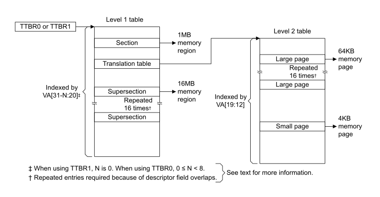

# ​G5.4 The VMSAv8-32 Short-descriptor translation table format

Source: <https://developer.arm.com/documentation/ddi0487/mc/-Part-G-The-AArch32-System-Level-Architecture/-Chapter-G5-The-AArch32-Virtual-Memory-System-Architecture/-G5-4-The-VMSAv8-32-Short-descriptor-translation-table-format>

#### G5.4 The VMSAv8-32 Short-descriptor translation table format

The Short-descriptor translation table format supports a memory map based on memory sections or pages:

Supersections
:   Consist of 16MB blocks of memory. Support for Supersections is optional, except that an implementation that supports more than 32 bits of PA must also support Supersections to provide access to the entire PA space.

Sections
:   Consist of 1MB blocks of memory.

Large pages
:   Consist of 64KB blocks of memory.

Small pages
:   Consist of 4KB blocks of memory.

Supersections, Sections, and Large pages map large regions of memory using only a single TLB entry.

> #### Note
>
> - Whether a VMSAv8-32 implementation of the Short-descriptor format translation tables supports supersections is IMPLEMENTATION DEFINED.
> - The EL2 translation regime cannot use the Short-descriptor translation table format.

When using the Short-descriptor translation table format, two levels of translation tables are held in memory:

Level 1 table
:   Holds *level 1 descriptors* that contain the base address and

    - Translation properties for a Section and Supersection.
    - Translation properties and pointers to a level 2 table for a Large page or a Small page.

Level 2 tables
:   Hold *level 2 descriptors* that contain the base address and translation properties for a Small page or a Large page. With the Short-descriptor format, level 2 tables can be referred to as *translation tables*.

    A level 2 table requires 1KB of memory.

In the translation tables, in general, a descriptor is one of:

- An invalid or fault entry.
- A translation table entry, that points to a next-level translation table.
- A page or section entry, that defines the memory properties for the access.
- A reserved format.

Bits[1:0] of the descriptor give the primary indication of the descriptor type.

[Figure G5-3](/documentation/ddi0487/mc/-Part-G-The-AArch32-System-Level-Architecture/-Chapter-G5-The-AArch32-Virtual-Memory-System-Architecture/-G5-4-The-VMSAv8-32-Short-descriptor-translation-table-format?lang=en#fig_beiciade) gives a general view of address translation when using the Short-descriptor translation table format.

Figure G5-3 General view of address translation using VMSAv8-32 Short-descriptor format translation tables

[Additional requirements for Short-descriptor format translation tables](/documentation/ddi0487/mc/-Part-G-The-AArch32-System-Level-Architecture/-Chapter-G5-The-AArch32-Virtual-Memory-System-Architecture/-G5-4-The-VMSAv8-32-Short-descriptor-translation-table-format/-G5-4-1-VMSAv8-32-Short-descriptor-Translation-Table-format-descriptors?lang=en#cbhdajaf) describes why, when using the Short-descriptor format, Supersection and Large page entries must be repeated 16 times, as shown in [Figure G5-3](/documentation/ddi0487/mc/-Part-G-The-AArch32-System-Level-Architecture/-Chapter-G5-The-AArch32-Virtual-Memory-System-Architecture/-G5-4-The-VMSAv8-32-Short-descriptor-translation-table-format?lang=en#fig_beiciade).

[VMSAv8-32 Short-descriptor Translation Table format descriptors](/documentation/ddi0487/mc/-Part-G-The-AArch32-System-Level-Architecture/-Chapter-G5-The-AArch32-Virtual-Memory-System-Architecture/-G5-4-The-VMSAv8-32-Short-descriptor-translation-table-format/-G5-4-1-VMSAv8-32-Short-descriptor-Translation-Table-format-descriptors?lang=en#cacbacgh), [Memory attributes in the VMSAv8-32 Short-descriptor Translation Table format descriptors](/documentation/ddi0487/mc/-Part-G-The-AArch32-System-Level-Architecture/-Chapter-G5-The-AArch32-Virtual-Memory-System-Architecture/-G5-4-The-VMSAv8-32-Short-descriptor-translation-table-format/-G5-4-2-Memory-attributes-in-the-VMSAv8-32-Short-descriptor-Translation-Table-format-descriptors?lang=en#beiebabj), and [Control of Secure or Non-secure memory access, VMSAv8-32 Short-descriptor format](/documentation/ddi0487/mc/-Part-G-The-AArch32-System-Level-Architecture/-Chapter-G5-The-AArch32-Virtual-Memory-System-Architecture/-G5-4-The-VMSAv8-32-Short-descriptor-translation-table-format/-G5-4-3-Control-of-Secure-or-Non-secure-memory-access--VMSAv8-32-Short-descriptor-format?lang=en#beibadic) describe the format of the descriptors in the Short-descriptor format translation tables.

The following sections then describe the use of this translation table format:

- [Selecting between TTBR0 and TTBR1, VMSAv8-32 Short-descriptor translation table format](/documentation/ddi0487/mc/-Part-G-The-AArch32-System-Level-Architecture/-Chapter-G5-The-AArch32-Virtual-Memory-System-Architecture/-G5-4-The-VMSAv8-32-Short-descriptor-translation-table-format/-G5-4-4-Selecting-between-TTBR0-and-TTBR1--VMSAv8-32-Short-descriptor-translation-table-format?lang=en#beicfhei).
- [Translation table walks, when using the VMSAv8-32 Short-descriptor translation table format](/documentation/ddi0487/mc/-Part-G-The-AArch32-System-Level-Architecture/-Chapter-G5-The-AArch32-Virtual-Memory-System-Architecture/-G5-4-The-VMSAv8-32-Short-descriptor-translation-table-format/-G5-4-5-Translation-table-walks--when-using-the-VMSAv8-32-Short-descriptor-translation-table-format?lang=en#beigdfbe).
