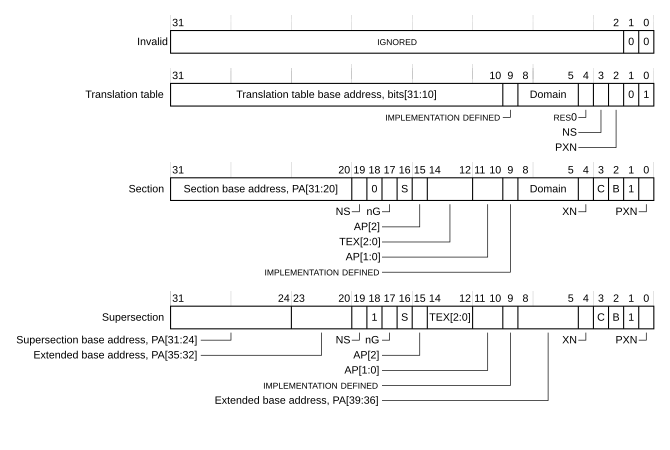

# ​G5.4.1 VMSAv8-32 Short-descriptor Translation Table format descriptors

Source: <https://developer.arm.com/documentation/ddi0487/mc/-Part-G-The-AArch32-System-Level-Architecture/-Chapter-G5-The-AArch32-Virtual-Memory-System-Architecture/-G5-4-The-VMSAv8-32-Short-descriptor-translation-table-format/-G5-4-1-VMSAv8-32-Short-descriptor-Translation-Table-format-descriptors>

##### G5.4.1 VMSAv8-32 Short-descriptor Translation Table format descriptors

The following sections describe the formats of the entries in the Short-descriptor Translation Tables:

- [Short-descriptor Translation Table level 1 descriptor formats](/documentation/ddi0487/mc/-Part-G-The-AArch32-System-Level-Architecture/-Chapter-G5-The-AArch32-Virtual-Memory-System-Architecture/-G5-4-The-VMSAv8-32-Short-descriptor-translation-table-format/-G5-4-1-VMSAv8-32-Short-descriptor-Translation-Table-format-descriptors?lang=en#beidigfb).
- [Short-descriptor Translation Table level 2 descriptor formats](/documentation/ddi0487/mc/-Part-G-The-AArch32-System-Level-Architecture/-Chapter-G5-The-AArch32-Virtual-Memory-System-Architecture/-G5-4-The-VMSAv8-32-Short-descriptor-translation-table-format/-G5-4-1-VMSAv8-32-Short-descriptor-Translation-Table-format-descriptors?lang=en#cbhhddgg).

For more information about level 2 translation tables, see [Additional requirements for Short-descriptor format translation tables](/documentation/ddi0487/mc/-Part-G-The-AArch32-System-Level-Architecture/-Chapter-G5-The-AArch32-Virtual-Memory-System-Architecture/-G5-4-The-VMSAv8-32-Short-descriptor-translation-table-format/-G5-4-1-VMSAv8-32-Short-descriptor-Translation-Table-format-descriptors?lang=en#cbhdajaf).

> #### Note
>
> Previous versions of the *Arm Architecture Reference Manual*, and some other documentation, describes the AP[2] bit in the translation table entries as the APX bit.

[Information returned by a translation table lookup](/documentation/ddi0487/mc/-Part-G-The-AArch32-System-Level-Architecture/-Chapter-G5-The-AArch32-Virtual-Memory-System-Architecture/-G5-3-Translation-tables/-G5-3-2-Information-returned-by-a-translation-table-lookup?lang=en#beibeddj) describes the classification of the non-address fields in the descriptors as address map control, access control, or attribute fields.

###### G5.4.1.1 Short-descriptor Translation Table level 1 descriptor formats

Each entry in the level 1 table describes the mapping of the associated 1MB VA range.

[Figure G5-4](/documentation/ddi0487/mc/-Part-G-The-AArch32-System-Level-Architecture/-Chapter-G5-The-AArch32-Virtual-Memory-System-Architecture/-G5-4-The-VMSAv8-32-Short-descriptor-translation-table-format/-G5-4-1-VMSAv8-32-Short-descriptor-Translation-Table-format-descriptors?lang=en#fig_beibjfce) shows the possible level 1 descriptor formats.

Figure G5-4 VMSAv8-32 Short-descriptor level 1 descriptor formats

Descriptor bits[1:0] identify the descriptor type. The encoding of these bits is:

`0b00`, Invalid entry
:   The associated VA is unmapped, and any attempt to access it generates a Translation fault.

    Bits[31:2] of the descriptor are IGNORED, see [IGNORED](/documentation/ddi0487/mc/-Part-K-Appendixes/Glossary?lang=en#cbaehfib). This means software can use these bits for its own purposes.

`0b01`, Translation table
:   The descriptor gives the address of a level 2 translation table, that specifies the mapping of the associated 1MByte VA range.

`0b10`, Section or Supersection
:   The descriptor gives the base address of the Section or Supersection. Bit[18] determines whether the entry describes a Section or a Supersection.

    This encoding also defines the PXN field as 0.

`0b11`, Section or Supersection, if the implementation supports the PXN attribute
:   This encoding is identical to `0b10`, except that it defines the PXN field as 1.

> #### Note
>
> A VMSAv8-32 implementation can use the Short-descriptor translation table format for the PL1&0 stage 1 translations, by setting [TTBCR](/documentation/ddi0487/mc/-Part-G-The-AArch32-System-Level-Architecture/-Chapter-G8-AArch32-System-Register-Descriptions/-G8-2-General-system-control-registers/-G8-2-165-TTBCR--Translation-Table-Base-Control-Register?lang=en#reg_aarch32_ttbcr).EAE to 0.

The address information in the level 1 descriptors is:

Translation table
:   Bits[31:10] of the descriptor are bits[31:10] of the address of a translation table.

Section
:   Bits[31:20] of the descriptor are bits[31:20] of the address of the Section.

Supersection
:   Bits[31:24] of the descriptor are bits[31:24] of the address of the Supersection.

    Optionally, bits[8:5, 23:20] of the descriptor are bits[39:32] of the extended Supersection address.

For the Non-secure PL1&0 translation tables, the address in the descriptor is the IPA of the translation table, Section, or Supersection. Otherwise, the address is the PA of the translation table, Section, or Supersection.

For descriptions of the other fields in the descriptors, see [Memory attributes in the VMSAv8-32 Short-descriptor Translation Table format descriptors](/documentation/ddi0487/mc/-Part-G-The-AArch32-System-Level-Architecture/-Chapter-G5-The-AArch32-Virtual-Memory-System-Architecture/-G5-4-The-VMSAv8-32-Short-descriptor-translation-table-format/-G5-4-2-Memory-attributes-in-the-VMSAv8-32-Short-descriptor-Translation-Table-format-descriptors?lang=en#beiebabj).

###### G5.4.1.2 Short-descriptor Translation Table level 2 descriptor formats

[Figure G5-5](/documentation/ddi0487/mc/-Part-G-The-AArch32-System-Level-Architecture/-Chapter-G5-The-AArch32-Virtual-Memory-System-Architecture/-G5-4-The-VMSAv8-32-Short-descriptor-translation-table-format/-G5-4-1-VMSAv8-32-Short-descriptor-Translation-Table-format-descriptors?lang=en#fig_beidfdef) shows the possible formats of a level 2 descriptor.

Figure G5-5 Short-descriptor level 2 descriptor formats

Descriptor bits[1:0] identify the descriptor type. The encoding of these bits is:

`0b00`, Invalid entry
:   The associated VA is unmapped, and attempting to access it generates a Translation fault.

    Bits[31:2] of the descriptor are IGNORED, see [IGNORED](/documentation/ddi0487/mc/-Part-K-Appendixes/Glossary?lang=en#cbaehfib). This means software can use these bits for its own purposes.

`0b01`, Large page
:   The descriptor gives the base address and properties of the Large page.

`0b1x`, Small page
:   The descriptor gives the base address and properties of the Small page.

    In this descriptor format, bit[0] of the descriptor is the XN field.

The address information in the level 2 descriptors is:

Large page
:   Bits[31:16] of the descriptor are bits[31:16] of the address of the Large page.

Small page
:   Bits[31:12] of the descriptor are bits[31:12] of the address of the Small page.

For the Non-secure PL1&0 translation tables, the address in the descriptor is the IPA of the translation table, Section, or Supersection. Otherwise, the address is the PA of the translation table, Section, or Supersection.

For descriptions of the other fields in the descriptors, see [Memory attributes in the VMSAv8-32 Short-descriptor Translation Table format descriptors](/documentation/ddi0487/mc/-Part-G-The-AArch32-System-Level-Architecture/-Chapter-G5-The-AArch32-Virtual-Memory-System-Architecture/-G5-4-The-VMSAv8-32-Short-descriptor-translation-table-format/-G5-4-2-Memory-attributes-in-the-VMSAv8-32-Short-descriptor-Translation-Table-format-descriptors?lang=en#beiebabj).

###### G5.4.1.3 Additional requirements for Short-descriptor format translation tables

When using Supersection or Large Page descriptors in the Short-descriptor translation table format, the input address field that defines the Supersection or Large Page descriptor address overlaps the table address field. In each case, the size of the overlap is 4 bits. The following diagrams show these overlaps:

- [Figure K8-14](/documentation/ddi0487/mc/-Part-K-Appendixes/-Appendix-K8-Address-Translation-Examples/-K8-2-AArch32-Address-translation-examples/-K8-2-1-Address-translation-examples-using-the-VMSAv8-32-Short-descriptor-translation-table-format?lang=en#fig_cbhcifbf) for the level 1 translation table entry for a Supersection.
- [Figure K8-16](/documentation/ddi0487/mc/-Part-K-Appendixes/-Appendix-K8-Address-Translation-Examples/-K8-2-AArch32-Address-translation-examples/-K8-2-1-Address-translation-examples-using-the-VMSAv8-32-Short-descriptor-translation-table-format?lang=en#fig_cacdabgb) for the level 2 translation table entry for a Large page.

Considering the case of using Large Page descriptors in a level 2 translation table, this overlap means that for any specific Large page, the bottom four bits of the level 2 translation table entry might take any value from `0b0000` to `0b1111`. Therefore, each of these 16 index values must point to a separate copy of the same descriptor.

This means that each Large page or Supersection descriptor must:

- Occur first on a sixteen-word boundary.
- Be repeated in 16 consecutive memory locations.
