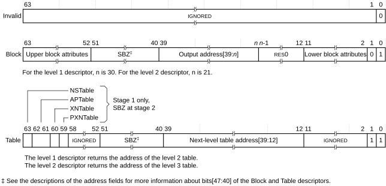
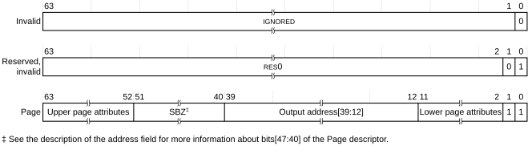

# ​G5.5.2 VMSAv8-32 Long-descriptor Translation Table format descriptors

Source: <https://developer.arm.com/documentation/ddi0487/mc/-Part-G-The-AArch32-System-Level-Architecture/-Chapter-G5-The-AArch32-Virtual-Memory-System-Architecture/-G5-5-The-VMSAv8-32-Long-descriptor-translation-table-format/-G5-5-2-VMSAv8-32-Long-descriptor-Translation-Table-format-descriptors>

##### G5.5.2 VMSAv8-32 Long-descriptor Translation Table format descriptors

As described in [VMSAv8-32 Long-descriptor translation table format address lookup levels](/documentation/ddi0487/mc/-Part-G-The-AArch32-System-Level-Architecture/-Chapter-G5-The-AArch32-Virtual-Memory-System-Architecture/-G5-5-The-VMSAv8-32-Long-descriptor-translation-table-format/-G5-5-6-VMSAv8-32-Long-descriptor-translation-table-format-address-lookup-levels?lang=en#beieaejg), the Long-descriptor translation table format provides up to three levels of address lookup. A translation table walk starts either at level 1 or level 2 of the address lookup.

In general, a descriptor is one of:

- An invalid or fault entry.
- A table entry, that points to the next-level translation table.
- A block entry, that defines the memory properties for the access.
- A reserved format.

Bit[1] of the descriptor indicates the descriptor type, and bit[0] indicates whether the descriptor is valid.

The following sections describe the Long-descriptor Translation Table descriptor formats:

- [VMSAv8-32 Long-descriptor level 1 and level 2 descriptor formats](/documentation/ddi0487/mc/-Part-G-The-AArch32-System-Level-Architecture/-Chapter-G5-The-AArch32-Virtual-Memory-System-Architecture/-G5-5-The-VMSAv8-32-Long-descriptor-translation-table-format/-G5-5-2-VMSAv8-32-Long-descriptor-Translation-Table-format-descriptors?lang=en#chddebif).
- [VMSAv8-32 Long-descriptor translation table level 3 descriptor formats](/documentation/ddi0487/mc/-Part-G-The-AArch32-System-Level-Architecture/-Chapter-G5-The-AArch32-Virtual-Memory-System-Architecture/-G5-5-The-VMSAv8-32-Long-descriptor-translation-table-format/-G5-5-2-VMSAv8-32-Long-descriptor-Translation-Table-format-descriptors?lang=en#chdfchih).

[Information returned by a translation table lookup](/documentation/ddi0487/mc/-Part-G-The-AArch32-System-Level-Architecture/-Chapter-G5-The-AArch32-Virtual-Memory-System-Architecture/-G5-3-Translation-tables/-G5-3-2-Information-returned-by-a-translation-table-lookup?lang=en#beibeddj) describes the classification of the non-address fields in the descriptors between *address map control*, *access controls*, and *region attributes*.

###### G5.5.2.1 VMSAv8-32 Long-descriptor level 1 and level 2 descriptor formats

In the Long-descriptor translation tables, the formats of the level 1 and level 2 descriptors differ only in the size of the block of memory addressed by the Block descriptor. A block entry:

- In a level 1 table describes the mapping of the associated 1GB input address range.
- In a level 2 table describes the mapping of the associated 2MB input address range.

[Figure G5-10](/documentation/ddi0487/mc/-Part-G-The-AArch32-System-Level-Architecture/-Chapter-G5-The-AArch32-Virtual-Memory-System-Architecture/-G5-5-The-VMSAv8-32-Long-descriptor-translation-table-format/-G5-5-2-VMSAv8-32-Long-descriptor-Translation-Table-format-descriptors?lang=en#fig_chdjbacf) shows the Long-descriptor level 1 and level 2 descriptor formats:

Figure G5-10 VMSAv8-32 Long-descriptor level 1and level 2 descriptor formats

**G5.5.2.1.1 Descriptor encodings, Long-descriptor level 1 and level 2 formats**

Descriptor bit[0] identifies whether the descriptor is valid, and is 1 for a valid descriptor. If a lookup returns an invalid descriptor, the associated input address is unmapped, and any attempt to access it generates a Translation fault.

Descriptor bit[1] identifies the descriptor type, and is encoded as:

0, Block
:   The descriptor gives the base address of a block of memory, and the attributes for that memory region.

1, Table
:   The descriptor gives the address of the next level of translation table, and for a stage 1 translation, some attributes for that translation.

The other fields in the valid descriptors are:

Block descriptor
:   Gives the base address and attributes of a block of memory:

    - For a level 1 Block descriptor, bits[39:30] are bits[39:30] of the output address that specifies a 1GB block of memory.
    - For a level 2 Block descriptor, bits[39:21] are bits[39:21] of the output address that specifies a 2MB block of memory.

    In both cases, if bits[47:40] of the descriptor are not zero then a translation that uses the descriptor will generate an Address size fault, see [Address size fault](/documentation/ddi0487/mc/-Part-G-The-AArch32-System-Level-Architecture/-Chapter-G5-The-AArch32-Virtual-Memory-System-Architecture/-G5-11-VMSAv8-32-memory-aborts/-G5-11-1-Types-of-MMU-faults?lang=en#chdefhib).

    Bits[63:52, 11:2] provide attributes for the target memory block, see [Attribute fields in VMSAv8-32 Long-descriptor translation table format descriptors](/documentation/ddi0487/mc/-Part-G-The-AArch32-System-Level-Architecture/-Chapter-G5-The-AArch32-Virtual-Memory-System-Architecture/-G5-5-The-VMSAv8-32-Long-descriptor-translation-table-format/-G5-5-3-Attribute-fields-in-VMSAv8-32-Long-descriptor-translation-table-format-descriptors?lang=en#chdiegac). The position and contents of these bits is identical in the level 2 Block descriptor and in the level 3 Page descriptor.

Table descriptor
:   Bits[39:m] are bits[39:m] of the address of the required next-level table. Bits[m-1:0] of the table address are zero:

    - For a level 1 Table descriptor, this is the address of a level 2 table.
    - For a level 2 Table descriptor, this is the address of a level 3 table.

    In both cases, if bits[47:40] of the descriptor are not zero then a translation that uses the descriptor will generate an Address size fault, see [Address size fault](/documentation/ddi0487/mc/-Part-G-The-AArch32-System-Level-Architecture/-Chapter-G5-The-AArch32-Virtual-Memory-System-Architecture/-G5-11-VMSAv8-32-memory-aborts/-G5-11-1-Types-of-MMU-faults?lang=en#chdefhib).

    For a stage 1 translation only, bits[63:59] provide attributes for the next-level lookup, see [Attribute fields in VMSAv8-32 Long-descriptor translation table format descriptors](/documentation/ddi0487/mc/-Part-G-The-AArch32-System-Level-Architecture/-Chapter-G5-The-AArch32-Virtual-Memory-System-Architecture/-G5-5-The-VMSAv8-32-Long-descriptor-translation-table-format/-G5-5-3-Attribute-fields-in-VMSAv8-32-Long-descriptor-translation-table-format-descriptors?lang=en#chdiegac).

If the translation table defines the Non-secure PL1&0 stage 1 translations, then the output address in the descriptor is the IPA of the target block or table. Otherwise, it is the PA of the target block or table.

###### G5.5.2.2 VMSAv8-32 Long-descriptor translation table level 3 descriptor formats

Each entry in a level 3 table describes the mapping of the associated 4KB input address range.

[Figure G5-11](/documentation/ddi0487/mc/-Part-G-The-AArch32-System-Level-Architecture/-Chapter-G5-The-AArch32-Virtual-Memory-System-Architecture/-G5-5-The-VMSAv8-32-Long-descriptor-translation-table-format/-G5-5-2-VMSAv8-32-Long-descriptor-Translation-Table-format-descriptors?lang=en#fig_chdhjihg) shows the Long-descriptor level 3 descriptor formats.

Figure G5-11 VMSAv8-32 Long-descriptor level 3 descriptor formats

Descriptor bit[0] identifies whether the descriptor is valid, and is 1 for a valid descriptor. If a lookup returns an invalid descriptor, the associated input address is unmapped, and any attempt to access it generates a Translation fault.

Descriptor bit[1] identifies the descriptor type, and is encoded as:

0, Reserved, invalid
:   Behaves identically to encodings with bit[0] set to 0.

    This encoding must not be used in level 3 translation tables.

1, Page
:   Gives the address and attributes of a 4KB page of memory.

At this level, the only valid format is the Page descriptor. The other fields in the Page descriptor are:

Page descriptor
:   Bits[39:12] are bits[39:12] of the output address for a page of memory.

    If bits[47:40] of the descriptor are not zero, then a translation that uses the descriptor will generate an Address size fault, see [Address size fault](/documentation/ddi0487/mc/-Part-G-The-AArch32-System-Level-Architecture/-Chapter-G5-The-AArch32-Virtual-Memory-System-Architecture/-G5-11-VMSAv8-32-memory-aborts/-G5-11-1-Types-of-MMU-faults?lang=en#chdefhib).

    Bits[63:52, 11:2] provide attributes for the target memory page, see [Attribute fields in VMSAv8-32 Long-descriptor translation table format descriptors](/documentation/ddi0487/mc/-Part-G-The-AArch32-System-Level-Architecture/-Chapter-G5-The-AArch32-Virtual-Memory-System-Architecture/-G5-5-The-VMSAv8-32-Long-descriptor-translation-table-format/-G5-5-3-Attribute-fields-in-VMSAv8-32-Long-descriptor-translation-table-format-descriptors?lang=en#chdiegac). The position and contents of these bits are identical in the level 1 Block descriptor and in the level 2 Block descriptor.

If the translation table defines the Non-secure PL1&0 stage 1 translations, then the output address in the descriptor is the IPA of the target page. Otherwise, it is the PA of the target page.
